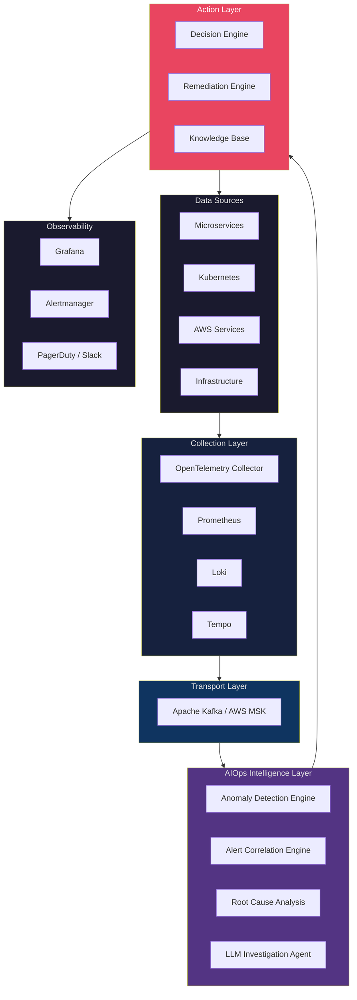
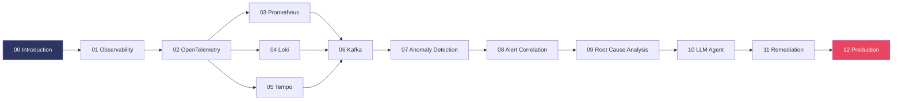
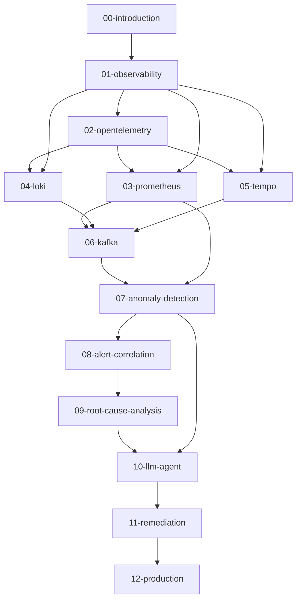

# AIOps Engineering Handbook

> **A production-grade reference for building Autonomous Intelligent Operations platforms on AWS, Kubernetes, and Cloud Native infrastructure.**

[](.)
[](LICENSE)
[](.)

---

## What Is This Handbook?

This handbook documents the **complete architecture, design decisions, algorithms, operational practices, and production lessons** for building an AIOps platform from first principles.

It is written at the **Principal Engineer / Staff SRE** level. It assumes:

- You are comfortable with distributed systems
- You understand Kubernetes and container orchestration
- You have operational AWS experience
- You want to understand **why**, not just **how**

Each chapter covers: **Why → What → How → Trade-offs → Production Best Practices → Common Mistakes → Monitoring → Scaling → Security → Cost → Improvement**.

---

## Architecture Overview



---

## Learning Roadmap



---

## Table of Contents

### 📖 Foundation

| # | Document | Description | Status |
|---|----------|-------------|--------|
| 00 | [Introduction](docs/00-introduction.md) | AIOps philosophy, ROI, maturity model | ✅ Done |
| 01 | [Observability](docs/01-observability/README.md) | Three Pillars, Metric types, Logs, Traces, SLO/SLA, Cardinality | ✅ Done |

### 📡 Telemetry Stack

| # | Document | Description | Status |
|---|----------|-------------|--------|
| 02 | [OpenTelemetry](docs/02-opentelemetry/README.md) | OTLP protocol, Collector architecture, all receivers/processors/exporters | ✅ Done |
| 03 | [Prometheus](docs/03-prometheus/README.md) | TSDB internals, PromQL, HA, Thanos, CloudWatch vs VictoriaMetrics | ✅ Done |
| 04 | [Loki](docs/04-loki/README.md) | Architecture, LogQL deep-dive, S3 backend, ELK comparison, cost | ✅ Done |
| 05 | [Tempo](docs/05-tempo/README.md) | Parquet storage, TraceQL, SpanMetrics, Jaeger/X-Ray comparison | ✅ Done |

### 🚌 Transport Layer

| # | Document | Description | Status |
|---|----------|-------------|--------|
| 06 | [Kafka / Kinesis](docs/06-kafka/README.md) | Producer/consumer, EOS, MSK, Kinesis vs Kafka, DLQ, Schema Registry | ✅ Done |

### 🧠 Intelligence Layer

| # | Document | Description | Status |
|---|----------|-------------|--------|
| 07 | [Anomaly Detection](docs/07-anomaly-detection/README.md) | 12 algorithms: EWMA→STL→IF→LSTM→Transformer→Drain→DeepLog, ensemble, production | ✅ Done |
| 08 | [Alert Correlation](docs/08-alert-correlation/README.md) | 5-stage pipeline, topology correlation, temporal cross-correlation, semantic similarity | ✅ Done |
| 09 | [Root Cause Analysis](docs/09-root-cause-analysis/README.md) | Topology traversal, PC algorithm, Bayesian network, GNN (MicroRCA), trace+log analysis | ✅ Done |
| 10 | [LLM Investigation Agent](docs/10-llm-agent/README.md) | RAG, LangGraph/ReAct, tool use, SRE prompting, safety gates, HITL, cost analysis | ✅ Done |

### ⚙️ Action Layer

| # | Document | Description | Status |
|---|----------|-------------|--------|
| 11 | [Automated Remediation](docs/11-remediation/README.md) | Action catalog (Tier 1-3), K8s executor, SSM, canary rollout, safety gates, audit log | ✅ Done |

### 🏭 Production

| # | Document | Description | Status |
|---|----------|-------------|--------|
| 12 | [Production Operations](docs/12-production/README.md) | HA, DR, chaos engineering, cost governance (~$9,364/month), security, 49x ROI analysis | ✅ Done |

---

## Document Dependency Graph



---

## Repository Progress

```
Foundation          ████████████████████  100% (2/2)   ✅
Telemetry Stack     ████████████████████  100% (4/4)   ✅
Transport Layer     ████████████████████  100% (1/1)   ✅
Intelligence Layer  ████████████████████  100% (4/4)   ✅
Action Layer        ████████████████████  100% (1/1)   ✅
Production          ████████████████████  100% (1/1)   ✅

Overall Progress    ████████████████████  100% (13/13 chapters)  🎉 COMPLETE
```

---

## How to Use This Handbook

### If you are a **DevOps/SRE Engineer**
Start with [Observability](docs/01-observability/README.md) → [Prometheus](docs/03-prometheus/README.md) → [Kafka](docs/06-kafka/README.md) → [Remediation](docs/11-remediation/README.md)

### If you are a **Platform Engineer**
Start with [OpenTelemetry](docs/02-opentelemetry/README.md) → [Prometheus](docs/03-prometheus/README.md) → [Loki](docs/04-loki/README.md) → [Tempo](docs/05-tempo/README.md)

### If you are an **ML Engineer**
Start with [Anomaly Detection](docs/07-anomaly-detection/README.md) → [Alert Correlation](docs/08-alert-correlation/README.md) → [RCA](docs/09-root-cause-analysis/README.md) → [LLM Agent](docs/10-llm-agent/README.md)

### If you are a **Cloud Architect**
Start with [Introduction](docs/00-introduction.md) → [Production](docs/12-production/README.md) → [Kafka/MSK](docs/06-kafka/README.md)

---

## Tech Stack Reference

| Layer | Primary | Alternative | AWS Managed |
|-------|---------|-------------|-------------|
| Metrics | Prometheus | VictoriaMetrics | CloudWatch |
| Logs | Loki | ELK Stack | CloudWatch Logs |
| Traces | Tempo | Jaeger | AWS X-Ray |
| Collection | OpenTelemetry Collector | Fluent Bit | FireLens |
| Streaming | Apache Kafka | Redis Streams | AWS Kinesis / MSK |
| Storage | S3 + Parquet | Thanos | S3 |
| ML Inference | Python (scikit-learn) | TorchServe | SageMaker |
| LLM | Claude / GPT-4 | Llama 3 (self-hosted) | Amazon Bedrock |
| Remediation | AWS SSM Automation | Rundeck | SSM / Lambda |
| Visualization | Grafana | Kibana | CloudWatch Dashboards |
| Alerting | Alertmanager | Grafana Alerting | CloudWatch Alarms |

---

## Contributing

This is an evolving document. Each chapter follows the same quality bar:
- **Technical Accuracy**: Verified against production deployments
- **Depth**: Principal Engineer level, no hand-waving
- **Trade-offs**: Every architectural decision is justified
- **Production-Ready**: Includes failure modes, monitoring, scaling


