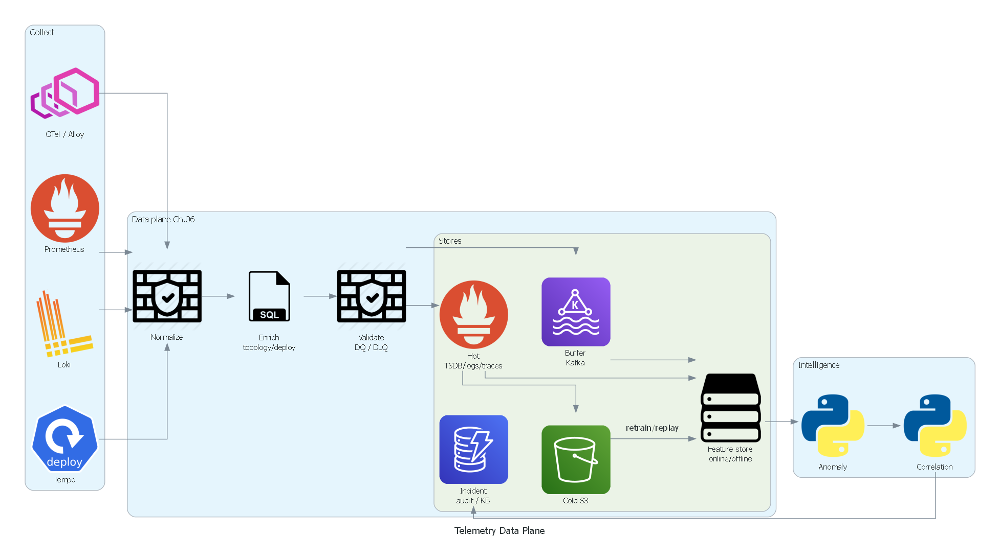
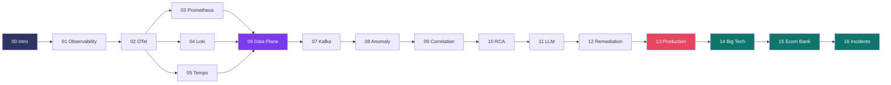
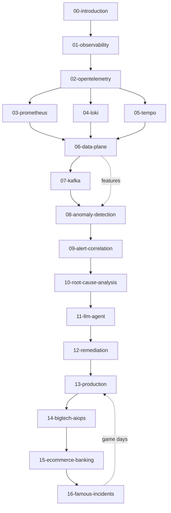

# Cẩm nang Kỹ thuật AIOps (AIOps Engineering Handbook)

> **Tài liệu tham chiếu chuẩn sản xuất (production-grade) để xây dựng các nền tảng Vận hành Thông minh Tự động (Autonomous Intelligent Operations) trên AWS, Kubernetes và hạ tầng Cloud Native.**

| | |
|---|---|
| **Languages** | Tiếng Việt (`docs/vi/`) · English (`docs/en/`) |
| **Chapters** | 17 per language (Foundation → Case Studies) |
| **Level** | Staff / Principal SRE |
| **Repo** | [github.com/XUanhoa04/aiops-engineering-handbook](https://github.com/XUanhoa04/aiops-engineering-handbook) |
| **VI content** | [docs/vi/](docs/vi/) |
| **EN content** | [docs/en/](docs/en/) — full translation of the Vietnamese edition |

---

## Handbook này là gì?

Tài liệu ghi nhận **kiến trúc, quyết định thiết kế, thuật toán, thực tiễn vận hành và bài học production** để xây dựng nền tảng AIOps từ nguyên lý cơ bản.

Viết ở cấp độ **Principal Engineer / Staff SRE**. Giả định:

- Bạn quen hệ thống phân tán
- Bạn hiểu Kubernetes và container orchestration
- Bạn có kinh nghiệm vận hành AWS / cloud native
- Bạn muốn hiểu **tại sao (why)**, không chỉ **làm thế nào (how)**

Mỗi chương theo khung: **Why → What → How → Trade-offs → Edge Cases → Problem-Solving → Production Practices → Common Mistakes → Monitoring → Scaling → Security → Cost → Improvement**.

Trọng tâm bản này: **tư duy vận hành** — mental models, decision trees, edge case production, case study Big Tech / e-commerce / banking, và postmortem sự cố công khai. Mục tiêu không chỉ “chạy được code”, mà hiểu **vì sao pipeline AIOps được thiết kế như vậy** và **khi nào nó thất bại**.

---

## Architecture Overview

> Poster-style architecture (PNG). Detail flows inside chapters still use Mermaid where logic/sequence matters. More posters: [`docs/assets/diagrams/`](docs/assets/diagrams/).

**Layers:** Collect (OTel / Prometheus / Loki / Tempo) → **Data plane** (normalize · enrich · validate · hot/warm/cold · feature store) → Transport (Kafka / MSK) → Intelligence (anomaly → correlation → RCA → LLM) → Action (decision · remediation · notify) → Grafana / audit.

---

## Learning Roadmap

**Lộ trình tư duy (khuyến nghị):**

1. **Nền tảng** (00–01): alert fatigue, OODA, SLO, observability trước AI  
2. **Collect** (02–05): OTel, Prometheus, Loki, Tempo  
3. **Data plane** (06): normalize → enrich → validate → store/retention → feature store (**khi nào cần**)  
4. **Transport** (07): Kafka/MSK, schema, replay  
5. **Intelligence** (08–11): detect → correlate → RCA → LLM  
6. **Action + Production** (12–13): remediation an toàn, dogfood, DR  
7. **Case study** (14–16): Big Tech, e-com/bank, famous incidents  

---

## Table of contents (dual language)

**17 chapters** per language (VI + EN).

### 📖 Foundation

| # | Tiếng Việt | English | Topic |
|---|------------|---------|--------|
| 00 | [Introduction](docs/vi/00-introduction.vi.md) | [Introduction](docs/en/00-introduction.md) | AIOps philosophy, OODA, ROI, maturity |
| 01 | [Observability](docs/vi/01-observability/README.vi.md) | [Observability](docs/en/01-observability/README.md) | 3 pillars, SLO, cardinality |

### 📡 Collect

| # | Tiếng Việt | English | Topic |
|---|------------|---------|--------|
| 02 | [OpenTelemetry](docs/vi/02-opentelemetry/README.vi.md) | [OpenTelemetry](docs/en/02-opentelemetry/README.md) | OTLP, Collector, processors |
| 03 | [Prometheus](docs/vi/03-prometheus/README.vi.md) | [Prometheus](docs/en/03-prometheus/README.md) | Pull model, Thanos |
| 04 | [Loki](docs/vi/04-loki/README.vi.md) | [Loki](docs/en/04-loki/README.md) | Labels, LogQL, retention chunks |
| 05 | [Tempo](docs/vi/05-tempo/README.vi.md) | [Tempo](docs/en/05-tempo/README.md) | Sampling, trace RCA |

### 🧬 Data plane (mới — sau thu thập)

| # | Tiếng Việt | English | Topic |
|---|------------|---------|--------|
| 06 | [Telemetry Data Plane](docs/vi/06-data-plane/README.vi.md) | [Telemetry Data Plane](docs/en/06-data-plane/README.md) | Normalize, enrich, validate, **storage/retention**, feature store, lifecycle |

### 🚌 Transport

| # | Tiếng Việt | English | Topic |
|---|------------|---------|--------|
| 07 | [Kafka / Kinesis](docs/vi/07-kafka/README.vi.md) | [Kafka / Kinesis](docs/en/07-kafka/README.md) | Bus, schema, lag, replay |

### 🧠 Intelligence

| # | Tiếng Việt | English | Topic |
|---|------------|---------|--------|
| 08 | [Anomaly Detection](docs/vi/08-anomaly-detection/README.vi.md) | [Anomaly Detection](docs/en/08-anomaly-detection/README.md) | Ensemble, drift, features |
| 09 | [Alert Correlation](docs/vi/09-alert-correlation/README.vi.md) | [Alert Correlation](docs/en/09-alert-correlation/README.md) | Dedup, topology, enrich alert |
| 10 | [Root Cause Analysis](docs/vi/10-root-cause-analysis/README.vi.md) | [Root Cause Analysis](docs/en/10-root-cause-analysis/README.md) | Causation, multi-root |
| 11 | [LLM Investigation Agent](docs/vi/11-llm-agent/README.vi.md) | [LLM Investigation Agent](docs/en/11-llm-agent/README.md) | RAG, tools, safety |

### ⚙️ Action + Production

| # | Tiếng Việt | English | Topic |
|---|------------|---------|--------|
| 12 | [Automated Remediation](docs/vi/12-remediation/README.vi.md) | [Automated Remediation](docs/en/12-remediation/README.md) | Gates, allow-list |
| 13 | [Production Operations](docs/vi/13-production/README.vi.md) | [Production Operations](docs/en/13-production/README.md) | HA/DR, cost, game days |

### 🌍 Case studies

| # | Tiếng Việt | English | Topic |
|---|------------|---------|--------|
| 14 | [Big Tech AIOps](docs/vi/14-bigtech-aiops/README.vi.md) | [Big Tech AIOps](docs/en/14-bigtech-aiops/README.md) | Google, Netflix, AWS, Meta, Uber |
| 15 | [E-commerce & Banking](docs/vi/15-ecommerce-banking/README.vi.md) | [E-commerce & Banking](docs/en/15-ecommerce-banking/README.md) | BFCM, PCI, money path |
| 16 | [Famous Incidents](docs/vi/16-famous-incidents/README.vi.md) | [Famous Incidents](docs/en/16-famous-incidents/README.md) | S3, DynamoDB DNS, Meta, Cloudflare |

---

## Document Dependency Graph

---

## How to use / Cách dùng

> For each section, answer three questions before continuing: (1) What real problem is this solving? (2) What is the trade-off? (3) Which edge case breaks this design?

Pick **[English](docs/en/)** or **[Tiếng Việt](docs/vi/)** — same chapter numbers.

### DevOps / SRE
EN: [Observability](docs/en/01-observability/README.md) → [Prometheus](docs/en/03-prometheus/README.md) → [Kafka](docs/en/07-kafka/README.md) → [Remediation](docs/en/12-remediation/README.md) → [Incidents](docs/en/16-famous-incidents/README.md)  
VI: [Observability](docs/vi/01-observability/README.vi.md) → … (same order under `docs/vi/`)

### Platform Engineer
EN: [OpenTelemetry](docs/en/02-opentelemetry/README.md) → [Prometheus](docs/en/03-prometheus/README.md) → [Loki](docs/en/04-loki/README.md) → [Tempo](docs/en/05-tempo/README.md) → [Production](docs/en/13-production/README.md)

### ML Engineer
EN: [Anomaly Detection](docs/en/08-anomaly-detection/README.md) → [Alert Correlation](docs/en/09-alert-correlation/README.md) → [RCA](docs/en/10-root-cause-analysis/README.md) → [LLM Agent](docs/en/11-llm-agent/README.md) → [Big Tech](docs/en/14-bigtech-aiops/README.md)

### Cloud Architect / Tech Lead
EN: [Introduction](docs/en/00-introduction.md) → [Production](docs/en/13-production/README.md) → [Big Tech](docs/en/14-bigtech-aiops/README.md) → [E-commerce & Banking](docs/en/15-ecommerce-banking/README.md)

### On-call / Incident Commander
EN: [Famous Incidents](docs/en/16-famous-incidents/README.md) → [Alert Correlation](docs/en/09-alert-correlation/README.md) → [RCA](docs/en/10-root-cause-analysis/README.md) → [Remediation](docs/en/12-remediation/README.md)

---

## Tech Stack Reference

| Lớp | Giải pháp chính | Thay thế | AWS Managed |
|-----|-----------------|----------|-------------|
| Metrics | Prometheus | VictoriaMetrics | CloudWatch |
| Logs | Loki | ELK Stack | CloudWatch Logs |
| Traces | Tempo | Jaeger | AWS X-Ray |
| Collection | OpenTelemetry Collector | Fluent Bit | FireLens |
| Streaming | Apache Kafka | Redis Streams | Kinesis / MSK |
| Storage | S3 + Parquet | Thanos | S3 |
| ML Inference | Python (scikit-learn) | TorchServe | SageMaker |
| LLM | Claude / GPT-4 | Llama 3 (self-host) | Amazon Bedrock |
| Remediation | AWS SSM Automation | Rundeck | SSM / Lambda |
| Visualization | Grafana | Kibana | CloudWatch Dashboards |
| Alerting | Alertmanager | Grafana Alerting | CloudWatch Alarms |

---

## Start here

| Path | Audience |
|------|----------|
| [docs/CURRICULUM.md](docs/CURRICULUM.md) | Full chapter map & pipeline order |
| [docs/vi/00-introduction.vi.md](docs/vi/00-introduction.vi.md) | Bắt đầu tiếng Việt |
| [docs/en/00-introduction.md](docs/en/00-introduction.md) | Start in English |
| [docs/vi/06-data-plane/README.vi.md](docs/vi/06-data-plane/README.vi.md) | Normalize / enrich / store / feature (**when to use**) |
| [docs/assets/diagrams/](docs/assets/diagrams/) | Architecture posters (PNG) |
| [CHANGELOG.md](CHANGELOG.md) | Version history |

---

## Contributing

Xem [CONTRIBUTING.md](CONTRIBUTING.md) · [CODE_OF_CONDUCT.md](CODE_OF_CONDUCT.md) · [SECURITY.md](SECURITY.md).

Mỗi chương nên đạt:

- **Độ chính xác kỹ thuật** — bám thực tiễn production / tài liệu public
- **Độ sâu** — cấp Staff/Principal, có trade-off rõ
- **When to use** — không chỉ “là gì”, mà **khi nào cần / không cần**
- **Edge cases** — khi thiết kế vỡ và cách phòng
- **Production-ready** — monitoring, scaling, security, cost

Issue / PR: [github.com/XUanhoa04/aiops-engineering-handbook](https://github.com/XUanhoa04/aiops-engineering-handbook)

---

## License

MIT License — xem [LICENSE](LICENSE).

---

## Maintainers

- **[@XUanhoa04](https://github.com/XUanhoa04)** — AIOps / SRE / Cloud Native handbook

---

## Release

Current: **v1.0.0** — dual-language complete curriculum (17 chapters) + data plane + architecture posters.
