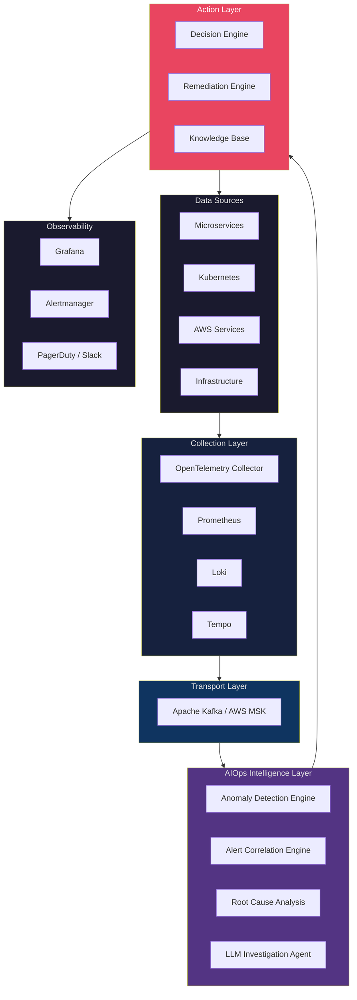
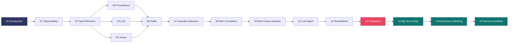
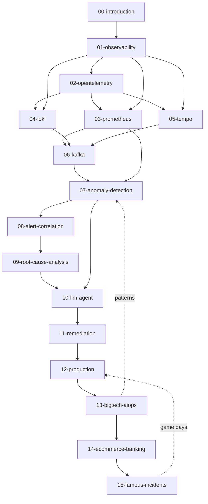

# Cẩm nang Kỹ thuật AIOps (AIOps Engineering Handbook)

> **Tài liệu tham chiếu chuẩn sản xuất (production-grade) để xây dựng các nền tảng Vận hành Thông minh Tự động (Autonomous Intelligent Operations) trên AWS, Kubernetes và hạ tầng Cloud Native.**

| | |
|---|---|
| **Ngôn ngữ** | Tiếng Việt |
| **Số chương** | 16 (Foundation → Case Studies) |
| **Cấp độ** | Staff / Principal SRE |
| **Repo** | [github.com/XUanhoa04/aiops-engineering-handbook](https://github.com/XUanhoa04/aiops-engineering-handbook) |
| **Nội dung** | `docs/vi/` |

---

## Handbook này là gì?

Tài liệu ghi nhận **kiến trúc, quyết định thiết kế, thuật toán, thực tiễn vận hành và bài học production** để xây dựng nền tảng AIOps từ nguyên lý cơ bản.

Viết ở cấp độ **Principal Engineer / Staff SRE**. Giả định:

- Bạn quen hệ thống phân tán
- Bạn hiểu Kubernetes và container orchestration
- Bạn có kinh nghiệm vận hành AWS / cloud native
- Bạn muốn hiểu **tại sao (why)**, không chỉ **làm thế nào (how)**

Mỗi chương theo khung: **Why → What → How → Trade-offs → Edge Cases → Problem-Solving → Production Practices → Common Mistakes → Monitoring → Scaling → Security → Cost → Improvement**.

Trọng tâm bản này: **tư duy vận hành** — mental models, decision trees, edge case production, case study Big Tech / e-commerce / banking, và postmortem sự cố công khai. Mục tiêu không chỉ “chạy được code”, mà hiểu **vì sao pipeline AIOps được thiết kế như vậy** và **khi nào nó thất bại**.

---

## Architecture Overview

---

## Learning Roadmap

**Lộ trình tư duy (khuyến nghị):**

1. **Nền tảng** (00–01): alert fatigue, OODA, SLO, observability trước AI  
2. **Telemetry** (02–06): thu thập đúng → transport bền; cardinality, lag, sampling  
3. **Intelligence** (07–10): detect → correlate → RCA → LLM; hỏi “khi nào model sai?”  
4. **Action + Production** (11–12): remediation an toàn, dogfood, DR control plane  
5. **Case study thực chiến** (13–15): Big Tech patterns, domain e-com/bank, postmortem  

---

## Mục lục (`docs/vi/`)

### 📖 Foundation

| # | Tài liệu | Mô tả |
|---|----------|--------|
| 00 | [Introduction](docs/vi/00-introduction.vi.md) | Triết lý AIOps, OODA, ROI, maturity, edge cases, flywheel |
| 01 | [Observability](docs/vi/01-observability/README.vi.md) | 3 pillars, SLO, cardinality, brownout, decision trees |

### 📡 Telemetry Stack

| # | Tài liệu | Mô tả |
|---|----------|--------|
| 02 | [OpenTelemetry](docs/vi/02-opentelemetry/README.vi.md) | OTLP, Collector SPOF, context propagation, processor ordering |
| 03 | [Prometheus](docs/vi/03-prometheus/README.vi.md) | Pull model, high-cardinality, Thanos, remote_write |
| 04 | [Loki](docs/vi/04-loki/README.vi.md) | Index-labels-only, LogQL, noisy neighbor, structured logging |
| 05 | [Tempo](docs/vi/05-tempo/README.vi.md) | Sampling paradox, trace RCA, PII spans, cost vs coverage |

### 🚌 Transport Layer

| # | Tài liệu | Mô tả |
|---|----------|--------|
| 06 | [Kafka / Kinesis](docs/vi/06-kafka/README.vi.md) | Backpressure, lag-as-signal, poison message, bypass |

### 🧠 Intelligence Layer

| # | Tài liệu | Mô tả |
|---|----------|--------|
| 07 | [Anomaly Detection](docs/vi/07-anomaly-detection/README.vi.md) | Ensemble, drift, khi **không** dùng ML, labeling loop |
| 08 | [Alert Correlation](docs/vi/08-alert-correlation/README.vi.md) | Topology stale, cascade vs multi-fail, storm UX |
| 09 | [Root Cause Analysis](docs/vi/09-root-cause-analysis/README.vi.md) | Causation traps, multi-root, evidence quality, time budget |
| 10 | [LLM Investigation Agent](docs/vi/10-llm-agent/README.vi.md) | Hallucination, prompt injection, sandbox, AI SRE vs AIOps |

### ⚙️ Action Layer

| # | Tài liệu | Mô tả |
|---|----------|--------|
| 11 | [Automated Remediation](docs/vi/11-remediation/README.vi.md) | Automation paradox, dual-control, never freeform shell |

### 🏭 Production

| # | Tài liệu | Mô tả |
|---|----------|--------|
| 12 | [Production Operations](docs/vi/12-production/README.vi.md) | HA/DR, dogfood AIOps, cost runaway, RACI, game days |

### 🌍 Case Studies & Lessons

| # | Tài liệu | Mô tả |
|---|----------|--------|
| 13 | [Big Tech AIOps](docs/vi/13-bigtech-aiops/README.vi.md) | Google SRE, Netflix chaos, AWS ops-tools, Meta, Uber Michelangelo |
| 14 | [E-commerce & Banking](docs/vi/14-ecommerce-banking/README.vi.md) | BFCM, core banking, PCI, multi-PSP, money-path safety |
| 15 | [Famous Incidents](docs/vi/15-famous-incidents/README.vi.md) | S3 2017, DynamoDB DNS, Meta 2021, Cloudflare → AIOps design |

---

## Document Dependency Graph

---

## Cách dùng

> Với mỗi section, trả lời 3 câu trước khi đọc tiếp: (1) Vấn đề thật đang giải? (2) Trade-off là gì? (3) Edge case nào làm vỡ thiết kế này?

### DevOps / SRE
[Observability](docs/vi/01-observability/README.vi.md) → [Prometheus](docs/vi/03-prometheus/README.vi.md) → [Kafka](docs/vi/06-kafka/README.vi.md) → [Remediation](docs/vi/11-remediation/README.vi.md) → [Famous Incidents](docs/vi/15-famous-incidents/README.vi.md)

### Platform Engineer
[OpenTelemetry](docs/vi/02-opentelemetry/README.vi.md) → [Prometheus](docs/vi/03-prometheus/README.vi.md) → [Loki](docs/vi/04-loki/README.vi.md) → [Tempo](docs/vi/05-tempo/README.vi.md) → [Production](docs/vi/12-production/README.vi.md)

### ML Engineer
[Anomaly Detection](docs/vi/07-anomaly-detection/README.vi.md) → [Alert Correlation](docs/vi/08-alert-correlation/README.vi.md) → [RCA](docs/vi/09-root-cause-analysis/README.vi.md) → [LLM Agent](docs/vi/10-llm-agent/README.vi.md) → [Big Tech](docs/vi/13-bigtech-aiops/README.vi.md)

### Cloud Architect / Tech Lead
[Introduction](docs/vi/00-introduction.vi.md) → [Production](docs/vi/12-production/README.vi.md) → [Big Tech](docs/vi/13-bigtech-aiops/README.vi.md) → [E-commerce & Banking](docs/vi/14-ecommerce-banking/README.vi.md)

### On-call / Incident Commander
[Famous Incidents](docs/vi/15-famous-incidents/README.vi.md) → [Alert Correlation](docs/vi/08-alert-correlation/README.vi.md) → [RCA](docs/vi/09-root-cause-analysis/README.vi.md) → [Remediation](docs/vi/11-remediation/README.vi.md)

---

## Tech Stack Reference

| Lớp | Giải pháp chính | Thay thế | AWS Managed |
|-----|-----------------|----------|-------------|
| Metrics | Prometheus | VictoriaMetrics | CloudWatch |
| Logs | Loki | ELK Stack | CloudWatch Logs |
| Traces | Tempo | Jaeger | AWS X-Ray |
| Collection | OpenTelemetry Collector | Fluent Bit | FireLens |
| Streaming | Apache Kafka | Redis Streams | Kinesis / MSK |
| Storage | S3 + Parquet | Thanos | S3 |
| ML Inference | Python (scikit-learn) | TorchServe | SageMaker |
| LLM | Claude / GPT-4 | Llama 3 (self-host) | Amazon Bedrock |
| Remediation | AWS SSM Automation | Rundeck | SSM / Lambda |
| Visualization | Grafana | Kibana | CloudWatch Dashboards |
| Alerting | Alertmanager | Grafana Alerting | CloudWatch Alarms |

---

## Contributing

Mỗi chương nên đạt:

- **Độ chính xác kỹ thuật** — bám thực tiễn production / tài liệu public
- **Độ sâu** — cấp Staff/Principal, có trade-off rõ
- **Edge cases** — khi thiết kế vỡ và cách phòng
- **Production-ready** — monitoring, scaling, security, cost

Issue / PR: [github.com/XUanhoa04/aiops-engineering-handbook](https://github.com/XUanhoa04/aiops-engineering-handbook)

---

## License

MIT License — xem [LICENSE](LICENSE).

---

## Maintainers

- **[@XUanhoa04](https://github.com/XUanhoa04)** — AIOps / SRE / Cloud Native handbook
