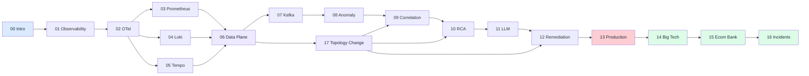
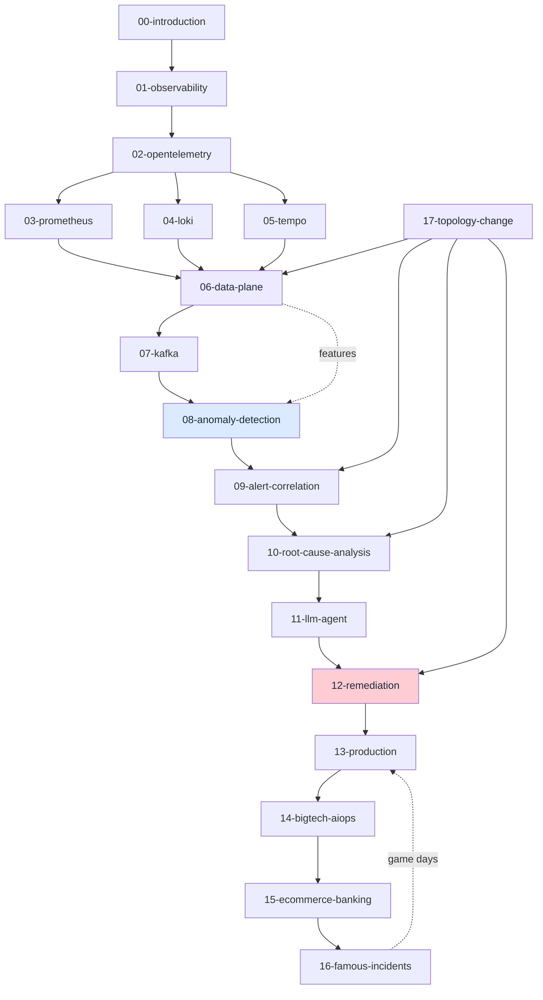

# AIOps Engineering Handbook

> **A production-grade reference for designing Autonomous Intelligent Operations platforms on AWS, Kubernetes, and cloud-native infrastructure — with full Vietnamese and English editions.**

[](.)
[](LICENSE)
[](.)
[](docs/)
[](https://xuanhoa04.github.io/aiops-engineering-handbook/)
[](.)
[](https://github.com/XUanhoa04/aiops-engineering-handbook)

| | |
|---|---|
| **Languages** | English (`docs/en/`) · Vietnamese (`docs/vi/`) |
| **Chapters** | 18 per language (00–17) |
| **Docs site** | [xuanhoa04.github.io/aiops-engineering-handbook](https://xuanhoa04.github.io/aiops-engineering-handbook/) |
| **Level** | Staff / Principal SRE depth (concepts first) |
| **Repo** | [github.com/XUanhoa04/aiops-engineering-handbook](https://github.com/XUanhoa04/aiops-engineering-handbook) |
| **Curriculum map** | [docs/CURRICULUM.md](docs/CURRICULUM.md) |

---

## What is this handbook?

This handbook documents **architecture, design decisions, algorithms, operational practices, and production lessons** for building an AIOps platform from first principles.

It is written at **Staff / Principal SRE** depth. It assumes you:

- Are comfortable with distributed systems  
- Understand Kubernetes and container orchestration  
- Have hands-on cloud (especially AWS) operations experience  
- Care about **why**, not only **how**

Each chapter follows: **Why → What → How → Trade-offs → Edge cases → Problem-solving → Production practices → Mistakes → Monitoring → Scaling → Security → Cost → Improvement**.

### Design philosophy

| Focus | What you get |
|-------|----------------|
| **Concept-first** | Problem, idea, input data, algorithm steps, output, pros/cons, **when (not) to use** |
| **Code second** | From Ch.08 onward, implementation sits under **“See the code below”** (collapsed by default) |
| **Thinking over tools** | Mental models, decision trees, failure modes |
| **Real production** | Big Tech patterns, e-commerce/banking constraints, public incident postmortems |

Goal: understand **why an AIOps pipeline is designed this way** and **when it fails** — not only how to paste configs.

---

## Architecture overview

> Architecture posters (PNG). Chapter logic flows still use Mermaid (scroll + click-to-enlarge on the docs site). More posters: [`docs/assets/diagrams/`](docs/assets/diagrams/).


**Main path:** Collect → **Data plane** (normalize · enrich · validate · hot/warm/cold store · feature store) → Transport (Kafka) → Intelligence (detect · correlate · RCA · LLM) → Action (decision · remediation · verify).

**Side plane:** **Topology & change** (Ch.17) feeds enrichment, correlation, RCA, and remediation freeze/risk gates.

---

## Learning roadmap



**Recommended path:**

1. **Foundation** (00–01) — alert fatigue, OODA, SLO, observability before AI  
2. **Collect** (02–05) — OpenTelemetry, Prometheus, Loki, Tempo  
3. **Data plane** (06) — normalize → enrich → validate → storage/retention → feature store (**when you need each**)  
4. **Transport** (07) — Kafka/MSK, schema, replay  
5. **Intelligence** (08–11) — detect → correlate → RCA → LLM  
6. **Action + production** (12–13) — safe remediation, dogfooding, DR  
7. **Case studies** (14–16) — Big Tech, e-commerce/banking, famous incidents  
8. **Topology & change** (17) — service graph + deploy/change bus (feeds 06 / 09 / 10 / 12)  

**Read online:** [GitHub Pages](https://xuanhoa04.github.io/aiops-engineering-handbook/) · local: `pip install -r requirements-docs.txt && mkdocs serve`

---

## Table of contents (dual language)

**18 chapters** per language (English + Vietnamese). Same numbering; pick your language column.

### Foundation

| # | English | Vietnamese | Topic |
|---|---------|------------|--------|
| 00 | [Introduction](docs/en/00-introduction.md) | [Introduction](docs/vi/00-introduction.vi.md) | AIOps philosophy, OODA, ROI, maturity |
| 01 | [Observability](docs/en/01-observability/README.md) | [Observability](docs/vi/01-observability/README.vi.md) | Three pillars, SLO, cardinality |

### Collect

| # | English | Vietnamese | Topic |
|---|---------|------------|--------|
| 02 | [OpenTelemetry](docs/en/02-opentelemetry/README.md) | [OpenTelemetry](docs/vi/02-opentelemetry/README.vi.md) | OTLP, Collector, processors |
| 03 | [Prometheus](docs/en/03-prometheus/README.md) | [Prometheus](docs/vi/03-prometheus/README.vi.md) | Pull model, Thanos |
| 04 | [Loki](docs/en/04-loki/README.md) | [Loki](docs/vi/04-loki/README.vi.md) | Labels, LogQL, retention |
| 05 | [Tempo](docs/en/05-tempo/README.md) | [Tempo](docs/vi/05-tempo/README.vi.md) | Sampling, trace RCA |

### Data plane (after collection)

| # | English | Vietnamese | Topic |
|---|---------|------------|--------|
| 06 | [Telemetry Data Plane](docs/en/06-data-plane/README.md) | [Telemetry Data Plane](docs/vi/06-data-plane/README.vi.md) | Normalize, enrich, validate, storage/retention, feature store, lifecycle |

### Transport

| # | English | Vietnamese | Topic |
|---|---------|------------|--------|
| 07 | [Kafka / Kinesis](docs/en/07-kafka/README.md) | [Kafka / Kinesis](docs/vi/07-kafka/README.vi.md) | Event bus, schema, lag, replay |

### Intelligence

| # | English | Vietnamese | Topic |
|---|---------|------------|--------|
| 08 | [Anomaly Detection](docs/en/08-anomaly-detection/README.md) | [Anomaly Detection](docs/vi/08-anomaly-detection/README.vi.md) | Detectors, ensemble, drift, when **not** to use ML |
| 09 | [Alert Correlation](docs/en/09-alert-correlation/README.md) | [Alert Correlation](docs/vi/09-alert-correlation/README.vi.md) | Dedup, topology, cascade storms |
| 10 | [Root Cause Analysis](docs/en/10-root-cause-analysis/README.md) | [Root Cause Analysis](docs/vi/10-root-cause-analysis/README.vi.md) | Causation, multi-root, evidence |
| 11 | [LLM Investigation Agent](docs/en/11-llm-agent/README.md) | [LLM Investigation Agent](docs/vi/11-llm-agent/README.vi.md) | RAG, tools, hallucination, safety |

### Action + production

| # | English | Vietnamese | Topic |
|---|---------|------------|--------|
| 12 | [Automated Remediation](docs/en/12-remediation/README.md) | [Automated Remediation](docs/vi/12-remediation/README.vi.md) | Gates, allow-list, verification |
| 13 | [Production Operations](docs/en/13-production/README.md) | [Production Operations](docs/vi/13-production/README.vi.md) | HA/DR, cost, game days |

### Case studies

| # | English | Vietnamese | Topic |
|---|---------|------------|--------|
| 14 | [Big Tech AIOps](docs/en/14-bigtech-aiops/README.md) | [Big Tech AIOps](docs/vi/14-bigtech-aiops/README.vi.md) | Google, Netflix, AWS, Meta, Uber |
| 15 | [E-commerce & Banking](docs/en/15-ecommerce-banking/README.md) | [E-commerce & Banking](docs/vi/15-ecommerce-banking/README.vi.md) | BFCM, PCI, money-path safety |
| 16 | [Famous Incidents](docs/en/16-famous-incidents/README.md) | [Famous Incidents](docs/vi/16-famous-incidents/README.vi.md) | S3, DynamoDB DNS, Meta, Cloudflare |

### Topology & change plane

| # | English | Vietnamese | Topic |
|---|---------|------------|--------|
| 17 | [Topology & Change](docs/en/17-topology-change/README.md) | [Topology & Change](docs/vi/17-topology-change/README.vi.md) | Service graph, change/deploy bus, freezes |

---

## Document dependency graph



---

## How to use this handbook

> For each section, answer three questions before moving on:  
> (1) What real problem does this solve?  
> (2) What is the trade-off?  
> (3) Which edge case breaks this design?

Choose **[English](docs/en/)** or **[Vietnamese](docs/vi/)** — same chapter numbers.

### By role

| Role | Suggested path |
|------|----------------|
| **DevOps / SRE** | [Observability](docs/en/01-observability/README.md) → [Prometheus](docs/en/03-prometheus/README.md) → [Data plane](docs/en/06-data-plane/README.md) → [Kafka](docs/en/07-kafka/README.md) → [Remediation](docs/en/12-remediation/README.md) → [Incidents](docs/en/16-famous-incidents/README.md) |
| **Platform Engineer** | [OpenTelemetry](docs/en/02-opentelemetry/README.md) → metrics/logs/traces (03–05) → [Data plane](docs/en/06-data-plane/README.md) → [Production](docs/en/13-production/README.md) |
| **ML Engineer** | [Anomaly Detection](docs/en/08-anomaly-detection/README.md) → [Correlation](docs/en/09-alert-correlation/README.md) → [RCA](docs/en/10-root-cause-analysis/README.md) → [LLM Agent](docs/en/11-llm-agent/README.md) |
| **Architect / Tech Lead** | [Introduction](docs/en/00-introduction.md) → [Production](docs/en/13-production/README.md) → [Big Tech](docs/en/14-bigtech-aiops/README.md) → [E-commerce & Banking](docs/en/15-ecommerce-banking/README.md) |
| **On-call / IC** | [Famous Incidents](docs/en/16-famous-incidents/README.md) → [Correlation](docs/en/09-alert-correlation/README.md) → [RCA](docs/en/10-root-cause-analysis/README.md) → [Remediation](docs/en/12-remediation/README.md) |

---

## Tech stack reference

| Layer | Primary | Alternatives | AWS managed |
|-------|---------|--------------|-------------|
| Metrics | Prometheus | VictoriaMetrics | CloudWatch |
| Logs | Loki | ELK Stack | CloudWatch Logs |
| Traces | Tempo | Jaeger | AWS X-Ray |
| Collection | OpenTelemetry Collector | Fluent Bit | FireLens |
| Streaming | Apache Kafka | Redis Streams | Kinesis / MSK |
| Long-term storage | S3 + Parquet | Thanos | S3 |
| ML inference | Python (scikit-learn) | TorchServe | SageMaker |
| LLM | Claude / GPT-4 | Llama (self-host) | Amazon Bedrock |
| Remediation | AWS SSM Automation | Rundeck | SSM / Lambda |
| Visualization | Grafana | Kibana | CloudWatch Dashboards |
| Alerting | Alertmanager | Grafana Alerting | CloudWatch Alarms |

---

## Start here

| Link | Purpose |
|------|---------|
| [docs/CURRICULUM.md](docs/CURRICULUM.md) | Canonical chapter map & pipeline order |
| [docs/en/00-introduction.md](docs/en/00-introduction.md) | Start in English |
| [docs/vi/00-introduction.vi.md](docs/vi/00-introduction.vi.md) | Start in Vietnamese |
| [docs/en/06-data-plane/README.md](docs/en/06-data-plane/README.md) | Normalize / enrich / store / feature (**when to use**) |
| [docs/en/17-topology-change/README.md](docs/en/17-topology-change/README.md) | Topology graph + change/deploy bus |
| [GitHub Pages](https://xuanhoa04.github.io/aiops-engineering-handbook/) | Read online (MkDocs Material) |
| [docs/assets/diagrams/](docs/assets/diagrams/) | Architecture posters (PNG) |
| [CHANGELOG.md](CHANGELOG.md) | Version history |

### Build the docs site locally

```bash
pip install -r requirements-docs.txt
mkdocs serve
# open http://127.0.0.1:8000
```

---

## Contributing

See [CONTRIBUTING.md](CONTRIBUTING.md) · [CODE_OF_CONDUCT.md](CODE_OF_CONDUCT.md) · [SECURITY.md](SECURITY.md).

Chapter quality bar:

- **Technically accurate** — grounded in production practice / public sources  
- **Deep** — Staff/Principal trade-offs, not tutorial fluff  
- **When to use** — not only *what it is*, but *when you need it / when you should not*  
- **Edge cases** — how the design breaks and how to defend it  
- **Production-ready** — monitoring, scaling, security, cost  

Issues / PRs: [github.com/XUanhoa04/aiops-engineering-handbook](https://github.com/XUanhoa04/aiops-engineering-handbook)

---

## License

MIT License — see [LICENSE](LICENSE).

---

## Maintainers

- **[@XUanhoa04](https://github.com/XUanhoa04)** — AIOps / SRE / Cloud Native handbook

---

## Release

**Current: v1.1.0** — 18 chapters (including Topology & Change) · dual language · concept-first intelligence chapters · MkDocs GitHub Pages · architecture posters.
