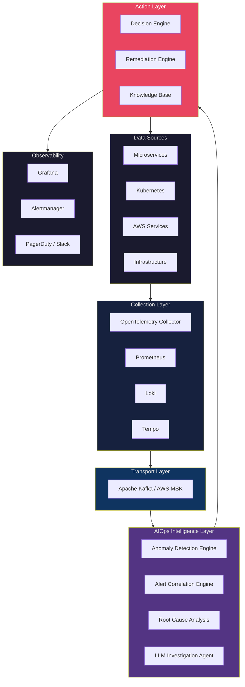
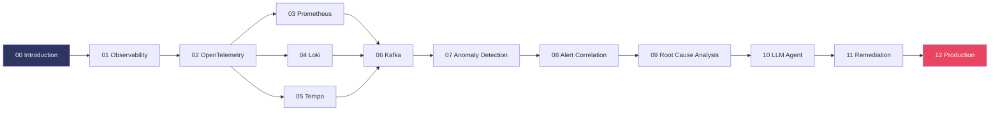
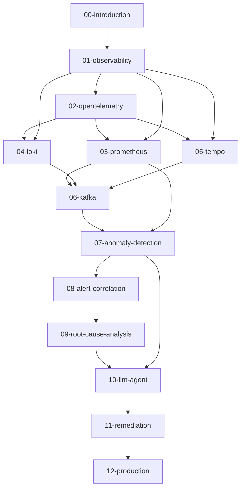

# Cẩm nang Kỹ thuật AIOps (AIOps Engineering Handbook)

> **Tài liệu tham chiếu chuẩn sản xuất (production-grade) để xây dựng các nền tảng Vận hành Thông minh Tự động (Autonomous Intelligent Operations) trên AWS, Kubernetes và hạ tầng Cloud Native.**

[](.)
[](LICENSE)
[](.)

---

## What Is This Handbook?

Tài liệu này ghi nhận **toàn bộ kiến trúc, quyết định thiết kế, thuật toán, thực tiễn vận hành và các bài học kinh nghiệm thực tế** để xây dựng một nền tảng AIOps từ các nguyên lý cơ bản.

Tài liệu được viết ở cấp độ **Principal Engineer / Staff SRE**. Cẩm nang giả định:

- Bạn đã quen thuộc với các hệ thống phân tán
- Bạn hiểu rõ Kubernetes và điều phối container
- Bạn có kinh nghiệm vận hành thực tế trên AWS
- Bạn mong muốn hiểu rõ lý do **tại sao (why)**, không chỉ là làm **như thế nào (how)**

Mỗi chương đều giải thích đầy đủ các phần: **Why → What → How → Trade-offs → Production Best Practices → Common Mistakes → Monitoring → Scaling → Security → Cost → Improvement**.

---

## Architecture Overview



---

## Learning Roadmap



---

## Table of Contents

### 📖 Foundation

| # | Tài liệu | Mô tả | Trạng thái |
|---|----------|-------------|--------|
| 00 | [Introduction](docs/00-introduction.md) | Triết lý AIOps, ROI, mô hình mức độ trưởng thành | ✅ Hoàn thành |
| 01 | [Observability](docs/01-observability/README.md) | Ba Trụ cột, các loại Metric, Logs, Traces, SLO/SLA, Cardinality | ✅ Hoàn thành |

### 📡 Telemetry Stack

| # | Tài liệu | Mô tả | Trạng thái |
|---|----------|-------------|--------|
| 02 | [OpenTelemetry](docs/02-opentelemetry/README.md) | Giao thức OTLP, kiến trúc Collector, toàn bộ receivers/processors/exporters | ✅ Hoàn thành |
| 03 | [Prometheus](docs/03-prometheus/README.md) | Kiến trúc nội bộ TSDB, PromQL, HA, Thanos, so sánh CloudWatch vs VictoriaMetrics | ✅ Hoàn thành |
| 04 | [Loki](docs/04-loki/README.md) | Kiến trúc, đi sâu vào LogQL, lưu trữ S3 backend, so sánh ELK, chi phí | ✅ Hoàn thành |
| 05 | [Tempo](docs/05-tempo/README.md) | Lưu trữ Parquet, TraceQL, SpanMetrics, so sánh Jaeger/X-Ray | ✅ Hoàn thành |

### 🚌 Transport Layer

| # | Tài liệu | Mô tả | Trạng thái |
|---|----------|-------------|--------|
| 06 | [Kafka / Kinesis](docs/06-kafka/README.md) | Producer/consumer, EOS, MSK, so sánh Kinesis vs Kafka, DLQ, Schema Registry | ✅ Hoàn thành |

### 🧠 Intelligence Layer

| # | Tài liệu | Mô tả | Trạng thái |
|---|----------|-------------|--------|
| 07 | [Anomaly Detection](docs/07-anomaly-detection/README.md) | 12 thuật toán: EWMA→STL→IF→LSTM→Transformer→Drain→DeepLog, mô hình ensemble, vận hành | ✅ Hoàn thành |
| 08 | [Alert Correlation](docs/08-alert-correlation/README.md) | Pipeline 5 giai đoạn, liên kết tương quan topology, tương quan chéo thời gian, độ tương đồng ngữ nghĩa | ✅ Hoàn thành |
| 09 | [Root Cause Analysis](docs/09-root-cause-analysis/README.md) | Duyệt sơ đồ topology, thuật toán PC, mạng Bayesian, GNN (MicroRCA), phân tích trace+log | ✅ Hoàn thành |
| 10 | [LLM Investigation Agent](docs/10-llm-agent/README.md) | RAG, LangGraph/ReAct, sử dụng công cụ, viết prompt SRE, safety gates, HITL, phân tích chi phí | ✅ Hoàn thành |

### ⚙️ Action Layer

| # | Tài liệu | Mô tả | Trạng thái |
|---|----------|-------------|--------|
| 11 | [Automated Remediation](docs/11-remediation/README.md) | Danh mục hành động (Tier 1-3), K8s executor, SSM, canary rollout, safety gates, audit log | ✅ Hoàn thành |

### 🏭 Production

| # | Tài liệu | Mô tả | Trạng thái |
|---|----------|-------------|--------|
| 12 | [Production Operations](docs/12-production/README.md) | Cấu hình HA, DR, chaos engineering, quản trị chi phí (~$9,364/tháng), bảo mật, phân tích 49x ROI | ✅ Hoàn thành |

---

## Document Dependency Graph



---

## Repository Progress

```
Foundation          ████████████████████  100% (2/2)   ✅
Telemetry Stack     ████████████████████  100% (4/4)   ✅
Transport Layer     ████████████████████  100% (1/1)   ✅
Intelligence Layer  ████████████████████  100% (4/4)   ✅
Action Layer        ████████████████████  100% (1/1)   ✅
Production          ████████████████████  100% (1/1)   ✅

Overall Progress    ████████████████████  100% (13/13 chương)  
```

---

## How to Use This Handbook

### Nếu bạn là **DevOps/SRE Engineer**
Bắt đầu với [Observability](docs/01-observability/README.md) → [Prometheus](docs/03-prometheus/README.md) → [Kafka](docs/06-kafka/README.md) → [Remediation](docs/11-remediation/README.md)

### Nếu bạn là **Platform Engineer**
Bắt đầu với [OpenTelemetry](docs/02-opentelemetry/README.md) → [Prometheus](docs/03-prometheus/README.md) → [Loki](docs/04-loki/README.md) → [Tempo](docs/05-tempo/README.md)

### Nếu bạn là **ML Engineer**
Bắt đầu với [Anomaly Detection](docs/07-anomaly-detection/README.md) → [Alert Correlation](docs/08-alert-correlation/README.md) → [RCA](docs/09-root-cause-analysis/README.md) → [LLM Agent](docs/10-llm-agent/README.md)

### Nếu bạn là **Cloud Architect**
Bắt đầu với [Introduction](docs/00-introduction.md) → [Production](docs/12-production/README.md) → [Kafka/MSK](docs/06-kafka/README.md)

---

## Tech Stack Reference

| Lớp xử lý | Giải pháp chính | Giải pháp thay thế | Dịch vụ AWS Managed |
|-------|---------|-------------|-------------|
| Metrics | Prometheus | VictoriaMetrics | CloudWatch |
| Logs | Loki | ELK Stack | CloudWatch Logs |
| Traces | Tempo | Jaeger | AWS X-Ray |
| Collection | OpenTelemetry Collector | Fluent Bit | FireLens |
| Streaming | Apache Kafka | Redis Streams | AWS Kinesis / MSK |
| Storage | S3 + Parquet | Thanos | S3 |
| ML Inference | Python (scikit-learn) | TorchServe | SageMaker |
| LLM | Claude / GPT-4 | Llama 3 (tự host) | Amazon Bedrock |
| Remediation | AWS SSM Automation | Rundeck | SSM / Lambda |
| Visualization | Grafana | Kibana | CloudWatch Dashboards |
| Alerting | Alertmanager | Grafana Alerting | CloudWatch Alarms |

---

## Contributing

Tài liệu này liên tục được cập nhật. Mỗi chương đều tuân thủ nghiêm ngặt các tiêu chuẩn chất lượng sau:
- **Độ chính xác kỹ thuật (Technical Accuracy)**: Đã được kiểm chứng thực tế trên các hệ thống production lớn
- **Độ sâu kiến thức (Depth)**: Đạt cấp độ Staff/Principal Engineer, phân tích kỹ lưỡng, thực chất
- **Đánh giá các đánh đổi (Trade-offs)**: Mọi quyết định kiến trúc thiết kế đều được lập luận và giải thích rõ ràng
- **Chuẩn sản xuất (Production-Ready)**: Phân tích kỹ các kịch bản lỗi, phương án giám sát và mở rộng tương ứng

---

## License

Giấy phép MIT License. Xem chi tiết tại [LICENSE](LICENSE).

---

## Authors

Được viết bởi Principal AIOps Architect có hơn 15 năm kinh nghiệm vận hành thực tế trên AWS, Kubernetes và các nền tảng Cloud Native.
