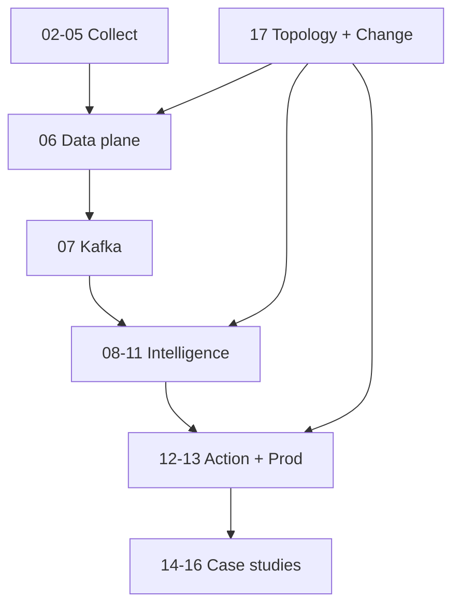

# Curriculum — AIOps Engineering Handbook

Single source of truth for chapter order. Dual language: `docs/vi/` · `docs/en/`.

**Online site (GitHub Pages):** after first deploy →  
`https://xuanhoa04.github.io/aiops-engineering-handbook/`

Local: `pip install -r requirements-docs.txt && mkdocs serve`

---

## Pipeline mental model

```
Collect (02–05)
    → Data plane (06): normalize · enrich · validate · store · feature
    → Transport (07): Kafka / MSK
    → Intelligence (08–11): detect · correlate · RCA · LLM
    → Action (12): remediation + verify
    → Production (13): run the platform
    → Case studies (14–16)
    → Topology & Change (17): graph + deploy/change bus (feeds 06/09/10/12)
```



---

## Chapter index

| # | Folder | Title (short) | Role |
|---|--------|---------------|------|
| 00 | `00-introduction` | Introduction to AIOps | Philosophy, ROI, full pipeline map |
| 01 | `01-observability` | Observability | Pillars, SLO, cardinality |
| 02 | `02-opentelemetry` | OpenTelemetry | Collection pipeline |
| 03 | `03-prometheus` | Prometheus | Metrics store / PromQL |
| 04 | `04-loki` | Loki | Logs store / labels |
| 05 | `05-tempo` | Tempo | Traces / sampling |
| 06 | `06-data-plane` | Telemetry Data Plane | Normalize, enrich, retention, feature store |
| 07 | `07-kafka` | Kafka / Kinesis | Event bus, schema, replay |
| 08 | `08-anomaly-detection` | Anomaly Detection | Detectors + feature use |
| 09 | `09-alert-correlation` | Alert Correlation | Dedup, topology, alert enrich |
| 10 | `10-root-cause-analysis` | Root Cause Analysis | Causation, ranking |
| 11 | `11-llm-agent` | LLM Investigation Agent | RAG, tools, safety |
| 12 | `12-remediation` | Automated Remediation | Gates, allow-list |
| 13 | `13-production` | Production Operations | HA, DR, cost, game days |
| 14 | `14-bigtech-aiops` | Big Tech AIOps | Google, Netflix, AWS, Meta, Uber |
| 15 | `15-ecommerce-banking` | E-commerce & Banking | Domain constraints, money path |
| 16 | `16-famous-incidents` | Famous Incidents | Public outages → design lessons |
| **17** | **`17-topology-change`** | **Topology & Change** | **Service graph + change/deploy events** |

## File naming

| Lang | Intro | Chapter body |
|------|-------|--------------|
| VI | `docs/vi/00-introduction.vi.md` | `docs/vi/NN-name/README.vi.md` |
| EN | `docs/en/00-introduction.md` | `docs/en/NN-name/README.md` |

## Architecture posters

See [assets/diagrams/README.md](assets/diagrams/README.md).

## Remaining backlog (optional later)

- Synthetic / blackbox monitoring (deep chapter)
- Labeling & feedback ops for ML
- FinOps chargeback for telemetry
- Multi-tenant data-plane isolation deep dive
