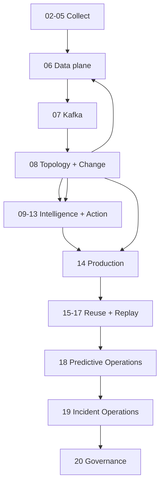

# Curriculum — AIOps Engineering Handbook

Single source of truth for chapter order. Chapters 00–17 are dual-language (`docs/vi/` · `docs/en/`); the Vietnamese production track currently extends through Chapter 20.

**Online site (GitHub Pages):** after first deploy →  
`https://xuanhoa04.github.io/aiops-engineering-handbook/`

Local: `pip install -r requirements-docs.txt && mkdocs serve`

---

## Pipeline mental model

```
System Fundamentals (S): compute · network · storage · distributed · AI/ML infra
    ↓
Collect (02–05)
    → Data plane (06): normalize · enrich · validate · store · feature
    → Transport (07): Kafka / MSK
    → Topology & Change (08): graph + deploy/change bus
    → Intelligence (09–13): detect · correlate · RCA · investigate · remediate
    → Production & reuse (14–17): run · patterns · domains · replay
    → Predict & coordinate (18–19): proactive risk · incident control
    → Govern (20): model/tool/policy risk and runtime authority
```


```mermaid
graph TD
    C[02-05 Collect] --> DP[06 Data plane]
    DP --> K[07 Kafka]
    K --> TC[08 Topology + Change]
    TC --> I[09-13 Intelligence + Action]
    I --> A[14 Production]
    A --> CS[15-17 Reuse + Replay]
    CS --> P[18 Predictive Operations]
    P --> O[19 Incident Operations]
    O --> G[20 Governance]
    TC --> DP
    TC --> I
    TC --> A
```

---

## Chapter index

| # | Folder | Title (short) | Role |
|---|--------|---------------|------|
| S | `system-fundamentals` | System Architecture Fundamentals | Compute, network, storage, distributed systems, AI/ML infra |
| 00 | `00-introduction` | Introduction to AIOps | Philosophy, ROI, full pipeline map |
| 01 | `01-observability` | Observability | Pillars, SLO, cardinality |
| 02 | `02-opentelemetry` | OpenTelemetry | Collection pipeline |
| 03 | `03-prometheus` | Prometheus | Metrics store / PromQL |
| 04 | `04-loki` | Loki | Logs store / labels |
| 05 | `05-tempo` | Tempo | Traces / sampling |
| 06 | `06-data-plane` | Telemetry Data Plane | Normalize, enrich, retention, feature store |
| 07 | `07-kafka` | Kafka / Kinesis | Event bus, schema, replay |
| 08 | `08-topology-change` | Topology & Change | Service graph + change/deploy events |
| 09 | `09-anomaly-detection` | Persistent Detection | Long incidents, drift, ensemble |
| 10 | `10-alert-correlation` | Alert Correlation | Dedup, topology, concurrent faults |
| 11 | `11-root-cause-analysis` | Root Cause Analysis | Causation, ranking, counter-evidence |
| 12 | `12-investigation-engine` | Investigation Engine | Evidence ledger, bounded LLM, handoff |
| 13 | `13-remediation-safety-engine` | Remediation Safety | Hard gates, canary, rollback |
| 14 | `14-production-engine` | Production Engine | HA, DR, degraded mode, cost |
| 15 | `15-aiops-pattern-library` | Pattern Library | Reusable patterns and boundaries |
| 16 | `16-aiops-domain-packs` | Domain Packs | E-commerce, banking, money path |
| 17 | `17-aiops-benchmark-replay` | Benchmark Replay | Incident timelines → regression evidence |
| 18 | `18-predictive-operations` | Predictive Operations | Capacity risk, uncertainty, time-to-exhaustion |
| 19 | `19-incident-operations` | Incident Operations | Command, state, handoff, concurrent incidents |
| 20 | `20-aiops-governance` | Governance & Model Risk | Capability risk, policy, audit, revocation |

## File naming

| Lang | Intro | Chapter body |
|------|-------|--------------|
| VI | `docs/vi/00-introduction.vi.md` | `docs/vi/NN-name/README.vi.md` |
| EN | `docs/en/00-introduction.md` | `docs/en/NN-name/README.md` |

## Architecture posters

See [assets/diagrams/README.md](assets/diagrams/README.md).

## Default OSS stack (decision map — not a product catalog)

Tools change; **roles** stay. Prefer one tool per role; hybrid only with an owner.

| Pipeline role | Default in this handbook | Common alternatives | Notes |
|---------------|--------------------------|---------------------|--------|
| Edge collect (logs) | Fluent Bit or OTel | Vector, Grafana Alloy | Thin edge → gateway; see Ch.02 |
| Multi-signal gateway | OTel Collector | Alloy (Grafana-centric) | Policy, sampling, export |
| Metrics | Prometheus (+ Thanos/VM) | VictoriaMetrics, Mimir, AMP | Ch.03 |
| Logs (ops hot path) | Loki | — | Cheap labels; Ch.04 |
| Logs (full-text / IR niche) | OpenSearch / ES **subset** | ClickHouse analytics | Dual-path, not 100% dual-write |
| Traces | Tempo | Jaeger | Ch.05 |
| Transport bus | Kafka / MSK | Kinesis, Redis Streams (small) | Ch.07 |
| Stream process (heavy) | **Flink** (often with Kafka) | Kafka Streams, Spark, consumers | Ch.06 §5.6, Ch.07 §14 — Flink optional until state/windows hurt |
| Stream process (light) | OTel processors + consumer services | Kafka Streams | Do not stand up Flink for renames |
| Intelligence | Custom on your data | Vendor AIOps add-on | Ch.00 build-vs-buy |

**Kafka + Flink?** Common **yes** at mid/large scale (event-time, state, reprocess). **Not** mandatory on day one — see Ch.07 §14.

## Remaining backlog (optional later)

- Synthetic / blackbox monitoring (deep chapter)
- Labeling & feedback ops for ML
- FinOps chargeback for telemetry
- Multi-tenant data-plane isolation deep dive
