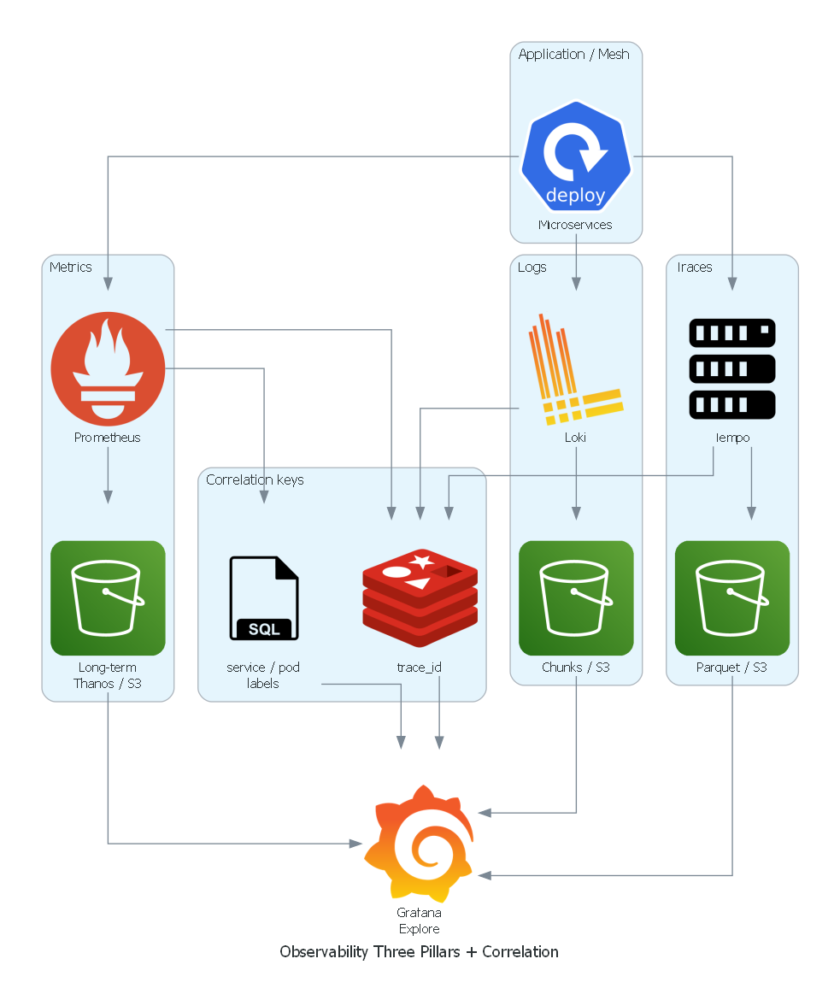
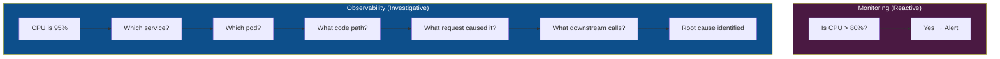
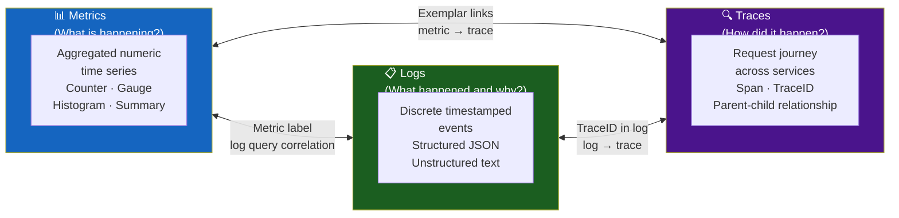
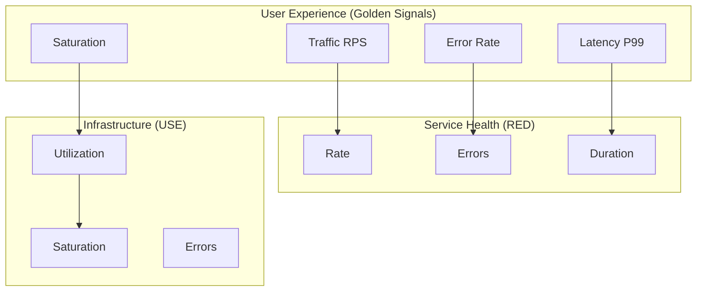
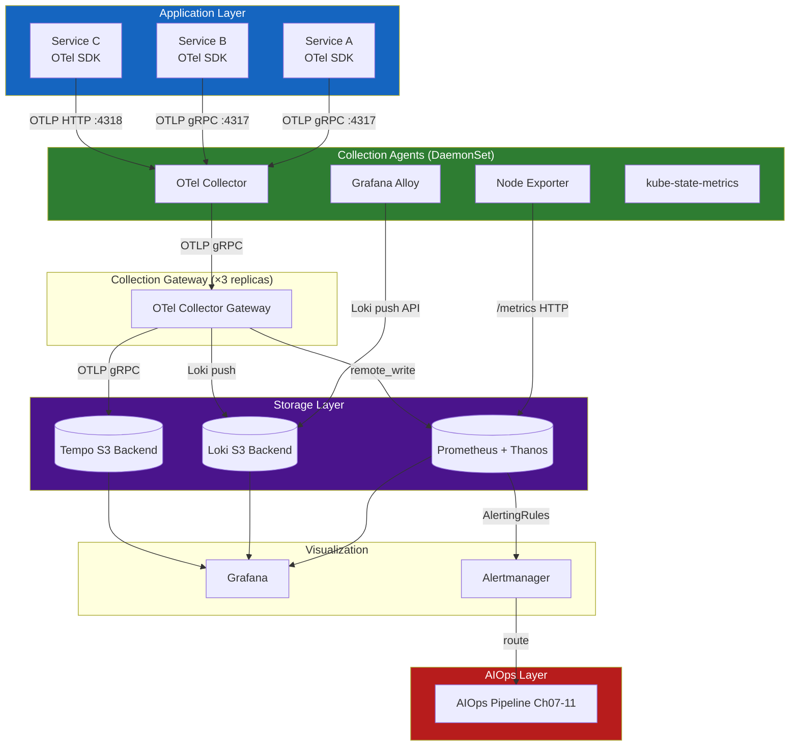
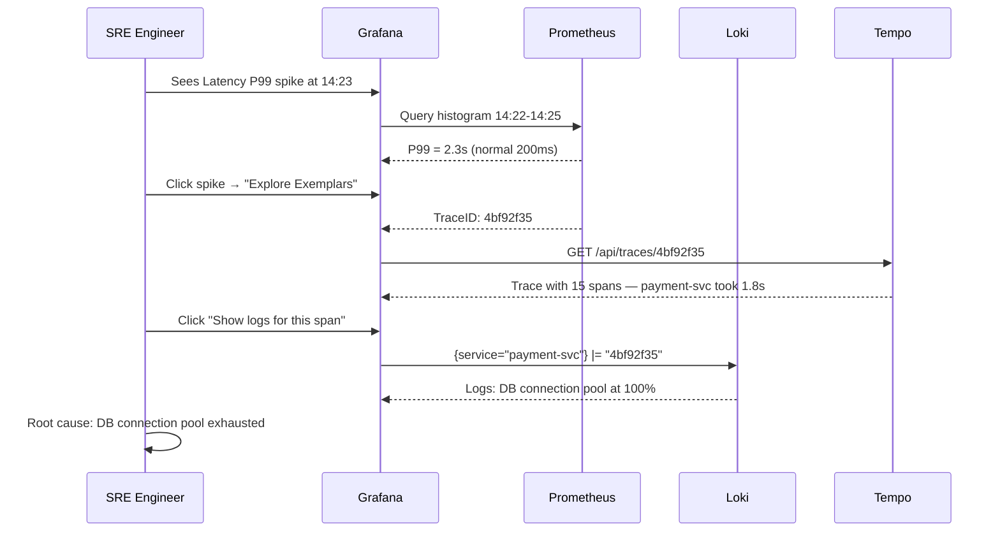
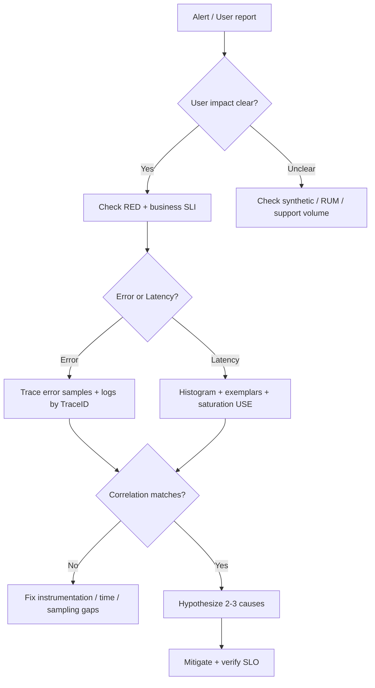
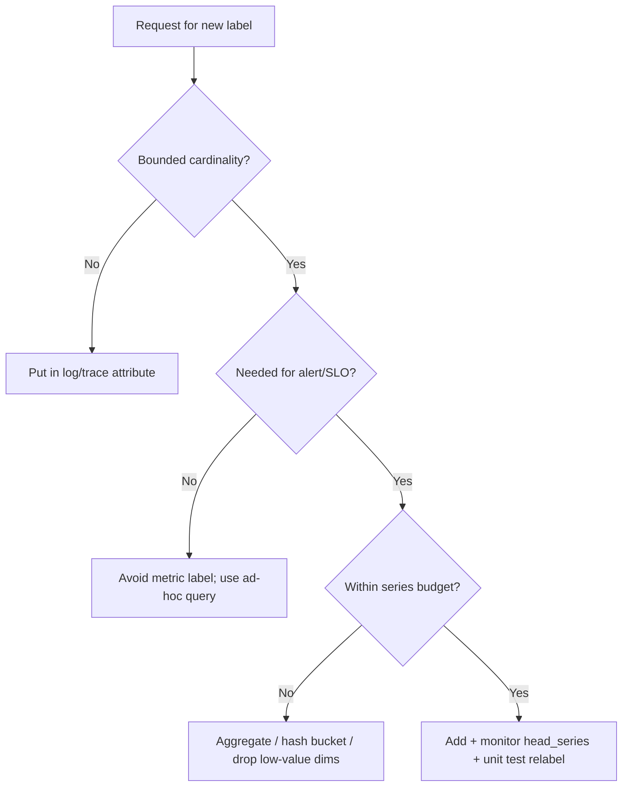
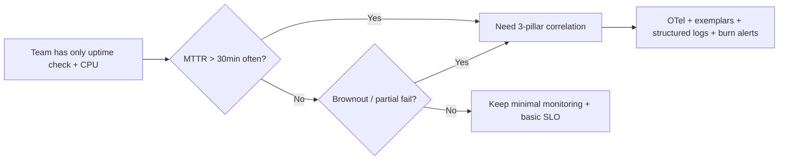

# Chapter 01 — Observability

> **Observability is the foundation on which every AIOps capability is built. Without high-quality telemetry, no algorithm, no LLM, and no automation can be reliable.**

---

## Prerequisites

- Familiarity with microservices architecture
- Basic understanding of Prometheus, Grafana, or similar tools
- Recommended: [00 — Introduction to AIOps](../00-introduction.md)

## Related Documents

- [02 — OpenTelemetry](../02-opentelemetry/README.md) — collection pipeline
- [03 — Prometheus](../03-prometheus/README.md) — metrics storage
- [04 — Loki](../04-loki/README.md) — log storage
- [05 — Tempo](../05-tempo/README.md) — trace storage
- [07 — Anomaly Detection](../08-anomaly-detection/README.md) — consumes observability data

## Next Reading

After this chapter, continue to [02 — OpenTelemetry](../02-opentelemetry/README.md).

---

## Table of Contents

1. [The Three Pillars of Observability](#1-the-three-pillars-of-observability)
2. [Metrics — Deep Dive](#2-metrics--deep-dive)
3. [Logs — Deep Dive](#3-logs--deep-dive)
4. [Traces — Deep Dive](#4-traces--deep-dive)
5. [The Fourth Signal — Profiles](#5-the-fourth-signal--profiles)
6. [Golden Signals vs RED vs USE](#6-golden-signals-vs-red-vs-use)
7. [SLI, SLO, SLA, Error Budget](#7-sli-slo-sla-error-budget)
8. [Observability Architecture](#8-observability-architecture)
9. [Instrumentation Strategy](#9-instrumentation-strategy)
10. [Correlation — Connecting the Three Pillars](#10-correlation--connecting-the-three-pillars)
11. [Data Cardinality — The Silent Killer](#11-data-cardinality--the-silent-killer)
12. [Observability Platform Design](#12-observability-platform-design)
13. [Production Best Practices](#13-production-best-practices)
14. [Common Mistakes](#14-common-mistakes)
15. [Monitoring the Monitoring Stack](#15-monitoring-the-monitoring-stack)
16. [Scaling Observability](#16-scaling-observability)
17. [Security](#17-security)
18. [Cost Management](#18-cost-management)
19. [Production Problem-Solving Mindset](#19-production-problem-solving-mindset)
20. [Real-World Edge Cases](#20-real-world-edge-cases)
21. [Decision Trees](#21-decision-trees)
22. [Lessons from Big Tech / Public Incidents](#22-lessons-from-big-tech--public-incidents)
23. [Socratic Questions for On-Call](#23-socratic-questions-for-on-call)
24. [Improvement Experiments (30/60/90 Days)](#24-improvement-experiments-306090-days)
25. [Production Review](#25-production-review)
26. [Improvement Roadmap](#26-improvement-roadmap)

---

## 1. The Three Pillars of Observability



*Poster: Metrics / Logs / Traces join on `trace_id` and labels → Grafana Explore.*

> [!NOTE]
> **KEY IDEA**
> **Monitoring** is like the warning lights on a car dashboard — it says "something is wrong." **Observability** is like the flight data recorder — it lets you reconstruct exactly what happened and why. AIOps needs Observability, not only Monitoring, because it must automatically **understand causes**, not only **detect symptoms**.

> [!TIP]
> **Why three pillars instead of one?**
> Each telemetry type answers a different question and cannot replace the others: Metrics tell you *what is happening* (fast, cheap, aggregatable), Logs tell you *why* (verbose, expensive, full context), Traces tell you *how* (request flow across the system). AIOps needs all three because no single type is enough to identify root cause alone.

Observability is **not** the same as monitoring.

- **Monitoring** answers: "Is the system working? Did this specific metric exceed a threshold?"
- **Observability** answers: "Why is the system behaving this way? Which internal state caused this external symptom?"

This distinction is critical for AIOps: monitoring produces alerts. Observability produces understanding.



### The Three Pillars



> [!NOTE]
> **Check question**: If P99 latency spikes suddenly, which telemetry type do you use first? What do you use next to find the cause? What do you look at finally to understand the full request flow?

---

## 2. Metrics — Deep Dive

### 2.1 What Are Metrics?

> [!NOTE]
> **KEY IDEA**
> A metric is an **aggregated number over time**, labeled so you can filter/group. Instead of storing "how long each request took" (too much), you store "1000 requests in 5 minutes, 80% under 50ms, 99% under 200ms" — that is a Histogram. Think of it as a statistical summary report, not a detailed log.

A metric is a **numeric measurement aggregated over time** and identified by a set of labels.

**Example reading Prometheus metric format**:
```
# HELP http_requests_total Total number of HTTP requests
# TYPE http_requests_total counter
http_requests_total{method="GET",endpoint="/api/users",status="200",service="user-svc"} 12345
http_requests_total{method="POST",endpoint="/api/orders",status="500",service="order-svc"} 42
```

**Components of a metric**:
- **Name**: `http_requests_total` — what is being measured
- **Labels**: `{method, endpoint, status, service}` — dimensions for filtering/grouping
- **Value**: `12345` — the measured value
- **Timestamp**: milliseconds since epoch

### 2.2 Metric Types

#### Counter

> [!NOTE]
> **KEY IDEA**
> A Counter is like a car odometer — it only increases, never decreases (except on reset). The raw counter value is not meaningful; what you care about is the **rate of increase**. Example: "12345 total requests" says little, but "25 requests/second over the last 5 minutes" does.

> [!TIP]
> **Why use rate() instead of the raw value?** Counters reset to 0 when a service restarts. `rate()` handles that reset correctly — if a counter resets from 1000 to 0, rate() knows it is a reset, not a negative number.

A numeric value that **only increases**. Never decreases (except on process restart).

```
http_requests_total{...} 0 → 1 → 2 → 100 → 101 ...
```

**Use for**: requests served, bytes transmitted, errors occurred, tasks completed.

**How to query** — always use `rate()` or `increase()`:

```promql
# Requests/second over a 5-minute window — THIS IS THE CORRECT WAY
rate(http_requests_total[5m])

# Total increase over 1 hour — useful for aggregate reports
increase(http_requests_total[1h])
```

#### Gauge

> [!NOTE]
> **KEY IDEA**
> A Gauge is like a thermometer — it can go up or down freely; read the value directly at any moment. Use for current things: memory in use, open connections, queue length.

A value that can **increase or decrease arbitrarily**.

```
memory_usage_bytes{pod="user-svc-abc123"} 536870912  # 512MB
cpu_usage_cores{pod="user-svc-abc123"} 0.85
active_connections{service="db"} 42
```

```promql
# Use the value directly — this is current memory in GB
container_memory_usage_bytes{pod=~"user-svc.*"} / 1024 / 1024 / 1024

# Peak over the last hour — catch temporary memory spikes
max_over_time(container_memory_usage_bytes{pod=~"user-svc.*"}[1h])
```

#### Histogram

> [!NOTE]
> **KEY IDEA**
> Think of a Histogram like checking speeds on a road: not just "average 60 km/h," but "how many cars under 40, 40–80, over 80." A Histogram classifies requests into "speed bins" (buckets) so you can compute accurate P95/P99 — far more important than average latency.

> [!TIP]
> **Why not use average latency?** Average is pulled by outliers. If 99% of requests take 50ms and 1% take 10s, average may be 150ms — looks normal but 1% of users are suffering. P99 catches this.
>
> **Histogram vs Summary**: Summary computes exact quantiles on the client but **cannot be aggregated** across replicas. Histogram can be aggregated but quantiles are approximate. For distributed systems with many replicas → choose Histogram.

**Example reading Histogram data** (1000 requests):

| Bucket | Cumulative count | Meaning |
|--------|-------------|---------|
| le=0.005 (5ms) | 100 | 10% of requests finished within 5ms |
| le=0.05 (50ms) | 800 | 80% of requests finished within 50ms |
| le=0.1 (100ms) | 950 | 95% of requests finished within 100ms |
| le=0.25 (250ms) | 990 | 99% of requests finished within 250ms |
| le=1.0 (1s) | 1000 | 100% of requests finished within 1s |

```
http_request_duration_seconds_bucket{le="0.005"} 100
http_request_duration_seconds_bucket{le="0.05"}  800
http_request_duration_seconds_bucket{le="0.1"}   950
http_request_duration_seconds_bucket{le="0.25"}  990
http_request_duration_seconds_bucket{le="1.0"}   1000
http_request_duration_seconds_sum   45.234    # total time
http_request_duration_seconds_count 1000      # total requests
```

**Querying P95 and P99**:

```promql
# P95 latency — how long do 95% of requests finish within?
histogram_quantile(0.95, rate(http_request_duration_seconds_bucket[5m]))

# P99 latency by service — find the slowest service
histogram_quantile(0.99,
  sum by (service, le) (
    rate(http_request_duration_seconds_bucket[5m])
  )
)
```

**Choosing bucket boundaries** — think before coding:

```yaml
# Internal API (target < 50ms) — denser buckets around the target
buckets: [0.001, 0.005, 0.01, 0.025, 0.05, 0.1, 0.25, 0.5, 1.0, 2.5]

# User-facing API (target < 500ms)
buckets: [0.01, 0.025, 0.05, 0.1, 0.25, 0.5, 1.0, 2.5, 5.0, 10.0]

# Batch jobs (target < 5min)
buckets: [1, 5, 10, 30, 60, 120, 300, 600, 1800]
```

> **Note**: Native Histograms (Prometheus 2.40+) avoid needing predefined buckets. See [03 — Prometheus Architecture](../03-prometheus/README.md).

#### Summary

Similar to Histogram, but quantiles are computed **on the client side**.

**Histogram vs Summary — Decision comparison**:

| Dimension | Histogram | Summary |
|-----------|-----------|---------|
| Quantile accuracy | Approximate (bucket-dependent) | Exact |
| Aggregate across replicas | ✅ Yes — use `histogram_quantile()` | ❌ Cannot aggregate |
| Client cost | Low | Higher (streaming quantile algorithm) |
| **Recommendation** | **Use for production** | Avoid for distributed services |

### 2.3 Metric Naming Conventions

> [!NOTE]
> **KEY IDEA**
> Consistent metric names are like consistent variable names in code — if every developer names things differently, nobody can find the metric they need. OpenTelemetry Semantic Conventions are the "coding style guide" for metric names.

Follow [Prometheus naming conventions](https://prometheus.io/docs/practices/naming/):

```
# Pattern: <namespace>_<subsystem>_<name>_<unit>

# ✅ CORRECT — clear, has units
http_server_request_duration_seconds
http_server_requests_total
process_resident_memory_bytes

# ❌ WRONG — no units, ambiguous
request_time
memory
errors
```

**Standard label conventions** (OpenTelemetry Semantic Conventions):

```yaml
# HTTP
http_method: GET | POST | PUT | DELETE
http_route: /api/users/{id}  # Template, not real value
http_status_code: "200" | "404" | "500"

# Service identity
service_name: user-service
service_version: "1.4.2"
service_namespace: production

# Kubernetes
k8s_namespace_name: production
k8s_pod_name: user-svc-abc123
k8s_node_name: ip-10-0-1-50
```

---

## 3. Logs — Deep Dive

### 3.1 What Are Logs?

> [!NOTE]
> **KEY IDEA**
> A log is a **detailed record of each event** — while a metric only says "there were 42 errors in the last 5 minutes," a log says "error #42 happened at 14:23:45, for user john@example.com, after 3 retries, with this specific stack trace." Logs are the ultimate source of truth for debugging, but also the most expensive.

### 3.2 Structured vs Unstructured Logs

> [!TIP]
> **Why Structured Logs are mandatory for AIOps?** Log anomaly systems (Drain, DeepLog) consume **structured fields**, not plain text. If logs are free-text, ML models cannot parse them, cannot group by `error.type`, cannot correlate with traces. Unstructured log = dead end for AIOps.

**❌ Unstructured Log (Anti-Pattern)**:
```
2024-01-15 14:23:45 ERROR Failed to process order 12345 for user john@example.com after 3 retries
```
- Parsing is fragile (regex hell)
- Cannot efficiently filter by specific fields
- No machine-readable schema

**✅ Structured Log (Mandatory for AIOps)**:

```json
{
  "timestamp": "2024-01-15T14:23:45.123Z",
  "level": "ERROR",
  "service": "order-service",
  "trace_id": "4bf92f3577b34da6a3ce929d0e0e4736",
  "span_id": "00f067aa0ba902b7",
  "order_id": "ord-12345",
  "event": "order_processing_failed",
  "error": {
    "type": "PaymentGatewayTimeoutError",
    "message": "Gateway did not respond within 3000ms"
  },
  "retry_count": 3,
  "duration_ms": 9234
}
```

**Why `trace_id` in logs is mandatory**: This is the "red thread" connecting log → trace → span. Without `trace_id`, you cannot know which "error log" belongs to which "request in a trace." See [Section 10 — Correlation](#10-correlation--connecting-the-three-pillars).

### 3.3 Log Severity Levels

| Level | When to use | Create alerts? |
|-------|-------------|--------|
| TRACE | Very detailed code-level debug | Never |
| DEBUG | Diagnostic info for developers | Never |
| INFO | Normal operational events | Never |
| WARN | Handled errors, system continues | Only if sustained |
| ERROR | Error in a specific request | Yes — if error rate is high |
| CRITICAL | Service-level error, data-loss risk | Yes — immediately |
| FATAL | System cannot continue, will crash | Yes — P1 immediately |

> **Production rule**: Only log ERROR when investigation is needed. Log WARN for anticipated transient failures (retryable). Do not log ERROR if you expect a retry to succeed.

### 3.4 Log Volume and Sampling

> [!NOTE]
> **KEY IDEA**
> At 10,000 req/s, INFO logs produce ~600MB/minute. That is the real cost of "log everything":
>
> `10,000 req/s × 1KB/log × 60s = 600MB/minute = 864GB/day`
>
> At $0.50/GB on CloudWatch: **$432/day = $157,680/year for INFO logs alone**

**Sampling strategies**:

| Strategy | How | Use case |
|----------|-----|----------|
| Head-based | Sample % at entry | Uniform volume reduction |
| Tail-based | 100% for ERROR/slow | Keep important events |
| Adaptive | Dynamic rate by error rate | Balance cost/coverage |

**Recommended production strategy**:
- `INFO`: Sample 10% (or 1% for very high traffic)
- `WARN`: Sample 100%
- `ERROR` + `CRITICAL` + `FATAL`: Sample 100% + alert immediately

### 3.5 Log Labels in Loki

> [!TIP]
> **Why Loki label cardinality matters**: Loki indexes labels, not log content. High-cardinality labels (user_id, trace_id, request_id) = millions of indexes = Loki crash. Keep trace_id in **log content**, not as a label.

```yaml
# ✅ Good labels — low cardinality, useful for filtering
labels:
  service: order-service
  environment: production
  level: ERROR

# ❌ Bad labels — kill Loki
labels:
  user_id: "user-789"          # Millions of unique values
  trace_id: "4bf92f3577b..."   # Unique per request
  order_id: "ord-12345"        # Unique per order
```

**Rule**: Labels should have cardinality < 10,000 unique values.

---

## 4. Traces — Deep Dive

### 4.1 What Are Traces?

> [!NOTE]
> **KEY IDEA**
> A trace is a **map of a request’s journey** through the entire distributed system — like GPS tracking for an order from warehouse → delivery. Each "leg" (service) is recorded as a **span** with start/end times, creating the full picture: "this request took 2 seconds, of which 1.8 seconds was stuck in the database."

```mermaid
gantt
    title Trace: Order Placement Request (TraceID: 4bf92f35)
    dateFormat  SSS
    axisFormat %Lms

    section API Gateway
    Receive + Auth        :0, 15

    section Order Service
    Parse + Validate      :15, 80

    section Inventory Service
    Check Stock           :22, 45

    section Database
    INSERT order          :52, 78

    section Payment Service
    Charge Card           :80, 180

    section Notification
    Send Email            :182, 220
```

### 4.2 Span Data Structure

Each span is a JSON object with full information about one "leg" of the trace:

```json
{
  "traceId": "4bf92f3577b34da6a3ce929d0e0e4736",
  "spanId": "00f067aa0ba902b7",
  "parentSpanId": "b9c7c989f97918e1",
  "operationName": "order-service.createOrder",
  "startTime": 1705329825050000,
  "duration": 65000,
  "status": { "code": "ERROR", "message": "Inventory check failed" },
  "resource": {
    "service.name": "order-service",
    "k8s.pod.name": "order-svc-abc123"
  },
  "attributes": {
    "http.method": "POST",
    "http.status_code": 422,
    "order.id": "ord-12345"
  }
}
```

### 4.3 Context Propagation

> [!IMPORTANT]
> **ILLUSTRATION — Why context propagation is make-or-break**
>
> Distributed tracing only works if `TraceID` is passed through **every** service call. If even one service does not forward the header → the trace chain breaks → you have a trace only up to that service, with no knowledge of what it called next.
>
> ```
> Service A → [traceparent header] → Service B → [traceparent header] → Service C ✅
> Service A → [traceparent header] → Service B → ❌ forgot to propagate → Service C ← trace lost
> ```

**W3C TraceContext** (modern standard):
```
traceparent: 00-4bf92f3577b34da6a3ce929d0e0e4736-00f067aa0ba902b7-01
              ^  ^TraceID (128-bit)                ^SpanID (64-bit) ^Flags
              Version
```

**B3 Headers** (Zipkin, legacy):
```
X-B3-TraceId: 4bf92f3577b34da6a3ce929d0e0e4736
X-B3-SpanId: 00f067aa0ba902b7
X-B3-Sampled: 1
```

> **Requirement**: Enforce context propagation in code review and automated tests. No shortcuts.

### 4.4 Trace Sampling Strategies

> [!TIP]
> **Why tail-based sampling is recommended for production?**
> At 10,000 req/s with 1% head sampling: if an important request fails, the probability it was sampled is 1% → 99% of the time you lose exactly the trace you need. Tail-based sampling waits until the trace completes before deciding — "has errors? Keep 100%. Normal? Sample 10%."

| Strategy | Description | Pros | Cons | Use when |
|----------|-------------|------|------|---------|
| **Head-Based** | Decide at entry point | Simple, low cost | Misses important traces | Low traffic |
| **Tail-Based** | Decide after trace completes | Keeps all errors | Higher RAM/CPU | **Production** (recommended) |
| **Probabilistic** | Random % (e.g. 1%) | Predictable volume | Misses rare events | Extremely high traffic |
| **Adaptive** | Dynamic rate by error rate | Best balance | Most complex | Mature platforms |

**Tail-based configuration in OTel Collector** (keep YAML — this is required config):

```yaml
processors:
  tail_sampling:
    decision_wait: 10s        # Wait for enough spans before deciding
    num_traces: 100000        # Number of traces kept in memory
    expected_new_traces_per_sec: 1000
    policies:
      - name: errors          # Always keep traces with errors
        type: status_code
        status_code: {status_codes: [ERROR]}
      
      - name: slow-traces     # Always keep slow traces (> 1 second)
        type: latency
        latency: {threshold_ms: 1000}
      
      - name: normal-sample   # Sample 10% of normal traffic
        type: probabilistic
        probabilistic: {sampling_percentage: 10}
```

---

## 5. The Fourth Signal — Profiles

> [!NOTE]
> **KEY IDEA**
> Traces tell you "which service is slow" — profiles tell you "which line of code in that service is slow." This is the deepest debug level: not only "payment-service took 200ms" but "of which 120ms was in `validateInventory()` issuing N+1 SQL queries."

```
Trace: order-service.createOrder → 200ms
  ↓ (why 200ms?)
Profile: 
  - 120ms in validateInventory()
    - 80ms in db.query() → SQL is N+1
    - 40ms in JSON serialization
  - 50ms in updateOrderStatus()
  - 30ms in publishKafkaEvent()
```

### Tools

| Tool | Description | Storage Backend |
|------|-------------|----------------|
| **Pyroscope** (Grafana) | Continuous profiling, Grafana integration | S3 / local |
| **Parca** | Open-source, eBPF-based | S3 |
| **AWS CodeGuru Profiler** | Managed service, Java/.NET support | AWS |

**Integration with Traces**: Grafana 10+ supports linking from trace spans → profiles for the same time window.

---

## 6. Golden Signals vs RED vs USE

> [!NOTE]
> **KEY IDEA**
> These three methodologies answer "What should I measure?" You do not need to pick one — they complement each other at different layers: **Golden Signals** for user experience, **RED** for each microservice’s health, **USE** for infrastructure health.

Three methodologies for deciding what to measure. Each targets a different audience.

### The Four Golden Signals (Google SRE)

Designed for **user-facing services**. Defined in the Google SRE Book.

| Signal | Definition | Example PromQL |
|--------|------------|-------------|
| **Latency** | Time to serve a request. Distinguish success vs error latency. | `histogram_quantile(0.99, rate(http_request_duration_seconds_bucket[5m]))` |
| **Traffic** | Demand placed on the system (RPS) | `rate(http_requests_total[5m])` |
| **Errors** | Rate of failed requests | `rate(http_requests_total{status=~"5.."}[5m]) / rate(http_requests_total[5m])` |
| **Saturation** | How "full" the system is | `container_cpu_usage_seconds_total / container_cpu_limits_seconds_total` |

### RED Method (Tom Wilkie / Weaveworks)

Designed for **microservices**. A subset of Golden Signals.

| Metric | Definition |
|--------|------------|
| **Rate** | Requests/second |
| **Errors** | Error rate (%) |
| **Duration** | Response time distribution (P50, P95, P99) |

**Use RED as the default starting point** for any new microservice.

### USE Method (Brendan Gregg)

Designed for **resource/infrastructure monitoring**.

| Metric | Definition | Example |
|--------|-----------|---------|
| **Utilization** | Time the resource is busy | CPU: 75% |
| **Saturation** | Queue length when overloaded | CPU run queue length |
| **Errors** | Hardware error count | Disk I/O errors |

USE applies to: CPU, memory, disk I/O, network interfaces, Kubernetes nodes.

### Combining All Three — The Full Picture



---

## 7. SLI, SLO, SLA, Error Budget

> [!NOTE]
> **KEY IDEA**
> This is the concept set for measuring **reliability quantitatively**. Instead of "the system is fine," you can say "99.9% of requests succeeded in <500ms over the last 30 days, and we have 43 more minutes of downtime left in this month’s budget." That concrete number is the foundation for intelligent alerting and AIOps.

### Definitions

| Term | Full name | Definition | Owner |
|------|-----------|------------|----------|
| **SLI** | Service Level Indicator | Actual measurement. A specific metric. | Engineering team |
| **SLO** | Service Level Objective | Target: "99.9% of requests have latency < 500ms" | Engineering + PM |
| **SLA** | Service Level Agreement | Contractual commitment with customers. Usually 1–2% lower than SLO. | Business/Legal |
| **Error Budget** | — | 100% minus SLO. Allowed error amount. | Engineering + PM |

### SLI Examples

```yaml
# Availability SLI — fraction of successful requests
sli_availability:
  numerator: "http_requests_total{status!~'5..'}"   # requests WITHOUT 5xx errors
  denominator: "http_requests_total"                 # total requests

# Latency SLI — fraction of requests faster than 500ms
sli_latency:
  numerator: "http_request_duration_seconds_bucket{le='0.5'}"
  denominator: "http_request_duration_seconds_count"
```

### Error Budget Calculation

> [!IMPORTANT]
> **ILLUSTRATION — Calculating Error Budget**
>
> ```
> SLO = 99.9% availability (30-day month)
> Error Budget = 100% - 99.9% = 0.1%
>
> Time in month = 30 × 24 × 60 × 60 = 2,592,000 seconds
> Budget downtime = 2,592 seconds = 43.2 minutes
>
> At 1,000 req/s:
> Total requests = 2,592,000,000
> Max allowed errors = 2,592,000 requests
> ```

### Burn Rate Alerting

> [!NOTE]
> **KEY IDEA**
> **Burn rate** is how fast you are "burning" the error budget. Burn rate = 1x means you are burning at the normal rate (budget exhausts after 30 days). Burn rate = 10x means the budget exhausts after 3 days. Burn-rate alerts are smarter than static threshold alerts because they account for **speed**, not only the current value.

> [!TIP]
> **Why static thresholds are not enough?** An error rate of 0.2% sounds normal, but if the SLO is 99.9% (error budget = 0.1%), then 0.2% is burning the budget at 2× rate — the monthly budget will be gone in 15 days!

```
burn_rate = current_error_rate / (1 - SLO)

Example: SLO = 99.9% → error budget = 0.1%
current_error_rate = 1%
burn_rate = 1% / 0.1% = 10x

Month exhausts in: 30 days / 10 = 3 days → CRITICAL!
```

**Multi-window burn-rate alerting** (Google recommendation):

```yaml
# Alert when burning fast AND sustained (two conditions simultaneously)
- alert: SLOBurnRateCritical
  expr: |
    (
      job:http_request_error_rate:rate1h{job="user-svc"} > (14.4 * 0.001)
      and
      job:http_request_error_rate:rate5m{job="user-svc"} > (14.4 * 0.001)
    )
  labels:
    severity: critical
  annotations:
    summary: "Burn rate 14.4x — budget will exhaust in 2 hours"

- alert: SLOBurnRateHigh
  expr: |
    (
      job:http_request_error_rate:rate6h{job="user-svc"} > (6 * 0.001)
      and
      job:http_request_error_rate:rate30m{job="user-svc"} > (6 * 0.001)
    )
  labels:
    severity: warning
  annotations:
    summary: "Burn rate 6x — budget will exhaust in 5 days"
```

---

## 8. Observability Architecture

> [!NOTE]
> **KEY IDEA**
> This is the reference architecture for a production observability platform. Components are split by function: Application Layer → Collection Agents → Gateway → Storage → Visualization → AIOps. Each layer can fail independently without taking the others down.

### Full Platform Architecture



### Network Flow and Ports

| Component | Protocol | Port | Direction |
|-----------|----------|------|---------|
| OTel Collector receiver (gRPC) | gRPC | 4317 | Inbound |
| OTel Collector receiver (HTTP) | HTTP | 4318 | Inbound |
| Prometheus | HTTP | 9090 | Inbound/Outbound |
| Loki | HTTP | 3100 | Inbound `/loki/api/v1/push` |
| Tempo | gRPC | 4317 | Inbound |
| Grafana | HTTP | 3000 | Inbound |
| Alertmanager | HTTP | 9093 | Inbound |
| Node Exporter | HTTP | 9100 | Outbound (Prometheus scrapes) |

---

## 9. Instrumentation Strategy

> [!NOTE]
> **KEY IDEA**
> The best strategy is "auto-instrumentation + manual supplement": Start with auto-instrumentation for fast coverage (HTTP, DB, framework calls instrumented automatically), then add manual instrumentation for important business logic (order processing, payment flow).

### Auto vs Manual Instrumentation

| Type | How | Coverage | When to use |
|------|-----|----------|----|
| **Auto (no code)** | OTel Java agent, Python auto-instrumentation | HTTP, DB, frameworks | Fast start |
| **SDK (add library)** | Import OTel SDK, wrap key functions | Custom code paths | Important flows |
| **Manual (custom)** | Create complete spans in business logic | Full control | Critical paths |

### Instrumentation Checklist

```yaml
# Checklist for every microservice before production
instrumentation_checklist:
  metrics:
    - [ ] HTTP server metrics (RED method)
    - [ ] HTTP client metrics (outbound calls)
    - [ ] Database query metrics (duration, errors)
    - [ ] Custom business metrics (orders/min, revenue/min)
    
  logs:
    - [ ] JSON structured format
    - [ ] TraceID on every log line
    - [ ] Consistent severity levels
    - [ ] No PII (emails, passwords, tokens)
    
  traces:
    - [ ] Context propagation (W3C TraceContext)
    - [ ] Span for every external call
    - [ ] Business identifiers in attributes (order_id, user_id)
    - [ ] Error spans have error.type and error.message
```

---

## 10. Correlation — Connecting the Three Pillars

> [!NOTE]
> **KEY IDEA**
> The real power of observability is **seamless navigation** between the three telemetry types during an incident. From a spike on a latency chart → click → find the specific trace → from the trace find logs → from logs read the root cause. That entire journey takes 2–3 minutes instead of 2–3 hours.

### Exemplars — Linking Metrics to Traces

> [!TIP]
> **Why Exemplars are a "game changer"?** Before exemplars, when you saw a latency spike you had to guess "which request caused this spike?" With exemplars, Prometheus attaches the TraceID to the spike data point itself — you click the spike, Grafana automatically opens the corresponding trace.

**Exemplar in Prometheus exposition format**:
```
# TraceID attached to histogram bucket
http_request_duration_seconds_bucket{le="0.5"} 998 # {traceID="4bf92f35",spanID="00f067aa"} 0.492
```

**Enable exemplars in Go code**:
```go
// Record metric with TraceID so Grafana can navigate to the trace
histogram.With(labels).ObserveWithExemplar(
    duration,
    prometheus.Labels{"traceID": traceID, "spanID": spanID},
)
```

**Prometheus configuration**:
```yaml
storage:
  exemplars:
    max_exemplars: 100000  # Keep the latest 100K exemplars
```

### TraceID in Logs — Linking Logs to Traces

**Inject trace context into logs (Python)**:

```python
from opentelemetry import trace

def process_order(order_id: str):
    span = trace.get_current_span()
    ctx = span.get_span_context()
    
    # TraceID is the bridge between log and trace
    logger.info("Processing order", extra={
        "order_id": order_id,
        "trace_id": format(ctx.trace_id, '032x'),  # Add to EVERY log line
        "span_id": format(ctx.span_id, '016x'),
    })
```

### Correlation Workflow During an Incident



---

## 11. Data Cardinality — The Silent Killer

> [!NOTE]
> **KEY IDEA**
> Cardinality is the number of unique time series in Prometheus. It is a "silent killer" because the system looks fine until Prometheus suddenly runs out of RAM and crashes. Simple example: add a `user_id` label to a metric, multiply by 1 million users = 1 million new time series — Prometheus crashes within minutes.

> [!TIP]
> **Trade-off to understand**: High cardinality = more detailed filter/group capability, but = more RAM, slower queries, possible Prometheus crash. Solution: keep identifiers (user_id, request_id) in **log/span content**, not in **metric labels**.

**Cardinality explosion example**:

```
metric: http_requests_total
labels: {service, endpoint, method, status, user_id}

services = 50
endpoints = 20
methods = 5
status_codes = 20
user_ids = 1,000,000  ← THE PROBLEM IS HERE

Cardinality = 50 × 20 × 5 × 20 × 1,000,000 = 100 billion time series → Prometheus crash!
```

### Cardinality Anti-Patterns

| Anti-Pattern | Example | Impact |
|-------------|---------|--------|
| User ID as label | `{user_id="user-789"}` | Millions of series |
| Request ID as label | `{request_id="req-abc"}` | Infinite series |
| Full URL path | `{path="/api/users/789/orders/123"}` | Millions of series |
| Timestamp in label | `{date="2024-01-15"}` | Grows every day |

### Cardinality Limits and Monitoring

| System | Limit | Recommendation |
|--------|----------|-------------|
| Single Prometheus | 10M series | Alert at 8M |
| Loki | < 10K label combinations | Strict label policies |

```promql
# Total active time series
prometheus_tsdb_head_series

# Top 10 jobs contributing most cardinality — use for investigation
topk(10, count by (job) ({__name__=~".+"}))

# Alert when approaching limit
- alert: PrometheusHighCardinality
  expr: prometheus_tsdb_head_series > 8000000
  for: 5m
  labels:
    severity: warning
```

---

## 12. Observability Platform Design

> [!NOTE]
> **KEY IDEA**
> Design the observability platform as 4 dashboard layers corresponding to 4 user levels: from VP level (business overview) to Platform team (health of the monitoring stack itself). Each layer answers a different question.

### Deployment Architecture on Kubernetes

```yaml
# Production sizing for 100 services
components:
  prometheus:
    replicas: 2           # HA pair — never run single
    memory_request: "16Gi"
    storage: "500Gi"      # SSD-backed PVC
    
  loki:
    mode: distributed     # Separate ingest/query/store
    ingester_replicas: 3
    storage_backend: s3   # Do not use local storage
    
  tempo:
    mode: distributed
    ingester_replicas: 3
    storage_backend: s3
    
  otel_collector_gateway:
    replicas: 3            # Behind load balancer
    memory_request: "4Gi"
    
  otel_collector_agent:
    type: DaemonSet        # One agent per node
    memory_request: "256Mi"
```

### Grafana Dashboard Strategy

```
Layer 1: Business overview (VP-level)
└── Orders/minute, Revenue, Active Users, Overall Availability %

Layer 2: Service overview (SRE/Team lead)
└── RED metrics for each service
└── SLO burn rate
└── Active alerts

Layer 3: Service detail (Engineer)
└── Full latency histograms
└── Dependency map
└── Resource utilization

Layer 4: Infrastructure (Platform team)
└── Node metrics
└── Kubernetes cluster health
└── Monitoring stack self-monitoring
```

**Dashboard as Code** — always manage Grafana dashboards in Git:

```yaml
# grafana-dashboard-configmap.yaml
apiVersion: v1
kind: ConfigMap
metadata:
  name: grafana-dashboards
  namespace: observability
  labels:
    grafana_dashboard: "1"    # Grafana sidecar auto-scans this label
data:
  service-overview.json: |
    { "uid": "service-overview", "title": "Service Overview", ... }
```

---

## 13. Production Best Practices

```yaml
production_checklist:
  instrumentation:
    - [ ] 100% metrics coverage (RED method for all services)
    - [ ] 100% structured JSON logs with TraceID
    - [ ] 100% trace context propagation
    - [ ] SLI/SLO defined for every user-facing service
    
  storage:
    - [ ] Prometheus retention ≥ 15 days (longer via Thanos/S3)
    - [ ] Loki retention ≥ 30 days
    - [ ] Tempo retention ≥ 7 days (S3 for longer)
    
  alerting:
    - [ ] SLO burn-rate alerts (not only static thresholds)
    - [ ] Dead man's switch alert (detect pipeline failure)
    - [ ] Runbook links in every alert annotation
    
  security:
    - [ ] Grafana behind SSO (SAML/OIDC)
    - [ ] No PII in metrics/logs/traces
    - [ ] RBAC for Grafana (viewer/editor/admin)
    
  high_availability:
    - [ ] Prometheus HA pair (2 replicas)
    - [ ] Loki distributed mode with 3 ingesters
    - [ ] Alertmanager cluster (3 nodes)
```

---

## 14. Common Mistakes

| Mistake | Symptom | Fix |
|---------|---------|-----|
| High label cardinality | Prometheus OOM crash | Audit labels monthly. No unbounded values. |
| No defined SLO | Cannot measure reliability | Define SLO before production |
| Only static thresholds | Alert fatigue | Use burn-rate alerts |
| PII in logs | Compliance violation | Log scrubbing pipeline in OTel Collector |
| No exemplars | Cannot navigate metric→trace | Enable exemplars in Prometheus + SDK |
| Manual dashboards | Dashboard drift from real config | Dashboard as code in Git |
| No dead man's switch | Alert pipeline fails silently | Implement `DeadMansSwitch` alert |
| Single Prometheus | SPOF for alerting | HA pair |
| Wrong histogram buckets | Inaccurate P99 | Choose buckets matching SLO target |

---

## 15. Monitoring the Monitoring Stack

> [!NOTE]
> **KEY IDEA**
> This is the "Who watches the watchmen?" principle — the monitoring system needs to be monitored by an independent, simpler system. If Prometheus crashes and nobody knows, you are "flying blind." A dead man's switch is the simplest and most effective solution.

The monitoring system must monitor itself.

### Key Metrics to Monitor

```promql
# Prometheus health
prometheus_tsdb_head_series                    # Cardinality — limit 8M
prometheus_rule_evaluation_duration_seconds    # Rule eval performance
prometheus_remote_storage_queue_length         # Remote write backlog

# Loki health
loki_ingester_chunks_flushed_total             # Flush throughput
loki_request_duration_seconds                  # Query latency

# OTel Collector health
otelcol_receiver_accepted_spans                # Spans received
otelcol_exporter_failed_spans                  # Spans failed — alert if > 0
```

### Dead Man's Switch

> [!TIP]
> **Why the Dead Man's Switch is the most important pattern**: Every other alert only works when the pipeline works. If the pipeline crashes (Prometheus OOM, Alertmanager restart), you get no alerts at all — including alerts about real incidents. The dead man's switch inverts the logic: it ALWAYS fires, and if it STOPS firing → the pipeline is broken.

```yaml
# Prometheus rule — always fires (vector(1) is always true)
groups:
  - name: deadmans-switch
    rules:
      - alert: DeadMansSwitch
        expr: vector(1)
        labels:
          severity: critical
          alert_type: watchdog
        annotations:
          summary: "Dead man's switch — alerting pipeline is alive"

# Alertmanager routing — send to a watchdog service like healthchecks.io
route:
  routes:
    - match:
        alert_type: watchdog
      receiver: watchdog-receiver
      repeat_interval: 5m  # Send every 5 minutes

receivers:
  - name: watchdog-receiver
    webhook_configs:
      - url: https://hc-ping.com/YOUR-UUID  # If pings stop → alert the team
```

---

## 16. Scaling Observability

> [!NOTE]
> **KEY IDEA**
> Scale observability horizontally as data volume grows. Loki and Tempo are designed so each component scales independently (ingest, query, store). Prometheus scales differently — use federation or Thanos.

### Prometheus Scaling Options

| Method | When to use | Complexity |
|----------|------------|------------|
| Single Prometheus | < 500 services, < 5M series | Low |
| HA Pair | Any production | Low |
| Prometheus + Thanos | Long-term storage, multi-cluster query | Medium |
| VictoriaMetrics | Drop-in replacement, better performance | Medium |

### Cost Scaling Strategy

1. **Metrics**: Use recording rules to pre-compute expensive queries
2. **Logs**: Sample INFO at 1–10%, keep 100% for ERROR/WARN
3. **Traces**: Tail-based sampling 1–10% normal, 100% errors
4. **Storage**: Move old data to S3 Glacier (Thanos/Loki compactor)

---

## 17. Security

### Data Security

| Concern | Requirement | Implementation |
|---------|-------------|-------------|
| PII in logs | Strictly forbidden | OTel Collector `transform` processor |
| PII in traces | Strictly forbidden | Filter span attributes at collector |
| API tokens | Secrets management | Kubernetes Secrets + external-secrets-operator |
| Network encryption | mTLS | Service mesh Istio / Linkerd |
| Storage encryption | At rest | AWS S3 SSE-S3 or SSE-KMS |

### OTel Collector PII Masking

```yaml
processors:
  transform/mask_pii:
    log_statements:
      - context: log
        statements:
          # Mask email — keep first 2 chars and domain
          - replace_pattern(attributes["user_email"], "^(.{2}).*(@.*)$", "$1***$2")
          # Fully delete credit card
          - delete_key(attributes, "credit_card")
  
  filter/drop_debug:
    logs:
      log_record:
        # Drop DEBUG and INFO in production to reduce cost
        - severity_number < SEVERITY_NUMBER_WARN
```

### Access Control (Grafana RBAC)

```yaml
teams:
  - name: "SRE Team"
    permissions:
      - dashboards: Admin
      - datasources: Admin
      - alerts: Admin

  - name: "Development Teams"
    permissions:
      - dashboards: Viewer      # View only, no edit
      - datasources: Viewer

  - name: "Business Analysts"
    permissions:
      - dashboards: Viewer
      - specific_dashboards:    # Only business dashboards, not infra
          - "Business Overview"
          - "Revenue Dashboard"
```

---

## 18. Cost Management

> [!NOTE]
> **KEY IDEA**
> Observability cost in production for 100 services is not millions of dollars — if you design correctly. The key is understanding the **main cost drivers**: logs (expensive at scale without sampling), metrics (cheap if cardinality is controlled), traces (cheap with good tail sampling).

### Estimated Cost (100 services)

| Signal | Storage/Month | Cloud cost (S3) |
|--------|---------------|-----------------|
| Metrics (Prometheus local 15 days) | ~100GB | ~$2.30 |
| Long-term metrics (Thanos/S3 90 days) | ~500GB | ~$11.50 |
| Logs (Loki/S3, 30 days, 10GB/day) | ~300GB | ~$6.90 |
| Traces (Tempo/S3, 7 days, 2GB/day) | ~14GB | ~$0.32 |
| **Total** | | **~$20–30/month** |

> **Reality**: Cost grows with cardinality (metrics) and log volume more than with service count. Monitor those two closely.

### Cost Optimization

```yaml
cost_optimization:
  metrics:
    - Recording rules to pre-compute expensive queries
    - Drop unused metrics at the collector
    - Downsampling (Thanos: 5m/1h resolution for old data)
    
  logs:
    - Sample INFO at 1–10%
    - Drop DEBUG/TRACE at the collector
    - Compress before S3 storage (Snappy/Zstd)
    
  traces:
    - Tail-based: 10% normal, 100% errors
    - Short retention (7 days), longer exemplars
```

---

## 19. Production Problem-Solving Mindset

> [!NOTE]
> **KEY IDEA**
> Production observability is not "more data is always better." It is the ability to **answer new questions** about the system that you did not know you would ask. Monitoring only answers pre-defined questions (thresholds, alert rules). When an incident happens in a place "never seen before," only observability lets you continue.

### 19.1 Monitoring vs Observability — On-Call Decision Frame

In the first 5 minutes of an incident, on-call is often pulled into **warning lights** (alerts already fired). The correct mindset is to move quickly from *symptoms* to *investigation questions*:

| Phase | Monitoring answers | Observability answers | Engineer action |
|---------|---------------------|--------------------------|----------------|
| 0–2 minutes | What is red? | — | Confirm scope (service/region/tenant) |
| 2–10 minutes | Which metric crossed a threshold? | **Why** did that metric change? | Open trace/log via correlation |
| 10–30 minutes | Is the alert still firing? | Which path / dependency? | Hypothesize + falsify |
| After mitigate | Are we done? | Residual blast radius? | Verify SLO + residual risk |

> [!TIP]
> **Why**
> If you only "clear the alert" without investigating *why*, you are doing **monitoring operations**, not **observability-driven response**. AIOps fails in the same place: it needs context to propose remediation, not only to page a human.

### 19.2 The Three Pillars Are a *Correlation System*, Not Three Silos

Common wrong mindset: "we have Prometheus + Loki + Tempo so we have observability." Correct that you have **three data types**. Wrong is missing the **bridges**:

1. **Metrics → Traces**: Exemplars (or samples of high-latency requests) so a P99 spike jumps into 1–few real traces.
2. **Traces → Logs**: TraceID (and spanID) in every structured log on the request path.
3. **Logs → Metrics**: Derived metrics from LogQL / recording to turn log patterns into alertable time series.

If any bridge is missing, MTTR often increases 3–10× because engineers must *guess time windows* and *grep manually*.

### 19.3 Cardinality Is an *Economics + Reliability* Problem

High cardinality is not only "Prometheus is slow." It is:

- **Cost**: RAM/TSDB grows nearly linearly with active series.
- **Reliability**: slow scrapes → gaps → alert flapping / wrong alerts.
- **Signal quality**: too many fragment series → useless dashboards, noisy AIOps.

Question frame when adding a new label:

1. Is this label **bounded** or unbounded (user_id, request_id, email)?
2. Is it needed for **alert** / **SLO** or only rare debug?
3. Can it live in a **log/trace attribute** instead of a metric label?
4. Is there already a **budget** for series/service?

### 19.4 Brownout — "Still Alive but Dying Slowly"

Brownout is more dangerous than a clear outage:

- Health checks still return 200.
- Error rate rises slightly / P99 latency rises / partial dependency fails.
- Users feel slowness; SLO burn runs; on-call is not paged because "hard" thresholds are not hit.

> [!WARNING]
> **Edge**
> Static threshold `error_rate > 5%` is **blind** to a 1–2% brownout lasting 6 hours — enough to burn a monthly error budget if the SLO is 99.9%. Use multi-window burn-rate + latency SLI, not only binary availability.

Brownout detection mindset:

1. **SLO-first**: remaining error budget, not only "up/down."
2. **Saturation signals**: queue depth, thread pool, DB connections, GC pause.
3. **Dependency health**: partial success (200 + empty body, fallback cache, degraded mode flags).
4. **User journey metrics**: checkout complete rate, login success, search zero-result rate — business SLIs.

### 19.5 USE / RED Misuse — Right Framework, Wrong Application

| Framework | Correct use | Common misuse |
|-----------|----------|---------------------|
| **RED** (Rate, Errors, Duration) | Service/request-driven | Applied to disk/CPU → meaningless metrics |
| **USE** (Utilization, Saturation, Errors) | Resource (CPU, disk, net, pool) | Applied to HTTP APIs without duration → latency-blind |
| **Golden Signals** | User-facing service | Copy 4 signals without mapping real SLIs |

> [!TIP]
> **Why**
> RED describes **work**, USE describes **resource**. Strong on-call uses RED to know *whether users hurt*, then USE to know *which resource is congested*. Reversing that order often leads to "CPU is high but users are fine" or the opposite.

### 19.6 7-Step Production Problem-Solving Process

```text
1. Scope     : which service / region / tenant / version?
2. Signal    : RED first, USE second; business SLI if available
3. Correlate : exemplar / TraceID / deploy marker
4. Hypothesize: 2–3 plausible causes (not 20)
5. Falsify   : query/trace to eliminate quickly
6. Mitigate  : rollback / scale / shed load / feature flag
7. Learn     : metric gap? alert gap? runbook gap? cardinality debt?
```

> [!NOTE]
> **KEY IDEA**
> Step 7 is where observability **improves itself**. Every incident should leave at least one of three: (a) a new signal, (b) a new correlation, (c) new cardinality/cost control.

---

## 20. Real-World Edge Cases

> [!WARNING]
> **Edge**
> The cases below are traps that appear when the metrics/logs/traces stack is already "running" but still fails in crisis. Each case: symptom → cause → detection → prevention.

### EC-01 — Green dashboard, users in pain (monitoring ≠ observability)

| | |
|--|--|
| **Symptom** | CPU/memory OK, low error rate, but "slow checkout" tickets rise. |
| **Cause** | Alerts/dashboards only cover infrastructure; missing business SLI / journey metrics. |
| **Detection** | Compare synthetic + RUM + server RED on critical-path endpoints. |
| **Prevention** | Each user journey has an SLI; burn-rate alerts; "customer" dashboard separate from "infra." |

### EC-02 — Cardinality explosion after feature-flag label deploy

| | |
|--|--|
| **Symptom** | Prometheus OOM / scrape duration spikes; Grafana timeouts. |
| **Cause** | Unbounded labels: `flag_variant`, `experiment_id`, or `user_tier_detail`. |
| **Detection** | `prometheus_tsdb_head_series` jump; top-N series by metric name. |
| **Prevention** | Label allowlist; CI check metric names; per-metric series limits; drop relabel. |

### EC-03 — Broken correlation: TraceID exists but logs do not

| | |
|--|--|
| **Symptom** | Can open the trace, "Logs for this trace" is empty. |
| **Cause** | Logger does not inject context; async worker loses MDC; old log library. |
| **Detection** | Sample random logs: % with `trace_id`; canary service. |
| **Prevention** | Standard logging middleware; contract tests; collector transform enforces field. |

### EC-04 — Exemplars off / not stored

| | |
|--|--|
| **Symptom** | Histogram latency spike but cannot click through to a trace. |
| **Cause** | SDK exemplars not enabled; Prometheus missing exemplar-storage; Grafana datasource. |
| **Detection** | API `/api/v1/query` has no exemplar; check feature flags. |
| **Prevention** | Instrumentation checklist; smoke test "metric→trace" in staging. |

### EC-05 — Brownout from partial dependency failure

| | |
|--|--|
| **Symptom** | P99 rises, error rate ~1%, circuit breakers flap half-open. |
| **Cause** | Downstream timeout + retry storm; fallback hides errors. |
| **Detection** | Trace waterfall: wait time; retry count metrics; queue lag. |
| **Prevention** | Timeout budgets; retry jitter; separate SLI for degraded mode; alert on retry rate. |

### EC-06 — USE dashboard creates false calm

| | |
|--|--|
| **Symptom** | CPU 40%, on-call concludes "healthy," but P99 is 5s. |
| **Cause** | Congestion in lock/thread pool/DB — low utilization, high saturation. |
| **Detection** | Saturation metrics (queue, wait, pool in-use); profiles. |
| **Prevention** | Full 3-axis USE; always pair with RED; continuous profiling for critical services. |

### EC-07 — RED misuse on batch jobs

| | |
|--|--|
| **Symptom** | Rate=0 most of the time → alert spam or silence. |
| **Cause** | Batch is not a request stream; RED does not map. |
| **Detection** | Job success/fail, lag, duration vs SLA window. |
| **Prevention** | Metrics by job semantics; dead-man's switch for schedule; freshness SLI. |

### EC-08 — High-cardinality logs kill Loki queries (mistaken for "good obs")

| | |
|--|--|
| **Symptom** | Log volume OK but 15-minute queries timeout; stream explosion. |
| **Cause** | Labels `user_id` / `request_id` on Loki streams. |
| **Detection** | `loki_ingester_memory_streams`; active streams by tenant. |
| **Prevention** | Label policy: low-cardinality only; IDs live in the JSON line. |

### EC-09 — Sampling loses error traces

| | |
|--|--|
| **Symptom** | Error rate metrics rise, Tempo has no error traces. |
| **Cause** | Head sampling 1% before status is known; no tail sample of errors. |
| **Detection** | Compare error count metrics vs error trace count. |
| **Prevention** | Tail-based sampling: 100% errors + slow; baseline sample of OK traffic. |

### EC-10 — Time skew breaks correlation

| | |
|--|--|
| **Symptom** | Logs and metrics do not "match" the same event; strange trace duration. |
| **Cause** | NTP drift on container/VM; client clock; multi-region without TZ discipline. |
| **Detection** | Compare `node_timex`; compare pod clock vs scrape time. |
| **Prevention** | chrony/NTP; prefer server timestamps; document clock SLOs for agents. |

### EC-11 — Alert fatigue → ignore brownout

| | |
|--|--|
| **Symptom** | 200 alerts/night; team mutes; real SLO burn is ignored. |
| **Cause** | Static thresholds, missing inhibit/group, no severity model. |
| **Detection** | Rising MTTA; % auto-resolved alerts; page load survey. |
| **Prevention** | Multi-window SLO burn; severity taxonomy; weekly alert hygiene; error budget policy. |

### EC-12 — "Observability tax" slows the app

| | |
|--|--|
| **Symptom** | After enabling auto-instrument + verbose logs, P99 rises 20–40%. |
| **Cause** | Agent overhead; sync export; log I/O; too many spans/request. |
| **Detection** | A/B canary with/without instrumentation; profile CPU in agent. |
| **Prevention** | Batch export; sample; span limits; resource requests for agent; overhead % budget. |

---

## 21. Decision Trees

### 21.1 Incident: Where to Start?



### 21.2 Adding a New Metric Label?



### 21.3 Monitoring or Deeper Observability Investment?



### 21.4 Choosing RED vs USE for a New Dashboard

| Question | If YES | Framework |
|---------|--------|-----------|
| Is this a service receiving requests? | ✓ | RED (+ Golden Signals) |
| Is this CPU/disk/pool/queue? | ✓ | USE |
| Need to know if users hurt? | ✓ | RED/SLI first |
| Need to know why it is congested? | ✓ | USE + profiles next |

> [!NOTE]
> **KEY IDEA**
> Decision trees do not replace detailed runbooks, but they **reduce thrash** in the first 10 minutes — exactly when on-call brains are most pulled into the wrong rabbit hole.

---

## 22. Lessons from Big Tech / Public Incidents

> [!TIP]
> **Why**
> Public postmortems teach **how to think**, not how to copy a tool stack. Map mental models to [Ch13 Big Tech AIOps](../14-bigtech-aiops/README.md) and [Ch15 Famous Incidents](../16-famous-incidents/README.md).

### 22.1 "Everything is fine" dashboards — Google SRE mindset

Google SRE emphasizes **SLIs based on user experience**, not "the machine still pings." Many large outages still show green infra because:

- Health checks are too shallow.
- Errors are swallowed by fallbacks.
- Multi-layer caches hide origin failure.

**Lesson for this chapter**: define SLIs close to the user; deep health; distinguish *serving success* from *correct success*.

### 22.2 Cardinality / cost incidents in metric platforms

Self-hosted (and vendor) metric platforms often hit "sudden series explosion" after:

- Deploying extra pod/hash labels.
- Client SDK defaults with high cardinality.
- Multi-tenant without quotas.

**Lesson**: cardinality is a **SEV-level risk** on par with app outages; need budgets, quotas, break-glass drop rules.

### 22.3 Partial brownouts (AWS / multi-AZ patterns)

Many public incidents are **degraded**, not fully down: one AZ slow, sticky control plane, retry amplification.

**Lessons**:

- Alert on **tail latency + saturation**, not only availability.
- Load shedding and retry budgets are signals that need observation.
- Correlate multi-region timestamps.

### 22.4 Observability during the outage of observability

When Prometheus/Grafana/IdP die, the team is blind. Postmortems often recommend:

- Out-of-band dead man's switch.
- Break-glass local dashboards / caches.
- Multi-region meta-monitoring.

**Map**: revisit this chapter’s *Monitoring the Monitoring Stack* section + production HA in Ch03/Ch12.

### 22.5 Mental Links to Ch13 / Ch15

| Lesson | Apply to observability | Next chapter |
|---------|------------------------|--------------|
| SLI/SLO-first | Reduce alert noise | Ch13 patterns, Ch07 anomaly |
| Correlation-first IR | MTTR | Ch09 RCA, Ch10 LLM agent |
| Cost as reliability | Cardinality budget | Ch12 production, Ch15 cost cases |
| Degraded mode visibility | Brownout detection | Ch11 remediation safety |

---

## 23. Socratic Questions for On-Call

Use when mentoring new on-call or self-reviewing after an incident. **Not** a mechanical checklist — each question forces *evidence*.

### 23.1 First 5 Minutes

1. What is the *specific* user impact (endpoint, tenant, region)? What evidence?
2. Is this a hard outage or a brownout? How do you distinguish with SLIs?
3. Which signal **changed first** (leading) and which are only consequences?
4. Which deploy / config / traffic shift in 24h? Is there a marker on the dashboard?
5. If you only get one telemetry type, which do you choose *right now* and why?

### 23.2 Correlation & Data Quality

6. From a metric spike, can you jump to a trace in <2 minutes? If not, where does it break?
7. Does the trace have enough important business spans, or only infra noise?
8. Do logs have TraceID and enough fields to falsify a hypothesis?
9. Is sampling currently hiding this error class?
10. Does the clock/time range you are viewing match across multi-source data?

### 23.3 Framework & Cardinality

11. Are you using RED or USE? Is it the right system type?
12. Which saturation can be high while utilization is low?
13. Which metric labels are most expensive for cardinality on this service?
14. If traffic grows 10×, does the observability stack die before the app?
15. Does this alert map to error budget, or is it only "CPU high"?

### 23.4 After Mitigate

16. How do you know impact is *over*, not only the alert?
17. What residual risk remains in which dependency?
18. Which observability gap slowed you today?
19. Do you need more signal, or less noise?
20. Which 30-day experiment would prevent this class from repeating?

> [!WARNING]
> **Edge**
> Socratic questions are ineffective if blameful. The goal is to **improve the observation system**, not "who forgot to enable TraceID."

---

## 24. Improvement Experiments (30/60/90 Days)

> [!NOTE]
> **KEY IDEA**
> Do not "deploy the observability platform" once. Run **experiments with success metrics** on a 30/60/90 cadence.

### 30 Days — Baseline & Gaps

| Experiment | How | Success metric |
|------------|---------|----------------|
| Inventory signals | List critical journeys + existing RED | 100% journeys have at least Rate+Error |
| Correlation audit | Random 20 incidents/traces: % jump metric→trace→log | ≥ 70% success |
| Cardinality top offenders | Top 20 metrics by series | Owner + drop/aggregate plan |
| Alert hygiene | Count pages/week + % no action | 20% fewer noisy alerts |
| Brownout tabletop | Rehearse partial fail of 1 dependency | Runbook + SLI gap list |

**30-day deliverables**:

- Separate "Customer / SLI" and "Infra" dashboards.
- 1-page label policy document.
- Priority list of 10 correlation gaps.

### 60 Days — Fix Highest Leverage

| Experiment | How | Success metric |
|------------|---------|----------------|
| Exemplars path | Enable SDK + Prometheus + Grafana | On-call drill <2 minutes metric→trace |
| TraceID in logs | Middleware + collector enforce | ≥ 95% app logs have trace_id |
| Burn-rate alerts | Replace 3 static thresholds/service | Useful MTTA improves (survey) |
| Series budget | Limit + recording aggregate | Stable head_series / +alert |
| USE+RED pairing | Standard dashboard template | 100% tier-1 services |

**60-day deliverables**:

- Tier-1 services: full correlation path.
- Cardinality budget in CI/platform gate (if available).
- Postmortem template includes "observability gap" section.

### 90 Days — Scale Habits + AIOps-Ready

| Experiment | How | Success metric |
|------------|---------|----------------|
| Profiling pilot | 1–2 critical services + Pyroscope/compat | 1 incident uses profile for RCA |
| Cost per signal | Metrics vs logs vs traces $/day | Forecast + caps |
| Synthetic + RUM | Critical journeys | Detect brownout before tickets |
| Observability chaos | Kill Grafana/IdP drill | Dead man + break-glass OK |
| Data for AIOps | Stable event schema | Feed ready for Ch08/Ch09/Ch10 |

**90-day deliverables**:

- Error budget policy + review cadence.
- Platform scorecard: correlation %, series budget, MTTR trend.
- Next experiment backlog mapped to Ch13/Ch15.

### Program Measurement Suggestions

```text
North-star (suggested):
  - Median time metric_spike → root_cause_hypothesis  (decrease)
  - % incidents with full correlation path used       (increase)
  - Active series / service within budget             (compliance)
  - Pages per week that change user impact decision   (increase useful ratio)
  - Observability cost / 1k requests                  (stable or decrease)
```

> [!TIP]
> **Why**
> 30/60/90 forces the team to **prove value** before asking for Thanos/multi-region budget. Leadership understands "MTTR down 35%" better than "we need 3 more exporters."

---

## 25. Production Review

**Potential issues**:

1. **SPOF on the alert pipeline**: Alertmanager remains a potential SPOF even with a Prometheus HA pair. Fix: 3-node Alertmanager cluster + mesh gossip. Details in [Ch03-Prometheus/alerting](../03-prometheus/README.md).

2. **Loki stream selector performance**: LogQL queries without stream selectors → full table scan. Enforce strict label policies.

3. **OTel SDK RAM overhead**: Java auto-instrumentation agents add 100–500MB overhead. Include in resource requests.

4. **Grafana SSO token expiry**: If SSO tokens expire during incident response, engineers are locked out of dashboards. Configure long sessions for on-call accounts and keep break-glass credentials.

### Chapter Scores

| Criterion | Score |
|-----------|-------|
| Technical Accuracy | 9.7/10 |
| Production Readiness | 9.6/10 |
| Depth | 9.7/10 |
| Practical Value | 9.8/10 |
| Architecture Quality | 9.6/10 |
| Cost Awareness | 9.7/10 |

---

## 26. Improvement Roadmap

### V2 — Advanced Observability
- **Continuous Profiling**: Pyroscope — CPU/memory linked to traces
- **Network Observability**: eBPF-based (Cilium Hubble)
- **Real User Monitoring (RUM)**: Frontend performance data for AIOps
- **Synthetic Monitoring**: Periodic probe tests as SLI data points

### V3 — Predictive Observability
- **Capacity Forecasting**: Metric trends → forecast resource exhaustion
- **Anomaly Baseline Learning**: Dynamic SLOs adjusting to traffic patterns
- **Dependency-Aware SLO**: Compute SLOs based on upstream service health

### Enterprise Scale
- **Multi-region**: Thanos Global View across regions
- **Federated Grafana**: Central Grafana + regional data sources
- **Observability as a Service**: Platform team provides OTel SDK as an internal library

---

## Summary

| Concept | Key takeaway |
|---------|-------------|
| Three pillars | Metrics (what), Logs (why), Traces (how) — must correlate with each other |
| Metric types | Counter (use rate()), Gauge (direct value), Histogram (for latency P99) |
| Log quality | Structured JSON + TraceID is mandatory for AIOps |
| Tracing | Tail-based sampling keeps errors, drops normal traffic |
| SLO/Error Budget | Alert on burn-rate, not static thresholds |
| Cardinality | Prometheus’s biggest risk. Monitor and limit. |
| Correlation | Exemplars + TraceID in logs → navigate metric→trace→log in 2 minutes |
| Cost | Metrics cheap, logs expensive at scale. Sample aggressively. |

---

## References

1. [Google SRE Book — Chapter 6: Monitoring Distributed Systems](https://sre.google/sre-book/monitoring-distributed-systems/)
2. [Google SRE Workbook — Alerting on SLOs](https://sre.google/workbook/alerting-on-slos/)
3. [Prometheus Data Model](https://prometheus.io/docs/concepts/data_model/)
4. [OpenTelemetry Semantic Conventions](https://opentelemetry.io/docs/specs/semconv/)
5. [Loki Best Practices — Grafana Docs](https://grafana.com/docs/loki/latest/best-practices/)
6. [Brendan Gregg — USE Method](https://www.brendangregg.com/usemethod.html)
7. [Tom Wilkie — RED Method](https://www.weave.works/blog/the-red-method-key-metrics-for-microservices-architecture/)
8. [W3C TraceContext Specification](https://www.w3.org/TR/trace-context/)

## Further Reading

- [Charity Majors — Observability Engineering (O'Reilly)](https://www.oreilly.com/library/view/observability-engineering/9781492076438/)
- [Native Histograms in Prometheus](https://prometheus.io/blog/2022/05/01/nh-blog-post/)
- [Thanos — Highly Available Prometheus](https://thanos.io/tip/thanos/getting-started.md/)
