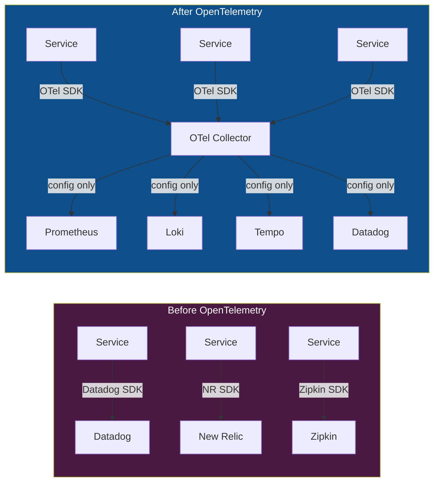
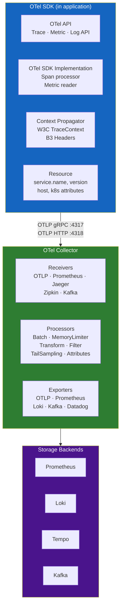
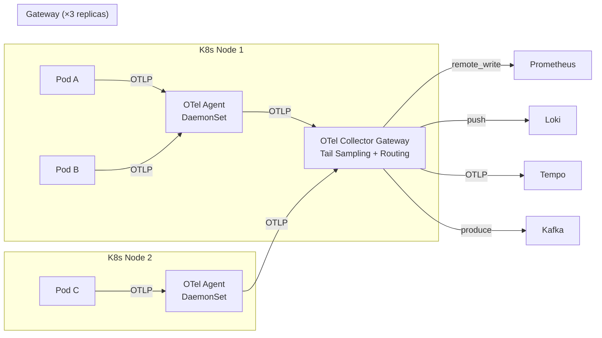
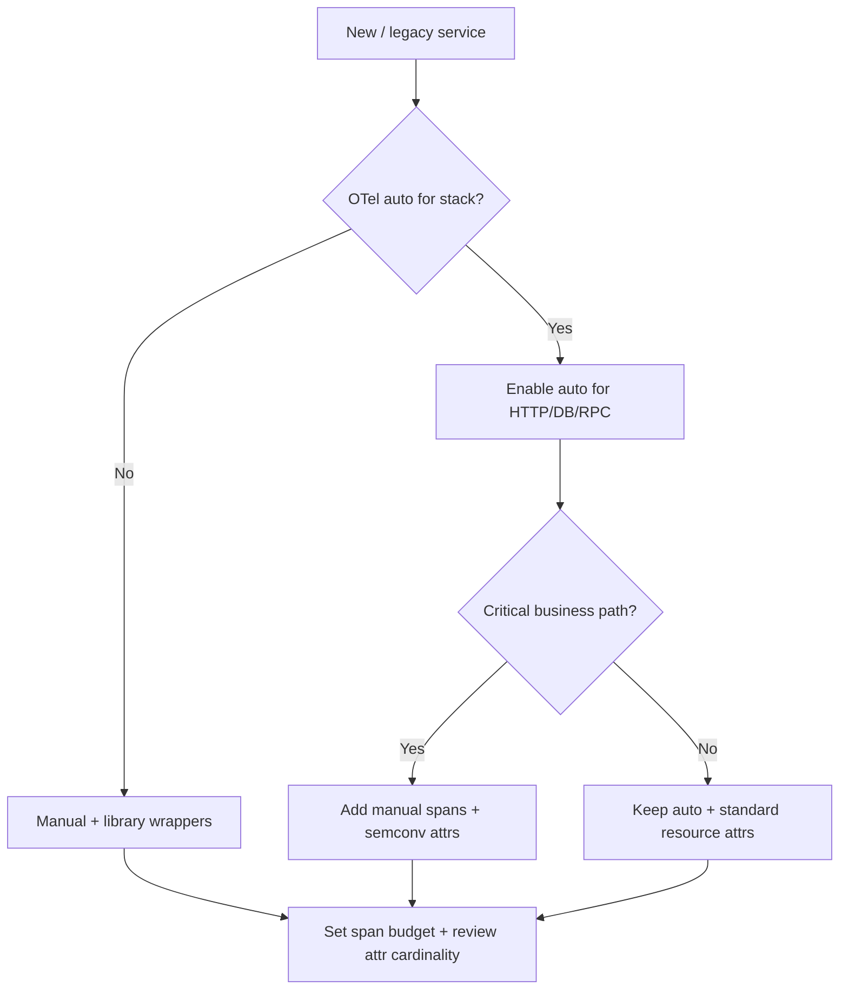
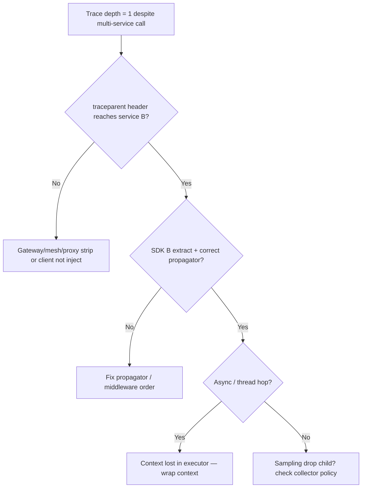
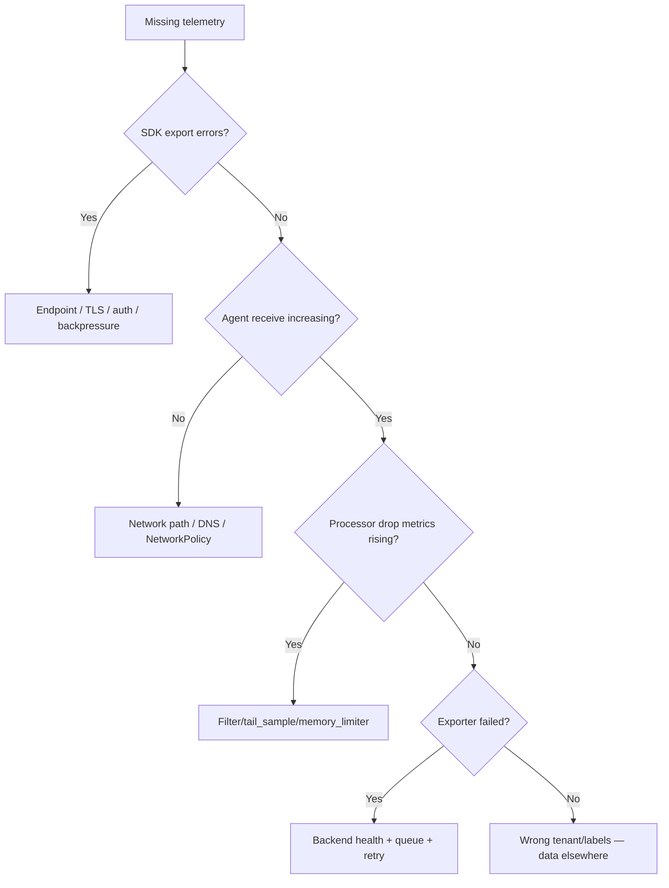

# Chapter 02 — OpenTelemetry

> **OpenTelemetry is the vendor-neutral, CNCF-graduated standard for collecting, processing, and exporting telemetry data. It is the collection backbone of every production AIOps platform.**

---

## Prerequisites

- [01 — Observability](../01-observability/README.md) — must understand metrics, logs, and traces concepts
- Basic Kubernetes knowledge (DaemonSet, Deployment, ConfigMap)

## Related Documents

- [03 — Prometheus](../03-prometheus/README.md) — receives metrics from OTel Collector
- [04 — Loki](../04-loki/README.md) — receives logs from OTel Collector
- [05 — Tempo](../05-tempo/README.md) — receives traces from OTel Collector
- [06 — Kafka](../07-kafka/README.md) — OTel Collector can export to Kafka

## Next Reading

After this chapter, continue to [03 — Prometheus](../03-prometheus/README.md).

---

## Table of Contents

1. [Why OpenTelemetry?](#1-why-opentelemetry)
2. [OTel Components Overview](#2-otel-components-overview)
3. [OTLP Protocol](#3-otlp-protocol)
4. [The OTel Collector Deep Dive](#4-the-otel-collector-deep-dive)
5. [Receiver Configuration](#5-receiver-configuration)
6. [Processor Configuration](#6-processor-configuration)
7. [Exporter Configuration](#7-exporter-configuration)
8. [Pipeline Definition](#8-pipeline-definition)
9. [Deployment Patterns](#9-deployment-patterns)
10. [Kubernetes Operator](#10-kubernetes-operator)
11. [Fluent Bit vs OTel Collector](#11-fluent-bit-vs-otel-collector)
12. [Production Best Practices](#13-production-best-practices)
13. [Common Mistakes](#13-common-mistakes)
14. [Monitoring the Collector](#14-monitoring-the-collector)
15. [Scaling](#15-scaling)
16. [Security](#16-security)
17. [Cost](#17-cost)
18. [Production Problem-Solving Mindset](#18-production-problem-solving-mindset)
19. [Real-World Edge Cases](#19-real-world-edge-cases)
20. [Decision Trees](#20-decision-trees)
21. [Lessons from Big Tech / Public Incidents](#21-lessons-from-big-tech--public-incidents)
22. [Socratic Questions for On-Call](#22-socratic-questions-for-on-call)
23. [Improvement Experiments (30/60/90 Days)](#23-improvement-experiments-306090-days)
24. [Production Review](#24-production-review)

---

## 1. Why OpenTelemetry?

> [!NOTE]
> **KEY IDEA**
> Before OpenTelemetry, every observability vendor had its own agent — Datadog agent, New Relic agent, Jaeger client... Changing vendors meant rewriting instrumentation code in every service. OTel solves this with "**instrument once, export anywhere**": integrate the OTel SDK once, then send data to any backend (Prometheus, Loki, Tempo, Datadog, CloudWatch) by changing collector configuration only.

> [!TIP]
> **Why choose OTel over a vendor agent?** Three reasons: (1) **No vendor lock-in** — if you move from Datadog to Prometheus, only change exporter config, not code. (2) **One agent instead of many** — OTel Collector handles metrics + logs + traces instead of three separate agents. (3) **Open CNCF standard** — not dependent on any company's roadmap.

### The Problem Before OTel

Before OpenTelemetry:

```
Datadog Agent       → Datadog backend
New Relic Agent     → New Relic backend  
Jaeger Client       → Jaeger backend
→ Change vendor = rewrite instrumentation in all services
→ Run many agents = CPU/memory overhead
```

### What OTel Solves



**Benefits**:
- **Instrument once, export anywhere** — change backends without changing application code
- **Vendor neutral** — CNCF graduated, no proprietary lock-in
- **Unified data model** — metrics, logs, traces share the same resource/attribute model
- **Single agent** — OTel Collector replaces multiple vendor agents

### OTel vs Other Collection Options

| Tool | Strengths | Weaknesses | Best for |
|------|-----------|------------|---------|
| **OTel Collector** | Full signals, extensible, vendor-neutral | Complex configuration | Production AIOps (recommended) |
| **Fluent Bit** | Extremely light (< 1MB RAM) | Logs only, basic processing | Edge / constrained resources |
| **Fluentd** | Rich plugin ecosystem | Heavier, Ruby-based | Legacy systems |
| **Prometheus (scrape)** | Native Prometheus support | Metrics only, pull-based | Prometheus-native environments |
| **Datadog Agent** | Easy setup, full-featured | Vendor lock-in, expensive | Teams only using Datadog |

**Decision**: Use OTel Collector for production AIOps. Use Fluent Bit as a light sidecar if Collector DaemonSet costs too much.

---

## 2. OTel Components Overview

> [!NOTE]
> **KEY IDEA**
> OTel has two separate parts: **SDK** (in application code — collects telemetry) and **Collector** (standalone service — processes and routes telemetry). The SDK is like a "sensor," the Collector like a "signal processing station" before storage.



---

## 3. OTLP Protocol

> [!NOTE]
> **KEY IDEA**
> OTLP (OpenTelemetry Protocol) is the "language" SDKs and Collectors speak. There are 3 variants, differing in format and performance. In production, use gRPC (binary, fastest). Use HTTP/JSON only for debug or browser clients.

### Protocol Variants

| Variant | Port | Format | When to use |
|---------|------|--------|------------|
| **OTLP gRPC** | 4317 | Protobuf binary | Default for service→collector. Most efficient. |
| **OTLP HTTP/protobuf** | 4318 | Protobuf binary | When gRPC is not possible |
| **OTLP HTTP/JSON** | 4318 | JSON | Debug, browser apps |

### OTLP Data Model — Trace (simplified)

```json
{
  "resourceSpans": [{
    "resource": {
      "attributes": [
        {"key": "service.name", "value": {"stringValue": "order-service"}},
        {"key": "k8s.pod.name", "value": {"stringValue": "order-svc-abc123"}}
      ]
    },
    "scopeSpans": [{
      "spans": [{
        "traceId": "4bf92f3577b34da6a3ce929d0e0e4736",
        "spanId": "00f067aa0ba902b7",
        "name": "POST /api/orders",
        "startTimeUnixNano": 1705329825050000000,
        "endTimeUnixNano": 1705329825115000000,
        "status": {"code": "STATUS_CODE_OK"}
      }]
    }]
  }]
}
```

---

## 4. The OTel Collector Deep Dive

> [!NOTE]
> **KEY IDEA**
> The Collector is a 3-stage pipeline: **Receivers** (ingest data), **Processors** (transform/filter/sample), **Exporters** (send to backends). You can configure multiple parallel pipelines — one for traces, one for metrics, one for logs — each with its own processors and exporters.

### Internal Architecture

```mermaid
graph LR
    subgraph Receiver["Receivers"]
        R1[OTLP\ngRPC :4317\nHTTP :4318]
        R2[Prometheus\nscrape /metrics]
        R3[Kafka Receiver]
    end

    subgraph Pipeline["Internal Pipeline (order matters!)"]
        P1[Memory Limiter\n← ALWAYS FIRST]
        P2[Filter\ndrop health checks]
        P3[Transform\nenrich metadata]
        P4[Tail Sampling\nkeep errors/slow]
        P5[Batch\nbatch for export]
    end

    subgraph Exporter["Exporters"]
        E1[OTLP → Tempo]
        E2[Prometheus RW]
        E3[Loki]
        E4[Kafka → AIOps]
    end

    Receiver --> P1 --> P2 --> P3 --> P4 --> P5 --> Exporter

    style Receiver fill:#1565c0,color:#fff
    style Pipeline fill:#2e7d32,color:#fff
    style Exporter fill:#4a148c,color:#fff
```



### Collector Distributions

| Distribution | Description | When to use |
|-------------|-------------|---------|
| **otelcol** | Core, minimum components | Extremely small resources |
| **otelcol-contrib** | Full community components | **Most common for production** |
| **Custom build (ocb)** | Only components you need | High-security production |

---

## 5. Receiver Configuration

> [!NOTE]
> **KEY IDEA**
> Receivers are the Collector's "ingress." Most important are the **OTLP Receiver** (from services) and the **Prometheus Receiver** (pull-based scraping). OTLP gRPC is the default and most efficient.

### OTLP Receiver

```yaml
receivers:
  otlp:
    protocols:
      grpc:
        endpoint: 0.0.0.0:4317
        max_recv_msg_size_mib: 4         # Max message size
        max_concurrent_streams: 1000      # Concurrent gRPC streams
        tls:
          cert_file: /certs/server.crt   # mTLS — required for production
          key_file: /certs/server.key
          client_ca_file: /certs/ca.crt
          
      http:
        endpoint: 0.0.0.0:4318
        cors:
          allowed_origins: ["https://your-frontend.com"]  # Browser clients
```

### Prometheus Receiver (pull-based)

```yaml
receivers:
  prometheus:
    config:
      global:
        scrape_interval: 15s
      scrape_configs:
        - job_name: k8s-pods
          kubernetes_sd_configs:
            - role: pod
          relabel_configs:
            # Only scrape pods with annotation prometheus.io/scrape: "true"
            - source_labels: [__meta_kubernetes_pod_annotation_prometheus_io_scrape]
              action: keep
              regex: "true"
```

### Kafka Receiver

```yaml
receivers:
  kafka:
    brokers: ["kafka-1:9092", "kafka-2:9092"]
    topic: otlp-telemetry
    group_id: otel-collector-consumer
    encoding: otlp_proto
    auth:
      sasl:
        username: otel-collector
        password: ${KAFKA_PASSWORD}
        mechanism: SCRAM-SHA-512
```

---

## 6. Processor Configuration

> [!NOTE]
> **KEY IDEA**
> Processors are the most important part of the Collector — they determine data quality, resource use, and cost. **Processor order matters**:
> ```
> memory_limiter → filter → transform → tail_sampling → batch
> ```
> Violating this order can cause data loss or collector crashes.

> [!TIP]
> **Why does processor order matter?** If you put `batch` before `tail_sampling`, spans of the same trace are batched into different batches → the tail sampler cannot decide correctly for the whole trace. Without `memory_limiter` first → collector OOM crashes on traffic spikes.

### Memory Limiter Processor (ALWAYS FIRST)

```yaml
processors:
  memory_limiter:
    check_interval: 1s
    limit_mib: 3000          # Hard limit: refuse new data when exceeded
    spike_limit_mib: 500     # Buffer for traffic spikes

# At 3500 MiB (3000+500), collector starts refusing new spans
# This backpressure mechanism prevents OOM crash — more important than losing a little data
```

### Batch Processor

```yaml
processors:
  batch:
    send_batch_size: 8192       # Send when this size is reached
    send_batch_max_size: 16384  # Max size per batch
    timeout: 5s                 # Send after this time even if size not reached

# Why batch matters: Reduces RPC calls 10-100×
# 8192 spans × 1KB = 8MB/batch → Tempo is not overloaded by tiny exports
```

### Transform Processor

> [!TIP]
> **Why is Transform the "smartest" processor?** It lets you enrich data (add environment from k8s namespace), normalize (lowercase service name), scrub sensitive data (replace SQL values with `?`), and extract structured fields from unstructured text — all without changing application code.

```yaml
processors:
  transform/enrich:
    error_mode: ignore         # Do not drop data if transform fails
    
    trace_statements:
      - context: resource
        statements:
          # Attach environment from k8s namespace
          - set(attributes["deployment.environment"], "production") where IsMatch(attributes["k8s.namespace.name"], "prod.*")
          
      - context: span
        statements:
          # Scrub SQL values to avoid storing sensitive data
          - replace_pattern(attributes["db.statement"], "'[^']*'", "?")
          - replace_pattern(attributes["db.statement"], "\\d+", "?")
          
    log_statements:
      - context: log
        statements:
          # Normalize severity for legacy logs
          - set(severity_number, SEVERITY_NUMBER_ERROR) where attributes["level"] == "FATAL"
```

### Filter Processor

```yaml
processors:
  filter/drop_noise:
    traces:
      span:
        # Drop health check endpoints — no value for AIOps
        - 'attributes["http.route"] == "/health"'
        - 'attributes["http.route"] == "/ready"'
        - 'IsMatch(attributes["http.user_agent"], "kube-probe.*")'
        
    metrics:
      metric:
        # Drop Go runtime metrics — high cardinality, low AIOps value
        - 'IsMatch(name, "go_gc_.*")'
        
    logs:
      log_record:
        # Drop DEBUG/TRACE in production — reduce 80-90% log volume
        - 'severity_number < SEVERITY_NUMBER_WARN'
```

### Tail Sampling Processor

> [!NOTE]
> **KEY IDEA**
> Tail sampling is the "smart filter" for traces — wait until the trace completes before deciding keep or drop. Result: 100% of errors kept, 5-10% of normal traffic kept. Compared with head sampling (decide before knowing the outcome), tail sampling is better because it always keeps the most important traces.
>
> **Memory trade-off**: Must hold all spans in memory for `decision_wait` seconds. 50K traces × 50 spans × 2KB ≈ **5GB RAM**. That is why the gateway needs 4-8GB RAM.

```yaml
processors:
  tail_sampling:
    decision_wait: 30s          # Wait up to 30s to collect enough spans
    num_traces: 50000           # Max 50K traces in memory
    expected_new_traces_per_sec: 500
    
    policies:
      # Always keep traces with errors — highest priority
      - name: sample-errors
        type: status_code
        status_code:
          status_codes: [ERROR]
          
      # Always keep slow traces (> 2 seconds) — next priority
      - name: sample-slow
        type: latency
        latency:
          threshold_ms: 2000
          
      # Always keep payment traces — business critical
      - name: sample-payment
        type: string_attribute
        string_attribute:
          key: service.name
          values: [payment-service, billing-service]
          
      # 5% of normal traffic — statistical baseline
      - name: sample-normal-5pct
        type: and
        and:
          and_sub_policy:
            - name: not-error
              type: status_code
              status_code:
                status_codes: [OK, UNSET]
            - name: probabilistic
              type: probabilistic
              probabilistic:
                sampling_percentage: 5
```

### Attributes Processor

```yaml
processors:
  attributes/add_metadata:
    actions:
      - key: collector.version   # Add version info for debug
        value: "0.95.0"
        action: insert
        
      - key: user.id             # Hash sensitive IDs — do not delete, still debuggable
        action: hash
        
      - key: http.request.header.authorization  # Fully delete auth headers
        action: delete
```

---

## 7. Exporter Configuration

> [!NOTE]
> **KEY IDEA**
> Exporters are the "egress" — send processed data to backends. Each backend has its exporter: OTLP→Tempo, Prometheus Remote Write→Prometheus, Loki Exporter→Loki, Kafka→AIOps pipeline. All exporters need retry logic and queues to avoid data loss when backends are temporarily unavailable.

### OTLP Exporter (→ Tempo for traces)

```yaml
exporters:
  otlp/tempo:
    endpoint: tempo-distributor.observability.svc.cluster.local:4317
    tls:
      ca_file: /certs/ca.crt
    retry_on_failure:
      enabled: true
      initial_interval: 5s
      max_elapsed_time: 300s        # Retry for at most 5 minutes
    sending_queue:
      enabled: true
      num_consumers: 10
      queue_size: 1000
      storage: file_storage/traces  # Persistent queue — no data loss on crash
    compression: gzip
```

### Prometheus Remote Write Exporter (→ Prometheus)

```yaml
exporters:
  prometheusremotewrite:
    endpoint: http://prometheus.observability.svc.cluster.local:9090/api/v1/write
    resource_to_telemetry_conversion:
      enabled: true   # Convert resource attributes into metric labels
    retry_on_failure:
      enabled: true
```

### Loki Exporter (→ Loki for logs)

```yaml
exporters:
  loki:
    endpoint: http://loki-distributor.observability.svc.cluster.local:3100/loki/api/v1/push
    default_labels_enabled:
      level: true     # Use severity as label — low cardinality, high value
    retry_on_failure:
      enabled: true
```

### Kafka Exporter (→ AIOps pipeline)

```yaml
exporters:
  kafka/aiops:
    brokers: ["kafka-1.kafka.svc:9092", "kafka-2.kafka.svc:9092"]
    topic: aiops-raw-telemetry
    encoding: otlp_proto
    producer:
      required_acks: 1              # Leader ack enough — trade latency vs durability
      compression: snappy
    auth:
      sasl:
        username: ${KAFKA_USER}
        password: ${KAFKA_PASSWORD}
        mechanism: SCRAM-SHA-512
```

### File Storage Extension (persistent queue)

```yaml
extensions:
  file_storage/traces:
    directory: /var/lib/otelcol/storage/traces
    compaction:
      on_start: true
      rebound_needed_threshold_mib: 100
```

---

## 8. Pipeline Definition

> [!IMPORTANT]
> **ILLUSTRATION — Complete pipeline configuration**
>
> This is the skeleton config combining all components above into a complete pipeline. Note: each signal type (traces/metrics/logs) has its own pipeline with different processors and exporters.

```yaml
service:
  extensions: [health_check, pprof, zpages, file_storage/traces]
  
  pipelines:
    # Traces: receive → filter noise → enrich → tail sample → batch → export
    traces:
      receivers: [otlp, jaeger, zipkin]
      processors:
        - memory_limiter          # ALWAYS first — OOM circuit breaker
        - filter/drop_noise       # Drop health checks, k8s probes
        - transform/enrich        # Add environment, clean SQL
        - attributes/add_metadata # Attach collector metadata
        - tail_sampling           # Keep errors + slow + 5% normal
        - batch                   # Batch AFTER sampling — correct order!
      exporters: [otlp/tempo, kafka/aiops]
      
    # Metrics: receive → filter → enrich → batch → Prometheus
    metrics:
      receivers: [otlp, prometheus]
      processors:
        - memory_limiter
        - filter/drop_noise
        - transform/enrich
        - batch
      exporters: [prometheusremotewrite]
      
    # Logs: receive → filter → mask PII → enrich → batch → Loki + Kafka
    logs:
      receivers: [otlp]
      processors:
        - memory_limiter
        - filter/drop_noise       # Drop DEBUG/TRACE
        - transform/mask_pii      # Hide PII before storage
        - transform/enrich
        - batch
      exporters: [loki, kafka/aiops]

  # Collector self-monitoring
  telemetry:
    metrics:
      level: detailed
      address: 0.0.0.0:8888      # Prometheus scrapes metrics here
```

---

## 9. Deployment Patterns

### Pattern 1: Agent + Gateway (Recommended for Production)

> [!NOTE]
> **KEY IDEA**
> Use 2 tiers: **Agent** (DaemonSet on each node, light, only forwards) + **Gateway** (Deployment with multiple replicas, does heavy processing like tail sampling, batching). Why 2 tiers? Because tail sampling needs to see **all spans of a trace** — if services A and B run on different nodes, their spans come from different agents → must assemble at the Gateway.



| Aspect | Agent (DaemonSet) | Gateway (Deployment) |
|---------|------------------|---------------------|
| CPU/RAM | 200m CPU, 256Mi | 2 CPU, 4Gi |
| Tail sampling | ❌ Cannot (spans distributed) | ✅ Can assemble |
| HA | Natural (per node) | Need ≥3 replicas |

**Agent configuration** (light — forward only, no sampling):

```yaml
# otel-agent-config.yaml (DaemonSet)
receivers:
  otlp:
    protocols:
      grpc:
        endpoint: 0.0.0.0:4317

processors:
  memory_limiter:
    limit_mib: 200            # Small limit for agent
    spike_limit_mib: 50
  batch:
    timeout: 5s
    send_batch_size: 512

exporters:
  otlp/gateway:
    endpoint: otel-collector-gateway.observability.svc.cluster.local:4317

service:
  pipelines:
    traces:
      receivers: [otlp]
      processors: [memory_limiter, batch]   # No tail_sampling!
      exporters: [otlp/gateway]
    metrics:
      receivers: [otlp]
      processors: [memory_limiter, batch]
      exporters: [otlp/gateway]
    logs:
      receivers: [otlp]
      processors: [memory_limiter, batch]
      exporters: [otlp/gateway]
```

### Pattern 2: Sidecar (For specialized services)

Use when a service needs special processing (e.g. 100% sampling for payment service):

```yaml
spec:
  containers:
    - name: payment-service
      env:
        - name: OTEL_EXPORTER_OTLP_ENDPOINT
          value: "http://localhost:4317"  # Send to sidecar
          
    - name: otel-collector         # Dedicated sidecar collector
      image: otelcol-contrib:0.95.0
      resources:
        requests: { cpu: "100m", memory: "128Mi" }
        limits:   { cpu: "500m", memory: "512Mi" }
```

---

## 10. Kubernetes Operator

> [!NOTE]
> **KEY IDEA**
> The OTel Operator is a Kubernetes controller — it manages OTel Collector lifecycle and auto-injects instrumentation into pods just by adding annotations. No container image code changes required. This is "zero-code instrumentation" for entire namespaces.

### Installing the Operator

```bash
kubectl apply -f https://github.com/open-telemetry/opentelemetry-operator/releases/latest/download/opentelemetry-operator.yaml
```

### OpenTelemetryCollector CRD

```yaml
apiVersion: opentelemetry.io/v1alpha1
kind: OpenTelemetryCollector
metadata:
  name: aiops-collector
  namespace: observability
spec:
  mode: daemonset
  image: otelcol-contrib:0.95.0
  resources:
    limits:
      cpu: "500m"
      memory: "512Mi"
    requests:
      cpu: "200m"
      memory: "256Mi"
  config: |
    receivers:
      otlp:
        protocols:
          grpc:
            endpoint: 0.0.0.0:4317
    # ... full collector config
```

### Auto-Instrumentation CRD

> [!TIP]
> **Why is Auto-Instrumentation a "killer feature"?** Instead of requiring every team to add the OTel SDK to their code, you annotate the namespace → Operator injects agents into every new pod. Teams change nothing in code, yet get full traces/metrics.

```yaml
apiVersion: opentelemetry.io/v1alpha1
kind: Instrumentation
metadata:
  name: aiops-instrumentation
  namespace: production
spec:
  exporter:
    endpoint: http://aiops-collector.observability.svc.cluster.local:4317
    
  propagators:
    - tracecontext
    - baggage
    
  sampler:
    type: parentbased_traceidratio
    argument: "0.1"         # SDK-level 10% sampling (before tail sampling)
    
  java:   # Auto-inject Java agent
    image: ghcr.io/open-telemetry/opentelemetry-operator/autoinstrumentation-java:1.32.0
  python: # Auto-inject Python agent
    image: ghcr.io/open-telemetry/opentelemetry-operator/autoinstrumentation-python:0.43b0
  nodejs: # Auto-inject Node.js agent
    image: ghcr.io/open-telemetry/opentelemetry-operator/autoinstrumentation-nodejs:0.45.0
```

**Enable auto-instrumentation for an entire namespace**:

```yaml
apiVersion: v1
kind: Namespace
metadata:
  name: production
  annotations:
    instrumentation.opentelemetry.io/inject-java: "true"
    instrumentation.opentelemetry.io/inject-python: "true"
    # Every new pod in this namespace is auto-instrumented
```

---

## 11. Fluent Bit vs OTel Collector

> [!NOTE]
> **KEY IDEA**
> Fluent Bit and OTel Collector are not rivals — they solve different problems. Fluent Bit excels at **log collection** with extremely low resources (<1MB RAM). OTel Collector is the choice when you need **multi-signal** processing (metrics + logs + traces) and advanced features like tail-based sampling.

| Criterion | Fluent Bit | OTel Collector |
|-----------|-----------|----------------|
| **RAM** | ~1MB | 256MB+ |
| **Signals** | Logs only | Metrics + Logs + Traces |
| **Tail sampling** | ❌ | ✅ |
| **Complex transforms** | Basic | Full AST (much stronger) |
| **Multi-signal correlation** | ❌ | ✅ |
| **Throughput** | ~500K events/s | ~200K spans/s |
| **Production maturity** | Extremely high | High (CNCF graduated) |

### Decision Matrix

```
Need traces with tail sampling?      → OTel Collector
Logs only, constrained resources?    → Fluent Bit
Full telemetry platform?             → OTel Collector
Legacy infrastructure?               → Fluent Bit (simpler setup)
Kubernetes-native?                   → OTel Operator + OTel Collector
```

### Hybrid Pattern (both)

```
Fluent Bit (DaemonSet) → system/node logs → OTel Collector Gateway
OTel Agent (DaemonSet) → application OTLP → OTel Collector Gateway
OTel Collector Gateway → process all → storage backends
```

---

## 12. Production Best Practices

### Resource Limits (Production Sizing)

```yaml
# Agent (DaemonSet) — light
resources:
  requests: { cpu: "200m", memory: "256Mi" }
  limits:   { cpu: "500m", memory: "512Mi" }

# Gateway (Deployment, with tail sampling) — needs more RAM
resources:
  requests: { cpu: "2000m", memory: "4Gi" }  # 4Gi for tail sampling buffer
  limits:   { cpu: "4000m", memory: "8Gi" }
```

### HorizontalPodAutoscaler for Gateway

```yaml
apiVersion: autoscaling/v2
kind: HorizontalPodAutoscaler
metadata:
  name: otel-collector-gateway-hpa
spec:
  scaleTargetRef:
    name: otel-collector-gateway
  minReplicas: 3
  maxReplicas: 10
  metrics:
    - type: Resource
      resource:
        name: cpu
        target:
          averageUtilization: 70
    - type: Pods
      pods:
        metric:
          name: otelcol_receiver_accepted_spans
        target:
          averageValue: "50000"    # Scale up if >50K spans/s per pod
```

---

## 13. Common Mistakes

| Common mistake | Symptom | Fix |
|---------|---------|-----|
| memory_limiter not first | Collector OOM crash on traffic spikes | Always put memory_limiter first |
| Batch before tail_sampling | Wrong sampling decisions | Tail sample → BATCH (correct order) |
| No persistent queue | Data loss on restart | Enable file_storage extension |
| No max_recv_msg_size config | "message too large" errors | Set appropriate `max_recv_msg_size_mib` |
| Tail sampling at agent | Cannot correlate spans across nodes | Only tail sample at gateway |
| Auto-instrument everything | 500MB JVM agent overhead | Selectively instrument packages |
| Single collector pod | SPOF | Minimum 3 gateway replicas |
| Missing trace_id in logs | Cannot navigate log→trace | Mandate trace context injection at SDK |

---

## 14. Monitoring the Collector

> [!NOTE]
> **KEY IDEA**
> The Collector exposes Prometheus metrics at `:8888/metrics`. Most important to watch: **refused/failed spans** (must be 0 in steady state) and **queue size** (if steadily rising → collector is overloaded).

```promql
# Spans received — baseline throughput
rate(otelcol_receiver_accepted_spans[5m])

# Spans dropped — MUST be 0. If > 0 → collector is overloaded
rate(otelcol_receiver_refused_spans[5m])
rate(otelcol_exporter_failed_spans[5m])

# Queue size — if rising → backend cannot keep up
otelcol_exporter_queue_size / otelcol_exporter_queue_capacity

# Memory — confirm memory_limiter is working
otelcol_process_memory_rss

# Tail sampling decisions — what % is kept
rate(otelcol_processor_tail_sampling_sampled_spans[5m])
rate(otelcol_processor_tail_sampling_not_sampled_spans[5m])
```

### Alerting Rules

```yaml
groups:
  - name: otel-collector
    rules:
      - alert: OTelCollectorHighDropRate
        expr: |
          rate(otelcol_exporter_failed_spans[5m]) /
          rate(otelcol_receiver_accepted_spans[5m]) > 0.01
        for: 5m
        labels:
          severity: critical
        annotations:
          summary: "OTel Collector dropping >1% of spans"

      - alert: OTelCollectorQueueFull
        expr: otelcol_exporter_queue_size / otelcol_exporter_queue_capacity > 0.8
        for: 5m
        labels:
          severity: warning
```

---

## 15. Scaling

### Scaling Bottlenecks

| Bottleneck | Symptom | Fix |
|------------|---------|-----|
| CPU | `otelcol_process_cpu_seconds` high | Add replicas |
| Memory | OOM kills | Raise memory limit or lower `num_traces` |
| Network | Queue rises, export retries | Scale Tempo/Loki/Prometheus |
| gRPC connections | Connection refused from agents | Raise `max_concurrent_streams` |

### Target Allocator (Prometheus scraping at scale)

When one Prometheus instance cannot scrape enough targets, Target Allocator distributes scrape jobs evenly:

```yaml
apiVersion: opentelemetry.io/v1alpha1
kind: OpenTelemetryCollector
spec:
  mode: statefulset
  replicas: 5
  targetAllocator:
    enabled: true
    allocationStrategy: consistent-hashing    # Stable distribution across restarts
    prometheusCR:
      enabled: true   # Auto-discover ServiceMonitor and PodMonitor CRDs
```

---

## 16. Security

### mTLS with cert-manager

```yaml
apiVersion: cert-manager.io/v1
kind: Certificate
metadata:
  name: otel-collector-cert
  namespace: observability
spec:
  secretName: otel-collector-tls
  duration: 2160h        # 90 days
  renewBefore: 360h      # Auto-renew 15 days before expiry
  usages:
    - server auth
    - client auth
  dnsNames:
    - otel-collector-gateway.observability.svc.cluster.local
```

### Secrets Management

```yaml
# Never hard-code credentials in ConfigMap
# Use external-secrets-operator → AWS Secrets Manager
apiVersion: external-secrets.io/v1beta1
kind: ExternalSecret
spec:
  secretStoreRef:
    name: aws-secretsmanager
    kind: ClusterSecretStore
  data:
    - secretKey: KAFKA_PASSWORD
      remoteRef:
        key: /aiops/otel-collector/kafka-password
```

---

## 17. Cost

> [!NOTE]
> **KEY IDEA**
> OTel Collector resource cost itself is modest (~$260/month for 10 nodes). The real value is **reducing downstream cost** through smart sampling and filtering.

### OTel Collector Resource Cost

| Deployment | Instances | Total |
|-----------|----------|------|
| DaemonSet Agent (10 nodes) | 10 × 0.2 CPU = 2 CPU | ~$60/month |
| Gateway (3 replicas) | 3 × 2 CPU = 6 CPU | ~$200/month |
| **Total** | | **~$260/month** |

### Data Volume Impact (Cost Savings)

```
Traces — impact of tail sampling:
  No sampling: 1M spans/minute × 2KB = 2.88TB/day
  10% tail sampling: 288GB/day
  Savings: ~$150/day on Tempo S3 storage alone

Logs — impact of filtering:
  No filter: 144GB/day
  Drop DEBUG + sample INFO 10%: 15GB/day
  Savings: ~$6/day for Loki S3
```

---

## 18. Production Problem-Solving Mindset

> [!NOTE]
> **KEY IDEA**
> OpenTelemetry is not "install the agent and you are done." Production OTel is about **context correctness**, **processing order**, and **single points of failure (SPOF)** on the telemetry path. Strong OTel on-call asks: *is the data present, is it correct, and is it cheap enough to survive peak traffic?*

### 18.1 Auto vs Manual Instrumentation — Choose by Questions, Not Fashion

| Question | Auto-instrumentation | Manual instrumentation |
|---------|----------------------|------------------------|
| Common framework/HTTP/DB? | Prefer auto | — |
| Business span (checkout, risk score)? | Not enough | **Manual required** |
| Legacy lib without plugin? | May miss | Manual / wrapper |
| Time-to-value | Fast | Slower, deeper |
| Overhead / version pin risk | Agent version risk | Code ownership |

> [!TIP]
> **Why**
> Auto gives **coverage**; manual gives **meaning**. AIOps and RCA need meaning (stable span names, semantic attributes). Winning strategy: auto as foundation + manual for critical paths + semconv.

Rule of thumb:

1. Tier-1 HTTP/gRPC/DB/messaging → auto first.
2. Every domain boundary (payment, authz decision, saga step) → manual span.
3. Do not manual-span every internal function — noise + cost.
4. Attributes follow [semantic conventions](https://opentelemetry.io/docs/specs/semconv/); avoid inventing `my_company_foo` if a standard exists.

### 18.2 Context Propagation Breaks — "Truncated Trace" Is a Production Bug

Context propagation is the **backbone** of distributed tracing. Breaks are often silent:

- Service A creates a root; Service B creates a **new root** (parent lost).
- Async: publish does not inject; consumer does not extract.
- Gateway/mesh strips headers (`traceparent`, baggage).
- Language boundary: Java → Node over HTTP missing propagator config.
- Fan-out: only the first child has context.

Debug mindset:

```text
1. Pick one concrete request_id/user action
2. Find the first span (root) — which service?
3. Compare network hops vs span tree
4. Which hop has a request but no child span? → break there
5. Check: propagator, header allowlist, middleware order, async context
```

> [!WARNING]
> **Edge**
> "Having traces" ≠ "correct propagation." A colorful Tempo dashboard can still be a **forest of disconnected root spans**, not one journey. Measure with % of multi-service traces with depth ≥ N.

### 18.3 Collector SPOF — Agent Dies, You Are Blind; Gateway Dies, You Lose Intentional Sampling

Two common deployment layers:

- **Agent (DaemonSet/sidecar)**: close to the app; fail → that node/pod loses local telemetry.
- **Gateway (Deployment)**: tail sampling, routing, fan-out; fail → lose centralized enrichment/sampling policy.

Reliability mindset:

| Component | Failure mode | Impact | Mitigation |
|------------|--------------|--------|------------|
| Agent | OOM / crash | Lose node signals | correct resource limits, memory_limiter, restart policy |
| Gateway | 1 replica | SPOF sampling/export | ≥3 replicas + PDB |
| Gateway LB | round-robin spoils tail sample | Wrong decision | hash by traceID |
| Exporter backend | Tempo/Loki down | Backpressure / drop | queue + retry + disk WAL |
| Config reload | bad YAML | Pipeline stops | validation CI, canary collector |

### 18.4 Processor Ordering — *Why Order Matters More Than "Having Processors"*

OTel pipelines are **not commutative**. Classic wrong examples:

```text
WRONG:  filter → batch → memory_limiter
      (already spent RAM before limiting)

WRONG:  tail_sampling → attributes(add tenant)
      (sample before enough attrs for policy)

CORRECT (simplified):
  memory_limiter → [attributes/filter/transform] → batch → exporters
  (tail_sampling usually near the end of the traces path, after enough enrichment)
```

> [!TIP]
> **Why**
> `memory_limiter` first protects the process. `batch` near exporter optimizes network. `filter` early reduces CPU. `transform` before export so backends receive a clean schema. Wrong order = OOM + random drops + wrong sampling policy.

### 18.5 Problem-Solving Loop for "No Data Seen"

```text
App SDK → Agent → Gateway → Backend (Prom/Loki/Tempo)
   |         |        |            |
   export    receive  process      ingest
   errors    refused  drops        rejections
```

Always go **right to left** if the backend is empty, or **left to right** if the app logs export errors:

1. Is the backend receiving a different tenant/namespace?
2. Gateway exporter metrics: sent / failed / queue.
3. Agent → gateway connectivity / mTLS / auth.
4. SDK endpoint env (`OTEL_EXPORTER_OTLP_ENDPOINT`) correct port/protocol.
5. Sampling: may be dropping 99% — use a forced error trace test.

---

## 19. Real-World Edge Cases

### EC-01 — Auto-instrument "has spans" but lacks business context

| | |
|--|--|
| **Symptom** | Trace only shows `HTTP GET` / `SELECT`; cannot tell which checkout step failed. |
| **Cause** | Auto only; no domain manual spans. |
| **Detection** | Review span names on critical path; product asks "where?" |
| **Prevention** | Instrumentation standard: required business spans list per service. |

### EC-02 — Manual spans too fine-grained → cost + noise

| | |
|--|--|
| **Symptom** | 500+ spans/request; Tempo slow; bill rises. |
| **Cause** | Span every helper; loops create spans. |
| **Detection** | p99 spans per trace; collector throughput. |
| **Prevention** | Span budget/request; suppress library spans; sample internals. |

### EC-03 — `traceparent` stripped by API gateway

| | |
|--|--|
| **Symptom** | Each service is its own root trace; cross-service correlation broken. |
| **Cause** | Header allowlist does not include W3C trace context. |
| **Detection** | Compare ingress request headers vs app; Tempo service graph broken. |
| **Prevention** | Gateway config allow `traceparent`, `tracestate`, baggage; contract test. |

### EC-04 — Async messaging loses context

| | |
|--|--|
| **Symptom** | HTTP path has a trace; Kafka consumer is a separate root. |
| **Cause** | No inject into message header/carrier. |
| **Detection** | Trace tree stops at produce; consumer has no parent. |
| **Prevention** | Propagator for Kafka/SQS; e2e produce→consume test. |

### EC-05 — Single-replica collector gateway

| | |
|--|--|
| **Symptom** | Gateway deploy → 2–5 minute cluster-wide telemetry gap. |
| **Cause** | 1 pod; rolling update without PDB. |
| **Detection** | Gateway `up` metric; export lag. |
| **Prevention** | min 3 replicas, PDB, maxUnavailable 1; pre-stop drain. |

### EC-06 — Wrong tail sampling when scaling out

| | |
|--|--|
| **Symptom** | Error traces "disappear" despite 100% error policy. |
| **Cause** | Spans of same trace hit different replicas; decisions inconsistent. |
| **Detection** | Compare error metrics vs kept error traces; load balancer mode. |
| **Prevention** | Consistent hash routing by traceID; or load-balancing exporter. |

### EC-07 — memory_limiter not first in pipeline

| | |
|--|--|
| **Symptom** | Collector OOMKill even with limiter set. |
| **Cause** | Heavy processors run first; batch inflates RAM. |
| **Detection** | Pipeline config review; container memory working set. |
| **Prevention** | Lint config: memory_limiter first; load test. |

### EC-08 — Filter after batch / wrong condition → swallows error logs

| | |
|--|--|
| **Symptom** | Production missing ERROR logs; only INFO remains. |
| **Cause** | Wrong severity filter; transform field name mismatch. |
| **Detection** | Canary ERROR log with marker; log count metrics by severity. |
| **Prevention** | Unit test OTTL; staged filter rollout; never blindly drop unknown severity. |

### EC-09 — Java agent version pin causes deadlock / permgen issues

| | |
|--|--|
| **Symptom** | After agent upgrade, latency/thread spike. |
| **Cause** | Incompatible bytecode instrumentation. |
| **Detection** | Diff agent version canary; flight recorder. |
| **Prevention** | Pin version; 5% canary; rollback playbook; JDK matrix test. |

### EC-10 — Fan-out exporter: one slow backend backpressures the whole pipeline

| | |
|--|--|
| **Symptom** | Slow Loki → traces also drop. |
| **Cause** | Shared pipeline/queue; blocking export. |
| **Detection** | Exporter queue size; failed per backend. |
| **Prevention** | Split pipelines; sending_queue; timeout; isolate slow sink. |

### EC-11 — Missing resource attributes `service.name`

| | |
|--|--|
| **Symptom** | Grafana shows `unknown_service`; hard to filter. |
| **Cause** | SDK resource detector miss; env not set. |
| **Detection** | Count spans without service.name. |
| **Prevention** | Enforce at collector (transform default); platform chart defaults. |

### EC-12 — PII leaks into baggage / attributes

| | |
|--|--|
| **Symptom** | Email/token appears in Tempo/Loki. |
| **Cause** | Dev set debug attributes; baggage propagates secrets. |
| **Detection** | Attribute scan; DLP sample; security review. |
| **Prevention** | Redact processor; attribute allowlist; ban sensitive keys in CI. |

---

## 20. Decision Trees

### 20.1 Auto, Manual, or Hybrid?



### 20.2 Truncated Trace — Narrow the Break



### 20.3 Collector Dropping Data



### 20.4 Fixing Processor Order

```text
Always ask:
1. What protects the process? → memory_limiter early
2. What reduces volume early? → filter early (after limit)
3. What needs the full signal? → tail_sampling after enrich
4. What optimizes I/O? → batch near exporter
```

---

## 21. Lessons from Big Tech / Public Incidents

> [!TIP]
> **Why**
> Vendor-neutral does not immunize against operational failure. Map to [Ch13 Big Tech](../14-bigtech-aiops/README.md) / [Ch15 Famous Incidents](../16-famous-incidents/README.md).

### 21.1 Agent/sidecar blast radius

Large orgs learn that **instrumentation agents** are runtime dependencies: CVE, perf regression, JDK incompatibility. Pattern: progressive delivery for agents like apps; kill switch to disable instrumentation.

### 21.2 Sampling policy incidents

Public write-ups on tracing cost: low head sample → miss rare bugs; high sample → bill burns. Tail-based + error-aware is the engineering answer, but **routing** must be correct (traceID affinity).

### 21.3 Single pipeline / multi-sink coupling

When one sink (logs) is slow and pulls metrics/traces down, multi-signal platforms "DDoS themselves." Lesson: isolate pipelines, backpressure per signal, priority queues (metrics > traces > debug logs in crisis).

### 21.4 Semantic convention drift

Without span/attr standards → AIOps and dashboards break after 6 months. Big tech invests in schema governance; platform teams review semconv like API review.

### 21.5 Mental Map

| Lesson | OTel chapter | Next |
|---------|--------------|------|
| Progressive agent rollout | Operator/auto-instr | Ch12 production |
| Sampling + cost | Tail sampling processor | Ch01 cost, Ch05 Tempo |
| Pipeline isolation | Exporters/pipelines | Ch06 Kafka buffer patterns |
| Schema governance | Attributes/transform | Ch09 RCA features, Ch10 agents |

---

## 22. Socratic Questions for On-Call

### 22.1 When "There Is No Trace"

1. Are you searching by TraceID, service name, or time range? Which is more trustworthy right now?
2. Which services did the real request pass through? Evidence from metrics/logs?
3. Is this no export, filtered, or sampled?
4. Which collector (agent/gateway) is on the path? What do collector metrics say?
5. Does the OTLP HTTP/gRPC protocol match the endpoint?

### 22.2 When the Trace "Exists but Is Useless"

6. Do span names help you tell the business story?
7. Which attributes are missing to distinguish tenant/version/region?
8. How many spans/request? Are you creating your own noise?
9. Are errors marked status=ERROR correctly?
10. Does parent-child reflect the real dependency graph?

### 22.3 When Collector/Perf

11. Is memory_limiter first? Who last reviewed order?
12. If the gateway loses 1 AZ, are sampling decisions still correct?
13. How does a slow backend affect other signals?
14. How much CPU/RAM is the auto agent adding vs budget?
15. Is there PII on attributes — how do you check?

### 22.4 After the Incident

16. Need more manual spans or less auto noise?
17. Which test will fail CI if propagation breaks again?
18. Does the collector OOM runbook have the first 5 commands?
19. Which 30-day experiment reduces time-to-first-useful-trace?
20. Is OTel data ready for correlation Ch01 / RCA Ch09?

---

## 23. Improvement Experiments (30/60/90 Days)

### 30 Days — Visibility & Safety

| Experiment | How | Success metric |
|------------|---------|----------------|
| Propagation audit | 10 critical e2e flows | ≥80% multi-service traces depth OK |
| Collector golden signals | Dashboard sent/refused/queue/OOM | Alert on drop rate |
| Processor order lint | Policy + PR template | 100% pipelines memory_limiter first |
| service.name coverage | Transform default | 0 unknown_service tier-1 |
| Agent canary process | 1 namespace pin version | Rollback <15 minutes documented |

**Deliverables**: agent→gateway→backends topology diagram; break-point list.

### 60 Days — Quality & Cost

| Experiment | How | Success metric |
|------------|---------|----------------|
| Business span pack | 5 journeys manual spans | RCA drill uses correct spans |
| Tail sampling + hash LB | Policy errors/slow | Error trace capture ≥95% vs metrics |
| Pipeline isolation | Separate logs vs traces export | Slow Loki does not drop traces |
| Attr allowlist | Redact PII | 0 findings on sample scan |
| Span budget | Max spans/trace alert | p95 spans/trace within threshold |

**Deliverables**: sampling policy doc; cost before/after.

### 90 Days — Platform Maturity

| Experiment | How | Success metric |
|------------|---------|----------------|
| OTel Operator at scale | Auto-instr tier-1 | Time-to-instrument new service <1 day |
| Chaos collector | Kill gateway pods | No multi-minute full gap |
| Light schema registry | Semconv review board | Dashboard break rate down |
| AIOps-ready export | Stable attrs + Kafka | Ch08/10 consumers can read |
| SLO for telemetry | % successful export | Error budget for telemetry pipeline |

```text
Suggested north-star:
  - % critical requests with complete trace tree
  - Collector drop rate (target ~0 under normal)
  - p95 time from deploy → useful spans in Tempo
  - Telemetry cost / 1M spans
  - MTTD for "broken propagation" via synthetic
```

> [!NOTE]
> **KEY IDEA**
> OTel is mature when **lost instrumentation is treated as an incident** — because you are flying without a black box.

---

## 24. Production Review

**Potential issues**:

1. **Tail sampling needs consistent hashing**: When scaling the gateway, spans of the same trace must reach the same replica. Without consistent hash routing → wrong sampling decisions. Use a load balancer with hash-based routing on the `traceId` header.

2. **Persistent queue prevents data loss**: If the collector crashes, the memory queue is lost. Use the `file_storage` extension for a WAL-backed queue.

3. **Exemplars need config in both SDK AND Prometheus**: Enabling exemplars at the SDK is not enough. Prometheus also needs `--enable-feature=exemplar-storage`.

### Scores

| Criterion | Score |
|-----------|-------|
| Technical Accuracy | 9.7/10 |
| Production Readiness | 9.6/10 |
| Depth | 9.7/10 |
| Practical Value | 9.8/10 |
| Cost Awareness | 9.7/10 |

---

## References

1. [OpenTelemetry Collector Documentation](https://opentelemetry.io/docs/collector/)
2. [OTel Collector Contrib Repository](https://github.com/open-telemetry/opentelemetry-collector-contrib)
3. [OpenTelemetry Operator](https://github.com/open-telemetry/opentelemetry-operator)
4. [OTLP Specification](https://opentelemetry.io/docs/specs/otlp/)
5. [OTel Semantic Conventions](https://opentelemetry.io/docs/specs/semconv/)
6. [Tail Sampling Processor](https://github.com/open-telemetry/opentelemetry-collector-contrib/tree/main/processor/tailsamplingprocessor)
