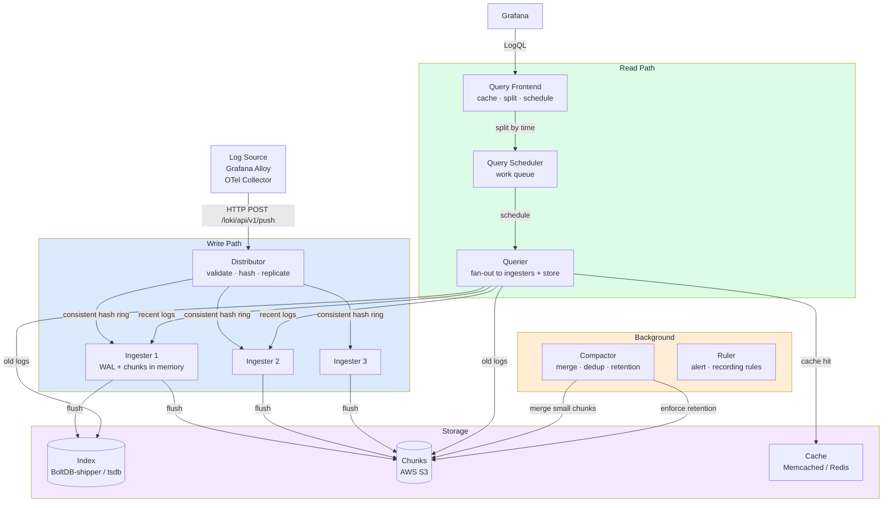
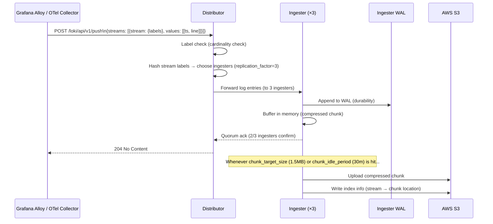
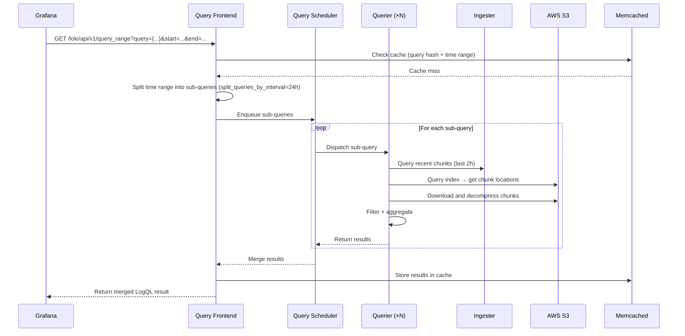
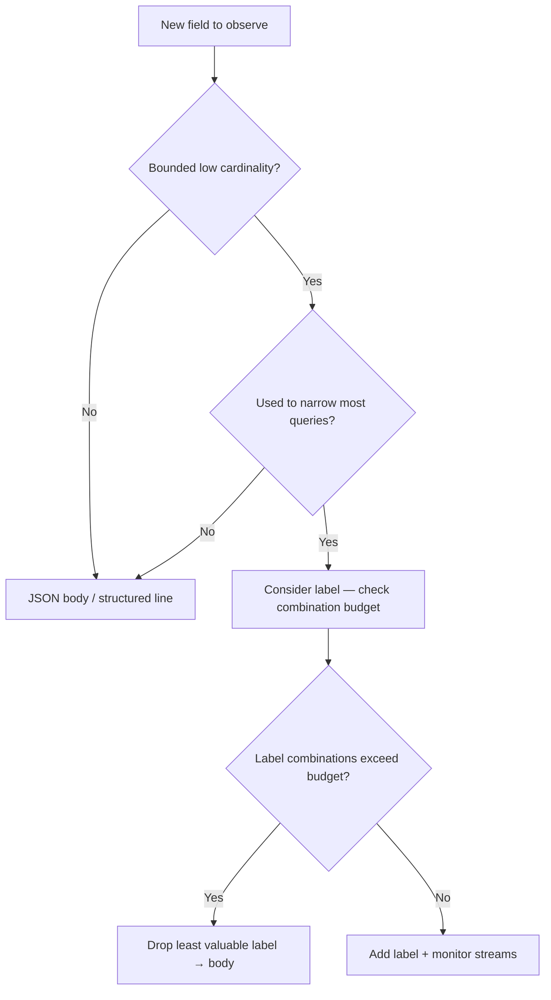
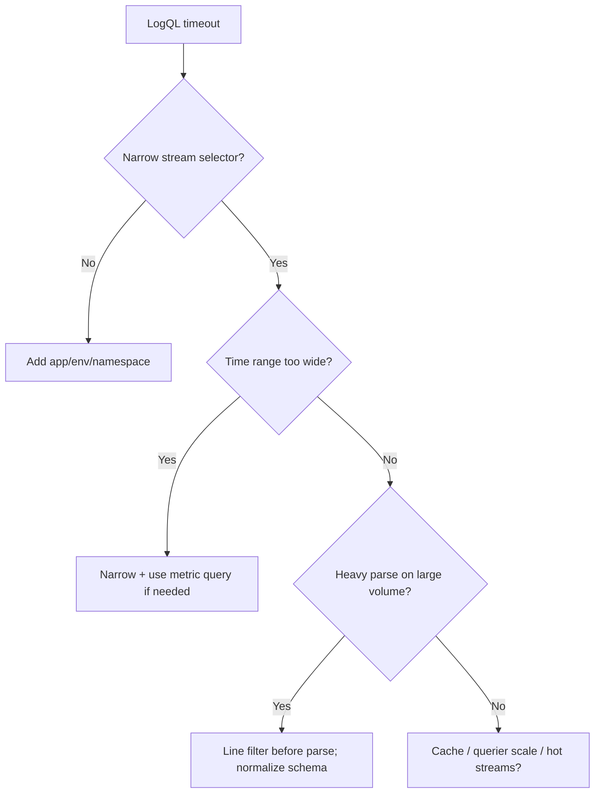
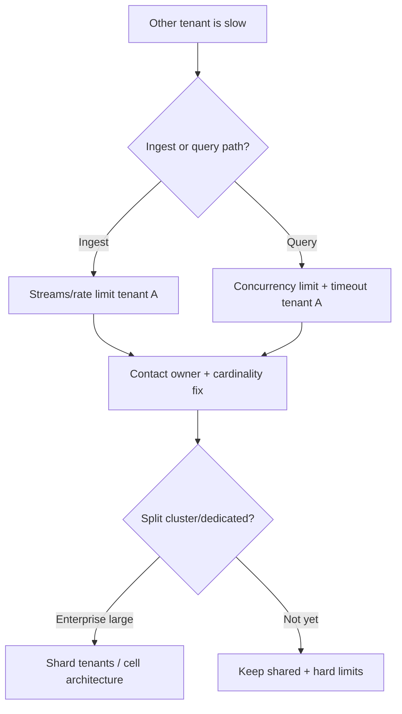

# Chapter 04 — Loki

> **Loki is Grafana’s horizontally scalable log aggregation system, designed with the philosophy “logs like metrics”: index only labels, compress log content, and store it on object storage. At large production scale, Loki is far cheaper than ELK while integrating natively with Prometheus and Grafana.**

---

## Prerequisites

- [01 — Observability](../01-observability/README.md) — log concepts, cardinality
- [02 — OpenTelemetry](../02-opentelemetry/README.md) — log collection pipeline
- [03 — Prometheus](../03-prometheus/README.md) — label model (Loki shares this model)

## Related Documents

- [02 — OpenTelemetry](../02-opentelemetry/README.md) — Loki exporter in OTel Collector
- [07 — Anomaly Detection](../08-anomaly-detection/README.md) — anomaly detection on logs
- [09 — Root Cause Analysis](../10-root-cause-analysis/README.md) — log data as input to RCA

## Next Reading

After this chapter, continue to [05 — Tempo](../05-tempo/README.md).

---

## Table of Contents

1. [Why Loki?](#1-why-loki)
2. [Loki vs ELK Stack](#2-loki-vs-elk-stack)
3. [Internal Architecture](#3-internal-architecture)
4. [Data Flow — Ingestion Path](#4-data-flow--ingestion-path)
5. [Data Flow — Query Path](#5-data-flow--query-path)
6. [LogQL Deep Dive](#6-logql-deep-dive)
7. [Label Design](#7-label-design)
8. [Ingestion Methods](#8-ingestion-methods)
9. [Storage Backend](#9-storage-backend)
10. [Deployment Modes](#10-deployment-modes)
11. [Kubernetes Deployment](#11-kubernetes-deployment)
12. [Production Configuration](#13-production-configuration)
13. [Common Mistakes](#13-common-mistakes)
14. [Monitoring Loki](#14-monitoring-loki)
15. [Scaling](#15-scaling)
16. [Security](#16-security)
17. [Cost](#17-cost)
18. [Production problem-solving mindset](#18-production-problem-solving-mindset)
19. [Real-world edge cases](#19-real-world-edge-cases)
20. [Decision trees](#20-decision-trees)
21. [Lessons from Big Tech / public incidents](#21-lessons-from-big-tech--public-incidents)
22. [Socratic questions for on-call](#22-socratic-questions-for-on-call)
23. [Improvement experiments (30/60/90 days)](#23-improvement-experiments-306090-days)
24. [Production Review](#24-production-review)

---

## 1. Why Loki?

### The Core Design Decision

Elasticsearch (ELK stack) **indexes the entire log content**. That enables full-text search on every field but:
- Requires very large CPU capacity for indexing
- Requires large disk to store the index (often an extra 10–30% of raw log size as index overhead)
- Is very expensive to operate at large production scale

Loki chooses a different balance: **index only labels, compress log content, and store it**.

```
Elasticsearch: index(all_fields) + store(content) → expensive, flexible
Loki:          index(labels_only) + store(compressed_chunks) → cheap, label-based query
```

**When this trade-off is reasonable**:
- You mainly query by `service`, `namespace`, `level`, `region` — all labels
- You rarely need full-text search across millions of different fields
- You want cost efficiency at large scale
- You already use Prometheus — Loki’s label model is the same

**When this trade-off is NOT reasonable**:
- You need full-text search on unstructured logs
- You need complex aggregations directly on log content
- You need business analytics on logs (use a dedicated data warehouse instead)

---

## 2. Loki vs ELK Stack

| Dimension | Loki | ELK Stack |
|-----------|------|-----------|
| **Indexing** | Labels only | All fields (inverted index) |
| **Query power** | Label filter + content filter | Full Lucene query language |
| **Storage cost** | Low (S3 + compression) | High (hot storage + index) |
| **Ingest cost** | Low (minimal CPU) | High (CPU for indexing) |
| **Search speed** | Slower (must scan chunks) | Faster (direct index search) |
| **Setup complexity** | Medium | High (manage Elasticsearch cluster) |
| **Ops burden** | Low | High (shards, replicas, JVM config) |
| **Grafana integration** | Native | Via plugin |
| **Prometheus-like labels** | ✅ Same label model | ❌ Different model |
| **Log-to-trace correlation** | ✅ Native integration | ❌ Extra setup required |
| **Scalability** | Horizontal (S3) | Horizontal (Elasticsearch) |
| **License** | AGPLv3 | Elastic License (BSL) |
| **AWS Managed** | None (use Grafana Cloud) | OpenSearch (AWS fork) |

**General guidance**:
- Teams already on Grafana + Prometheus → Loki (same label model, native integration)
- Teams needing full-text search and complex analytics → Elasticsearch / OpenSearch
- Teams optimizing cost at large scale → Loki (often 10–20× cheaper)

---

## 3. Internal Architecture

### Distributed Mode Components



### Component Responsibilities

| Component | Role | Stateful? | Scale direction |
|-----------|------|-----------|-----------------|
| **Distributor** | Validate, hash stream, distribute to ingesters | No | Horizontal |
| **Ingester** | In-memory write buffer + WAL, flush to S3 | Yes | Horizontal (hash ring) |
| **Query Frontend** | Accept queries, split by time, schedule, cache | No | Horizontal |
| **Query Scheduler** | Work queue between frontend and queriers | No | Horizontal |
| **Querier** | Execute LogQL against ingesters + S3 | No | Horizontal |
| **Compactor** | Merge small chunks, enforce retention | Yes (singleton) | Vertical |
| **Ruler** | Evaluate alert/recording rules | No | Horizontal |
| **Index Gateway** | Serve index queries (for tsdb index) | No | Horizontal |

---

## 4. Data Flow — Ingestion Path



### Push API Format

**Endpoint**: `POST /loki/api/v1/push`

**Content-Type**: `application/json` or `application/x-protobuf` (snappy-compressed)

```json
{
  "streams": [
    {
      "stream": {
        "service": "order-service",
        "namespace": "production",
        "level": "ERROR",
        "region": "us-east-1"
      },
      "values": [
        ["1705329825123456789", "{\"ts\":\"2024-01-15T14:23:45.123Z\",\"level\":\"ERROR\",\"message\":\"Order processing failed\",\"trace_id\":\"4bf92f35\",\"order_id\":\"ord-123\"}"],
        ["1705329825234567890", "{\"ts\":\"2024-01-15T14:23:45.234Z\",\"level\":\"ERROR\",\"message\":\"Payment gateway timeout\",\"trace_id\":\"4bf92f35\"}"]
      ]
    }
  ]
}
```

**Value format**: `[timestamp_nanoseconds_string, log_line_string]`

---

## 5. Data Flow — Query Path



### Key API Endpoints

| Endpoint | Method | Description |
|----------|--------|-------------|
| `/loki/api/v1/push` | POST | Ingest logs |
| `/loki/api/v1/query` | GET | Instant query (single point in time) |
| `/loki/api/v1/query_range` | GET | Range query (for dashboards) |
| `/loki/api/v1/series` | GET | List streams matching a selector |
| `/loki/api/v1/labels` | GET | List all label names |
| `/loki/api/v1/label/{name}/values` | GET | List values of a specific label |
| `/loki/api/v1/tail` | GET (WebSocket) | Live tail |
| `/loki/api/v1/index/stats` | GET | Index stats (cardinality) |
| `/loki/api/v1/index/volume` | GET | Log volume by label |
| `/ready` | GET | Readiness check |
| `/metrics` | GET | Prometheus metrics |

---

## 6. LogQL Deep Dive

LogQL is Loki’s query language. It has two parts:
1. **Log stream selector** (always required, similar to Prometheus label filters)
2. **Pipeline expressions** (filter, transform, aggregate)

### Stream Selectors

```logql
# All logs from order-service in production
{service="order-service", namespace="production"}

# Regex label match
{service=~"order.*|payment.*", namespace="production"}

# Negation filter
{service="order-service", level!="DEBUG"}

# Must match at least one label (for performance: declare as many labels as possible)
{namespace="production"}
```

### Log Pipeline — Filter Expressions

```logql
# Contains string (case-sensitive)
{service="order-service"} |= "ERROR"

# Contains string (case-insensitive)
{service="order-service"} |~ "(?i)error"

# Regex match on content
{service="order-service"} |~ "order_id=\"[0-9]+\""

# Negation (does NOT contain string)
{service="order-service"} != "health check"

# Multiple conditions (AND)
{service="order-service"} |= "ERROR" |= "payment"
```

### Log Pipeline — Parser Expressions

```logql
# Parse JSON log line
{service="order-service"} | json

# Parse JSON, then filter by extracted field
{service="order-service"} | json | level="ERROR"

# Extract only specific fields from JSON
{service="order-service"} | json event, order_id, duration_ms

# Parse logfmt (key=value format)
{service="order-service"} | logfmt | level="error"

# Pattern parse (named fields)
{service="nginx"} | pattern `<ip> - <user> [<ts>] "<method> <path> <proto>" <status> <size>`

# Regexp parser
{service="order-service"} | regexp `order_id=(?P<order_id>[0-9]+)`
```

### Metric Queries (Log-derived Metrics)

```logql
# Count log lines per minute by service
sum by (service) (
  count_over_time({namespace="production"}[1m])
)

# Error rate (logs/minute)
sum by (service) (
  count_over_time({namespace="production"} |= "ERROR" [1m])
)

# Extract numeric value from log and compute rate
sum by (service) (
  rate({service="order-service"} | json | unwrap duration_ms [1m])
)

# P99 of duration field extracted from logs
quantile_over_time(0.99,
  {service="order-service"} | json | unwrap duration_ms [5m]
) by (service)

# Log volume (bytes) per second
sum by (service) (
  bytes_rate({namespace="production"}[1m])
)
```

### Practical Production Queries

```logql
# Find all errors in the last hour with trace ID
{namespace="production"} |= "ERROR" | json
  | line_format "{{.ts}} [{{.service}}] {{.message}} trace={{.trace_id}}"

# Detect pods restarted (OOMKilled)
{namespace="production"} |= "OOMKilled"

# Find slow requests (> 1000ms extracted from structured logs)
{service="order-service"} | json | duration_ms > 1000

# Count errors by error type
sum by (error_type) (
  count_over_time({namespace="production"} | json | level="ERROR" [5m])
)

# Find logs for a specific trace ID (metric → trace → log correlation)
{namespace="production"} |= "4bf92f3577b34da6a"
```

---

## 7. Label Design

Label design is the most important architectural decision affecting Loki performance.

### Principles

1. **Labels are indexed** — use them for high-selectivity queries (service, namespace, level)
2. **Log content is not indexed** — filter with `|=` expressions (scan all chunks matching labels)
3. **Low label cardinality required** — each unique label combination creates a separate stream

### Good Label Schema

```yaml
# Standard labels for all services
labels:
  # Kubernetes metadata (always include)
  namespace: production          # ~10 distinct values
  cluster: prod-us-east-1        # ~5 distinct values
  
  # Service identity
  service: order-service         # ~50-200 distinct values
  
  # Log level (use sparingly — creates a separate stream per level)
  level: ERROR                   # INFO, WARN, ERROR, CRITICAL
  
  # Geography
  region: us-east-1              # ~5 distinct values

# Estimated total label cardinality: 10 × 5 × 200 × 4 × 5 = 200,000 streams
# This is fully acceptable (safe limit: ~1M streams per Loki)
```

### Bad Label Schema (Anti-Patterns)

```yaml
# NEVER put these into labels:
bad_labels:
  trace_id: "4bf92f35..."       # Unique per request → unbounded streams
  user_id: "user-789"           # Millions of unique values
  request_id: "req-abc123"      # Unique per request
  pod: "order-svc-abc123-xyz"   # Changes constantly on pod restart
  timestamp: "2024-01-15"       # Unbounded growth
  
# These belong in the LOG BODY (JSON fields), not labels.
# Query them with: | json | trace_id = "4bf92f35"
```

### Dynamic Labels with Grafana Alloy

```river
// Grafana Alloy config (Promtail replacement)
// Automatically extract namespace and pod as labels from Kubernetes
loki.source.kubernetes "pods" {
  targets    = discovery.kubernetes.pods.targets
  forward_to = [loki.process.add_labels.receiver]
}

loki.process "add_labels" {
  stage.static_labels {
    values = {
      cluster = "prod-us-east-1",
      region  = "us-east-1",
    }
  }
  
  stage.kubernetes {}   // Automatically add labels: namespace, pod, container, node
  
  // Parse JSON log body and extract level field
  stage.json {
    expressions = {
      level = "level",
    }
  }
  
  stage.labels {
    values = {
      level = "",   // Promote extracted field to label
    }
  }
  
  // Drop DEBUG logs before sending to Loki (to save cost)
  stage.drop {
    expression  = ".*"
    drop_counter_reason = "debug_dropped"
    stages {
      stage.match {
        selector = "{level=\"DEBUG\"}"
        action   = "drop"
      }
    }
  }
  
  forward_to = [loki.write.default.receiver]
}

loki.write "default" {
  endpoint {
    url = "http://loki-distributor.observability.svc.cluster.local:3100/loki/api/v1/push"
    tenant_id = "production"
  }
}
```

---

## 8. Ingestion Methods

| Method | Tool | When to use |
|--------|------|-------------|
| **Kubernetes pod logs** | Grafana Alloy (DaemonSet) | Collect all pod logs via `/var/log/pods` |
| **Direct from application** | OTel Collector Loki Exporter | Structured logs from instrumented services |
| **AWS CloudWatch Logs** | CloudWatch → Kinesis → Lambda → Loki | Logs from AWS services |
| **Syslog** | Grafana Alloy syslog receiver | System/network device logs |
| **Docker logs** | Grafana Alloy Docker discovery | Docker Compose environments |
| **Kafka** | Grafana Alloy Kafka consumer | Log events from Kafka topics |
| **Direct HTTP** | Custom application code | Simple, low-volume log streams |

### Grafana Alloy vs Promtail

| Feature | Grafana Alloy | Promtail |
|---------|--------------|---------|
| Status | Current, actively developed | Legacy (Loki 2.9+: Alloy recommended) |
| Config | River language | YAML |
| Multi-signal | Metrics + Logs + Traces | Logs only |
| OTel compatibility | ✅ Native | ❌ No |
| Resource usage | Slightly higher | Lower |

**Recommendation**: Use Grafana Alloy for new deployments. Use Promtail if you already have existing configs.

---

## 9. Storage Backend

### Index Storage

| Index type | Description | When to use |
|-----------|-------------|------------|
| **tsdb** (default, Loki 2.8+) | Prometheus TSDB-format index on object storage | **Production (recommended)** |
| boltdb-shipper | BoltDB files shipped to S3 | Legacy, being phased out |
| cassandra | Cassandra cluster | Extreme scale (>10M streams) |
| bigtable | Google Bigtable | GCP deployments |

### Chunk Storage

| Store | Description | When to use |
|---------|-------------|------------|
| **AWS S3** | Standard common choice | Most production deployments |
| GCS | Google Cloud Storage | GCP environments |
| Azure Blob | Azure Blob Storage | Azure environments |
| Filesystem | Local disk | Development/testing only |

### S3 Configuration

```yaml
storage_config:
  aws:
    s3: s3://us-east-1/loki-chunks-prod
    region: us-east-1
    # Use IAM role (IRSA) - never raw static credentials
    
  tsdb_shipper:
    active_index_directory: /loki/tsdb-index-active
    cache_location: /loki/tsdb-cache
    
schema_config:
  configs:
    - from: 2024-01-01
      store: tsdb
      object_store: s3
      schema: v13          # Latest schema version
      index:
        prefix: loki_index_
        period: 24h        # Partition index files by day
```

### Chunk Compression

Loki compresses log chunks before uploading to S3:

| Codec | Compression ratio | Speed | Default status |
|-------|------------------|-------|---------|
| **snappy** | ~3:1 | Fast | Default on Loki <2.8 |
| **gzip** | ~5:1 | Slower | Alternative |
| **lz4** | ~2:1 | Very fast | High throughput |
| **zstd** | ~6:1 | Fast | **Recommended for cost optimization** |

```yaml
chunk_store_config:
  chunk_cache_config:
    enable_fifocache: true
    fifocache:
      max_size_bytes: 500MB
      
ingester:
  chunk_encoding: zstd    # Best compression with acceptable speed
  chunk_target_size: 1572864  # 1.5MB target size per chunk (tunable)
  chunk_idle_period: 30m      # Flush after 30m idle
  chunk_retain_period: 5m     # Keep in memory after flush (fast queries)
```

---

## 10. Deployment Modes

### Single Binary (Development/testing)

```bash
# All components in a single process
loki -config.file=loki-config.yaml -target=all
```

### Simple Scalable (Small production)

```bash
# Split into 3 deployments: write, backend, read
loki -target=write    # Distributors + Ingesters
loki -target=backend  # Compactor + Ruler + Index Gateway
loki -target=read     # Query Frontend + Scheduler + Querier
```

### Microservices (Large production)

Each component deployed independently. Maximum scalability. Highest config complexity.

```yaml
targets:
  distributor: 3 replicas
  ingester: 6 replicas (as StatefulSet)
  query-frontend: 2 replicas
  query-scheduler: 2 replicas
  querier: 4 replicas
  compactor: 1 replica (singleton only!)
  ruler: 2 replicas
  index-gateway: 2 replicas
```

---

## 11. Kubernetes Deployment

### Helm Installation

```bash
helm repo add grafana https://grafana.github.io/helm-charts
helm repo update

# Deploy Loki in simple-scalable mode
helm install loki grafana/loki \
  --namespace observability \
  --values loki-values.yaml
```

### Production Helm Values

```yaml
# loki-values.yaml
loki:
  # Simple scalable mode (separate read/write/backend)
  deployment_mode: SimpleScalable
  
  auth_enabled: true    # Enable multi-tenancy
  
  commonConfig:
    replication_factor: 3
    
  storage:
    type: s3
    s3:
      region: us-east-1
      bucketNames:
        chunks: loki-chunks-prod
        ruler: loki-ruler-prod
        admin: loki-admin-prod
      # Authenticate with IRSA
      
  limits_config:
    # Global default limits (overridable per tenant)
    retention_period: 744h         # 31-day retention
    ingestion_rate_mb: 50          # 50MB/s ingest limit per tenant
    ingestion_burst_size_mb: 100
    max_streams_per_user: 100000   # Max streams per tenant
    max_line_size: 65536           # Max log line 64KB
    max_label_names_per_series: 30 # Max labels per stream
    max_label_value_length: 2048
    
    # Query limits
    max_query_series: 5000
    max_query_lookback: 0          # No lookback limit (follow retention)
    max_entries_limit_per_query: 50000
    
  schemaConfig:
    configs:
      - from: "2024-01-01"
        store: tsdb
        object_store: s3
        schema: v13
        index:
          prefix: "loki_index_"
          period: "24h"
          
  structuredConfig:
    ingester:
      chunk_encoding: zstd
      chunk_target_size: 1572864
      chunk_idle_period: 30m
      
    query_scheduler:
      max_outstanding_requests_per_tenant: 2048
      
    frontend:
      compress_responses: true
      max_outstanding_per_tenant: 2048

# Write path
write:
  replicas: 3
  resources:
    requests:
      cpu: "1"
      memory: "2Gi"
    limits:
      cpu: "2"
      memory: "4Gi"
  persistence:
    enabled: true
    size: 10Gi    # WAL storage

# Read path  
read:
  replicas: 2
  resources:
    requests:
      cpu: "500m"
      memory: "1Gi"
    limits:
      cpu: "2"
      memory: "4Gi"

# Backend services
backend:
  replicas: 2
  persistence:
    enabled: true
    size: 10Gi

# Do not deploy collection agent here
grafana-agent:
  enabled: false    # Deploy separately as DaemonSet
  
minio:
  enabled: false    # Use AWS S3 directly
```

---

## 12. Production Configuration

### Multi-Tenancy

```yaml
# loki-config.yaml
auth_enabled: true    # X-Scope-OrgID header required on API calls

# Per-tenant limit overrides
limits_config:
  per_tenant_override_config: /etc/loki/overrides.yaml

# overrides.yaml
overrides:
  production_team_a:
    ingestion_rate_mb: 100
    max_streams_per_user: 200000
    retention_period: 720h    # 30-day retention
    
  production_team_b:
    ingestion_rate_mb: 20
    max_streams_per_user: 50000
    retention_period: 168h    # 7-day retention
    
  development:
    ingestion_rate_mb: 5
    retention_period: 48h     # 2-day retention only
```

### Alerting and Recording Rules in Loki

```yaml
# Loki ruler config
ruler:
  storage:
    type: s3
    s3:
      buckets_name: loki-ruler-prod
      region: us-east-1
      
  rule_path: /tmp/loki-rules
  ring:
    kvstore:
      store: memberlist
      
  enable_api: true
  enable_alertmanager_v2: true
  
  alertmanager_url: http://alertmanager.observability.svc.cluster.local:9093

# Rule definition file (stored in Loki ruler storage)
groups:
  - name: log-alerts
    interval: 1m
    rules:
      - alert: HighErrorLogRate
        expr: |
          sum by (service) (
            rate({namespace="production"} |= "ERROR" [5m])
          ) > 10
        for: 5m
        labels:
          severity: warning
        annotations:
          summary: "High ERROR log rate in {{ $labels.service }}"

      - record: service:log_error_rate:rate5m
        expr: |
          sum by (service) (
            rate({namespace="production"} |= "ERROR" [5m])
          )
```

---

## 13. Common Mistakes

| Common mistake | Symptom | Fix |
|---------|---------|-----|
| High-cardinality labels (trace_id, user_id) | "Too many streams" error, Loki OOM crash | Put these in log body. Query via `\| json \| trace_id="..."` |
| Not using structured logs | `\|=` queries must scan all data | Switch to JSON. Use `\| json` parser. |
| Missing namespace/service identity labels | Cannot filter logs by service | Enforce minimum label set in Alloy config |
| Wrong query time range | Query 30 days of logs without narrowing labels | Always use stream selector + short time range |
| No query limits configured | One heavy user query can take down Loki | Set per-tenant query limits |
| Running more than one Compactor | Index corruption | Exactly 1 compactor replica |
| Not monitoring ingest lag | Silent data loss | Alert on distributor push latency |
| Replication factor = 1 | Data loss when one ingester fails | Always set `replication_factor=3` in production |
| Storing logs on local node disk | Data loss and cannot scale | Use external S3 as sole store |
| Missing retention policy | Unbounded storage growth and cost | Set `retention_period` per tenant |

---

## 14. Monitoring Loki

```promql
# Ingestion health
rate(loki_distributor_bytes_received_total[5m])          # Ingest volume (bytes/sec)
rate(loki_distributor_lines_received_total[5m])          # Log lines/sec
rate(loki_ingester_chunk_store_persisted_errors[5m])     # Errors flushing to S3

# Ingester health
loki_ingester_chunks_count                               # Chunks in memory
loki_ingester_streams_created_total                      # New streams/sec
loki_ingester_memory_streams                             # Streams buffered in memory
loki_ingester_wal_records_logged_total                   # WAL write rate/sec

# Query performance
loki_request_duration_seconds{route="/loki/api/v1/query_range", quantile="0.99"}
loki_query_frontend_retries_total                        # Scheduler retries
loki_querier_tail_active                                 # Active tail connections

# Storage
loki_boltdb_shipper_compact_tables_operation_duration_seconds
rate(loki_chunk_store_series_rejected_requests_total[5m]) # Rejected write requests
```

### Critical Alerts

```yaml
- alert: LokiIngestionRateHigh
  expr: |
    sum(rate(loki_distributor_bytes_received_total[1m])) > 100e6  # >100MB/s
  for: 5m
  labels:
    severity: warning

- alert: LokiIngesterNotFlushing
  expr: |
    rate(loki_ingester_chunks_flushed_total[5m]) == 0
  for: 15m
  labels:
    severity: critical

- alert: LokiQueryDurationHigh
  expr: |
    histogram_quantile(0.99,
      rate(loki_request_duration_seconds_bucket{route=~"/loki/api/v1/query.*"}[5m])
    ) > 30
  for: 5m
  labels:
    severity: warning
```

---

## 15. Scaling

### Write Path Scaling

| Bottleneck | Metric to watch | Fix |
|------------|--------|-----|
| Distributor CPU | High `loki_distributor_bytes_received_total` | Add distributor replicas |
| Ingester memory | High `loki_ingester_memory_streams` | Add ingester replicas (hash ring rebalances) |
| S3 flush speed | High `loki_ingester_chunk_store_persist_duration` | Tune chunk size, add more ingesters |

### Read Path Scaling

| Bottleneck | Metric to watch | Fix |
|------------|--------|-----|
| Query latency | High query P99 | Add querier replicas |
| Query timeout | Rising `loki_query_frontend_retries_total` | Split queries by time, add query scheduler |
| Cache miss ratio | High Memcached miss rate | Increase Memcached memory |

### Querier Autoscaling

```yaml
apiVersion: autoscaling/v2
kind: HorizontalPodAutoscaler
metadata:
  name: loki-querier-hpa
spec:
  scaleTargetRef:
    apiVersion: apps/v1
    kind: Deployment
    name: loki-querier
  minReplicas: 2
  maxReplicas: 20
  metrics:
    - type: Pods
      pods:
        metric:
          name: loki_querier_queue_length
        target:
          type: AverageValue
          averageValue: "10"
```

---

## 16. Security

### mTLS Between Components

```yaml
# loki-config.yaml
server:
  grpc_tls_config:
    cert_file: /certs/loki.crt
    key_file: /certs/loki.key
    client_ca_file: /certs/ca.crt
    client_auth_type: RequireAndVerifyClientCert
```

### Multi-Tenant Access Control

```yaml
# Use NGINX or Grafana as auth proxy
# Each team sends X-Scope-OrgID with their tenant ID
# Loki fully isolates storage per tenant

# Example: Grafana data source config per team
apiVersion: v1
kind: ConfigMap
metadata:
  name: grafana-datasource-loki
data:
  loki.yaml: |
    datasources:
      - name: Loki-Production
        type: loki
        url: http://loki-gateway.observability.svc.cluster.local:3100
        jsonData:
          httpHeaderName1: X-Scope-OrgID
        secureJsonData:
          httpHeaderValue1: production
```

### IRSA for S3 Access

```yaml
# ServiceAccount with IRSA annotation
apiVersion: v1
kind: ServiceAccount
metadata:
  name: loki
  namespace: observability
  annotations:
    eks.amazonaws.com/role-arn: arn:aws:iam::123456789012:role/loki-s3-role

# IAM policy for Loki
{
  "Version": "2012-10-17",
  "Statement": [
    {
      "Effect": "Allow",
      "Action": [
        "s3:GetObject",
        "s3:PutObject",
        "s3:DeleteObject",
        "s3:ListBucket"
      ],
      "Resource": [
        "arn:aws:s3:::loki-chunks-prod/*",
        "arn:aws:s3:::loki-chunks-prod"
      ]
    }
  ]
}
```

---

## 17. Cost

### Storage Cost Calculation

```
Log ingest volume: 100MB/minute (before compression)
Effective compression (zstd): 6:1
Post-compression rate: 100/6 = 16.7MB/minute = 24GB/day

S3 storage cost:
- 30-day retention: 30 × 24GB = 720GB
- S3 Standard storage: 720GB × $0.023/GB = $16.56/month

Data transfer cost:
- Index queries: very small
- Download chunks to read: estimate 10% of storage = 72GB × $0.09/GB = $6.48/month

Total S3 cost: ~$23/month for 100MB/minute ingest
```

### Compute Cost (EKS)

| Component | Replicas | Instance type | Monthly cost |
|-----------|----------|----------|-------------|
| Distributor | 3 | t3.medium | $90 |
| Ingester | 6 | m6i.xlarge (4 CPU, 16GB) | $720 |
| Querier | 4 | m6i.large | $240 |
| Query Frontend | 2 | t3.medium | $60 |
| Backend | 2 | m6i.large | $240 |
| **Total compute** | | | **~$1,350/month** |

**Cost optimization**:
- Use Spot instances for queriers (~60% savings on that part)
- Ingesters must run on On-Demand (stateful write buffer; WAL must not be lost)
- Total after Spot for queriers: about **~$1,100/month**

### ELK Stack Comparison

Equivalent ELK stack infrastructure cost (Elasticsearch + Logstash + Kibana) for the same log load:
- 3× Elasticsearch master nodes: r6i.2xlarge = $870/month
- 6× Elasticsearch data nodes: r6i.4xlarge (128GB RAM each) = $3,500/month
- Storage: 720GB × 3 replicas = 2.16TB EBS gp3 = $210/month
- **Total ELK cost: ~$4,580/month**

**Loki saves about ~$3,230/month vs ELK** for the same workload.

---

## 18. Production problem-solving mindset

> [!NOTE]
> **KEY IDEA**
> Loki wins when you **respect the index-labels-only design**. Loki loses when teams use it like Elasticsearch (every field is an index) or when LogQL becomes a language only two people in the company can read. Production thinking: *stream cardinality*, *tenant fairness*, *schema migration*.

### 18.1 Why index only labels — this is an intentional trade-off

Loki takes inspiration from Prometheus:

- **Labels** → define the *stream* (small index, cheap, RAM-sensitive).
- **Log line content** → stored in chunks (object storage), filtered at query time.

| If you... | Consequence |
|------------|--------|
| Add `user_id` as a label | Streams explode → ingester RAM dies |
| Keep `user_id` in the JSON line | Query is a bit slower but scales |
| Query without a stream selector | Wide scan → timeout / tenant fairness breaks |
| Have too few labels | Hard to narrow → also slow |

> [!TIP]
> **Why**
> Elasticsearch full-text indexing buys **query flexibility** with **RAM/cluster cost**. Loki buys **cheap $/GB** with **label discipline + LogQL habits**. AIOps teams must design log schema *up front*, not “index everything and figure it out later”.

### 18.2 LogQL cognitive load — powerful language, easy to write self-harming queries

LogQL combines:

1. **Stream selector** `{app="api"}` — forces index thinking.
2. **Line filters** `|=`, `!=`, `|~` — cheaper than parsers when sufficient.
3. **Parsers** `| json`, `| logfmt`, `| regexp` — CPU on the query path.
4. **Label filters** after parse `| level="error"` — on parse results.
5. **Metric queries** `rate`, `topk` — turn logs into time series.

Cognitive load reduction:

```text
Write LogQL as an optimized pipeline:
  narrow stream → cheap line filter → parse → field filter → aggregate
Not:
  parse all 7 days then filter app (wrong order / missing selector)
```

> [!WARNING]
> **Edge**
> A “find string across whole cluster for 24h” query can **DoS Loki itself** and neighbor tenants. You need limits, timeouts, and a culture of queries with selectors.

### 18.3 Noisy neighbor tenants — multi-tenancy is a double-edged sword

Multi-tenant separation uses `X-Scope-OrgID` (or an auth gateway). Noisy neighbor cases:

- Tenant A high stream cardinality → shared ingester pressure.
- Tenant B huge scan queries → querier/scheduler storm.
- Tenant C blind retention/volume billing → cost surprise.

Fairness mindset:

| Plane | Protection |
|-----------|--------|
| Ingest | per-tenant rate limits, max streams |
| Query | max query length, parallelism, timeout |
| Storage | retention per tenant |
| Ops | separate ruler/alert budgets |

### 18.4 Structured logging migration pain

Moving from plain text → JSON is not just “changing format”:

1. **Dual-write / dual-parse** transition (old and new coexist).
2. **Field name drift** (`msg` vs `message`, `ts` vs `time`).
3. **Dashboard & alert LogQL** breaks en masse.
4. **Collector transform** must normalize before Loki.
5. **App libraries** are inconsistent (Java/Python/Node).

> [!NOTE]
> **KEY IDEA**
> Migration succeeds with a **schema contract** + **enforcement at the collector** + **canary service**, not by “emailing people to please log JSON”.

### 18.5 Loki problem-solving loop

```text
Ingest path:  agent → distributor → ingester → storage
Query path:   querier → ingester (recent) + store (old) → frontend

Symptom split:
  - missing new logs? → ingest/limits/auth tenant
  - slow query? → selector/cardinality/cache/compactor
  - high cost? → volume + retention + stream churn
  - wrong logs? → label design / parser / multi-tenant mix
```

---

## 19. Real-world edge cases

### EC-01 — `request_id` label on stream

| | |
|--|--|
| **Symptom** | Ingester OOM; `memory_streams` rises vertically. |
| **Cause** | One stream per request. |
| **Detection** | Stream count per tenant; top label values. |
| **Prevention** | Label policy; reject high-card labels at gateway/alloy. |

### EC-02 — Query without stream selector

| | |
|--|--|
| **Symptom** | UI timeout; querier CPU 100%. |
| **Cause** | `{job=~".+"} |= "error"` is too wide. |
| **Detection** | Query frontend logs; slow query log. |
| **Prevention** | Enforce required labels; max query series/timeout; training. |

### EC-03 — json parse on non-JSON logs

| | |
|--|--|
| **Symptom** | Metric queries from logs falsely return 0; empty dashboards. |
| **Cause** | 30% lines are plain text; `| json` fails silently in pipeline. |
| **Detection** | Sample lines; `| json | __error__!=""` patterns. |
| **Prevention** | Normalize at collector; migration stage flags. |

### EC-04 — Noisy tenant query storm

| | |
|--|--|
| **Symptom** | Other tenants slow even with low volume. |
| **Cause** | Shared queriers; no fair scheduling limits. |
| **Detection** | Per-tenant query metrics; scheduler queue. |
| **Prevention** | Per-tenant max concurrency; separate priority; rate limit. |

### EC-05 — Out-of-order / timestamp skew drops

| | |
|--|--|
| **Symptom** | Missing logs around NTP issues / late batches. |
| **Cause** | Ingester rejects out-of-order beyond window. |
| **Detection** | Discard metrics; agent clock. |
| **Prevention** | Clock sync; configure acceptable window; clear agent timestamp policy. |

### EC-06 — Structured migration: field rename breaks alert

| | |
|--|--|
| **Symptom** | Alert `level="ERROR"` silent; production is failing. |
| **Cause** | App changed `level` → `severity`. |
| **Detection** | Compare parse success ratio; canary alerts. |
| **Prevention** | Schema version field; collector map aliases; contract tests. |

### EC-07 — Cardinality from `pod` + `path` + `status` ...

| | |
|--|--|
| **Symptom** | Stream limit hit; ingest 429. |
| **Cause** | Too many label dims even if each “looks bounded”. |
| **Detection** | Stream growth after deploy. |
| **Prevention** | Budget combinations; drop pod from labels if app label is enough. |

### EC-08 — Cache miss storm after querier deploy

| | |
|--|--|
| **Symptom** | S3 GET explosion; bill up; query latency. |
| **Cause** | Cold cache; no memcached; heavy parallelism. |
| **Detection** | Cache hit ratio; S3 metrics. |
| **Prevention** | Chunk/index cache; warm critical dashboards; limit fanout. |

### EC-09 — Compactor/retention deletes legal expectations

| | |
|--|--|
| **Symptom** | Audit logs disappear before deadline. |
| **Cause** | Global retention; audit tenant not separated. |
| **Detection** | Retention config vs compliance matrix. |
| **Prevention** | Tenant retention overrides; separate stream for audit. |

### EC-10 — Multiline stacktrace broken

| | |
|--|--|
| **Symptom** | Java exception not fully searchable. |
| **Cause** | Agent splits lines; no multiline config. |
| **Detection** | Visual sample; compare app file vs Loki. |
| **Prevention** | Multiline stage Alloy/Promtail; JSON 1-line exceptions. |

### EC-11 — Ruler LogQL metric spam eval

| | |
|--|--|
| **Symptom** | High ruler CPU; late alerts. |
| **Cause** | Rules scan widely on short interval. |
| **Detection** | Ruler metrics; rule group duration. |
| **Prevention** | Recording-like narrow selectors; sane interval; split groups. |

### EC-12 — Auth gateway default tenant

| | |
|--|--|
| **Symptom** | Logs “lost” — actually landed in `fake`/default tenant. |
| **Cause** | Missing OrgID; multi-tenant mode on. |
| **Detection** | Query correct tenant; distributor labels. |
| **Prevention** | Reject missing tenant; dashboards with tenant var; integration tests. |

---

## 20. Decision trees

### 20.1 New field: label or log body?



### 20.2 Slow query



### 20.3 Noisy neighbor



### 20.4 Structured logging migration

```text
1. Lock schema (field names, levels, trace_id)
2. Collector normalize (including legacy)
3. Canary 1 service → dashboards/alerts
4. Dual support for N weeks
5. Enforce drop non-compliant (or quarantine tenant)
6. Remove legacy parsers
```

---

## 21. Lessons from Big Tech / public incidents

### 21.1 Logging cost as SEV

Many orgs report logging as **one of the largest cloud bills**. Moving ELK → Loki/equivalents is often about **economics**, but fails if label/query culture does not change.

**Lesson**: cost dashboards per tenant/service; sample debug logs; retention tiering.

### 21.2 Multi-tenant fairness

SaaS observability vendors build hard isolation because **one customer** can issue a query-of-death. Self-hosted Loki multi-team = mini-SaaS — needs vendor-like limits.

### 21.3 Schema without governance

Internal postmortems often show: after 1 year, 5 field names for “message” → MTTR rises. Platforms win with **central transform** more than pure developer discipline.

### 21.4 Index-everything hangover

Teams from ELK bring the habit of indexing every field → stream explosion. Change-management lesson: training + linter + reject.

### 21.5 Map Ch13 / Ch15

| Lesson | Loki chapter | Related |
|---------|--------------|------|
| Economics of logs | Cost section | Ch15, Ch01 |
| Tenant isolation | Multi-tenancy | Ch12 production |
| Schema for AIOps | Structured logs | Ch08/09/10 |
| Query as capacity | LogQL + scaling | Ch13 platform patterns |

---

## 22. Socratic questions for on-call

### 22.1 Missing / incomplete logs

1. Does the tenant ID you query match ingest?
2. Missing at the tail (new) or history (old) — which path?
3. Is the agent shipping? Is the distributor rejecting due to limits?
4. Did the label set change after deploy (new stream)?
5. Are out-of-order discards rising?

### 22.2 Query & LogQL

6. Is the selector as narrow as possible?
7. Are you parsing before a cheap line filter — is that needed?
8. Is the time range larger than IR needs?
9. Could this query kill neighbors?
10. Is there a slow query log / optimized example?

### 22.3 Cardinality & tenants

11. Is the tenant’s stream count within budget?
12. Which label rose after release?
13. Are limits punishing innocent tenants?
14. Do ruler rules have safe selectors?
15. Is compliance retention overridden by global policy?

### 22.4 After incident / migration

16. Do schema fields have contract tests?
17. Has the collector normalized aliases?
18. Need more cache or less bad query habits?
19. 30-day experiment to reduce DEBUG volume?
20. Are logs structured enough for TraceID correlation (Ch01)?

---

## 23. Improvement experiments (30/60/90 days)

### 30 days — Discipline foundation

| Experiment | How | Success metric |
|------------|---------|----------------|
| Label policy | Allowlist + examples | 0 new high-card labels |
| Stream inventory | Top tenants by streams | Owners identified |
| Query education | Workshop + cheat sheet | Slow queries ↓ 30% |
| Tenant limits | Rate + concurrency | Noisy incidents down |
| TraceID field audit | % logs with trace_id | Baseline number |

**Deliverables**: label policy; tenant limit values documented.

### 60 days — Schema & performance

| Experiment | How | Success metric |
|------------|---------|----------------|
| Collector normalize | `message`/`level` aliases | Parse error rate ↓ |
| Cache layer | Memcached chunk/index | Query p95 ↓ |
| Multiline fix | Java services | Stacktraces searchable |
| Ruler hygiene | Narrow selectors | Ruler CPU ↓ |
| Volume sampling | DEBUG sample 1–5% | GB/day ↓ without IR pain |

### 90 days — Platform & AIOps

| Experiment | How | Success metric |
|------------|---------|----------------|
| Structured mandate tier-1 | Enforce | 100% tier-1 JSON |
| Cost chargeback | Per namespace/tenant | Teams self-optimize |
| Query governance | Audit top queries | Kill/optimize top 10 |
| Dedicated audit log path | Separate retention | Compliance OK |
| Export patterns to Ch08/10 | Stable fields | Downstream consumers OK |

```text
North-star:
  - Streams per tenant within budget
  - p95 query latency for standard IR queries
  - % logs with trace_id + level + service
  - $/GB ingested and retained
  - Noisy-neighbor incidents per quarter
```

> [!TIP]
> **Why**
> Loki only stays cheap when the org **pays with discipline**. 30/60/90 turns that discipline into measurable habit — not architecture slides.

---

## 24. Production Review

### Principal Engineer Assessment

**Issues found**:

1. **Ingesters as StatefulSet with local WAL**: If an ingester pod is killed suddenly and the attached PVC is lost (node hardware failure), data in the WAL is lost. Mitigation: set `replication_factor=3` with inter-zone replica spreading so three copies always live in different AZs.

2. **Chunk cache sizing**: Without chunk caching (Memcached), repeated queries over the same time range must download from S3 again and again. At large production query scale, S3 GET cost can spike and dominate. Configure Memcached for frequently accessed chunks from the last 24 hours.

3. **Compactor singleton nature**: The compactor must run as exactly one instance. When using Helm with backend `replicas > 1`, ensure the compactor is enabled on only one instance. The `target=backend` flag handles this internally.

4. **No mandatory log schema**: Loki accepts any raw log line format. Without a uniform structured format, services invent arbitrary fields (`msg` vs `message`, `ts` vs `timestamp`). That breaks analytical LogQL. Fix: enforce structured log schema at the OTel Collector transform processor before logs reach Loki.

### Chapter Scores

| Criterion | Score | Notes |
|-----------|-------|-------|
| Technical Accuracy | 9.7/10 | Push API structure, LogQL syntax, storage config validated |
| Production Readiness | 9.6/10 | Multi-tenancy, retention policy, HA config |
| Depth | 9.7/10 | Ingest + query paths, full LogQL operators |
| Practical Value | 9.7/10 | Helm values, River config, full examples |
| Architecture Quality | 9.6/10 | Full distributed architecture with diagrams |
| Observability | 9.6/10 | PromQL and critical alerts for Loki |
| Security | 9.7/10 | mTLS, IRSA, multi-tenant access control |
| Scalability | 9.6/10 | Per-component bottlenecks and HPA |
| Cost Awareness | 9.8/10 | Concrete numbers plus ELK cost comparison |
| Diagram Quality | 9.6/10 | Sequence diagrams for write and read paths |

---

## References

1. [Loki Documentation](https://grafana.com/docs/loki/latest/)
2. [LogQL Reference](https://grafana.com/docs/loki/latest/query/)
3. [Loki Best Practices](https://grafana.com/docs/loki/latest/best-practices/)
4. [Grafana Alloy Documentation](https://grafana.com/docs/alloy/latest/)
5. [Loki Helm Chart](https://github.com/grafana/loki/tree/main/production/helm/loki)
6. [Loki TSDB Index](https://grafana.com/blog/2023/11/01/how-grafana-loki-new-tsdb-storage-format-enables-10x-performance-improvements/)
