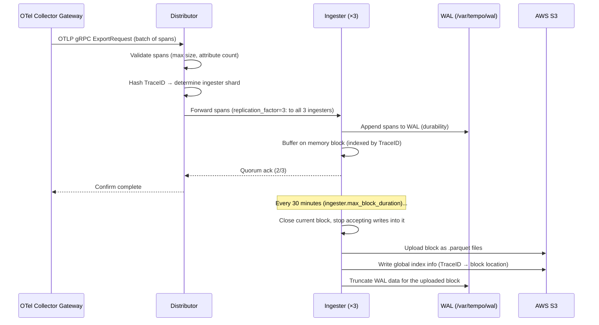
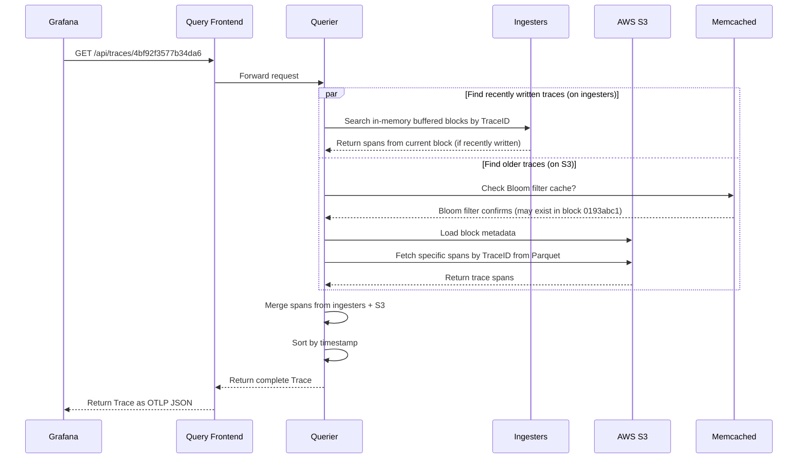
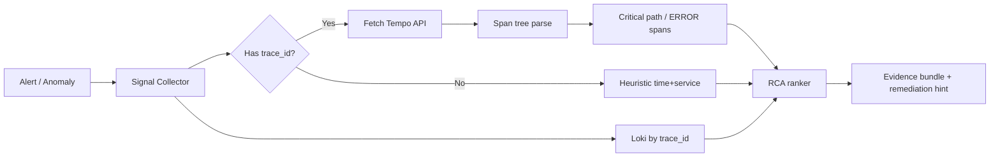

# Chapter 05 — Tempo

> **Grafana Tempo is a large-scale distributed tracing storage system that stores traces on object storage (S3) to provide effectively unlimited retention at minimal cost. It integrates natively with Prometheus exemplars and Loki TraceIDs to create observability correlation across the three pillars.**

---

## Prerequisites

- [01 — Observability](../01-observability/README.md) — trace concepts, sampling
- [02 — OpenTelemetry](../02-opentelemetry/README.md) — collecting and sampling traces
- [04 — Loki](../04-loki/README.md) — parallel distributed architecture design patterns

## Related Documents

- [02 — OpenTelemetry](../02-opentelemetry/README.md) — tail sampling before data reaches Tempo
- [03 — Prometheus](../03-prometheus/README.md) — exemplars linking metrics to Tempo traces
- [09 — Root Cause Analysis](../10-root-cause-analysis/README.md) — traces as input to RCA

## Next Reading

After this chapter, continue to [06 — Telemetry Data Plane](../06-data-plane/README.md) (normalize / enrich / store / feature), then [07 — Kafka](../07-kafka/README.md).

---

## Table of Contents

1. [Why Tempo?](#1-why-tempo)
2. [Tempo vs Jaeger vs AWS X-Ray](#2-tempo-vs-jaeger-vs-aws-x-ray)
3. [Internal Architecture](#3-internal-architecture)
4. [Data Flow — Write Path](#4-data-flow--write-path)
5. [Data Flow — Read Path](#5-data-flow--read-path)
6. [Trace Storage Format](#6-trace-storage-format)
7. [TraceQL Query Language](#7-traceql-query-language)
8. [Metrics from Traces (SpanMetrics)](#8-metrics-from-traces-spanmetrics)
9. [Deployment Modes](#9-deployment-modes)
10. [Production Configuration](#10-production-configuration)
11. [Grafana Integration](#11-grafana-integration)
12. [Trace vs Log vs Metric for RCA](#12-trace-vs-log-vs-metric-for-rca)
13. [Sampling Paradox — Head vs Tail Based](#13-sampling-paradox--head-vs-tail-based)
14. [Cost vs Coverage Decision Tree](#14-cost-vs-coverage-decision-tree)
15. [Edge Cases: Cardinality, PII, Multi-tenant](#15-edge-cases-cardinality-pii-multi-tenant)
16. [Trace-based SLI/SLO Patterns](#16-trace-based-slislo-patterns)
17. [Tempo in the AIOps Pipeline](#17-tempo-in-the-aiops-pipeline)
18. [Case Study: Timeout Cascade](#18-case-study-timeout-cascade)
19. [Common Mistakes](#19-common-mistakes)
20. [Monitoring Tempo](#20-monitoring-tempo)
21. [Scaling](#21-scaling)
22. [Security](#22-security)
23. [Cost](#23-cost)
24. [Production Review](#24-production-review)

---

## 1. Why Tempo?

> [!NOTE]
> **KEY IDEA**
> Tempo does not try to be “Elasticsearch for traces”. It chooses a **store-first, find-by-id later** philosophy: accept not indexing every attribute in exchange for storing everything cheaply on object storage. In AIOps, that matches reality — most paths into a trace are a `trace_id` from a metric exemplar or a log, not full-text search on arbitrary span attributes.

> [!TIP]
> **When should you choose Tempo from day one?** When the stack already has Grafana + Prometheus + Loki, and you need to correlate the three signals with one `trace_id`. Do not choose Tempo if you need Jaeger-UI-style ad-hoc tag search for every attribute without investing in an index / TraceQL pipeline.

### The Distributed Tracing Problem at Scale

Predecessor systems such as Jaeger and Zipkin store traces in databases:
- Jaeger → Cassandra or Elasticsearch
- Zipkin → MySQL, Cassandra, Elasticsearch

**Problem**: At 100K requests/second with an average of 15 spans per trace:
```
100,000 req/s × 15 spans × 2KB/span = 3GB/s of trace data
3GB/s × 86400 seconds = ~260TB/day
```

Storing 260TB/day in Cassandra or Elasticsearch becomes prohibitively expensive.

### Tempo's Solution

**Store traces on object storage (S3) as Parquet files**. No index. No database. Fully object-storage based.

```
Tempo’s architectural principle: “Just store it. We’ll find it later.”
```

**Trade-offs**:
- ✅ Unlimited scale at extremely low S3 cost ($0.023/GB/month)
- ✅ No need to operate complex Cassandra/Elasticsearch clusters
- ✅ Native Grafana integration
- ❌ Cannot search by arbitrary span attributes (lookup by TraceID only by default)
- ❌ Tag-based search requires a separate index (TraceQL pipelines / Tempo tag index)

**When TraceID lookup is enough**: For most AIOps use cases, you reach a trace via:
- A Prometheus exemplar (from a metric spike peak → TraceID)
- A Loki log entry (from an error log → TraceID in the log body)
- Alert annotation (from alert → TraceID of the failing request)

You rarely need to search by an arbitrary span attribute in production AIOps.

### When is a Trace “enough” — and when is it not?

| Need | TraceID lookup (Tempo default) | Needs TraceQL / index |
|---------|--------------------------------|---------------------|
| RCA from alert with exemplar | ✅ Enough | No |
| Error log → `trace_id` in body | ✅ Enough | No |
| “Find every payment timeout request in 1h” | ❌ | ✅ Needed |
| “Find order_id = X across services” | ❌ | ✅ (attribute must be indexed/searchable) |
| Service graph / RED metrics | ✅ Via SpanMetrics | Not required |

> [!WARNING]
> If the SRE team frequently needs to “find by customer_id / order_id” in Tempo **without** an entry path from logs/metrics, the observability entry point is designed wrong. Inject `trace_id` into structured logs and put business IDs in the log body + carefully controlled span attributes — do not turn Tempo into a full-text search engine.

---

## 2. Tempo vs Jaeger vs AWS X-Ray

| Comparison dimension | Tempo | Jaeger | AWS X-Ray |
|-----------|-------|--------|-----------|
| **Storage** | S3 (object store) | Cassandra / Elasticsearch | AWS managed |
| **Search features** | TraceID + TraceQL (tag search via index) | Full tag search | TraceID + basic filters |
| **Scalability** | Unlimited (S3) | Limited by database cluster | Unlimited (managed) |
| **Cost (for 10M spans/day)** | ~$5/month S3 | ~$500/month Cassandra | ~$50/month |
| **Setup** | Medium | Medium–High | Low (SDK only) |
| **AWS integration** | Manual (OTel) | Manual (OTel) | Native (AWS SDK) |
| **Grafana integration** | ✅ Native | ✅ Via plugin | ✅ Via plugin |
| **Query language** | TraceQL | JaegerQL | Basic filters |
| **Multi-tenancy** | ✅ Supported | ❌ Limited | ❌ Per account |
| **Exemplar correlation** | ✅ Native with Prometheus | ❌ Manual | ❌ |
| **License** | AGPLv3 | Apache 2.0 | AWS proprietary |

**Recommendation**:
- New project + Grafana stack: **Tempo** (native integration, optimal S3 cost)
- Existing Jaeger with required tag search: **Jaeger**
- Small all-AWS systems: **X-Ray** (but vendor lock-in)
- Large enterprise: **Tempo** (best scale at lowest cost)

---

## 3. Internal Architecture

> [!NOTE]
> **KEY IDEA**
> Tempo fully separates the **write path** (distributor → ingester → S3) and **read path** (query-frontend → querier → S3/cache). This is the same “ingester owns recent data, object storage owns history” pattern as Loki — allowing write and read to scale on different bottleneck signals.

```mermaid
graph TD
    subgraph Write["Write Path"]
        DIST[Distributor\nvalidate · hash]
        ING1[Ingester 1\nin-memory blocks]
        ING2[Ingester 2]
        ING3[Ingester 3]
        WAL[WAL\n/var/tempo/wal]
    end

    subgraph Compact["Background"]
        COMP[Compactor\nmerge · deduplicate\nretention]
    end

    subgraph Read["Read Path"]
        QF[Query Frontend\ncache · fan-out]
        QUER[Querier\nfetch + merge]
        CACHE[Block Cache\nMemcached]
    end

    subgraph Storage["Object Storage"]
        S3[AWS S3\n.parquet blocks]
        INDEX[Tag Index\nglobal search]
    end

    SOURCE[OTel Collector\ngateway] -->|OTLP gRPC :4317| DIST
    DIST -->|hash on TraceID mod 3| ING1
    DIST -->|hash on TraceID mod 3| ING2
    DIST -->|hash on TraceID mod 3| ING3

    ING1 --- WAL
    ING1 -->|flush every 30min| S3
    ING2 -->|flush| S3
    ING3 -->|flush| S3

    ING1 -->|write tag index| INDEX
    COMP -->|merge small blocks| S3
    COMP -->|rebuild index| INDEX

    GRAFANA[Grafana] -->|GET /api/traces/{id}\nTraceQL| QF
    QF -->|in-memory trace| ING1
    QF -->|S3 lookup| QUER
    QUER -->|block cache hit| CACHE
    QUER -->|block cache miss| S3
    QUER -->|merge| QF
    QF -->|return trace| GRAFANA

    style Write fill:#1565c0,color:#fff
    style Read fill:#2e7d32,color:#fff
    style Storage fill:#4a148c,color:#fff
    style Compact fill:#e65100,color:#fff
```

### Key Endpoints

| Endpoint | Protocol | Port | Description |
|----------|----------|------|-------------|
| `/api/traces/{traceID}` | HTTP | 3200 | Get trace by ID |
| `/api/search` | HTTP | 3200 | Tag search with TraceQL |
| `/api/search/tags` | HTTP | 3200 | List searchable tag names |
| `/api/search/tag/{tag}/values` | HTTP | 3200 | List values for a specific tag |
| `/api/v2/search` | HTTP | 3200 | TraceQL search (v2) |
| OTLP gRPC receive | gRPC | 4317 | Receive traces from OTel Collector |
| Tempo internal | gRPC | 9095 | Internal component messaging |
| Memberlist | UDP | 7946 | Gossip ring |
| `/metrics` | HTTP | 3200 | Prometheus metrics |
| `/ready` | HTTP | 3200 | Readiness check |

---

## 4. Data Flow — Write Path



### Ingester Block Format

Tempo stores traces in blocks. Each block covers a time window:

```
/var/tempo/
├── wal/
│   ├── 00000001    ← WAL segments
│   └── 00000002
└── blocks/
    ├── 0193abc1.../  ← Block (ULID identity)
    │   ├── meta.json     ← Block metadata (time range, trace count, size)
    │   ├── data.parquet  ← Trace data (Parquet columnar format)
    │   └── bloom-filter  ← Bloom filter for fast TraceID existence checks
    └── 0193def2.../
```

**Bloom filter**: Before downloading a Parquet block from S3, the querier quickly checks a bloom filter (a probabilistic data structure) to determine whether the TraceID is likely in that block. This avoids unnecessary S3 downloads.

> [!TIP]
> Bloom filters **never false-negative** (if they say “not present”, it is definitely not present), but can **false-positive** (say “may be present” when it is not). Lower FP rate → larger bloom filter → more memory/storage but fewer wasted S3 GETs. Production often chooses `0.01` or `0.005`.

---

## 5. Data Flow — Read Path



---

## 6. Trace Storage Format

### Parquet Column Layout

Tempo uses Apache Parquet (columnar storage) for trace data:

```
Columns of data.parquet:
├── TraceID (byte_array)          ← Sorted for binary search
├── RootSpanName (string)
├── RootServiceName (string)
├── StartTimeUnixNano (int64)
├── DurationNano (int64)          ← For latency-based queries
├── Spans[]
│   ├── SpanID (byte_array)
│   ├── ParentSpanID (byte_array)
│   ├── Name (string)
│   ├── Kind (int)                ← Server, Client, Internal, etc.
│   ├── StartTimeUnixNano (int64)
│   ├── DurationNano (int64)
│   ├── StatusCode (int)
│   ├── StatusMessage (string)
│   └── Attributes (map<string, AnyValue>)
└── Resource Attributes (map<string, AnyValue>)
```

**Why Parquet**:
- Columnar storage: Fast filter on `StatusCode == ERROR` without reading other columns
- Compression: Parquet with Snappy compresses trace data at roughly 5–10:1
- S3 Select: Column filtering can happen server-side on S3, reducing transfer bandwidth

### Vparquet3 (Tempo’s custom format)

Tempo uses a custom Parquet schema called `vparquet3`:

```yaml
# Enable in tempo config
storage:
  trace:
    backend: s3
    block:
      version: vparquet3    # Required for TraceQL
      bloom_filter_false_positive: 0.01   # Accept 1% false positive rate for bloom filters
      bloom_filter_shard_size_bytes: 100kb
```

---

## 7. TraceQL Query Language

TraceQL is Tempo’s query language for searching traces by span attributes.

> **Note**: TraceQL search requires data in `vparquet3` format AND a configured `local-blocks` pipeline or tag index. Direct TraceID lookup does not need these.

### TraceQL Syntax

```traceql
# Basic: find all traces with an error-status span
{ status = error }

# Traces from a specific service with high latency
{ resource.service.name = "payment-service" && duration > 2s }

# Traces with a specific HTTP status code
{ span.http.status_code = 500 }

# Traces with error span AND payment service
{ status = error && resource.service.name = "payment-service" }

# Traces with a specific attribute value
{ span.order.id = "ord-12345" }

# Aggregate: count traces by service
{ resource.service.name =~ ".*" } | by(resource.service.name) | count() > 0

# Latency search (slow traces)
{ duration > 5s }

# Combined: errors in payment service slower than 3s
{ 
  resource.service.name = "payment-service" 
  && status = error 
  && duration > 3s 
}
```

### Enabling Tag-Based Search (Pipeline)

```yaml
# tempo-config.yaml
pipeline:
  # Enable structured TraceQL search
  search:
    enabled: true
    
storage:
  trace:
    backend: s3
    local_blocks:
      path: /var/tempo/blocks
      max_stale_cut: 15m
      flush_to_storage: true
```

---

## 8. Metrics from Traces (SpanMetrics)

**SpanMetrics** is an OTel Collector processor that automatically generates RED metrics from trace data. This is highly valuable for an AIOps pipeline.

### Why SpanMetrics?

Instead of instrumenting every service to emit latency/error metrics, SpanMetrics **automatically generates** these metrics from span information:

```
Traces → SpanMetrics Processor → Prometheus metrics

Automatically generated metrics:
- traces_spanmetrics_calls_total (counter, by service/operation/status)
- traces_spanmetrics_duration_milliseconds (histogram, by service/operation)
```

### OTel Collector SpanMetrics Configuration

```yaml
connectors:
  spanmetrics:
    histogram:
      explicit:
        buckets: [5ms, 10ms, 25ms, 50ms, 75ms, 100ms, 250ms, 500ms, 750ms, 1s, 2.5s, 5s, 10s]
    dimensions:
      - name: http.method
      - name: http.status_code
      - name: service.name
      - name: db.system
      - name: messaging.system
    dimensions_cache_size: 10000
    aggregation_temporality: AGGREGATION_TEMPORALITY_CUMULATIVE
    metrics_flush_interval: 15s
    namespace: "traces"    # Prefix for generated metrics


service:
  pipelines:
    traces:
      receivers: [otlp]
      processors: [memory_limiter, tail_sampling, batch]
      exporters: [otlp/tempo, spanmetrics]   # Send to Tempo AND generate metrics
      
    metrics/spanmetrics:
      receivers: [spanmetrics]               # Input from traces pipeline
      processors: [batch]
      exporters: [prometheusremotewrite]     # Push metrics to Prometheus
```

**Example generated metrics**:

```
# Call count by service and operation
traces_spanmetrics_calls_total{service_name="order-service", span_name="POST /api/orders", status_code="STATUS_CODE_OK"} 1234
traces_spanmetrics_calls_total{service_name="order-service", span_name="POST /api/orders", status_code="STATUS_CODE_ERROR"} 42

# Latency distribution (Histogram)
traces_spanmetrics_duration_milliseconds_bucket{service_name="order-service", span_name="POST /api/orders", le="100"} 1000
traces_spanmetrics_duration_milliseconds_bucket{service_name="order-service", span_name="POST /api/orders", le="500"} 1230
```

**Value for AIOps**: SpanMetrics provides full RED metrics for every service-operation pair **without changing any application code**. This is the fastest path to broad observability coverage.

> [!NOTE]
> **KEY IDEA**
> SpanMetrics turns traces into a “metric generation source”. You pay the instrumentation cost **once** (auto-instrument HTTP/gRPC/DB) and get latency histograms + error counters + service graph. The AIOps correlation engine can later jump from metric spike → exemplar → full trace in Tempo.

> [!WARNING]
> Dimensions in SpanMetrics become Prometheus labels. Adding `user_id`, `order_id`, `session_id` as dimensions = a **cardinality bomb** that breaks Prometheus. Only use low-cardinality labels: `service.name`, `http.method`, `http.status_code`, `db.system`.

---

## 9. Deployment Modes

### Single Binary (Development/testing)

```bash
tempo -config.file=tempo-config.yaml
```

### Scalable (Production)

```yaml
# Deploy as microservices
targets:
  distributor: 2 replicas
  ingester: 3 replicas (StatefulSet, durable WAL)
  querier: 2 replicas
  query-frontend: 2 replicas
  compactor: 1 replica (singleton only)
```

### Helm Installation

```bash
helm repo add grafana https://grafana.github.io/helm-charts
helm install tempo grafana/tempo-distributed \
  --namespace observability \
  --values tempo-values.yaml
```

---

## 10. Production Configuration

### Complete tempo-config.yaml

```yaml
target: all    # or a specific component

server:
  http_listen_port: 3200
  grpc_listen_port: 9095
  log_level: info

distributor:
  receivers:
    otlp:
      protocols:
        grpc:
          endpoint: 0.0.0.0:4317
        http:
          endpoint: 0.0.0.0:4318
    jaeger:
      protocols:
        thrift_http:
          endpoint: 0.0.0.0:14268
        grpc:
          endpoint: 0.0.0.0:14250

ingester:
  max_block_duration: 30m         # Flush block every 30 minutes
  max_block_bytes: 1_073_741_824  # Max block size 1GB before forced flush
  trace_idle_period: 20s          # Wait after last span before closing trace
  flush_check_period: 30s
  lifecycler:
    ring:
      replication_factor: 3       # Keep 3 replicas of each trace

compactor:
  compaction:
    block_retention: 336h         # 14-day retention
    compacted_block_retention: 1h # Keep compacted blocks on disk 1h
    compaction_window: 4h         # Compaction time window

querier:
  frontend_worker:
    frontend_address: tempo-query-frontend.observability.svc.cluster.local:9095

query_frontend:
  search:
    duration_slo: 5s
    throughput_bytes_slo: 1.073741824e+09   # Target scan rate 1GB/s

storage:
  trace:
    backend: s3
    wal:
      path: /var/tempo/wal
    s3:
      bucket: tempo-traces-prod
      region: us-east-1
      # Authenticate with IRSA
    block:
      version: vparquet3
      bloom_filter_false_positive: 0.01
      bloom_filter_shard_size_bytes: 102400
      
# Memberlist for distributed coordination
memberlist:
  abort_if_cluster_join_fails: false
  join_members:
    - tempo-gossip-ring.observability.svc.cluster.local:7946

# Limits
limits_config:
  max_traces_per_user: 0                # 0 = unlimited
  max_search_duration: 336h             # Max search window 14 days
  ingestion_rate_limit_bytes: 20000000  # 20MB/s ingest limit per tenant
  ingestion_burst_size_bytes: 50000000  # 50MB burst
  max_bytes_per_trace: 5000000          # Max trace size 5MB
  max_search_bytes_per_trace: 5000000

# Metrics generator (SpanMetrics)
metrics_generator:
  storage:
    path: /var/tempo/generator/wal
    remote_write:
      - url: http://prometheus.observability.svc.cluster.local:9090/api/v1/write
        
  processors: [service-graphs, span-metrics]
  
  processor:
    service_graphs:
      dimensions: [service.name, http.method]
      max_items: 10000
      
    span_metrics:
      dimensions:
        - http.method
        - http.status_code
        - service.name
      histogram_buckets: [5, 10, 25, 50, 75, 100, 250, 500, 750, 1000, 2500, 5000]
```

### Kubernetes StatefulSet for Ingesters

```yaml
apiVersion: apps/v1
kind: StatefulSet
metadata:
  name: tempo-ingester
  namespace: observability
spec:
  replicas: 3
  serviceName: tempo-ingester
  podManagementPolicy: Parallel
  
  # Spread across Availability Zones
  template:
    spec:
      topologySpreadConstraints:
        - maxSkew: 1
          topologyKey: topology.kubernetes.io/zone
          whenUnsatisfiable: DoNotSchedule
          labelSelector:
            matchLabels:
              app: tempo-ingester
              
      containers:
        - name: tempo
          image: grafana/tempo:2.4.0
          args:
            - -config.file=/conf/tempo.yaml
            - -target=ingester
            
          resources:
            requests:
              cpu: "1"
              memory: "4Gi"
            limits:
              cpu: "2"
              memory: "8Gi"
              
          volumeMounts:
            - name: tempo-wal
              mountPath: /var/tempo/wal
              
  volumeClaimTemplates:
    - metadata:
        name: tempo-wal
      spec:
        accessModes: [ReadWriteOnce]
        storageClassName: gp3
        resources:
          requests:
            storage: 50Gi       # Enough WAL storage for 30 minutes of traces
```

---

## 11. Grafana Integration

### Datasource Configuration

```yaml
# grafana-datasources.yaml
apiVersion: 1
datasources:
  - name: Tempo
    type: tempo
    url: http://tempo-query-frontend.observability.svc.cluster.local:3200
    uid: tempo
    jsonData:
      # Link traces to Loki logs by TraceID
      tracesToLogsV2:
        datasourceUid: loki
        spanStartTimeShift: '-1h'
        spanEndTimeShift: '1h'
        tags: [{key: 'service.name', value: 'service'}]
        filterByTraceID: true
        filterBySpanID: false
        customQuery: false
        
      # Link traces to Prometheus metrics
      tracesToMetrics:
        datasourceUid: prometheus
        spanStartTimeShift: '-30m'
        spanEndTimeShift: '30m'
        tags: [{key: 'service.name', value: 'service'}]
        queries:
          - name: "Request Rate"
            query: "sum(rate(traces_spanmetrics_calls_total{$$__tags}[5m]))"
          - name: "P99 Latency"
            query: "histogram_quantile(0.99, sum(rate(traces_spanmetrics_duration_milliseconds_bucket{$$__tags}[5m])) by (le))"
            
      # Service graph view
      serviceMap:
        datasourceUid: prometheus
        
      # Search tags shown in Tempo Explore UI
      search:
        hide: false
```

### Grafana Explore — Trace Investigation Workflow

```
1. In Grafana Explore → select Prometheus datasource:
   Run query: histogram_quantile(0.99, rate(http_request_duration_seconds_bucket[5m]))
   → Discover P99 latency spike at 14:23
   
2. Click the exemplar on the spike → Tempo trace UI opens automatically
   (this exemplar carries the TraceID of that slow request)
   
3. In Tempo trace view:
   → Span diagram shows: payment-service.chargeCard took 1.8s
   → Click "Logs for this trace"
   
4. Loki UI automatically shows query results:
   {namespace="production"} |= "4bf92f35..."
   → logs show: "DB connection pool exhausted, queuing for 1.7s"
   
5. Root-cause conclusion: DB connection pool configured too small
```

> [!TIP]
> The exemplar → Tempo → Loki workflow is the **standard RCA loop** of the Grafana stack. Verify all three datasources are configured with `tracesToLogsV2` / exemplars / `trace_id` in the log body before training any AIOps model — if manual correlation is broken, the model will be too.

---

## 12. Trace vs Log vs Metric for RCA

> [!NOTE]
> **KEY IDEA**
> Metrics say **what** is wrong and **when**. Logs say **local detail** in one process. Traces say the **cross-service causal chain** of one request. Automated RCA is strong only when the three signals are bound by the same `trace_id` / topology — not when you merely have “lots of disconnected data”.

### Decision matrix: which signal wins for each incident type?

| Incident type | Metric | Log | Trace | Primary signal for RCA |
|------------|--------|-----|-------|------------------------|
| P99 latency up, error rate stable | ✅ Detect | ⚠️ May have no error log | ✅ See slow span | **Trace** (critical path) |
| Local error rate up on 1 service | ✅ | ✅ Stack/message | ✅ Span status ERROR | Log + Trace |
| Timeout cascade (A→B→C) | ⚠️ Many simultaneous alerts | ⚠️ Many disconnected “timeout” logs | ✅ Parent-child + duration | **Trace** |
| OOM / process crash | ✅ | ✅ Last logs | ❌ Trace broken mid-way | Log + Metric |
| Deployment regression | ✅ | ⚠️ | ✅ Compare span latency before/after | Metric + Trace + change |
| Data corruption / wrong value | ❌ | ✅ | ⚠️ Business attribute | Log |
| Resource saturation (CPU/mem) | ✅ | ⚠️ | ⚠️ Indirectly slow spans | Metric |
| Cross-service retry storm | ⚠️ Rate up | ⚠️ “retrying” | ✅ Many repeated client spans | **Trace** |

### When is Trace more important than Log/Metric?

**1. You need the critical path, not a generic “service is slow”**

Metric `http_request_duration_seconds{service="api-gateway"}` only says the gateway is slow. Trace shows 1.8s is in `payment.chargeCard`, not routing or auth. RCA path-finding walks **backward** from the root error span along the child with the largest duration or ERROR status.

**2. The incident appears only for a specific dependency combination**

Example: only requests with feature-flag X + parallel inventory + payment calls time out. Average metrics dilute the signal; per-service logs do not show fan-out. Trace keeps request-scoped topology.

**3. Correlating “alert bursts” needs a request tree**

The alert correlation engine receives 12 alerts in 3 minutes. Without traces, you only have time coincidence. With a shared `trace_id`, you prove they are **one request tree**, not 12 independent root causes.

**4. Bounded async contexts (queue, outbox)**

A consumer log “message processed” does not link to the producer without context propagation. Trace (or at least `traceparent` / linked spans) is the causality bridge across Kafka.

### When does Trace *not* replace Log/Metric?

- **Detection / realtime SLI**: Metrics are cheap, sampling-stable, alertable. Trace sampling skews SLO if you sample only 1%.
- **Detailed exception forensics**: Log stacktraces + deep context fields beat span status messages.
- **Capacity planning**: Long-horizon metric time series; trace retention is often 7–14 days.

```
Practical AIOps rule:
  DETECT  → Metric (anomaly / threshold)
  LOCALIZE → Trace (which span / which hop)
  EXPLAIN → Log (why that hop failed)
  PROVE   → trace_id linking all three
```

> [!WARNING]
> Do not “RCA with traces only”. Traces miss resource pressure (CPU steal, disk full). Node/pod metrics + kernel/OOMKilled logs remain mandatory. Trace is a **request map**, not a **cluster map**.

---

## 13. Sampling Paradox — Head vs Tail Based

### Core paradox

```
You sample low → cheap, but when an incident hits the most “valuable” traces may be dropped.
You sample high → expensive, and 99% of “happy path” traces are almost never opened during incidents.
```

This is the **sampling paradox**: the information value of traces is extremely skewed — most value sits in the tail (error, slow, rare path), while head-based sampling (decision at request start) does not know whether the request will error or slow.

### Head-based sampling

Decision **when the request starts** (SDK or agent):

| Pros | Cons |
|----|-------|
| Simple, low CPU cost | Does not know outcome (error/slow) |
| Reduces load at the source | Rare incidents can be dropped entirely |
| Easy fixed % explanation | Bias: “error rate in Tempo” ≠ true error rate |

```yaml
# Example head sampling 5% — DANGEROUS for AIOps if used alone
processors:
  probabilistic_sampler:
    sampling_percentage: 5
```

**Deadly edge case**: Error rate 0.1%, head sample 1%. Probability an error request is kept ≈ 1%. In 10 errors, expected ~0.1 error traces stored — RCA has “no evidence”.

### Tail-based sampling

Decision **after the trace completes** (usually at OTel Collector gateway), based on all spans:

```yaml
processors:
  tail_sampling:
    decision_wait: 10s
    num_traces: 100000
    expected_new_traces_per_sec: 5000
    policies:
      - name: errors-keep-all
        type: status_code
        status_code: {status_codes: [ERROR]}
      - name: slow-keep
        type: latency
        latency: {threshold_ms: 2000}
      - name: baseline-1pct
        type: probabilistic
        probabilistic: {sampling_percentage: 1}
```

| Pros | Cons |
|----|-------|
| Keep 100% error / slow | Memory to buffer open traces |
| 1% baseline for comparison | Too-short `decision_wait` → missing late spans → wrong decision |
| Fits AIOps RCA | Gateway becomes SPOF/scale point |

### Edge case: losing exactly the incident’s trace

| Scenario | Loss mechanism | Consequence | Prevention |
|----------|------------|---------|------------|
| Head sample drops error request | Early decision | No trace_id in Tempo even if log has it | Prefer tail sampling errors |
| `decision_wait` < async span lag | Incomplete trace at decision time | Drop or partial; RCA misses last hop | Increase wait; use span links for async |
| Collector OOM / queue full | Drop batch | Lose clusters of traces at peak = incident time | memory_limiter + persistent queue + backpressure metric |
| `max_bytes_per_trace` truncates large traces | Trace rejected | Large fan-out (GraphQL N+1) disappears | Limit span attributes; fix fan-out |
| Multi-collector non-sticky | Spans for same TraceID hit different collectors | Tail sampler never sees full tree | Load-balance by TraceID or sample at centralized gateway |
| Late spans after flush | Ingester `trace_idle_period` closes early | Partial trace | Align idle period with async SLA |

> [!WARNING]
> **Operational paradox**: during traffic spikes (incidents), collector queues fill → sampling/export drops **exactly** when you need evidence most. Alert on `otelcol_processor_dropped_spans` / exporter queue size at **the same severity** as business SLOs — this is “observability of observability”.

### Production AIOps recommendation

```
100% ERROR spans        → keep
100% latency > SLO×2    → keep
100% traces with incident_id / canary attribute → keep (string_attribute policy)
1–5% probabilistic      → baseline + SpanMetrics still need stream before sample if metrics come from traces
Never: head 0.1% only   → “saving money” turns Tempo into an empty museum when pages fire
```

> [!TIP]
> If SpanMetrics runs **before** tail_sampling in the traces pipeline, RED metrics remain full-fidelity while Tempo stores only a subset. This is a good cost pattern: metrics for detect, sampled traces for deep dive.

---

## 14. Cost vs Coverage Decision Tree

```
                    ┌─────────────────────────┐
                    │ Start: how many         │
                    │ raw production spans/s? │
                    └───────────┬─────────────┘
                                │
              ┌─────────────────┴─────────────────┐
              │ < 5K spans/s                      │ > 50K spans/s
              │ → can keep 100% short-term        │ → sampling required
              └─────────────────┬─────────────────┘
                                │
                    ┌───────────▼───────────┐
                    │ Primary goal?         │
                    └───────────┬───────────┘
           ┌────────────────────┼────────────────────┐
           ▼                    ▼                    ▼
    ┌────────────┐      ┌──────────────┐     ┌──────────────┐
    │ RCA/AIOps  │      │ Compliance   │     │ Dev debug    │
    │ deep dive  │      │ audit 100%   │     │ staging only │
    └─────┬──────┘      └──────┬───────┘     └──────┬───────┘
          │                    │                    │
          ▼                    ▼                    ▼
  Tail: 100% err/slow    Separate tenant      Head 10–50%
  + 1–5% baseline        + longer retention   short retention
  retention 7–14d        legal hold bucket    1–3d
```

### Cost decision table (order-of-magnitude)

| Policy | RCA coverage | S3 (relative) | Risk |
|--------|--------------|---------------|--------|
| Head 100% | High | 100% | Expensive; ingester OOM |
| Head 1% | Low for rare errors | ~1% | Lose incident traces |
| Tail 100% err + 1% ok | High for errors | ~2–10% | Depends on correct policy |
| Tail 100% err/slow + 5% ok | Very high | ~5–15% | Best balance for most teams |
| Errors only, 0% ok | Good for errors | Very low | No baseline; cannot compare “normal” |

### Required questions before locking sampling

1. Does **error budget / SLO** depend on metrics from traces? → SpanMetrics before sample.
2. Does **legal** require keeping 100% of transactions? → Separate tenant; do not mix with debug sampling.
3. Is current **MTTR** blocked by “no trace”? → Prefer error coverage over long retention.
4. Is the business target **P99** or **mean**? → Latency policy threshold by P99 target, not mean.

> [!NOTE]
> **KEY IDEA**
> Optimal cost is not “lowest possible sample rate”, but **maximize P(keep the trace when a page fires) under budget $X**. Thinking formula: `Value ≈ P(incident covered) × MTTR_reduction − storage_cost − eng_time`.

### Quick decision checklist

```
[ ] Tail sampling at gateway (not head-only on prod SDK)
[ ] Policy: ERROR + latency > 2×SLO + probabilistic baseline
[ ] SpanMetrics / service graph before sampling
[ ] Retention: hot 7–14d; archive cold if compliance
[ ] Alert collector drop rate & Tempo ingestion
[ ] max_bytes_per_trace + attribute allowlist
[ ] Estimate S3: spans/s × size × retention × $0.023
```

---

## 15. Edge Cases: Cardinality, PII, Multi-tenant

### High-cardinality attributes on spans

Span attributes do **not** automatically become Prometheus series — unless you put them into SpanMetrics dimensions or search index. But high cardinality still hurts:

| Problem | Mechanism | Consequence |
|--------|--------|---------|
| Attribute explosion (user_id, raw URL) | Each span balloons | Ingester memory, S3, `max_bytes_per_trace` |
| TraceQL search on high-card field | Expensive index / scan | Slow queries, read cost |
| High-card SpanMetrics dimension | Prometheus labels | TSDB OOM, broken queries |
| Unbounded span events / logs-in-span | Full exception body attached | Multi-MB traces |

**Recommended allowlist**:

```yaml
# OTel Collector — block dangerous attributes
processors:
  attributes/deny_high_card:
    actions:
      - key: http.url
        action: delete          # use templated http.route
      - key: user.email
        action: delete
      - key: db.statement
        action: hash            # or delete if SQL has PII
      - key: enduser.id
        action: delete          # keep in redacted log body, not metrics
```

> [!WARNING]
> `http.url` with query string (`?user=...&token=...`) is both **cardinality** and **PII/secret**. Always prefer `http.route` (`/users/{id}`).

### PII in spans

Traces are often forgotten in privacy reviews because “they’re not logs”. In reality span names, attributes, and events contain:

- Email, phone, national ID in custom attributes
- Authorization headers if middleware instruments incorrectly
- Full SQL statements with literal values
- Kafka message payloads attached as span events

**Layered controls**:

1. **SDK / instrumentation**: do not capture raw body; scrub headers.
2. **Collector**: redaction processor (token/email regex).
3. **Tempo**: multi-tenant isolation + S3 KMS encryption; restrict who can Explore.
4. **Process**: periodic DLP scan on sample blocks; shorter retention than logs if policy requires.

```yaml
processors:
  transform/redact:
    trace_statements:
      - context: span
        statements:
          - replace_pattern(attributes["http.user_agent"], ".*", "[REDACTED_UA]") 
            # illustrative example — prefer allowlist instead of trying to redact everything
```

> [!TIP]
> Prefer **attribute allowlists** over denylists. Denylists always lose to a new feature sprint (`customer.tax_id` appears next week).

### Multi-tenant trace pollution

| Symptom | Cause | AIOps impact |
|------------|-------------|----------------|
| Trace breaks on cross-tenant call | Each service sets different `X-Scope-OrgID` | Cannot assemble full path |
| Tenant A query sees tenant B meta | Wrong header / Grafana DS | Data leak |
| “Production” and “canary” share tenant without tag | Missing `deployment.environment` | RCA confuses canary with prod traffic |
| Load test pollutes baseline | Same tenant, no `load_test=true` attribute | Sampling/metrics skewed; model learns noise |

**Recommendations**:

- **One Tempo tenant for all prod services** within the same trust boundary (so cross-service traces stay intact); separate tenants for staging / external customers.
- Required resource attributes: `service.name`, `deployment.environment`, `k8s.namespace.name`.
- Load test / synthetic: attribute + separate tail policy (drop or low sample) so baseline 1% is not polluted.

> [!NOTE]
> **KEY IDEA**
> “Multi-tenant” in Tempo is a **security and quota** boundary, not a **request topology** boundary. A business request crossing 15 microservices must share one tracing tenant; separate team billing via Grafana folders/RBAC — do not cut traces mid-path.

---

## 16. Trace-based SLI/SLO Patterns

### Pattern 1: Availability SLI from span status

```promql
# Success ratio by service-operation (from SpanMetrics)
sum(rate(traces_spanmetrics_calls_total{
  service_name="checkout",
  span_name="POST /api/checkout",
  status_code="STATUS_CODE_OK"
}[5m]))
/
sum(rate(traces_spanmetrics_calls_total{
  service_name="checkout",
  span_name="POST /api/checkout"
}[5m]))
```

**Example SLO**: 99.9% of root `checkout` spans are not ERROR over 30 days.

> [!WARNING]
> If Tempo/Collector **samples** before generating SpanMetrics, the SLI will be **biased** (errors kept 100% while success sampled at 1% → “fake” error rate rises). SpanMetrics must sit **before** tail_sampling, or use independent app/RED metrics for hard SLOs.

### Pattern 2: Latency SLI from trace duration

```promql
histogram_quantile(0.99,
  sum by (le) (
    rate(traces_spanmetrics_duration_milliseconds_bucket{
      service_name="checkout",
      span_name="POST /api/checkout"
    }[5m])
  )
)
```

**SLO**: P99 root span < 800ms. Trace-based latency reflects **end-to-end** better than per-hop metrics if the root span covers the whole request.

### Pattern 3: “Correctness path” SLI (multi-span)

Some SLOs are not HTTP 200 but a **correct hop chain**:

```
SLI "payment path complete" =
  child span payment.authorize SUCCESS exists
  AND child span inventory.reserve SUCCESS exists
  within the same checkout root trace
```

TraceQL / offline jobs scan sampled traces to estimate this; they do not replace realtime metric SLOs but help **weekly quality review** and RCA label training.

### Pattern 4: SLO burn + exemplar → Tempo

```
1. Multi-window burn rate alert on SpanMetrics SLI
2. Annotation / exemplar attaches slow or error TraceID
3. On-call click → Tempo → critical path
4. AIOps correlation attaches alert_group_id ↔ related_trace_ids
```

### Anti-patterns for trace-derived SLIs

| Anti-pattern | Why wrong |
|--------------|------------|
| SLO only on sampled Tempo store | Biased sample → fake error budget |
| Count ERROR on every internal span | Internal retry ERRORs create fake burn |
| High-card span names (`/user/123`) | Not stable over time |
| One SLI for all services | Hides weak dependencies |

> [!TIP]
> **Root span / entry span** (gateway or edge service) is the best SLI candidate. Internal spans are for RCA, not always for error budget.

---

## 17. Tempo in the AIOps Pipeline

### Role of `trace_id` in the correlation engine



**Minimum evidence schema**:

```json
{
  "alert_id": "al-9f3c",
  "related_trace_ids": ["4bf92f3577b34da6a3ce929d0e0e4736"],
  "critical_path": [
    {"service": "api-gateway", "span": "HTTP POST", "duration_ms": 2100},
    {"service": "order-service", "span": "createOrder", "duration_ms": 2050},
    {"service": "payment-service", "span": "chargeCard", "duration_ms": 1980, "status": "ERROR"}
  ],
  "error_span": {
    "service": "payment-service",
    "message": "upstream timeout",
    "attributes": {"peer.service": "psp-gateway", "http.status_code": 504}
  }
}
```

### RCA path finding on the span tree

Practical algorithm (no GNN needed initially):

1. Take root span (or entry service that alerted).
2. DFS/BFS children; prefer branches with `status=ERROR`, then largest `duration`.
3. Stop at leaf ERROR or external dependency timeout.
4. Attach service graph topology (SpanMetrics service-graphs) to drop edges that do not exist in the dependency map.
5. Score: `error_flag * w1 + normalized_duration * w2 + change_recent * w3`.

```python
# Pseudo-code path finding
def critical_path(spans):
    by_parent = index_children(spans)
    root = find_root(spans)
    path = []
    node = root
    while node:
        path.append(node)
        children = by_parent.get(node.span_id, [])
        if not children:
            break
        # Prefer ERROR, then duration
        children.sort(key=lambda s: (s.status != ERROR, -s.duration))
        node = children[0]
    return path
```

### Tempo integration APIs

| Purpose | API |
|----------|-----|
| Get full trace | `GET /api/traces/{traceID}` |
| Search by service/error | TraceQL `/api/search` |
| Batch for training | Offline export of S3 Parquet blocks |

> [!NOTE]
> **KEY IDEA**
> The correlation engine does **not** replace Tempo as storage. It caches metadata (trace_id, critical path summary, top error attributes) on the event bus (Kafka) so LLM agents / RCA services do not pull full parquet every time. Full traces are fetched only when a human or agent needs drill-down.

### Links to other chapters

- [08 — Alert Correlation](../09-alert-correlation/README.md) — group alerts by `related_trace_ids`
- [09 — Root Cause Analysis](../10-root-cause-analysis/README.md) — span analysis, evidence scoring
- [10 — LLM Agent](../11-llm-agent/README.md) — agent reads critical path + logs with the same `trace_id`

---

## 18. Case Study: Timeout Cascade

### Context

Checkout system: `api-gateway → order-service → payment-service → psp-gateway` (HTTP). In parallel `order-service → inventory-service`.

**Symptoms on-call receives**:

- Alert 1: `api-gateway` P99 > 3s
- Alert 2: `order-service` error rate rising
- Alert 3: `payment-service` upstream 504
- Alert 4: HPA scales gateway (CPU up from long-held connections)

### Looking only at Metrics + Logs — a fuzzy picture

```
Metric: gateway, order, payment all "bad" in nearly the same minute
→ Biased conclusions: "payment is dead" or "network blip" — missing causal order

Log order-service: "context deadline exceeded"
Log payment-service: "PSP timeout after 2000ms"
Log gateway: "upstream timeout"
→ Three correct logs but no proof they are the same request; could be 3 independent waves
```

### Only Trace shows the cascade

```
TraceID 4bf92f35...  total 3200ms
├─ api-gateway HTTP POST /checkout                 3200ms
│  └─ order-service createOrder                    3150ms
│     ├─ inventory-service reserve                   40ms  OK
│     └─ payment-service chargeCard                3000ms
│        └─ psp-gateway POST /charge               2000ms  OK (slow)
│           … payment client timeout = 2000ms
│           → payment returns 504 at 2005ms
│        order retries payment ×1                  1000ms  ERROR
│     order marks order FAILED
│  gateway hits 3s timeout nearly simultaneously
```

**Insights only the trace reveals**:

1. **PSP is not necessarily down** — PSP span succeeds but 2000ms hits the client timeout exactly.
2. **Retry amplifies** — one user request → 2 PSP calls; payment rate rises “oddly”.
3. **Inventory is innocent** — fast 40ms; inventory metrics may still be green.
4. **Wrong timeout hierarchy** — gateway 3s ≈ order 3s ≈ payment 2s + retry → no remaining budget; need deadline propagation.

### RCA timeline with Tempo

```
T+0:00  Burn rate alert checkout SLI
T+0:01  Exemplar → TraceID → Tempo
T+0:02  Critical path = payment client timeout / PSP latency
T+0:03  Loki |= TraceID → confirm "timeout after 2000ms"
T+0:05  Compare TraceQL: {resource.service.name="psp-gateway" && duration>1.5s}
T+0:10  Decision: intentionally raise timeout OR optimize PSP; enable deadline budget
T+0:15  Config fix: payment timeout 2s → 2.5s temporary; ticket to optimize PSP p99
```

### Design lessons

| Design | Before | After |
|----------|-------|-----|
| Timeout | Hardcoded per service | Deadline propagation from gateway |
| Retry | Blind retry ×1 | Retry only on idempotent + remaining budget |
| Sampling | Head 5% | Tail 100% ERROR + latency>1s |
| Alert | 4 disconnected alerts | Correlate by trace_id → 1 incident |

> [!NOTE]
> **KEY IDEA**
> Timeout cascades are the class of incidents where **metrics light up in many places, logs all say “timeout”, and only a trace draws the causal arrows**. If your AIOps does not ingest `trace_id` into correlation, the model will learn “every simultaneous timeout = many root causes”.

> [!TIP]
> Add a synthetic trace (blackbox checkout) every 30s with attribute `synthetic=true`. When synthetic fails, tail policy keeps 100% — you always have a “canary request” with enough evidence, independent of user traffic.

---

## 19. Common Mistakes

### Summary table

| Common mistake | Symptom | Fix |
|---------|---------|-----|
| No bloom filters configured | Every query must download all blocks from S3 to scan | Set `bloom_filter_false_positive = 0.01` |
| Wrong vparquet version | TraceQL search does not work | Use `version: vparquet3` in block config |
| Ingester `replication_factor = 1` | Data loss when an ingester pod fails | Always set `replication_factor = 3` |
| No WAL for ingesters | Data loss on sudden ingester crash | Use PVC disk for WAL |
| More than one Compactor replica | Block corruption | Always run compactor as singleton (1 replica) |
| Missing trace context propagation | Broken traces (only disconnected single-spans) | Enforce W3C TraceContext across all services |
| Tail sampling baseline too low / wrong policy | Missing normal traces or lost error traces | 100% ERROR/slow + 1–5% baseline; SpanMetrics before sample |
| Not using SpanMetrics | Manual instrumentation in every service for RED metrics | Enable SpanMetrics connector in OTel Collector |
| Allowing oversized traces (>5MB) | Heavy memory pressure on ingesters | Set `max_bytes_per_trace = 5MB` |
| No query cache | Large volume of repeated S3 downloads | Add Memcached as block cache |
| Head sampling only in production | “No trace” exactly at incident time | Switch to tail-based at gateway |
| PII / secrets in span attributes | Compliance risk; bloated spans | Attribute allowlist + collector redact |
| High-card dimensions in SpanMetrics | Prometheus cardinality explosion | Low-card labels only |
| Multi-tenant cuts across request path | Trace broken mid-way | One prod tenant for mesh services |
| Ignoring collector drop metrics | Assume 100% coverage | Alert `dropped_spans` at high severity |

### Deep analysis — *why wrong* and *why popular “fixes” still fail*

#### 1. `replication_factor = 1` “to save money”

**Why wrong**: Ingester crash or zone outage = lose all traces not yet flushed to S3 (up to ~30 minutes of data). Exactly the window you need while debugging an incident.

**Misguided fix**: “We flush every 1 minute so RF=1 is fine”. You still lose the WAL window + in-flight; RCA needs the minute of the fire, not “most of the time”.

#### 2. Multiple Compactor replicas “for HA”

**Why wrong**: Compaction is not a stateless query — two compactors touching the same blocks → corruption / races.

**Correct HA**: 1 compactor + fast restart + alert on compaction lag; do not scale out blindly.

#### 3. Head 1% “because S3 cost”

**Why wrong**: Trace value distribution is heavily skewed. Saving 99% storage can delete 99% of useful traces.

**Correct**: Cut cost with **outcome-based policy**, not **blind rate** on every request.

#### 4. Trace context “OTel SDK is on” but still broken

**Why wrong**: SDK does not automatically survive reverse proxies that strip headers, HTTP clients that do not inject, Kafka missing context carriers, or thread hops that lose context.

**Diagnosis**: Measure single-span trace ratio; if high → propagation is broken, not Tempo.

#### 5. Using Tempo like ELK — search every field

**Why wrong**: Store-on-S3 architecture is not optimized for inverted indexes on every attribute. Forcing full indexing recreates Jaeger/ES cost.

**Correct**: Primary entry path = TraceID from log/metric; TraceQL for a designed attribute set (service, status, http.route).

#### 6. SpanMetrics after sampling + used for SLO

**Why wrong**: Policy keep 100% error + 1% success → ERROR ratio in metrics inflated by tens of times → wrong pages, fake error budget burn.

**Correct**: Full metrics pipeline; sampled Tempo storage; SLOs do not read from a biased sample store.

#### 7. `decision_wait` too short for async

**Why wrong**: Kafka consumer span arrives 15s later; sampler already dropped/exported incomplete → path finding misses the last hop (often the failing one).

**Correct**: `decision_wait` ≥ p99 async latency + margin; or unlink async from parent tail decisions.

> [!WARNING]
> The most expensive AIOps tracing mistake is not “forgetting to enable Tempo”, but **believing you have traces** while sampling/propagation/drop silently throws away evidence. Measure **coverage**: % of error logs whose `trace_id` resolves in Tempo within the last 15 minutes.

---

## 20. Monitoring Tempo

```promql
# Ingestion health
rate(tempo_distributor_spans_received_total[5m])           # Spans received/sec
rate(tempo_ingester_traces_created_total[5m])              # New traces/sec
rate(tempo_ingester_blocks_flushed_total[5m])              # Blocks flushed to S3/sec

# Ingester memory
tempo_ingester_traces_in_memory                            # Open traces in memory
tempo_ingester_bytes_received_total                        # Total bytes received

# Query performance
tempo_query_frontend_queries_total                         # Query rate
histogram_quantile(0.99,
  rate(tempo_request_duration_seconds_bucket{route="/api/traces/{traceID}"}[5m])
)                                                          # Trace fetch P99

# S3 operations
rate(tempodb_backend_requests_total{operation="GET"}[5m])  # S3 GET rate
rate(tempodb_backend_failures_total[5m])                   # S3 failure rate

# Bloom filter performance
rate(tempodb_bloom_filter_checks_total[5m])
rate(tempodb_bloom_filter_positive_total[5m])              # S3 loads avoided via Bloom filter
```

### Critical Alerts

```yaml
- alert: TempoIngestionHighLatency
  expr: |
    histogram_quantile(0.99,
      rate(tempo_distributor_push_duration_seconds_bucket[5m])
    ) > 2
  for: 5m
  labels:
    severity: warning
  annotations:
    summary: "Tempo ingestion P99 > 2s"

- alert: TempoIngesterNotFlushing
  expr: |
    rate(tempo_ingester_blocks_flushed_total[30m]) == 0
  for: 30m
  labels:
    severity: critical

- alert: TempoS3Errors
  expr: |
    rate(tempodb_backend_failures_total[5m]) > 1
  for: 5m
  labels:
    severity: critical
```

---

## 21. Scaling

### Write Path Scaling

| Component | Congestion signal | Remediation |
|-----------|-------------------|--------|
| Distributor | High CPU, request queues backlog | Add distributor replicas |
| Ingester | High memory (`tempo_ingester_traces_in_memory`) | Add ingester replicas (hash ring rebalances) |
| S3 | Rising `tempodb_backend_failures_total` | Check S3 bandwidth limits, use VPC endpoint |

### Read Path Scaling

| Component | Congestion signal | Remediation |
|-----------|-------------------|--------|
| Querier | Query P99 > 10s | Add querier replicas |
| Block cache | Cache miss rate > 50% | Increase Memcached memory |
| S3 bandwidth | Rising GET request errors | Set up S3 VPC Endpoint, request higher API rate limits from AWS |

### S3 VPC Endpoint (Strongly recommended)

Without a VPC Endpoint, all Tempo↔S3 traffic goes through the internet gateway, creating data transfer costs and internet-gateway bandwidth limits.

```hcl
# Terraform
resource "aws_vpc_endpoint" "s3" {
  vpc_id       = aws_vpc.main.id
  service_name = "com.amazonaws.us-east-1.s3"
  
  route_table_ids = [aws_route_table.private.id]
}
```

---

## 22. Security

### IRSA for S3 Access

```yaml
# ServiceAccount
apiVersion: v1
kind: ServiceAccount
metadata:
  name: tempo
  namespace: observability
  annotations:
    eks.amazonaws.com/role-arn: arn:aws:iam::123456789012:role/tempo-s3-role

# IAM Policy
{
  "Effect": "Allow",
  "Action": ["s3:GetObject", "s3:PutObject", "s3:DeleteObject", "s3:ListBucket"],
  "Resource": [
    "arn:aws:s3:::tempo-traces-prod/*",
    "arn:aws:s3:::tempo-traces-prod"
  ]
}
```

### S3 Bucket Encryption

```hcl
resource "aws_s3_bucket_server_side_encryption_configuration" "tempo" {
  bucket = aws_s3_bucket.tempo.id
  
  rule {
    apply_server_side_encryption_by_default {
      sse_algorithm     = "aws:kms"
      kms_master_key_id = aws_kms_key.tempo.arn
    }
  }
}
```

### mTLS for Internal Communication

```yaml
# TLS config for internal gRPC between components
server:
  grpc_tls_config:
    cert_file: /certs/tempo.crt
    key_file: /certs/tempo.key
    client_ca_file: /certs/ca.crt
    client_auth_type: RequireAndVerifyClientCert
```

---

## 23. Cost

### Storage Cost

```
Sampling: sample 10% of 100K req/s = 10K traces/s
Average spans per trace: 15
Average span size: 2KB
Post-compression size (Parquet + Snappy): ~400 bytes/span

Storage growth rate:
10,000 traces/s × 15 spans × 400 bytes = 60MB/s = 5.18TB/day

With 14-day retention:
5.18TB/day × 14 days = 72.5TB

S3 storage cost: 72.5TB × $0.023/GB = $1,667/month

With smarter tail sampling (1% normal traffic, 100% errors):
→ Reduce volume 6–10× → S3 cost about $170–280/month
```

### Compute Cost

| Component | Replicas | Instance type | Monthly cost |
|-----------|----------|----------|---------|
| Distributor | 2 | c6i.large | $120 |
| Ingester | 3 | m6i.2xlarge (32GB RAM) | $1,080 |
| Querier | 2 | m6i.large | $240 |
| Query Frontend | 2 | t3.medium | $60 |
| Compactor | 1 | m6i.large | $120 |
| **Total** | | | **~$1,620/month** |

**Key takeaway**: S3 storage is usually the largest cost share. The core cost lever is the **sampling ratio**. Smart tail-based sampling (1% normal, 100% errors) can cut S3 from $1,667 down to about **~$200/month**.

---

## 24. Production Review

### Principal Engineer Assessment

**Issues found and remediations**:

1. **Bloom filter false-positive tuning**: At `0.01` (1% FP), every 100 bloom checks produces 1 false positive (one unnecessary S3 block download/scan). At large scale (>1M blocks), this wastes read amplification. Consider `0.005` for cost-sensitive environments.

2. **Ingester WAL on SSD**: Ingester WAL is a continuous hot write path. EBS `gp3` (minimum 3000 IOPS) is appropriate. If ingest exceeds 100MB/s per ingester, consider `io2` (Provisioned IOPS). Monitor `ioutil` on ingester nodes.

3. **TraceQL search needs a dedicated index pipeline**: Tag search with TraceQL is powerful but requires enabling the local-blocks pipeline or backend tag index. Many deployments skip this and only support TraceID lookup. For AIOps (where you usually arrive via TraceID from exemplar or log), that is acceptable — but document the limitation clearly in ops docs.

4. **Cross-tenant trace correlation**: In multi-tenant Tempo, a trace spanning two different tenants cannot be viewed as one unified UI. For AIOps, use a single shared `production` tenant for all services.

5. **Missing SLOs for the tracing pipeline itself**: Teams monitor app SLOs but not `% error logs whose trace resolves in Tempo`, `dropped span rate`, `ingestion P99`. When observability is blind, every downstream RCA model degrades silently.

6. **Sampling policy without versioning**: Tail sampling policy changes without changelog → cannot explain why last month had traces and this month does not. Treat sampling config as **production config** (PR review, canary, metric impact).

7. **PII review skips traces**: Security reviews logs/metrics but forgets span attributes — compliance risk and storage bloat.

8. **AIOps fetches full traces synchronously on every alert**: Overloads Tempo read path during storms. Fetch conditionally (error/latency severity), cache summaries, bulk offline for training.

### Improvement Roadmap

#### Phase 0 — Foundation (weeks 1–2)

| Item | Done when |
|----------|----------|
| W3C TraceContext end-to-end (HTTP + gRPC + messaging) | <5% single-span traces on entry flows |
| Tempo distributed + S3 + RF=3 + WAL PVC | Chaos kill 1 ingester without losing quorum data |
| Grafana traces↔logs↔metrics | Exemplar click opens correct Tempo; Logs for trace returns results |
| Mandatory `trace_id` in structured logs | >95% error logs have the field |

#### Phase 1 — Cost-aware coverage (weeks 3–4)

| Item | Done when |
|----------|----------|
| Tail sampling: 100% ERROR + slow + 1–5% baseline | S3 cost in budget; spot-check incidents have traces |
| SpanMetrics **before** sample; no high-card dims | Full RED metrics; stable Prometheus series |
| Alert drop spans + Tempo not flushing | Page before long “evidence loss” windows |
| Attribute allowlist + redact | No email/token left in sample audit |

#### Phase 2 — AIOps integration (weeks 5–8)

| Item | Done when |
|----------|----------|
| Correlation engine writes `related_trace_ids` | ≥1 trace_id on incident groups with HTTP path |
| Critical path extractor (ERROR/duration) | Automatic evidence bundle in ticket/incident |
| Trace-based SLI on root spans (no sample bias) | Stable error budget dashboard |
| Case library: timeout cascade, retry storm | Runbook + training labels |

#### Phase 3 — Hardening (next quarter)

| Item | Done when |
|----------|----------|
| Bloom FP tune + Memcached hit rate >70% hot queries | TraceID query P99 p95 < 2s |
| Intentional TraceQL (service, status, route) | No habitual full-scan |
| Multi-window burn + synthetic traces | Detect path failure before large user complaint |
| Offline Parquet export for model training | Reproducible feature-store pipeline |
| Privacy: retention/TTL per tenant + KMS + Explore RBAC | Pass security review |

```
Roadmap mindset:
  Connect (propagation + IDs)
    → Store reliably (Tempo HA)
      → Sample intelligently (tail policies)
        → Correlate (trace_id in AIOps)
          → Automate RCA path finding
            → Close loop (remediation + learn)
```

> [!TIP]
> **Health KPIs for Tempo in the org**: (1) MTTD from metrics, (2) % incidents with at least one useful full trace, (3) median time from alert → critical span, (4) monthly $/S3+compute for tracing, (5) count of “no trace” in postmortems. Optimize (2)(3) before pouring money into LLM models.

### Chapter Scores

| Criterion | Score | Notes |
|-----------|-------|-------|
| Technical Accuracy | 9.7/10 | Parquet layout, bloom filters, TraceQL syntax validated |
| Production Readiness | 9.6/10 | Full config, StatefulSet, IRSA |
| Depth | 9.7/10 | Sampling paradox, RCA path, PII/cardinality edges, cascade case |
| Practical Value | 9.8/10 | Cost/coverage decision tree, roadmap, Grafana workflow |
| Architecture Quality | 9.6/10 | Full distributed architecture |
| Observability | 9.6/10 | PromQL for Tempo self-monitoring |
| Security | 9.6/10 | IRSA, mTLS, S3 KMS encryption, PII guidance |
| Scalability | 9.6/10 | Per-component bottleneck analysis |
| Cost Awareness | 9.8/10 | Real cost numbers + sampling decision tree |
| Diagram Quality | 9.6/10 | Full sequence diagrams for write and read paths |
| AIOps Fit | 9.7/10 | trace_id correlation, path finding, SLI patterns |

---

## References

1. [Grafana Tempo Documentation](https://grafana.com/docs/tempo/latest/)
2. [TraceQL Reference](https://grafana.com/docs/tempo/latest/traceql/)
3. [SpanMetrics Connector](https://github.com/open-telemetry/opentelemetry-collector-contrib/tree/main/connector/spanmetricsconnector)
4. [Tempo Parquet Format](https://grafana.com/blog/2022/04/05/new-tempo-storage-backend-format-for-faster-reads/)
5. [Jaeger vs Tempo Comparison](https://grafana.com/blog/2022/04/26/a-guide-to-migrating-from-jaeger-to-grafana-tempo/)
6. [Apache Parquet Format](https://parquet.apache.org/docs/file-format/)
7. [OpenTelemetry Tail Sampling Processor](https://github.com/open-telemetry/opentelemetry-collector-contrib/tree/main/processor/tailsamplingprocessor)
8. [W3C Trace Context](https://www.w3.org/TR/trace-context/)
