# Chapter 06 — Telemetry Data Plane: Normalize, Enrich, Store & Feature Store

> **Collection without a data plane is raw telemetry noise. The data plane is where heterogeneous signals become a trusted, queryable, feature-ready substrate for Kafka transport, anomaly detection, correlation, RCA, and audit. This chapter covers when to normalize, enrich, validate, store, and feature-ize — with retention, late data, PII, cost, and honest pipeline gaps.**

### Architecture poster — end-to-end AIOps pipeline


*Poster: Collection → **Data plane (this chapter)** → Transport (Kafka) → Intelligence → Action. Mermaid below details normalize / enrich / store / feature paths.*

---

## Prerequisites

- [00 — Introduction](../00-introduction.md) — AIOps pipeline, data flywheel, maturity
- [01 — Observability](../01-observability/README.md) — three pillars, cardinality, SLIs
- [02 — OpenTelemetry](../02-opentelemetry/README.md) — OTLP, Collector processors, resource attributes
- [03 — Prometheus](../03-prometheus/README.md) — metric types, remote write, exemplars
- [04 — Loki](../04-loki/README.md) — label discipline, structured logs
- [05 — Tempo](../05-tempo/README.md) — trace storage, sampling, correlation IDs

## Related Documents

- [07 — Kafka](../07-kafka/README.md) — transport after the data plane; schema, lag, replay
- [08 — Anomaly Detection](../08-anomaly-detection/README.md) — consumes features and normalized series
- [09 — Alert Correlation](../09-alert-correlation/README.md) — needs topology-enriched context
- [10 — Root Cause Analysis](../10-root-cause-analysis/README.md) — multi-signal evidence bundles
- [11 — LLM Agent](../11-llm-agent/README.md) — context packs from stored/enriched telemetry
- [12 — Remediation](../12-remediation/README.md) — action audit depends on durable event history
- [13 — Production](../13-production/README.md) — control plane vs data plane, DR, dogfood
- [15 — E-commerce & Banking](../15-ecommerce-banking/README.md) — PII, PCI, retention by domain
- [16 — Famous Incidents](../16-famous-incidents/README.md) — blind spots when storage/control planes couple

## Next Reading

After this chapter, continue to [07 — Kafka / Kinesis](../07-kafka/README.md) for durable fan-out and replay. Intelligence starts at [08 — Anomaly Detection](../08-anomaly-detection/README.md).

---

## Table of Contents

1. [Why a Telemetry Data Plane — After Collection](#1-why-a-telemetry-data-plane--after-collection)
2. [Mental Model: Planes, Stages, Contracts](#2-mental-model-planes-stages-contracts)
3. [Decision Tree — When Do You Need This Layer?](#3-decision-tree--when-do-you-need-this-layer)
4. [Canonical Schemas](#4-canonical-schemas)
5. [Normalization](#5-normalization)
6. [Enrichment](#6-enrichment)
7. [Validation & Quality Gates](#7-validation--quality-gates)
8. [WHERE Data Lives — Multi-Tier Storage](#8-where-data-lives--multi-tier-storage)
9. [HOW LONG — Retention Matrix](#9-how-long--retention-matrix)
10. [WHAT Happens Later — Query, Detect, Train, Audit, Delete](#10-what-happens-later--query-detect-train-audit-delete)
11. [Feature Store — Online vs Offline](#11-feature-store--online-vs-offline)
12. [Train–Serve Skew](#12-trainserve-skew)
13. [Data Lifecycle & Late Arrivals](#13-data-lifecycle--late-arrivals)
14. [PII, Privacy & Compliance](#14-pii-privacy--compliance)
15. [Cost Model of the Data Plane](#15-cost-model-of-the-data-plane)
16. [Maturity Model (L0–L4)](#16-maturity-model-l0l4)
17. [Reference Architecture](#17-reference-architecture)
18. [Edge Cases & Failure Modes](#18-edge-cases--failure-modes)
19. [Honest List — Remaining Pipeline Gaps](#19-honest-list--remaining-pipeline-gaps)
20. [Common Mistakes](#20-common-mistakes)
21. [Monitoring the Data Plane](#21-monitoring-the-data-plane)
22. [Scaling](#22-scaling)
23. [Security](#23-security)
24. [Production Checklist](#24-production-checklist)
25. [War Stories](#25-war-stories)
26. [Socratic Questions](#26-socratic-questions)
27. [Production Review](#27-production-review)
28. [Summary](#28-summary)
29. [References](#29-references)

---

## 1. Why a Telemetry Data Plane — After Collection

> [!NOTE]
> **KEY IDEA**
> Chapters 02–05 teach you how to **collect** signals correctly (OTLP, scrape, labels, sampling). They do **not** guarantee that those signals are comparable, joinable, or safe to train on. The data plane is the **contract layer**: normalize names and units, enrich with topology and deploy context, validate quality, store by access pattern, and materialize features so intelligence layers do not re-invent extraction under fire.

### The gap after “we instrumented everything”

After OpenTelemetry, Prometheus, Loki, and Tempo are live, teams still face:

| Symptom | Root cause in the data plane | Downstream impact |
|---------|------------------------------|-------------------|
| Same service has 4 names (`checkout`, `CheckoutSvc`, `svc-checkout`, `checkout-api`) | No identity normalize | Correlation fails; AD models fragment |
| CPU is 0–1 on one exporter, 0–100 on another | Unit normalize missing | Z-score and LSTM train on garbage |
| Trace has no `deployment.environment` | Resource attr incomplete | Env-mix in training; false seasonality |
| Deploy caused spike but AD has no change window | No enrichment from CD | Pages on every release |
| “We have 90 days of metrics” but no training table | Storage optimized only for dashboards | Retrain is a research project every quarter |
| Online AD features ≠ offline notebook features | No shared feature definitions | Train–serve skew → silent accuracy death |

```mermaid
flowchart LR
    subgraph Collect["02–05 Collection"]
        OTEL[OTel / SDK]
        PROM[Prometheus]
        LOKI[Loki]
        TEMPO[Tempo]
    end

    subgraph Plane["06 Data plane — THIS CHAPTER"]
        N[Normalize]
        E[Enrich]
        V[Validate]
        S[Store tiers]
        F[Feature store]
    end

    subgraph Next["07+ Pipeline"]
        K[Kafka transport]
        AD[Anomaly detection]
        CORR[Correlation / RCA]
        AUD[Audit / train / delete]
    end

    Collect --> Plane --> Next

    style Plane fill:#0f766e,color:#fff
```

### Why not fold this into the Collector or Kafka?

| Place | Good for | Bad for |
|-------|----------|---------|
| **OTel Collector** | Light rename, drop, sample, basic attributes | Heavy joins to CMDB, multi-day windows, feature materialization, multi-tier TTL |
| **Prometheus / Loki / Tempo** | Pillar-native query & retention | Cross-pillar join, ML feature parity, business enrichment |
| **Kafka alone** | Transport, fan-out, short replay | Long cold storage cost, complex transforms without a stream processor |
| **Dedicated data plane** | Contracts, quality, lifecycle, features | Adds ops surface — only worth it once collection is real |

> [!TIP]
> **Rule of thumb**: If your on-call still opens three UIs and mentally renames services, you do not have a data plane — you have four silos. If your ML engineer copies PromQL into a notebook that production does not run, you do not have a feature store — you have a science fair.

### Position in the handbook

```
00 Philosophy
01 Observability concepts
02–05 Collect (OTel, Prometheus, Loki, Tempo)
 ★ 06 Data plane: normalize · enrich · store · features   ← you are here
07 Transport (Kafka) — durable multi-consumer paths
08–11 Intelligence (detect → correlate → RCA → LLM)
12–13 Action + production
14–16 Case studies
```

Collection answers: *Can we see the system?*  
Data plane answers: *Can we trust, join, retain, and feature the data for machines and humans?*  
Kafka answers: *Can many consumers get the same events with replay?*  
Intelligence answers: *What is wrong, why, and what to do?*

> [!IMPORTANT]
> Skipping this chapter and “going straight to AD” is the most expensive AIOps mistake after alert fatigue: models train on misaligned series, correlation keys diverge, and postmortems blame “ML” when the substrate was never canonical.

---

## 2. Mental Model: Planes, Stages, Contracts

> [!NOTE]
> **KEY IDEA**
> Treat telemetry like a product with **SLOs on data quality**, not only on app latency. The data plane owns identity, schema, enrichment freshness, retention, and feature parity. App teams own instrumentation completeness; platform owns contracts and storage economics.

### 2.1 Control plane vs data plane (telemetry edition)

This is **not** the same as Kubernetes control/data plane, but the metaphor helps:

| Plane | Telemetry meaning | Failure mode if coupled |
|-------|-------------------|-------------------------|
| **Data plane** | Ingest → transform → store → serve features/queries | Lost signals, wrong features, retention surprises |
| **Control plane** | Schema registry, routing config, sampling policy, ACL, model registry | Cannot change policy without restarting ingest; or worse — observability depends on the same cluster it monitors ([16 — Famous Incidents](../16-famous-incidents/README.md)) |

See also production resilience patterns in [13 — Production](../13-production/README.md).

### 2.2 Five contracts every signal must pass

1. **Identity contract** — stable `service`, `env`, `region`, `team`, `cluster`
2. **Schema contract** — types, required fields, version, compatibility mode
3. **Time contract** — event time vs process time; late tolerance window
4. **Quality contract** — completeness, freshness, uniqueness (dedupe keys)
5. **Access contract** — who can query PII-bearing vs redacted views; retention class

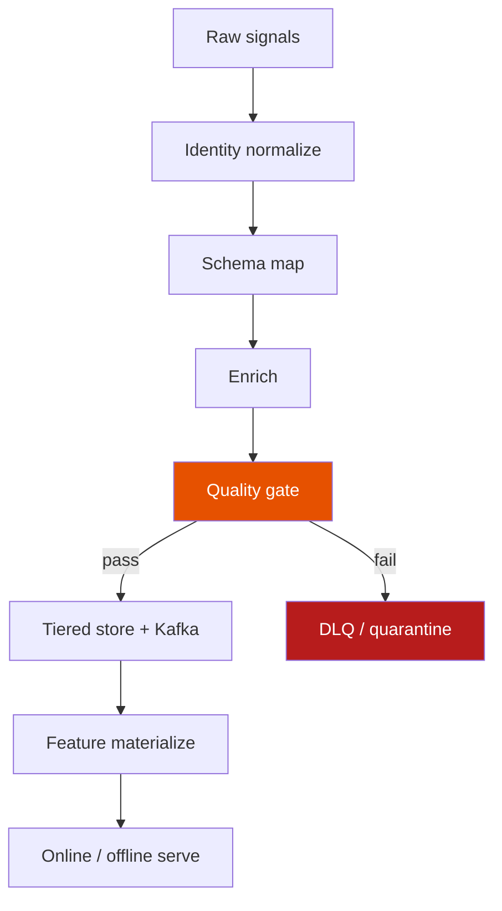

### 2.3 What “good” looks like operationally

| Metric | Target (starting point) | Why |
|--------|-------------------------|-----|
| Schema validation pass rate | ≥ 99.5% of events | Poison data poisons training |
| Identity collision rate | &lt; 0.1% of services with dual names | Correlation key integrity |
| Enrichment hit rate (topology) | ≥ 95% for prod services | Graph-based correlation needs edges |
| Feature online/offline parity tests | 100% of serving features covered | Kill train–serve skew early |
| End-to-end freshness P95 (metric → feature) | &lt; 60–120s for online AD | Detection lag budget |
| Documented retention classes | 100% of data products | Cost + compliance |

---

## 3. Decision Tree — When Do You Need This Layer?

> [!NOTE]
> **KEY IDEA**
> Not every team needs Feast + multi-region object store on day one. They **do** need explicit decisions. Use the trees below; do not cargo-cult Big Tech storage diagrams.

### 3.1 Do you need **normalize**?

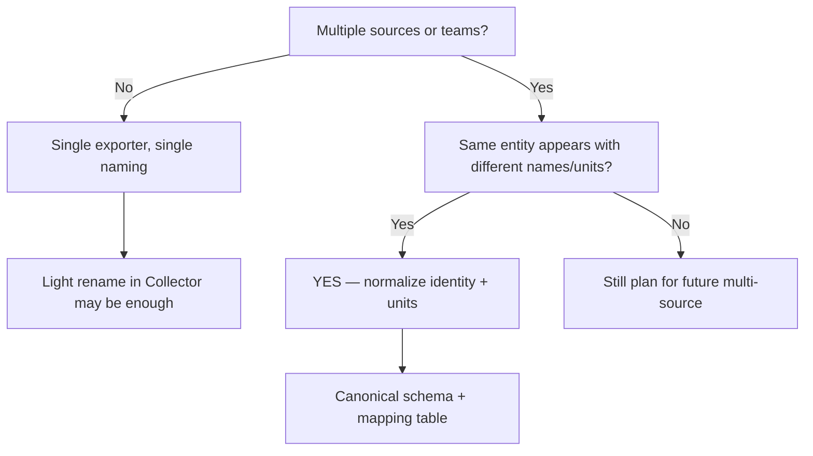

| Signal | Normalize when… | Can defer when… |
|--------|-----------------|-----------------|
| Metrics | ≥2 scrapers/exporters; unit mismatch; name explosion | One Prometheus, strict naming convention enforced in CI |
| Logs | Heterogeneous JSON keys (`msg` vs `message`) | Single logger library org-wide |
| Traces | Resource attrs inconsistent across SDKs | One auto-instrumentation stack + Collector policy |
| Events | Deploy/page/ticket IDs collide across tools | Single incident tool, no AIOps yet |

### 3.2 Do you need **enrich**?

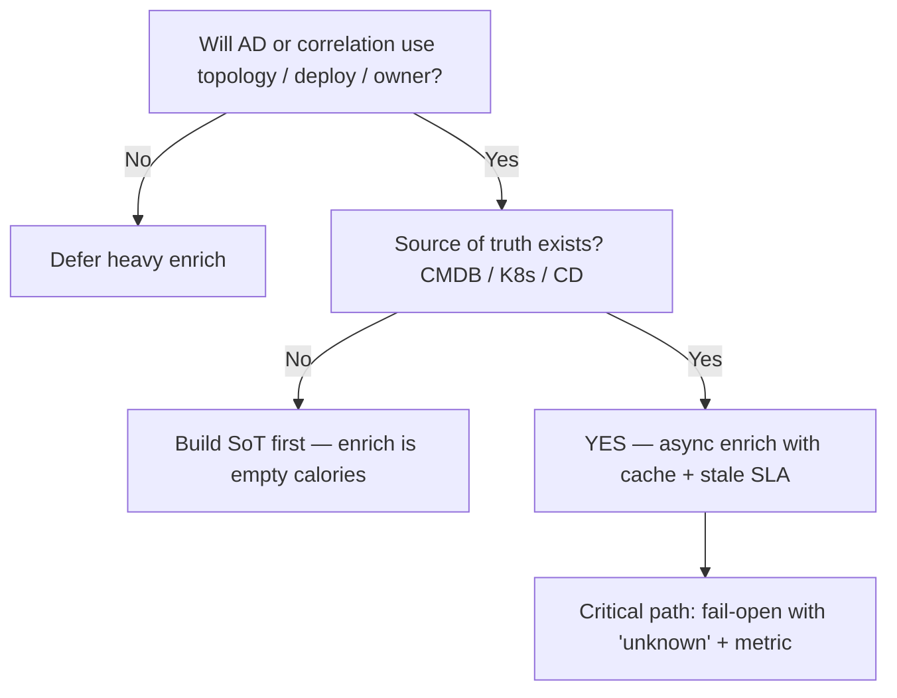

| Enrichment type | Need it when… | Skip when… |
|-----------------|---------------|------------|
| Topology (service graph, deps) | Correlation / RCA / blast-radius | Only threshold pages on single metrics |
| Deploy / change events | Change-aware detection | Freeze releases (rare) or pure infra SLIs |
| Ownership / on-call | Auto-routing, LLM context | Manual routing only |
| Business (tenant tier, payment path) | Multi-tenant SLO, ecommerce/banking | Homogeneous internal tools |
| Geo / AZ | Multi-region failure modes | Single AZ hobby stack |

> [!WARNING]
> Enriching from a **stale CMDB** is worse than no enrich: correlation invents edges that do not exist. Measure `enrichment_staleness_seconds` and treat CMDB freshness as a platform SLO.

### 3.3 Do you need **validate** (beyond Collector drop)?

| Trigger | Decision |
|---------|----------|
| Any ML training on telemetry | **Required** — quarantine bad series |
| Multi-team producers | **Required** — schema registry + reject/DLQ |
| Single team, dashboard-only | Soft validate + alert on parse errors |
| Regulated logs (PII) | **Required** — policy checks pre-store |

### 3.4 Do you need a **feature store**?

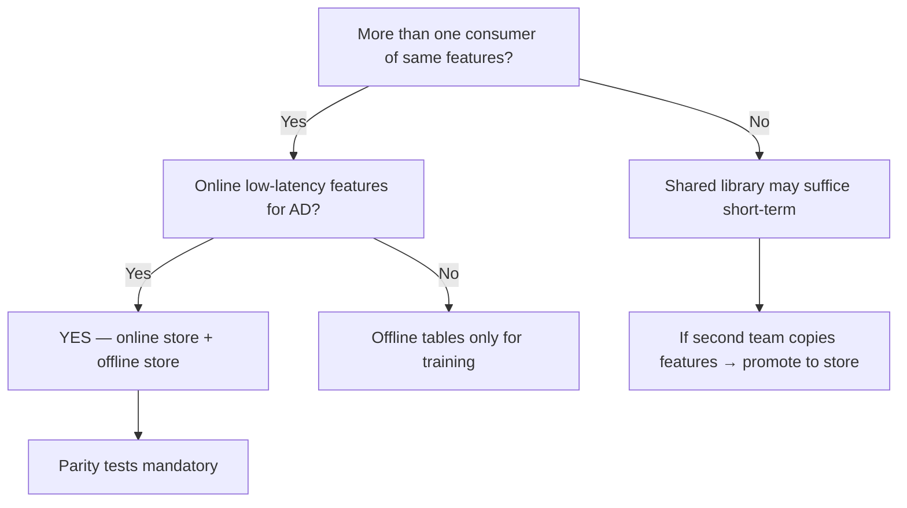

| Situation | Feature store? |
|-----------|----------------|
| One EWMA in one service | No — keep code local |
| 5 detectors reimplement lag windows | **Yes** — at least offline definitions |
| Real-time AD + weekly retrain | **Yes** — online + offline |
| LLM context only (no classical ML) | Lightweight “context pack” store; not full Feast |
| Banking model risk / audit | **Yes** + lineage + versioning |

### 3.5 Do you need **multi-tier storage**?

| Trigger | Decision |
|---------|----------|
| Hot query &lt; 7d, cold training 90d+ | Hot TSDB/search + cold object (Parquet) |
| “Keep everything forever” without budget | **No** — define retention classes instead |
| Replay for postmortems only | Kafka 7–14d + S3 incident packs |
| Regulatory 1–7y audit for actions | WORM/object for **events**, not all raw metrics |

> [!TIP]
> **Decision summary**: Normalize early (cheap). Enrich when intelligence needs context. Validate when machines consume data. Feature store when features are shared. Multi-tier when access patterns diverge (hot query ≠ cold train ≠ audit).

---

## 4. Canonical Schemas

> [!NOTE]
> **KEY IDEA**
> A canonical schema is not “JSON with more fields”. It is a **stable identity + typed payload + version + time semantics** that every producer and consumer agrees on. Without it, Kafka topics become dumpsters and feature pipelines fork forever.

### 4.1 Design principles

1. **Stable keys first** — `service_id`, `env`, `region` never free-text from random exporters without map
2. **Event time explicit** — `event_time` (when it happened) vs `ingest_time` (when we saw it)
3. **Version every envelope** — `schema_version` integer or semver; compatibility mode documented
4. **Pillar-native payloads** — do not force logs into metric shape; wrap common envelope
5. **Redaction class** — `data_class: public | internal | confidential | restricted`
6. **Provenance** — `source`, `collector_id`, `pipeline_version` for debug

### 4.2 Common envelope (all pillars)

```json
{
  "schema_version": "1.3.0",
  "signal_type": "metric|log|trace_summary|event|feature",
  "event_time": "2026-07-22T10:15:00.123Z",
  "ingest_time": "2026-07-22T10:15:01.400Z",
  "identity": {
    "service": "checkout",
    "service_id": "svc:checkout",
    "env": "prod",
    "region": "ap-southeast-1",
    "cluster": "prod-eks-01",
    "namespace": "payments",
    "team": "payments-platform"
  },
  "resource": {
    "k8s.pod.name": "checkout-7f9c8d",
    "cloud.availability_zone": "ap-southeast-1a"
  },
  "data_class": "internal",
  "provenance": {
    "source": "otel-collector",
    "pipeline_version": "data-plane-2026.07.1"
  },
  "payload": {}
}
```

### 4.3 Metric payload (canonical)

| Field | Type | Notes |
|-------|------|-------|
| `name` | string | Canonical name after map (`http_server_request_duration_seconds`) |
| `type` | enum | `gauge`, `counter`, `histogram`, `summary` |
| `unit` | UCUM-like | `1`, `%`, `s`, `By`, `Cel` |
| `value` / `buckets` | number / object | Histogram keep boundaries stable |
| `labels` | map | **Low-cardinality only** post-normalize |
| `exemplar_trace_id` | optional | Link to Tempo |

```yaml
# Example mapping table entry (identity + metric rename)
- match:
    source: prometheus
    original_name: http_request_duration_seconds
    job: checkout-api
  set:
    name: http_server_request_duration_seconds
    service: checkout
    unit: s
```

### 4.4 Log payload (canonical)

| Field | Type | Notes |
|-------|------|-------|
| `severity` | enum | `TRACE`…`FATAL` normalized from level strings |
| `body` | string | Message after redaction |
| `attributes` | map | Structured fields; PII-scrubbed |
| `trace_id` / `span_id` | optional | Correlation |
| `template_id` | optional | Drain-style template for log AD |

### 4.5 Trace summary (for AIOps — not full spans)

Full spans live in Tempo ([05](../05-tempo/README.md)). For Kafka/AD you usually emit **summaries**:

| Field | Purpose |
|-------|---------|
| `trace_id` | Join key |
| `root_service`, `root_route` | Entry |
| `duration_ms`, `status` | RED-ish |
| `error_span_count` | Quick filter |
| `critical_path` | Optional compressed span list for RCA |

### 4.6 Change / deploy / incident events

These are first-class AIOps data, not “nice to have”:

```json
{
  "signal_type": "event",
  "event_kind": "deployment",
  "event_time": "2026-07-22T09:00:00Z",
  "identity": { "service": "checkout", "env": "prod" },
  "payload": {
    "version": "1.42.0",
    "commit": "abc123",
    "pipeline_id": "gha-99821",
    "change_window": true
  }
}
```

### 4.7 Schema evolution rules

| Change | Compatibility | Action |
|--------|---------------|--------|
| Add optional field with default | BACKWARD OK | Ship |
| Rename field | Breaking | Dual-write map period |
| Change unit without rename | **Forbidden** | New name + deprecate |
| Tighten required fields | FORWARD risk | Gate on producer readiness |
| Delete field | Deprecate → remove after retention | |

> [!IMPORTANT]
> Put schemas in a **registry** (or git + CI contract tests) before Kafka multi-consumer scale. See poison-message patterns in [07 — Kafka](../07-kafka/README.md).

---

## 5. Normalization

> [!NOTE]
> **KEY IDEA**
> Normalization is **lossy by design** where it removes ambiguity (aliases, units, severity). It must be **lossless for identity of the underlying entity** — you never invent a second `checkout` service; you map aliases into one `service_id`.

### 5.1 Layers of normalize

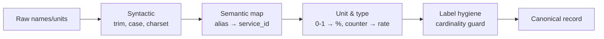

### 5.2 Identity normalization

| Raw | Canonical | Mechanism |
|-----|-----------|-----------|
| `checkout-api`, `Checkout`, `svc_checkout` | `service=checkout` / `service_id=svc:checkout` | Static map + OTel resource processor |
| `production`, `prod`, `prd` | `env=prod` | Enum map |
| Hostnames as service | Reject / map via K8s workload | Workload attribution |
| Missing team | `team=unknown` + ticket SLO | Ownership backfill job |

```yaml
# OTel Collector (illustrative) — keep maps versioned in git
processors:
  transform/identity:
    metric_statements:
      - context: resource
        statements:
          - set(attributes["service.name"], "checkout") where attributes["service.name"] == "checkout-api"
          - set(attributes["deployment.environment"], "prod") where attributes["deployment.environment"] == "production"
```

### 5.3 Metric name & unit normalize

Common disasters:

| Pattern | Fix |
|---------|-----|
| Mix of `cpu_usage` (0–1) and `cpu_usage_percent` | One name + unit; convert at edge |
| Counters exposed as gauges | Detect monotonicity; document type |
| Histogram bucket renames per release | Freeze bucket boundaries in contract |
| `_total` suffix inconsistency | Enforce OpenMetrics-style names |

### 5.4 Log severity & field normalize

```
level / severity / log.level / lvl  →  severity enum
msg / message / log  →  body
err / error / exception.message  →  error.message (redacted)
```

Drain or similar parsers should run **after** field normalize so templates are stable ([08 — Anomaly Detection](../08-anomaly-detection/README.md) log section).

### 5.5 Where to run normalize

| Location | Pros | Cons |
|----------|------|------|
| App / SDK | Correct at source | Hard to roll out org-wide |
| OTel Collector | Central, fast | Keep transforms simple |
| Stream processor (Flink/Spark) | Heavy maps, joins | Latency + ops |
| Query time only | Cheap start | Every consumer reimplements; AD diverges |

**Production default**: syntactic + identity + unit in Collector; complex business maps in stream job; never only at query time for ML paths.

> [!TIP]
> Version the mapping table (`identity-map@v12`). When AD FPR jumps after a rename, you can bisect maps, not guess.

---

## 6. Enrichment

> [!NOTE]
> **KEY IDEA**
> Enrichment attaches **context that instrumentation cannot know cheaply**: service owner, dependency edges, deploy version, tenant tier, SLO burn state. It must be **async-friendly** and **fail-open** with explicit `unknown` — never block the hot ingest path on a slow CMDB.

### 6.1 Enrichment catalog

| Source | Attributes added | Freshness SLA | Used by |
|--------|------------------|---------------|---------|
| Kubernetes API / cluster agent | workload, ns, node, zone | 30–120s | Identity, topology |
| Service catalog / Backstage | team, tier, oncall, repo | 5–15m | Routing, LLM |
| Deploy / CD webhooks | version, commit, change flag | near-real-time | Change-aware AD |
| Service mesh / eBPF graph | deps edges, traffic share | 1–5m | Correlation, RCA |
| CMDB / asset DB | criticality, PCI flag | 15–60m | Policy, retention |
| Business config | tenant tier, payment PSP | 5–30m | Domain AD ([15](../15-ecommerce-banking/README.md)) |
| Active incidents | suppress / related | real-time | FP control |

### 6.2 Enrichment architecture

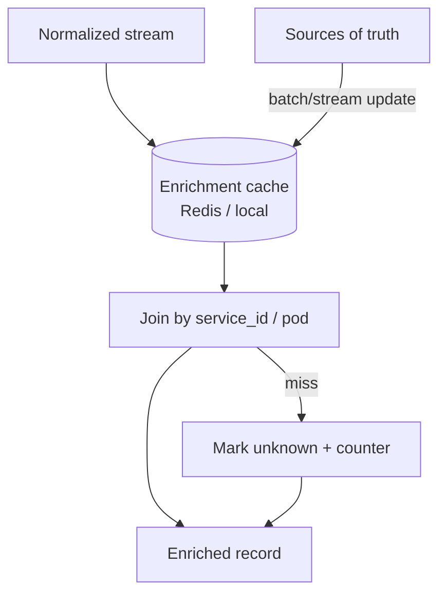

### 6.3 Rules of safe enrich

1. **Never block ingest** on external HTTP without timeout + default  
2. **Cache with TTL** shorter than SoT SLA × 2  
3. **Stamp enrichment version** (`enrichment_build=2026.07.22.1`)  
4. **Prefer keys that survive restarts** (`service_id`, not pod IP)  
5. **Separate PII enrich** (customer name) from operational enrich — different data_class  
6. **Topology edges need confidence** (`edge_source=mesh|inferred|cmdb`)

### 6.4 Change enrichment (highest ROI)

```
metric spike at T0
  + deployment event for same service in [T0-30m, T0+5m]
  → AD / correlation attach change_context
  → on-call sees "version 1.42.0 rolled 8m ago" without LLM magic
```

Without this, every release looks like an anomaly. With it, you still detect regressions — but with context and optional temporary threshold widening (careful: do not mask real incidents).

### 6.5 Topology enrichment for correlation

Downstream [09 — Alert Correlation](../09-alert-correlation/README.md) and [10 — RCA](../10-root-cause-analysis/README.md) need:

- Directed edges (A calls B)
- Shared fate (same node/AZ)
- Ownership blast radius (team blast)

Store topology as a **versioned snapshot** + delta stream, not only “live API at query time”.

> [!WARNING]
> Inferred topology from traces alone under tail sampling is incomplete. Combine mesh metrics + sampled traces + deploy graph; document confidence.

---

## 7. Validation & Quality Gates

> [!NOTE]
> **KEY IDEA**
> Validation is how you protect the **training set and on-call trust**. Drop or quarantine bad data **before** it becomes ground truth for models or pages.

### 7.1 Gate types

| Gate | Checks | On failure |
|------|--------|------------|
| Schema | Required fields, types, enum | DLQ + metric |
| Semantic | Units in range, counter resets sane | Quarantine series |
| Cardinality | Label set size / new series rate | Drop high-card labels |
| Freshness | `ingest_time - event_time` | Late path (§13) |
| Completeness | Expected scrape presence | Gap flag for AD |
| PII policy | Regex / classifier hits | Redact or reject |
| Cross-signal | `trace_id` format, exemplar exists | Soft warn |

### 7.2 Quality metrics (data SLOs)

```
data_slo_schema_pass_rate
data_slo_freshness_p95_seconds
data_slo_series_gap_ratio
data_slo_enrichment_hit_rate
data_slo_pii_violation_rate   # should be ~0 after redact
data_slo_dlq_rate
```

Page when schema pass rate drops or DLQ spikes — **same severity class as ingest down**. Silent poison is worse than outage.

### 7.3 Quarantine vs drop vs repair

| Strategy | Use when | Risk |
|----------|----------|------|
| **Drop** | High-card attack, clear garbage | Lost signal |
| **Quarantine topic/table** | Repairable schema drift | Storage cost |
| **Repair map** | Known alias / unit bug | Need audit trail |
| **Accept with flag** | Partial enrich miss | Consumers must honor flag |

> [!IMPORTANT]
> Never train offline models on unfiltered raw + quarantine mixed without a `quality_flag`. One bad week of NaNs can dominate Isolation Forest boundaries.

---

## 8. WHERE Data Lives — Multi-Tier Storage

> [!NOTE]
> **KEY IDEA**
> Store data by **access pattern and recovery need**, not by “one database for everything”. Hot path optimizes latency; cold path optimizes $/GB and scan; audit path optimizes immutability.

### 8.1 Tier map

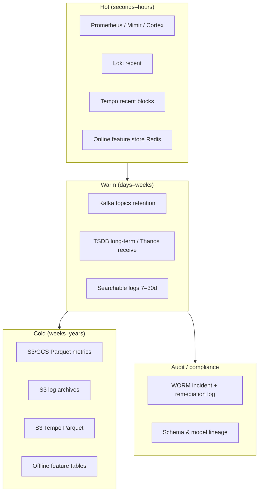

### 8.2 System of record by signal

| Signal | Hot SoR | Warm | Cold / train | Notes |
|--------|---------|------|--------------|-------|
| Metrics | Prometheus-compatible TSDB | Thanos/Mimir long-term | Parquet downsampled | Exemplars → Tempo |
| Logs | Loki (or equiv.) | Longer Loki or OpenSearch | Compressed object | Index labels only in Loki model |
| Traces | Tempo ingesters | Object blocks | Object long TTL | Full search optional |
| AIOps events | Kafka + compact store | Kafka + DB | Object WORM | Remediation audit |
| Features online | Redis / DynamoDB | — | Rebuild from offline | TTL short |
| Features offline | — | Warehouse / lake | Iceberg/Parquet | Point-in-time join |

### 8.3 What should **not** share a store

| Anti-pattern | Why it hurts |
|--------------|--------------|
| Elasticsearch as sole metric store at scale | Cost + cardinality death |
| Kafka as infinite cold store | Disk economics wrong; ops pain |
| Online feature Redis as training history | Memory cost; no PIT joins |
| Mixing PII logs with public metrics ACLs | Over-restrict or over-expose |
| Control-plane etcd for bulk telemetry | Classic coupling failure |

### 8.4 Read/write path sketch

```
Write path:
  Collectors → normalize/enrich/validate → 
    (a) pillar stores (Prom/Loki/Tempo)
    (b) Kafka raw/canonical topics
    (c) feature materializers → online/offline

Read path:
  Human dashboard → hot pillar stores
  AD online → feature online store (+ short raw)
  AD train → offline feature tables / Parquet
  RCA / LLM → hot + selected cold pulls + topology
  Auditor → WORM event store
```

---

## 9. HOW LONG — Retention Matrix

> [!NOTE]
> **KEY IDEA**
> Retention is a **product decision** (investigation window, training need, law), not a default from vendor installers. Publish a matrix; charge teams by class.

### 9.1 Recommended starting matrix (adjust by domain)

| Data product | Hot | Warm | Cold | Default delete | Drivers |
|--------------|-----|------|------|----------------|---------|
| High-res metrics (15s–60s) | 7–15d | 15–90d (downsample) | 90–400d rollups | After cold max | AD, SLO burn |
| Downsampled metrics (5m–1h) | — | 90d | 1–2y | Policy | Capacity, seasonality |
| App logs (non-PII) | 7–14d | 14–30d | 30–90d selective | After warm | Debug |
| Auth / security logs | 30d | 90d | 1y+ | Legal hold | Sec / audit |
| Traces (full) | 3–7d | 7–14d | 14–30d (errors longer) | After max | Cost ([05](../05-tempo/README.md)) |
| Trace summaries / SpanMetrics | 15–30d | 90d | 1y | Policy | RED long view |
| Kafka raw telemetry | 3–7d | — | Export to S3 | Topic retention | Replay buffer |
| Online features | hours–2d TTL | — | — | TTL | Memory |
| Offline features | — | 90–400d | As training need | Version GC | Retrain |
| Incident + remediation events | 90d | 1y | 1–7y WORM | Legal | [12](../12-remediation/README.md), regulated |
| Schema / model lineage | forever-ish | — | Object | Never silent | Audit |
| Topology snapshots | 30d | 90d | 1y | Policy | RCA replay |

### 9.2 Domain overlays

| Domain | Override | Reference |
|--------|----------|-----------|
| E-commerce peak (BFCM) | Extend hot metrics 30d around peak; keep 2y seasonality rollups | [15](../15-ecommerce-banking/README.md) |
| Banking / PCI | Strict PII TTL; longer audit of access & actions; residency | [15](../15-ecommerce-banking/README.md) |
| Multi-tenant SaaS | Per-tenant retention class; noisy neighbor quotas | Production chapter |

### 9.3 Downsampling policy (metrics)

```
raw 15s  →  keep 7d
5m rollup → keep 90d
1h rollup → keep 400d
```

Document **which aggregations** (avg/p99/max) — AD on avg-only hides spikes.

### 9.4 Delete semantics

| Delete type | Meaning |
|-------------|---------|
| TTL expire | Automatic; expected |
| Legal hold | Blocks TTL |
| Right-to-erasure | Targeted delete by subject id (hard for logs) |
| Compaction drop | Storage GC; not a privacy delete |
| Soft delete flag | Query filters; storage remains until hard GC |

> [!WARNING]
> “We deleted from Loki” ≠ deleted from S3 backups, Kafka mirrors, feature tables, and notebook extracts. Map **all copies** in a data inventory before promising erasure.

---

## 10. WHAT Happens Later — Query, Detect, Train, Audit, Delete

> [!NOTE]
> **KEY IDEA**
> Design storage for the **future verbs**, not only “Grafana works”. Each verb imposes different latency, consistency, and schema needs.

### 10.1 Verb → path matrix

| Verb | Primary path | Latency | Consistency need |
|------|--------------|---------|------------------|
| **Query** (human) | Hot Prom/Loki/Tempo | &lt;2–5s interactive | Best-effort recent |
| **Detect** (online AD) | Online features + short raw | &lt;1–2 min E2E | Fresh + stable schema |
| **Correlate** | Events + topology + anomalies | seconds–minutes | Causal order in window |
| **RCA / LLM** | Evidence bundle API | seconds–tens of s | Breadth over perfect |
| **Train** | Offline features / Parquet | hours batch OK | PIT correctness |
| **Audit** | WORM events + lineage | interactive search | Immutable |
| **Delete** | Lifecycle workers | batch | Completeness of copies |

### 10.2 Evidence bundle (AIOps product)

For [10 — RCA](../10-root-cause-analysis/README.md) and [11 — LLM](../11-llm-agent/README.md), precompute or assemble:

```
evidence_bundle:
  identity, time_window
  top metrics (canonical)
  related logs (redacted)
  trace_ids + summaries
  topology subgraph
  deploys in window
  prior incidents similarity keys
  feature vector snapshot (for model explain)
```

Bundles should be **size-capped** and **PII-safe**.

### 10.3 Training export

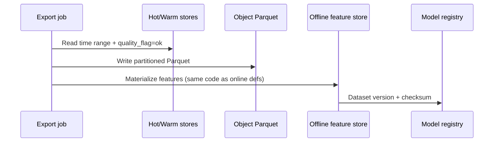

### 10.4 Delete / GC workers

- Enforce TTL per class  
- Compact Kafka → S3 then drop  
- GC orphan features when model versions retire  
- Emit audit log of delete batches  

---

## 11. Feature Store — Online vs Offline

> [!NOTE]
> **KEY IDEA**
> A feature store is the **single definition** of how raw telemetry becomes model inputs, served at two speeds: **online** (low-latency inference) and **offline** (historically correct training rows). Without it, every detector invents `error_rate_5m` differently.

### 11.1 Why AIOps needs features (not only raw series)

| Feature example | Used by | Why not raw |
|-----------------|---------|-------------|
| `error_rate_5m` | EWMA / z-score | Counters need rate + window |
| `latency_p99_ratio_to_7d` | Seasonal models | Relative baseline |
| `deploy_age_minutes` | Change-aware ensemble | Event join |
| `log_template_rare_score` | Log AD | Drain + stats |
| `dependency_error_fan_in` | Correlation features | Topology join |
| `cpu_vs_request_ratio` | Saturation | K8s enrich |

Anomaly Detection chapter assumes features exist; this chapter owns **how they are produced and served** ([08](../08-anomaly-detection/README.md)).

### 11.2 Online store

| Property | Typical choice |
|----------|----------------|
| Latency | &lt;5–20ms read |
| TTL | hours–days |
| Key | `entity_id` = service×metric×env… |
| Write | Streaming materializer from Kafka/canonical |
| Tech | Redis, DynamoDB, Aerospike, Feast online |

### 11.3 Offline store

| Property | Typical choice |
|----------|----------------|
| Latency | minutes–hours batch |
| History | 90d–2y |
| Key | entity + event_time |
| Format | Parquet/Iceberg + catalog |
| Tech | S3 + Athena/Spark, BigQuery, Snowflake, Feast offline |

### 11.4 Feature definition (contract)

```yaml
feature_view: service_sli_windowed
entities: [service_id, env]
ttl_online: 2h
schema_version: 3
features:
  - name: http_error_rate_5m
    dtype: float64
    source: metric
    transform: rate(errors)/rate(requests) over 5m
  - name: latency_p99_5m
    dtype: float64
    source: metric
    transform: histogram_quantile(0.99) over 5m
  - name: deploy_age_minutes
    dtype: float64
    source: event
    transform: now - last_deploy_time
owners: [platform-aiops]
tests:
  - parity_online_offline
  - range: [0, 1] for error_rate
```

### 11.5 Materialization paths

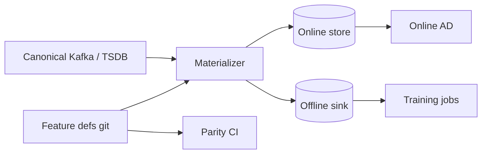

### 11.6 Entity grain discipline

Wrong grain is a silent killer:

| Bad grain | Symptom |
|-----------|---------|
| Per-pod features only | Explodes cardinality; no stable service view |
| Global only | Misses single-tenant incidents |
| Per-user | PII + explosion; rarely for infra AD |

**Default AIOps grain**: `service_id × env × region` (+ optional `route` for critical paths).

### 11.7 When Feast / vendor vs thin DIY

| Choose managed/Feast-like when… | DIY thin when… |
|---------------------------------|----------------|
| Many teams, many feature views | &lt;10 features, one team |
| Need PIT joins & registry | Batch CSV is enough for POC |
| Audit of feature versions | Startup speed matters more |

> [!TIP]
> Start with **feature definitions in git + shared library + Redis**, then graduate to a full store when the third team copies PromQL into a notebook.

---

## 12. Train–Serve Skew

> [!NOTE]
> **KEY IDEA**
> Train–serve skew is the production failure mode where the **model sees different feature values in training than in online inference** for the “same” reality. Accuracy metrics from notebooks lie. Parity tests are not optional.

### 12.1 Sources of skew

| Source | Example | Mitigation |
|--------|---------|------------|
| Different code paths | Notebook pandas vs prod Flink | One codegen / shared lib |
| Different clocks | Train on event_time; serve on process_time | Unified time contract |
| Different windows | Train 5m closed; serve 5m open rolling | Document window semantics |
| Label / feature leakage | Future deploy flag in train | Strict PIT joins |
| Missing enrich online | Offline has team; online unknown | Fail tests on enrich miss rate |
| Version drift | Offline v3, online v2 | Version pin in model metadata |
| Aggregation mismatch | Train avg latency; serve p99 | Feature name encodes agg |
| Sampling bias | Train only on sampled traces | SpanMetrics before sample ([05](../05-tempo/README.md)) |

### 12.2 Detection

```
parity_job:
  sample N entities every hour
  compute feature_online vs feature_offline_at_same_event_time
  alert if |diff| > epsilon or PSI(feature) > 0.1
```

### 12.3 Hard rules

1. Model artifact **must** record `feature_view_version`  
2. Online materializer **must** refuse unknown versions (or dual-write)  
3. Training **must** use offline store only — not ad-hoc Grafana CSV  
4. Shadow deploy: score both old/new feature versions before cutover  

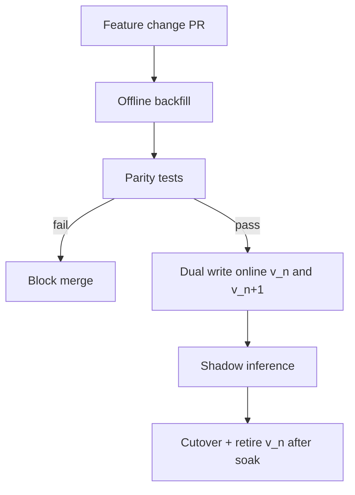

> [!WARNING]
> A “one-line fix” to error_rate (exclude 404) that ships only online will **look** like model improvement or degradation randomly. Treat feature logic like production API code.

---

## 13. Data Lifecycle & Late Arrivals

> [!NOTE]
> **KEY IDEA**
> Distributed telemetry is **late by default** (scrape delay, batch logs, mobile, multi-hop). Lifecycle design must define **watermarks**, **allowed lateness**, and **what AD does with gaps**.

### 13.1 Time domains

| Time | Definition |
|------|------------|
| Event time | When the system behavior occurred |
| Ingest time | When data plane received it |
| Process time | When a job handled it |
| Store time | When durable write acknowledged |

Always persist **event_time and ingest_time**.

### 13.2 Late data policy

| Lateness | Action |
|----------|--------|
| &lt; 2 min | Normal path; update online features |
| 2–15 min | Soft-late: update offline; online optional recompute |
| 15 min–2 h | Late path topic; backfill features; mark series |
| &gt; 2 h (configurable) | Cold backfill only; do not thrash online AD |
| Clock skew negative | Clamp / quarantine; page if systemic |

### 13.3 Watermarks for materializers

Stream jobs should track:

```
watermark = max_event_time_seen - allowed_lateness
```

Windows close after watermark; late events go to side output.

### 13.4 Gaps vs zeros

| Situation | Correct handling |
|-----------|------------------|
| Scrape failed | **Gap** (null), not zero error rate |
| Counter reset | Reset-aware rate |
| Service scaled to zero | Expected absence vs incident |
| Sampling dropped spans | Do not treat as zero traffic without SpanMetrics |

AD must distinguish **missing data** from **healthy zero**. Quality flags from §7 feed detectors ([08](../08-anomaly-detection/README.md)).

### 13.5 Lifecycle state machine (per record class)

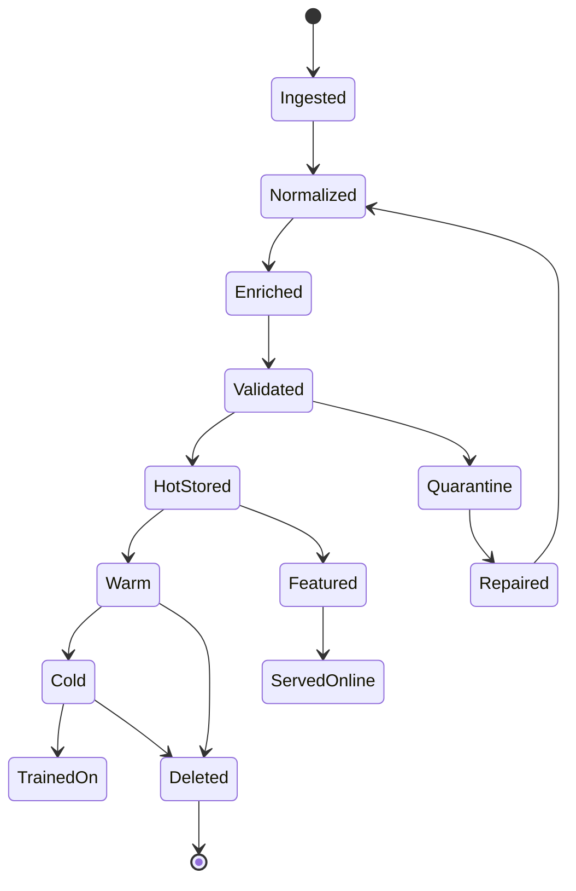

---

## 14. PII, Privacy & Compliance

> [!NOTE]
> **KEY IDEA**
> Telemetry is a **privacy surface**. Span attributes, log bodies, and enrichment joins will leak PII unless policy is enforced in the data plane — not only in “the app doesn’t log emails” wiki pages.

### 14.1 Where PII sneaks in

| Location | Examples |
|----------|----------|
| Log body | email, phone, card fragments, tokens |
| Span attributes | `user.id`, `http.url` with tokens, `db.statement` |
| Metric labels | `customer_id`, `email` (cardinality + privacy) |
| Enrichment | CRM join on user |
| Feature store | embeddings over raw text |
| Evidence bundles for LLM | unconstrained log paste |

### 14.2 Controls

1. **Allowlist attributes** at Collector (deny by default for custom keys)  
2. **Redact processors** before store and before Kafka topics used by ML  
3. **data_class** on every record; ACL by class  
4. **Separate topics/buckets** for restricted data  
5. **Tokenization** for join keys when needed (HMAC with keyed secret)  
6. **Retention shorter** for PII-bearing classes  
7. **Access audit** on Explore / warehouse queries  
8. **LLM path**: only redacted bundles ([11](../11-llm-agent/README.md))

### 14.3 Decision tree — store or drop

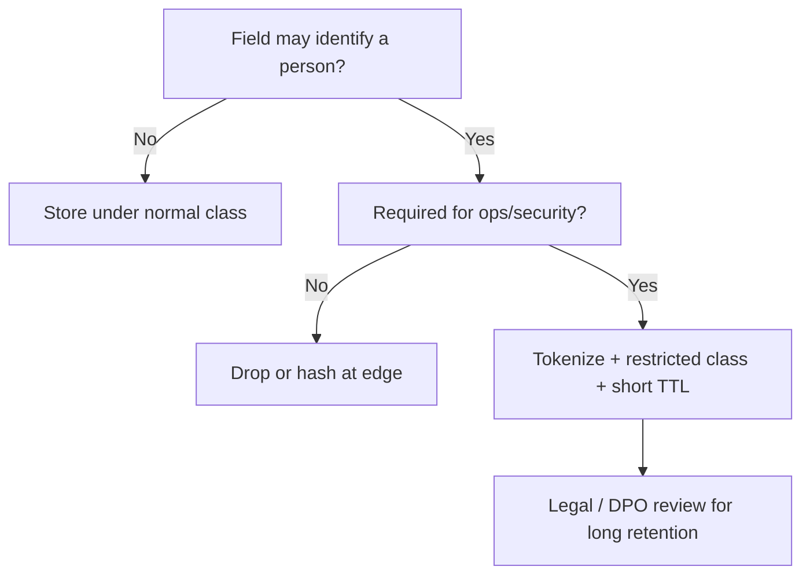

> [!IMPORTANT]
> Banking and ecommerce patterns in [15 — E-commerce & Banking](../15-ecommerce-banking/README.md) may require PCI segmentation: card data **never** enters AIOps telemetry stores.

---

## 15. Cost Model of the Data Plane

> [!NOTE]
> **KEY IDEA**
> Data plane cost is dominated by **volume × retention × replicas × query amplification**, not by the normalize CPU you fear. Feature stores add a second copy of high-value data — budget deliberately.

### 15.1 Cost drivers

| Driver | Lever |
|--------|-------|
| Cardinality | Label allowlists, recording rules |
| Log volume | Sampling, drop debug in prod, structured extract |
| Trace volume | Tail sampling ([05](../05-tempo/README.md)) |
| Retention | Tiered TTL, downsample |
| RF / multi-AZ | Kafka RF=3, TSDB replication |
| Reprocessing | Efficient Parquet layout; avoid full Kafka replay for train |
| Online features | Key cardinality × bytes × TTL |
| Query fan-out | Caching, pre-aggregates, evidence caps |

### 15.2 Rough monthly model (illustrative)

```
Metrics hot:     series × bytes × RF × storage_rate
Logs:            GB_ingest/day × retention_days × $
Traces:          spans_kept × size × $S3
Kafka:           ingress × retention × RF / compression
Features online: keys × value_size × $memory
Offline lake:    Parquet GB × $
Transform compute: vCPU-hours for materializers
```

Work a real example with *your* cardinality from [03 — Prometheus](../03-prometheus/README.md) and sampling from Tempo.

### 15.3 Cost vs value table

| Spend | Value if… | Waste if… |
|-------|-----------|-----------|
| Canonical normalize | Multi-team AIOps | Single exporter forever |
| Topology enrich | Correlation/RCA | Never used beyond dashboards |
| 400d raw 15s metrics | True long ML | Only 7d human debug |
| Online feature store | Real-time AD | Batch-only weekly reports |
| WORM 7y all logs | Rarely justified | Keep 7y **actions**, not all debug logs |

> [!TIP]
> Chargeback by **team × data_class × retention_class**. Without economics, every team chooses “keep forever / full cardinality”.

---

## 16. Maturity Model (L0–L4)

> [!NOTE]
> **KEY IDEA**
> Climb maturity in order. Feature store on top of chaotic identity is theater.

| Level | Name | Capabilities | Typical pain remaining |
|-------|------|--------------|------------------------|
| **L0** | Silo collect | Prom/Loki/Tempo exist | Manual rename in brain |
| **L1** | Normalize | Identity map, unit map, schema v1 | Enrich missing |
| **L2** | Enrich + validate | Topology, deploy, DLQ, data SLOs | Features ad-hoc |
| **L3** | Tiered store + offline features | Retention matrix, Parquet train, Kafka canonical | Online parity weak |
| **L4** | Full feature platform | Online/offline, parity CI, lineage, privacy classes | Continuous cost governance |

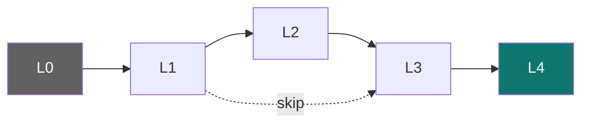

> [!WARNING]
> Jumping L0 → L4 (buy platform, skip identity) produces beautiful UIs on unjoinable data. Executive demos pass; on-call does not trust pages.

### Suggested timeline (aligned with [00](../00-introduction.md) maturity)

| Quarter | Focus |
|---------|-------|
| Q1 | L1: identity + schema + Collector maps |
| Q2 | L2: deploy enrich + quality SLOs + DLQ |
| Q3 | L3: cold Parquet + offline features for AD retrain |
| Q4 | L4: online store + parity + privacy program |

---

## 17. Reference Architecture

> [!NOTE]
> **KEY IDEA**
> One concrete shape you can implement on AWS/K8s without boiling the ocean. Swap brands; keep contracts.

### 17.1 Component diagram

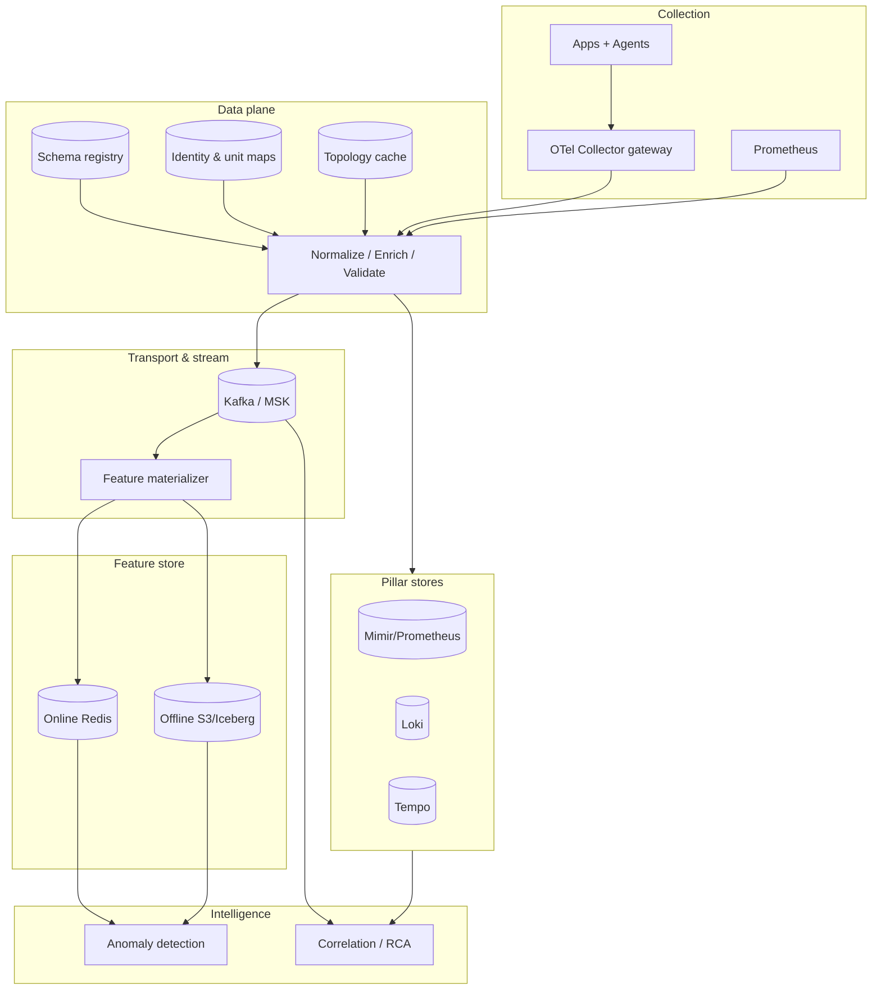

### 17.2 Topic / table sketch (pre-Kafka chapter detail)

| Name | Content | Retention |
|------|---------|-----------|
| `telemetry.metrics.canonical.v1` | Normalized metrics | 3–7d |
| `telemetry.logs.canonical.v1` | Redacted structured logs | 3–7d |
| `telemetry.traces.summaries.v1` | Trace summaries | 3–7d |
| `telemetry.events.changes.v1` | Deploy/config | 30d+ |
| `telemetry.dlq.v1` | Failed validation | 14d |
| `features.service_sli.v3` | Optional feature stream | 2d |
| `s3://aiops-lake/metrics/...` | Parquet partitions | per matrix |
| `s3://aiops-lake/features/...` | Offline features | per matrix |

Deep transport design: [07 — Kafka](../07-kafka/README.md).

### 17.3 API surfaces

| API | Consumer | SLA |
|-----|----------|-----|
| PromQL / LogQL / TraceQL | Humans, some AD | Hot tier |
| Feature GetOnline(entity) | Detectors | ms |
| Feature GetHistorical(range) | Training | batch |
| EvidenceBundle(incident) | RCA / LLM | seconds |
| Catalog (schemas, maps) | Engineers + CI | interactive |

---

## 18. Edge Cases & Failure Modes

> [!NOTE]
> **KEY IDEA**
> Data planes fail **quietly**. Design for partial enrichment, dual-writes during migration, and poison maps.

### 18.1 Catalog of edges

| Edge case | Symptom | Mitigation |
|-----------|---------|------------|
| **Rename storm** | Sudden new series / lost history | Alias table with effective dates; dual write |
| **Clock skew fleet-wide** | Negative lateness, time travel | NTP SLOs; clamp; page |
| **Enrichment thundering herd** | CMDB outage → latency | Cache + fail-open unknown |
| **Cardinality bomb** | TSDB OOM | Hard drop + offender metric |
| **Poison map** | All services → `unknown` | Canary map apply; auto-rollback |
| **Split-brain topology** | Two graphs disagree | Confidence field; prefer mesh |
| **Hot key feature entity** | Redis CPU | Shard keys; aggregate grain |
| **Backfill stomps online** | Feature flicker | Separate late path; versioned keys |
| **Multi-tenant bleed** | Tenant A sees B | Enforce tenant_id in all keys + ACL |
| **DR region cold empty** | AD blind after failover | Async replicate maps + offline; accept feature lag |
| **Schema registry down** | Producers block or unvalidated | Cached schemas; fail policy explicit |
| **Duplicate counters after HA** | Inflated rates | Dedupe keys + exemplar |

### 18.2 Dual-write migrations

When introducing canonical topics:

```
Phase 1: shadow normalize (no consumer depends)
Phase 2: AD reads canonical; legacy still written
Phase 3: parity dashboards green 2 weeks
Phase 4: stop legacy fields
```

### 18.3 Partial failure matrix

| Failed component | Degrade mode |
|------------------|--------------|
| Topology cache | Correlate without edges; page enrich SLO |
| Online feature store | Fall back short PromQL (limited) or pause secondary detectors |
| Cold lake | Training delayed; online detect continues |
| Kafka | Pillar stores still work; AIOps lag — see [07](../07-kafka/README.md) bypass |
| Pillar store | Dashboards blind; still buffer to Kafka if possible |

---

## 19. Honest List — Remaining Pipeline Gaps

> [!NOTE]
> **KEY IDEA**
> A mature handbook admits what this layer **does not** finish. Closing these gaps is other chapters’ jobs — and some are permanent open problems.

### 19.1 What the data plane deliberately does **not** solve

| Gap | Why remains | Where addressed |
|-----|-------------|-----------------|
| **Durable multi-consumer fan-out & lag politics** | Transport problem | [07 — Kafka](../07-kafka/README.md) |
| **Which detector algorithm to use** | Model problem | [08 — AD](../08-anomaly-detection/README.md) |
| **Alert grouping correctness** | Graph + policy | [09 — Correlation](../09-alert-correlation/README.md) |
| **Causal proof of root cause** | Epistemology + tests | [10 — RCA](../10-root-cause-analysis/README.md) |
| **LLM hallucination on evidence** | Model + prompts | [11 — LLM](../11-llm-agent/README.md) |
| **Safe auto-remediation** | Control theory + gates | [12 — Remediation](../12-remediation/README.md) |
| **Org ownership / RACI** | People system | [13 — Production](../13-production/README.md) |
| **Perfect global identity** | M&A, shadow IT | Continuous governance |
| **Zero PII forever** | Humans paste secrets | Defense in depth + culture |
| **Cost → 0** | Physics of retention | Chargeback + sampling |

### 19.2 Structural open problems (industry)

1. **Cross-company identity** for SaaS dependencies you do not instrument  
2. **True real-time PIT features** at extreme cardinality without huge $  
3. **Semantic OTel convergence** still uneven across languages/agents  
4. **Privacy-preserving training** on production telemetry at scale  
5. **Explainability** of enriched features to auditors without drowning them  

### 19.3 Gaps **inside** a typical data plane build (checklist debt)

- [ ] No automated **map canary**  
- [ ] No **parity job** online/offline  
- [ ] Topology without **confidence**  
- [ ] Retention matrix not enforced in Terraform  
- [ ] DLQ without **owner + burn-down SLO**  
- [ ] Evidence bundles unbounded → LLM cost blowups  
- [ ] Training still from **Grafana CSV**  
- [ ] No **data inventory** for delete/erasure  
- [ ] Multi-region **enrichment split-brain** untested  
- [ ] Feature ownership unclear (platform vs app teams)

> [!TIP]
> Bring this gap list to architecture review. A design that pretends gaps are closed is less safe than one that names bypasses.

---

## 20. Common Mistakes

| # | Mistake | Consequence | Fix |
|---|---------|-------------|-----|
| 1 | Skip normalize; fix in each dashboard | AIOps joins fail | Central identity map |
| 2 | Enrich on synchronous hot path | Ingest outage with CMDB | Cache fail-open |
| 3 | One store for all retention | $ explosion or data loss | Tier matrix |
| 4 | Train on raw unvalidated Kafka | Model garbage | Quality flags |
| 5 | Online features rewritten ad-hoc | Train–serve skew | Shared defs + tests |
| 6 | Infinite Kafka retention “for ML” | Broker disk incidents | Export lake + short Kafka |
| 7 | PII only “banned in guidelines” | Compliance incident | Technical controls |
| 8 | No schema version | Poison consumers | Registry + DLQ |
| 9 | Zero vs gap confusion | False AD | Explicit nulls |
| 10 | Feature grain = pod_id | Cardinality death | Service grain |
| 11 | Topology from wishful CMDB | Wrong blast radius | Measure freshness |
| 12 | Delete only hot tier | “Erased” data remains | Inventory all copies |
| 13 | No chargeback | Hoarding | Showback by class |
| 14 | Big-bang rewrite of names | History break | Dual-write aliases |
| 15 | LLM reads unrestricted logs | Data leak | Redacted bundles only |

---

## 21. Monitoring the Data Plane

> [!NOTE]
> **KEY IDEA**
> Dogfood: the data plane needs **its own SLOs** or intelligence degrades silently while app goldens stay green.

### 21.1 Golden signals for the plane

| Signal | Example metric | Alert idea |
|--------|----------------|------------|
| Traffic | records/s in/out per stage | Drop &gt; 20% |
| Errors | schema_fail_rate, enrich_error_rate | &gt; 0.5% for 10m |
| Latency | normalize p99, feature materialize lag | Breach budget |
| Saturation | consumer lag, Redis memory, TSDB head | Capacity |
| Quality | gap_ratio, unknown_identity_ratio | Rising trend |
| Freshness | ingest_delay p95 | &gt; SLO |
| Parity | feature_diff_rate | &gt; epsilon |
| Privacy | pii_detect_hits | any in prod sink |

### 21.2 Sample PromQL-style checks (illustrative)

```promql
# Schema pass rate
sum(rate(dataplane_records_validated_total{result="pass"}[5m]))
/
sum(rate(dataplane_records_validated_total[5m]))

# Materializer lag (seconds)
histogram_quantile(0.95, sum by (le) (rate(feature_materialize_lag_seconds_bucket[5m])))

# Identity unknown ratio
sum(rate(dataplane_identity_unknown_total[5m]))
/
sum(rate(dataplane_records_out_total[5m]))
```

### 21.3 Dashboards

1. **Pipeline funnel** — in → normalize → enrich → validate → store → features  
2. **Quality** — DLQ top offenders by service/source  
3. **Retention & cost** — GB by class, projected $  
4. **Feature health** — online hit rate, parity, TTL expiry  
5. **Privacy** — redact counts, blocked attributes  

### 21.4 Synthetic probes

- Emit known synthetic metrics/logs/traces with deliberate aliases → expect canonical service  
- Emit PII-like string → expect redaction  
- Stop enrich source → expect unknown + alert, not hang  
- Late event → expect late path, not drop without metric  

---

## 22. Scaling

### 22.1 Bottlenecks by stage

| Stage | Scales with | Scale tactic |
|-------|-------------|--------------|
| Normalize | record/s CPU | Horizontal collectors; keep maps in memory |
| Enrich | cache QPS / SoT | Redis cluster; batch updates |
| Validate | schema complexity | Precompile schemas; sample deep checks |
| Hot store | cardinality + ingest | Shard tenants; recording rules |
| Kafka | throughput + partitions | See [07](../07-kafka/README.md) |
| Materializer | entities × features | Partition by service_id hash |
| Online FS | QPS + memory | Shard; shorter TTL; fewer keys |
| Offline | scan volume | Partition by day/service; columnar |

### 22.2 Multi-tenant isolation

- Per-tenant quotas on series and log GB  
- Separate Kafka topics or partition keys with fairness  
- Noisy neighbor dashboards  
- Priority lanes for `tier=critical` services  

### 22.3 Backpressure

```
If materializer lag > threshold:
  1) shed non-critical features
  2) keep SLI features for P0 services
  3) never drop validation for PII policy
  4) page platform — lag is a data plane incident
```

---

## 23. Security

| Control | Implementation notes |
|---------|----------------------|
| AuthN/Z | mTLS collectors → plane; IAM for S3; RBAC Grafana |
| Encryption | TLS in transit; KMS at rest for lake & FS |
| Secrets | Map HMAC keys in secret manager; rotate |
| Supply chain | Signed pipeline images; map PRs reviewed |
| Isolation | Restricted data_class network policies |
| Audit | Who queried restricted logs; who changed maps |
| Break-glass | Out-of-band access if plane depends on prod it monitors ([13](../13-production/README.md), [16](../16-famous-incidents/README.md)) |

> [!WARNING]
> Feature stores often become a **second production database** of behavioral data. Apply the same threat model as customer data stores when features can reverse-identify users.

---

## 24. Production Checklist

### 24.1 Before calling the data plane “production”

- [ ] Identity map covers ≥95% of prod traffic sources  
- [ ] Schema registry + version on all canonical streams  
- [ ] DLQ with owner, alert, and weekly burn-down  
- [ ] Deploy/change events enrich critical services  
- [ ] Retention matrix approved by security + finance  
- [ ] Hot / warm / cold paths documented with delete semantics  
- [ ] Online/offline feature defs for every AD feature  
- [ ] Parity tests in CI + hourly prod job  
- [ ] PII allowlist/deny + redaction verified by probe  
- [ ] Data SLOs on dashboard + paging  
- [ ] Cost showback at least monthly  
- [ ] Runbook: enrich down, schema spike, lake write fail  
- [ ] Chaos: kill topology source; ingest continues  
- [ ] Inventory of all data copies for erasure  

### 24.2 Per new signal onboarding

1. Name owner + data_class + retention class  
2. Provide mapping to `service_id`  
3. Contract test fixtures  
4. Cardinality estimate  
5. Feature impact (new view?)  
6. Privacy review if user-adjacent  
7. Canary 1% → 100%  

### 24.3 Per feature launch

1. Spec window, grain, dtype, range  
2. Offline backfill plan  
3. Parity thresholds  
4. Model version pin  
5. Rollback plan (feature flag)  
6. Cost delta (keys × TTL)  

---

## 25. War Stories

> [!NOTE]
> Pattern composites for recognition training — not claims about a single employer.

| # | Story | Root cause | Lesson |
|---|-------|------------|--------|
| 1 | AD pages every deploy for 3 months | No change enrich | §6 change enrichment |
| 2 | Model “great in notebook”, useless in prod | Different error_rate defs | §12 skew |
| 3 | Kafka disk full “because ML” | Infinite retention | §9 / §15 |
| 4 | Correlation groups random services | Alias explosion | §5 identity |
| 5 | GDPR request incomplete | Forgotten feature lake | §9 delete / inventory |
| 6 | Black Friday AD blind 40m | Enrich dependency outage blocked ingest | fail-open §6 |
| 7 | p99 features trained on avg export | Dashboard CSV train | §11 offline store |
| 8 | Tenant data bleed in Redis keys | Missing tenant in entity key | §18 multi-tenant |

---

## 26. Socratic Questions

Use in design review before approving the next storage PO.

1. What is the **canonical `service_id`** for your top 20 revenue services — and who owns the map?  
2. If CMDB is 6 hours stale, what does correlation do?  
3. Point to the **retention matrix** row for remediation audit events. Is it WORM?  
4. Name one feature used in prod AD. Is the **same code** used offline?  
5. Event time vs ingest time: which does your watermark use?  
6. Where do **late** metrics go after 45 minutes?  
7. What is your **data_class** for checkout logs with emails?  
8. If online Redis dies, do you page? What degrades?  
9. How many **copies** of last week’s metrics exist (including notebooks)?  
10. Which pipeline gap in §19 are you pretending is closed?  
11. After [07 Kafka](../07-kafka/README.md) is down, what still works from this plane?  
12. For [08 AD](../08-anomaly-detection/README.md), is gap≠zero enforced?  

> [!TIP]
> Two consecutive vague answers on identity or feature parity → do not approve new ML models yet.

---

## 27. Production Review

### Principal Engineer Assessment

**Critical issues to close in most “we collect everything” orgs:**

1. **Identity is tribal knowledge** — encode maps + CI.  
2. **No data SLOs** — only app SLOs; poison is invisible.  
3. **Feature logic duplicated** — schedule a store before the fifth detector.  
4. **Retention by vendor default** — rewrite with matrix + Terraform.  
5. **Enrich on critical path** — move to cache fail-open.  
6. **Training from dashboards** — mandatory offline path.  
7. **PII via span attributes** — allowlist enforcement.  
8. **Kafka as cold store** — export lake; shorten topics.  
9. **Parity untested** — treat as release gate.  
10. **Gaps denied** — publish §19 list internally with owners.

### Improvement Roadmap

#### Phase 0 — Contract foundation (weeks 1–3)

| Item | Done when |
|------|-----------|
| Envelope + schema v1 | All new producers validated |
| Identity map top services | ≥95% traffic canonical |
| DLQ + alert | Owner responds &lt;1 business day |
| Data SLO dashboard | Schema/freshness visible |

#### Phase 1 — Enrich & quality (weeks 4–7)

| Item | Done when |
|------|-----------|
| Deploy events joined | AD context shows version |
| Topology cache + freshness SLO | Staleness paged |
| Gap flags to AD | No zero-for-missing |
| PII probes green | Synthetic secrets redacted |

#### Phase 2 — Tiers & features (weeks 8–14)

| Item | Done when |
|------|-----------|
| Retention matrix enforced | Lifecycle jobs prove delete |
| Parquet export metrics/features | Retrain without Grafana CSV |
| Online store for core SLI features | p99 materialize lag in budget |
| Parity CI + prod job | Diff &lt; epsilon |

#### Phase 3 — Harden (next quarter)

| Item | Done when |
|------|-----------|
| Chargeback | Teams see $ by class |
| Multi-region map/feature DR drill | RTO documented |
| Evidence bundle API | RCA/LLM size-capped |
| Lineage for models↔features | Audit query works |

### Chapter Scores

| Criterion | Score | Notes |
|-----------|-------|-------|
| Technical Accuracy | 9.6/10 | Contracts, tiers, features aligned with production practice |
| Production Readiness | 9.7/10 | Checklists, SLOs, fail-open enrich, DLQ |
| Depth | 9.7/10 | Decision trees, skew, late data, privacy, gaps |
| Practical Value | 9.8/10 | Matrices and onboarding steps actionable |
| Architecture Quality | 9.6/10 | Reference architecture + verb matrix |
| Observability | 9.6/10 | Data plane golden signals |
| Security | 9.6/10 | PII classes, encryption, break-glass pointer |
| Scalability | 9.5/10 | Bottlenecks and backpressure |
| Cost Awareness | 9.7/10 | Drivers + chargeback |
| Diagram Quality | 9.6/10 | Mermaid decision and architecture flows |
| AIOps Fit | 9.8/10 | Explicit bridge 02–05 → 07–11 |

---

## 28. Summary

| Concept | Core takeaway |
|---------|---------------|
| Why after collection | Collect ≠ trust, join, feature, retain |
| Normalize | One identity, one unit, versioned maps |
| Enrich | Async context; fail-open; freshness SLO |
| Validate | Protect training and trust; DLQ with owners |
| Multi-tier store | Hot query ≠ cold train ≠ audit WORM |
| Retention | Product + legal matrix; inventory all copies |
| Later verbs | Design for query/detect/train/audit/delete |
| Feature store | Shared defs; online speed + offline history |
| Train–serve skew | Same code, PIT joins, parity tests |
| Late data | Watermarks; gap≠zero |
| PII | Technical allowlist/redact; short TTL restricted |
| Cost | Volume × retention × copies; chargeback |
| Maturity | L1 identity before L4 feature platform |
| Gaps | Transport, models, org — named, not denied |

**Next**: [07 — Kafka / Kinesis](../07-kafka/README.md) — durable transport, fan-out, lag, schema at the wire. Then [08 — Anomaly Detection](../08-anomaly-detection/README.md) consumes canonical features and series.

---

## 29. References

1. [OpenTelemetry Specification — Resource & Semantic Conventions](https://opentelemetry.io/docs/specs/semconv/)
2. [OpenMetrics](https://openmetrics.io/)
3. [Feast Feature Store Documentation](https://docs.feast.dev/)
4. [Google — Feature Store concepts (Vertex AI)](https://cloud.google.com/vertex-ai/docs/featurestore)
5. [AWS — Well-Architected Analytics / Lake House patterns](https://aws.amazon.com/big-data/datalakes-and-analytics/)
6. [Apache Iceberg / Parquet](https://iceberg.apache.org/) — cold tier layouts
7. [Grafana Mimir / Loki / Tempo docs](https://grafana.com/docs/) — pillar stores
8. [Confluent Schema Registry](https://docs.confluent.io/platform/current/schema-registry/) — evolution modes
9. [NIST Privacy Framework](https://www.nist.gov/privacy-framework) — data handling classes
10. Handbook siblings: [00](../00-introduction.md) · [02](../02-opentelemetry/README.md) · [03](../03-prometheus/README.md) · [04](../04-loki/README.md) · [05](../05-tempo/README.md) · [07](../07-kafka/README.md) · [08](../08-anomaly-detection/README.md) · [09](../09-alert-correlation/README.md) · [10](../10-root-cause-analysis/README.md) · [11](../11-llm-agent/README.md) · [12](../12-remediation/README.md) · [13](../13-production/README.md) · [15](../15-ecommerce-banking/README.md) · [16](../16-famous-incidents/README.md)

## Further Reading

- *Designing Data-Intensive Applications* (Kleppmann) — logs, streams, batch  
- *Fundamentals of Data Engineering* (Reis & Housley) — lifecycle & quality  
- MLOps feature parity literature — train–serve skew case studies  
- Downstream pipeline: Kafka → AD → Correlation → RCA → LLM → Remediation  

---

*Chapter 06 — Telemetry Data Plane. Positioned after collection (02–05), before transport (07) and intelligence (08+). Principal SRE focus: contracts, decision trees, retention, features, and honest gaps.*
