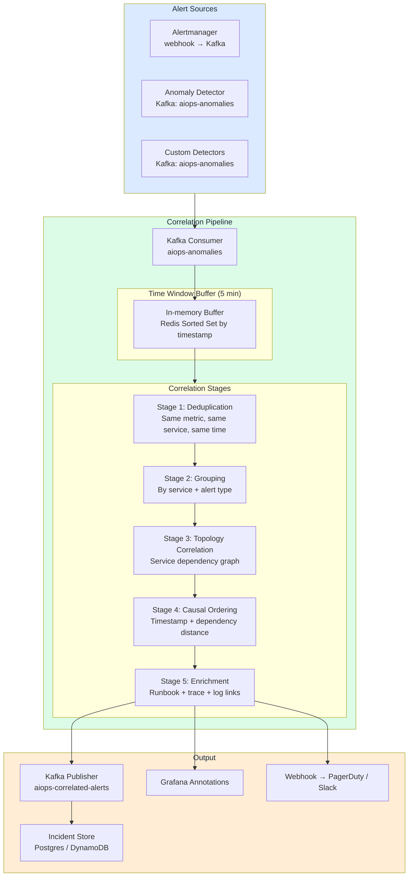
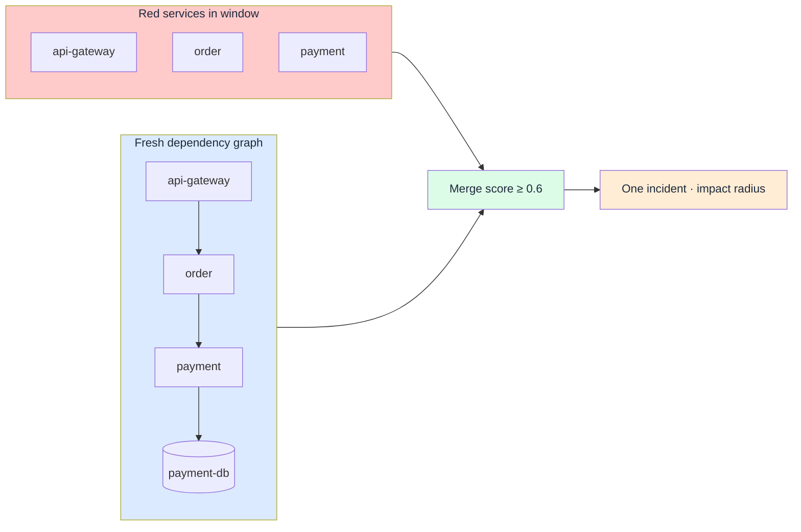
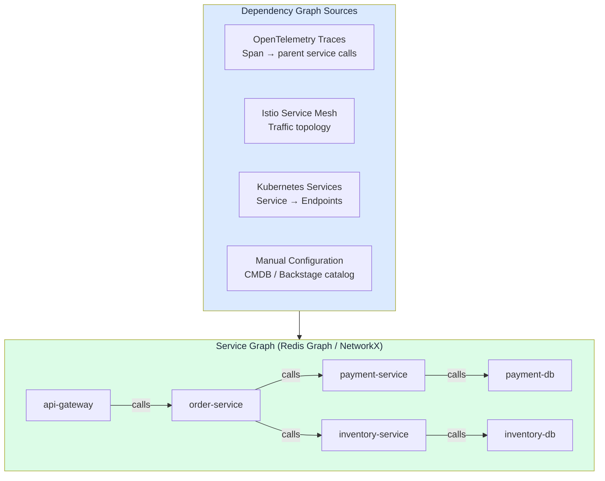

# Chapter 09 — Alert Correlation Engine

> **Alert correlation is the middle buffer between raw anomaly detection and human attention. Its job: take hundreds of concurrent anomaly events caused by a single root cause and compress them into one coherent incident with full context. This is where AIOps often shows the clearest ROI.**

---

## Prerequisites

- [07 — Anomaly Detection](../08-anomaly-detection/README.md) — produces the anomaly events consumed here
- [03 — Prometheus](../03-prometheus/README.md) — alert source via Alertmanager
- [06 — Kafka](../07-kafka/README.md) — transport layer for anomaly events

## Related Documents

- [09 — Root Cause Analysis](../10-root-cause-analysis/README.md) — receives correlated alert groups as input
- [10 — LLM Agent](../11-llm-agent/README.md) — uses correlation context for incident investigation
- [03 — Prometheus](../03-prometheus/README.md) — Alertmanager grouping (simple correlation level)
- [12 — Production Operations](../13-production/README.md) — correlation engine SLOs, storm drills
- [13 — Big Tech AIOps](../14-bigtech-aiops/README.md) — correlation / incident grouping at hyperscaler scale
- [14 — E-commerce & Banking](../15-ecommerce-banking/README.md) — multi-region cascade, payment fan-out storms
- [15 — Famous Incidents](../16-famous-incidents/README.md) — case studies of alert storms and correlated outages

## Next Reading

After this chapter, continue to [09 — Root Cause Analysis](../10-root-cause-analysis/README.md).

---

## Table of Contents

1. [Why Alert Correlation?](#1-why-alert-correlation)
2. [Correlation Architecture](#2-correlation-architecture)
3. [Stage 1 — Deduplication](#3-stage-1--deduplication)
4. [Stage 2 — Grouping](#4-stage-2--grouping)
5. [Stage 3 — Topology-Aware Correlation](#5-stage-3--topology-aware-correlation)
6. [Stage 4 — Causal Ordering](#6-stage-4--causal-ordering)
7. [Stage 5 — Alert Enrichment](#7-stage-5--alert-enrichment)
8. [Correlation Algorithms Deep Dive](#8-correlation-algorithms-deep-dive)
9. [Service Dependency Graph](#9-service-dependency-graph)
10. [Temporal Correlation](#10-temporal-correlation)
11. [Semantic Similarity Correlation](#11-semantic-similarity-correlation)
12. [Incident Formation Rules](#12-incident-formation-rules)
13. [Production Configuration](#13-production-configuration)
14. [Common Mistakes](#14-common-mistakes)
15. [Monitoring the Correlation Engine](#15-monitoring-the-correlation-engine)
16. [Scaling](#16-scaling)
17. [Security](#17-security)
18. [Cost](#18-cost)
19. [Deep Thinking: Topology Stale, Time-Window, Cascade vs Multi-Failure, Storm UX](#19-deep-thinking-topology-stale-time-window-cascade-vs-multi-failure-storm-ux)
20. [Production Review](#20-production-review)

---


## How to read this chapter (concept-first)

> [!IMPORTANT]
> **Concepts first — code second**
> From chapter 08 onward, prefer: **problem → idea → input data → algorithm/model → output → pros/cons → when to use**. Implementation lives under **See the code below** (click to expand). Goal: understand *why it works on AIOps telemetry*, not only copy-paste snippets.

| Step | Question |
|------|----------|
| 1. Problem | What pain does this solve (noise, cascade, MTTR…)? |
| 2. Idea | 2–3 sentence intuition, no formulas |
| 3. Data in | Which metrics/logs/traces/events, windows, features? |
| 4. Algorithm | Computation steps / model flow |
| 5. Output | Event schema, score, rank, action proposal? |
| 6. Trade-offs | Pros / cons / cost / explainability |
| 7. When | When to use — and when **not** to |

---

## 1. Why Alert Correlation?

> [!NOTE]
> **KEY IDEA**
> Correlation does not "reduce alerts" by throwing information away — it **compresses event cardinality** into **one cognitive unit** (an incident) that a human brain can process in <2 minutes. The largest AIOps ROI often sits at this layer, not in LSTM or LLM.

> [!TIP]
> **Success metric for correlation**: not "alerts suppressed %", but **median alerts-per-incident** (target 5–20), **time-to-first-coherent-incident**, and **split/merge correction rate** after postmortem.

### The Alert Storm Problem

A single microservice failure can trigger a cascading chain of hundreds of alerts:

```
Root cause: payment-service exhausted its database connection pool

Alert chain fired (within 2 minutes):
1.  ALERT: payment-service error_rate > 5% [payment-service]
2.  ALERT: payment-service latency_p99 > 2s [payment-service]
3.  ALERT: payment-service cpu_usage > 80% [payment-service-pod-1]
4.  ALERT: payment-service cpu_usage > 80% [payment-service-pod-2]
5.  ALERT: payment-service cpu_usage > 80% [payment-service-pod-3]
6.  ALERT: order-service error_rate > 5% [order-service] ← downstream impact
7.  ALERT: order-service latency_p99 > 3s [order-service]
8.  ALERT: checkout-service SLO burn rate 14x [checkout-service] ← downstream impact
9.  ALERT: checkout-service error_rate > 10% [checkout-service]
10. ALERT: api-gateway error_rate > 3% [api-gateway] ← downstream impact
...
(50+ distinct alerts total, all from 1 root cause)
```

Without correlation: the engineer receives 50+ PagerDuty notifications in a flood. Time to understand the problem: about 20–40 minutes.

With correlation: the engineer receives **one incident** titled something like: `"payment-service database connection exhaustion → cascading failure to order, checkout, api-gateway"`. Time to understand: **< 2 minutes**.

### What Alert Correlation Produces

```mermaid
graph LR
    subgraph Input["Input: 50+ raw alerts"]
        A1[payment error_rate high]
        A2[payment latency high]
        A3[payment cpu ×3 pods]
        A4[order error_rate high]
        A5[checkout SLO burn]
        A6[...]
    end

    subgraph Correlation["Alert Correlation Engine"]
        DEDUP[Deduplication\nCollapse A3 ×3 pods → 1]
        GROUP[Grouping\nBy service topology]
        TOPO[Topology Analysis\nWhere did it start?]
        CAUSAL[Causal Ordering\nTimestamp + dependency]
        ENRICH[Enrichment\nAdd context, runbooks]
    end

    subgraph Output["Output: 1 incident group"]
        INC[Incident Group\nroot_service: payment-service\nimpacted: [order, checkout, api-gateway]\ntype: database_connection_exhaustion\nseverity: P1\nrunbook: /runbooks/db-conn-pool\nrelated_traces: [4bf92f35...]\nrelated_logs: 23 ERROR entries]
    end

    Input --> Correlation --> Output

    style Input fill:#fecaca,color:#1e293b
    style Correlation fill:#f3e8ff,color:#1e293b
    style Output fill:#dcfce7,color:#1e293b
```

---

## 2. Correlation Architecture



### Data Flow Timing

```
Alert fires in Prometheus                     t=0s
Alertmanager webhook sends                    t=15s (evaluation interval)
Kafka receives the alert                      t=16s
Correlation window opens                      t=16s
Correlation window closes                     t=5 minutes (configurable)
Deduplication + grouping complete             t=5 minutes + 200ms
Topology correlation complete                 t=5 minutes + 1s
Causal ordering complete                      t=5 minutes + 1.5s
Enrichment (Loki/Tempo queries) complete      t=5 minutes + 5s
Incident published                            t=5 minutes + 6s
PagerDuty notification sent                   t=5 minutes + 7s

Total: 5–6 minutes from first alert fire to one structured unified incident
```

---

## 3. Stage 1 — Deduplication

Deduplication removes **exact or near-exact duplicate alerts** that fire repeatedly. It is the cheapest stage and should run **before** topology or semantic work — every duplicate you keep multiplies cost and cognitive load downstream.

### Problem / idea

| | |
|--|--|
| **Problem** | Alertmanager re-evaluates every 15–30s; multi-pod and dual detectors (Prometheus + anomaly ML) produce **many events for one fault**. Without dedup, correlation sees 50 near-clones and never forms a clean incident. |
| **Idea** | Fingerprint each alert on **stable identity** (alertname + service + namespace + severity), ignore volatile labels (`pod`, `instance`), and keep the first event in a TTL window while **counting** later occurrences. |

### Inputs from the AIOps data plane

| Input | Source | Role |
|-------|--------|------|
| Normalized alert / anomaly events | Kafka `aiops-anomalies`, Alertmanager webhook | Raw stream to collapse |
| Canonical labels (`service`, `namespace`) | [06 — Data Plane](../06-data-plane/README.md) enrich | Stable fingerprint fields |
| Pod / instance labels | K8s / Prometheus | **Stripped** from key; used only for `affected_pods[]` |
| Dedup window (TTL) | Config (typically 60–300s) | How long a fingerprint is “the same alert” |

### How it works (steps)

```
1. Build fingerprint = hash(alertname, service, namespace, severity)  — drop pod/instance
2. Lookup Redis/in-memory key for fingerprint
3. If miss → store first_seen + occurrence_count=1 + affected_pods; emit as new
4. If hit within TTL → occurrence_count++; merge pod into affected_pods; suppress emit
5. On TTL expiry → next matching event opens a new “first” (or attach to open incident in late-join)
```

### Output / what on-call sees

| Field | Example | On-call meaning |
|-------|---------|-----------------|
| `dedup_key` | `dedup:a3f2…` | Stable identity of the symptom |
| `occurrence_count` | `12` | How noisy this signal was |
| `affected_pods` | `[pod-a, pod-b, pod-c]` | Spread of the fault |
| `first_seen` / `last_seen` | ISO timestamps | Duration without flooding pages |

On-call does **not** get 12 pages for one HighCPU — they get **one** row with `pod_count=3` later folded into the incident card.

### Pros / cons + when

| Pros | Cons |
|------|------|
| O(1) per event; trivial to operate | Over-aggressive fingerprint can hide **distinct** failures (wrong label strip) |
| Immediate noise reduction before topology | Under-dedup if `service` label missing/renamed |
| Preserves multiplicity as metadata | Does not understand cascades — that is Stages 3–4 |

| Use when | Do **not** use alone when |
|----------|---------------------------|
| Any production Alertmanager / multi-replica path | You need causal root (need topology + ordering) |
| Dual detector stacks (rules + ML) | Shared-infra multi-service storms (need topology merge, not just dedup) |

### Types of Duplicates

```
Type 1: Re-fire (same alert, same labels, every evaluation cycle)
  alert: ServiceHighErrorRate{service="payment"} fires at t=0, t=15s, t=30s...
  → Keep only the first, silence later ones until the issue is fixed

Type 2: Pod-level duplicates (same fault on many parallel pods)
  alert: HighCPU{pod="payment-svc-abc"} + HighCPU{pod="payment-svc-def"} + ...
  → Merge into: HighCPU{service="payment-svc", pod_count=3}

Type 3: Alert + Anomaly duplicates
  Prometheus alert: error_rate > 5%
  Anomaly detector: same metric anomaly score = 0.9
  → Collapse into one event with combined context
```

### Deduplication Implementation

<details>
<summary><strong>See the code below — click to expand (read concepts first)</strong></summary>

```python
import hashlib
import json
import time
from typing import Optional
import redis

class AlertDeduplicator:
    def __init__(
        self,
        redis_client: redis.Redis,
        dedup_window_seconds: int = 300,    # 5-minute dedup window
        pod_collapse_labels: list = None,
    ):
        self.redis = redis_client
        self.window = dedup_window_seconds
        self.pod_labels = pod_collapse_labels or ["pod", "instance", "pod_name"]

    def _make_dedup_key(self, alert: dict) -> str:
        """
        Create alert fingerprint, ignoring pod-specific details.
        Two alerts with the same fingerprint are considered duplicates.
        """
        # Strip pod-level labels to collapse pod duplicates
        labels = {
            k: v for k, v in alert.get("labels", {}).items()
            if k not in self.pod_labels
        }
        
        fingerprint_data = {
            "alertname": alert.get("alertname") or alert.get("metric_name"),
            "service": labels.get("service") or labels.get("job"),
            "namespace": labels.get("namespace"),
            "severity": labels.get("severity"),
        }
        
        fingerprint_json = json.dumps(fingerprint_data, sort_keys=True)
        return f"dedup:{hashlib.md5(fingerprint_json.encode()).hexdigest()}"

    def is_duplicate(self, alert: dict) -> tuple[bool, Optional[dict]]:
        """
        Returns (is_duplicate, original_alert_if_exists)
        """
        key = self._make_dedup_key(alert)
        
        existing = self.redis.get(key)
        
        if existing:
            original = json.loads(existing)
            # Update failed pod count if this is a pod-level duplicate
            if self._is_pod_duplicate(alert, original):
                self._increment_pod_count(key, original)
            return True, original
        
        # First occurrence — store it
        alert_with_meta = {
            **alert,
            "first_seen": time.time(),
            "occurrence_count": 1,
            "affected_pods": self._extract_pod_labels(alert),
        }
        self.redis.setex(key, self.window, json.dumps(alert_with_meta))
        return False, None

    def _is_pod_duplicate(self, alert: dict, original: dict) -> bool:
        """Check whether this alert is from a different pod of the same service."""
        for pod_label in self.pod_labels:
            if (pod_label in alert.get("labels", {}) and
                alert["labels"][pod_label] != original.get("labels", {}).get(pod_label)):
                return True
        return False

    def _increment_pod_count(self, key: str, original: dict):
        original["occurrence_count"] = original.get("occurrence_count", 1) + 1
        self.redis.setex(key, self.window, json.dumps(original))

    def _extract_pod_labels(self, alert: dict) -> list:
        return [
            alert["labels"][label]
            for label in self.pod_labels
            if label in alert.get("labels", {})
        ]
```

</details>

---

## 4. Stage 2 — Grouping

After deduplication, group remaining alerts by **shared attributes**. Grouping is the bridge from “unique symptoms” to “candidate incident bags” that topology will later merge or split.

### Problem / idea

| | |
|--|--|
| **Problem** | After dedup you still have many **different** alertnames on the same service (error_rate, latency, CPU, SLO burn). Treating each as a separate incident re-creates the storm at service granularity. |
| **Idea** | Bucket alerts that share a **primary key** (usually `service`, then namespace / time for orphans) so one service fault becomes one group; leave cross-service linkage to Stage 3. |

### Inputs from the AIOps data plane

| Input | Source | Role |
|-------|--------|------|
| Deduped events | Stage 1 | Leaner stream |
| Service / job / namespace labels | Data plane canonical model | Group key |
| Time window buffer | Redis sorted set / in-mem (5m default) | Who is “concurrent” |
| Severity labels | Alertmanager | Group severity = max of members |

### How it works (steps)

```
1. Prefer group_key = labels.service (fallback: job → "unknown")
2. Place each alert into AlertGroup[service]; track alert_types[], max severity
3. Orphans without service → temporary TIME_WINDOW group
4. Do NOT yet merge different services (that needs topology score)
5. Emit list of AlertGroup for Stage 3
```

### Output / what on-call sees

Not yet a full incident card — intermediate:

```
group_id: svc-payment-…
services_affected: [payment-service]
alert_types: [HighErrorRate, HighLatency, HighCPU]
severity: critical
alerts: […3–15 deduped members…]
```

### Pros / cons + when

| Pros | Cons |
|------|------|
| Explainable, deterministic | Service-only groups **under-merge** true cascades |
| Fast; good partial incident early | Missing `service` label → junk “unknown” buckets |
| Natural unit for suppression while open | Wrong service rename breaks grouping until data plane fixes |

| Use when | Do **not** stop here when |
|----------|---------------------------|
| Always as Stage 2 | Cascade spans checkout→payment→db (need Stage 3) |
| Single-service noise storms | Independent multi-failures that only share a time window |

### Grouping Dimensions

<details>
<summary><strong>See the code below — click to expand (read concepts first)</strong></summary>

```python
from dataclasses import dataclass, field
from typing import List, Dict
from enum import Enum
import time

class GroupingStrategy(Enum):
    SERVICE = "service"           # All alerts from the same service
    NAMESPACE = "namespace"       # All alerts from the same k8s namespace
    TOPOLOGY = "topology"         # Alerts linked by service architecture topology
    ALERT_TYPE = "alert_type"     # Same fault type (error_rate, latency, etc.)
    TIME_WINDOW = "time_window"   # Alerts appearing in the same time window

@dataclass
class AlertGroup:
    group_id: str
    strategy: GroupingStrategy
    alerts: List[dict] = field(default_factory=list)
    created_at: float = field(default_factory=time.time)
    
    # Computed metadata
    services_affected: List[str] = field(default_factory=list)
    alert_types: List[str] = field(default_factory=list)
    severity: str = "unknown"
    
    def add_alert(self, alert: dict):
        self.alerts.append(alert)
        service = alert.get("labels", {}).get("service")
        if service and service not in self.services_affected:
            self.services_affected.append(service)
        alert_type = alert.get("alertname", "unknown")
        if alert_type not in self.alert_types:
            self.alert_types.append(alert_type)
        # Set severity to highest level
        severities = {"critical": 4, "warning": 3, "info": 2, "unknown": 1}
        if severities.get(alert.get("labels", {}).get("severity", ""), 0) > \
           severities.get(self.severity, 0):
            self.severity = alert["labels"].get("severity", "unknown")


class AlertGrouper:
    def __init__(self, time_window_seconds: int = 300):
        self.window = time_window_seconds
        self.groups: Dict[str, AlertGroup] = {}

    def group(self, alerts: List[dict]) -> List[AlertGroup]:
        """
        Multi-strategy grouping pipeline with priority.
        """
        # Strategy 1: Group by service (clearest and most common)
        service_groups = self._group_by_service(alerts)
        
        # Strategy 2: Group related service groups by architecture topology
        # (handled in Stage 3 — Topology Correlation)
        
        # Strategy 3: Handle alerts that do not belong to a specific service
        ungrouped = [a for a in alerts if not a.get("labels", {}).get("service")]
        misc_group = self._group_by_time_window(ungrouped)
        
        return list(service_groups.values()) + ([misc_group] if misc_group.alerts else [])

    def _group_by_service(self, alerts: List[dict]) -> Dict[str, AlertGroup]:
        groups = {}
        for alert in alerts:
            service = (
                alert.get("labels", {}).get("service") or
                alert.get("labels", {}).get("job") or
                "unknown"
            )
            if service not in groups:
                groups[service] = AlertGroup(
                    group_id=f"svc-{service}-{int(time.time())}",
                    strategy=GroupingStrategy.SERVICE,
                )
            groups[service].add_alert(alert)
        return groups

    def _group_by_time_window(self, alerts: List[dict]) -> AlertGroup:
        group = AlertGroup(
            group_id=f"time-{int(time.time())}",
            strategy=GroupingStrategy.TIME_WINDOW,
        )
        for alert in alerts:
            group.add_alert(alert)
        return group
```

</details>

---

## 5. Stage 3 — Topology-Aware Correlation

This is the most powerful correlation layer. It uses the **service dependency graph** to understand how alerts are causally linked — not just “same time,” but “same failure domain.”

### Problem / idea

| | |
|--|--|
| **Problem** | Time-window grouping alone **over-merges** independent outages and **under-merges** slow cascades that hop hop-by-hop across services. |
| **Idea** | If service A calls B and both alert within the correlation window, they likely share one incident; walk edges (and shared infra nodes: DB, Kafka, cache) to merge groups and estimate impact radius. |

> [!WARNING]
> Topology correlation is only as good as graph freshness. A **stale graph is worse than no graph** (false merge / inverted root). See [§19.1](#191-topology-stale-graph--worse-than-no-graph).

### Inputs from the AIOps data plane

| Input | Source | Role |
|-------|--------|------|
| Service groups | Stage 2 | Nodes currently “red” |
| Dependency edges | OTel SpanMetrics, mesh, catalog | Caller → callee |
| Shared infra nodes | Data plane / CMDB | DB, queue, CDN as first-class nodes |
| Graph age / coverage metrics | Topology side plane ([17](../17-topology-change/README.md)) | Gate: use / degrade / disable topology |
| Call rates, error edges | Span metrics | Weight edges; prefer hot paths |

### How it works (steps)

```
1. Load graph; if age > max_age or coverage low → degrade (temporal/label only)
2. For each red service, expand upstream (callers) and downstream (callees) to max_depth
3. Score pair (group_i, group_j): topology_distance, shared_infra, edge weight
4. Merge if score ≥ threshold AND no multi-failure veto (see §19.3)
5. Gray zone → LINK (related incidents), not hard MERGE
6. Compute impact_radius = ancestors of hypothesized root
```



### Output / what on-call sees

| Field | Meaning |
|-------|---------|
| `merged_services[]` | Services folded into one incident |
| `topology_paths[]` | Why they were linked (edge list) |
| `impact_radius` | Who will hurt if root stays broken |
| `topology_confidence` / `graph_age_s` | Trust signal on the card |
| `decision` | `merge` \| `link` \| `split_candidate` |

### Pros / cons + when

| Pros | Cons |
|------|------|
| Captures real cascades; best ROI after dedup | Requires maintained graph + infra nodes |
| Supports correct RCA direction later | Stale/inverted edges poison root selection |
| Enables impact-aware severity | Sparse graphs under-merge new services |

| Use when | Do **not** use when |
|----------|---------------------|
| Microservices with tracing or mesh | Graph age high / coverage low (fall back temporal) |
| Shared DB/Kafka fan-out storms | You only have hostnames and no service map |

### Service Dependency Graph Sources



### Building the Dependency Graph from Traces

<details>
<summary><strong>See the code below — click to expand (read concepts first)</strong></summary>

```python
import networkx as nx
from collections import defaultdict
import json

class ServiceDependencyGraph:
    def __init__(self):
        self.graph = nx.DiGraph()
        self.call_counts = defaultdict(lambda: defaultdict(int))
        self.error_rates = defaultdict(lambda: defaultdict(float))

    def update_from_span_metrics(self, span_metrics: list):
        """
        Update the dependency graph from SpanMetrics (produced by OTel Collector).
        SpanMetrics provide service-to-service call information.
        """
        for metric in span_metrics:
            caller = metric.get("client_service")
            callee = metric.get("server_service")
            
            if caller and callee and caller != callee:
                self.graph.add_edge(
                    caller, callee,
                    weight=metric.get("call_rate", 0),
                    error_rate=metric.get("error_rate", 0),
                    latency_p99=metric.get("latency_p99", 0),
                )
                self.call_counts[caller][callee] += 1

    def find_upstream_services(self, service: str, max_depth: int = 3) -> list:
        """
        Find upstream services that call the current service.
        These may be showing cascading errors.
        """
        upstream = []
        for depth in range(1, max_depth + 1):
            for path in nx.all_simple_paths(
                self.graph, source=None, target=service, cutoff=depth
            ):
                upstream.extend(path[:-1])  # Exclude the target service itself
        return list(set(upstream))

    def find_downstream_services(self, service: str, max_depth: int = 3) -> list:
        """
        Find downstream services called by the current service (dependencies).
        These may be the root cause of the current service's failures.
        """
        if service not in self.graph:
            return []
        
        downstream = []
        for node in nx.descendants(self.graph, service):
            try:
                path_length = nx.shortest_path_length(self.graph, service, node)
                if path_length <= max_depth:
                    downstream.append({"service": node, "distance": path_length})
            except nx.NetworkXNoPath:
                pass
        
        return sorted(downstream, key=lambda x: x["distance"])

    def get_impact_radius(self, root_service: str) -> dict:
        """
        Compute the impact radius of a failing service:
        which other services will be affected?
        """
        directly_dependent = list(self.graph.predecessors(root_service))  # Direct callers
        all_dependent = list(nx.ancestors(self.graph, root_service))       # All related callers
        
        return {
            "root_service": root_service,
            "directly_dependent": directly_dependent,
            "all_dependent": all_dependent,
            "impact_score": len(all_dependent) / max(1, len(self.graph.nodes)),
        }

    def correlate_alerts_by_topology(
        self,
        alert_groups: list,
        max_correlation_distance: int = 3,
    ) -> list:
        """
        Merge alert groups for services linked by topology.
        If payment-service is failing AND order-service is failing,
        and order-service calls payment-service → merge into one incident.
        """
        correlated_groups = []
        processed = set()

        for group in alert_groups:
            if group.group_id in processed:
                continue

            related_groups = [group]
            services = set(group.services_affected)

            for other_group in alert_groups:
                if other_group.group_id == group.group_id:
                    continue
                if other_group.group_id in processed:
                    continue

                # Check topology relationship between this group's services
                # and the other group's services
                for svc_a in services:
                    for svc_b in other_group.services_affected:
                        try:
                            distance = nx.shortest_path_length(
                                self.graph, svc_a, svc_b
                            )
                            if distance <= max_correlation_distance:
                                related_groups.append(other_group)
                                services.update(other_group.services_affected)
                                processed.add(other_group.group_id)
                                break
                        except (nx.NetworkXNoPath, nx.NodeNotFound):
                            pass

            processed.add(group.group_id)
            correlated_groups.append(related_groups)

        return correlated_groups
```

</details>

---

## 6. Stage 4 — Causal Ordering

From a group of correlated alerts, determine which service is the **root cause** and which services are cascading **symptoms**. Correlation merges; causal ordering **ranks roles** so on-call does not restart the leaf gateway first.

### Problem / idea

| | |
|--|--|
| **Problem** | Inside one incident, 10 services are red. Without order, humans fix symptoms (scale gateway) while the DB pool stays exhausted. |
| **Idea** | Combine **earliest symptom time** with **dependency depth**: among near-simultaneous alerts, prefer the depended-on service (deeper callee / shared dependency) as root candidate; mark callers as symptoms. |

> [!NOTE]
> This is still a **hypothesis for RCA**, not proof of causation. Chapter 10 adds change confounders, evidence quality, and multi-root. Correlation ≠ causation remains true.

### Inputs from the AIOps data plane

| Input | Source | Role |
|-------|--------|------|
| Merged incident group | Stage 3 | Services + first_alert times |
| Dependency graph | Topology plane | Distance and direction |
| Time tolerance (e.g. 120s) | Config | “Simultaneous” band (clock skew + detect lag) |
| Optional change events | Deploy / config stream | Soft prior (not full RCA yet) |

### How it works (steps)

```
1. Map service → first_alert_timestamp
2. earliest = min timestamp; simultaneous = within ±tolerance of earliest
3. Score simultaneous services by “how many others depend on me” / depth
4. root_hypothesis = highest topology score among simultaneous (not always earliest leaf)
5. Rank all services by graph distance from root → causal_chain
6. If graph stale → skip topology preference; mark confidence degraded
```

### Output / what on-call sees

```
root_cause: payment-service
root_cause_candidates: [payment-service, payment-db]
causal_chain:
  - payment-service  role=root_cause   rank=0
  - order-service    role=symptom      rank=1
  - api-gateway      role=symptom      rank=2
evidence:
  temporal: payment alerted first at …
  topological: 4 services depend on payment
```

Incident title becomes actionable: `payment-service … → cascade to order, gateway` instead of `many alerts`.

### Pros / cons + when

| Pros | Cons |
|------|------|
| Cheap ordering; big UX win | Clock skew / delayed metrics invert time |
| Aligns with human mental model of cascades | Shared AZ failure fools pure service-graph order |
| Feeds RCA and remediation allowlists | Single-root bias — multi-root needs Ch10 |

| Use when | Do **not** trust blindly when |
|----------|-------------------------------|
| Clear caller→callee mesh | Graph direction unknown or stale |
| Classic cascade patterns | Dual independent failures (use split/link) |

### Algorithm: Topological + Temporal Analysis

<details>
<summary><strong>See the code below — click to expand (read concepts first)</strong></summary>

```python
from datetime import datetime
from typing import List, Tuple
import networkx as nx

def determine_causal_order(
    correlated_alerts: List[dict],
    dependency_graph: ServiceDependencyGraph,
    time_tolerance_seconds: int = 120,  # Alerts within 2 minutes treated as "simultaneous"
) -> dict:
    """
    Determine causal order from two signals:
    1. Topology position (downstream services fail AFTER upstream)
    2. Temporal order (earliest alert often reflects root cause)
    
    Returns services ranked from root cause to symptoms.
    """
    
    # Map service → first alert timestamp
    service_first_alert = {}
    for alert in correlated_alerts:
        service = alert.get("labels", {}).get("service", "unknown")
        alert_time = alert.get("starts_at") or alert.get("timestamp")
        
        if isinstance(alert_time, str):
            alert_time = datetime.fromisoformat(alert_time.replace("Z", "+00:00"))
        
        if service not in service_first_alert or alert_time < service_first_alert[service]:
            service_first_alert[service] = alert_time

    if not service_first_alert:
        return {"root_cause_candidates": [], "evidence": "no_service_data"}

    # Find service with EARLIEST alert (temporal evidence)
    earliest_service = min(service_first_alert, key=service_first_alert.get)
    earliest_time = service_first_alert[earliest_service]

    # Services alerted within time tolerance of the earliest
    # (nearly simultaneous — any could be the cause)
    simultaneous = [
        svc for svc, ts in service_first_alert.items()
        if abs((ts - earliest_time).total_seconds()) <= time_tolerance_seconds
    ]

    # Among simultaneous services, prefer the most DOWNSTREAM on topology
    # (deepest in dependency graph = the called service, not the caller)
    def get_topology_score(service: str) -> int:
        """
        Score = number of other services called by this service
        Higher score = more likely root (many callers depend on it)
        """
        if service not in dependency_graph.graph:
            return 0
        return len(list(dependency_graph.graph.successors(service)))

    root_cause_candidates = sorted(
        simultaneous,
        key=get_topology_score,
        reverse=True,
    )

    # Rank all services by causal distance from the root
    root = root_cause_candidates[0] if root_cause_candidates else earliest_service
    
    service_ranking = []
    for service, ts in service_first_alert.items():
        try:
            distance = nx.shortest_path_length(
                dependency_graph.graph, root, service
            )
        except (nx.NetworkXNoPath, nx.NodeNotFound):
            distance = 999  # No path = likely independent failure

        service_ranking.append({
            "service": service,
            "causal_rank": distance,
            "first_alert_time": ts.isoformat(),
            "role": "root_cause" if service == root else "symptom",
        })

    service_ranking.sort(key=lambda x: x["causal_rank"])

    return {
        "root_cause_candidates": root_cause_candidates,
        "root_cause": root,
        "causal_chain": service_ranking,
        "evidence": {
            "temporal": f"{earliest_service} alerted first at {earliest_time}",
            "topological": f"{root} is depended on by {len(list(dependency_graph.graph.predecessors(root)))} services",
        },
    }
```

</details>

---

## 7. Stage 5 — Alert Enrichment

Enrichment adds **context** that makes the grouped incident immediately actionable. Without it, correlation only reduces count; with it, the first page answers “what / where / recent change / which runbook.”

### Problem / idea

| | |
|--|--|
| **Problem** | A clean group with root=`payment-service` still forces on-call to open 5 tabs (Prom, Loki, Tempo, deploys, wiki). That burns the MTTR budget correlation just saved. |
| **Idea** | In parallel, attach **evidence links + snippets** (errors, traces, metric context, recent deploys, runbook) so the incident card is a **workbench**, not a title. |

### Inputs from the AIOps data plane

| Input | Source | Role |
|-------|--------|------|
| Incident skeleton | Stages 1–4 | Root, services, window |
| Metrics snapshot | Prometheus | Error rate, saturation, burn |
| Error logs | Loki | Template / top messages |
| Traces | Tempo | Exemplar trace ids, slow spans |
| Changes | CI/CD / [17 Topology & Change](../17-topology-change/README.md) | Deploy within impact window |
| Runbook index | Wiki / Git | Deep link by failure_mode |

### How it works (steps)

```
1. Bound time range (e.g. now-30m → now) around incident start
2. Fan-out async queries: logs, traces, metrics, deploys, runbook search
3. Soft-fail each source (partial enrichment > empty card)
4. Cap payload size (top N errors, 1–3 trace ids) for page UX
5. Publish enriched incident → Kafka aiops-correlated-alerts + Pager/Slack
```

### Output / what on-call sees

```
title: payment-service db pool → cascade (9 services)
root: payment-service · confidence 0.84 · graph_age 4m
metrics: error_rate 12% · pool 20/20 · burn 14x
logs: 847× "connection pool exhausted" (Loki link)
traces: 4bf92f35… (Tempo)
changes: deploy payment@2.14.3 (8m ago)
runbook: /runbooks/db-conn-pool
suppressed_alerts: 63
```

### Pros / cons + when

| Pros | Cons |
|------|------|
| Largest jump in *time-to-understanding* | Query fan-out can add 1–5s; dependency on observability stack |
| Partial results still useful | Over-enrichment floods the card (need caps) |
| Feeds LLM agent / RCA with cites | Stale runbooks mislead (content ownership) |

| Use when | Do **not** block page when |
|----------|----------------------------|
| Always for P1/P2 pageable incidents | Loki/Tempo down — ship skeleton + banner |
| Before LLM investigation | Enrichment SLA would exceed page SLO — defer deep attach |

<details>
<summary><strong>See the code below — click to expand (read concepts first)</strong></summary>

```python
import aiohttp
import asyncio
import time
from typing import Optional

class AlertEnricher:
    def __init__(
        self,
        prometheus_url: str,
        loki_url: str,
        tempo_url: str,
        runbook_index_url: str,
    ):
        self.prometheus_url = prometheus_url
        self.loki_url = loki_url
        self.tempo_url = tempo_url
        self.runbook_url = runbook_index_url

    async def enrich(
        self,
        incident: dict,
        time_range_minutes: int = 30,
    ) -> dict:
        """
        Run enrichment queries in parallel from multiple sources.
        """
        root_service = incident.get("root_cause", "unknown")
        
        # Run all context queries concurrently
        enrichment_tasks = await asyncio.gather(
            self._get_recent_errors(root_service, time_range_minutes),
            self._get_related_traces(root_service, time_range_minutes),
            self._get_metric_context(root_service, time_range_minutes),
            self._get_runbook(incident),
            self._get_recent_deployments(root_service),
            return_exceptions=True,
        )

        (error_logs, traces, metric_context, runbook, deployments) = enrichment_tasks

        # Safe extraction (skip failed tasks)
        incident["enrichment"] = {
            "error_log_count": len(error_logs) if isinstance(error_logs, list) else 0,
            "sample_errors": error_logs[:5] if isinstance(error_logs, list) else [],
            "related_trace_ids": traces if isinstance(traces, list) else [],
            "metric_context": metric_context if isinstance(metric_context, dict) else {},
            "runbook_url": runbook if isinstance(runbook, str) else None,
            "recent_deployments": deployments if isinstance(deployments, list) else [],
        }

        return incident

    async def _get_recent_errors(self, service: str, minutes: int) -> list:
        """Query Loki for recent ERROR logs from the service."""
        query = f'{{service="{service}"}} |= "ERROR" | json | line_format "{{.message}}"'
        
        async with aiohttp.ClientSession() as session:
            params = {
                "query": query,
                "limit": 20,
                "start": f"{int((time.time() - minutes * 60) * 1e9)}",
                "end": f"{int(time.time() * 1e9)}",
            }
            async with session.get(
                f"{self.loki_url}/loki/api/v1/query_range",
                params=params,
                timeout=aiohttp.ClientTimeout(total=5),
            ) as resp:
                if resp.status == 200:
                    data = await resp.json()
                    return [
                        entry[1] for stream in data.get("data", {}).get("result", [])
                        for entry in stream.get("values", [])
                    ]
        return []

    async def _get_related_traces(self, service: str, minutes: int) -> list:
        """Query Tempo for recent error traces of the service."""
        async with aiohttp.ClientSession() as session:
            params = {
                "q": f'{{resource.service.name="{service}"}} && status=error',
                "limit": 5,
                "start": f"{int(time.time() - minutes * 60)}",
                "end": f"{int(time.time())}",
            }
            async with session.get(
                f"{self.tempo_url}/api/search",
                params=params,
                timeout=aiohttp.ClientTimeout(total=5),
            ) as resp:
                if resp.status == 200:
                    data = await resp.json()
                    return [t["traceID"] for t in data.get("traces", [])]
        return []

    async def _get_runbook(self, incident: dict) -> Optional[str]:
        """Search for a runbook matching this incident type."""
        alert_types = incident.get("alert_types", [])
        root_service = incident.get("root_cause", "")
        
        # Query internal runbook store (RAG system — details in Ch10)
        async with aiohttp.ClientSession() as session:
            payload = {
                "query": f"{root_service} {' '.join(alert_types)}",
                "top_k": 1,
            }
            async with session.post(
                f"{self.runbook_url}/api/v1/search",
                json=payload,
                timeout=aiohttp.ClientTimeout(total=3),
            ) as resp:
                if resp.status == 200:
                    data = await resp.json()
                    return data.get("results", [{}])[0].get("url")
        return None

    async def _get_recent_deployments(self, service: str) -> list:
        """Check whether there were recent deployments."""
        # From Kubernetes events or CI/CD deployment system
        return []

    async def _get_metric_context(self, service: str, minutes: int) -> dict:
        """Query basic service metrics from Prometheus."""
        return {}
```

</details>

---

## 8. Correlation Algorithms Deep Dive

Beyond topology relationships, additional algorithms improve correlation accuracy.

### Algorithm 1: Temporal Sliding Window

<details>
<summary><strong>See the code below — click to expand (read concepts first)</strong></summary>

```python
from collections import deque
import time

class TemporalWindowCorrelator:
    """
    Correlate alerts appearing in the same sliding time window.
    Based on the fact that fast cascading failures usually produce
    alerts only 1–5 minutes apart.
    """
    def __init__(self, window_seconds: int = 300):
        self.window = window_seconds
        # Timestamp-sorted buffer: deque of (timestamp, alert)
        self.buffer: deque = deque()

    def add_alert(self, alert: dict, timestamp: float = None) -> list:
        """
        Add a new alert to the window. Returns current alerts in the window
        (candidates for correlation).
        """
        ts = timestamp or time.time()
        self.buffer.append((ts, alert))
        
        # Drop expired alerts from the window
        cutoff = ts - self.window
        while self.buffer and self.buffer[0][0] < cutoff:
            self.buffer.popleft()
        
        return [a for _, a in self.buffer]
```

</details>

### Algorithm 2: Label-Based Fingerprinting

Two alerts are considered correlated if they have high label overlap:

<details>
<summary><strong>See the code below — click to expand (read concepts first)</strong></summary>

```python
def label_similarity_score(alert_a: dict, alert_b: dict) -> float:
    """
    Jaccard similarity between two alert label sets.
    Higher = more similar = higher correlation likelihood.
    """
    labels_a = set(f"{k}={v}" for k, v in alert_a.get("labels", {}).items()
                   if k not in ["pod", "instance", "alertname"])
    labels_b = set(f"{k}={v}" for k, v in alert_b.get("labels", {}).items()
                   if k not in ["pod", "instance", "alertname"])

    if not labels_a and not labels_b:
        return 0.0
    
    intersection = len(labels_a & labels_b)
    union = len(labels_a | labels_b)
    
    return intersection / union if union > 0 else 0.0
```

</details>

### Algorithm 3: Mutual Information (Statistical Correlation)

For time-series anomaly scores, use mutual information to detect anomalous correlation:

<details>
<summary><strong>See the code below — click to expand (read concepts first)</strong></summary>

```python
from sklearn.metrics import mutual_info_score
import numpy as np

def compute_mutual_information(
    anomaly_scores_a: np.ndarray,
    anomaly_scores_b: np.ndarray,
    bins: int = 10,
) -> float:
    """
    High mutual information → two metrics show similar patterns → may share a cause.
    """
    # Discretize continuous scores into bins
    a_bins = np.digitize(anomaly_scores_a, np.linspace(0, 1, bins))
    b_bins = np.digitize(anomaly_scores_b, np.linspace(0, 1, bins))
    
    return mutual_info_score(a_bins, b_bins)
```

</details>

---

## 9. Service Dependency Graph

### Building from OpenTelemetry Service Graph Metrics

Tempo's metrics generator produces `traces_service_graph_*` metrics describing dependencies:

<details>
<summary><strong>See the code below — click to expand (read concepts first)</strong></summary>

```promql
# Service edges (caller → callee)
traces_service_graph_request_total{
  client="order-service",
  server="payment-service"
}

# Inter-service error rate
rate(traces_service_graph_request_failed_total{
  client="order-service",
  server="payment-service"
}[5m])
/
rate(traces_service_graph_request_total{
  client="order-service",
  server="payment-service"
}[5m])
```

</details>

### Maintaining the Graph in Redis

<details>
<summary><strong>See the code below — click to expand (read concepts first)</strong></summary>

```python
import redis
import json
import time

class ServiceGraphStore:
    """
    Store and maintain the service dependency graph in Redis for fast queries.
    Updated every 5 minutes from SpanMetrics/ServiceGraph metrics.
    """
    def __init__(self, redis_client: redis.Redis):
        self.redis = redis_client
        self.key_prefix = "service_graph:"
        self.ttl = 3600 * 24  # 24-hour storage TTL

    def update_edge(
        self,
        caller: str,
        callee: str,
        call_rate: float,
        error_rate: float,
        latency_p99_ms: float,
    ):
        edge_key = f"{self.key_prefix}edge:{caller}:{callee}"
        self.redis.setex(
            edge_key,
            self.ttl,
            json.dumps({
                "caller": caller,
                "callee": callee,
                "call_rate": call_rate,
                "error_rate": error_rate,
                "latency_p99_ms": latency_p99_ms,
                "updated_at": time.time(),
            }),
        )
        # Maintain adjacency lists
        self.redis.sadd(f"{self.key_prefix}callers:{callee}", caller)
        self.redis.sadd(f"{self.key_prefix}callees:{caller}", callee)
        self.redis.expire(f"{self.key_prefix}callers:{callee}", self.ttl)
        self.redis.expire(f"{self.key_prefix}callees:{caller}", self.ttl)

    def get_callers(self, service: str) -> list:
        """Which services call this service? (upstream services)"""
        return list(self.redis.smembers(f"{self.key_prefix}callers:{service}"))

    def get_callees(self, service: str) -> list:
        """Which services does this service call? (downstream dependencies)"""
        return list(self.redis.smembers(f"{self.key_prefix}callees:{service}"))
```

</details>

---

## 10. Temporal Correlation

### Cross-Correlation for Time-Series Alignment

Cross-correlation measures the time shift between two anomaly series. Positive lag means service A's anomaly appears before service B's — evidence that A may cause B.

<details>
<summary><strong>See the code below — click to expand (read concepts first)</strong></summary>

```python
import numpy as np

def cross_correlate_anomaly_series(
    scores_a: np.ndarray,  # Service A anomaly scores (last 10 minutes, 1-min resolution)
    scores_b: np.ndarray,  # Service B anomaly scores
    max_lag_steps: int = 10,  # Max lag ±10 minutes
) -> dict:
    """
    Compute cross-correlation to find causal lag between two anomaly series.
    Returns the lag steps where correlation is maximized.
    Positive lag: A appears before B → A likely causes B.
    """
    n = len(scores_a)
    correlations = []
    
    for lag in range(-max_lag_steps, max_lag_steps + 1):
        if lag >= 0:
            a_slice = scores_a[:n - lag] if lag < n else []
            b_slice = scores_b[lag:]
        else:
            a_slice = scores_a[-lag:]
            b_slice = scores_b[:n + lag] if -lag < n else []
        
        if len(a_slice) > 2 and len(b_slice) > 2:
            corr = np.corrcoef(a_slice, b_slice)[0, 1]
        else:
            corr = 0.0
        
        correlations.append({"lag": lag, "correlation": corr if not np.isnan(corr) else 0.0})

    best = max(correlations, key=lambda x: abs(x["correlation"]))
    
    return {
        "best_lag_steps": best["lag"],
        "best_correlation": best["correlation"],
        "interpretation": (
            f"Service A anomaly appears about {best['lag']} minutes before Service B"
            if best["lag"] > 0 else
            f"Service B anomaly appears about {-best['lag']} minutes before Service A"
            if best["lag"] < 0 else
            "Services appear affected simultaneously"
        ),
        "causal_evidence_strength": abs(best["correlation"]),
    }
```

</details>

---

## 11. Semantic Similarity Correlation

For raw alert names and descriptions, use embedding similarity to find alerts with related semantic content (even when labels do not match):

<details>
<summary><strong>See the code below — click to expand (read concepts first)</strong></summary>

```python
from sentence_transformers import SentenceTransformer
import numpy as np
from sklearn.metrics.pairwise import cosine_similarity

class SemanticAlertCorrelator:
    def __init__(self, model_name: str = "all-MiniLM-L6-v2"):
        # Load compact embedding model (~80MB, runs well on CPU)
        self.model = SentenceTransformer(model_name)

    def correlate(
        self,
        alerts: list,
        similarity_threshold: float = 0.75,
    ) -> list:
        """
        Find alerts with high semantic similarity (different wording for the same problem).
        """
        if len(alerts) < 2:
            return [[a] for a in alerts]

        # Compose description text for embedding
        descriptions = [
            f"{a.get('alertname', '')} {a.get('annotations', {}).get('summary', '')} "
            f"{a.get('labels', {}).get('service', '')}"
            for a in alerts
        ]
        
        embeddings = self.model.encode(descriptions, batch_size=32)
        sim_matrix = cosine_similarity(embeddings)

        # Cluster alerts by semantic similarity
        clusters = []
        used = set()

        for i, alert in enumerate(alerts):
            if i in used:
                continue
            cluster = [alert]
            used.add(i)
            
            for j in range(i + 1, len(alerts)):
                if j not in used and sim_matrix[i][j] >= similarity_threshold:
                    cluster.append(alerts[j])
                    used.add(j)
            
            clusters.append(cluster)

        return clusters
```

</details>

---

## 12. Incident Formation Rules

After correlation computation, apply rules to assign severity and route incident handling:

<details>
<summary><strong>See the code below — click to expand (read concepts first)</strong></summary>

```python
from dataclasses import dataclass
from typing import List, Callable

@dataclass
class IncidentFormationRule:
    name: str
    condition: Callable[[dict], bool]
    severity: str
    title_template: str
    auto_remediate: bool = False

FORMATION_RULES = [
    IncidentFormationRule(
        name="database_exhaustion",
        condition=lambda inc: (
            any("db" in svc or "database" in svc for svc in inc.get("services_affected", [])) and
            inc.get("alert_types_present", {}).get("high_connections", False)
        ),
        severity="critical",
        title_template="Database connection pool exhaustion at {root_cause} → cascading impact on {impacted_count} services",
        auto_remediate=True,
    ),
    IncidentFormationRule(
        name="deployment_regression",
        condition=lambda inc: (
            inc.get("enrichment", {}).get("recent_deployments") and
            inc.get("root_cause") in [d.get("service") for d in inc.get("enrichment", {}).get("recent_deployments", [])]
        ),
        severity="critical",
        title_template="Post-deploy regression at {root_cause}: error rate spike after version {deploy_version}",
        auto_remediate=True,  # Allow automatic rollback trigger
    ),
    IncidentFormationRule(
        name="slo_burning_fast",
        condition=lambda inc: any(
            a.get("alertname", "").startswith("SLO") for a in inc.get("all_alerts", [])
        ),
        severity="critical",
        title_template="Critical SLO burn rate: {root_cause} consuming error budget at {burn_rate}x",
        auto_remediate=False,
    ),
    IncidentFormationRule(
        name="cascading_failure",
        condition=lambda inc: len(inc.get("services_affected", [])) > 3,
        severity="critical",
        title_template="Cascading failure: impacting {impacted_count} services, root at {root_cause}",
        auto_remediate=False,
    ),
    IncidentFormationRule(
        name="single_service_degraded",
        condition=lambda inc: len(inc.get("services_affected", [])) == 1,
        severity="warning",
        title_template="Service {root_cause} degraded: {primary_alert_type}",
        auto_remediate=True,
    ),
]

def apply_formation_rules(incident: dict) -> dict:
    """Apply the first matching rule to the incident."""
    for rule in FORMATION_RULES:
        if rule.condition(incident):
            incident["severity"] = rule.severity
            incident["title"] = rule.title_template.format(
                root_cause=incident.get("root_cause", "unknown"),
                impacted_count=len(incident.get("services_affected", [])),
                primary_alert_type=incident.get("alert_types", ["unknown"])[0],
                burn_rate=incident.get("burn_rate", "unknown"),
                deploy_version=incident.get("enrichment", {}).get(
                    "recent_deployments", [{}]
                )[0].get("version", "unknown"),
            )
            incident["matched_rule"] = rule.name
            incident["auto_remediate"] = rule.auto_remediate
            break
    
    return incident
```

</details>

---

## 13. Production Configuration

### Kafka Consumer Configuration

<details>
<summary><strong>See the code below — click to expand (read concepts first)</strong></summary>

```yaml
# correlation-engine deployment
apiVersion: apps/v1
kind: Deployment
metadata:
  name: alert-correlation-engine
  namespace: aiops
spec:
  replicas: 2
  template:
    spec:
      containers:
        - name: correlation-engine
          image: aiops/correlation-engine:1.0.0
          env:
            - name: KAFKA_BROKERS
              value: "kafka-1.kafka.svc:9092,kafka-2.kafka.svc:9092"
            - name: INPUT_TOPIC
              value: "aiops-anomalies"
            - name: OUTPUT_TOPIC
              value: "aiops-correlated-alerts"
            - name: CONSUMER_GROUP
              value: "correlation-engine-group"
            - name: CORRELATION_WINDOW_SECONDS
              value: "300"
            - name: REDIS_URL
              valueFrom:
                secretKeyRef:
                  name: correlation-secrets
                  key: redis-url
          resources:
            requests:
              cpu: "1"
              memory: "2Gi"
            limits:
              cpu: "2"
              memory: "4Gi"
```

</details>

### Correlation Engine Configuration

<details>
<summary><strong>See the code below — click to expand (read concepts first)</strong></summary>

```yaml
# config.yaml
correlation:
  window_seconds: 300              # 5-minute correlation window
  dedup_window_seconds: 300        # 5-minute dedup window
  max_group_size: 100              # Max alerts in one group
  topology_max_depth: 3            # Max hops on dependency graph for correlation
  
  weights:
    topology: 0.40                 # Topology is the strongest signal
    temporal: 0.35                 # Temporal proximity
    label_similarity: 0.25         # Label overlap ratio
    
  thresholds:
    min_correlation_score: 0.60    # Minimum score to merge groups
    min_label_similarity: 0.40     # Minimum Jaccard for label correlation
    max_causal_lag_minutes: 10     # Max time lag between cause and effect

enrichment:
  enabled: true
  timeout_seconds: 5
  loki_url: "http://loki-query-frontend.observability.svc:3100"
  tempo_url: "http://tempo-query-frontend.observability.svc:3200"
  prometheus_url: "http://prometheus.observability.svc:9090"
  
incident:
  min_alerts_for_incident: 2       # Need at least 2 alerts to form an incident
  auto_close_if_resolved_in: 300   # Auto-close if all alerts clear within 5 minutes
```

</details>

---

## 14. Common Mistakes

| Common mistake | Symptom | Fix |
|----------------|---------|-----|
| Correlation window too short | Related alerts not grouped together | Increase window to about 5–10 minutes |
| No dependency graph configured | Grouping only by single service labels | Build dependency graph automatically from SpanMetrics |
| Dependency graph not refreshed | Architecture changes miss correlation | Refresh graph every 5–15 minutes |
| Dedup too aggressive | Multi-pod faults collapse and lose shared signal | Keep and display pod count in the merged alert |
| No causal ordering | Incident shows wrong root service | Apply ranking stacking temporal + topological |
| Single-pod correlation engine | SPOF for the whole incident path | Deploy ≥2 replicas in parallel |
| Alertmanager + Anomaly Detector not unified | Duplicate incidents for the same problem | Merge all alert sources onto one Kafka topic |
| No enrichment timeout | Enrichment stalls and delays incident creation | Run enrichment tasks in parallel with max 5s timeout |

---

## 15. Monitoring the Correlation Engine

<details>
<summary><strong>See the code below — click to expand (read concepts first)</strong></summary>

```promql
# Processing throughput
rate(aiops_correlation_alerts_received_total[5m])
rate(aiops_correlation_incidents_created_total[5m])

# Deduplication effectiveness
rate(aiops_correlation_duplicates_suppressed_total[5m])
/
rate(aiops_correlation_alerts_received_total[5m])

# Correlation quality
aiops_correlation_alerts_per_incident            # Group size (best around 5–20)
aiops_correlation_time_to_first_incident_seconds # Time from alert fire to incident creation

# Consumer lag (pipeline health)
kafka_consumer_group_lag_sum{group="correlation-engine-group"}
```

</details>

### Alerting Rules

<details>
<summary><strong>See the code below — click to expand (read concepts first)</strong></summary>

```yaml
- alert: CorrelationEngineLagHigh
  expr: kafka_consumer_group_lag_sum{group="correlation-engine-group"} > 5000
  for: 5m
  labels:
    severity: critical

- alert: CorrelationEngineDown
  expr: up{job="correlation-engine"} == 0
  for: 2m
  labels:
    severity: critical

- alert: CorrelationEfficiencyLow
  expr: |
    rate(aiops_correlation_incidents_created_total[1h])
    /
    rate(aiops_correlation_alerts_received_total[1h]) > 0.5
  for: 15m
  labels:
    severity: warning
  annotations:
    summary: "Low correlation efficiency: >50% of alerts create separate incidents (expected: <20%)"
```

</details>

---

## 16. Scaling

The correlation engine is designed **stateful** (correlation windows live in Redis). Scaling options:

1. **Vertical**: Increase memory for larger correlation windows
2. **Horizontal with partitioning**: Route alerts for the same service to the same correlation engine instance (sticky partitioning by service label)

<details>
<summary><strong>See the code below — click to expand (read concepts first)</strong></summary>

```yaml
apiVersion: autoscaling/v2
kind: HorizontalPodAutoscaler
metadata:
  name: correlation-engine-hpa
spec:
  scaleTargetRef:
    kind: Deployment
    name: alert-correlation-engine
  minReplicas: 2
  maxReplicas: 8
  metrics:
    - type: External
      external:
        metric:
          name: kafka_consumer_group_lag_sum
          selector:
            matchLabels:
              group: correlation-engine-group
        target:
          type: Value
          value: "5000"
```

</details>

---

## 17. Security

- All Kafka connections require SASL/SSL (details in Chapter 06)
- Redis state encrypted at rest and in transit (ElastiCache TLS)
- Enrichment API calls use internal mTLS
- Incident store (Postgres/DynamoDB) encrypted with KMS
- PagerDuty webhooks use HTTPS with signing secret authentication

---

## 18. Cost

| Component | Monthly cost |
|-----------|--------------|
| Correlation Engine (2× m6i.large) | $240 |
| Redis (ElastiCache r6g.large, HA pair) | $480 |
| Incident Store (RDS Postgres db.t4g.medium) | $55 |
| **Total** | **~$775/month** |

---

## 19. Deep Thinking: Topology Stale, Time-Window, Cascade vs Multi-Failure, Storm UX

### 19.1 Topology stale graph — worse than no graph

> [!WARNING]
> **A wrong graph is worse than no graph.** Without topology you only **under-merge** (many separate incidents). A stale graph with bad edges will **over-merge** or **invert root cause** — on-call trusts one wrong story and loses 20–40 minutes.

| Stale type | Symptom | Consequence | Mitigation |
|------------|---------|-------------|------------|
| Dead edge (dependency removed) | Still merges A↔B | False merge of 2 independent incidents | Edge TTL; decay weight by last_seen_call |
| Missing new edge (new service) | Real cascade not merged | Alert storm still pages separately | Bootstrap from SpanMetrics every 5–15 minutes; fallback temporal+label |
| Inverted edge direction (client/server swapped) | Root = downstream | Wrong RCA/remediation direction | Validate with trace parent-child + server span |
| Missing shared dependency (DB/Kafka) | 2 services fail together, not merged | On-call thinks 2 outages | Add infra nodes (db, queue, cache) to the graph |
| Multi-cluster blind | Cross-cluster cascade splits incidents | Higher MTTR | Cluster-aware graph + shared resource edges |

<details>
<summary><strong>See the code below — click to expand (read concepts first)</strong></summary>

```python
class TopologyHealthGuard:
    """
    Block correlation from using a graph that is too old or too sparse.
    """
    def __init__(self, max_age_seconds=900, min_edge_coverage=0.5):
        self.max_age_seconds = max_age_seconds
        self.min_edge_coverage = min_edge_coverage

    def can_use_topology(self, graph_meta: dict, active_services: set) -> dict:
        age = graph_meta["age_seconds"]
        covered = len(graph_meta["services_with_edges"] & active_services) / max(1, len(active_services))

        if age > self.max_age_seconds:
            return {
                "use_topology": False,
                "reason": "stale_graph",
                "fallback": ["temporal", "label_similarity", "semantic"],
                "degrade_confidence": 0.15,
            }
        if covered < self.min_edge_coverage:
            return {
                "use_topology": True,
                "reason": "sparse_graph",
                "topology_weight_cap": 0.20,  # lower topology weight
                "fallback": ["temporal"],
            }
        return {"use_topology": True, "topology_weight": 0.40}
```

</details>

> [!IMPORTANT]
> When `stale_graph=true`, **disable** topology-based causal ordering; only temporal clustering + show banner: *"Topology outdated — correlation confidence reduced"*. Do not silently use a rotten graph.

**Operational rule**: refresh graph every 5–15 minutes; metric `aiops_topology_graph_age_seconds`; page platform if age > 30 minutes. Multi-region graph details: [14 — E-commerce & Banking](../15-ecommerce-banking/README.md).

### 19.2 Time-window tuning: too short vs too long

| Window | Pros | Cons | When to use |
|--------|------|------|-------------|
| 60–120s | Early incident, less mixing | Miss slow cascades (DB pool drain 5–10 min) | Hard-down, probe fail |
| **300s (5m)** | Good balance for microservices | Still may miss batch/cron cascade | Default production |
| 10–15m | Captures slow cascades | Mixes 2 independent incidents; slow page | Batch jobs, data pipelines |
| 30m+ | Offline analytics only | Useless for realtime on-call | Post-hoc correlation report |

> [!NOTE]
> **KEY IDEA**
> Window is not a single number. Use a **two-phase window**: *fast path* 90s to page early with a partial group; *late-join* for another 5–10 minutes to attach late alerts to the open incident — without creating a new incident.

<details>
<summary><strong>See the code below — click to expand (read concepts first)</strong></summary>

```yaml
correlation_windows:
  fast_path:
    seconds: 90
    min_alerts: 2
    action: create_or_update_incident
  late_join:
    seconds: 600
    action: attach_to_open_incident_if_score_gt_0.7
  hard_split:
    # If 2 groups have no topology path and delta_t > 180s → keep split
    independent_gap_seconds: 180
```

</details>

**Signs the window is wrong**:

- Too short: median `alerts_per_incident` < 3; engineers merge manually on PagerDuty
- Too long: `time_to_first_incident` > 8 minutes; one incident contains two different root causes in the postmortem

### 19.3 Cascade vs independent multi-failures (correlated false merge)

This is correlation's most dangerous failure mode: **merge two independent outages into one**, so on-call only fixes half.

```
True timeline:
  t=0    payment-db connection storm  (region A)
  t=90s  CDN config push bad          (global)  ← independent

Topology/temporal engine sees:
  payment ↓, checkout ↓, edge latency ↑ close in time
  → merge into 1 incident "payment cascade"

Consequence:
  Team only rolls back payment pool; CDN stays broken 40 minutes
```

**Signals that require SPLIT (do not merge)**:

1. No topology path ≤ max_depth between 2 root candidates
2. Different failure-mode class (db_conn vs dns vs cert vs deploy)
3. `change_events` point to 2 unrelated systems within ±15 minutes
4. Different geo blast radius (1 region vs global)
5. Low semantic title similarity + low label Jaccard even if temporally close

<details>
<summary><strong>See the code below — click to expand (read concepts first)</strong></summary>

```python
def should_merge(group_a: dict, group_b: dict, graph, changes) -> dict:
    topo_dist = graph.distance(group_a["root"], group_b["root"])  # inf if none
    temporal_gap = abs(group_a["t0"] - group_b["t0"]).total_seconds()
    same_failure_class = group_a["failure_class"] == group_b["failure_class"]
    shared_change = changes.shared_root_cause(group_a, group_b)

    score = 0.0
    if topo_dist <= 3:
        score += 0.4 * (1 - topo_dist / 3)
    if temporal_gap < 120:
        score += 0.3
    elif temporal_gap < 300:
        score += 0.15
    if same_failure_class:
        score += 0.15
    if shared_change:
        score += 0.25

    # Hard veto: different region-scope + no shared infra + gap > 60s
    if group_a["scope"] != group_b["scope"] and not shared_change and temporal_gap > 60:
        return {"merge": False, "reason": "independent_multi_failure_veto", "score": score}

    return {"merge": score >= 0.60, "score": score, "reason": "score_threshold"}
```

</details>

> [!TIP]
> **Safe UX**: when merge score is in the gray zone (0.55–0.70), create a **linked incident** (related) instead of hard-merge. On-call sees "may be related" but still has 2 timelines — better than one wrong timeline.

Multi-failure case studies: [15 — Famous Incidents](../16-famous-incidents/README.md).

### 19.4 Storm suppression UX for humans

Technical suppression (dedup, silence) is not enough — you need **UX that helps the human brain** in the first 30 seconds.

**UX requirements during a storm**:

| Factor | Good | Bad |
|--------|------|-----|
| Title | `payment-db pool exhausted → 12 services (cascade)` | `Alertmanager: many firing` |
| Root vs symptom | Root marked ⭐; symptoms collapsed | 40 alerts at the same level |
| Progress | `47 alerts suppressed into this incident` | Unknown how many are hidden |
| Action | 1 button: Open runbook / Ack / Page secondary | 15 scattered deep-links |
| Noise control | `Silence related 30m` scoped to incident_id | Global silence for whole cluster |
| Confidence | `Correlation confidence 0.82 (topology stale: no)` | No uncertainty shown |
| Split control | `Split into independent incident` | Cannot fix a false merge |

```markdown
## Incident INC-20481  ·  P1  ·  confidence 0.84
**Root (hypothesis):** payment-service → payment-db connection pool
**Impact:** checkout, order, api-gateway (9 services) · error budget burn 14x
**Suppressed:** 63 raw alerts · 11 pods · 3 clusters signals
**Topology:** fresh (age 4m) · path depth 2
**Changes (15m):** deploy payment-service@2.14.3 (8m ago)
**Runbook:** /runbooks/db-conn-pool
**Related (not merged):** CDN latency region-EU (score 0.41)

[Ack] [Page DB on-call] [Silence related 30m] [Mark false-merge / Split] [Open Grafana]
```

> [!WARNING]
> **Anti-pattern storm UX**: forward raw Alertmanager webhooks into Slack. A storm of 200 messages = zero signal. Every pageable path must go through a **correlated incident card**.

### 19.5 Problem-solving: when the correlation engine "creates" bad incidents

| Problem | Detection metric | Short-term fix | Long-term fix |
|---------|------------------|----------------|---------------|
| Over-merge | Postmortem split rate > 15% | Raise `min_correlation_score`; enable multi-failure veto | Improve failure_class + change correlation |
| Under-merge | alerts_per_incident < 3; manual merge | Widen late-join window; raise topology weight | Graph coverage, shared infra nodes |
| Wrong root | RCA inverted to downstream | Disable causal order when graph is stale | Trace-based edge direction |
| Flapping incidents | create/close thrash | Flap detector: 3 flaps/15m → sticky open | Close hysteresis 5–10m |
| Storm bypasses correlation | PagerDuty raw flood | Alertmanager routes only → Kafka; ban parallel fan-out | Single ingress path |

> [!NOTE]
> **Check question**: You receive one incident card with 80 suppressed alerts but root is `api-gateway`. Do you trust or doubt? Which **signals** decide a split?

Run periodic storm drills on game day: [12 — Production](../13-production/README.md). Big Tech patterns: [13 — Big Tech AIOps](../14-bigtech-aiops/README.md).

### 19.6 Decision log: merge / link / split

On-call and postmortem need a shared language:

| Decision | Definition | When to use | Record on incident |
|----------|------------|-------------|--------------------|
| **MERGE** | One timeline, one commander | score ≥ 0.70 + no veto | `correlation_decision=merge` |
| **LINK** | Two timelines, related | 0.55–0.70 or suspected multi-failure | `related_incident_ids[]` |
| **SPLIT** | Separate a wrongly merged group | Post-ack evidence conflicts | `split_from=INC-…` + reason |
| **SUPPRESS_ONLY** | Do not create a new incident | Belongs to open incident same scope | `parent_incident_id` |

<details>
<summary><strong>See the code below — click to expand (read concepts first)</strong></summary>

```python
def record_correlation_decision(incident_id: str, decision: str, reason: str, actor: str):
    """
    Every manual merge/split must be audited — used to measure quality and train weights.
    """
    assert decision in {"merge", "link", "split", "suppress_only"}
    return {
        "incident_id": incident_id,
        "decision": decision,
        "reason": reason,
        "actor": actor,  # "engine" | "human:alice"
        "ts": "ISO-8601",
    }
```

</details>

**Additional KPIs** (beyond alerts-per-incident):

- `human_split_rate` 7d — target < 10%
- `human_merge_rate` 7d — target < 15% (high = under-merge)
- `% incidents with topology_stale=true` — target < 5%
- `storm_raw_pages` (pages not through correlation) — target = 0

> [!IMPORTANT]
> If `human_split_rate` rises after you widen the window — you are **buying less noise with more over-merge**. Restore quality with late-join + link, not hard-merge.

---

## 20. Production Review

### Principal Engineer Assessment

**Gaps identified**:

1. **Suppression while an incident is open**: Once an incident is acknowledged and being handled, subsequent related alerts should be auto-silenced (avoid spawning duplicate new incidents). The correlation engine must track open incident state and pause new correlations for the same service group until the old incident resolves.

2. **Alert flapping handling**: Services that repeatedly flip alert on/off in a short window flood the system with virtual incidents. Add flap detection: if an alert re-fires more than 3 times in 15 minutes, silence it until state stabilizes.

3. **Multi-cluster correlation**: If AIOps monitors multiple Kubernetes clusters in parallel, alerts across clusters can be deeply correlated (shared database, shared Kafka). The topology graph must be cluster-aware.

4. **Correlation quality feedback loop**: Need a mechanism to evaluate grouping accuracy (post-incident review). Require handling engineers to mark correlation groups as "correct" or "incorrect" on the postmortem incident UI.

5. **Stale topology + multi-failure false merge**: Must have a graph health guard and soft-link instead of hard-merge in the gray zone — see §19.

6. **Storm UX + decision audit (merge/link/split)**: Not only correct algorithms — on-call needs a compressible card and the ability to override the engine; measure `human_split_rate` / `human_merge_rate`.

### Chapter Scores

| Criterion | Score | Notes |
|-----------|-------|-------|
| Technical Accuracy | 9.6/10 | Algorithms, cross-correlation, causal ordering are sound |
| Production Readiness | 9.7/10 | Redis, K8s, suppression, topology guard, storm UX |
| Depth | 9.8/10 | 4 algorithms + topology + temporal + cascade/split edge thinking |
| Practical Value | 9.8/10 | Real Python + merge/split playbook + incident card UX |
| Architecture Quality | 9.7/10 | Clear 5-stage pipeline with processing timeline |
| Observability | 9.6/10 | Full performance metrics and lag alerts |
| Security | 9.5/10 | mTLS, KMS, SASL/SSL covered |
| Scalability | 9.6/10 | HPA based on Kafka consumer lag |
| Cost Awareness | 9.6/10 | Detailed infrastructure cost quantification |
| Diagram Quality | 9.7/10 | Clear input/output flow and architecture diagrams |

---

## References

1. [Grouping & Alert Correlation — Google SRE Workbook](https://sre.google/workbook/alerting-on-slos/)
2. [Causal Inference in Time Series (Granger Causality)](https://en.wikipedia.org/wiki/Granger_causality)
3. [Sentence Transformers for Semantic Similarity](https://www.sbert.net/)
4. [NetworkX Graph Library](https://networkx.org/documentation/stable/)
5. [AIOps: Concept, Tools and Challenges (IEEE)](https://ieeexplore.ieee.org/document/9402080)
