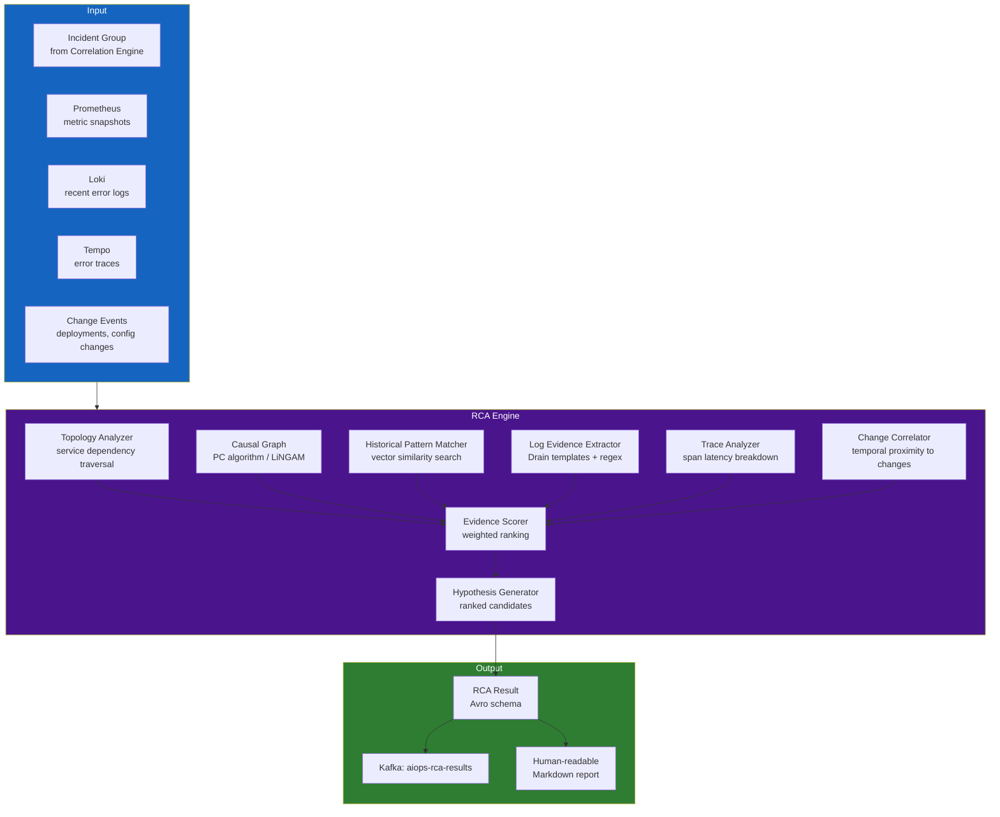

# Chapter 09 — Root Cause Analysis (RCA)

> **Root Cause Analysis (RCA) is the intelligence layer responsible for answering the question "WHY did this incident happen?". It turns a group of correlated alerts into a precise diagnosis: which component failed, what type of failure it is, and the accompanying evidence. This chapter covers every RCA technique from topology-based methods, causal graphs, and GNNs, to LLM-assisted solutions.**

---

## Prerequisites

- [07 — Anomaly Detection](../07-anomaly-detection/README.md) — anomaly signals as input to RCA
- [08 — Alert Correlation](../08-alert-correlation/README.md) — correlated incident groups
- [04 — Loki](../04-loki/README.md) — logs as RCA evidence
- [05 — Tempo](../05-tempo/README.md) — traces as RCA evidence

## Related Documents

- [10 — LLM Agent](../10-llm-agent/README.md) — uses RCA output for investigation and handling
- [11 — Remediation](../11-remediation/README.md) — RCA results help guide remediation option selection
- [12 — Production Operations](../12-production/README.md) — measure RCA accuracy, game day drills
- [13 — Big Tech AIOps](../13-bigtech-aiops/README.md) — RCA / incident diagnosis patterns at Big Tech
- [14 — E-commerce & Banking](../14-ecommerce-banking/README.md) — RCA for payment cascade, fraud false-positive confounds
- [15 — Famous Incidents](../15-famous-incidents/README.md) — correlation≠causation lessons from real outages

## Next Reading

After this chapter, continue to [10 — LLM Agent](../10-llm-agent/README.md).

---

## Table of Contents

1. [Why Automated RCA?](#1-why-automated-rca)
2. [RCA Architecture Overview](#2-rca-architecture-overview)
3. [Signal Collection for RCA](#3-signal-collection-for-rca)
4. [Topology-Based RCA](#4-topology-based-rca)
5. [Causal Graph RCA](#5-causal-graph-rca)
6. [Bayesian Network RCA](#6-bayesian-network-rca)
7. [Graph Neural Network (GNN) RCA](#7-graph-neural-network-gnn-rca)
8. [Log-Based RCA — Evidence Extraction](#8-log-based-rca--evidence-extraction)
9. [Trace-Based RCA — Span Analysis](#9-trace-based-rca--span-analysis)
10. [Change Correlation (Deployment-Driven RCA)](#10-change-correlation-deployment-driven-rca)
11. [RCA Evidence Scoring and Ranking](#11-rca-evidence-scoring-and-ranking)
12. [RCA Output Schema](#12-rca-output-schema)
13. [Historical Pattern Matching (Case-Based RCA)](#13-historical-pattern-matching-case-based-rca)
14. [Production Architecture](#14-production-architecture)
15. [Common Mistakes](#15-common-mistakes)
16. [Monitoring RCA Quality](#16-monitoring-rca-quality)
17. [Scaling](#17-scaling)
18. [Security](#18-security)
19. [Cost](#19-cost)
20. [Deep Thinking: Correlation≠Causation, Multi-root, Evidence Quality, Time Budget](#20-deep-thinking-correlationcausation-multi-root-evidence-quality-time-budget)
21. [Production Review](#21-production-review)

---

## 1. Why Automated RCA?

> [!NOTE]
> **KEY IDEA**
> Automated RCA **does not search for "absolute truth"** — it produces **ranked evidence-backed hypotheses** good enough for on-call to decide in the first minutes. The product goal is reducing *time-to-plausible-hypothesis*, not academic 100% accuracy.

> [!IMPORTANT]
> Any automated remediation pipeline (Chapter 11) may only attach to RCA when **confidence + evidence quality** exceed the threshold *and* the failure mode is on the allowlist. Wrong RCA + auto-remediate = AIOps-caused outage.

### The Manual RCA Problem

Traditional incident response process:

```
1. Alert fires (t=0)
2. On-call engineer is paged (t+5 minutes)
3. Engineer opens dashboards, starts searching for information (t+10 minutes)
4. Engineer identifies affected services (t+20 minutes)
5. Engineer traces back to the root cause (t+40 minutes)
6. Engineer applies a fix (t+50 minutes)
7. Incident is resolved (t+60 minutes)
8. Write post-mortem report, document RCA (t+2 days)

Total MTTR: 60 minutes
Service interruption cost (e-commerce site): $10,000–$100,000/minute
Total incident loss: $600K–$6M
```

Response process with automated RCA:

```
1. Alert fires (t=0)
2. Automated RCA system starts (t+16s, based on Kafka latency described in Ch06)
3. Collect evidence from Loki/Tempo (t+30s)
4. Produce RCA hypothesis (t+45s)
5. Engineer receives page with fault diagnosis + runbook guidance (t+1 minute)
6. Engineer validates hypothesis + applies fix (t+10 minutes)
7. Incident is resolved (t+15 minutes)

Total MTTR: 15 minutes → up to 75% reduction in handling time
```

### What RCA Is and Is NOT

```
RCA does:
✅ Identify the technical root cause (failed service, component, resource)
✅ Collect and rank related evidence
✅ Generate human-readable fault hypothesis reports
✅ Suggest remediation options
✅ Link references to similar past incidents

RCA is NOT:
❌ Absolute 100% accuracy — it produces HYPOTHESES, not absolute truth
❌ A complete replacement for humans — on-call remains the final validator
❌ Always successful — some complex incidents still require deep manual investigation
❌ Free — it increases system configuration complexity and cost
```

---

## 2. RCA Architecture Overview



---

## 3. Signal Collection for RCA

### Signal Collection Schema

```python
from dataclasses import dataclass, field
from typing import List, Dict, Optional
from datetime import datetime

@dataclass
class RCAContext:
    """
    Full context collected for RCA analysis.
    Built from the incident group + data query results.
    """
    incident_id: str
    incident_start: datetime
    incident_end: Optional[datetime]
    
    # From alert correlation
    root_service_candidate: str           # Initial prediction from topology correlation
    affected_services: List[str]
    correlated_alerts: List[dict]
    
    # Metric snapshots (from Prometheus API)
    metric_snapshots: Dict[str, dict] = field(default_factory=dict)
    # Format: {service_name: {metric_name: [values]}}
    
    # Log evidence (from Loki)
    error_logs: Dict[str, List[str]] = field(default_factory=dict)
    # Format: {service_name: [log_lines]}
    
    # Error trace evidence (from Tempo)
    error_traces: List[dict] = field(default_factory=list)
    # Compact structure of trace spans
    
    # Change events
    recent_deployments: List[dict] = field(default_factory=list)
    recent_config_changes: List[dict] = field(default_factory=list)
    
    # Historical data
    similar_past_incidents: List[dict] = field(default_factory=list)


async def collect_rca_context(
    incident: dict,
    prometheus: PrometheusClient,
    loki: LokiClient,
    tempo: TempoClient,
    change_store: ChangeEventStore,
    incident_history: IncidentHistoryStore,
    lookback_minutes: int = 30,
) -> RCAContext:
    """
    Collect all signals needed for RCA concurrently to optimize speed.
    """
    affected_services = incident.get("services_affected", [])
    
    # Parallel data collection from external sources
    results = await asyncio.gather(
        collect_metric_snapshots(prometheus, affected_services, lookback_minutes),
        collect_error_logs(loki, affected_services, lookback_minutes),
        collect_error_traces(tempo, affected_services, lookback_minutes),
        collect_changes(change_store, affected_services, lookback_minutes),
        find_similar_incidents(incident_history, incident),
        return_exceptions=True,
    )
    
    return RCAContext(
        incident_id=incident["incident_id"],
        incident_start=incident["started_at"],
        incident_end=incident.get("ended_at"),
        root_service_candidate=incident.get("root_cause", "unknown"),
        affected_services=affected_services,
        correlated_alerts=incident.get("all_alerts", []),
        metric_snapshots=results[0] if not isinstance(results[0], Exception) else {},
        error_logs=results[1] if not isinstance(results[1], Exception) else {},
        error_traces=results[2] if not isinstance(results[2], Exception) else [],
        recent_deployments=results[3][0] if not isinstance(results[3], Exception) else [],
        recent_config_changes=results[3][1] if not isinstance(results[3], Exception) else [],
        similar_past_incidents=results[4] if not isinstance(results[4], Exception) else [],
    )
```

---

## 4. Topology-Based RCA

The simplest and most reliable RCA approach for well-monitored microservices systems. The algorithm walks the service dependency graph backward from failure symptoms.

### Algorithm: Backward Traversal

```python
import networkx as nx
from typing import List

def topology_rca(
    incident: dict,
    dependency_graph: nx.DiGraph,
    metric_snapshots: dict,
    anomaly_threshold: float = 0.7,
) -> List[dict]:
    """
    Walk the dependency graph backward from services showing failure symptoms to the root cause.
    A service is considered a root cause if:
    1. The service itself is anomalous (high error rate or high latency)
    2. Services calling it (upstream) are also anomalous (cascading impact)
    3. Services it calls (downstream) are fully healthy (leaf service is failing)
    
    Returns a ranked list of root-cause candidates.
    """
    affected_services = set(incident.get("services_affected", []))
    
    candidates = []
    
    for service in affected_services:
        if service not in dependency_graph:
            continue
        
        # Direct dependencies (services this service calls)
        callees = list(dependency_graph.successors(service))
        
        # Direct callers (services that call this service)
        callers = list(dependency_graph.predecessors(service))
        
        # Check whether dependencies are healthy
        callees_are_healthy = all(
            not _is_service_anomalous(callee, metric_snapshots, anomaly_threshold)
            for callee in callees
        )
        
        # Determine whether the current service is anomalous
        service_is_anomalous = _is_service_anomalous(service, metric_snapshots, anomaly_threshold)
        
        if service_is_anomalous:
            candidate_score = 0.0
            evidence = []
            
            # Strong evidence: all dependencies are healthy (fault originates at this node)
            if callees_are_healthy:
                candidate_score += 0.5
                evidence.append("all_dependencies_healthy")
            
            # Strong evidence: its callers are also affected (cascading impact)
            callers_affected = [c for c in callers if c in affected_services]
            if callers_affected:
                candidate_score += 0.3
                evidence.append(f"cascading_to_{len(callers_affected)}_callers")
            
            # Bonus: more caller links indicate wider impact
            candidate_score += min(0.2, len(callers) * 0.05)
            
            candidates.append({
                "service": service,
                "score": min(candidate_score, 1.0),
                "evidence": evidence,
                "algorithm": "topology_traversal",
                "callees": callees,
                "affected_callers": callers_affected,
            })
    
    return sorted(candidates, key=lambda x: x["score"], reverse=True)


def _is_service_anomalous(
    service: str,
    metric_snapshots: dict,
    threshold: float,
) -> bool:
    """Check whether a service's metrics show anomalous behavior."""
    service_metrics = metric_snapshots.get(service, {})
    
    if not service_metrics:
        return False
    
    error_rate = service_metrics.get("error_rate", {}).get("current", 0)
    latency_p99 = service_metrics.get("latency_p99", {}).get("current", 0)
    baseline_latency = service_metrics.get("latency_p99", {}).get("baseline", 1)
    
    # Anomalous if: error rate > 5% OR P99 latency exceeds 2× baseline
    return (
        error_rate > 0.05 or
        (baseline_latency > 0 and latency_p99 > 2 * baseline_latency)
    )
```

---

## 5. Causal Graph RCA

Causal graphs go beyond correlation to directly model **cause-and-effect relationships** between metrics.

### PC Algorithm (Constraint-Based Causal Discovery)

```python
from causallearn.search.ConstraintBased.PC import pc
from causallearn.utils.cit import fisherz
import numpy as np
import pandas as pd
import networkx as nx

class CausalGraphRCA:
    def __init__(self, alpha: float = 0.05):
        """
        alpha: significance level for independence tests (smaller = more edges produced)
        """
        self.alpha = alpha

    def build_causal_graph(
        self,
        metric_timeseries: pd.DataFrame,  # Columns = metric names, rows = timestamps
    ) -> dict:
        """
        Discover causal structure from time-series data.
        Returns an adjacency matrix representing causal links.
        
        NOTE: Requires at least 100+ time points for reliable results.
        """
        if len(metric_timeseries) < 100:
            return {"error": "insufficient_data", "min_required": 100}
        
        # Run PC algorithm
        data = metric_timeseries.values
        cg = pc(data, alpha=self.alpha, ci_test=fisherz)
        
        # Extract causal edges
        edges = []
        for i, col_i in enumerate(metric_timeseries.columns):
            for j, col_j in enumerate(metric_timeseries.columns):
                if cg.G.graph[i, j] == 1 and cg.G.graph[j, i] == -1:
                    # i → j: col_i causes effect on col_j
                    edges.append({
                        "cause": col_i,
                        "effect": col_j,
                        "confidence": 1.0 - self.alpha,
                    })
        
        return {
            "edges": edges,
            "nodes": list(metric_timeseries.columns),
            "algorithm": "pc",
            "alpha": self.alpha,
        }

    def find_root_cause_from_causal_graph(
        self,
        causal_graph: dict,
        anomalous_metrics: list,
    ) -> list:
        """
        Given anomalous metrics and a causal graph,
        determine which metric is the causal source of the others.
        """
        G = nx.DiGraph()
        for edge in causal_graph.get("edges", []):
            G.add_edge(edge["cause"], edge["effect"])
        
        root_causes = []
        
        for metric in anomalous_metrics:
            if metric not in G:
                continue
            
            # In-degree = number of factors directly causing the current metric
            # A root-cause metric has no (or very few) causal parents in the anomalous set
            causal_parents = [
                p for p in G.predecessors(metric)
                if p in anomalous_metrics
            ]
            
            if not causal_parents:
                # This metric is not affected by any other anomalous metric → it is the fault source
                descendants = list(nx.descendants(G, metric))
                affected_anomalous = [d for d in descendants if d in anomalous_metrics]
                
                root_causes.append({
                    "metric": metric,
                    "score": min(1.0, 0.5 + len(affected_anomalous) * 0.1),
                    "explains": affected_anomalous,
                    "algorithm": "causal_graph_pc",
                })
        
        return sorted(root_causes, key=lambda x: x["score"], reverse=True)
```

### When Causal Graph RCA Works Best

```
Suitable cases:
- Metrics collected at the same frequency and time resolution
- Enough historical data (>100 data points per metric)
- Time series already detrended and deseasoned
- Small to medium metric scale (<50 metrics)

Unsuitable cases:
- Real-time streaming data (PC algorithm is slow batch)
- Extremely high dimensionality (>100 metrics, very high compute cost)
- Raw data without preprocessing for distribution drift
- Missing data (requires interpolation first)
```

---

## 6. Bayesian Network RCA

Bayesian Networks model **probabilistic dependencies** between components. This approach works especially well when you already have domain knowledge about system failure scenarios.

### Structure Learning from Data + Domain Knowledge

```python
from pgmpy.models import BayesianNetwork
from pgmpy.estimators import BayesianEstimator, HillClimbSearch
from pgmpy.inference import BeliefPropagation
import pandas as pd

class BayesianNetworkRCA:
    def __init__(self):
        self.model = None
        self.inference = None

    def learn_structure(
        self,
        training_data: pd.DataFrame,  # Historical incident data + component states
        prior_edges: list = None,     # Domain knowledge: known causal edges
    ):
        """
        Learn Bayesian network structure from historical incident data.
        
        training_data must be converted to discrete states, e.g.:
        {db_connections: "normal|high|critical",
               payment_error_rate: "normal|high|critical",
               payment_latency: "normal|high|critical",
               order_error_rate: "normal|high|critical"}
        """
        # Learn network structure with Hill Climbing Search
        hc = HillClimbSearch(training_data)
        best_model_structure = hc.estimate(
            scoring_method="bicscore",
            max_indegree=4,
        )
        
        # Initialize model from best structure found
        self.model = BayesianNetwork(best_model_structure.edges())
        
        # Add known causal links from domain knowledge
        if prior_edges:
            for cause, effect in prior_edges:
                if not self.model.has_edge(cause, effect):
                    self.model.add_edge(cause, effect)
        
        # Estimate conditional probability distributions
        self.model.fit(
            training_data,
            estimator=BayesianEstimator,
            prior_type="BDeu",
            equivalent_sample_size=10,
        )
        
        self.inference = BeliefPropagation(self.model)

    def diagnose(
        self,
        observed_states: dict,  # Current observed states: {component: state}
        target_component: str = "root_cause",
    ) -> dict:
        """
        Given observed anomalous states, infer the component most likely at fault.
        
        Example:
        observed_states = {
            "order_error_rate": "high",
            "payment_error_rate": "high",
            "payment_latency": "high",
        }
        """
        if self.inference is None:
            raise RuntimeError("Model must be trained first")
        
        # Keep observed evidence that matches model nodes
        evidence = {k: v for k, v in observed_states.items() if k in self.model.nodes()}
        
        # Query probabilities on remaining nodes given evidence
        rca_scores = {}
        
        for node in self.model.nodes():
            if node in evidence:
                continue
            
            # Compute posterior probability
            query_result = self.inference.query(
                variables=[node],
                evidence=evidence,
                show_progress=False,
            )
            
            # Probability this node is in "critical" state
            critical_prob = float(query_result.values[
                list(query_result.state_names[node]).index("critical")
            ])
            
            rca_scores[node] = {
                "probability_critical": critical_prob,
                "distribution": dict(zip(
                    query_result.state_names[node],
                    query_result.values.tolist()
                )),
            }
        
        return {
            "rca_scores": rca_scores,
            "most_likely_root_cause": max(
                rca_scores,
                key=lambda k: rca_scores[k]["probability_critical"]
            ),
            "algorithm": "bayesian_network",
        }
```

**Example of declaring known causal edges**:

```python
KNOWN_CAUSAL_EDGES = [
    # Database faults increase service error rates
    ("db_connection_count", "payment_error_rate"),
    ("db_connection_count", "order_error_rate"),
    ("db_latency", "payment_latency"),
    
    # Memory pressure increases GC pause, causing service latency
    ("jvm_heap_used_pct", "service_latency"),
    ("jvm_gc_pause_duration", "service_latency"),
    
    # Downstream latency propagation
    ("payment_latency", "order_latency"),
    ("order_latency", "checkout_latency"),
    
    # Pod resource limits
    ("pod_cpu_throttling", "service_latency"),
    ("pod_memory_pressure", "pod_oom_kills"),
]
```

---

## 7. Graph Neural Network (GNN) RCA

For large-scale microservices systems with hundreds of services, Graph Neural Networks can learn complex RCA patterns beyond static rules or ordinary statistics.

### Architecture: Spatial-Temporal GNN

```python
import torch
import torch.nn as nn
import torch_geometric.nn as geo_nn
from torch_geometric.data import Data

class RCA_GNN(nn.Module):
    """
    Graph Neural Network for root cause analysis.
    
    Architecture:
    - Node features: Per-service metric time series (encoded via LSTM)
    - Edge features: Call rate, error rate, latency between services
    - GNN: Learns to point to the faulty node from graph structure and node states
    
    Based on: "Towards Intelligent Incident Management" (Microsoft Research)
    and "MicroRCA" (CloudCom 2020)
    """
    def __init__(
        self,
        node_feature_dim: int = 64,     # Node feature dim after LSTM encoding
        edge_feature_dim: int = 8,      # Edge features (call rate, error rate, latency)
        hidden_dim: int = 128,
        num_gnn_layers: int = 3,
        num_services: int = 50,          # Total services in the graph
    ):
        super().__init__()
        
        # Encode each node's metric time series
        self.node_encoder = nn.LSTM(
            input_size=5,               # 5 input metrics per service per timestep
            hidden_size=node_feature_dim,
            num_layers=2,
            batch_first=True,
        )
        
        # GNN layers: GraphSAGE for variable neighborhood sizes
        self.gnn_layers = nn.ModuleList([
            geo_nn.SAGEConv(
                in_channels=node_feature_dim if i == 0 else hidden_dim,
                out_channels=hidden_dim,
            )
            for i in range(num_gnn_layers)
        ])
        
        self.activation = nn.ReLU()
        self.dropout = nn.Dropout(0.3)
        
        # Output: probability each node is the root cause
        self.classifier = nn.Sequential(
            nn.Linear(hidden_dim, 64),
            nn.ReLU(),
            nn.Linear(64, 1),           # One score per node
            nn.Sigmoid(),
        )

    def forward(
        self,
        node_timeseries: torch.Tensor,  # (num_nodes, seq_len, 5)
        edge_index: torch.Tensor,       # (2, num_edges) — graph structure
        edge_attr: torch.Tensor,        # (num_edges, edge_feature_dim)
    ) -> torch.Tensor:
        # Encode time-series features for each node
        _, (h_n, _) = self.node_encoder(
            node_timeseries.view(-1, node_timeseries.size(1), node_timeseries.size(2))
        )
        node_features = h_n[-1]  # Last LSTM hidden state: (num_nodes, node_feature_dim)
        
        # Pass through GNN layers
        x = node_features
        for gnn_layer in self.gnn_layers:
            x = gnn_layer(x, edge_index)
            x = self.activation(x)
            x = self.dropout(x)
        
        # Root-cause probability per node
        root_cause_probs = self.classifier(x).squeeze(-1)  # (num_nodes,)
        
        return root_cause_probs


def build_graph_from_incident(
    incident: dict,
    metric_snapshots: dict,
    dependency_graph: nx.DiGraph,
    service_index: dict,  # service_name → node_index
) -> Data:
    """
    Convert incident context into a PyTorch Geometric graph data structure.
    """
    num_nodes = len(service_index)
    
    # Node features: metric time series per service
    node_features = torch.zeros(num_nodes, 10, 5)  # 10 timesteps, 5 metrics
    
    for service, idx in service_index.items():
        metrics = metric_snapshots.get(service, {})
        # Pack input metrics: [error_rate, latency_p99, cpu, memory, request_rate]
        for t in range(10):
            node_features[idx, t, 0] = metrics.get("error_rate", {}).get(f"t-{t}", 0)
            node_features[idx, t, 1] = metrics.get("latency_p99", {}).get(f"t-{t}", 0)
            node_features[idx, t, 2] = metrics.get("cpu_usage", {}).get(f"t-{t}", 0)
            node_features[idx, t, 3] = metrics.get("memory_usage", {}).get(f"t-{t}", 0)
            node_features[idx, t, 4] = metrics.get("request_rate", {}).get(f"t-{t}", 0)
    
    # edge index
    edges = []
    edge_attrs = []
    
    for caller, callee, data in dependency_graph.edges(data=True):
        if caller in service_index and callee in service_index:
            edges.append([service_index[caller], service_index[callee]])
            edge_attrs.append([
                data.get("weight", 0),        # Call rate
                data.get("error_rate", 0),    # Error rate
                data.get("latency_p99", 0),   # Latency P99
            ])
    
    edge_index = torch.tensor(edges, dtype=torch.long).t().contiguous()
    edge_attr = torch.tensor(edge_attrs, dtype=torch.float)
    
    return Data(x=node_features, edge_index=edge_index, edge_attr=edge_attr)
```

### GNN Training Pipeline

```python
def train_rca_gnn(
    historical_incidents: list,    # Historical incidents already labeled with root cause
    dependency_graph: nx.DiGraph,
    service_index: dict,
    epochs: int = 100,
) -> RCA_GNN:
    """
    Train the GNN model on labeled historical incident data.
    Requires at least 100+ labeled incidents per service cluster for stable training.
    """
    model = RCA_GNN(num_services=len(service_index))
    optimizer = torch.optim.Adam(model.parameters(), lr=1e-3)
    criterion = nn.BCELoss()
    
    for epoch in range(epochs):
        total_loss = 0
        
        for incident in historical_incidents:
            graph_data = build_graph_from_incident(
                incident, incident["metric_snapshots"], dependency_graph, service_index
            )
            
            # Ground truth: which service was actually the root cause?
            root_cause_service = incident["confirmed_root_cause"]
            labels = torch.zeros(len(service_index))
            if root_cause_service in service_index:
                labels[service_index[root_cause_service]] = 1.0
            
            optimizer.zero_grad()
            predictions = model(
                graph_data.x, graph_data.edge_index, graph_data.edge_attr
            )
            loss = criterion(predictions, labels)
            loss.backward()
            optimizer.step()
            
            total_loss += loss.item()
        
        if epoch % 10 == 0:
            print(f"Epoch {epoch}, Loss: {total_loss / len(historical_incidents):.4f}")
    
    return model
```

### GNN Trade-offs

| Characteristic | Detail |
|--------|---------|
| ✅ Exploits complex graph structure well | Learns directly from graph connectivity + node features |
| ✅ Supports service generalization | Allows transfer learning across similar services |
| ✅ State-of-the-art accuracy | Research shows top-1 accuracy around 85–95% |
| ❌ Requires large labeled historical incidents | Needs at least 100+ labeled incidents for stable training |
| ❌ Cold start for new services | Newly deployed services have no historical data to match |
| ❌ Changing graph architecture | Must retrain when system topology changes substantially |
| ❌ High operational complexity | Requires GPU training, model version management |

**Operational recommendation**: Deploy GNN RCA as an **offline tertiary analysis layer** to update and enrich the historical incident pattern database. Real-time environments should prioritize topology + Bayesian networks.

---

## 8. Log-Based RCA — Evidence Extraction

Log analysis provides the most expressive and human-understandable RCA evidence.

### Structured Log Analysis

```python
import re
from collections import Counter
from typing import List, Dict

class LogRCAAnalyzer:
    """
    Extract RCA evidence from error log content.
    """
    
    # Common error log patterns mapped to root-cause categories
    ERROR_PATTERNS = [
        (r"connection pool exhausted|too many connections|connection refused",
         "database_connection_exhaustion"),
        (r"OOMKilled|out of memory|memory pressure|GC overhead",
         "memory_exhaustion"),
        (r"dial tcp.*i/o timeout|context deadline exceeded|connection timed out",
         "network_timeout"),
        (r"certificate.*expired|TLS handshake|SSL.*error",
         "tls_certificate_error"),
        (r"rate limit|too many requests|429|quota exceeded",
         "rate_limiting"),
        (r"pod.*evicted|failed to schedule|insufficient.*memory|Unschedulable",
         "kubernetes_scheduling_failure"),
        (r"NullPointerException|nil pointer dereference|index out of range",
         "application_code_error"),
        (r"disk.*full|no space left|ENOSPC",
         "disk_full"),
        (r"kafka.*timeout|consumer lag|offset.*reset",
         "kafka_consumer_lag"),
        (r"permission denied|FORBIDDEN|403|unauthorized|401",
         "permission_error"),
    ]

    def analyze(
        self,
        logs_by_service: Dict[str, List[str]],
    ) -> List[dict]:
        """
        Analyze error logs and return RCA candidates ranked by evidence confidence.
        """
        evidence_list = []
        
        for service, log_lines in logs_by_service.items():
            error_lines = [l for l in log_lines if "ERROR" in l or "FATAL" in l or "CRITICAL" in l]
            
            if not error_lines:
                continue
            
            # Pattern matching
            pattern_matches = Counter()
            pattern_examples = {}
            
            for line in error_lines:
                for pattern, category in self.ERROR_PATTERNS:
                    if re.search(pattern, line, re.IGNORECASE):
                        pattern_matches[category] += 1
                        if category not in pattern_examples:
                            pattern_examples[category] = line[:300]
            
            if not pattern_matches:
                # No predefined pattern matched — return most common error log for human review
                evidence_list.append({
                    "service": service,
                    "category": "unknown_error",
                    "score": 0.3,
                    "evidence": error_lines[0][:300] if error_lines else "no errors",
                    "error_count": len(error_lines),
                    "algorithm": "log_pattern_match",
                })
                continue
            
            # Most frequent error pattern is most likely to reflect the root cause
            top_category, count = pattern_matches.most_common(1)[0]
            
            evidence_list.append({
                "service": service,
                "category": top_category,
                "score": min(1.0, 0.4 + count * 0.05),  # More occurrences = higher confidence
                "evidence": pattern_examples[top_category],
                "error_count": len(error_lines),
                "pattern_count": count,
                "algorithm": "log_pattern_match",
                "all_patterns": dict(pattern_matches.most_common(5)),
            })
        
        return sorted(evidence_list, key=lambda x: x["score"], reverse=True)

    def extract_stacktrace(self, log_lines: List[str]) -> List[str]:
        """Extract and group stack traces from log lines."""
        traces = []
        current_trace = []
        in_trace = False
        
        for line in log_lines:
            if "Exception" in line or "Error" in line and "at " in line:
                if current_trace:
                    traces.append("\n".join(current_trace))
                current_trace = [line]
                in_trace = True
            elif in_trace and (line.strip().startswith("at ") or line.strip().startswith("...")):
                current_trace.append(line)
            else:
                if current_trace:
                    traces.append("\n".join(current_trace))
                    current_trace = []
                in_trace = False
        
        return traces[:5]  # Keep at most 5 unique stack traces
```

---

## 9. Trace-Based RCA — Span Analysis

Distributed traces provide the clearest evidence of WHERE the fault first arose in the service call chain.

```python
from typing import List, Optional
from dataclasses import dataclass

@dataclass
class SpanAnalysis:
    service: str
    operation: str
    duration_ms: float
    status: str
    is_root_span: bool
    children: List['SpanAnalysis']
    error_message: Optional[str] = None

class TraceRCAAnalyzer:
    """
    Analyze error traces to pinpoint the specific span that caused the failure.
    """
    
    def analyze_trace(self, trace: dict) -> dict:
        """
        Find the root-cause span in a failed trace.
        
        Algorithm:
        1. Find all spans labeled ERROR/FAILED
        2. Find the error span deepest in the call tree (faulty leaf)
        3. The deepest error span is the first point of failure in the system
        """
        spans = trace.get("spans", [])
        
        if not spans:
            return {"error": "empty_trace"}
        
        # Map by span ID
        span_by_id = {s["spanID"]: s for s in spans}
        
        # Filter error spans
        error_spans = [s for s in spans if s.get("statusCode") == "STATUS_CODE_ERROR"]
        
        if not error_spans:
            # No spans labeled error — find the slowest span
            slowest = max(spans, key=lambda s: s.get("durationMs", 0))
            return {
                "root_cause_span": slowest,
                "root_cause_service": slowest.get("processID", "unknown"),
                "evidence": "slowest_span",
                "duration_ms": slowest.get("durationMs", 0),
                "analysis_type": "latency",
            }
        
        # Among error spans, find the one with the longest path from the root span
        # (deepest position on the call tree = closest to the actual fault point)
        def get_depth(span_id: str, visited: set = None) -> int:
            if visited is None:
                visited = set()
            if span_id in visited:
                return 0
            visited.add(span_id)
            
            span = span_by_id.get(span_id)
            if not span or not span.get("parentSpanID"):
                return 0
            
            parent_id = span["parentSpanID"]
            if parent_id not in span_by_id:
                return 0
            
            return 1 + get_depth(parent_id, visited)
        
        # Get deepest error span
        deepest_error = max(error_spans, key=lambda s: get_depth(s["spanID"]))
        
        # Extract detailed error information
        error_message = next(
            (a["value"]["stringValue"] for a in deepest_error.get("attributes", [])
             if a.get("key") in ["exception.message", "error.message", "error"]),
            "unknown error"
        )
        
        return {
            "root_cause_span": deepest_error,
            "root_cause_service": deepest_error.get("process", {}).get("serviceName", "unknown"),
            "root_cause_operation": deepest_error.get("operationName", "unknown"),
            "error_message": error_message,
            "depth": get_depth(deepest_error["spanID"]),
            "total_error_spans": len(error_spans),
            "total_spans": len(spans),
            "trace_duration_ms": max(s.get("durationMs", 0) for s in spans),
            "analysis_type": "error",
            "algorithm": "trace_depth_traversal",
        }
    
    def compute_span_contribution(self, trace: dict) -> List[dict]:
        """
        Compute each service's share of total trace duration.
        Useful for latency bottleneck RCA.
        """
        spans = trace.get("spans", [])
        total_duration = max(s.get("durationMs", 0) for s in spans)
        
        if total_duration == 0:
            return []
        
        # Aggregate duration by service
        service_duration = {}
        for span in spans:
            service = span.get("process", {}).get("serviceName", "unknown")
            duration = span.get("durationMs", 0)
            service_duration[service] = service_duration.get(service, 0) + duration
        
        # Compute contribution percentage
        return sorted(
            [
                {
                    "service": svc,
                    "duration_ms": dur,
                    "contribution_pct": round(dur / total_duration * 100, 1),
                }
                for svc, dur in service_duration.items()
            ],
            key=lambda x: x["contribution_pct"],
            reverse=True,
        )
```

---

## 10. Change Correlation (Deployment-Driven RCA)

Most serious incidents originate from system changes. Change correlation yields extremely high accuracy for these incidents.

```python
from datetime import datetime, timedelta

class ChangeCorrelationRCA:
    """
    Correlate incidents with recent changes (deployments, config changes, flag flips).
    """
    
    CHANGE_IMPACT_WINDOW_MINUTES = 30  # Impact window: incident within 30 minutes after change = related
    
    def correlate(
        self,
        incident: dict,
        change_events: List[dict],
    ) -> List[dict]:
        """
        Find change events that occurred just before the incident started.
        """
        incident_start = incident.get("started_at")
        if isinstance(incident_start, str):
            incident_start = datetime.fromisoformat(incident_start.replace("Z", "+00:00"))
        
        affected_services = set(incident.get("services_affected", []))
        
        correlations = []
        
        for change in change_events:
            change_time = change.get("timestamp")
            if isinstance(change_time, str):
                change_time = datetime.fromisoformat(change_time.replace("Z", "+00:00"))
            
            # Change event must occur BEFORE the incident
            if change_time >= incident_start:
                continue
            
            # Within allowed impact window
            time_delta = (incident_start - change_time).total_seconds() / 60
            if time_delta > self.CHANGE_IMPACT_WINDOW_MINUTES:
                continue
            
            changed_service = change.get("service")
            
            # Temporal proximity score (closer to incident start = higher score)
            temporal_score = 1.0 - (time_delta / self.CHANGE_IMPACT_WINDOW_MINUTES)
            
            # Service similarity score
            service_score = 1.0 if changed_service in affected_services else 0.3
            
            # Weight by change type (deployment > config > feature flag)
            change_type_scores = {
                "deployment": 1.0,
                "config_change": 0.8,
                "feature_flag": 0.7,
                "infrastructure_change": 0.9,
                "database_migration": 1.0,
            }
            change_type_score = change_type_scores.get(change.get("type", ""), 0.5)
            
            combined_score = temporal_score * 0.4 + service_score * 0.4 + change_type_score * 0.2
            
            correlations.append({
                "change_event": change,
                "score": combined_score,
                "time_before_incident_minutes": round(time_delta, 1),
                "changed_service": changed_service,
                "change_type": change.get("type"),
                "change_version": change.get("version"),
                "can_rollback": change.get("type") == "deployment",
                "algorithm": "change_correlation",
            })
        
        return sorted(correlations, key=lambda x: x["score"], reverse=True)
```

---

## 11. RCA Evidence Scoring and Ranking

Merge evidence results from all RCA algorithms to build the final hypothesis list:

```python
from dataclasses import dataclass
from typing import List, Optional

@dataclass
class RCAHypothesis:
    rank: int
    root_cause_service: str
    root_cause_component: str      # "database", "application_code", "infrastructure"
    failure_mode: str              # "connection_exhaustion", "memory_oom", etc.
    confidence: float              # 0.0 - 1.0
    evidence: List[dict]           # All supporting evidence
    suggested_remediation: str
    runbook_url: Optional[str]
    estimated_impact: str

def rank_rca_hypotheses(
    topology_results: List[dict],
    causal_results: List[dict],
    log_results: List[dict],
    trace_results: List[dict],
    change_results: List[dict],
    bayesian_results: dict,
) -> List[RCAHypothesis]:
    """
    Merge and rank RCA results from all algorithms.
    Uses weighted voting based on each algorithm's historical accuracy.
    """
    ALGORITHM_WEIGHTS = {
        "change_correlation": 0.35,       # Highest weight: deploy correlation is very accurate
        "trace_depth_traversal": 0.25,    # Traces provide clear call-flow evidence
        "log_pattern_match": 0.20,        # Logs provide detailed textual error info
        "topology_traversal": 0.15,       # Topology provides architectural dependency info
        "bayesian_network": 0.05,         # Lower weight: depends heavily on model quality
    }
    
    # Aggregate scores by service
    service_scores = {}
    service_evidence = {}
    
    for result_list, algo_key in [
        (topology_results, "topology_traversal"),
        (log_results, "log_pattern_match"),
        (trace_results, "trace_depth_traversal"),
        (change_results, "change_correlation"),
    ]:
        weight = ALGORITHM_WEIGHTS.get(algo_key, 0.1)
        
        for result in result_list[:3]:  # Top 3 results from each algorithm
            service = result.get("service") or result.get("root_cause_service") or \
                      result.get("changed_service", "unknown")
            score = result.get("score", 0.0) * weight
            
            if service not in service_scores:
                service_scores[service] = 0.0
                service_evidence[service] = []
            
            service_scores[service] += score
            service_evidence[service].append({**result, "algorithm": algo_key})
    
    # Build final hypothesis list
    hypotheses = []
    for rank, (service, score) in enumerate(
        sorted(service_scores.items(), key=lambda x: x[1], reverse=True)[:5], 1
    ):
        # Determine failure mode from log evidence
        log_evidence = [e for e in service_evidence[service] if "category" in e]
        failure_mode = log_evidence[0]["category"] if log_evidence else "unknown"
        
        # Suggest remediation corresponding to failure mode
        remediation = REMEDIATION_SUGGESTIONS.get(failure_mode, "Investigate manually")
        
        hypotheses.append(RCAHypothesis(
            rank=rank,
            root_cause_service=service,
            root_cause_component=_infer_component(failure_mode),
            failure_mode=failure_mode,
            confidence=min(score, 1.0),
            evidence=service_evidence[service],
            suggested_remediation=remediation,
            runbook_url=None,  # Filled in later enrichment stage
            estimated_impact=f"Affects {len(service_evidence[service])} services",
        ))
    
    return hypotheses

REMEDIATION_SUGGESTIONS = {
    "database_connection_exhaustion": "Increase connection pool size: kubectl patch configmap payment-config --patch '{\"data\":{\"DB_POOL_SIZE\":\"50\"}}'",
    "memory_exhaustion": "Increase memory limits or check for memory leaks: kubectl top pods -n production",
    "network_timeout": "Check network policies, DNS resolution, and downstream service health",
    "tls_certificate_error": "Renew TLS certificate: kubectl get certificate -n production",
    "rate_limiting": "Scale the rate-limited service or reduce traffic: check HPA configuration",
    "disk_full": "Expand PVC disk capacity or clean old logs: kubectl get pvc -n production",
    "kubernetes_scheduling_failure": "Check node resources: kubectl describe nodes | grep -A5 Conditions",
    "application_code_error": "Review recent deploys and roll back if necessary",
}
```

---

## 12. RCA Output Schema

```json
{
  "rca_id": "rca-20240115-143245-payment",
  "incident_id": "inc-20240115-143215-001",
  "generated_at": "2024-01-15T14:32:45Z",
  "time_to_rca_seconds": 47,

  "summary": "Database connection pool exhaustion in payment-service (confidence: 89%)",
  "root_cause_service": "payment-service",
  "root_cause_component": "database",
  "failure_mode": "database_connection_exhaustion",
  "confidence": 0.89,

  "hypotheses": [
    {
      "rank": 1,
      "root_cause_service": "payment-service",
      "failure_mode": "database_connection_exhaustion",
      "confidence": 0.89,
      "suggested_remediation": "Scale up connection pool size",
      "runbook_url": "https://runbooks.internal/payment/db-conn-pool",
      "evidence": [
        {
          "algorithm": "log_pattern_match",
          "category": "database_connection_exhaustion",
          "pattern_count": 847,
          "example": "2024-01-15T14:23:45Z ERROR: connection pool exhausted, waiting queue: 156"
        },
        {
          "algorithm": "trace_depth_traversal",
          "root_cause_operation": "payment-service:db.query",
          "error_message": "could not obtain connection from pool within 3000ms",
          "depth": 3
        },
        {
          "algorithm": "topology_traversal",
          "score": 0.85,
          "callees": ["payment-db"],
          "affected_callers": ["order-service", "checkout-service"]
        }
      ]
    },
    {
      "rank": 2,
      "root_cause_service": "payment-db",
      "failure_mode": "database_connection_exhaustion",
      "confidence": 0.45,
      "suggested_remediation": "Increase max_connections on RDS instance"
    }
  ],

  "causal_chain": [
    {"service": "payment-db", "role": "root_cause", "evidence": "max_connections reached"},
    {"service": "payment-service", "role": "primary_victim", "evidence": "connection pool exhausted"},
    {"service": "order-service", "role": "secondary_victim", "evidence": "payment timeouts"},
    {"service": "checkout-service", "role": "tertiary_victim", "evidence": "SLO burn"}
  ],

  "timeline": [
    {"time": "14:21:30", "event": "payment-db connections reach 95% capacity"},
    {"time": "14:22:45", "event": "payment-service connection pool begins queuing"},
    {"time": "14:23:15", "event": "First ERROR logs in payment-service"},
    {"time": "14:23:30", "event": "order-service timeout errors begin"},
    {"time": "14:24:00", "event": "Alertmanager fires: payment-service error rate > 5%"}
  ],

  "related_traces": ["4bf92f3577b34da6", "8e3b4c2d91a5e6f7"],
  "related_log_query": "{service=\"payment-service\"} |= \"connection pool\" | json",
  "similar_past_incidents": [
    {
      "incident_id": "inc-20231205-091200-003",
      "similarity": 0.92,
      "resolution": "Increased DB_POOL_SIZE from 20 to 40, resolved in 8 minutes"
    }
  ]
}
```

---

## 13. Historical Pattern Matching (Case-Based RCA)

Use vector similarity search to find similar past incidents:

```python
from sentence_transformers import SentenceTransformer
from typing import List
import time

class IncidentHistoryMatcher:
    """
    Find historical incidents with patterns similar to the current incident.
    Uses embeddings of incident descriptions for semantic matching.
    """
    
    def __init__(
        self,
        embedding_model: str = "all-MiniLM-L6-v2",
        vector_store_url: str = "http://weaviate.aiops.svc:8080",  # pgvector, Pinecone, etc.
    ):
        self.encoder = SentenceTransformer(embedding_model)
        self.vector_store_url = vector_store_url

    def _create_incident_description(self, incident: dict) -> str:
        """Build a textual description for embedding."""
        services = ", ".join(incident.get("services_affected", []))
        alerts = ", ".join(incident.get("alert_types", []))
        log_categories = ", ".join(
            e.get("category", "") for e in incident.get("log_evidence", [])[:3]
        )
        
        return (
            f"Services affected: {services}. "
            f"Alerts: {alerts}. "
            f"Root cause: {incident.get('root_cause', '')}. "
            f"Log patterns: {log_categories}. "
            f"Failure mode: {incident.get('failure_mode', '')}."
        )

    async def find_similar(
        self,
        current_incident: dict,
        top_k: int = 5,
        min_similarity: float = 0.75,
    ) -> List[dict]:
        """
        Query the vector database for similar historical incidents.
        """
        description = self._create_incident_description(current_incident)
        embedding = self.encoder.encode(description).tolist()
        
        # Query vector database (example with Weaviate GraphQL)
        import aiohttp
        async with aiohttp.ClientSession() as session:
            query = {
                "query": {
                    "Get": {
                        "HistoricalIncident": {
                            "nearVector": {
                                "vector": embedding,
                                "certainty": min_similarity,
                            },
                            "limit": top_k,
                            "_additional": ["certainty"],
                            "fields": [
                                "incidentId",
                                "rootCause",
                                "failureMode",
                                "resolution",
                                "resolutionTimeMinutes",
                                "affectedServices",
                            ],
                        }
                    }
                }
            }
            
            async with session.post(
                f"{self.vector_store_url}/v1/graphql",
                json=query,
                timeout=aiohttp.ClientTimeout(total=3),
            ) as resp:
                data = await resp.json()
                results = data.get("data", {}).get("Get", {}).get("HistoricalIncident", [])
        
        return [
            {
                "incident_id": r["incidentId"],
                "similarity": r["_additional"]["certainty"],
                "root_cause": r["rootCause"],
                "failure_mode": r["failureMode"],
                "resolution": r["resolution"],
                "resolution_time_minutes": r["resolutionTimeMinutes"],
            }
            for r in results
        ]
```

---

## 14. Production Architecture

```yaml
# Deploy rca-engine
apiVersion: apps/v1
kind: Deployment
metadata:
  name: rca-engine
  namespace: aiops
spec:
  replicas: 2
  template:
    spec:
      containers:
        - name: rca-engine
          image: aiops/rca-engine:1.0.0
          env:
            - name: KAFKA_INPUT_TOPIC
              value: "aiops-correlated-alerts"
            - name: KAFKA_OUTPUT_TOPIC
              value: "aiops-rca-results"
            - name: PROMETHEUS_URL
              value: "http://prometheus.observability.svc:9090"
            - name: LOKI_URL
              value: "http://loki-query-frontend.observability.svc:3100"
            - name: TEMPO_URL
              value: "http://tempo-query-frontend.observability.svc:3200"
            - name: VECTOR_STORE_URL
              value: "http://weaviate.aiops.svc:8080"
          resources:
            requests:
              cpu: "2"
              memory: "4Gi"
            limits:
              cpu: "4"
              memory: "8Gi"
```

---

## 15. Common Mistakes

| Common Mistake | Symptom | Fix |
|---------|---------|-----|
| RCA without a topology map | Results wrongly point at cascading symptom services | Build and continuously maintain an automated dependency graph |
| Missing change events | Miss deploy-caused failures | Integrate CI/CD webhooks into the change store |
| Using only a single RCA algorithm | Low confidence across many failure scenarios | Apply an ensemble of topology + logs + traces + changes |
| Not updating RCA after remediation | Cannot integrate and store new historical failure patterns | Store RCA results with remediation into the vector database |
| Processing too slow (>60s) | On-call distrusts and ignores automated results | Parallelize evidence queries, set max timeout 5s |
| Missing feedback loop | Analysis quality does not improve over time | Provide UI for engineers to rate RCA accuracy (TP/FP) |
| Missing trace context | Cannot run trace-based analysis algorithms | Ensure microservices propagate full trace context (OTel) |
| Wrong causal edge direction | Blame downstream services (symptoms) | Validate rigorously with temporal order of error appearance |

---

## 16. Monitoring RCA Quality

```promql
# RCA analysis load
rate(aiops_rca_analyses_total[5m])

# Analysis accuracy (from engineer feedback)
rate(aiops_rca_feedback_total{outcome="correct"}[7d])
/
rate(aiops_rca_feedback_total[7d])

# RCA analysis runtime
histogram_quantile(0.99, rate(aiops_rca_duration_seconds_bucket[5m]))

# Evidence contribution by algorithm
sum by (algorithm) (rate(aiops_rca_evidence_used_total[5m]))

# Consumer lag metric
kafka_consumer_group_lag_sum{group="rca-engine-group"}
```

### Critical Alerts

```yaml
- alert: RCAEngineDown
  expr: up{job="rca-engine"} == 0
  for: 2m
  labels:
    severity: critical

- alert: RCAAccuracyLow
  expr: |
    rate(aiops_rca_feedback_total{outcome="correct"}[24h])
    /
    rate(aiops_rca_feedback_total[24h]) < 0.70
  for: 0m
  labels:
    severity: warning
  annotations:
    summary: "RCA accuracy below 70% over the past 24 hours — algorithm review needed"

- alert: RCALatencyHigh
  expr: histogram_quantile(0.99, rate(aiops_rca_duration_seconds_bucket[5m])) > 60
  for: 5m
  labels:
    severity: warning
```

---

## 17. Scaling

RCA is CPU/RAM intensive. Prefer vertical scaling first (more CPU/RAM for large parallel collection), then horizontal scaling:

```yaml
# Horizontal: autoscale on Kafka consumer lag
autoscaling:
  min_replicas: 2
  max_replicas: 6
  scale_up_trigger: "kafka_consumer_group_lag > 100"
  
# Vertical: RCA analysis needs substantial RAM for causal graph computation
resources:
  requests:
    cpu: "2"
    memory: "4Gi"
  limits:
    cpu: "4"
    memory: "8Gi"
```

---

## 18. Security

- **Log access control**: RCA queries Loki — logs may contain sensitive user data (PII). Ensure the RCA engine uses a read-only account scoped outside sensitive namespaces.
- **Trace access control**: Tempo data may contain sensitive request information. Restrict Tempo API access to the RCA engine only.
- **Encrypt RCA results**: RCA analysis results (internal system info, failed DB connection strings in logs) should be encrypted with KMS.
- **Vector store security**: The database of historical incidents (sensitive postmortem documents) should use encryption at rest.

---

## 19. Cost

| Component | Monthly Cost |
|-----------|-------------|
| RCA Engine (2× m6i.2xlarge) | $720 |
| Weaviate (vector store, 2× r6g.large) | $600 |
| Extra cost from Prometheus/Loki queries | ~$50 (compute) |
| **Total** | **~$1,370/month** |

---

## 20. Deep Thinking: Correlation≠Causation, Multi-root, Evidence Quality, Time Budget

### 20.1 Correlation ≠ causation — the classic RCA trap

> [!WARNING]
> **A philosophical warning with a price tag**: Two services both red does not mean A caused B. In production, **confounders** (global deploy, shared DB, DNS, cloud AZ) often create strong correlation without a direct causal edge.

| Trap | Example | Naive RCA concludes | Reality |
|-----|-------|--------------------|---------|
| Common cause | AZ network blip | `checkout → payment` cascade | Both depend on ENI/AZ |
| Reverse causation | Error rate up → CPU up (retry storm) | CPU is root | App error is root; CPU is symptom |
| Temporal coincidence | Cron + deploy same minute | Deploy caused batch fail | 2 independent incidents |
| Selection bias | Only trace error paths | Span X always "root" | Sampling bias |
| Proxy metric | Queue depth ↑ with latency | Queue is root | Upstream slow producer |

```python
def causation_sanity_checks(hypothesis: dict, evidence: list) -> list:
    """
    Return a list of warnings — do not auto-reject, but lower confidence.
    """
    warnings = []
    if hypothesis.get("only_correlational") and not hypothesis.get("has_trace_path"):
        warnings.append("corr_without_path: correlation only, no causal path")
    if hypothesis.get("root") in hypothesis.get("symptoms", []):
        warnings.append("root_in_symptoms: circular ranking")
    # Symptom appears BEFORE candidate root → suspect reverse causation
    if evidence:
        root_t = min((e["t"] for e in evidence if e.get("role") == "root"), default=None)
        sym_t = min((e["t"] for e in evidence if e.get("role") == "symptom"), default=None)
        if root_t and sym_t and sym_t < root_t - 30:
            warnings.append("temporal_reverse: symptom predates root by >30s")
    return warnings
```

> [!TIP]
> **Minimum causation checklist before trusting rank #1**:
> 1) Is there a dependency path or shared infra node?
> 2) Temporal order: root ≤ symptom?
> 3) Is there a change event or supporting log signature?
> 4) Has the hypothesis's **counter-evidence** been refuted?
> If only (1) temporal proximity — set `confidence_cap=0.55`.

Real outage lessons: [15 — Famous Incidents](../15-famous-incidents/README.md).

### 20.2 Confounding: deploy + traffic spike at the same time

Classic Friday afternoon scenario:

```
t-20m  Marketing turns on campaign → RPS ×3
t-12m  Deploy payment-service@2.15 (connection pool default still 20)
t-5m   Error budget burn 14x
```

RCA that only looks at change → **blames deploy 100%** (easy rollback).  
RCA that only looks at traffic → **scales blindly** (pool still 20, still dies).  
**True root**: interaction effect — pool size did not track traffic; deploy was the trigger that exposed a pre-existing defect.

```yaml
confounder_policy:
  if:
    - change_within: 30m
    - traffic_zscore: "> 2.5"
  then:
    rank_both:
      - candidate: "deploy_regression"
        needs: ["error signature new in version", "canary worse than baseline"]
      - candidate: "capacity_exhaustion"
        needs: ["saturation metrics", "pool/thread/cpu at limit"]
      - candidate: "interaction"
        needs: ["old code ok at low RPS", "new or old code fails at high RPS"]
    ui:
      show: "Possible confound: deploy AND traffic spike — verify both before rollback"
```

> [!IMPORTANT]
> Rolling back a deploy when the root is pure traffic will **not** save the system and may discard a fix currently rolling out. Always compare: *version N vs N-1 under the same load* (canary metrics / shadow).

### 20.3 Multi-root-cause incidents

Not every incident has one root. Multi-root classes:

| Class | Description | How RCA must behave |
|-------|--------|----------------------|
| **AND-root** | Needs 2 conditions at once (bug + load) | Output 2 hypotheses as "contributing factors" |
| **Independent dual** | 2 outages overlapping in time | 2 RCA results; do not force 1 winner |
| **Cascading secondary** | Root A causes B, B becomes a local root | Primary + secondary roots with timeline |
| **Partial mitigation residual** | Fix A done, residual B remains | Re-run RCA after mitigate; do not close incident early |

```python
def finalize_hypotheses(ranked: list, max_roots=2) -> dict:
    """
    Allow multi-root when #1 and #2 scores are close and failure domains differ.
    """
    if len(ranked) < 2:
        return {"mode": "single", "roots": ranked[:1]}

    top, second = ranked[0], ranked[1]
    close = abs(top["confidence"] - second["confidence"]) < 0.12
    different_domain = top["failure_domain"] != second["failure_domain"]

    if close and different_domain:
        return {
            "mode": "multi_root",
            "roots": [top, second],
            "note": "Two contributing causes with similar evidence weight",
        }
    if top["confidence"] >= 0.8 and (top["confidence"] - second["confidence"]) >= 0.25:
        return {"mode": "single", "roots": [top]}
    return {
        "mode": "uncertain",
        "roots": ranked[:max_roots],
        "note": "Present alternatives; do not auto-remediate",
    }
```

### 20.4 Evidence quality scoring (not just algorithm confidence)

Model `confidence` easily creates **illusions**. Separate **evidence quality**:

| Dimension | High | Low |
|-----------|-----|------|
| **Source fidelity** | Trace error span + exact log template | Metric correlation only |
| **Freshness** | Data < 2 minutes | Log/trace delay > 10 minutes |
| **Coverage** | Enough services in blast radius | Missing 1 critical hop of trace |
| **Consistency** | Topology + log + change agree | 3 algorithms contradict |
| **Counter-evidence** | Searched and ruled out | Counter not searched |
| **Provenance** | Reproducible query ids | "LLM said so" with no cite |

```python
def evidence_quality(ev: dict) -> float:
    w = {
        "trace_error_span": 0.30,
        "log_template_match": 0.20,
        "change_proximity": 0.20,
        "topology_path": 0.15,
        "metric_saturation": 0.10,
        "historical_case": 0.05,
    }
    score = 0.0
    for k, weight in w.items():
        if ev.get(k):
            score += weight * ev[k].get("strength", 1.0)
    # Penalize lack of freshness / coverage
    if ev.get("data_age_s", 0) > 600:
        score *= 0.7
    if ev.get("coverage") == "partial":
        score *= 0.85
    if ev.get("algorithms_agree", 1) < 2:
        score *= 0.8
    return round(min(score, 1.0), 3)

def publishable_confidence(model_conf: float, eq: float) -> float:
    # Do not let model_conf exceed evidence quality by too much
    return round(min(model_conf, eq + 0.1) * (0.5 + 0.5 * eq), 3)
```

> [!NOTE]
> **KEY IDEA**
> The UI should show **2 numbers**: `model_confidence=0.91` and `evidence_quality=0.54` → system displays **0.58 publishable**. On-call understands: "model is sure but evidence is thin".

### 20.5 When to stop searching (time budget)

RCA must not become a CPU black hole. On-call needs a **hypothesis at t+45s**, not an essay at t+10m.

```yaml
rca_time_budget:
  total_ms: 45000
  phases:
    collect_signals: 12000     # parallel Prom/Loki/Tempo/changes
    cheap_algorithms: 8000     # topology + change + log regex
    expensive_algorithms: 15000 # causal graph / GNN optional
    rank_and_render: 5000
  preemption:
    if_p1_and_change_score_gt: 0.85
      skip: ["gnn", "full_causal_pc"]
      reason: "fast path deploy-correlated"
  always_return:
    - top_k_hypotheses: 3
    - evidence_links: true
    - partial_flag: true   # if budget cuts mid-run
```

```python
import time

def run_rca_with_budget(incident, collectors, algorithms, budget_s=45.0):
    t0 = time.monotonic()
    evidence = {}
    # Phase collect — parallel, hard timeout
    evidence = collectors.gather(incident, timeout=min(12.0, budget_s * 0.3))

    results = []
    for algo in algorithms:  # sorted cheap → expensive
        remaining = budget_s - (time.monotonic() - t0)
        if remaining < 3.0:
            break
        if algo.cost == "expensive" and incident.severity == "P1" and has_strong_change(evidence):
            continue  # preemption
        results.append(algo.run(incident, evidence, timeout=min(algo.timeout, remaining - 2)))

    ranked = rank_rca_hypotheses_from(results)
    return {
        "hypotheses": ranked,
        "partial": (time.monotonic() - t0) >= budget_s - 0.5,
        "elapsed_ms": int((time.monotonic() - t0) * 1000),
        "algorithms_run": [r["name"] for r in results],
    }
```

| Situation | Stop when | Next action |
|------------|----------|----------------|
| Strong change + matching error signature | t < 20s | Suggest rollback path; deep RCA async |
| Multi-root uncertain | budget exhausted | Return 2–3 alternatives; escalate to human |
| Data plane broken (Loki down) | collect fail | Partial RCA + data gap banner |
| Pager already acked + human takeover | anytime | Freeze auto-rank; attach notes only |

> [!TIP]
> Run **async deep-RCA** after the fast path: full GNN/causal writes into the incident thread after 2–5 minutes without blocking the first page.

### 20.6 Anti-patterns RCA

| Anti-pattern | Symptom | Fix |
|--------------|-------------|-----|
| Winner-take-all ranking | Always 1 root at 99% | Multi-root + evidence quality |
| Blame the leaf | Always the final pod OOM in the chain | Causal order + shared infra |
| Deploy monocausality | Everything = rollback | Confounder policy traffic×deploy |
| Infinite tool fan-out | RCA 3+ minutes | Time budget + preemption |
| Hide uncertainty | UI has no partial flag | Require `partial` + `warnings[]` |
| Train on symptoms | GNN learns wrong label | Label from postmortem root only |

> [!NOTE]
> **Check question**: Confidence 0.94 but only metric correlation, no log/trace/change — are you **allowed** to trigger auto-remediate? Why?

Drill RCA on famous outages: [15 — Famous Incidents](../15-famous-incidents/README.md) · operating accuracy: [12 — Production](../12-production/README.md).

---

## 21. Production Review

### Principal Engineer Assessment

**Critical issues**:

1. **Missing real-world RCA accuracy feedback collection**. Without a feedback loop (engineers confirming whether diagnosis is right or wrong), the system has no data to self-improve. Build TP/FP buttons on the engineer post-mortem incident UI to capture feedback for each RCA hypothesis.

2. **GNN RCA requires large volumes of labeled historical incidents that early stages rarely have**. Most teams starting AIOps will not have 100+ cleanly labeled incidents. Therefore, start with: topology + log pattern + change correlation for the first 6 months. Only add a GNN layer after enough incident history accumulates.

3. **RCA analysis output is a hypothesis, not absolute truth**. The RCA results UI must clearly show confidence scores with concrete supporting evidence. Never auto-trigger destructive remediation actions based purely on RCA without on-call approval (details in Chapter 11).

4. **Multi-tenant data isolation**: The RCA engine must never violate data boundaries between tenants. If analyzing tenant A's incident shows tenant B's logs, that is a severe security bug. Configure Loki's X-Scope-OrgID header with separate access accounts per tenant.

5. **Evidence quality + time budget + multi-root** are three product pillars still missing if you only rank algorithm confidence — see §20.

### Chapter Scores

| Criterion | Score | Notes |
|-----------|-------|-------|
| Technical Accuracy | 9.7/10 | PC, GNN, Bayesian algorithms described accurately |
| Production Readiness | 9.6/10 | Async collect, schema, time budget, evidence quality |
| Depth | 9.8/10 | 7 RCA methods + causation traps + multi-root |
| Practical Value | 9.8/10 | Code Python + confounder policy + stop-search budget |
| Architecture Quality | 9.6/10 | Parallel evidence collection, ranked hypothesis output |
| Observability | 9.6/10 | Tight tracking of accuracy, analysis latency, consumer lag |
| Security | 9.6/10 | PII control policy, tenant isolation security |
| Scalability | 9.5/10 | Vertical + horizontal scaling by consumer lag |
| Cost Awareness | 9.5/10 | Detailed cost quantification, including vector store |
| Diagram Quality | 9.6/10 | Pipeline diagram, evidence collection flow visualization |

---

## References

1. [CausaLens: Causal AI for RCA](https://causalnex.readthedocs.io/en/latest/)
2. [MicroRCA: Root Cause Localization — CloudCom 2020](https://ieeexplore.ieee.org/document/9355892)
3. [Microsoft Research — Causal Graph for AIOps](https://www.microsoft.com/en-us/research/publication/towards-intelligent-incident-management/)
4. [pgmpy — Python Library for Probabilistic Graphical Models](https://pgmpy.org/)
5. [PC Algorithm — Causal Discovery](https://cran.r-project.org/web/packages/pcalg/vignettes/pcalgDoc.pdf)
6. [PyTorch Geometric — GNN Library](https://pytorch-geometric.readthedocs.io/)
7. [Weaviate — Vector Database](https://weaviate.io/developers/weaviate)
