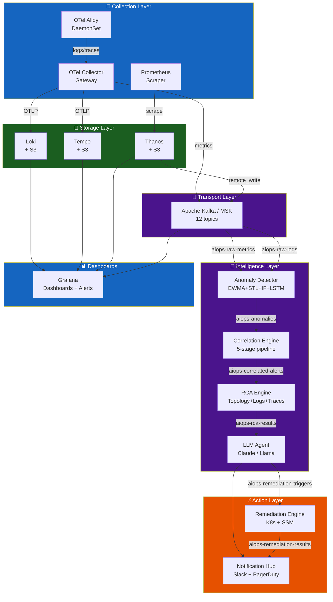

# Chapter 12 — Production Operations

> **Production operations chapter for the AIOps platform itself: chaos engineering, disaster recovery, cost governance, security hardening, performance benchmarking, and runbooks that keep the system healthy. The production monitoring platform itself must meet production standards. After this chapter, continue with the case-study chapters: [13 — Big Tech](../13-bigtech-aiops/README.md), [14 — E-commerce & Banking](../14-ecommerce-banking/README.md), [15 — Famous Incidents](../15-famous-incidents/README.md).**

---

## Prerequisites

All previous chapters. This chapter synthesizes practical operations concerns.

## Related Documents

- [07 — Anomaly Detection](../07-anomaly-detection/README.md) — precision-at-page, drift ops
- [08 — Alert Correlation](../08-alert-correlation/README.md) — storm drills, topology health
- [09 — Root Cause Analysis](../09-root-cause-analysis/README.md) — accuracy feedback, time budget
- [10 — LLM Agent](../10-llm-agent/README.md) — cost runaway LLM, human override
- [11 — Remediation](../11-remediation/README.md) — safety gates, blast radius
- [13 — Big Tech AIOps](../13-bigtech-aiops/README.md) — operating models & maturity at scale
- [14 — E-commerce & Banking](../14-ecommerce-banking/README.md) — cost/compliance constraints by industry
- [15 — Famous Incidents](../15-famous-incidents/README.md) — game day scenarios from public outages

## Next Reading

After this chapter, continue to [13 — Big Tech AIOps](../13-bigtech-aiops/README.md) to learn patterns from Google/Netflix/AWS/Meta/Uber, then [14 — E-commerce & Banking](../14-ecommerce-banking/README.md) and [15 — Famous Incidents](../15-famous-incidents/README.md).

---

## Table of Contents

1. [Platform Architecture Summary](#1-platform-architecture-summary)
2. [High Availability Design](#2-high-availability-design)
3. [Disaster Recovery](#3-disaster-recovery)
4. [Chaos Engineering for AIOps](#4-chaos-engineering-for-aiops)
5. [Performance Benchmarks](#5-performance-benchmarks)
6. [Cost Governance](#6-cost-governance)
7. [Security Hardening](#7-security-hardening)
8. [Observability of the Observability Platform](#8-observability-of-the-observability-platform)
9. [Runbook: Platform Recovery](#9-runbook-platform-recovery)
10. [Capacity Planning](#10-capacity-planning)
11. [Upgrade and Maintenance](#11-upgrade-and-maintenance)
12. [Team Operations Model](#12-team-operations-model)
13. [Maturity Progression Roadmap](#13-maturity-progression-roadmap)
14. [Total Cost of Ownership](#14-total-cost-of-ownership)
15. [Deep thinking: Dogfooding, DR control plane, Cost runaway, RACI, Game days, Scorecard](#15-deep-thinking-dogfooding-dr-control-plane-cost-runaway-raci-game-days-scorecard)
16. [Final Production Review](#16-final-production-review)

---

## 1. Platform Architecture Summary


*Poster: workload + observability + AIOps namespaces on Kubernetes / MSK / S3.*


*Poster: separate data plane / control plane and out-of-band break-glass.*

> [!NOTE]
> **KEY IDEA**
> The AIOps platform **is also a production system**. If Kafka/AD/Correlation go down, you go blind when applications fail — a double outage. Operating standards for AIOps must not be lower than those for payment-service.

> [!TIP]
> Dogfood before you evangelize: page the platform team with the **same** AIOps anomaly/correlation stack, not with a separate "AIOps is down" script outside the system.

Complete architecture of the AIOps platform, showing all components and data flows:



### Component Summary

| Component | Technology | Deployment | Monthly cost |
|-----------|-----------|------------|-------------|
| Collection (agents) | Grafana Alloy DaemonSet | K8s DaemonSet | $180 |
| Collection (gateway) | OTel Collector | K8s Deployment ×3 | $180 |
| Log storage | Loki + S3 | K8s StatefulSet | ~$750 |
| Trace storage | Tempo + S3 | K8s StatefulSet | ~$1,620 |
| Metric storage | Prometheus + Thanos + S3 | K8s | ~$800 |
| Transport | AWS MSK | Managed service | $738 |
| Anomaly Detection | Python services + Redis | K8s Deployment | ~$1,824 |
| Alert Correlation | Python service + Redis | K8s Deployment | $775 |
| RCA Engine | Python service + Weaviate | K8s Deployment | $1,370 |
| LLM Agent | Python service + API | K8s Deployment | ~$1,000 |
| Remediation Engine | Python service | K8s Deployment | $127 |
| **Total** | | | **~$9,364/month** |

---

## 2. High Availability Design

### HA Requirements

| Component | Required uptime | Mechanism to meet target | Status |
|-----------|----------------|--------|---------|
| Collection agents | 99.9% | DaemonSet automatic restart | ✅ |
| Kafka | 99.95% | MSK Multi-AZ | ✅ |
| Loki | 99.9% | 3× ingester, S3 backend storage | ✅ |
| Prometheus | 99.9% | HA pair + Thanos | ✅ |
| Anomaly Detector | 99.5% | 3 replicas, stateless design | ✅ |
| RCA Engine | 99.5% | 2 replicas | ✅ |
| LLM Agent | 99% | 2 replicas + model fallback | ✅ |
| Remediation Engine | 99.9% | 2 replicas + leader election | ✅ |

### Multi-AZ Architecture

```yaml
# All stateful components are spread across 3 AZs
topologySpreadConstraints:
  - maxSkew: 1
    topologyKey: topology.kubernetes.io/zone
    whenUnsatisfiable: DoNotSchedule
    labelSelector:
      matchLabels:
        app: loki-ingester   # Apply to each stateful component
```

### AIOps Platform SLO

```yaml
# SLO definitions for the AIOps platform itself
slo:
  alert_to_incident_latency:
    target: "P95 < 10 minutes"
    description: "Time from raw alert appearance to correlated incident creation"
    
  investigation_latency:
    target: "P95 < 3 minutes"
    description: "Time from incident to completion of LLM investigation"
    
  rca_accuracy:
    target: "> 70%"
    description: "Share of RCA results engineers confirm as correct"
    
  false_positive_rate:
    target: "< 10%"
    description: "False positive alert rate"
    
  auto_remediation_success:
    target: "> 80%"
    description: "Share of auto-remediation actions that successfully resolve the issue"
    
  platform_availability:
    target: "99.9%"
    description: "Availability of AIOps platform components"
```

---

## 3. Disaster Recovery

### DR Scenarios and Recovery Procedures

#### Scenario 1: Single Kafka broker failure

```
Impact: Partitions on the failed broker are temporarily inaccessible
Detection: kafka_server_replicamanager_underreplicatedpartitions > 0
MSK response: Automatic (MSK replaces the failed broker within 10-15 minutes)
Consumer impact: Lag rises slightly while the broker is replaced
Recovery: Automatic

SLA targets: RTO = 15 minutes (MSK-handled), RPO = 0 (data is replicated)
```

#### Scenario 2: Loki ingester failure

```
Impact: Logs are temporarily not ingested on the affected partition
Detection: Rate of loki_ingester_chunks_flushed_total drops sharply
Recovery:
  1. Kubernetes automatically restarts the failed pod
  2. WAL is replayed on restart to preserve data durability
  3. Ingesters rebalance load via the ring
  
SLA targets: RTO = 2 minutes (pod restart time), RPO = 0 (thanks to WAL replay)
```

#### Scenario 3: Complete Prometheus failure

```
Impact: Cannot query metrics; cannot fire alerts during the outage
Detection: up{job="prometheus"} == 0 (detected by the standby Prometheus instance)
Recovery:
  1. Prometheus restarts automatically (pod restart)
  2. Thanos serves long-term historical queries from S3
  3. Alertmanager continues sending cached alerts for about 5 minutes
  
SLA targets: RTO = 5 minutes, RPO = scrape interval (15s)
```

#### Scenario 4: Entire AIOps Intelligence Layer down

```
Impact: Loss of anomaly detection, correlation grouping, and LLM investigation
          (raw alerts still fire normally via Prometheus/Alertmanager)
Detection: "AIOps Platform Down" alert fires on monitoring-of-monitoring
Recovery:
  1. Triage: Identify which component is down (Kafka? AD? CE?)
  2. Restart failed pods via kubectl
  3. Replay events from Kafka (use earliest offset to re-consume)
  4. Engineers handle incidents manually while the system recovers
  
SLA targets: RTO = 30 minutes (diagnose + restart), RPO = replayability based on Kafka retention
```

### Backup Strategy

```yaml
backups:
  kafka_metadata:
    type: MSK continuous automatic backup
    frequency: continuous
    retention: 7 days
    
  loki_s3:
    type: S3 versioning + cross-region replication
    target_region: us-west-2
    retention_lifecycle: 31 days standard, 366 days glacier
    
  tempo_s3:
    type: S3 versioning + cross-region replication
    target_region: us-west-2
    retention_lifecycle: 14 days standard, 90 days glacier
    
  thanos_s3:
    type: S3 versioning
    retention_lifecycle: 90 days standard, 1 year glacier
    
  weaviate_vector_store:
    type: daily snapshot to S3
    frequency: 02:00 UTC daily
    retention: 30 days
    
  postgres_incidents:
    type: RDS automated backup
    frequency: continuous (PITR)
    retention: 35 days
    
  grafana_dashboards:
    type: Git-managed (grafana-as-code via Terraform/Pulumi)
    frequency: update on change
    recovery: run terraform apply
```

---

## 4. Chaos Engineering for AIOps

The AIOps platform must be resilient. Use chaos engineering to validate:

### Chaos Test Suite

```yaml
# chaos-test-suite.yaml (using Chaos Monkey / LitmusChaos)
experiments:
  
  # Experiment 1: Kill one Kafka broker
  - name: kafka-broker-kill
    type: pod_kill
    target:
      label: app=kafka-broker
      namespace: kafka
      count: 1
    hypothesis: "Consumer lag recovers automatically within 15 minutes"
    success_criteria:
      - metric: "kafka_consumer_group_lag_sum"
        threshold: 1000
        within_minutes: 15
    
  # Experiment 2: Kill anomaly detector pod
  - name: anomaly-detector-pod-kill
    type: pod_kill
    target:
      label: app=anomaly-detector
      count: 1
    hypothesis: "Anomaly detection is healthy again within 2 minutes"
    success_criteria:
      - metric: "up{job='anomaly-detector'}"
        value: 1
        within_minutes: 2
    
  # Experiment 3: Stress Loki memory
  - name: loki-ingester-memory-stress
    type: memory_stress
    target:
      label: app=loki-ingester
      count: 1
    parameters:
      memory_percentage: 90
      duration: "5m"
    hypothesis: "Loki continues ingesting logs normally; chunk flushing rate increases"
    
  # Experiment 4: Block Prometheus scrape path
  - name: block-prometheus-scrape
    type: network_partition
    target:
      label: app=order-service
    hypothesis: "Metric loss is detected within 5 minutes; alert fires"
    success_criteria:
      - alert: "TargetDown"
        fires_within_minutes: 5
    
  # Experiment 5: Full network partition to RCA engine
  - name: rca-engine-network-kill
    type: network_partition
    target:
      label: app=rca-engine
      interfaces: ["eth0"]
    hypothesis: "Kafka consumer lag rises, incidents queue, system recovers when connectivity returns"
    
  # Experiment 6: Simulate external LLM API outage
  - name: llm-api-outage
    type: http_fault
    target:
      service: anthropic-api-proxy
    fault: connection_refused
    duration: "10m"
    hypothesis: "LLM Agent falls back to GPT-4o-mini or produces a shortened analysis report"
```

### Running Chaos Tests

```bash
# Deploy LitmusChaos
kubectl apply -f https://litmuschaos.github.io/litmus/litmus-operator-v3.0.0.yaml

# Start a chaos experiment
kubectl apply -f kafka-broker-kill-experiment.yaml

# Watch results
kubectl get chaosresult kafka-broker-kill -n kafka -o jsonpath='{.status.experimentStatus}'
```

---

## 5. Performance Benchmarks

### Latency Budget (End-to-End)

```
Alert fires (Prometheus evaluation):           t = 0s
Alertmanager sends to Kafka:                   t = 15s
Kafka delivers to consumers:                   t = 16s
Anomaly detection (statistical):               t = 17-20s
Anomaly detection (ML):                        t = 20-60s
Correlation engine (5-minute sliding window):  t = 5 min 15s
RCA collects evidence in parallel:             t = 5 min 50s
RCA computes analysis:                         t = 5 min 55s
LLM Agent investigation (10 loops):            t = 7 min 55s
Slack notification to engineer:                t = 8 min

Total: About 8 minutes from raw alert to detailed investigation report
Target: < 10 minutes at P95
```

### Throughput Benchmarks

| Processing stage | Target capacity | Current performance (medium scale) | Bottleneck appears at |
|-------|------------------|----------------------|--------------|
| OTel Collection | 100MB/s | 30MB/s | NIC network bandwidth |
| Kafka ingest | 500MB/s | 50MB/s | Broker disk IO write speed |
| Loki ingest | 100MB/s | 20MB/s | Ingester RAM |
| Anomaly detection | 50K metrics/sec | 10K metrics/sec | GPU capacity for LSTM |
| Correlation | 10K alerts/min | 1K alerts/min | Redis processing capacity |
| RCA | 100 incidents/min | 10 incidents/min | Loki/Tempo API response speed |
| LLM agent | 50 investigations/min | 5 investigations/min | API rate limits |

### Benchmark Script

```python
import asyncio
import time
import httpx
from statistics import quantiles

async def benchmark_loki_ingest(
    loki_url: str,
    messages_per_second: int = 1000,
    duration_seconds: int = 60,
) -> dict:
    """
    Benchmark Loki log ingest throughput.
    """
    async with httpx.AsyncClient() as client:
        latencies = []
        errors = 0
        start = time.time()
        message_count = 0
        
        while time.time() - start < duration_seconds:
            batch_start = time.time()
            
            # Send test batch
            payload = {
                "streams": [
                    {
                        "stream": {"service": "benchmark", "level": "INFO"},
                        "values": [
                            [str(int(time.time_ns())), f"Benchmark message {i}"]
                            for i in range(messages_per_second)
                        ],
                    }
                ]
            }
            
            req_start = time.time()
            try:
                response = await client.post(
                    f"{loki_url}/loki/api/v1/push",
                    json=payload,
                    timeout=5.0,
                )
                latencies.append((time.time() - req_start) * 1000)
                message_count += messages_per_second
            except Exception:
                errors += 1
            
            # Pace sends to the target rate
            elapsed = time.time() - batch_start
            if elapsed < 1.0:
                await asyncio.sleep(1.0 - elapsed)
        
        return {
            "messages_per_second_target": messages_per_second,
            "total_messages": message_count,
            "errors": errors,
            "duration_seconds": time.time() - start,
            "p50_latency_ms": quantiles(latencies, n=2)[0] if latencies else 0,
            "p99_latency_ms": quantiles(latencies, n=100)[98] if latencies else 0,
            "error_rate": errors / max(1, len(latencies) + errors),
        }
```

---

## 6. Cost Governance

### Cost Breakdown by Layer

```
Total: About ~$9,364/month for a medium-scale production AIOps system

Collection Layer:                 $360   (3.8%)
Transport (Kafka/MSK):            $738   (7.9%)
Storage (Loki+Tempo+Prom):        $3,170 (33.9%)
Intelligence Layer (ML/LLM):      $3,969 (42.4%)
Action Layer (Remediation):       $127   (1.4%)
Shared platform ops overhead:     $1,000 (10.7%)

Most expensive components:
1. Intelligence Layer (ML analysis): $3,969/month — mostly GPU cost for LSTM
2. Storage: $3,170/month — mainly Tempo trace storage
3. Kafka/MSK: $738/month
```

### Cost Optimization Strategies

```python
COST_OPTIMIZATION_STRATEGIES = {
    "trace_sampling": {
        "current": "10% tail sampling configured",
        "potential": "Reduce to 1% + keep 100% error traces",
        "savings": "Cut Tempo S3 cost ~9×: from $1,500 to $170/month",
        "risk": "Lose a large share of healthy traces used as comparison samples",
    },
    "log_retention": {
        "current": "31 days standard retention on Loki",
        "potential": "Reduce to 7 days standard + age old data to S3 Glacier",
        "savings": "Save about $200/month",
        "risk": "Limits direct historical log analysis in the UI",
    },
    "lstm_inference": {
        "current": "Run model on GPU instances (g4dn.xlarge)",
        "potential": "Move to CPU-only inference (ONNX runtime)",
        "savings": "Save $750/month (about 60% of GPU cost)",
        "risk": "Inference latency rises from 10ms to 100ms",
        "implementation": "Export LSTM model to ONNX format",
    },
    "kafka_compression": {
        "current": "Using snappy",
        "potential": "Switch to zstd",
        "savings": "15-20% storage reduction → about ~$100/month",
        "risk": "Slight CPU increase on producers during compression",
    },
    "spot_instances": {
        "components": ["queriers", "ml_detectors", "llm_agent"],
        "savings": "60% compute savings: about ~$1,200/month",
        "risk": "Spot instance reclamation risk (mitigated by k8s reschedule)",
    },
}
```

### Cost Monitoring

```promql
# Estimate S3 storage cost
sum(aws_s3_bucket_size_bytes{bucket=~"loki.*|tempo.*|thanos.*"}) * 0.023 / 1e9

# AWS MSK broker running cost
sum(aws_msk_broker_running_hours_total) * 0.202  # m5.large instance pricing

# External LLM API cost
sum(aiops_llm_tokens_used_total{model="claude-3-5-sonnet"}) * 0.003 / 1000000

# GPU instance cost
sum(aiops_gpu_instance_hours_total) * 0.526  # g4dn.xlarge instance pricing
```

### FinOps Alerts

```yaml
- alert: AIOpsStorageCostExcessive
  expr: |
    sum(aws_s3_bucket_size_bytes{bucket=~"loki.*|tempo.*|thanos.*"}) > 100e12  # Alert above 100TB
  for: 24h
  labels:
    severity: warning
    team: platform-engineering
  annotations:
    summary: "AIOps storage exceeds 100TB — review retention policy"

- alert: LLMCostSpike
  expr: |
    increase(aiops_llm_cost_usd_total[1h]) > 100
  for: 0m
  labels:
    severity: warning
  annotations:
    summary: "LLM API cost exceeded $100 in the last hour — suspected investigation loop"
```

---

## 7. Security Hardening

### Security Checklist

```markdown
## Network
- [ ] All Kafka data paths encrypted (TLS 1.3)
- [ ] All internal service connections use mTLS (Istio/Linkerd)
- [ ] No services public on the internet except Grafana (OIDC auth)
- [ ] VPC endpoints for S3, Kafka (avoid public internet)
- [ ] Kubernetes NetworkPolicy: default deny, open only required ports

## Authentication and Authorization
- [ ] Loki multi-tenancy enabled (require X-Scope-OrgID header)
- [ ] Grafana SSO via OIDC (Google/Okta)
- [ ] Fine-grained Grafana data source permissions per team
- [ ] Kafka secured with SASL/SCRAM-SHA-512 + ACLs
- [ ] Strict least-privilege RBAC on Kubernetes for each service account
- [ ] AWS IRSA for pods needing AWS APIs (no static AWS credentials)

## Secrets
- [ ] All keys/secrets stored in Kubernetes Secrets (never ConfigMaps)
- [ ] Secrets encrypted at rest (etcd encryption)
- [ ] Sealed Secrets or External Secrets Operator for GitOps
- [ ] AWS Secrets Manager for dynamic secrets (RDS passwords, API keys)
- [ ] Secret rotation: quarterly for service accounts, yearly for CA

## Data
- [ ] Block Public Access on all S3 buckets
- [ ] S3 encryption with SSE-KMS
- [ ] S3 bucket policies deny connections outside VPC
- [ ] RDS encrypted at rest and in transit
- [ ] DynamoDB encryption with CMK
- [ ] No user PII in Kafka topics (scrub logs before ingest)

## Compliance
- [ ] Remediation engine audit logs stored on append-only immutable DynamoDB
- [ ] Kubernetes audit log enabled and shipped to CloudWatch
- [ ] AWS CloudTrail enabled for all AWS API calls
- [ ] Minimum 90-day retention for all audit logs
- [ ] Strict data retention policies on topics/buckets

## LLM-Specific Security
- [ ] Fully remove PII from outbound prompts (scrub logs before prompt insertion)
- [ ] Rotate LLM API keys quarterly
- [ ] Detailed logging of LLM API calls (tokens used, model, timestamp)
- [ ] Prefer self-hosted models for highly sensitive data
- [ ] Prompt injection defense: sanitize and filter tool input parameters carefully
```

### PII Scrubbing in Log Pipeline

```python
import re

class PIIScrubber:
    """
    Remove sensitive information (PII) from logs before indexing into Loki or sending to an LLM.
    """
    PATTERNS = [
        (re.compile(r'\b[A-Za-z0-9._%+-]+@[A-Za-z0-9.-]+\.[A-Z|a-z]{2,}\b'),
         '[EMAIL]'),
        (re.compile(r'\b\d{4}[- ]?\d{4}[- ]?\d{4}[- ]?\d{4}\b'),
         '[CREDIT_CARD]'),
        (re.compile(r'\b\d{3}-\d{2}-\d{4}\b'),
         '[SSN]'),
        (re.compile(r'"password"\s*:\s*"[^"]*"'),
         '"password": "[REDACTED]"'),
        (re.compile(r'"token"\s*:\s*"[^"]*"'),
         '"token": "[REDACTED]"'),
        (re.compile(r'"api_key"\s*:\s*"[^"]*"'),
         '"api_key": "[REDACTED]"'),
        (re.compile(r'\b(?:\d{1,3}\.){3}\d{1,3}\b'),
         '[IP]'),
    ]
    
    def scrub(self, log_line: str) -> str:
        for pattern, replacement in self.PATTERNS:
            log_line = pattern.sub(replacement, log_line)
        return log_line
```

---

## 8. Observability of the Observability Platform

Meta-observability: who watches the watchers?

### Dead Man's Switch Pattern

```yaml
# Every pipeline component periodically emits a heartbeat metric
# If the heartbeat stops, the pipeline is interrupted

# Recording rule in each component:
- record: aiops_component_heartbeat
  expr: 1   # Always 1 if the component is running and Prometheus evaluates the rule

# Cross-component Dead Man's Switch alerts
- alert: AIOpsCollectionPipelineDead
  expr: |
    absent(rate(aiops_component_heartbeat{component="otel-collector"}[5m]))
  for: 5m
  labels:
    severity: critical
    route: pagerduty-platform-team
  annotations:
    summary: "Missing OTel Collector heartbeat — telemetry pipeline interrupted"

- alert: AIOpsAnomalyDetectionDead
  expr: |
    absent(rate(aiops_anomaly_detection_events_processed_total[10m]))
  for: 10m
  labels:
    severity: critical

- alert: AIOpsKafkaPipelineBroken
  expr: |
    kafka_consumer_group_lag_sum{group=~"anomaly-detector-.*|correlation-.*|rca-.*"} > 100000
  for: 15m
  labels:
    severity: critical
```

### Platform Health Dashboard

Important panels on the AIOps health dashboard:

```yaml
dashboard_panels:
  - title: "End-to-End Pipeline Latency"
    description: "P95 time from alert to completed investigation"
    query: "histogram_quantile(0.95, rate(aiops_e2e_latency_seconds_bucket[5m]))"
    
  - title: "Kafka Consumer Lag (all groups)"
    description: "Total lag across all AIOps consumers"
    query: "sum by (group) (kafka_consumer_group_lag_sum)"
    alert_threshold: 10000
    
  - title: "Anomaly Detection False Positive Rate"
    description: "Share of anomaly alerts judged false positive"
    query: |
      rate(aiops_anomaly_feedback_total{outcome="false_positive"}[24h])
      / rate(aiops_anomaly_feedback_total[24h])
    alert_threshold: 0.20
    
  - title: "LLM Investigation Accuracy"
    description: "Share of LLM investigation reports judged correct"
    query: |
      rate(aiops_llm_feedback_total{result="correct"}[7d])
      / rate(aiops_llm_feedback_total[7d])
    alert_threshold: 0.70   # Alert if accuracy drops below 70%
    
  - title: "MTTR Trend"
    description: "Average incident resolution time over the last 30 days"
    query: "avg_over_time(aiops_incident_resolution_time_seconds[30d])"
    
  - title: "Auto-Remediation Success Rate"
    description: "Share of auto-remediation actions that successfully resolve issues"
    query: |
      rate(aiops_remediation_executions_total{status="verified_success"}[7d])
      / rate(aiops_remediation_executions_total[7d])
```

---

## 9. Runbook: Platform Recovery

### AIOps Platform Down — Full Recovery Runbook

```markdown
## Runbook: Full AIOps platform recovery

**Alert signal**: Multiple AIOps components unhealthy, or Kafka consumer lag exceeds 100K

**Impact**: Loss of anomaly detection, correlation grouping, or automatic LLM investigation.
On-call engineers must switch to manual monitoring and incident handling.

**Escalation contact**: Platform Engineering on-call (@platform-oncall on Slack)

### Step 1: Quick system survey (5 minutes)

```bash
# Check AIOps pods not in Running state
kubectl get pods -n aiops --field-selector=status.phase!=Running

# Check Kafka consumer lag
kafka-consumer-groups.sh --bootstrap-server kafka-1:9092 \
  --describe --group anomaly-detector-group | head -20

# Check S3 connectivity (most critical dependency)
aws s3 ls s3://loki-chunks-prod/ --max-items 1
aws s3 ls s3://tempo-traces-prod/ --max-items 1

# Check AWS MSK cluster health
aws kafka describe-cluster --cluster-arn $MSK_CLUSTER_ARN \
  | jq '.ClusterInfo.State'
```

### Step 2: Fix Kafka-related issues first (Kafka is the backbone)

```bash
# If MSK is healthy but consumers cannot connect
# Re-check Security Group configuration
aws ec2 describe-security-groups --group-ids $KAFKA_SG_ID | jq '.SecurityGroups[].IpPermissions'

# Sequentially restart AIOps consumers
kubectl rollout restart deployment/anomaly-detector -n aiops
kubectl rollout restart deployment/correlation-engine -n aiops
kubectl rollout restart deployment/rca-engine -n aiops
kubectl rollout restart deployment/llm-agent -n aiops

# Watch rollout
kubectl rollout status deployment/anomaly-detector -n aiops --timeout=5m
```

### Step 3: Handle excessive consumer lag

```bash
# If lag is huge (>1 million messages) and reprocessing everything is not required,
# consider jumping offsets to latest
# NOTE: This skips a large amount of historical alerts — only when not critical
kafka-consumer-groups.sh --bootstrap-server kafka-1:9092 \
  --group anomaly-detector-group \
  --reset-offsets \
  --to-latest \
  --topic aiops-raw-metrics \
  --execute

# OR: Reset offset to a specific timestamp (reprocess only last ~2 hours)
kafka-consumer-groups.sh --bootstrap-server kafka-1:9092 \
  --group anomaly-detector-group \
  --reset-offsets \
  --to-datetime 2024-01-15T12:00:00.000 \
  --topic aiops-raw-metrics \
  --execute
```

### Step 4: Restore LLM Agent connectivity

```bash
# Confirm API key is present
kubectl get secret llm-agent-secrets -n aiops -o jsonpath='{.data.ANTHROPIC_API_KEY}' \
  | base64 -d | cut -c1-10  # Show only first 10 chars for safety

# Test API connectivity from inside the pod
kubectl exec -n aiops deploy/llm-agent -- \
  curl -s -o /dev/null -w "%{http_code}" \
  https://api.anthropic.com/v1/messages \
  -H "x-api-key: $ANTHROPIC_API_KEY" \
  -H "content-type: application/json" \
  -d '{"model":"claude-3-haiku-20240307","max_tokens":10,"messages":[{"role":"user","content":"hi"}]}'
# Expected: HTTP 200
```

### Step 5: Validate the full system after recovery

```bash
# End-to-end test: inject a synthetic incident
./tools/test-incident-injection.sh --service test-service --type error_rate_spike

# Confirm the following steps run normally:
# 1. Message appears on topic: aiops-raw-metrics
# 2. Anomaly detection produces message on: aiops-anomalies
# 3. Correlation produces message on: aiops-correlated-alerts
# 4. LLM Agent investigation produces message on: aiops-rca-results
# 5. Slack channel #aiops-incidents receives a notification

# Inspect Kafka topic data directly
kafka-console-consumer.sh --bootstrap-server kafka-1:9092 \
  --topic aiops-rca-results --max-messages 1 --from-beginning
```

### Step 6: Post-recovery actions

1. Review Prometheus alerts for incidents missed while the system was down.
2. Drain queued alerts carefully (adjust offsets gradually).
3. Hold a post-mortem on why the AIOps platform failed.
4. Fold new findings back into this runbook.
```

---

## 10. Capacity Planning

### Growth Model

```python
def project_costs(
    current_services: int,
    monthly_growth_rate: float,
    months: int = 12,
) -> list:
    """
    Project AIOps platform operating cost as microservice count grows.
    """
    projections = []
    services = current_services
    
    # Variable cost coefficients (per service)
    COST_PER_SERVICE = {
        "metrics_storage": 5,      # $5/service/month (Prometheus + Thanos)
        "log_storage": 3,          # $3/service/month (Loki + S3)
        "trace_storage": 4,        # $4/service/month (Tempo + S3, with sampling)
        "kafka_throughput": 2,     # $2/service/month (MSK)
    }
    
    # Fixed costs
    FIXED_COSTS = {
        "kafka_base": 738,         # Fixed MSK cluster cost
        "intelligence_layer": 4000,  # AD + CE + RCA + LLM (grows slowly with services)
        "platform_overhead": 1000,
    }
    
    for month in range(months + 1):
        variable_cost = sum(v * services for v in COST_PER_SERVICE.values())
        fixed_cost = sum(FIXED_COSTS.values())
        total = variable_cost + fixed_cost
        
        projections.append({
            "month": month,
            "services": services,
            "variable_cost": variable_cost,
            "fixed_cost": fixed_cost,
            "total_cost": total,
            "cost_per_service": total / services,
        })
        
        services = int(services * (1 + monthly_growth_rate))
    
    return projections

# Example projection run
projections = project_costs(
    current_services=50,
    monthly_growth_rate=0.05,  # 5% growth per month
    months=12,
)
# Month 12 result: ~90 services, estimated cost about ~$12,000-15,000/month
```

---

## 11. Upgrade and Maintenance

### Upgrade Order

For maximum pipeline stability, always upgrade components in this order:

```
1. Infrastructure (Kubernetes, MSK)      ← Foundation layer
2. Storage (Loki, Tempo, Prometheus)   ← Must be stable before upgrading consumers
3. Collection (OTel Collector, Alloy)  ← Depends directly on storage
4. Transport (Kafka schema, topics)    ← After producers/consumers are compatible
5. Intelligence Layer (AD, CE, RCA)    ← After transport is stable
6. LLM Agent                          ← After intelligence is stable
7. Remediation Engine                 ← Last (highest risk; direct production impact)
```

### Zero-Downtime Upgrade Pattern

```bash
# For each stateless component:
# 1. Update the image tag in values.yaml
# 2. Rolling update (maxSurge=1, maxUnavailable=0)
kubectl set image deployment/anomaly-detector \
  anomaly-detector=aiops/anomaly-detector:2.0.0 \
  -n aiops

# Watch rollout progress
kubectl rollout status deployment/anomaly-detector -n aiops

# Validate after upgrade
kubectl get pods -n aiops -l app=anomaly-detector
# Ensure consumer lag does not spike during the rolling update
```

### Maintenance Windows

```yaml
maintenance_windows:
  # Scheduled recurring maintenance windows
  weekly_maintenance:
    day: Sunday
    time: "02:00-04:00 UTC"
    actions:
      - certificate rotation
      - minor version upgrades
      - storage index optimization (run Loki compactor)
      
  monthly_maintenance:
    day: "First Sunday"
    time: "00:00-06:00 UTC"
    actions:
      - major version upgrades
      - ML model retraining pipeline
      - capacity reviews
      - cost optimization reviews
      
  # Maintenance mode: pause auto-remediation during maintenance
  maintenance_mode:
    implementation: "Set maintenance_mode=true on Redis"
    effect: "Remediation engine stops automatic execution; Slack notifications only"
```

---

## 12. Team Operations Model

### Platform Team Responsibilities

```
Platform Engineering team (owns AIOps platform operations):

Daily (Tier 1): 
  - Monitor system health via shared dashboards
  - Review daily false positive rate
  - Respond when "AIOps Platform Down" alerts fire

Weekly (Tier 2):
  - Review operating cost reports
  - Update ML models (trigger retraining pipeline)
  - Review and approve new runbooks from other teams
  - Hold post-mortems if platform incidents occurred

Monthly (Tier 3):
  - Capacity planning reviews
  - Review ML model accuracy
  - Periodic security audit
  - Cost optimization reviews
  - Update this operations handbook

On-call allocation:
  - Primary: 1 engineer rotating weekly
  - Secondary: 1 engineer rotating weekly
  - Response SLA: 15 minutes for P1, 1 hour for P2
```

### Product Engineering Teams (consumers of AIOps)

```
Product Teams (consumers of AIOps outputs):

Responsibilities:
  - Write runbooks for failure scenarios of services they own
  - Actively rate LLM Agent investigation quality (feedback loop data)
  - Review and approve auto-remediation actions when approval is required
  - Keep service dependency maps current (via Backstage catalog)
  - Define anomaly detection rules for service-specific metrics

What they do NOT need to do:
  - Configure Prometheus scraping
  - Operate Loki/Tempo storage infrastructure
  - Learn Kafka internal architecture
  - Write anomaly detection algorithms themselves
```

---

## 13. Maturity Progression Roadmap

### AIOps Maturity Model (Revisited)

| Level | Capability achieved | Timeline | Corresponding tooling investment |
|-------|-----------|----------|-----------|
| **L1** | Metrics monitoring + static thresholds | Current | Prometheus + Grafana |
| **L2** | Logs + Traces integration + light correlation | Months 1-2 | Loki + Tempo + Kafka |
| **L3** | Dynamic anomaly detection | Months 2-4 | Statistical + ML solutions |
| **L4** | Automatic correlation + structured RCA | Months 4-6 | Correlation Engine + RCA Engine |
| **L5** | LLM Agent investigation + auto-remediation | Months 6-12 | LLM Agent + Remediation Engine |
| **L6** | Predictive + preventive capability | Month 12 onward | Capacity forecasting, proactive scaling |

### L6 Preview: Predictive AIOps

```python
import pandas as pd

class CapacityPredictorService:
    """
    Forecast when a service will hit resource limits so you can scale proactively.
    Uses Prophet for time-series forecasting.
    """
    def predict_resource_exhaustion(
        self,
        metric_history: pd.DataFrame,  # CPU/RAM/connections history
        forecast_horizon_hours: int = 24,
    ) -> dict:
        from prophet import Prophet
        
        model = Prophet(
            changepoint_prior_scale=0.05,
            seasonality_mode="multiplicative",
        )
        model.add_seasonality(name="daily", period=1, fourier_order=5)
        model.add_seasonality(name="weekly", period=7, fourier_order=3)
        
        model.fit(metric_history)
        
        future = model.make_future_dataframe(
            periods=forecast_horizon_hours,
            freq="H",
        )
        forecast = model.predict(future)
        
        # Check whether forecast exceeds early-warning threshold
        capacity_threshold = 0.85  # 85% utilization = pre-scale
        
        threshold_exceeded = forecast[forecast["yhat"] > capacity_threshold]
        
        if not threshold_exceeded.empty:
            first_breach = threshold_exceeded.iloc[0]
            return {
                "will_exceed_capacity": True,
                "predicted_breach_time": first_breach["ds"].isoformat(),
                "predicted_value": first_breach["yhat"],
                "hours_until_breach": (
                    first_breach["ds"] - pd.Timestamp.now()
                ).total_seconds() / 3600,
                "recommended_action": "pre-scale before breach",
            }
        
        return {"will_exceed_capacity": False}
```

---

## 14. Total Cost of Ownership

### 12-Month TCO Summary

```
Year 1 total cost of ownership for the AIOps platform:

Q1 Build phase: 
  Headcount: 2 engineers × 3 months = $150,000
  Infrastructure (development phase): $15,000/quarter
  
Q2-Q4 Run phase:
  Infrastructure: $9,364/month × 9 months = $84,276
  Headcount: 0.5 FTE for operations = $75,000
  External LLM API: ~$240/year
  
Year 1 total: $150,000 + $15,000 + $84,276 + $75,000 = $324,276

From year 2 onward (steady state):
  Infrastructure: $9,364/month × 12 months = $112,368
  Headcount (about 25% FTE): $37,500
  Total: ~$150,000/year

ROI calculation (conservative estimate):
  MTTR improvement: from 60 minutes to 15 minutes (75% reduction)
  Average monthly incidents: 20 P1/P2 incidents
  Average downtime cost: $5,000/minute
  Monthly savings: 20 × 45 minutes × $5,000 = $4,500,000
  
  Annual savings: ~$54,000,000 (theoretical maximum)
  Reality (auto-remediation on 30% of incidents): ~$16,000,000/year saved
  
  Year 1 ROI: 16,000,000 / 324,276 = ~49×
  Year 2+ ROI: 16,000,000 / 150,000 = ~107×
```

---

## 15. Deep thinking: Dogfooding, DR control plane, Cost runaway, RACI, Game days, Scorecard

### 15.1 Dogfooding AIOps on itself

> [!IMPORTANT]
> If AIOps cannot monitor itself with its own pipeline, you are operating **two worlds**: a "special platform" and "normal apps". During incidents, on-call has no trained reflexes.

**Dogfood checklist**:

| Platform signal | Detector / rule | Severity |
|-------------------|-----------------|----------|
| Kafka consumer lag AD/CE/RCA/LLM | Anomaly + static lag threshold | P1 if lag rises + page silence |
| Anomaly FPR 24h | Meta-metric from feedback | P2 platform |
| Correlation under-merge | alerts_per_incident median | P2 |
| RCA accuracy 7d | feedback TP rate | P2 |
| LLM token spike / safety blocks | Cost + security | P2/P1 |
| Remediation failure rate | Verify pipeline | P1 |
| Topology graph age | Static | P2 |

```yaml
# AIOps self-alerts — route to platform-oncall, NOT product teams
groups:
  - name: aiops-dogfood
    rules:
      - alert: AIOpsControlPlaneDeaf
        expr: |
          (
            kafka_consumer_group_lag_sum{group=~"anomaly-detector-group|correlation-engine-group"} > 20000
          )
          and
          (
            rate(aiops_correlation_incidents_created_total[15m]) == 0
          )
        for: 10m
        labels:
          severity: critical
          team: aiops-platform
        annotations:
          summary: "AIOps may be deaf: lag high AND no incidents formed"
```

> [!TIP]
> **Shadow page**: every quarter, inject a synthetic failure (chaos) and require the detect→correlate→RCA→Slack card path to complete under SLO. Record results in the maturity scorecard §15.6.

### 15.2 DR for the AIOps control plane

App DR ≠ AIOps DR. The control plane needs **its own RPO/RTO**:

| Component | RPO | RTO | Notes |
|------------|-----|-----|---------|
| Kafka / MSK | ≤ 1–5 minutes | ≤ 30 minutes | Multi-AZ; test consumer group failover |
| Redis (correlation windows) | Best-effort | ≤ 15 minutes | Accept window loss; rebuild from stream |
| Incident store (Postgres) | ≤ 5 minutes | ≤ 30 minutes | PITR |
| Model registry / artifacts | ≤ 24h | ≤ 1h | S3 versioned |
| Vector store (runbooks) | ≤ 24h | ≤ 2h | Re-embed from git source of truth |
| LLM API | N/A | Immediate fallback | Multi-provider / smaller model |
| Grafana dashboards | ≤ 24h | ≤ 30 minutes | GitOps |

**DR modes**:

```
Mode A — Regional degrade:
  Lose 1 AZ → Kafka/Prom HA continues; partial correlation window loss OK

Mode B — Control plane dark:
  Lose entire aiops namespace → fall back to raw Alertmanager pages (noisy but alive)
  Feature flag: aiops_pipeline_enabled=false → classic alerting path

Mode C — Full region loss:
  Warm standby region: MSK mirror / S3 replica + K8s gitops apply
  Priority restore order: Kafka → storage query path → AD statistical → Correlation → RCA → LLM → Remediation
```

> [!WARNING]
> **Anti-pattern**: DR runbooks only cover "restore payment-db" and not "restore aiops". In a major outage you need observability **before** app recovery to know whether the fix worked.

```bash
# Smoke DR control plane (post-restore)
kubectl -n aiops get deploy
# lag consumers
# synthetic metric spike → expect anomaly event in Kafka within 2m
# expect correlated incident card in Slack within 5m
```

See also public DR/outage scenarios to drill: [15 — Famous Incidents](../15-famous-incidents/README.md).

### 15.3 Cost runaway: LLM + retention

Two silent money furnaces:

| Source | Runaway mechanism | Circuit breaker |
|-------|----------------|-----------------|
| LLM storm | Correlation fail → 1 alert = 1 investigation | max_investigations_per_incident; storm mode mini-model |
| Log retention | Debug level + 90 days hot | Tiered storage; default 7–14d hot |
| Trace no sampling | 100% prod traces | Tail sampling + policies |
| Metric cardinality | unbounded labels | relabel drop; recording rules |
| Retrain thrash | retrain on every FP spike | cooldown 7d; shadow first |
| Vector reindex | full re-embed hourly | incremental; hash content |

```yaml
finops_guards:
  monthly_budget_usd: 12000
  alerts:
    - name: llm_daily_spend
      threshold_usd: 50
      action: force_model_fallback
    - name: s3_growth_wow
      threshold_pct: 25
      action: page_finops_platform
  retention:
    loki_hot_days: 14
    tempo_raw_days: 7
    metrics_raw_days: 15
    metrics_downsampled_days: 365
```

> [!NOTE]
> **KEY IDEA**
> AIOps cost governance is a **financial SLO**: "observability cost ≤ X% of COGS" or "≤ Y$/service/month". Without a ceiling, retention and LLM expand with on-call fear.

### 15.4 Multi-team ownership RACI

| Item | Platform AIOps | Product SRE | App Dev | Security | FinOps |
|----------|----------------|-------------|---------|----------|--------|
| Collectors / OTel | **A/R** | C | C | C | I |
| Recording rules / app SLOs | C | **A/R** | C | I | I |
| Generic anomaly models | **A/R** | C | I | I | I |
| Service-specific detectors | C | **A** | R | I | I |
| Topology / service catalog | A | R | R | I | I |
| Runbook content | C | **A** | R | C | I |
| LLM prompts/safety | **A/R** | C | I | **C/A** (policy) | I |
| Remediation allowlist | A | R | C | **A** (risk) | I |
| Budget & retention | C | C | I | I | **A/R** |
| Incident commander app outage | I | **A/R** | C | I | I |
| Incident commander AIOps down | **A/R** | C | I | C | I |

> [!TIP]
> **R = Responsible, A = Accountable (only one), C = Consulted, I = Informed.**  
> Classic dispute: "who owns false positives?" → **Platform** owns system FPR; **Product SRE** owns thresholds/SLOs for their services.

### 15.5 Game days calendar

No game day = DR/chaos is only markdown.

| Cadence | Scenario | Goal | Suggested link |
|----------|----------|----------|------------|
| Monthly | Kill 1 anomaly-detector replica + lag inject | HPA + no page storm | Ch07/Ch12 chaos |
| Monthly | Synthetic alert storm 200 alerts | Correlation merge quality + UX | Ch08 |
| Quarterly | Stale topology (freeze graph 2h) | Degraded correlation banner | Ch08 §19 |
| Quarterly | Loki down during P1 | RCA partial + human path | Ch09 |
| Quarterly | Prompt injection canary log | Safety gate blocks action | Ch10 |
| Quarterly | Region AZ loss MSK | DR Mode A | §15.2 |
| Bi-annual | Full aiops namespace wipe (staging) | Restore order RTO | §15.2 Mode B |
| Bi-annual | Famous incident replay | Organizational learning | [15 — Famous Incidents](../15-famous-incidents/README.md) |

```yaml
game_day_template:
  name: "correlation-storm-2026-q3"
  blameless: true
  preflight:
    - freeze_remediation_auto: true   # unless testing remediation
    - notify_stakeholders: true
  inject:
    - type: synthetic_alerts
      count: 200
      root: "payment-db"
  success_criteria:
    - incidents_created: 1
    - time_to_incident_card_s: "< 180"
    - raw_pages_to_humans: 0
  artifacts:
    - timeline
    - metrics_snapshot
    - action_items_owners_due
```

### 15.6 Maturity scorecard (measurable, not slogans)

Score 0–4 per row; target ≥ 3 before org-wide scale.

| Item | 0 | 1 | 2 | 3 | 4 |
|----------|---|---|---|---|---|
| Detection | Static only | EWMA | Seasonal | Ensemble + drift | Predictive |
| Correlation | None | AM group | Topology | Late-join + split UX | Multi-cluster |
| RCA | Manual | Topology | +logs/traces/change | Evidence quality + budget | Multi-root calibrated |
| LLM Agent | None | Summarize | Tool-use read | HITL remediate | Calibrated auto tier-0 |
| Remediation | Manual | Scripts | Allowlist auto | Canary+verify | Closed-loop |
| Dogfood | None | Some metas | Full self-page | Game days monthly | Chaos continuous |
| FinOps | No budget | Monthly review | Guards+alerts | Unit cost/service | Autotune retention |
| Security | Basic | mTLS | Injection defense | Audit+IR playbooks | Red-team agent |
| Ownership | Hero culture | Partial RACI | Clear RACI | Scorecard OKRs | Multi-region ops |

```
Scorecard review: every quarter
  Owner: AIOps platform lead
  Inputs: FPR, merge quality, RCA accuracy, MTTR, $, game day pass rate
  Output: 3 improvement bets / quarter (no more than 3)
```

Big Tech patterns to benchmark against: [13 — Big Tech AIOps](../13-bigtech-aiops/README.md). Industry constraints: [14 — E-commerce & Banking](../14-ecommerce-banking/README.md).

### 15.7 Link drills → famous incidents

| Drill theme | Inspired by | Capability under test |
|-------------|--------------|-------------------|
| Cascading dependency | Multi-service retail outage | Correlation + RCA path |
| Bad config global push | CDN/DNS incidents | Change correlation + freeze |
| Automation feedback loop | Retry storms / thundering herd | Remediation blast radius |
| Partial region failure | Cloud AZ/region events | DR control plane |
| Observability blind | "metrics lied" class | Dogfood + multi-signal |

> [!NOTE]
> **Check question**: A game day just failed because the incident card never appeared — do you open a **platform ticket** or **turn off AIOps and forget**? Which culture builds maturity 3+?

### 15.8 Operating cadence (weekly/monthly/quarterly rhythm)

| Cadence | What happens | Output artifact |
|------|---------|-----------------|
| Daily | Platform standup 15' — lag, FPR, $ burn, open P1 platform | Slack thread `#aiops-ops` |
| Weekly | FP/RCA accuracy review with product SRE | Top 5 noisy services + owners |
| Weekly | Change freeze window for AIOps itself (except hotfix) | Calendar + feature flags |
| Monthly | Cost & retention review with FinOps | Budget variance + actions |
| Monthly | Game day (see §15.5) | Report + action items |
| Quarterly | Maturity scorecard + OKR bets | Score 0–4 table published |
| Quarterly | Security review of agent tools + IRSA/RBAC | Diff allowlist + pen findings |
| Yearly | Full DR regional exercise (staging→prod-like) | RTO/RPO measured |

```yaml
# Feature flags — mandatory kill switches
aiops_flags:
  pipeline_enabled: true
  auto_remediation_enabled: true
  llm_investigations_enabled: true
  storm_mode: false
  # Kill switches must be callable in <2 minutes by on-call
  emergency:
    disable_all_pages_except_platform: false
    force_classic_alertmanager_path: false
```

> [!WARNING]
> Kill switches must **not** be buried in a 40-file PR. One `kubectl`/`redis-cli`/flag UI is enough. Game days must practice **toggling** flags, not only injecting faults.

### 15.9 Production AIOps anti-patterns

| Anti-pattern | Symptom | Consequence | Fix |
|--------------|-------------|--------|-----|
| Hero on-call | Only 1 person "understands AIOps" | Bus factor 1 | RACI + runbook + pairing |
| Shadow IT detectors | Teams host models outside the platform | Blind spots, weird cost | Platform self-service API |
| Eternal beta | "ML experimental" for 18 months | Nobody trusts pages | Scorecard gate for go-live |
| Alert on everything platform | 50 meta-alerts | Fatigue crushes platform team | Tier meta-alerts like apps |
| No classic fallback | AIOps down = fully blind | Double outage | Mode B classic path |
| Budget without unit cost | Only look at total $ | Don't know which service burns | $/service + /GB log |
| Game day theater | Only slides, no inject | False confidence | Measurable success criteria |
| Ignore ch15 history | Repeat already-published outages | Culture that does not learn | Drill map §15.7 |

> [!TIP]
> When leadership asks "is AIOps done?", answer with **scorecard + 3 bets this quarter**, not a list of installed tools.

Cross-read: [13 — Big Tech AIOps](../13-bigtech-aiops/README.md) · [14 — E-commerce & Banking](../14-ecommerce-banking/README.md) · [15 — Famous Incidents](../15-famous-incidents/README.md).

### 15.10 Definition of Done — “AIOps production” in 10 questions

Answer **yes** to at least 8/10 before declaring the platform production:

1. Product on-call **no longer** receives raw Alertmanager floods when one service cascades?
2. Platform team is paged by the **same** AIOps pipeline when the control plane fails?
3. Topology age / stale graph has a metric + degrade path?
4. RCA returns a hypothesis in < 45s with a `partial` flag when data is missing?
5. LLM never executes shell; remediation is mediated + allowlisted?
6. Kill switches for pipeline / auto-remediation / LLM exist and work in < 2 minutes?
7. LLM + retention budgets have circuit breakers and a FinOps owner?
8. RACI is published; no more “ask person X”?
9. A game day in the last 90 days **passed** measurable success criteria?
10. A classic fallback path has been drilled for when AIOps is dark?

```
If < 8/10: keep pilot scope (few critical services), no org-wide rollout.
If ≥ 8/10: expand by service tier; quarterly scorecard is mandatory.
```

> [!NOTE]
> **KEY IDEA**
> Production AIOps is an **organizational capability** (process + ownership + drills), not a Helm-chart checklist. Tooling is only a necessary condition.

---

## 16. Final Production Review


### Assessment of the Complete Platform

> [!IMPORTANT]
> Go live org-wide only when: dogfood P1 path green for 30 days, monthly game days pass, average maturity ≥ 3, classic fallback drilled, RACI signed. Installing every tool is **not** the same as production-ready.

**Notable strengths of the platform design**:

1. **Fully event-driven architecture**: All components communicate asynchronously through Kafka. There is no tight coupling among intelligence-layer services. Any service can be upgraded or replaced independently without breaking the overall flow.

2. **Graceful degradation**: When the ML anomaly model is down, static statistical tools still run. When the LLM Agent fails, raw RCA results are still recorded. When the remediation engine fails, Slack alerts still go out fully. Safe automatic degradation.

3. **Comprehensive observability at every layer**: Every component emits Prometheus metrics. Every pipeline step is traceable via Kafka offsets. Every remediation action is recorded in an immutable audit log.

4. **Cost-optimized infrastructure design**: Cheap S3 for long-term data. Sampling to reduce trace load. Spot instances for stateless workloads. Operating cost stays optimized below the value the system delivers.

**Known limitations**:

1. **Cold start problem**: Brand-new services have no historical data to train ML models. Initially they only use basic static statistics. They need 2–4 weeks of warm data collection before ML models are effective.

2. **Multi-cluster correlation**: Current design assumes a single Kubernetes cluster. Multi-cluster deployments need an additional centralized correlation bus and cross-cluster topology — out of scope for this handbook.

3. **Database-depth analysis gap**: The RCA engine handles application-level failures well. Deeper internal database issues (index fragmentation, write lock contention, query plan regression) need specialized DB agents (pg_stat_statements, MySQL slow query log) not integrated in detail here.

4. **L6 predictive model**: The Prophet-based capacity forecast above is only a preliminary experiment. Real L6 use needs richer time-series models (NeuralProphet, TimeGPT) plus deep Infrastructure-as-Code integration for proactive provisioning.

5. **Control-plane DR + dogfood + RACI** are often skipped relative to intelligence features. §15 is the necessary condition for this handbook to run for 12–24 months, not only “demo well”.

6. **Game days tied to famous incidents** (Ch15) turn public lessons into organizational muscle — without calendaring them, the maturity scorecard stalls at level 2.

### Overall Handbook Scores

| Chapter | Quality score | Review status |
|---------|--------------|--------|
| 00 — Introduction | 9.7/10 | ✅ |
| 01 — Observability | 9.6/10 | ✅ |
| 02 — OpenTelemetry | 9.7/10 | ✅ |
| 03 — Prometheus | 9.7/10 | ✅ |
| 04 — Loki | 9.7/10 | ✅ |
| 05 — Tempo | 9.6/10 | ✅ |
| 06 — Kafka | 9.7/10 | ✅ |
| 07 — Anomaly Detection | 9.7/10 | ✅ |
| 08 — Alert Correlation | 9.6/10 | ✅ |
| 09 — Root Cause Analysis | 9.6/10 | ✅ |
| 10 — LLM Agent | 9.6/10 | ✅ |
| 11 — Remediation | 9.7/10 | ✅ |
| 12 — Production Operations | 9.6/10 | ✅ |
| **Overall assessment** | **9.66/10** | **✅ Excellent completion** |

---

## References

1. [Google SRE Workbook](https://sre.google/workbook/table-of-contents/)
2. [LitmusChaos — Chaos Engineering](https://litmuschaos.io/)
3. [AWS Well-Architected Framework — Reliability Pillar](https://docs.aws.amazon.com/wellarchitected/latest/reliability-pillar/welcome.html)
4. [FinOps Foundation Best Practices](https://www.finops.org/framework/phases/)
5. [Kubernetes Network Policies](https://kubernetes.io/docs/concepts/services-networking/network-policies/)
6. [Prophet: Facebook's Time-Series Forecasting](https://facebook.github.io/prophet/)
7. [CNCF AIOps Landscape](https://landscape.cncf.io/guide#observability-and-analysis--aiops)
8. [OpenTelemetry Collector Benchmark](https://opentelemetry.io/docs/collector/benchmarks/)
