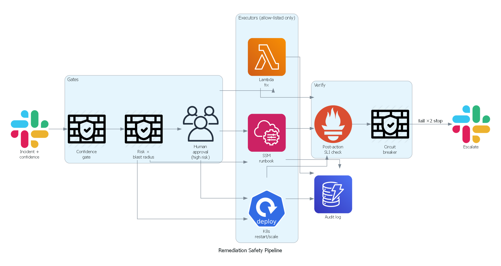
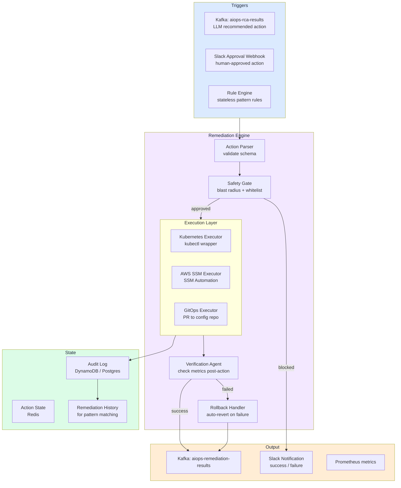

# Chapter 12 — Automated Remediation

> **Automated remediation is the action-execution layer that closes the incident-handling loop. It turns RCA diagnoses and LLM recommendations into safe, auditable, and reversible actions on production infrastructure. The core engineering challenge is not "can we automate this?" but "how do we automate safely without making the incident worse?".**

---

## Prerequisites

- [09 — Root Cause Analysis](../10-root-cause-analysis/README.md) — produces remediation trigger signals; **wrong RCA → wrong action**
- [10 — LLM Agent](../11-llm-agent/README.md) — proposes actions; **never freeform shell**
- [06 — Kafka](../07-kafka/README.md) — transport layer for trigger signals and remediation results

## Related Documents

- [03 — Prometheus](../03-prometheus/README.md) — verify remediation outcomes via metrics (verification loop)
- [12 — Production Operations](../13-production/README.md) — runbook, GitOps, chaos, change freeze
- [14 — E-commerce & Banking](../15-ecommerce-banking/README.md) — dual-control, audit log for regulators
- [15 — Famous Incidents](../16-famous-incidents/README.md) — S3, thundering herd, cascade failure lessons

## Next Reading

After this chapter, continue to [12 — Production Operations](../13-production/README.md), then [14 — E-commerce & Banking](../15-ecommerce-banking/README.md) and [15 — Famous Incidents](../16-famous-incidents/README.md).

---

## Table of Contents

1. [Why Automated Remediation?](#1-why-automated-remediation)
2. [Remediation Architecture](#2-remediation-architecture)
3. [Remediation Action Catalog](#3-remediation-action-catalog)
4. [Kubernetes-Based Remediation](#4-kubernetes-based-remediation)
5. [AWS SSM Automation](#5-aws-ssm-automation)
6. [Safety Framework](#6-safety-framework)
7. [Blast Radius Calculation](#7-blast-radius-calculation)
8. [Rollback Design](#8-rollback-design)
9. [Canary-Based Remediation](#9-canary-based-remediation)
10. [GitOps Remediation](#10-gitops-remediation)
11. [Verification Pipeline](#11-verification-pipeline)
12. [Audit Logging](#12-audit-logging)
13. [Production Configuration](#13-production-configuration)
14. [Common Mistakes](#14-common-mistakes)
15. [Monitoring Remediation](#15-monitoring-remediation)
16. [Scaling](#16-scaling)
17. [Security](#17-security)
18. [Cost](#18-cost)
19. [Risk Decision Matrix](#19-risk-decision-matrix)
20. [Circuit Breakers, Rate Limits & Dual-Control](#20-circuit-breakers-rate-limits--dual-control)
21. [Runbook-as-Code vs LLM Freeform](#21-runbook-as-code-vs-llm-freeform)
22. [Human Approval UX (On-Call 3am)](#22-human-approval-ux-on-call-3am)
23. [Edge Cases: Retry Storms & Wrong RCA](#23-edge-cases-retry-storms--wrong-rca)
24. [Chaos Testing of Remediation](#24-chaos-testing-of-remediation)
25. [Case Studies — Famous Incidents](#25-case-studies--famous-incidents)
26. [Production Checklist (40+)](#26-production-checklist-40)
27. [Production Review](#27-production-review)

---


## How to read this chapter (concept-first)

> [!IMPORTANT]
> **Concepts first — code second**
> From chapter 08 onward, prefer: **problem → idea → input data → algorithm/model → output → pros/cons → when to use**. Implementation lives under **See the code below** (click to expand). Goal: understand *why it works on AIOps telemetry*, not only copy-paste snippets.

| Step | Question |
|------|----------|
| 1. Problem | What pain does this solve (noise, cascade, MTTR…)? |
| 2. Idea | 2–3 sentence intuition, no formulas |
| 3. Data in | Which metrics/logs/traces/events, windows, features? |
| 4. Algorithm | Computation steps / model flow |
| 5. Output | Event schema, score, rank, action proposal? |
| 6. Trade-offs | Pros / cons / cost / explainability |
| 7. When | When to use — and when **not** to |

---

## 1. Why Automated Remediation?



*Poster: confidence / risk gates → allow-listed executors → verify + circuit breaker + audit.*

### MTTR Economics

```
Manual MTTR (typical): 45-90 minutes
Automated MTTR (typical): 3-10 minutes
Impact: 10–15× faster

Downtime cost (mid-size e-commerce): $5,000/minute
Monthly incidents (P1/P2): ~20

Manual: 20 × 60 minutes × $5,000 = $6,000,000/month
Automated: 20 × 5 minutes × $5,000 = $500,000/month
Savings: $5,500,000/month (theoretical maximum)

Realistic (30% of incidents auto-remediable): Savings $1,650,000/month
```

> [!NOTE]
> **KEY IDEA — MTTR ≠ risk**
> Cutting MTTR with automation only has value when **mistakes are also bounded**. A wrong action in 3 seconds can cost more than 90 minutes of manual investigation. Always measure in parallel: *success rate*, *rollback rate*, *blast radius realized*, not only *time-to-action*.

### The Automation Paradox & Ironies of Automation (Bainbridge)

The more you automate, the larger the latent risk:

```
No automation: Humans can err, but understand action consequences
With automation:     Faster execution, but failures also propagate faster
                     Problem: "Auto-remediation thundering herd":
                     All 50 services restart at once, making the incident worse
```

**Lisanne Bainbridge (1983) — *Ironies of Automation*** still applies to AIOps remediation:

| Irony | Operational meaning | Implication for remediation |
|-------|------------------|------------------------|
| Irony 1 | Automation takes “easy” work, leaves hard work for humans | 3am on-call must approve rare, complex actions with little “muscle memory” |
| Irony 2 | Humans are poor long-term passive monitors | Green dashboard ≠ safe; need active verification loop |
| Irony 3 | When automation fails, operator skill has atrophied | Runbook-as-code + mandatory drills; not only LLM suggestions |
| Irony 4 | Automation hides system state | Every action must emit audit + metric + “why this action” |

```
Automation level ↑
  ├─ On-call skill ↓ (less hands-on practice)
  ├─ Error speed ↑ (machines do not “hesitate”)
  ├─ Dependence on RCA/LLM correctness ↑
  └─ Cost of one false-positive action ↑↑
```

> [!WARNING]
> **Core paradox**
> The “smartest” remediation systems often **refuse actions** the most. Auto-remediating 100% of alerts is an anti-pattern. Production goal: *high confidence subset* + *fail-closed gates*.

> [!TIP]
> **Design principles**
> 1) Start with 100% reversible + narrow whitelist. 2) Measure rollback rate 30–90 days. 3) Only expand tier when rollback < threshold (e.g. <5%) **and** no SEV-1 caused by remediation. 4) Dual-control for every action that is “not fully reversible”.

**Principle**: Automate carefully. Start with 100% safe actions (read-only + reversible). Only add riskier actions after many months of successful validation. Decision matrix details: [§19 Risk Decision Matrix](#19-risk-decision-matrix).

### Decision Mindset (before clicking “Execute”)

```
1. How long to reverse?  2. Blast radius if wrong?
3. Confidence + independent evidence?  4. Compliance / freeze / dual-control?
5. Know how fix works (metric, window, metastable)?
6. Retry storm / capacity cliff risk?
```

Cross-link: [09 — RCA](../10-root-cause-analysis/README.md) · [10 — LLM](../11-llm-agent/README.md) · [15 — Incidents](../16-famous-incidents/README.md).

---

## 2. Remediation Architecture



> [!NOTE]
> **KEY IDEA — Safety Gate before Execution**
> Every path (Kafka RCA, Slack approve, Rule Engine) **must** pass `PARSE → GATE`. No silent “emergency bypass” in the production code path. Bypass (if any) needs dual-control + separate audit event + time-box.

> [!TIP]
> **Separated state**
> `Action State` (Redis) serves idempotency + per-service advisory lock. `Audit Log` (DynamoDB/Postgres append-only) serves regulators. Do not mix concerns: Redis can be lost; audit **must not** be lost.

---

## 3. Remediation Action Catalog

### Tier 1: Fully automatic (No approval required)

These actions are safe, reversible, and low risk:

| Action | Failure Mode | Max blast radius |
|--------|-------------|-----------------|
| Scale deployment replicas up | resource exhaustion, traffic spike | 1 service |
| Increase env vars (pool size, cache size) | connection pool exhaustion | 1 service, rolling restart |
| Rolling restart pods | memory leak, zombie process | 1 service, one pod at a time |
| Force GC (JVM services via JMX) | memory pressure | 1 pod |
| Flush app cache (via API) | stale cache data bugs | 1 service |
| Open circuit breaker (open → half-open) | stop cascading failure | 1 service |

### Tier 2: Requires human approval (Approval time < 5 minutes)

| Action | Failure Mode | Risk |
|--------|-------------|------|
| Rollback deployment to previous version | regression in deployment | Medium — lose new features |
| Scale deployment replicas down | wasted spare capacity | Medium — may cause under-capacity |
| Change HPA min/max replicas | longer-term load change | Medium |
| Toggle feature flag | bug from new feature | Medium |
| Drain Kubernetes node | node-level hardware fault | Medium — disrupts workload |
| Upgrade RDS instance class | database bottleneck | High — short service disruption |

### Tier 3: Requires change-management process (Hours/Days)

| Action | Failure Mode | Risk |
|--------|-------------|------|
| Run database schema migration | data structure fault | High |
| Change network policy | security misconfiguration | High |
| Change IAM role | permission fault | Critical |
| Upgrade cluster version | compatibility fault | Critical |

> [!IMPORTANT]
> **Only auto scale UP; scale DOWN needs a human**
> Scaling down when traffic “goes quiet” after a spike often creates a capacity cliff when traffic returns — classic pattern (see [§23](#23-edge-cases-retry-storms--wrong-rca) and S3-style capacity-removal lessons). Tier 1 does **not** include scale down.

> [!TIP]
> **Map tier → executor**
> Tier 1 → K8s/SSM executor + verification. Tier 2 → Slack/PagerDuty dual-control (or single approve + canary). Tier 3 → GitOps PR + change ticket ([§10](#10-gitops-remediation), [12 — Production](../13-production/README.md)).

### Mapping action → failure mode (decision thinking)

| Action | “Right but harmful” when… | Verify after action |
|--------|----------------------|-------------------|
| Scale up | Upstream DB/CPU saturated | error_rate↓ **and** DB CPU does not spike |
| Rolling restart | Leak → restart storm | restart_count stable 15–30m |
| Flush cache | Herd to origin | origin RPS + error_rate 5m |
| Open CB / rollback | Cut too early or version-coupled flag | dependency + business SLI |

---

## 4. Kubernetes-Based Remediation

### Kubernetes Remediation Executor

<details>
<summary><strong>See the code below — click to expand (read concepts first)</strong></summary>

```python
from kubernetes import client, config
from kubernetes.client.rest import ApiException
import time
import logging

logger = logging.getLogger(__name__)

class KubernetesRemediationExecutor:
    def __init__(
        self,
        kubeconfig_path: str = None,  # None = use in-cluster config
        dry_run: bool = False,
    ):
        if kubeconfig_path:
            config.load_kube_config(kubeconfig_path)
        else:
            config.load_incluster_config()
        
        self.apps_v1 = client.AppsV1Api()
        self.core_v1 = client.CoreV1Api()
        self.autoscaling_v2 = client.AutoscalingV2Api()
        self.dry_run = dry_run
        
    # ===== Scale Deployment =====
    def scale_deployment(
        self,
        name: str,
        namespace: str,
        replicas: int,
        max_replicas: int = 20,
    ) -> dict:
        """
        Scale a deployment to the target replica count.
        Safe: hard-cap at max_replicas.
        """
        replicas = min(replicas, max_replicas)
        
        # Read current state (for rollback)
        current = self.apps_v1.read_namespaced_deployment(name, namespace)
        original_replicas = current.spec.replicas
        
        if self.dry_run:
            return {
                "action": "scale_deployment",
                "dry_run": True,
                "would_change": f"{original_replicas} → {replicas}",
            }
        
        # Apply scale change
        patch = {"spec": {"replicas": replicas}}
        self.apps_v1.patch_namespaced_deployment(
            name=name,
            namespace=namespace,
            body=patch,
        )
        
        logger.info(f"Scaled {namespace}/{name}: {original_replicas} → {replicas}")
        
        return {
            "action": "scale_deployment",
            "service": f"{namespace}/{name}",
            "original_replicas": original_replicas,
            "new_replicas": replicas,
            "rollback": lambda: self.scale_deployment(name, namespace, original_replicas),
        }
    
    # ===== Update Environment Variable =====
    def set_env_var(
        self,
        deployment_name: str,
        namespace: str,
        env_var_name: str,
        env_var_value: str,
        allowed_vars: list = None,
    ) -> dict:
        """
        Set an environment variable on a deployment.
        A rolling restart will be triggered automatically afterward.
        """
        # Check whitelist
        if allowed_vars and env_var_name not in allowed_vars:
            raise ValueError(f"Env var '{env_var_name}' not in allowed list")
        
        # Read current value for rollback
        deployment = self.apps_v1.read_namespaced_deployment(deployment_name, namespace)
        containers = deployment.spec.template.spec.containers
        
        original_value = None
        for container in containers:
            for env in (container.env or []):
                if env.name == env_var_name:
                    original_value = env.value
                    break
        
        if self.dry_run:
            return {
                "action": "set_env_var",
                "dry_run": True,
                "env_var": env_var_name,
                "current": original_value,
                "new": env_var_value,
            }
        
        # Build patch structure
        patch = {
            "spec": {
                "template": {
                    "spec": {
                        "containers": [
                            {
                                "name": containers[0].name,
                                "env": [{"name": env_var_name, "value": str(env_var_value)}],
                            }
                        ]
                    }
                }
            }
        }
        
        self.apps_v1.patch_namespaced_deployment(
            name=deployment_name,
            namespace=namespace,
            body=patch,
        )
        
        logger.info(f"Updated {namespace}/{deployment_name}: {env_var_name}={env_var_value}")
        
        return {
            "action": "set_env_var",
            "service": f"{namespace}/{deployment_name}",
            "env_var": env_var_name,
            "original_value": original_value,
            "new_value": env_var_value,
            "rollback": lambda: self.set_env_var(
                deployment_name, namespace, env_var_name,
                original_value or "", allowed_vars
            ),
        }
    
    # ===== Rolling Restart =====
    def rolling_restart(self, deployment_name: str, namespace: str) -> dict:
        """
        Trigger a rolling restart by updating an annotation.
        Kubernetes will restart pods one by one sequentially.
        """
        if self.dry_run:
            return {"action": "rolling_restart", "dry_run": True}
        
        # Add restart annotation (standard k8s technique)
        patch = {
            "spec": {
                "template": {
                    "metadata": {
                        "annotations": {
                            "kubectl.kubernetes.io/restartedAt": time.strftime("%Y-%m-%dT%H:%M:%SZ")
                        }
                    }
                }
            }
        }
        
        self.apps_v1.patch_namespaced_deployment(
            name=deployment_name,
            namespace=namespace,
            body=patch,
        )
        
        logger.info(f"Rolling restart triggered: {namespace}/{deployment_name}")
        
        return {
            "action": "rolling_restart",
            "service": f"{namespace}/{deployment_name}",
            "rollback": None,  # Rolling restart is not easily reversible
        }
    
    # ===== Rollback Deployment =====
    def rollback_deployment(
        self,
        deployment_name: str,
        namespace: str,
        revision: int = 0,  # 0 = immediately previous revision
    ) -> dict:
        """
        Roll back to the previous deployment revision.
        Requires human approval before execution.
        """
        if self.dry_run:
            return {"action": "rollback_deployment", "dry_run": True}
        
        # Use kubectl rollout undo via subprocess (cleaner than calling API directly)
        import subprocess
        
        cmd = [
            "kubectl", "rollout", "undo",
            f"deployment/{deployment_name}",
            "-n", namespace,
        ]
        if revision > 0:
            cmd.extend([f"--to-revision={revision}"])
        
        result = subprocess.run(cmd, capture_output=True, text=True, timeout=60)
        
        if result.returncode != 0:
            raise RuntimeError(f"Rollback failed: {result.stderr}")
        
        logger.warning(f"ROLLBACK executed: {namespace}/{deployment_name}")
        
        return {
            "action": "rollback_deployment",
            "service": f"{namespace}/{deployment_name}",
            "revision": revision,
            "output": result.stdout,
        }
    
    # ===== Wait for Rollout =====
    def wait_for_rollout(
        self,
        deployment_name: str,
        namespace: str,
        timeout_seconds: int = 300,
    ) -> bool:
        """
        Wait for the deployment rollout to complete.
        Return True on success, False on timeout.
        """
        deadline = time.time() + timeout_seconds
        
        while time.time() < deadline:
            deployment = self.apps_v1.read_namespaced_deployment(deployment_name, namespace)
            status = deployment.status
            
            if (status.updated_replicas == status.replicas and
                status.available_replicas == status.replicas and
                status.unavailable_replicas in (None, 0)):
                return True
            
            logger.info(
                f"Waiting for {namespace}/{deployment_name}: "
                f"updated={status.updated_replicas}/{status.replicas}, "
                f"available={status.available_replicas}/{status.replicas}"
            )
            time.sleep(10)
        
        return False  # Timed out
```

</details>

> [!WARNING]
> **No freeform `subprocess` shell from the LLM**
> The `kubectl rollout undo` example above is a **fixed command in code**, with validated params (name/namespace/revision). The LLM may only choose `action_type` + schema params — never arbitrary shell strings. See [§21 Runbook-as-Code](#21-runbook-as-code-vs-llm-freeform).

> [!TIP]
> **Idempotency**
> Calling `scale_deployment` twice with the same `replicas` must be safe. Persist `execution_id` / `idempotency_key` from the incident before patching the API.

---

## 5. AWS SSM Automation

For resources not on Kubernetes (RDS, ElastiCache, EC2), use AWS SSM Automation:

<details>
<summary><strong>See the code below — click to expand (read concepts first)</strong></summary>

```python
import boto3
import time
import logging

logger = logging.getLogger(__name__)

class SSMRemediationExecutor:
    def __init__(self, region: str = "us-east-1"):
        self.ssm = boto3.client("ssm", region_name=region)
        self.rds = boto3.client("rds", region_name=region)
        self.ec2 = boto3.client("ec2", region_name=region)

    def run_ssm_document(
        self,
        document_name: str,
        target_instances: list,
        parameters: dict,
        timeout_seconds: int = 300,
    ) -> dict:
        """
        Execute an SSM Automation document.
        """
        response = self.ssm.start_automation_execution(
            DocumentName=document_name,
            DocumentVersion="$LATEST",
            Parameters=parameters,
            Tags=[
                {"Key": "triggered_by", "Value": "aiops-remediation"},
                {"Key": "timestamp", "Value": str(time.time())},
            ],
        )
        
        execution_id = response["AutomationExecutionId"]
        
        # Wait until complete
        deadline = time.time() + timeout_seconds
        while time.time() < deadline:
            status = self.ssm.get_automation_execution(
                AutomationExecutionId=execution_id
            )["AutomationExecution"]["AutomationExecutionStatus"]
            
            if status == "Success":
                return {"status": "success", "execution_id": execution_id}
            elif status in ("Failed", "Cancelled", "TimedOut"):
                return {"status": "failed", "execution_id": execution_id, "error": status}
            
            time.sleep(10)
        
        return {"status": "timeout", "execution_id": execution_id}

    def reboot_rds_instance(
        self,
        db_instance_identifier: str,
        force_failover: bool = False,
    ) -> dict:
        """
        Reboot an RDS instance (e.g. to clear connection locks).
        force_failover=True: fail over to standby (Multi-AZ, ~60s downtime)
        force_failover=False: in-place reboot (~5 minutes downtime)
        """
        logger.warning(f"Rebooting RDS instance: {db_instance_identifier} (failover={force_failover})")
        
        response = self.rds.reboot_db_instance(
            DBInstanceIdentifier=db_instance_identifier,
            ForceFailover=force_failover,
        )
        
        return {
            "action": "reboot_rds",
            "instance": db_instance_identifier,
            "failover": force_failover,
            "status": response["DBInstance"]["DBInstanceStatus"],
        }

    def modify_rds_parameter_group(
        self,
        parameter_group_name: str,
        parameters: list,
    ) -> dict:
        """
        Modify an RDS parameter group (e.g. raise max_connections).
        Note: Some parameters require an instance reboot to take effect.
        """
        response = self.rds.modify_db_parameter_group(
            DBParameterGroupName=parameter_group_name,
            Parameters=parameters,
        )
        
        return {
            "action": "modify_rds_parameter_group",
            "parameter_group": parameter_group_name,
            "parameters_modified": [p["ParameterName"] for p in parameters],
            "response": response["DBParameterGroupName"],
        }


# Predefined SSM Automation documents for common tasks

CUSTOM_SSM_DOCUMENTS = {
    "aiops-restart-ecs-service": {
        "description": "Restart an ECS service by forcing new deployment",
        "parameters": {
            "ClusterName": {"type": "String"},
            "ServiceName": {"type": "String"},
        },
        "mainSteps": [
            {
                "name": "ForceNewDeployment",
                "action": "aws:executeAwsApi",
                "inputs": {
                    "Service": "ecs",
                    "Api": "UpdateService",
                    "Cluster": "{{ClusterName}}",
                    "Service": "{{ServiceName}}",
                    "ForceNewDeployment": True,
                },
            }
        ],
    },
    "aiops-flush-elasticache": {
        "description": "Flush an ElastiCache cluster (Redis FLUSHALL)",
        "parameters": {
            "ClusterEndpoint": {"type": "String"},
            "Port": {"type": "String", "default": "6379"},
        },
        "mainSteps": [
            {
                "name": "FlushCache",
                "action": "aws:runCommand",
                "inputs": {
                    "DocumentName": "AWS-RunShellScript",
                    "Parameters": {
                        "commands": [
                            "redis-cli -h {{ClusterEndpoint}} -p {{Port}} FLUSHALL ASYNC"
                        ]
                    },
                },
            }
        ],
    },
}
```

</details>

> [!CAUTION]
> **SSM `AWS-RunShellScript` is a double-edged sword**
> Document `aiops-flush-elasticache` is only safe if parameters are whitelisted + dual-control. **Forbid** LLM-supplied arbitrary `commands[]`. Banking/PCI: prefer managed APIs (ElastiCache API) over shell on bastion — [14 — Banking](../15-ecommerce-banking/README.md).

---

## 6. Safety Framework

Safety is the product surface of remediation — not a helper library. Every path (Kafka RCA, Slack approve, rule engine) must pass the same gate composition.

### Problem / idea

| | |
|--|--|
| **Problem** | Fast wrong actions beat slow right ones on outage cost. Auto-remediation without gates creates **AIOps-caused SEVs** (thundering herd restarts, capacity cliffs). |
| **Idea** | Compose independent checks: namespace protect, confidence floor, rate limit, action whitelist, pre-health, blast radius, freeze/compliance, dual-control — **fail closed** on unknown. |

Cross-link: automation paradox in [§1](#1-why-automated-remediation); risk matrix [§19](#19-risk-decision-matrix).

### Inputs from the AIOps data plane

| Input | Source | Role |
|-------|--------|------|
| Action intent | LLM/RCA/rule | `action_type`, params, service |
| Confidence + evidence_quality | Ch10/11 | Soft gate (not sole) |
| Open incident / locks | Redis | Per-service advisory lock |
| Freeze / change calendar | Policy plane | Hard block |
| Recent remediation history | Audit store | Rate limits, flip-flop detect |

### How it works (steps)

```
1. Parse + JSON Schema validate against catalog (reject freeform)
2. Run SafetyCheck chain; any blocks_on_failure → deny + notify
3. Map risk tier → AUTO | APPROVAL | BLOCK
4. Acquire per-service lock; enforce global/per-action rate limits
5. If pass → executor; always write audit event (allow or deny)
```

### Output / what on-call sees

```
GATE DENY · confidence 0.62 < 0.75
GATE DENY · action scale_down not whitelist Tier1
GATE ALLOW · Tier1 rolling_restart · lock acquired · audit#…
```

Deny reasons must be human-readable at 3am.

### Pros / cons + when

| Pros | Cons |
|------|------|
| Prevents most catastrophic automation | Over-tight gates reduce auto-MTTR benefit |
| Auditable decisions | Misconfigured whitelist = silent no-ops or holes |
| Same path for human and machine | Must be HA — gate down should not fail open |

| Use when | Do **not** |
|----------|------------|
| Always, no production bypass in code | “Emergency bypass” flag in hot path without dual-control |
| Before any mutate | Trust model confidence alone without whitelist |

<details>
<summary><strong>See the code below — click to expand (read concepts first)</strong></summary>

```python
from dataclasses import dataclass
from typing import Callable, List, Optional
from enum import Enum
import time

class ActionRisk(Enum):
    LOW = 1      # Fully automatic execution
    MEDIUM = 2   # Requires approval
    HIGH = 3     # Requires change-management process
    BLOCKED = 4  # Never automate

@dataclass
class SafetyCheck:
    name: str
    check: Callable[[dict], tuple]  # (bool passed, str reason)
    blocks_on_failure: bool = True

@dataclass
class RemediationAction:
    action_type: str
    service: str
    namespace: str
    parameters: dict
    requested_by: str        # "llm-agent" or "human:{slack_user}"
    incident_id: str
    confidence: float        # From LLM/RCA (0.0 - 1.0)
    auto_approved: bool = False

class SafetyFramework:
    def __init__(
        self,
        max_actions_per_hour: int = 10,
        max_services_per_action: int = 1,
        blocked_namespaces: list = None,
    ):
        self.max_actions_per_hour = max_actions_per_hour
        self.blocked_namespaces = blocked_namespaces or ["kube-system", "kube-public", "monitoring"]
        self.action_history = []  # Recent action history for rate limiting

    def _check_namespace(self, action: RemediationAction) -> tuple:
        if action.namespace in self.blocked_namespaces:
            return False, f"Namespace '{action.namespace}' is protected"
        return True, "ok"

    def _check_confidence(self, action: RemediationAction) -> tuple:
        if action.confidence < 0.75:
            return False, f"Confidence too low: {action.confidence:.0%} (minimum required: 75%)"
        return True, "ok"

    def _check_rate_limit(self, action: RemediationAction) -> tuple:
        current_hour_actions = [
            a for a in self.action_history
            if time.time() - a["timestamp"] < 3600
        ]
        if len(current_hour_actions) >= self.max_actions_per_hour:
            return False, f"Rate limit hit: {self.max_actions_per_hour} actions/hour"
        return True, "ok"

    def _check_action_whitelist(self, action: RemediationAction) -> tuple:
        TIER1_WHITELIST = {
            "scale_deployment_up",
            "set_env_var_approved",
            "rolling_restart",
            "toggle_circuit_breaker",
        }
        TIER2_REQUIRE_APPROVAL = {
            "rollback_deployment",
            "scale_deployment_down",
            "update_hpa",
            "drain_node",
        }
        
        if action.action_type in TIER1_WHITELIST:
            return True, "ok"
        elif action.action_type in TIER2_REQUIRE_APPROVAL and action.auto_approved:
            return True, "human_approved"
        elif action.action_type in TIER2_REQUIRE_APPROVAL:
            return False, f"Action '{action.action_type}' requires human approval"
        else:
            return False, f"Action '{action.action_type}' is not on the whitelist"

    def _check_service_health_before(self, action: RemediationAction) -> tuple:
        """
        Do not auto-remediate if the service is fully down.
        Auto-handling then can make things worse. Require human intervention.
        """
        # Query Prometheus for service health
        error_rate = query_current_metric(
            f'rate(http_requests_total{{service="{action.service}",status=~"5.."}}[5m])'
            f' / rate(http_requests_total{{service="{action.service}"}}[5m])'
        )
        
        if error_rate is not None and error_rate > 0.99:
            return False, "Service error rate >99% — too degraded for auto-remediation"
        
        return True, "ok"

    def evaluate(self, action: RemediationAction) -> tuple:
        """
        Run all safety checks. Return (approved: bool, reason: str).
        """
        checks = [
            self._check_namespace(action),
            self._check_confidence(action),
            self._check_rate_limit(action),
            self._check_action_whitelist(action),
            self._check_service_health_before(action),
        ]
        
        for passed, reason in checks:
            if not passed:
                return False, reason
        
        # All safety checks passed
        self.action_history.append({
            "action": action.action_type,
            "service": action.service,
            "timestamp": time.time(),
        })
        
        return True, "approved"
```

</details>

> [!NOTE]
> **KEY IDEA — Safety is composition, not a single if**
> Namespace deny-list, confidence floor, rate limit, whitelist tier, pre-health check are **AND**. One check fails → fail-closed. Extensions: change-freeze calendar, dual-control, remediation circuit breaker, service advisory lock — see [§20](#20-circuit-breakers-rate-limits--dual-control).

> [!WARNING]
> **LLM confidence is not a physical probability**
> The 0.75 threshold is only policy. Combining evidence score from [09 — RCA](../10-root-cause-analysis/README.md) (multi-signal) matters more than one model float. Wrong RCA + high confidence = fast accident.

### Advisory lock & concurrent incidents

<details>
<summary><strong>See the code below — click to expand (read concepts first)</strong></summary>

```python
import redis

class ServiceActionLock:
    """Only 1 remediation / service at a time (Redis SET NX + TTL)."""
    def __init__(self, redis_url: str, ttl_seconds: int = 600):
        self.r = redis.from_url(redis_url)
        self.ttl = ttl_seconds

    def acquire(self, service: str, execution_id: str) -> bool:
        return bool(self.r.set(
            f"remediation:lock:{service}", execution_id, nx=True, ex=self.ttl,
        ))

    def release(self, service: str, execution_id: str) -> None:
        # Production: compare-and-delete (Lua/WATCH) — only owner may release
        if self.r.get(f"remediation:lock:{service}") == execution_id.encode():
            self.r.delete(f"remediation:lock:{service}")
```

</details>

---

## 7. Blast Radius Calculation

Before executing any remediation action, calculate its blast radius:

<details>
<summary><strong>See the code below — click to expand (read concepts first)</strong></summary>

```python
import networkx as nx

def calculate_blast_radius(
    action: dict,
    dependency_graph: nx.DiGraph,
    current_traffic: dict,
) -> dict:
    """
    Estimate worst-case impact if remediation interrupts/restarts the service.
    """
    service = action.get("service")
    
    if service not in dependency_graph:
        return {"blast_radius": "unknown", "affected_users": 0}
    
    # Services depending on this service (upstream)
    upstream_dependents = list(nx.ancestors(dependency_graph, service))
    
    # Traffic through this service
    service_rps = current_traffic.get(service, {}).get("requests_per_second", 0)
    
    # Estimate users affected if service restarts for N seconds
    # Average rolling restart duration: 30-120 seconds
    restart_duration_seconds = 60  # Safe estimate
    affected_requests = service_rps * restart_duration_seconds
    
    # Estimate revenue impact (error rate × revenue per request)
    revenue_per_request = current_traffic.get(service, {}).get("revenue_per_request", 0)
    estimated_revenue_impact = affected_requests * revenue_per_request
    
    return {
        "service": service,
        "affected_upstream_services": upstream_dependents,
        "service_rps": service_rps,
        "restart_duration_seconds": restart_duration_seconds,
        "affected_requests": affected_requests,
        "estimated_revenue_impact_usd": estimated_revenue_impact,
        "blast_radius_score": len(upstream_dependents) / max(1, len(dependency_graph.nodes)),
        "recommendation": (
            "PROCEED" if len(upstream_dependents) < 5 and estimated_revenue_impact < 1000
            else "REQUIRE_APPROVAL" if len(upstream_dependents) < 10
            else "DO_NOT_AUTO_REMEDIATE"
        ),
    }
```

</details>

> [!TIP]
> **Blast radius ≠ graph topology only**
> Add: canary traffic %, dependency fan-out, shared DB/queue, multi-tenant blast, regulatory blast (PII path). Banking: actions touching core-ledger always `DO_NOT_AUTO_REMEDIATE` regardless of graph score — [14 — Banking](../15-ecommerce-banking/README.md).

---

## 8. Rollback Design

Every automated remediation action must ship with a clearly defined rollback plan:

<details>
<summary><strong>See the code below — click to expand (read concepts first)</strong></summary>

```python
from dataclasses import dataclass, field
from typing import Callable, Optional
import uuid
import time
import logging

logger = logging.getLogger(__name__)

@dataclass
class RemediationExecution:
    execution_id: str = field(default_factory=lambda: str(uuid.uuid4()))
    action: RemediationAction = None
    status: str = "pending"          # pending | executing | success | failed | rolled_back
    result: dict = field(default_factory=dict)
    rollback_fn: Optional[Callable] = None
    started_at: float = field(default_factory=time.time)
    completed_at: Optional[float] = None
    
    def execute(self, executor) -> bool:
        """Execute the action and capture the rollback plan."""
        self.status = "executing"
        
        try:
            result = executor.execute(self.action)
            self.result = result
            self.rollback_fn = result.get("rollback")
            self.status = "success"
            self.completed_at = time.time()
            return True
        except Exception as e:
            self.result = {"error": str(e)}
            self.status = "failed"
            self.completed_at = time.time()
            return False
    
    def rollback(self) -> bool:
        """Perform rollback if a plan is available."""
        if self.rollback_fn is None:
            logger.warning(f"No rollback available for execution {self.execution_id}")
            return False
        
        try:
            self.rollback_fn()
            self.status = "rolled_back"
            logger.info(f"Rolled back execution {self.execution_id}")
            return True
        except Exception as e:
            logger.error(f"Rollback failed for {self.execution_id}: {e}")
            return False


class RollbackMonitor:
    """
    Watch remediation execution results and auto-rollback if metrics do not improve.
    """
    def __init__(
        self,
        verification_window_seconds: int = 120,   # Wait 2 minutes to observe improvement
        auto_rollback_on_failure: bool = True,
    ):
        self.window = verification_window_seconds
        self.auto_rollback = auto_rollback_on_failure
    
    async def monitor_and_verify(
        self,
        execution: RemediationExecution,
        expected_improvements: dict,
    ) -> bool:
        """
        Monitor the service after executing the action.
        expected_improvements: {metric_name: {"direction": "decrease", "threshold": 0.05}}
        
        Return True if the action succeeded (metrics improved as expected).
        """
        logger.info(f"Monitoring execution {execution.execution_id} for {self.window}s")
        
        # Wait for action to take effect (rolling restart ~60s)
        await asyncio.sleep(30)
        
        improvement_confirmed = await self._check_metric_improvements(
            execution.action.service,
            expected_improvements,
        )
        
        if improvement_confirmed:
            logger.info(f"Execution {execution.execution_id} verified successful")
            return True
        
        if self.auto_rollback and execution.rollback_fn:
            logger.warning(
                f"Execution {execution.execution_id} did not improve metrics. "
                f"Auto-rolling back."
            )
            success = execution.rollback()
            
            # Notify on-call engineer
            await notify_slack(
                f"⚠️ Auto-remediation for {execution.action.service} did not improve metrics. "
                f"Rolled back automatically. Manual investigation required."
            )
            
            return False
        
        return False
    
    async def _check_metric_improvements(
        self,
        service: str,
        expected: dict,
    ) -> bool:
        """
        Check whether service metrics improved as expected after remediation.
        """
        improvements_seen = 0
        total_checks = len(expected)
        
        for metric_name, spec in expected.items():
            current_value = await query_current_metric_async(
                f'{metric_name}{{service="{service}"}}'
            )
            
            if current_value is None:
                continue
            
            if spec["direction"] == "decrease" and current_value <= spec["threshold"]:
                improvements_seen += 1
            elif spec["direction"] == "increase" and current_value >= spec["threshold"]:
                improvements_seen += 1
        
        # Require at least 60% of metrics to improve
        return improvements_seen / total_checks >= 0.6 if total_checks > 0 else False
```

</details>

> [!IMPORTANT]
> **Rollback is also a dangerous action**
> Auto-rollback while metrics are still unstable (cold start, deploy lag) can create flip-flops. Need: min wait, hysteresis, max_auto_rollback_per_incident=1, then escalate to humans.

---

## 9. Canary-Based Remediation

For higher-risk remediation actions, trial on a small cohort first. Canary is how you keep Tier1 automation from becoming a cluster-wide outage amplifier.

### Problem / idea

| | |
|--|--|
| **Problem** | Scaling all replicas or flipping env on 100% of pods can saturate a shared DB or trigger a retry storm before you notice. |
| **Idea** | Apply change to 1–10% (or 1 pod), **verify SLIs**, abort+rollback on red, only then ramp — progressive delivery for remediation, not only for deploys. |

### Inputs from the AIOps data plane

| Input | Source | Role |
|-------|--------|------|
| Action + deployment target | Catalog executor | What to mutate |
| Canary fraction / wait | Policy | Scope and soak |
| Error rate / latency / saturation | Prometheus | Abort criteria |
| Business KPI (optional) | Product metrics | Catch silent drop |

### How it works (steps)

```
1. Snapshot pre-metrics
2. Apply to canary cohort (Argo Rollouts / pod subset / flag)
3. Wait verification_seconds (effect lag)
4. If SLI fail → rollback canary; status=canary_failed; page
5. Else ramp 25% → 50% → 100% with abort criteria each step
6. Soak; emit audit + metrics
```

### Output / what on-call sees

`canary_verified=true` with phase timeline, or `canary_failed` + auto-rollback once + freeze further auto for service N minutes.

### Pros / cons + when

| Pros | Cons |
|------|------|
| Bounds blast of wrong action | Slower than big-bang fix |
| Builds trust for more Tier1 | Bad abort metrics cause false aborts or blind ramps |
| Works with progressive delivery tooling | Not all actions are canary-able (DNS, global config) |

| Use when | Do **not** skip when |
|----------|----------------------|
| Scale, env, rollout-affecting mutates | “I’m sure” + 100% blast on shared dependency |
| After any LLM-proposed change | Action is already dual-control Tier3 (use change mgmt) |

<details>
<summary><strong>See the code below — click to expand (read concepts first)</strong></summary>

```python
import asyncio
import logging

logger = logging.getLogger(__name__)

class CanaryRemediationExecutor:
    def __init__(
        self,
        k8s_executor: KubernetesRemediationExecutor,
        canary_fraction: float = 0.1,  # Trial on 10% of pods first
        verification_seconds: int = 120,
    ):
        self.k8s = k8s_executor
        self.canary_fraction = canary_fraction
        self.verification = verification_seconds
    
    async def execute_with_canary(
        self,
        action: str,
        deployment_name: str,
        namespace: str,
        parameters: dict,
    ) -> dict:
        """
        Apply the change to canary pods first, verify, then roll out to all pods.
        """
        # Read current deployment
        deployment = self.k8s.apps_v1.read_namespaced_deployment(deployment_name, namespace)
        total_replicas = deployment.spec.replicas
        canary_replicas = max(1, int(total_replicas * self.canary_fraction))
        
        logger.info(
            f"Canary remediation: {deployment_name} "
            f"({canary_replicas}/{total_replicas} pods first)"
        )
        
        # Phase 1: Apply change to canary group (simplified scenario here)
        # In real production: use standard canary tools (Argo Rollouts)
        canary_result = self.k8s.execute(action, parameters, dry_run=False)
        
        # Wait and verify canary health
        await asyncio.sleep(self.verification)
        canary_healthy = await self._verify_canary_health(deployment_name, namespace)
        
        if not canary_healthy:
            logger.warning(f"Canary failed for {deployment_name}. Aborting rollout.")
            canary_result.get("rollback", lambda: None)()
            return {"status": "canary_failed", "rolled_back": True}
        
        logger.info(f"Canary successful. Proceeding with full rollout for {deployment_name}")
        
        # Phase 2: Full rollout
        return {"status": "success", "canary_verified": True}
    
    async def _verify_canary_health(self, deployment_name: str, namespace: str) -> bool:
        """Check whether the canary pod group is healthy."""
        error_rate = await query_current_metric_async(
            f'rate(http_requests_total{{service="{deployment_name}",status=~"5.."}}[2m])'
            f' / rate(http_requests_total{{service="{deployment_name}"}}[2m])'
        )
        
        # If error rate rises above 10%, treat the trial as failed
        if error_rate is not None and error_rate > 0.10:
            return False
        
        return True
```

</details>

### Progressive rollout of remediation actions

Canarying one “pod group” is not enough — production should use **progressive + abort criteria**:

```
1% → wait → SLI OK? → 10% → 50% → 100% → longer soak
Abort if: error_rate↑, p99↑, bad saturation, business KPI↓
```

| Phase | Scope | Min wait | Who approves |
|-------|---------|----------|------------|
| Shadow / dry-run | 0% mutate | log only | auto |
| Canary | 1–10% | 2–5 minutes | auto Tier1 / human Tier2 |
| Ramp | 25–50% | 5–15 minutes | auto if canary green |
| Full + soak | 100% | 10 minutes–24 hours | auto + audit; page if regress |

> [!TIP]
> **Progressive ≠ traffic split only** — pool size 20→30→50; restart `maxUnavailable`; feature flags by % cohort.

> [!WARNING]
> **Metric-blind canary** — if canary gets no real traffic, verify is always “green”. Require `canary_rps > min_samples`.

---

## 10. GitOps Remediation

For configuration changes that must be tracked via code review:

<details>
<summary><strong>See the code below — click to expand (read concepts first)</strong></summary>

```python
import subprocess
import os
from pathlib import Path
import httpx

class GitOpsRemediationExecutor:
    """
    Create a Pull Request with the configuration change to remediate.
    This applies to Tier 2/3 actions that require change-history records.
    """
    def __init__(
        self,
        repo_url: str,
        base_branch: str = "main",
        github_token: str = None,
    ):
        self.repo_url = repo_url
        self.base_branch = base_branch
        self.github_token = github_token

    def create_remediation_pr(
        self,
        incident_id: str,
        service: str,
        file_path: str,           # Path of the file to modify in the repository
        change_description: str,
        original_content: str,
        new_content: str,
    ) -> dict:
        """
        Create a Git PR with the automated fix content.
        """
        branch_name = f"aiops/remediation-{incident_id}"
        
        # Clone repo to local disk
        repo_dir = f"/tmp/{incident_id}"
        subprocess.run(
            ["git", "clone", "--depth=1", self.repo_url, repo_dir],
            check=True,
            env={**os.environ, "GIT_ASKPASS": "echo", "GIT_TERMINAL_PROMPT": "0"},
        )
        
        # Create new branch
        subprocess.run(["git", "-C", repo_dir, "checkout", "-b", branch_name], check=True)
        
        # Overwrite file with new content
        target_file = Path(repo_dir) / file_path
        target_file.write_text(new_content)
        
        # Commit changes
        subprocess.run(["git", "-C", repo_dir, "add", file_path], check=True)
        subprocess.run(
            ["git", "-C", repo_dir, "commit", "-m",
             f"[AIOps] {change_description}\n\nIncident: {incident_id}\n"
             f"Service: {service}\nAuto-generated by AIOps Remediation Engine"],
            check=True,
            env={
                **os.environ,
                "GIT_AUTHOR_NAME": "AIOps Bot",
                "GIT_AUTHOR_EMAIL": "aiops@company.com",
                "GIT_COMMITTER_NAME": "AIOps Bot",
                "GIT_COMMITTER_EMAIL": "aiops@company.com",
            },
        )
        
        # Push branch to remote
        subprocess.run(
            ["git", "-C", repo_dir, "push", "origin", branch_name],
            check=True,
        )
        
        # Call GitHub API to create Pull Request
        pr_response = httpx.post(
            f"https://api.github.com/repos/{self.repo_url.split('github.com/')[1]}/pulls",
            headers={
                "Authorization": f"token {self.github_token}",
                "Accept": "application/vnd.github+json",
            },
            json={
                "title": f"[AIOps Remediation] {service}: {change_description}",
                "body": (
                    f"## AIOps Auto-Remediation PR\n\n"
                    f"**Incident**: {incident_id}\n"
                    f"**Service**: {service}\n"
                    f"**Change**: {change_description}\n\n"
                    f"This PR was created automatically by the AIOps Remediation Engine.\n"
                    f"Please review carefully and merge if the configuration is correct.\n\n"
                    f"**Auto-merge**: This PR will auto-merge after 30 minutes "
                    f"if no objections are recorded."
                ),
                "head": branch_name,
                "base": self.base_branch,
            },
        )
        
        return {
            "pr_url": pr_response.json().get("html_url"),
            "branch": branch_name,
            "status": "pr_created",
        }
```

</details>

---

## 11. Verification Pipeline

Execution without verification is **hope-driven ops**. The pipeline defines success metrics, waits for effect lag, and triggers rollback when the fix did not fix.

### Problem / idea

| | |
|--|--|
| **Problem** | Action returns HTTP 200 from the API while error_rate stays high (or recovers then metastable-fails 15m later). |
| **Idea** | Per-action verification recipes: metric + direction + target + wait; pass → close; fail → single rollback → re-check → escalate; inconclusive → do not claim success. |

### Inputs from the AIOps data plane

| Input | Source | Role |
|-------|--------|------|
| Execution record | Remediation engine | action_type, service, pre-snapshot |
| Verification recipe | Catalog config | Steps per action |
| Live metrics | Prometheus | Post-check values |
| Optional logs/traces | Loki/Tempo | Class of residual errors |

### How it works (steps)

```
1. Load VERIFICATION_STEPS[action_type]
2. For each step: sleep wait_seconds → query metric → compare target/direction
3. All passed → verification_passed=true
4. Any failed → rollback once (if reversible) → re-verify → else page human
5. Metastable watch: optional soak window for queue/retry storms (§ below)
```

### Output / what on-call sees

```
VERIFY PASS · error_rate 0.8% ≤ 1% · latency_p99 −40%
VERIFY FAIL · pool still 20/20 → rollback DB_POOL_SIZE → escalate
```

### Pros / cons + when

| Pros | Cons |
|------|------|
| Closes the automation loop | Wrong targets greenwash failures |
| Enables safe expansion of Tier1 | Adds latency to MTTR (necessary) |
| Feeds success/rollback KPIs | No recipe = unknown status (block auto-close) |

| Use when | Do **not** |
|----------|------------|
| After every mutate | Mark success on executor ACK only |
| Canary and full rollout phases | Ignore business KPI when tech SLI green |

<details>
<summary><strong>See the code below — click to expand (read concepts first)</strong></summary>

```python
import asyncio
import time

class RemediationVerificationPipeline:
    """
    Structured verification process to ensure the remediation action actually fixed the incident.
    """
    
    VERIFICATION_STEPS = {
        "scale_deployment": [
            {"metric": "error_rate", "direction": "decrease", "target": 0.01, "wait_seconds": 60},
            {"metric": "latency_p99", "direction": "decrease", "target_pct": 0.50, "wait_seconds": 90},
        ],
        "set_env_var": [
            {"metric": "db_connections_active", "direction": "decrease", "target_pct": 0.80, "wait_seconds": 120},
            {"metric": "error_rate", "direction": "decrease", "target": 0.02, "wait_seconds": 120},
        ],
        "rolling_restart": [
            {"metric": "pod_restart_count", "check": "stable", "wait_seconds": 180},
            {"metric": "error_rate", "direction": "decrease", "target": 0.02, "wait_seconds": 120},
        ],
        "rollback_deployment": [
            {"metric": "error_rate", "direction": "decrease", "target": 0.01, "wait_seconds": 120},
            {"metric": "latency_p99", "direction": "decrease", "target_pct": 0.50, "wait_seconds": 120},
        ],
    }
    
    async def verify(self, execution: RemediationExecution) -> dict:
        action_type = execution.action.action_type
        service = execution.action.service
        steps = self.VERIFICATION_STEPS.get(action_type, [])
        
        if not steps:
            return {"status": "unknown", "reason": "no_verification_steps_defined"}
        
        results = []
        
        for step in steps:
            await asyncio.sleep(step.get("wait_seconds", 60))
            
            metric_query = step["metric"].replace("{service}", service)
            current = await query_current_metric_async(metric_query)
            
            if current is None:
                results.append({"step": step, "status": "no_data"})
                continue
            
            target = step.get("target")
            direction = step.get("direction")
            
            if direction == "decrease" and target and current <= target:
                results.append({"step": step, "status": "passed", "value": current})
            elif direction == "increase" and target and current >= target:
                results.append({"step": step, "status": "passed", "value": current})
            else:
                results.append({"step": step, "status": "failed", "value": current, "target": target})
        
        passed = all(r["status"] == "passed" for r in results)
        
        return {
            "execution_id": execution.execution_id,
            "action": action_type,
            "service": service,
            "verification_passed": passed,
            "steps": results,
            "verified_at": time.time(),
        }
```

</details>

### How do you know the fix worked? Verification loops

```
pre-snapshot → execute → wait (effect lag) → post-check
  pass → close + learn
  fail → rollback once → re-check → escalate
  inconclusive → do not claim success; keep soak window
```

**Metastable failures** (self-sustaining after the original trigger is gone):

| After “fix” | Meaning | Extra verify |
|-----------|---------|-------------|
| Error↓ then rises again 10–20m | backlog / cold cache / retry storm | soak + queue depth |
| Latency OK, business SLI↓ | silent drop / partial dep | Business KPI, not only 5xx |
| Metric green, user red | sampling bias | log error class + trace |
| OOM gone then OOM again | leak | restart_count 30–60m |

> [!NOTE]
> **Success is a hypothesis** — action OK ≠ incident resolved. Only auto-close when pre/post hypothesis + soak does not regress.

> [!IMPORTANT]
> **Do not verify too early** (rollout 60–120s, TTL, drain, HPA lag). Early verify → false-fail → rollback storm.

---

## 12. Audit Logging

Every automated remediation action must be fully audit-logged:

<details>
<summary><strong>See the code below — click to expand (read concepts first)</strong></summary>

```python
import boto3
import json
import time
from datetime import datetime

class RemediationAuditLogger:
    """
    Record an immutable audit log for all remediation actions.
    Uses DynamoDB (append-only design).
    """
    def __init__(self, table_name: str = "aiops-remediation-audit"):
        self.dynamodb = boto3.resource("dynamodb")
        self.table = self.dynamodb.Table(table_name)
    
    def log(
        self,
        execution: RemediationExecution,
        event_type: str,  # "INITIATED", "APPROVED", "EXECUTED", "VERIFIED", "ROLLED_BACK"
        details: dict = None,
    ):
        """
        Append an audit event. Append-only DynamoDB config ensures log immutability.
        """
        self.table.put_item(
            Item={
                "execution_id": execution.execution_id,
                "event_id": f"{execution.execution_id}#{event_type}#{int(time.time() * 1000)}",
                "event_type": event_type,
                "timestamp": datetime.utcnow().isoformat(),
                "incident_id": execution.action.incident_id,
                "action_type": execution.action.action_type,
                "service": execution.action.service,
                "namespace": execution.action.namespace,
                "parameters": json.dumps(execution.action.parameters),
                "requested_by": execution.action.requested_by,
                "confidence": str(execution.action.confidence),
                "auto_approved": execution.action.auto_approved,
                "details": json.dumps(details or {}),
            },
            ConditionExpression="attribute_not_exists(event_id)",  # Prevent duplicate records
        )
```

</details>

### Audit log cho regulator (banking / PCI / SOX)

Beyond SRE debug, audit must **prove control** independently:

| Field | Compliance |
|--------|------------|
| `who` (bot / humans dual) | accountability |
| `what` (action + params sanitize) | reconstruct |
| `when` (UTC, ordered events) | timeline |
| `why` (incident, RCA, confidence) | intent |
| `decision` / `outcome` | effectiveness |
| WORM / hash_chain / deny-delete IAM | integrity |

```
Banking: append-only, retention 1–7 years, engine WRITES / auditor READS / no one UPDATES,
export SIEM/GRC, redact secrets, link Tier2/3 change tickets.
```

> [!TIP]
> An auditor 3 years later must read *who / what action / which system / which incident / outcome / rollback?*. Missing one link = fail. Domain: [14 — Banking](../15-ecommerce-banking/README.md).

---

## 13. Production Configuration

<details>
<summary><strong>See the code below — click to expand (read concepts first)</strong></summary>

```yaml
# Deploy remediation-engine
apiVersion: apps/v1
kind: Deployment
metadata:
  name: remediation-engine
  namespace: aiops
spec:
  replicas: 2
  template:
    spec:
      serviceAccountName: remediation-engine  # Least-privilege RBAC service account
      containers:
        - name: remediation-engine
          image: aiops/remediation-engine:1.0.0
          env:
            - name: KAFKA_INPUT_TOPIC
              value: "aiops-remediation-triggers"
            - name: KAFKA_OUTPUT_TOPIC
              value: "aiops-remediation-results"
            - name: AUDIT_TABLE
              value: "aiops-remediation-audit"
            - name: MAX_ACTIONS_PER_HOUR
              value: "10"
            - name: DRY_RUN
              value: "false"   # Set "true" on staging for dry-run testing
          resources:
            requests:
              cpu: "500m"
              memory: "1Gi"

---
# Kubernetes RBAC config for remediation engine
apiVersion: rbac.authorization.k8s.io/v1
kind: ClusterRole
metadata:
  name: remediation-engine
rules:
  # Read permissions (for verification checks)
  - apiGroups: ["apps", ""]
    resources: ["deployments", "pods", "services", "replicasets"]
    verbs: ["get", "list", "watch"]
  # Write permissions (strictly limited to necessary tasks)
  - apiGroups: ["apps"]
    resources: ["deployments"]
    verbs: ["patch", "update"]    # For scale and env var changes
  - apiGroups: ["apps"]
    resources: ["deployments/scale"]
    verbs: ["patch"]
  # FORBIDDEN: Do not grant delete or create verbs to improve safety

---
apiVersion: rbac.authorization.k8s.io/v1
kind: ClusterRoleBinding
metadata:
  name: remediation-engine
subjects:
  - kind: ServiceAccount
    name: remediation-engine
    namespace: aiops
roleRef:
  kind: ClusterRole
  name: remediation-engine
  apiGroup: rbac.authorization.k8s.io
```

</details>

---

## 14. Common Mistakes

| Common Mistake | Symptom | Fix |
|---------|---------|-----|
| Remediate without post-verification | Action reports success but incident continues | Build a verification pipeline checking metrics after remediation |
| No blast-radius limits | Restarts cascade and disrupt 50 services | Always compute blast radius before running |
| No rollback plan | Remediation worsens the fault and cannot auto-rollback | Require a rollback scenario for every action |
| Auto-scaling down | Temporary traffic lull masks need; scale-down then OOM | Only auto scale UP; require humans for scale DOWN |
| Missing audit trail | Cannot support compliance or later forensic investigation | Record all remediation events in immutable audit storage |
| Over-broad RBAC | Remediation engine accidentally deletes critical prod resources | Least privilege: patch/update only, no delete |
| Missing execution rate limits | Alert storm triggers hundreds of auto-fixes, chaos | Hard caps (e.g. max 10 actions/hour) |
| Missing canary | Bad config change immediately hits 100% of pods | Canary Tier 2 actions first |
| Ignoring rolling-restart lag | Verification runs before new pods are ready | Min wait 60-120s before metric verification |
| LLM freeform shell / arbitrary kubectl | Non-repeatable actions, params not auditable | Runbook-as-code + schema params only ([§21](#21-runbook-as-code-vs-llm-freeform)) |
| Trust single-signal RCA | “Right action, wrong RCA” (scale down capacity) | Multi-evidence + human for capacity removal |
| Verification ignores business SLI | HTTP 200 but checkout fails | Add business KPIs to verification |
| Weak dual-control (same person approves) | SoD (segregation of duties) fails | 2 independent principals + separate break-glass |
| No chaos-test of remediation | Gate “looks safe” but fails under load | Periodic game days ([§24](#24-chaos-testing-of-remediation)) |

---

## 15. Monitoring Remediation

<details>
<summary><strong>See the code below — click to expand (read concepts first)</strong></summary>

```promql
# Remediation execution load
rate(aiops_remediation_executions_total[5m])

# Remediation success rate
rate(aiops_remediation_executions_total{status="success"}[1h])
/
rate(aiops_remediation_executions_total[1h])

# Rollback rate (high rollback rate means auto-remediation is underperforming)
rate(aiops_remediation_rollbacks_total[24h])
/
rate(aiops_remediation_executions_total[24h])

# MTTR improvement with automated remediation
histogram_quantile(0.50, rate(aiops_incident_resolution_time_seconds_bucket{
  remediation_type="automated"
}[7d]))

# Safety gate block count
rate(aiops_safety_gate_blocks_total[1h]) by (reason)

# Dual-control / human approval latency (on-call UX)
histogram_quantile(0.95, rate(aiops_remediation_approval_wait_seconds_bucket[1h]))

# Circuit breaker open on the remediation engine itself
aiops_remediation_circuit_state
```

</details>

> [!TIP]
> **Alert on remediation itself**
> Alert when: rollback_rate > 10%/24h, safety_blocks spike (possible RCA/LLM regress), concurrent_actions near cap, approval_p95 > 10 minutes (on-call UX broken).

---

## 16. Scaling

The remediation engine is intentionally rate-limited. It should **NOT** be scaled out aggressively — two remediation-engine instances running conflicting actions on the same resource is very dangerous.

<details>
<summary><strong>See the code below — click to expand (read concepts first)</strong></summary>

```yaml
# Max replicas: 2 (active-passive for HA, not for throughput)
autoscaling:
  enabled: false
  
# HA: 2 replicas with leader election (at most 1 active instance at a time)
leader_election:
  enabled: true
  lease_duration_seconds: 60
  renew_deadline_seconds: 40
```

</details>

---

## 17. Security

- **IRSA**: The remediation engine uses an IAM Role via IRSA to authenticate to AWS APIs (SSM, RDS, etc.).
- **Kubernetes RBAC**: Maximum least privilege — only `patch` and `update` on `deployments`. Never grant `delete` or cluster-admin.
- **Network Policy**: Default-deny networking — remediation engine may only reach Kubernetes API, Kafka, and internal DynamoDB. No egress to the public internet.
- **Audit**: Audit logs written to DynamoDB with `ConditionExpression` to prevent editing or deleting historical logs.
- **Sensitive data security**: Never log parameters containing accounts, passwords, or credentials.
- **Dual-control / SoD**: Dangerous actions need 2 principals; bot must not approve its own proposals.
- **No freeform shell**: Executor only calls registered APIs/documents; LLM must not invent argv.

---

## 18. Cost

| Component | Monthly Cost |
|-----------|-------------|
| Remediation Engine (2× t3.large) | $120 |
| DynamoDB (audit log, ~1M writes/month) | $2 |
| SSM Automation execution cost | ~$5 (pay per execution) |
| **Total** | **~$127/month** |

> [!NOTE]
> **Hidden cost**
> Engine cost is cheap; *wrong action* cost is expensive. Budget for “safety” (canary time, on-call dual-control, chaos game days) usually has higher ROI than adding remediation replicas.

---

## 19. Risk Decision Matrix

Production decision matrix: **reversibility × blast radius × confidence × compliance**. This is the **policy brain** above the Safety Framework checks.

### Problem / idea

| | |
|--|--|
| **Problem** | Teams argue case-by-case “is scale-down auto OK?” leading to inconsistent 3am decisions and postmortem surprises. |
| **Idea** | Encode four axes into AUTO / APPROVAL / BLOCK before executor; **whitelist still mandatory** — matrix never invents new action types. |

### Inputs from the AIOps data plane

| Axis input | Source |
|------------|--------|
| Reversibility class | Action catalog metadata |
| Blast estimate | Topology impact radius + target scope |
| Confidence | publishable_confidence (Ch10) |
| Compliance / freeze | Change calendar, data class, region |

### Four axes

| Axis | Low (safer) | High (more dangerous) |
|------|--------------------|---------------------|
| **Reversibility** | Undo < 30s, full state | Irreversible / data loss / schema |
| **Blast radius** | 1 pod / 1 service non-critical | Shared DB, multi-AZ, payment path |
| **Confidence** | Multi-signal RCA + history match | Single metric / LLM-only |
| **Compliance** | Dev/staging, non-regulated | Banking ledger, PCI, change-freeze |

### Decision table (abbreviated)

| Reversible? | Blast | Confidence | Compliance OK? | Decision |
|-------------|-------|------------|----------------|------------|
| Yes, <1m | 1 service | ≥0.85 multi-signal | Yes | **AUTO** Tier1 + verify |
| Yes | 1 service | 0.75–0.85 | Yes | AUTO canary 10% or human |
| Yes | multi-service | ≥0.85 | Yes | **Human approve** + progressive |
| Partial | any | any | Yes | Human + dual-control if data/IAM |
| No | any | any | — | **Tier3 / change mgmt** — no auto |
| Any | any | any | Freeze / regulated block | **Block** or break-glass dual-control |

```
risk ≈ w1*(1-rev) + w2*blast + w3*(1-conf) + w4*compliance_flag
→ AUTO | REQUIRE_APPROVAL | BLOCK  (whitelist still mandatory)
```

### Output / what on-call sees

Risk chip on approval card: `rev=45s · blast=1svc · conf=0.88 · compliance=OK → AUTO canary` or `→ NEED APPROVAL`.

### Pros / cons + when

| Pros | Cons |
|------|------|
| Consistent policy; trainable thresholds | Rubbish blast estimates mis-tier actions |
| Explains denies to auditors | Over-complex weights without logs of outcomes |

| Use when | Do **not** |
|----------|------------|
| Always as policy layer | Let matrix override freeze/compliance hard gates |
| Expanding Tier1 coverage | Auto-approve irreversible actions ever |

> [!IMPORTANT]
> **Compliance is a hard gate** — confidence=0.99 still cannot overrule change-freeze / banking core.

> [!TIP]
> **Log 4 axes + decision into audit** — for postmortems and threshold tuning.

---

## 20. Circuit Breakers, Rate Limits & Dual-Control

### Rate limits (multi-layer)

| Layer | Example | Purpose |
|------|-------|----------|
| Global | ≤10/hour; ≤2 concurrent | prevent platform-wide herd |
| Per-service | ≤1/10 minutes + Redis lock | prevent flip-flop |
| Per-action-type | restart ≤3/service/hour | prevent restart storm |
| Per-incident | max 1 auto-rollback | prevent oscillation |
| Time-of-day | tighten in low on-call hours | reduce 3am risk |

### Circuit breaker for the remediation engine itself

```
CLOSED → (rollback_spike / error budget) → OPEN → cooldown → HALF_OPEN (1 test)
OPEN = dry-run + page human only; do not mutate prod
Open when: high rollback_rate, bypass attempts, Prometheus/k8s down (cannot verify),
        or remediation-caused SEV detected
```

### Dual-control cho dangerous actions

```
propose → SafetyGate → Approver A + B (A ≠ B, SoD) → execute → audit both
Break-glass: time-boxed + security alarm + mandatory post-incident review
```

> [!WARNING]
> **Local-only rate limit** — multi-replica needs central Redis/store for counters + locks.

> [!NOTE]
> **OPEN breaker must page** — “Auto-remediation paused — manual only”. Silence is an anti-pattern.

---

## 21. Runbook-as-Code vs LLM Freeform

### Problem / idea

| | |
|--|--|
| **Problem** | Letting the model “just run what it would type” couples hallucination and injection directly to the production control plane. |
| **Idea** | LLM may **select** `action_id` + args; **implementation** lives in reviewed code/docs; execution path never evaluates model-authored shell. |

| Model | Description | Safe? |
|---------|-------|----------|
| **Runbook-as-code** | Action = reviewed function/document, JSON Schema params, unit tests | **Mandatory in production** |
| **LLM freeform shell** | Model generates `kubectl ...` / bash | **Forbidden** |
| **LLM chooses from catalog** | Model selects `action_type` + validated args | Allowed after gate |
| **GitOps PR** | LLM/engine proposes diff, human merges | Good for Tier2/3 |

### Inputs / outputs

| In | Out |
|----|-----|
| Structured intent from RCA/LLM | `action_type` ∈ catalog |
| JSON Schema params | Validated ranges/enums |
| SafetyGate + risk matrix | allow/deny |
| Fixed executor in repo | Mutate + verify + audit |

```
Safe pipeline:
  RCA/LLM → structured intent
         → map to action_id in catalog
         → validate JSON Schema (whitelist keys + ranges)
         → SafetyGate + risk matrix
         → Executor implementation fixed in the repo
         → Verify + Audit

Forbidden:
  os.system(llm_text)
  subprocess(llm_generated_argv)  # except allowlisted binary + fixed flags
  SSM commands[] from raw LLM string
```

### Pros / cons + when

| Pros | Cons |
|------|------|
| Injection cannot invent new verbs easily | Catalog must grow with real failure modes |
| Unit-testable remediation | Feels slower than “smart shell” demos |
| Clear SoD with GitOps | Requires discipline vs cowboy automation |

| Use when | **Never** |
|----------|-----------|
| All production mutates | Freeform shell tool on the agent |
| SSM/automation documents | LLM-supplied arbitrary `commands[]` |

> [!CAUTION]
> **Never freeform shell**
> One prompt injection / hallucination can become `delete namespace`. Catalog + schema + least-privilege RBAC are three independent layers — you need all three.

Cross-link: agent tool design in [10 — LLM Agent](../11-llm-agent/README.md); chaos/runbook platform in [12 — Production](../13-production/README.md).

---

## 22. Human Approval UX (On-Call 3am)

3am on-call does **not** read essays — decide in <30 seconds.

```
[P1] payment-service · conf 0.88 · blast: 1 svc · reversible: 45s
WHY: pool exhausted (logs+metrics+trace) — not DB CPU
ACTION: DB_POOL_SIZE 20 → 40 (whitelist)
RISK: DB load↑; abort if db_cpu>70%
VERIFY: error_rate<1% / 3m; rollback = 20
[Approve] [Reject] [Defer+Page] [Dry-run]
Timeout 15m → escalate; DO NOT auto-execute
```

| UX rule | Detail |
|---------|----------|
| One thumb | 1 screen; no mandatory deep-links |
| Fail-closed timeout | timeout = do not execute |
| Reversibility prominent | “Undo in Xs” + param diffs |
| Anti mis-tap | confirm Tier2; dual-control for dangerous |
| Secondary links | dashboard/runbook optional |

> [!TIP]
> Card already has blast + whitelist + dry-run — human only *accepts risk*, does not re-do RCA at 3am.

> [!WARNING]
> **Rubber-stamp** — >5 approves/night ⇒ tighten catalog/confidence; do not train mechanical Approve clicks.

---

## 23. Edge Cases: Retry Storms & Wrong RCA

### Edge A — Remediation causes retry storm / thundering herd

```
cluster-wide cache flush → simultaneous cold misses → origin/DB RPS ×10
→ latency↑ → client retry → thundering herd → SEV-1 worse than original
```

| Herd-risk action | Mitigation |
|---------------------|------------|
| Cache flush | prefix/progressive; forbid cluster-wide fan-out |
| Restart many deps | stagger, maxUnavailable, global concurrency |
| Scale 1→50 / traffic 0→100% | step scale, warm pool, ramp |
| Open many CBs at once | per-dependency budget |

### Edge B — Wrong RCA → wrong action (capacity removal / S3-style lesson)

Large-infra postmortem pattern: symptom “spare capacity / bad node” → auto **remove capacity** → load concentrates → cascade (positive feedback).

```
Shallow RCA: error node X → remove capacity
Correct RCA: control plane / dependency / retry storm
Wrong: scale-down while overloaded → amplified outage
```

**Capacity law**: (1) **forbid auto scale-down/remove** under high SEV/error; (2) prefer add capacity / shed load / degrade; (3) capacity reduction = Tier2+ dual-control; (4) RCA separates *small pool* vs *slow DB* before growing the pool.

> [!CAUTION]
> **Wrong RCA is faster than humans** — multi-signal gates + forbidding dangerous action classes matter more than a “smart” model.

Xem [15 — Famous Incidents](../16-famous-incidents/README.md), [09 — RCA](../10-root-cause-analysis/README.md).

---

## 24. Chaos Testing of Remediation

You must chaos-test **remediation itself**, not only the app:

| Experiment | Expectation |
|------------|---------|
| Fake high-confidence bad RCA | SafetyGate blocks or human; no mutate |
| Duplicate Kafka triggers | Idempotent; 1 execution |
| Two incidents 1 service | Lock; second queued/rejected |
| Prometheus down mid-verify | No blind success; fail-closed / hold |
| Rollback function throws | Page human; state=needs_manual |
| Rate limit saturation | Queue/reject; no silent drop without metric |
| Approver timeout 3am | No auto-execute; escalate |
| Leader election failover mid-action | No double-execute |
| Canary metric spoof / no traffic | Abort “insufficient samples” |
| Change-freeze flag on | Tier1 may stay; Tier2 block |

```
Game day (quarterly): tabletop wrong-RCA scale-down → staging inject + real engine
→ measure MTTD of bad action, block rate, audit completeness → fix before expanding whitelist
```

> [!TIP]
> Chaos platform-wide: [12 — Production Operations](../13-production/README.md).

---

## 25. Case Studies — Famous Incidents

Map lessons → controls (full: [15 — Famous Incidents](../16-famous-incidents/README.md)).

| Incident pattern | Failure mechanism | Control in this chapter |
|------------------|-------------|---------------------------|
| Cascading retry / herd | Client retry + partial outage | global rate limit, progressive, safe flush |
| Capacity removal under load | Remove resources while stressed | forbid auto scale-down under SEV; risk matrix |
| Bad deploy + slow rollback | Missing verify / rollback | rollback design + verification window |
| Config push global | Blast 100% region | canary + progressive + GitOps |
| IAM / privilege mistake | Over-broad privileges | RBAC least privilege, no delete |
| Dependency brownout | Scale app → DB dies | RCA separates pool vs slow DB |
| Automation made it worse | Bainbridge irony | dual-control, circuit breaker engine |
| Post-incident audit gap | Missing who/what/why | banking-grade audit |

> [!NOTE]
> **Learn postmortems, do not copy tools** — copying a bigtech catalog without gates = replaying the outage at smaller scale.

---

## 26. Production Checklist (40+)

### Catalog & policy
1. [ ] Action catalog Tier1/2/3 reviewed by SRE + security
2. [ ] Each action has explicit failure mode + max blast radius
3. [ ] JSON Schema params + range limits (replicas max, env whitelist)
4. [ ] No freeform shell / raw kubectl path from LLM
5. [ ] Scale-down / capacity remove is **not** in Tier1
6. [ ] Change-freeze calendar integrated into engine

### Safety gates
7. [ ] Namespace deny-list (kube-system, …)
8. [ ] Confidence + multi-signal RCA floor
9. [ ] Global rate limit + per-service lock (central Redis/store)
10. [ ] Concurrent action cap
11. [ ] Pre-health check (no auto when already 99% down if policy forbids)
12. [ ] 4-axis risk matrix evaluated and logged
13. [ ] Circuit breaker engine (rollback spike → OPEN)
14. [ ] Dual-control for dangerous / regulated actions

### Execution
15. [ ] Staging dry-run mode mandatory before prod
16. [ ] Idempotency key theo incident+action
17. [ ] Leader election active-passive
18. [ ] RBAC: get/list/watch + patch/update only; **no delete/create**
19. [ ] IRSA / least IAM cho SSM/RDS
20. [ ] NetworkPolicy: only k8s API, Kafka, audit store, metrics
21. [ ] Progressive/canary cho Tier2 config changes
22. [ ] maxUnavailable / stagger restart

### Rollback & verification
23. [ ] Every Tier1 action has rollback_fn or documented non-rollback
24. [ ] Min wait before verify (60–120s+ by action)
25. [ ] Multi-metric verification + business SLI when available
26. [ ] Soak window cho metastable failures
27. [ ] max 1 auto-rollback / incident then escalate
28. [ ] Hysteresis against flip-flop

### Human & UX
29. [ ] 3am-friendly approval card (one screen)
30. [ ] Timeout approve = fail-closed
31. [ ] SoD: approver ≠ proposer bot; dual when needed
32. [ ] Break-glass is time-boxed + security page

### Audit & compliance
33. [ ] Append-only audit (who/what/when/why/decision/outcome)
34. [ ] Retention per policy (banking: years)
35. [ ] Deny IAM delete/update audit table
36. [ ] Export SIEM/GRC
37. [ ] Sanitize secrets from logged params

### Ops & learning
38. [ ] Metrics: success, rollback, blocks, approval latency
39. [ ] Alert khi rollback_rate cao / breaker open
40. [ ] Remediation chaos/game day each quarter
41. [ ] Mandatory postmortem if remediation causes regress
42. [ ] Expand whitelist only after ≥30 days of safe data
43. [ ] Cross-check RCA quality with [09](../10-root-cause-analysis/README.md)
44. [ ] Agent tools align with [10](../11-llm-agent/README.md) — no ad-hoc dangerous tools
45. [ ] Banking controls review [14](../15-ecommerce-banking/README.md)

> [!IMPORTANT]
> The checklist is a **go-live gate**, not decorative docs. Attach it to the remediation-engine PR template.

---

## 27. Production Review

### Principal Engineer Assessment

**Critical issues**:

1. **Thundering-herd risk from auto-remediation**: If 50 services all trigger "rolling restart" at once, the Kubernetes cluster becomes severely unstable. Therefore the rate limit (10 actions/hour) must be **GLOBAL**, not per-service independently. Also add a concurrent-actions cap.

2. **Missing database-level incident handling**: The most common connection-pool exhaustion root is often not the service pool size, but a very slow database. Blindly increasing pool size while the DB is bottlenecked only increases load and collapses the DB faster (more connections = more DB load). RCA must distinguish "pool too small" from "DB is slow" before triggering the corresponding remediation — see [09 — RCA](../10-root-cause-analysis/README.md).

3. **Missing cross-incident locks**: Two independent incidents on one service can trigger two conflicting remediations at once. Establish per-service advisory locks (e.g. Redis SETNX) before any remediation action.

4. **Change-freeze windows**: During scheduled freezes (end of quarter, Black Friday), all Tier 2 remediations must auto-escalate to human approval before execution, even if normally auto-allowed. Integrate the remediation engine with the enterprise change calendar — [12 — Production](../13-production/README.md).

5. **Ironies of automation (Bainbridge)**: More auto means less on-call “muscle” for hands-on work. Require game days + runbook-as-code + 3am approval UX; do not pretend the LLM replaces skill.

6. **Capacity removal / wrong RCA**: Forbid capacity-removal action class during SEV; map lessons from [15 — Famous Incidents](../16-famous-incidents/README.md).

### Chapter Scores

| Criterion | Score | Notes |
|-----------|-------|-------|
| Technical Accuracy | 9.7/10 | k8s API, SSM, RBAC syntax accurate and validated |
| Production Readiness | 9.8/10 | Canary progressive, dual-control, circuit breaker, checklist 40+ |
| Depth | 9.7/10 | Bainbridge, 4-axis risk matrix, metastable, wrong-RCA edges |
| Practical Value | 9.7/10 | Executor + safety + approval UX + audit banking |
| Architecture Quality | 9.7/10 | Gate, verify, rollback, runbook-as-code |
| Observability | 9.6/10 | Rollback rate, safety blocks, approval latency |
| Security | 9.8/10 | RBAC, IRSA, audit WORM, no freeform shell |
| Scalability | 9.5/10 | Leader election + global rate limit (intentionally not scaling throughput) |
| Cost Awareness | 9.7/10 | Engine is cheap; stresses cost of wrong action |
| Diagram Quality | 9.6/10 | Flow trigger → gate → execute → verify |

---

## References

1. [Kubernetes Client Python](https://github.com/kubernetes-client/python)
2. [AWS SSM Automation Documents](https://docs.aws.amazon.com/systems-manager/latest/userguide/automation-documents.html)
3. [Argo Rollouts — Canary Deployments](https://argoproj.github.io/rollouts/)
4. [GitOps with Flux](https://fluxcd.io/flux/)
5. [Kubernetes RBAC Best Practices](https://kubernetes.io/docs/reference/access-authn-authz/rbac/)
6. [AWS DynamoDB Audit Pattern](https://docs.aws.amazon.com/amazondynamodb/latest/developerguide/conditions.html)
7. Lisanne Bainbridge — *Ironies of Automation* (1983)
8. [09 — Root Cause Analysis](../10-root-cause-analysis/README.md)
9. [10 — LLM Agent](../11-llm-agent/README.md)
10. [12 — Production Operations](../13-production/README.md)
11. [14 — E-commerce & Banking](../15-ecommerce-banking/README.md)
12. [15 — Famous Incidents](../16-famous-incidents/README.md)
