# Chapter 14 — AIOps & SRE at large technology companies

> **Big Tech does not “sell” you an AIOps blueprint to copy-paste. They publish principles, public postmortems, and architecture patterns that have absorbed blows at extreme scale. This chapter extracts those principles — Google SRE, Netflix chaos, AWS operational safeguards, Meta control-plane outages, Uber ML platform — and maps them onto this handbook’s AIOps pipeline: detection → correlation → RCA → remediation → production ops. The goal is not “be like Netflix,” but to understand *why* they chose those trade-offs, *which prerequisites* must exist, and *when that pattern is dangerous* if your org is two steps smaller in scale and one step lower in maturity.**

---

## Prerequisites

- [00 — Introduction to AIOps](../00-introduction.md) — pipeline philosophy, maturity model, when AIOps fails
- [01 — Observability](../01-observability/README.md) — SLI/SLO, golden signals, telemetry foundations
- [07 — Anomaly Detection](../08-anomaly-detection/README.md) — anomaly signals, false positive economics
- [09 — Root Cause Analysis](../10-root-cause-analysis/README.md) — topology, change correlation, evidence ranking
- [11 — Automated Remediation](../12-remediation/README.md) — safety gate, blast radius, dual-control
- [12 — Production Operations](../13-production/README.md) — chaos, DR, runbook, platform self-observability

## Related Documents

- [08 — Alert Correlation](../09-alert-correlation/README.md) — noise reduction, incident grouping
- [10 — LLM Agent](../11-llm-agent/README.md) — agentic investigation, human-in-the-loop
- [06 — Kafka](../07-kafka/README.md) — event backbone for the AIOps pipeline

## Next Reading

After this chapter, continue to [14 — E-commerce & Banking](../15-ecommerce-banking/README.md) to apply patterns by money/transaction domain; then [15 — Famous Incidents](../16-famous-incidents/README.md) for postmortem drills. You can return to [12 — Production](../13-production/README.md) with a Big Tech checklist.

---

## Table of Contents

1. [Why learn from Big Tech (and why NOT to copy blindly)](#1-why-learn-from-big-tech-and-why-not-to-copy-blindly)
2. [Google — SRE, Error Budget, IMAG, AI SRE agentic](#2-google--sre-error-budget-imag-ai-sre-agentic)
3. [Netflix — Chaos Engineering, Simian Army, resilience-first](#3-netflix--chaos-engineering-simian-army-resilience-first)
4. [Amazon / AWS — Correction of Error & operational tools as hazard](#4-amazon--aws--correction-of-error--operational-tools-as-hazard)
5. [Meta / Facebook — BGP 2021 and the control-plane failure class](#5-meta--facebook--bgp-2021-and-the-control-plane-failure-class)
6. [Uber — Michelangelo: ML platform lessons for AIOps](#6-uber--michelangelo-ml-platform-lessons-for-aiops)
7. [LinkedIn, Microsoft, Spotify — observability & ownership at scale](#7-linkedin-microsoft-spotify--observability--ownership-at-scale)
8. [Cross-comparison: common patterns](#8-cross-comparison-common-patterns)
9. [Decision framework: org 10 / 100 / 1000 eng](#9-decision-framework-org-10--100--1000-eng)
10. [Edge cases when importing Big Tech patterns](#10-edge-cases-when-importing-big-tech-patterns)
11. [Case study: AIOps for a 50-eng fintech](#11-case-study-aiops-for-a-50-eng-fintech)
12. [Production Review Checklist](#13-production-review-checklist)
13. [90-day Improvement Roadmap](#13-90-day-improvement-roadmap)
14. [Socratic questions / thinking exercises](#14-socratic-questions--thinking-exercises)

---

## 1. Why learn from Big Tech (and why NOT to copy blindly)

### 1.1 Scaling laws are not linear

Big Tech operates in a regime where **incident cost, toil cost, and coordination cost** all grow super-linearly relative to mid/small orgs:

| Factor | Startup ~20 eng | Scale-up ~200 eng | Big Tech ~10k+ eng |
|--------|-----------------|-------------------|--------------------|
| Blast radius of one bad config | 1–3 services | 1 domain / a few teams | backbone, DNS, global edge |
| On-call load | 1–2 people “know everything” | team rotation + specialists | multi-layer IC, follow-the-sun |
| Telemetry volume | GB/day | TB/day | PB-scale, multi-region |
| Coordination cost | Slack DM | ticket + RFC | org chart + review boards |
| Value of 1 minute downtime | usually measurable | material | headline risk + large $ |

Important AIOps consequence: **Big Tech tools and processes are optimized for their equilibrium point**, not yours. They accept platform complexity (feature store, multi-stage correlation, global topology graph) because that complexity’s ROI is positive at their scale. At 50 eng, the same complexity is often negative ROI — not because the idea is wrong, but because **platform fixed cost** has not been amortized.

> [!NOTE]
> **KEY IDEA**
> Learning from Big Tech = learning *objective functions* and *constraints*, not *specific installs*. “Netflix has Chaos Monkey” is an implementation. The principle is: *if you do not proactively inject failure under safe conditions, production will inject failure under unsafe ones*. Map principle → your org’s constraints → adapt.

### 1.2 Org structure decides architecture more than a “best practice deck”

Big Tech often has:

- **SRE / Production Engineering** as a distinct career track, not an “ops side job”.
- **Error budget negotiation** between product and reliability as governance, not just a dashboard.
- **Platform teams** that productize observability/ML/remediation for hundreds of service teams.
- **Formal incident command** (IC, communications, ops, scribe) — see Google IMAG in section 2.

In a small org, the same roles collapse into 2–3 people. The pattern “separate platform team + self-service portal” can become a bottleneck if you clone the org chart before you have enough service consumers.

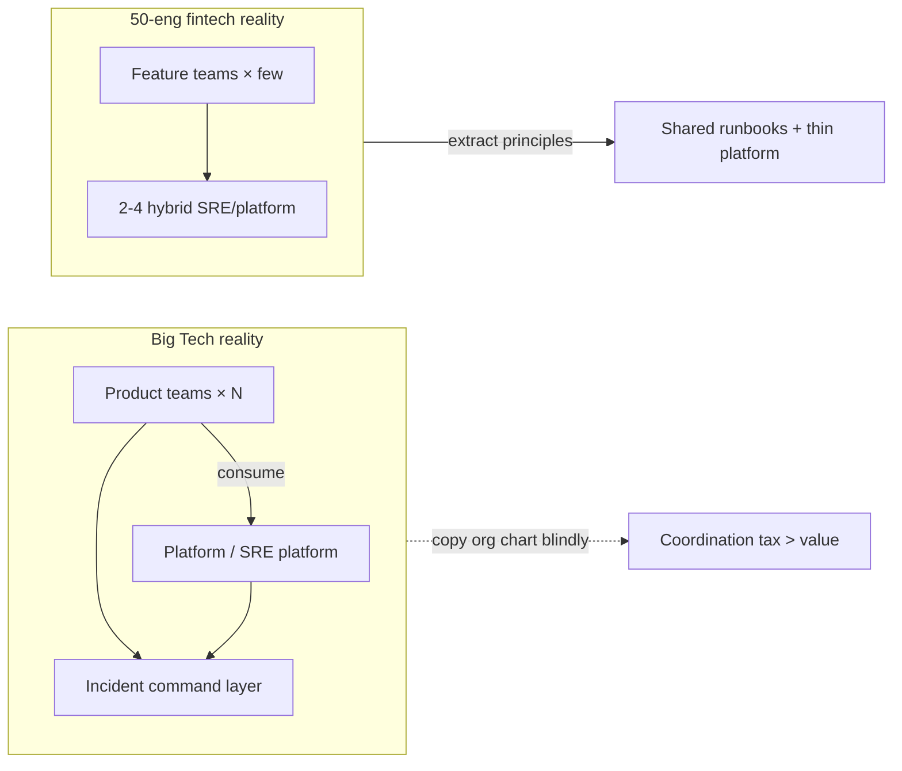

### 1.3 Anti-pattern: “Netflix does X so we do X”

This is the most common failure mode when reading public case studies:

1. **Cargo cult tooling**: install Chaos Monkey before stable SLIs and safe rollback exist.
2. **Cargo cult process**: formal blameless postmortems with 20-page templates for an 8-person team — culture is not ready; ceremony becomes theatre.
3. **Cargo cult ML**: train Isolation Forest / LSTM because “Uber/Google use ML,” while 70% of incidents are change-driven and there is no trusted change feed yet.
4. **Cargo cult autonomy**: “full closed-loop” auto-remediation without dual-control, audit trail, and a blast radius model — see [11 — Remediation](../12-remediation/README.md).

> [!WARNING]
> **Blind copying is more expensive than doing nothing**
> Skipping chaos engineering means you do not know your edge cases. Doing chaos engineering on peak traffic without a kill switch and deep enough observability means you *create* a deliberate SEV-1. Big Tech already paid tuition with org size and mature tooling; you have not.

### 1.4 Three-step learning framework: Extract → Map → Adapt

Every pattern in this chapter should go through the following pipeline before becoming a Jira ticket:

| Step | Question | Output |
|------|---------|--------|
| **Extract principle** | Which metric did they optimize? Which failure class did they avoid? | 1–2 sentence principle |
| **Map constraint** | What data/people/blast radius/regulators differ for us? | Constraint list |
| **Adapt** | What is the 10%, 50%, 100% version of the principle? | Decision + non-goals |

**Quick example — Google error budget:**

- *Principle*: reliability is a finite resource; spend deliberately between feature velocity and stability.
- *Startup constraint*: weak SLIs; product “always wants to ship”; no formal negotiation.
- *Adapt 10%*: pick 3 most important SLIs, report weekly burn rate; block auto-deploy when burn is critical (no committee needed).
- *Adapt 100% (later)*: error budget policy + freeze mechanics + mandatory postmortem on exhaust.

> [!TIP]
> **Quick check before “importing”**
> If you cannot answer three questions: (1) what is the principle, (2) where do constraints differ from Big Tech, (3) what does the 10% version look like — you are cargo-culting. Stop.

### 1.5 Public knowledge only — how to read postmortems correctly

This chapter relies only on public materials: Google SRE books, Principles of Chaos, AWS post-event summaries, Meta engineering/outage communications, Uber engineering blogs on Michelangelo, etc. No internal “I heard that” numbers.

When reading a public postmortem, separate:

| Layer | Example | Learning value |
|-------|-------|-------------|
| **Facts** | “tool command removed more capacity than intended” | failure class |
| **Mechanism** | automation race, dependency loop | design invariant |
| **Org response** | new safeguards, dual-control | process pattern |
| **Marketing framing** | “we take reliability seriously” | ignore if not actionable |

---

## 2. Google — SRE, Error Budget, IMAG, AI SRE agentic

### 2.1 SLI / SLO / Error Budget as “reliability currency”

Google SRE formalized a simple but extremely powerful idea: **you cannot simultaneously maximize feature velocity and unbounded reliability**. Error budget quantifies that trade-off.

Recap (observability detail in [01 — Observability](../01-observability/README.md)):

- **SLI**: actual measurement (e.g. successful request ratio, p99 latency).
- **SLO**: target (e.g. 99.9% success over 30 days).
- **Error budget**: the “allowed to fail” portion = `1 - SLO`. Budget exhausted → prioritize reliability.

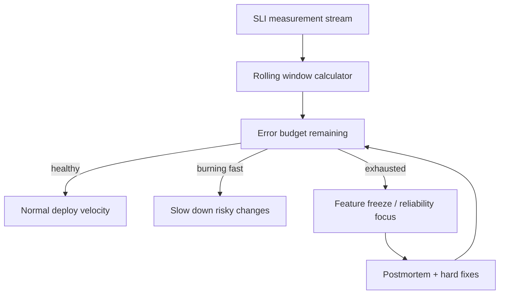

> [!NOTE]
> **KEY IDEA**
> Error budget is not a vanity KPI. It is a **negotiation mechanism** between product and SRE with numbers, instead of feelings (“the system feels fragile” vs “we must ship Q3”). The AIOps pipeline must *feed* the error budget (burn rate alerts, change correlation), not only draw pretty charts.

### 2.2 Edge case: error budget exhaustion vs politics

On paper: budget gone → freeze. In reality:

| Situation | What happens without governance | What is needed |
|------------|-------------------------------------|----------------|
| Big CEO demo next week | Freeze gets a silent “exception” | Formal, time-boxed exception with owner |
| SLO too tight (99.99 when business only needs 99.9) | Budget always red → freeze meaningless | Re-negotiate SLO with business |
| SLO too loose | Budget never burns → sloppy shipping | Tighten SLI selection, multi-window burn |
| Multi-service shared fate | Service A burns budget because of dependency B | Shared SLO / dependency SLO policy |

> [!IMPORTANT]
> **An error budget without “teeth” is only a dashboard**
> Minimum teeth for a mid-size org: (1) page on multi-window burn above threshold, (2) require extra approval for deploys when budget < X%, (3) mandatory postmortem on exhaust. You do not need Google’s org chart for these three.

### 2.3 Incident management: IMAG and command-system thinking

Google published an incident management model (often discussed in the IMAG / SRE-culture incident management context) inspired by the **Incident Command System**: clear roles under high stress.

Typical roles (names may differ across orgs; principle stays):

| Role | Responsibility | Does not do |
|------|-------------|-----------|
| **Incident Commander (IC)** | Prioritize, decide strategy, keep tempo | Deep-debug alone for 3 hours |
| **Operations / SME** | Investigate and execute technical actions | Unilaterally change incident scope |
| **Communications** | Stakeholders, status page, exec updates | “Guess” technical root cause |
| **Scribe / Planner** | Timeline, decisions, action items | Stay silent so memory fails |

Map to AIOps:

- LLM agent / RCA engine **do not replace the IC** — they are SME force-multipliers.
- AIOps tickets need a handoff schema: timeline, hypotheses, actions taken, blast radius — see [09 — RCA](../10-root-cause-analysis/README.md) and [10 — LLM Agent](../11-llm-agent/README.md).
- Auto-remediation is an “operations executor with safety gates,” not the IC.

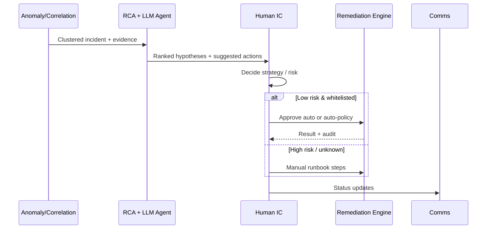

### 2.4 Agentic AI for SRE (public direction 2025–2026)

Google Cloud and the public SRE ecosystem have pushed **agentic assistance**: agents read playbooks, query telemetry, propose investigation steps, draft summaries — always with human oversight for dangerous actions.

Design lessons for the handbook (vendor-independent):

1. **Playbook-as-code + retrieval**: the agent does not “invent runbooks”; it is grounded on a reviewed corpus.
2. **Scoped tool use**: querying metrics/logs/traces is OK; mutating production needs a policy engine.
3. **Immutable audit trail**: every hypothesis, tool call, and decision must be logged — for postmortems and compliance.
4. **Human-in-the-loop by risk tier**: free read/summarize; pod restart may be auto; region failover needs dual-control.

> [!TIP]
> **Link to chapters 10–11**
> Big Tech agentic SRE validates the handbook architecture: intelligence layer (detect → correlate → RCA → LLM) separated from action layer (remediation safety). Do not collapse “LLM runs kubectl” into one ungated process.

### 2.5 Google lessons for the AIOps pipeline

| Google pattern | AIOps implication | Related chapter |
|----------------|-------------------|-------------------|
| SLI/SLO first | Detection prioritizes user-facing SLIs, not “high CPU” | 01, 07 |
| Error budget | Burn rate is a first-class signal for correlation & prioritization | 07, 08 |
| Blameless + data | Postmortems feed training labels / playbook updates | 09, 10 |
| Role separation in incident | Agent = SME helper; human = IC under ambiguity | 10 |
| Progressive automation | Remediation maturity ladder, not big-bang autonomy | 11, 12 |

### 2.6 “Google-flavored” anti-patterns

1. **SLO inflation**: 40 SLOs for every microservice → alert noise; nobody can negotiate.
2. **SRE as ticket farm**: product dumps all toil on SRE; error budget is not used to force architecture fixes.
3. **Agent without grounding**: LLM “investigates” with general knowledge instead of telemetry + internal docs → confidently wrong.
4. **IC theatre**: title Incident Commander exists, but everyone still deploys hotfixes in parallel without coordination.

---

## 3. Netflix — Chaos Engineering, Simian Army, resilience-first

### 3.1 From Chaos Monkey to Principles of Chaos

Netflix is famous for **Chaos Monkey** (randomly terminate instances) in the Simian Army — but the more important legacy is the **Principles of Chaos Engineering**: controlled experiments to build confidence in a system’s ability to withstand turbulence in production-like conditions.

Logic chain:

1. Define “steady state” with business metrics (not only green infra).
2. Hypothesis: the system stays steady when failure X is injected.
3. Run the experiment with small blast radius.
4. Observe, learn, harden — repeat.

> [!NOTE]
> **KEY IDEA**
> Chaos is not “break things for fun.” Chaos is the **scientific method** applied to resilience. If you do not measure steady state, you are not doing chaos engineering — you are doing random sabotage.

### 3.2 Observability is a prerequisite for chaos

Without deep observability, chaos only creates unexplained outages. Netflix-style thinking and this handbook converge at [01 — Observability](../01-observability/README.md):

| Before a chaos experiment | Why mandatory |
|------------------------|-----------------|
| SLI steady-state dashboard | Know what “normal” looks like |
| Distributed tracing | See cascade path when latency is injected |
| Controlled high-cardinality labels | Distinguish canary vs control |
| Alert routing test mode | Do not wake the company for an experiment |
| Kill switch / abort criteria | Stop when burn rate goes bad |

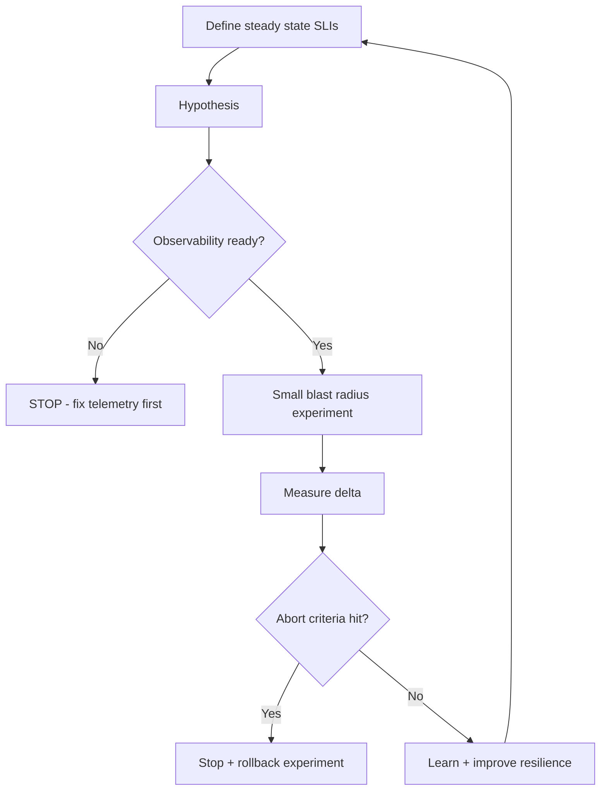

### 3.3 Hystrix-era bulkhead / circuit breaker → modern equivalents

In the Hystrix era, Netflix popularized:

- **Circuit breaker**: fail fast when a dependency is sick.
- **Bulkhead**: isolate thread/connection pools by dependency.
- **Fallback**: degrade gracefully instead of killing the whole request path.

Hystrix is sunset in the Java/Netflix ecosystem, but the **patterns live on** via Resilience4j, service-mesh retries/timeouts/circuit breaking, platform-level concurrency limits, and client-side hedging in some systems.

Map to AIOps:

| Resilience pattern | Detection signal | Remediation angle |
|--------------------|------------------|-------------------|
| Circuit open storm | Error rate + fallback metrics spike | Scale / fix dependency; do not blindly restart clients |
| Bulkhead exhaustion | Queue/thread pool saturation | Capacity + limit tuning |
| Retry amplification | Traffic × retries = self-DoS | Retry budget, jitter — detection must understand “secondary load” |

> [!WARNING]
> **Retry is an amplifier**
> Many incidents where “AIOps detects latency” are actually **retry storms**. If the anomaly model lacks features for “retry ratio / outbound concurrency,” RCA will wrongly blame pod CPU instead of client policy.

### 3.4 Edge: peak vs off-peak chaos; safety rails

| Mode | Pros | Cons | When to use |
|--------|----|-------|--------------|
| Off-peak chaos | Safer, easier approval | Does not reflect real load; warm caches differ | Early maturity, game days |
| Peak / production chaos | Truthful signal | Revenue / SEV risk | Mature org, kill switch, small % traffic |
| Staging-only | Cheap | False confidence (different topology/data) | Unit of resilience tests, not enough alone |

**Minimum safety rails (any scale):**

1. Experiment ID + owner + TTL.
2. Max % instances / max one AZ / one cluster slice.
3. Auto-abort when SLI exceeds threshold.
4. Change freeze windows (sale, regulatory cutover) = no chaos.
5. Post-experiment note attached to knowledge base (feeds [10 — LLM Agent](../11-llm-agent/README.md)).

### 3.5 Netflix lessons for AIOps

1. **Resilience is a product requirement**, not an afterthought of detection.
2. **Steady-state metrics** must live in anomaly baselines — see seasonality in [07](../08-anomaly-detection/README.md).
3. **Game days** are a cheap way to train both human ICs and agent playbooks.
4. **Progressive delivery + chaos** complement each other: canary answers “is new code safe?”; chaos answers “are old failure modes still covered?”

See [12 — Production](../13-production/README.md) on chaos for the AIOps platform itself: the monitoring platform must survive losing a Kafka partition, an LLM provider, or one collector — otherwise AIOps becomes a single point of blindness.

---

## 4. Amazon / AWS — Correction of Error & operational tools as hazard

### 4.1 Correction of Error (COE) culture

Amazon is known for **Correction of Error** discipline: deep analysis of causes, mechanisms, and corrective actions with owners — close to blameless postmortems but with DNA of “mechanism over good intentions.” Core idea for AIOps: **every major incident must leave structural change** (guardrail, test, automation limit), not only “remind the team to be careful.”

> [!NOTE]
> **KEY IDEA**
> “Be careful” is not a control. A control is: tools that forbid one-way operations on large capacity; DNS changes with automation race detectors; recovery paths that do not depend on the system that is dying.

### 4.2 S3 — 2017-02-28: typo / remove capacity and safeguards

AWS’s public post-event summary of the S3 incident in US-EAST-1 (28 February 2017) describes an important failure class:

- An operational action on a billing/capacity management system **removed more capacity than intended** (error in the command / parameters).
- Effects spread to S3 subsystems; AWS services depending on S3 and the console were also impacted.
- Public lessons emphasized **more safeguards for operational tools**: limit admin-command blast radius, improve removal tooling, harden recovery.

**Extracted principle:** *operational tools are a hazard surface as large as (sometimes larger than) application code*.

AIOps map:

| S3 2017 lesson | AIOps design |
|----------------|--------------|
| Admin tool too powerful | Remediation actions have allowlist + max scope |
| Human typo at scale | Policy engine validates parameters before execute |
| Console dependency | Status / break-glass channel out-of-band |
| Long recovery | Runbooks + automation tested *before* disaster |

### 4.3 DynamoDB DNS automation race (public themes, US-EAST-1)

AWS has published major incidents involving automation and DNS/control plane (including public analyses around DynamoDB / regional impairments with themes of **DNS automation race** and **recovery tooling dependency**). Academic/engineering themes from public summaries:

1. **Race in automation**: two automated parts (or automation vs operator) leave distributed state unconverged — DNS records / plan state diverge.
2. **Recovery path depends on the sick system**: recovery tools need the same control plane or data plane that is degraded → extended MTTR.
3. **Cascading customer impact**: many control planes and customer workloads look “healthy on paper” but silently depend on a regional primitive.

> [!IMPORTANT]
> **Golden invariant**
> *Recovery automation must not have a hard dependency on the subsystem it is recovering — or it must have an independent degraded mode.* This is lesson #1 when designing remediation and DR for AIOps.

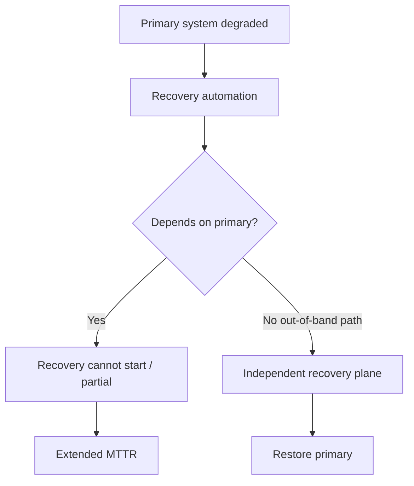

### 4.4 AIOps implication: remediation circuit breakers & dual-control

Direct connection to [11 — Remediation](../12-remediation/README.md):

| Safeguard | Description | Failure class avoided |
|-----------|-------|------------------------|
| **Action allowlist** | Only actions proven safe | “LLM invents kubectl” |
| **Blast radius cap** | Max pods / max % / one AZ | S3-style over-removal |
| **Rate limit remediation** | N actions / window / service | Thundering herd restarts |
| **Circuit breaker on remediation** | If success rate drops → stop auto | Automation amplifying outage |
| **Dual-control** | High-risk needs second approver | Single operator/tool error |
| **Dry-run / simulate** | Plan before apply | Parameter mistakes |
| **Independent audit log** | Ship logs outside the sick cluster | Lost forensics during outage |
| **Out-of-band break-glass** | Bastion / alternate region console | Control plane lockout (section 5) |

### 4.5 Operational tools as hazard — design checklist

When reviewing any “AIOps bot”:

1. What % of capacity can the bot affect in one command?
2. Is there confirmation on another channel for high impact?
3. Are there unit / policy tests for parameter parsers?
4. Is there a “big red button” to disable all auto-remediation?
5. Do recovery docs exist offline / in an independent region?
6. Does the tool depend on DNS/IAM/API of the failing region itself?

> [!WARNING]
> **Closed-loop AIOps is a heavy operational tool**
> Every time you increase autonomy, you increase the *privileged automation surface*. Treat the remediation engine like a production admin API: threat model, least privilege, change management.

---

## 5. Meta / Facebook — BGP 2021 and the control-plane failure class

### 5.1 Failure class: backbone / BGP / DNS cascade (Oct 2021)

Meta/Facebook’s public global outage in October 2021 is widely described in engineering communications and public technical analyses with themes:

- A change on backbone / network control **lost connectivity to data centers**.
- **DNS** and external service resolution were affected in a chain.
- Teams struggled to reach systems because **tools and normal network paths were also in the blast radius**.
- Industry-repeating lessons: **out-of-band access**, **gradual config rollout**, **audit commands that can lock you out**.

You do not need every internal detail (and must not invent them). You need the **class**:

> Control plane change → lose data plane path → lose ability to fix control plane → extended outage.

### 5.2 Control plane locking itself out

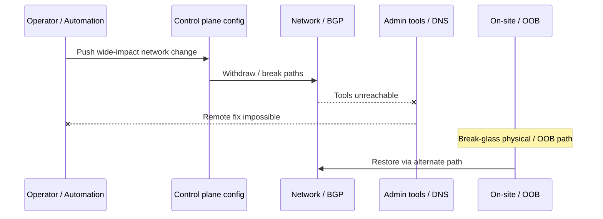

Map to modern Kubernetes / cloud / AIOps (same class, different surface):

| Surface | Lockout example |
|---------|-----------------|
| Kubernetes NetworkPolicy | Deny all including controllers / DNS |
| Service mesh mTLS | Break identity → no deploy, no scrape |
| IAM / security group | Lock admin roles |
| DNS internal | Service discovery dead → “everything is down” |
| Observability agents | Full blindness after agent config change |
| Remediation bot credentials | Bot rotates secret wrong → cannot remediate |

### 5.3 Lesson: break-glass, OOB, gradual rollout

| Control | Description | AIOps relevance |
|---------|-------|-----------------|
| **Break-glass accounts** | Rarely used credentials, monitored tightly | Use when primary IdP is down |
| **Out-of-band access** | Cellular, alternate region, serial/console | AIOps platform DR runbook |
| **Progressive config** | Canary DC / canary % routers / canary cluster | Config-as-code + progressive apply |
| **Automatic rollback triggers** | Health signal degrades → revert | Like reverse remediation verification |
| **Dry-run & impact estimation** | “How many prefixes / pods affected?” | Blast radius calculator |
| **Two-person rule** | High-risk network/IAM changes | Dual-control remediation |

> [!TIP]
> **Lockout game day**
> At least quarterly: simulate “lose VPN + lose cluster API.” If the team cannot restore within the time target using break-glass docs, AIOps auto-remediation is fantasy — because in a real SEV, people cannot get into the system either.

### 5.4 DNS / config cascade and correlation

From [08 — Alert Correlation](../09-alert-correlation/README.md) and [09 — RCA](../10-root-cause-analysis/README.md):

- DNS failure creates enormous **fan-out alerts** (every service “dependency timeout”).
- Topology-only RCA easily mis-picks a “leaf service.”
- You need a **change feed** (network ACL, CoreDNS config, Terraform apply) in evidence ranking.
- Anomaly detection on *DNS latency / NXDOMAIN rate / CoreDNS CPU* must be first-class — not buried under “app error rate.”

---

## 6. Uber — Michelangelo: ML platform lessons for AIOps

### 6.1 Why Michelangelo matters for AIOps

Uber published **Michelangelo** as an internal ML platform helping many teams build, deploy, and monitor models. Although early use cases were product ML (marketplace, ETA, etc.), the problem statements are **isomorphic** to AIOps ML:

| Product ML pain | AIOps ML twin |
|-----------------|---------------|
| Feature train/serve skew | Metric features differ between train batch and online detector |
| Model deployment sprawl | Each team trains its own unstandardized anomaly model |
| Monitoring model quality | Drift detector silent → false-negative SEV |
| Platform vs one-off scripts | AIOps “notebook on the on-call laptop” does not scale |

### 6.2 Feature store consistency (train/serve)

Classic lesson: offline accuracy looks high because the training feature pipeline is “clean and rich,” but online serving lacks features, is delayed, or defines them differently → **silent quality death**.

In AIOps:

```text
Train:  latency_p99 = quantile(window=5m, source=Prometheus 1.0)
Serve:  latency_p99 = avg(window=1m, source=statsd approx)
→ Model “sees” a different distribution → thresholds are meaningless
```

**Invariant:** feature definitions are versioned contracts. Online detectors must consume the **same semantics** as training (or have adapter tests that catch skew).

> [!NOTE]
> **KEY IDEA**
> Many “ML anomaly does not work” cases are not weak algorithms — they are **weak data contracts**. Before swapping LSTM for Transformer, audit train/serve skew. See feature engineering in [07 — Anomaly Detection](../08-anomaly-detection/README.md).

### 6.3 Model excellence / quality score & drift monitoring

Mature ML platforms measure models like products:

- Data freshness
- Prediction distribution shift
- Label delay / feedback loop quality
- Inference latency budget
- Model on-call owner

AIOps needs equivalents:

| Signal | Meaning |
|--------|---------|
| Precision@k on confirmed incidents | Is the model spamming? |
| Recall on postmortem SEVs | Is the model blind? |
| Feature null rate | Pipeline broken |
| Baseline age | Model old vs new seasonality |
| Action success rate when model triggers remediate | Closed-loop quality |

### 6.4 Productizing ML for many teams

Michelangelo-style lesson: **do not let every squad stand up its own training cluster**. Platform provides:

1. Standardized pipelines (train, validate, deploy).
2. Feature reuse.
3. Model registry + rollback.
4. Default monitoring dashboards.
5. Security & PII controls.

Map for 50–200 eng AIOps orgs:

- A **thin ML platform** for anomaly/RCA models is enough: simple registry, CI evaluation on historical incidents, canary model deploy.
- You do not yet need a full Uber-scale feature store; you need **feature definitions in Git** + tests.

### 6.5 Mapping to anomaly detection / RCA in the handbook

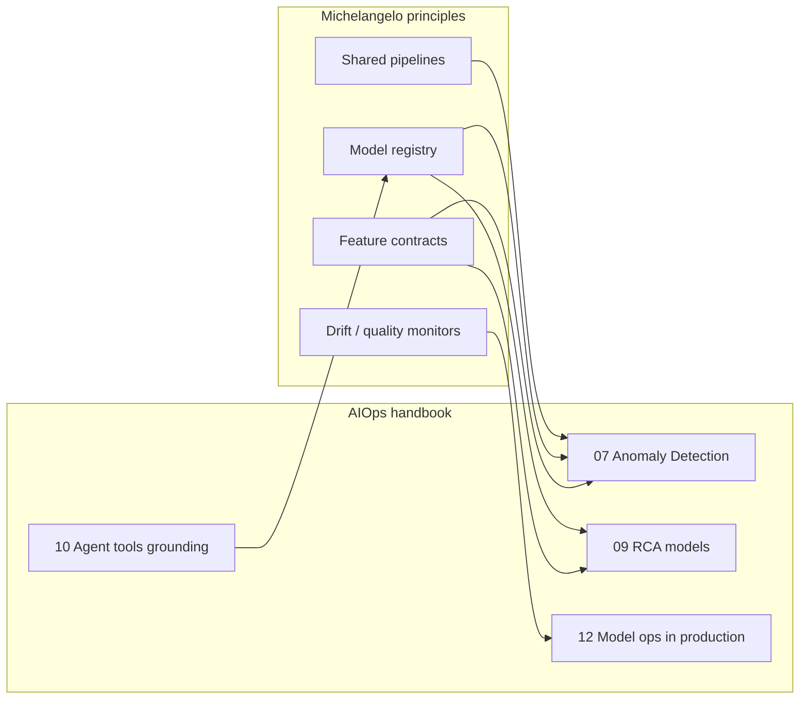

**Pragmatic:** if your org is just starting, “Michelangelo lite” =

1. Incident-label dataset from postmortems (even only 30 cases).
2. Offline evaluation gate before enabling a new detector.
3. Shadow mode for 2 weeks.
4. Clear owner for each model detector.

---

## 7. LinkedIn, Microsoft, Spotify — observability & ownership at scale

Three orgs with useful public engineering narratives (not a full industry survey, not a forced “top 10”).

### 7.1 LinkedIn — observability & Kafka-centric data paths

LinkedIn is publicly known for **Kafka** scale and data infrastructure; engineering blogs often emphasize:

- Event streaming as backbone for analytics and operational signals.
- Ownership and multi-tenant platform concerns (topic standards, quotas, schema).
- Observability must cover **pipeline health** (lag, produce error), not only app RED metrics.

AIOps lessons (aligned with [06 — Kafka](../07-kafka/README.md)):

| Pattern | Adapt |
|---------|-------|
| Kafka as nervous system | AIOps bus: raw → anomalies → correlated → remediation results |
| Schema / contract discipline | Versioned event schemas; poison message strategy |
| Lag as SLI | Consumer lag detector is a meta-signal — AIOps is blind if the bus is late |
| Multi-team platform | Topic naming, quota, DLQ standards before “free-for-all topics” |

> [!TIP]
> **Meta-observability**
> Big Tech learned early: *the observation system is also a production system*. If Kafka lag is 15 minutes, “real-time anomaly” is marketing. Measure pipeline SLIs separately — see [12](../13-production/README.md).

### 7.2 Microsoft — layered ownership, distributed SRE practices

Microsoft (and public Azure engineering cultures) often show:

- Strong **service ownership**: the team that builds the service takes the page.
- Platform provides building blocks (identity, telemetry agents, incident tooling) instead of centralized ops doing everything.
- Emphasis on **safe deployment** (progressive expose, feature flags) as a reliability control.

AIOps map:

- A central AIOps team **does not own every alert**. They own engines + standards; service teams own SLIs and playbooks.
- Auto-remediation policy by **service tier** and owner annotations (Kubernetes labels / catalog).
- Without ownership metadata, correlation/RCA lacks “who is responsible to act.”

### 7.3 Spotify — squad model, golden paths, backstage-style thinking

Spotify engineering culture (squad/tribe — even though industry debates how much of the “model” to copy) and efforts around **developer portals / golden paths** suggest:

- Developer experience is a reliability lever: a good default path → fewer snowflakes.
- Standardization need not mean central bottleneck if self-service works.
- Observability templates (dashboards-as-code, default alerts) reduce variance.

AIOps adapt:

| Spotify-like idea | AIOps form |
|-------------------|------------|
| Golden path service | Default OTel + SLIs + alert pack + runbook stub |
| Portal catalog | Service catalog = topology input for RCA |
| Squad autonomy | Squads tune thresholds inside platform guardrails |
| Less inventiveness tax | Fewer “each team has its own monitor stack” |

### 7.4 Airbnb (short bonus): data quality & experimentation mindset

Airbnb public tech talks/blogs often touch data quality, experimentation, and infra productivity. Short AIOps lesson: **every detector is an experiment** — needs assignment, success metric, and a kill switch. Shadow mode + A/B threshold policies are product mindset, not only ML research.

---

## 8. Cross-comparison: common patterns

### 8.1 Comparison table (public-pattern level)

| Company lens | Detection emphasis | Correlation / RCA | Auto-remediation maturity (public posture) | Culture mechanism |
|--------------|--------------------|-------------------|--------------------------------------------|-------------------|
| **Google** | SLI/SLO burn, deep telemetry | Topology + change + human IC process | Progressive; strong process before full autonomy | Error budget, blameless, IMAG roles |
| **Netflix** | Steady-state business metrics | Resilience path analysis, dependency isolation | Auto more at app resilience layer (breakers) than “ops bots” | Chaos, freedom & responsibility |
| **AWS** | Massive multi-tenant signals | COE-driven mechanism hunting | Heavy internal automation + strict safeguards lessons | COE, mechanisms > intentions |
| **Meta** | Global graph / network + app | Cascade from core infra | Caution from lockout-class failures | Move fast *with* (hard-won) safety rails |
| **Uber** | ML platform quality | Model+data for decisions | Product automation; ops ML via platform discipline | Platform productization |
| **LinkedIn** | Pipeline + app metrics | Event-sourced truth | Platform standards first | Kafka-centric contracts |
| **Microsoft** | Layered cloud telemetry | Ownership + safe deploy | Policy-driven automation | Service ownership |
| **Spotify** | Golden path defaults | Catalog/ownership graph | Self-service progressive | Squad + platform DX |

> The table is a **heuristic**, not an internal benchmark. Use it to pick principles, not to argue “who is better.”

### 8.2 Convergent common patterns

Regardless of brand, mature orgs converge on:

1. **SLO-first prioritization** — do not page for “CPU 80%” if users are not hurting.
2. **Topology + change graphs** — RCA is not only time-series similarity.
3. **Progressive automation** — from suggest → approve → auto for proven classes.
4. **Blameless postmortems with corrective mechanisms** — do not stop at narrative.
5. **Platform + ownership dual track** — platform provides rays; teams own services.
6. **Operational tool safety** — admin/automation surfaces are threat-modeled.
7. **Out-of-band recovery** — do not single-home the recovery path.
8. **Meta-observability** — monitor the monitors.

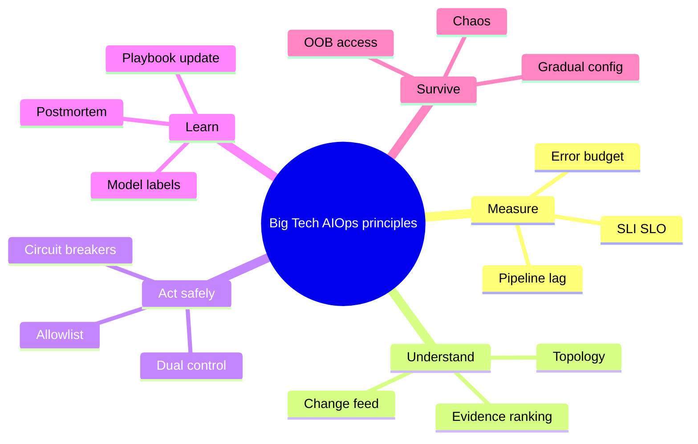

### 8.3 Decision tree: which pattern to learn first?

```text
Do you have stable user-facing SLIs?
├─ No → Learn Google SLO basics + Observability chapter 01
└─ Yes
   ├─ Is alert noise killing on-call?
   │  ├─ Yes → Correlation + ownership (LinkedIn/Microsoft patterns)
   │  └─ No
   │     ├─ Is MTTR long for lack of diagnosis?
   │     │  ├─ Yes → RCA topology + change (Google/Meta lessons)
   │     │  └─ No
   │     │     ├─ Recurring failures, not yet hardened?
   │     │     │  ├─ Yes → Netflix chaos + bulkhead thinking
   │     │     │  └─ No
   │     │     │     ├─ Want auto-remediate?
   │     │     │     │  ├─ Yes → AWS safeguards + chapter 11 ladder
   │     │     │     │  └─ No → optimize detection quality (Uber ML discipline)
```

---

## 9. Decision framework: org 10 / 100 / 1000 eng

### 9.1 Decision space

Three variables matter more than pure headcount:

1. **Service count & coupling**
2. **Regulated or not** (fintech/healthcare tightens dual-control)
3. **On-call pain** (pages/week, MTTR, SEV rate)

Headcount is only a proxy for coordination capacity.

### 9.2 Org ~10 engineers

**Goal:** survive with clean signals; do not build an “AIOps platform” yet.

| Area | Do | Do not |
|------|---------|---------------|
| Detection | 5–10 SLI alerts + simple burn rate | Ensemble ML with 4 models |
| Correlation | Manual + light grouping (labels) | Graph neural RCA |
| RCA | Change log + dashboards + traces | Auto root-cause scores that are production-critical |
| Remediation | Runbook + 1–2 safe autos (restart with cap) | Closed-loop LLM kubectl |
| Chaos | Staging game day quarterly | Peak production chaos |
| Culture | 1-page postmortem | Full IMAG role set for every incident |

> [!IMPORTANT]
> **At 10 eng, the biggest “AIOps” wins are usually observability + alert hygiene**, not models. See [00 — Introduction](../00-introduction.md) maturity model.

### 9.3 Org ~100 engineers

**Goal:** thin platform; shared pipeline; progressive automation.

| Area | Do | Trade-off |
|------|---------|-----------|
| Detection | Statistical + some ML for seasonal services | Cost of false positives vs coverage |
| Correlation | Multi-stage rules + topology service catalog | Stale catalog = wrong RCA |
| RCA | Topology + change correlation + LLM summary | LLM cost & hallucination controls |
| Remediation | Tiered auto (L1/L2) + dual-control L3 | Org trust building 3–6 months |
| Chaos | Canary chaos / one AZ experiments | Needs abort automation |
| ML ops | Registry lite + shadow mode | Not a full feature store yet |
| Incident | IC for SEV-1/2 | Do not over-process SEV-4 |

### 9.4 Org ~1000 engineers

**Goal:** multi-tenant AIOps platform; productized; strong governance.

| Area | Corresponding Big Tech pattern |
|------|----------------------------|
| Detection | Multi-tenant anomaly platform, per-team overrides |
| Correlation | Global + domain correlators |
| RCA | Rich topology graph, optional GNN, case-based memory |
| Remediation | Enterprise policy engine, audit, regional isolation |
| Chaos | Continuous chaos for critical paths |
| Culture | Formal error budget negotiations |
| Staffing | Platform SRE + embedded SRE hybrid |

### 9.5 Capability selection by scale

| Capability | 10 eng | 100 eng | 1000 eng |
|------------|--------|---------|----------|
| SLO program | 3–5 company SLIs | per critical service | portfolio + dependency SLOs |
| Anomaly ML | optional | selective | platform default + opt-out |
| Alert correlation | light | core investment | multi-layer |
| LLM investigation | paste into ChatOps carefully | agent with tools + audit | fleet of agents + eval harness |
| Auto-remediation | minimal | ladder | broad with strict policy |
| Chaos engineering | game days | regular | continuous selective |
| Feature store | no | git contracts | real store if many models |
| Dual-control | for prod data deletes | for high-risk remediate | systemic |

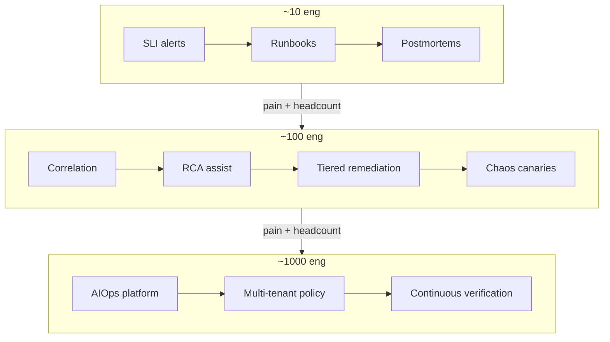

---

## 10. Edge cases when importing Big Tech patterns

### 10.1 Edge case: copy numeric SLOs

Big Tech publicly cites 99.99% for a service tier. Your org copies 99.99% for a monolith + third-party payment → budget burns in week one → permanent freeze or ignored SLOs.

**Handle:** SLOs by **user journey** and real dependencies; use multi-window burn (Google workbook style) instead of glamorous targets.

### 10.2 Edge case: chaos on a shared database

Netflix instance-level chaos on a stateless fleet is very different from killing the primary database of a 50-eng fintech.

**Handle:** chaos only on **layers with proven redundancy**. Database: scheduled failover drills, not random primary kills at peak.

### 10.3 Edge case: auto-remediation in regulated environments

AWS-style strong automation vs requirements for 4-eyes audit, change tickets, segregation of duties.

**Handle:** dual-control + immutable audit + “auto only in lower environments / only for tier-3 services” first. Compliance is a constraint, not AIOps’s enemy.

### 10.4 Edge case: LLM agent with data residency

Public cloud agentic SRE may send log snippets to external APIs — policy violation.

**Handle:** private model / VPC endpoint / redaction layer; minimize PII in tool outputs — see [10](../11-llm-agent/README.md) and security in [12](../13-production/README.md).

### 10.5 Edge case: rotten topology graph (stale CMDB)

Meta/Google-scale invests in discovery. A mid-size org buys a CMDB with 40% services missing → RCA that is “confidently wrong.”

**Handle:** prefer **runtime discovery** (mesh, eBPF, OTel service graph) + soft catalog dependency; lower confidence when topology is stale.

### 10.6 Edge case: error budget vs sales-driven launch

Politics beats numbers if leadership does not buy in.

**Handle:** frame error budget as **revenue at risk / SLA penalty**, not “SRE best practice.”

### 10.7 Edge case: single-region reality, multi-cloud fantasy

Reading Big Tech multi-region active-active then designing for a team without a single-region DR drill.

**Handle:** sequential maturity: tested backup restore → warm standby → multi-AZ app → multi-region only with business case.

### 10.8 Edge case: fake blameless

Postmortems say “blameless” but promotion still punishes the on-call person.

**Handle:** leadership behavior is the real control. No AIOps tool cures toxic incentives.

### 10.9 Edge case: Simian Army in Kubernetes without PodDisruptionBudget

Modern Chaos Monkey = randomly delete pods. No PDB / no capacity → self-inflicted outage.

**Handle:** resilience prerequisites checklist before chaos flag = on.

### 10.10 Edge case: “Uber feature store” for 2 models

Platform overhead > value.

**Handle:** 2 models = versioned SQL/PromQL features in repo + CI. Feature store when models/features/consumers exceed the pain threshold.

> [!WARNING]
> **Red list when importing**
> 1) Full closed-loop remediation in week one  
> 2) Production chaos without abort  
> 3) Copy-paste 99.99% SLO  
> 4) LLM mutates prod without allowlist  
> 5) Drop break-glass because “cloud is already reliable”  

---

## 11. Case study: AIOps for a 50-eng fintech

### 11.1 Assumed context (realistic composite)

- 50 engineers, 30 microservices on 1 cloud region, 3 AZs.
- Payment, ledger, KYC, mobile BFF.
- Regulator: mandatory audit trail for production changes that affect money.
- Pain: ~25 Pager incidents/month; 40% noise; P1 MTTR ~70 minutes; 2 large SEVs/year related to deploy + dependency.
- Stack aligned with handbook: OTel, Prometheus, Loki, Tempo, Kafka, Grafana.

6-month goal: **cut noise 60%, P1 MTTR to ~25 minutes, auto-remediate 15–20% of safe classes, without violating dual-control**.

### 11.2 Principles chosen from Google + Netflix + AWS

| Source | Principle kept | Adapt fintech 50 |
|--------|---------------|------------------|
| Google | SLO + burn + IC for SEV-1 | 8–12 SLI journeys; simple IC rota |
| Google | Human-in-loop agentic assist | LLM proposes; does not auto money-path transfers |
| Netflix | Steady state + game day | Quarterly failover + latency inject staging/prod canary |
| Netflix | Bulkhead thinking | Timeouts/retry budgets for payment clients |
| AWS | Ops tool safeguards | Remediation allowlist + dual-control for ledger-touching |
| AWS | Recovery independence | Offline runbooks; third-party status page |
| Meta | Gradual config + OOB | Terraform canary plans; break-glass admin |
| Uber | Train/serve discipline | 2 detectors with evaluation harness, no ML zoo |

### 11.3 Target architecture (thin AIOps)

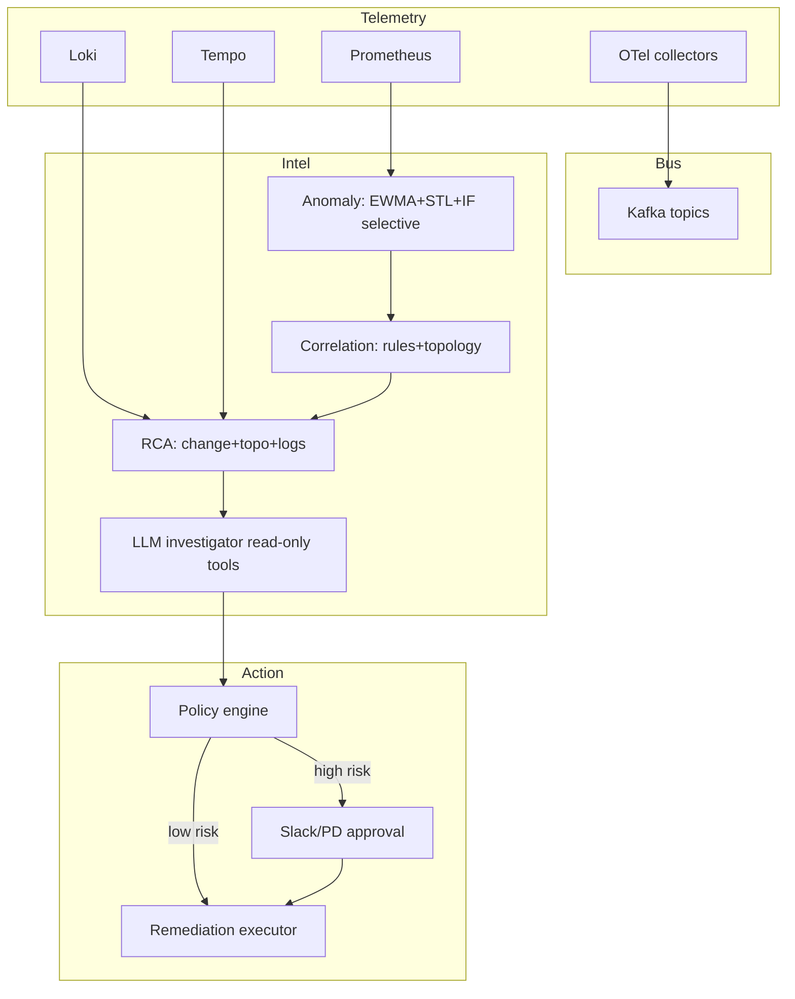

Component detail follows the [00](../00-introduction.md) pipeline and chapters 07–12; here we emphasize **policy and ownership** only.

### 11.4 Phased delivery

#### Phase A — Days 0–30: “Google lite + signal hygiene”

1. Define 6 user journeys (login, top-up, pay, transfer, KYC submit, statement).
2. SLI/SLO + multi-window burn alerts.
3. Minimal service catalog (owner, tier, dependencies).
4. Cut 30% of unactionable alerts.
5. Mandatory 1-pager postmortem for P1/P2.

**Exit criteria:** pages/week clearly down; every critical service has an owner; burn rate dashboards used in standups.

#### Phase B — Days 31–60: “Correlation + RCA assist”

1. Correlation by: same root deployment, same dependency, windowed fan-out.
2. Change feed from CI/CD + Terraform applies into evidence.
3. LLM incident summary (read-only tools: PromQL, LogQL, TraceQL).
4. Shadow anomaly ML on 3 seasonal services.

**Exit criteria:** median alerts-per-incident down; MTTD improved; IC uses AIOps ticket as primary view for SEV-2+.

#### Phase C — Days 61–90: “AWS safeguards + Netflix drills”

1. Remediation allowlist: restart pod, scale +1 safe range, rollback last deploy (tier-2/3).
2. **No auto** on ledger primary failover, IAM, network ACL, payment switch.
3. Dual-control for every “tier-1 money path” action.
4. Game day: kill canary pods + inject latency on dependency sandbox.
5. Remediation circuit breaker + immutable audit log (S3 WORM / equivalent).

**Exit criteria:** ≥1 auto-remediate class succeeds with metrics; 1 game day report; dual-control path rehearsed.

### 11.5 Sample decision log (avoid cargo cult)

| Proposal | Decision | Reason |
|---------|------------|-------|
| GNN RCA | Defer | Topology data not clean enough |
| Full prod peak chaos | Reject | Abort automation insufficient |
| Auto-remediate all restarts | Non-tier-1 only | Regulator + blast radius |
| Buy full AIOps suite | Thin build + vendor metrics | Need model on own data |
| Feature store | Git contracts | Only 2 models |

### 11.6 Fintech-specific risks

1. **False auto-rollback** when campaign traffic makes SLI look like a regression.
2. **Log redaction** before LLM.
3. **Split-brain remediation** (bot and human both scale).
4. **Alerts on fraud systems** — a “correct” anomaly may be an attack; need parallel security runbooks, not auto-suppress.

> [!TIP]
> **Success metrics are not only MTTR**
> Track: % incidents with change evidence attached, % actions with complete audit, time-to-IC-assignment, and **how often auto-remediation is circuit-broken**. Circuit-break is not failure — it means the safety system is alive.

---

## 12. Production Review Checklist

Use this checklist when reviewing an AIOps/SRE program under “Big Tech principle light.” Score: ✅ Done / 🟡 Partial / ❌ Missing.

### 12.1 Measurement & prioritization (Google lens)

- [ ] User-facing SLIs exist for important journeys
- [ ] SLOs have owners and periodic review (not just copy 99.9)
- [ ] Error budget / burn rate influences deploy policy
- [ ] Alerts attach to user symptoms, not only infra causes
- [ ] Multi-window burn is used (avoid flap)

### 12.2 Detection quality (Uber + ch.07)

- [ ] Baseline/seasonality modeled for cyclic traffic
- [ ] Train/serve feature semantics documented
- [ ] Shadow mode before promoting a detector
- [ ] Precision/recall reviewed on postmortem set
- [ ] Meta-alerts: detector stale, feature null rate

### 12.3 Correlation & RCA (Google/Meta + ch.08–09)

- [ ] Service topology from runtime + catalog
- [ ] Change feed (deploy, config, feature flag) in evidence
- [ ] DNS / mesh / dependency signals first-class
- [ ] Confidence scores; avoid fake “single root cause” when data is thin
- [ ] Historical case memory updated after postmortems

### 12.4 Incident process (IMAG lens)

- [ ] Clear IC role for SEV-1
- [ ] Comms channel semi-separated from technical
- [ ] Timeline logging (scribe or bot)
- [ ] Standard handoff schema between bot and human
- [ ] Blameless postmortem with deadline-bearing action items

### 12.5 Remediation safety (AWS lens + ch.11)

- [ ] Allowlist actions
- [ ] Blast radius caps
- [ ] Rate limits / anti thundering herd
- [ ] Circuit breaker on remediation success rate
- [ ] Dual-control high-risk
- [ ] Dry-run support
- [ ] Immutable audit logs out-of-band
- [ ] Global auto-remediation kill switch

### 12.6 Resilience verification (Netflix lens + ch.12)

- [ ] Steady-state metrics defined pre-chaos
- [ ] Game days scheduled
- [ ] Abort criteria automated
- [ ] PDB / capacity headroom before pod chaos
- [ ] Dependency timeout/retry budgets reviewed
- [ ] AIOps platform itself chaos/DR tested

### 12.7 Lockout & recovery (Meta lens)

- [ ] Break-glass accounts monitored
- [ ] OOB admin path documented & tested
- [ ] Progressive rollout for network/IAM/DNS changes
- [ ] Recovery docs available when IdP/VPN down
- [ ] Status communications do not depend on prod cluster

### 12.8 Platform & ownership (Microsoft/Spotify/LinkedIn lens)

- [ ] Service owner metadata mandatory
- [ ] Golden path telemetry template
- [ ] Kafka/pipeline SLOs (lag, loss)
- [ ] Quota / multi-tenant fair use if shared platform
- [ ] Self-service docs; platform is not a ticket black hole

### 12.9 Suggested scoring

| ✅ Score | Meaning |
|---------|---------|
| < 40% | Do not increase automation; fix foundations |
| 40–70% | Thin AIOps OK; keep tight human-in-loop |
| > 70% | Can expand auto classes with measurement |

---

## 13. 90-day Improvement Roadmap

Generic roadmap for orgs that already have basic observability (if not, do chapters 01–06 first).

### 13.1 Days 0–30 — Foundations & Google core

| Week | Focus | Deliverable |
|------|-------|-------------|
| 1 | SLI inventory | Journey list + SLI draft |
| 2 | SLO + burn | Dashboards + paging policy |
| 3 | Alert hygiene | Reduce noise; ownership labels |
| 4 | Incident basics | IC checklist + postmortem template |

**Artifacts:** error budget policy v0.1; service catalog v0.1; “no SLO no page” rule for new alerts.

### 13.2 Days 31–60 — Understand path (correlation/RCA/agent assist)

| Week | Focus | Deliverable |
|------|-------|-------------|
| 5 | Correlation v1 | Fan-out grouping + deploy correlation |
| 6 | Change evidence | CI/CD → Kafka/event bus |
| 7 | RCA pack | Topology query + log/trace evidence bundle |
| 8 | LLM assist | Read-only investigation agent + audit |

**Artifacts:** unified incident ticket schema; eval set of 20 historical incidents.

### 13.3 Days 61–90 — Act safely & verify (AWS + Netflix)

| Week | Focus | Deliverable |
|------|-------|-------------|
| 9 | Remediation policy | Allowlist + caps + kill switch |
| 10 | First auto class | 1–2 actions in prod with metrics |
| 11 | Game day | Report + gap list |
| 12 | Review | Checklist §12 score + next quarter plan |

**Artifacts:** remediation COE for every failed auto action; chaos abort runbook; board-level reliability summary.

### 13.4 Parallel tracks (do not forget)

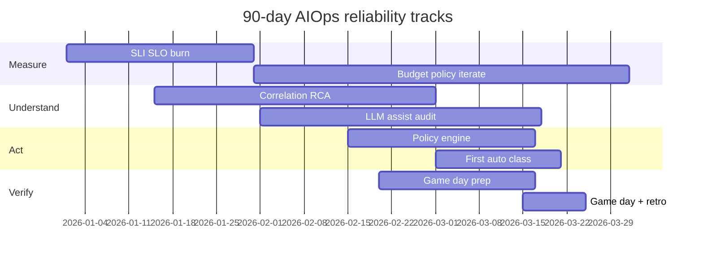

### 13.5 Suggested KPIs (pick few, measure truly)

| KPI | Baseline capture | 90d target (example) |
|-----|------------------|----------------------|
| Pages / on-call / week | measure 2 weeks | −40% |
| % pages auto-resolved noise | — | documented suppressions |
| MTTA SEV-1 | median | −30% |
| MTTR SEV-1 | median | −40% |
| % incidents with change evidence | % | > 70% |
| Auto-remediation success | n/a | > 90% on allowlist |
| Postmortem actions overdue | count | → 0 critical |

---

## 14. Socratic questions / thinking exercises

### 14.1 Socratic questions

1. If error budget is always left over, are you measuring the wrong SLI or under-delivering feature risk wastefully?
2. A chaos experiment “succeeded because nobody noticed” — is that resilience or blind observability?
3. Auto-remediation restarts a pod and fixes the symptom 10 times/week: are you reducing MTTR or **masking** a capacity bug?
4. Topology graph says service A depends on B, but runtime traces show no call to B for 30 days — where is the truth?
5. When DNS fails, why are 200 “correct” alerts still a failure of the alerting system?
6. An LLM gives the correct root cause 3 times then wrong once with equal confidence — which metric do you optimize: helpfulness or calibrated confidence?
7. A break-glass account untested for 18 months: real control or security theatre?
8. A 12-person org copies IMAG 6 roles for every incident — is ceremony helping or eating MTTA?
9. Train/serve skew makes the model weak; do you fix model architecture first or data contract first — why?
10. Recovery automation depends on the API of the region that is down — do you discover that at design time or during SEV?

### 14.2 Exercise 1 — Extract → Map → Adapt

Pick **one** public postmortem (S3 2017 summary, Meta 2021 analyses, or any public cloud COE). Write:

| Field | Your answer |
|-------|-------------|
| Principle (1–2 sentences) | |
| Mechanism of failure | |
| Constraints different in your org | |
| Adapt 10% (1 sprint) | |
| Adapt 50% (1 quarter) | |
| Non-goals | |
| Risk if you copy 100% | |

### 14.3 Exercise 2 — Error budget negotiation roleplay

Split into 2 groups: Product vs SRE. Given:

- SLO 99.9%, 30-day window
- 50% budget burned after 1 week from incident + deploy hotfixes
- Marketing launch fixed on day D-10

Required output: written policy exception **or** freeze + scope cut. “Try harder” is forbidden.

### 14.4 Exercise 3 — Remediation threat model

Draw the remediation bot data flow. Mark:

- Privileges
- Single points of wrong action
- Dependencies on failing subsystems
- Abuse cases (stolen Slack token approve)
- Detection for “bot gone wrong”

Compare with safeguards in section 4.4: gap list.

### 14.5 Exercise 4 — Chaos readiness scorecard

Score 0–2 per row (0 = missing, 2 = proven in last 90 days):

| Item | Score |
|------|-------|
| Steady-state SLI dashboard | |
| Abort automation | |
| PDB / redundancy | |
| Observability on failure path | |
| Owner + TTL for experiment | |
| Comms plan | |
| Post-experiment learning captured | |

Total < 8: ban prod chaos. 8–11: staging + limited canary. ≥ 12: limited prod OK.

### 14.6 Exercise 5 — AIOps for the platform itself

Design 5 SLIs for the **AIOps pipeline itself** (hints: ingest lag, detector freshness, correlation precision proxy, remediation success, audit completeness). Write 3 failure modes that turn AIOps into a hazard (hints sections 4–5).

### 14.7 Exercise 6 — Fintech dual-control design

Using the section 11 case study, list 10 remediation actions. Classify Auto / Approve-1 / Dual-control / Forbidden. Explain 1 boundary action (why it is debated).

---

## Appendix A — Quick glossary (Big Tech → handbook)

| Term | Practical meaning | Chapter |
|-----------|-----------------|---------|
| Error budget | Reliability portion that may be “burned” | 01, 13 |
| IMAG / IC | Incident command structure | 13, 10 |
| Chaos engineering | Controlled failure experiments | 12, 13 |
| COE | Post-incident mechanism design | 13, 11 |
| Break-glass | Emergency access with audit | 12, 13 |
| Train/serve skew | Offline/online feature divergence | 07, 13 |
| Blast radius | Maximum damage scope of an action | 11 |
| Golden path | Safe default path for teams | 01, 13 |
| Dual-control | Two parties confirm high-risk | 11, 13 |
| Steady state | Measurable normal behavior | 07, 12 |

---

## Appendix B — Quick “principle cards”

### Card 1 — Google

> Reliability is a resource negotiable with numbers. Automation assists investigation; humans own strategy under ambiguity.

### Card 2 — Netflix

> If you have not injected failure, you only *hope* you are resilient. Observability and abort are prerequisites of that hope.

### Card 3 — AWS

> Ops tools and recovery automation are hazards. Limit power, separate recovery dependencies, turn lessons into mechanisms.

### Card 4 — Meta

> Control planes can lock themselves out. Gradual change + OOB access is not paranoia — it is a lesson paid for with a global outage.

### Card 5 — Uber

> ML platforms win by contracts, evaluation, and shared pipelines — not by exotic algorithms in notebooks.

---

## Appendix C — Handbook cross-links (learning map)

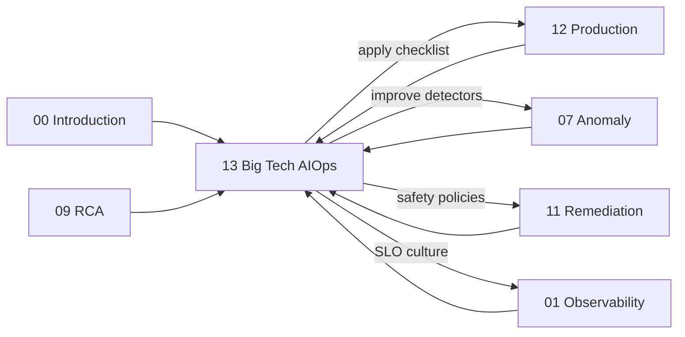

| When you need… | Read |
|--------------|-----|
| AIOps definition & maturity | [00 — Introduction](../00-introduction.md) |
| SLI/SLO/telemetry | [01 — Observability](../01-observability/README.md) |
| Detection algorithms | [07 — Anomaly Detection](../08-anomaly-detection/README.md) |
| Noise reduction | [08 — Alert Correlation](../09-alert-correlation/README.md) |
| Diagnosis | [09 — Root Cause Analysis](../10-root-cause-analysis/README.md) |
| Investigation agent | [10 — LLM Agent](../11-llm-agent/README.md) |
| Safe action | [11 — Remediation](../12-remediation/README.md) |
| Platform operations | [12 — Production](../13-production/README.md) |

---

## Appendix D — Common mistakes when “learning Big Tech” (negative checklist)

1. **Tool-first**: buy a platform before SLOs and ownership exist.
2. **Process-first theatre**: 15-item postmortem templates nobody reads.
3. **ML-first**: models before change feed and alert hygiene.
4. **Autonomy-first**: closed-loop in week 2.
5. **Chaos-first**: inject failure before kill switch.
6. **Org-chart-first**: stand up a 12-person platform team when total eng is 20.
7. **Number-first**: copy 99.99% / multi-region / five 9s as vanity.
8. **Vendor-story-first**: trust “AI root cause” slides without an internal eval set.
9. **Ignore meta-observability**: AIOps bus lag goes silent.
10. **Ignore incentives**: blameless on the wiki, blame in performance review.

> [!NOTE]
> **KEY IDEA**
> Big Tech case studies are **oracles about failure classes**, not **install guides**. This handbook intentionally places chapter 13 *after* you have seen pipeline 00→12: so you import principles into a system that already has a spine, instead of hanging SRE posters on an org without telemetry.

---

## Appendix E — Sample error budget policy v0.1 (mid-size org)

```text
Purpose: negotiate velocity vs reliability with shared numbers.

1. Primary SLI: payment journey API success rate (exclude client 4xx abuse).
2. SLO: 99.9% / rolling 28 days.
3. Budget: 0.1% ≈ 40.3 minutes equivalent (or request-based accounting).
4. Multi-window burn:
   - Fast burn: page on-call
   - Slow burn: reliability ticket within 2 business days
5. When remaining budget < 25%:
   - Tier-1 deploys need extra reliability approver
   - Pause high-risk feature flag experiments
6. When budget exhausted:
   - Freeze tier-1 feature deploys except security/reliability hotfixes
   - SEV-style postmortem within 5 business days
7. Exception:
   - Only CTO + Head of Eng, time-boxed ≤ 72h, reason recorded internally
8. SLO review: every quarter with product.
```

Do not copy the numbers; copy the **negotiation structure**.

---

## Appendix F — Sample remediation policy snippet (AWS-inspired)

```text
Global kill switch: REMEDIATION_MODE=off|shadow|on

Classes:
  A (auto): restart pod non-tier-1; max 2 pods / 10m / service
  B (single approve): scale replicas within [min, max] catalog
  C (dual-control): rollback deploy tier-1; traffic shift
  D (forbidden auto): DNS, IAM, DB primary failover, ledger re contiguity jobs

Circuit breaker:
  if action_fail_rate > 20% in 30m → force shadow mode

Audit:
  every action → immutable log: who/what/why/evidence/ticket/prev_state
```

Detailed implementation: [11 — Remediation](../12-remediation/README.md).

---

## Appendix G — Game day script skeleton (Netflix-inspired)

1. **Hypothesis:** When one BFF canary pod is lost, login journey success rate still meets slow burn SLO.
2. **Steady state:** dashboard X, 30m baseline window.
3. **Inject:** delete 1 pod labeled canary; TTL 20m.
4. **Abort if:** fast burn alert or error rate > 2× baseline for 5m.
5. **Observe:** dependency traces, saturation, retry metrics.
6. **Stop & notes:** gaps (missing PDB? retry storm?).
7. **Follow-ups:** reliability ticket, update playbook, optional detector tuning.

---

## Appendix H — Public reading list (entry points)

Foundation materials (read principles, do not memorize marketing):

1. Google SRE Book & SRE Workbook (SLI/SLO/error budget, incident management).
2. Principles of Chaos Engineering (community / Netflix lineage).
3. AWS Post-Event Summaries (S3 2017; public regional impairment analyses on automation & DNS themes).
4. Meta engineering communications around the Oct 2021 outage (control plane / access lessons).
5. Uber Engineering blog: Michelangelo ML platform.
6. Kafka / stream ecosystem talks from LinkedIn engineering (platform contracts).
7. Azure / Microsoft public guidance on service ownership & safe deployment (pattern level).

> [!WARNING]
> **Secondary sources**
> Internet “retell” outage blogs sometimes get details wrong. Prefer primary public summaries from the company itself. When facts are uncertain, stay at **failure class** level — do not assert exact minutes or unverified internal quotes.

---

## Executive takeaways

1. **Learn principles, map constraints, adapt 10% before 100%.**
2. **Google** teaches measuring & negotiating reliability; agentic AI is an audited assistant, not the IC.
3. **Netflix** teaches scientific resilience; observability + abort before chaos.
4. **AWS** teaches that operational tools/automation are hazards; independent recovery paths; COE → mechanism.
5. **Meta** teaches the lockout class: gradual config, break-glass, OOB.
6. **Uber** teaches ML platform discipline for detectors/RCA models.
7. **LinkedIn / Microsoft / Spotify** teach contracts, ownership, golden paths.
8. **Scale 10 / 100 / 1000** chooses different capabilities; headcount does not justify early complexity.
9. **Fintech 50 eng** can win big with thin AIOps + dual-control, without cloning Big Tech org charts.
10. **Checklist §12 + 90-day roadmap** turn this chapter from inspiration into a work program.

---

## Closing

Chapter 13 closes the learning loop: from the technical pipeline (00→12) to the **collective intelligence already paid for publicly** by large orgs. Good AIOps is not when the bot “looks smart,” but when:

- signals attach to user value,
- diagnosis attaches to change & topology,
- actions attach to safety mechanisms,
- learning attaches postmortem → platform improvement,
- and humans can still command when automation is wrong.

Carry checklist §12 into [12 — Production](../13-production/README.md), train/serve discipline into [07](../08-anomaly-detection/README.md), dual-control into [11](../12-remediation/README.md), SLO culture into [01](../01-observability/README.md). Big Tech does not need you to look like them — they need (and you need) your system to **understand its own limits**.

---

*Chapter 13 — AIOps & SRE at large technology companies · AIOps Engineering Handbook (EN) · Public knowledge synthesis · Does not replace each company’s primary sources.*
