# Chapter 14 — AIOps for E-commerce, Banking & Fintech

> **This chapter applies the full AIOps stack (observability → anomaly → correlation → RCA → remediation) to domains with real-money constraints: e-commerce peak traffic, core banking / payment rails, and fintech-style PSPs. Unlike pure SaaS, a wrong automated decision can double-charge customers, oversell inventory, or violate the audit trail. Core mindset: reliability engineering for money paths, not only for HTTP 200.**

---

## Prerequisites

- [00 — Introduction to AIOps](../00-introduction.md) — philosophy, maturity levels, error budget thinking
- [01 — Observability](../01-observability/README.md) — SLI/SLO, RED/USE, cardinality
- [07 — Anomaly Detection](../07-anomaly-detection/README.md) — seasonal baselines, false positives
- [08 — Alert Correlation](../08-alert-correlation/README.md) — topology correlation, alert storms
- [11 — Remediation](../11-remediation/README.md) — safety gate, blast radius, audit
- [12 — Production Operations](../12-production/README.md) — DR, cost, security hardening

## Related Documents

- [02 — OpenTelemetry](../02-opentelemetry/README.md) — trace critical payment path
- [03 — Prometheus](../03-prometheus/README.md) — business SLI, recording rules
- [04 — Loki](../04-loki/README.md) — log redaction, controlled retention
- [05 — Tempo](../05-tempo/README.md) — latency budget on authorization path
- [06 — Kafka](../06-kafka/README.md) — cart/payment event pipeline, outbox, exactly-once effect
- [09 — Root Cause Analysis](../09-root-cause-analysis/README.md) — payment rails dependency graph
- [10 — LLM Agent](../10-llm-agent/README.md) — investigation with compliance guardrails
- [13 — BigTech AIOps Patterns](../13-bigtech-aiops/README.md) — scale patterns for reference

## Next Reading

After this chapter, continue to [15 — Famous Incidents](../15-famous-incidents/README.md) to drill public incidents through a money-path lens. You may return to [12 — Production](../12-production/README.md) or [11 — Remediation](../11-remediation/README.md) to tighten the safety matrix.

---

## Table of Contents

1. [Different domain constraints](#1-different-domain-constraints)
2. [E-commerce reliability patterns](#2-e-commerce-reliability-patterns)
3. [Banking & core payment systems](#3-banking--core-payment-systems)
4. [Fintech / payment processors](#4-fintech--payment-processors)
5. [Observability design for transaction paths](#5-observability-design-for-transaction-paths)
6. [Domain-specific anomaly detection](#6-domain-specific-anomaly-detection)
7. [Alert correlation in checkout storms](#7-alert-correlation-in-checkout-storms)
8. [Automated remediation: CAN and CANNOT](#8-automated-remediation-can-and-cannot)
9. [Multi-region / active-active for money systems](#9-multi-region--active-active-for-money-systems)
10. [Case study A: flash sale collapse](#10-case-study-a-flash-sale-collapse)
11. [Case study B: bank batch job overruns morning open](#11-case-study-b-bank-batch-job-overruns-morning-open)
12. [Case study C: card network degradation partial](#12-case-study-c-card-network-degradation-partial)
13. [Cost of observability in regulated env](#13-cost-of-observability-in-regulated-env)
14. [Production checklist + 90-day roadmap](#14-production-checklist--90-day-roadmap)
15. [Socratic exercises](#15-socratic-exercises)

---

## 1. Different domain constraints

> [!NOTE]
> **KEY IDEA**
> AIOps is not “one size fits all.” The same correlation/RCA pipeline exists, but **domain constraints** decide: which SLIs are hard, which remediations are forbidden, which baselines must be calendar-aware, and how long audit trails must be kept. E-commerce absorbs peak; banking absorbs always-on + compliance; pure SaaS absorbs tenant isolation. Wrong domain constraints = wrong safety-gate design.

> [!TIP]
> **Why start with a constraint table?**
> Before copying Netflix/Google patterns, ask: “How does this money path fail, and who gets punished?” A safe pod-scale pattern in SaaS can be unsafe in banking if the action touches a risk rule engine.

### 1.1 Core constraint comparison table

| Constraint | E-commerce | Banking / Core Payment | Pure SaaS |
|---|---|---|---|
| **Availability shape** | Peak events (BFCM, 11.11, Lunar New Year, flash sale) | Always-on 24/7, including holidays | Biased to business hours |
| **Consistency** | Eventual OK for catalog, search, recommendation | **Strong** for ledger, balance, postings | Depends (often eventual for analytics) |
| **Compliance** | PCI-DSS partial (if touching PAN), PDPA/GDPR | PCI-DSS, Basel, central-bank circulars, SOC2, audit | SOC2, sometimes ISO 27001 |
| **Critical blast radius** | Cart, checkout, inventory, payment | Payment rails, core banking, settlement | Tenant isolation, noisy neighbor |
| **Cost of false positive auto-action** | Lost GMV, bad UX | Regulatory finding, wrong money movement | Churn, SLA credit |
| **Change velocity** | High (campaign, pricing, A/B) | Low, change windows, four-eyes | Medium–high |
| **Human in the loop** | Common for money reverse | **Mandatory** for most money actions | Optional by risk |
| **Data residency** | Market-dependent | Often hard (onshore / approved region) | Contract-dependent |
| **DR objective** | Short RTO for storefront; looser RPO for catalog | Very tight RTO/RPO for ledger | By customer tier |

### 1.2 Availability: peak vs always-on vs business-hours

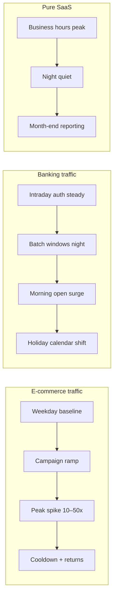

**AIOps consequences:**

| Domain | Baseline model | Error budget mindset |
|---|---|---|
| E-commerce | Seasonal + campaign calendar | “Burning budget fast in a 4-hour peak can still be OK if GMV holds” |
| Banking | Intraday + holiday + batch schedule | “No ‘peak exception’ for the authorization path” |
| Pure SaaS | Weekly seasonality | “Off-hours downtime is cheaper, but enterprise SLA still tightens” |

> [!IMPORTANT]
> **Do not train anomaly models on a “flat year” and then use them for BFCM.**
> The model will treat legitimate traffic as anomaly → page on-call → on-call ignores → when a real incident hits during peak, the signal is already dead. See [07 — Anomaly Detection](../07-anomaly-detection/README.md).

### 1.3 Consistency: eventual catalog vs strong ledger

- **Catalog / search / PDP**: 30–120s stale is often acceptable; AIOps prioritizes availability and cache resilience.
- **Inventory reservation**: needs **business-level correctness** (no oversell), even if the backend uses reservation TTL + compensation.
- **Payment authorization & ledger postings**: need **strong consistency / carefully designed sagas**. “Eventual” is not an excuse to double-post.

> [!WARNING]
> **Edge case**: Showing “in stock” (eventual inventory) while reservations are exhausted → flash sale oversell. This is not only a UX bug; it creates refund + support + payment reverse storms — a real-money incident.

### 1.4 Compliance surface

| Control area | E-commerce | Banking | AIOps implication |
|---|---|---|---|
| Card data (PAN) | Tokenization / PSP-hosted fields | Often strict PCI scope | Mandatory log redaction; no AI ingest of raw PAN |
| Dual control | Rare | Frequent (four-eyes) | Auto-remediation blocked by policy |
| Audit trail | Business analytics + security | Regulatory evidence | Every auto action needs immutable log |
| Data retention | Cost-driven | Regulator-driven (often longer) | Observability cost rises; different sampling strategy |
| Cross-border log transfer | More flexible | Restricted | Multi-region + residency architecture |

### 1.5 Blast radius mental model

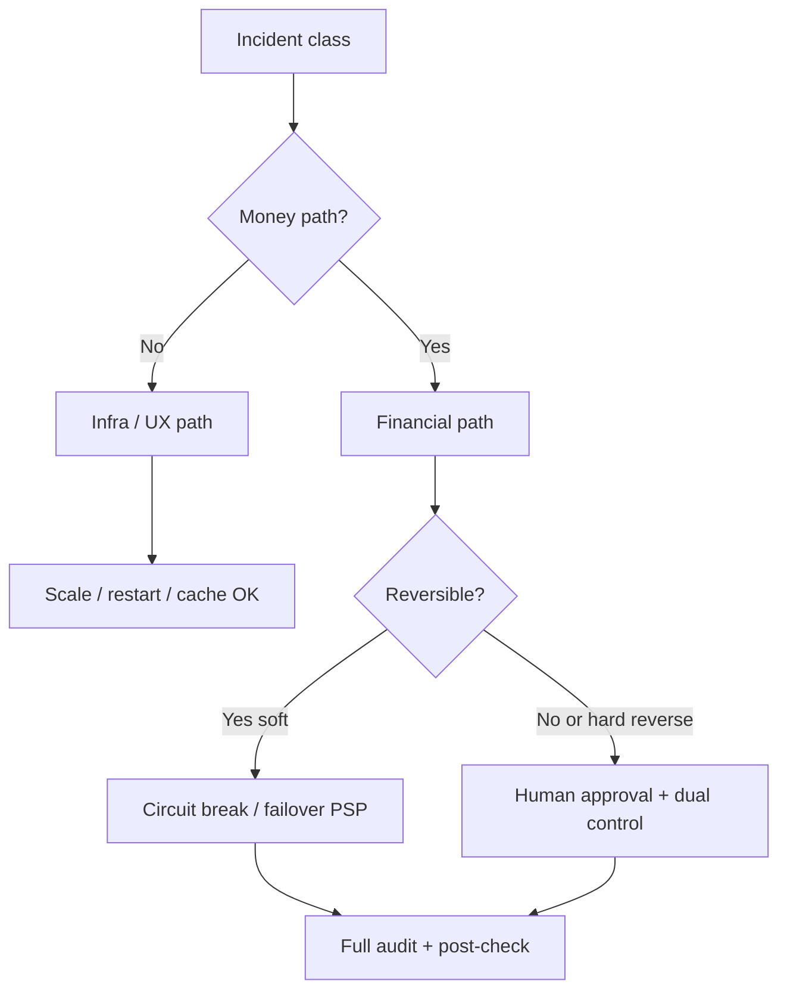

**Principal SRE rule:** map every alert class into one of four blast-radius buckets before attaching remediation:

1. **Read-only / UX** — safe to auto
2. **Capacity / traffic shaping** — auto with guardrails
3. **Money movement adjacent** (circuit, routing) — conditional auto
4. **Money movement / risk / account state** — human-only

### 1.6 Checklist: domain intake before “turning on AIOps”

- [ ] Which money paths are absolute P0 (auth, capture, settle, refund, transfer)?
- [ ] Is the next 12-month peak calendar encoded?
- [ ] Has the compliance owner signed the remediation whitelist?
- [ ] Do logs/metrics touch PAN/PII — where is redaction?
- [ ] Are reconciliation signals in observability, or only in finance ops?
- [ ] Does error budget policy separate “storefront” vs “payment rails”?

---

## 2. E-commerce reliability patterns

> [!NOTE]
> **KEY IDEA**
> E-commerce reliability is not “homepage uptime.” Customers can tolerate a homepage that is 1 second slow; they cannot tolerate **checkout fail** or **payment success with a lost order**. AIOps must prioritize the pipeline: **Cart → Inventory → Payment → Fulfillment**, and understand traffic shape by campaign.

### 2.1 Traffic shape: BFCM / 11.11 / Lunar New Year

```text
Typical traffic shape (relative):

Normal weekday:     ████
Promo weekend:      ████████
11.11 ramp-up:      ████████████████
Flash sale open:    ████████████████████████████  (spike 1–5 minutes)
Post-peak plateau:  ██████████████
Returns week:       ██████████  (different profile: more read + refund API)
```

**Operational characteristics:**

| Phase | Dominant risk | AIOps focus |
|---|---|---|
| Ramp-up | Capacity under-estimate | Predictive scale, cache warm |
| Open spike | Thundering herd, stampede | Queue shedding, admission control |
| Plateau | Dependency saturation (PSP, DB) | Dependency SLO, circuit breakers |
| Cooldown | Webhook retry storms, reconciliation lag | Backoff policy, DLQ observability |
| Returns | Refund path, inventory restock races | Separate business SLIs for reverse flows |

> [!TIP]
> **Why seasonal baselines matter more than static thresholds?**
> Threshold `checkout_error_rate > 2%` may be right on a normal day but **wrong** during a flash sale if the denominator (attempts) rises 20× and some errors are client abandon. Conversely, 0.8% error rate can be catastrophic if absolute failed payments equal billions of GMV.

### 2.2 Shopify-style lessons / resilient payment thinking

Recurring themes in public engineering blogs of large commerce platforms (do not copy code — copy **decisions**):

| Pattern | Why it exists | AIOps hook |
|---|---|---|
| **Idempotency keys** | Client retry + network blip does not double-charge | Metric: `duplicate_key_reuse_rate`, alert on abnormal spike |
| **Timeout budgets** | Edge must not wait forever and storm connections | Trace: budget remaining per hop |
| **Retries with jitter** | Avoid sync retry storms into PSP | Correlate retry_count with PSP latency |
| **Circuit breakers** | Fail fast when dependency is dead | Breaker state change = first-class event |
| **Bulkheads** | Cart browse must not die because payment pool is empty | Pool saturation per bulkhead |
| **Graceful degradation** | Suggest COD / secondary method when primary PSP is bad | Business SLI: “successful checkout by method” |

> [!IMPORTANT]
> **Idempotency is business correctness, not only HTTP hygiene.**
> At-least-once delivery (Kafka, webhooks, mobile retry) is the default. Exactly-once **business effect** must be designed at the application layer. See [06 — Kafka](../06-kafka/README.md).

#### Timeout budget & circuit breaker (decision summary)

| Decision | Why |
|---|---|
| PSP timeout < client timeout | Avoid ghosts: client gives up, server still auths |
| ≤1 server retry + jitter; do not retry hard declines | Avoid storms + issuer spam |
| Breaker OPEN/HALF_OPEN is a first-class event | Correlation/RCA needs state, not only delayed latency |
| Export breaker transitions → bus/metrics | [06 Kafka](../06-kafka/README.md), [08 Correlation](../08-alert-correlation/README.md) |

Design budgets **backward from the client** (e.g. client 8s → server ~7.5s → leave room for risk + 1 retry), not by summing bottom-up timeouts by gut feel. Support with traces: [05 — Tempo](../05-tempo/README.md).

### 2.3 Pipeline SLIs: cart → inventory → payment → fulfillment


| Stage | Suggested SLI | SLO orientation | Edge notes |
|---|---|---|---|
| Cart add | Success rate, p95 latency | Looser than checkout | Cache miss stampede |
| Inventory reserve | Reserve success, conflict rate | Tight during flash sale | Oversell vs under-sell tradeoff |
| Checkout start | Session create success | Medium | Config/campaign flag bugs |
| Payment auth | Auth success, auth latency | **Very tight** | PSP partial outage |
| Order create | Post-payment order persist | **Zero tolerance** money-success/order-fail | Dual-write failure |
| Fulfillment accept | Ack rate, lag | Business-day sensitive | Warehouse cut-off |
| Refund | Refund success, time-to-refund | Compliance + CX | Reverse path often lacks SLIs |

### 2.4 Real-world e-commerce edge cases

#### Edge A — Flash sale thundering herd

**Symptoms:** QPS rises 30× in 30 seconds; CPU OK but checkout p99 explodes from inventory lock / DB.

**Common mistake:** Scale pods by CPU → too late / wrong layer (web scales, DB does not).

**Right direction:**

- Admission control at the edge (queue, lottery, waiting room)
- Pre-warm cache + connection pools
- Inventory reservation designed to avoid hot-key single SKU
- AIOps: anomaly on **queue depth + reserve conflict**, not only CPU

#### Edge B — Cache stampede

**Symptoms:** TTLs expire together on hot keys (campaign landing), origin overload.

**Why AIOps often misses:** Latency rises “evenly” across many services → correlation sees fan-out but RCA blames an unrelated deployment.

**Observable mitigations:** single-flight / soft-TTL / request coalescing metrics.

#### Edge C — Inventory oversell

**Symptoms:** Orders > stock; then cancel/refund storm.

**Common root causes:**

1. Read replica lag used for stock check
2. Reservation TTL too long + double reservation
3. Compensation saga fails silently
4. Multi-warehouse merge logic race

**AIOps signal:** `orders_created - reservations_committed` drift; do not wait for end-of-day finance. Also watch `reservation_leak` (active reservations ≫ open checkouts) — often broken TTL/abandon, virtual stock held hostage.

#### Edge D — Webhook retry storms

**Symptoms:** PSP/shipping webhook endpoint 5xx → partner exponential retries → self-DoS.

**Mitigations:**

- Endpoint always acks fast, processes async
- Idempotent consumer
- Observe `webhook_inflight`, `retry_attempt_histogram`, DLQ age

> [!WARNING]
> **Webhook storms often appear after you “fixed” the primary incident.**
> On-call celebrates payment auth green again — 20 minutes later the API gateway dies under retry backlog. Correlation must treat “recovery phase” as its own phase.

### 2.5 AIOps for e-commerce: seasonal baselines

| Model input | Required? | Reason |
|---|---|---|
| Hour-of-day / day-of-week | Yes | Shopping has rhythm |
| Campaign calendar (11.11, BFCM, Lunar New Year) | **Yes** | Legitimate peak |
| Marketing push notifications | Recommended | Micro-spikes |
| Payment method mix | Recommended | COD vs card vs wallet |
| Region/storefront | Yes if multi-market | VN Lunar New Year ≠ US Cyber Monday |

**Principle:** separate anomaly classes:

1. **Infra health anomalies** (CPU, GC, pod restarts)
2. **Traffic shape anomalies** (QPS vs campaign forecast)
3. **Business KPI anomalies** (conversion, AOV, auth rate)
4. **Money integrity anomalies** (paid-but-no-order, oversell drift)

Only class (1) and part of (2) should page on-call at 3 a.m. Classes (3)/(4) need different routing (commerce ops / risk / finance tech).

### 2.6 E-commerce readiness checklist

- [ ] Campaign calendar feeds the anomaly service
- [ ] Checkout & payment SLIs separated from homepage SLIs
- [ ] Waiting room / admission control metrics visible
- [ ] Inventory conflict & oversell drift dashboards
- [ ] Webhook DLQ age + retry histogram
- [ ] Post-payment order create guaranteed observability (the “money-success/order-fail” killer)
- [ ] Load test profile matches flash sale, not only steady ramp
- [ ] Timeout budget documented per hop; breaker events as telemetry
- [ ] Post-peak returns/refund dashboard

### 2.7 Common e-commerce anti-patterns

| Anti-pattern | Fix direction |
|---|---|
| Only monitor homepage / scale by CPU only | Funnel SLI + scale by queue/lag |
| One global error rate / suppress all alerts during sale | Slice by method/PSP; integrity-first in campaigns |
| Infinite mobile retry / shared browse+pay pool | Budget+jitter; bulkhead |
| Cache stock = source of truth | Reservation service is truth |

> [!WARNING]
> **Gross GMV at peak ≠ reliability success** if oversell + refund + chargeback after 48h eat the margin. Measure **net GMV after reverse flows**.

---

## 3. Banking & core payment systems

> [!NOTE]
> **KEY IDEA**
> Banking AIOps operates in a world of **dual control, change windows, and audit**. Authorization latency measured in milliseconds has business meaning (authorization timeout = declined = lost interchange / bad CX). Reconciliation is not a month-end accounting report — it is a **real-time operational signal**.

### 3.1 Dual control, change windows, four-eyes

| Control | Operational meaning | AIOps impact |
|---|---|---|
| **Four-eyes** | Two people approve sensitive change | Auto-remediation must not bypass |
| **Change window** | Deploy/core change only in allowed hours | Models must know “freeze period” |
| **Segregation of duties** | Dev ≠ prod break-glass ≠ audit | LLM agent must not both propose and execute money actions |
| **Maker-checker** | Create vs approve separated | Runbook automation needs human checkpoint state machine |

> [!IMPORTANT]
> **“Automation” in banking ≠ “remove people.” It = shorten detect + enrich + propose, while keeping approval in the right place.**
> See the safety framework in [11 — Remediation](../11-remediation/README.md).

### 3.2 Latency budgets on the authorization path

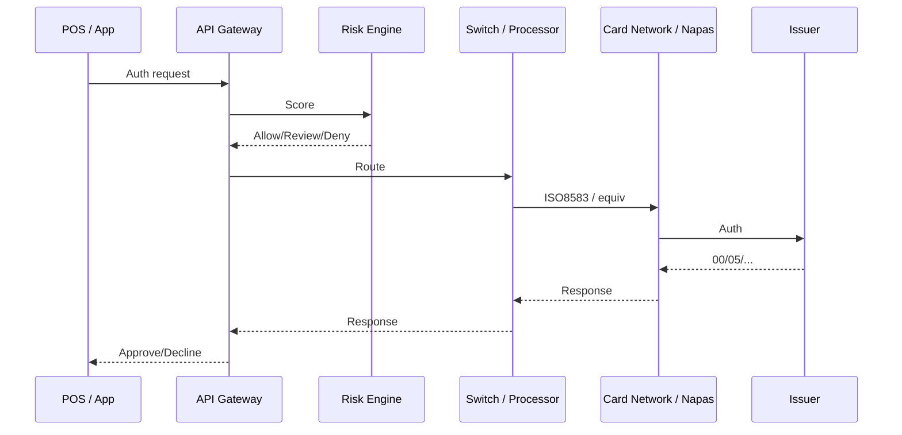

**Why ms matter:**

- Client timeouts (POS/mobile) are often 2–10s end-to-end
- Each hop that is “too safe” (retry + long timeout) **consumes budget** and raises duplicate auth risk
- p99 is worse than mean: AIOps must watch tail latency, not only average

| Hop | Suggested budget (illustrative) | Signal |
|---|---|---|
| Edge → API | 50–100ms | gateway latency |
| Risk | 50–150ms | model timeout rate |
| Switch → network | 100–400ms | external dependency SLO |
| Issuer | variable | decline code mix |
| Total | < client timeout − safety margin | e2e auth SLI |

> [!TIP]
> **Set timeouts backward from client budget; do not sum upward by gut feel.**
> Bottom-up summing often exceeds the real timeout → retry storm + ghost transactions.

#### Decline codes as operational signal

Do not only count HTTP errors. Group approve / soft-decline / hard-decline / issuer-unavailable / fraud / format-error; **owners differ** (payments vs risk vs eng). AIOps: anomaly on **code mix shift** over 1–5 minute windows, not only volume.

### 3.3 Reconciliation as first-class observability

**Operational definition:** match “truths” from multiple ledgers:

- Internal ledger
- PSP / card network reports
- Bank settlement files
- Wallet top-up / cash movement

| Signal | Meaning | Suggested severity |
|---|---|---|
| Unmatched auth | Auth without post/ledger | P1 if rising |
| Unmatched capture | Capture without corresponding auth | P1 |
| Settlement lag > SLA | File/batch late | P2→P1 near cut-off |
| Amount mismatch | Wrong amount | P1 immediate |
| Ghost transaction | One side has it, the other does not | P1 + finance bridge |

> [!WARNING]
> **If recon only runs as a 02:00 batch and tech never sees metrics, you are blind 22 hours a day.**
> Put recon counters/lag into Prometheus/Grafana like any other SLI ([03 — Prometheus](../03-prometheus/README.md)).

### 3.4 Banking/payment edge cases

#### Partial settlement

Some transactions settle, some stay pending — “success rate” dashboard stays green while cash flow drifts.

**AIOps needs:** state machine metrics by lifecycle (`auth → clear → settle → reconcile`), not only binary success.

#### Ghost transactions

Client times out; issuer already approved; merchant retry creates a second auth or a reverse that does not match.

**Observable mitigations:**

- End-to-end correlation id
- Idempotency at the switch
- Explicit reverse/void workflows with SLIs

#### Clock skew & leap second

Comparing timestamps across core, switch, network file: clock skew → false recon mismatch; leap second/batch window is rare but has already broken job schedulers.

**Checklist:** NTP health is a money-system dependency, not an “infra nice-to-have.”

#### Holiday calendars

T+1/T+2 shifts with holidays; central-bank/weekend/regional holidays make “normal lag” look like anomaly.

**Model:** calendar-aware baselines are mandatory (section 6).

### 3.5 Regulatory audit trail for automated remediation

Every auto action that touches production banking must answer:

1. **Who/what** decided? (rule id, model version, approver)
2. **Based on which signals?** (alert ids, metrics snapshot)
3. **What was done?** (API call, change ticket, breaker open)
4. **Result?** (success/fail, before/after)
5. **Was there rollback?** (who pressed, when)
6. **Kept how long?** (retention policy per circular/internal policy)

> [!IMPORTANT]
> **LLM propose must not be the sole source of truth in audit.**
> Store controlled prompt/response + structured decision fields. See [10 — LLM Agent](../10-llm-agent/README.md).

### 3.6 Banking AIOps checklist

- [ ] Authorization e2e latency SLO split by channel (ATM/POS/ecom/QR)
- [ ] Decline code mix dashboard (issuer vs acquirer vs risk)
- [ ] Recon lag & mismatch metrics real-time/near-real-time
- [ ] Change freeze calendar integrated
- [ ] Dual-control enforced in remediation engine
- [ ] NTP / time sync alerts treated as P2+ for money zones
- [ ] Immutable audit store for auto actions
- [ ] Decline code mix + ghost transaction playbook
- [ ] NTP alerts mapped to money-zone severity

### 3.7 Zone-aware policy & runbook skeleton

Split policy by zone: **core/ledger** (very limited auto), **switch/middleware** (topology correlation), **digital API** (scale/canary), **network edges** (synthetics + partner SLO). One “global” remediation catalog is an anti-pattern.

Auth degradation runbook (short): confirm segmented SLI → dependency (risk/switch/network/issuer) → change freeze? → impact → external bridge or scale/shed by policy → **no auto reverse** → audit even the decision to “do nothing.”

---

## 4. Fintech / payment processors

> [!NOTE]
> **KEY IDEA**
> “Stripe-class” thinking: beautiful APIs, first-class idempotency, public failure modes, multi-tenant isolation, and marketing uptime must be checked against **real error budget**. Fintech sits between merchant and bank — you are both someone else’s dependency and dependent on the network behind you.

### 4.1 Idempotency keys & exactly-once business effect

```text
Common delivery guarantee:
  Network / queue / webhook = at-least-once

Business requirement:
  Charge customer once, credit merchant once

Solution:
  Idempotency key + durable request log + state machine
  → “exactly-once effect” even when delivery repeats
```

| Component | Decision | Why |
|---|---|---|
| Key scope | per-merchant + key | Avoid cross-tenant collision |
| Key TTL | 24h–72h+ by product | Matches real client retry windows |
| Response replay | Return original response on key reuse | Client needs deterministic behavior |
| Concurrent same key | Lock / first-writer-wins | Mobile double-submit race |

**AIOps metrics:**

- `idempotency_replay_total`
- `idempotency_conflict_total`
- `in_flight_duplicate_window`

A `conflict` spike can be a client bug — or attack/misconfiguration.

### 4.2 Uptime marketing vs error budget reality

| Marketing claim | Error budget reality |
|---|---|
| “99.99% API uptime” | ~4.3 minutes downtime/month |
| “Global availability” | May exclude maintenance / regional degradation |
| “Successful payments” | Definition of success (2xx? approved? captured?) must be explicit |

> [!TIP]
> **Internal SRE must not be managed by marketing slides.**
> Manage by **customer-perceived SLIs**: authorize success, payout success, webhook delivery success, dashboard query success — each with its own error budget.

### 4.3 Multi-PSP failover & smart routing

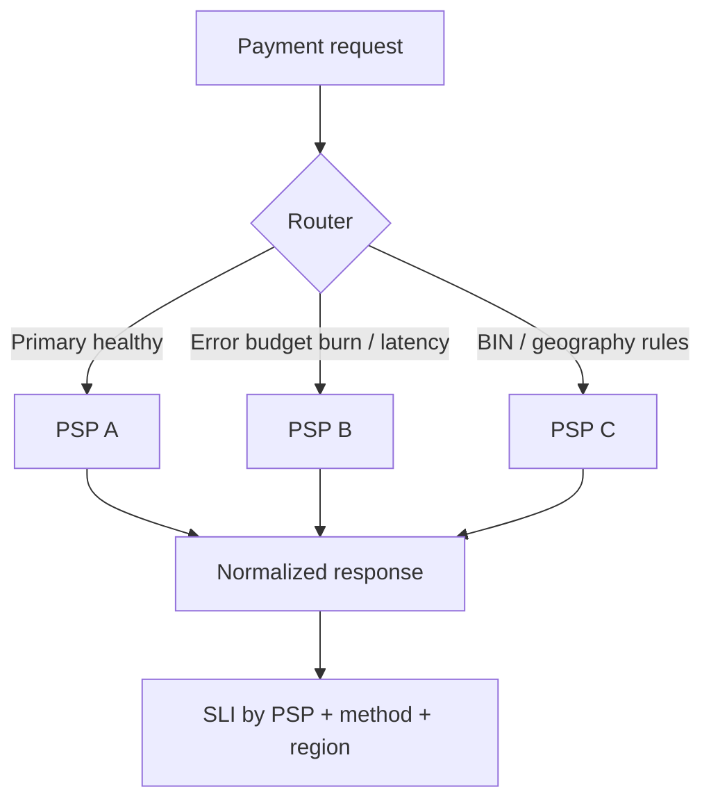

**Routing decisions based on:**

1. Real-time success rate per PSP
2. p95/p99 latency
3. Cost (MDR) — **careful**: cost optimization must not kill success
4. Hard constraints (BIN, currency, 3DS capability)
5. Circuit state

> [!WARNING]
> **Failing over 100% of traffic the moment primary “looks bad” can take secondary down with it.**
> Use canary failover (5%→25%→50%→100%) + watch secondary saturation. Pattern matches canary remediation in [11 — Remediation](../11-remediation/README.md).

### 4.4 Edge: partial outage by BIN/region/method

Card networks / PSPs rarely go “cleanly down.” Reality:

- Visa OK, one acquirer path bad
- QR OK, international cards bad
- 3DS provider slow → e-com auth drops, POS still good

**Observability consequence:** intentional high-cardinality dimensions: `psp`, `method`, `bin_range_bucket`, `region`, `channel` — but bucket carefully to avoid cost explosions ([01 — Observability](../01-observability/README.md) cardinality).

### 4.5 Fintech processor checklist

- [ ] Idempotency semantics documented + tested under concurrency
- [ ] SLIs split by PSP/method/region
- [ ] Smart routing shadow mode before auto
- [ ] Webhook delivery SLO + retry policy public/internal aligned
- [ ] Tenant isolation tested (noisy neighbor)
- [ ] Status page signals match internal SLIs (avoid “green lie”)

---

## 5. Observability design for transaction paths

> [!NOTE]
> **KEY IDEA**
> Transaction path observability = RED for APIs **plus** business SLIs. Traces must connect app → risk → PSP → bank (to the extent you are allowed to see). Logs must be sufficient for audit without becoming a PAN/PII warehouse.

### 5.1 RED + business SLIs

| Layer | Metrics | Question answered |
|---|---|---|
| RED | Rate, Errors, Duration | Is the service healthy? |
| Business | Payment success, auth rate, conversion | Is money/business flow healthy? |
| Integrity | Recon mismatch, paid-no-order | Do the books match? |
| Dependency | PSP latency/error, DB pool | Are external deps taking us down? |

**Minimum SLI set for money path:**

1. `payment_auth_success_ratio`
2. `payment_auth_latency_p99`
3. `checkout_conversion_ratio` (ecom)
4. `post_payment_order_persist_success`
5. `refund_success_ratio` + `refund_latency`
6. `settlement_lag_seconds`
7. `recon_unmatched_count`
8. `webhook_success_ratio`

### 5.2 Trace critical path

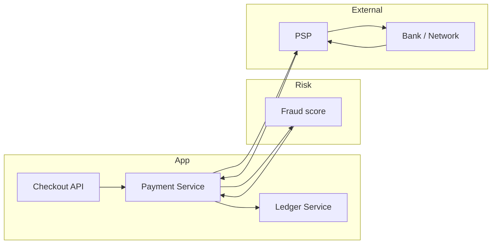

**Instrumentation decisions (WHY):**

| Decision | Why |
|---|---|
| Span events for state transitions (`auth_requested`, `auth_approved`) | Logs may drop; span events stick to the right trace |
| Attribute `payment_id` hashed / merchant_id | Correlate while reducing PII |
| Propagate W3C tracecontext across message bus | Async capture/settle still joins ([02 — OpenTelemetry](../02-opentelemetry/README.md), [05 — Tempo](../05-tempo/README.md)) |
| Do not trace full PAN | Compliance + cardinality |

### 5.3 Log redaction: PAN, PII, secrets

> [!WARNING]
> **One log line containing PAN can expand PCI scope for the entire logging stack.**
> Redaction must be at **source + collector**; do not trust “devs will be careful.”

**Redaction pipeline checklist:**

- [ ] Application scrubbers (defense in depth)
- [ ] OTel Collector / Alloy processors drop/hash sensitive fields
- [ ] Loki pipelines reject known PAN patterns
- [ ] Separate access control for raw vs redacted
- [ ] Audit who queries payment log namespaces
- [ ] LLM training data **must not** use raw payment logs

### 5.4 Cardinality vs privacy vs useful dimensions

| Dimension | Useful? | Risk |
|---|---|---|
| `psp`, `method`, `region` | Very high | Low if enum |
| `merchant_id` | High (multi-tenant fintech) | Cardinality explosion |
| Full `bin` | Fraud/network debug | Privacy + cardinality |
| `bin_bucket` (6–8 digit bucketed) | Usually enough | Acceptable |
| `user_id` | CX debug | PII — avoid metric labels |

**Rule:** metric labels = low/medium cardinality enums; high-cardinality ids live in logs/traces with sampling.

### 5.5 Sampling strategy for money systems

| Signal | Suggested sampling | Reason |
|---|---|---|
| Metrics aggregates | Full (via metrics) | Cheap, need continuity |
| Success-path traces | Tail-based keep errors + slow | Cost |
| Auth-failure traces | Keep high / near full | Money debug |
| Money integrity anomaly traces | Always keep | Rare but critical |
| Info logs | Aggressive filter | Cost + privacy |
| Error/audit logs | Longer retention | Compliance |

### 5.6 Suggested dashboard topology

1. **Executive money health** — success, GMV at risk, recon
2. **Checkout funnel** — step conversion
3. **PSP dependency** — per provider
4. **Risk engine** — latency + deny rates
5. **Integrity** — paid-no-order, oversell, unmatched
6. **Webhook/async** — lag, DLQ
7. **Compliance/access** — who queried sensitive data

Cross-link pillars: [01](../01-observability/README.md), [03](../03-prometheus/README.md), [04](../04-loki/README.md), [05](../05-tempo/README.md).

### 5.7 Synthetics, exemplars & instrumentation review

**Synthetics** (1–5 minutes): cart, checkout session, payment test MID, webhook health; batch ETA probe in banking windows. Label `traffic_type=synthetic`. Do not fire real cards on production networks if that creates recon noise — use approved test MIDs.

**Exemplars:** auth burn rate → failed-sample `trace_id` → Tempo separates PSP timeout vs risk deny → attach to incident ([03](../03-prometheus/README.md) + [05](../05-tempo/README.md)).

**Pre-peak/audit checklist:** P0 RED stable; business counters do not double-count retries; traces across async; no PAN/user_id labels; integrity dashboard has owner; synthetic/real filterable; alert → runbook link.

---

## 6. Domain-specific anomaly detection

> [!NOTE]
> **KEY IDEA**
> In ecom/banking, an “anomaly” can be **good fraud (blocked)**, **good campaign (traffic up)**, or **bad infra**. If one model merges them all, you page the wrong team and people mute alerts. Separate models by layer.

### 6.1 Confusion matrix: fraud vs infra anomaly

| Reality \ Prediction | Infra anomaly | Fraud anomaly | Business spike | Benign |
|---|---|---|---|---|
| PSP degradation | **Desired TP** | FP (risk team) | FP | Dangerous FN |
| Card testing attack | FP (SRE) | **TP** | FP | FN |
| Flash sale | Classic FP | FP | **Expected** | — |
| Deploy bad config | **TP** | FP | FP | FN |
| Marketing push | Mild FP | — | Expected micro | — |

> [!TIP]
> **Routing matters as much as detection.**
> The same “auth decline spike” signal can be: issuer down (SRE/payments), fraud rule (risk), or campaign traffic mix shift (commerce). Correlation enrichment must carry campaign/risk context.

### 6.2 Calendar-aware & campaign-aware baselines

**Mandatory inputs for ecom/bank models:**

```text
baseline_features = {
  hour, dow, month,
  is_public_holiday,
  is_bank_holiday,
  is_campaign_day,
  campaign_id_bucket,
  days_to_salary_like_cycle,   # optional local patterns
  batch_window_flag,           # banking
  change_freeze_flag
}
```

| Technique | When | Trade-off |
|---|---|---|
| STL / seasonal ESD | Stable weekly rhythm | Weak on one-off events |
| Prophet-like / regression with regressors | Calendar regressors available | Operationally complex |
| Separate models per “regime” | Peak vs normal | Needs regime detector |
| Suppression windows | Known campaigns | Dangerous if suppress too wide |

> [!IMPORTANT]
> **Suppression ≠ blindness.**
> During BFCM, do not turn anomaly off; **change thresholds / target metrics** (e.g. from QPS anomaly to auth_success and paid-no-order).

### 6.3 Separate models: infra health vs business KPI

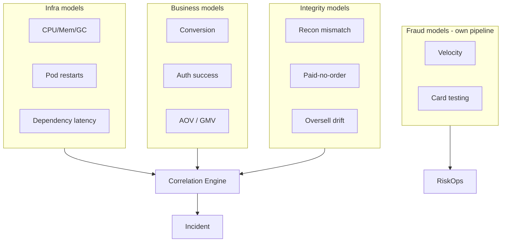

**Why separate:**

- Different training data
- Different owners
- Different false positive cost
- Different action playbooks

Algorithm reference: [07 — Anomaly Detection](../07-anomaly-detection/README.md).

### 6.4 Edge: “good anomaly”

Examples:

- Auth deny rises because of a new fraud rule — **correct**
- Traffic rises because of KOLs — **correct**
- Latency rises slightly because 3DS step-up is enabled — **security trade-off**

AIOps must ingest **change events** (rule deploy, campaign start, feature flag) as covariates; otherwise every change becomes an incident.

### 6.5 Anomaly checklist for money domains

- [ ] Campaign/holiday feed automated
- [ ] Separate alert channels: SRE / Payments / Risk / Commerce
- [ ] BFCM playbook: metrics priority list
- [ ] Model performance reviewed post-peak (precision/recall)
- [ ] Integrity anomalies never “priority low”
- [ ] Fraud pipeline does not share auto-remediation with infra without a gate
- [ ] Change events ingested as covariates; post-peak model review

### 6.6 False positive economics & regime detector

Optimize **precision** for infra pages at night; keep **high recall** for integrity & auth. One global “sensitivity knob” usually both spams and misses.

Regime before detector: `NORMAL` | `CAMPAIGN` (integrity-first) | `INCIDENT` (suppress children) | `BATCH_WINDOW` | `FREEZE`. Wrong regime → wrong downstream pipeline — investing in regime labels often has higher ROI than adding another LSTM.

---

## 7. Alert correlation in checkout storms

> [!NOTE]
> **KEY IDEA**
> One PSP timeout can make 50–500 services scream. Without correlation, on-call chases every service. Goal: **one incident**, root dependency = payment gateway/PSP path, plus business blast radius (GMV/orders).

### 7.1 Classic story

```text
T+0s     PSP A latency ↑
T+5s     payment-service error_rate ↑
T+10s    checkout-service SLO burn ↑
T+15s    order-service timeouts ↑
T+20s    api-gateway 5xx ↑
T+30s    mobile BFF circuit open alerts × N regions
T+40s    cart service “slow” (thread pool)
T+60s    120 alerts → 1 human brain melts
```

**With good correlation:**

```text
Incident INC-20441
Title: PSP A degradation → checkout payment path
Root dependency: psp:A
Evidence: latency_p99 2.1s → 8.4s; auth_success 98% → 81%
Affected: checkout, order, bff-mobile
Business impact: ~$X GMV/min estimated
Suggested actions: open breaker to PSP B (canary), scale payment-service workers (optional)
```

Build the engine: [08 — Alert Correlation](../08-alert-correlation/README.md).

### 7.2 Topology: payment gateway dependency graph

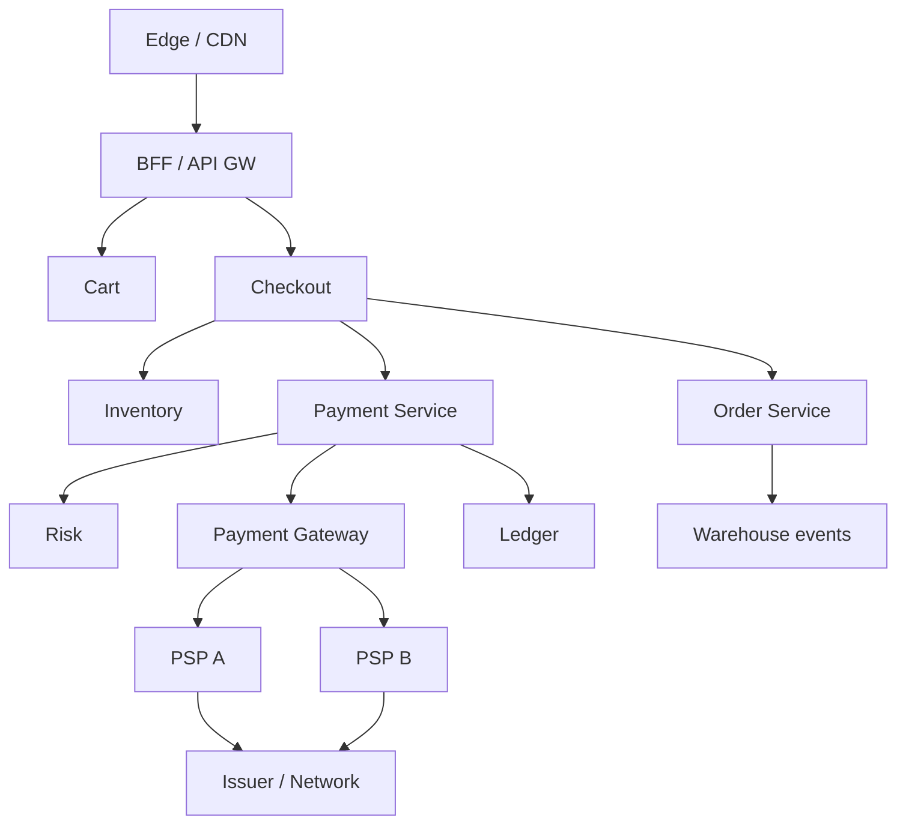

**Topology-aware correlation rules:**

1. Prefer roots near external dependencies when many branches fail together
2. Do not pick “api-gateway” only because degree is high — high degree is often a symptom aggregator
3. Use temporal order + trace parent links to confirm ([09 — RCA](../09-root-cause-analysis/README.md))

### 7.3 Suggested grouping keys for checkout storms

| Key | Used to |
|---|---|
| `payment_path_id` | Group every alert on the same money path |
| `psp` | Split partial outages by provider |
| `channel` | app/web/POS |
| `region` | Multi-region failover decisions |
| `campaign_id` | Avoid mistaking peak for outage |

### 7.4 Business impact enrichment

Correlation is not only noise reduction — it must **attach money**:

- Estimated failed checkouts/min
- GMV at risk
- Top merchants affected (fintech)
- Whether capture/settle delayed vs auth declined (different pain)

> [!TIP]
> **On-call decides by impact, not alert count.**
> 3 alerts with $50k/min risk matter more than 300 CPU alerts on a non-critical batch.

### 7.5 Money-path correlation checklist

- [ ] Dependency graph has PSP/bank edges, not only K8s services
- [ ] Incident title templates include business impact fields
- [ ] Child alerts suppressed after root identified
- [ ] Recovery-phase webhook storms correlated to original incident
- [ ] Synthetic checkout probes included as early signal
- [ ] Business impact fields on P1; child silence TTL (not forever)

### 7.6 Applying 5 stages + wrong-correlation risk

From [08](../08-alert-correlation/README.md): dedup pods → group `payment_path_id`/`psp` → topology to PSP → causal order → enrich GMV/campaign/breaker.

**Wrong correlation can be more dangerous than no correlation:** merging fraud + PSP latency into one root then auto-failing over — does not reduce fraud, can burn secondary. Use multi-hypothesis RCA top-k; humans choose when fraud vs infra branches ([09](../09-root-cause-analysis/README.md)).

---

## 8. Automated remediation: CAN and CANNOT

> [!NOTE]
> **KEY IDEA**
> The question is not “can we auto?” but “**after auto, can we reverse it, and will regulator/audit accept it?**”. Money systems require a risk × reversibility × compliance matrix.

### 8.1 Safe to auto (with guardrails)

| Action | Safe conditions | Verify after action |
|---|---|---|
| Scale checkout/payment pods | Max replica cap, PDB ok | p95 latency, error rate |
| Failover read replica (read path) | Not used for strong ledger reads | Stale read metrics |
| Open circuit to secondary PSP (canary) | Secondary healthy, gradual % | Auth success by PSP |
| Enable waiting room / admit control | Campaign mode / overload confirmed | Queue wait time, conversion |
| Restart unhealthy pods (stateless) | Not during ledger freeze without check | Ready + error rate |
| Increase rate limit for known good webhook IP? | Careful allowlist only | Traffic pattern |
| Toggle cache soft-TTL mode | Known stampede signatures | Origin QPS |

### 8.2 Unsafe without human (usually ban auto)

| Action | Why ban auto |
|---|---|
| Bulk reverse / void / refund | Money movement, customer trust |
| Freeze accounts / merchants | Legal + false positive fraud |
| Change risk thresholds mid-incident | May open fraud or block clean users |
| Force settle / re-post ledger | Integrity risk |
| Disable 3DS globally | Compliance & chargeback risk |
| Replay settlement files | Duplicate money risk |
| Broad data deletion / log purge | Audit destruction |
| “LLM decided to fix money” without schema action | Non-deterministic + audit |

> [!WARNING]
> **Auto-refund “to close the incident” is an anti-pattern.**
> You may create economic holes (attacker triggers fail → auto refund) or double-refund.

### 8.3 Decision matrix: risk × reversibility × compliance

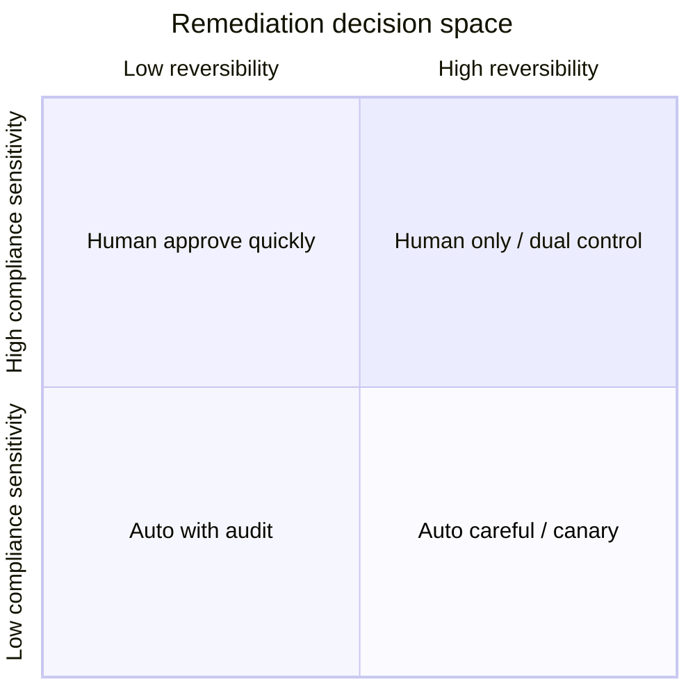

| Risk \ Reversibility | Easy to reverse | Hard to reverse |
|---|---|---|
| **Low + non-compliance** | Auto | Auto + strong verify |
| **Medium** | Auto canary | Two-person approve |
| **High / money / legal** | Approve in-band | Change ticket + freeze |

### 8.4 State machine remediation engine (money-aware)

```text
DETECT → ENRICH → CLASSIFY_PATH(money|ux|infra)
      → POLICY_GATE(compliance, freeze, dual_control)
      → PROPOSE
      → (AUTO | CANARY | APPROVAL)
      → EXECUTE
      → VERIFY
      → (ROLLBACK | ESCALATE)
      → AUDIT_IMMUTABLE
```

**WHY classify path early:** the same “restart pod” action can be safe on BFF but unsafe if the pod holds an in-memory settlement batch (bad design — but real in production).

### 8.5 Guardrail examples (explain decisions, do not dump a framework)

| Guardrail | Decision | Why |
|---|---|---|
| Max traffic shift to secondary PSP 25%/5min | Canary step | Avoid secondary melt |
| Block all money actions during audit freeze | Policy calendar | Compliance window |
| Require `trace_id` + `incident_id` on execute | Provenance | Auditability |
| Dry-run mode default for new actions 14 days | Learning | Reduce surprise |
| Automatic rollback if auth_success does not recover in 3–5 minutes | Verify gate | Fail-safe |

Safety detail: [11 — Remediation](../11-remediation/README.md). LLM propose: [10 — LLM Agent](../10-llm-agent/README.md).

### 8.6 Policy checklist before production auto

- [ ] Whitelist actions signed by compliance + SRE + payments owner
- [ ] Dual-control integrated for restricted catalog
- [ ] Immutable audit sink tested under failure (action still records)
- [ ] Chaos test: secondary PSP cannot take 100% instantly
- [ ] Break-glass procedure documented and drilled
- [ ] Post-action recon check for any action near money path
- [ ] Game day: bad suggestion blocked; fail-closed if audit sink down

### 8.7 Policy table & verify hooks

| action_id | mode | approval | verify |
|---|---|---|---|
| `scale_checkout` | auto | none | checkout_p95 |
| `waiting_room_on` | auto if overload | none | admit_rate |
| `psp_shift_canary` | canary ≤10%/step | pre-approved | auth_success{psp} |
| `psp_shift_majority` | approval | dual | auth + errors |
| `void_auth_bulk` / `risk_threshold_edit` | forbid auto | ticket/committee | recon / fraud+conv |

Policy table = source of truth; LLM only proposes `action_id` values present in the table ([10](../10-llm-agent/README.md)).

Post-action verify: immediate 30–60s (errors/latency) → business 2–5m (auth/conversion) → integrity 5–15m (paid-no-order) → secondary 15–60m (webhook/recon). Fail a gate → rollback or escalate.

---

## 9. Multi-region / active-active for money systems

> [!NOTE]
> **KEY IDEA**
> Active-active for storefront is easier than active-active for **ledger**. CAP is not a theory slide: when a region splits, you choose **correct money** or **accept orders**. Most money systems choose an intentional consistency/partition strategy + saga/outbox, not naive “multi-master balance.”

### 9.1 CAP tradeoffs on ledger

| Approach | Availability under partition | Correctness | Fit |
|---|---|---|---|
| Single primary ledger region | Low in secondary region | High | Many core banks |
| Active-active with conflict-free intents | Higher | Needs CRDT/careful design | Balances are non-trivial |
| Regional ledgers + reconciliation | High | Eventually match | Wallets/some fintech |
| Saga + reservation across regions | Medium | Business-level | Ecom inventory + pay |

> [!IMPORTANT]
> **Do not active-active balance counters with last-write-wins.**
> Lost update = money disappears or doubles on the books.

### 9.2 Conflict resolution, saga, outbox

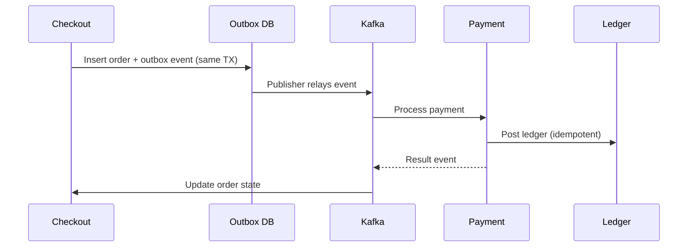

**WHY outbox:** dual-write DB + Kafka is not atomic → lost events → paid-no-order or order-no-pay. Outbox turns “event publish” into an observable operational problem (`outbox_lag`).

**Saga compensation examples:**

- Auth success + order fail → auto void/reverse **with policy**, usually semi-auto
- Reserve inventory + payment fail → release reservation
- Capture fail after fulfill trigger → human + finance path

### 9.3 DR drills must include bank file exchange / batch windows

“Failover app region” is not enough if:

- Settlement file SFTP endpoint only whitelists old-region IPs
- Batch job wall-clock depends on cluster timezone
- HSM / key material missing in DR region
- Partner callback DNS still points to primary region

| Drill item | Pass criteria |
|---|---|
| App failover | Auth SLI recovers within RTO |
| DB/ledger promote | Zero divergence or known bound |
| File exchange path | Test file ACK within window |
| Callback/webhook URL | Partners reach DR |
| Recon after DR | Unmatched under threshold |
| Audit logs continuous | No evidence-store gap |

DR ops reference: [12 — Production](../12-production/README.md).

### 9.4 Multi-region money observability

- SLI by `region` + global composite
- “Split brain detectors” (divergent counters)
- Replication lag as P1 for async ledger copies
- Cross-region trace sampling policy (residency!)

### 9.5 Multi-region money checklist

- [ ] Explicit consistency model documented per entity (cart vs ledger)
- [ ] Outbox/saga metrics on dashboards
- [ ] DR runbook includes partner connectivity
- [ ] Idempotency keys global namespace (or region-safe design)
- [ ] Data residency constraints encoded in routing
- [ ] Regular game day with settlement window simulation

---

## 10. Case study A: flash sale collapse

### 10.1 Context

- 20:00 opens sale of a hot SKU
- Marketing push to 5 million users
- Inventory 3,000 units; expect 50k attempts/minute in the first minute
- Stack: K8s, Redis, checkout, inventory reservation, payment via PSP A

### 10.2 Timeline

| Time | Event | Assessment |
|---|---|---|
| 19:55 | Cache warm partial | Some keys not hot yet |
| 20:00:00 | Waiting room not enabled at right % | Edge breaks |
| 20:00:20 | Inventory hot key lock | p99 reserve 12s |
| 20:01 | Checkout threads exhausted | Error rate 35% |
| 20:02 | Clients retry → storm | PSP A rate limit |
| 20:04 | On-call scales checkout pods | Does not help DB lock |
| 20:08 | Oversell signals appear | Reservation race |
| 20:15 | Sale paused | Lost GMV + later refunds |

### 10.3 Root cause chain

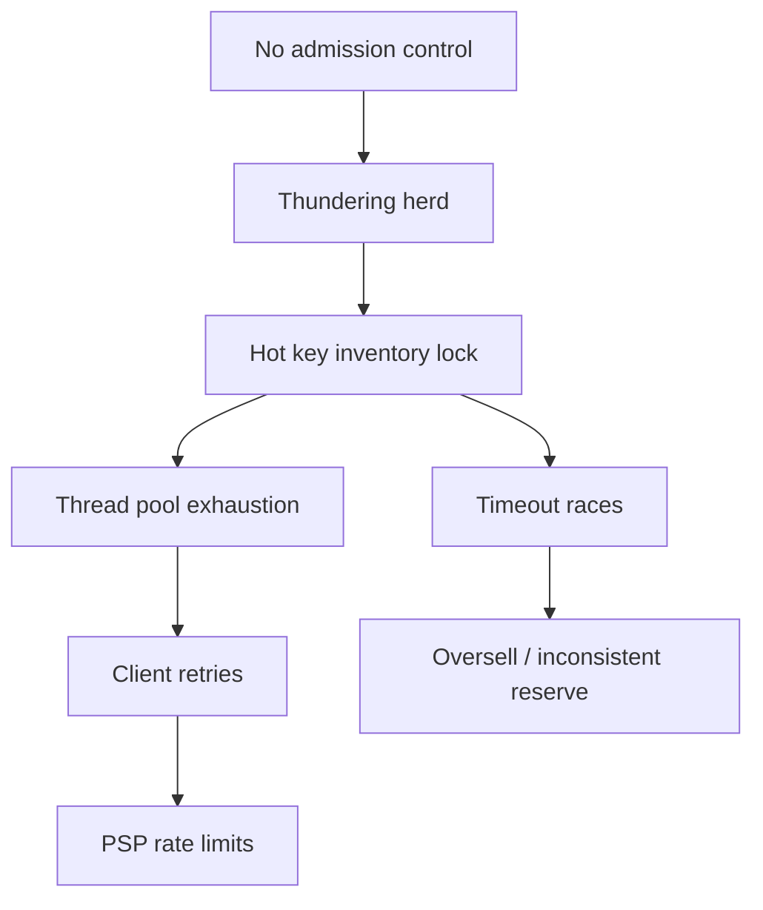

### 10.4 Where AIOps failed

1. **QPS anomaly** paged from 19:58 — suppressed as “campaign expected” **too broadly**
2. **No real-time integrity SLI for oversell drift**
3. **Correlation** saw 80 alerts but rooted “checkout CPU” (symptom)
4. **Auto-scale** ran — safe action but **wrong layer**
5. No playbook for “open waiting room” as auto/semi-auto action

### 10.5 Redesign after the incident

| Area | Change | Why |
|---|---|---|
| Edge | Hard waiting room + lottery | Protect core |
| Inventory | Sharded reservation / bucketing | Reduce hot key |
| SLI | `reserve_conflict_rate`, `oversell_drift` | Detect correctness early |
| Auto | Enable waiting room policy-gated | Right-layer action |
| Load test | Spike 0→N in 10s | Matches reality |
| Model | Campaign mode: watch success & integrity, not QPS alone | Reduce false calm |

### 10.6 Flash sale prevention checklist

- [ ] Waiting room metrics + switch tested week before
- [ ] Hot SKU reservation strategy reviewed
- [ ] Client retry budget documented (mobile)
- [ ] PSP capacity confirmed for peak auth TPS
- [ ] War room roles: commerce / SRE / payments / CX
- [ ] Mobile retry policy matches server budget; banner/status templates ready

### 10.7 Lesson → testable control

Wrong QPS suppress → campaign metric list in git; oversell → race harness in staging; CPU-only scale banned as sole P1 action; waiting room flag drilled before campaign. Postmortem ends with a **verifiable control**, not “we will be more careful.”

---

## 11. Case study B: bank batch job overruns morning open

### 11.1 Context

- EOD/EOI batch: interest accrual, settlement import, card clearing, report extracts
- Window must finish before 08:00 morning open
- Prior night: clearing volume up (holiday backlog) + new job step with heavy recon
- 07:40: batch still 35% left — risk of missing open

### 11.2 Symptoms

| Signal | Value |
|---|---|
| Batch progress metric | 65% at 07:40 (baseline 95%) |
| Downstream online channels | Not open yet, but pre-open health checks fail |
| DB locks | Long transactions from batch |
| Customer impact impending | ATM/mobile login/balance at 08:00 |

### 11.3 Hard decision

```text
Option A: Kill heavy recon sub-job → open on time, recon late
Option B: Delay channel open → books correct, bad CX, public SLA
Option C: Scale up batch workers mid-flight → may worsen locks
Option D: Failover read path for non-critical inquiries only
```

> [!IMPORTANT]
> **This is a business+risk decision, not “restart pod.”**
> AIOps should **propose + simulate impact**, not auto-kill money jobs.

### 11.4 Correct AIOps role

1. **Predictive alert** from 03:30 based on progress velocity (do not wait until 07:40)
2. Correlation: batch lag + DB lock + pre-open synthetics → **one incident**
3. RCA: change “recon step added” + holiday volume regressor
4. Remediation catalog: semi-auto scale **only** whitelisted worker classes; never auto-skip settlement without approval
5. Postmortem metric: `time_to_predict_overrun`

### 11.5 Prevention patterns

| Pattern | Description |
|---|---|
| Batch SLO | Finish percentile vs open time |
| Progress burn rate | Alert when ETA > deadline − buffer |
| Holiday volume models | Calendar-aware capacity |
| Separated resource pools | Batch must not steal online auth pool |
| Feature flags for optional recon depth | Degrade reporting, not clearing |
| Game days | Simulate 2× clearing volume |

### 11.6 Morning-open readiness checklist

- [ ] Batch ETA dashboard visible to ops + tech
- [ ] Hard isolation batch vs online connection pools
- [ ] Pre-open synthetic auth path
- [ ] “Late batch” decision tree approved by business
- [ ] Audit when optional steps skipped
- [ ] Post-holiday capacity plan; batch cannot steal auth pool; comms tree

### 11.7 Batch ETA (operational math)

`velocity = Δprogress/Δt` (15–30m) → `eta = now + (1-progress)/velocity` → alert when `deadline - eta < buffer`. Humans often look at absolute % instead of velocity. Scaling workers that raise velocity but also raise `lock_wait`/`deadlock` is not a win — track both.

---

## 12. Case study C: card network degradation partial

### 12.1 Context

- E-commerce + fintech gateway
- No red status page outage
- Reality: one international card rail slow/decline rising; domestic QR normal
- First symptom: “payment success dipped a bit” — easy for business to ignore

### 12.2 Subtle signs

| Metric | Primary | Domestic QR | Intl cards |
|---|---|---|---|
| Auth success | 96% → 93% | 98% stable | 91% → 78% |
| p99 latency | +200ms | OK | +2.5s |
| Decline code `05`/`91` | ↑ | — | ↑↑ |
| 3DS completion | ↓ | n/a | ↓ |

If you only look at overall 93%, the team may say “not under 90% yet.” **International GMV is already burning.**

### 12.3 Correlation & topology

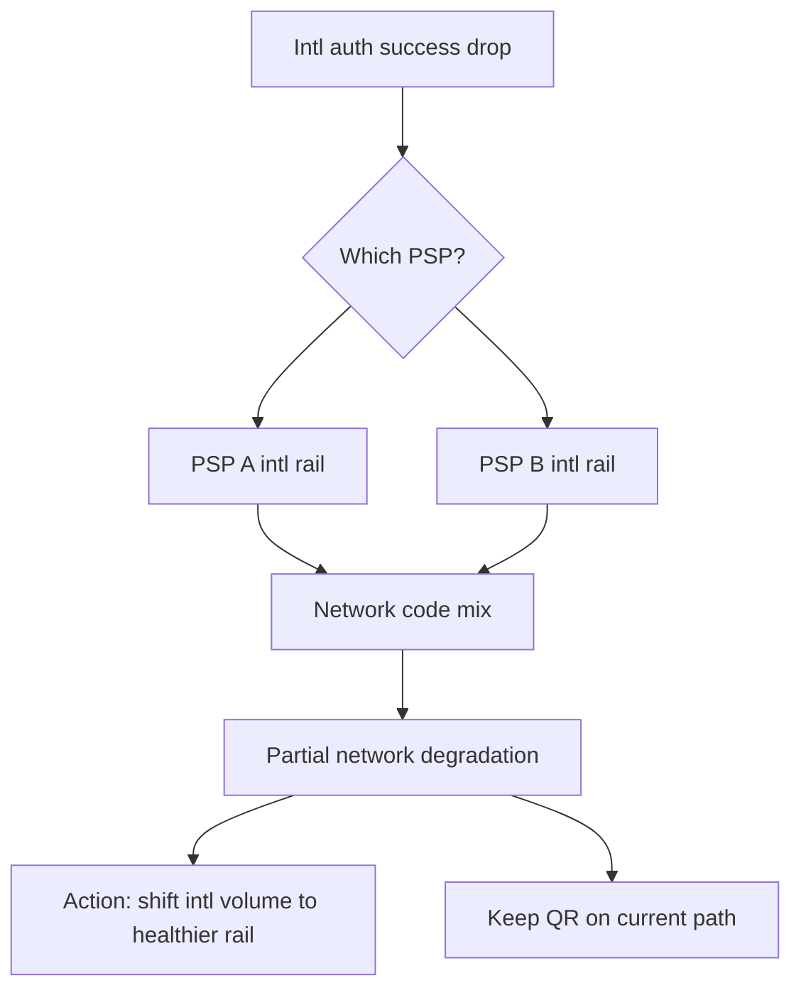

### 12.4 Right / wrong actions

| Action | Assessment |
|---|---|
| Failover 100% of all payments to PSP B | Wrong — QR does not need it; may overload B |
| Shift **intl** 20%→50% canary | Right direction |
| Disable 3DS to raise success | Dangerous compliance/chargeback |
| Detailed merchant status communication | Right (fintech) |
| Blind auto reverse of failed orders | Wrong |

### 12.5 AIOps capabilities needed

1. High-value dimensions without illegal cardinality (method × region × psp)
2. Decline code clustering as first-class features
3. Smart routing recommendations with confidence
4. Customer communication templates for partial degradation
5. Chargeback risk estimate if controls are loosened

### 12.6 Aftermath metrics to track

- Time to detect **segmented** degradation (not overall)
- % traffic shifted safely
- Incremental success recovered
- Residual unmatched recon; false positives on next partial; merchant tickets vs detect time

### 12.7 Communication matrix

War room T+5m (segment/impact); exec if GMV material; merchant when SLA risk; customer if UX is broad; partner/PSP in parallel; compliance if controls degraded. AIOps **drafts** templates; **sending** external usually needs a human.

---

## 13. Cost of observability in regulated env

> [!NOTE]
> **KEY IDEA**
> Regulated environments pay for observability on two axes: **infra cost** (ingest/storage) and **compliance cost** (long retention, access control, audit, tokenization, residency). Blind cost cuts can destroy evidence when a regulator asks.

### 13.1 Domain-specific cost drivers

| Driver | Why more expensive than typical SaaS |
|---|---|
| Longer retention | Circular/internal policy 1–7+ years for some audit logs |
| Lower sampling on money errors | Cannot drop failed auth traces |
| Separate stores | Hot ops vs cold compliance archive |
| Redaction pipelines | CPU/process at collect |
| Access review & SIEM | People + tooling |
| Multi-region residency copies | Duplicate storage |
| Vendor BAAs / PCI scope | Process overhead |

### 13.2 Strategy: hot / warm / cold

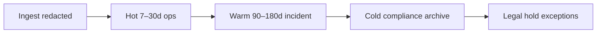

| Tier | Content | Access |
|---|---|---|
| Hot | HD metrics, error traces, recent logs | SRE on-call |
| Warm | Incident bundles, postmortem artifacts | Eng + audit support |
| Cold | Immutable audit, selected transaction evidence | Controlled, ticketed |

### 13.3 Cardinality governance = cost governance

- Enum budgets per team
- Reject metric labels `user_id`, raw `pan`, ultra-high `merchant` without aggregation
- Recording rules pre-aggregate business SLIs ([03 — Prometheus](../03-prometheus/README.md))
- Structured log field allowlists ([04 — Loki](../04-loki/README.md))

### 13.4 Cost vs risk table

| Savings | Risk |
|---|---|
| Sample-drop 90% of payment fail traces | Cannot debug partial outage |
| 7-day log retention for audit actions | Fail regulatory evidence |
| Only overall success metrics | Miss segment outages |
| Shared admin access “for speed” | Compliance finding, insider risk |
| Train LLM on raw logs | Data leakage |

> [!TIP]
> **Cut cost on success path and verbose debug; do not cut integrity + audit + fail path.**

### 13.5 FinOps checklist for regulated observability

- [ ] Unit cost per million spans/logs visible
- [ ] Budget alerts on cardinality explosions
- [ ] Annual compliance retention test (restore sample)
- [ ] PCI scope diagram includes observability components
- [ ] Encryption at rest + key rotation for log archives
- [ ] Quarterly access recertification for payment log indexes

Platform cost link: [12 — Production](../12-production/README.md).

### 13.6 What are you paying to remember?

Keep long: remediation audit, auth-fail traces (bounded), recon evidence. Cut: verbose browse success logs, clickstream stuffed into APM. Cost governance ties to the **money-path product owner**, not only platform auto-cutting — peak spans × retention × multi-region copy easily becomes TB-months.

---

## 14. Production checklist + 90-day roadmap

### 14.1 Production checklist (by domain)

#### A. Observability money path

- [ ] Business SLIs defined & owned (payments, checkout, recon)
- [ ] Trace path app→risk→PSP documented
- [ ] PAN/PII redaction verified with tests
- [ ] Dashboards: funnel, PSP, integrity, batch ETA
- [ ] Synthetics: checkout + auth per channel

#### B. Detection & correlation

- [ ] Campaign/holiday calendars integrated
- [ ] Separate models infra/business/integrity
- [ ] Topology includes external payment edges
- [ ] Checkout storm drills (page volume reduced ≥80%)
- [ ] Fraud vs infra routing validated

#### C. Remediation & governance

- [ ] Action whitelist signed
- [ ] Dual-control for restricted actions
- [ ] Canary PSP failover tested
- [ ] Immutable audit trail restore tested
- [ ] No auto money reverse/freeze/risk-edit

#### D. Multi-region / DR

- [ ] Consistency model per entity written
- [ ] Outbox lag SLI
- [ ] DR includes file exchange & callbacks
- [ ] Residency constraints in architecture review

#### E. People & process

- [ ] War room roster for ecom peak / bank open
- [ ] Runbooks for PSP partial, batch overrun, oversell
- [ ] Postmortem template includes money integrity section
- [ ] On-call shadow with payments SME

### 14.2 90-day roadmap

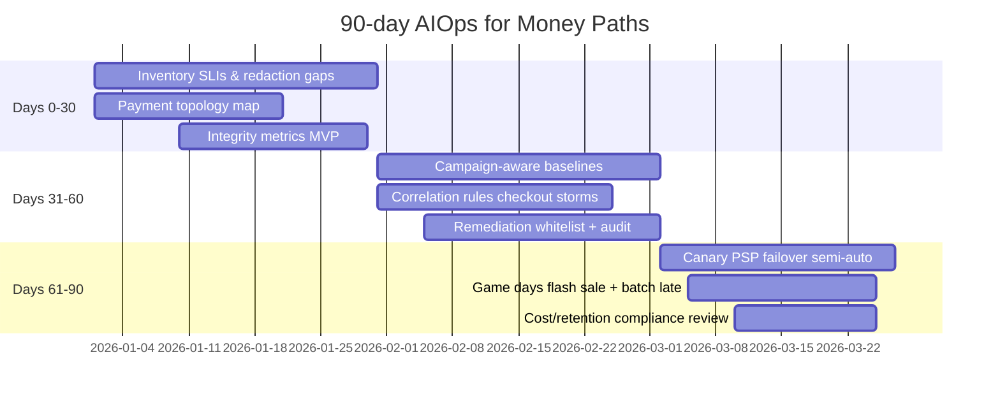

#### Days 0–30 — Foundation

**Goal:** see money truth.

1. Lock P0 flow catalog (auth, capture, refund, transfer, checkout persist)
2. Set SLI/SLO + owners
3. End-to-end redaction audit
4. Recon/unmatched on Grafana
5. Dependency graph v1 (services + PSP)

**Exit criteria:** on-call can look at one screen and know “is money flowing correctly.”

#### Days 31–60 — Intelligence

**Goal:** less noise, right place.

1. Calendar/campaign feed
2. Split anomaly pipelines
3. Correlation templates for PSP incidents
4. RCA playbooks + LLM guardrails (no money execute)
5. Remediation policy engine (deny-by-default money actions)

**Exit criteria:** partial PSP incident = 1 rich ticket; no more 200 loose pages.

#### Days 61–90 — Controlled automation & drills

**Goal:** auto what is reversible.

1. Semi-auto: scale, waiting room, canary PSP shift
2. Verify+rollback hooks
3. Flash sale game day
4. Batch overrun morning-open game day
5. Cost/retention sign-off with compliance

**Exit criteria:** measurable MTTA/MTTR improvement on money path; zero audit gap on auto actions.

### 14.3 Anti-roadmap (do not do early)

- [ ] Full auto refund / reverse
- [ ] Auto-tune fraud thresholds from infra signals
- [ ] Active-active ledger last-write-wins
- [ ] Train LLM on unredacted payment logs
- [ ] Suppress all anomalies during campaigns

### 14.4 90-day success KPIs

| KPI | Baseline → Target (illustrative) |
|---|---|
| Pages per PSP incident | 80 → <10 |
| Detect segmented degradation | 40m → <10m |
| Paid-no-order detect | T+1 day → <5m |
| Auto safe actions success | 0 → 30% P2 capacity class |
| Audit completeness auto actions | unknown → 100% |
| BFCM false pages | high → controlled with integrity focus |
| Segmented detect / audit completeness | hours→min / partial→100% |

### 14.5 RACI & Definition of Done

**RACI (short):** Payments owns SLI; Marketing tech owns campaign feed; SRE+Compliance+CTO approve remediation whitelist; Risk owns fraud models; Finance tech owns recon integrity; Platform owns money-path DR. No RACI → everyone pages, nobody fixes policy.

**DoD money path v1:** P0 SLI+synthetic; topology external edges; correct integrity routing; ≥3 safe autos + verify; 0 money auto missing dual-control; 2 game days + evidence; cost/retention signed; war room card published.

---

## 15. Socratic exercises

> [!NOTE]
> **How to use**
> Work in groups of SRE + payments + compliance. Do not hunt a “single right answer” — hunt the **trade-off you accept and how you measure it**.

### Exercise 1 — Threshold vs baseline

Checkout error rate 1.2% at 21:00 on a normal day (baseline 0.4%). Same 1.2% at 21:00 on 11.11 (baseline 1.0%, traffic ×15).

1. Which incident pages P1?
2. How do absolute failed payments change?
3. How do you design the alert rule to neither miss nor spam?

### Exercise 2 — Paid success, order missing

Trace shows PSP `approved`, ledger not posted, order service 500.

1. Has the customer already been charged?
2. Is auto void safe? Under what conditions?
3. Which SLI should have paged before a CX complaint?
4. How does outbox help — and which metric proves outbox is healthy?

### Exercise 3 — Four-eyes vs MTTR

Remediation proposes shifting 50% traffic off a PSP in 2 minutes. Policy requires two-person approve (median 12 minutes).

1. Compute GMV at risk if delayed another 10 minutes?
2. When is 1-person break-glass allowed?
3. Does a “pre-approved canary 10%” design solve it?

### Exercise 4 — Fraud or infrastructure?

Auth decline ↑ 3x, CPU low, latency OK, `bin_bucket` concentrated in a few ranges.

1. Who is primary on-call?
2. What correlation enrichment must already exist?
3. How dangerous is “loosen risk rule”?

### Exercise 5 — Batch vs open

07:50 batch at 90%, open 08:00, remaining job is settlement import.

1. Do you delay open or skip a step?
2. What audit evidence is needed for a skip decision?
3. Which predictive signal is worth building this quarter?

### Exercise 6 — Cardinality budget

Merchant success wants per-`merchant_id` alerts (50k merchants).

1. Cost/cardinality impact?
2. Alternative design (top-N, approx, log-based)?
3. When are per-merchant metrics justified?

### Exercise 7 — Multi-region cart

Cart active-active; payment primary-region only. Network partition 8 minutes.

1. Can region B users still add to cart?
2. Should checkout soft-fail?
3. CX message + SLI during partition?

### Exercise 8 — Webhook storm after fix

PSP recovers, webhook retries 2 million messages.

1. How does correlation join this to the old incident?
2. Is auto-scaling the gateway enough?
3. How do you verify idempotent consumer + ack-early design?

### Exercise 9 — Observability PCI scope

Proposal: “log full payment request body for 7 days for debug.”

1. How does PCI scope expand?
2. Alternate debug options (token, last4, trace attributes)?
3. Who signs off?

### Exercise 10 — LLM on-call assistant

LLM proposes: “Run script to reverse every hung auth > 2 minutes.”

1. At which layer do you block (prompt, policy, execution)?
2. Mandatory audit fields?
3. Write 5 adversarial tests for the agent?

### Exercise 11 — Error budget product vs rails

Storefront burned 40% of monthly error budget on UI experiments; payment rails still have 90% budget.

1. May storefront features still ship?
2. How do you separate budgets in policy?
3. Who has veto?

### Exercise 12 — DR evidence

Regulator asks for evidence of last year’s settlement-path DR.

1. Which artifacts must already exist?
2. Is “we failed over the app OK” enough?
3. How do you attach section 9 checklist into the audit vault?

### Orientation answer key (not unique)

| Exercise | Grading direction |
|---|---|
| 1 | Use regime z-score + absolute impact |
| 2 | Integrity SLI; semi-auto void with idempotency; outbox_lag |
| 3 | Pre-approved small canary; timed break-glass |
| 4 | Risk primary; bin features; do not loosen rules hastily |
| 5 | Business decision tree; predictive ETA |
| 6 | Aggregate + targeted detail; avoid 50k series |
| 7 | Explicit UX degrade; no split ledger writes |
| 8 | Phase correlation; protect with queue, not only scale |
| 9 | Deny full body; tokenize; compliance sign-off |
| 10 | Deny-by-default money; schema actions only |
| 11 | Separate budgets; rails veto |
| 12 | File exchange artifacts; end-to-end evidence |

### Exercises 13–15 (quick)

13. Marketing wants waiting room off; reserve_conflict 40% — who decides, CEO metric in 3 minutes, soft-queue?
14. Secondary PSP +2pp success but MDR +15bps, 25m outage — failover ROI, who pre-approves cost×success?
15. AIOps pipeline (Prom/Kafka) dies exactly when PSP is bad — fail-open path ([00](../00-introduction.md), [12](../12-production/README.md)), independent synthetics, platform SLO?

---

## Appendix A — Quick glossary

| Term | Short meaning |
|---|---|
| **Auth** | Authorization — ask issuer whether to allow the transaction |
| **Capture** | Collect money after auth (often ecom) |
| **Settle** | Settlement among parties |
| **Recon** | Reconciliation across ledgers |
| **PSP** | Payment Service Provider |
| **Idempotency key** | Key so repeated requests do not repeat effects |
| **Oversell** | Sell more than stock |
| **Paid-no-order** | Money OK, order not created |
| **Four-eyes** | Two-person control |
| **Waiting room** | Admit control into checkout under overload |
| **Bulkhead** | Resource pool isolation |
| **Outbox** | Pattern to publish events atomic with DB TX |

## Appendix B — Cross-link map of related chapters

| Need | Chapter |
|---|---|
| SLI/SLO foundations | [01 Observability](../01-observability/README.md) |
| Trace instrumentation | [02 OpenTelemetry](../02-opentelemetry/README.md) |
| Business metrics | [03 Prometheus](../03-prometheus/README.md) |
| Log redaction/retention | [04 Loki](../04-loki/README.md) |
| Latency path analysis | [05 Tempo](../05-tempo/README.md) |
| Events, outbox, webhooks | [06 Kafka](../06-kafka/README.md) |
| Seasonal models | [07 Anomaly Detection](../07-anomaly-detection/README.md) |
| Checkout storms | [08 Alert Correlation](../08-alert-correlation/README.md) |
| Dependency RCA | [09 Root Cause Analysis](../09-root-cause-analysis/README.md) |
| Guardrailed investigation | [10 LLM Agent](../10-llm-agent/README.md) |
| Safe auto actions | [11 Remediation](../11-remediation/README.md) |
| DR/cost/security | [12 Production](../12-production/README.md) |
| Scale patterns | [13 BigTech AIOps](../13-bigtech-aiops/README.md) |
| AIOps philosophy | [00 Introduction](../00-introduction.md) |

## Appendix C — One-page war room card

```text
MONEY PATH WAR ROOM CARD
------------------------
1) Is money path impacted? (auth/capture/refund/transfer)
2) Segment: region / method / PSP / channel
3) Integrity: paid-no-order? oversell? recon mismatch?
4) Customer messaging owner?
5) Safe autos already firing? (scale/waiting room/canary)
6) Forbidden autos? (reverse/freeze/risk edit)
7) Approvers online for dual control?
8) Start incident clock + finance bridge if integrity
9) After stabilize: webhook backlog + recon catch-up
10) Evidence pack: timelines, actions, audits, SLI graphs
```

---

## Chapter summary

AIOps for e-commerce, banking, and fintech is **not** a copy of pure-SaaS AIOps. Three different pillars:

1. **Domain constraints** — peak vs always-on vs compliance; eventual catalog vs strong ledger  
2. **Right signals** — business SLI + integrity + PSP dependency, not only CPU  
3. **Bounded actions** — auto what is reversible; human for money movement & risk  

If you remember only one sentence:

> **Let the system self-heal infrastructure wounds; do not let it freely operate on the ledger.**

Apply the checklist in section 14, run game days in sections 10–12, and tightly connect chapters [07](../07-anomaly-detection/README.md)–[11](../11-remediation/README.md) so the intelligence layer truly serves money paths.

---

*Chapter 14 — AIOps for E-commerce, Banking & Fintech — AIOps Engineering Handbook (EN)*
