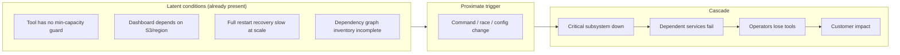
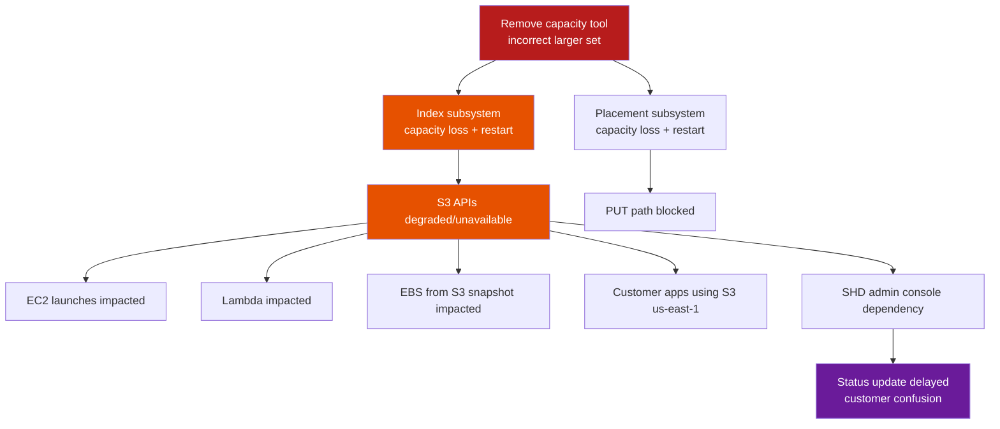
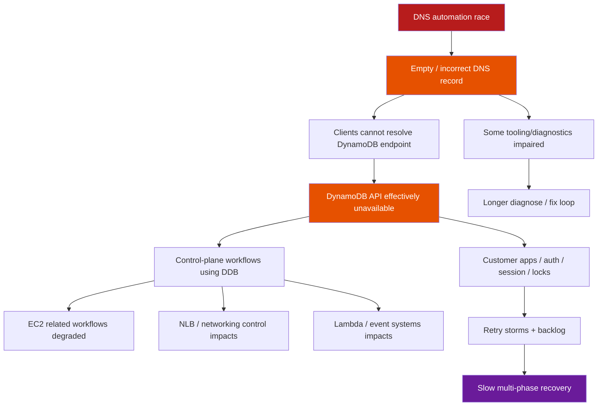
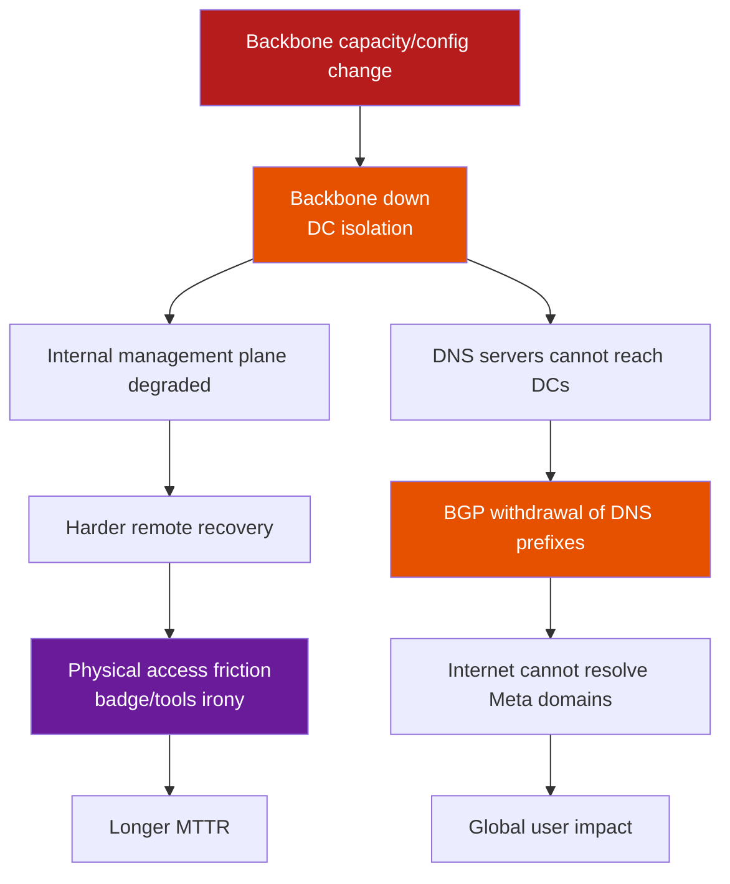
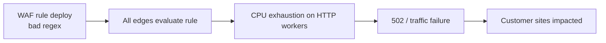
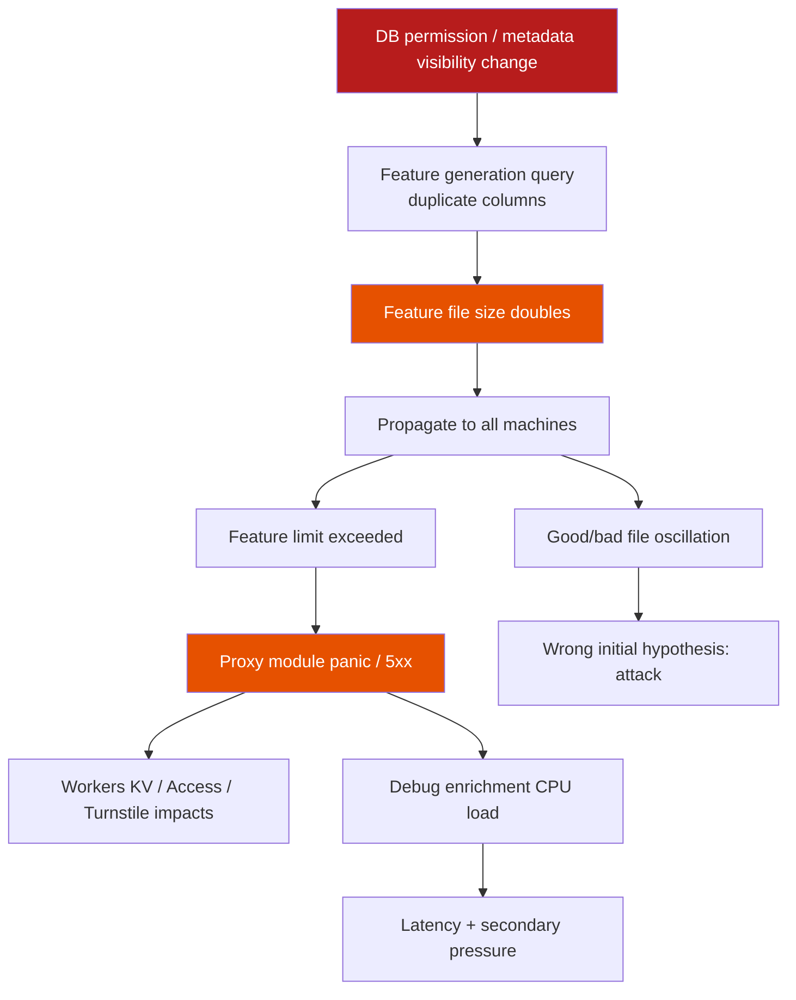
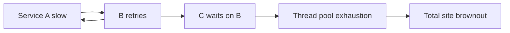
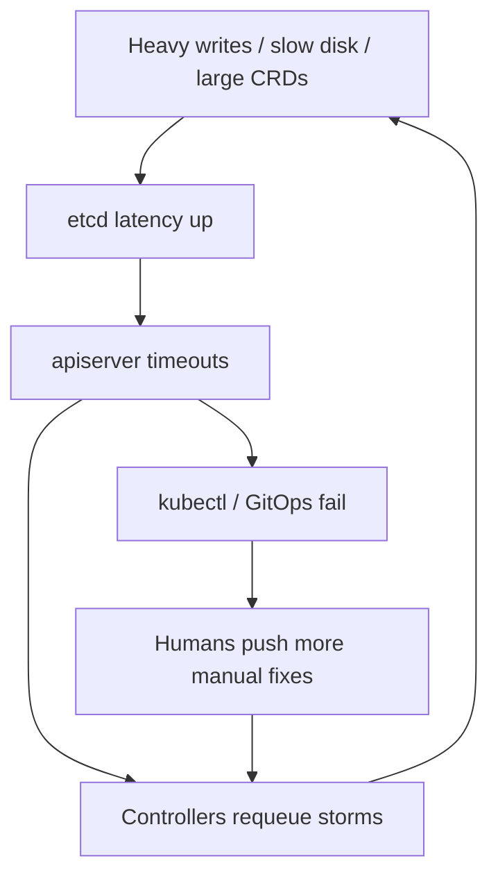
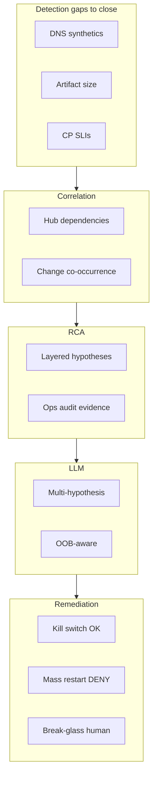

# Chapter 15 — Famous incidents & lessons for the AIOps pipeline

> **This chapter is not a gallery of “horror outages.” It is a systems lab: how to read a postmortem as an engineer, how to separate proximate from systemic causes, and how to turn each failure class (tool safety, coupling, feedback loops, observability blind spots) into concrete design requirements for the AIOps pipeline — from Detection to Remediation. Reference spirit: Richard Cook, *How Complex Systems Fail* — complex systems always run in a partially failed state; incidents happen when latent conditions meet at the wrong time.**

---

### Architecture poster — control plane vs data plane


*Poster: S3/DynamoDB/Meta lesson — recovery tooling must not depend only on the impaired plane.*


## Prerequisites

- [00 — Introduction to AIOps](../00-introduction.md) — pipeline philosophy and when AIOps fails
- [07 — Anomaly Detection](../07-anomaly-detection/README.md) — early signals and detection limits
- [08 — Alert Correlation](../08-alert-correlation/README.md) — layered alert grouping
- [09 — Root Cause Analysis](../09-root-cause-analysis/README.md) — proximate vs systemic cause
- [11 — Remediation](../11-remediation/README.md) — safety gate, blast radius, rollback
- [12 — Production](../12-production/README.md) — chaos, DR, runbook, maturity

## Related Documents

- [01 — Observability](../01-observability/README.md) — blind spots and “the dashboard also depends on the broken system”
- [06 — Kafka](../06-kafka/README.md) — control plane / data plane separation in signal transport
- [10 — LLM Agent](../10-llm-agent/README.md) — when LLMs help investigation and when they only add noise

## Next Reading

After this chapter, return to [12 — Production](../12-production/README.md) to apply design-review checklists and game days to your AIOps platform; or expand your personal incident library per section 11.

---

## Table of Contents

1. [How to read a postmortem as an engineer](#1-how-to-read-a-postmortem-as-an-engineer)
2. [AWS S3 2017 (us-east-1)](#2-aws-s3-2017-us-east-1)
3. [AWS DynamoDB / DNS automation (US-EAST-1, Oct 2025)](#3-aws-dynamodb--dns-automation-us-east-1-oct-2025)
4. [Meta / Facebook 4 Oct 2021](#4-meta--facebook-4-oct-2021)
5. [Cloudflare major outages (2019 regex, 2025 bot management config)](#5-cloudflare-major-outages-2019-regex-2025-bot-management-config)
6. [Google SRE classic lessons](#6-google-sre-classic-lessons)
7. [Kubernetes / etcd / control plane war stories](#7-kubernetes--etcd--control-plane-war-stories)
8. [GitHub, Slack, Discord, Fastly-class CDN incidents](#8-github-slack-discord-fastly-class-cdn-incidents)
9. [Taxonomy of failure modes for AIOps design](#9-taxonomy-of-failure-modes-for-aiops-design)
10. [Mapping incidents → handbook pipeline stages](#10-mapping-incidents--handbook-pipeline-stages)
11. [Building a personal “incident library” for your org](#11-building-a-personal-incident-library-for-your-org)
12. [Game days & tabletop exercises](#12-game-days--tabletop-exercises-derived-from-famous-incidents)
13. [Checklist: design reviews “what would S3-2017 look like here?”](#13-checklist-design-reviews-that-ask-what-would-s3-2017-look-like-here)
14. [90-day learning program for on-call](#14-90-day-learning-program-for-on-call)
15. [Socratic scenarios](#15-socratic-scenarios)

---

## 1. How to read a postmortem as an engineer

### 1.1 The reading goal is not “who was wrong”

Public postmortems are the cheapest learning asset operations has. Common weak reading modes:

| Weak reading | Engineer reading |
|--------------|-------------------|
| Find “who typed wrong” | Find **latent conditions** that let a simple action create large blast radius |
| Conclude “the tool is bad” | Ask which **guardrails the tool lacked**, who believed they were enough, and why recovery was not tested |
| Copy the timeline | Separate **proximate trigger** from **systemic enablers** |
| “AIOps would have saved us” | Ask **which signals were early**, **which remediations were safe**, **which control planes also failed** |

> [!IMPORTANT]
> **Blameless does not mean no systemic responsibility**
> Blameless means: do not end with “engineer X was careless.” End with: “the system allowed this operation to be unsafe, feedback was slow, recovery depended on the very component that was broken.” Responsibility sits in design, process, incentives, and architecture — not individuals.

### 1.2 Proximate cause vs systemic cause

**Proximate cause:** the event immediately before impact — wrong command parameters, a race that ran at the wrong time, a regex rule deploy, a backbone capacity command.

**Systemic cause:** background conditions that existed long before the trigger:

- Missing safety interlocks on operational tools
- Strong coupling between data plane and status/dashboard/control plane
- Recovery path depends on the same failing service
- Global config push without progressive delivery
- Feedback loops (retry, health check, BGP withdrawal) amplify the fault
- Observability blind spot: blind exactly when eyes are most needed



### 1.3 Seven-question postmortem reading frame

When reading any postmortem (internal or public), answer in order:

1. What is the **trigger**? (command, deploy, race, load)
2. Which **background conditions** made the trigger a catastrophe instead of a safe no-op?
3. **Cascade mechanism** — does failure spread via dependency, retry, cache, DNS, or shared fate?
4. **Detection gap** — did customers report first, or internal telemetry?
5. **Tooling gap** — did operators lose dashboard, SSH, badge, DNS, API?
6. **What would NOT have helped** — avoid the “AIOps magic” fantasy
7. **Concrete design change** — 1–3 changes shippable in 90 days

> [!NOTE]
> **KEY IDEA — Cook’s mental model**
> Complex systems always carry latent failures. Safety is an emergent property of interactions, not of “zero defect components.” Good postmortems describe **interactions** (coupling, feedback, resource limits), and do not stop at “bug fixed.”

### 1.3.1 Mapping *How Complex Systems Fail* spirit into AIOps

Richard Cook describes recurring properties of complex systems. Below is a “translation” into AIOps pipeline language — not a legal quote, but a **lens** when reading postmortems and reviewing design:

| Complex-system property (Cook spirit) | AIOps consequence |
|------------------------------------------|------------------|
| Complex systems are intrinsically hazardous | “Zero false positive” anomaly is fantasy; need budget and prioritization |
| Complexity causes change | Topology/baseline models must update continuously; stale graph = wrong RCA |
| Complex systems run in degraded mode | “Green dashboard” does not prove healthy; need multi-layer SLIs |
| Catastrophe requires multiple failures | Correlation + multi-signal RCA matter more than single metric thresholds |
| Post-accident attribution hindsight bias | Postmortem templates forbid “should have known”; force latent condition lists |
| Hindsight makes accidents look linear | Real timelines have parallelism, flapping, wrong hypotheses — AIOps UI must show uncertainty |
| Safety is a dynamic non-event | Measure “near misses” (guardrail trips) not only outage counts |
| People continuously create safety | Human-in-the-loop and on-call teach-back are features, not automation failures |

> [!TIP]
> **Near misses are AIOps data too**
> Every time a safety gate **blocks** a dangerous remediation, every time a canary halts a config push — log it as a “safety success.” If you only train/report on outages, you are blind to half of Cook’s picture.

### 1.3.2 Note-taking template when reading a postmortem (15 minutes)

```text
[Official source]: URL / date
[Proximate trigger]:
[Latent conditions] (list ≥ 3):
[Cascade 5 steps]:
[Detection: who reported first — customer / synthetic / human]:
[Tooling lost during incident]:
[AIOps would help]:
[AIOps would hurt / not help]:
[1 design change shippable in 90 days for OUR org]:
[Owner + ticket]:
```

Print this template into onboarding wiki; after 10 postmortems the team shares a common vocabulary.

### 1.4 Looking for: latent conditions, coupling, feedback loops, tool safety, observability blind spots

#### Latent conditions

“Buried mines”: a race never hit before, a CLI that allows removing too much capacity, a query config that does not filter database name, a health check that withdraws BGP when the backbone is silent.

Signs in postmortems:

- “This had worked for years”
- “We had planned to partition later”
- “The automation failed to repair”
- “Assumptions about query results changed”

#### Coupling

Two systems are **coupled** if A’s failure makes B fail with no independent fallback.

| Coupling type | Example from public incidents |
|---------------|--------------------------|
| Data dependency | EC2 launch / Lambda depends on S3 |
| Control-plane dependency | Recovery tool calls API in the same sick region |
| Shared fate config | Global feature file pushed to every PoP |
| Physical/process | Badge/door systems depend on internal network |
| Observability coupling | Status page admin console depends on the impacted service |

#### Feedback loops

- **Positive feedback (amplifying):** retry storm → overload → more timeouts → more retries
- **Protective feedback gone wrong:** DNS servers withdraw BGP when they cannot “see” DCs → Internet cannot resolve even if DNS process is still locally alive
- **Automation feedback:** remediation restarts pods → thundering herd → etcd worse

#### Tool safety

Design questions:

- Does the tool have a **hard limit** on blast radius?
- Is there **dry-run / confirmation / two-person rule** for irreversible operations?
- Is there a **rate limit** on capacity removal / config push?
- Is there a global feature **kill switch**?

#### Observability blind spots

- Metrics exist but the **dashboard depends** on the store that is down
- Alerts fire but the **paging path** goes through the down service
- AIOps pipeline is “blind” because Kafka/Prometheus remote_write share a regional SPOF
- Automatic error enrichment **consumes CPU** when error rate is high (observation deepens the failure)

> [!TIP]
> **How to practice**
> Each week read 1 public postmortem. Write half a page: proximate, systemic, 5-node cascade diagram, 1 detection gap, 1 design change for *your* system. After 12 weeks you have a personal library strong enough for design reviews.

### 1.5 Layering “AIOps would / would not help”

| Layer | AIOps often **helps** | AIOps often **does not help** (or hurts) |
|-----|------------------------|---------------------------------------------|
| Detection | Anomaly latency/error earlier than humans | When the telemetry plane is also down |
| Correlation | Collapse 500 alerts into 1 incident | When topology model is wrong / hidden dependencies missing |
| RCA | Suggest recent change, log patterns | When root cause is physical/OOB / globally empty DNS |
| LLM | Summarize runbooks, compare timelines | When it hallucinates actions on a broken control plane |
| Remediation | Scale-out, circuit break, feature kill | Restart thundering herd; auto-fix a blind DNS planner |

> [!WARNING]
> **Do not use AIOps as a talisman**
> Many of the industry’s largest incidents are **control-plane / global-config / shared-fate**. An AIOps pipeline that runs *on* those dependencies fails at the same time. Designing “out-of-band break glass” matters more than a fancy ML model.

---

## 2. AWS S3 2017 (us-east-1)

### 2.1 Public context (public facts)

On **2017-02-28**, region **US-EAST-1**, Amazon S3 suffered a major disruption. Per AWS’s official summary:

- The S3 team was debugging a billing subsystem running slower than expected.
- Around **9:37 AM PST**, an authorized team member, following a playbook, ran a command to **remove capacity** (remove servers) for a subsystem related to billing.
- **One command input was wrong** → more servers were removed than intended.
- The mistakenly removed capacity belonged to **two other subsystems**:
  - **Index subsystem** — object metadata and location; needed for GET/LIST/PUT/DELETE.
  - **Placement subsystem** — allocates new storage; depends on index; related to PUT.
- Both needed a **full restart**. At S3’s scale then, restart + metadata safety checks took **longer than expected** (large subsystems had not been fully restarted in a long time).
- Other services depending on S3 in the region (S3 console, new EC2 launches, EBS from S3 snapshots, Lambda, …) were impacted.
- The **AWS Service Health Dashboard (SHD)** admin console also depended on S3 → for a while individual service status could not be updated; Twitter/@AWSCloud and a banner had to be used.

Recovery times (per AWS): index had enough capacity around 12:26 PM PST; index full ~1:18 PM; placement ~1:54 PM PST.

### 2.2 Logical timeline (not sensational)

```text
T0  Debug billing slow path (not “S3 data corrupt”)
T1  Run remove-capacity per playbook
T2  Wrong input → remove too much index + placement capacity
T3  Critical subsystems cannot serve S3 APIs
T4  Dependent AWS services + customer apps fail (shared dependency)
T5  SHD admin affected (observability/comms coupling)
T6  Restart + integrity checks take long (scale + rare full restart)
T7  Index recovers → GET/LIST/DELETE
T8  Placement recovers → PUT normal
T9  Dependent service backlogs drain
```

### 2.3 Root cause class

| Layer | Classification |
|-----|-----------|
| Proximate | Incorrect input to capacity-removal operational tool |
| Systemic — tool safety | Tool allowed removing below min capacity too quickly |
| Systemic — scale/recovery | Full restart path rarely exercised at large region scale |
| Systemic — coupling | Many AWS services + customer stacks “shared fate” on S3 us-east-1 |
| Systemic — observability | Status communication path depended on S3 |

**Not** “the cloud is mysteriously untrustworthy.” This is **operational tool without adequate safety interlocks** + **recovery time underestimated at scale**.

### 2.4 Cascade mechanism



Cascade mechanisms:

1. **Direct capacity loss** → critical object-store control/metadata plane.
2. **Hard dependency fan-out** → every consumer treats S3 as always-available in region.
3. **Comms plane coupling** → status dashboard cannot update → customer-perceived MTTD rises, trust falls.
4. **Recovery backlog** → dependent services accumulate work queues while S3 is down.

### 2.5 Detection gap

- External impact (customer 4xx/5xx, failed uploads) appears quickly.
- Internal: the team was already *in* a debugging session — detecting “there is an incident” was not the main challenge.
- Main challenges: **understanding blast radius**, **estimating recovery time**, **communicating status** when SHD depends on S3.
- Problem class: **monitoring of the monitor** / **status plane independence**.

### 2.6 What AIOps would / would not have helped

| AIOps capability | Help? | Explanation |
|----------------|-------|------------|
| Anomaly detection on S3 API error rate | Partially | Detect customer-facing impact faster than manual |
| Correlation “S3 + EC2 launch + Lambda” | Yes | Group shared-fate alerts |
| RCA “recent capacity removal command” | Yes *if* operational tool change/audit logs are ingested | Need **change event** telemetry, not only metrics |
| Auto-remediation “restart index faster” | Not safe | Full restart is already the recovery path; blind auto-action can break integrity checks |
| Auto-remediation “re-add capacity via same tool” | Dangerous | Same tool class lacks guardrails |
| LLM summarize recovery runbook | Limited yes | Useful while operators still have tool access; useless if status/console path is down |
| Multi-region customer failover automation | Yes (customer side) | This is *consumer* design, not an internal AWS fix |

> [!NOTE]
> **Core AIOps lesson from S3-2017**
> Operational tools need **safety interlocks** like production APIs. An AI remediation engine **is also an operational tool**. If the remediation action catalog lacks min-capacity, rate limits, blast radius, and two-person rules — you are recreating the S3-2017 failure class *inside* AIOps.

### 2.7 Concrete design changes (apply to your platform)

1. **Safety interlocks on every destructive CLI/API**
   - Min capacity floor per subsystem
   - Max % capacity removable / time window
   - Mandatory dry-run; production requires approval ticket + second approver for high blast

2. **Audit + change stream for ops tools**
   - Every capacity remove / config push emits an event into [06 — Kafka](../06-kafka/README.md) topic `aiops-change-events`
   - Correlation engine ([08](../08-alert-correlation/README.md)) prioritizes changes in a 15–30 minute window

3. **Status / observability independence**
   - Status page, PagerDuty bridge, break-glass docs **must not** depend on primary object store / primary region
   - See [01 — Observability](../01-observability/README.md) and [12 — Production](../12-production/README.md)

4. **Exercise rare recovery paths**
   - Game day: full restart (or cell restart) of important subsystems *before* scale makes the path “nobody has run this in 5 years”

5. **Consumer multi-AZ/region patterns**
   - Critical apps must not have single-region S3 dependency without failover

### 2.8 Quick pipeline mapping for the handbook

| Stage | S3-2017 class gap |
|-------|-------------------|
| Detection | OK if API metrics; fail if dashboard store = broken S3 |
| Correlation | Need shared dependency model for object storage |
| RCA | Need operational change events, not only git deploys |
| LLM | Useful for summary; does not replace tool guardrails |
| Remediation | **No auto** capacity remove; auto only rollback *if* a safe snapshot plan exists |

### 2.9 Consumer view (customers of object storage)

S3-2017 is not only a lesson for cloud providers. Much of *enterprise AWS customer* MTTR stretched because:

1. **Single-region hard dependency** — critical apps only pointed at `us-east-1` with no failover.
2. **Control path coincides with data path** — deploy artifacts, Terraform state, container layers, log archives all on the same bucket/region.
3. **Missing cache / degraded mode** — if config cannot be read from object store, process crashes instead of serving last-known-good.
4. **Alert routing depends** on webhooks storing payloads on the same storage stack.

Consumer checklist (into service design review):

| Question | Pass criteria |
|---------|---------------|
| Can the app run 15 minutes when object store GET fails? | Degraded mode / local cache |
| Is the deploy pipeline multi-region mirrored? | At least 2 regions for critical artifacts |
| Are runbook PDF/HTML available offline? | USB / laptop cache / printed bridge card |
| Is the AIOps knowledge base replicated? | No single-bucket SPOF |

> [!NOTE]
> **AIOps-as-consumer**
> The AIOps platform in this handbook often uses S3-compatible storage for Loki/Tempo/Thanos. Re-read [04 — Loki](../04-loki/README.md), [05 — Tempo](../05-tempo/README.md), [12 — Production](../12-production/README.md) with the question: “If S3-2017 class hits the telemetry bucket, does on-call still have eyes?”

### 2.10 Anti-lessons (do not draw the wrong conclusion)

| Wrong conclusion | Right conclusion |
|--------------|---------------|
| “Never remove capacity” | Capacity removal is valid ops; it needs **guardrails** |
| “Cloud cannot be used” | Shared fate + single region is the consumer’s architecture choice |
| “Just go multi-cloud” | Multi-cloud does not fix internal tool safety or status coupling |
| “AI will never mistype” | Automation/AI is **also** an operator with larger blast radius |

---

## 3. AWS DynamoDB / DNS automation (US-EAST-1, Oct 2025)

### 3.1 Public context (public themes)

Around **2025-10-19–20**, region **US-EAST-1** experienced a major incident with **Amazon DynamoDB** as the starting point, per AWS’s public post-event summary and consistent third-party analyses:

- **Root technical cause:** a latent **race condition** in DynamoDB’s **DNS management automation**.
- Result: **incorrect / empty DNS records** for the regional endpoint (e.g. `dynamodb.us-east-1.amazonaws.com`); automation **could not self-repair** the bad state.
- Clients and internal services **could not resolve** the endpoint → connection failures spread widely.
- **Cascade** into many services depending on DynamoDB / regional control plane (EC2, NLB, Lambda, and customer ecosystems).
- Restoring DNS was necessary but **not sufficient**: cascading effects, backlogs, dependency recovery lasted many hours after DNS was “correct again.”
- Prominent architecture lesson in public discourse: **recovery tooling and dependent control planes** can **depend on the same plane that is impaired**.

> [!IMPORTANT]
> **Paraphrase, do not invent internal details**
> This section uses only public information (AWS summary + public postmortem analysis). No personal blame, no unpublished details. Use it as an **incident class**: *DNS automation race + empty record + cascade + recovery coupling*.

### 3.2 Logical timeline (modeled)

```text
T0  DNS Planner / Enactor automation runs (normal, high frequency)
T1  Race condition → DNS state “empty / incorrect” for regional endpoint
T2  Automation cannot self-heal (bug path / invalid state)
T3  Resolvers/clients fail lookup → DynamoDB API unreachable
T4  AWS services & customer apps depending on DynamoDB fail (auth, state, locks, …)
T5  Operators identify DNS as symptom; begin manual restore / mitigations
T6  DNS restored; cache TTLs expire gradually → connectivity returns in parts
T7  Secondary cascades (instance management, load balancers, queues) recover slowly
T8  Full regional normalization after multiple phases
```

### 3.3 Root cause class

| Layer | Classification |
|-----|-----------|
| Proximate | Race in DNS automation → empty/incorrect record |
| Systemic — concurrency | Concurrent automation writers/planners lack a safe invariant |
| Systemic — self-healing gap | Automation does not detect/repair empty endpoint state |
| Systemic — dependency concentration | DynamoDB is a shared state plane for many control workflows |
| Systemic — recovery coupling | Some recovery paths depend on the sick service/region |
| Systemic — DNS as SPOF class | Empty DNS = total logical unavailability even if storage is alive |

### 3.4 Cascade mechanism



Important mechanisms:

1. **Logical unavailability via DNS** — backend may still be “alive” but unreachable by name.
2. **Fan-out dependency** — every service assumes the regional endpoint is always resolvable.
3. **Cache TTL** — recovery is not instant: clients cling to negative/empty cache.
4. **Secondary overload** — when DNS returns, connection thundering herd.
5. **Impaired recovery plane** — if automation/console/API depends on the same broken dependency, the human path is harder.

### 3.5 Detection gap

- Customer-facing errors (timeouts, SDK failures) can appear before “empty DNS” is understood as root.
- Metrics like “DynamoDB server CPU healthy” can look **normal** while **name resolution** fails → classic **wrong layer metrics**.
- Needed signals:
  - Synthetic DNS checks from multiple resolver vantages
  - Client-side resolve failure metrics
  - Endpoint empty-record canary
  - Correlation “many services fail with the same NXDOMAIN/empty pattern”

### 3.6 What AIOps would / would not have helped

| Capability | Help? | Detail |
|----------|-------|----------|
| Multi-signal anomaly (error rate + DNS resolve fail) | **Yes** | Detection gap class: server metrics ≠ client reachability |
| Correlation “50 services fail us-east-1 same minute” | **Yes** | Shared fate / dependency hub |
| RCA “DNS record empty” | **Yes if** DNS canary + change automation logs exist | Need DNS plane telemetry |
| Auto-remediation “restart DynamoDB nodes” | **No / harm** | Wrong layer; may increase load |
| Auto-remediation “re-run DNS planner” | **Dangerous** | Same race-prone automation |
| Out-of-band break-glass DNS restore playbook | **Yes** (human + OOB) | AIOps should *suggest* OOB runbook, not execute blindly |
| LLM | Summarize dependency map | Does not “fix DNS” if control API is down |

> [!WARNING]
> **AIOps lesson #1 from the DNS automation class**
> **Never** let remediation control-plane **only** depend on the data-plane / API-plane it is monitoring. Need **out-of-band break glass**: separate channel, separate credentials, jump host / serial console / pre-staged known-good config, offline documentation.

### 3.7 Concrete design changes

1. **DNS / endpoint health as first-class SLO**
   - Synthetic resolve + connect from multi-AZ and multi-network
   - Separate alerts: `endpoint_dns_empty` / `resolve_fail_ratio`

2. **Automation safety**
   - Invariant: regional endpoint record **never empty** (reject apply)
   - Quorum / compare-and-swap for DNS plan apply
   - Canary apply one cell before global

3. **Dependency inventory**
   - Catalog “who depends on DynamoDB/regional endpoint” for correlation topology ([09 — RCA](../09-root-cause-analysis/README.md))

4. **Break-glass architecture** ([11 — Remediation](../11-remediation/README.md), [12 — Production](../12-production/README.md))
   - Runbook to restore known-good DNS **without** the failing API
   - AIOps decision engine: if `dns_plane_impaired=true` → **disable auto-remediation**, page human + OOB checklist

5. **Recovery load management**
   - Adaptive concurrency when the service returns (section 6 Google lessons)
   - Mandatory client SDK jittered backoff

### 3.8 Link to pipeline stages

| Stage | Required design |
|-------|-------------------|
| Detection | Client-side + DNS synthetic, not only server metrics |
| Correlation | Hub dependency (DynamoDB/DNS) as correlation key |
| RCA | Layered hypotheses: DNS → network → process → data |
| LLM | Prefer OOB runbook retrieval from local cache |
| Remediation | Fail-closed automation when control plane is suspect |

### 3.9 Recovery phases — why “DNS fixed” is not the end of the incident

DNS endpoint incident classes often have **multiple distinct recovery phases**. IC and AIOps must model them, or a “DynamoDB green” dashboard will demobilize the team too early:

| Phase | What happens | Metric / signal | AIOps behavior |
|-------|-------------|-----------------|----------------|
| P1 Identify | Recognize DNS layer, not node CPU | Resolve fail, empty record canary | Raise incident severity; tag `layer=dns` |
| P2 Restore record | Manual/OOB write known-good | Authoritative answers correct | Still **fail-closed** auto app restarts |
| P3 Cache expire | Client/resolver TTL drain | Success ratio rises in waves | Expect regional flapping |
| P4 Dependency thaw | Services re-establish pools/locks | Queue depth, login success | Enable **limited** scale/shed assists |
| P5 Herd control | Connection storms | Accept queue, thread pool | Prefer concurrency caps over restart |
| P6 Backlog drain | Async workers catch up | Lag metrics | Avoid lifting deploy freeze too early |
| P7 Normalize | Error budgets recover | SLO burn rate | Postmortem + automation invariant fix |

> [!IMPORTANT]
> **AIOps must not “close incident” just because one SLI went green**
> Rule: multi-phase incidents need a **composite recovery score** (DNS + API + dependency fan-out + backlog). See [08 — Alert Correlation](../08-alert-correlation/README.md) for incident lifecycle states.

### 3.10 Invariants to encode into automation tests

These invariants should become unit/integration tests for *any* internal DNS/endpoint planner — and policy checks in AIOps when observing automation self-change:

1. **Non-empty endpoint set:** plan apply is rejected if RRset is empty.
2. **Quorum writers:** no two enactors “last write wins” without versioning.
3. **Canary cell first:** new plan applies to 1 cell; health gate before regional.
4. **Self-heal deadline:** if empty is detected > N seconds → page human, no silence.
5. **Planner ≠ only recovery path:** known-good snapshot restore exists OOB.

```text
# Pseudo-policy for remediation engine
IF signal.dns_empty_endpoint:
  DISABLE actions: [restart_fleet, scale_out_all, re_run_dns_planner]
  ENABLE suggestions: [oob_restore_known_good_dns, page_network_oncall]
  REQUIRE human_ack: true
```

---

## 4. Meta / Facebook 4 Oct 2021

### 4.1 Public context

On **2021-10-04**, Meta services (Facebook, Instagram, WhatsApp, …) were unreachable on the Internet for many hours. Per Meta’s engineering blog and external observation (BGP/DNS):

- Trigger: operation/maintenance related to the **global backbone capacity** management system.
- Command/config made the **backbone** lose connectivity between data centers in an unintended way.
- Meta’s authoritative DNS **withdrew BGP advertisements** when it could not talk to data centers (design: “unhealthy → withdraw”).
- Result: Internet **could not resolve** Meta domain names, even if some DNS server processes might still have been “locally running.”
- **Operational irony:** staff struggled to reach data centers / internal systems — including physical and identity dependencies (badge / door / internal tools) tied to the same network ecosystem.

### 4.2 Logical timeline

```text
T0  Maintenance / capacity assessment on backbone management system
T1  Backbone connectivity between DCs broken
T2  Internal services + management planes lose paths
T3  DNS servers mark network unhealthy → withdraw BGP for DNS prefixes
T4  Global resolvers cannot reach authoritative DNS → SERVFAIL / timeout
T5  Apps and external clients “disappear” from Internet view
T6  Operators struggle with out-of-band access / physical access friction
T7  Manual/OOB restoration of backbone + BGP + DNS advertisements
T8  Gradual recovery as caches and sessions re-establish
```

### 4.3 Root cause class

| Layer | Classification |
|-----|-----------|
| Proximate | Backbone capacity/management command with unintended total isolation |
| Systemic — safety of network change | Missing staged / guardrail for backbone blast radius |
| Systemic — protective logic inversion | Health-based BGP withdrawal amplifies into total external unreachability |
| Systemic — management plane coupling | Tools, auth, physical access depend on production network |
| Systemic — dependency inventory incomplete | Physical + identity systems not treated as critical dependencies |

### 4.4 Cascade mechanism



### 4.5 Detection gap

- Externally: BGP withdrawal and DNS failure are **very clear** (high third-party visibility).
- Internally: when backbone + tools are down, **internal MTTD** and **ability to act** are the problems — not only “was there an alert.”
- Class: **detection exists but actuation path is dead**.

### 4.6 What AIOps would / would not have helped

| Capability | Help? | Notes |
|----------|-------|---------|
| External synthetic monitoring (DNS/BGP) | **Yes** (customer/edge view) | Detect “disappeared from the Internet” |
| Internal metric AIOps | **Weak** | Telemetry path rides the broken backbone |
| Correlation | **Useful later** | Learn BGP+DNS co-fail pattern |
| Auto-remediation network | **Extremely dangerous** | Wrong network automation config = same class |
| LLM on laptop offline runbook | **Yes** | If OOB runbook is already cached locally |
| In-region AIOps cluster | **Fails with shared fate** | Shared network fate |

> [!TIP]
> **AIOps / SRE lesson**
> Dependency inventory must include **physical, identity, badge, DNS, BGP, out-of-band console**. An AIOps topology that only draws the service mesh is **incomplete**. When designing [09 — RCA](../09-root-cause-analysis/README.md), add node types: `network_fabric`, `identity`, `physical_access`, `dns_authority`.

### 4.7 Concrete design changes

1. **Out-of-band management plane**
   - Console server, cellular/satellite path, separate management VRF
   - Break-glass credentials that do not depend on production IdP

2. **Staged network changes**
   - Canary site / canary backbone segment
   - Automatic rollback if DC connectivity quorum is lost

3. **Revisit “protective” withdraw logic**
   - Fail-open vs fail-closed for DNS advertisement needs its own threat model
   - Avoid a single policy that causes total Internet unreachability

4. **Physical access independence**
   - Badge systems, door controllers: power + network fallback

5. **Tabletop: “entire backbone gone”**
   - Who has authority, who enters the DC, where docs live offline (paper/USB)

### 4.8 Expanded dependency inventory (template)

Copy this table into P0 service charters:

| Dependency | Type | Fail impact | OOB path? | In AIOps topology? |
|------------|------|-------------|-----------|---------------------|
| Primary DB | data | total | backup restore | yes |
| Cache | data | degraded | bypass | yes |
| IdP / SSO | identity | login fail | break-glass local admin | ? |
| DNS authoritative | network | total external | manual RRset | ? |
| BGP / transit | network | total external | NOC phone | often no |
| VPN / ZTNA | management | remote ops fail | cellular jump | often no |
| Badge / door | physical | DC entry delay | security escort SOP | almost never |
| Status page | comms | trust/MTTD | third-party host | should yes |
| Pager vendor | comms | no page | SMS gateway alt | should yes |
| AIOps cluster | meta | no auto help | human runbooks | self-watch |

> [!WARNING]
> **Badge irony is not a meme — it is design input**
> If physical access depends on production identity/network, MTTR has a lower bound of “drive time + security manual override.” If you cannot model that, internal AIOps SLAs are fiction.

### 4.9 AIOps self-hosting lesson

Running AIOps *inside* the same backbone/VPC as production:

- Pros: low latency, low cost, data locality
- Cons: **shared fate** with Meta-2021 / DNS-2025 classes

Mitigations:

1. Secondary “lite” AIOps in another region/provider: synthetics + paging bridge only
2. Critical runbooks replicated to on-call devices (encrypted)
3. Weekly test: “cut AIOps API, on-call still pages via channel B”

---

## 5. Cloudflare major outages (2019 regex, 2025 bot management config)

Two public Cloudflare incidents years apart but **same family**: global edge + config/rule generation + wide push + fast-spreading failure mode.

### 5.1 July 2, 2019 — WAF regex CPU exhaustion

#### Public facts (condensed)

- Deploy a new rule in WAF Managed Rules.
- Poorly written regex → **catastrophic backtracking** on the regex engine → **CPU exhaustion** on cores serving HTTP(S) network-wide.
- Customers see 502 / serving failure.
- Impact shorter than many other incidents (about half an hour per public accounts) but **global blast radius**.

#### Root cause class

| Layer | Classification |
|-----|-----------|
| Proximate | Pathological regex in globally deployed WAF rule |
| Systemic — global push | Rule reaches every edge nearly simultaneously |
| Systemic — CPU as shared fate | WAF path sits on the critical request path |
| Systemic — testing gap | Worst-case backtracking not caught before prod |

#### Cascade



#### Detection gap

- CPU spike + global 5xx — strong signal.
- Distinguishing “DDoS” vs “self-DoS by config” can take time (pattern repeats in the 2025 incident).

#### AIOps would / would not

| | |
|--|--|
| **Would help** | Anomaly CPU + 5xx co-change with **config deploy event**; auto **kill switch** feature/rule |
| **Would not help alone** | ML anomaly does not replace **regex complexity static analysis** pre-deploy |
| **Danger** | Blind global auto-rollback if canary signal is missing |

#### Design changes

1. Static analysis / regex complexity budgets before push
2. Progressive delivery of rules: canary PoP → % traffic → global
3. CPU circuit breaker per module; fail open the module rather than kill the whole process path (depending on threat model)
4. Global kill switch for new WAF managed rulesets

### 5.2 November 18, 2025 — Bot Management feature file size class

#### Public facts (condensed from Cloudflare’s post)

- ~**11:20 UTC 2025-11-18**, core traffic failures; users see Cloudflare error pages.
- **Not an attack.** Trigger: a **database permissions** change (ClickHouse) made metadata queries return **duplicate columns** → Bot Management **feature file roughly doubled** in size.
- Feature file is generated periodically (~every few minutes) and pushed network-wide.
- Software has a **feature count limit** (preallocated memory; limit ~200, use ~60). File exceeds limit → **panic / error** on core proxy module → **HTTP 5xx** for traffic on that path.
- Early flapping (good/bad files alternating as cluster permissions rolled out) made the team **think DDoS**.
- An external status page also failed at the **same time** (coincidence) → more diagnostic noise.
- Observability/debug enrichment on uncaught errors **consumed more CPU** when error rate was high.
- Mitigation: stop generation/propagation of bad file, insert **known-good file**, restart proxy; gradual recovery to ~17:06 UTC full.

#### Root cause class

| Layer | Classification |
|-----|-----------|
| Proximate | Feature file oversized due to duplicate features from query/metadata change |
| Systemic — implicit schema assumptions | Query does not filter database; assumes stable shape |
| Systemic — hard fail on limit | `unwrap`/panic instead of degrading Bot Management |
| Systemic — global frequent push | ML feature freshness vs safety trade-off |
| Systemic — diagnostic coupling | Error enrichment amplifies resource pressure |
| Systemic — incident cognition | Flapping + coincidental status outage → wrong hypothesis (attack) |

#### Cascade mechanism



#### Detection gap

- 5xx volume is clear.
- **Semantic gap:** “Bot feature file generation regression” is not a default metric.
- Need: config artifact size metrics, schema row count, canary PoP error before global, generation-side validation.

#### AIOps would / would not

| Capability | Help? |
|----------|-------|
| Correlate deploy/permission change + 5xx | **Yes** |
| Detect artifact size anomaly before full impact | **Yes** if generation pipeline metrics exist |
| Auto kill-switch Bot Management module | **Yes** (feature flag safety) |
| Auto “fix by regenerating file” | **Dangerous** if generator is still bad |
| Distinguish DDoS vs config | **Yes** if joint security + change signals model exists |
| LLM | Useful listing hypotheses; dangerous if biased to “always attack” |

> [!IMPORTANT]
> **Feature flags & global config are SPOF class**
> Any “small” artifact pushed to every edge (WAF rule, bot features, routing map) has **high blast radius**. AIOps remediation that **pushes config** must go through progressive delivery like product deploys — see [11 — Remediation](../11-remediation/README.md) canary remediation.

### 5.3 Concrete design changes (Cloudflare family combined)

1. **Progressive delivery for config**
   - Canary PoPs, automatic halt on error budget burn
2. **Limits + graceful degradation**
   - Exceed limit → disable module, do not panic worker for whole request path
3. **Treat generated config as untrusted input**
   - Schema validation, max bytes, max rows, checksum, signed artifacts
4. **Generation-side tests**
   - Contract test: column set, cardinality, size percentile
5. **Observability that does not amplify failure**
   - Rate-limit error enrichment / core dump storms ([12 — Production](../12-production/README.md))
6. **Incident cognition aids**
   - Always show **recent config generations** beside traffic anomalies in AIOps UI

---

## 6. Google SRE classic lessons

Lessons below draw on **public themes** from Google SRE books / industry SRE practice — not attribution of a specific unpublished Google outage. This is a **pattern library** required for AIOps design.

### 6.1 Cascading overload

When a dependency is slow:

1. Caller threads/timeouts increase
2. Queue depth increases
3. Retries increase load on the dependency
4. Dependency slows further → cascade into neighbor services



### 6.2 Retry storms

| Anti-pattern | Design |
|--------------|--------|
| Immediate retry no jitter | Exponential backoff + full jitter |
| Unlimited retries | Budget retries per request chain |
| Retry on all errors | Retry only idempotent + transient |
| Client + mesh + app all retry | **One layer** owns retry |

### 6.3 Load shedding & adaptive concurrency

- **Load shedding:** intentionally reject low-priority requests to protect capacity.
- **Adaptive concurrency (AIMD-like):** reduce in-flight when latency/error rises; increase gradually when healthy.
- **Priority retention:** auth/health/payment paths differ from bulk export.

### 6.4 AIOps implications

| Lesson | Pipeline impact |
|--------|-----------------|
| Retry storms look like “multi-service outage” | Correlation must recognize **downstream latency root** |
| Shedding is healthy | Anomaly detection must **not** page on every intentional 503 |
| Adaptive concurrency changes traffic shape | Baseline models need “protection mode on” context |
| Auto scale-out during overload | Can be **expensive** and slow; sometimes shed > scale |
| Auto restart during overload | Often **makes it worse** (thundering herd) |

> [!NOTE]
> **Remediation catalog must know “do not restart”**
> In [11 — Remediation](../11-remediation/README.md), action `restart_pods` needs a **precondition**: not in global overload, dependency healthy, error class = memory leak/single pod — not cascade 503.

### 6.5 Concrete design changes

1. Client libraries: default jittered backoff, retry budget
2. Service mesh: max retries = 1–2; disable stacked retries
3. Platform: load shedding middleware + brownout playbooks
4. AIOps: feature `protection_mode` from service to suppress false anomalies
5. Game day: kill dependency latency 2s → observe retry amplification

### 6.6 Worked example: latency injection → alert storm → bad remediation

Assume service `checkout` depends on `payment` and `inventory`:

```text
t=0     payment p99 = 50ms
t=1     payment p99 = 2000ms (dependency degradation)
t=2     checkout retries ×3 immediate → payment QPS ×3
t=3     inventory calls pile up (thread pool)
t=4     200 alerts: checkout 5xx, inventory latency, payment 503, node CPU, Kafka lag
t=5     Naive AIOps: "restart checkout pods"
t=6     Cold pods + reconnect → worse
```

**Correct correlation** ([08](../08-alert-correlation/README.md)): one incident, root candidate = payment latency.

**Correct RCA** ([09](../09-root-cause-analysis/README.md)): evidence chain of latency edges, not memory OOM.

**Correct remediation** ([11](../11-remediation/README.md)):

- Enable load shed on checkout non-critical paths
- Temporarily reduce retry budget (feature flag)
- Page payment owner
- **Do not** restart checkout

**Anomaly detection** ([07](../07-anomaly-detection/README.md)): need to suppress secondary anomalies when `protection_mode` is on or when correlation already attached child alerts.

### 6.7 Table: overload symptoms vs recommended AIOps stance

| Symptom | Usually is | AIOps stance |
|---------|-----------|--------------|
| 503 + latency up + retry rate up | Overload cascade | Shed / limit concurrency |
| 500 + single pod OOMKill | Local fault | Restart **one** pod |
| 503 + deploy 3m ago | Bad release | Canary rollback |
| 503 + dependency DNS fail | Wrong layer | OOB / DNS path |
| 429 apiserver + NotReady wave | Control plane | Protect CP; no mass restart |

---

## 7. Kubernetes / etcd / control plane war stories

### 7.1 Industry patterns (not pinned to one vendor)

Recurring community patterns:

- **etcd saturation** (slow disk fsync, too many writes, large objects)
- **apiserver death spiral** (list/watch storms, operators reconcile loops)
- **CNI / kubelet pressure** → NotReady node wave
- **Control plane vs data plane confusion** — pods still serving but cluster “looks dead” in kubectl
- **“Helpful” AIOps restart** → simultaneous pod starts → registry/API/etcd overload

### 7.2 etcd saturation cascade



### 7.3 Root cause class

| Pattern | Class |
|---------|-------|
| etcd disk full / slow | Resource exhaustion control plane |
| Watch/list amplification | Feedback loop |
| Operator bad reconcile | Automation positive feedback |
| Pod kill loops | Remediation-induced cascade |

### 7.4 Detection gap

- App golden signals can still be **OK** (data plane) while control plane is red.
- Need separate SLIs: apiserver latency, etcd leader stats, reconcile queue depth, admission latency.
- AIOps that only scrapes app metrics → **blind to control plane**.

### 7.5 What AIOps would / would not

| Action | Assessment |
|--------|----------|
| Detect etcd fsync latency anomaly | **Helps** |
| Correlate NotReady nodes + apiserver 429 | **Helps** |
| Auto `kubectl delete pod --all` | **Harms** |
| Auto scale cluster autoscaler max during API outage | **Usually harms** |
| Auto disable noisy operator | **May help** if allowlist + canary |
| Suggest “etcd backup / defrag” runbook | **Helps** (human) |

> [!WARNING]
> **AIOps pod restarts can create a thundering herd**
> When apiserver/etcd are weak, simultaneous restarts are a **DoS against the control plane**. Remediation safety gate: rate-limit restarts cluster-wide; backoff; prefer cordon/drain single node; deny mass actions when `apiserver_error_budget` is burning.

### 7.6 Concrete design changes

1. Separate alerting for **control plane SLO** vs **data plane SLO**
2. etcd: dedicated disk, size limits on CRDs, defrag policy
3. Operator: exponential backoff, jitter, paginated lists
4. Remediation engine:
   - `max_concurrent_pod_restarts`
   - block actions if etcd/API unhealthy
5. Break-glass: direct node SSH / static pods docs offline
6. Chaos: API latency injection; validate AIOps **does not** mass-restart

### 7.7 Policy snippet: remediation engine vs Kubernetes health

```yaml
# Example policy (illustrative) — attach to safety gate chapter 11
preconditions:
  deny_mass_pod_restart_if:
    - metric: apiserver_request_duration_p99_seconds > 1
    - metric: etcd_disk_wal_fsync_duration_seconds_p99 > 0.05
    - metric: apiserver_current_inflight_requests > 0.8 * limit
  max_actions:
    pod_restart_per_namespace_per_5m: 5
    pod_restart_cluster_per_5m: 20
  allow_when_cp_red:
    - "page_human"
    - "suggest_runbook_etcd"
    - "disable_noisy_operator"   # only if allowlisted
  deny_when_cp_red:
    - "restart_deployment_all_pods"
    - "cluster_autoscaler_force_max"
    - "delete_namespace"
```

### 7.8 Data plane still green — cognitive trap

New on-call often believes kubectl red = 100% user impact. Reality:

| State | User traffic | kubectl | Meaning |
|------------|--------------|---------|---------|
| CP red, DP green | OK | Fail | Prioritize protecting serving; fix CP carefully |
| CP green, DP red | Fail | OK | App/deps issue; AIOps app path |
| CP red, DP red | Fail | Fail | Possible cascade; careful with actions |
| Both green | OK | OK | Near miss / noise |

AIOps UI should **separate widgets** for Control Plane vs Data Plane — see [01 — Observability](../01-observability/README.md) and [03 — Prometheus](../03-prometheus/README.md) for layered SLIs.

> [!TIP]
> **Quick Socratic question**
> “If etcd dies completely for 10 minutes but data-plane endpoints remain, do users have downtime?” The answer depends on architecture (static pods, endpoint slices TTL, connection reuse). **Measure** with game days; do not assume.

---

## 8. GitHub, Slack, Discord, Fastly-class CDN incidents

This section groups **patterns** from recurring public SaaS devtools and CDN incident classes — without reconstructing every postmortem beyond what AIOps design needs.

### 8.1 Pattern map

| Pattern | Example class | Cascade | Detection early? | Auto-remediate? |
|---------|-------------|---------|------------------|-----------------|
| Database migration / schema lock | SaaS outage windows | Write path block → app 5xx | Yes (migration change event) | Rarely; often human rollback |
| Config / feature flag bad global | Fastly-class, feature toggles | Edge/cache wrong → wide impact | Yes if canary | Kill switch yes; full fix careful |
| Cache stampede / thundering herd | Social/chat scale events | Origin overload | Yes (origin QPS) | Soft yes: request coalescing |
| Partition / network blip + state | Chat systems | Split brain / reconnect storms | Partial | Careful |
| Auth IdP dependency | Many SaaS | Login storm fail | Yes | Fail-open is a product decision |
| CDN POPs misconfig | CDN providers | Regional or global HTTP errors | Yes (edge 5xx) | Progressive config rollback |

### 8.2 Database migration class

**Mechanism:** migration holds locks long / large rewrite / incompatible dual-write.

**AIOps:**

- Ingest **migration start/end** events into change correlation ([08](../08-alert-correlation/README.md), [09](../09-root-cause-analysis/README.md)).
- RCA prior: “schema change in last 30m” scores high.
- Remediation: **do not** auto-run next migration; may auto **feature freeze** + page DBA.

### 8.3 Config / cache class

**Mechanism:** push CDN config or new app cache key regime → miss storm.

**AIOps:**

- Metric: joint anomaly of cache hit ratio + origin latency.
- Remediation: enable stale-while-revalidate; temporarily raise cache TTL; disable new config via flag.

### 8.4 Chat / real-time reconnect storm

**Mechanism:** short outage → millions of clients reconnect → second outage.

**AIOps:**

- Detect reconnect rate anomaly.
- Remediation: edge rate-limit reconnect; randomized client backoff push (needs client capability).
- Lesson: recovery plan **includes** herd control ([06 Google lessons](#6-google-sre-classic-lessons)).

### 8.5 Concrete design changes (SaaS/CDN consumer + platform)

1. Change freeze windows + migration rehearsals
2. Feature flags with **regional** progressive delivery
3. Cache stampede protection (singleflight, locking, probabilistic early expire)
4. Mandatory client reconnect jitter
5. AIOps playbook templates per pattern in knowledge base ([10 — LLM](../10-llm-agent/README.md))

---

## 9. Taxonomy of failure modes for AIOps design

Summary table for **design** — not a legal checklist.

| Failure class | Signal available early? | Auto-remediate? | Human skills needed |
|---------------|-------------------------|-----------------|---------------------|
| Ops tool over-delete capacity (S3-2017 class) | Yes if audit/change stream | **No** destructive reverse without plan | Tool safety engineering, capacity modeling |
| DNS automation empty record (DDB-2025 class) | Yes with DNS synthetics | **No** blind re-run planner; **Yes** alert+OOB guide | DNS, distributed concurrency, OOB recovery |
| Backbone / BGP / DNS withdraw (Meta-2021 class) | External yes; internal tools maybe no | **No** network auto | Network, physical OOB, dependency inventory |
| Global bad config / regex / feature file (CF class) | Yes if canary+artifact metrics | **Yes** kill switch / rollback known-good | Progressive delivery, edge architecture |
| Cascading overload / retry storm | Yes (latency+retry metrics) | **Partial** shed/load-limit; not restart | Performance, queueing theory |
| etcd/apiserver death spiral | Yes with CP metrics | **No** mass pod restart | Kubernetes internals |
| DB migration lock | Yes (change event) | **Partial** abort/rollback if prepared | DBA, expand-contract patterns |
| Cache stampede | Yes (hit ratio) | **Yes** soft mitigations | Caching design |
| Shared observability fate | Often **late** (blind) | N/A — design prevention | Architecture multi-region status |
| Security attack vs self-DoS confusion | Ambiguous early | **No** until classified | Incident command, dual hypothesis |

> [!TIP]
> **How to use the table**
> For each class: mark in architecture review — “do we have early signal? does the action catalog ban dangerous actions? who owns the human skill?” Attach to [12 — Production maturity](../12-production/README.md).

### 9.1 Short decision matrix for automation

```text
IF blast_radius == global AND confidence < high:
    human_only
ELIF action in {restart_all, reapply_dns_plan, backbone_change}:
    human_only
ELIF action in {kill_switch_feature, enable_shed, scale_out_1_service} AND canary_ok:
    auto_with_budget
ELSE:
    suggest_only
```

---

## 10. Mapping incidents → handbook pipeline stages

### 10.1 Overall matrix

| Incident class | Detection | Correlation | RCA | LLM | Remediation |
|----------------|-----------|-------------|-----|-----|-------------|
| S3 2017 | API errors strong; status plane weak | Shared S3 dependency | Need ops-tool change events | Summarize recovery | No auto capacity; consumer failover yes |
| DynamoDB DNS 2025 | Need DNS/client signals | Hub dependency fan-out | Layer DNS vs process | OOB runbook | Fail-closed auto; OOB restore |
| Meta 2021 | External BGP/DNS; internal blind | Network+app | Backbone change | Offline docs | No auto network |
| CF 2019 regex | CPU+5xx | Config deploy co-change | Rule deploy | Point to regex risk | Kill switch / rollback |
| CF 2025 bot file | 5xx; flapping confuses | Artifact gen events | Schema/query change | Dual hyp attack vs config | Known-good file; stop push |
| Retry storms | Latency chain | Topology causal | Downstream root | Explain graph | Shed; fix retries; not restart |
| K8s etcd spiral | CP SLIs | Node+API co-fail | etcd resource | Runbook defrag | Rate-limit restarts |
| Migration / CDN config | Change events | Service+edge | Migration/config | Dual-write advice | Progressive rollback |

### 10.2 Detailed gaps by stage

#### Detection ([07 — Anomaly Detection](../07-anomaly-detection/README.md))

**Common gap:** train only on server golden signals.

**Mandatory additions:**

- DNS resolve success ratio
- Client-side synthetic journeys
- Config artifact size / generation lag
- Control plane SLIs
- Change event stream as *context*, not only anomaly

#### Correlation ([08 — Alert Correlation](../08-alert-correlation/README.md))

**Gap:** correlation by service name, missing **shared fate hubs** (S3, DynamoDB, DNS, IdP, CDN).

**Additions:** dependency hub nodes; “same error signature across 20 services in 2 minutes” rule.

#### RCA ([09 — Root Cause Analysis](../09-root-cause-analysis/README.md))

**Gap:** RCA assumes app bug / git deploy.

**Additional evidence types:**

- Ops CLI audit
- DNS plan versions
- BGP/prefix visibility (if applicable)
- Feature file hashes
- etcd fsync

#### LLM ([10 — LLM Agent](../10-llm-agent/README.md))

**Gap:** LLM narrative bias (attack, “restart everything”).

**Additions:**

- Forced multi-hypothesis prompts (config vs attack vs dependency)
- Tool access to **change timeline**
- Refuse actions when OOB is required
- Cite runbook sections; do not invent CLI

#### Remediation ([11 — Remediation](../11-remediation/README.md))

**Gap:** action catalog copied from human runbooks without safety gates.

**Additions:**

- Global rate limits
- Control-plane health prechecks
- Known-good artifact rollback only
- Explicit **deny list**: mass restart, DNS planner re-run, backbone changes



---

## 11. Building a personal “incident library” for your org

### 11.1 Goal

Not collecting drama. Goal: a **pattern → control** map for your system.

### 11.2 Schema for each incident card

```yaml
id: INC-LIB-015
title: "S3-2017 class — capacity tool over-delete"
source: "AWS public summary 2017"
proximate: "Incorrect input to remove-capacity tool"
systemic:
  - "No min-capacity interlock"
  - "Rare full restart path"
  - "Status plane dependency"
cascade: "object metadata plane → dependent services → comms"
detection_gap: "Status updates blocked by same dependency"
aiops_help:
  - "Correlate shared S3 dependency alerts"
  - "Ingest ops tool audit events"
aiops_not:
  - "Auto re-run capacity tools"
design_changes_for_us:
  - "Add blast radius caps to internal CLI"
  - "Multi-region status page hosting"
owners: ["platform", "sre"]
last_game_day: "2026-03-01"
```

### 11.3 Collection sources

| Source | How to use |
|-------|-----------|
| AWS/GCP/Azure public summaries | Cloud dependency class |
| Cloudflare/Fastly blogs | Edge config class |
| Meta/Google engineering blogs | Large-scale network/SRE |
| Internal postmortems | Highest priority |
| CNCF / K8s incident writeups | Control plane class |

### 11.4 30-minute process per card

1. Read the postmortem (not tweet threads as primary source)
2. Fill the schema above
3. Draw a 5–9 node mermaid cascade
4. Map 1 existing control / 1 missing control in your org
5. Open a design ticket if the missing control is P0/P1

### 11.5 Storage

- Git repo `incident-library/` (Markdown + YAML front matter)
- Tags: `dns`, `config-push`, `retry`, `etcd`, `tool-safety`
- Link from AIOps knowledge base for LLM retrieval ([10](../10-llm-agent/README.md))

> [!NOTE]
> **Privacy**
> Internal cards: redact customer data, secrets, exact IPs. Public cards: paraphrase, link official source.

### 11.6 Priority scoring: which card to harden first?

Not every famous incident is P0 for your org. Score each card:

```text
score = (likeliness_here * 1..5)
      + (blast_radius * 1..5)
      + (detection_gap * 1..5)
      + (auto_remediation_danger * 1..5)
      - (existing_controls * 1..5)
```

| Score | Action |
|-------|-----------|
| ≥ 12 | Design change in current sprint |
| 8–11 | Backlog Q+1 + tabletop |
| 5–7 | Library only + annual review |
| < 5 | Archive reference |

Example: a single-region AWS startup usually scores **DynamoDB DNS class** and **S3 tool class** (consumer side) higher than “backbone BGP self-withdraw” if you do not operate a backbone.

### 11.7 Integrating with LLM knowledge base

Each card should have retrievable chunks:

- `symptoms[]` — user-facing log/metric strings
- `do_not_do[]` — forbidden actions
- `first_15_minutes[]` — IC checklist
- `related_runbooks[]` — internal paths

When [10 — LLM Agent](../10-llm-agent/README.md) receives an incident embedding near “NXDOMAIN + multi-service,” it must surface the DNS empty card **before** the “restart pods” card.

### 11.8 Library operating cadence

| Cadence | Work |
|---------|------|
| Weekly | 1 public postmortem → 1 card |
| After every internal Sev-1/2 | Card mandatory within 5 business days |
| Monthly | Review top 5 scores; close tickets |
| Quarterly | Game day from top card |
| Yearly | Prune stale cards; revalidate OOB |

---

## 12. Game days & tabletop exercises derived from famous incidents

### 12.1 Distinctions

| Form | Goal | Risk |
|-----------|----------|--------|
| Tabletop | Decisions, comms, OOB path | Low |
| Game day (staging) | Exercise technical recovery | Medium |
| Chaos prod (limited) | Validate real signals | High — needs error budget |

### 12.2 Suggested tabletop pack

#### Exercise A — “S3 tool typo class”

- **Inject:** simulate “object store metadata API 100% error”
- **Questions:** can status page still update? customer comms? multi-region failover?
- **AIOps check:** does correlation group the hub correctly? does anyone press a dangerous remediation?

#### Exercise B — “DNS empty endpoint”

- **Inject:** synthetic NXDOMAIN for a dependency hub
- **Questions:** who has OOB DNS restore? does AIOps fail-closed?
- **Success:** <15 minutes identify DNS layer; no mass restart

#### Exercise C — “Backbone / management plane gone”

- **Inject:** cut VPN + IdP (tabletop)
- **Questions:** who enters the DC? badge? offline docs?
- **Success:** break-glass directory works

#### Exercise D — “Global config panic”

- **Inject:** bad feature flag on canary first
- **Questions:** does progressive delivery halt?
- **Success:** auto stop ship; known-good restore

#### Exercise E — “Retry storm”

- **Inject:** +2s dependency latency in staging
- **Questions:** retry budgets? does AIOps propose restart?
- **Success:** shed/adaptive concurrency; no blind scale

#### Exercise F — “etcd saturation”

- **Inject:** apiserver latency / etcd slow (staging)
- **Questions:** remediation rate limits?
- **Success:** deny mass pod delete

### 12.3 Facilitation notes

- Blameless facilitator
- Time-box hypotheses to 5 minutes
- Record **detection time**, **correct layer time**, **dangerous action avoided**
- After-action: max 3 tickets (avoid infinite wishlist)

### 12.4 Link to chaos engineering in the handbook

See [12 — Production / Chaos](../12-production/README.md). Famous-incident-derived game days should sit on a **quarterly** calendar, not ad-hoc after outages.

---

## 13. Checklist: design reviews that ask “what would S3-2017 look like here?”

Use in design reviews of the platform, internal tools, and AIOps itself.

### 13.1 Tool safety

- [ ] Every destructive CLI/API has a **max blast radius**?
- [ ] Min capacity / min replica floors exist?
- [ ] Dry-run and immutable audit log exist?
- [ ] AIOps action catalog inherits the same floors?
- [ ] Two-person rule for global actions?

### 13.2 Shared fate & dependencies

- [ ] Status page / paging / docs depend on primary data plane?
- [ ] Hub dependencies listed (object store, KV, DNS, IdP)?
- [ ] Multi-region or multi-provider for comms plane?

### 13.3 Recovery paths

- [ ] Recovery path exercised in the last 6 months?
- [ ] Does recovery depend on the system that is broken?
- [ ] Known-good artifact/config version pin exists?

### 13.4 Config & global push

- [ ] Config progressive delivery?
- [ ] Artifact size/schema validation?
- [ ] Kill switch per module?
- [ ] Canary population large enough to catch regex/CPU issues?

### 13.5 Feedback loops

- [ ] End-to-end retry budgets?
- [ ] Load shedding planned?
- [ ] Cluster-wide remediation rate limits?
- [ ] Error enrichment rate-limited?

### 13.6 Observability independence

- [ ] Synthetics from outside the cluster?
- [ ] Metrics for DNS/control plane?
- [ ] AIOps pipeline multi-AZ; critical alerts multi-channel?

### 13.7 “S3-2017 here” one-liner test

> If an on-call mistypes a parameter on tool X, or an automation race empties config Y, **does the system block itself?** If not, the design has not passed.

> [!IMPORTANT]
> **Apply this back onto AIOps**
> Ask: “Is the AIOps remediation engine a *capacity removal tool* without guardrails?” If an LLM agent can trigger a global action from one prompt, you are in the proximal zone of S3-2017.

---

## 14. 90-day learning program for on-call

Program for SRE/DevOps joining rotation — attaches famous incidents to executable skills.

### Days 1–14 — Literacy

| Days | Work | Output |
|------|------|--------|
| 1–2 | Read Cook *How Complex Systems Fail* (public essay) | 10 bullets applied to your stack |
| 3–4 | Read AWS S3 2017 summary | Incident card #1 |
| 5–6 | Read Meta 2021 engineering posts | Incident card #2 |
| 7–8 | Read Cloudflare 2019 + 2025 posts | Cards #3–4 |
| 9–10 | Read public AWS Oct 2025 DynamoDB DNS themes | Card #5 |
| 11–12 | Map 5 cards → pipeline stages (section 10) | Gap table |
| 13–14 | Shadow on-call; note real detection gaps | List 5 noisy/missing alerts |

### Days 15–45 — Hands-on controls

| Week | Focus | Lab |
|------|-------|-----|
| 3 | Tool safety | Add dry-run + audit to 1 internal CLI |
| 4 | Synthetics | DNS + HTTPS journey checks ([01](../01-observability/README.md), [07](../07-anomaly-detection/README.md)) |
| 5 | Correlation hubs | Declare dependency hubs in topology ([08](../08-alert-correlation/README.md)) |
| 6 | Remediation gates | Deploy rate-limit + deny mass restart ([11](../11-remediation/README.md)) |

### Days 46–75 — Exercises

| Week | Exercise |
|------|----------|
| 7 | Tabletop S3 class |
| 8 | Tabletop DNS empty + OOB |
| 9 | Staging game day retry storm |
| 10 | Staging game day bad config canary |

### Days 76–90 — Teach-back & harden

- [ ] Present 1 incident class to the team (30 minutes)
- [ ] Open 3 hardening PRs (guardrail, synthetic, OOB runbook)
- [ ] Update personal + team incident library
- [ ] Write “what AIOps must never auto-do” for services you own
- [ ] Review with IC/Principal: pass/fail checklist section 13

### Program metrics

| Metric | Day-90 target |
|--------|------------------|
| Incident cards | ≥ 8 |
| Game day/tabletop participation | ≥ 3 |
| Dangerous auto-action removed/gated | ≥ 1 |
| Synthetic coverage of hubs | 100% P0 dependencies |
| Teach-back | 1 |

---

## 15. Socratic scenarios

Use in on-call interviews, game day debriefs, or self-study. **No single correct answer** — grade systems thinking.

### Scenario 1 — The helpful agent

On-call enables AIOps auto-remediation. At 03:00, 40 services return 5xx. The agent correlates “pods crashloop” and restarts **all deployments** in 2 minutes. etcd latency spikes, apiserver 429s, situation worsens.

**Ask:**

1. What are proximate vs systemic causes here?
2. Which safety gate is missing ([11](../11-remediation/README.md))?
3. Which control plane signals must block the action?
4. How do you disable auto without going “fully blind”?

### Scenario 2 — Empty name

App synthetics fail. DynamoDB dashboard is “green.” Clients log `no such host`.

**Ask:**

1. Which layer do you verify first?
2. What would AIOps that only scrapes CloudWatch server metrics conclude (wrongly)?
3. Which remediations are **forbidden**?
4. What does break-glass look like?

### Scenario 3 — Status silence

Object storage API errors at 100%. Status page does not update. Customer Twitter explodes.

**Ask:**

1. Which coupling is eating you?
2. What is the backup comms channel?
3. How do you design an SHD-like system without shared fate?

### Scenario 4 — Flapping truth

Edge 5xx jumps up/down every 5 minutes. Team argues DDoS vs config.

**Ask:**

1. Which data distinguishes the two hypotheses?
2. How should the LLM be prompted to avoid bias?
3. Is a kill switch safer than “wait for certainty”?

### Scenario 5 — Badge irony

Backbone lab is down (tabletop). VPN is dead. IdP is dead. You are outside the DC.

**Ask:**

1. Which physical dependencies are missing from AIOps topology?
2. Who is the “named” person for physical access?
3. Where are offline docs **right now**?

### Scenario 6 — Migration afternoon

A “small” feature deploy + DB migration. Lock waits rise. AIOps proposes scaling API pods × 3.

**Ask:**

1. Does scale help DB locks?
2. Which RCA evidence is needed ([09](../09-root-cause-analysis/README.md))?
3. What is the correct auto-action class (if any)?

### Scenario 7 — Regex of doom

CPU 100% on every edge after a WAF rule push.

**Ask:**

1. At which gate did progressive delivery fail?
2. Which static analysis would prevent this?
3. Should AIOps auto-rollback every high-CPU rule? What false positives?

### Scenario 8 — Retry kindness

You “improve reliability” with retry × 10 and no jitter.

**Ask:**

1. Draw the feedback loop when dependency goes 500ms → 2s.
2. Which metric will anomaly detection see first?
3. Is the “correct” remediation removing retries or shedding?

### Scenario 9 — LLM confidence

LLM says 0.92 confidence “root cause = memory leak service A,” proposes restart. Change event shows DNS planner deployed 4 minutes ago; service A is only a victim.

**Ask:**

1. How do you force multi-hypothesis?
2. What does a confidence score mean if topology lacks DNS?
3. Which evidence should human approval UX show side-by-side?

### Scenario 10 — Your S3-2017

Point at **one tool** in your org (CLI, Jenkins job, AIOps action, Terraform apply wrapper).

**Ask:**

1. What is the worst wrong input?
2. What guardrails exist today?
3. Do audit events enter correlation?
4. Write 1 hardening PR description — can it merge this sprint?

> [!TIP]
> **How to grade Socratic**
> High score: state latent conditions, cascade, detection gap, **and** a concrete design change. Low score: only “human error” or “buy another tool.”

---

## Appendix A — One-page summary for Incident Commander

| Class | First IC question | Default safe action | Default forbidden |
|-------|---------------------|----------------------------|-------------------|
| Capacity tool | “Was the min floor broken?” | Stop tool; restore capacity by playbook | Blindly re-run same tool |
| DNS empty | “Resolve or process?” | OOB restore known-good DNS | Restart app fleet |
| Backbone/BGP | “Is OOB path alive?” | Physical/OOB network restore | Remote automation |
| Global config | “Last good artifact?” | Kill switch + progressive rollback | Push new unvalidated “fix” |
| Overload | “Retry/shed?” | Shed + backoff | Mass restart |
| K8s CP | “etcd/API red?” | Protect CP; rate limit | delete pods --all |
| Migration | “Lock/schema?” | Pause deploys; DBA path | Scale blindly |

## Appendix B — Quick cross-link map

| You are designing… | Read more |
|--------------------|----------|
| Signals & blind spots | [01 Observability](../01-observability/README.md), [07 Anomaly](../07-anomaly-detection/README.md) |
| Event transport resilience | [06 Kafka](../06-kafka/README.md) |
| Hub correlation | [08 Correlation](../08-alert-correlation/README.md) |
| Layered RCA | [09 RCA](../09-root-cause-analysis/README.md) |
| Multi-hypothesis agents | [10 LLM](../10-llm-agent/README.md) |
| Safety gates | [11 Remediation](../11-remediation/README.md) |
| Chaos & DR & maturity | [12 Production](../12-production/README.md) |
| Philosophy AIOps failure modes | [00 Introduction](../00-introduction.md) |

## Appendix C — Short glossary (used in this chapter)

| Term | Working meaning |
|-----------|----------------|
| Proximate cause | Nearest trigger |
| Systemic / latent condition | Background condition that enables catastrophe |
| Shared fate | Many systems fail with the same dependency |
| Blast radius | Maximum impact scope of one action/fault |
| Break glass / OOB | Rescue path outside primary control plane |
| Progressive delivery | Canary → partial → global |
| Kill switch | Fast, controlled feature off switch |
| Thundering herd | Simultaneous reconnect/retry/restart |
| Control plane | API/orchestration that administers the system |
| Data plane | User traffic serving path |

## Appendix D — Reading list (public)

1. Richard Cook — *How Complex Systems Fail*
2. AWS — Summary of the Amazon S3 Service Disruption (US-EAST-1, 2017)
3. AWS — Post-event summary DynamoDB DNS automation themes (US-EAST-1, Oct 2025)
4. Meta Engineering — October 4 outage details (2021)
5. Cloudflare — Details of the Cloudflare outage on July 2, 2019
6. Cloudflare — Cloudflare outage on November 18, 2025
7. Google SRE Book — chapters on overload, cascade, load balancing
8. Internal handbook: chapters 00, 07–12 (English)

---

## Production Review — Chapter 15

Before considering the chapter “absorbed,” platform/SRE teams should self-score:

| Item | Question | Pass? |
|----------|---------|-------|
| Literacy | Can on-call explain proximate vs systemic? | |
| Library | ≥ 5 incident cards mapped to *our* stack? | |
| Detection | DNS + hub synthetics exist? | |
| Correlation | Shared fate hubs modeled? | |
| Remediation | Mass restart / DNS planner / global push gated? | |
| OOB | Break-glass tested within 90 days? | |
| Game day | ≥ 1 famous-class exercise / quarter? | |
| AIOps humility | Documented “what AIOps will not fix”? | |

> [!WARNING]
> **Not ready yet**
> If internal AIOps marketing says “self-heal every outage,” while the action catalog has mass restart without rate limits and no DNS synthetics — you have not finished learning this chapter.

---

## Closing

Famous incidents do not “happen to other people.” They are **recurring shapes** of complexity: tools without interlocks, automation races, protective logic gone wrong, global config without progressive delivery, feedback loops, and observability that shares fate with the patient.

The AIOps pipeline in this handbook — Detection → Correlation → RCA → LLM → Remediation — is **trustworthy only when**:

1. It looks at the right **layer** (DNS, config artifact, control plane — not only pod CPU).
2. It **refuses** dangerous actions faster than it “confidently” acts.
3. It can survive when **itself** is degraded (OOB, multi-channel, multi-region status).

Reading postmortems as an engineer is a core skill on par with writing PromQL. Build the incident library, run game days, and in every design review ask out loud:

> **“What would S3-2017 look like here — and would our AIOps make it better, or faster-worse?”**

---

*Chapter 15 · Famous Incidents & AIOps Lessons · AIOps Engineering Handbook (EN)*
