# Chapter 17 — Topology & Change Data Plane

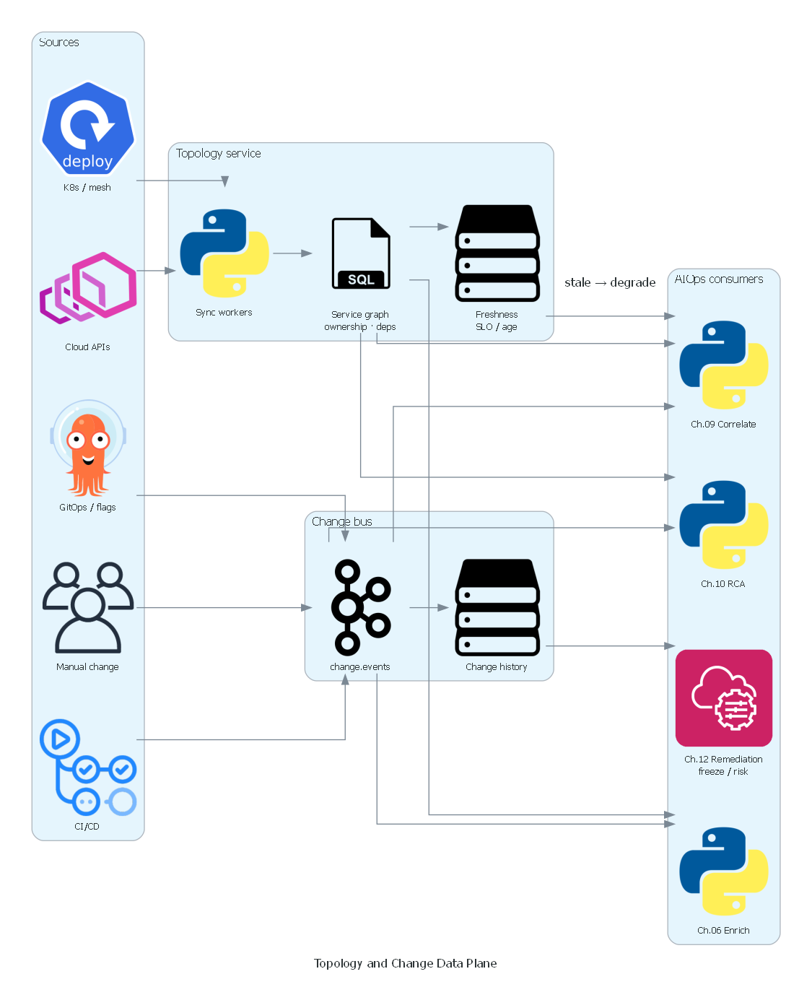

*Poster: topology sync + change bus → enrich / correlate / RCA / remediation freeze.*

> **This chapter is the capstone data product for AIOps: a versioned service topology graph plus a first-class change/deploy event stream. Telemetry without topology is anonymous noise. Anomalies without change context are false pages. Correlation, RCA, LLM investigation, and remediation safety all degrade to guesswork when the graph is stale or change events are missing. Treat topology and change as production data products with SLOs, schemas, and owners — not as a one-time Visio export.**

### Architecture poster — where this plane sits


*Ch.06 owns normalize / enrich / store for telemetry. This chapter owns the **topology graph** and **change event plane** that enrichment, correlation, RCA, and remediation **consume** as authoritative context — not as optional dashboard candy.*

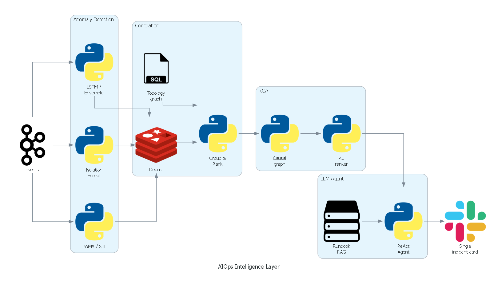

*Detect → correlate → RCA → LLM: each stage needs edges (who depends on whom) and recent change windows (what just moved).*


*Blast-radius gates and freeze windows come from this plane — not from hard-coded service lists in the remediation worker.*

---

## Prerequisites

- [00 — Introduction to AIOps](../00-introduction.md) — pipeline philosophy; topology as a first-class requirement
- [06 — Telemetry Data Plane](../06-data-plane/README.md) — enrichment contracts, change event sketch, multi-tier storage
- [07 — Kafka / Kinesis](../07-kafka/README.md) — durable fan-out, schema registry, replay
- [09 — Alert Correlation](../09-alert-correlation/README.md) — topology-aware grouping; stale-graph degradation
- [10 — Root Cause Analysis](../10-root-cause-analysis/README.md) — topology traversal + change correlation
- [12 — Remediation](../12-remediation/README.md) — blast radius, freeze, allow-list gates
- [13 — Production Operations](../13-production/README.md) — control plane vs data plane, game days

## Related Documents

- [08 — Anomaly Detection](../08-anomaly-detection/README.md) — change-aware suppression / warm-start baselines
- [11 — LLM Investigation Agent](../11-llm-agent/README.md) — context packs need neighbors + recent changes
- [14 — Big Tech AIOps](../14-bigtech-aiops/README.md) — dependency inventory and correlation at scale
- [15 — E-commerce & Banking](../15-ecommerce-banking/README.md) — multi-region graphs, payment critical path, dual-control
- [16 — Famous Incidents](../16-famous-incidents/README.md) — missing edges, ops-tool changes, shared-fate dependencies

## Next Reading

Use this plane as the **context backbone** when operating [09–12] intelligence and action layers. Revisit [06 — Data Plane](../06-data-plane/README.md) when wiring enrichment join keys, and [13 — Production](../13-production/README.md) when setting freshness SLOs and game-day scenarios for graph outage.

---

## Table of Contents

1. [Why a Topology & Change Data Plane](#1-why-a-topology--change-data-plane)
2. [Mental Model — Two Products, One Plane](#2-mental-model--two-products-one-plane)
3. [Decision Tree — When to Build a Topology Service vs Tags-Only](#3-decision-tree--when-to-build-a-topology-service-vs-tags-only)
4. [Topology Model — Nodes, Edges, Layers, Identity](#4-topology-model--nodes-edges-layers-identity)
5. [Topology Sources of Truth](#5-topology-sources-of-truth)
6. [Graph Construction, Confidence & Versioning](#6-graph-construction-confidence--versioning)
7. [Change Event Taxonomy](#7-change-event-taxonomy)
8. [Change Event Canonical Schema](#8-change-event-canonical-schema)
9. [Change Sources — CI/CD, Config, Flags, Infra, Ops Tools](#9-change-sources--cicd-config-flags-infra-ops-tools)
10. [Freeze Windows & Change Calendar](#10-freeze-windows--change-calendar)
11. [Storage Architecture](#11-storage-architecture)
12. [Streaming Contracts & Kafka Topics](#12-streaming-contracts--kafka-topics)
13. [Integrations Across the AIOps Pipeline](#13-integrations-across-the-aiops-pipeline)
14. [Query & API Surface](#14-query--api-surface)
15. [Stale Graph Danger — Health, SLOs, Degradation](#15-stale-graph-danger--health-slos-degradation)
16. [Blast Radius, Critical Paths & Remediation Safety](#16-blast-radius-critical-paths--remediation-safety)
17. [Multi-Cluster, Multi-Region & Shared Fate](#17-multi-cluster-multi-region--shared-fate)
18. [Edge Cases & Failure Modes](#18-edge-cases--failure-modes)
19. [Maturity Model (L0–L4)](#19-maturity-model-l0l4)
20. [Reference Architecture](#20-reference-architecture)
21. [Monitoring the Topology & Change Plane](#21-monitoring-the-topology--change-plane)
22. [Cost Model](#22-cost-model)
23. [Security, Tenancy & Compliance](#23-security-tenancy--compliance)
24. [Common Mistakes](#24-common-mistakes)
25. [War Stories](#25-war-stories)
26. [Production Checklist](#26-production-checklist)
27. [90-Day Implementation Plan](#27-90-day-implementation-plan)
28. [Socratic Scenarios](#28-socratic-scenarios)
29. [Production Review](#29-production-review)
30. [Summary](#30-summary)
31. [References](#31-references)

---


## How to read this chapter (concept-first)

> [!IMPORTANT]
> **Concepts first — code second**
> From chapter 08 onward, prefer: **problem → idea → input data → algorithm/model → output → pros/cons → when to use**. Implementation lives under **See the code below** (click to expand). Goal: understand *why it works on AIOps telemetry*, not only copy-paste snippets.

| Step | Question |
|------|----------|
| 1. Problem | What pain does this solve (noise, cascade, MTTR…)? |
| 2. Idea | 2–3 sentence intuition, no formulas |
| 3. Data in | Which metrics/logs/traces/events, windows, features? |
| 4. Algorithm | Computation steps / model flow |
| 5. Output | Event schema, score, rank, action proposal? |
| 6. Trade-offs | Pros / cons / cost / explainability |
| 7. When | When to use — and when **not** to |

---

## 1. Why a Topology & Change Data Plane

> [!NOTE]
> **KEY IDEA**
> Chapters 02–07 give you **signals** and **transport**. Chapters 08–12 consume **context**. The missing product between them is not “another dashboard” — it is a **versioned dependency graph** plus a **time-indexed change ledger**. Without both, correlation invents stories, RCA ranks symptoms, LLM agents hallucinate neighbors, and remediation calculates blast radius from folklore.

### 1.1 The capstone role

| Downstream consumer | Needs from topology | Needs from change |
|---------------------|---------------------|-------------------|
| [06 Enrichment](../06-data-plane/README.md) | Owner, criticality, edges for join | `deploy_age`, version, change window |
| [08 Anomaly Detection](../08-anomaly-detection/README.md) | Dependency fan-in features | Suppress / warm-start after deploy |
| [09 Correlation](../09-alert-correlation/README.md) | Merge by edge path | Group post-deploy regressions |
| [10 RCA](../10-root-cause-analysis/README.md) | Upstream walk, shared deps | Change correlation scores |
| [11 LLM Agent](../11-llm-agent/README.md) | Neighbor subgraph in context pack | “What shipped in last 60m?” |
| [12 Remediation](../12-remediation/README.md) | Blast radius, critical path | Freeze gates, rollback candidates |
| [13 Production](../13-production/README.md) | Game-day dependency maps | Change freeze policy enforcement |
| Postmortems | Latent coupling inventory | Timeline of human/system changes |

### 1.2 What “good” looks like during an incident

Without this plane (typical mid-maturity org at 02:14 UTC):

```
50 alerts fire.
On-call opens three consoles: Grafana, Argo, Backstage.
Backstage shows last week’s architecture.
Argo shows “checkout deployed 18m ago” — maybe.
Nobody knows if payment → ledger is still a real edge
  or was replaced by an async outbox last sprint.
RCA points at api-gateway because it has the most alerts.
Rollback is discussed for the wrong service.
```

With this plane:

```
One incident: checkout p99 + payment 5xx + ledger lag.
Topology: checkout → payment → ledger (mesh, conf=0.92).
Changes in window:
  - checkout 1.42.0 @ T-18m (deploy, can_rollback=true)
  - feature flag payments.retry_v2 @ T-12m (flag, progressive 10%)
AD: change_context attached; baseline warm-start for checkout.
RCA ensemble: change_correlation 0.81 + topology path payment.
Remediation gate: freeze? no; blast radius of restart(payment)=…
LLM pack: neighbors + last 5 changes + SLO owners.
```

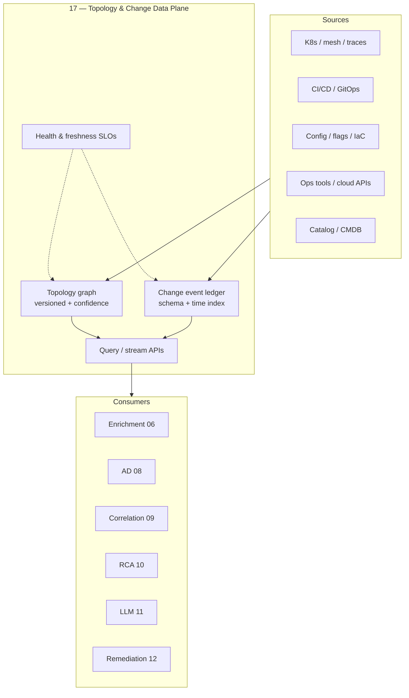

### 1.3 Why tags-only eventually fails

Label discipline (`service`, `env`, `team`) is **necessary** and **insufficient**.

| Tags alone can answer | Tags alone cannot answer |
|-----------------------|--------------------------|
| Who owns this time series? | Who is **upstream** of the red service? |
| Which env is this? | What is the **blast radius** of restarting X? |
| Filter dashboard by team | Which **shared dependency** explains co-failure? |
| Basic alert routing | Did a **deploy 12 minutes ago** explain the shift? |
| Cardinality grouping | Is edge A→B still true **tonight**, not last quarter? |

> [!IMPORTANT]
> Tags are **identity**. Topology is **structure**. Change is **time**. AIOps needs all three. Shipping only identity is how orgs buy APM and still have 40-minute “Orient” phases.

### 1.4 Honest scope of this chapter

This chapter specifies:

- **When** to invest in a topology service vs stay on tags + manual diagrams
- **What** entities and edges to model (and what to refuse to model early)
- **How** to ingest and schema change events from CI/CD, config, flags, infra, ops tools
- **Where** to store graph snapshots and change ledgers
- **How** consumers degrade when the graph is stale
- **How** freeze windows and blast radius feed remediation safety

This chapter does **not**:

- Replace full CMDB enterprise programs (ServiceNow universe)
- Claim inferred traces alone equal ground truth
- Provide a single vendor product recommendation
- Guarantee causal truth from edges (see [10 — RCA](../10-root-cause-analysis/README.md) confounders)

---

## 2. Mental Model — Two Products, One Plane

> [!NOTE]
> **KEY IDEA**
> Topology answers **spatial structure** (“who can hurt whom”). Change answers **temporal context** (“what just moved”). One platform team should own both contracts so enrichment join keys and incident timelines never disagree on `service_id` and clocks.

### 2.1 Product A — Topology graph

A **directed multigraph** over entities with:

- Stable identity (`entity_id`, not display name)
- Typed nodes (service, datastore, queue, CDN, DNS zone, cluster, …)
- Typed edges (sync RPC, async publish, batch read, shared config, shared fate)
- Confidence and provenance per edge
- Version / snapshot id for replay
- Soft TTL and last-observed timestamps

### 2.2 Product B — Change event ledger

An **append-only, time-indexed** stream of intentional system mutations:

- Deployments and rollbacks
- Config / secret / policy pushes
- Feature flag percentage and targeting changes
- Infrastructure and network changes
- Schema / migration events
- Operational tool actions (capacity, DNS, firewall)
- Freeze / unfreeze policy events

### 2.3 Shared contracts

| Contract | Topology | Change |
|----------|----------|--------|
| Identity | Same `service_id` map as [06](../06-data-plane/README.md) | Same |
| Clock | Snapshot `as_of` | Event time + ingest time |
| Environment | `env`, `region`, `cluster` dimensions | Same dimensions on every event |
| Confidence | Edge confidence 0–1 | Source trust tier |
| Fail-open | Consumers degrade without edges | Consumers omit change context |
| Ownership | Platform + domain stewards | Platform + change producers |

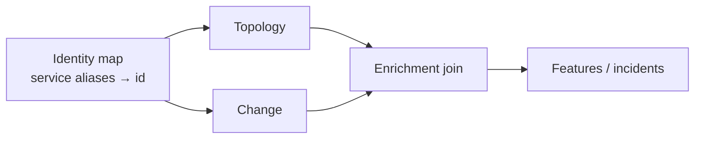

### 2.4 Control plane vs data plane for this product

| Plane | Examples | Failure mode if coupled badly |
|-------|----------|-------------------------------|
| **Data plane** | Graph query API, change stream, snapshot object store | Slow queries during incident; consumers must cache |
| **Control plane** | Schema registry, edge policy, freeze calendar, ACL | Cannot update freeze rules if control depends on broken region |

Align with the lesson in [16 — Famous Incidents](../16-famous-incidents/README.md) and poster [control vs data plane](../../assets/diagrams/07-control-vs-data-plane.png): **do not host the only copy of freeze state or critical graph snapshots solely on the region that freezes first.**

---

## 3. Decision Tree — When to Build a Topology Service vs Tags-Only

> [!NOTE]
> **KEY IDEA**
> Not every org needs a full graph service on day one. Building topology too early creates a **stale CMDB museum**. Building it too late means correlation and RCA never leave demo quality. Decide by **consumer demand**, not by architecture fashion.

### 3.1 Decision tree

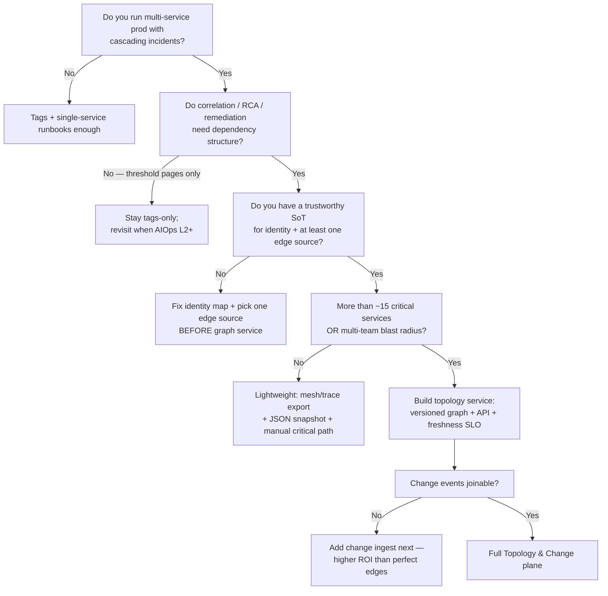

### 3.2 When tags-only is honest and correct

Stay on **tags + routing labels** when:

- Single deployable monolith or < ~10 services with static deps
- No automated correlation beyond Alertmanager `group_by`
- No automated remediation beyond runbook links
- Architecture changes quarterly, not weekly
- On-call always knows the critical path by heart (small team)

Even then, still keep:

1. Stable `service` label
2. `deployment.environment`
3. Owner / Slack / pager annotations
4. A **manual** critical-path diagram reviewed each quarter

### 3.3 When a topology *service* is justified

Build a service (API + store + freshness metrics) when **any** of these hold:

| Trigger | Why |
|---------|-----|
| Correlation needs multi-hop merge | Window-only grouping floods or under-merges |
| RCA ranks wrong “hub” services | api-gateway / BFF always wins without edges |
| Remediation needs blast radius | Restart/scale without graph is unsafe automation |
| Multi-region / multi-cluster | Shared fate and cross-cluster edges are not tags |
| LLM investigation agents | Context packs need neighbor subgraphs |
| Change failure rate reviews | Need structure + change timeline for postmortems |
| M&A or platformization | Identity and deps churn faster than tribal knowledge |

### 3.4 Tags → lightweight graph → topology service

| Stage | Artifact | Ops cost | Consumer power |
|-------|----------|----------|----------------|
| **T0 Tags** | Prometheus/OTel labels | Low | Routing, dashboards |
| **T1 Snapshot** | Nightly mesh/trace export JSON in S3 | Low–med | Offline RCA, LLM packs |
| **T2 Stream** | Edge delta + change Kafka topics | Med | Realtime correlation/AD |
| **T3 Service** | Graph API, versioning, SLOs, multi-source fusion | High | Full AIOps plane |

> [!TIP]
> **Prefer T1 before T3.** A weekly-updated honest snapshot with confidence beats a “live” service fed by a rotten CMDB. Many orgs jump to T3 and ship theater.

### 3.5 Anti-patterns in the decision

| Anti-pattern | Symptom | Fix |
|--------------|---------|-----|
| “We bought APM, so we have topology” | Edges missing async and infra | Inventory sources; add mesh + infra nodes |
| “Backstage is the graph” | Catalog is org chart, not runtime | Use catalog for ownership; mesh for edges |
| “We’ll model everything” | 40 node types, zero freshness | Cap types; expand only for consumers |
| “Graph before identity map” | Same service appears thrice | Normalize first ([06](../06-data-plane/README.md)) |
| “Perfect graph before any changes” | Still page on every deploy | Ship change events earlier — higher ROI |

---

## 4. Topology Model — Nodes, Edges, Layers, Identity

> [!NOTE]
> **KEY IDEA**
> Model **what consumers query**, not what architects sketch. Start with services + datastores + queues + critical shared fate. Every node type without a consumer is inventory debt.

### 4.1 Node types (recommended v1)

| Node type | Examples | Why required early |
|-----------|----------|--------------------|
| `service` | checkout, payment, ledger | Primary alert entity |
| `datastore` | postgres-payments, redis-session | Shared dependency RCA |
| `queue` | kafka-orders, sqs-refunds | Async cascade |
| `gateway` | api-gateway, edge-proxy | False root-cause magnets |
| `worker` | batch-reconcile, etl-nightly | Slow cascade windows |
| `external` | stripe, sms-provider | Partial observability |
| `cluster` / `namespace` | prod-a / payments | Scope and multi-tenant |
| `region` / `az` | us-east-1 / use1-az1 | Shared fate |

Optional v2+ (add when incidents prove need):

| Node type | When |
|-----------|------|
| `dns_zone` / `dns_record` | DNS automation incidents ([16](../16-famous-incidents/README.md)) |
| `cdn` / `waf` | Edge config outages |
| `identity_provider` | Auth fan-out brownouts |
| `network_fabric` | Backbone / BGP class failures |
| `feature_flag_key` | Flag-as-deploy topology |
| `pipeline` | CI/CD affecting many services |

### 4.2 Edge types

| Edge type | Semantics | Typical source |
|-----------|-----------|----------------|
| `rpc` | Sync request/response | Mesh, traces |
| `http` | HTTP/gRPC client call | Mesh, APM |
| `async_publish` | Produce to topic | Kafka ACLs, code, traces |
| `async_consume` | Consume from topic | Consumer groups |
| `db_query` | App → database | Proxies, OTel db spans |
| `cache` | App → cache | Mesh / client metrics |
| `batch_read` | Job reads warehouse | Scheduler + warehouse grants |
| `config_depends` | Service reads config key | GitOps / config service |
| `shared_fate` | Co-located failure domain | AZ, node pool, account |
| `deploy_unit` | Pods of same deployment | K8s |

> [!WARNING]
> Do not treat **all** edges as causal “A fails ⇒ B fails.” An `rpc` edge is a **possible** failure path. RCA still needs time order, change context, and confounder policy ([10](../10-root-cause-analysis/README.md)).

### 4.3 Identity — the non-negotiable join key

Every node must resolve to a stable id:

```text
entity_id = "{type}:{canonical_name}@{env}" 
# examples:
# service:checkout@prod
# datastore:postgres-payments@prod
# queue:kafka-orders.orders.v1@prod
```

Alias map (same discipline as telemetry normalize):

| Alias seen in wild | Canonical `entity_id` |
|--------------------|------------------------|
| `CheckoutSvc` | `service:checkout@prod` |
| `checkout-api` | `service:checkout@prod` |
| `svc-checkout` | `service:checkout@prod` |
| `payments-db` | `datastore:postgres-payments@prod` |

Store aliases with `source` and `priority`. Never invent a second service because a label case-fold failed.

### 4.4 Attributes worth storing on nodes

| Attribute | Used by |
|-----------|---------|
| `owner_team`, `pager`, `slack` | Routing, LLM pack |
| `tier` / `criticality` (0–3) | Blast radius weight, freeze severity |
| `slo_id` / `error_budget` | Correlation priority |
| `pci` / `pii` flags | Remediation dual-control ([15](../15-ecommerce-banking/README.md)) |
| `lifecycle` (active, deprecated, shadow) | Suppress dead edges |
| `deploy_method` (k8s, lambda, vm) | Rollback action family |
| `data_sensitivity` | LLM redaction |

### 4.5 Attributes on edges

| Attribute | Meaning |
|-----------|---------|
| `confidence` | 0.0–1.0 fused score |
| `sources[]` | mesh, trace, cmdb, manual |
| `first_seen`, `last_seen` | Freshness / decay |
| `rps_p50` / `error_share` | Optional weight for ranking |
| `critical_path` | Boolean for money path ([15](../15-ecommerce-banking/README.md)) |
| `direction_validated` | true if parent-child confirmed |

### 4.6 Layering model (do not flatten everything)

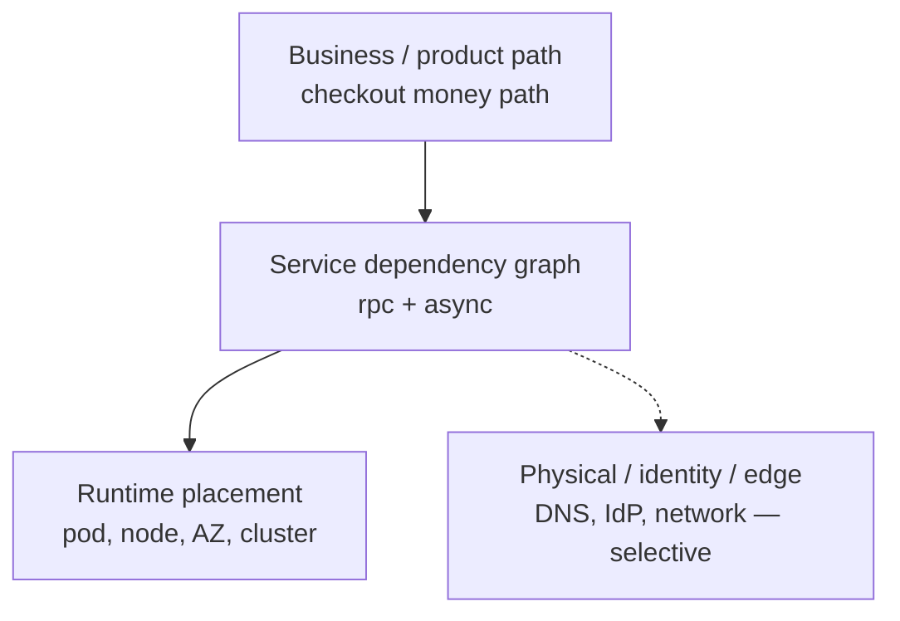

| Layer | Default inclusion | Notes |
|-------|-------------------|-------|
| L2 service graph | Always | Core AIOps consumers |
| L1 placement | Always for K8s orgs | Shared node / AZ fate |
| L3 business path | For tier-0 products | Explicit critical path edges |
| L0 physical/identity | Selective | After famous-class incidents prove need |

> [!TIP]
> **Critical path is a product annotation, not an inference.** Mark money-path edges (`checkout → payment → ledger → acquirer`) explicitly. Inference will miss the outbox hop you added last quarter.

### 4.7 Example subgraph (payment critical path)

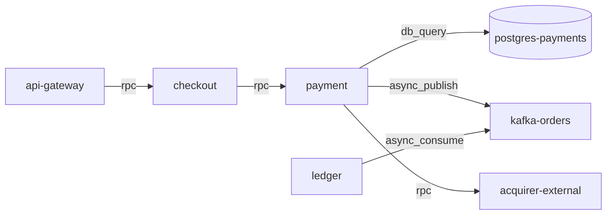

Consumers should request **ego graphs** (N hops from incident seed), not the full enterprise graph, on the hot path.

---

## 5. Topology Sources of Truth

> [!NOTE]
> **KEY IDEA**
> There is no single source of truth for modern topology. There is a **fusion** of runtime observation, deploy intent, and human catalog — each with different lag, coverage, and lies.

### 5.1 Source comparison

| Source | Strengths | Weaknesses | Suggested weight |
|--------|-----------|------------|------------------|
| Service mesh (Istio/Linkerd/App Mesh) | Live edges, RPS | Misses out-of-mesh; east-west only | High for `rpc` |
| OTel service graph / SpanMetrics | Language-agnostic | Tail sampling incompleteness | Med–high |
| Distributed traces (Tempo/Jaeger) | Direction + critical path | Sampling bias | Med (validate direction) |
| Kubernetes API | Workloads, owners, deploy units | Not business deps | High for placement |
| Cloud APIs (SG, LB, PrivateLink) | Real network reachability | Noisy; account sprawl | Med for infra |
| Kafka / queue metadata | Async topology | Naming hell | High for async |
| Catalog (Backstage) / CMDB | Ownership, tier, PCI | Stale edges, wishful architecture | High for attrs; low for edges |
| Manual / critical path YAML | Money path truth | Drift without review | High for L3 annotations |
| APM vendor graph | Fast bootstrap | Lock-in; opaque confidence | Bootstrap only |

### 5.2 Recommended fusion policy (v1)

```text
edge.confidence =
  0.45 * mesh_score
+ 0.25 * trace_score
+ 0.15 * queue_meta_score
+ 0.10 * cloud_reachability_score
+ 0.05 * catalog_declared_score

if only catalog_declared and no runtime observation for 7d:
  confidence = min(confidence, 0.25)  # wishful edge
if last_seen > 24h:
  confidence *= decay(last_seen)
if direction conflict mesh vs trace:
  prefer trace parent-child; flag conflict
```

### 5.3 What catalog/CMDB is for

Use catalog for:

- Owner, pager, tier, compliance tags
- Declared **intended** dependencies (weak prior)
- Service lifecycle and docs links

Do **not** use catalog alone for:

- Real-time correlation edges
- Blast radius of a restart
- “Is this edge live in prod right now?”

> [!WARNING]
> **Wishful CMDB edges are operational hazards.** Correlation that trusts an edge removed three sprints ago will merge independent incidents and invent a single root cause. Measure `topology_edge_catalog_only_ratio` and drive it down.

### 5.4 Bootstrap sequence for greenfield

1. **Identity map** from OTel resource attrs + K8s workload names  
2. **Mesh or SpanMetrics** edges for top 20 services by traffic  
3. **Datastores and queues** from connection strings / CRDs / Terraform state (read-only)  
4. **Owners** from Backstage / CODEOWNERS  
5. **Critical path** YAML reviewed by product SRE  
6. Only then: graph API + consumer integration  

### 5.5 Continuous discovery agents

| Agent | Cadence | Output |
|-------|---------|--------|
| Mesh scraper | 1–5 min | Edge deltas + RPS |
| Trace sampler aggregator | 5–15 min | Direction validation |
| K8s informer | near-real-time | Node inventory |
| Queue inventory | 5–15 min | Topic ↔ consumer groups |
| Catalog sync | 15–60 min | Attributes only |
| Cloud topology job | 15–60 min | Shared fate / network |
| Consistency auditor | hourly | Conflicts, orphans, ghosts |

---

## 6. Graph Construction, Confidence & Versioning

> [!NOTE]
> **KEY IDEA**
> A topology graph without **versioning** cannot support RCA replay or “what did correlation believe at T0?”. Store snapshots + deltas like you would feature store point-in-time data ([06](../06-data-plane/README.md)).

### 6.1 Snapshot + delta model

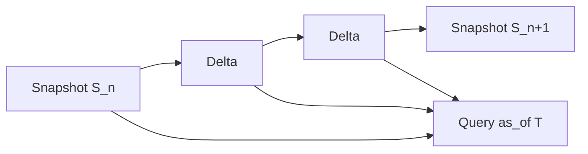

| Artifact | Contents | Retention (example) |
|----------|----------|---------------------|
| Full snapshot | All nodes/edges + meta | 30–90d hot, 1y cold |
| Delta | adds/removes/updates since last | 7–30d hot |
| Compaction | Periodic full rebuild | Continuous |
| Audit log | Who approved manual edges | 1y+ |

### 6.2 Edge lifecycle

| State | Meaning | Consumer behavior |
|-------|---------|-------------------|
| `active` | Observed recently, conf ≥ threshold | Full use |
| `decaying` | Not seen; conf reduced | Optional weak merge |
| `suspect` | Source conflict | Exclude from causal ordering |
| `removed` | Explicit tombstone | Never use; keep for replay |
| `manual_pin` | Human-critical path | Use even if low traffic |

### 6.3 Confidence thresholds by consumer

| Consumer | Min edge confidence | Notes |
|----------|---------------------|-------|
| Correlation merge | ≥ 0.5 default | Cap weight if sparse |
| RCA traversal | ≥ 0.4 with decay | Show confidence in UI |
| Remediation blast radius | ≥ 0.6 for auto | Else require human |
| LLM context pack | ≥ 0.3 | Label low-confidence edges |
| Training features | ≥ 0.5 + PIT join | Avoid future leakage |

### 6.4 Pseudo-API for construction

<details>
<summary><strong>See the code below — click to expand (read concepts first)</strong></summary>

```python
from dataclasses import dataclass, field
from typing import List, Optional
from datetime import datetime, timezone

@dataclass
class EdgeObservation:
    src: str
    dst: str
    edge_type: str
    source: str          # mesh | trace | queue | catalog | manual
    observed_at: datetime
    weight: float = 1.0  # e.g. normalized RPS
    direction_ok: bool = True

@dataclass
class GraphEdge:
    src: str
    dst: str
    edge_type: str
    confidence: float
    sources: List[str] = field(default_factory=list)
    last_seen: Optional[datetime] = None
    critical_path: bool = False

SOURCE_WEIGHT = {
    "mesh": 0.45,
    "trace": 0.25,
    "queue": 0.15,
    "cloud": 0.10,
    "catalog": 0.05,
    "manual": 0.40,  # for critical_path pins; still not infinite
}

def fuse_edge(obs: List[EdgeObservation], now: datetime) -> GraphEdge:
    sources = sorted({o.source for o in obs})
    conf = 0.0
    for o in obs:
        age_h = max(0.0, (now - o.observed_at).total_seconds() / 3600.0)
        decay = 0.5 ** (age_h / 24.0)  # half-life 24h
        conf += SOURCE_WEIGHT.get(o.source, 0.05) * decay * min(1.0, o.weight)
    conf = min(1.0, conf)
    if any(not o.direction_ok for o in obs):
        conf *= 0.5
    return GraphEdge(
        src=obs[0].src,
        dst=obs[0].dst,
        edge_type=obs[0].edge_type,
        confidence=round(conf, 3),
        sources=sources,
        last_seen=max(o.observed_at for o in obs),
        critical_path=any(o.source == "manual" for o in obs),
    )
```

</details>

### 6.5 Graph meta object (required)

Every published graph version must carry:

<details>
<summary><strong>See the code below — click to expand (read concepts first)</strong></summary>

```json
{
  "graph_version": "2026-07-22T10:15:00Z#prod-global",
  "as_of": "2026-07-22T10:15:00Z",
  "built_at": "2026-07-22T10:15:12Z",
  "env": "prod",
  "node_count": 842,
  "edge_count": 3911,
  "coverage": {
    "services_with_any_edge": 0.91,
    "tier0_with_critical_path": 1.0
  },
  "sources_healthy": {
    "mesh": true,
    "trace_agg": true,
    "catalog": true,
    "queue": false
  },
  "staleness_seconds": 72,
  "quality_flags": ["queue_source_degraded"]
}
```

</details>

Consumers **must** read meta before trusting edges. See §15.

### 6.6 Manual edges and override governance

Manual critical-path pins are allowed under:

1. PR-reviewed YAML or catalog annotation  
2. Expiry date (e.g. 90 days) unless renewed  
3. Owner field  
4. Audit log  

<details>
<summary><strong>See the code below — click to expand (read concepts first)</strong></summary>

```yaml
# topology/critical-paths/checkout.yaml
path_id: checkout-money-path
env: prod
edges:
  - src: service:checkout@prod
    dst: service:payment@prod
    type: rpc
  - src: service:payment@prod
    dst: datastore:postgres-payments@prod
    type: db_query
  - src: service:payment@prod
    dst: external:acquirer@prod
    type: rpc
owners: [payments-sre]
expires: 2026-10-01
```

</details>

---

## 7. Change Event Taxonomy

> [!NOTE]
> **KEY IDEA**
> Most serious incidents have a **change nearby**. If your change taxonomy only includes “git deploy,” you will miss config, flags, DNS, capacity tools, and schema migrations — the classes that dominate famous outages ([16](../16-famous-incidents/README.md)).

### 7.1 Change classes

| Class | Examples | Typical window of impact | Rollback shape |
|-------|----------|--------------------------|----------------|
| `deployment` | K8s rollout, Lambda version, AMI bake | minutes–hours | Redeploy previous |
| `config_change` | App config, runtime flags file | seconds–minutes | Revert config |
| `feature_flag` | Percentage ramp, targeting | seconds | Flip off |
| `secret_rotation` | Creds, certs | minutes | Depends |
| `infrastructure` | Terraform apply, node group, SG | minutes–hours | IaC revert / break-glass |
| `network` | DNS, route, WAF, CDN | seconds–minutes | Previous record/config |
| `schema_migration` | DB migrate, topic schema | minutes–hours | Expand/contract only |
| `data_job` | Backfill, reindex | hours | Stop job |
| `ops_tool` | Capacity CLI, failover script | seconds | Often **no** easy undo |
| `policy` | Authz, rate limit, mesh policy | seconds–minutes | Previous policy |
| `freeze` | Change freeze start/end | N/A | N/A (meta) |

### 7.2 Why ops_tool and network belong here

From incident literature and [16](../16-famous-incidents/README.md):

- Capacity removal commands without min-capacity guards  
- DNS automation races  
- Global config pushes at the edge  
- Failover tools that depend on the impaired plane  

If these never become change events, RCA **cannot** score them and LLM agents will not surface them.

### 7.3 Intentional vs emergent change

| Kind | Definition | Ingest? |
|------|------------|---------|
| **Intentional** | Human or pipeline decided to mutate prod | **Yes — first class** |
| **Emergent** | Autoscaler, HPA, cache eviction, GC | Optional secondary stream |
| **Failure** | Pod crash, node death | Not a “change event”; use infra events / alerts |

Do not pollute the change ledger with every Kubernetes `FailedScheduling` noise. Keep change = **intent to modify system behavior**.

### 7.4 Progressive delivery as structured change

Canaries, blue/green, and flag ramps should emit **lifecycle events**, not only start/end:

| Subtype | Meaning |
|---------|---------|
| `started` | Change begins |
| `progress` | 1% → 10% → 50% |
| `halted` | Auto or manual stop |
| `completed` | 100% or full rollout |
| `rolled_back` | Reverted |

RCA windows should prefer `started`/`progress` near incident start, not only `completed`.

---

## 8. Change Event Canonical Schema

> [!NOTE]
> **KEY IDEA**
> One canonical schema across producers. Custom JSON per CI system is how change correlation silently fails for half the fleet.

### 8.1 Core schema (JSON)

<details>
<summary><strong>See the code below — click to expand (read concepts first)</strong></summary>

```json
{
  "schema_version": "1.0.0",
  "event_id": "chg_01JABC…",
  "event_time": "2026-07-22T09:00:00Z",
  "ingest_time": "2026-07-22T09:00:02Z",
  "change_class": "deployment",
  "change_subtype": "started",
  "identity": {
    "entity_id": "service:checkout@prod",
    "service": "checkout",
    "env": "prod",
    "region": "us-east-1",
    "cluster": "prod-a"
  },
  "actor": {
    "type": "pipeline",
    "id": "github-actions",
    "user": "svc-deploy",
    "url": "https://ci.example/job/99821"
  },
  "payload": {
    "version": "1.42.0",
    "previous_version": "1.41.3",
    "commit": "abc123def",
    "pipeline_id": "gha-99821",
    "strategy": "canary",
    "canary_percent": 10,
    "change_window": true,
    "ticket": "CHG-10422"
  },
  "risk": {
    "tier_affected_max": 0,
    "declared_blast_radius": ["service:checkout@prod", "service:payment@prod"],
    "requires_dual_control": false
  },
  "links": {
    "pr": "https://github.com/org/checkout/pull/8821",
    "runbook": "https://runbooks/checkout-rollback",
    "diff": "https://…/diff"
  },
  "provenance": {
    "source_system": "argocd",
    "source_event_id": "app-sync-…",
    "trust_tier": "high"
  },
  "can_rollback": true,
  "rollback_ref": {
    "action": "deploy",
    "version": "1.41.3"
  }
}
```

</details>

### 8.2 Field rules

| Field | Rule |
|-------|------|
| `event_id` | Globally unique; idempotent upserts |
| `event_time` | When change **took effect** in target env (not commit time) |
| `ingest_time` | When plane received it (lag SLO) |
| `identity.entity_id` | Must pass identity map; reject or DLQ unknowns |
| `change_class` | Enum; open extension with registry |
| `can_rollback` | Boolean; false for many ops_tool/network |
| `trust_tier` | `high` (signed CD) / `medium` / `low` (scraped) |

### 8.3 Compatibility with Ch.06 sketch

Chapter [06 §4.6](../06-data-plane/README.md) introduced a minimal event. This chapter **extends** it; consumers should accept both during dual-write:

| Ch.06 field | Ch.17 field |
|-------------|-------------|
| `signal_type=event` | implied by topic |
| `event_kind` | `change_class` |
| `payload.version` | `payload.version` |
| `payload.change_window` | `payload.change_window` |
| — | `risk`, `can_rollback`, `provenance` |

### 8.4 Schema evolution

| Change | Policy |
|--------|--------|
| Add optional field | Allowed |
| New `change_class` enum value | Registry + consumer ignore-unknown |
| Rename identity fields | Forbidden without dual-write period |
| Event time vs commit time semantics | Document; never swap silently |

### 8.5 Validation gates

```text
REJECT if missing event_id, event_time, change_class, identity.env
REJECT if entity_id fails identity map AND cannot alias
WARN  if event_time > now+5m (clock skew)
WARN  if event_time < now-7d (late historical backfill — mark late=true)
DLQ   if payload exceeds size limit or unknown required vNext fields
```

---

## 9. Change Sources — CI/CD, Config, Flags, Infra, Ops Tools

> [!NOTE]
> **KEY IDEA**
> The plane is only as good as **producer coverage**. A perfect schema with only GitHub deploys will still miss the flag flip that took down checkout.

### 9.1 CI/CD and GitOps

| System | Hook | Notes |
|--------|------|-------|
| GitHub Actions / GitLab CI | workflow_run + deploy job | Map job → service via catalog |
| Argo CD | application sync events | Prefer sync **result** + revision |
| Flux | GitRepository / Kustomization events | Include source commit |
| Spinnaker / Harness | pipeline stage events | Capture canary stages |
| Jenkins | deploy pipeline webhooks | Often low trust_tier until hardened |
| Helm / Kustomize apply bots | admission or wrapper | Wrap raw kubectl |

**Minimum fields:** service, env, version, commit, start/finish, actor, pipeline URL.

### 9.2 Config systems

| System | Events to capture |
|--------|-------------------|
| App config service | key, old/new hash (not secret values), scope |
| Kubernetes ConfigMap/Secret | name, namespace, resourceVersion (redact values) |
| AWS AppConfig / SSM params | application, version |
| Nginx / Envoy dynamic config | version, hash |
| Mesh VirtualService / DestinationRule | resource identity + generation |

> [!WARNING]
> **Never put secret values in the change ledger.** Store hashes, key names, and versions only. Secret material in Kafka is a compliance incident waiting to happen.

### 9.3 Feature flags

Flag systems are **deploys without deploys**:

| Capture | Why |
|---------|-----|
| Flag key + environment | Join to service ownership map |
| Percentage / cohort changes | Progressive risk |
| Kill-switch flips | Fast remediation candidates |
| Actor + change reason | Audit |

Map flags → services via registry (`flag.payments.retry_v2` → `service:payment@prod`). Unmapped flags become second-class in RCA.

### 9.4 Infrastructure as Code

| Source | Event |
|--------|-------|
| Terraform Cloud/Enterprise | run apply finished |
| Pulumi / CDK pipelines | stack update |
| Crossplane | composite resource ready |
| CloudTrail / Activity logs | high-risk API calls (filtered) |

Filter aggressively: you want **mutations with blast radius**, not every `Describe*`.

### 9.5 Ops tools and break-glass

Instrument wrappers around dangerous tools:

```text
capacity-cli, dns-ctl, failover-runner, db-restore,
firewall-push, traffic-shift, cert-rotate
```

Emit:

- command name + parameters **schema** (redact sensitive)
- actor + ticket
- target entities
- `can_rollback=false` unless explicit inverse exists
- approval id if dual-control

This is non-negotiable for [12 Remediation](../12-remediation/README.md) learning loops and for postmortems that look like S3-2017 class events.

### 9.6 Database migrations

| Event | Detail |
|-------|--------|
| `schema_migration.started` | service, DB, migration id, expand/contract |
| `schema_migration.completed` | duration, lock time if known |
| `schema_migration.failed` | error class |

Pair with freeze windows: many banks ban migrations outside windows ([15](../15-ecommerce-banking/README.md)).

### 9.7 Coverage scorecard

| Producer class | Target coverage (prod tier-0/1) |
|----------------|--------------------------------|
| Deployments | ≥ 98% of rollouts |
| Feature flags (prod) | ≥ 95% of mutations |
| Config (prod) | ≥ 90% |
| Infra applies | ≥ 90% |
| Ops tools high-risk | ≥ 99% of wrapped tools |
| Network/DNS automation | ≥ 95% |

Metric: `change_ingest_coverage_ratio{class=…}`.

---

## 10. Freeze Windows & Change Calendar

> [!NOTE]
> **KEY IDEA**
> Freeze is not a Slack message. Freeze is a **machine-readable policy stream** consumed by CD gates, remediation, and AD suppression logic.

### 10.1 Freeze event schema (subset)

<details>
<summary><strong>See the code below — click to expand (read concepts first)</strong></summary>

```json
{
  "change_class": "freeze",
  "change_subtype": "started",
  "event_time": "2026-11-25T00:00:00Z",
  "identity": { "env": "prod", "scope": "global" },
  "payload": {
    "freeze_id": "bfcm-2026",
    "severity": "hard",
    "allows": ["hotfix_sev1", "flag_kill_switch"],
    "blocks": ["deployment", "schema_migration", "infra"],
    "regions": ["*"],
    "tiers": [0, 1],
    "ends_at": "2026-12-02T08:00:00Z",
    "authority": "sre-steering"
  }
}
```

</details>

### 10.2 Severity levels

| Severity | Meaning | Typical exceptions |
|----------|---------|-------------------|
| `soft` | Prefer no changes; warn only | Team lead ack |
| `hard` | Block CD for in-scope entities | SEV1 hotfix + dual-control |
| `lockdown` | Block almost everything | Kill-switch flags only |

### 10.3 Consumers of freeze

| Consumer | Behavior |
|----------|----------|
| CI/CD | Fail pipeline pre-prod promote |
| Remediation | Block non-allow-listed actions; allow kill-switch |
| AD | Optional: higher sensitivity (fewer deploys) |
| Correlation | Annotate incidents “during freeze” |
| LLM | Prefer rollback / flag-off over new mutative actions |

### 10.4 Calendar vs ad-hoc freeze

| Type | Source | Example |
|------|--------|---------|
| Planned calendar | YAML/Git + generated events | BFCM, year-end, payroll cutover |
| Ad-hoc incident freeze | Incident commander API | Active SEV1 |
| Regional freeze | Region failure | us-east-1 impairment |
| Product freeze | Payment path only | Card processor issue |

### 10.5 Interaction with change correlation

During freeze, **unexpected** change events are high-signal:

```text
if freeze.active and change not in freeze.allows:
  mark change as policy_violation
  raise correlation priority
  page change authority + on-call
```

---

## 11. Storage Architecture

> [!NOTE]
> **KEY IDEA**
> Topology storage optimizes **graph query + versioned snapshots**. Change storage optimizes **time-range scans by entity**. Do not force both into one OLTP table and pray.

### 11.1 Recommended layout

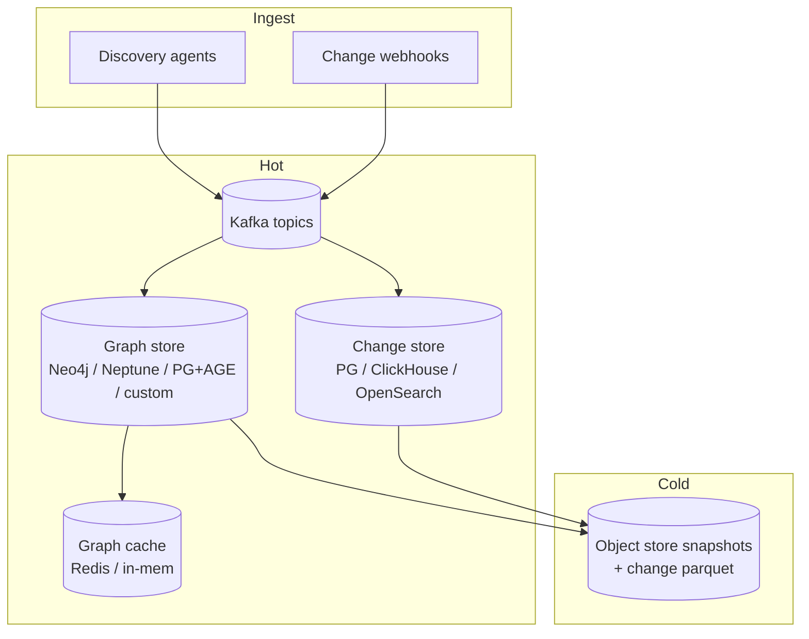

### 11.2 Technology choices (honest trade-offs)

| Option | Pros | Cons | Fit |
|--------|------|------|-----|
| PostgreSQL + relational edges | Simple ops, strong txn | Multi-hop queries slower | Small–med graphs |
| PostgreSQL + Apache AGE / pggraph | SQL + graph | Maturity/ops learning | Med |
| Neo4j / Memgraph | Graph DX, path queries | Another system | Med–large |
| Amazon Neptune | Managed graph | Cost, lock-in | AWS-heavy |
| Custom adjacency in Redis + S3 snapshots | Very fast ego queries | You own correctness | High QPS read path |
| Pure S3 JSON snapshots | Cheap | Not realtime | T1 bootstrap |

> [!TIP]
> **Start with Postgres edges + Redis ego-cache + S3 snapshots.** Promote to a graph DB only when multi-hop query latency or developer ergonomics force it.

### 11.3 Change store access patterns

| Query | SLA | Index |
|-------|-----|-------|
| Changes for entity in [T0−W, T0] | < 100ms p99 hot | `(entity_id, event_time DESC)` |
| All changes in env last 30m | < 300ms | `(env, event_time)` |
| Flag changes by key | < 100ms | `(flag_key, event_time)` |
| Freeze active at T? | < 50ms | calendar cache |
| Analytics: CFR by service | minutes OK | cold parquet |

### 11.4 Retention matrix (example)

| Data | Hot | Warm | Cold |
|------|-----|------|------|
| Graph snapshots | 30d | 90d | 1–2y |
| Edge deltas | 14d | 30d | 90d |
| Change events tier-0 | 90d | 1y | 2y+ (audit) |
| Change events tier-2 | 30d | 90d | 1y |
| Manual edge audit | 1y+ | — | compliance |
| Freeze history | 2y | — | policy |

Align with domain retention in [15](../15-ecommerce-banking/README.md) for regulated change audit.

### 11.5 Point-in-time (PIT) graph reads

RCA replay and training require:

```text
get_graph(as_of=incident.start - 1m) 
// not "whatever the graph is now"
```

Implementation options:

1. Snapshot nearest ≤ `as_of` + apply deltas  
2. Temporal edge tables with `valid_from` / `valid_to`  
3. Daily snapshot only (acceptable L1–L2; weak for fast churn)

---

## 12. Streaming Contracts & Kafka Topics

Cross-link: [07 — Kafka](../07-kafka/README.md).

### 12.1 Suggested topics

| Topic | Key | Value | Retention |
|-------|-----|-------|-----------|
| `topology.edges.delta.v1` | `src\|dst\|type` | edge upsert/tombstone | 7–14d |
| `topology.nodes.delta.v1` | `entity_id` | node upsert | 7–14d |
| `topology.snapshots.notice.v1` | `env` | pointer to S3 snapshot | 30d |
| `change.events.v1` | `entity_id` | canonical change | 30–90d |
| `change.freeze.v1` | `scope` | freeze events | 90d+ |
| `topology.quality.v1` | `env` | coverage/staleness metrics events | 7d |

### 12.2 Fan-out consumers

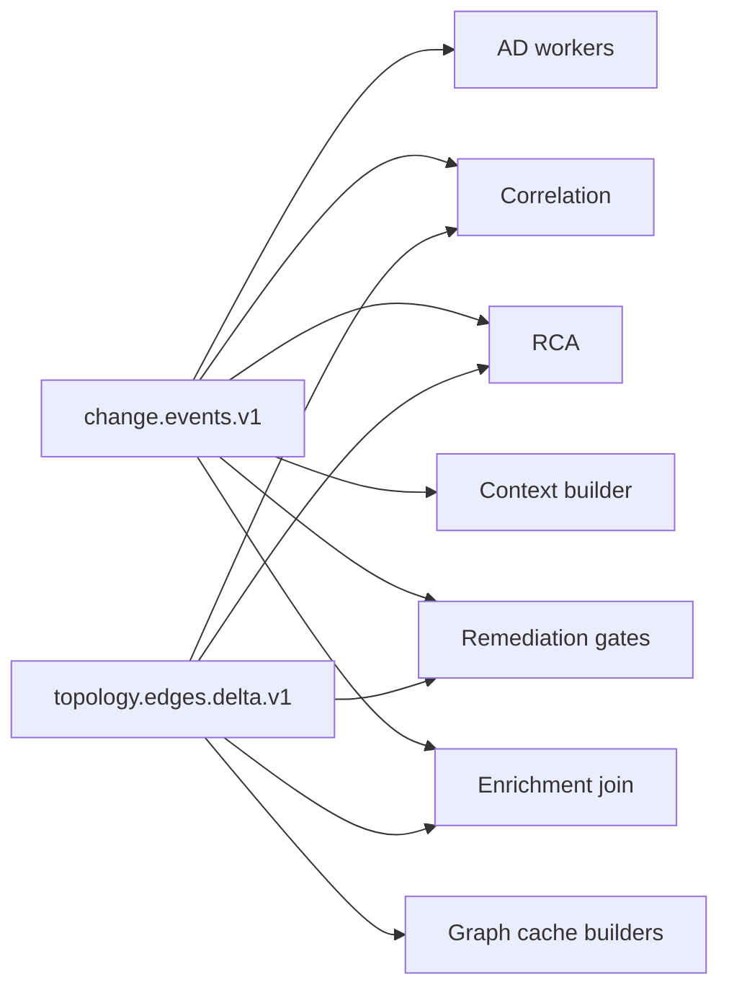

### 12.3 Ordering and idempotency

| Stream | Ordering need |
|--------|---------------|
| Changes per entity | Prefer per-key order for lifecycle (`started` before `completed`) |
| Edge deltas | Idempotent upsert by edge id + `observed_at` |
| Snapshots | Monotonic `graph_version` |

Use idempotent producers and consumer-side dedupe on `event_id`.

### 12.4 Replay

Support:

- Rebuild graph cache from snapshots + deltas  
- Recompute “changes in window” for a past incident  
- Backfill after new producer comes online  

Without replay, postmortems and model training become folklore.

---

## 13. Integrations Across the AIOps Pipeline

> [!NOTE]
> **KEY IDEA**
> This plane earns its keep only when **wired**. A beautiful graph UI with no consumer integration is a CMDB museum with better CSS.

### 13.1 Enrichment ([06](../06-data-plane/README.md))

Attach to telemetry and alerts:

| Enrichment field | Source |
|------------------|--------|
| `service_id`, `owner`, `tier` | Node attrs |
| `deploy_version`, `deploy_age_minutes` | Latest change deploy |
| `in_change_window` | Change + freeze calendar |
| `dependency_fan_in` | Graph degree |
| `critical_path_member` | L3 annotation |

Fail-open: if graph/change unavailable, set `topology_context=unknown` and continue ingest.

### 13.2 Anomaly detection ([08](../08-anomaly-detection/README.md))

| Integration | Behavior |
|-------------|----------|
| Deploy-aware suppress | Optional short window after deploy if error within burn budget |
| Warm-start baseline | Reset or blend baseline on version change |
| Feature `deploy_age_minutes` | Model input |
| Regime change flag | Infra scale events |

> [!IMPORTANT]
> Do not suppress blindly on every deploy. Suppress **conditionally** (canary healthy, error budget, change class). Blind suppress hides bad deploys.

### 13.3 Alert correlation ([09](../09-alert-correlation/README.md))

| Integration | Behavior |
|-------------|----------|
| Topology merge | Multi-hop within depth + confidence |
| Stale graph guard | Disable topology causal ordering |
| Change-linked grouping | Post-deploy regression title templates |
| Shared dependency | Merge services sharing red datastore/queue |

### 13.4 RCA ([10](../10-root-cause-analysis/README.md))

| Algorithm | Input from this plane |
|-----------|----------------------|
| Topology traversal | Ego graph + edge confidence |
| Change correlation | Changes in impact window |
| Ensemble weights | Prefer change when high score |
| Confounder policy | Simultaneous deploy + traffic spike |

### 13.5 LLM agent ([11](../11-llm-agent/README.md))

Context pack sections:

1. Seed service node + owners  
2. Neighbors ≤ 2 hops with confidence  
3. Critical path membership  
4. Last N changes (redacted)  
5. Active freeze  
6. Known ghost/orphan warnings  

Never dump full enterprise graph into the prompt.

### 13.6 Remediation ([12](../12-remediation/README.md))

| Gate | Uses |
|------|------|
| Freeze check | `change.freeze` |
| Blast radius | Downstream BFS weighted by tier |
| Rollback candidate | Latest deploy with `can_rollback` |
| Dual-control | Node `pci` / risk flags |
| Action allow-list scope | Entity types present in graph |

### 13.7 Integration test matrix (minimum)

| Test | Expect |
|------|--------|
| Deploy event → AD feature within 60s | `deploy_age` updates |
| New mesh edge → correlation merge within 2 refresh cycles | Related alerts merge |
| Stale graph meta → correlation banner | Topology weight 0 |
| Freeze hard → CD blocked + remediation limited | Policy enforced |
| Identity alias remap | Both old/new labels join same node |

---

## 14. Query & API Surface

### 14.1 Core read APIs

| API | Purpose |
|-----|---------|
| `GET /v1/nodes/{id}` | Node attrs |
| `GET /v1/graph/ego?seed=&hops=&min_conf=` | Incident subgraph |
| `GET /v1/graph/path?src=&dst=` | Dependency path |
| `GET /v1/graph/shared-deps?services=` | Common upstreams |
| `GET /v1/graph/meta` | Freshness & coverage |
| `GET /v1/graph/as-of?t=` | PIT graph handle |
| `GET /v1/changes?entity=&from=&to=` | Change window |
| `GET /v1/changes/impact?incident_start=&services=` | RCA helper |
| `GET /v1/freeze/active?env=&t=` | Freeze state |
| `POST /v1/blast-radius` | Remediation preview |

### 14.2 Blast radius request example

<details>
<summary><strong>See the code below — click to expand (read concepts first)</strong></summary>

```json
{
  "action": "restart",
  "target": "service:payment@prod",
  "max_hops": 3,
  "min_confidence": 0.6,
  "as_of": "now"
}
```

</details>

<details>
<summary><strong>See the code below — click to expand (read concepts first)</strong></summary>

```json
{
  "target": "service:payment@prod",
  "downstream": [
    {"entity_id": "service:checkout@prod", "tier": 0, "via": ["rpc"]},
    {"entity_id": "service:order@prod", "tier": 1, "via": ["rpc"]}
  ],
  "shared_fate": ["az:use1-az1"],
  "risk_score": 0.82,
  "graph_version": "…",
  "warnings": []
}
```

</details>

### 14.3 SLOs for the API

| SLO | Target (example) |
|-----|------------------|
| Ego graph p99 (2 hops, tier-0 seed) | < 150ms |
| Changes-in-window p99 | < 100ms |
| Meta freshness endpoint | < 50ms |
| Availability | 99.9% (with cached degrade) |
| Staleness of served graph | < 15m for prod default |

### 14.4 AuthZ model

- Read graph: broad for on-call tools  
- Read changes: broad but redact sensitive payload fields by role  
- Write manual edges / freeze: restricted SRE platform  
- Break-glass write: audited dual-control  

---

## 15. Stale Graph Danger — Health, SLOs, Degradation

> [!WARNING]
> **A wrong graph is worse than no graph.** Under-merge wastes attention. Over-merge and inverted roots **waste incident minutes under false certainty**. Correlation and RCA must degrade loudly.

### 15.1 Stale failure modes (expanded)

| Stale type | Symptom | Consequence | Mitigation |
|------------|---------|-------------|------------|
| Dead edge | Still merges A↔B | False single incident | TTL + last_seen decay |
| Missing edge | Cascade not merged | Alert storm | Mesh refresh 5–15m |
| Inverted direction | Root = downstream | Wrong remediation | Trace parent-child validation |
| Missing shared dep | Co-failure unexplained | Split brain ops | Infra nodes |
| Multi-cluster blind | Cross-cluster split | Higher MTTR | Cluster edges |
| Catalog ghost | Fake edges | Over-merge | Cap catalog-only conf |
| Snapshot clock skew | PIT wrong | Bad replay | NTP + ingest_time |
| Partial source outage | Sparse graph | Silent underuse | `sources_healthy` flags |

### 15.2 Health signals

| Metric | Warning | Page |
|--------|---------|------|
| `topology_graph_age_seconds` | > 900 | > 1800 |
| `topology_edge_coverage_ratio` (active services) | < 0.7 | < 0.5 |
| `topology_source_up{source=mesh}` | 0 for 10m | 0 for 30m |
| `topology_conflict_edges_total` | rising | — |
| `topology_catalog_only_edge_ratio` | > 0.3 | > 0.5 |
| `change_ingest_lag_seconds` | > 120 | > 600 |
| `change_coverage_ratio{class=deployment}` | < 0.95 | < 0.9 tier-0 |
| `freeze_evaluator_errors` | any | sustained |

### 15.3 Consumer degradation policy

<details>
<summary><strong>See the code below — click to expand (read concepts first)</strong></summary>

```python
def topology_mode(meta: dict) -> dict:
    age = meta["staleness_seconds"]
    cov = meta["coverage"]["services_with_any_edge"]
    if age > 1800 or cov < 0.5:
        return {
            "use_topology": False,
            "reason": "stale_or_sparse",
            "fallback": ["temporal", "label", "semantic"],
            "ui_banner": "Topology outdated — confidence reduced",
        }
    if age > 900 or not meta["sources_healthy"].get("mesh", True):
        return {
            "use_topology": True,
            "topology_weight_cap": 0.2,
            "reason": "degraded",
            "ui_banner": "Topology degraded",
        }
    return {"use_topology": True, "topology_weight": 0.4}
```

</details>

Align with [09 §19.1](../09-alert-correlation/README.md).

### 15.4 Change stream degradation

| Condition | Consumer behavior |
|-----------|-------------------|
| Lag > 10m | RCA marks change_correlation `unavailable` |
| Coverage drop on deploys | Page CD integration owners |
| Clock skew warnings | Prefer ingest_time + annotate uncertainty |
| Poison messages | DLQ; do not block other entities |

### 15.5 Why freshness is a **platform SLO**, not a nicety

If graph age is not paged, it will rot. Rotten graphs train humans to ignore topology banners — then you lose the only safe degrade path.

> [!IMPORTANT]
> **Page the platform team** on topology freshness the same way you page on Kafka consumer lag for the alert pipeline. This is production data for production incidents.

---

## 16. Blast Radius, Critical Paths & Remediation Safety

> [!NOTE]
> **KEY IDEA**
> Remediation without blast radius is automation roulette. Blast radius without confidence and tier weights is still roulette with a spreadsheet.

### 16.1 Blast radius algorithm (practical)

```text
BFS downstream from target along edges with conf ≥ θ
weight(node) = f(tier, critical_path, rps_share)
risk = aggregate(weights) + shared_fate penalties
if risk > auto_threshold: require human approval
if freeze.blocks(action): deny
if target.pci and action.mutative: dual-control
```

### 16.2 Critical path special case

For money path ([15](../15-ecommerce-banking/README.md) poster [payment path](../../assets/diagrams/08-payment-critical-path.png)):

- Any mutative action on critical-path nodes defaults to higher approval  
- Flag kill-switches may be allow-listed even in freeze  
- Schema migrations on path datastores never auto  

### 16.3 Rollback candidate selection

```text
candidates = changes where
  entity in incident.services
  and event_time in [T0-W, T0]
  and can_rollback
  and change_class in (deployment, feature_flag, config_change)
rank by (change_correlation_score, trust_tier, recency)
```

Present top 1–3 to human or gated automation — never silent multi-service rollback storms.

### 16.4 Safety interaction table

| Signal | Allow auto? | Notes |
|--------|-------------|-------|
| Low blast radius + high RCA conf + canary | Maybe | Verify loop mandatory |
| High blast radius | No | Human |
| Freeze hard | Only allow-list | Kill-switch |
| Graph degraded | No topology-based auto | Manual |
| Change stream lagging | No deploy-blame auto rollback | Wait / human |
| Shared-fate only edge | Caution | May be AZ issue not service |

---

## 17. Multi-Cluster, Multi-Region & Shared Fate

### 17.1 Why single-cluster graphs lie

Modern systems fail across:

- Multi-cluster Kubernetes  
- Active-active regions  
- Shared SaaS dependencies  
- Global edge config  

A graph that only contains `cluster=prod-a` will **split** a real cascade into two incidents.

### 17.2 Modeling patterns

| Pattern | Model |
|---------|-------|
| Same service multi-cluster | Node per `service@env@cluster` + logical service group |
| Cross-region RPC | Explicit edges with region labels |
| Global config | `config` node with fan-out edges |
| Shared DB cluster | Single datastore node many apps |
| Third-party SaaS | `external` node; limited observability flag |

### 17.3 Shared fate edges

Add non-RPC edges:

| Shared fate | Example |
|-------------|---------|
| AZ | node pool outage |
| Node | noisy neighbor |
| Account / project | cloud quota |
| Certificate family | mass TLS fail |
| DNS authority | resolution fail |
| Identity provider | auth brownout |

These prevent RCA from insisting on a service code bug when the world is on fire together.

### 17.4 Multi-region graph serving

| Approach | Pros | Cons |
|----------|------|------|
| Regional graphs + federation API | Blast isolation | Hard multi-region path queries |
| Global graph in each region (replicated) | Fast reads | Sync lag / split-brain |
| Global control + regional caches | Common pattern | Need stale guards |

Prefer **replicate snapshots** regionally with `graph_version` vectors; never hard-depend on a single region’s live builder during that region’s incident ([16](../16-famous-incidents/README.md)).

---

## 18. Edge Cases & Failure Modes

### 18.1 Catalog vs runtime split-brain

**Symptom:** Catalog says checkout → inventory; mesh shows checkout → inventory-v2 only.  
**Risk:** Correlation merges inventory (dead).  
**Fix:** Prefer runtime; mark catalog edge decaying; alert stewards.

### 18.2 Sidecars and mesh identity

**Symptom:** Edges appear as `checkout-sidecar` → `payment-sidecar`.  
**Fix:** Identity map collapses sidecar to parent workload.

### 18.3 Fan-out gateways

**Symptom:** api-gateway is everyone’s upstream; always “root.”  
**Fix:** Special-case gateway nodes in causal ordering (downstream preference among non-gateway); use traces for true entry.

### 18.4 Async outbox rewrites architecture

**Symptom:** Sync edge removed; events via Kafka; graph still sync.  
**Fix:** Queue inventory + decay on dead RPC edges within 24–48h.

### 18.5 Blue/green double versions

**Symptom:** Two versions live; changes partial.  
**Fix:** Change lifecycle `progress` + pod template versions on nodes.

### 18.6 Feature flag without service map

**Symptom:** Flag flip correlates to nothing.  
**Fix:** Flag registry mandatory for prod flags.

### 18.7 Clock skew between CD and metrics

**Symptom:** Deploy after incident_start in bad clocks → missed correlation.  
**Fix:** Allow small negative skew epsilon; use ingest_time backup; monitor skew.

### 18.8 Partial mesh adoption

**Symptom:** 40% services not in mesh; edges missing.  
**Fix:** Hybrid trace + mesh; coverage SLO by tier; do not claim full topology.

### 18.9 M&A duplicate services

**Symptom:** Two `payment` services different domains.  
**Fix:** entity_id includes domain/system; alias carefully; never global unique name alone.

### 18.10 Graph builder thundering herd

**Symptom:** Catalog outage → builder storms API.  
**Fix:** Cache, rate limit, fail-open last good snapshot.

### 18.11 Over-connected “fully connected” inference

**Symptom:** Trace noise creates edges everywhere; over-merge.  
**Fix:** Min RPS / min observation count thresholds; confidence floor.

### 18.12 Remediation using PIT-now instead of PIT-incident

**Symptom:** Action based on new architecture after partial failover.  
**Fix:** Blast radius `as_of=incident_start` default.

### 18.13 Change spam from CI retries

**Symptom:** 30 “deploys” for one rollout.  
**Fix:** Dedupe by pipeline_id + version; lifecycle events.

### 18.14 Shadow / dark launch traffic

**Symptom:** Edges exist with tiny RPS; look “live.”  
**Fix:** Mark `lifecycle=shadow`; exclude from default blast radius unless opted in.

### 18.15 Data plane of topology depends on broken dependency

**Symptom:** Graph API hosted on same DB that is down.  
**Fix:** Cached ego graphs on remediation workers; last-known-good snapshots on local disk/S3 multi-region.

---

## 19. Maturity Model (L0–L4)

| Level | Topology | Change | Consumers | Typical outcomes |
|-------|----------|--------|-----------|------------------|
| **L0** | Tribal knowledge, wiki diagrams | Deploy emails / Slack | None automated | Long Orient; hero culture |
| **L1** | Tags + manual critical path | CD webhooks for main apps | Enrichment owners only | Better routing; still stormy |
| **L2** | Snapshot graph from mesh/traces; freshness measured | Deploy + flags for tier-0 | Correlation optional topology | Noise down; some wrong merges |
| **L3** | Versioned graph service; multi-source fusion; degrade policy | Broad classes + freeze calendar | AD + corr + RCA wired | Strong change RCA; safer auto |
| **L4** | Multi-region PIT; shared fate; continuous audit | Ops tools + network + schema covered | Remediation gates + LLM packs | Low CFR mystery; audit-ready |

### 19.1 Exit criteria L1 → L2

- [ ] Identity map covers ≥ 95% prod series  
- [ ] Nightly or 15m snapshot for top N services  
- [ ] Deploy events for all tier-0 services  
- [ ] Graph age metric exists  

### 19.2 Exit criteria L2 → L3

- [ ] Graph API with meta + ego queries  
- [ ] Stale degrade in correlation  
- [ ] Change correlation in RCA ensemble  
- [ ] Freeze machine-readable  
- [ ] Coverage scorecards paged  

### 19.3 Exit criteria L3 → L4

- [ ] PIT as_of for incidents  
- [ ] Ops-tool wrapping ≥ high-risk set  
- [ ] Multi-region serve + game days  
- [ ] Remediation blast radius mandatory  
- [ ] Training features PIT-joined  

---

## 20. Reference Architecture

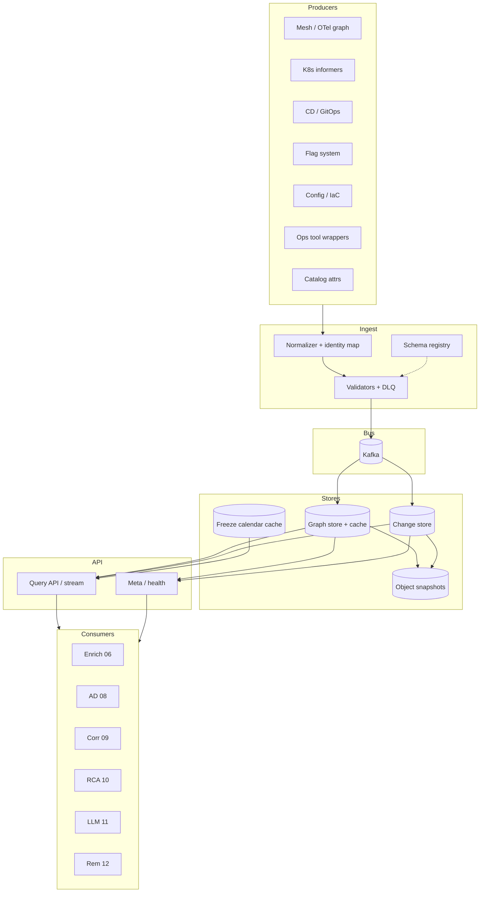

### 20.1 Team ownership (RACI sketch)

| Concern | Platform AIOps | Domain SRE | App teams | Sec/Compliance |
|---------|----------------|------------|-----------|----------------|
| Graph service | A/R | C | I | C |
| Identity map | A | R (aliases) | C | I |
| Critical path pins | C | A/R | C | I |
| CD change emit | C | C | R | I |
| Ops tool emit | A | R | I | C |
| Freeze policy | A | C | I | C |
| PCI edges/actions | C | C | I | A |

### 20.2 Deployment topology for the plane itself

- Stateless API × N zones  
- Builders isolated from query path  
- Multi-AZ Kafka  
- Snapshots to multi-region object storage  
- Local LRU ego cache on correlation/remediation workers  

Dogfood: the plane monitors its own freshness with a **separate** minimal path (not only the full AIOps stack).

---

## 21. Monitoring the Topology & Change Plane

### 21.1 Golden signals

| Signal | Why |
|--------|-----|
| Ingest rate by source | Silent producer death |
| Lag (event_time vs ingest_time) | Change correlation false negatives |
| Graph build duration | Builder saturation |
| Query latency/error ratio | Incident-time dependency |
| Cache hit ratio | Protect graph DB |
| DLQ depth | Schema / identity failures |
| Coverage ratios | Honesty of “we have topology” |
| Conflict edge count | Source quality |

### 21.2 Alert examples

<details>
<summary><strong>See the code below — click to expand (read concepts first)</strong></summary>

```yaml
- alert: TopologyGraphStale
  expr: topology_graph_age_seconds{env="prod"} > 1800
  for: 10m
  labels: {severity: page}
  annotations:
    summary: "Prod topology graph stale"
    runbook: "https://runbooks/topology-stale"

- alert: ChangeIngestLagHigh
  expr: histogram_quantile(0.99, change_ingest_lag_seconds_bucket{env="prod"}) > 600
  for: 15m
  labels: {severity: page}

- alert: DeployCoverageDrop
  expr: change_coverage_ratio{class="deployment",tier="0"} < 0.9
  for: 30m
  labels: {severity: ticket}
```

</details>

### 21.3 Dashboards (minimum panels)

1. Graph age + source health matrix  
2. Node/edge counts over time  
3. Coverage by tier  
4. Change rate by class  
5. Freeze state timeline  
6. Consumer-facing API SLOs  
7. DLQ + top identity failures  
8. Catalog-only edge ratio  

### 21.4 Game days

| Scenario | Expect |
|----------|--------|
| Kill mesh scraper | Degrade banner; no wrong certainty |
| Kill change webhook path | RCA change score unavailable; page coverage |
| Serve last-known-good snapshot | Ego queries work |
| Poison edge flood | Confidence floors hold; no full merge collapse |
| Freeze evaluator down | Fail closed for auto-remediation mutative actions |

---

## 22. Cost Model

### 22.1 Cost drivers

| Driver | Notes |
|--------|-------|
| Graph DB / memory cache | Dominated by edge cardinality × refresh |
| Kafka retention for changes | Multi-producer volume |
| Trace-based discovery | Span volume — sample wisely |
| Snapshot storage | Cheap; keep |
| Query QPS at incident | Burst; cache ego graphs |
| Human curation | Critical path reviews — real cost |

### 22.2 Cost control tactics

- Discover top-N services by traffic first; long tail nightly  
- Drop edges below min RPS  
- Sample trace validation, not 100%  
- Compact snapshots; expire deltas  
- Chargeback discovery agents to domains that demand exotic node types  

### 22.3 ROI framing

| Investment | Saves |
|------------|-------|
| Change ingest for deploys/flags | MTTD/MTTR on change-induced; fewer false AD pages |
| Topology for correlation | Alert noise reduction (often largest AIOps ROI) |
| Blast radius API | Prevents auto-remediation disasters |
| Freeze machine-readable | Prevents change during business-critical windows |

Compare cost of plane to **one** bad automated remediation or **one** BFCM change mistake.

---

## 23. Security, Tenancy & Compliance

### 23.1 Data sensitivity

| Data | Risk | Control |
|------|------|---------|
| Graph structure | Recon aid | AuthZ; avoid public |
| Owners/pager | PII-ish | Need-to-know |
| Change diffs | May leak secrets | Redact; hash configs |
| Ops tool params | High | Strict redaction schemas |
| Freeze authority | Integrity | Signed events / GitOps |

### 23.2 Multi-tenant SaaS AIOps

If you operate multi-tenant:

- Graph partition by tenant  
- No cross-tenant ego queries  
- Change streams isolated  
- Careful shared infra nodes (provider side)  

### 23.3 Audit

Retain:

- Who approved manual edges  
- Freeze start/end authorities  
- Who queried blast radius for actions (optional)  
- Schema versions of change producers  

Regulated environments: map change ledger to change-management ticket IDs ([15](../15-ecommerce-banking/README.md)).

---

## 24. Common Mistakes

| # | Mistake | Consequence | Fix |
|---|---------|-------------|-----|
| 1 | Graph without identity map | Duplicate nodes | Normalize first |
| 2 | Catalog-only edges | False merges | Runtime fusion + cap conf |
| 3 | No freshness SLO | Silent rot | Page on age |
| 4 | Deploy-only changes | Miss flags/config/DNS | Broad taxonomy |
| 5 | Secrets in change payload | Breach | Hashes only |
| 6 | Sync enrich on CMDB | Ingest outage | Cache fail-open |
| 7 | Full graph in LLM prompt | Cost + hallucination | Ego pack |
| 8 | Auto-remediate on degraded graph | Amplification | Gate on meta |
| 9 | No PIT snapshots | Unreplayable RCA | Version graph |
| 10 | Gateway always root | Wrong RCA | Special-case + traces |
| 11 | Ignore async topology | Miss cascades | Queue inventory |
| 12 | Freeze as Slack-only | CD still ships | Machine policy |
| 13 | One global name for service | M&A collisions | Scoped entity_id |
| 14 | Build T3 before consumers | Museum | Wire corr/RCA early |
| 15 | Blind deploy suppress in AD | Hide bad deploys | Conditional suppress |
| 16 | No ops-tool events | Famous-class blind spot | Wrap tools |
| 17 | Over-modeled node types | Never fresh | Cap v1 types |
| 18 | Blast radius now vs then | Wrong safety | as_of incident |
| 19 | No DLQ for bad changes | Silent loss | DLQ + owner |
| 20 | Trust vendor graph blindly | Opaque errors | Independent confidence |

---

## 25. War Stories

### 25.1 The canary that correlation merged away

A canary at 5% on `payment` broke only canary pods. Topology still showed a single `payment` node. Correlation merged canary and stable alerts into one incident and RCA blamed the database.  
**Lesson:** model **deploy units / revisions** under services during progressive delivery; attach change `canary_percent`.

### 25.2 The flag flip with no event

On-call rolled back two deploys. Actual cause: flag `retry_v2` at 50%. No event in ledger.  
**Lesson:** flags are deploys; coverage scorecard must include flag mutations.

### 25.3 The CMDB edge to a decommissioned SOA

Catalog still had `order → billing-legacy`. Billing-legacy retired. Two unrelated SEVs merged for 35 minutes.  
**Lesson:** catalog-only confidence cap; decay; owner page on ghost edges.

### 25.4 Freeze in Slack, deploy in Argo

BFCM freeze announced in Slack. Argo project not gated. Low-risk service deploy triggered payment library transitive fault.  
**Lesson:** freeze as `change.freeze` consumed by CD.

### 25.5 Graph API in the dying region

Region partial failure. Topology API in-region timed out. Remediation workers failed open **without** blast radius and restarted a hub service broadly.  
**Lesson:** local last-known-good cache; fail closed on mutative auto when meta unavailable.

### 25.6 Trace sampling deleted the only edge

Tail sampling dropped rare inventory path. Graph missed edge; multi-service brownout under-merged.  
**Lesson:** mesh metrics for existence; traces for direction validation — not sole source.

### 25.7 DNS automation without change events

DNS TTL automation pushed bad record. Metrics showed errors; RCA had no change candidate.  
**Lesson:** network automation is a change producer ([16](../16-famous-incidents/README.md)).

### 25.8 “We have ServiceNow, we’re L4”

CMDB tickets existed; runtime graph did not. Correlation still window-only.  
**Lesson:** maturity is **consumer integration + freshness**, not tool logos.

---

## 26. Production Checklist

### 26.1 Identity & model

- [ ] Canonical `entity_id` scheme documented  
- [ ] Alias map with owners and tests  
- [ ] Node type v1 capped and reviewed  
- [ ] Edge types include async + datastore  
- [ ] Critical paths for tier-0 products pinned  
- [ ] Gateway / BFF causal special-cases defined  

### 26.2 Topology pipeline

- [ ] ≥ 1 runtime edge source (mesh or SpanMetrics)  
- [ ] Trace direction validation job  
- [ ] Catalog attributes sync (not sole edges)  
- [ ] Snapshot + delta published  
- [ ] `graph_version` + meta on every serve  
- [ ] Confidence fusion documented  
- [ ] Decay / TTL for edges  
- [ ] Conflict detection + metrics  
- [ ] Multi-cluster identity strategy  

### 26.3 Change pipeline

- [ ] Canonical schema in registry  
- [ ] CD/GitOps producers for tier-0/1  
- [ ] Feature flag mutations ingested  
- [ ] Config changes ingested (redacted)  
- [ ] Schema migration events  
- [ ] High-risk ops tools wrapped  
- [ ] Network/DNS automation events (if applicable)  
- [ ] Idempotent `event_id`  
- [ ] DLQ with owner + burn-down SLO  
- [ ] Coverage scorecards by class  

### 26.4 Freeze & policy

- [ ] Freeze calendar as data  
- [ ] CD consumes freeze  
- [ ] Remediation consumes freeze  
- [ ] Ad-hoc incident freeze API  
- [ ] Audit trail for freeze authority  

### 26.5 Storage & API

- [ ] Hot graph query path  
- [ ] Change time index by entity  
- [ ] Object store snapshots multi-region  
- [ ] PIT as_of support (L3+)  
- [ ] AuthZ on write paths  
- [ ] API SLOs defined and alerted  

### 26.6 Consumer wiring

- [ ] Enrichment join keys live  
- [ ] AD deploy features / conditional suppress  
- [ ] Correlation topology + stale guard  
- [ ] RCA change correlation enabled  
- [ ] LLM ego + changes pack  
- [ ] Remediation blast radius gate  
- [ ] Integration tests in CI  

### 26.7 Ops

- [ ] Graph age paged  
- [ ] Source health matrix  
- [ ] Game day: stale graph  
- [ ] Game day: change lag  
- [ ] Game day: freeze evaluator down  
- [ ] Runbooks for rebuild from snapshots  
- [ ] Ownership RACI published  
- [ ] Cost review quarterly  

---

## 27. 90-Day Implementation Plan

> [!TIP]
> Optimize for **consumer value in 30-day increments**. Resist boiling the CMDB ocean.

### Days 0–30 — Foundations (L1→early L2)

| Week | Deliverable |
|------|-------------|
| 1 | Identity map v1 from OTel/K8s; alias CI tests |
| 1 | Change schema v1 + registry; Kafka topic |
| 2 | CD webhook → `change.events.v1` for tier-0 services |
| 2 | Flag system → change events for prod |
| 3 | Mesh or SpanMetrics export → S3 snapshot every 15m |
| 3 | Graph meta metrics: age, coverage |
| 4 | Enrichment: `deploy_age_minutes`, owner, tier |
| 4 | Dashboard + page on graph age > 30m |

**Exit:** Deploy-aware context on tier-0; honest snapshot graph exists.

### Days 31–60 — Wire intelligence (L2→L3 start)

| Week | Deliverable |
|------|-------------|
| 5 | Graph API: meta + ego (even if backed by snapshot loader) |
| 5 | Correlation: optional topology merge + **stale guard** |
| 6 | RCA: change correlation algorithm on real stream |
| 6 | AD: conditional deploy warm-start for 2–3 detectors |
| 7 | Freeze calendar YAML → `change.freeze.v1`; CD gate for hard freeze |
| 7 | Critical path YAML for money path |
| 8 | DLQ burn-down; coverage scorecards; fix top identity failures |
| 8 | Game day: disable mesh source; verify degrade banners |

**Exit:** Correlation/RCA use plane; freeze is real; degrade path proven.

### Days 61–90 — Safety & hardening (L3)

| Week | Deliverable |
|------|-------------|
| 9 | Blast radius API; remediation dry-run integration |
| 9 | Ops-tool wrappers for top 5 dangerous CLIs |
| 10 | Async queue topology inventory |
| 10 | Shared-fate edges for AZ/node pool |
| 11 | PIT snapshot index; incident replay tool |
| 11 | Multi-cluster entity ids if needed |
| 12 | LLM context pack integration |
| 12 | Score maturity; write backlog to L4; exec readout |

**Exit:** Remediation cannot ignore freeze/blast radius; ops tools leave footprints; replay works for last 30d incidents.

### 90-day anti-goals (explicitly out of scope)

- Full enterprise CMDB replacement  
- Perfect physical network fabric model  
- 100% service coverage including abandoned namespaces  
- Auto-remediation expansion (separate program)  
- Vendor rip-and-replace  

---

## 28. Socratic Scenarios

### 28.1 Scenario A — tags-only startup

You have 8 services, one cluster, deploys twice a week. Leadership wants “AIOps topology platform” after a vendor demo.  
**Questions:** Which consumers exist today? What decision in §3 applies? What is the cheapest artifact that improves MTTR in 30 days?

### 28.2 Scenario B — wrong root every time

api-gateway is RCA winner for 70% of incidents. Mesh shows it fans out everywhere.  
**Questions:** What edge special-case do you need? How do traces change causal ordering? Should gateway be a node type with different weight?

### 28.3 Scenario C — freeze theater

Finance mandates year-end freeze. Two deploys still shipped via emergency pipeline without tickets.  
**Questions:** Where must freeze be enforced to be real? What change events prove violation? How should correlation treat policy_violation changes?

### 28.4 Scenario D — partial brownout + deploy

Deploy at T−10m and traffic spike at T−8m. Errors rise at T−5m.  
**Questions:** How does confounder policy work ([10](../10-root-cause-analysis/README.md))? What graph query separates shared dependency vs deploy regression? When is rollback wrong?

### 28.5 Scenario E — multi-region split graph

eu-west and us-east each have regional graphs. Global config push breaks both.  
**Questions:** What node models global config? How do you merge incidents across regions? Where are snapshots stored so EU still serves during US failure?

### 28.6 Scenario F — remediation wants speed

Platform proposes auto-restart on any mid-tier service with RCA conf > 0.8.  
**Questions:** What meta conditions disable auto? How is blast radius computed? What if change stream lag is 20m?

### 28.7 Scenario G — catalog politics

Enterprise architecture demands all edges come from ServiceNow. Runtime team refuses.  
**Questions:** How do you fuse without political deadlock? Which source wins for correlation vs compliance reporting?

### 28.8 Scenario H — sampling amnesia

Trace sample rate dropped to 1% to save cost. Topology edges thinned; cascades under-merged.  
**Questions:** Which discovery source should carry existence? What coverage SLO did you violate? How do you communicate trade-off to FinOps?

---

## 29. Production Review

Use this review when promoting the plane toward L3.

### 29.1 Design review prompts

1. What is the **identity** scheme and who owns aliases?  
2. Which **edge sources** are authoritative for `rpc` vs `async`?  
3. What is the **stale graph** degrade behavior in correlation and RCA?  
4. Which **change classes** are in scope for 90 days — and which are explicitly out?  
5. How are **secrets** prevented from entering the ledger?  
6. How does **freeze** block CD and remediation today (not “planned”)?  
7. Where do **snapshots** live if the primary region is impaired?  
8. What is the **blast radius** gate for the first auto action?  
9. What **metrics** page a human at 3am?  
10. What is the **RACI** for critical path accuracy?

### 29.2 Red-team questions

- Can an attacker with CI access inject fake change events to force rollback theater?  
- Can a malicious manual edge enlarge blast radius deny lists (DoS automation)?  
- Does the LLM pack leak internal network structure to unauthorized roles?  
- Does fail-open enrichment create cross-tenant attribute mixups?

### 29.3 Sign-off matrix

| Role | Signs |
|------|-------|
| AIOps platform lead | Architecture + SLOs |
| SRE steering | Freeze + critical paths |
| Security | Redaction + AuthZ |
| Data/privacy | Retention + PII |
| Consumer owners (corr/RCA/rem) | Integration acceptance |

---

## 30. Summary

> [!NOTE]
> **KEY IDEA**
> Topology is **structure with confidence and time**. Change is **intent with schema and coverage**. Together they are the capstone data product that makes AIOps intelligence layers honest.

Takeaways:

1. **Decide deliberately** between tags-only, snapshot graph, and full topology service — driven by consumers, not vendor slides.  
2. **Fuse sources**; never trust catalog edges alone.  
3. **Version the graph**; measure age; degrade loudly.  
4. **Broaden change taxonomy** beyond git deploys — flags, config, infra, ops tools, network.  
5. **Freeze is data**, not a Slack culture.  
6. **Wire consumers** (enrich, AD, correlation, RCA, LLM, remediation) or you built a museum.  
7. **Blast radius + freeze + can_rollback** are the safety spine of automation.  
8. **90 days** is enough to reach useful L2/L3 if you refuse scope cosplay.

### Where to go next

| Goal | Chapter |
|------|---------|
| Join keys, enrichment, storage tiers | [06 — Data Plane](../06-data-plane/README.md) |
| Transport & replay | [07 — Kafka](../07-kafka/README.md) |
| Change-aware detection | [08 — Anomaly Detection](../08-anomaly-detection/README.md) |
| Topology merge & stale guards | [09 — Alert Correlation](../09-alert-correlation/README.md) |
| Change correlation & confounders | [10 — RCA](../10-root-cause-analysis/README.md) |
| Context packs | [11 — LLM Agent](../11-llm-agent/README.md) |
| Gates & verify | [12 — Remediation](../12-remediation/README.md) |
| Game days & HA | [13 — Production](../13-production/README.md) |
| Domain constraints | [15 — E-commerce & Banking](../15-ecommerce-banking/README.md) |
| Missing edges in real outages | [16 — Famous Incidents](../16-famous-incidents/README.md) |

---

## 31. References

### Internal handbook

- [00 — Introduction](../00-introduction.md)  
- [06 — Telemetry Data Plane](../06-data-plane/README.md)  
- [07 — Kafka](../07-kafka/README.md)  
- [08 — Anomaly Detection](../08-anomaly-detection/README.md)  
- [09 — Alert Correlation](../09-alert-correlation/README.md)  
- [10 — Root Cause Analysis](../10-root-cause-analysis/README.md)  
- [11 — LLM Investigation Agent](../11-llm-agent/README.md)  
- [12 — Remediation](../12-remediation/README.md)  
- [13 — Production Operations](../13-production/README.md)  
- [14 — Big Tech AIOps](../14-bigtech-aiops/README.md)  
- [15 — E-commerce & Banking](../15-ecommerce-banking/README.md)  
- [16 — Famous Incidents](../16-famous-incidents/README.md)  
- [Architecture posters](../../assets/diagrams/README.md)  

### Concepts to keep on the shelf

- Service identity and resource attributes (OpenTelemetry semantic conventions)  
- Progressive delivery event models (canary / flag lifecycles)  
- Change management evidence for regulated industries  
- Richard Cook, *How Complex Systems Fail* — latent conditions & coupling (see [16](../16-famous-incidents/README.md))  
- DORA change failure rate as an outcome metric influenced by this plane  

### Engineering principles restated

| Principle | Application here |
|-----------|------------------|
| Fail open on ingest | Telemetry never blocks on graph |
| Fail closed on mutative auto | No blast radius / no freeze eval → no auto |
| Measure what you claim | Coverage and age are product KPIs |
| Prefer runtime truth | Catalog is attributes + weak prior |
| Version everything | PIT replay for incidents and training |
| Redact by construction | Change ledger is not a secret store |

---

*End of Chapter 17 — Topology & Change Data Plane.*
