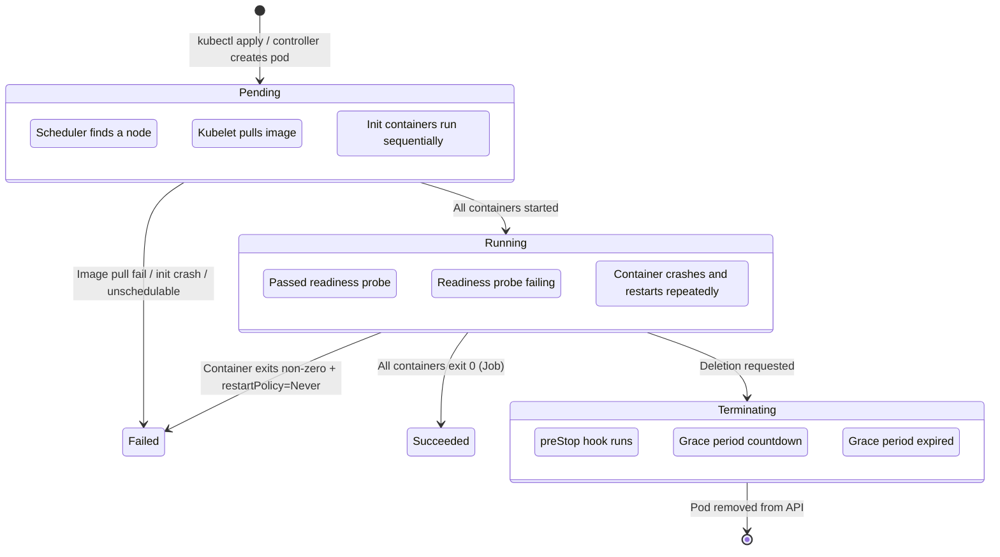
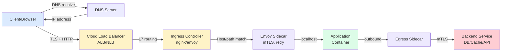

# Chapter S — Modern System Architecture Fundamentals for AIOps Engineers (2026 Edition)

> **AI processes Data — Metrics, Logs, Traces. But that Data reflects the physical behavior of CPU, Memory, Network, Disk, and GPU. If an AIOps engineer doesn't understand the PHYSICAL MECHANICS behind every number, every Anomaly Detection model becomes a useless black box, every Root Cause Analysis points to symptoms instead of causes, and every Auto-healing action treats the wrong disease. This chapter builds the system foundation required before reading any intelligence chapter.**

---

## Prerequisites

- Basic experience with Linux and command line
- Introductory knowledge of containers and Kubernetes
- Recommended: [00 — Introduction to AIOps](../00-introduction.md)

## Related Documents

- [01 — Observability](../01-observability/README.md) — designing evidence packs from system signals
- [02 — OpenTelemetry](../02-opentelemetry/README.md) — collecting telemetry from system layers
- [03 — Prometheus](../03-prometheus/README.md) — storing and querying system metrics
- [06 — Data Plane](../06-data-plane/README.md) — normalizing and enriching telemetry data
- [09 — Anomaly Detection](../09-anomaly-detection/README.md) — detecting anomalies in system signals

## Next Reading

After this chapter, continue to [01 — Observability](../01-observability/README.md) to learn how to design evidence packs for the system signals covered here.

---

## Table of Contents

**Section 1: Compute & Runtime Mechanics**

1. [Linux Process Model](#1-linux-process-model)
2. [Memory Management](#2-memory-management)
3. [Linux Control Groups v2](#3-linux-control-groups-v2)
4. [Container Runtime Internals](#4-container-runtime-internals)
5. [Kubernetes Pod Lifecycle Deep Dive](#5-kubernetes-pod-lifecycle-deep-dive)
6. [Resource Requests/Limits & QoS Classes](#6-resource-requestslimits--qos-classes)
7. [CPU Throttling Mechanics](#7-cpu-throttling-mechanics)
8. [OOMKilled & Memory Pressure](#8-oomkilled--memory-pressure)
9. [Node Pressure & Eviction](#9-node-pressure--eviction)
10. [eBPF-based Telemetry](#10-ebpf-based-telemetry)

**Section 2: Networking & Traffic Engineering**

11. [End-to-End Request Lifecycle](#11-end-to-end-request-lifecycle)
12. [TCP/IP Internals for Operations](#12-tcpip-internals-for-operations)
13. [DNS Resolution Mechanics](#13-dns-resolution-mechanics)
14. [Ingress Controllers & Load Balancing](#14-ingress-controllers--load-balancing)
15. [Service Mesh Deep Dive](#15-service-mesh-deep-dive)
16. [API Gateway Patterns](#16-api-gateway-patterns)
17. [Connection Pool Management](#17-connection-pool-management)
18. [Thread Pool Exhaustion & Backpressure](#18-thread-pool-exhaustion--backpressure)
19. [Circuit Breaking & Cascading Prevention](#19-circuit-breaking--cascading-prevention)

**Section 3: Data & Storage Layer**

20. [Caching Architecture](#20-caching-architecture)
21. [Cache Failure Patterns](#21-cache-failure-patterns)
22. [Database Connection Management](#22-database-connection-management)
23. [Query Performance & Lock Contention](#23-query-performance--lock-contention)
24. [Replication Lag & Consistency](#24-replication-lag--consistency)
25. [Storage I/O Fundamentals](#25-storage-io-fundamentals)

**Section 4: Distributed Systems & Failure Patterns**

26. [Distributed Tracing Internals](#26-distributed-tracing-internals)
27. [Cascading Failures & Error Storms](#27-cascading-failures--error-storms)
28. [Gray Failures & Partial Outages](#28-gray-failures--partial-outages)

**Section 5: AI/ML Infrastructure Internals**

29. [GPU Compute & Saturation](#29-gpu-compute--saturation)
30. [LLM Inference Mechanics](#30-llm-inference-mechanics)
31. [Vector Database & Embedding Pipeline](#31-vector-database--embedding-pipeline)

**Section 6: Synthesis — System Thinking for AIOps**

32. [USE & RED Methods](#32-use--red-methods)
33. [Cross-Layer Correlation](#33-cross-layer-correlation)
34. [Anti-Patterns & Chapter Summary](#34-anti-patterns--chapter-summary)

---

# SECTION 1 — COMPUTE & RUNTIME MECHANICS

> *Every workload — from a microservice handling HTTP requests to an LLM inference pipeline — runs on the same foundation: the Linux kernel managing CPU time, memory pages, and I/O. AIOps engineers must understand how the kernel distributes resources, because this is the final layer that determines the "numbers" AI models see.*

---

## 1. Linux Process Model

### 1.1 Why AIOps engineers need to understand process scheduling

When an anomaly detector reports "CPU utilization spike on pod X", the first question must be: **is that spike user time, system time, iowait, or steal?** Each type points to a fundamentally different root cause. Without this knowledge, an RCA engine will misattribute the cause.

### 1.2 Process states and CPU time breakdown

A Linux process exists in one of several states:

```
┌──────────────────────────────────────────────────────────────────┐
│                    Linux Process States                          │
│                                                                  │
│  TASK_RUNNING (R) ──── running or ready to run on CPU           │
│         │                                                        │
│         ├──→ TASK_INTERRUPTIBLE (S) ── waiting for I/O, signal  │
│         │         │                                              │
│         │         └──→ wake up ──→ back to R (runqueue)          │
│         │                                                        │
│         ├──→ TASK_UNINTERRUPTIBLE (D) ── waiting for disk I/O   │
│         │         │                  (cannot be killed by signal)│
│         │         └──→ I/O complete ──→ back to R                │
│         │                                                        │
│         ├──→ TASK_STOPPED (T) ── hit SIGSTOP or debugger        │
│         │                                                        │
│         └──→ TASK_ZOMBIE (Z) ── exited, parent hasn't wait()   │
└──────────────────────────────────────────────────────────────────┘
```

**CPU time breaks down into:**

| CPU Time Type | Symbol | Meaning | AIOps Signal |
|---|---|---|---|
| **User** | `us` | Time running application code | High → app busy (normal or bug loop) |
| **System** | `sy` | Time in kernel (syscalls) | High → excessive syscalls, context switches |
| **I/O Wait** | `wa` | CPU idle waiting for disk I/O | High → disk bottleneck, NOT CPU bottleneck |
| **Steal** | `st` | CPU stolen by hypervisor (VM/cloud) | High → noisy neighbor, host overcommit |
| **IRQ/SoftIRQ** | `hi`/`si` | Handling hardware/software interrupts | High → network packet storm, driver issue |
| **Idle** | `id` | CPU doing nothing | Combined with high latency → thread blocking |
| **Nice** | `ni` | User-space at lowered priority | Batch jobs, background tasks |

> [!WARNING]
> **Classic AIOps mistake:** A detector sees high `iowait` and concludes "CPU overloaded" → triggers scale-out. But `iowait` means the CPU is **idle** waiting for disk. Adding more CPU won't help — you need to fix disk I/O or add caching. This is a textbook example of how missing system knowledge leads to wrong auto-scaling decisions.

### 1.3 Context switching

A context switch occurs when the kernel moves the CPU from process A to process B. The kernel must:

1. Save the entire register state of A (program counter, stack pointer, general-purpose registers)
2. Flush/invalidate TLB entries (Translation Lookaside Buffer)
3. Load the register state of B
4. Restore B's address space mapping

**Real-world costs:**
- Voluntary context switch: process yields CPU (waiting on I/O, mutex) — ~1–5 μs
- Involuntary context switch: kernel preempts (time slice expired) — ~5–15 μs
- Hidden cost: cache pollution — after a switch, L1/L2/L3 caches are full of stale data and must warm again — **this is the largest cost**, potentially tens of μs

**Key metrics:**

```bash
# Count system-wide context switches
vmstat 1 | awk '{print $12, $13}'   # cs = context switches

# Count per-process
pidstat -w 1
# cswch/s  = voluntary context switches per second
# nvcswch/s = involuntary context switches per second

# Inside a container (cgroups v2)
cat /sys/fs/cgroup/<cgroup>/cpu.stat
# nr_throttled, throttled_usec — signs of CFS throttling
```

> [!TIP]
> **Rule of thumb for AIOps:** Involuntary context switch rate > 10,000/s/core usually indicates too many runnable threads relative to available CPU. This is a leading indicator for latency spikes before CPU utilization reaches 100%.

### 1.4 CFS Scheduler — Completely Fair Scheduler

Linux uses CFS as the default scheduler. Core principles:

- Each task has a **virtual runtime** (`vruntime`) — the CPU time it has "consumed" (weighted by priority/nice value)
- CFS always picks the task with the lowest `vruntime` to run next
- A red-black tree orders tasks by `vruntime` → O(log n) to select the next task
- **Time slices** are not fixed — they depend on the number of runnable tasks and the target latency (`sched_latency_ns`, default 6ms for ≤8 tasks)

**AIOps implication:** When a pod runs inside a container, CFS + cgroups CPU quota determines how much CPU time the pod actually receives. `cpu.cfs_quota_us` / `cpu.cfs_period_us` creates the phenomenon of **CPU throttling** — one of the most common causes of hidden latency spikes in Kubernetes that does not appear on CPU utilization metrics.

---

## 2. Memory Management

### 2.1 Virtual memory and paging

Every process has its own address space (virtual memory). The kernel maps virtual pages → physical frames via the **page table**. When a process accesses a page not in RAM:

- **Minor page fault:** page exists in memory (e.g., shared library already loaded) — just update the page table. Cost ~1 μs.
- **Major page fault:** page must be read from disk (swap) — cost **1,000x–10,000x** higher. This is "death by swap" for latency-sensitive workloads.

### 2.2 Memory pressure signals

| Signal | Source | Meaning | Severity |
|---|---|---|---|
| `pgfault` (minor) | `/proc/vmstat` | Page table miss, no disk I/O | Normal at moderate levels |
| `pgmajfault` (major) | `/proc/vmstat` | Must read from disk/swap | 🔴 Very bad for latency |
| `pswpin`/`pswpout` | `/proc/vmstat` | Pages swapping in/out | 🔴 Active swapping |
| `oom_kill_count` | cgroup stat | OOM kill count | 🔴 Memory exhaustion |
| `memory.high events` | cgroup v2 | Exceeded soft limit, kernel throttles allocations | 🟡 Early warning |
| `PSI memory` | `/proc/pressure/memory` | Pressure Stall Information | 🟡 Quantified memory contention |

### 2.3 NUMA — Non-Uniform Memory Access

On multi-socket servers, each CPU socket has its own "local memory." Accessing local memory is fast (~100ns), accessing remote memory is slower (~150–300ns).

> [!NOTE]
> **AIOps impact:** When Kubernetes schedules a pod on a multi-socket node without NUMA-aware topology, the container may be allocated CPU cores on Socket 0 but memory on Socket 1. Result: latency increases 30–50% with no metric clearly explaining why — only "unexpectedly high P99." eBPF probes on `numastat` can detect `numa_miss` and `numa_foreign` events.

---

## 3. Linux Control Groups v2

### 3.1 Role in the container ecosystem

Cgroups v2 is the **core kernel mechanism** that limits, tracks, and isolates resources for groups of processes. Every container (Docker, containerd, CRI-O) is simply processes managed by cgroups.

### 3.2 Key resource controllers

| Controller | File | Function | AIOps Metric |
|---|---|---|---|
| **CPU** | `cpu.max` | Bandwidth limit (quota/period) | `nr_throttled`, `throttled_usec` |
| **CPU** | `cpu.weight` | CPU sharing under contention | Proportional share |
| **Memory** | `memory.max` | Hard limit → OOM kill when exceeded | `oom_kill` count |
| **Memory** | `memory.high` | Soft limit → throttles allocation | `high` events in `memory.events` |
| **Memory** | `memory.current` | Current usage | RSS + cache |
| **I/O** | `io.max` | IOPS/BPS limit per device | `io.stat` (rbytes, wbytes, rios, wios) |
| **PID** | `pids.max` | Process count limit | Fork bomb protection |
| **PSI** | `cpu.pressure`, `memory.pressure`, `io.pressure` | Pressure stall information | `some`, `full` — % time stalled |

### 3.3 PSI — Pressure Stall Information

PSI is a critical innovation in cgroups v2. Instead of only knowing "CPU utilization is 80%", PSI answers: **"what percentage of time do tasks stall waiting for CPU/memory/IO?"**

```
# /sys/fs/cgroup/kubepods.slice/.../cpu.pressure
some avg10=4.52 avg60=2.31 avg300=1.08 total=283947102
full avg10=1.03 avg60=0.55 avg300=0.24 total=89483921
```

- `some`: at least 1 task is stalled (part of the workload affected)
- `full`: ALL tasks are stalled (entire workload stopped making progress)
- `avg10/60/300`: averages over 10s/60s/300s windows (%)
- `total`: cumulative stall time in microseconds

> [!TIP]
> **PSI is the gold signal for AIOps.** Compared to CPU utilization (which can be misleading), PSI `some` > 10% in a 10-second window is a far more reliable signal for anomaly detection. Meta (Facebook) uses PSI instead of load average as an autoscaling trigger — it's much more accurate because it measures **actual impact** rather than absolute utilization.

---

## 4. Container Runtime Internals

### 4.1 Containers are not VMs

A container is a **group of processes** isolated by two kernel mechanisms:

1. **Namespaces** — isolate visibility: each container sees its own PID tree, network stack, filesystem
2. **Cgroups** — isolate resources: limit the CPU, memory, and I/O that the process group can use

> [!WARNING]
> **Container observability trap:** Many tools running inside containers read `/proc/meminfo` or `/proc/cpuinfo` but see the **host's** information, not the container's. Example: a JVM reads `/proc/meminfo`, sees 128GB host RAM → sets heap to 96GB → exceeds container memory limit of 4Gi → OOMKilled. Java 10+ and Go 1.19+ are cgroup-aware, but legacy applications still hit this frequently.

### 4.2 OverlayFS — Container filesystem

Container images use a **layered filesystem** (OverlayFS):

```
Container writable layer (upperdir)  ← container writes go here
        │
        ▼ (union mount)
Image Layer 3: app binary             ← read-only
Image Layer 2: dependencies            ← read-only
Image Layer 1: base OS (debian:slim)   ← read-only
```

**AIOps impact:** Write-heavy containers create large `upperdir` → disk I/O increases → may trigger node eviction (`imagefs.available` pressure). The metrics `container_fs_writes_bytes_total` (cAdvisor) and `io.stat` (cgroup) detect this.

---

## 5. Kubernetes Pod Lifecycle Deep Dive

### 5.1 From `kubectl apply` to container running

Understanding the lifecycle helps AIOps engines distinguish: is the pod pending because of scheduling or image pull? Is the crash loop from an app bug or a resource limit?



### 5.2 Probe types and impact on traffic

```
┌──────────────────────────────────────────────────────────────┐
│                    Kubernetes Probes                          │
│                                                              │
│  startupProbe ──── "Has the container started?"              │
│       │             Runs first, disables liveness/readiness  │
│       │             Use for: slow-starting apps (JVM, ML)    │
│       ▼                                                      │
│  livenessProbe ─── "Is the container alive?"                 │
│       │             Fail → kubelet RESTARTS container         │
│       │             ⚠️ Does NOT remove from Service endpoints│
│       ▼                                                      │
│  readinessProbe ── "Is the container ready for traffic?"     │
│                     Fail → removed from Service endpoints    │
│                     Recover → added back to endpoints        │
│                     ⚠️ Does NOT restart container            │
└──────────────────────────────────────────────────────────────┘
```

> [!CAUTION]
> **Most dangerous probe mistake:** Using a **liveness probe that checks a dependency** (e.g., DB connection). When the DB goes down → all pods fail liveness → kubelet restarts them all → restart storm → pods start simultaneously → connection storm → DB dies harder. This is a cascading failure caused by misconfigured probes. Liveness must only check **process health**, never dependencies. Dependency health belongs in readiness probes.

### 5.3 Graceful shutdown — why 502s happen during deploys

When a pod is deleted (rolling update), two paths happen **in parallel**:

```
            ┌─── Path A: kube-proxy/iptables removes pod IP from Service
            │    (async, may take 1-5 seconds)
            │
Pod delete ─┤
            │
            └─── Path B: kubelet sends preStop → SIGTERM → countdown
                 (starts immediately)

Problem: If preStop has no delay, the container receives SIGTERM
         and begins shutdown BEFORE iptables/Envoy finishes updating.
         → Requests still routed to the shutting-down pod → 502/503
```

**Fix:** Add a `preStop` hook with `sleep 5–10s` to wait for endpoint propagation.

**AIOps implication:** If the detector sees 502 spikes every deploy, this is not an app bug — it's an endpoint propagation race condition. Correlation with deployment events (Ch. 08) will help the RCA engine eliminate false hypotheses.

---

## 6. Resource Requests/Limits & QoS Classes

### 6.1 Requests vs Limits

| | Requests | Limits |
|---|---|---|
| **Meaning** | Amount of resources **guaranteed** | Maximum resources **allowed** |
| **Used by scheduler** | ✅ To decide which node | ❌ Does not affect scheduling |
| **Enforcement** | Kernel cgroups `cpu.weight` | Kernel cgroups `cpu.max` (CPU), `memory.max` (Memory) |
| **Exceeding CPU** | Bursts if node has slack | **Throttled** (CFS bandwidth) |
| **Exceeding Memory** | — | **OOMKilled** immediately |

### 6.2 QoS Classes

Kubernetes automatically assigns a QoS class based on requests/limits configuration:

| QoS Class | Condition | Eviction Priority | When to Use |
|---|---|---|---|
| **Guaranteed** | requests == limits for all containers, all resources | Last to be evicted | Latency-critical services (payment, auth) |
| **Burstable** | Has requests but < limits (or only 1 resource set) | Evicted after BestEffort | Most workloads |
| **BestEffort** | No requests set at all | **First to be evicted** | Batch jobs, dev/test |

> [!IMPORTANT]
> **Common production mistake:** Setting very low `requests` (so the scheduler places pods easily) + very high `limits` (so the app isn't killed). Result: node overcommit → multiple pods burst simultaneously → node memory pressure → eviction storm. This is the root cause of "random pod kills" that teams often blame on Kubernetes.

---

## 7. CPU Throttling Mechanics

### 7.1 CFS Bandwidth Control — hidden latency cause #1

When a container has a CPU limit, the kernel applies **CFS Bandwidth Control**:

```
cpu.max = "200000 100000"
           ↑ quota   ↑ period
           
Means: in each 100ms period, the container can use at most 200ms of CPU time.
→ Equivalent to 2 CPU cores.

If the container exhausts its quota before the period ends:
→ Container is THROTTLED — all threads STOP until the next period begins.
```

### 7.2 Detecting CPU throttling

```bash
# From cgroup v2
cat /sys/fs/cgroup/.../cpu.stat
# nr_periods    — total CFS periods
# nr_throttled  — periods where throttling occurred
# throttled_usec — total time throttled (microseconds)

# Calculate throttle ratio
throttle_ratio = nr_throttled / nr_periods
# > 5%  → concerning
# > 20% → severe, latency clearly affected
```

**Prometheus metrics (from cAdvisor):**

```promql
# Throttle ratio per container
rate(container_cpu_cfs_throttled_periods_total[5m])
/
rate(container_cpu_cfs_periods_total[5m])
```

### 7.3 Multi-threaded throttling amplification

Especially dangerous: JVM/Go runtimes have many threads (GC, compilation, app threads). All threads **share** the container's CPU quota:

```
Container limit: 2 CPU (200ms per 100ms period)
Application: 8 threads (4 app + 2 GC + 1 compiler + 1 runtime)

Burst scenario:
- Parallel GC runs → 4 GC threads active simultaneously → burn 80ms in 20ms wall-time
- App threads consume 120ms
- Total: 200ms quota exhausted after 50ms wall-time
- Container frozen for remaining 50ms
- Every request arriving in those 50ms → timeout/delay
```

> [!WARNING]
> **This is why many teams remove CPU limits for latency-critical services.** Google internally and several companies (Datadog, Uber) recommend setting only CPU requests (so the scheduler knows what's needed) without CPU limits (to allow free bursting). Trade-off: loss of isolation — one pod can "steal" CPU from another. Alternative: use PSI triggers instead of hard throttling.

---

## 8. OOMKilled & Memory Pressure

### 8.1 Two types of OOM Kill

1. **Cgroup OOM (container level):** Triggered when `memory.current` > `memory.max`. The cgroup OOM handler kills a process within that cgroup. Exit code: 137 (128 + SIGKILL=9). Kubernetes reason: `OOMKilled`. Most common in Kubernetes.

2. **System OOM (node level):** Triggered when the entire node runs out of physical memory. The kernel's global OOM killer selects the process with the highest `oom_score`. Rare if kubelet eviction works correctly, but can kill kubelet or system processes.

### 8.2 Memory metric anatomy

```
Container memory.current =
    RSS (anonymous pages — heap, stack)         ← "real" app usage
  + Page Cache (file-backed pages — disk reads) ← kernel auto-caches
  + Kernel memory (socket buffers, etc.)        ← overhead
  + Swap (if enabled)

Problem:
- memory.current includes page cache
- Page cache is reclaimable (freed automatically when needed)
- But cgroup OOM killer looks at memory.current, DOESN'T distinguish
- → I/O-heavy container may show 95% usage, mostly page cache, fine
- → But if memory.max is too tight → OOMKill on small RSS spike

Correct metric for real memory pressure:
  memory.current - inactive_file ≈ "working set"
  Or: container_memory_working_set_bytes (kubelet/cAdvisor)
```

### 8.3 Memory leak detection for AIOps

```
Memory leak signature — sawtooth pattern:
  Linear growth → OOMKill → restart → growth again

Detection:
- Slope detection: Linear regression on container_memory_working_set_bytes
  over 1h/6h/24h window. Slope > 0 consistently with R² > 0.9
  → high probability memory leak
- Restart correlation: restartCount increasing + reason OOMKilled → confirm
- Time-to-exhaustion: (memory.max - current) / slope = estimated time to next OOMKill
  → predictive alert
```

---

## 9. Node Pressure & Eviction

### 9.1 Kubelet eviction signals

Kubelet continuously monitors node resources. When thresholds are breached, it begins **evicting pods** (BestEffort first):

| Signal | Description | Soft Default | Hard Default |
|---|---|---|---|
| `memory.available` | Available RAM on node | `100Mi` | `100Mi` |
| `nodefs.available` | Disk space on root fs | `10%` | `5%` |
| `nodefs.inodesFree` | Free inodes on root fs | `5%` | `3%` |
| `imagefs.available` | Disk space on image fs | `15%` | `10%` |
| `pid.available` | Available PIDs on node | — | `100` |

> [!TIP]
> **AIOps detection pattern:** Monitor `kube_node_status_condition` metric. When a node transitions to `MemoryPressure=True`, this is a **leading indicator** for an eviction storm. The detector should correlate with: (1) whether pods on that node have memory usage near their limits, (2) any recent deployment/scaling events, (3) whether any pod on the node exhibits a memory leak pattern.

---

## 10. eBPF-based Telemetry

### 10.1 eBPF — the observability game-changer

eBPF (extended Berkeley Packet Filter) allows running **sandboxed programs inside the kernel** without kernel modules or application instrumentation:

### 10.2 eBPF use cases for AIOps

| Use Case | eBPF Hook | Data Collected | Tool |
|---|---|---|---|
| **Application-transparent tracing** | uprobe on HTTP libraries | Request latency/status per endpoint — no code changes | Pixie, Odigos, Beyla |
| **TCP retransmission tracking** | kprobe `tcp_retransmit_skb` | Retransmit count per connection | BCC `tcpretrans` |
| **DNS latency** | kprobe `udp_sendmsg`/`udp_recvmsg` | DNS query duration, failures | Cilium |
| **File I/O latency** | tracepoint `block:block_rq_issue/complete` | Per-disk I/O latency distribution | BCC `biolatency` |
| **Container network flows** | tc/XDP | L3/L4 flow data per pod | Cilium Hubble |
| **Security: syscall audit** | LSM hooks, seccomp | Suspicious syscall patterns | Falco, Tetragon |
| **CPU scheduling delays** | tracepoint `sched:sched_switch` | Run queue latency per process | BCC `runqlat` |

### 10.3 Cost and limitations

```
eBPF overhead spectrum:

Passive tracing (tracepoints):       ~1-3% CPU overhead
Active probing (kprobes on hot path): ~3-8% CPU overhead  
XDP packet processing:                ~0.1-1% (replaces iptables!)
User-space probes (uprobe):            ~5-15% per probed function

Comparison:
- Sidecar proxy (Envoy): +10-30% latency, +50-200MB memory per pod
- eBPF-based mesh (Cilium): +1-5% latency, shared daemon per node
```

> [!NOTE]
> **2026 trend:** eBPF is replacing the sidecar proxy model for service mesh (Cilium replacing Istio sidecars), replacing iptables for Kubernetes networking, and providing "zero-instrumentation" observability for legacy apps. AIOps pipelines should integrate eBPF data sources (Hubble flows, Pixie spans, Tetragon security events) alongside OpenTelemetry.

---

# SECTION 2 — NETWORKING & TRAFFIC ENGINEERING

> *Most production incidents are network-related. Latency spikes, timeouts, connection refused, 503 — all relate to how requests travel through the system. AIOps engineers must understand each step in the request lifecycle so detectors don't confuse symptoms with causes.*

---

## 11. End-to-End Request Lifecycle

### 11.1 Anatomy of an HTTP request in Kubernetes

From a user's browser to the application container, a request passes through **at least 6-8 layers**, each of which can introduce latency and failure:



### 11.2 Latency budget breakdown

| Hop | Typical Latency | Failure Mode | Metric |
|---|---|---|---|
| DNS Resolution | 1–50ms (cached: <1ms) | DNS timeout, NXDOMAIN, stale cache | `dns_lookup_duration_seconds` |
| TLS Handshake | 10–50ms (new), 0ms (resumed) | Certificate expiry, OCSP issue | `tls_handshake_duration_seconds` |
| Cloud LB → Ingress | 1–5ms | Unhealthy target, cross-AZ | ALB `TargetResponseTime` |
| Ingress → Pod | 1–3ms (same-AZ) | Rate limit hit, wrong backend | `nginx_upstream_response_time` |
| Sidecar (Envoy) | 1–3ms | Circuit open, retry exhausted | `envoy_cluster_upstream_rq_time` |
| Application processing | Variable | App bug, slow query, OOM | `http_server_request_duration` |
| Pod → Backend | 1–100ms | Connection refused, timeout | `db_query_duration_seconds` |

> [!TIP]
> **AIOps correlation pattern:** When latency spikes, decompose it by hop. If 90% of latency is in the "Application → DB" hop → root cause is in the data layer (slow query, connection pool). If latency increases uniformly across all hops → network-level issue (congestion, packet loss). Distributed tracing (Ch. 05) automates this decomposition via span durations.

---

## 12. TCP/IP Internals for Operations

### 12.1 TCP Handshake and connection states

Every TCP connection goes through a complex state machine. AIOps engineers need to understand this because **connection state accumulation** causes many incidents.

### 12.2 TIME_WAIT — the silent killer

**Problem:** Every closed connection stays in `TIME_WAIT` for 60 seconds on Linux. During that time, the tuple (src_ip, src_port, dst_ip, dst_port) cannot be reused.

```
High-traffic service closing 10,000 connections/second:
→ 10,000 × 60s = 600,000 sockets in TIME_WAIT
→ Ephemeral port range: 32768–60999 = 28,232 ports
→ If connecting to the same destination: PORT EXHAUSTION!

Symptoms:
- connect() returns EADDRNOTAVAIL
- "Cannot assign requested address" in logs
- All requests to destination X fail, but Y is fine
```

> [!WARNING]
> **AIOps trap:** A detector sees "connection refused" errors spiking → concludes "service down." But if failures only occur when connecting to **one specific destination** and `TIME_WAIT` count is high → root cause is port exhaustion, not a service outage. Fix: enable `tcp_tw_reuse`, use connection pooling, or increase the ephemeral port range.

### 12.3 TCP Retransmissions

Retransmissions occur when TCP segments are lost (network congestion, packet drops, interface errors):

```
Retransmission Timeout (RTO) escalation:
  Attempt 1: RTO = ~200ms (initial)
  Attempt 2: RTO = ~400ms (doubled)
  Attempt 3: RTO = ~800ms
  ...
  After net.ipv4.tcp_retries2 (default 15) attempts:
  → Connection reset → application sees "Connection timed out"

Impact on application latency:
  1 retransmit = +200ms minimum delay
  2 retransmits = +600ms
  → P99 latency spike with no obvious cause
```

```promql
# Retransmission rate (node_exporter)
rate(node_netstat_Tcp_RetransSegs[5m])
/
rate(node_netstat_Tcp_OutSegs[5m])

# > 0.1% → investigate
# > 1%   → significant packet loss
# > 5%   → critical network issue
```

### 12.4 TCP connection timeouts

| Timeout | Default | Meaning | When Hit |
|---|---|---|---|
| `connect_timeout` | `tcp_syn_retries=6` (~127s) | SYN not ACKed | Destination unreachable, firewall drop |
| `tcp_keepalive_time` | 7200s (2h!) | Time before keepalive probe | Idle connection killed by NAT/firewall |
| `tcp_fin_timeout` | 60s | TIME_WAIT duration | Port exhaustion on high-traffic services |
| `tcp_retries2` | 15 | Retransmits for established connections | Long timeout before app sees error |

> [!CAUTION]
> **Linux's default timeouts are far too long for cloud-native workloads.** TCP keepalive of 2 hours means that if a pod is rescheduled, the backend pod is running at a new IP but the client holds a connection to the old IP and won't know it's dead for up to 2 hours. Cloud load balancers (ALB idle timeout: 60s) and NAT gateways will drop the connection before the keepalive probe fires. Result: sporadic "connection reset by peer" errors.

---

## 13. DNS Resolution Mechanics

### 13.1 DNS in Kubernetes

DNS resolution in a Kubernetes cluster goes through multiple layers. With the default `ndots:5` setting, every name with fewer than 5 dots tries the search domain list first — generating unnecessary DNS queries.

> [!WARNING]
> **`ndots:5` performance trap:** Every external DNS lookup (e.g., `api.stripe.com`) tries **5 search domain variants** before querying the correct hostname. At ~5ms per DNS round-trip, every external call adds **25ms just for DNS**. Fix: add a trailing dot `api.stripe.com.` or reduce `ndots:2` in the pod spec. In high-traffic systems, this DNS amplification can overload CoreDNS → DNS timeout → cascading failure.

### 13.2 DNS failure modes

| Failure | Symptom | Root Cause | AIOps Signal |
|---|---|---|---|
| DNS timeout | 5s+ latency spike (DNS timeout default) | CoreDNS overload, network issue | `coredns_dns_request_duration_seconds` P99 increase |
| NXDOMAIN | Service not found errors | Typo, service not deployed, wrong namespace | `coredns_dns_responses_total{rcode="NXDOMAIN"}` |
| Stale cache | Request sent to old IP | TTL still valid but endpoint changed | Connection refused to old IP |
| CoreDNS OOM | Cluster-wide DNS failure | Too many DNS queries, low memory limit | CoreDNS pod restarts |
| Conntrack full | DNS (UDP) packets dropped | Conntrack table full on node | `conntrack_entries` / `conntrack_max` |

---

## 14. Ingress Controllers & Load Balancing

### 14.1 L4 vs L7 Load Balancing

| Aspect | L4 (Transport) | L7 (Application) |
|---|---|---|
| Level | TCP/UDP | HTTP/HTTPS/gRPC |
| Content awareness | No | Reads headers, path, host |
| Routing | By IP:Port | By host, path, cookie, header |
| Speed | ~microseconds | ~milliseconds |
| TLS | Passthrough | Termination |
| AWS | NLB | ALB |
| K8s | Service type=LoadBalancer | Ingress + nginx/envoy |

### 14.2 Health check gaps — source of 502/503

Each layer checks health independently with different intervals and timeouts. When a pod goes down, readiness fails, and the endpoint is removed — but the ALB may still send traffic to the Ingress, which forwards to the old endpoint → 502 until the ALB detects the target is down.

> [!TIP]
> **AIOps correlation:** 502 error spikes after deployment should be correlated with (1) endpoint update events (`kube_endpoint_*`), (2) ALB target health transitions, (3) pod lifecycle events. If the 502 duration matches the health check convergence time → configuration issue, not app bug.

---

## 15. Service Mesh Deep Dive

### 15.1 Retry budget — preventing retry storms

```
Retry Storm:
  Service A ──retry 3x──► Service B ──retry 3x──► Service C (down)

  1 request from A → 3 × 3 = 9 requests to C
  1000 concurrent users from A → 9,000 requests to C (already down!)
  → C can never recover → B also overloads → cascading failure

Fix: Retry budget = max 20% extra traffic
     1000 baseline + 200 retries max = 1200 total → C can recover
```

### 15.2 Envoy metrics for AIOps

| Metric | Meaning | AIOps Use |
|---|---|---|
| `envoy_cluster_upstream_rq_total` | Total requests per cluster | Baseline traffic |
| `envoy_cluster_upstream_rq_xx` | Requests by response code | Error rate |
| `envoy_cluster_upstream_rq_time` | Request duration histogram | Latency anomaly |
| `envoy_cluster_upstream_rq_pending_overflow` | Requests rejected (queue full) | Overload signal |
| `envoy_cluster_upstream_rq_retry` | Retry count | Retry amplification |
| `envoy_cluster_circuit_breakers_default_cx_open` | Circuit breaker open? | Upstream failure |
| `envoy_cluster_outlier_detection_ejections_active` | Endpoints ejected | Partial failure |

---

## 16. API Gateway Patterns

### 16.1 Rate limiting — leaky bucket vs token bucket

**Token Bucket** (more common): allows bursts up to capacity, then limits to refill rate. **Leaky Bucket**: smooths out bursts, constant output rate.

> [!NOTE]
> **AIOps impact:** Rate limiting metrics (`rate_limit_remaining`, `429 response count`) are **leading indicators** for capacity issues. If the detector sees 429 increasing but backend resources are idle → rate limit config is too tight. If 429 increases alongside backend latency → legitimate overload, rate limiting is protecting the system.

---

## 17. Connection Pool Management

### 17.1 Why connection pools matter

Every new TCP connection costs: DNS lookup + TCP handshake (1 RTT) + TLS handshake (1–2 RTT) = **50–200ms**. Connection pools keep connections ready for reuse.

### 17.2 Pool failure modes

| Failure Mode | Symptom | Root Cause | AIOps Metric |
|---|---|---|---|
| **Pool exhaustion** | Requests queue → timeout | Too many concurrent requests, connection leak | `pool_active` / `pool_max` > 95% |
| **Connection leak** | Pool gradually empties despite normal traffic | Code doesn't return connections (missing `close()`) | `pool_active` increases monotonically |
| **Stale connection** | Random "connection reset" errors | Server closed idle connection, client unaware | `pool_stale_removed` count |
| **Connection storm** | App start → opens max_pool_size connections at once | Cold start, scale-out event | `pool_new_connections_total` spike |

> [!IMPORTANT]
> **Database-side limit:** PostgreSQL `max_connections` default = 100. If 20 pods × 25 max_pool = 500 connections → **exceeds DB limit!** PgBouncer (connection multiplexer) is needed in front of the DB. AIOps must monitor both sides: app pool metrics AND DB connection count.

---

## 18. Thread Pool Exhaustion & Backpressure

### 18.1 Sync vs Async threading models

**Synchronous (thread-per-request):** When all threads are blocked on slow downstream calls, no thread is available for new requests → 503 even though CPU is 10% idle. This is the classic "CPU low, latency high" thread exhaustion pattern.

**Asynchronous (event loop):** A single thread handles N requests concurrently via non-blocking I/O. But if code blocks (sync library call), the event loop stalls completely.

### 18.2 Backpressure mechanisms

Backpressure is the system's ability to say "I'm overloaded, please slow down":

1. **Application level:** Queue full → reject with 503 + Retry-After header
2. **Thread pool level:** Bounded queue → reject when queue > threshold
3. **Connection level:** TCP receive window shrinks → sender slows down
4. **Load balancer:** HTTP 429 / connection limit
5. **Client level:** Exponential backoff on errors

Without backpressure: overload → crash → retry → faster crash → cascading failure.

---

## 19. Circuit Breaking & Cascading Prevention

### 19.1 Circuit Breaker pattern

The circuit breaker operates as a finite state machine:

- **CLOSED** (normal): requests pass through, failures counted
- **OPEN** (protecting): all requests fail-fast immediately, no load on downstream
- **HALF-OPEN** (testing): allows 1 test request — success → CLOSED, failure → OPEN

**AIOps metrics:**

```promql
# Envoy circuit breaker state
envoy_cluster_circuit_breakers_default_cx_open  # 0 = closed, 1 = open

# Application-level (Resilience4j)
resilience4j_circuitbreaker_state               # 0=closed, 1=open, 2=half_open
resilience4j_circuitbreaker_failure_rate         # Current failure rate (%)
```

> [!TIP]
> **AIOps correlation:** Circuit breaker OPEN is strong evidence for RCA. When CB opens on service A → service B, it means A has detected B as unhealthy. Combined with (1) B's error rate, (2) B's latency, (3) deployment events on B → the RCA engine has a clear chain of evidence.

---

# SECTION 3 — DATA & STORAGE LAYER

> *Databases and caches are the center of every application. Slow queries cause latency spikes, connection starvation causes timeout cascades, cache failures cause thundering herds. Understanding the physical nature of the storage layer is the key to preventing AIOps from confusing symptoms (high latency) with causes (lock contention).*

---

## 20. Caching Architecture

### 20.1 Cache access patterns

- **Read-Aside (Cache-Aside):** Client checks cache → hit: return. Miss: query DB → store in cache → return. Most common.
- **Write-Through:** Write to cache and DB synchronously. Always consistent, writes slower.
- **Write-Behind:** Write to cache, async batch write to DB. Fast, risk of data loss on cache crash.
- **Read-Through:** Cache itself queries DB on miss. Cache acts as abstraction layer.

### 20.2 Cache hit ratio — the north star metric

```
Hit Ratio = cache_hits / (cache_hits + cache_misses) × 100%

> 95%  → Excellent
90-95% → Good
80-90% → Needs investigation
< 80%  → Cache not effective

Impact: dropping from 95% → 80% hit ratio means DB load increases 4x!
```

### 20.3 Redis/Memcached metrics for AIOps

| Metric | Meaning | Alert Threshold |
|---|---|---|
| `used_memory` / `maxmemory` | Memory utilization | > 90% → evictions imminent |
| `evicted_keys` | Keys removed due to memory full | > 0 sustained → need more memory |
| `keyspace_hits` / `keyspace_misses` | Hit ratio | < 90% → investigate |
| `connected_clients` | Connection count | > 80% of `maxclients` |
| `blocked_clients` | Clients on blocking commands | > 0 → BLPOP/BRPOP |
| `instantaneous_ops_per_sec` | Throughput | Baseline for anomaly detection |
| `latency_percentiles_usec` | Command latency distribution | P99 > 1ms → investigate |

---

## 21. Cache Failure Patterns

### 21.1 Cache Avalanche

Many cache keys expire simultaneously (same TTL) → all requests hit DB at once → DB overload.

**Prevention:** Jittered TTL (`TTL = base_ttl + random(0, jitter_range)`), pre-warming, circuit breaker on DB.

### 21.2 Cache Stampede (Thundering Herd on Cache)

One hot key expires → N concurrent requests all query DB for the same data.

**Prevention:** Probabilistic early expiration, mutex/lock (one thread fetches, others wait), stale-while-revalidate.

### 21.3 Cache Penetration

Requests for keys that don't exist in cache OR DB → every request bypasses cache and hits DB.

**Prevention:** Cache null results (short TTL), Bloom Filter before cache, request validation.

> [!WARNING]
> **AIOps detection:** Cache penetration is often confused with "cache performance degradation." Distinguishing signal: hit ratio drops BUT `cache_get` latency is very low (because it's just a fast miss). If DB query count spikes with a pattern of "same query, same empty result" → cache penetration, usually from malicious traffic or an application bug generating invalid keys.

---

## 22. Database Connection Management

### 22.1 Connection starvation patterns

- **Pattern 1: Slow query:** A slow query (5s) holds a connection 500x longer than normal (10ms) → pool throughput drops from 100 qps to 4 qps → queue → timeout → 503.
- **Pattern 2: Connection leak:** Code doesn't `close()` in error paths → available connections decrease monotonically → pool exhausted.
- **Pattern 3: Scale-out storm:** 5 pods × 20 pool = 100 connections. Scale to 20 pods × 20 pool = 400 → exceeds DB `max_connections=200` → new pods can't connect → health check fails → scale-down → scale-up loop.

**Key metrics:**

```promql
# HikariCP (Java)
hikaricp_connections_active
hikaricp_connections_pending     # > 0 → pool contention
hikaricp_connections_timeout_total  # > 0 → connection starvation
```

---

## 23. Query Performance & Lock Contention

### 23.1 Slow query anatomy

- **Full table scan:** O(n) — reads every row. 1M rows × 1KB = 1GB read = seconds.
- **Index scan:** O(log n) — reads through B-tree. 1M rows → ~20 levels → ~20 reads = milliseconds.
- Missing an index turns a 5ms query into a 5-second query (1000x slower).

### 23.2 Deadlocks

Two transactions each hold a lock the other needs → neither can proceed → DB detects and kills one → retry overhead and potential cascading effects.

**Metrics:**

| Metric | Source | AIOps Signal |
|---|---|---|
| `pg_stat_statements.mean_time` | PostgreSQL | Slow query detection |
| `pg_locks.granted=false` count | PostgreSQL | Lock contention |
| `pg_stat_user_tables.seq_scan` | PostgreSQL | Missing indexes |
| `deadlocks` counter | PostgreSQL/MySQL | Deadlock frequency |

---

## 24. Replication Lag & Consistency

### 24.1 Async replication lag

In primary-replica setups, writes commit on the primary but take time to reach the replica (shipping + apply delay). If a client reads from the replica immediately after writing to the primary, it may see stale data — "read-after-write inconsistency."

```
Thresholds:
  < 100ms:   Acceptable for most reads
  100ms-1s:  Careful with read-after-write patterns
  > 1s:      Investigate immediately
  > 10s:     Critical — replica may be broken
```

**AIOps implication:** Intermittent "not found" errors that correlate with replication lag metrics → root cause is replication lag, not application bug. The detector must correlate error patterns with `pg_stat_replication.replay_lag` or `Seconds_Behind_Master`.

---

## 25. Storage I/O Fundamentals

### 25.1 Three dimensions of storage performance

Storage performance has 3 independent dimensions:

- **IOPS** (I/O Operations Per Second): important for random reads, key-value lookups, index access
- **Throughput** (MB/s): important for sequential reads/writes, backup, log shipping
- **Latency** (ms/μs): important for transaction commits, cache misses, user-facing queries

**Relationship:** When utilization exceeds ~80%, queue depth builds and latency increases exponentially (hockey stick curve from queuing theory).

### 25.2 AWS EBS storage tiers

| Volume Type | IOPS Baseline | Max IOPS | Throughput | Latency | Use Case |
|---|---|---|---|---|---|
| gp3 | 3000 | 16,000 | 125–1000 MB/s | ~1ms | General purpose, databases |
| io2 Block Express | Provisioned | 256,000 | 4,000 MB/s | sub-ms | Critical databases |
| st1 | N/A | 500 | 500 MB/s | ~5ms | Sequential (logs) |
| sc1 | N/A | 250 | 250 MB/s | ~10ms | Cold, infrequent access |

> [!IMPORTANT]
> **EBS burst credit trap:** gp2 (legacy) uses a burst credit model: baseline = volume_size_GB × 3, burst to 3000. A 100GB gp2 volume has 300 IOPS baseline, burst to 3000. When burst credits deplete → IOPS drops from 3000 → 300 (10x decrease) → latency increases 10x → DB meltdown. AIOps must monitor the `BurstBalance` metric on EBS gp2 volumes.

---

# SECTION 4 — DISTRIBUTED SYSTEMS & FAILURE PATTERNS

> *Distributed systems fail in ways monoliths don't: partial failures, inconsistent views, cascading collapses. This is why AIOps matters — humans can't monitor hundreds of services simultaneously. But AI must understand the mechanics of distributed failure to distinguish root causes from propagation effects.*

---

## 26. Distributed Tracing Internals

### 26.1 Context Propagation

Distributed tracing works by propagating a shared `TraceID` across service boundaries via HTTP headers (W3C Trace Context: `traceparent`) or gRPC metadata. Each service creates a span with the same TraceID and its own SpanID, linking to its parent.

### 26.2 Critical Path Analysis

The **critical path** is the longest dependency chain in a trace. Optimizing operations not on the critical path has zero impact on end-to-end latency.

> [!TIP]
> **AIOps application:** Critical path analysis automatically identifies the **bottleneck span** in a trace. If an anomaly detector flags "latency spike on Service A," the RCA engine should decompose the trace → find the critical path → identify which span increased → that is the root cause candidate, not Service A itself. This is why distributed tracing is essential for accurate RCA.

### 26.3 Sampling challenges

- **Head-based:** Decides at entry point. Simple, but misses rare errors (1% sample = only 1% of errors captured).
- **Tail-based:** Decides after trace completes. Keeps 100% of error/slow traces. Complex, requires buffering.
- **AIOps implication:** Head sampling at 1% means anomaly detectors may not have enough trace evidence for rare failures → RCA quality suffers. Tail sampling at 100% for errors ensures every failure has a trace → RCA is always well-evidenced.

---

## 27. Cascading Failures & Error Storms

### 27.1 Cascading failure chain

A typical cascade: DB slow → Service C connections fill → Service B threads block → Service A retries → amplification → full outage. The root cause (DB) is 5 hops away from the symptom (user-facing errors on Service A).

### 27.2 Retry Storm

Without a retry budget, retries amplify exponentially: 100 original requests + 30% errors × 3 retries → 273 → 464 → complete failure. Prevention: retry budget (max 20% extra), exponential backoff with jitter, circuit breaker, deadline propagation.

### 27.3 Thundering Herd

Cache restart → all data lost → all requests miss → all hit DB simultaneously → DB overload. Prevention: staggered restarts, cache warming, request coalescing (singleflight pattern), rate limiting on cache miss path.

> [!WARNING]
> **AIOps detection insight:** Thundering herd creates a distinctive pattern: cache hit ratio drops abruptly **100% → ~0%** simultaneously with a 10x–100x DB query rate spike. The detector must correlate cache restart events + hit ratio + DB load. Seeing only the DB overload without the cache restart context leads to the wrong conclusion of "DB performance degradation" and unnecessary DB scaling.

---

## 28. Gray Failures & Partial Outages

### 28.1 Gray failures — the hardest to detect

A gray failure is when a service appears "working" but is degraded: 5% of requests timeout (95% OK), returns wrong results with 200 status, P99 increases 10x but P50 is normal, or fails only for one region/tenant.

### 28.2 Differential observability

| Technique | Detects | Example |
|---|---|---|
| Multi-dimensional breakdown | Error rate per region/endpoint/tenant | APAC 5% error, US 0.1% |
| Latency distribution comparison | Histogram changes, not just averages | P99 up 5x, P50 normal |
| Canary comparison | Canary vs baseline populations | Canary 3% error, baseline 0.1% |
| Peer comparison | Instance A vs Instance B | Pod-3 latency 2x others |
| Business metric correlation | Revenue, conversion, signup rate | Conversion drop 8%, no infra alert |

> [!NOTE]
> **Gray failures are why AIOps matters more than simple monitoring.** Threshold-based alerts miss gray failures because overall metrics stay in the "normal" range. AIOps needs: (1) multi-dimensional anomaly detection, (2) automatic breakdown by dimensions, (3) peer comparison, (4) business metric correlation. This is the unique value proposition of AI in operations.

---

# SECTION 5 — AI/ML INFRASTRUCTURE INTERNALS (2026 EDITION)

> *With the explosion of LLMs, RAG pipelines, and AI agents in production, AIOps engineers need to understand GPU compute pipelines, inference bottlenecks, and vector database mechanics. This is a new system layer that traditional monitoring hasn't fully covered.*

---

## 29. GPU Compute & Saturation

### 29.1 GPU architecture for operations engineers

Key components: Streaming Multiprocessors (SMs) with CUDA/Tensor Cores, HBM memory (H100: 80GB at 3.35 TB/s, H200: 141GB at 4.8 TB/s), NVLink for GPU-to-GPU communication (900 GB/s on H100), PCIe for host connection (128 GB/s — much slower than NVLink).

### 29.2 GPU utilization ≠ CPU utilization

```
GPU "utilization" (nvidia-smi):
  GPU-Util = % of time at least 1 kernel is running on the GPU
  
  BUT: GPU-Util = 100% does NOT mean the GPU is fully utilized!
  → 1 small kernel running on 1 SM = 100% utilization
  → 107 other SMs idle!

Better metrics:
  SM Occupancy = % active warps / max warps per SM
  Memory bandwidth utilization = actual / peak
  Tensor Core utilization = % time tensor cores active
  
For LLM inference:
  Memory bandwidth is usually the bottleneck, NOT compute
  → "Memory-bound" workload
  → GPU compute utilization may be low but performance is maxed out
```

### 29.3 GPU monitoring metrics

| Metric | Source | Meaning | Alert Threshold |
|---|---|---|---|
| `gpu_utilization` | DCGM | SM activity % | < 30% (underutilized) or sustained 100% |
| `gpu_memory_used` | DCGM | VRAM usage | > 90% → OOM risk |
| `tensor_active` | DCGM | Tensor core utilization | Low → not using GPU efficiently |
| `gpu_temperature` | DCGM | Temperature (°C) | > 83°C → thermal throttling |
| `gpu_power_usage` | DCGM | Watts | Near TDP → max performance |
| `ecc_errors` | DCGM | Memory errors | Any uncorrectable → hardware issue |

### 29.4 Multi-GPU scheduling in Kubernetes

GPU sharing strategies: Exclusive (1 GPU per pod), MIG (Multi-Instance GPU — hard isolation), MPS (Multi-Process Service — flexible sharing), Time-slicing (context switching). Each has different isolation, overhead, and monitoring implications for AIOps.

---

## 30. LLM Inference Mechanics

### 30.1 Two-phase inference pipeline

```
Phase 1: PREFILL (Prompt Processing)
  - Process ALL input tokens in parallel
  - Compute-bound (matrix multiplication)
  - Metric: TTFT (Time To First Token)

Phase 2: DECODE (Token Generation)  
  - Generate 1 token at a time (autoregressive)
  - Memory-bandwidth-bound (reading KV cache)
  - Metric: TPOT (Time Per Output Token)

Total latency = TTFT + (num_output_tokens × TPOT)
```

### 30.2 KV Cache — the memory killer

```
KV Cache size per request:
  = 2 × num_layers × hidden_dim × context_length × precision_bytes

Example (Llama 3.1 70B, FP16):
  = 2 × 80 × 8192 × 4096 × 2 = 10.7 GB per request!

32 concurrent requests = 342 GB KV cache + 140 GB model = 482 GB VRAM!

PagedAttention (vLLM): Allocates KV cache in pages like OS virtual memory
  → Eliminates fragmentation, enables prefix sharing
  → 2-4x throughput improvement over naive allocation
```

### 30.3 LLM inference metrics for AIOps

| Metric | Meaning | AIOps Application |
|---|---|---|
| **TTFT** | Prefill latency | User-perceived responsiveness |
| **TPOT** | Decode speed per token | Streaming smoothness |
| **TPS** | Tokens per second (throughput) | Capacity planning |
| **Queue depth** | Waiting requests | Leading indicator for TTFT spike |
| **KV Cache utilization** | VRAM used for KV cache | > 90% → rejection/latency spike |
| **Batch size** | Requests in batch | TPOT impact (continuous batching) |

### 30.4 Continuous batching

Static batching wastes GPU cycles waiting for the longest request. **Continuous batching** (vLLM, TRT-LLM) adds new requests to the batch as soon as others complete — 2-4x higher throughput and lower TTFT.

> [!IMPORTANT]
> **AIOps detection for LLM services:** When TTFT spikes, distinguish: (1) Queue depth increasing → capacity issue, scale up, (2) KV cache > 95% → memory pressure, evict cached contexts, (3) Prompt length increasing → long-context requests crowding short ones, add priority queuing, (4) GPU temperature rising → thermal throttling, check cooling. Each root cause has a different mitigation.

---

## 31. Vector Database & Embedding Pipeline

### 31.1 Vector search internals

In a RAG pipeline: documents are embedded into vectors → stored in an index → at query time, the user query is embedded → K-nearest neighbors are found → fed to the LLM as context.

### 31.2 Index types and trade-offs

| Index | Search Time | Memory | Recall | When to Use |
|---|---|---|---|---|
| **Flat** | O(N×D) | O(N×D) | 100% | N < 10K, accuracy critical |
| **IVF** | O(√N×D) | O(N×D) | 95-99% | N < 10M, balanced |
| **HNSW** | O(log N×D) | O(N×D×1.5) | 98-99.5% | N < 100M, low latency |
| **IVF-PQ** | O(√N×D/M) | O(N×M) | 90-97% | N > 100M, memory constrained |

### 31.3 RAG pipeline bottleneck analysis

```
User Query → [Embedding] → [Vector Search] → [Reranking] → [LLM]
               5-20ms        10-50ms          50-200ms     100ms-5s

Bottleneck identification via distributed tracing:
- Embedding latency up → GPU contention
- Vector search up → index update running or cache eviction
- LLM up → context too long or batch size too high
```

> [!TIP]
> **AIOps for RAG pipelines:** Monitor each stage's latency separately using distributed tracing spans. When end-to-end latency spikes, decompose by stage to identify the bottleneck. This is critical path analysis (Section 26) applied to AI pipelines.

---

# SECTION 6 — SYNTHESIS: SYSTEM THINKING FOR AIOPS

> *Each previous section taught the mechanics of a single layer. This section synthesizes: how to use system knowledge to build AIOps pipelines that are intelligent, accurate, and free of false positives.*

---

## 32. USE & RED Methods

### 32.1 USE Method — for infrastructure resources

**Utilization, Saturation, Errors** — applied to each resource:

| Resource | Utilization | Saturation | Errors |
|---|---|---|---|
| **CPU** | `cpu_usage_percent` | Run queue, PSI `cpu some` | Machine check exceptions |
| **Memory** | `memory_used / total` | Swap, PSI `memory some`, OOM | ECC errors, OOM kills |
| **Disk** | `%util` (iostat) | Queue depth, PSI `io` | Disk errors, SMART warnings |
| **Network** | `bytes / bandwidth` | TCP retransmits, buffer overflows | `rx_errors`, `tx_dropped` |
| **GPU** | `gpu_utilization` | Queue depth, memory bandwidth | ECC errors, thermal events |
| **Connection Pool** | `active / max` | Wait queue, wait duration | Timeouts, errors |
| **Thread Pool** | `active / max` | Queue depth, wait time | Rejected tasks |

### 32.2 RED Method — for services

**Rate, Errors, Duration** — applied to each service endpoint:

| Dimension | Metric | AIOps Use |
|---|---|---|
| **Rate** | `http_requests_total` (rate) | Baseline, detect sudden changes |
| **Errors** | Error ratio (5xx / total) | Error rate anomaly detection |
| **Duration** | `http_request_duration_seconds` | Latency anomaly, SLO compliance |

### 32.3 Combined approach

When an incident occurs:
1. **RED:** Identify the affected service
2. **Tracing:** Identify the bottleneck layer
3. **USE:** Identify the saturated resource
4. **Change correlation:** Identify what changed

---

## 33. Cross-Layer Correlation

### 33.1 Decision tree: which layer is causing the problem?

```
HIGH LATENCY ALERT
    │
    ├── CPU high?
    │     ├── user% high → app logic
    │     ├── system% high → syscall overhead
    │     ├── iowait% high → DISK bottleneck
    │     └── steal% high → noisy neighbor
    │
    ├── CPU LOW but latency high?
    │     ├── Thread pool exhausted → blocked on downstream
    │     ├── Connection pool exhausted → waiting for DB
    │     ├── Lock contention → mutex/row lock wait
    │     ├── DNS slow → 5s timeout per external call
    │     └── GC pause → stop-the-world collection
    │
    ├── Memory pressure?
    │     ├── OOMKilled → memory limit too low
    │     ├── Major page faults → swapping
    │     ├── Working set growing → memory leak
    │     └── High total memory but low RSS → page cache (OK)
    │
    ├── Network issue?
    │     ├── Retransmits > 1% → packet loss
    │     ├── TIME_WAIT high → port exhaustion
    │     ├── Connection refused → target overloaded
    │     └── DNS NXDOMAIN → service discovery misconfigured
    │
    └── Storage issue?
          ├── IOPS near limit → scale or cache
          ├── Queue depth > 4 → disk saturated
          ├── EBS burst balance depleted → IOPS cliff
          └── Replication lag → read inconsistency
```

### 33.2 Temporal correlation — sequence matters

```
Typical incident timeline (DB connection pool exhaustion):

T-5min:  DB slow query appears (plan change after table growth)
T-3min:  Connection hold time: 10ms → 500ms
T-2min:  Pool utilization: 30% → 80%
T=0:     Pool exhausted (100%), new requests timeout
T+1min:  Error rate spikes (503s)
T+3min:  Alert fires: "High error rate on Service X"
T+4min:  Auto-scaler adds pods → MORE connections → DB overloaded!

Root cause: Slow query (T-5min)
Final symptom: High error rate alert (T+3min)
Time from cause → alert: 8 MINUTES

Good AIOps: Detects slow query at T-5min or pool trend at T-2min
Good RCA: Traces 503 → pool exhausted → long hold time → slow query
```

---

## 34. Anti-Patterns & Chapter Summary

### 34.1 Top 10 AIOps anti-patterns from a systems perspective

| # | Anti-pattern | Missing System Knowledge | Consequence |
|---|---|---|---|
| 1 | Alert on CPU% > 80% without distinguishing us/sy/wa/st | CPU time breakdown | Alert noise, wrong root cause |
| 2 | Detect "memory leak" from `memory.current` instead of working set | Page cache vs RSS | False positive memory alerts |
| 3 | Auto-scale on CPU% when thread pool is actually exhausted | Thread blocking vs CPU busy | Scaling doesn't help, wastes money |
| 4 | Ignore CPU throttling because utilization < limit | CFS bandwidth control | Miss latency root cause |
| 5 | Retry without budget/backoff | Retry amplification | Self-inflicted cascading failure |
| 6 | Liveness probe checks dependency | Probe semantics | Mass restart storm |
| 7 | Set low requests, high limits | QoS classes, overcommit | Random evictions |
| 8 | Ignore replication lag when debugging data inconsistency | Async replication | Blame wrong service |
| 9 | Conclude "network down" from a timeout | TIME_WAIT, DNS, pool | Wrong root cause |
| 10 | Monitor GPU utilization % without memory bandwidth | GPU memory-bound workloads | Miss LLM inference bottleneck |

### 34.2 Building system intuition — checklist for AIOps engineers

Before building or tuning any AIOps model, answer:

- [ ] What does this metric measure at the physical layer?
- [ ] When can this metric be misleading?
- [ ] When this metric is abnormal, which layer could the root cause be in?
- [ ] Is this metric a CAUSE or a SYMPTOM?
- [ ] Are there feedback loops that amplify the problem?
- [ ] Does system behavior change at scale?

### 34.3 Quick reference — system metrics by layer

| Layer | Golden Metrics | Tool | eBPF Alternative |
|---|---|---|---|
| **CPU** | Utilization (by type), throttle ratio, PSI | cAdvisor, node_exporter | `runqlat`, `cpudist` |
| **Memory** | Working set, OOM events, major faults, PSI | cAdvisor, node_exporter | `memleak`, `oomsnoop` |
| **Disk** | IOPS, throughput, latency, queue depth | node_exporter, iostat | `biolatency`, `biotop` |
| **Network** | Retransmits, connections by state, DNS latency | node_exporter, CoreDNS | `tcpretrans`, `tcpconnect` |
| **Container** | CPU throttle, memory working set, restarts | cAdvisor, kube-state-metrics | — |
| **Kubernetes** | Pod phase, node conditions, endpoint readiness | kube-state-metrics | — |
| **Connection Pool** | Active/idle/wait, timeout count | App metrics | — |
| **Cache** | Hit ratio, evictions, latency, memory | Redis INFO, Memcached stats | — |
| **Database** | Connections, slow queries, locks, replication lag | pg_stat, performance_schema | — |
| **GPU** | SM utilization, memory used, temperature, ECC | DCGM exporter | — |
| **LLM Inference** | TTFT, TPOT, queue depth, KV cache usage | vLLM/TRT-LLM metrics | — |
| **Vector DB** | Search latency, recall, index size | Milvus/Weaviate metrics | — |

---

## Production Review

### Checklist for this chapter

- [ ] Understand the 7 types of CPU time and what each means for AIOps detection
- [ ] Distinguish minor vs major page faults and their impact on latency
- [ ] Explain CFS CPU throttling and why it hides behind CPU utilization
- [ ] Answer: why does a pod get OOMKilled even though the memory metric is below the limit?
- [ ] Describe the 5 steps in a cascading failure chain
- [ ] Explain retry storm mechanics and prevention strategies
- [ ] Distinguish cache avalanche, stampede, and penetration
- [ ] Explain KV cache in LLMs and why it's the memory bottleneck
- [ ] Apply USE + RED + Tracing when debugging incidents
- [ ] Identify at least 5 anti-patterns in AIOps system monitoring

---

*Next chapter: [01 — Observability](../01-observability/README.md) — designing evidence packs from the system signals covered in this chapter.*
