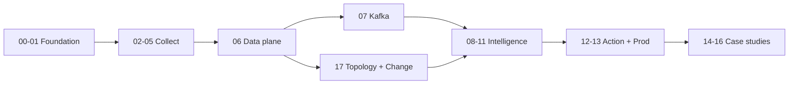

# AIOps Engineering Handbook

**Production-grade** reference for building Autonomous Intelligent Operations on AWS, Kubernetes, and cloud-native stacks.

| | |
|--|--|
| **Languages** | [Tiếng Việt](vi/00-introduction.vi.md) · [English](en/00-introduction.md) |
| **Chapters** | 18 per language (00–17) |
| **Repo** | [github.com/XUanhoa04/aiops-engineering-handbook](https://github.com/XUanhoa04/aiops-engineering-handbook) |
| **Curriculum** | [CURRICULUM.md](CURRICULUM.md) |

---

## Architecture


---

## Learning path



1. **Foundation** — Why AIOps, observability thinking  
2. **Collect** — OTel, Prometheus, Loki, Tempo  
3. **Data plane** — Normalize, enrich, store, feature store (**when to use**)  
4. **Transport** — Kafka  
5. **Intelligence** — Detect → correlate → RCA → LLM  
6. **Action** — Safe remediation + production ops  
7. **Case studies** — Big Tech, e-com/bank, famous incidents  
8. **Topology & change** — Graph + deploy/change bus feeding enrich/RCA  

---

## Start reading

### Tiếng Việt

- [00 — Giới thiệu](vi/00-introduction.vi.md)
- [06 — Data Plane](vi/06-data-plane/README.vi.md)
- [17 — Topology & Change](vi/17-topology-change/README.vi.md)

### English

- [00 — Introduction](en/00-introduction.md)
- [06 — Data Plane](en/06-data-plane/README.md)
- [17 — Topology & Change](en/17-topology-change/README.md)

---

## Local build

```bash
pip install -r requirements-docs.txt
mkdocs serve
# open http://127.0.0.1:8000
```

Site deploys automatically to GitHub Pages on every push to `main`.
