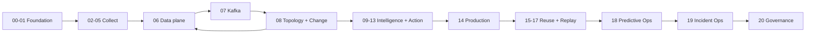

# AIOps Engineering Handbook

**Production-grade** reference for building Autonomous Intelligent Operations on AWS, Kubernetes, and cloud-native stacks.

| | |
|--|--|
| **Languages** | [Tiếng Việt](vi/00-introduction.vi.md) · [English](en/00-introduction.md) |
| **Chapters** | Shared sequence 00–17 · Vietnamese production extension 18–20 |
| **Repo** | [github.com/XUanhoa04/aiops-engineering-handbook](https://github.com/XUanhoa04/aiops-engineering-handbook) |
| **Curriculum** | [CURRICULUM.md](CURRICULUM.md) |

---

## Architecture


---

## Learning path


```mermaid
graph LR
    A[00-01 Foundation] --> B[02-05 Collect]
    B --> C[06 Data plane]
    C --> D[07 Kafka]
    D --> H[08 Topology + Change]
    H --> E[09-13 Intelligence + Action]
    E --> F[14 Production]
    F --> G[15-17 Reuse + Replay]
    G --> I[18 Predictive Ops]
    I --> J[19 Incident Ops]
    J --> K[20 Governance]
    H --> C
```

1. **Foundation** — Why AIOps, observability thinking
2. **Collect** — OTel, Prometheus, Loki, Tempo
3. **Data plane** — Normalize, enrich, store, feature store (**when to use**)
4. **Transport** — Kafka
5. **Topology & change** — Graph + deploy/change bus feeding enrichment and intelligence
6. **Intelligence + action** — Detect → correlate → RCA → investigate → remediate
7. **Production + reuse** — Production engine, patterns, domain packs and benchmark replay
8. **Proactive operations + governance** — Predict capacity risk, coordinate incidents and control AI authority

---

## Start reading

### Tiếng Việt

- [00 — Giới thiệu](vi/00-introduction.vi.md)
- [06 — Data Plane](vi/06-data-plane/README.vi.md)
- [08 — Topology & Change](vi/08-topology-change/README.vi.md)
- [18 — Predictive Operations](vi/18-predictive-operations/README.vi.md)
- [19 — Incident Operations](vi/19-incident-operations/README.vi.md)
- [20 — Governance & Model Risk](vi/20-aiops-governance/README.vi.md)

### English

- [00 — Introduction](en/00-introduction.md)
- [06 — Data Plane](en/06-data-plane/README.md)
- [08 — Topology & Change](en/08-topology-change/README.md)

---

## Local build

```bash
pip install -r requirements-docs.txt
mkdocs serve
# open http://127.0.0.1:8000
```

Site deploys automatically to GitHub Pages on every push to `main`.
