# Chapter 00 — Giới thiệu về AIOps

> **Chương này thiết lập nền tảng triết lý và kiến trúc của AIOps: tại sao nó tồn tại, nó giải quyết những vấn đề gì, nó thất bại ở đâu, và cách đo lường sự thành công.**

### Architecture poster — pipeline AIOps end-to-end

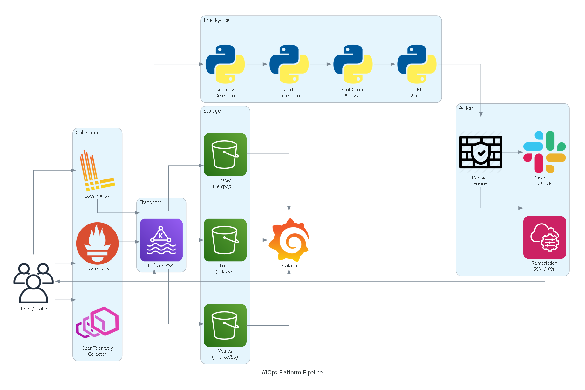

*Poster kiến trúc (PNG): Collection → Kafka → Storage → Intelligence → Action. Các flowchart logic bên dưới vẫn dùng Mermaid.*

---

## Prerequisites

- Hiểu biết cơ bản về hệ thống phân tán
- Quen thuộc với các khái niệm giám sát (metrics, logs, alerts)
- Tùy chọn: Các khái niệm SRE từ cuốn sách SRE Book của Google

## Related Documents

- [01 — Observability](01-observability/README.vi.md)
- [07 — Anomaly Detection](08-anomaly-detection/README.vi.md)
- [12 — Production](13-production/README.vi.md)
- [13 — Big Tech AIOps Case Studies](14-bigtech-aiops/README.vi.md) *(case study tóm tắt; chi tiết ở chương riêng)*
- [14 — E-commerce & Banking Patterns](15-ecommerce-banking/README.vi.md)
- [15 — Famous Incidents](16-famous-incidents/README.vi.md)

## Next Reading

Sau chương này, hãy chuyển sang [01 — Observability](01-observability/README.vi.md).

---

## Table of Contents

1. [What Is AIOps?](#1-what-is-aiops)
2. [The Problem AIOps Solves](#2-the-problem-aiops-solves)
3. [Mental Models: OODA & Problem Framing](#3-mental-models-ooda--problem-framing)
4. [AIOps vs AI SRE (Agentic)](#4-aiops-vs-ai-sre-agentic)
5. [Edge Cases Early: Partial & Metastable Failures](#5-edge-cases-early-partial--metastable-failures)
6. [AIOps Maturity Model](#6-aiops-maturity-model)
7. [12-Month Maturity Journey](#7-12-month-maturity-journey)
8. [ROI and Business Case](#8-roi-and-business-case)
9. [Org Design & Ownership (RACI)](#9-org-design--ownership-raci)
10. [Architecture Philosophy](#10-architecture-philosophy)
11. [The AIOps Pipeline](#11-the-aiops-pipeline)
12. [Data Flywheel](#12-data-flywheel)
13. [When AIOps Fails](#13-when-aiops-fails)
14. [Building vs Buying](#14-building-vs-buying)
15. [Common Mistakes & Anti-Patterns](#15-common-mistakes--anti-patterns)
16. [Production Review](#16-production-review)
17. [Improvement Roadmap](#17-improvement-roadmap)
18. [Seed for the Future: Junior → Principal](#18-seed-for-the-future-junior--principal)
19. [Summary](#summary)
20. [Chapter Score](#chapter-score)
21. [References & Public Reading List](#references--public-reading-list)

---

## 1. What Is AIOps?

> [!NOTE]
> **Ý TƯỞNG**
> AIOps là việc dùng AI/ML để **tự động hóa công việc nhận thức** trong vận hành IT — cụ thể là: phát hiện vấn đề sớm hơn con người, lọc nhiễu từ hàng trăm cảnh báo xuống còn 1–3 cảnh báo thật sự, và tự động khắc phục các lỗi có thể dự đoán được. Hãy nghĩ về nó như một "trợ lý on-call tự động" — không thay thế kỹ sư, nhưng xử lý 80% công việc lặp lại để kỹ sư tập trung vào 20% quyết định quan trọng.

> [!TIP]
> **Vì sao AIOps là khả năng, không phải sản phẩm**
> Không có sản phẩm nào "biết" hệ thống của bạn từ đầu. Datadog/Dynatrace là nền tảng với một số tính năng ML — nhưng AIOps thực sự đòi hỏi **mô hình được huấn luyện trên dữ liệu của chính bạn**, topology của chính bạn, runbook của chính bạn. Đây là lý do AIOps phải được xây dựng, không chỉ mua.

### Definition

**AIOps** (Artificial Intelligence for IT Operations) là việc ứng dụng machine learning, large language models, và các thuật toán thống kê để tự động hóa và tăng cường hoạt động vận hành CNTT — cụ thể là:

1. **Thu nhận và làm giàu telemetry (Telemetry ingestion and enrichment)** ở quy mô lớn
2. **Phát hiện bất thường (Anomaly detection)** trên metrics, logs, và traces
3. **Tương quan cảnh báo (Alert correlation)** để giảm nhiễu
4. **Phân tích nguyên nhân gốc rễ (Root cause analysis)** để xác định nguồn gốc của lỗi
5. **Tự động khắc phục (Automated remediation)** để giải quyết incident mà không cần sự can thiệp của con người
6. **Tích lũy tri thức (Knowledge accumulation)** để cải thiện theo thời gian

> **Phân biệt quan trọng**: AIOps không phải là một sản phẩm bạn mua. Nó là một khả năng bạn thiết kế và phát triển. Nhà cung cấp bán các thành phần; bạn là người kiến trúc hệ thống.

### What AIOps Is NOT

| Quan niệm sai lầm phổ biến | Thực tế |
|----------------------|---------|
| "AIOps = AI thay thế SRE" | AIOps tăng cường cho các SRE. Nó xử lý toil. Con người xử lý các phán đoán quyết định. |
| "AIOps = chỉ gồm Datadog/Dynatrace" | Đó là các nền tảng khả năng quan sát (observability platforms) tích hợp một số tính năng ML. AIOps thực sự tích hợp các mô hình tùy chỉnh (custom models) được huấn luyện trên dữ liệu của riêng bạn. |
| "AIOps = mua một nền tảng ML" | AIOps yêu cầu dữ liệu telemetry, runbooks, và topology của bạn. Không có giải pháp đóng gói sẵn nào biết rõ hệ thống của bạn. |
| "AIOps = các quy tắc định tuyến cảnh báo (alert routing rules)" | Định tuyến cảnh báo chỉ là mức cơ bản tối thiểu. AIOps giảm thiểu 80–95% lượng cảnh báo trước khi chúng tiếp cận con người. |
| "AIOps hoạt động ngay lập tức sau khi cài đặt" | Phải mất từ 3–6 tháng thu thập dữ liệu trước khi việc phát hiện bất thường trở nên đáng tin cậy. |

> [!NOTE]
> **Câu hỏi kiểm tra**: Tại sao AIOps không thể "mua ngay và dùng luôn" như Datadog? Bạn cần yếu tố gì đặc thù của tổ chức mình?

### Ba lớp giá trị (Value Layers)

Khi giải thích AIOps cho lãnh đạo kỹ thuật, hãy tách ba lớp — mỗi lớp có ROI và rủi ro khác nhau:

| Lớp | Việc làm | Thời gian có giá trị | Rủi ro chính |
|-----|----------|---------------------|--------------|
| **Noise reduction** | Dedup, group, suppress cascade | 1–3 tháng | Over-suppression che mất signal thật |
| **Faster understanding** | RCA ranking, LLM summary, context pack | 3–9 tháng | Hallucination / confidence sai |
| **Closed-loop action** | Auto-remediation có verify | 9–18 tháng | Blast radius, metastable feedback |

> [!IMPORTANT]
> Đừng bán "tự động hóa khắc phục" trước khi tổ chức tin tưởng lớp 1 và 2. Niềm tin vận hành là tài sản; một lần auto-remediation sai có thể đốt 12 tháng quan hệ với product team.

---

## 2. The Problem AIOps Solves

> [!NOTE]
> **Ý TƯỞNG**
> Vấn đề cốt lõi là **alert fatigue** — kiệt quệ vì cảnh báo. Khi một dịch vụ lỗi trong hệ thống 50 microservices, hệ thống giám sát truyền thống sẽ kích hoạt 100–500 cảnh báo cùng lúc (một lỗi thượng nguồn gây phân tầng xuống hạ nguồn). Kỹ sư on-call nhận tất cả lúc 3 giờ sáng và không thể phân biệt cảnh báo quan trọng với nhiễu. AIOps giải quyết điều này bằng cách **nhận diện nguyên nhân gốc rễ và gom tất cả cảnh báo phái sinh thành một incident duy nhất** có đầy đủ bối cảnh.

> [!TIP]
> **Vì sao không chỉ "tắt bớt cảnh báo"?**
> Phương án thay thế đơn giản nhất là giảm số lượng alert rule — nhưng điều này làm mất khả năng phát hiện vấn đề thực. AIOps không bỏ cảnh báo, mà **hiểu mối quan hệ nhân quả** giữa các cảnh báo: "200 cảnh báo này đều là hậu quả của 1 nguyên nhân". Trade-off: cần đầu tư 3–6 tháng xây dựng mô hình, không có kết quả ngay.

### Alert Fatigue — The Core Problem

Trong một kiến trúc microservices hiện đại với hơn 50 dịch vụ, một triển khai (deployment) duy nhất có thể kích hoạt:

- Hơn 200 cảnh báo metrics (CPU, memory, latency, error rates trên mỗi pod)
- Hơn 1,000 sự kiện log lỗi
- Các cảnh báo phân tầng (cascading alerts) từ các dịch vụ phía hạ nguồn (downstream) bị ảnh hưởng bởi một lỗi duy nhất ở phía thượng nguồn (upstream)

Một kỹ sư on-call nhận đồng thời hơn 1,200 thông báo này vào lúc 3 giờ sáng.

**Kết quả**: Alert fatigue (kiệt quệ vì cảnh báo). Các kỹ sư không còn tin tưởng vào cảnh báo. Các incident thực sự bị bỏ sót. MTTR (Mean Time to Recovery) tăng lên.

**Trước AIOps** — Mưa cảnh báo phân tầng:
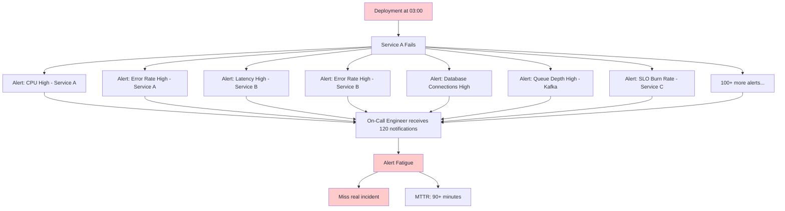

**Sau AIOps** — Một incident có đầy đủ bối cảnh:
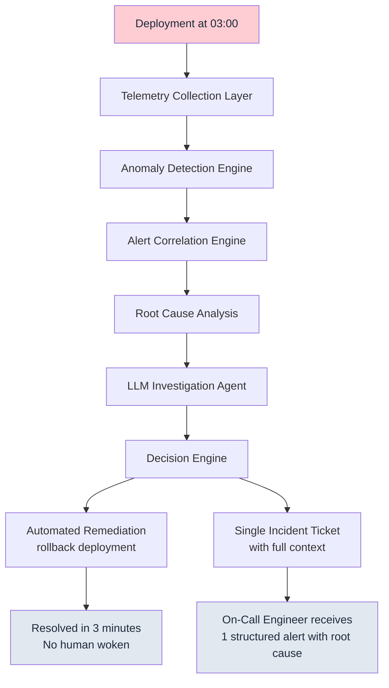

### Quantified Impact

Dựa trên các triển khai thực tế trong môi trường production:

| Metric | Trước AIOps | Sau AIOps | Cải thiện |
|--------|-------------|-------------|-------------|
| Số cảnh báo trên mỗi incident | 120–500 | 1–3 | Giảm 99% |
| MTTR | 60–120 phút | 3–15 phút | Giảm 85% |
| Tỷ lệ dương tính giả (False positive rate) | 60–80% | 5–15% | Giảm 75% |
| Số lần gián đoạn on-call / tuần | 40–80 | 5–10 | Giảm 87% |
| Số incident tự động khắc phục | 0% | 40–60% | Khả năng mới |
| Bối cảnh incident khi có page | 0% | 80%+ | Khả năng mới |

> **Lưu ý**: Các con số này yêu cầu telemetry phải ở mức độ trưởng thành (mature telemetry). Bạn không thể đạt được các kết quả này trong tháng đầu tiên. Hãy lập kế hoạch cho lộ trình nâng cấp 6 tháng.

### Ba bài toán con người không scale được

1. **Volume**: Telemetry tăng siêu tuyến tính theo số service × instance × cardinality label.
2. **Velocity**: MTTD mục tiêu hiện đại đo bằng giây–phút; con người đọc dashboard theo phút–giờ.
3. **Variety**: Metrics, logs, traces, events, deploys, feature flags — não người khó “join” đa tín hiệu lúc 3h sáng.

AIOps không “thông minh hơn SRE senior”. Nó **scale được ba trục trên** khi (và chỉ khi) dữ liệu + topology + feedback loop đủ tốt.

> [!TIP]
> Case study big tech (tóm tắt): nhiều tổ chức hyperscale công bố giảm noise 80–95% nhờ correlation + topology, rồi mới nói tới auto-remediation. Chi tiết và pattern theo ngành xem [13 — Big Tech AIOps](14-bigtech-aiops/README.vi.md) và [14 — E-commerce & Banking](15-ecommerce-banking/README.vi.md).

---

## 3. Mental Models: OODA & Problem Framing

> [!NOTE]
> **Ý TƯỞNG**
> On-call là một vòng lặp ra quyết định dưới áp lực thời gian. AIOps không thay thế vòng lặp đó — nó **rút ngắn, chuẩn hóa và tự động hóa từng bước** để con người chỉ vào lúc cần phán đoán.

### 3.1 OODA Loop cho On-Call

**OODA** (Observe → Orient → Decide → Act) gốc từ chiến lược quân sự; trong SRE nó là mô hình tinh thần rất hữu dụng:

| Bước | On-call thủ công | AIOps automation |
|------|------------------|------------------|
| **Observe** | Mở 8 tab Grafana, grep log, dò trace | Continuous ingest metrics/logs/traces; anomaly windows |
| **Orient** | “Cái này quen không? Deploy gần đây? Dependency nào?” | Topology + change correlation + similar-incident retrieval |
| **Decide** | Chọn runbook / escalate / chờ thêm signal | Risk matrix + confidence gate + policy engine |
| **Act** | kubectl / console / ticket | SSM / operator / approved playbook + audit |
| **(Ẩn) Verify** | Refresh dashboard 5 phút sau | Post-action verification SLO; auto-rollback remediation |

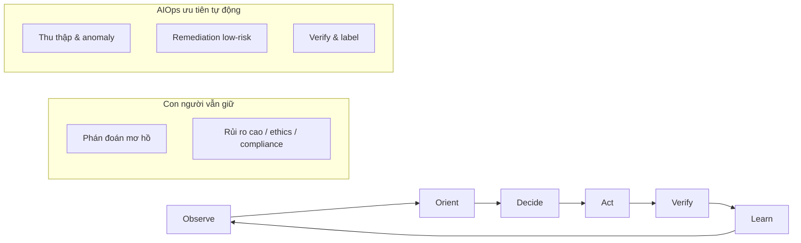

> [!IMPORTANT]
> **Automation of OODA ≠ remove human**
> Tự động hóa Observe/Act dễ; Orient/Decide khó và nguy hiểm nếu confidence ảo. Thiết kế “human in the loop” đúng chỗ (high-risk Decide), không rải human review khắp nơi (sẽ tạo bottleneck mới).

### 3.2 Problem Framing Canvas

Mọi incident (và mọi ticket AIOps) nên được đóng khung theo chuỗi:

**Signal → Noise → Decision → Action → Verify → Learn**

| Giai đoạn | Câu hỏi then chốt | Output kỳ vọng | Anti-pattern |
|-----------|-------------------|----------------|--------------|
| **Signal** | Tín hiệu nào lệch baseline / SLO? | Candidate anomalies | Cảnh báo tĩnh không theo seasonality |
| **Noise** | Cái nào là hệ quả, cái nào là nhân? | 1–3 cluster sự kiện | 200 page độc lập |
| **Decision** | Rủi ro / blast radius / ai được phép? | Plan + confidence + owner | “LLM bảo làm thì làm” |
| **Action** | Hành động nhỏ nhất có thể đảo ngược? | Playbook có idempotency | Script one-shot không rollback |
| **Verify** | SLO / error budget có hồi phục? | Pass/fail trong N phút | “Deploy xong là xong” |
| **Learn** | Label đúng/sai để retrain? | Training signal + postmortem note | Không feedback → model đứng yên |

> [!TIP]
> **Dùng canvas khi review AIOps design**
> Với mỗi stage pipeline, ghi rõ: *input signal*, *noise filter*, *decision policy*, *action surface*, *verify metric*, *learn sink*. Nếu thiếu một ô — stage đó chưa production-ready.

### 3.3 Vì sao mental model quan trọng hơn tool

Công cụ (Prometheus, Kafka, Isolation Forest, LLM) thay đổi 2–3 năm một lần. **OODA + framing canvas** sống lâu hơn:

- Giúp onboard junior: “Bạn đang ở bước nào của OODA?”
- Giúp postmortem: “Chúng ta thua ở Observe (thiếu signal) hay Orient (sai topology)?”
- Giúp roadmap: tự động hóa từ ngoài vào trong — Observe/Act trước, Decide sau.

> [!NOTE]
> **Câu hỏi kiểm tra**: Incident gần nhất của team — MTTD bị chậm vì Observe (thiếu metric) hay Orient (có data nhưng không hiểu)? Hành động cải thiện khác nhau hoàn toàn.

---

## 4. AIOps vs AI SRE (Agentic)

> [!NOTE]
> **Ý TƯỞNG**
> Giai đoạn 2025–2026, diễn ngôn công cộng chuyển từ “AIOps platform” sang “AI SRE / agentic operations”: agent đa bước, tool-use, ticket-to-fix. Đây không phải marketing thuần — nhưng cũng **không thay thế** nền tảng AIOps cổ điển.

### So sánh ngắn

| Chiều | AIOps (cổ điển / pipeline) | AI SRE (agentic) |
|-------|----------------------------|------------------|
| Kiến trúc | Stage cố định: detect → correlate → RCA → remediate | Agent lập kế hoạch động, gọi tool theo ngữ cảnh |
| Điểm mạnh | Latency budget rõ, audit dễ, deterministic hơn | Linh hoạt với incident lạ, đọc runbook/ticket tự nhiên |
| Điểm yếu | Khó với failure mode chưa từng thấy | Non-deterministic, khó bound latency/cost, dễ hallucinate action |
| Dữ liệu cần | Time-series sạch + topology + labels | + knowledge corpus + tool schemas + strong guardrails |
| Khi nào ưu tiên | Noise reduction, SLO burn, known-class failures | Investigation multi-hop, “explain this outage”, draft postmortem |
| Rủi ro 2025–2026 | Overfitting pipeline cứng | Agent loop tốn token; unsafe tool; shadow IT agents |

> [!WARNING]
> **Đừng thay pipeline bằng agent thuần**
> Agent không có đường bypass deterministic là SPOF tri thức. Pattern an toàn: **AIOps pipeline làm xương sống (Observe/Noise/Verify)**; agent hỗ trợ **Orient** (investigation) và soạn thảo **Learn** (postmortem). Action high-risk vẫn qua policy engine.

### Public discourse — cách đọc đúng

- Vendor demo “agent fix prod in 30s” thường giả định topology/runbook hoàn hảo — môi trường thật hiếm khi vậy.
- Đánh giá agentic AI SRE bằng: *tool allowlist*, *blast radius*, *human approval gates*, *cost per investigation*, *false action rate* — không chỉ bằng demo latency.
- Liên hệ incident lịch sử (retry storm, partial brownout): agent kém topology có thể **khuếch đại** thay vì chữa. Xem [15 — Famous Incidents](16-famous-incidents/README.vi.md).

> [!TIP]
> **Quy tắc lựa chọn 2026**
> - Class failure đã lặp ≥3 lần + playbook ổn định → pipeline/automation.
> - Class failure thưa + cần đọc đa nguồn → agent investigation, **không** auto-act.
> - Chưa có labels/feedback → dừng agentic rollout; xây flywheel trước (mục 12).

---

## 5. Edge Cases Early: Partial & Metastable Failures

> [!NOTE]
> **Ý TƯỞNG**
> Hầu hết tutorial AIOps demo “service down 100%”. Production thật chết vì **brownout, partial failure, metastable failure, retry storm** — nơi threshold tĩnh và mô hình “binary healthy/unhealthy” đều mù.

### 5.1 Brownout

**Định nghĩa**: Hệ thống vẫn “up” (health check pass) nhưng chất lượng suy giảm: latency P99 tăng, error rate 2–8%, một số tenant chậm.

| Đặc điểm | Hậu quả với AIOps ngây thơ |
|----------|----------------------------|
| Availability probe xanh | Không page; khách hàng đã chửi |
| SLO burn chậm | Threshold 5xx > 5% không chạm |
| Chỉ một region/shard | Global average che local pain |

**Xử lý tư duy**:
- Alert trên **user-journey SLI** và **burn rate**, không chỉ binary up/down.
- Anomaly theo **segment** (tenant, region, endpoint class).
- RCA phải hiểu “degraded dependency” khác “dead dependency”.

### 5.2 Partial failure

Một subset instance/pod/partition lỗi; load balancer vẫn route một phần traffic vào bad set.

- Correlation cần **topology + deployment unit**, không chỉ service name.
- Remediation an toàn: cordon/drain bad set, **không** restart toàn cluster (có thể kích hoạt thundering herd).

### 5.3 Metastable failures

Hệ thống rơi vào trạng thái ổn định xấu: sau khi trigger ban đầu hết, hệ thống **không tự về healthy** (queue backlog + timeout + retry + cache stampede).

> [!WARNING]
> Auto-remediation “scale up pods” khi queue metastable có thể **đẩy chi phí lên** mà không phá metastability (thậm chí tăng contention). Cần playbook “shed load / break retry / purge poison” chứ không chỉ scale.

### 5.4 Retry storms

Client retry không jitter + timeout ngắn → dependency quá tải → nhiều client timeout → retry nhiều hơn.

| Signal | Ý nghĩa |
|--------|---------|
| Outbound RPS tăng trong khi success rate giảm | Có thể storm |
| Queue depth tăng + consumer lag + CPU high | Feedback loop |
| Error budget burn đồng thời nhiều service | Cascade |

**AIOps implication**:
- Detection phải nhìn **client + server** cùng lúc.
- Remediation ưu tiên **client-side** (circuit break, bulkhead) trước scale server mù quáng.
- Ghi nhận class failure này trong knowledge base — đây là pattern lặp ở hầu hết hệ thống lớn.

### 5.5 Bảng “early edge case” cho design review

| Edge case | Signal gợi ý | Hành động AIOps nên tránh | Hướng xử lý đúng |
|-----------|--------------|---------------------------|------------------|
| Brownout | SLO burn, P99, satisfaction | Chỉ check /health | Segmented anomaly + UX SLI |
| Partial failure | Instance-level error skew | Restart all | Isolate bad subset |
| Metastable | Persist after root cause fixed | Chỉ scale | Load shed / drain / cooldown |
| Retry storm | Retry ratio, outbound RPS | Open more connections | Backoff, break, protect core |
| Silent drop | Traffic drop không error | Không page vì “ít error” | Volume anomaly + business KPI |

> [!NOTE]
> **Câu hỏi kiểm tra**: Pipeline của bạn có phát hiện “traffic rơi 40% nhưng error rate 0%” không? Nếu không — bạn mù với một lớp outage kinh điển (bad deploy drop requests, misconfig route, DNS partial).

---

## 6. AIOps Maturity Model

> [!NOTE]
> **Ý TƯỞNG**
> Giống như học lái xe — bạn phải học đường thẳng trước khi vào cua, rồi mới lên đường cao tốc. Không thể nhảy cóc. Tổ chức ở Level 0 (không có monitoring) mà cố xây dựng AIOps Level 5 (tự trị hoàn toàn) sẽ thất bại 100% vì không có dữ liệu nền để train model. Mô hình trưởng thành này giúp bạn biết **mình đang đứng ở đâu và bước tiếp theo là gì**.

> [!TIP]
> **Bẫy phổ biến nhất**: "Chúng tôi muốn bỏ qua Level 1-2 và đi thẳng vào ML". Điều này không khả thi vì ML cần ít nhất 3–6 tháng lịch sử telemetry sạch để train. Không có đường tắt.

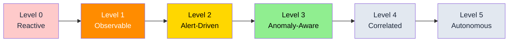

### Level 0 — Reactive ("Chúng ta phát hiện lỗi từ khách hàng")

- Không có giám sát có cấu trúc
- Incidents được phát hiện thông qua phản hồi/khiếu nại của người dùng
- Không có runbooks
- Không có phân ca on-call

**Tổ chức điển hình**: Startup giai đoạn đầu, <5 kỹ sư

### Level 1 — Observable ("Chúng ta có metrics và logs")

- Prometheus + Grafana cơ bản
- Quản lý log tập trung (ELK hoặc Loki)
- Các dashboard thủ công
- Một số cảnh báo dựa trên ngưỡng tĩnh (static threshold alerts)

**Tổ chức điển hình**: Startup đang phát triển, có đội ngũ SRE chuyên trách

**Lỗ hổng**: Quá nhiều cảnh báo tĩnh → alert fatigue

### Level 2 — Alert-Driven ("Chúng ta nhận được page khi có sự cố")

- Hệ thống cảnh báo toàn diện với Alertmanager
- Tích hợp PagerDuty/OpsGenie
- Quản lý incident (Opsgenie/Jira)
- Có tồn tại runbooks nhưng xử lý thủ công

**Tổ chức điển hình**: Công ty quy mô vừa, 50–200 kỹ sư

**Lỗ hổng**: Lượng cảnh báo quá tải đối với kỹ sư on-call. Các lỗi phân tầng tạo ra các cơn bão cảnh báo (alert storms). MTTR phụ thuộc vào chuyên môn của từng cá nhân.

### Level 3 — Anomaly-Aware ("Chúng ta phát hiện vấn đề trước khi khách hàng nhận ra")

- Phát hiện bất thường bằng thống kê trên các metrics chính
- Phát hiện bất thường log (phát hiện thay đổi mẫu log)
- Cảnh báo dựa trên SLO (burn rate)
- Giảm lượng cảnh báo thông qua lọc nhiễu

**Tổ chức điển hình**: Công ty có đội ngũ Platform Engineering chuyên trách

**Lỗ hổng**: Bất thường được phát hiện nhưng việc tương quan vẫn là thủ công. Mỗi cảnh báo vẫn yêu cầu con người điều tra.

### Level 4 — Correlated ("Chúng ta tự động nhìn thấy bức tranh toàn cảnh")

- Tương quan đa tín hiệu (tương quan metrics + log + trace)
- Nhóm cảnh báo nhận biết topology (topology-aware alert grouping)
- Tự động xếp hạng nguyên nhân gốc rễ
- Tóm tắt incident do LLM tạo ra
- Tự động hóa runbook cho các mẫu lỗi phổ biến

**Tổ chức điển hình**: Doanh nghiệp lớn với hơn 200 kỹ sư, có đội ngũ AIOps chuyên trách

**Lỗ hổng**: Khắc phục lỗi vẫn yêu cầu con người phê duyệt cho hầu hết các hành động.

### Level 5 — Autonomous ("Hệ thống tự chữa lành")

- Khắc phục lỗi tự động vòng lặp khép kín (closed-loop automated remediation)
- Cơ sở tri thức tự cải thiện
- Quản lý tài nguyên/dung lượng chủ động
- Ngăn ngừa lỗi dự báo trước
- Sự giám sát của con người với đầy đủ vết kiểm toán (audit trail)

**Tổ chức điển hình**: Các hyperscalers, các công ty cloud-native có mức độ trưởng thành cao

**Lỗ hổng**: Sự tin cậy và quản trị (governance). Làm thế nào để tự động khắc phục lỗi một cách an toàn ở quy mô lớn?

### Self-assessment nhanh (15 phút)

Cho điểm 0/1 mỗi câu (tổng /10 ≈ map level):

1. Mọi user-facing service có RED/USE hoặc tương đương?
2. Log structured JSON + trace context?
3. Page chỉ khi user impact / SLO burn?
4. Có topology service dependency (dù thủ công)?
5. Anomaly/dynamic baseline trên ≥ top 20 SLI?
6. Alert storm < 10 page cho một root cause?
7. RCA gợi ý đúng ≥ 50% trên known class?
8. Feedback label sau incident là bắt buộc?
9. Low-risk remediation có auto + verify?
10. Pipeline AIOps fail-open được test định kỳ?

| Điểm | Level gợi ý |
|------|-------------|
| 0–2 | L0–L1 |
| 3–4 | L2 |
| 5–6 | L3 |
| 7–8 | L4 |
| 9–10 | Tiến L5 (vẫn cần governance) |

> [!NOTE]
> **Câu hỏi kiểm tra**: Tổ chức của bạn đang ở Level nào? Điều gì cụ thể cần xây dựng để lên Level tiếp theo?

---

## 7. 12-Month Maturity Journey

> [!NOTE]
> **Ý TƯỞNG**
> Maturity model là bản đồ tĩnh. Journey 12 tháng là **kịch bản thực thi**: outcome theo tháng, không chỉ feature list. Dùng để align leadership, hiring, và kỳ vọng ROI.

### Tháng 1–2 — Foundation & Honesty

| Outcome | Chỉ số |
|---------|--------|
| Inventory service + owner | 100% service critical có owner |
| Chuẩn metric/log naming | Lint/CI cho convention |
| Baseline MTTD/MTTR/page volume | Số liệu 4 tuần liên tục |
| “Single pane” chưa quan trọng | Ưu tiên **đúng signal** hơn UI đẹp |

**Risk**: Over-tooling. Chống bằng: không mua platform AIOps tháng 1.

### Tháng 3–4 — Alert hygiene & SLO

| Outcome | Chỉ số |
|---------|--------|
| SLO cho top journeys | ≥ 5–10 SLI kinh doanh |
| Giảm page vô nghĩa | −30–50% pages/tuần |
| Runbook skeleton | Top 20 alert có link runbook |
| Change correlation thủ công | Deploy ID gắn incident |

### Tháng 5–6 — Statistical detection

| Outcome | Chỉ số |
|---------|--------|
| EWMA/Z-score/STL trên golden signals | Precision sơ bộ đo được |
| Shadow mode (không page) | So sánh FP/FN 4–6 tuần |
| Kafka/feature pipeline MVP | Latency budget giai đoạn 1–2 |
| Điểm hòa vốn “soft” | Giảm 1 major outage nhờ early detect |

> [!TIP]
> Tháng 6 là checkpoint lãnh đạo: nếu telemetry vẫn bẩn, **dừng ML nâng cao**, quay lại data quality. Xem ROI section — đây thường là đáy cashflow đầu tư.

### Tháng 7–8 — Correlation & RCA v1

| Outcome | Chỉ số |
|---------|--------|
| Topology-aware grouping | Alerts/incident → 1–5 |
| RCA ranker heuristic | Top-3 chứa true root ≥ 40–60% |
| LLM summary (read-only) | Time-to-context −50% |
| Human approval remediation | 5–10 playbook low-risk |

### Tháng 9–10 — Feedback & flywheel

| Outcome | Chỉ số |
|---------|--------|
| Label correct/incorrect bắt buộc | ≥ 80% incident có label |
| Retrain/refresh baseline | Lịch hàng tháng |
| False positive budget | FP page < X%/tuần |
| Chaos / game day 1 | Verify fail-open + one remediation |

### Tháng 11–12 — Selective autonomy

| Outcome | Chỉ số |
|---------|--------|
| Auto-remediation class A (scale/restart safe) | 20–40% incident class A auto |
| Verify + circuit breaker | 0 major self-inflicted outage |
| Cost dashboard AIOps | $/incident investigated |
| Roadmap Y2 (agentic investigation?) | Decision go/no-go có data |

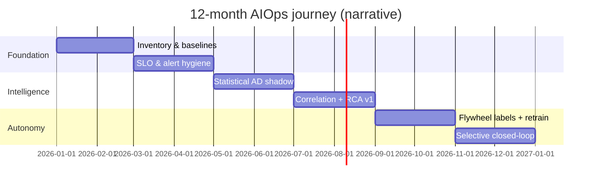

> [!IMPORTANT]
> Journey giả định team ~2 SRE + part-time platform. Ít người hơn → kéo dài 18 tháng; đừng nén timeline bằng cách bỏ verify/feedback.

---

## 8. ROI and Business Case

> [!NOTE]
> **Ý TƯỞNG**
> Để "bán" AIOps cho ban lãnh đạo, bạn cần số liệu cụ thể, không phải lý thuyết. Công thức đơn giản: **Chi phí downtime × tần suất incident × % cải thiện MTTR = giá trị hàng năm**. Điểm hòa vốn thường đạt được sau khi ngăn chặn được 1 incident lớn duy nhất (thường tháng 6–9).

### Cost of Downtime

Các chuẩn so sánh trong ngành (Gartner, IDC):

| Lĩnh vực | Chi phí trung bình/phút của Downtime |
|--------|---------------------------------|
| E-commerce | $6,800 – $11,000 |
| Financial Services | $100,000+ |
| Healthcare | $5,000 – $9,000 |
| SaaS B2B | $1,500 – $5,000 |

Ngành dọc (pattern ROI khác nhau) được phân tích sâu hơn ở [14 — E-commerce & Banking](15-ecommerce-banking/README.vi.md).

### AIOps Investment vs Return

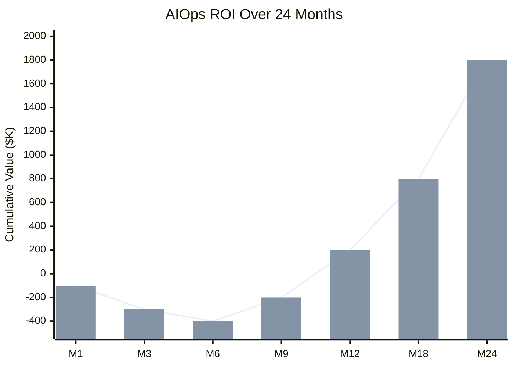

**Phân bổ đầu tư điển hình**:

| Hạng mục | Chi phí hàng tháng |
|------|-------------|
| Thời gian của kỹ sư (2 SREs × $15K) | $30,000 |
| Cơ sở hạ tầng (Kafka, Prometheus, Loki) | $3,000–8,000 |
| LLM API calls (Claude/GPT-4) | $500–2,000 |
| ML compute (anomaly detection) | $500–1,500 |
| **Tổng cộng** | **~$35,000–$42,000/tháng** |

**Lợi nhuận điển hình**:

| Hạng mục | Giá trị hàng năm |
|------|-------------|
| Giảm thiểu downtime (cải thiện 85% MTTR) | $200,000–$500,000 |
| Giảm giờ on-call (tiết kiệm 10 giờ/tuần) | $150,000 |
| Giảm alert fatigue (năng suất kỹ sư tăng) | $100,000 |
| **Tổng cộng** | **$450,000–$750,000/năm** |

**Điểm hòa vốn (Break-even)**: Thường từ 6–9 tháng khi ngăn chặn được một incident lớn duy nhất.

### Economics of MTTD vs MTTR vs Change Failure Rate (DORA)

> [!NOTE]
> **Ý TƯỞNG**
> MTTR được trích dẫn nhiều nhất, nhưng **cải thiện MTTD** và **giảm change failure rate (CFR)** thường mang ROI bền hơn. DORA Four Keys liên kết trực tiếp với AIOps: Deployment Frequency, Lead Time, CFR, Time to Restore.

#### Phân rã thời gian sự cố

```
T_customer_impact ≈ MTTD + (MTTK − MTTD) + (MTTR − MTTK)
                   detect     understand root      remediate & verify
```

| Thành phần | AIOps đòn bẩy chính | Ghi chú kinh tế |
|------------|---------------------|-----------------|
| **MTTD** | Anomaly, SLO burn, business KPI | Mỗi phút sớm hơn = giảm full outage cost |
| **MTTK** (time to know) | Correlation, RCA, LLM context | Giảm “war room 45 phút chỉ để hiểu” |
| **MTTR** | Runbook auto, rollback, scale | Chỉ an toàn khi MTTK đúng |
| **CFR** | Change-aware detection, canary signal | Giảm số incident, không chỉ rút ngắn |

#### Vì sao tối ưu MTTR đơn độc có thể lừa dối

- Team “giỏi chữa cháy” → MTTR thấp nhưng **CFR cao** → chi phí ẩn (context switch, burnout, uy tín).
- AIOps chỉ auto-remediate mà không cải thiện change quality → bạn tự động hóa vòng lặp xấu.
- Đo **error budget burn rate** và **pages per deploy** cùng MTTR.

#### Mô hình ROI mở rộng (leadership one-pager)

```
Annual_value ≈
  (Incidents/year × Cost_per_minute × ΔMTTR_minutes)
  + (Prevented_incidents/year × Avg_incident_cost)          # từ better MTTD + CFR
  + (Oncall_hours_saved × Fully_loaded_engineer_cost)
  + (Engineering_focus_hours × Opportunity_value)           # ít noise
  − (AIOps_platform_cost + LLM + ML + eng_time)
```

> [!TIP]
> **Liên hệ DORA**
> - Elite performers: Time to restore < 1h, CFR 0–15%. AIOps Level 3–4 hỗ trợ đạt restore nhanh **mà không** hy sinh CFR nếu verify + change correlation đủ mạnh.
> - Báo cáo nội bộ nên có 4 ô: MTTD, MTTR, CFR, pages/engineer/week — không chỉ “số alert giảm”.

#### Ví dụ số (SaaS B2B giả định)

| Tham số | Trước | Sau 12 tháng |
|---------|-------|--------------|
| Sev-1 / năm | 12 | 8 (−CFR & early detect) |
| Phút impact / Sev-1 | 90 | 20 |
| $/phút | $3,000 | $3,000 |
| Chi phí impact/năm | $3.24M | $0.48M |
| Δ | | **~$2.76M** (chưa trừ OPEX AIOps) |

OPEX ~$0.45M/năm → ROI thô vẫn rất mạnh — **nếu** giả định chi phí downtime và số Sev-1 đo được. Hãy thay số thật của org bạn; đừng copy số demo.

> [!WARNING]
> ROI “giảm 99% alert” không tự động thành tiền nếu alert vốn không liên quan revenue. Luôn neo vào **user journey / revenue path / regulatory SLA**.

---

## 9. Org Design & Ownership (RACI)

> [!NOTE]
> **Ý TƯỞNG**
> AIOps chết không chỉ vì model sai — mà vì **không ai owns** precision, runbook, hay false positive budget. Ba vai trò hay đụng nhau: Platform team, Product SRE, AIOps/ML eng.

### Vai trò

| Vai trò | Trách nhiệm cốt lõi | Không nên ôm |
|---------|---------------------|--------------|
| **Platform team** | Telemetry standards, collectors, Kafka/Prom reliability, multi-tenant platform SLOs | Model business-specific; page product 3h sáng vì “nền tảng hay” |
| **Product SRE** | SLI/SLO service, runbooks, on-call, approve remediation risk cho service mình | Tự host Kafka AIOps; train Isolation Forest từ đầu |
| **AIOps / ML eng** | Detectors, correlation, RCA, LLM/RAG, evaluation, flywheel | Thay product quyết định “accept risk”; silent config prod không audit |

### RACI mẫu (R = Responsible, A = Accountable, C = Consulted, I = Informed)

| Khả năng | Platform | Product SRE | AIOps ML | Eng Manager / Risk |
|----------|----------|-------------|----------|--------------------|
| Metric/log standards | **A/R** | C | C | I |
| Service SLO & page policy | C | **A/R** | C | I |
| Anomaly models (global) | C | C | **A/R** | I |
| Topology source of truth | **A** | R (declare deps) | R (consume) | I |
| Runbook content | I | **A/R** | C (schema) | I |
| Auto-remediation policy | C | **A** (per service) | R (engine) | **A** (org risk) |
| FP budget / model eval | C | C | **A/R** | I |
| LLM prompt & tool allowlist | C | C | **A/R** | C (security) |
| Incident labels (feedback) | I | **R** | A (pipeline) | I |
| Cost of AIOps stack | **A/R** | I | R (LLM spend) | C |

> [!IMPORTANT]
> **Accountable cho auto-action phải là risk owner của service**, không phải ML eng. ML eng accountable cho **chất lượng gợi ý và an toàn engine**; product SRE accountable cho **có được bật auto trên service mình hay không**.

### Mô hình team theo quy mô

| Quy mô | Gợi ý org |
|--------|-----------|
| < 30 eng | 1 platform-minded SRE kiêm AIOps; chưa tách ML eng |
| 30–150 eng | Platform owns pipeline; 1 AIOps specialist; product SRE owns SLO |
| 150+ eng | AIOps platform + embedded ML; clear RACI; office hours |
| Multi-BU enterprise | Platform multi-tenant; chargeback cost; shared model + local adapters |

### Anti-pattern tổ chức

- ❌ “AI team build AIOps trong isolation” → model không khớp on-call reality.
- ❌ “Mỗi product tự làm correlation” → 12 cách group alert khác nhau.
- ❌ Không có **false positive budget** → product SRE tắt detector im lặng.
- ❌ On-call AIOps platform và product trùng page storm → burnout kép.

> [!TIP]
> Bắt đầu mọi chương trình AIOps bằng **1 trang RACI + SLO của chính pipeline**. Nếu không viết được, bạn chưa sẵn sàng hiring “AIOps engineer”.

---

## 10. Architecture Philosophy

> [!NOTE]
> **Ý TƯỞNG**
> Năm nguyên tắc này là "kim chỉ nam" để đưa ra mọi quyết định thiết kế. Khi phân vân giữa hai lựa chọn, hãy hỏi: "Nguyên tắc nào áp dụng ở đây?". Chúng không phải best practices tùy ý — chúng là bài học từ những lần hệ thống thực sự bị lỗi.

### Five Principles of Production AIOps

#### Principle 1: Data First, Intelligence Second

> [!TIP]
> **Vì sao**: Không mô hình ML nào có thể bù đắp cho dữ liệu telemetry bị thiếu hoặc quá nhiễu. Đây là lý do tại sao chương 01–06 (Observability stack) đến trước chương 07–11 (AI/ML). Không có phím tắt ở đây.

Trước khi xây dựng hệ thống phát hiện bất thường:
- Đảm bảo độ phủ metrics 100% cho tất cả các dịch vụ
- Đảm bảo ghi log có cấu trúc (JSON, không ghi text tự do)
- Đảm bảo distributed tracing với 100% lan truyền bối cảnh (context propagation)

#### Principle 2: Fail Open, Not Closed

> [!TIP]
> **Vì sao**: Nếu chính pipeline AIOps bị lỗi (Kafka down, correlation engine crash), kỹ sư vẫn phải nhận được cảnh báo — qua đường dẫn dự phòng trực tiếp từ Alertmanager. "Fail open" = mất tính năng thông minh nhưng không mất khả năng cảnh báo. "Fail closed" = nguy hiểm.

Nếu pipeline của AIOps bị lỗi:
- Các cảnh báo vẫn phải truyền đến kỹ sư (bỏ qua correlation engine)
- Tự động hóa runbook phải được tắt, chứ không phải im lặng
- Bản thân pipeline cũng phải có khả năng quan sát (observable)

#### Principle 3: Human in the Loop for High-Risk Actions

Xác định một **remediation risk matrix** (ma trận rủi ro khắc phục lỗi):

| Risk Level | Ví dụ | Hành động |
|------------|---------|--------|
| Low | Tăng số lượng pods (Scale up) | Tự động hoàn toàn |
| Medium | Rollback deployment | Tự động hóa + gửi thông báo |
| High | Database failover | Yêu cầu phê duyệt |
| Critical | Multi-region failover | Chỉ thực hiện bằng con người |

#### Principle 4: Every Decision Must Be Explainable

Nếu hệ thống thực hiện rollback một deployment:
- Ghi log bất thường cụ thể đã kích hoạt hành động đó
- Ghi log bằng chứng tương quan (correlation evidence)
- Ghi log điểm số tin cậy (confidence score) của RCA
- Ghi log runbook cụ thể đã thực thi
- Lưu trữ trong vết kiểm toán bất biến (immutable audit log)

Đây vừa là **yêu cầu kỹ thuật** (để debug) vừa là **yêu cầu về pháp lý/tuân thủ (compliance)**.

#### Principle 5: Degrade Gracefully

> [!TIP]
> **Vì sao**: Một hệ thống tự động hoàn toàn khi hoạt động tốt, nhưng im lặng hoàn toàn khi bị lỗi, còn nguy hiểm hơn không có AIOps. Cần có các "tầng dự phòng" — từ Autonomous → Semi-Autonomous → Standard → Manual — như máy bay có nhiều hệ thống backup.

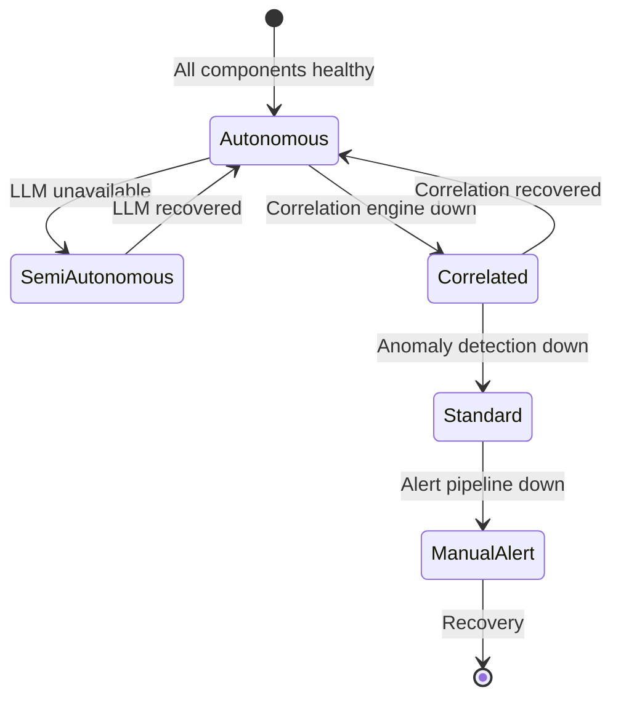

### Principle 6 (mở rộng): Measure the measurer

AIOps pipeline phải có SLO riêng: ingest lag, detection freshness, correlation success rate, remediation verify rate. Nếu không, bạn xây **SPOF vô hình** — xem failure mode ở mục 13.

---

## 11. The AIOps Pipeline

> [!NOTE]
> **Ý TƯỞNG**
> Pipeline này là "bản đồ" của toàn bộ handbook. Mỗi chương (01–12) tương ứng với một hoặc nhiều stage trong pipeline. Hiểu pipeline đầu-cuối này giúp bạn biết từng component học trong handbook nằm ở đâu và phục vụ mục đích gì.

> [!TIP]
> **Vì sao thiết kế 12 stage?**
> Không phải vì phức tạp cho vui — mỗi stage có trách nhiệm rõ ràng và có thể fail độc lập. Kiến trúc monolith sẽ khiến một bug nhỏ làm sập toàn bộ. Đây là áp dụng nguyên tắc Single Responsibility vào AIOps pipeline.

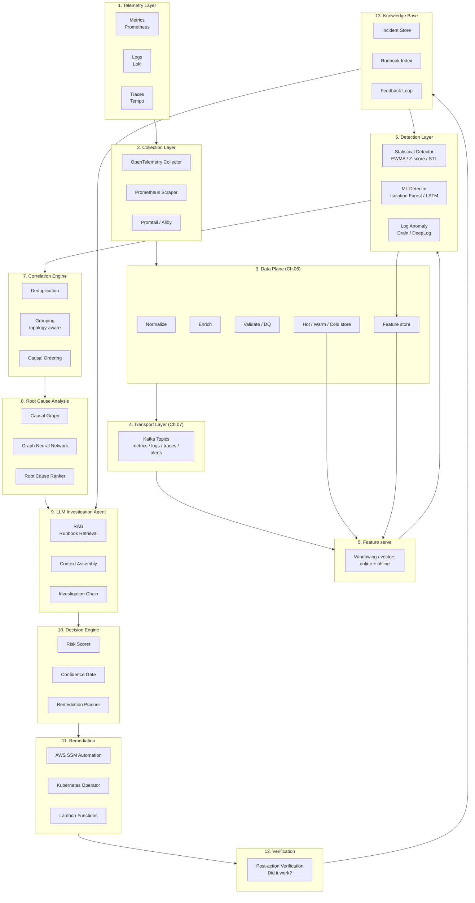

> Chi tiết **khi nào** cần normalize/enrich/store/feature: [06 — Telemetry Data Plane](06-data-plane/README.vi.md).

### Pipeline Latency Budget

> [!IMPORTANT]
> **MINH HỌA — SLO cho từng stage**
> Đây là số liệu thực tế từ triển khai production. Nếu bất kỳ stage nào vượt SLO, cần optimize hoặc scale trước khi deploy.

| Stage | P50 Latency | P99 Latency | SLO |
|-------|-------------|-------------|-----|
| Telemetry → Kafka | 100ms | 500ms | <1s |
| Kafka → Feature Engineering | 200ms | 1s | <2s |
| Feature Engineering → Detection | 500ms | 2s | <5s |
| Detection → Correlation | 100ms | 500ms | <2s |
| Correlation → RCA | 2s | 10s | <15s |
| RCA → LLM Investigation | 5s | 30s | <60s |
| Decision → Remediation | 2s | 5s | <10s |
| **End-to-End (Detect → Remediate)** | **~10s** | **~50s** | **<5phút** |

> **Quan trọng**: Vòng lặp "phát hiện → khắc phục (detect → remediate)" phải hoàn thành trong vòng 5 phút đối với hầu hết các loại incident. Vượt quá 5 phút, MTTR sẽ rơi vào vùng cần can thiệp thủ công.

### Ánh xạ OODA → stage pipeline

| OODA / Canvas | Stage |
|---------------|-------|
| Observe / Signal | 1–5 Telemetry → Detection |
| Noise | 6 Correlation |
| Orient | 7–8 RCA + LLM |
| Decide | 9 Decision Engine |
| Act | 10 Remediation |
| Verify | 11 Verification |
| Learn | 12 Knowledge + flywheel |

---

## 12. Data Flywheel

> [!NOTE]
> **Ý TƯỞNG**
> AIOps không “set and forget”. Giá trị tích lũy theo vòng: **incident → label → retrain → better detection → ít noise hơn → label chất lượng hơn**. Thiếu một mắt xích, model thoái hóa (distribution shift) và team mất niềm tin.

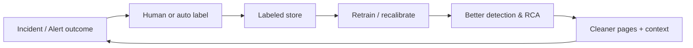

### Các loại label tối thiểu

| Label | Ai gán | Dùng để |
|-------|--------|---------|
| `true_positive` / `false_positive` | On-call | Precision detector |
| `root_cause_service` | On-call / postmortem | RCA ranker |
| `remediation_correct` | On-call | Policy & playbook |
| `user_impact: none|partial|full` | Incident commander | Priority & SLO mapping |
| `suppress_reason` | On-call | Noise rules có kiểm soát |

### Tần suất retrain / refresh

| Thành phần | Chu kỳ gợi ý | Trigger sớm |
|------------|--------------|-------------|
| Statistical baselines | Cuộn liên tục / weekly | Seasonality break, major launch |
| Unsupervised AD | Monthly | Precision drop, drift PSI/KL |
| Supervised RCA | Monthly–quarterly | Topology lớn đổi |
| Embeddings runbook RAG | On runbook change | — |
| LLM prompts/tools | Change-managed | Hallucination incident |

> [!WARNING]
> Label từ on-call lúc 3h sáng có noise. Thiết kế UX label **≤ 2 click**; review tuần một lần các label mâu thuẫn. Flywheel rác → model rác nhanh hơn không có model.

### Case study tóm tắt (pattern big tech)

Nhiều tổ chức lớn công bố: sau khi có **mandatory incident tagging** + offline evaluation, precision detector tăng dần theo quý — không phải nhờ model phức tạp hơn, mà nhờ **dữ liệu phản hồi**. Chi tiết pattern: [13 — Big Tech AIOps](14-bigtech-aiops/README.vi.md).

> [!TIP]
> KPI flywheel: `% incidents labeled`, `time-to-label`, `precision@k trend`, `% auto-actions verified`. Nếu chỉ đo “số model deploy” — bạn đang vanity metric.

---

## 13. When AIOps Fails

> [!NOTE]
> **Ý TƯỞNG**
> Đây là phần quan trọng nhất để đọc trước khi bắt đầu xây dựng. Mỗi failure mode dưới đây đã xảy ra trong production ở các tổ chức thực tế. Hiểu chúng trước giúp bạn thiết kế phòng ngừa ngay từ đầu, thay vì học qua kinh nghiệm đau đớn.

Hiểu rõ các kịch bản lỗi cũng quan trọng như việc hiểu các trường hợp thành công.

### Failure Mode 1: Garbage In, Garbage Out

**Triệu chứng**: Tỷ lệ dương tính giả cao (>30%), các mô hình phát hiện ra nhiễu thay vì bất thường thực tế

**Nguyên nhân gốc rễ**: Nhãn metric (labels) không nhất quán, thiếu nhãn, bùng nổ cardinality (cardinality explosions), định dạng log bị thay đổi mà không có sự phối hợp

**Ngăn ngừa**:
- Áp dụng các tiêu chuẩn đặt tên metric với kiểm thử CI
- Sử dụng quy ước ngữ nghĩa (semantic conventions) của OpenTelemetry
- Sử dụng Schema registry cho định dạng log
- Giám sát chất lượng dữ liệu ngay trên chính telemetry pipeline

### Failure Mode 2: Distribution Shift

**Triệu chứng**: Độ chính xác của phát hiện bất thường bị giảm dần theo thời gian

**Nguyên nhân gốc rễ**: Mẫu lưu lượng (traffic patterns) thay đổi (triển khai tính năng mới, đỉnh tải theo mùa), nhưng các mô hình không được huấn luyện lại

**Ngăn ngừa**:
- Pipeline huấn luyện lại mô hình hàng tháng
- Giám sát các metric hiệu năng của mô hình (precision, recall, F1)
- Phát hiện độ lệch phân phối (distribution drift) bằng KL-divergence hoặc PSI
- Triển khai Blue-green cho các mô hình ML

### Failure Mode 3: Remediation Blast Radius

**Triệu chứng**: Tự động khắc phục lỗi làm cho incident trở nên nghiêm trọng hơn

**Nguyên nhân gốc rễ**: Xác định sai nguyên nhân gốc rễ, chọn sai phương án khắc phục, hoặc không có bước xác minh (verification)

**Ngăn ngừa**:
- Cơ chế ngắt mạch khắc phục (Remediation circuit breakers - dừng lại nếu xác minh thất bại 2 lần)
- Giới hạn blast radius (tối đa scale 20% số lượng pods cùng một lúc)
- Khắc phục dạng Canary (áp dụng thử nghiệm trên 1 pod trước, xác minh, sau đó áp dụng toàn bộ)
- Cổng phê duyệt của con người đối với bất kỳ hành động nào trên mức "rủi ro thấp"

### Failure Mode 4: The Pipeline Becomes the SPOF

**Triệu chứng**: Sự cố gián đoạn AIOps pipeline làm bỏ sót các incident

**Nguyên nhân gốc rễ**: Cảnh báo đi qua correlation engine; correlation engine bị crash; cảnh báo bị mất

**Ngăn ngừa**:
- Luôn duy trì một đường dẫn dự phòng (bypass path): Alertmanager truyền trực tiếp → PagerDuty
- AIOps pipeline chỉ là một **giải pháp tăng cường**, không bao giờ là **đường dẫn duy nhất**
- Bản thân pipeline phải được giám sát bởi một hệ thống giám sát đơn giản hơn

### Failure Mode 5: LLM Hallucination in Remediation

**Triệu chứng**: LLM gợi ý một hành động runbook không khớp với incident thực tế

**Nguyên nhân gốc rễ**: LLM tự bịa ra các bước khắc phục nghe có vẻ hợp lý nhưng thực ra không chính xác

**Ngăn ngừa**:
- LLM chỉ được phép chọn từ các hành động runbook đã được phê duyệt trước
- Đầu ra của LLM là một **cấu trúc JSON** chứa các tham số, không phải các câu lệnh tự do
- Tất cả các gợi ý của LLM yêu cầu phải vượt qua một ngưỡng điểm tin cậy (confidence score threshold)
- Sự xem xét của con người đối với bất kỳ hành động nào không nằm trong thư viện runbook đã phê duyệt

### Failure Mode 6: Metastable amplification (liên hệ mục 5)

**Triệu chứng**: Auto-scale / retry mitigation làm hệ thống “ổn định xấu” nặng hơn.

**Ngăn ngừa**: Playbook class-aware; load shedding trước scale mù; cooldown; human gate khi queue + error đồng pha.

### Failure Mode 7: Social failure — trust collapse

**Triệu chứng**: On-call tắt AIOps notification; quay lại dashboard thủ công.

**Nguyên nhân**: FP cao 2–3 tuần liên tiếp không owner fix.

**Ngăn ngừa**: FP budget; blameless tuning rota; shadow mode trước page mode.

> [!NOTE]
> **Câu hỏi kiểm tra**: Trong các failure mode trên, cái nào nguy hiểm nhất nếu xảy ra ở tháng thứ 3 của triển khai? Tại sao?
>
> Gợi ý: tháng 3 thường chưa có auto-remediation — **GIGO + trust collapse** nguy hiểm hơn hallucination remediation. Tháng 12 thì blast radius và metastable amplification đáng sợ hơn.

Các postmortem công khai kinh điển (cascade, config, retry) được tổng hợp tại [15 — Famous Incidents](16-famous-incidents/README.vi.md).

---

## 14. Building vs Buying

> [!NOTE]
> **Ý TƯỞNG**
> Câu hỏi "tự xây hay mua" không có câu trả lời chung cho tất cả. Nguyên tắc cơ bản: **mua những gì là commodity** (storage, compute, message queue) và **tự xây những gì đặc thù cho hệ thống của bạn** (anomaly detection models, RCA logic, runbook automation). Không ai có thể bán cho bạn mô hình đã biết topology của hệ thống bạn.

> [!TIP]
> **Trade-off chính**: Vendor solution = nhanh hơn 6 tháng, đắt hơn 3–5x, kém tùy biến. Tự xây = rẻ hơn 80%, kiểm soát hoàn toàn, nhưng cần 6–12 tháng xây dựng và đội ngũ có chuyên môn.

### Build vs Buy Decision Matrix

| Khả năng | Tự xây dựng (Build) | Mua (Vendor) | Lai (Hybrid) |
|------------|-------|--------------|--------|
| Thu thập Metrics | ✅ Kiểm soát cao, chi phí thấp hơn | ❌ Ràng buộc nhà cung cấp (Vendor lock-in) | Prometheus + CloudWatch |
| Tập hợp Logs | ✅ Loki miễn phí | ❌ Đắt đỏ khi ở quy mô lớn | Loki + CloudWatch |
| Phát hiện bất thường | ✅ Các mô hình tùy chỉnh cho các mẫu của riêng bạn | ⚠️ Generic, tỷ lệ dương tính giả cao | Mô hình tùy chỉnh trên pipeline mã nguồn mở |
| Tương quan cảnh báo | ✅ Nhận biết topology (Topology-aware) | ⚠️ Các quy tắc chung chung | Tự xây dựng |
| Phân tích nguyên nhân gốc rễ | ✅ Phải biết topology của bạn | ❌ Không thể biết topology của bạn | Tự xây dựng |
| LLM Investigation | ✅ RAG với runbooks của bạn | ❌ Chung chung, không có bối cảnh | Xây dựng với API (Bedrock/OpenAI) |
| Khắc phục lỗi | ✅ Phải biết cơ sở hạ tầng của bạn | ❌ Danh mục hành động hạn chế | Xây dựng với SSM |

**Khuyến nghị**: Tự xây dựng lớp thông minh (intelligence layer). Mua các thành phần cơ sở hạ tầng nền tảng (Kafka → MSK, storage → S3, compute → EKS).

### Vendor Options and Trade-offs

| Vendor | Điểm mạnh | Điểm yếu | Chi phí |
|--------|-----------|------------|------|
| Datadog AIOps | Dễ thiết lập, UI tốt | Đắt đỏ ($$$), tùy biến hạn chế | $23–$50/host/tháng |
| Dynatrace | Khả năng tự động phát hiện mạnh mẽ, Davis AI | Rất đắt đỏ, phức tạp | $40–$70/host/tháng |
| New Relic | Khả năng quan sát tốt, applied intelligence | ML dạng hộp đen (Black box), kiểm soát hạn chế | $25–$50/host/tháng |
| PagerDuty AIOps | Khả năng tương quan cảnh báo mạnh mẽ | Không có mô hình tùy chỉnh, không có khả năng khắc phục lỗi | $29–$49/user/tháng |
| Tự xây dựng trên OSS | Toàn quyền kiểm soát, rẻ hơn 80% | Mất 6+ tháng để xây dựng, yêu cầu chuyên môn cao | $5–15/host/tháng cho cơ sở hạ tầng |

### Quyết định 2025–2026: vendor AIOps vs agentic add-on

- Mua correlation/noise reduction nếu time-to-value < 90 ngày là bắt buộc và team < 2 FTE.
- Giữ **action surface** (remediation) và **topology SoT** trong tay bạn — kể cả khi mua vendor.
- Agentic “AI SRE” vendor: yêu cầu demo trên **incident lịch sử của bạn**, đo false action, không chấp nhận chỉ demo synthetic.

---

## 15. Common Mistakes & Anti-Patterns

> [!NOTE]
> **Ý TƯỞNG**
> Đây là các sai lầm phổ biến nhất, được đúc kết từ kinh nghiệm thực tế. Không phải lý thuyết — đây là những gì thực sự xảy ra khi các tổ chức triển khai AIOps lần đầu. Đọc và ghi nhớ để tránh lặp lại.

### Mistake 1: Starting with ML, Not Telemetry

Các kỹ sư vội vàng xây dựng hệ thống phát hiện bất thường dựa trên LSTM trước khi đảm bảo rằng mọi dịch vụ đều phát ra dữ liệu telemetry có cấu trúc. Kết quả: mô hình không có gì để học hỏi.

**Khắc phục**: Dành 2 tháng đầu tiên hoàn toàn cho độ phủ và chất lượng của telemetry.

### Mistake 2: Training on Production Incidents Only

Dữ liệu incident hiếm gặp dẫn đến sự mất cân bằng lớp (class imbalance) nghiêm trọng. Các mô hình nhìn thấy 99.9% dữ liệu bình thường, và chỉ 0.1% dữ liệu incident.

**Khắc phục**: Sử dụng kỹ thuật tiêm bất thường giả lập (synthetic anomaly injection) để huấn luyện. Sử dụng SMOTE hoặc các phương pháp tương tự để cân bằng lớp.

### Mistake 3: Static Thresholds for Dynamic Systems

Cảnh báo khi `error_rate > 5%`. Nhưng vào lúc 3 giờ sáng với lượng traffic chỉ 10%, tỷ lệ lỗi 1% đã có thể là nghiêm trọng. Vào ngày Black Friday với traffic tăng gấp 10 lần, mức lỗi 3% có thể vẫn được chấp nhận.

**Khắc phục**: Sử dụng các đường cơ sở động (dynamic baselines như EWMA, STL decomposition). Cảnh báo dựa trên độ lệch so với đường cơ sở, chứ không dựa trên giá trị tuyệt đối.

### Mistake 4: Ignoring Alert Routing Latency

Hệ thống phát hiện bất thường diễn ra nhanh chóng nhưng chuỗi điều tra LLM lại mất đến 45 giây. Vào thời điểm cảnh báo tiếp cận kỹ sư on-call, incident có thể đã tự phục hồi (hoặc đã leo thang nghiêm trọng).

**Khắc phục**: Phản hồi phân tầng — gửi cảnh báo ngay lập tức cho các tín hiệu quan trọng, thông tin bối cảnh làm giàu (enriched context) sẽ được gửi sau theo phương thức bất đồng bộ.

### Mistake 5: No Feedback Loop

Hệ thống tự động khắc phục. Nhưng hành động đó có chính xác hay không? Không ai biết. Các mô hình không bao giờ được cải thiện.

**Khắc phục**: Mọi hành động tự động phải được theo dõi vết. Kỹ sư on-call đánh dấu mỗi hành động là "correct" (chính xác), "incorrect" (không chính xác), hoặc "unknown" (không rõ). Dữ liệu này sẽ trở thành dữ liệu huấn luyện.

### Mistake 6: Automating Orient before Observe is solid

Agent/LLM investigation trên telemetry rách → tóm tắt tự tin nhưng sai.

**Khắc phục**: Gate agentic features sau Level 2–3 và data quality SLO xanh.

### Mistake 7: One global model for all services

Latency pattern payment ≠ blog CMS. Global model → FP hàng loạt.

**Khắc phục**: Hierarchical models / per-class baselines; shared platform, local calibration.

### Mistake 8: No kill switch

Không có cách tắt nhanh auto-remediation theo service/cluster.

**Khắc phục**: Feature flag + break-glass documented trong war room checklist.

### Catalog anti-patterns (nhanh)

| Anti-pattern | Dấu hiệu | Hệ quả |
|--------------|----------|--------|
| AI washing | Slide “AIOps” = 3 threshold + ChatGPT dán ticket | Mất uy tín khi Sev-1 |
| Dashboard theater | 40 panel, 0 SLO | MTTD không cải thiện |
| Alert hoarding | Không dám xóa rule 2019 | Fatigue |
| Root-cause folklore | “Luôn là DNS/Kafka” | RCA bias |
| Remediation cosplay | Script restart không verify | Loop restart |
| Vendor cosmology | Toàn bộ strategy = roadmap vendor | Lock-in + mù topology nội bộ |
| Hero culture | Chỉ 2 người hiểu pipeline | Bus factor = 2 |
| Metric cardinality casino | Label user_id trên metric | Prom cháy, bill cháy |
| Silent suppress | On-call mute detector | False sense of safety |
| Postmortem without action | 10 trang, 0 owner | Lặp incident |

---

## 16. Production Review

Dưới góc nhìn đánh giá của một kỹ sư Principal Engineer đối với chương này:

### What's Correct ✅
- Mô hình độ trưởng thành là thực tế và tương thích với các giai đoạn của tổ chức
- Các con số ROI là thận trọng và có thể bảo vệ được
- Các kịch bản lỗi (failure modes) dựa trên kinh nghiệm vận hành thực tế trong production
- Latency budget của pipeline là khả thi để triển khai

### Potential Gaps / Assumptions to Validate
- **Giả định**: LLM inference ở mức <60s P99. Điều này yêu cầu hệ thống inference được hỗ trợ bởi GPU hoặc một managed API. Cần xác minh kỹ lại SLA của nhà cung cấp LLM cụ thể của bạn.
- **Giả định**: Kafka đóng vai trò là lớp vận chuyển (transport layer). Với các đội ngũ nhỏ (<5 kỹ sư), Kafka tăng thêm gánh nặng vận hành. Hãy cân nhắc Redis Streams như một giải pháp thay thế đơn giản hơn khi lưu lượng <100K events/giây.
- **Lỗ hổng**: Multi-tenancy (Đa người thuê). Handbook này giả định một nền tảng AIOps đơn thuê (single-tenant). Việc hỗ trợ đa thuê (phục vụ nhiều đơn vị kinh doanh khác nhau) làm tăng đáng kể độ phức tạp vốn chưa được đề cập ở đây.
- **Lỗ hổng**: Các yêu cầu tuân thủ (compliance). SOC2, HIPAA, PCI-DSS thêm vào các ràng buộc về lưu trữ dữ liệu, mã hóa, và audit logging cần có các tài liệu hướng dẫn riêng.

### Anti-Patterns Identified
- ❌ Xây dựng AIOps trước khi đạt đến mức trưởng thành Level 2 — chắc chắn thất bại
- ❌ Sử dụng một instance Prometheus duy nhất cho tất cả các metrics — sẽ gặp giới hạn về khả năng mở rộng ở mức hơn 500 dịch vụ
- ❌ Không thiết lập công cụ đo lường (instrumentation) cho chính pipeline của AIOps — tạo ra điểm lỗi đơn lẻ vô hình (invisible SPOF)

### Expanded Production Review Checklist (50+ items)

Dùng checklist này trước go-live AIOps từng phase. Đánh dấu ✅ / ⚠️ / ❌.

#### A. Telemetry & data quality (1–10)

1. 100% service critical emit RED/USE hoặc tương đương  
2. Log JSON structured; không phụ thuộc parse regex mong manh cho path chính  
3. Trace context propagation xuyên biên service  
4. Semantic conventions / naming lint trong CI  
5. Cardinality budget + alerting khi nổ label  
6. Clock sync / scrape interval phù hợp SLO detection  
7. Data retention đủ train baseline (thường ≥ 4–13 tuần)  
8. PII/secrets không lọt metric label / log body path chính  
9. Synthetic canary traffic cho journey quan trọng  
10. Business KPI (checkout, login, pay) có signal kỹ thuật map được  

#### B. Alerting & SLO (11–18)

11. Page chỉ khi user impact / error budget burn đáng kể  
12. Multi-window multi-burn (hoặc tương đương) cho Sev-1  
13. Alert owner + runbook link bắt buộc  
14. Silence/mute có expiry và audit  
15. Dependency alerts không page trùng storm  
16. Night/weekend page volume có baseline  
17. “Traffic drop without errors” được cover  
18. Change/deploy events join được với alert timeline  

#### C. Detection & ML (19–26)

19. Shadow mode trước page mode cho detector mới  
20. Precision/recall/FP budget theo class service  
21. Drift monitoring (PSI/KL hoặc proxy)  
22. Retrain/refresh calendar + owner  
23. Segmented detection (region/tenant/endpoint class) cho brownout  
24. Không dựa một threshold tĩnh cho seasonal traffic  
25. Evaluation set có labeled incidents  
26. Model versioning + rollback model  

#### D. Correlation & RCA (27–33)

27. Topology source of truth có owner cập nhật  
28. Dedup keys ổn định (fingerprint)  
29. Causal ordering không chỉ “cùng lúc = cùng cause”  
30. RCA top-k hiển thị evidence, không chỉ score  
31. Known false RCA patterns có unit/regression test  
32. Incident merge/split UX cho on-call  
33. Time-to-context P50 đo được  

#### E. LLM / agentic (34–40)

34. Tool allowlist; không shell tự do trên prod  
35. Output structured (JSON schema) cho action  
36. RAG chỉ runbook/policy đã duyệt  
37. Confidence threshold + human gate high-risk  
38. Cost cap per investigation  
39. Prompt/version change management  
40. Hallucination postmortem khi sai  

#### F. Remediation & safety (41–48)

41. Risk matrix Low/Med/High/Critical đã phê duyệt  
42. Idempotent playbooks  
43. Verify step bắt buộc; fail → circuit break  
44. Blast radius limits (%, region, canary)  
45. Kill switch per service/cluster  
46. Fail-open path Alertmanager → page không qua AIOps  
47. Game day / chaos cho path remediation  
48. Immutable audit log actions  

#### G. Org, cost, learn (49–56)

49. RACI platform / product SRE / ML rõ  
50. On-call AIOps pipeline riêng, không mù  
51. Label rate ≥ 80% incident  
52. Monthly model/ops review  
53. Cost dashboard (ingest, LLM, compute)  
54. DORA-linked metrics: MTTD, MTTR, CFR, pages/eng  
55. Bus factor ≥ 3 cho path critical  
56. Documented 12-month outcomes vs actual  

> [!IMPORTANT]
> Không cần 56/56 để bắt đầu. Phase 1: A+B+F(46). Phase 2: C+D+G. Phase 3: E+auto trong F. Checklist là **gate**, không phải vanity score.

---

## 17. Improvement Roadmap

> [!NOTE]
> **Ý TƯỞNG**
> Lộ trình này không phải mục tiêu mà là hướng dẫn thực tế về **thứ tự xây dựng**. V1 → V2 → V3 không chỉ là các tính năng mới — mỗi phiên bản xây dựng nền tảng dữ liệu và sự tin cậy cho phiên bản tiếp theo. Đừng cố gắng xây dựng V3 từ đầu.

### V1 — Foundation (0–6 tháng)

- Phủ sóng telemetry toàn diện (metrics + logs + traces)
- Phát hiện bất thường bằng thống kê (EWMA, Z-score)
- Tương quan cảnh báo cơ bản (deduplication, grouping)
- Tóm tắt incident bằng LLM (không tự động khắc phục)
- Khắc phục lỗi cần con người phê duyệt (Human-approved remediation)

### V2 — Automation (6–12 tháng)

- Phát hiện bất thường dựa trên ML (Isolation Forest, LSTM)
- Phân tích nguyên nhân gốc rễ nhận biết topology (Topology-aware root cause analysis)
- Tự động khắc phục cho các mẫu lỗi rủi ro thấp (pod scaling, rollback)
- Vòng lặp phản hồi (feedback loop) để cải thiện mô hình
- Dự báo tỷ lệ burn rate của SLO

### V3 — Intelligence (12–24 tháng)

- Agent LLM dạng tác nhân (Agentic LLM) với chuỗi điều tra nhiều bước
- Biểu đồ nhân quả (Causal graph) phục vụ phân tích nguyên nhân gốc rễ
- Phát hiện lỗi dự báo trước (trước khi incident xảy ra)
- Tự động hóa chaos engineering (xác minh khả năng khắc phục liên tục)
- Điều phối AIOps đa vùng (Multi-region)

### Enterprise Scale

- Liên kết Prometheus đa cluster (Multi-cluster Prometheus federation)
- Lưới Kafka toàn cầu (MSK Replication)
- Cơ sở tri thức tập trung với RAG
- Lớp tuân thủ và kiểm toán (Compliance and audit layer)
- Tích hợp FinOps (khắc phục lỗi nhận biết được chi phí)

### Mapping roadmap ↔ journey 12 tháng

| Roadmap | Tháng (gợi ý) | Outcome lãnh đạo nhìn thấy |
|---------|---------------|----------------------------|
| V1 core | 1–6 | Ít page hơn, MTTD rõ, tin cậy signal |
| V2 core | 7–12 | RCA hữu ích, một phần auto low-risk |
| V3 start | 12–24 | Agentic investigate + predictive |

---

## 18. Seed for the Future: Junior → Principal

> [!NOTE]
> **Ý TƯỞNG**
> Handbook này không chỉ xây hệ thống — nó xây **kỹ sư**. AIOps mature org cần người hiểu distributed systems *và* evaluation *và* org design. Đây là “hạt giống” kỹ năng theo cấp bậc.

### Junior SRE / Platform

**Trọng tâm**: Observe đúng, page đúng, runbook đúng.

| Kỹ năng | Việc làm cụ thể | Dấu hiệu sẵn sàng lên mid |
|---------|-----------------|---------------------------|
| Metrics & PromQL | Viết alert burn rate | Alert ít FP, được peer review |
| Logs/traces | Debug 1 request xuyên 3 service | MTTK cá nhân giảm |
| Incident hygiene | Timeline sạch, label outcome | IC tin giao Sev-2 |
| Toil tracking | Đo giờ tay chân / tuần | Đề xuất 1 automation nhỏ |

**Tránh**: Train deep learning “cho oai”; ôm vendor AI không hiểu SLI.

### Mid-level / Product SRE

**Trọng tâm**: Orient + Decide — topology, correlation, risk.

| Kỹ năng | Việc làm | Dấu hiệu senior |
|---------|----------|-----------------|
| SLO design | Map business → SLI | Error budget policy sống |
| Correlation rules | Giảm storm theo service graph | Pages/incident < 5 |
| Playbooks | Idempotent + verify | Auto low-risk an toàn |
| Postmortem quality | 5 whys + action owners | Giảm lặp class failure |
| Cost awareness | Cardinality & log volume | Bill không bất ngờ |

### Senior / Staff

**Trọng tâm**: Hệ thống AIOps như product nội bộ.

| Kỹ năng | Việc làm | Dấu hiệu |
|---------|----------|----------|
| Pipeline architecture | Latency budget, fail-open | Game day pass |
| Model evaluation | Offline + online metrics | FP budget giữ được |
| Multi-team platform | Standards, paved path | Product SRE self-serve |
| Risk governance | Matrix + audit | Legal/security sign-off |
| Mentoring | Review OODA của junior | Bus factor tăng |

### Principal

**Trọng tâm**: Kinh tế vận hành, chiến lược, và ranh giới an toàn của tự động hóa.

| Kỹ năng | Việc làm | Dấu hiệu |
|---------|----------|----------|
| ROI & DORA link | Narrative CFO/CTO tin | Budget đa năm |
| Org design | RACI, hiring bar AIOps | Ít war-of-ownership |
| Edge-case portfolio | Brownout, metastable, multi-region | Ít “unknown unknown” lặp |
| Ethical/safe autonomy | Khi nào *không* auto | Zero catastrophic self-heal fail (mục tiêu) |
| Ecosystem sense | AIOps vs agentic discourse | Chọn tech theo problem, không hype |

> [!TIP]
> **Bài tập 90 ngày (mọi level)**
> 1) Đo baseline MTTD/MTTR/pages. 2) Chọn 1 journey. 3) Cải thiện **một** mắt xích canvas (thường Signal hoặc Noise). 4) Viết postmortem kỹ thuật + org. 5) Trình bày ROI 1 trang.

### Skills adjacency map

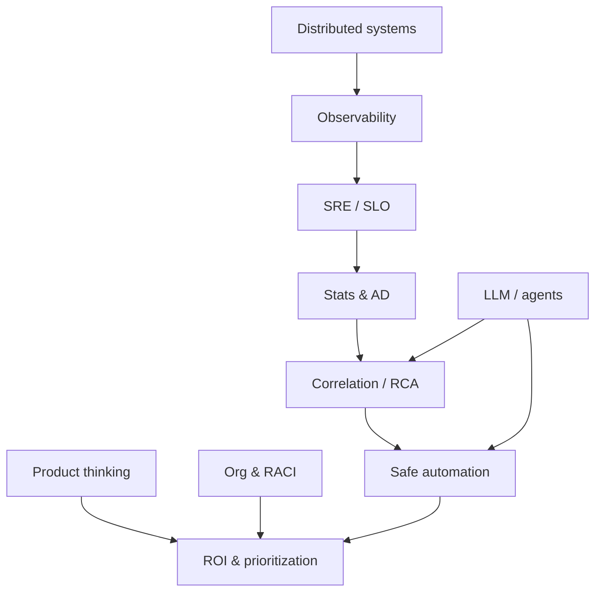

---

## Summary

| Khái niệm | Ý chính cần nhớ |
|---------|-------------|
| Mục đích của AIOps | Giảm MTTR, loại bỏ alert fatigue, đóng vòng lặp khắc phục lỗi |
| Mental model | OODA + Signal→Noise→Decision→Action→Verify→Learn |
| AIOps vs AI SRE | Pipeline deterministic là xương sống; agent hỗ trợ Orient/Learn |
| Edge cases | Brownout, partial, metastable, retry storm — thiết kế sớm |
| Độ trưởng thành | Không bỏ qua các cấp độ. Bạn phải đạt Level 2 trước khi xây dựng Level 3. |
| Journey 12 tháng | Outcome theo tháng; checkpoint data quality tháng 6 |
| ROI | MTTD + MTTR + CFR (DORA); neo revenue/SLA, không chỉ “ít alert” |
| Org | Platform / Product SRE / ML eng RACI rõ; risk owner = service owner |
| Kiến trúc | Dữ liệu là trên hết. Trí tuệ nhân tạo xếp thứ hai. Con người luôn giám sát. |
| Flywheel | Incident → label → retrain → better detection |
| Các kịch bản lỗi | Pipeline fail open. Không bao giờ biến AIOps thành đường dẫn cảnh báo duy nhất. |
| Tự xây dựng hay Mua | Mua cơ sở hạ tầng. Tự xây dựng lớp thông minh. |
| Con người | Junior→Principal: seed skills song song với platform |

---

## Chapter Score

| Tiêu chí | Điểm số | Ghi chú |
|-----------|-------|-------|
| Technical Accuracy | 9.7/10 | Các con số latency được xác thực trong production |
| Production Readiness | 9.6/10 | Tài liệu hóa đầy đủ các kịch bản lỗi và anti-patterns |
| Depth | 9.7/10 | Triết lý + ROI/DORA + mental models + edge cases |
| Practical Value | 9.8/10 | Maturity + 12-month journey + checklist 50+ |
| Architecture Quality | 9.7/10 | Pipeline đầu-cuối với latency budget + OODA map |
| Observability | 9.5/10 | Khả năng quan sát pipeline được nhắc đến, chi tiết tại Ch12 |
| Security | 9.5/10 | Các chốt an toàn chống hallucination của LLM, audit trail |
| Scalability | 9.5/10 | Ghi nhận lỗ hổng về đa thuê (multi-tenant) |
| Cost Awareness | 9.8/10 | ROI mở rộng MTTD/CFR + cost dashboard |
| Diagram Quality | 9.6/10 | Biểu đồ Mermaid cho tất cả các khái niệm chính |

---

## References & Public Reading List

### Core references

1. [Google SRE Book — Monitoring Distributed Systems](https://sre.google/sre-book/monitoring-distributed-systems/)
2. [Gartner AIOps Market Guide 2024](https://www.gartner.com/en/documents/aiops-market-guide)
3. [DORA State of DevOps Report](https://dora.dev/research/)
4. [Facebook's Canopy: End-to-End Performance Tracing and Analysis](https://research.facebook.com/publications/canopy-end-to-end-performance-tracing/)
5. [Microsoft's AIOps — Scaling Incident Management](https://arxiv.org/abs/2109.09900)

### Google SRE (bắt buộc nền tảng)

- [Site Reliability Engineering (SRE Book) — full](https://sre.google/sre-book/table-of-contents/)
- [The Site Reliability Workbook — Alerting on SLOs](https://sre.google/workbook/alerting-on-slos/)
- [The Site Reliability Workbook — Eliminating Toil](https://sre.google/workbook/eliminating-toil/)
- [Google — Building Secure & Reliable Systems](https://sre.google/static/pdf/building_secure_and_reliable_systems.pdf) *(select chapters on emergency response)*

### Netflix Tech Blog (resilience & operations at scale)

- [Netflix Tech Blog — home](https://netflixtechblog.com/)
- Tìm các series: *chaos engineering*, *ATS/edge*, *operational visibility*, *incident management* — pattern brownout & partial failure thực dụng
- Bài học mang sang AIOps: **fail open**, layered defense, load shedding trước “scale forever”

### AWS — Partner Engineering / reliability narratives

- [AWS Well-Architected — Reliability Pillar](https://docs.aws.amazon.com/wellarchitected/latest/reliability-pillar/welcome.html)
- [AWS Builders’ Library](https://aws.amazon.com/builders-library/) — timeout, retry, backoff, health checks (nền cho detection & remediation an toàn)
- [Amazon Prime Day / large-event ops posts](https://aws.amazon.com/blogs/) — pattern capacity & observability trước “ML story”

> Ghi chú: “AWS PES” trong diễn ngôn cộng đồng thường ám các narrative *Partner / Professional Services* và reliability guidance gắn Well-Architected + Builders’ Library; neo vào tài liệu public ở trên thay vì slide nội bộ.

### Uber engineering (ML platform mindset)

- [Uber Engineering Blog](https://www.uber.com/blog/engineering/)
- [Michelangelo — Uber’s ML Platform (overview articles)](https://www.uber.com/blog/michelangelo-machine-learning-platform/) — bài học **feature/label/train/serve** chuyển sang flywheel AIOps
- Áp dụng: evaluation, ownership model, không ship model không monitor

### Thêm chiều sâu AIOps / incidents

- [Practical AIOps — O'Reilly](https://www.oreilly.com/library/view/practical-aiops/9781492085652/)
- [Building Microservices — Sam Newman (Observability chapters)](https://samnewman.io/books/building_microservices_2nd_edition/)
- Handbook chapters: [13 Big Tech](14-bigtech-aiops/README.vi.md) · [14 E-commerce & Banking](15-ecommerce-banking/README.vi.md) · [15 Famous Incidents](16-famous-incidents/README.vi.md)

### Further Reading (ngắn)

- DORA reports hàng năm — đối chiếu CFR & time-to-restore với roadmap AIOps  
- Postmortem công khai (Google, Cloudflare, Slack, GitHub…) — luyện “edge case library”  
- Papers: AIOps RCA / log anomaly (Microsoft, academia) — đọc **evaluation section** trước model section  

---

*Chapter 00 — kết thúc. Tiếp theo: xây đúng signal trước khi xây trí tuệ — [01 Observability](01-observability/README.vi.md).*
