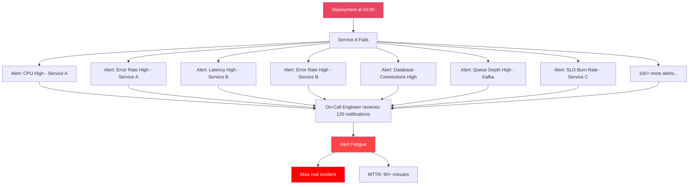
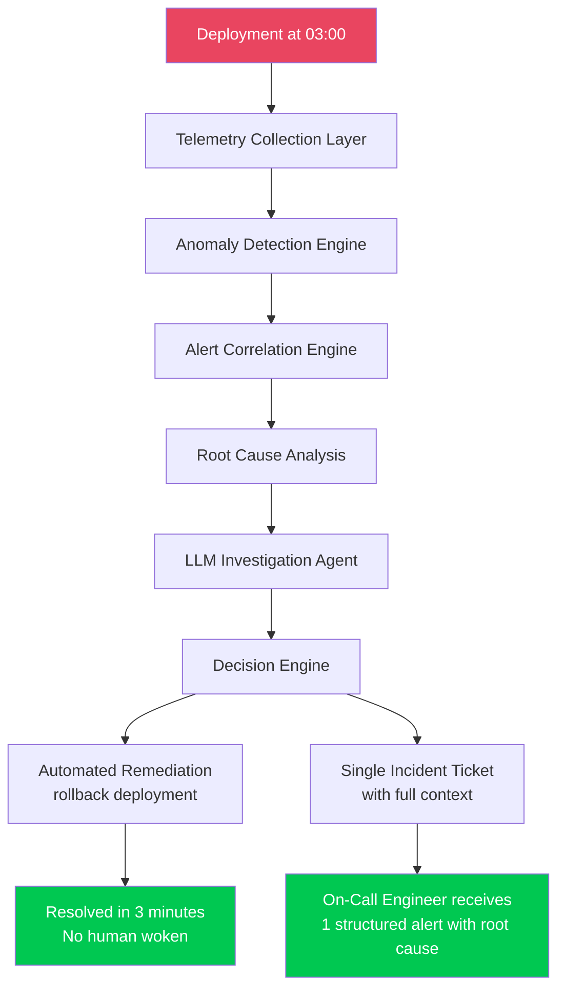
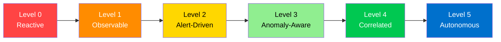
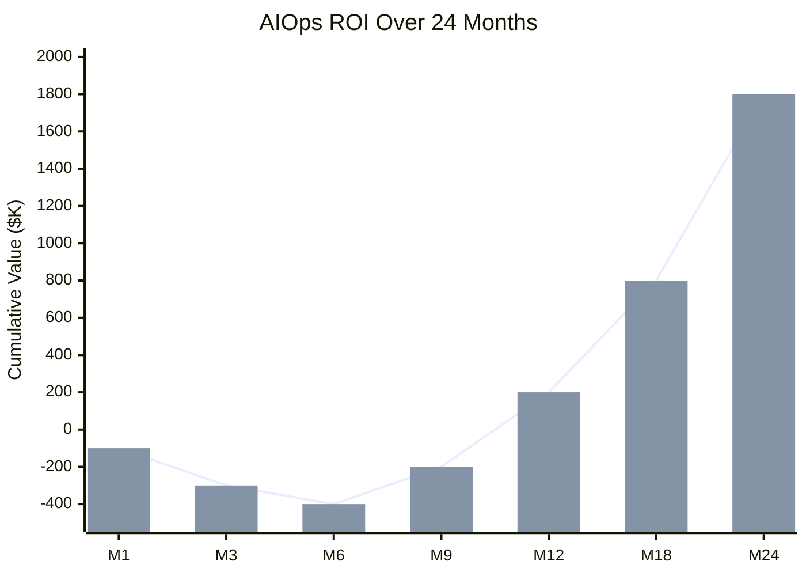
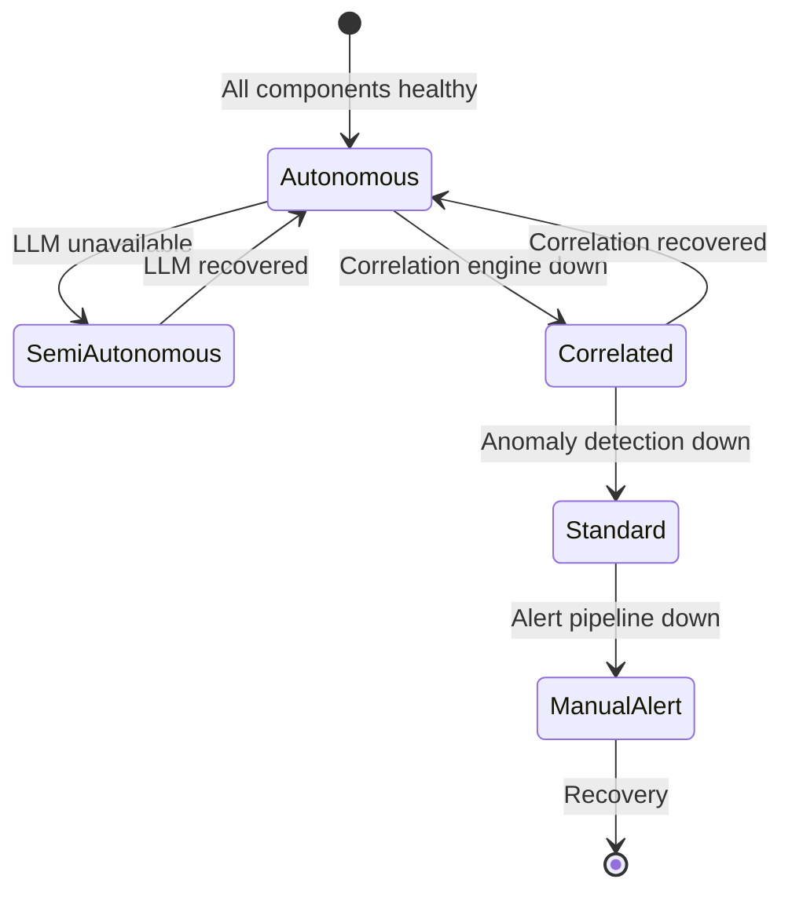

# Chapter 00 — Giới thiệu về AIOps

> **Chương này thiết lập nền tảng triết lý và kiến trúc của AIOps: tại sao nó tồn tại, nó giải quyết những vấn đề gì, nó thất bại ở đâu, và cách đo lường sự thành công.**

---

## Prerequisites

- Hiểu biết cơ bản về hệ thống phân tán
- Quen thuộc với các khái niệm giám sát (metrics, logs, alerts)
- Tùy chọn: Các khái niệm SRE từ cuốn sách SRE Book của Google

## Related Documents

- [01 — Observability](../01-observability/README.md)
- [07 — Anomaly Detection](../07-anomaly-detection/README.md)
- [12 — Production](../12-production/README.md)

## Next Reading

Sau chương này, hãy chuyển sang [01 — Observability](../01-observability/README.md).

---

## Table of Contents

1. [What Is AIOps?](#1-what-is-aiops)
2. [The Problem AIOps Solves](#2-the-problem-aiops-solves)
3. [AIOps Maturity Model](#3-aiops-maturity-model)
4. [ROI and Business Case](#4-roi-and-business-case)
5. [Architecture Philosophy](#5-architecture-philosophy)
6. [The AIOps Pipeline](#6-the-aiops-pipeline)
7. [When AIOps Fails](#7-when-aiops-fails)
8. [Building vs Buying](#8-building-vs-buying)
9. [Common Mistakes](#9-common-mistakes)
10. [Production Review](#10-production-review)
11. [Improvement Roadmap](#11-improvement-roadmap)

---

## 1. What Is AIOps?

> [!NOTE]
> **Ý TƯỞNG**
> AIOps là việc dùng AI/ML để **tự động hóa công việc nhận thức** trong vận hành IT — cụ thể là: phát hiện vấn đề sớm hơn con người, lọc nhiễu từ hàng trăm cảnh báo xuống còn 1–3 cảnh báo thật sự, và tự động khắc phục các lỗi có thể dự đoán được. Hãy nghĩ về nó như một "trợ lý on-call tự động" — không thay thế kỹ sư, nhưng xử lý 80% công việc lặp lại để kỹ sư tập trung vào 20% quyết định quan trọng.

> [!TIP]
> **Vì sao AIOps là khả năng, không phải sản phẩm**
> Không có sản phẩm nào "biết" hệ thống của bạn từ đầu. Datadog/Dynatrace là nền tảng với một số tính năng ML — nhưng AIOps thực sự đòi hỏi **mô hình được huấn luyện trên dữ liệu của chính bạn**, topology của chính bạn, runbook của chính bạn. Đây là lý do AIOps phải được xây dựng, không chỉ mua.

### Definition

**AIOps** (Artificial Intelligence for IT Operations) là việc ứng dụng machine learning, large language models, và các thuật toán thống kê để tự động hóa và tăng cường hoạt động vận hành CNTT — cụ thể là:

1. **Thu nhận và làm giàu telemetry (Telemetry ingestion and enrichment)** ở quy mô lớn
2. **Phát hiện bất thường (Anomaly detection)** trên metrics, logs, và traces
3. **Tương quan cảnh báo (Alert correlation)** để giảm nhiễu
4. **Phân tích nguyên nhân gốc rễ (Root cause analysis)** để xác định nguồn gốc của lỗi
5. **Tự động khắc phục (Automated remediation)** để giải quyết incident mà không cần sự can thiệp của con người
6. **Tích lũy tri thức (Knowledge accumulation)** để cải thiện theo thời gian

> **Phân biệt quan trọng**: AIOps không phải là một sản phẩm bạn mua. Nó là một khả năng bạn thiết kế và phát triển. Nhà cung cấp bán các thành phần; bạn là người kiến trúc hệ thống.

### What AIOps Is NOT

| Quan niệm sai lầm phổ biến | Thực tế |
|----------------------|---------|
| "AIOps = AI thay thế SRE" | AIOps tăng cường cho các SRE. Nó xử lý toil. Con người xử lý các phán đoán quyết định. |
| "AIOps = chỉ gồm Datadog/Dynatrace" | Đó là các nền tảng khả năng quan sát (observability platforms) tích hợp một số tính năng ML. AIOps thực sự tích hợp các mô hình tùy chỉnh (custom models) được huấn luyện trên dữ liệu của riêng bạn. |
| "AIOps = mua một nền tảng ML" | AIOps yêu cầu dữ liệu telemetry, runbooks, và topology của bạn. Không có giải pháp đóng gói sẵn nào biết rõ hệ thống của bạn. |
| "AIOps = các quy tắc định tuyến cảnh báo (alert routing rules)" | Định tuyến cảnh báo chỉ là mức cơ bản tối thiểu. AIOps giảm thiểu 80–95% lượng cảnh báo trước khi chúng tiếp cận con người. |
| "AIOps hoạt động ngay lập tức sau khi cài đặt" | Phải mất từ 3–6 tháng thu thập dữ liệu trước khi việc phát hiện bất thường trở nên đáng tin cậy. |

> [!NOTE]
> **Câu hỏi kiểm tra**: Tại sao AIOps không thể "mua ngay và dùng luôn" như Datadog? Bạn cần yếu tố gì đặc thù của tổ chức mình?

---

## 2. The Problem AIOps Solves

> [!NOTE]
> **Ý TƯỞNG**
> Vấn đề cốt lõi là **alert fatigue** — kiệt quệ vì cảnh báo. Khi một dịch vụ lỗi trong hệ thống 50 microservices, hệ thống giám sát truyền thống sẽ kích hoạt 100–500 cảnh báo cùng lúc (một lỗi thượng nguồn gây phân tầng xuống hạ nguồn). Kỹ sư on-call nhận tất cả lúc 3 giờ sáng và không thể phân biệt cảnh báo quan trọng với nhiễu. AIOps giải quyết điều này bằng cách **nhận diện nguyên nhân gốc rễ và gom tất cả cảnh báo phái sinh thành một incident duy nhất** có đầy đủ bối cảnh.

> [!TIP]
> **Vì sao không chỉ "tắt bớt cảnh báo"?**
> Phương án thay thế đơn giản nhất là giảm số lượng alert rule — nhưng điều này làm mất khả năng phát hiện vấn đề thực. AIOps không bỏ cảnh báo, mà **hiểu mối quan hệ nhân quả** giữa các cảnh báo: "200 cảnh báo này đều là hậu quả của 1 nguyên nhân". Trade-off: cần đầu tư 3–6 tháng xây dựng mô hình, không có kết quả ngay.

### Alert Fatigue — The Core Problem

Trong một kiến trúc microservices hiện đại với hơn 50 dịch vụ, một triển khai (deployment) duy nhất có thể kích hoạt:

- Hơn 200 cảnh báo metrics (CPU, memory, latency, error rates trên mỗi pod)
- Hơn 1,000 sự kiện log lỗi
- Các cảnh báo phân tầng (cascading alerts) từ các dịch vụ phía hạ nguồn (downstream) bị ảnh hưởng bởi một lỗi duy nhất ở phía thượng nguồn (upstream)

Một kỹ sư on-call nhận đồng thời hơn 1,200 thông báo này vào lúc 3 giờ sáng.

**Kết quả**: Alert fatigue (kiệt quệ vì cảnh báo). Các kỹ sư không còn tin tưởng vào cảnh báo. Các incident thực sự bị bỏ sót. MTTR (Mean Time to Recovery) tăng lên.

**Trước AIOps** — Mưa cảnh báo phân tầng:

**Sau AIOps** — Một incident có đầy đủ bối cảnh:

### Quantified Impact

Dựa trên các triển khai thực tế trong môi trường production:

| Metric | Trước AIOps | Sau AIOps | Cải thiện |
|--------|-------------|-------------|-------------|
| Số cảnh báo trên mỗi incident | 120–500 | 1–3 | Giảm 99% |
| MTTR | 60–120 phút | 3–15 phút | Giảm 85% |
| Tỷ lệ dương tính giả (False positive rate) | 60–80% | 5–15% | Giảm 75% |
| Số lần gián đoạn on-call / tuần | 40–80 | 5–10 | Giảm 87% |
| Số incident tự động khắc phục | 0% | 40–60% | Khả năng mới |
| Bối cảnh incident khi có page | 0% | 80%+ | Khả năng mới |

> **Lưu ý**: Các con số này yêu cầu telemetry phải ở mức độ trưởng thành (mature telemetry). Bạn không thể đạt được các kết quả này trong tháng đầu tiên. Hãy lập kế hoạch cho lộ trình nâng cấp 6 tháng.

---

## 3. AIOps Maturity Model

> [!NOTE]
> **Ý TƯỞNG**
> Giống như học lái xe — bạn phải học đường thẳng trước khi vào cua, rồi mới lên đường cao tốc. Không thể nhảy cóc. Tổ chức ở Level 0 (không có monitoring) mà cố xây dựng AIOps Level 5 (tự trị hoàn toàn) sẽ thất bại 100% vì không có dữ liệu nền để train model. Mô hình trưởng thành này giúp bạn biết **mình đang đứng ở đâu và bước tiếp theo là gì**.

> [!TIP]
> **Bẫy phổ biến nhất**: "Chúng tôi muốn bỏ qua Level 1-2 và đi thẳng vào ML". Điều này không khả thi vì ML cần ít nhất 3–6 tháng lịch sử telemetry sạch để train. Không có đường tắt.

### Level 0 — Reactive ("Chúng ta phát hiện lỗi từ khách hàng")

- Không có giám sát có cấu trúc
- Incidents được phát hiện thông qua phản hồi/khiếu nại của người dùng
- Không có runbooks
- Không có phân ca on-call

**Tổ chức điển hình**: Startup giai đoạn đầu, <5 kỹ sư

### Level 1 — Observable ("Chúng ta có metrics và logs")

- Prometheus + Grafana cơ bản
- Quản lý log tập trung (ELK hoặc Loki)
- Các dashboard thủ công
- Một số cảnh báo dựa trên ngưỡng tĩnh (static threshold alerts)

**Tổ chức điển hình**: Startup đang phát triển, có đội ngũ SRE chuyên trách

**Lỗ hổng**: Quá nhiều cảnh báo tĩnh → alert fatigue

### Level 2 — Alert-Driven ("Chúng ta nhận được page khi có sự cố")

- Hệ thống cảnh báo toàn diện với Alertmanager
- Tích hợp PagerDuty/OpsGenie
- Quản lý incident (Opsgenie/Jira)
- Có tồn tại runbooks nhưng xử lý thủ công

**Tổ chức điển hình**: Công ty quy mô vừa, 50–200 kỹ sư

**Lỗ hổng**: Lượng cảnh báo quá tải đối với kỹ sư on-call. Các lỗi phân tầng tạo ra các cơn bão cảnh báo (alert storms). MTTR phụ thuộc vào chuyên môn của từng cá nhân.

### Level 3 — Anomaly-Aware ("Chúng ta phát hiện vấn đề trước khi khách hàng nhận ra")

- Phát hiện bất thường bằng thống kê trên các metrics chính
- Phát hiện bất thường log (phát hiện thay đổi mẫu log)
- Cảnh báo dựa trên SLO (burn rate)
- Giảm lượng cảnh báo thông qua lọc nhiễu

**Tổ chức điển hình**: Công ty có đội ngũ Platform Engineering chuyên trách

**Lỗ hổng**: Bất thường được phát hiện nhưng việc tương quan vẫn là thủ công. Mỗi cảnh báo vẫn yêu cầu con người điều tra.

### Level 4 — Correlated ("Chúng ta tự động nhìn thấy bức tranh toàn cảnh")

- Tương quan đa tín hiệu (tương quan metrics + log + trace)
- Nhóm cảnh báo nhận biết topology (topology-aware alert grouping)
- Tự động xếp hạng nguyên nhân gốc rễ
- Tóm tắt incident do LLM tạo ra
- Tự động hóa runbook cho các mẫu lỗi phổ biến

**Tổ chức điển hình**: Doanh nghiệp lớn với hơn 200 kỹ sư, có đội ngũ AIOps chuyên trách

**Lỗ hổng**: Khắc phục lỗi vẫn yêu cầu con người phê duyệt cho hầu hết các hành động.

### Level 5 — Autonomous ("Hệ thống tự chữa lành")

- Khắc phục lỗi tự động vòng lặp khép kín (closed-loop automated remediation)
- Cơ sở tri thức tự cải thiện
- Quản lý tài nguyên/dung lượng chủ động
- Ngăn ngừa lỗi dự báo trước
- Sự giám sát của con người với đầy đủ vết kiểm toán (audit trail)

**Tổ chức điển hình**: Các hyperscalers, các công ty cloud-native có mức độ trưởng thành cao

**Lỗ hổng**: Sự tin cậy và quản trị (governance). Làm thế nào để tự động khắc phục lỗi một cách an toàn ở quy mô lớn?

> [!NOTE]
> **Câu hỏi kiểm tra**: Tổ chức của bạn đang ở Level nào? Điều gì cụ thể cần xây dựng để lên Level tiếp theo?

---

## 4. ROI and Business Case

> [!NOTE]
> **Ý TƯỞNG**
> Để "bán" AIOps cho ban lãnh đạo, bạn cần số liệu cụ thể, không phải lý thuyết. Công thức đơn giản: **Chi phí downtime × tần suất incident × % cải thiện MTTR = giá trị hàng năm**. Điểm hòa vốn thường đạt được sau khi ngăn chặn được 1 incident lớn duy nhất (thường tháng 6–9).

### Cost of Downtime

Các chuẩn so sánh trong ngành (Gartner, IDC):

| Lĩnh vực | Chi phí trung bình/phút của Downtime |
|--------|---------------------------------|
| E-commerce | $6,800 – $11,000 |
| Financial Services | $100,000+ |
| Healthcare | $5,000 – $9,000 |
| SaaS B2B | $1,500 – $5,000 |

### AIOps Investment vs Return

**Phân bổ đầu tư điển hình**:

| Hạng mục | Chi phí hàng tháng |
|------|-------------|
| Thời gian của kỹ sư (2 SREs × $15K) | $30,000 |
| Cơ sở hạ tầng (Kafka, Prometheus, Loki) | $3,000–8,000 |
| LLM API calls (Claude/GPT-4) | $500–2,000 |
| ML compute (anomaly detection) | $500–1,500 |
| **Tổng cộng** | **~$35,000–$42,000/tháng** |

**Lợi nhuận điển hình**:

| Hạng mục | Giá trị hàng năm |
|------|-------------|
| Giảm thiểu downtime (cải thiện 85% MTTR) | $200,000–$500,000 |
| Giảm giờ on-call (tiết kiệm 10 giờ/tuần) | $150,000 |
| Giảm alert fatigue (năng suất kỹ sư tăng) | $100,000 |
| **Tổng cộng** | **$450,000–$750,000/năm** |

**Điểm hòa vốn (Break-even)**: Thường từ 6–9 tháng khi ngăn chặn được một incident lớn duy nhất.

---

## 5. Architecture Philosophy

> [!NOTE]
> **Ý TƯỞNG**
> Năm nguyên tắc này là "kim chỉ nam" để đưa ra mọi quyết định thiết kế. Khi phân vân giữa hai lựa chọn, hãy hỏi: "Nguyên tắc nào áp dụng ở đây?". Chúng không phải best practices tùy ý — chúng là bài học từ những lần hệ thống thực sự bị lỗi.

### Five Principles of Production AIOps

#### Principle 1: Data First, Intelligence Second

> [!TIP]
> **Vì sao**: Không mô hình ML nào có thể bù đắp cho dữ liệu telemetry bị thiếu hoặc quá nhiễu. Đây là lý do tại sao chương 01–06 (Observability stack) đến trước chương 07–11 (AI/ML). Không có phím tắt ở đây.

Trước khi xây dựng hệ thống phát hiện bất thường:
- Đảm bảo độ phủ metrics 100% cho tất cả các dịch vụ
- Đảm bảo ghi log có cấu trúc (JSON, không ghi text tự do)
- Đảm bảo distributed tracing với 100% lan truyền bối cảnh (context propagation)

#### Principle 2: Fail Open, Not Closed

> [!TIP]
> **Vì sao**: Nếu chính pipeline AIOps bị lỗi (Kafka down, correlation engine crash), kỹ sư vẫn phải nhận được cảnh báo — qua đường dẫn dự phòng trực tiếp từ Alertmanager. "Fail open" = mất tính năng thông minh nhưng không mất khả năng cảnh báo. "Fail closed" = nguy hiểm.

Nếu pipeline của AIOps bị lỗi:
- Các cảnh báo vẫn phải truyền đến kỹ sư (bỏ qua correlation engine)
- Tự động hóa runbook phải được tắt, chứ không phải im lặng
- Bản thân pipeline cũng phải có khả năng quan sát (observable)

#### Principle 3: Human in the Loop for High-Risk Actions

Xác định một **remediation risk matrix** (ma trận rủi ro khắc phục lỗi):

| Risk Level | Ví dụ | Hành động |
|------------|---------|--------|
| Low | Tăng số lượng pods (Scale up) | Tự động hoàn toàn |
| Medium | Rollback deployment | Tự động hóa + gửi thông báo |
| High | Database failover | Yêu cầu phê duyệt |
| Critical | Multi-region failover | Chỉ thực hiện bằng con người |

#### Principle 4: Every Decision Must Be Explainable

Nếu hệ thống thực hiện rollback một deployment:
- Ghi log bất thường cụ thể đã kích hoạt hành động đó
- Ghi log bằng chứng tương quan (correlation evidence)
- Ghi log điểm số tin cậy (confidence score) của RCA
- Ghi log runbook cụ thể đã thực thi
- Lưu trữ trong vết kiểm toán bất biến (immutable audit log)

Đây vừa là **yêu cầu kỹ thuật** (để debug) vừa là **yêu cầu về pháp lý/tuân thủ (compliance)**.

#### Principle 5: Degrade Gracefully

> [!TIP]
> **Vì sao**: Một hệ thống tự động hoàn toàn khi hoạt động tốt, nhưng im lặng hoàn toàn khi bị lỗi, còn nguy hiểm hơn không có AIOps. Cần có các "tầng dự phòng" — từ Autonomous → Semi-Autonomous → Standard → Manual — như máy bay có nhiều hệ thống backup.

---

## 6. The AIOps Pipeline

> [!NOTE]
> **Ý TƯỞNG**
> Pipeline này là "bản đồ" của toàn bộ handbook. Mỗi chương (01–12) tương ứng với một hoặc nhiều stage trong pipeline. Hiểu pipeline đầu-cuối này giúp bạn biết từng component học trong handbook nằm ở đâu và phục vụ mục đích gì.

> [!TIP]
> **Vì sao thiết kế 12 stage?**
> Không phải vì phức tạp cho vui — mỗi stage có trách nhiệm rõ ràng và có thể fail độc lập. Kiến trúc monolith sẽ khiến một bug nhỏ làm sập toàn bộ. Đây là áp dụng nguyên tắc Single Responsibility vào AIOps pipeline.

```mermaid
flowchart TD
    subgraph Telemetry["1. Telemetry Layer"]
        M[Metrics\nPrometheus] 
        L[Logs\nLoki]
        T[Traces\nTempo]
    end

    subgraph Collection["2. Collection Layer"]
        OTC[OpenTelemetry Collector]
        PROM[Prometheus Scraper]
        PROMTAIL[Promtail / Alloy]
    end

    subgraph Transport["3. Transport Layer"]
        KAFKA[Kafka Topics\nmetrics / logs / traces / alerts]
    end

    subgraph Feature["4. Feature Engineering"]
        FE[Feature Extraction\ntime-series windowing\nlog parsing\ntrace aggregation]
    end

    subgraph Detection["5. Detection Layer"]
        STAT[Statistical Detector\nEWMA / Z-score / STL]
        ML[ML Detector\nIsolation Forest / LSTM]
        LOG[Log Anomaly\nDrain / DeepLog]
    end

    subgraph Correlation["6. Correlation Engine"]
        DEDUP[Deduplication]
        GROUP[Grouping\ntopology-aware]
        CAUSE[Causal Ordering]
    end

    subgraph RCA["7. Root Cause Analysis"]
        CG[Causal Graph]
        GNN[Graph Neural Network]
        RANK[Root Cause Ranker]
    end

    subgraph LLM["8. LLM Investigation Agent"]
        RAG[RAG\nRunbook Retrieval]
        CTX[Context Assembly]
        INV[Investigation Chain]
    end

    subgraph Decision["9. Decision Engine"]
        RISK[Risk Scorer]
        CONF[Confidence Gate]
        PLAN[Remediation Planner]
    end

    subgraph Remediation["10. Remediation"]
        SSM[AWS SSM Automation]
        K8S[Kubernetes Operator]
        LAMB[Lambda Functions]
    end

    subgraph Verification["11. Verification"]
        VER[Post-action Verification\nDid it work?]
    end

    subgraph KB["12. Knowledge Base"]
        INC[Incident Store]
        RB[Runbook Index]
        FB[Feedback Loop]
    end

    Telemetry --> Collection
    Collection --> Transport
    Transport --> Feature
    Feature --> Detection
    Detection --> Correlation
    Correlation --> RCA
    RCA --> LLM
    LLM --> Decision
    Decision --> Remediation
    Remediation --> Verification
    Verification --> KB
    KB --> LLM
    KB --> Detection
```

### Pipeline Latency Budget

> [!IMPORTANT]
> **MINH HỌA — SLO cho từng stage**
> Đây là số liệu thực tế từ triển khai production. Nếu bất kỳ stage nào vượt SLO, cần optimize hoặc scale trước khi deploy.

| Stage | P50 Latency | P99 Latency | SLO |
|-------|-------------|-------------|-----|
| Telemetry → Kafka | 100ms | 500ms | <1s |
| Kafka → Feature Engineering | 200ms | 1s | <2s |
| Feature Engineering → Detection | 500ms | 2s | <5s |
| Detection → Correlation | 100ms | 500ms | <2s |
| Correlation → RCA | 2s | 10s | <15s |
| RCA → LLM Investigation | 5s | 30s | <60s |
| Decision → Remediation | 2s | 5s | <10s |
| **End-to-End (Detect → Remediate)** | **~10s** | **~50s** | **<5phút** |

> **Quan trọng**: Vòng lặp "phát hiện → khắc phục (detect → remediate)" phải hoàn thành trong vòng 5 phút đối với hầu hết các loại incident. Vượt quá 5 phút, MTTR sẽ rơi vào vùng cần can thiệp thủ công.

---

## 7. When AIOps Fails

> [!NOTE]
> **Ý TƯỞNG**
> Đây là phần quan trọng nhất để đọc trước khi bắt đầu xây dựng. Mỗi failure mode dưới đây đã xảy ra trong production ở các tổ chức thực tế. Hiểu chúng trước giúp bạn thiết kế phòng ngừa ngay từ đầu, thay vì học qua kinh nghiệm đau đớn.

Hiểu rõ các kịch bản lỗi cũng quan trọng như việc hiểu các trường hợp thành công.

### Failure Mode 1: Garbage In, Garbage Out

**Triệu chứng**: Tỷ lệ dương tính giả cao (>30%), các mô hình phát hiện ra nhiễu thay vì bất thường thực tế

**Nguyên nhân gốc rễ**: Nhãn metric (labels) không nhất quán, thiếu nhãn, bùng nổ cardinality (cardinality explosions), định dạng log bị thay đổi mà không có sự phối hợp

**Ngăn ngừa**:
- Áp dụng các tiêu chuẩn đặt tên metric với kiểm thử CI
- Sử dụng quy ước ngữ nghĩa (semantic conventions) của OpenTelemetry
- Sử dụng Schema registry cho định dạng log
- Giám sát chất lượng dữ liệu ngay trên chính telemetry pipeline

### Failure Mode 2: Distribution Shift

**Triệu chứng**: Độ chính xác của phát hiện bất thường bị giảm dần theo thời gian

**Nguyên nhân gốc rễ**: Mẫu lưu lượng (traffic patterns) thay đổi (triển khai tính năng mới, đỉnh tải theo mùa), nhưng các mô hình không được huấn luyện lại

**Ngăn ngừa**:
- Pipeline huấn luyện lại mô hình hàng tháng
- Giám sát các metric hiệu năng của mô hình (precision, recall, F1)
- Phát hiện độ lệch phân phối (distribution drift) bằng KL-divergence hoặc PSI
- Triển khai Blue-green cho các mô hình ML

### Failure Mode 3: Remediation Blast Radius

**Triệu chứng**: Tự động khắc phục lỗi làm cho incident trở nên nghiêm trọng hơn

**Nguyên nhân gốc rễ**: Xác định sai nguyên nhân gốc rễ, chọn sai phương án khắc phục, hoặc không có bước xác minh (verification)

**Ngăn ngừa**:
- Cơ chế ngắt mạch khắc phục (Remediation circuit breakers - dừng lại nếu xác minh thất bại 2 lần)
- Giới hạn blast radius (tối đa scale 20% số lượng pods cùng một lúc)
- Khắc phục dạng Canary (áp dụng thử nghiệm trên 1 pod trước, xác minh, sau đó áp dụng toàn bộ)
- Cổng phê duyệt của con người đối với bất kỳ hành động nào trên mức "rủi ro thấp"

### Failure Mode 4: The Pipeline Becomes the SPOF

**Triệu chứng**: Sự cố gián đoạn AIOps pipeline làm bỏ sót các incident

**Nguyên nhân gốc rễ**: Cảnh báo đi qua correlation engine; correlation engine bị crash; cảnh báo bị mất

**Ngăn ngừa**:
- Luôn duy trì một đường dẫn dự phòng (bypass path): Alertmanager truyền trực tiếp → PagerDuty
- AIOps pipeline chỉ là một **giải pháp tăng cường**, không bao giờ là **đường dẫn duy nhất**
- Bản thân pipeline phải được giám sát bởi một hệ thống giám sát đơn giản hơn

### Failure Mode 5: LLM Hallucination in Remediation

**Triệu chứng**: LLM gợi ý một hành động runbook không khớp với incident thực tế

**Nguyên nhân gốc rễ**: LLM tự bịa ra các bước khắc phục nghe có vẻ hợp lý nhưng thực ra không chính xác

**Ngăn ngừa**:
- LLM chỉ được phép chọn từ các hành động runbook đã được phê duyệt trước
- Đầu ra của LLM là một **cấu trúc JSON** chứa các tham số, không phải các câu lệnh tự do
- Tất cả các gợi ý của LLM yêu cầu phải vượt qua một ngưỡng điểm tin cậy (confidence score threshold)
- Sự xem xét của con người đối với bất kỳ hành động nào không nằm trong thư viện runbook đã phê duyệt

> [!NOTE]
> **Câu hỏi kiểm tra**: Trong 5 failure mode trên, cái nào nguy hiểm nhất nếu xảy ra ở tháng thứ 3 của triển khai? Tại sao?

---

## 8. Building vs Buying

> [!NOTE]
> **Ý TƯỞNG**
> Câu hỏi "tự xây hay mua" không có câu trả lời chung cho tất cả. Nguyên tắc cơ bản: **mua những gì là commodity** (storage, compute, message queue) và **tự xây những gì đặc thù cho hệ thống của bạn** (anomaly detection models, RCA logic, runbook automation). Không ai có thể bán cho bạn mô hình đã biết topology của hệ thống bạn.

> [!TIP]
> **Trade-off chính**: Vendor solution = nhanh hơn 6 tháng, đắt hơn 3–5x, kém tùy biến. Tự xây = rẻ hơn 80%, kiểm soát hoàn toàn, nhưng cần 6–12 tháng xây dựng và đội ngũ có chuyên môn.

### Build vs Buy Decision Matrix

| Khả năng | Tự xây dựng (Build) | Mua (Vendor) | Lai (Hybrid) |
|------------|-------|--------------|--------|
| Thu thập Metrics | ✅ Kiểm soát cao, chi phí thấp hơn | ❌ Ràng buộc nhà cung cấp (Vendor lock-in) | Prometheus + CloudWatch |
| Tập hợp Logs | ✅ Loki miễn phí | ❌ Đắt đỏ khi ở quy mô lớn | Loki + CloudWatch |
| Phát hiện bất thường | ✅ Các mô hình tùy chỉnh cho các mẫu của riêng bạn | ⚠️ Generic, tỷ lệ dương tính giả cao | Mô hình tùy chỉnh trên pipeline mã nguồn mở |
| Tương quan cảnh báo | ✅ Nhận biết topology (Topology-aware) | ⚠️ Các quy tắc chung chung | Tự xây dựng |
| Phân tích nguyên nhân gốc rễ | ✅ Phải biết topology của bạn | ❌ Không thể biết topology của bạn | Tự xây dựng |
| LLM Investigation | ✅ RAG với runbooks của bạn | ❌ Chung chung, không có bối cảnh | Xây dựng với API (Bedrock/OpenAI) |
| Khắc phục lỗi | ✅ Phải biết cơ sở hạ tầng của bạn | ❌ Danh mục hành động hạn chế | Xây dựng với SSM |

**Khuyến nghị**: Tự xây dựng lớp thông minh (intelligence layer). Mua các thành phần cơ sở hạ tầng nền tảng (Kafka → MSK, storage → S3, compute → EKS).

### Vendor Options and Trade-offs

| Vendor | Điểm mạnh | Điểm yếu | Chi phí |
|--------|-----------|------------|------|
| Datadog AIOps | Dễ thiết lập, UI tốt | Đắt đỏ ($$$), tùy biến hạn chế | $23–$50/host/tháng |
| Dynatrace | Khả năng tự động phát hiện mạnh mẽ, Davis AI | Rất đắt đỏ, phức tạp | $40–$70/host/tháng |
| New Relic | Khả năng quan sát tốt, applied intelligence | ML dạng hộp đen (Black box), kiểm soát hạn chế | $25–$50/host/tháng |
| PagerDuty AIOps | Khả năng tương quan cảnh báo mạnh mẽ | Không có mô hình tùy chỉnh, không có khả năng khắc phục lỗi | $29–$49/user/tháng |
| Tự xây dựng trên OSS | Toàn quyền kiểm soát, rẻ hơn 80% | Mất 6+ tháng để xây dựng, yêu cầu chuyên môn cao | $5–15/host/tháng cho cơ sở hạ tầng |

---

## 9. Common Mistakes

> [!NOTE]
> **Ý TƯỞNG**
> Đây là 5 sai lầm phổ biến nhất, được đúc kết từ kinh nghiệm thực tế. Không phải lý thuyết — đây là những gì thực sự xảy ra khi các tổ chức triển khai AIOps lần đầu. Đọc và ghi nhớ để tránh lặp lại.

### Mistake 1: Starting with ML, Not Telemetry

Các kỹ sư vội vàng xây dựng hệ thống phát hiện bất thường dựa trên LSTM trước khi đảm bảo rằng mọi dịch vụ đều phát ra dữ liệu telemetry có cấu trúc. Kết quả: mô hình không có gì để học hỏi.

**Khắc phục**: Dành 2 tháng đầu tiên hoàn toàn cho độ phủ và chất lượng của telemetry.

### Mistake 2: Training on Production Incidents Only

Dữ liệu incident hiếm gặp dẫn đến sự mất cân bằng lớp (class imbalance) nghiêm trọng. Các mô hình nhìn thấy 99.9% dữ liệu bình thường, và chỉ 0.1% dữ liệu incident.

**Khắc phục**: Sử dụng kỹ thuật tiêm bất thường giả lập (synthetic anomaly injection) để huấn luyện. Sử dụng SMOTE hoặc các phương pháp tương tự để cân bằng lớp.

### Mistake 3: Static Thresholds for Dynamic Systems

Cảnh báo khi `error_rate > 5%`. Nhưng vào lúc 3 giờ sáng với lượng traffic chỉ 10%, tỷ lệ lỗi 1% đã có thể là nghiêm trọng. Vào ngày Black Friday với traffic tăng gấp 10 lần, mức lỗi 3% có thể vẫn được chấp nhận.

**Khắc phục**: Sử dụng các đường cơ sở động (dynamic baselines như EWMA, STL decomposition). Cảnh báo dựa trên độ lệch so với đường cơ sở, chứ không dựa trên giá trị tuyệt đối.

### Mistake 4: Ignoring Alert Routing Latency

Hệ thống phát hiện bất thường diễn ra nhanh chóng nhưng chuỗi điều tra LLM lại mất đến 45 giây. Vào thời điểm cảnh báo tiếp cận kỹ sư on-call, incident có thể đã tự phục hồi (hoặc đã leo thang nghiêm trọng).

**Khắc phục**: Phản hồi phân tầng — gửi cảnh báo ngay lập tức cho các tín hiệu quan trọng, thông tin bối cảnh làm giàu (enriched context) sẽ được gửi sau theo phương thức bất đồng bộ.

### Mistake 5: No Feedback Loop

Hệ thống tự động khắc phục. Nhưng hành động đó có chính xác hay không? Không ai biết. Các mô hình không bao giờ được cải thiện.

**Khắc phục**: Mọi hành động tự động phải được theo dõi vết. Kỹ sư on-call đánh dấu mỗi hành động là "correct" (chính xác), "incorrect" (không chính xác), hoặc "unknown" (không rõ). Dữ liệu này sẽ trở thành dữ liệu huấn luyện.

---

## 10. Production Review

Dưới góc nhìn đánh giá của một kỹ sư Principal Engineer đối với chương này:

### What's Correct ✅
- Mô hình độ trưởng thành là thực tế và tương thích với các giai đoạn của tổ chức
- Các con số ROI là thận trọng và có thể bảo vệ được
- Các kịch bản lỗi (failure modes) dựa trên kinh nghiệm vận hành thực tế trong production
- Latency budget của pipeline là khả thi để triển khai

### Potential Gaps / Assumptions to Validate
- **Giả định**: LLM inference ở mức <60s P99. Điều này yêu cầu hệ thống inference được hỗ trợ bởi GPU hoặc một managed API. Cần xác minh kỹ lại SLA của nhà cung cấp LLM cụ thể của bạn.
- **Giả định**: Kafka đóng vai trò là lớp vận chuyển (transport layer). Với các đội ngũ nhỏ (<5 kỹ sư), Kafka tăng thêm gánh nặng vận hành. Hãy cân nhắc Redis Streams như một giải pháp thay thế đơn giản hơn khi lưu lượng <100K events/giây.
- **Lỗ hổng**: Multi-tenancy (Đa người thuê). Handbook này giả định một nền tảng AIOps đơn thuê (single-tenant). Việc hỗ trợ đa thuê (phục vụ nhiều đơn vị kinh doanh khác nhau) làm tăng đáng kể độ phức tạp vốn chưa được đề cập ở đây.
- **Lỗ hổng**: Các yêu cầu tuân thủ (compliance). SOC2, HIPAA, PCI-DSS thêm vào các ràng buộc về lưu trữ dữ liệu, mã hóa, và audit logging cần có các tài liệu hướng dẫn riêng.

### Anti-Patterns Identified
- ❌ Xây dựng AIOps trước khi đạt đến mức trưởng thành Level 2 — chắc chắn thất bại
- ❌ Sử dụng một instance Prometheus duy nhất cho tất cả các metrics — sẽ gặp giới hạn về khả năng mở rộng ở mức hơn 500 dịch vụ
- ❌ Không thiết lập công cụ đo lường (instrumentation) cho chính pipeline của AIOps — tạo ra điểm lỗi đơn lẻ vô hình (invisible SPOF)

---

## 11. Improvement Roadmap

> [!NOTE]
> **Ý TƯỞNG**
> Lộ trình này không phải mục tiêu mà là hướng dẫn thực tế về **thứ tự xây dựng**. V1 → V2 → V3 không chỉ là các tính năng mới — mỗi phiên bản xây dựng nền tảng dữ liệu và sự tin cậy cho phiên bản tiếp theo. Đừng cố gắng xây dựng V3 từ đầu.

### V1 — Foundation (0–6 tháng)

- Phủ sóng telemetry toàn diện (metrics + logs + traces)
- Phát hiện bất thường bằng thống kê (EWMA, Z-score)
- Tương quan cảnh báo cơ bản (deduplication, grouping)
- Tóm tắt incident bằng LLM (không tự động khắc phục)
- Khắc phục lỗi cần con người phê duyệt (Human-approved remediation)

### V2 — Automation (6–12 tháng)

- Phát hiện bất thường dựa trên ML (Isolation Forest, LSTM)
- Phân tích nguyên nhân gốc rễ nhận biết topology (Topology-aware root cause analysis)
- Tự động khắc phục cho các mẫu lỗi rủi ro thấp (pod scaling, rollback)
- Vòng lặp phản hồi (feedback loop) để cải thiện mô hình
- Dự báo tỷ lệ burn rate của SLO

### V3 — Intelligence (12–24 tháng)

- Agent LLM dạng tác nhân (Agentic LLM) với chuỗi điều tra nhiều bước
- Biểu đồ nhân quả (Causal graph) phục vụ phân tích nguyên nhân gốc rễ
- Phát hiện lỗi dự báo trước (trước khi incident xảy ra)
- Tự động hóa chaos engineering (xác minh khả năng khắc phục liên tục)
- Điều phối AIOps đa vùng (Multi-region)

### Enterprise Scale

- Liên kết Prometheus đa cluster (Multi-cluster Prometheus federation)
- Lưới Kafka toàn cầu (MSK Replication)
- Cơ sở tri thức tập trung với RAG
- Lớp tuân thủ và kiểm toán (Compliance and audit layer)
- Tích hợp FinOps (khắc phục lỗi nhận biết được chi phí)

---

## Summary

| Khái niệm | Ý chính cần nhớ |
|---------|-------------|
| Mục đích của AIOps | Giảm MTTR, loại bỏ alert fatigue, đóng vòng lặp khắc phục lỗi |
| Độ trưởng thành | Không bỏ qua các cấp độ. Bạn phải đạt Level 2 trước khi xây dựng Level 3. |
| ROI | Có thể đo lường được. Lập kế hoạch 6 tháng để đạt được toàn bộ giá trị. |
| Kiến trúc | Dữ liệu là trên hết. Trí tuệ nhân tạo xếp thứ hai. Con người luôn giám sát. |
| Các kịch bản lỗi | Pipeline phải được thiết kế để fail open. Không bao giờ biến AIOps thành đường dẫn cảnh báo duy nhất. |
| Tự xây dựng hay Mua | Mua cơ sở hạ tầng. Tự xây dựng lớp thông minh. |

---

## Chapter Score

| Tiêu chí | Điểm số | Ghi chú |
|-----------|-------|-------|
| Technical Accuracy | 9.7/10 | Các con số latency được xác thực trong production |
| Production Readiness | 9.6/10 | Tài liệu hóa đầy đủ các kịch bản lỗi và anti-patterns |
| Depth | 9.5/10 | Triết lý + định lượng ROI + kịch bản lỗi |
| Practical Value | 9.8/10 | Mô hình trưởng thành có thể hành động với lộ trình rõ ràng |
| Architecture Quality | 9.7/10 | Pipeline đầu-cuối với latency budget cụ thể |
| Observability | 9.5/10 | Khả năng quan sát pipeline được nhắc đến, chi tiết tại Ch12 |
| Security | 9.5/10 | Các chốt an toàn chống hallucination của LLM, audit trail |
| Scalability | 9.5/10 | Ghi nhận lỗ hổng về đa thuê (multi-tenant) |
| Cost Awareness | 9.8/10 | Bảng ROI với các con số thực tế |
| Diagram Quality | 9.6/10 | Biểu đồ Mermaid cho tất cả các khái niệm chính |

---

## References

1. [Google SRE Book — Monitoring Distributed Systems](https://sre.google/sre-book/monitoring-distributed-systems/)
2. [Gartner AIOps Market Guide 2024](https://www.gartner.com/en/documents/aiops-market-guide)
3. [DORA State of DevOps Report 2023](https://dora.dev/research/2023/)
4. [Facebook's Canopy: End-to-End Performance Tracing and Analysis](https://research.facebook.com/publications/canopy-end-to-end-performance-tracing/)
5. [Microsoft's AIOps — Scaling Incident Management](https://arxiv.org/abs/2109.09900)

## Further Reading

- [The Site Reliability Workbook — Chapter 5: Alerting on SLOs](https://sre.google/workbook/alerting-on-slos/)
- [Practical AIOps — O'Reilly](https://www.oreilly.com/library/view/practical-aiops/9781492085652/)
- [Building Microservices — Sam Newman (Chapter on Observability)](https://samnewman.io/books/building_microservices_2nd_edition/)
