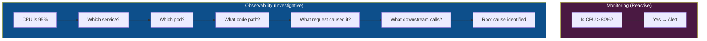
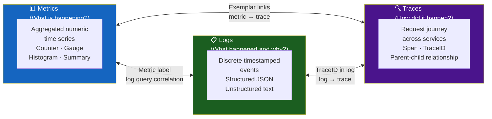
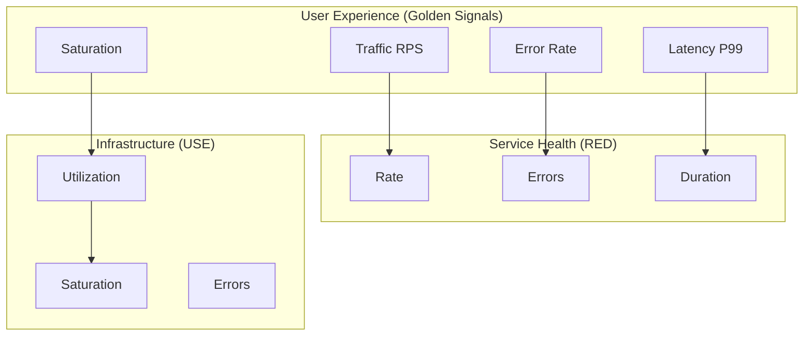
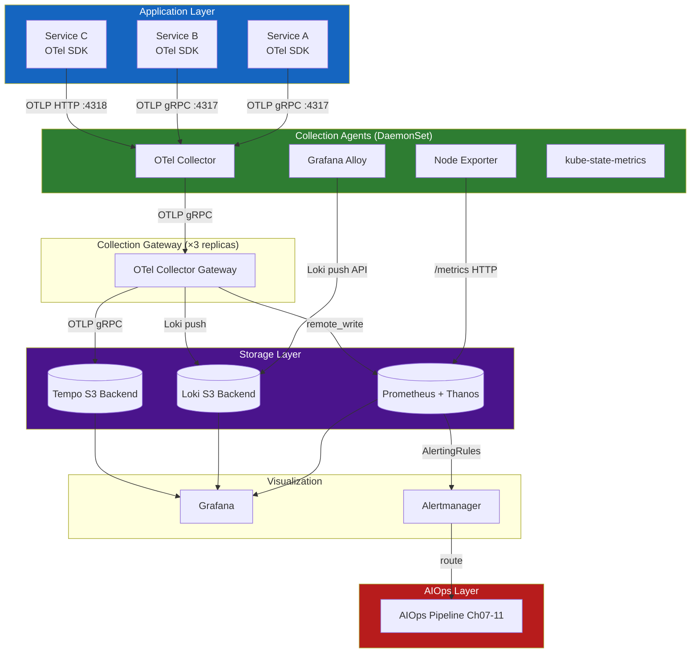
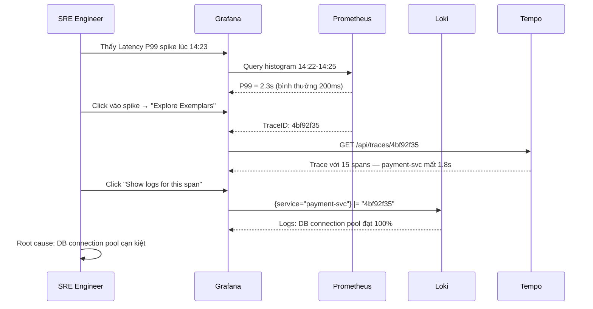
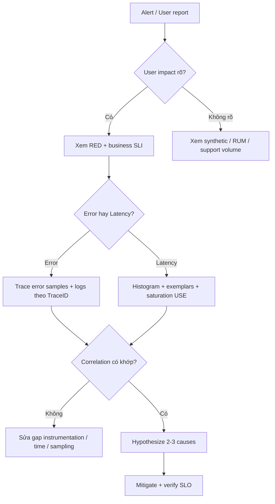
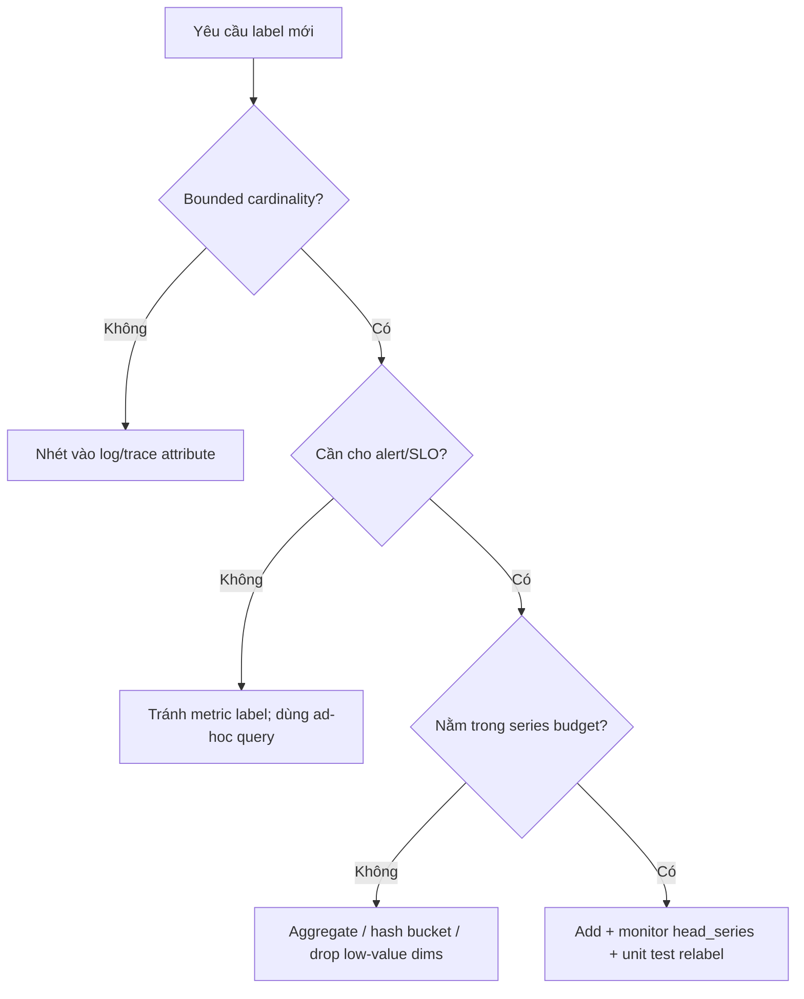
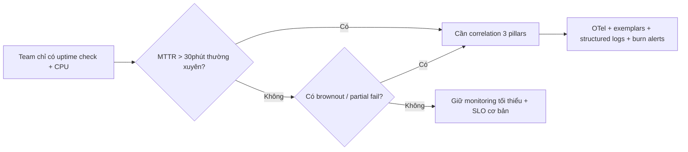

# Chapter 01 — Observability

> **Khả năng quan sát (Observability) là nền tảng mà mọi khả năng của AIOps được xây dựng dựa trên đó. Không có telemetry chất lượng cao, không có thuật toán nào, không có LLM nào, và không có tự động hóa nào có thể đáng tin cậy.**

---

## Prerequisites

- Quen thuộc với kiến trúc microservices
- Hiểu biết cơ bản về Prometheus, Grafana, hoặc các công cụ tương tự
- Khuyến nghị: [00 — Introduction to AIOps](../00-introduction.vi.md)

## Related Documents

- [02 — OpenTelemetry](../02-opentelemetry/README.vi.md) — pipeline thu thập
- [03 — Prometheus](../03-prometheus/README.vi.md) — lưu trữ metrics
- [04 — Loki](../04-loki/README.vi.md) — lưu trữ logs
- [05 — Tempo](../05-tempo/README.vi.md) — lưu trữ traces
- [07 — Anomaly Detection](../07-anomaly-detection/README.vi.md) — tiêu thụ dữ liệu khả năng quan sát

## Next Reading

Sau chương này, hãy chuyển sang [02 — OpenTelemetry](../02-opentelemetry/README.vi.md).

---

## Table of Contents

1. [The Three Pillars of Observability](#1-the-three-pillars-of-observability)
2. [Metrics — Deep Dive](#2-metrics--deep-dive)
3. [Logs — Deep Dive](#3-logs--deep-dive)
4. [Traces — Deep Dive](#4-traces--deep-dive)
5. [The Fourth Signal — Profiles](#5-the-fourth-signal--profiles)
6. [Golden Signals vs RED vs USE](#6-golden-signals-vs-red-vs-use)
7. [SLI, SLO, SLA, Error Budget](#7-sli-slo-sla-error-budget)
8. [Observability Architecture](#8-observability-architecture)
9. [Instrumentation Strategy](#9-instrumentation-strategy)
10. [Correlation — Connecting the Three Pillars](#10-correlation--connecting-the-three-pillars)
11. [Data Cardinality — The Silent Killer](#11-data-cardinality--the-silent-killer)
12. [Observability Platform Design](#12-observability-platform-design)
13. [Production Best Practices](#13-production-best-practices)
14. [Common Mistakes](#14-common-mistakes)
15. [Monitoring the Monitoring Stack](#15-monitoring-the-monitoring-stack)
16. [Scaling Observability](#16-scaling-observability)
17. [Security](#17-security)
18. [Cost Management](#18-cost-management)
19. [Tư duy problem-solving trong production](#19-tư-duy-problem-solving-trong-production)
20. [Edge cases thực tế](#20-edge-cases-thực-tế)
21. [Decision trees](#21-decision-trees)
22. [Bài học từ Big Tech / public incidents](#22-bài-học-từ-big-tech--public-incidents)
23. [Câu hỏi Socratic cho on-call](#23-câu-hỏi-socratic-cho-on-call)
24. [Improvement experiments (30/60/90 ngày)](#24-improvement-experiments-306090-ngày)
25. [Production Review](#25-production-review)
26. [Improvement Roadmap](#26-improvement-roadmap)

---

## 1. The Three Pillars of Observability

> [!NOTE]
> **Ý TƯỞNG**
> **Monitoring** giống như đèn báo trên bảng điều khiển xe — nó nói "có lỗi". **Observability** giống như hộp đen máy bay — nó cho phép bạn tái dựng lại chính xác điều gì đã xảy ra và tại sao. AIOps cần Observability, không chỉ Monitoring, vì nó cần tự động **hiểu nguyên nhân**, không chỉ **phát hiện triệu chứng**.

> [!TIP]
> **Vì sao 3 cột trụ thay vì 1?**
> Mỗi loại telemetry trả lời một câu hỏi khác nhau và không thể thay thế cho nhau: Metrics cho biết *cái gì đang xảy ra* (nhanh, cheap, có thể tổng hợp), Logs cho biết *tại sao* (verbose, expensive, có đầy đủ context), Traces cho biết *như thế nào* (luồng request qua toàn hệ thống). AIOps cần cả 3 vì không một loại nào đủ để xác định root cause một mình.

Khả năng quan sát (Observability) **không** giống như giám sát (monitoring).

- **Monitoring** trả lời: "Hệ thống có hoạt động không? Metric cụ thể này có vượt quá ngưỡng hay không?"
- **Observability** trả lời: "Tại sao hệ thống lại hoạt động như thế này? Trạng thái bên trong nào đã gây ra triệu chứng bên ngoài này?"

Sự phân biệt này rất quan trọng đối với AIOps: monitoring tạo ra cảnh báo. Observability tạo ra sự hiểu biết.



### The Three Pillars



> [!NOTE]
> **Câu hỏi kiểm tra**: Nếu latency P99 tăng đột ngột, bạn dùng loại telemetry nào trước? Sau đó dùng gì để tìm nguyên nhân? Cuối cùng xem cái gì để hiểu luồng request đầy đủ?

---

## 2. Metrics — Deep Dive

### 2.1 What Are Metrics?

> [!NOTE]
> **Ý TƯỞNG**
> Metric là một **con số được tổng hợp theo thời gian**, được gán nhãn để có thể lọc/nhóm. Thay vì lưu "mỗi request mất bao lâu" (quá nhiều), bạn lưu "1000 requests trong 5 phút, 80% dưới 50ms, 99% dưới 200ms" — đây là Histogram. Hãy nghĩ về nó như báo cáo thống kê tóm tắt, không phải log chi tiết.

Một metric là một **phép đo số học được tổng hợp theo thời gian** và được xác định bởi một tập hợp các nhãn (labels).

**Ví dụ đọc Prometheus metric format**:
```
# HELP http_requests_total Total number of HTTP requests
# TYPE http_requests_total counter
http_requests_total{method="GET",endpoint="/api/users",status="200",service="user-svc"} 12345
http_requests_total{method="POST",endpoint="/api/orders",status="500",service="order-svc"} 42
```

**Các thành phần của một metric**:
- **Name**: `http_requests_total` — những gì được đo lường
- **Labels**: `{method, endpoint, status, service}` — các chiều dữ liệu để lọc/nhóm
- **Value**: `12345` — giá trị đo lường
- **Timestamp**: mili giây tính từ epoch

### 2.2 Metric Types

#### Counter

> [!NOTE]
> **Ý TƯỞNG**
> Counter như đồng hồ đo km trên xe — chỉ tăng, không giảm (trừ khi reset). Giá trị raw counter không có ý nghĩa; điều bạn quan tâm là **tốc độ tăng** (rate). Ví dụ: "12345 total requests" không nói lên gì, nhưng "25 requests/giây trong 5 phút qua" thì có nghĩa.

> [!TIP]
> **Vì sao dùng rate() thay vì giá trị thô?** Counter reset về 0 khi service restart. `rate()` xử lý reset này một cách chính xác — nếu counter reset từ 1000 về 0, rate() biết đây là reset, không phải số âm.

Một giá trị số **chỉ tăng**. Không bao giờ giảm (ngoại trừ khi khởi động lại tiến trình).

```
http_requests_total{...} 0 → 1 → 2 → 100 → 101 ...
```

**Sử dụng cho**: requests served, bytes transmitted, errors occurred, tasks completed.

**Cách truy vấn** — luôn dùng `rate()` hoặc `increase()`:

```promql
# Tốc độ requests/giây trong cửa sổ 5 phút — ĐÂY LÀ CÁCH ĐÚNG
rate(http_requests_total[5m])

# Tổng tăng trong 1 giờ — hữu ích cho báo cáo tổng hợp
increase(http_requests_total[1h])
```

#### Gauge

> [!NOTE]
> **Ý TƯỞNG**
> Gauge như nhiệt kế — có thể tăng hoặc giảm tùy ý, đọc giá trị trực tiếp tại thời điểm bất kỳ. Dùng cho những thứ hiện tại như: bộ nhớ đang dùng, số kết nối đang mở, độ dài queue.

Một giá trị có thể **tăng hoặc giảm một cách tùy ý**.

```
memory_usage_bytes{pod="user-svc-abc123"} 536870912  # 512MB
cpu_usage_cores{pod="user-svc-abc123"} 0.85
active_connections{service="db"} 42
```

```promql
# Dùng giá trị trực tiếp — đây là bộ nhớ hiện tại tính theo GB
container_memory_usage_bytes{pod=~"user-svc.*"} / 1024 / 1024 / 1024

# Xem mức cao nhất trong 1 giờ qua — phát hiện memory spike tạm thời
max_over_time(container_memory_usage_bytes{pod=~"user-svc.*"}[1h])
```

#### Histogram

> [!NOTE]
> **Ý TƯỞNG**
> Hãy nghĩ về Histogram như kiểm tra tốc độ xe trên đường: không chỉ "trung bình 60km/h", mà là "có bao nhiêu xe đi dưới 40, 40–80, trên 80". Histogram phân loại requests vào các "ô tốc độ" (buckets) để tính P95/P99 chính xác — thứ quan trọng hơn nhiều so với latency trung bình.

> [!TIP]
> **Vì sao không dùng average latency?** Average bị kéo bởi outlier. Nếu 99% request mất 50ms và 1% mất 10s, average có thể là 150ms — trông bình thường nhưng thực ra 1% user đang rất khổ. P99 bắt được điều này.
>
> **Histogram vs Summary**: Summary tính quantile chính xác ở client nhưng **không thể aggregate** across nhiều replicas. Histogram aggregate được nhưng quantile là xấp xỉ. Với hệ thống phân tán nhiều replicas → chọn Histogram.

**Ví dụ đọc Histogram data** (1000 requests):

| Bucket | Đếm tích lũy | Ý nghĩa |
|--------|-------------|---------|
| le=0.005 (5ms) | 100 | 10% requests xong trong 5ms |
| le=0.05 (50ms) | 800 | 80% requests xong trong 50ms |
| le=0.1 (100ms) | 950 | 95% requests xong trong 100ms |
| le=0.25 (250ms) | 990 | 99% requests xong trong 250ms |
| le=1.0 (1s) | 1000 | 100% requests xong trong 1s |

```
http_request_duration_seconds_bucket{le="0.005"} 100
http_request_duration_seconds_bucket{le="0.05"}  800
http_request_duration_seconds_bucket{le="0.1"}   950
http_request_duration_seconds_bucket{le="0.25"}  990
http_request_duration_seconds_bucket{le="1.0"}   1000
http_request_duration_seconds_sum   45.234    # tổng thời gian
http_request_duration_seconds_count 1000      # tổng số requests
```

**Truy vấn P95 và P99**:

```promql
# P95 latency — 95% requests xong trong bao lâu?
histogram_quantile(0.95, rate(http_request_duration_seconds_bucket[5m]))

# P99 latency chia theo service — tìm service nào chậm nhất
histogram_quantile(0.99,
  sum by (service, le) (
    rate(http_request_duration_seconds_bucket[5m])
  )
)
```

**Chọn bucket boundaries** — cần nghĩ trước khi code:

```yaml
# API nội bộ (target < 50ms) — buckets dày quanh target
buckets: [0.001, 0.005, 0.01, 0.025, 0.05, 0.1, 0.25, 0.5, 1.0, 2.5]

# API user-facing (target < 500ms)
buckets: [0.01, 0.025, 0.05, 0.1, 0.25, 0.5, 1.0, 2.5, 5.0, 10.0]

# Batch jobs (target < 5min)
buckets: [1, 5, 10, 30, 60, 120, 300, 600, 1800]
```

> **Lưu ý**: Native Histograms (Prometheus 2.40+) tránh cần định nghĩa buckets trước. Xem [03 — Prometheus Architecture](../03-prometheus/README.vi.md).

#### Summary

Tương tự như Histogram, nhưng tính toán các quantiles **ở phía client**.

**Histogram vs Summary — Bảng so sánh quyết định**:

| Chiều so sánh | Histogram | Summary |
|-----------|-----------|---------|
| Độ chính xác quantile | Xấp xỉ (phụ thuộc vào bucket) | Chính xác |
| Aggregate nhiều replicas | ✅ Được — dùng `histogram_quantile()` | ❌ Không được tổng hợp |
| Chi phí client | Thấp | Cao hơn (streaming quantile algorithm) |
| **Khuyến nghị** | **Dùng cho production** | Tránh dùng cho distributed services |

### 2.3 Metric Naming Conventions

> [!NOTE]
> **Ý TƯỞNG**
> Đặt tên metric nhất quán như đặt tên biến trong code — nếu mỗi dev đặt tên khác nhau, không ai tìm được metric cần tìm. OpenTelemetry Semantic Conventions là "coding style guide" cho metric names.

Tuân thủ [Prometheus naming conventions](https://prometheus.io/docs/practices/naming/):

```
# Pattern: <namespace>_<subsystem>_<name>_<unit>

# ✅ ĐÚNG — rõ ràng, có đơn vị
http_server_request_duration_seconds
http_server_requests_total
process_resident_memory_bytes

# ❌ SAI — không có đơn vị, mơ hồ
request_time
memory
errors
```

**Quy ước nhãn tiêu chuẩn** (OpenTelemetry Semantic Conventions):

```yaml
# HTTP
http_method: GET | POST | PUT | DELETE
http_route: /api/users/{id}  # Template, không phải giá trị thực
http_status_code: "200" | "404" | "500"

# Service identity
service_name: user-service
service_version: "1.4.2"
service_namespace: production

# Kubernetes
k8s_namespace_name: production
k8s_pod_name: user-svc-abc123
k8s_node_name: ip-10-0-1-50
```

---

## 3. Logs — Deep Dive

### 3.1 What Are Logs?

> [!NOTE]
> **Ý TƯỞNG**
> Log là **bản ghi chi tiết của từng sự kiện** — trong khi metric chỉ nói "có 42 lỗi trong 5 phút qua", log nói "lỗi thứ 42 xảy ra lúc 14:23:45, do user john@example.com, sau 3 lần retry, với stack trace cụ thể này". Log là nguồn sự thật cuối cùng để debug, nhưng cũng tốn kém nhất.

### 3.2 Structured vs Unstructured Logs

> [!TIP]
> **Vì sao bắt buộc phải có Structured Logs cho AIOps?** Hệ thống phát hiện bất thường log (Drain, DeepLog) tiêu thụ **các trường dữ liệu có cấu trúc**, không phải text thuần. Nếu log là free-text, ML model không thể parse, không thể group theo `error.type`, không thể correlate với trace. Unstructured log = dead end cho AIOps.

**❌ Unstructured Log (Anti-Pattern)**:
```
2024-01-15 14:23:45 ERROR Failed to process order 12345 for user john@example.com after 3 retries
```
- Parsing rất dễ gãy (regex hell)
- Không thể lọc theo trường cụ thể hiệu quả
- Không có schema mà máy đọc được

**✅ Structured Log (Bắt buộc cho AIOps)**:

```json
{
  "timestamp": "2024-01-15T14:23:45.123Z",
  "level": "ERROR",
  "service": "order-service",
  "trace_id": "4bf92f3577b34da6a3ce929d0e0e4736",
  "span_id": "00f067aa0ba902b7",
  "order_id": "ord-12345",
  "event": "order_processing_failed",
  "error": {
    "type": "PaymentGatewayTimeoutError",
    "message": "Gateway did not respond within 3000ms"
  },
  "retry_count": 3,
  "duration_ms": 9234
}
```

**Tại sao `trace_id` trong log là bắt buộc**: Đây là "sợi chỉ đỏ" kết nối log → trace → span. Không có `trace_id`, bạn không thể biết "log lỗi này" thuộc về "request nào trong trace". Xem [Section 10 — Correlation](#10-correlation--connecting-the-three-pillars).

### 3.3 Log Severity Levels

| Cấp độ | Khi nào sử dụng | Tạo cảnh báo? |
|-------|-------------|--------|
| TRACE | Debug cấp độ code rất chi tiết | Không bao giờ |
| DEBUG | Thông tin chẩn đoán cho developer | Không bao giờ |
| INFO | Sự kiện vận hành bình thường | Không bao giờ |
| WARN | Lỗi đã được xử lý, hệ thống tiếp tục | Chỉ nếu kéo dài liên tục |
| ERROR | Lỗi trong một request cụ thể | Có — nếu tỷ lệ lỗi cao |
| CRITICAL | Lỗi cấp độ service, nguy cơ mất data | Có — ngay lập tức |
| FATAL | Hệ thống không thể tiếp tục, sẽ crash | Có — P1 ngay lập tức |

> **Quy tắc production**: Chỉ log ERROR khi cần điều tra. Log WARN cho lỗi tạm thời đã được dự liệu trước (có thể retry). Đừng log ERROR nếu bạn mong retry sẽ thành công.

### 3.4 Log Volume and Sampling

> [!NOTE]
> **Ý TƯỞNG**
> Tại 10,000 req/giây, log INFO tạo ra ~600MB/phút. Đây là chi phí thực tế của việc "log mọi thứ":
>
> `10,000 req/s × 1KB/log × 60s = 600MB/phút = 864GB/ngày`
>
> Tại $0.50/GB của CloudWatch: **$432/ngày = $157,680/năm chỉ cho INFO logs**

**Chiến lược lấy mẫu (Sampling)**:

| Chiến lược | Cách thức | Trường hợp sử dụng |
|----------|-----|----------|
| Head-based | Lấy mẫu % tại điểm vào | Giảm dung lượng đồng đều |
| Tail-based | 100% cho ERROR/chậm | Giữ lại sự kiện quan trọng |
| Adaptive | Tỷ lệ động theo error rate | Cân bằng chi phí/coverage |

**Chiến lược production khuyến nghị**:
- `INFO`: Lấy mẫu 10% (hoặc 1% cho lưu lượng rất cao)
- `WARN`: Lấy mẫu 100%
- `ERROR` + `CRITICAL` + `FATAL`: Lấy mẫu 100% + alert ngay

### 3.5 Log Labels in Loki

> [!TIP]
> **Vì sao cardinality label của Loki quan trọng**: Loki đánh chỉ mục nhãn (labels), không đánh chỉ mục nội dung log. Nhãn có cardinality cao (user_id, trace_id, request_id) = hàng triệu chỉ mục = Loki crash. Để trace_id trong **nội dung log**, không phải label.

```yaml
# ✅ Nhãn tốt — cardinality thấp, hữu ích để lọc
labels:
  service: order-service
  environment: production
  level: ERROR

# ❌ Nhãn xấu — giết Loki
labels:
  user_id: "user-789"          # Hàng triệu giá trị duy nhất
  trace_id: "4bf92f3577b..."   # Unique per request
  order_id: "ord-12345"        # Unique per order
```

**Quy tắc**: Nhãn nên có cardinality < 10,000 giá trị duy nhất.

---

## 4. Traces — Deep Dive

### 4.1 What Are Traces?

> [!NOTE]
> **Ý TƯỞNG**
> Trace là **bản đồ hành trình của một request** qua toàn bộ hệ thống phân tán — như GPS tracking cho một đơn hàng từ kho → giao hàng. Mỗi "chặng" (service) được ghi lại thành một **span** với thời gian bắt đầu/kết thúc, tạo ra bức tranh toàn cảnh "request này mất 2 giây, trong đó 1.8 giây bị kẹt ở database".

```mermaid
gantt
    title Trace: Order Placement Request (TraceID: 4bf92f35)
    dateFormat  SSS
    axisFormat %Lms

    section API Gateway
    Receive + Auth        :0, 15

    section Order Service
    Parse + Validate      :15, 80

    section Inventory Service
    Check Stock           :22, 45

    section Database
    INSERT order          :52, 78

    section Payment Service
    Charge Card           :80, 180

    section Notification
    Send Email            :182, 220
```

### 4.2 Span Data Structure

Mỗi span là một JSON object chứa toàn bộ thông tin về một "chặng" trong trace:

```json
{
  "traceId": "4bf92f3577b34da6a3ce929d0e0e4736",
  "spanId": "00f067aa0ba902b7",
  "parentSpanId": "b9c7c989f97918e1",
  "operationName": "order-service.createOrder",
  "startTime": 1705329825050000,
  "duration": 65000,
  "status": { "code": "ERROR", "message": "Inventory check failed" },
  "resource": {
    "service.name": "order-service",
    "k8s.pod.name": "order-svc-abc123"
  },
  "attributes": {
    "http.method": "POST",
    "http.status_code": 422,
    "order.id": "ord-12345"
  }
}
```

### 4.3 Context Propagation

> [!IMPORTANT]
> **MINH HỌA — Tại sao context propagation là điều kiện "make or break"**
>
> Distributed tracing chỉ hoạt động nếu `TraceID` được truyền qua **mọi** service call. Chỉ cần 1 service không truyền header → chuỗi trace bị đứt gãy → bạn có trace chỉ đến service đó, không biết nó gọi gì tiếp theo.
>
> ```
> Service A → [traceparent header] → Service B → [traceparent header] → Service C ✅
> Service A → [traceparent header] → Service B → ❌ quên truyền → Service C ← trace bị mất
> ```

**W3C TraceContext** (tiêu chuẩn hiện đại):
```
traceparent: 00-4bf92f3577b34da6a3ce929d0e0e4736-00f067aa0ba902b7-01
              ^  ^TraceID (128-bit)                ^SpanID (64-bit) ^Flags
              Version
```

**B3 Headers** (Zipkin, legacy):
```
X-B3-TraceId: 4bf92f3577b34da6a3ce929d0e0e4736
X-B3-SpanId: 00f067aa0ba902b7
X-B3-Sampled: 1
```

> **Yêu cầu**: Bắt buộc áp dụng context propagation khi code review và bằng automated tests. Không có shortcuts.

### 4.4 Trace Sampling Strategies

> [!TIP]
> **Vì sao tail-based sampling là khuyến nghị cho production?**
> Với 10,000 req/giây và head sampling 1%: nếu một request quan trọng bị lỗi, xác suất nó được sample là 1% → 99% lần bạn sẽ mất đúng cái trace bạn cần. Tail-based sampling đợi trace hoàn tất mới quyết định — "có lỗi? Giữ lại 100%. Bình thường? Sample 10%."

| Chiến lược | Mô tả | Ưu điểm | Nhược điểm | Dùng khi |
|----------|-------------|------|------|---------|
| **Head-Based** | Quyết định tại điểm đầu vào | Đơn giản, chi phí thấp | Bỏ sót traces quan trọng | Lưu lượng thấp |
| **Tail-Based** | Quyết định sau khi trace hoàn tất | Giữ lại toàn bộ lỗi | Tốn RAM/CPU hơn | **Production** (khuyến nghị) |
| **Probabilistic** | % ngẫu nhiên (ví dụ: 1%) | Dung lượng dự đoán được | Bỏ sót sự kiện hiếm | Lưu lượng cực cao |
| **Adaptive** | Tỷ lệ động theo error rate | Cân bằng tốt nhất | Phức tạp nhất | Nền tảng trưởng thành |

**Cấu hình tail-based trong OTel Collector** (giữ nguyên YAML — đây là config cần thiết):

```yaml
processors:
  tail_sampling:
    decision_wait: 10s        # Đợi đủ spans trước khi quyết định
    num_traces: 100000        # Số traces giữ trong memory
    expected_new_traces_per_sec: 1000
    policies:
      - name: errors          # Luôn giữ traces có lỗi
        type: status_code
        status_code: {status_codes: [ERROR]}
      
      - name: slow-traces     # Luôn giữ traces chậm (> 1 giây)
        type: latency
        latency: {threshold_ms: 1000}
      
      - name: normal-sample   # Sample 10% traffic bình thường
        type: probabilistic
        probabilistic: {sampling_percentage: 10}
```

---

## 5. The Fourth Signal — Profiles

> [!NOTE]
> **Ý TƯỞNG**
> Traces cho biết "service nào chậm" — profiles cho biết "dòng code nào trong service đó gây chậm". Đây là cấp độ debug sâu nhất: không chỉ "payment-service mất 200ms" mà còn "trong đó 120ms do hàm `validateInventory()` gọi SQL N+1 queries".

```
Trace: order-service.createOrder → 200ms
  ↓ (tại sao 200ms?)
Profile: 
  - 120ms in validateInventory()
    - 80ms in db.query() → SQL là N+1
    - 40ms in JSON serialization
  - 50ms in updateOrderStatus()
  - 30ms in publishKafkaEvent()
```

### Tools

| Công cụ | Mô tả | Storage Backend |
|------|-------------|----------------|
| **Pyroscope** (Grafana) | Continuous profiling, tích hợp Grafana | S3 / local |
| **Parca** | Open-source, eBPF-based | S3 |
| **AWS CodeGuru Profiler** | Managed service, hỗ trợ Java/.NET | AWS |

**Tích hợp với Traces**: Grafana 10+ hỗ trợ liên kết từ trace spans → profiles cho cùng thời điểm.

---

## 6. Golden Signals vs RED vs USE

> [!NOTE]
> **Ý TƯỞNG**
> Ba phương pháp luận này giúp trả lời câu hỏi "Tôi cần đo lường cái gì?". Không cần chọn một — chúng bổ sung cho nhau ở các lớp khác nhau: **Golden Signals** cho trải nghiệm người dùng, **RED** cho health của từng microservice, **USE** cho health của cơ sở hạ tầng.

Ba phương pháp luận để xác định những gì cần đo lường. Mỗi phương pháp hướng tới đối tượng người dùng khác nhau.

### The Four Golden Signals (Google SRE)

Thiết kế cho các **dịch vụ hướng người dùng**. Được định nghĩa trong Google SRE Book.

| Tín hiệu | Định nghĩa | Ví dụ PromQL |
|--------|------------|-------------|
| **Latency** | Thời gian phục vụ request. Phân biệt latency thành công vs lỗi. | `histogram_quantile(0.99, rate(http_request_duration_seconds_bucket[5m]))` |
| **Traffic** | Nhu cầu đặt lên hệ thống (RPS) | `rate(http_requests_total[5m])` |
| **Errors** | Tỷ lệ requests thất bại | `rate(http_requests_total{status=~"5.."}[5m]) / rate(http_requests_total[5m])` |
| **Saturation** | Mức độ "đầy" của hệ thống | `container_cpu_usage_seconds_total / container_cpu_limits_seconds_total` |

### RED Method (Tom Wilkie / Weaveworks)

Thiết kế cho **microservices**. Là tập con của Golden Signals.

| Metric | Định nghĩa |
|--------|------------|
| **Rate** | Số requests/giây |
| **Errors** | Tỷ lệ lỗi (%) |
| **Duration** | Phân phối thời gian phản hồi (P50, P95, P99) |

**Sử dụng RED làm điểm khởi đầu mặc định** cho bất kỳ microservice mới nào.

### USE Method (Brendan Gregg)

Thiết kế cho **resource/infrastructure monitoring**.

| Metric | Định nghĩa | Ví dụ |
|--------|-----------|---------|
| **Utilization** | Thời gian tài nguyên bận rộn | CPU: 75% |
| **Saturation** | Queue length khi quá tải | CPU run queue length |
| **Errors** | Số lỗi phần cứng | Disk I/O errors |

USE áp dụng cho: CPU, memory, disk I/O, network interfaces, Kubernetes nodes.

### Kết hợp cả ba — Bức tranh đầy đủ



---

## 7. SLI, SLO, SLA, Error Budget

> [!NOTE]
> **Ý TƯỞNG**
> Đây là bộ khái niệm để đo lường **độ tin cậy một cách định lượng**. Thay vì "hệ thống hoạt động tốt", bạn có thể nói "99.9% requests thành công trong <500ms trong 30 ngày qua, và chúng tôi còn 43 phút downtime nữa trong ngân sách tháng này." Con số cụ thể này là nền tảng cho cảnh báo thông minh và AIOps.

### Definitions

| Thuật ngữ | Tên đầy đủ | Định nghĩa | Bên sở hữu |
|------|-----------|------------|----------|
| **SLI** | Service Level Indicator | Số đo thực tế. Một metric cụ thể. | Engineering team |
| **SLO** | Service Level Objective | Mục tiêu: "99.9% requests có latency < 500ms" | Engineering + PM |
| **SLA** | Service Level Agreement | Cam kết hợp đồng với khách hàng. Thường thấp hơn SLO 1–2%. | Business/Legal |
| **Error Budget** | — | 100% trừ SLO. Lượng lỗi được phép. | Engineering + PM |

### SLI Examples

```yaml
# Availability SLI — tỷ lệ requests thành công
sli_availability:
  numerator: "http_requests_total{status!~'5..'}"   # requests KHÔNG có lỗi 5xx
  denominator: "http_requests_total"                 # tổng requests

# Latency SLI — tỷ lệ requests nhanh hơn 500ms
sli_latency:
  numerator: "http_request_duration_seconds_bucket{le='0.5'}"
  denominator: "http_request_duration_seconds_count"
```

### Error Budget Calculation

> [!IMPORTANT]
> **MINH HỌA — Tính Error Budget**
>
> ```
> SLO = 99.9% availability (tháng 30 ngày)
> Error Budget = 100% - 99.9% = 0.1%
>
> Thời gian trong tháng = 30 × 24 × 60 × 60 = 2,592,000 giây
> Budget downtime = 2,592 giây = 43.2 phút
>
> Tại 1,000 req/giây:
> Tổng requests = 2,592,000,000
> Số lỗi tối đa được phép = 2,592,000 requests
> ```

### Burn Rate Alerting

> [!NOTE]
> **Ý TƯỞNG**
> **Burn rate** là tốc độ bạn "đốt" ngân sách lỗi. Burn rate = 1x nghĩa là bạn đang đốt đúng tốc độ bình thường (ngân sách sẽ hết sau 30 ngày). Burn rate = 10x nghĩa là ngân sách sẽ hết sau 3 ngày. Cảnh báo dựa trên burn rate thông minh hơn cảnh báo theo ngưỡng tĩnh vì nó tính đến **tốc độ** không chỉ giá trị hiện tại.

> [!TIP]
> **Tại sao ngưỡng tĩnh (static threshold) không đủ?** Error rate 0.2% nghe bình thường, nhưng nếu SLO là 99.9% (error budget = 0.1%), thì 0.2% đang đốt budget gấp đôi tốc độ — ngân sách tháng sẽ hết trong 15 ngày!

```
burn_rate = current_error_rate / (1 - SLO)

Ví dụ: SLO = 99.9% → error budget = 0.1%
current_error_rate = 1%
burn_rate = 1% / 0.1% = 10x

Tháng sẽ cạn trong: 30 ngày / 10 = 3 ngày → CRITICAL!
```

**Multi-window burn-rate alerting** (khuyến nghị của Google):

```yaml
# Cảnh báo khi đốt nhanh VÀ kéo dài (hai điều kiện đồng thời)
- alert: SLOBurnRateCritical
  expr: |
    (
      job:http_request_error_rate:rate1h{job="user-svc"} > (14.4 * 0.001)
      and
      job:http_request_error_rate:rate5m{job="user-svc"} > (14.4 * 0.001)
    )
  labels:
    severity: critical
  annotations:
    summary: "Burn rate 14.4x — budget sẽ cạn trong 2 giờ"

- alert: SLOBurnRateHigh
  expr: |
    (
      job:http_request_error_rate:rate6h{job="user-svc"} > (6 * 0.001)
      and
      job:http_request_error_rate:rate30m{job="user-svc"} > (6 * 0.001)
    )
  labels:
    severity: warning
  annotations:
    summary: "Burn rate 6x — budget sẽ cạn trong 5 ngày"
```

---

## 8. Observability Architecture

> [!NOTE]
> **Ý TƯỞNG**
> Đây là kiến trúc reference cho một production observability platform. Các thành phần được chia theo chức năng: Application Layer → Collection Agents → Gateway → Storage → Visualization → AIOps. Mỗi layer có thể fail độc lập mà không làm sập các layer khác.

### Full Platform Architecture



### Network Flow and Ports

| Thành phần | Giao thức | Cổng | Hướng đi |
|-----------|----------|------|---------|
| OTel Collector receiver (gRPC) | gRPC | 4317 | Inbound |
| OTel Collector receiver (HTTP) | HTTP | 4318 | Inbound |
| Prometheus | HTTP | 9090 | Inbound/Outbound |
| Loki | HTTP | 3100 | Inbound `/loki/api/v1/push` |
| Tempo | gRPC | 4317 | Inbound |
| Grafana | HTTP | 3000 | Inbound |
| Alertmanager | HTTP | 9093 | Inbound |
| Node Exporter | HTTP | 9100 | Outbound (Prometheus scrapes) |

---

## 9. Instrumentation Strategy

> [!NOTE]
> **Ý TƯỞNG**
> Chiến lược tốt nhất là "auto-instrumentation + manual supplement": Bắt đầu với auto-instrumentation để có coverage nhanh (HTTP, DB, framework calls được instrument tự động), sau đó thêm manual instrumentation cho business logic quan trọng (order processing, payment flow).

### Auto vs Manual Instrumentation

| Loại | Cách thức | Độ bao phủ | Khi dùng |
|------|-----|----------|----|
| **Auto (không cần code)** | OTel Java agent, Python auto-instrumentation | HTTP, DB, frameworks | Bắt đầu nhanh |
| **SDK (thêm thư viện)** | Import OTel SDK, wrap các hàm chính | Custom code paths | Flows quan trọng |
| **Manual (custom)** | Tạo span hoàn chỉnh trong business logic | Toàn quyền kiểm soát | Critical paths |

### Instrumentation Checklist

```yaml
# Checklist cho mỗi microservice trước khi lên production
instrumentation_checklist:
  metrics:
    - [ ] HTTP server metrics (RED method)
    - [ ] HTTP client metrics (outbound calls)
    - [ ] Database query metrics (duration, errors)
    - [ ] Custom business metrics (orders/min, revenue/min)
    
  logs:
    - [ ] JSON structured format
    - [ ] TraceID trong mỗi dòng log
    - [ ] Severity levels nhất quán
    - [ ] Không có PII (emails, passwords, tokens)
    
  traces:
    - [ ] Context propagation (W3C TraceContext)
    - [ ] Span cho mỗi external call
    - [ ] Business identifiers trong attributes (order_id, user_id)
    - [ ] Error spans có error.type và error.message
```

---

## 10. Correlation — Connecting the Three Pillars

> [!NOTE]
> **Ý TƯỞNG**
> Sức mạnh thực sự của observability là **điều hướng liền mạch** giữa ba loại telemetry trong lúc xử lý incident. Từ một spike trên biểu đồ latency → click vào → tìm được trace cụ thể → từ trace tìm được logs → từ logs đọc được root cause. Toàn bộ hành trình này chỉ mất 2–3 phút thay vì 2–3 giờ.

### Exemplars — Linking Metrics to Traces

> [!TIP]
> **Vì sao Exemplars là "game changer"?** Trước exemplar, khi thấy latency spike, bạn phải đoán "cái request nào gây ra spike này?". Với exemplar, Prometheus đính kèm TraceID vào chính điểm dữ liệu spike đó — bạn click vào spike, Grafana tự động mở trace tương ứng.

**Exemplar trong Prometheus exposition format**:
```
# TraceID được đính kèm vào histogram bucket
http_request_duration_seconds_bucket{le="0.5"} 998 # {traceID="4bf92f35",spanID="00f067aa"} 0.492
```

**Kích hoạt exemplar trong code Go**:
```go
// Ghi metric kèm TraceID để Grafana có thể navigate sang trace
histogram.With(labels).ObserveWithExemplar(
    duration,
    prometheus.Labels{"traceID": traceID, "spanID": spanID},
)
```

**Cấu hình Prometheus**:
```yaml
storage:
  exemplars:
    max_exemplars: 100000  # Giữ 100K exemplars mới nhất
```

### TraceID in Logs — Linking Logs to Traces

**Inject trace context vào log (Python)**:

```python
from opentelemetry import trace

def process_order(order_id: str):
    span = trace.get_current_span()
    ctx = span.get_span_context()
    
    # TraceID là cầu nối giữa log và trace
    logger.info("Processing order", extra={
        "order_id": order_id,
        "trace_id": format(ctx.trace_id, '032x'),  # Thêm vào EVERY log line
        "span_id": format(ctx.span_id, '016x'),
    })
```

### Correlation Workflow During an Incident



---

## 11. Data Cardinality — The Silent Killer

> [!NOTE]
> **Ý TƯỞNG**
> Cardinality là số lượng time series duy nhất trong Prometheus. Đây là "silent killer" vì hệ thống hoạt động bình thường cho đến khi đột ngột Prometheus hết RAM và crash. Ví dụ đơn giản: thêm nhãn `user_id` vào metric, nhân với 1 triệu users = 1 triệu time series mới — Prometheus crash trong vài phút.

> [!TIP]
> **Trade-off cần hiểu**: Cardinality cao = khả năng filter/group chi tiết hơn, nhưng = tốn nhiều RAM hơn, query chậm hơn, có thể crash Prometheus. Giải pháp: giữ identifier (user_id, request_id) trong **nội dung log/span**, không trong **metric labels**.

**Ví dụ cardinality explosion**:

```
metric: http_requests_total
labels: {service, endpoint, method, status, user_id}

services = 50
endpoints = 20
methods = 5
status_codes = 20
user_ids = 1,000,000  ← VẤN ĐỀ NẰM Ở ĐÂY

Cardinality = 50 × 20 × 5 × 20 × 1,000,000 = 100 tỷ time series → Prometheus crash!
```

### Cardinality Anti-Patterns

| Anti-Pattern | Ví dụ | Tác động |
|-------------|---------|--------|
| Đưa User ID vào label | `{user_id="user-789"}` | Hàng triệu series |
| Đưa Request ID vào label | `{request_id="req-abc"}` | Vô số series |
| URL path đầy đủ | `{path="/api/users/789/orders/123"}` | Hàng triệu series |
| Timestamp trong label | `{date="2024-01-15"}` | Tăng mỗi ngày |

### Cardinality Limits và Monitoring

| Hệ thống | Giới hạn | Khuyến nghị |
|--------|----------|-------------|
| Prometheus đơn lẻ | 10M series | Alert ở 8M |
| Loki | < 10K tổ hợp nhãn | Strict label policies |

```promql
# Tổng số time series đang active
prometheus_tsdb_head_series

# Top 10 jobs đóng góp cardinality nhiều nhất — dùng để điều tra
topk(10, count by (job) ({__name__=~".+"}))

# Alert khi gần đến giới hạn
- alert: PrometheusHighCardinality
  expr: prometheus_tsdb_head_series > 8000000
  for: 5m
  labels:
    severity: warning
```

---

## 12. Observability Platform Design

> [!NOTE]
> **Ý TƯỞNG**
> Thiết kế platform observability theo 4 lớp dashboard tương ứng với 4 cấp độ người dùng: từ VP level (tổng quan business) đến Platform team (health của chính monitoring stack). Mỗi lớp trả lời một câu hỏi khác nhau.

### Deployment Architecture on Kubernetes

```yaml
# Kích thước production cho 100 services
components:
  prometheus:
    replicas: 2           # HA pair — không bao giờ chạy đơn lẻ
    memory_request: "16Gi"
    storage: "500Gi"      # SSD-backed PVC
    
  loki:
    mode: distributed     # Tách biệt ingest/query/store
    ingester_replicas: 3
    storage_backend: s3   # Không dùng local storage
    
  tempo:
    mode: distributed
    ingester_replicas: 3
    storage_backend: s3
    
  otel_collector_gateway:
    replicas: 3            # Behind load balancer
    memory_request: "4Gi"
    
  otel_collector_agent:
    type: DaemonSet        # Mỗi node một agent
    memory_request: "256Mi"
```

### Grafana Dashboard Strategy

```
Lớp 1: Tổng quan nghiệp vụ (VP-level)
└── Orders/minute, Revenue, Active Users, Overall Availability %

Lớp 2: Tổng quan dịch vụ (SRE/Team lead)
└── RED metrics cho mỗi service
└── SLO burn rate
└── Active alerts

Lớp 3: Chi tiết dịch vụ (Engineer)
└── Latency histograms đầy đủ
└── Dependency map
└── Resource utilization

Lớp 4: Cơ sở hạ tầng (Platform team)
└── Node metrics
└── Kubernetes cluster health
└── Monitoring stack tự giám sát
```

**Dashboard as Code** — luôn quản lý Grafana dashboards trong Git:

```yaml
# grafana-dashboard-configmap.yaml
apiVersion: v1
kind: ConfigMap
metadata:
  name: grafana-dashboards
  namespace: observability
  labels:
    grafana_dashboard: "1"    # Grafana sidecar tự quét tìm label này
data:
  service-overview.json: |
    { "uid": "service-overview", "title": "Service Overview", ... }
```

---

## 13. Production Best Practices

```yaml
production_checklist:
  instrumentation:
    - [ ] 100% metrics coverage (RED method cho tất cả services)
    - [ ] 100% structured JSON logs với TraceID
    - [ ] 100% trace context propagation
    - [ ] SLI/SLO định nghĩa cho mọi user-facing service
    
  storage:
    - [ ] Prometheus retention ≥ 15 ngày (lưu lâu hơn qua Thanos/S3)
    - [ ] Loki retention ≥ 30 ngày
    - [ ] Tempo retention ≥ 7 ngày (S3 cho lâu hơn)
    
  alerting:
    - [ ] SLO burn-rate alerts (không chỉ static threshold)
    - [ ] Dead man's switch alert (phát hiện pipeline lỗi)
    - [ ] Runbook links trong mọi alert annotation
    
  security:
    - [ ] Grafana sau SSO (SAML/OIDC)
    - [ ] Không có PII trong metrics/logs/traces
    - [ ] RBAC cho Grafana (viewer/editor/admin)
    
  high_availability:
    - [ ] Prometheus HA pair (2 replicas)
    - [ ] Loki distributed mode với 3 ingesters
    - [ ] Alertmanager cluster (3 nodes)
```

---

## 14. Common Mistakes

| Sai lầm | Triệu chứng | Khắc phục |
|---------|---------|-----|
| Cardinality label cao | Prometheus OOM crash | Audit labels hàng tháng. Không dùng unbounded values. |
| Không định nghĩa SLO | Không đo được reliability | Định nghĩa SLO trước khi production |
| Chỉ dùng static threshold | Alert fatigue | Dùng burn-rate alerts |
| PII trong logs | Vi phạm compliance | Log scrubbing pipeline trong OTel Collector |
| Không có exemplars | Không navigate được metric→trace | Bật exemplar trong Prometheus + SDK |
| Dashboard thủ công | Dashboard drift khỏi config thực | Dashboard as code trong Git |
| Không có dead man's switch | Alert pipeline lỗi không ai biết | Implement `DeadMansSwitch` alert |
| Chạy một Prometheus duy nhất | SPOF cho alerting | HA pair |
| Histogram buckets sai | P99 inaccurate | Chọn buckets phù hợp với SLO target |

---

## 15. Monitoring the Monitoring Stack

> [!NOTE]
> **Ý TƯỞNG**
> Đây là nguyên tắc "Who watches the watchmen?" — hệ thống giám sát cần được giám sát bởi một hệ thống độc lập và đơn giản hơn. Nếu Prometheus crash mà không ai biết, bạn đang "bay mù". Dead man's switch là giải pháp đơn giản và hiệu quả nhất cho bài toán này.

Hệ thống giám sát phải tự giám sát chính nó.

### Key Metrics to Monitor

```promql
# Prometheus health
prometheus_tsdb_head_series                    # Cardinality — giới hạn 8M
prometheus_rule_evaluation_duration_seconds    # Rule eval performance
prometheus_remote_storage_queue_length         # Remote write backlog

# Loki health
loki_ingester_chunks_flushed_total             # Flush throughput
loki_request_duration_seconds                  # Query latency

# OTel Collector health
otelcol_receiver_accepted_spans                # Spans received
otelcol_exporter_failed_spans                  # Spans failed — alert nếu > 0
```

### Dead Man's Switch

> [!TIP]
> **Vì sao Dead Man's Switch là pattern quan trọng nhất**: Mọi cảnh báo khác đều chỉ hoạt động khi pipeline hoạt động. Nếu pipeline crash (Prometheus OOM, Alertmanager restart), bạn không nhận được cảnh báo nào cả — kể cả cảnh báo về incident thực sự. Dead man's switch đảo ngược logic: nó LUÔN fires, và nếu nó DỪNG fires → pipeline bị lỗi.

```yaml
# Prometheus rule — luôn luôn kích hoạt (vector(1) luôn = true)
groups:
  - name: deadmans-switch
    rules:
      - alert: DeadMansSwitch
        expr: vector(1)
        labels:
          severity: critical
          alert_type: watchdog
        annotations:
          summary: "Dead man's switch — alerting pipeline is alive"

# Alertmanager routing — gửi đến watchdog service như healthchecks.io
route:
  routes:
    - match:
        alert_type: watchdog
      receiver: watchdog-receiver
      repeat_interval: 5m  # Gửi mỗi 5 phút

receivers:
  - name: watchdog-receiver
    webhook_configs:
      - url: https://hc-ping.com/YOUR-UUID  # Nếu dừng nhận → gửi cảnh báo cho team
```

---

## 16. Scaling Observability

> [!NOTE]
> **Ý TƯỞNG**
> Scale observability theo chiều ngang (horizontal) khi lượng data tăng. Loki và Tempo thiết kế để scale từng component độc lập (ingest, query, store). Prometheus scale theo cách khác — dùng federation hoặc Thanos.

### Prometheus Scaling Options

| Phương pháp | Khi nào sử dụng | Độ phức tạp |
|----------|------------|------------|
| Prometheus đơn lẻ | < 500 services, < 5M series | Thấp |
| HA Pair | Bất kỳ production nào | Thấp |
| Prometheus + Thanos | Lưu trữ lâu dài, multi-cluster query | Vừa |
| VictoriaMetrics | Thay thế trực tiếp, hiệu năng tốt hơn | Vừa |

### Cost Scaling Strategy

1. **Metrics**: Dùng recording rules để tính toán trước các queries tốn kém
2. **Logs**: Sample INFO ở 1–10%, giữ 100% cho ERROR/WARN
3. **Traces**: Tail-based sampling 1–10% normal, 100% errors
4. **Storage**: Chuyển dữ liệu cũ sang S3 Glacier (Thanos/Loki compactor)

---

## 17. Security

### Data Security

| Mối quan ngại | Yêu cầu | Triển khai |
|---------|-------------|-------------|
| PII trong logs | Nghiêm cấm | OTel Collector `transform` processor |
| PII trong traces | Nghiêm cấm | Lọc span attribute tại collector |
| API token | Quản lý thông tin nhạy cảm | Kubernetes Secrets + external-secrets-operator |
| Network encryption | mTLS | Service mesh Istio / Linkerd |
| Storage encryption | At rest | AWS S3 SSE-S3 hoặc SSE-KMS |

### OTel Collector PII Masking

```yaml
processors:
  transform/mask_pii:
    log_statements:
      - context: log
        statements:
          # Mask email — giữ 2 ký tự đầu và domain
          - replace_pattern(attributes["user_email"], "^(.{2}).*(@.*)$", "$1***$2")
          # Xóa hoàn toàn credit card
          - delete_key(attributes, "credit_card")
  
  filter/drop_debug:
    logs:
      log_record:
        # Bỏ qua DEBUG và INFO trong production để giảm cost
        - severity_number < SEVERITY_NUMBER_WARN
```

### Access Control (Grafana RBAC)

```yaml
teams:
  - name: "SRE Team"
    permissions:
      - dashboards: Admin
      - datasources: Admin
      - alerts: Admin

  - name: "Development Teams"
    permissions:
      - dashboards: Viewer      # Chỉ xem, không sửa
      - datasources: Viewer

  - name: "Business Analysts"
    permissions:
      - dashboards: Viewer
      - specific_dashboards:    # Chỉ xem business dashboards, không phải infra
          - "Business Overview"
          - "Revenue Dashboard"
```

---

## 18. Cost Management

> [!NOTE]
> **Ý TƯỞNG**
> Chi phí observability ở production cho 100 services không phải là triệu đô — nếu bạn thiết kế đúng. Điều quan trọng là hiểu **driver chính của chi phí**: logs (đắt khi ở quy mô lớn nếu không sample), metrics (rẻ nếu kiểm soát cardinality), traces (rẻ với tail sampling tốt).

### Chi phí ước tính (100 services)

| Tín hiệu | Lưu trữ/Tháng | Chi phí Cloud (S3) |
|--------|---------------|-----------------|
| Metrics (Prometheus local 15 ngày) | ~100GB | ~$2.30 |
| Metrics dài hạn (Thanos/S3 90 ngày) | ~500GB | ~$11.50 |
| Logs (Loki/S3, 30 ngày, 10GB/ngày) | ~300GB | ~$6.90 |
| Traces (Tempo/S3, 7 ngày, 2GB/ngày) | ~14GB | ~$0.32 |
| **Tổng** | | **~$20–30/tháng** |

> **Thực tế**: Chi phí tăng theo cardinality (metrics) và log volume hơn là theo số services. Giám sát chặt hai chỉ số này.

### Cost Optimization

```yaml
cost_optimization:
  metrics:
    - Recording rules để pre-compute queries tốn kém
    - Loại bỏ metrics không dùng tại collector
    - Downsampling (Thanos: 5m/1h resolution cho dữ liệu cũ)
    
  logs:
    - Sample INFO ở 1–10%
    - Drop DEBUG/TRACE tại collector
    - Nén trước khi lưu S3 (Snappy/Zstd)
    
  traces:
    - Tail-based: 10% normal, 100% errors
    - Short retention (7 ngày), exemplars lâu hơn
```

---

## 19. Tư duy problem-solving trong production

> [!NOTE]
> **Ý TƯỞNG**
> Observability production không phải là "càng nhiều data càng tốt". Đó là khả năng **trả lời câu hỏi mới** về hệ thống mà bạn chưa biết trước sẽ hỏi. Monitoring chỉ trả lời câu hỏi đã được định nghĩa sẵn (threshold, alert rule). Khi incident xảy ra ở chỗ "chưa từng thấy", chỉ observability mới giúp đi tiếp.

### 19.1 Monitoring vs Observability — khung quyết định on-call

Trong 5 phút đầu của incident, on-call thường bị kéo vào **đèn báo** (alert đã fire). Tư duy đúng là chuyển nhanh từ *triệu chứng* sang *câu hỏi điều tra*:

| Giai đoạn | Monitoring trả lời | Observability trả lời | Hành động kỹ sư |
|---------|---------------------|--------------------------|----------------|
| 0–2 phút | Có gì đang đỏ? | — | Xác nhận scope (service/region/tenant) |
| 2–10 phút | Metric nào vượt ngưỡng? | **Tại sao** metric đó đổi? | Mở trace/log theo correlation |
| 10–30 phút | Alert còn fire không? | Path nào / dependency nào? | Hypothesize + falsify |
| Sau mitigate | Đã xong chưa? | Còn blast radius ẩn? | Verify SLO + residual risk |

> [!TIP]
> **Vì sao**
> Nếu bạn chỉ "clear alert" mà không điều tra được *tại sao*, bạn đang làm **monitoring operations**, chưa làm **observability-driven response**. AIOps cũng sẽ fail ở cùng chỗ: nó cần context để propose remediation, không chỉ để page người.

### 19.2 Ba cột trụ là *hệ tương quan*, không phải ba silo

Lỗi tư duy phổ biến: "chúng ta đã có Prometheus + Loki + Tempo nên đã có observability". Đúng là có **ba loại dữ liệu**. Sai là thiếu **cầu nối**:

1. **Metrics → Traces**: Exemplars (hoặc sample of high-latency requests) để từ spike P99 nhảy vào 1–vài trace thực.
2. **Traces → Logs**: TraceID (và spanID) trong mọi structured log của request path.
3. **Logs → Metrics**: Derived metrics từ LogQL / recording để biến log pattern thành time series cảnh báo được.

Nếu thiếu một cầu, MTTR thường tăng 3–10× vì kỹ sư phải *đoán thời gian* và *grep thủ công*.

### 19.3 Cardinality là bài toán *kinh tế + độ tin cậy*

Cardinality cao không chỉ là "Prometheus chậm". Nó là:

- **Chi phí**: RAM/TSDB tăng gần tuyến với active series.
- **Độ tin cậy**: scrape slow → gaps → alert flapping / sai.
- **Chất lượng tín hiệu**: quá nhiều series mảnh → dashboard vô dụng, AIOps nhiều noise.

Khung câu hỏi khi thêm label mới:

1. Label này **bounded** hay unbounded (user_id, request_id, email)?
2. Nó cần cho **alert** / **SLO** hay chỉ cho debug hiếm?
3. Có thể để ở **log/trace attribute** thay vì metric label không?
4. Đã có **budget** series/service chưa?

### 19.4 Brownout — "vẫn sống nhưng chết dần"

Brownout là trạng thái nguy hiểm hơn outage rõ ràng:

- Health check vẫn 200.
- Error rate tăng nhẹ / latency P99 tăng / partial dependency fail.
- User cảm nhận chậm; SLO burn chạy; on-call chưa page vì threshold "cứng" chưa chạm.

> [!WARNING]
> **Edge**
> Static threshold `error_rate > 5%` **mù** với brownout 1–2% kéo dài 6 giờ — đủ đốt error budget tháng nếu SLO 99.9%. Dùng burn-rate multi-window + latency SLI, đừng chỉ availability binary.

Tư duy phát hiện brownout:

1. **SLO-first**: error budget remaining, không chỉ "up/down".
2. **Saturation signals**: queue depth, thread pool, DB connections, GC pause.
3. **Dependency health**: partial success (200 + empty body, fallback cache, degraded mode flags).
4. **User journey metrics**: checkout complete rate, login success, search zero-result rate — business SLI.

### 19.5 USE / RED misuse — framework đúng, áp dụng sai

| Framework | Dùng đúng | Misuse thường gặp |
|-----------|----------|---------------------|
| **RED** (Rate, Errors, Duration) | Service/request-driven | Áp cho disk/CPU → metric vô nghĩa |
| **USE** (Utilization, Saturation, Errors) | Resource (CPU, disk, net, pool) | Áp cho HTTP API mà bỏ duration → mù latency |
| **Golden Signals** | User-facing service | Copy 4 signals mà không map SLI thực |

> [!TIP]
> **Vì sao**
> RED mô tả **work**, USE mô tả **resource**. On-call giỏi dùng RED để biết *user có đau không*, rồi USE để biết *resource nào đang nghẽn*. Đảo thứ tự thường dẫn đến "CPU cao nhưng user không ảnh hưởng" hoặc ngược lại.

### 19.6 Quy trình problem-solving 7 bước (production)

```text
1. Scope     : service / region / tenant / version nào?
2. Signal    : RED trước, USE sau; business SLI nếu có
3. Correlate : exemplar / TraceID / deploy marker
4. Hypothesize: 2–3 nguyên nhân có thể (không 20)
5. Falsify   : query/trace để loại trừ nhanh
6. Mitigate  : rollback / scale / shed load / feature flag
7. Learn     : metric gap? alert gap? runbook gap? cardinality debt?
```

> [!NOTE]
> **Ý TƯỞNG**
> Bước 7 là nơi observability **cải thiện bản thân**. Mỗi incident nên để lại ít nhất một trong ba: (a) signal mới, (b) correlation mới, (c) cardinality/cost control mới.

---

## 20. Edge cases thực tế

> [!WARNING]
> **Edge**
> Các case dưới đây là những "bẫy" hay gặp khi stack metrics/logs/traces đã "chạy" nhưng vẫn fail trong crisis. Mỗi case: triệu chứng → nguyên nhân → phát hiện → phòng.

### EC-01 — Dashboard xanh, user đau (monitoring ≠ observability)

| | |
|--|--|
| **Triệu chứng** | CPU/memory OK, error rate thấp, nhưng ticket "chậm checkout" tăng. |
| **Nguyên nhân** | Alert/dashboard chỉ infrastructure; thiếu business SLI / journey metrics. |
| **Phát hiện** | So sánh synthetic + RUM + server RED theo endpoint critical path. |
| **Phòng** | Mỗi user journey có SLI; alert burn-rate; dashboard "customer" tách khỏi "infra". |

### EC-02 — Cardinality explosion sau deploy feature flag label

| | |
|--|--|
| **Triệu chứng** | Prometheus OOM / scrape duration tăng vọt; Grafana timeout. |
| **Nguyên nhân** | Label `flag_variant`, `experiment_id`, hoặc `user_tier_detail` unbounded. |
| **Phát hiện** | `prometheus_tsdb_head_series` jump; top-N series by metric name. |
| **Phòng** | Label allowlist; CI check metric names; limit per-metric series; drop relabel. |

### EC-03 — Correlation gãy: có TraceID nhưng log không có

| | |
|--|--|
| **Triệu chứng** | Mở trace được, "Logs for this trace" trống. |
| **Nguyên nhân** | Logger không inject context; async worker mất MDC; lib log cũ. |
| **Phát hiện** | Sampling random logs: % có `trace_id`; canary service. |
| **Phòng** | Standard logging middleware; contract test; collector transform enforce field. |

### EC-04 — Exemplars tắt / không store

| | |
|--|--|
| **Triệu chứng** | Histogram latency spike nhưng không click sang trace. |
| **Nguyên nhân** | SDK chưa bật exemplars; Prometheus thiếu exemplar-storage; Grafana datasource. |
| **Phát hiện** | API `/api/v1/query` không có exemplar; check feature flags. |
| **Phòng** | Checklist instrumentation; smoke test "metric→trace" trong staging. |

### EC-05 — Brownout do dependency partial failure

| | |
|--|--|
| **Triệu chứng** | P99 tăng, error rate ~1%, circuit breaker half-open lung tung. |
| **Nguyên nhân** | Downstream timeout + retry storm; fallback che error. |
| **Phát hiện** | Trace waterfall: wait time; metric retry count; queue lag. |
| **Phòng** | Budget timeout; retry jitter; separate SLI for degraded mode; alert on retry rate. |

### EC-06 — USE dashboard gây false calm

| | |
|--|--|
| **Triệu chứng** | CPU 40%, on-call kết luận "khỏe", nhưng P99 5s. |
| **Nguyên nhân** | Nghẽn ở lock/thread pool/DB — utilization thấp, saturation cao. |
| **Phát hiện** | Saturation metrics (queue, wait, pool in-use); profiles. |
| **Phòng** | USE đầy đủ 3 trục; luôn pair với RED; continuous profiling cho critical services. |

### EC-07 — RED misuse trên batch job

| | |
|--|--|
| **Triệu chứng** | Rate=0 hầu hết thời gian → alert spam hoặc im lặng. |
| **Nguyên nhân** | Batch không phải request stream; RED không map. |
| **Phát hiện** | Job success/fail, lag, duration vs SLA window. |
| **Phòng** | Metrics theo job semantics; dead-man's switch cho schedule; freshness SLI. |

### EC-08 — High-cardinality logs giết Loki query (nhầm là "obs tốt")

| | |
|--|--|
| **Triệu chứng** | Log volume OK nhưng query 15phút timeout; stream explosion. |
| **Nguyên nhân** | Label `user_id` / `request_id` trên Loki stream. |
| **Phát hiện** | `loki_ingester_memory_streams`; active streams by tenant. |
| **Phòng** | Label policy: low-cardinality only; ID nằm trong JSON line. |

### EC-09 — Sampling làm mất error traces

| | |
|--|--|
| **Triệu chứng** | Error rate metrics tăng, Tempo không có error traces. |
| **Nguyên nhân** | Head sampling 1% trước khi biết status; không tail sample errors. |
| **Phát hiện** | So sánh error count metrics vs error traces count. |
| **Phòng** | Tail-based sampling: 100% errors + slow; baseline sample ok traffic. |

### EC-10 — Time skew làm correlation sai

| | |
|--|--|
| **Triệu chứng** | Log và metric không "khớp" cùng sự kiện; trace duration lạ. |
| **Nguyên nhân** | NTP drift container/VM; client clock; multi-region without TZ discipline. |
| **Phát hiện** | So sánh `node_timex`; compare pod clock vs scrape time. |
| **Phòng** | chrony/NTP; prefer server timestamps; document clock SLOs for agents. |

### EC-11 — Alert fatigue → ignore brownout

| | |
|--|--|
| **Triệu chứng** | 200 alerts/night; team mute; SLO burn thật bị bỏ qua. |
| **Nguyên nhân** | Threshold static, missing inhibit/group, no severity model. |
| **Phát hiện** | MTTA tăng; % alerts auto-resolved; page load survey. |
| **Phòng** | SLO burn multi-window; severity taxonomy; weekly alert hygiene; error budget policy. |

### EC-12 — "Observability tax" làm app chậm

| | |
|--|--|
| **Triệu chứng** | Sau bật auto-instrument + verbose logs, P99 tăng 20–40%. |
| **Nguyên nhân** | Agent overhead; sync export; log I/O; too many spans/request. |
| **Phát hiện** | A/B canary có/không instrumentation; profile CPU in agent. |
| **Phòng** | Batch export; sample; span limits; resource requests cho agent; budget overhead %. |

---

## 21. Decision trees

### 21.1 Incident: bắt đầu từ đâu?



### 21.2 Thêm metric label mới?



### 21.3 Monitoring hay cần đầu tư observability sâu hơn?



### 21.4 Chọn RED vs USE cho dashboard mới

| Câu hỏi | Nếu CÓ | Framework |
|---------|--------|-----------|
| Đây là service nhận request? | ✓ | RED (+ Golden Signals) |
| Đây là CPU/disk/pool/queue? | ✓ | USE |
| Cần biết user có đau? | ✓ | RED/SLI trước |
| Cần biết vì sao nghẽn? | ✓ | USE + profiles sau |

> [!NOTE]
> **Ý TƯỞNG**
> Decision tree không thay runbook chi tiết, nhưng **giảm thrash** trong 10 phút đầu — đúng lúc não on-call dễ bị kéo vào rabbit hole sai.

---

## 22. Bài học từ Big Tech / public incidents

> [!TIP]
> **Vì sao**
> Public postmortems dạy cách **tư duy**, không phải copy tool stack. Map mental model về [Ch13 Big Tech AIOps](../13-bigtech-aiops/README.vi.md) và [Ch15 Famous Incidents](../15-famous-incidents/README.vi.md).

### 22.1 "Everything is fine" dashboards — Google SRE mindset

Google SRE nhấn mạnh **SLI theo user experience**, không phải "máy còn ping". Nhiều outage lớn vẫn có infra green vì:

- Health check quá nông (shallow).
- Error được nuốt bằng fallback.
- Multi-layer cache che origin fail.

**Bài học cho chapter này**: định nghĩa SLI gần user; deep health; phân biệt *serving success* và *correct success*.

### 22.2 Cardinality / cost incidents trong metric platforms

Các platform metrics tự host (và vendor) thường gặp "sudden series explosion" sau:

- Deploy thêm label pod/hash.
- Client SDK default high-cardinality.
- Multi-tenant không có quota.

**Bài học**: cardinality là **SEV-level risk** ngang outage app; cần budget, quota, break-glass drop rules.

### 22.3 Partial brownouts (AWS / multi-AZ patterns)

Nhiều public incident là **degraded**, không full down: một AZ chậm, control plane sticky, retry amplify.

**Bài học**:

- Alert on **tail latency + saturation**, không chỉ availability.
- Load shedding và retry budget là signal cần observe.
- Correlation multi-region timestamps.

### 22.4 Observability during the outage of observability

Khi Prometheus/Grafana/IdP die, team mù. Postmortems hay khuyến nghị:

- Dead man's switch ngoài band.
- Break-glass local dashboards / cached.
- Multi-region meta-monitoring.

**Map**: xem lại section *Monitoring the Monitoring Stack* của chapter này + production HA ở Ch03/Ch12.

### 22.5 Mental links sang Ch13 / Ch15

| Bài học | Áp vào observability | Sang chapter |
|---------|------------------------|--------------|
| SLI/SLO-first | Giảm alert noise | Ch13 patterns, Ch07 anomaly |
| Correlation-first IR | MTTR | Ch09 RCA, Ch10 LLM agent |
| Cost as reliability | Cardinality budget | Ch12 production, Ch15 cost cases |
| Degraded mode visibility | Brownout detection | Ch11 remediation safety |

---

## 23. Câu hỏi Socratic cho on-call

Dùng khi mentor on-call mới hoặc tự review sau incident. **Không** để checklist máy móc — mỗi câu buộc nêu *bằng chứng*.

### 23.1 5 phút đầu

1. User impact là gì *cụ thể* (endpoint, tenant, region)? Bằng chứng nào?
2. Đây là outage hard hay brownout? Làm sao phân biệt bằng SLI?
3. Signal nào **đổi trước** (leading) và signal nào chỉ là hậu quả?
4. Deploy / config / traffic shift nào trong 24h? Có marker trên dashboard không?
5. Nếu chỉ được một loại telemetry, bạn chọn gì *bây giờ* và tại sao?

### 23.2 Correlation & data quality

6. Từ metric spike, bạn nhảy sang trace được trong <2 phút không? Nếu không, gãy ở đâu?
7. Trace có đủ span business quan trọng không, hay chỉ infra noise?
8. Log có TraceID và đủ field để falsify hypothesis không?
9. Sampling có đang che mất class lỗi này không?
10. Clock/time range bạn đang xem có khớp multi-source không?

### 23.3 Framework & cardinality

11. Bạn đang dùng RED hay USE? Có đúng loại hệ thống không?
12. Saturation nào có thể cao trong khi utilization thấp?
13. Metric label nào đang đắt nhất về cardinality liên quan service này?
14. Nếu tăng traffic 10×, observability stack chết trước hay app chết trước?
15. Alert này có map error budget không, hay chỉ "CPU high"?

### 23.4 Sau mitigate

16. Làm sao biết *hết* impact chứ không chỉ hết alert?
17. Còn residual risk ở dependency nào?
18. Gap observability nào làm chậm bạn hôm nay?
19. Cần thêm signal, hay bớt noise?
20. Experiment 30 ngày nào sẽ ngăn class này lặp lại?

> [!WARNING]
> **Edge**
> Câu hỏi Socratic kém hiệu quả nếu blamful. Mục tiêu là **cải thiện hệ thống quan sát**, không phải "ai quên bật TraceID".

---

## 24. Improvement experiments (30/60/90 ngày)

> [!NOTE]
> **Ý TƯỞNG**
> Đừng "triển khai observability nền tảng" một lần. Chạy **experiment có metric thành công** theo nhịp 30/60/90.

### 30 ngày — Baseline & gaps

| Experiment | Cách làm | Success metric |
|------------|---------|----------------|
| Inventory signals | Liệt kê critical journeys + RED hiện có | 100% journey có ít nhất Rate+Error |
| Correlation audit | Random 20 incidents/traces: % jump metric→trace→log | ≥ 70% thành công |
| Cardinality top offenders | Top 20 metrics by series | Có owner + plan drop/aggregate |
| Alert hygiene | Đếm pages/tuần + % no action | Giảm 20% noisy alerts |
| Brownout tabletop | Diễn tập partial fail 1 dependency | Runbook + SLI gap list |

**Deliverables 30 ngày**:

- Dashboard "Customer / SLI" tách "Infra".
- Document label policy 1 trang.
- List 10 gap correlation ưu tiên.

### 60 ngày — Fix highest leverage

| Experiment | Cách làm | Success metric |
|------------|---------|----------------|
| Exemplars path | Bật SDK + Prometheus + Grafana | On-call drill <2 phút metric→trace |
| TraceID in logs | Middleware + collector enforce | ≥ 95% app logs có trace_id |
| Burn-rate alerts | Thay 3 static thresholds/service | MTTA hữu ích tăng (survey) |
| Series budget | Limit + recording aggregate | head_series ổn / +alert |
| USE+RED pairing | Template dashboard chuẩn | 100% tier-1 services |

**Deliverables 60 ngày**:

- Tier-1 services: full correlation path.
- Cardinality budget trong CI/platform gate (nếu có).
- Postmortem template có mục "observability gap".

### 90 ngày — Scale habits + AIOps-ready

| Experiment | Cách làm | Success metric |
|------------|---------|----------------|
| Profiling pilot | 1–2 service critical + Pyroscope/compat | 1 incident dùng profile để RCA |
| Cost per signal | Metrics vs logs vs traces $/day | Forecast + caps |
| Synthetic + RUM | Critical journeys | Phát hiện brownout trước ticket |
| Observability chaos | Kill Grafana/IdP drill | Dead man + break-glass OK |
| Data for AIOps | Schema ổn định events | Feed được Ch08/Ch09/Ch10 |

**Deliverables 90 ngày**:

- Error budget policy + review nhịp.
- Platform scorecard: correlation %, series budget, MTTR trend.
- Backlog experiments tiếp theo map Ch13/Ch15.

### Gợi ý đo lường chương trình

```text
North-star (gợi ý):
  - Median time metric_spike → root_cause_hypothesis  (giảm)
  - % incidents with full correlation path used       (tăng)
  - Active series / service within budget             (tuân thủ)
  - Pages per week that change user impact decision   (tăng tỷ lệ hữu ích)
  - Observability cost / 1k requests                  (giữ ổn hoặc giảm)
```

> [!TIP]
> **Vì sao**
> 30/60/90 buộc team **chứng minh giá trị** trước khi xin budget Thanos/multi-region. Leadership hiểu "MTTR giảm 35%" hơn "chúng ta cần thêm 3 exporters".

---

## 25. Production Review

**Các vấn đề tiềm ẩn**:

1. **SPOF trên alert pipeline**: Alertmanager vẫn là SPOF tiềm ẩn dù Prometheus chạy HA pair. Khắc phục: Alertmanager cluster 3 nodes + mesh gossip. Chi tiết trong [Ch03-Prometheus/alerting](../03-prometheus/README.vi.md).

2. **Loki stream selector performance**: Queries LogQL không có stream selectors → full table scan. Áp đặt strict label policies.

3. **OTel SDK RAM overhead**: Java auto-instrumentation agents thêm 100–500MB overhead. Tính vào resource requests.

4. **Grafana SSO token expiry**: Nếu SSO token hết hạn trong incident response, kỹ sư bị khóa khỏi dashboard. Cấu hình session dài cho on-call accounts và có break-glass credentials.

### Chapter Scores

| Tiêu chí | Điểm số |
|-----------|-------|
| Technical Accuracy | 9.7/10 |
| Production Readiness | 9.6/10 |
| Depth | 9.7/10 |
| Practical Value | 9.8/10 |
| Architecture Quality | 9.6/10 |
| Cost Awareness | 9.7/10 |

---

## 26. Improvement Roadmap

### V2 — Advanced Observability
- **Continuous Profiling**: Pyroscope — CPU/memory liên kết với traces
- **Network Observability**: eBPF-based (Cilium Hubble)
- **Real User Monitoring (RUM)**: Frontend performance data cho AIOps
- **Synthetic Monitoring**: Periodic probe tests như SLI data points

### V3 — Predictive Observability
- **Capacity Forecasting**: Metric trends → dự báo resource exhaustion
- **Anomaly Baseline Learning**: Dynamic SLO điều chỉnh theo traffic patterns
- **Dependency-Aware SLO**: Tính SLO dựa trên upstream service health

### Enterprise Scale
- **Multi-region**: Thanos Global View trên nhiều regions
- **Federated Grafana**: Central Grafana + regional data sources
- **Observability as a Service**: Platform team cung cấp OTel SDK dưới dạng internal library

---

## Summary

| Khái niệm | Ý chính cần nhớ |
|---------|-------------|
| Ba cột trụ | Metrics (cái gì), Logs (tại sao), Traces (như thế nào) — phải tương quan với nhau |
| Metric types | Counter (dùng rate()), Gauge (giá trị trực tiếp), Histogram (dùng cho latency P99) |
| Log quality | JSON cấu trúc + TraceID là bắt buộc cho AIOps |
| Tracing | Tail-based sampling giữ lại lỗi, bỏ traffic bình thường |
| SLO/Error Budget | Alert burn-rate, không dùng static threshold |
| Cardinality | Rủi ro lớn nhất của Prometheus. Giám sát và giới hạn. |
| Correlation | Exemplars + TraceID trong logs → navigate metric→trace→log trong 2 phút |
| Chi phí | Metrics rẻ, logs đắt khi scale. Sample quyết liệt. |

---

## References

1. [Google SRE Book — Chapter 6: Monitoring Distributed Systems](https://sre.google/sre-book/monitoring-distributed-systems/)
2. [Google SRE Workbook — Alerting on SLOs](https://sre.google/workbook/alerting-on-slos/)
3. [Prometheus Data Model](https://prometheus.io/docs/concepts/data_model/)
4. [OpenTelemetry Semantic Conventions](https://opentelemetry.io/docs/specs/semconv/)
5. [Loki Best Practices — Grafana Docs](https://grafana.com/docs/loki/latest/best-practices/)
6. [Brendan Gregg — USE Method](https://www.brendangregg.com/usemethod.html)
7. [Tom Wilkie — RED Method](https://www.weave.works/blog/the-red-method-key-metrics-for-microservices-architecture/)
8. [W3C TraceContext Specification](https://www.w3.org/TR/trace-context/)

## Further Reading

- [Charity Majors — Observability Engineering (O'Reilly)](https://www.oreilly.com/library/view/observability-engineering/9781492076438/)
- [Native Histograms in Prometheus](https://prometheus.io/blog/2022/05/01/nh-blog-post/)
- [Thanos — Highly Available Prometheus](https://thanos.io/tip/thanos/getting-started.md/)
