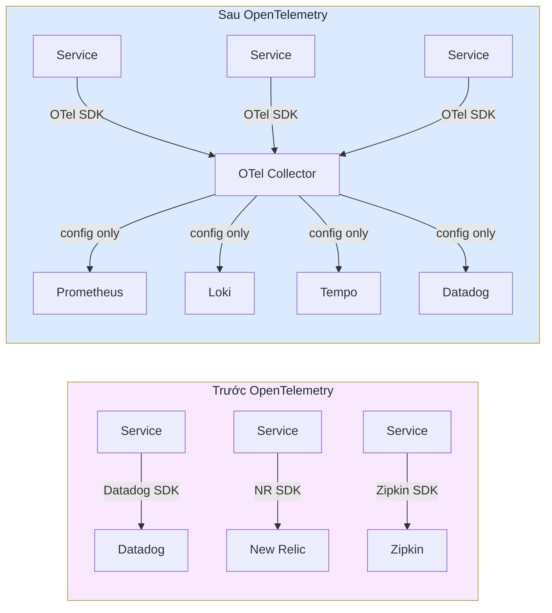
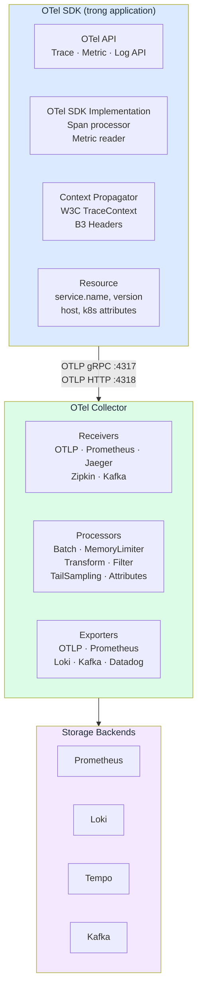
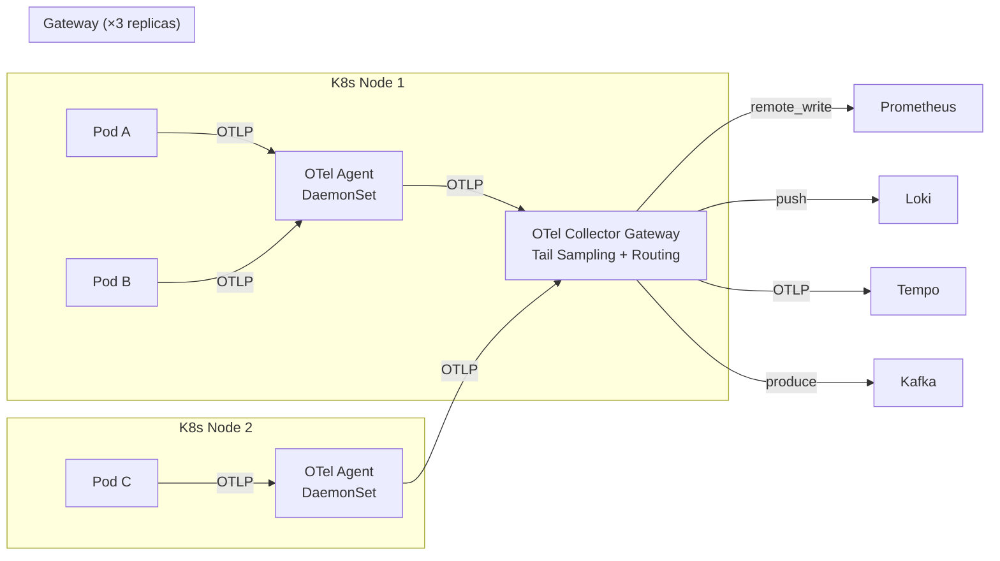
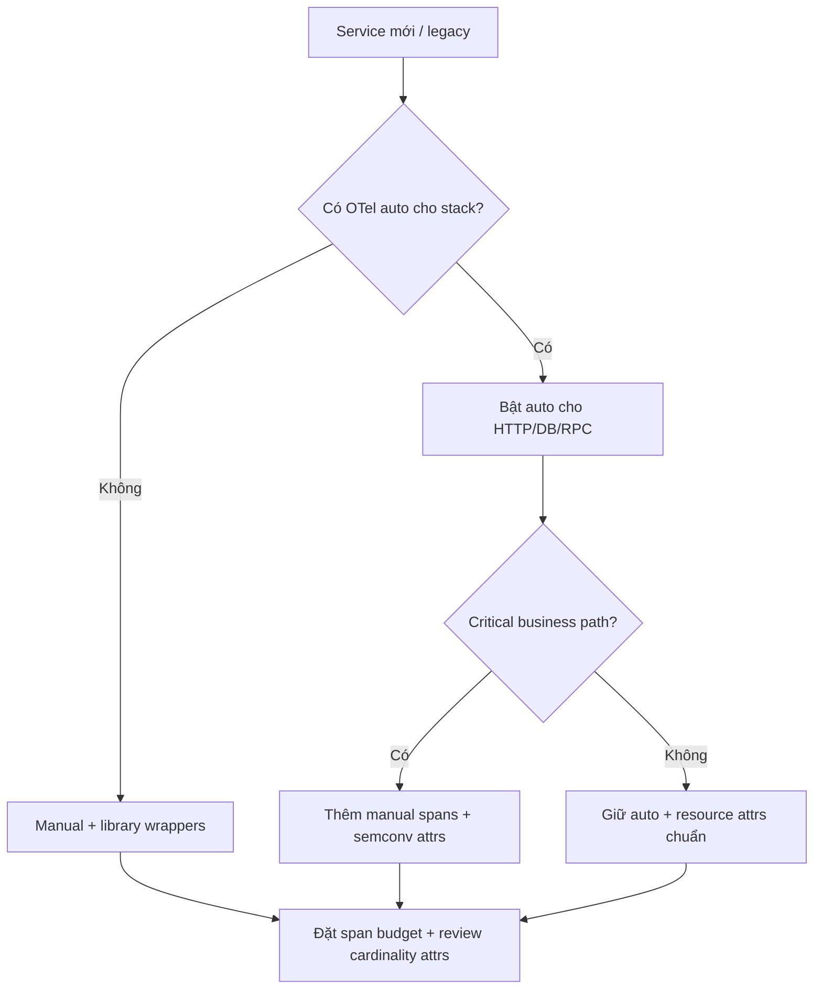
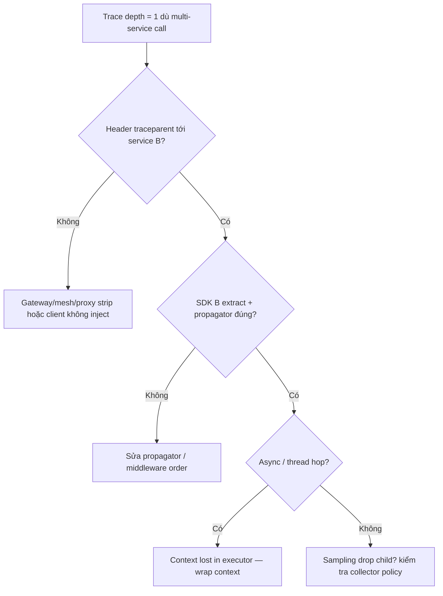
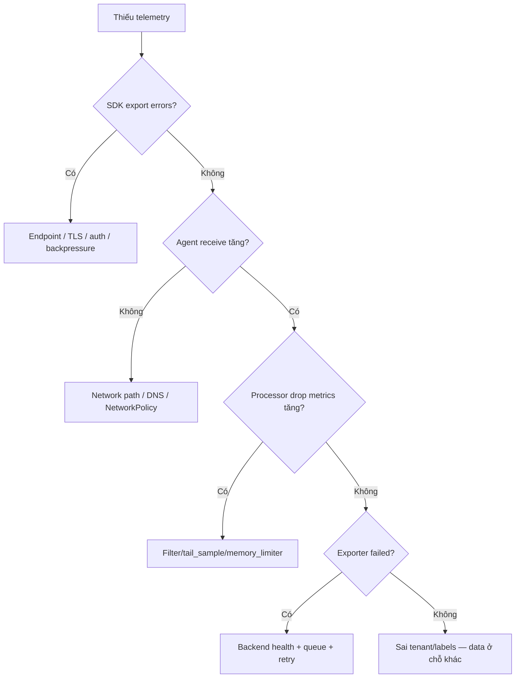

# Chapter 02 — Telemetry contract và context propagation với OpenTelemetry

> **Mục tiêu không phải “cài được Collector”. Mục tiêu là mọi metric, log và span đến intelligence plane vẫn giữ đúng danh tính, thời gian, quan hệ nhân quả và chất lượng; khi mất dữ liệu, downstream biết chính xác mình đang mù ở đâu. OpenTelemetry là phương tiện hiện thực hóa hợp đồng đó.**

---

## Prerequisites

- [01 — Observability](../01-observability/README.vi.md) — phải hiểu rõ các khái niệm metrics, logs, traces
- Kiến thức Kubernetes cơ bản (DaemonSet, Deployment, ConfigMap)

## Related Documents

- [03 — Prometheus](../03-prometheus/README.vi.md) — nhận metrics từ OTel Collector
- [04 — Loki](../04-loki/README.vi.md) — nhận logs từ OTel Collector
- [05 — Tempo](../05-tempo/README.vi.md) — nhận traces từ OTel Collector
- [06 — Kafka](../07-kafka/README.vi.md) — OTel Collector có thể export sang Kafka

## Next Reading

Sau chương này, hãy chuyển sang [03 — Prometheus](../03-prometheus/README.vi.md).

---

## Cách đọc chương này

Phần I theo một request checkout qua HTTP, Kafka và worker để tìm nơi context bị gãy. Phần II giữ reference về OTLP, Collector, receiver/processor/exporter, deployment và lựa chọn Fluent Bit/Vector/Alloy. Một pipeline chỉ đạt khi replay chứng minh downstream nhận đúng contract, không phải khi YAML hợp lệ.

## Phần I — Thu telemetry mà không phá evidence

### Một request, ba đường truyền, sáu cơ hội mất context

Request `trace_id=7f2a...` vào `checkout-api`, gọi đồng bộ `order-api`, phát message `payment.requested`, worker gọi `payment-db`, rồi phát `payment.completed`. Sự cố payment-db xảy ra ở lần retry thứ hai.

| Hop | Dữ liệu phải giữ | Failure thường gặp | Hậu quả AIOps |
|---|---|---|---|
| Gateway → checkout | Trace context, route, region, tenant tier | Gateway strip header | Checkout trở thành trace root giả |
| Checkout → order | Parent/child, deadline, retry attempt | Client library không instrument | Không biết latency nằm ở network hay order |
| Order → Kafka | Trace context trong message metadata, event ID | Chỉ serialize payload business | Consumer tạo trace mới, causal graph gãy |
| Kafka → payment worker | Link tới producer span, message time | Dùng parent sai cho batch nhiều message | Một trace nuốt nhiều transaction độc lập |
| Worker → DB | DB system/operation, pool wait, sanitized target | Chỉ tạo span cho query, bỏ pool wait | Root evidence biến mất |
| Worker → completed event | Outcome, attempt, deployment, event ID | Retry emit duplicate không có idempotency key | Correlation đếm một lỗi thành nhiều lỗi |

Nếu mỗi backend vẫn “có dữ liệu” nhưng sáu hop không nối được, collection thành công về hạ tầng và thất bại về điều tra.

### Contract tối thiểu của một telemetry record

Mỗi record critical path phải mang bốn nhóm trường. Tên cụ thể theo semantic conventions có thể thay đổi theo version; ý nghĩa không được thay đổi âm thầm.

| Nhóm | Trường ví dụ | Quy tắc |
|---|---|---|
| Identity | service, environment, region, cluster, deployment digest | Stable, normalized, không suy từ pod name nếu đã có nguồn chuẩn |
| Causality | trace ID, span ID, parent/link, event ID, retry attempt | Không tái sử dụng ID cho transaction khác |
| Semantics | operation, outcome, dependency, failure family | Low-cardinality cho metrics; business ID có policy riêng |
| Quality | event time, observed time, schema version, sampling decision | Downstream tính freshness, coverage và uncertainty |

Hai record cùng `service.name` nhưng khác environment không được merge. Hai deployment cùng tag `latest` không đủ phân biệt change. Một error message thay text sau release không được tạo failure family mới nếu bản chất vẫn là pool timeout.

### So sánh record tốt và record nguy hiểm

Record A nói: `service=payment`, `error=true`, `message=timeout`. Record B nói: `service=payment-api`, `deployment=sha256:8f2`, `region=ap-southeast-1`, `operation=payment.authorize`, `dependency=payment-db`, `failure_family=db.pool.acquire_timeout`, `attempt=2`, `event_time=10:10:42.310`, `observed_time=10:10:44.005`, `trace_sampled=true`.

Record A đủ để vẽ count lỗi. Record B đủ để:

- nối với metric pool saturation;
- xếp đúng onset dù ingestion chậm 1,7 giây;
- nhóm retry vào cùng failure episode;
- so sánh deployment/control group;
- truyền confidence sang RCA.

Collector không thể tự phát minh các field nghiệp vụ thiếu trong SDK. Contract phải được kiểm thử từ application đến backend.

### Resource identity: lỗi nhỏ làm graph vỡ thành ba node

Trong thực tế có thể đồng thời xuất hiện:

- metric: `service="payment"`;
- log: `app="payment-api"`;
- trace: `service.name="payments"`;
- deploy event: `application="pay-svc"`.

Nếu enrich theo bốn bảng mapping riêng, hệ tạo bốn thực thể. Identity resolution nên có canonical `service_id`, alias có version và owner. Khi alias không map được, quarantine hoặc gắn quality flag; không tự fuzzy-match tên gần giống trong production decision.

Kubernetes metadata cũng có vòng đời. Pod UID là instance identity tốt nhưng không phải service identity. Deployment name có thể stable nhưng không immutable. Image digest/commit SHA dùng cho change attribution; human-friendly version chỉ là display.

### Context propagation qua HTTP: header có không đồng nghĩa trace đúng

Một trace có thể vẫn hiện nhưng parentage sai. Các tình huống phổ biến:

- Proxy tạo trace mới thay vì tiếp tục context.
- Retry client tạo nhiều child spans nhưng không ghi attempt/deadline.
- Request nội bộ vô tình tin trace header do client bên ngoài tự đặt.
- Thread pool/async callback mất context và attach vào request khác.
- Baggage chứa email/token rồi lan qua mọi service.

Acceptance không chỉ là “98% request có trace ID”. Cần đo orphan-span ratio, root-span rate theo route, impossible parent relation và context collision. Nếu root spans của `payment-api` tăng từ 0,5% lên 22% sau gateway release, trace coverage tổng vẫn cao nhưng causal coverage đã hỏng.

### Async messaging: parent, link và thời gian chờ khác nhau

Với một message xử lý một lần, consumer span có thể tiếp tục quan hệ từ producer. Với batch 100 message hoặc fan-in nhiều nguồn, ép một parent duy nhất làm sai graph; span links mô tả đúng hơn. Event cần cả produced time, broker time và processing start để tách:

- queue wait;
- consumer lag;
- service processing latency;
- retry/redelivery delay.

Ví dụ message được tạo 10:11:00, tới broker 10:11:00.030, consumer nhận 10:13:20, xử lý 180 ms. Nếu chỉ nhìn consumer span 180 ms, payment worker “nhanh”; khách vẫn chờ 140 giây vì lag. RCA phải thấy queue delay là evidence riêng.

Duplicate delivery không phải duplicate telemetry. `event_id` và `delivery_attempt` cho phép Chapter 06/07 dedup nghiệp vụ mà vẫn giữ evidence về redelivery storm.

### Sampling: tiết kiệm sai chỗ sẽ xóa root cause

Giả sử 100.000 request/phút, error chỉ 0,05% tức 50 request. Head sampling 1% giữ trung bình 0,5 failed trace/phút; nhiều phút không có trace lỗi nào. Nếu detector dựa trace, incident hiếm biến mất.

Tail sampling “giữ mọi error” tốt hơn nhưng vẫn có bẫy:

- Root span chưa biết error trong khi child span đã timeout.
- Decision phân tán qua nhiều collector không thấy đủ trace.
- Trace quá dài vượt decision wait.
- Backend overload làm queue drop trước khi sampler quyết định.
- Slow-success brownout không có error status nên bị bỏ.

Policy hợp lý thường kết hợp: giữ lỗi, latency tail, rare operation/failure family, một mẫu success có xác suất biết được, và quota theo tenant/service. Sampling decision/ratio phải đi cùng record để downstream không biến sample bias thành tỷ lệ thật.

Trong incident, trace coverage giảm 88% → 49% tại 10:22 do gateway pressure. RCA được phép dùng trace còn lại nhưng phải hạ confidence; detector vẫn dùng metric/log fallback. Không bao giờ diễn giải “failed spans giảm” mà bỏ qua denominator received/dropped.

### Processor order là semantic order

Thứ tự xử lý không chỉ ảnh hưởng hiệu năng. Nó thay đổi dữ liệu:

1. Memory protection phải ngăn process chết nhưng drop/reject phải đo được.
2. Identity/resource enrichment phải xảy ra trước routing theo service/tenant.
3. Redaction phải xảy ra trước exporter tới sink không được phép thấy PII.
4. Sampling cần field mà transform không được xóa trước đó.
5. Batch sau filtering/sampling để không tốn queue cho data sẽ bỏ.

Nếu hash email sau khi route bản raw sang debug sink, compliance đã thất bại. Nếu filter error log trước khi tail sampler nhận biết failure family, trace coverage lỗi giảm đúng lúc cần nhất. Mỗi thay đổi pipeline cần golden-record test, không chỉ config validation.

### Agent và gateway: tách blast radius

Agent gần workload phù hợp thu local telemetry, thêm metadata và buffer ngắn. Gateway phù hợp policy chung, tail sampling, tenant routing và export. Nhưng gateway toàn vùng là shared fate: backend chậm có thể gây backpressure cho mọi service.

Thiết kế cần trả lời bằng số:

- Ingest bình thường 220.000 spans/s, peak 480.000.
- Gateway xử lý bền vững 120.000 spans/s/replica ở headroom 60%.
- Backend outage 10 phút cần buffer bao nhiêu; disk queue có đủ không.
- Một tenant chiếm 70% volume có quota/isolation không.
- Fan-out exporter chậm có chặn sink còn lại không.

Không đặt một con số “replica=3” cho mọi hệ thống. Sizing dựa peak, byte/record, processor cost, queue horizon và failure mode.

### Chọn OTel, Fluent Bit, Vector hay Alloy theo vai trò

Các lựa chọn hiện có trong working tree được giữ lại nhưng đặt đúng lớp:

| Nhu cầu | Lựa chọn hợp lý | Điều phải tránh |
|---|---|---|
| Node/system logs cực nhẹ | Fluent Bit | Kỳ vọng nó làm multi-signal policy gateway |
| Log transform/routing phức tạp | Vector | Hai transform plane đổi schema độc lập |
| Grafana-centric edge collection | Alloy | Gắn identity theo cách khác OTel gateway |
| Multi-signal policy, sampling, vendor-neutral export | OTel Collector | Một gateway global không isolation |

Một edge shipper cộng một đường OTel hội tụ thường dễ vận hành hơn bốn agent chạy song song. Công cụ không thay thế contract test.

### Failure của collection plane phải trở thành signal

Các metric quan trọng của Collector không chỉ là CPU/RAM:

- accepted, refused, dropped records theo signal/reason/tenant;
- queue occupancy và oldest item age;
- exporter latency/error;
- sampling kept/dropped theo policy;
- invalid semantic records;
- identity enrichment misses;
- end-to-end canary delay;
- context propagation coverage.

Nếu exporter thành công nhưng backend query không thấy canary, collection vẫn thất bại. Synthetic telemetry canary nên đi qua cùng đường thật và được kiểm tra ở consumer end.

### Edge cases production

**Collector restart giữa incident dài.** Persistent queue giữ record nhưng replay tạo duplicate. Downstream cần stable event identity/idempotency; lifecycle incident không reset.

**Backend chậm một nhánh.** Export Tempo lag không được chặn metrics tới Prometheus. Isolation queue và failure policy phải rõ; nếu drop trace, quality event đi theo.

**Schema drift.** SDK mới đổi status/failure attribute. Cả hai version chạy trong rolling deploy; transform phải hiểu dual-read và đo unknown version.

**PII trong baggage.** Baggage lan xa hơn log cục bộ và có thể ra vendor sink. Allowlist tốt hơn blocklist; security event phải audit được.

**Multi-tenant noisy neighbor.** Tenant A tạo 80% spans do loop. Per-tenant quota bảo vệ tenant B; không drop đều khiến critical low-volume service mất cùng tỷ lệ.

**Clock skew.** Collector observed time không sửa được application event time. Ghi uncertainty/clock health; RCA coi onset gần nhau trong khoảng skew là tie.

**Tail sampler scale-out.** Các spans cùng trace vào replica khác nhau làm decision thiếu. Routing theo trace ID hoặc state-sharing phải được kiểm thử khi autoscale/failover.

**Semantic success sai.** SDK đánh status OK vì HTTP 200, nhưng payment outcome system error. Application instrumentation phải ghi semantic outcome; Collector không đoán body nghiệp vụ.

### Failure injection và acceptance

Replay Chapter 02 gồm bốn lần chạy:

1. Đường chuẩn: HTTP + Kafka + DB giữ causal graph hoàn chỉnh.
2. Gateway strip context: propagation SLO fail và RCA hạ confidence, không tạo root giả chắc chắn.
3. Tempo exporter chậm: metrics/logs tiếp tục; trace quality event phản ánh lag/drop.
4. Collector restart và redelivery: record có thể lặp nhưng incident membership/RCA aggregate không nhân đôi.

Điều kiện đạt:

- ≥98% sync requests và ≥95% async messages nối đúng context trên critical path.
- 100% critical records có canonical service/deployment/environment.
- Không PII test fixture nào xuất hiện ở sink không được phép.
- Quality/freshness phản ánh mọi injected loss trong SLA.
- Replay không đổi customer-impact count vì telemetry duplicate.
- Trace sampling giữ đủ rare failure và luôn công bố coverage.

### Output contract sang Chapter 03–06

Chapter 02 xuất ra telemetry records có stable identity, causal links, semantic outcome, event/observed time, schema/sampling metadata và quality flags. Chapter 03 không cần biết Collector YAML; nó chỉ cần metric series đáng tin. Chapter 04 nhận log events đã redaction/normalize. Chapter 05 nhận traces có parent/link và coverage. Chapter 06 kiểm tra, enrich, quarantine và version các contract đó.

---

## Phần II — OpenTelemetry implementation reference

Phần dưới giải thích OTLP, Collector, receivers, processors, exporters, deployment và lựa chọn edge agents. Dùng nó để hiện thực hóa contract ở Phần I; không coi số component đã cấu hình là thước đo thành công.

---

## 1. Why OpenTelemetry?

> [!NOTE]
> **Ý TƯỞNG**
> Trước OpenTelemetry, mỗi observability vendor có agent riêng — Datadog agent, New Relic agent, Jaeger client... Đổi vendor = viết lại instrumentation code trong mọi service. OTel giải quyết bằng nguyên tắc "**instrument once, export anywhere**": bạn chỉ cần tích hợp OTel SDK một lần, sau đó có thể gửi data đến bất kỳ backend nào (Prometheus, Loki, Tempo, Datadog, CloudWatch) chỉ bằng cách thay đổi cấu hình collector.

> [!TIP]
> **Vì sao chọn OTel thay vì agent của vendor?** 3 lý do: (1) **Không bị vendor lock-in** — nếu bạn chuyển từ Datadog sang Prometheus, chỉ cần thay exporter config, không phải viết lại code. (2) **Một agent thay nhiều agent** — OTel Collector xử lý metrics + logs + traces thay vì 3 agent riêng biệt. (3) **Chuẩn mở CNCF** — không phụ thuộc vào roadmap của bất kỳ công ty nào.

### The Problem Before OTel

Trước khi có OpenTelemetry:

```
Datadog Agent       → Datadog backend
New Relic Agent     → New Relic backend  
Jaeger Client       → Jaeger backend
→ Đổi vendor = viết lại instrumentation trong tất cả services
→ Chạy nhiều agents = tốn CPU/memory overhead
```

### What OTel Solves


```mermaid
graph LR
    subgraph Before["Trước OpenTelemetry"]
        A1[Service] -->|Datadog SDK| DD[Datadog]
        A2[Service] -->|NR SDK| NR[New Relic]
        A3[Service] -->|Zipkin SDK| ZP[Zipkin]
    end

    subgraph After["Sau OpenTelemetry"]
        B1[Service] -->|OTel SDK| COL[OTel Collector]
        B2[Service] -->|OTel SDK| COL
        B3[Service] -->|OTel SDK| COL
        COL -->|config only| P[Prometheus]
        COL -->|config only| L[Loki]
        COL -->|config only| T[Tempo]
        COL -->|config only| DD2[Datadog]
    end

    style Before fill:#fae8ff,color:#1e293b
    style After fill:#dbeafe,color:#1e293b
```

**Lợi ích**:
- **Instrument once, export anywhere** — thay đổi backend mà không thay code ứng dụng
- **Vendor neutral** — tốt nghiệp từ CNCF, không bị ràng buộc bản quyền
- **Unified data model** — metrics, logs, traces dùng cùng mô hình resource/attribute
- **Single agent** — OTel Collector thay nhiều agents của các vendors khác nhau

### OTel vs Other Collection Options

| Công cụ | Điểm mạnh | Điểm yếu | Tốt nhất cho |
|------|-----------|------------|---------|
| **OTel Collector** | Đầy đủ tín hiệu, extensible, vendor-neutral | Cấu hình phức tạp | Production AIOps (khuyến nghị) |
| **Fluent Bit** | Cực nhẹ (< 1MB RAM); tail log đã chiến | Ưu tiên logs; multi-signal / sampling yếu | Edge / node hạn chế tài nguyên |
| **Vector** | Transform mạnh (VRL); route multi-sink tốt | Thêm agent phải own; kém “OTel-native” hơn Collector | Pipeline log nặng, routing phức tạp |
| **Grafana Alloy** | Native Grafana stack; thay Promtail; hỗ trợ OTel | Hợp nhất khi đã Grafana-centric | Shop Prometheus + Loki + Grafana |
| **Fluentd** | Plugin ecosystem phong phú | Nặng hơn, Ruby-based | Legacy systems |
| **Prometheus (scrape)** | Native Prometheus | Chỉ metrics, pull | Môi trường Prometheus-native |
| **Datadog / vendor agent** | Setup dễ, full-featured | Lock-in, đắt, song song nhiều agent | Team chuẩn hoá một vendor |

**Quyết định**: Dùng **OTel Collector** làm gateway AIOps. Dùng **Fluent Bit / Vector / Alloy** ở edge khi cần shipper mỏng hoặc gắn stack — rồi forward về Collector (hoặc Kafka), không để ba “bộ não” song song.

> [!TIP]
> **Đừng nhầm tầng**: Fluent Bit / Vector / Alloy / OTel là **collect & process nhẹ**. Flink / Kafka Streams là **stream process trên bus** sau Kafka ([06 §4.7](../06-data-plane/README.vi.md#47-stream-processing-flink-kafka-streams-spark-consumer)). Elasticsearch / Loki là **store**. So Fluent Bit với Flink là nhầm category.

---

## 2. OTel Components Overview

> [!NOTE]
> **Ý TƯỞNG**
> OTel có hai phần tách biệt: **SDK** (trong application code — thu thập telemetry) và **Collector** (service độc lập — xử lý và route telemetry). SDK giống như "sensor", Collector giống như "trạm xử lý tín hiệu" trước khi gửi đến storage.


```mermaid
graph TD
    subgraph SDK["OTel SDK (trong application)"]
        API[OTel API\nTrace · Metric · Log API]
        IMPL[OTel SDK Implementation\nSpan processor\nMetric reader]
        PROP[Context Propagator\nW3C TraceContext\nB3 Headers]
        RES[Resource\nservice.name, version\nhost, k8s attributes]
    end

    subgraph Collector["OTel Collector"]
        RCV[Receivers\nOTLP · Prometheus · Jaeger\nZipkin · Kafka]
        PROC[Processors\nBatch · MemoryLimiter\nTransform · Filter\nTailSampling · Attributes]
        EXP[Exporters\nOTLP · Prometheus\nLoki · Kafka · Datadog]
    end

    subgraph Backends["Storage Backends"]
        PM[Prometheus]
        LK[Loki]
        TP[Tempo]
        KF[Kafka]
    end

    SDK -->|OTLP gRPC :4317\nOTLP HTTP :4318| Collector
    Collector --> Backends

    style SDK fill:#dbeafe,color:#1e293b
    style Collector fill:#dcfce7,color:#1e293b
    style Backends fill:#f3e8ff,color:#1e293b
```

---

## 3. OTLP Protocol

> [!NOTE]
> **Ý TƯỞNG**
> OTLP (OpenTelemetry Protocol) là "ngôn ngữ" mà SDK và Collector nói chuyện với nhau. Có 3 biến thể, khác nhau về format và hiệu năng. Trong production, dùng gRPC (binary, nhanh nhất). Chỉ dùng HTTP/JSON khi debug hoặc browser client.

### Protocol Variants

| Biến thể | Cổng | Format | Khi nào dùng |
|---------|------|--------|------------|
| **OTLP gRPC** | 4317 | Protobuf binary | Default cho service→collector. Hiệu quả nhất. |
| **OTLP HTTP/protobuf** | 4318 | Protobuf binary | Khi không thể dùng gRPC |
| **OTLP HTTP/JSON** | 4318 | JSON | Debug, browser apps |

### OTLP Data Model — Trace (rút gọn)

```json
{
  "resourceSpans": [{
    "resource": {
      "attributes": [
        {"key": "service.name", "value": {"stringValue": "order-service"}},
        {"key": "k8s.pod.name", "value": {"stringValue": "order-svc-abc123"}}
      ]
    },
    "scopeSpans": [{
      "spans": [{
        "traceId": "4bf92f3577b34da6a3ce929d0e0e4736",
        "spanId": "00f067aa0ba902b7",
        "name": "POST /api/orders",
        "startTimeUnixNano": 1705329825050000000,
        "endTimeUnixNano": 1705329825115000000,
        "status": {"code": "STATUS_CODE_OK"}
      }]
    }]
  }]
}
```

---

## 4. The OTel Collector Deep Dive

> [!NOTE]
> **Ý TƯỞNG**
> Collector là một pipeline có 3 stage: **Receivers** (nhận data vào), **Processors** (biến đổi/lọc/sample), **Exporters** (gửi đến backends). Có thể cấu hình nhiều pipeline song song — một cho traces, một cho metrics, một cho logs — mỗi pipeline có bộ processor và exporter riêng.

### Internal Architecture


```mermaid
graph LR
    subgraph Receiver["Receivers"]
        R1[OTLP\ngRPC :4317\nHTTP :4318]
        R2[Prometheus\nscrape /metrics]
        R3[Kafka Receiver]
    end

    subgraph Pipeline["Internal Pipeline (thứ tự quan trọng!)"]
        P1[Memory Limiter\n← LUÔN ĐẦU TIÊN]
        P2[Filter\nbỏ health checks]
        P3[Transform\nenrich metadata]
        P4[Tail Sampling\nkeep errors/slow]
        P5[Batch\ngộp lô để gửi]
    end

    subgraph Exporter["Exporters"]
        E1[OTLP → Tempo]
        E2[Prometheus RW]
        E3[Loki]
        E4[Kafka → AIOps]
    end

    Receiver --> P1 --> P2 --> P3 --> P4 --> P5 --> Exporter

    style Receiver fill:#dbeafe,color:#1e293b
    style Pipeline fill:#dcfce7,color:#1e293b
    style Exporter fill:#f3e8ff,color:#1e293b
```

### Collector Distributions

| Distribution | Mô tả | Khi dùng |
|-------------|-------------|---------|
| **otelcol** | Core, minimum components | Tài nguyên cực nhỏ |
| **otelcol-contrib** | Đầy đủ community components | **Phổ biến nhất cho production** |
| **Custom build (ocb)** | Chỉ components bạn cần | Production bảo mật cao |

---

## 5. Receiver Configuration

> [!NOTE]
> **Ý TƯỞNG**
> Receivers là "cổng vào" của Collector. Quan trọng nhất là **OTLP Receiver** (nhận từ services) và **Prometheus Receiver** (pull-based scraping). OTLP gRPC là mặc định và hiệu quả nhất.

### OTLP Receiver

```yaml
receivers:
  otlp:
    protocols:
      grpc:
        endpoint: 0.0.0.0:4317
        max_recv_msg_size_mib: 4         # Max message size
        max_concurrent_streams: 1000      # Concurrent gRPC streams
        tls:
          cert_file: /certs/server.crt   # mTLS — bắt buộc cho production
          key_file: /certs/server.key
          client_ca_file: /certs/ca.crt
          
      http:
        endpoint: 0.0.0.0:4318
        cors:
          allowed_origins: ["https://your-frontend.com"]  # Browser clients
```

### Prometheus Receiver (pull-based)

```yaml
receivers:
  prometheus:
    config:
      global:
        scrape_interval: 15s
      scrape_configs:
        - job_name: kubernetes-pods
          kubernetes_sd_configs:
            - role: pod
          relabel_configs:
            # Chỉ scrape pods có annotation prometheus.io/scrape: "true"
            - source_labels: [__meta_kubernetes_pod_annotation_prometheus_io_scrape]
              action: keep
              regex: "true"
```

### Kafka Receiver

```yaml
receivers:
  kafka:
    brokers: ["kafka-1:9092", "kafka-2:9092"]
    topic: otlp-telemetry
    group_id: otel-collector-consumer
    encoding: otlp_proto
    auth:
      sasl:
        username: otel-collector
        password: ${KAFKA_PASSWORD}
        mechanism: SCRAM-SHA-512
```

---

## 6. Processor Configuration

> [!NOTE]
> **Ý TƯỞNG**
> Processors là phần quan trọng nhất của Collector — chúng quyết định chất lượng data, tài nguyên, và chi phí. **Thứ tự processor quan trọng**:
> ```
> memory_limiter → filter → transform → tail_sampling → batch
> ```
> Không tuân thủ thứ tự này có thể gây mất data hoặc crash collector.

> [!TIP]
> **Tại sao thứ tự processor quan trọng?** Nếu đặt `batch` trước `tail_sampling`, các spans của cùng một trace bị gộp vào nhiều lô khác nhau → tail sampler không thể đưa ra quyết định chính xác cho cả trace. Nếu không đặt `memory_limiter` đầu tiên → collector OOM crash khi traffic spike.

### Memory Limiter Processor (LUÔN ĐẦU TIÊN)

```yaml
processors:
  memory_limiter:
    check_interval: 1s
    limit_mib: 3000          # Hard limit: từ chối data mới khi vượt quá
    spike_limit_mib: 500     # Buffer cho traffic spike

# Tại 3500 MiB (3000+500), collector bắt đầu từ chối spans mới
# Cơ chế backpressure này ngăn OOM crash — quan trọng hơn việc mất một ít data
```

### Batch Processor

```yaml
processors:
  batch:
    send_batch_size: 8192       # Gửi khi đạt kích thước này
    send_batch_max_size: 16384  # Giới hạn tối đa mỗi batch
    timeout: 5s                 # Gửi sau thời gian này dù chưa đủ kích thước

# Tại sao batch quan trọng: Giảm số RPC calls từ 10-100 lần
# 8192 spans × 1KB = 8MB/batch → Tempo không bị quá tải bởi tiny exports
```

### Transform Processor

> [!TIP]
> **Tại sao Transform là processor "thông minh" nhất?** Nó cho phép bạn làm giàu data (thêm environment từ k8s namespace), chuẩn hóa (lowercase service name), lọc sạch sensitive data (thay SQL values bằng `?`), và trích xuất structured fields từ unstructured text — tất cả mà không cần thay code ứng dụng.

```yaml
processors:
  transform/enrich:
    error_mode: ignore         # Không drop data nếu transform lỗi
    
    trace_statements:
      - context: resource
        statements:
          # Gắn environment từ k8s namespace
          - set(attributes["deployment.environment"], "production") where IsMatch(attributes["k8s.namespace.name"], "prod.*")
          
      - context: span
        statements:
          # Lọc sạch SQL values để tránh lưu trữ sensitive data
          - replace_pattern(attributes["db.statement"], "'[^']*'", "?")
          - replace_pattern(attributes["db.statement"], "\\d+", "?")
          
    log_statements:
      - context: log
        statements:
          # Chuẩn hóa severity cho logs legacy
          - set(severity_number, SEVERITY_NUMBER_ERROR) where attributes["level"] == "FATAL"
```

### Filter Processor

```yaml
processors:
  filter/drop_noise:
    traces:
      span:
        # Bỏ qua health check endpoints — không có giá trị cho AIOps
        - 'attributes["http.route"] == "/health"'
        - 'attributes["http.route"] == "/ready"'
        - 'IsMatch(attributes["http.user_agent"], "kube-probe.*")'
        
    metrics:
      metric:
        # Bỏ Go runtime metrics — cardinality cao, giá trị thấp cho AIOps
        - 'IsMatch(name, "go_gc_.*")'
        
    logs:
      log_record:
        # Bỏ DEBUG/TRACE trong production — giảm 80-90% log volume
        - 'severity_number < SEVERITY_NUMBER_WARN'
```

### Tail Sampling Processor

> [!NOTE]
> **Ý TƯỞNG**
> Tail sampling là "bộ lọc thông minh" cho traces — đợi trace hoàn tất mới quyết định giữ hay bỏ. Kết quả: 100% errors được giữ, 5-10% traffic bình thường được giữ. So với head sampling (quyết định trước khi biết kết quả), tail sampling tốt hơn vì nó luôn giữ lại đúng những trace quan trọng nhất.
>
> **Memory trade-off**: Cần giữ tất cả spans trong memory trong `decision_wait` giây. 50K traces × 50 spans × 2KB ≈ **5GB RAM**. Đây là lý do gateway cần 4-8GB RAM.

```yaml
processors:
  tail_sampling:
    decision_wait: 30s          # Chờ tối đa 30s để thu thập đủ spans
    num_traces: 50000           # Tối đa 50K traces trong memory
    expected_new_traces_per_sec: 500
    
    policies:
      # Luôn giữ traces có lỗi — quan trọng nhất
      - name: sample-errors
        type: status_code
        status_code:
          status_codes: [ERROR]
          
      # Luôn giữ traces chậm (> 2 giây) — tiếp theo trong độ ưu tiên
      - name: sample-slow
        type: latency
        latency:
          threshold_ms: 2000
          
      # Luôn giữ payment traces — business critical
      - name: sample-payment
        type: string_attribute
        string_attribute:
          key: service.name
          values: [payment-service, billing-service]
          
      # 5% traffic bình thường — statistical baseline
      - name: sample-normal-5pct
        type: and
        and:
          and_sub_policy:
            - name: not-error
              type: status_code
              status_code:
                status_codes: [OK, UNSET]
            - name: probabilistic
              type: probabilistic
              probabilistic:
                sampling_percentage: 5
```

### Attributes Processor

```yaml
processors:
  attributes/add_metadata:
    actions:
      - key: collector.version   # Thêm version info để debug
        value: "0.95.0"
        action: insert
        
      - key: user.id             # Hash sensitive IDs — không xóa, vẫn có thể debug
        action: hash
        
      - key: http.request.header.authorization  # Xóa hoàn toàn auth headers
        action: delete
```

---

## 7. Exporter Configuration

> [!NOTE]
> **Ý TƯỞNG**
> Exporters là "cổng ra" — gửi data đã được xử lý đến các backends. Mỗi backend có exporter riêng: OTLP→Tempo, Prometheus Remote Write→Prometheus, Loki Exporter→Loki, Kafka→AIOps pipeline. Tất cả exporters cần retry logic và queue để tránh mất data khi backend tạm thời unavailable.

### OTLP Exporter (→ Tempo cho traces)

```yaml
exporters:
  otlp/tempo:
    endpoint: tempo-distributor.observability.svc.cluster.local:4317
    tls:
      ca_file: /certs/ca.crt
    retry_on_failure:
      enabled: true
      initial_interval: 5s
      max_elapsed_time: 300s        # Retry trong 5 phút tối đa
    sending_queue:
      enabled: true
      num_consumers: 10
      queue_size: 1000
      storage: file_storage/traces  # Persistent queue — không mất data khi crash
    compression: gzip
```

### Prometheus Remote Write Exporter (→ Prometheus)

```yaml
exporters:
  prometheusremotewrite:
    endpoint: http://prometheus.observability.svc.cluster.local:9090/api/v1/write
    resource_to_telemetry_conversion:
      enabled: true   # Chuyển resource attributes thành metric labels
    retry_on_failure:
      enabled: true
```

### Loki Exporter (→ Loki cho logs)

```yaml
exporters:
  loki:
    endpoint: http://loki-distributor.observability.svc.cluster.local:3100/loki/api/v1/push
    default_labels_enabled:
      level: true     # Dùng severity làm label — low cardinality, high value
    retry_on_failure:
      enabled: true
```

### Kafka Exporter (→ AIOps pipeline)

```yaml
exporters:
  kafka/aiops:
    brokers: ["kafka-1.kafka.svc:9092", "kafka-2.kafka.svc:9092"]
    topic: aiops-raw-telemetry
    encoding: otlp_proto
    producer:
      required_acks: 1              # Leader ack đủ — trade latency vs durability
      compression: snappy
    auth:
      sasl:
        username: ${KAFKA_USER}
        password: ${KAFKA_PASSWORD}
        mechanism: SCRAM-SHA-512
```

### File Storage Extension (persistent queue)

```yaml
extensions:
  file_storage/traces:
    directory: /var/lib/otelcol/storage/traces
    compaction:
      on_start: true
      rebound_needed_threshold_mib: 100
```

---

## 8. Pipeline Definition

> [!IMPORTANT]
> **MINH HỌA — Cấu hình pipeline hoàn chỉnh**
>
> Đây là skeleton config kết hợp tất cả components ở trên thành một pipeline hoàn chỉnh. Lưu ý: mỗi signal type (traces/metrics/logs) có pipeline riêng với processor và exporter khác nhau.

```yaml
service:
  extensions: [health_check, pprof, zpages, file_storage/traces]
  
  pipelines:
    # Traces: nhận → lọc noise → enrich → tail sample → batch → gửi đi
    traces:
      receivers: [otlp, jaeger, zipkin]
      processors:
        - memory_limiter          # LUÔN đầu tiên — circuit breaker cho OOM
        - filter/drop_noise       # Bỏ health checks, k8s probes
        - transform/enrich        # Thêm environment, clean SQL
        - attributes/add_metadata # Gắn collector metadata
        - tail_sampling           # Giữ errors + slow + 5% normal
        - batch                   # Batch SAU sampling — đúng thứ tự!
      exporters: [otlp/tempo, kafka/aiops]
      
    # Metrics: nhận → lọc → enrich → batch → gửi Prometheus
    metrics:
      receivers: [otlp, prometheus]
      processors:
        - memory_limiter
        - filter/drop_noise
        - transform/enrich
        - batch
      exporters: [prometheusremotewrite]
      
    # Logs: nhận → lọc → mask PII → enrich → batch → Loki + Kafka
    logs:
      receivers: [otlp]
      processors:
        - memory_limiter
        - filter/drop_noise       # Bỏ DEBUG/TRACE
        - transform/mask_pii      # Ẩn PII trước khi lưu
        - transform/enrich
        - batch
      exporters: [loki, kafka/aiops]

  # Collector tự giám sát chính nó
  telemetry:
    metrics:
      level: detailed
      address: 0.0.0.0:8888      # Prometheus scrapes metrics tại đây
```

---

## 9. Deployment Patterns

### Pattern 1: Agent + Gateway (Khuyến nghị cho Production)

> [!NOTE]
> **Ý TƯỞNG**
> Dùng 2 tầng: **Agent** (DaemonSet trên mỗi node, nhẹ, chỉ forward) + **Gateway** (Deployment với nhiều replicas, làm xử lý nặng như tail sampling, batching). Tại sao 2 tầng? Vì tail sampling cần thấy **toàn bộ spans của một trace** — nếu service A và B chạy trên các nodes khác nhau, spans của chúng đến từ các agents khác nhau → cần tập hợp tại Gateway.


```mermaid
graph LR
    subgraph Node1["K8s Node 1"]
        P1[Pod A] -->|OTLP| AG1[OTel Agent\nDaemonSet]
        P2[Pod B] -->|OTLP| AG1
        AG1 -->|OTLP| GW
    end

    subgraph Node2["K8s Node 2"]
        P3[Pod C] -->|OTLP| AG2[OTel Agent\nDaemonSet]
        AG2 -->|OTLP| GW
    end

    subgraph Gateway["Gateway (×3 replicas)"]
        GW[OTel Collector Gateway\nTail Sampling + Routing]
    end

    GW -->|remote_write| PROM[Prometheus]
    GW -->|push| LOKI[Loki]
    GW -->|OTLP| TEMPO[Tempo]
    GW -->|produce| KAFKA[Kafka]
```

| Khía cạnh | Agent (DaemonSet) | Gateway (Deployment) |
|---------|------------------|---------------------|
| CPU/RAM | 200m CPU, 256Mi | 2 CPU, 4Gi |
| Tail sampling | ❌ Không thể (spans phân tán) | ✅ Tập hợp được |
| HA | Tự nhiên (mỗi node) | Cần ≥3 replicas |

**Cấu hình Agent** (nhẹ — chỉ forward, không sampling):

```yaml
# otel-agent-config.yaml (DaemonSet)
receivers:
  otlp:
    protocols:
      grpc:
        endpoint: 0.0.0.0:4317

processors:
  memory_limiter:
    limit_mib: 200            # Giới hạn nhỏ cho agent
    spike_limit_mib: 50
  batch:
    timeout: 5s
    send_batch_size: 512

exporters:
  otlp/gateway:
    endpoint: otel-collector-gateway.observability.svc.cluster.local:4317

service:
  pipelines:
    traces:
      receivers: [otlp]
      processors: [memory_limiter, batch]   # Không có tail_sampling!
      exporters: [otlp/gateway]
    metrics:
      receivers: [otlp]
      processors: [memory_limiter, batch]
      exporters: [otlp/gateway]
    logs:
      receivers: [otlp]
      processors: [memory_limiter, batch]
      exporters: [otlp/gateway]
```

### Pattern 2: Sidecar (Cho services đặc thù)

Dùng khi một service cần cấu hình xử lý đặc thù (ví dụ: 100% sampling cho payment service):

```yaml
spec:
  containers:
    - name: payment-service
      env:
        - name: OTEL_EXPORTER_OTLP_ENDPOINT
          value: "http://localhost:4317"  # Gửi đến sidecar
          
    - name: otel-collector         # Sidecar collector riêng
      image: otelcol-contrib:0.95.0
      resources:
        requests: { cpu: "100m", memory: "128Mi" }
        limits:   { cpu: "500m", memory: "512Mi" }
```

---

## 10. Kubernetes Operator

> [!NOTE]
> **Ý TƯỞNG**
> OTel Operator là Kubernetes controller — nó quản lý vòng đời của OTel Collectors và tự động inject instrumentation vào pods chỉ bằng cách thêm annotation. Không cần thay đổi code trong container images. Đây là cách "zero-code instrumentation" cho toàn bộ namespace.

### Installing the Operator

```bash
kubectl apply -f https://github.com/open-telemetry/opentelemetry-operator/releases/latest/download/opentelemetry-operator.yaml
```

### OpenTelemetryCollector CRD

```yaml
apiVersion: opentelemetry.io/v1alpha1
kind: OpenTelemetryCollector
metadata:
  name: aiops-collector
  namespace: observability
spec:
  mode: daemonset
  image: otelcol-contrib:0.95.0
  resources:
    limits:
      cpu: "500m"
      memory: "512Mi"
    requests:
      cpu: "200m"
      memory: "256Mi"
  config: |
    receivers:
      otlp:
        protocols:
          grpc:
            endpoint: 0.0.0.0:4317
    # ... full collector config
```

### Auto-Instrumentation CRD

> [!TIP]
> **Tại sao Auto-Instrumentation là "killer feature"?** Thay vì yêu cầu mỗi team thêm OTel SDK vào code của họ, bạn chỉ cần gắn annotation vào namespace → Operator tự inject agent vào mọi pod mới. Teams không cần thay đổi gì trong code, nhưng vẫn có đầy đủ traces/metrics.

```yaml
apiVersion: opentelemetry.io/v1alpha1
kind: Instrumentation
metadata:
  name: aiops-instrumentation
  namespace: production
spec:
  exporter:
    endpoint: http://aiops-collector.observability.svc.cluster.local:4317
    
  propagators:
    - tracecontext
    - baggage
    
  sampler:
    type: parentbased_traceidratio
    argument: "0.1"         # SDK-level 10% sampling (trước tail sampling)
    
  java:   # Auto-inject Java agent
    image: ghcr.io/open-telemetry/opentelemetry-operator/autoinstrumentation-java:1.32.0
  python: # Auto-inject Python agent
    image: ghcr.io/open-telemetry/opentelemetry-operator/autoinstrumentation-python:0.43b0
  nodejs: # Auto-inject Node.js agent
    image: ghcr.io/open-telemetry/opentelemetry-operator/autoinstrumentation-nodejs:0.45.0
```

**Bật auto-instrumentation cho toàn bộ namespace**:

```yaml
apiVersion: v1
kind: Namespace
metadata:
  name: production
  annotations:
    instrumentation.opentelemetry.io/inject-java: "true"
    instrumentation.opentelemetry.io/inject-python: "true"
    # Mọi pod mới trong namespace này sẽ được tự động instrument
```

---

## 11. Fluent Bit vs OTel Collector (và Vector / Alloy)

> [!NOTE]
> **Ý TƯỞNG**
> Edge shipper không phải “ai thắng tuyệt đối” — chúng đánh đổi **RAM, coverage tín hiệu, và sức transform**. Fluent Bit xuất sắc **thu log** với tài nguyên cực thấp. OTel Collector khi cần **đa tín hiệu** và tail-based sampling. Vector và Grafana Alloy nằm giữa “log router” và “agent OTel-compatible” tùy cấu hình.

| Tiêu chí | Fluent Bit | Vector | Grafana Alloy | OTel Collector |
|-----------|------------|--------|---------------|----------------|
| **RAM** | ~1MB class | Cao hơn FB | Trung bình | 256MB+ gateway điển hình |
| **Tín hiệu** | Logs-first | Logs + metrics (tuỳ) | Metrics/logs/traces (Grafana + OTel) | Metrics + logs + traces |
| **Tail sampling** | ❌ | ❌ / hạn chế | Qua pipeline kiểu OTel | ✅ |
| **Transform** | Filter cơ bản | Mạnh (VRL) | Tốt (River / components) | Processors + OTTL |
| **Vai AIOps** | Edge log node | Fan-out log phức tạp | Edge Grafana-stack | **Policy gateway** |
| **Maturity** | Cực cao | Cao | Cao (ecosystem Grafana) | Cao (CNCF graduated) |

### Decision Matrix

```
Cần traces + tail sampling / policy org-wide?  → OTel Collector (gateway)
Chỉ logs, tài nguyên hạn chế?                 → Fluent Bit
Route/transform log phức tạp, multi-sink?     → Vector (hoặc Collector)
All-in Grafana (Prom/Loki/Tempo)?             → Alloy + OTel gateway tuỳ chọn
Full telemetry platform AIOps?                → OTel Collector
Estate Fluentd legacy?                        → Fluent Bit edge → migrate OTel
```

### Ưu / nhược (edge tools)

| Tool | Ưu | Nhược |
|------|----|-------|
| **Fluent Bit** | Nhỏ; DaemonSet đã chứng minh; đơn giản | Multi-signal yếu; policy sâu hạn chế |
| **Vector** | Route/transform xuất sắc; self-observability | Thêm skill (VRL); dễ trùng “não” với Collector |
| **Alloy** | Một agent nhiều receiver Grafana; thay Promtail | Kéo về backend Grafana |
| **OTel Collector** | Một policy plane; export vendor-neutral; sampling | Nặng hơn; config phức tạp |

### Hybrid Pattern (khuyến nghị)

```
Fluent Bit hoặc Vector hoặc Alloy (DaemonSet) → node/system logs
OTel Agent / SDK → application OTLP
        ↘
          OTel Collector Gateway → Prometheus / Loki / Tempo / Kafka
```

> [!WARNING]
> Chạy **Datadog Agent + OTel + Fluent Bit + Vector** trên mọi node “cho chắc” = đốt CPU và nhân đôi bug cardinality. Chọn **một edge log shipper + một đường OTel**, rồi hội tụ.

---

## 12. Production Best Practices

### Resource Limits (Production Sizing)

```yaml
# Agent (DaemonSet) — nhẹ
resources:
  requests: { cpu: "200m", memory: "256Mi" }
  limits:   { cpu: "500m", memory: "512Mi" }

# Gateway (Deployment, có tail sampling) — cần nhiều RAM hơn
resources:
  requests: { cpu: "2000m", memory: "4Gi" }  # 4Gi cho tail sampling buffer
  limits:   { cpu: "4000m", memory: "8Gi" }
```

### HorizontalPodAutoscaler for Gateway

```yaml
apiVersion: autoscaling/v2
kind: HorizontalPodAutoscaler
metadata:
  name: otel-collector-gateway-hpa
spec:
  scaleTargetRef:
    name: otel-collector-gateway
  minReplicas: 3
  maxReplicas: 10
  metrics:
    - type: Resource
      resource:
        name: cpu
        target:
          averageUtilization: 70
    - type: Pods
      pods:
        metric:
          name: otelcol_receiver_accepted_spans
        target:
          averageValue: "50000"    # Scale up nếu >50K spans/s per pod
```

---

## 13. Common Mistakes

| Lỗi phổ biến | Triệu chứng | Khắc phục |
|---------|---------|-----|
| Không đặt memory_limiter đầu tiên | Collector OOM crash khi traffic spike | Luôn đặt memory_limiter vị trí đầu tiên |
| Batch trước tail_sampling | Sampling decision sai | Tail sample → BATCH (đúng thứ tự) |
| Không có persistent queue | Mất data khi restart | Bật file_storage extension |
| Không config max_recv_msg_size | "message too large" errors | Set `max_recv_msg_size_mib` phù hợp |
| Tail sampling tại agent | Không correlate được spans across nodes | Chỉ tail sample tại gateway |
| Auto-instrument mọi thứ | 500MB JVM agent overhead | Chọn lọc instrumentation packages |
| Một pod collector duy nhất | SPOF | Tối thiểu 3 gateway replicas |
| Thiếu trace_id trong logs | Không navigate được log→trace | Bắt buộc trace context injection tại SDK |

---

## 14. Monitoring the Collector

> [!NOTE]
> **Ý TƯỞNG**
> Collector tự phơi bày metrics Prometheus tại `:8888/metrics`. Quan trọng nhất cần theo dõi: **refused/failed spans** (phải = 0 ở trạng thái ổn định) và **queue size** (nếu tăng dần → collector bị quá tải).

```promql
# Spans nhận được — baseline throughput
rate(otelcol_receiver_accepted_spans[5m])

# Spans bị bỏ — PHẢI = 0. Nếu > 0 → collector đang bị quá tải
rate(otelcol_receiver_refused_spans[5m])
rate(otelcol_exporter_failed_spans[5m])

# Queue size — nếu tăng dần → backend không theo kịp
otelcol_exporter_queue_size / otelcol_exporter_queue_capacity

# Memory — xác nhận memory_limiter đang hoạt động
otelcol_process_memory_rss

# Tail sampling decisions — bao nhiêu % được giữ lại
rate(otelcol_processor_tail_sampling_sampled_spans[5m])
rate(otelcol_processor_tail_sampling_not_sampled_spans[5m])
```

### Alerting Rules

```yaml
groups:
  - name: otel-collector
    rules:
      - alert: OTelCollectorHighDropRate
        expr: |
          rate(otelcol_exporter_failed_spans[5m]) /
          rate(otelcol_receiver_accepted_spans[5m]) > 0.01
        for: 5m
        labels:
          severity: critical
        annotations:
          summary: "OTel Collector dropping >1% of spans"

      - alert: OTelCollectorQueueFull
        expr: otelcol_exporter_queue_size / otelcol_exporter_queue_capacity > 0.8
        for: 5m
        labels:
          severity: warning
```

---

## 15. Scaling

### Scaling Bottlenecks

| Bottleneck | Triệu chứng | Khắc phục |
|------------|---------|-----|
| CPU | `otelcol_process_cpu_seconds` tăng cao | Thêm replicas |
| Memory | OOM kills | Tăng memory limit hoặc giảm `num_traces` |
| Network | Queue tăng dần, export retries | Scale Tempo/Loki/Prometheus |
| gRPC connections | Connection refused từ agents | Tăng `max_concurrent_streams` |

### Target Allocator (Prometheus scraping at scale)

Khi một Prometheus instance không thể scrape đủ targets, Target Allocator phân phối scrape jobs đồng đều:

```yaml
apiVersion: opentelemetry.io/v1alpha1
kind: OpenTelemetryCollector
spec:
  mode: statefulset
  replicas: 5
  targetAllocator:
    enabled: true
    allocationStrategy: consistent-hashing    # Stable distribution across restarts
    prometheusCR:
      enabled: true   # Tự động discover ServiceMonitor và PodMonitor CRDs
```

---

## 16. Security

### mTLS với cert-manager

```yaml
apiVersion: cert-manager.io/v1
kind: Certificate
metadata:
  name: otel-collector-cert
  namespace: observability
spec:
  secretName: otel-collector-tls
  duration: 2160h        # 90 ngày
  renewBefore: 360h      # Auto-renew 15 ngày trước khi hết hạn
  usages:
    - server auth
    - client auth
  dnsNames:
    - otel-collector-gateway.observability.svc.cluster.local
```

### Secrets Management

```yaml
# Không bao giờ hard-code credentials trong ConfigMap
# Dùng external-secrets-operator → AWS Secrets Manager
apiVersion: external-secrets.io/v1beta1
kind: ExternalSecret
spec:
  secretStoreRef:
    name: aws-secretsmanager
    kind: ClusterSecretStore
  data:
    - secretKey: KAFKA_PASSWORD
      remoteRef:
        key: /aiops/otel-collector/kafka-password
```

---

## 17. Cost

> [!NOTE]
> **Ý TƯỞNG**
> Chi phí OTel Collector bản thân không đáng kể (~$260/tháng cho 10 nodes). Giá trị thực sự là ở việc **giảm chi phí downstream** thông qua sampling và filtering thông minh.

### OTel Collector Resource Cost

| Deployment | Instances | Tổng |
|-----------|----------|------|
| DaemonSet Agent (10 nodes) | 10 × 0.2 CPU = 2 CPU | ~$60/tháng |
| Gateway (3 replicas) | 3 × 2 CPU = 6 CPU | ~$200/tháng |
| **Tổng** | | **~$260/tháng** |

### Data Volume Impact (Cost Savings)

```
Traces — tác động của tail sampling:
  Không sampling: 1M spans/phút × 2KB = 2.88TB/ngày
  10% tail sampling: 288GB/ngày
  Tiết kiệm: ~$150/ngày chỉ riêng Tempo S3 storage

Logs — tác động của filter:
  Không filter: 144GB/ngày
  Bỏ DEBUG + sample INFO 10%: 15GB/ngày
  Tiết kiệm: ~$6/ngày cho Loki S3
```

---

## 18. Tư duy problem-solving trong production

> [!NOTE]
> **Ý TƯỞNG**
> OpenTelemetry không phải "cài agent xong là xong". Production OTel là bài toán **độ đúng của context**, **thứ tự xử lý**, và **điểm thất bại đơn lẻ (SPOF)** trên đường telemetry. On-call OTel giỏi hỏi: *dữ liệu có mặt không, có đúng không, và có đủ rẻ để sống sót peak traffic không?*

### 18.1 Auto vs Manual instrumentation — chọn bằng câu hỏi, không bằng mốt

| Câu hỏi | Auto-instrumentation | Manual instrumentation |
|---------|----------------------|------------------------|
| Framework/HTTP/DB phổ biến? | Ưu tiên auto | — |
| Business span (checkout, risk score)? | Không đủ | **Bắt buộc manual** |
| Legacy lib không có plugin? | Có thể miss | Manual / wrapper |
| Thời gian time-to-value | Nhanh | Chậm hơn, sâu hơn |
| Rủi ro overhead / version pin | Agent version risk | Code ownership |

> [!TIP]
> **Vì sao**
> Auto cho **coverage**; manual cho **meaning**. AIOps và RCA cần meaning (span name ổn định, attributes semantic). Strategy thắng: auto làm nền + manual cho critical path + semconv.

Quy tắc ngón tay cái:

1. Tier-1 HTTP/gRPC/DB/messaging → auto trước.
2. Mọi boundary domain (payment, authz decision, saga step) → manual span.
3. Không manual-span từng hàm nội bộ — noise + cost.
4. Attributes theo [semantic conventions](https://opentelemetry.io/docs/specs/semconv/); tránh invent `my_company_foo` nếu đã có chuẩn.

### 18.2 Context propagation breaks — "trace bị cụt" là bug sản xuất

Context propagation là **xương sống** distributed tracing. Gãy thường im lặng:

- Service A tạo root; Service B tạo **root mới** (mất parent).
- Async: publish message không inject; consumer không extract.
- Gateway/mesh strip headers (`traceparent`, baggage).
- Language boundary: Java → Node qua HTTP thiếu propagator config.
- Fan-out: chỉ child đầu tiên có context.

Tư duy debug:

```text
1. Lấy 1 request_id/user action cụ thể
2. Tìm span đầu (root) — service nào?
3. So sánh network hop vs span tree
4. Hop nào có request nhưng không có child span? → break tại đó
5. Check: propagator, header allowlist, middleware order, async context
```

> [!WARNING]
> **Edge**
> "Có traces" ≠ "propagation đúng". Dashboard Tempo full màu vẫn có thể là **rừng root span rời**, không phải 1 journey. Đo bằng % traces multi-service depth ≥ N.

### 18.3 Collector SPOF — agent chết, bạn mù; gateway chết, bạn mất sample có chủ đích

Hai lớp deployment phổ biến:

- **Agent (DaemonSet/sidecar)**: gần app; fail → node/pod đó mất telemetry local.
- **Gateway (Deployment)**: tail sampling, routing, fan-out; fail → mất enrichment/sampling policy tập trung.

Tư duy reliability:

| Thành phần | Failure mode | Impact | Mitigation |
|------------|--------------|--------|------------|
| Agent | OOM / crash | Mất signals node | resource limit đúng, memory_limiter, restart policy |
| Gateway | 1 replica | SPOF sampling/export | ≥3 replicas + PDB |
| Gateway LB | round-robin spoils tail sample | Decision sai | hash by traceID |
| Exporter backend | Tempo/Loki down | Backpressure / drop | queue + retry + disk WAL |
| Config reload | bad YAML | Pipeline stop | validation CI, canary collector |

### 18.4 Processor ordering — *tại sao thứ tự quan trọng hơn "có processor"*

Pipeline OTel **không giao hoán**. Ví dụ sai kinh điển:

```text
SAI:  filter → batch → memory_limiter
      (đã tốn RAM trước khi limit)

SAI:  tail_sampling → attributes(add tenant)
      (sample trước khi có đủ attr để policy)

ĐÚNG (rút gọn):
  memory_limiter → [attributes/filter/transform] → batch → exporters
  (tail_sampling thường gần cuối path traces, sau khi đã enrich đủ)
```

> [!TIP]
> **Vì sao**
> `memory_limiter` đầu tiên bảo vệ process. `batch` gần exporter tối ưu network. `filter` sớm giảm CPU. `transform` trước khi export để backend nhận schema sạch. Sai thứ tự = OOM + drop ngẫu nhiên + policy sampling sai.

### 18.5 Problem-solving loop cho "không thấy data"

```text
App SDK → Agent → Gateway → Backend (Prom/Loki/Tempo)
   |         |        |            |
   export    receive  process      ingest
   errors    refused  drops        rejections
```

Luôn đi **từ phải sang trái** nếu backend empty, hoặc **trái sang phải** nếu app log export error:

1. Backend có nhận tenant/namespace khác không?
2. Gateway exporter metrics: sent / failed / queue.
3. Agent → gateway connectivity / mTLS / auth.
4. SDK endpoint env (`OTEL_EXPORTER_OTLP_ENDPOINT`) đúng port/protocol.
5. Sampling: có thể đang drop 99% — dùng forced error trace test.

---

## 19. Edge cases thực tế

### EC-01 — Auto-instrument "có span" nhưng thiếu business context

| | |
|--|--|
| **Triệu chứng** | Trace chỉ thấy `HTTP GET` / `SELECT`; không biết bước checkout nào fail. |
| **Nguyên nhân** | Chỉ auto; không manual span domain. |
| **Phát hiện** | Review span names trên critical path; product hỏi "chỗ nào?". |
| **Phòng** | Instrumentation standard: list required business spans per service. |

### EC-02 — Manual span quá mịn → cost + noise

| | |
|--|--|
| **Triệu chứng** | 500+ spans/request; Tempo chậm; bill tăng. |
| **Nguyên nhân** | Span mọi helper; loop tạo span. |
| **Phát hiện** | p99 spans per trace; collector throughput. |
| **Phòng** | Span budget/request; suppress library spans; sample internal. |

### EC-03 — `traceparent` bị API gateway strip

| | |
|--|--|
| **Triệu chứng** | Mỗi service một root trace; correlation vỡ cross-service. |
| **Nguyên nhân** | Allowlist header không gồm W3C trace context. |
| **Phát hiện** | So request headers ingress vs app; Tempo service graph đứt. |
| **Phòng** | Gateway config allow `traceparent`, `tracestate`, baggage; contract test. |

### EC-04 — Async messaging mất context

| | |
|--|--|
| **Triệu chứng** | HTTP path có trace; consumer Kafka là root riêng. |
| **Nguyên nhân** | Không inject vào message header/carrier. |
| **Phát hiện** | Trace tree dừng ở produce; consumer không parent. |
| **Phòng** | Propagator cho Kafka/SQS; test e2e produce→consume. |

### EC-05 — Collector single replica gateway

| | |
|--|--|
| **Triệu chứng** | Deploy gateway → gap 2–5 phút telemetry toàn cluster. |
| **Nguyên nhân** | 1 pod; rolling update không PDB. |
| **Phát hiện** | `up` metric gateway; export lag. |
| **Phòng** | min 3 replicas, PDB, maxUnavailable 1; pre-stop drain. |

### EC-06 — Tail sampling sai khi scale-out

| | |
|--|--|
| **Triệu chứng** | Error traces "biến mất" dù policy 100% errors. |
| **Nguyên nhân** | Spans cùng trace vào khác replica; decision không consistent. |
| **Phát hiện** | So error metrics vs kept error traces; load balancer mode. |
| **Phòng** | Consistent hash routing by traceID; hoặc load-balancing exporter. |

### EC-07 — memory_limiter không đứng đầu pipeline

| | |
|--|--|
| **Triệu chứng** | Collector OOMKill dù đã set limiter. |
| **Nguyên nhân** | Processor nặng chạy trước; batch phình RAM. |
| **Phát hiện** | Pipeline config review; container memory working set. |
| **Phòng** | Lint config: memory_limiter first; load test. |

### EC-08 — filter sau batch / sai điều kiện → nuốt error logs

| | |
|--|--|
| **Triệu chứng** | Production thiếu ERROR logs; chỉ còn INFO. |
| **Nguyên nhân** | Filter severity sai; transform field name lệch. |
| **Phát hiện** | Canary log ERROR với marker; metric log count by severity. |
| **Phòng** | Unit test OTTL; staged rollout filter; never drop unknown severity blindly. |

### EC-09 — Java agent version pin gây deadlock / permgen issues

| | |
|--|--|
| **Triệu chứng** | Sau upgrade agent, latency/thread spike. |
| **Nguyên nhân** | Incompatible bytecode instrumentation. |
| **Phát hiện** | Diff agent version canary; flight recorder. |
| **Phòng** | Pin version; canary 5%; rollback playbook; matrix test JDK. |

### EC-10 — Fan-out exporter: một backend chậm làm backpressure toàn pipeline

| | |
|--|--|
| **Triệu chứng** | Loki chậm → traces cũng drop. |
| **Nguyên nhân** | Shared pipeline/queue; blocking export. |
| **Phát hiện** | Exporter queue size; failed per backend. |
| **Phòng** | Tách pipeline; sending_queue; timeout; isolate slow sink. |

### EC-11 — Resource attributes thiếu `service.name`

| | |
|--|--|
| **Triệu chứng** | Grafana hiện `unknown_service`; khó filter. |
| **Nguyên nhân** | SDK resource detector miss; env chưa set. |
| **Phát hiện** | Count spans without service.name. |
| **Phòng** | Enforce tại collector (transform default); platform chart defaults. |

### EC-12 — PII lọt baggage / attributes

| | |
|--|--|
| **Triệu chứng** | Email/token xuất hiện trên Tempo/Loki. |
| **Nguyên nhân** | Dev set attribute debug; baggage propagate secrets. |
| **Phát hiện** | Scan attributes; DLP sample; security review. |
| **Phòng** | Redact processor; allowlist attributes; ban sensitive keys in CI. |

---

## 20. Decision trees

### 20.1 Auto, manual, hay hybrid?


```mermaid
flowchart TD
    A[Service mới / legacy] --> B{Có OTel auto cho stack?}
    B -->|Không| C[Manual + library wrappers]
    B -->|Có| D[Bật auto cho HTTP/DB/RPC]
    D --> E{Critical business path?}
    E -->|Có| F[Thêm manual spans + semconv attrs]
    E -->|Không| G[Giữ auto + resource attrs chuẩn]
    F --> H[Đặt span budget + review cardinality attrs]
    C --> H
    G --> H
```

### 20.2 Trace bị cụt — khoanh vùng


```mermaid
flowchart TD
    A[Trace depth = 1 dù multi-service call] --> B{Header traceparent tới service B?}
    B -->|Không| C[Gateway/mesh/proxy strip hoặc client không inject]
    B -->|Có| D{SDK B extract + propagator đúng?}
    D -->|Không| E[Sửa propagator / middleware order]
    D -->|Có| F{Async / thread hop?}
    F -->|Có| G[Context lost in executor — wrap context]
    F -->|Không| H[Sampling drop child? kiểm tra collector policy]
```

### 20.3 Collector drop data


```mermaid
flowchart TD
    A[Thiếu telemetry] --> B{SDK export errors?}
    B -->|Có| C[Endpoint / TLS / auth / backpressure]
    B -->|Không| D{Agent receive tăng?}
    D -->|Không| E[Network path / DNS / NetworkPolicy]
    D -->|Có| F{Processor drop metrics tăng?}
    F -->|Có| G[Filter/tail_sample/memory_limiter]
    F -->|Không| H{Exporter failed?}
    H -->|Có| I[Backend health + queue + retry]
    H -->|Không| J[Sai tenant/labels — data ở chỗ khác]
```

### 20.4 Sửa processor order

```text
Luôn hỏi:
1. Cái gì bảo vệ process? → memory_limiter sớm
2. Cái gì giảm volume sớm? → filter sớm (sau limit)
3. Cái gì cần full signal? → tail_sampling sau enrich
4. Cái gì tối ưu I/O? → batch gần exporter
```

---

## 21. Bài học từ Big Tech / public incidents

> [!TIP]
> **Vì sao**
> Vendor-neutral không miễn nhiễm operational failure. Map sang [Ch14 Pattern Library](../14-bigtech-aiops/README.vi.md) và [Ch16 Benchmark Replay](../16-famous-incidents/README.vi.md).

### 21.1 Agent/sidecar blast radius

Các org lớn học rằng **instrumentation agent** là dependency runtime: CVE, perf regression, incompat JDK. Pattern: progressive delivery cho agent giống app; kill switch tắt instrumentation.

### 21.2 Sampling policy incidents

Public write-ups về tracing cost: head sample thấp → mất rare bugs; sample cao → bill cháy. Tail-based + error-aware là đáp án engineering, nhưng **routing** phải đúng (traceID affinity).

### 21.3 Single pipeline / multi-sink coupling

Khi một sink (log) chậm kéo cả metrics/traces, multi-signal platform "tự DDoS". Bài học: isolate pipelines, backpressure per signal, priority queues (metrics > traces > debug logs trong khủng hoảng).

### 21.4 Semantic convention drift

Không chuẩn hóa span/attr → AIOps và dashboard vỡ sau 6 tháng. Big tech invest schema governance; platform team review semconv như API review.

### 21.5 Mental map

| Bài học | Chapter OTel | Sang |
|---------|--------------|------|
| Progressive agent rollout | Operator/auto-instr | Ch12 production |
| Sampling + cost | Tail sampling processor | Ch01 cost, Ch05 Tempo |
| Pipeline isolation | Exporters/pipelines | Ch06 Kafka buffer patterns |
| Schema governance | Attributes/transform | Ch09 RCA features, Ch10 agents |

---

## 22. Câu hỏi Socratic cho on-call

### 22.1 Khi "không có trace"

1. Bạn đang tìm theo TraceID, service name, hay khoảng thời gian? Cái nào đáng tin hơn lúc này?
2. Request thật sự đi qua service nào? Có bằng chứng từ metrics/logs không?
3. Đây là không export, bị filter, hay bị sample?
4. Collector nào (agent/gateway) nằm trên path? Metrics collector nói gì?
5. Protocol HTTP/gRPC OTLP có khớp endpoint không?

### 22.2 Khi trace "có nhưng vô dụng"

6. Span names có giúp bạn kể câu chuyện business không?
7. Attribute nào thiếu để phân biệt tenant/version/region?
8. Có bao nhiêu spans/request? Có đang tự làm nhiễu không?
9. Error có được mark status=ERROR đúng không?
10. Parent-child có phản ánh đúng dependency graph không?

### 22.3 Khi collector/perf

11. memory_limiter có đứng đầu không? Ai review thứ tự lần cuối?
12. Nếu gateway mất 1 AZ, sampling decision còn đúng không?
13. Backend chậm ảnh hưởng signal khác ra sao?
14. Auto agent đang cộng bao nhiêu CPU/RAM so với budget?
15. Có PII trên attributes không — bạn kiểm bằng cách nào?

### 22.4 Sau sự cố

16. Cần thêm manual span hay bớt auto noise?
17. Test nào sẽ fail CI nếu propagation gãy lần nữa?
18. Runbook collector OOM có đủ 5 lệnh đầu không?
19. Experiment 30 ngày nào giảm time-to-first-useful-trace?
20. Dữ liệu OTel đã sẵn sàng cho correlation Ch01 / RCA Ch09 chưa?

---

## 23. Improvement experiments (30/60/90 ngày)

### 30 ngày — Visibility & safety

| Experiment | Cách làm | Success metric |
|------------|---------|----------------|
| Propagation audit | 10 critical flows e2e | ≥80% multi-service traces depth OK |
| Collector golden signals | Dashboard sent/refused/queue/OOM | Alert on drop rate |
| Processor order lint | Policy + PR template | 100% pipelines memory_limiter first |
| service.name coverage | Transform default | 0 unknown_service tier-1 |
| Agent canary process | 1 namespace pin version | Rollback <15 phút documented |

**Deliverables**: topology diagram agent→gateway→backends; list break points.

### 60 ngày — Quality & cost

| Experiment | Cách làm | Success metric |
|------------|---------|----------------|
| Business span pack | 5 journeys manual spans | RCA drill dùng đúng span |
| Tail sampling + hash LB | Policy errors/slow | Error trace capture ≥95% vs metrics |
| Pipeline isolation | Tách logs vs traces export | Slow Loki không drop traces |
| Attr allowlist | Redact PII | 0 findings sample scan |
| Span budget | Max spans/trace alert | p95 spans/trace trong ngưỡng |

**Deliverables**: sampling policy doc; cost before/after.

### 90 ngày — Platform maturity

| Experiment | Cách làm | Success metric |
|------------|---------|----------------|
| OTel Operator at scale | Auto-instr tier-1 | Time-to-instrument service mới <1 ngày |
| Chaos collector | Kill gateway pods | No multi-minute full gap |
| Schema registry light | Semconv review board | Dashboard break rate giảm |
| AIOps-ready export | Stable attrs + Kafka | Consumer Ch08/10 đọc được |
| SLO for telemetry | % successful export | Error budget cho pipeline telemetry |

```text
North-star gợi ý:
  - % critical requests with complete trace tree
  - Collector drop rate (target ~0 under normal)
  - p95 time from deploy → useful spans in Tempo
  - Telemetry cost / 1M spans
  - MTTD for "broken propagation" via synthetic
```

> [!NOTE]
> **Ý TƯỞNG**
> OTel chín muồi khi **mất instrumentation cũng bị coi là incident** — vì bạn đang bay không hộp đen.

---

## 24. Production Review

**Các vấn đề tiềm ẩn**:

1. **Tail sampling cần consistent hashing**: Khi scale gateway, spans của cùng trace phải đến cùng replica. Không có consistent hash routing → sampling decision sai. Dùng load balancer với hash-based routing theo `traceId` header.

2. **Persistent queue ngăn data loss**: Nếu collector crash, memory queue bị mất. Dùng `file_storage` extension để WAL-backed queue.

3. **Exemplars cần config cả SDK VÀ Prometheus**: Bật exemplars tại SDK chưa đủ. Prometheus cũng cần `--enable-feature=exemplar-storage`.

### Scores

| Tiêu chí | Điểm số |
|-----------|-------|
| Technical Accuracy | 9.7/10 |
| Production Readiness | 9.6/10 |
| Depth | 9.7/10 |
| Practical Value | 9.8/10 |
| Cost Awareness | 9.7/10 |

---

## References

1. [OpenTelemetry Collector Documentation](https://opentelemetry.io/docs/collector/)
2. [OTel Collector Contrib Repository](https://github.com/open-telemetry/opentelemetry-collector-contrib)
3. [OpenTelemetry Operator](https://github.com/open-telemetry/opentelemetry-operator)
4. [OTLP Specification](https://opentelemetry.io/docs/specs/otlp/)
5. [OTel Semantic Conventions](https://opentelemetry.io/docs/specs/semconv/)
6. [Tail Sampling Processor](https://github.com/open-telemetry/opentelemetry-collector-contrib/tree/main/processor/tailsamplingprocessor)

--8<-- "docs/includes/acceptance-footer.vi.md"
