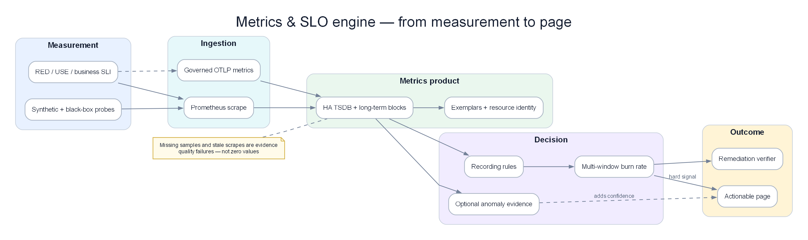
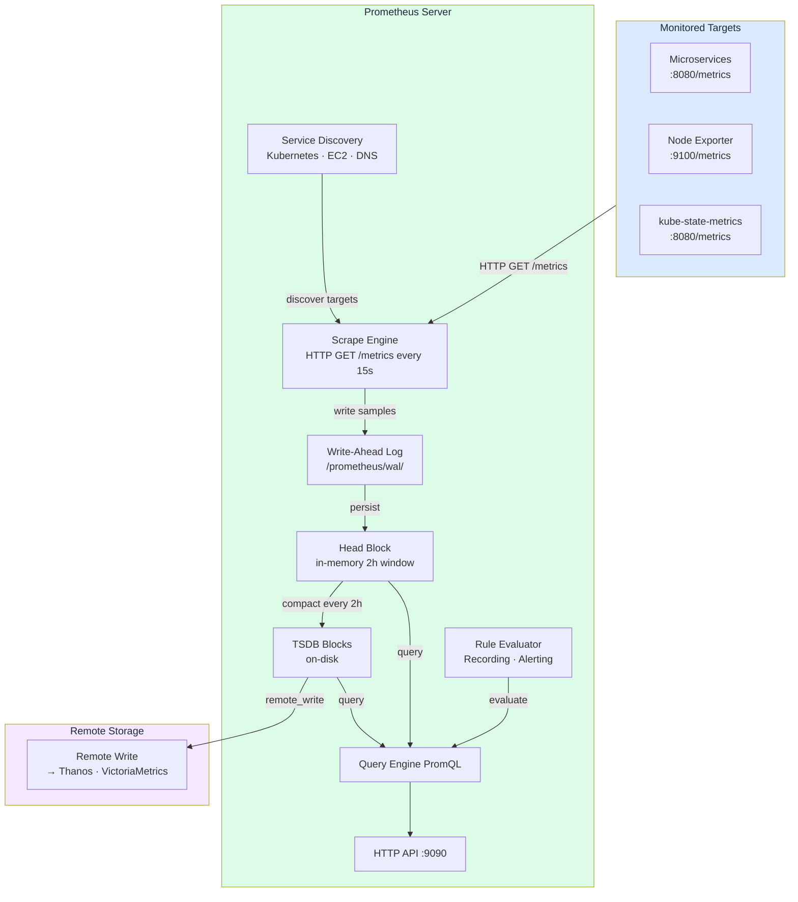
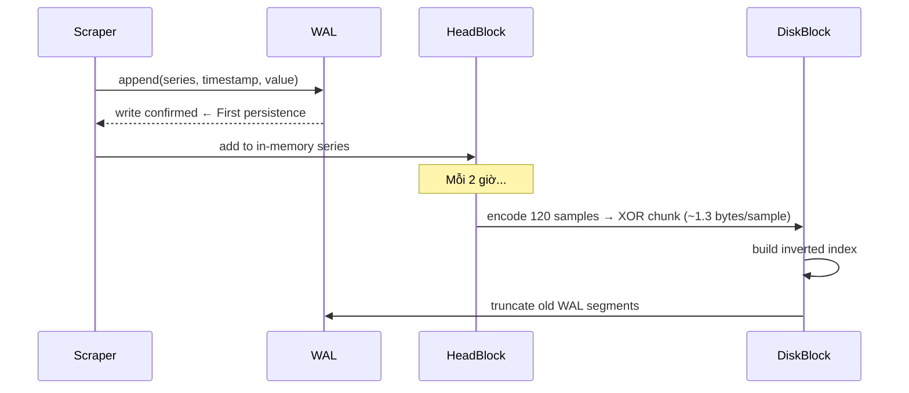
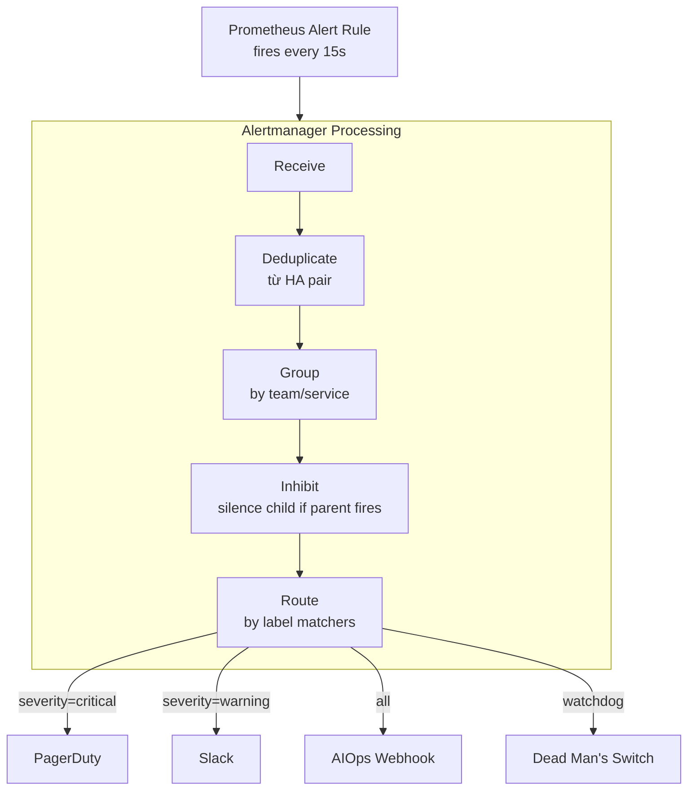
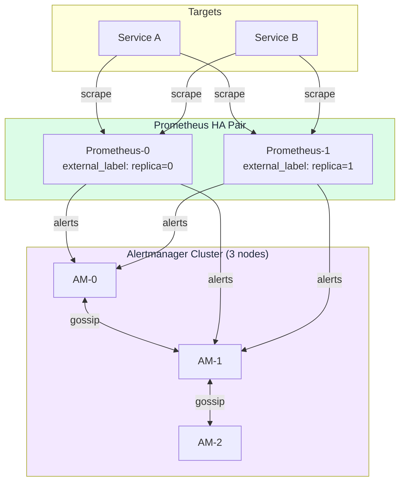
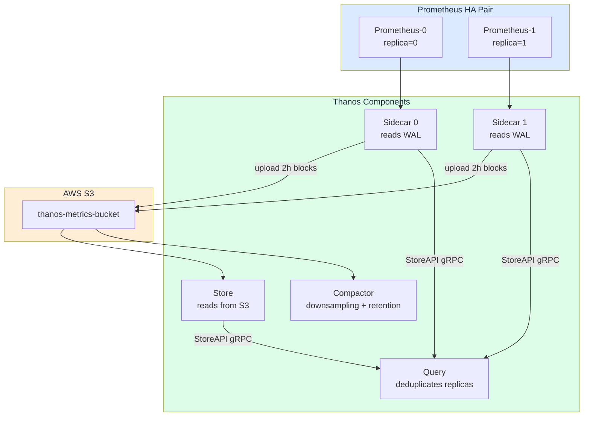
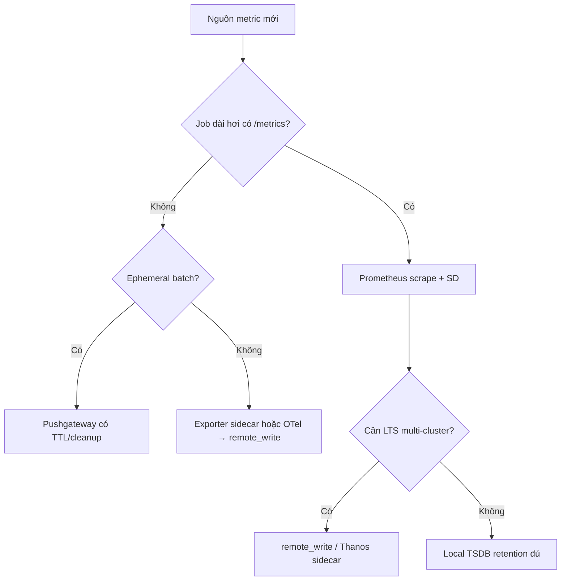
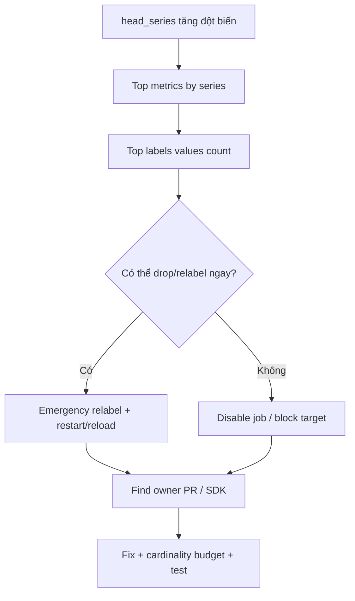
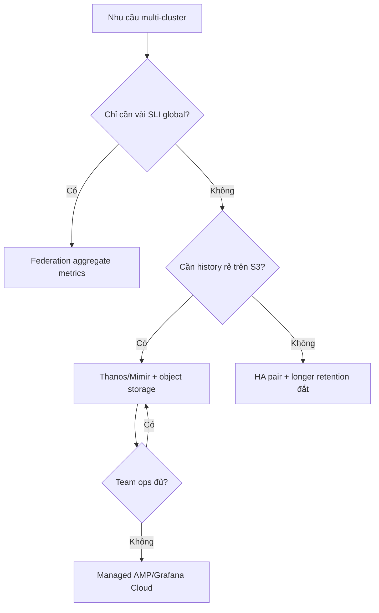

# Chapter 03 — Metric evidence và feature engineering với Prometheus

> **Prometheus chỉ là nguồn dữ liệu. Giá trị AIOps nằm ở việc biến counter, gauge và histogram thành evidence có đúng mẫu số, đúng cửa sổ, đúng freshness và đúng phạm vi. Chương này dùng các dãy số cụ thể để chỉ ra khi nào một metric nói thật, nói thiếu hoặc khiến detector kết luận ngược.**



*Poster: từ metric contract tới SLI, burn-rate đa cửa sổ, feature có lineage và quyết định có trạng thái.*

---

## Prerequisites

- [01 — Observability](../01-observability/README.vi.md) — các loại metrics và PromQL cơ bản
- [02 — OpenTelemetry](../02-opentelemetry/README.vi.md) — cách metrics di chuyển vào Prometheus

## Related Documents

- [09 — Anomaly Detection](../09-anomaly-detection/README.vi.md) — metrics của Prometheus làm input
- [10 — Alert Correlation](../10-alert-correlation/README.vi.md) — tiêu thụ alerts từ Prometheus

## Next Reading

Sau chương này, hãy chuyển sang [04 — Loki](../04-loki/README.vi.md).

---

## Cách đọc chương này

Phần I đi từ raw samples tới feature/alert có thể dùng trong Chapter 09. Phần II giữ reference về Prometheus, TSDB, PromQL, HA và storage. Mọi công thức ở Phần I đều đi kèm một dãy số và một case mà cách tính ngây thơ thất bại.

## Phần I — Khi time series trở thành evidence

### Dãy số không tự mang ý nghĩa

Trong incident payment, engine đọc năm chuỗi theo phút:

| Phút | Requests | Errors | P99 | DB pool | Retry ratio |
|---:|---:|---:|---:|---:|---:|
| 10:08 | 4.080 | 20 | 438 ms | 51% | 2% |
| 10:09 | 4.110 | 22 | 451 ms | 55% | 2% |
| 10:10 | 4.130 | 31 | 490 ms | 64% | 3% |
| 10:11 | 4.150 | 50 | 610 ms | 76% | 4% |
| 10:12 | 4.140 | 184 | 1.420 ms | 91% | 12% |
| 10:13 | 4.120 | 391 | 3.100 ms | 98% | 22% |
| 10:14 | 4.100 | 738 | 5.800 ms | 100% | 31% |

Error count tăng 20 → 738 là thật, nhưng feature hữu ích là error ratio 0,49% → 18%. P99 tăng sau pool pressure; retry ratio tăng sau error, nên retry hợp lý là amplifier. CPU không có trong bảng vì nó không giúp phân biệt candidate ở thời điểm này.

Một feature phải ghi: value, event interval, scope, denominator, freshness, source và quality flags. `error_rate=0.18` mà không biết có 10 hay 10.000 requests là evidence thiếu.

### Counter reset: số âm không phải traffic âm

Counter requests được scrape: `100, 110, 125, 3, 15, 28`.

Delta ngây thơ cho: `10, 15, -122, 12, 13`. Giá trị `-122` không mô tả thế giới; process restart và counter về 0. Cách xử lý counter-aware tính mức tăng qua reset dựa samples quanh biên, nhưng vẫn có uncertainty: giữa hai scrape có thể đã tăng rồi reset, nên phần trước reset bị mất.

Edge cases:

- Hai reset trong một scrape interval làm undercount.
- Counter giảm do exporter bug, không phải restart.
- Hai pod có cùng label set bị cộng trộn trước khi rate, reset của một pod làm méo chuỗi.
- Counter từ batch job biến mất sau khi chạy; absence không phải reset.

Quy tắc thực dụng: tính rate per-instance trước, xử lý reset, rồi aggregate theo service. Aggregate counter trước có thể che reset.

### Missing, stale và zero là ba trạng thái khác nhau

Chuỗi errors: `12, 14, missing, missing, 11`.

Nếu điền zero, graph tạo “recovery” hai phút. Nhưng requests cùng lúc là `4.100, 4.080, missing, missing, 4.020`; cả numerator lẫn denominator biến mất, khả năng cao scrape/telemetry lỗi. Nếu errors missing nhưng requests còn 4.000, exporter có thể đổi metric name/schema. Nếu requests bằng zero và `up=1`, service có thể thật sự không có traffic.

Detector nên nhận một trong bốn state:

- observed value;
- observed zero với denominator hợp lệ;
- missing trong allowed lateness;
- stale/unknown sau lateness.

Unknown không được dùng để đóng incident. Recovery cần user outcome quan sát được và collection health đạt yêu cầu.

### Rate window: nhanh phát hiện và chống nhiễu không thể tối ưu bằng một cửa sổ

Errors mỗi phút: `2, 3, 2, 3, 60, 75, 82, 80, 78, 74` trên 1.000 requests/phút.

- Cửa sổ 1 phút thấy spike ngay nhưng dễ flapping.
- Cửa sổ 5 phút ở phút đầu lỗi mới khoảng `(2+3+2+3+60)/5.000 = 1,4%`, làm loãng onset.
- Cửa sổ 30 phút còn chậm hơn nhưng xác nhận burn kéo dài.

Không chọn một cửa sổ “tốt nhất”. Dùng cửa sổ ngắn cho tốc độ và cửa sổ dài cho mức tiêu error budget. Cảnh báo page có thể yêu cầu cả hai vượt ngưỡng; ticket/candidate có thể mở khi short window rất cao dù long window chưa đủ.

Khi incident đã mở, trạng thái không phụ thuộc việc 1-minute rate tạm rơi dưới threshold một phút. Lifecycle và recovery window thuộc Chapter 09 và 10.

### Low traffic: 50% error có thể chỉ là một request

Service A có 500 lỗi/10.000 requests = 5%. Service B có 1 lỗi/2 requests = 50%. Nếu xếp chỉ theo ratio, B đứng đầu dù impact nhỏ và uncertainty lớn.

Feature/alert cần volume gate hoặc interval ước lượng. Với service ít traffic, có thể:

- dùng cửa sổ dài hơn;
- kết hợp absolute failures;
- dùng Bayesian prior/historical rate;
- route thành warning thay vì page;
- vẫn page nếu mỗi request có giá trị/rủi ro rất cao như settlement.

Volume gate không áp dụng mù quáng. Một giao dịch treasury thất bại có thể nghiêm trọng dù denominator bằng một; severity cần business criticality.

### Average che tail và trộn quần thể

Chín request 100 ms và một request 5.000 ms có average 590 ms. Nếu traffic tăng, 99 request 100 ms và một request 5.000 ms cho average 149 ms — average “cải thiện” dù request xấu không đổi. Histogram/quantile cho tail tốt hơn, nhưng quantile cũng có sai số phụ thuộc bucket.

Giả sử buckets latency là 0,5 s, 1 s, 5 s, +Inf. Một spike từ 1,1 s lên 4,9 s vẫn nằm cùng bucket và P99 ước lượng kém. Bucket phải phản ánh SLO/business boundaries, không dùng mặc định cho mọi service.

Không aggregate client-side percentiles giữa instances. Percentile của percentiles không tạo global percentile đúng. Aggregate histogram counts rồi tính quantile, và giữ sample count.

### Scope: global xanh có thể che APAC đỏ

| Region | Requests/phút | Success |
|---|---:|---:|
| US | 7.000 | 99,9% |
| EU | 2.000 | 99,8% |
| APAC | 1.000 | 72,0% |
| Global | 10.000 | 97,1% |

Global 97,1% rõ là xấu trong ví dụ này, nhưng nếu APAC chỉ chiếm 1%, global có thể vẫn gần SLO. Detector cần per-scope isolation theo region/route/tenant tier có kiểm soát. Không đưa customer/order ID vào metric label để có độ chi tiết; đó là nhiệm vụ log/trace.

Scope cũng quyết định correlation. Metric global gateway 5xx có thể là symptom của cả payment và auth incidents; metric failure-family per service giúp tách.

### Burn-rate đa cửa sổ: đo tốc độ tiêu ngân sách lỗi

Với SLO success 99,9%, error budget là 0,1%. Nếu error rate hiện tại 1%, burn-rate bằng 10; duy trì mức đó sẽ tiêu ngân sách nhanh gấp mười tốc độ cho phép.

Ví dụ:

| Window | Requests | Errors | Error rate | Burn-rate |
|---|---:|---:|---:|---:|
| 5 phút | 20.000 | 3.600 | 18% | 180× |
| 1 giờ | 240.000 | 12.000 | 5% | 50× |
| 6 giờ | 1.440.000 | 14.400 | 1% | 10× |

Short + long window đều cao cho thấy incident vừa nặng vừa kéo dài. Nếu 5 phút 180× nhưng 1 giờ chỉ 0,5×, có thể là spike mới; vẫn cần candidate nhanh nhưng policy page tùy criticality. Nếu long window cao mà short đã thấp, hệ có thể ở Recovering; chưa nên tuyên bố “không có incident”.

Không dùng burn-rate khi SLO/denominator sai. Planned traffic shed có thể giảm denominator làm ratio đổi; synthetic traffic không nên trộn với customer traffic.

### Baseline và seasonality: so residual, không đóng băng raw traffic

Traffic bình thường theo giờ: `4.000, 4.300, 5.100, 6.800, 8.900` requests/phút trong flash sale. Đóng băng raw baseline 4.000 sẽ coi mọi phút sau là anomaly. Điều cần theo dõi là residual so với expected traffic/seasonal model và quan hệ với outcome/saturation.

Trong flash sale hợp lệ:

- requests +122%;
- CPU 43% → 78%;
- P99 420 → 680 ms;
- success vẫn 99,7%;
- DB pool 48% → 66%;
- burn-rate dưới page threshold.

Đây là regime shift hợp lệ. Trong payment incident, traffic gần như không đổi nhưng pool/retry/error residual cùng lệch. Detector Chapter 09 freeze anomaly-contaminated residual baseline trong Firing, đồng thời có shadow baseline để đánh giá regime mới.

### Cardinality: mỗi label là phép nhân

Một metric có 20 services × 3 environments × 4 regions × 50 routes × 10 status/error classes = 120.000 series. Thêm `pod` trung bình 30 replica thành 3,6 triệu. Thêm `customer_id` 1 triệu thành con số không thể vận hành.

Không chỉ storage tăng. Query/rule evaluation chậm, remote-write queue đầy, detector mất freshness đúng lúc incident. Cardinality incident của observability plane có thể che production incident.

Mỗi label cần trả lời:

- Decision nào cần dimension này?
- Cardinality upper bound là bao nhiêu?
- Giá trị có lifecycle/tombstone thế nào?
- Có thể giữ ở log/trace thay vì metrics không?
- Recording rule có aggregate trước khi downstream đọc không?

Drop label ở ingest có thể cứu TSDB nhưng làm mất tenant/region evidence. Policy phải theo metric family, không regex tùy tiện toàn cục.

### Scrape và remote write tạo failure modes riêng

`up=0` có thể do service down, network policy, DNS, Prometheus overload hoặc exporter treo. Nó là collection symptom, chưa phải customer impact. So sánh synthetic/user outcome và target health để phân biệt.

HA pair scrape cùng target tạo duplicate samples ở remote store. Dedup theo replica label cần external identity đúng; clock offset và scrape interval lệch có thể tạo sawtooth/gaps. Nếu detector đọc local Prometheus A còn correlation đọc remote store dedup, hai stage có thể thấy hai “sự thật”. Data source contract phải thống nhất hoặc ghi source/version.

Remote-write backlog age quan trọng hơn queue length đơn thuần. Queue 100.000 samples ở 1 triệu samples/s chỉ là 0,1 giây; cùng queue ở 1.000 samples/s là 100 giây. Freshness theo event time quyết định evidence còn hợp lệ.

### Recording rules là feature materialization có version

Một recording rule cho `service:error_ratio:5m` là feature production. Thay grouping, denominator hay label mapping sẽ đổi nghĩa. Nó cần:

- owner và mô tả semantic;
- source metrics/version;
- evaluation interval và window;
- missing/reset behavior;
- cardinality budget;
- unit test với dãy số;
- dual-run khi thay version;
- consumers và deprecation window.

Nếu rule mới loại traffic `status=499` nhưng detector model học trên rule cũ, đây là training-serving/semantic skew. Không deploy như thay tên dashboard.

### Metric quality SLO

| Chỉ số | Mục tiêu ví dụ | Hậu quả khi fail |
|---|---:|---|
| Critical scrape freshness P99 | < 45 giây | Detector chuyển degraded/unknown |
| Series churn | Trong budget theo service | Cảnh báo schema/cardinality incident |
| Rule evaluation miss | 0 critical groups | Feature gap, không fill zero |
| Remote-write oldest sample | < 60 giây | RCA biết metrics đang cũ |
| Counter reset anomaly | Có giải thích bằng restart/change | Quarantine exporter bug |
| Denominator availability | > 99,9% | Ratio không hợp lệ nếu thiếu |
| Label contract validity | > 99,9% | Identity mismatch không merge im lặng |

### Edge cases khó và thường gặp

**Autoscaling.** Pod count tăng làm sum CPU tăng dù per-pod load giảm. Chọn aggregate theo câu hỏi capacity hay saturation; không dùng sum CPU làm anomaly user impact.

**Cold start.** Pod mới có histogram/counter ít samples, P99 nhảy. Volume gate và deployment context tránh page giả.

**Clock/timezone.** Prometheus timestamp thường theo scrape time, exporter timestamp có thể khác. Backfilled samples tới muộn không được sửa incident onset mà không revision policy.

**Pushgateway batch metric bất tử.** Job hôm qua vẫn success=1 nếu không delete. Cần completion timestamp/freshness, không chỉ giá trị.

**Histogram schema đổi.** Hai deployment dùng bucket khác nhau; aggregate tạo kết quả vô nghĩa hoặc query drop series. Dual-read/version gate trong rollout.

**Alert flapping.** Một sample vượt threshold rồi một scrape mất. `for` chỉ giảm một số noise; lifecycle, missing state và hysteresis mới giải quyết đầy đủ.

**Traffic shed.** Error count giảm vì hệ từ chối request trước service, không phải recovery. Quan sát accepted, rejected và demand estimate.

**Coordinated omission.** Client ngừng gửi khi latency cao, server metric trông đỡ. Synthetic/client-side SLI bổ sung demand bị mất.

### Failure injection và acceptance

Golden metric replay gồm:

1. Counter reset đúng lúc deploy.
2. Hai phút scrape gap giữa incident.
3. Flash sale traffic +122% nhưng không customer impact.
4. APAC partial outage bị global average che.
5. Histogram buckets thay đổi giữa rolling deploy.
6. Remote-write lag 8 phút và HA duplicate.
7. Payment fault kéo dài 54 phút rồi auth fault nổ chồng.

Điều kiện đạt:

- Không tạo negative rate từ reset.
- Missing không biến thành zero/recovery.
- Flash sale không page; payment page liên tục.
- APAC được phát hiện theo scope.
- Features công bố denominator, freshness và version.
- Replay local/remote store cho cùng quyết định trong allowed tolerance.
- Cardinality/telemetry failure tạo quality incident và hạ confidence production incident.

### Output contract sang Chapter 09–10

Metric feature xuất sang intelligence plane gồm: name/version, value/unit, scope, event interval, numerator/denominator, sample count, freshness, quality flags, source và baseline context. Alert chỉ là một consumer; anomaly detector, correlator và RCA đều cần raw evidence/feature, không nên chỉ nhận chuỗi text từ Alertmanager.

---

## Phần II — Prometheus implementation reference

Phần dưới giải thích kiến trúc Prometheus, TSDB, scraping, PromQL, recording/alerting rules, HA, remote storage và vận hành. Dùng nó để bảo vệ semantic/freshness của feature ở Phần I.

---

## 1. Why Prometheus?

> [!NOTE]
> **Ý TƯỞNG**
> Prometheus được thiết kế với một triết lý đơn giản: **pull-based scraping + multi-dimensional labels + PromQL**. Thay vì chờ services gửi data về, Prometheus chủ động hỏi "/metrics" của mỗi service mỗi 15 giây. Điều này cho phép biết ngay khi nào một service ngừng hoạt động (không trả lời scrape = down).

> [!TIP]
> **Vì sao Pull thay vì Push?** Pull-based có 3 ưu điểm: (1) Prometheus kiểm soát tần suất thu thập, không bị services "spam" data; (2) Nếu service down → Prometheus phát hiện ngay (scrape fail); (3) Dễ debug hơn: bạn có thể curl trực tiếp `/metrics` endpoint để xem raw data. Trade-off: services trong private network cần Pushgateway cho batch jobs ngắn.

### Design Philosophy

1. **Pull-based scraping**: Prometheus poll targets, không đợi push. Dễ phát hiện service down.
2. **Multi-dimensional data model**: Labels là first-class citizens. Mỗi time series = `metric_name{label_key="value"}`
3. **PromQL**: Ngôn ngữ query chuyên biệt cho time series. Không phải SQL.
4. **Không lưu trữ dài hạn**: Chỉ ~15 ngày local. Long-term storage qua remote write → Thanos/VictoriaMetrics.
5. **Single binary**: Không cần external DB, không cần ZooKeeper.

### What Prometheus Is Good At

- Thu thập metrics cho infrastructure và application monitoring
- Service discovery động (Kubernetes, EC2)
- Flexible PromQL queries
- Alert evaluation với biểu thức phức tạp

### What Prometheus Is NOT Good At

| Không phù hợp | Thay thế |
|--------|---------|
| Long-term storage (> 15 ngày) | Thanos hoặc VictoriaMetrics |
| High-cardinality (> 10M series) | VictoriaMetrics |
| Horizontal write scaling | VictoriaMetrics Cluster |
| Event data (logs, traces) | Loki (logs), Tempo (traces) |

---

## 2. Internal Architecture

> [!NOTE]
> **Ý TƯỞNG**
> Prometheus là một monolith — tất cả trong một binary: scrape engine, TSDB, rule evaluator, query engine, HTTP API. Luồng data đơn giản: Service → Scrape Engine → WAL → Head Block (memory) → TSDB Blocks (disk) → Remote Write (long-term).


```mermaid
graph TD
    subgraph Targets["Monitored Targets"]
        SVC[Microservices\n:8080/metrics]
        NODE[Node Exporter\n:9100/metrics]
        K8S[kube-state-metrics\n:8080/metrics]
    end

    subgraph Prometheus["Prometheus Server"]
        SD[Service Discovery\nKubernetes · EC2 · DNS]
        SCRAPE[Scrape Engine\nHTTP GET /metrics every 15s]
        WAL[Write-Ahead Log\n/prometheus/wal/]
        HEAD[Head Block\nin-memory 2h window]
        TSDB[TSDB Blocks\non-disk]
        RULES[Rule Evaluator\nRecording · Alerting]
        QENG[Query Engine PromQL]
        API[HTTP API :9090]
    end

    subgraph Remote["Remote Storage"]
        RW[Remote Write\n→ Thanos · VictoriaMetrics]
    end

    SD -->|discover targets| SCRAPE
    Targets -->|HTTP GET /metrics| SCRAPE
    SCRAPE -->|write samples| WAL
    WAL -->|persist| HEAD
    HEAD -->|compact every 2h| TSDB
    TSDB -->|query| QENG
    HEAD -->|query| QENG
    QENG --> API
    RULES -->|evaluate| QENG
    TSDB -->|remote_write| RW

    style Targets fill:#dbeafe,color:#1e293b
    style Prometheus fill:#dcfce7,color:#1e293b
    style Remote fill:#f3e8ff,color:#1e293b
```

### Key Endpoints

| Endpoint | Mô tả |
|----------|-------------|
| `/api/v1/query` | Instant query |
| `/api/v1/query_range` | Range query (cho dashboards) |
| `/api/v1/targets` | Tất cả discovered targets + health |
| `/api/v1/alerts` | Alerts đang active |
| `/api/v1/write` | Remote write endpoint |
| `/-/reload` | Reload config |
| `/-/ready` | Readiness check |

---

## 3. TSDB Internals

> [!NOTE]
> **Ý TƯỞNG**
> TSDB (Time Series Database) của Prometheus dùng hai cơ chế chính: **WAL** (Write-Ahead Log) để đảm bảo không mất data khi crash, và **XOR delta encoding** (thuật toán Gorilla của Facebook) để nén data 12x so với raw binary. Nếu bạn lưu trữ 1M series × 1 sample/15s → chỉ tốn ~7.5GB/ngày thay vì 90GB nếu lưu raw.

### Data Organization

```
/prometheus/data/
├── 01HQRZ.../          ← Block (2h window)
│   ├── chunks/
│   │   ├── 000001      ← Compressed time series data
│   │   └── 000002
│   ├── index           ← Inverted index: label→series→chunks
│   └── meta.json       ← Block metadata
├── 01HQSA.../          ← Older block
└── wal/                ← Write-Ahead Log (dữ liệu mới nhất)
    ├── 00000000
    └── checkpoint.000000X/
```

### Write Path


```mermaid
sequenceDiagram
    participant Scraper
    participant WAL
    participant HeadBlock
    participant DiskBlock

    Scraper->>WAL: append(series, timestamp, value)
    WAL-->>Scraper: write confirmed  ← First persistence
    Scraper->>HeadBlock: add to in-memory series
    
    Note over HeadBlock: Mỗi 2 giờ...
    HeadBlock->>DiskBlock: encode 120 samples → XOR chunk (~1.3 bytes/sample)
    DiskBlock->>DiskBlock: build inverted index
    DiskBlock->>WAL: truncate old WAL segments
```

### WAL (Write-Ahead Log)

> [!IMPORTANT]
> **Lưu ý WAL**: WAL corruption = mất data. Giám sát `prometheus_tsdb_wal_corruptions_total` và alert khi > 0.
>
> ```promql
> prometheus_tsdb_wal_corruptions_total   # Alert khi > 0
> prometheus_tsdb_wal_replay_duration_seconds  # Thời gian replay khi restart
> ```
>
> **Ước tính thời gian restart**: 1 phút để replay mỗi 1GB WAL.

### Chunk Encoding — XOR Delta (Gorilla Compression)

> [!TIP]
> **Tại sao Gorilla compression đạt 1.3 bytes/sample?** Timestamps thường cách nhau 15s đều đặn → delta nhỏ → delta-of-delta còn nhỏ hơn → encode trong 1-2 bits. Values thay đổi ít giữa 2 scrapes → XOR chủ yếu là 0 → nén tốt.
>
> So sánh với raw storage: 8 bytes (float64) + 8 bytes (int64 timestamp) = 16 bytes/sample. Với Gorilla: **~1.3 bytes/sample = 12x compression**.

**Ước tính storage**:

```
1 triệu active series
× 1 sample mỗi 15 giây
× 1.3 bytes/sample
× 86400 giây/ngày
= 7.5 GB/ngày

Retention 15 ngày: 112 GB cho 1M series @ 15s resolution
```

### Block Compaction

```
2h blocks → compact → 6h blocks → compact → 18h blocks → compact → 36h blocks
```

**Retention configuration**:

```yaml
# CLI flags khi khởi động Prometheus
--storage.tsdb.retention.time=15d      # Xóa data cũ hơn 15 ngày
--storage.tsdb.retention.size=500GB    # Hoặc khi vượt quá 500GB
--storage.tsdb.path=/prometheus/data
```

---

## 4. The Scraping Engine

> [!NOTE]
> **Ý TƯỞNG**
> Scrape engine là vòng lặp đơn giản: mỗi 15 giây, Prometheus HTTP GET `/metrics` của mỗi target, parse Prometheus exposition format, áp dụng relabeling rules, rồi write vào TSDB. Phần khó nhất là **relabeling**: dùng regex để filter/transform metric labels trước khi lưu — không làm đúng sẽ lưu rác vào TSDB.

### Key Scrape Configuration

```yaml
global:
  scrape_interval: 15s       # Tần suất scrape — giảm xuống 5s nếu cần độ phân giải cao hơn
  scrape_timeout: 10s        # PHẢI < scrape_interval
  evaluation_interval: 15s   # Tần suất đánh giá rules
  
  external_labels:
    cluster: prod-us-east-1  # Bắt buộc cho Thanos deduplication
    replica: '$(POD_NAME)'   # Khác nhau giữa HA pair

scrape_configs:
  - job_name: kubernetes-pods
    honor_labels: false      # Không để target ghi đè label job/instance
    
    kubernetes_sd_configs:
      - role: pod
        
    relabel_configs:
      # Chỉ scrape pods có annotation "prometheus.io/scrape: true"
      - source_labels: [__meta_kubernetes_pod_annotation_prometheus_io_scrape]
        action: keep
        regex: "true"
        
      # Dùng cổng tùy chỉnh từ annotation
      - source_labels: [__address__, __meta_kubernetes_pod_annotation_prometheus_io_port]
        action: replace
        regex: ([^:]+)(?::\d+)?;(\d+)
        replacement: $1:$2
        target_label: __address__
        
      # Gắn k8s metadata làm labels
      - source_labels: [__meta_kubernetes_namespace]
        target_label: namespace
      - source_labels: [__meta_kubernetes_pod_name]
        target_label: pod
        
    metric_relabel_configs:
      # Bỏ high-cardinality Go runtime metrics trước khi lưu
      - source_labels: [__name__]
        action: drop
        regex: "go_gc_.*|go_memstats_alloc_bytes_total"
```

---

## 5. Service Discovery

> [!NOTE]
> **Ý TƯỞNG**
> Service discovery là lý do Prometheus hoạt động tốt trong môi trường Kubernetes động — không cần cấu hình static target list. Prometheus tự động phát hiện pods/services/nodes mới và bắt đầu scrape ngay khi chúng xuất hiện.

### Kubernetes SD Roles

| Role | Discovers | Metadata labels |
|------|-----------|--------------------|
| `node` | Tất cả K8s nodes | Node labels, annotations |
| `pod` | Tất cả pods | Pod labels, container info |
| `service` | Tất cả services | Service labels, annotations |
| `endpoints` | Service endpoint IPs | Pod + service metadata |

### Standard Pod Annotations

```yaml
# Thêm vào Deployment/Pod spec để Prometheus tự động scrape
metadata:
  annotations:
    prometheus.io/scrape: "true"
    prometheus.io/port: "8080"
    prometheus.io/path: "/actuator/prometheus"  # Spring Boot
```

### Relabeling Reference

```
Các actions:
- keep:      Bỏ qua targets KHÔNG khớp regex
- drop:      Bỏ qua targets khớp regex
- replace:   Thay thế label value bằng regex capture
- labelmap:  Copy labels matching regex
- labeldrop: Xóa labels matching regex
- hashmod:   Hash label value modulo N (cho sharding)
```

> **Quan trọng**: `__meta_*` labels chỉ available trong `relabel_configs`. Sau relabeling, tất cả `__meta_*` bị xóa — chỉ labels không có prefix `__` được ghi vào TSDB.

---

## 6. PromQL Deep Dive

> [!NOTE]
> **Ý TƯỞNG**
> PromQL có 2 loại vector: **Instant vector** (giá trị tại một thời điểm) và **Range vector** (giá trị trong khoảng thời gian). Hầu hết functions quan trọng (`rate()`, `histogram_quantile()`) cần Range vector. Sai lầm phổ biến: quên bọc counter trong `rate()` → nhìn thấy số cứ tăng mãi, không phải tốc độ.

### Selector Types

```promql
# Instant vector — tất cả series tại thời điểm hiện tại
http_requests_total{job="api-server", status=~"5..", namespace!="test"}

# Range vector — giá trị trong 5 phút — cần cho rate()
http_requests_total[5m]

# Offset — nhìn về quá khứ 1 giờ
http_requests_total offset 1h
```

### Essential Functions

```promql
# rate — tốc độ tăng/giây của counter (tự handle counter resets)
rate(http_requests_total[5m])

# histogram_quantile — tính P95/P99 từ histogram buckets
histogram_quantile(0.95, rate(http_request_duration_seconds_bucket[5m]))

# increase — tổng tăng trong 1h (= rate × 3600)
increase(http_requests_total[1h])

# Aggregation operators
sum(rate(http_requests_total[5m])) by (service)
topk(5, rate(http_requests_total[5m]))
count(up == 1) by (job)
```

### Common Production Queries

```promql
# Tỷ lệ lỗi theo service — dùng cho SLO dashboards
sum by (service) (rate(http_requests_total{status=~"5.."}[5m]))
/
sum by (service) (rate(http_requests_total[5m]))

# SLO availability (30 ngày)
1 - (
  sum(rate(http_requests_total{status=~"5.."}[30d]))
  /
  sum(rate(http_requests_total[30d]))
)

# Latency P99 theo service
histogram_quantile(0.99,
  sum by (service, le) (
    rate(http_request_duration_seconds_bucket[5m])
  )
)

# CPU throttling ratio (containers bị giới hạn CPU)
sum by (pod) (rate(container_cpu_cfs_throttled_seconds_total[5m]))
/
sum by (pod) (rate(container_cpu_cfs_periods_total[5m]))

# Kafka consumer lag (giám sát AIOps pipeline)
sum by (consumer_group, topic) (
  kafka_consumer_group_current_offset - kafka_consumer_group_committed_offset
)
```

---

## 7. Recording Rules

> [!NOTE]
> **Ý TƯỞNG**
> Recording rules tính toán trước các queries tốn kém và lưu kết quả như metrics mới. Thay vì mỗi dashboard request tính P99 latency trên 30 ngày data, recording rule tính sẵn mỗi 30 giây và lưu kết quả → dashboards load trong <1 giây thay vì 30+ giây.

> [!TIP]
> **Vì sao recording rules quan trọng cho SLO alerting?** Multi-window burn-rate alerting (như cửa sổ 1h, 6h, 30d) nếu không có recording rules sẽ phải tính toán trực tiếp → cực kỳ tốn kém. Recording rules cho phép tính sẵn các tỷ lệ lỗi theo các window khác nhau.

```yaml
groups:
  - name: http.rules
    interval: 30s   # Đánh giá mỗi 30s
    rules:
      # Pre-compute request rate theo service
      - record: job:http_requests:rate5m
        expr: sum by (job) (rate(http_requests_total[5m]))
          
      # Pre-compute error rate — dùng cho SLO burn-rate alerting
      - record: job:http_error_rate:ratio5m
        expr: |
          sum by (job) (rate(http_requests_total{status=~"5.."}[5m]))
          /
          sum by (job) (rate(http_requests_total[5m]))
          
      # Pre-compute P99 latency
      - record: job:http_request_duration_p99:5m
        expr: |
          histogram_quantile(0.99,
            sum by (job, le) (
              rate(http_request_duration_seconds_bucket[5m])
            )
          )
          
      # Pre-compute cho multi-window burn-rate alerting
      - record: job:http_error_rate:ratio1h
        expr: |
          sum by (job) (rate(http_requests_total{status=~"5.."}[1h]))
          /
          sum by (job) (rate(http_requests_total[1h]))
          
      - record: job:http_error_rate:ratio6h
        expr: |
          sum by (job) (rate(http_requests_total{status=~"5.."}[6h]))
          /
          sum by (job) (rate(http_requests_total[6h]))
```

**Naming convention**: `level:metric:operation_range`

```
job:http_requests:rate5m
^   ^             ^   ^
|   |             |   Time window
|   Metric name   Operation
Aggregation level
```

---

## 8. Alerting Rules and Alertmanager

> [!NOTE]
> **Ý TƯỞNG**
> Alert pipeline trong Prometheus hoạt động qua 2 thành phần: **Prometheus** (đánh giá alert rules mỗi 15 giây) và **Alertmanager** (nhận alerts, deduplicate, group, route đến đúng channels). Alertmanager là "smart router" — nó biết: "alert này của team payments → gửi vào #payments-oncall", "alert severity=critical → PagerDuty ngay", "alert này là child của cluster down → im lặng (inhibit)".

### Alert Rule Structure

```yaml
groups:
  - name: service.alerts
    rules:
      - alert: ServiceHighErrorRate
        expr: job:http_error_rate:ratio5m > 0.05   # Dùng recording rule!
        for: 5m                 # Phải đúng 5 phút liên tục mới fire
        labels:
          severity: critical
          runbook: "https://runbooks.internal/high-error-rate"
        annotations:
          summary: "High error rate on {{ $labels.job }}"
          description: |
            Error rate {{ $value | humanizePercentage }} (threshold: 5%)
          dashboard: "https://grafana.internal/d/service-overview?var-job={{ $labels.job }}"
```

### Alertmanager Architecture


```mermaid
graph TD
    PROM[Prometheus Alert Rule\nfires every 15s] --> AM[Alertmanager]
    
    subgraph AM["Alertmanager Processing"]
        RECV[Receive] --> DEDUP[Deduplicate\n từ HA pair]
        DEDUP --> GROUP[Group\nby team/service]
        GROUP --> INHIB[Inhibit\nsilence child if parent fires]
        INHIB --> ROUTE[Route\nby label matchers]
    end
    
    ROUTE -->|severity=critical| PD[PagerDuty]
    ROUTE -->|severity=warning| SLACK[Slack]
    ROUTE -->|all| AIOPS[AIOps Webhook]
    ROUTE -->|watchdog| WD[Dead Man's Switch]
```

### Alertmanager Configuration

```yaml
global:
  resolve_timeout: 5m

route:
  receiver: slack-default
  group_by: [alertname, cluster, service]
  group_wait: 30s       # Chờ trước khi gửi alert đầu tiên trong group
  group_interval: 5m    # Chờ trước khi gửi update cho group
  repeat_interval: 12h  # Gửi lại nếu alert vẫn firing
  
  routes:
    # Critical → PagerDuty ngay
    - match:
        severity: critical
      receiver: pagerduty
      group_wait: 0s    # Không chờ cho critical
      continue: true    # Tiếp tục routing các rules khác
      
    # Tất cả → AIOps correlation engine
    - match_re:
        severity: "critical|warning"
      receiver: aiops-webhook
      continue: true
      
    # Dead man's switch
    - match:
        alertname: DeadMansSwitch
      receiver: watchdog
      repeat_interval: 5m

inhibit_rules:
  # Nếu cluster down → im lặng service-level warnings
  - source_match:
      alertname: KubernetesNodeDown
    target_match:
      severity: warning
    equal: [cluster]
    
  # Nếu service down → im lặng ServiceHighErrorRate
  - source_match:
      alertname: ServiceDown
    target_match:
      alertname: ServiceHighErrorRate
    equal: [job, namespace]

receivers:
  - name: pagerduty
    pagerduty_configs:
      - routing_key_file: /etc/alertmanager/pagerduty-key
        severity: "{{ if eq .CommonLabels.severity \"critical\" }}critical{{ else }}warning{{ end }}"

  - name: aiops-webhook
    webhook_configs:
      - url: http://aiops-correlation-engine.aiops.svc.cluster.local:8080/api/v1/alerts
        send_resolved: true
        max_alerts: 0     # Gửi tất cả alerts, không limit

  - name: watchdog
    webhook_configs:
      - url: https://hc-ping.com/${HC_UUID}   # healthchecks.io
```

### Alertmanager Clustering (HA)

> [!TIP]
> **Tại sao Alertmanager cluster 3 nodes?** Alertmanager dùng gossip protocol (memberlist) để deduplicate notifications. Nếu cả Prometheus-0 và Prometheus-1 (HA pair) cùng fire cùng một alert, chỉ 1 trong 3 Alertmanager nodes gửi notification đến PagerDuty. Không có cluster → bạn nhận 2 pages cho cùng 1 incident.

```yaml
# Khởi động với cluster peers
alertmanager \
  --cluster.listen-address=0.0.0.0:9094 \
  --cluster.peer=alertmanager-1.alertmanager.svc:9094 \
  --cluster.peer=alertmanager-2.alertmanager.svc:9094 \
  --cluster.peer=alertmanager-3.alertmanager.svc:9094
```

---

## 9. Remote Write and Remote Read

> [!NOTE]
> **Ý TƯỞNG**
> Remote write là cách Prometheus gửi data ra ngoài để lưu trữ lâu dài. Prometheus ghi vào WAL local trước, sau đó WAL tail reader gộp thành batches và gửi đến Thanos/VictoriaMetrics qua HTTP. Nếu remote write bị lag (queue tăng) → data cũ bị drop. Đây là lý do cần monitor `prometheus_remote_storage_pending_samples`.

### Remote Write Configuration

```yaml
remote_write:
  - url: https://thanos-receiver.observability.svc:19291/api/v1/receive
    
    bearer_token_file: /etc/prometheus/remote-write-token
    tls_config:
      ca_file: /certs/ca.crt
      
    # Tuning quan trọng nhất
    queue_config:
      capacity: 10000           # Samples trong memory trước khi block
      max_shards: 50            # Goroutines gửi song song (tăng khi traffic cao)
      min_shards: 5
      max_samples_per_send: 5000
      batch_send_deadline: 5s
      
    # Chỉ gửi SLO-related metrics ra ngoài — giảm chi phí
    write_relabel_configs:
      - source_labels: [__name__]
        action: keep
        regex: "job:.*|slo:.*|recording:.*"
```

**Monitoring remote write queue**:

```promql
# Số samples đang chờ gửi — nếu tăng liên tục → trouble
prometheus_remote_storage_pending_samples

# Samples gửi thất bại — phải = 0
prometheus_remote_storage_failed_samples_total

# Alert khi queue lag > 2 phút
- alert: PrometheusRemoteWriteBehind
  expr: |
    (time() - prometheus_remote_storage_queue_highest_sent_timestamp_seconds) > 120
  for: 5m
  labels:
    severity: critical
```

---

## 10. High Availability

> [!NOTE]
> **Ý TƯỞNG**
> HA Pair là mô hình tối giản: 2 Prometheus instances giống nhau, cùng scrape cùng targets. Nếu 1 instance crash, instance kia vẫn hoạt động. Vấn đề: 2 instances lưu data riêng biệt → kết quả query có thể hơi khác nhau. Giải pháp: Thanos Query làm lớp deduplication phía trước.

### HA Pair Architecture


```mermaid
graph TD
    subgraph Targets
        T1[Service A]
        T2[Service B]
    end

    subgraph HA["Prometheus HA Pair"]
        P1[Prometheus-0\nexternal_label: replica=0]
        P2[Prometheus-1\nexternal_label: replica=1]
    end

    subgraph AM["Alertmanager Cluster (3 nodes)"]
        AM1[AM-0] <-->|gossip| AM2[AM-1] <-->|gossip| AM3[AM-2]
    end

    T1 -->|scrape| P1
    T1 -->|scrape| P2
    T2 -->|scrape| P1
    T2 -->|scrape| P2

    P1 -->|alerts| AM1
    P1 -->|alerts| AM2
    P2 -->|alerts| AM1
    P2 -->|alerts| AM2

    style HA fill:#dcfce7,color:#1e293b
    style AM fill:#f3e8ff,color:#1e293b
```

---

## 11. Prometheus vs CloudWatch

| Tiêu chí | Prometheus | AWS CloudWatch |
|-----------|-----------|----------------|
| **Model** | Pull (scrape) | Push (PutMetricData) |
| **Query language** | PromQL (rất mạnh) | Metric Math (cơ bản) |
| **Retention** | 15d local, unlimited qua Thanos | 15 tháng (coarser resolution theo thời gian) |
| **Cardinality** | Không giới hạn (RAM-bound) | 30 dimensions/metric max |
| **Chi phí (1M metrics/ngày)** | ~$5–20/tháng (infra) | ~$300/tháng ($0.30/metric) |
| **AWS integration** | Qua CloudWatch Exporter | Native |
| **Multi-cloud** | ✅ | ❌ AWS only |

**Khuyến nghị**:

```
AWS infrastructure metrics:   → CloudWatch (free cho EC2/RDS/EKS)
Application metrics:          → Prometheus (rẻ hơn nhiều ở scale)
Hybrid approach:              → CloudWatch Exporter → Prometheus
                                 Thống nhất query tại một Grafana
```

---

## 12. Prometheus vs VictoriaMetrics

> [!NOTE]
> **Ý TƯỞNG**
> VictoriaMetrics là "drop-in replacement" cho Prometheus — API tương thích, PromQL tương thích, nhưng hiệu năng tốt hơn nhiều: write throughput 5-10x cao hơn, compression 2-3x tốt hơn, RAM ít hơn 5-10x. Trade-off: ecosystem nhỏ hơn, không phải CNCF standard.

| Tiêu chí | Prometheus | VictoriaMetrics |
|-----------|-----------|-----------------|
| **Write throughput** | ~1M samples/s | ~5-10M samples/s |
| **Compression** | ~1.3 bytes/sample | ~0.4-0.8 bytes/sample |
| **RAM usage** | Cao (head block in memory) | 5-10x thấp hơn |
| **Horizontal write scaling** | ❌ | ✅ (VM Cluster) |
| **PromQL compatibility** | Gốc | 99% + extensions |
| **Active series limit** | ~10M (OOM risk) | 50M+ |
| **Deduplication** | Qua Thanos | Built-in |

**Khi nào chuyển sang VictoriaMetrics**:

- Cardinality > 5M active series
- RAM bị giới hạn
- Write load > 2M samples/giây
- Muốn horizontal scaling mà không muốn phức tạp của Thanos

---

## 13. Thanos Architecture

> [!NOTE]
> **Ý TƯỞNG**
> Thanos giải quyết 3 vấn đề của Prometheus: (1) Long-term storage — upload TSDB blocks lên S3 tự động; (2) HA deduplication — Query component nhận biết `replica` label và dedup data từ 2 Prometheus; (3) Global view — Query trên nhiều clusters qua một endpoint. Giá phải trả: 6-7 components cần vận hành.


```mermaid
graph TD
    subgraph Prom["Prometheus HA Pair"]
        P1[Prometheus-0\nreplica=0]
        P2[Prometheus-1\nreplica=1]
    end

    subgraph Thanos["Thanos Components"]
        SCAR1[Sidecar 0\nreads WAL]
        SCAR2[Sidecar 1\nreads WAL]
        STORE[Store\nreads from S3]
        QUERY[Query\ndeduplicates replicas]
        COMPACT[Compactor\ndownsampling + retention]
    end

    subgraph S3["AWS S3"]
        BUCKET[thanos-metrics-bucket]
    end

    P1 --> SCAR1
    P2 --> SCAR2
    SCAR1 -->|upload 2h blocks| BUCKET
    SCAR2 -->|upload 2h blocks| BUCKET
    BUCKET --> STORE
    BUCKET --> COMPACT
    SCAR1 -->|StoreAPI gRPC| QUERY
    SCAR2 -->|StoreAPI gRPC| QUERY
    STORE -->|StoreAPI gRPC| QUERY

    style Prom fill:#dbeafe,color:#1e293b
    style Thanos fill:#dcfce7,color:#1e293b
    style S3 fill:#ffedd5,color:#1e293b
```

### Thanos Components

| Component | Vai trò | Port |
|-----------|------|------|
| Sidecar | Đọc WAL, upload S3 | gRPC :10901 |
| Store | Phục vụ data S3 | gRPC :10901 |
| Query | Tổng hợp + dedup | HTTP :10902 |
| Compactor | Downsampling + retention | HTTP :10902 |

**Thanos Sidecar config**:

```yaml
thanos sidecar \
  --tsdb.path=/prometheus \
  --prometheus.url=http://localhost:9090 \
  --grpc-address=0.0.0.0:10901 \
  --objstore.config-file=/etc/thanos/s3-config.yaml \
  --min-time=-3h   # Upload blocks cũ hơn 3h
```

**S3 config**:

```yaml
type: S3
config:
  bucket: thanos-metrics-prod
  region: us-east-1
  endpoint: s3.us-east-1.amazonaws.com
  sse_config:
    type: SSE-S3
  # Dùng IRSA (IAM Roles for Service Accounts) — không dùng static credentials
```

### Thanos Compactor (Singleton)

> [!CAUTION]
> **KHÔNG chạy 2 Compactor instances song song** — sẽ corrupt S3 data.

```yaml
thanos compact \
  --objstore.config-file=/etc/thanos/s3-config.yaml \
  --retention.resolution-raw=30d \   # Giữ raw data 30 ngày
  --retention.resolution-5m=90d \    # Giữ 5m downsampling 90 ngày
  --retention.resolution-1h=1y \     # Giữ 1h downsampling 1 năm
  --wait
```

---

## 14. Production Configuration

**Full prometheus.yml skeleton**:

```yaml
global:
  scrape_interval: 15s
  scrape_timeout: 10s
  evaluation_interval: 15s
  
  external_labels:
    cluster: prod-us-east-1
    region: us-east-1
    environment: production
    replica: '$(POD_NAME)'    # Phải khác nhau giữa HA pair!

alerting:
  alertmanagers:
    - kubernetes_sd_configs:
        - role: endpoints
          namespaces: {names: [alertmanager]}
      relabel_configs:
        - source_labels: [__meta_kubernetes_service_name]
          action: keep
          regex: alertmanager

rule_files:
  - /etc/prometheus/rules/*.yaml

remote_write:
  - url: http://thanos-receive.observability.svc:19291/api/v1/receive
    queue_config:
      capacity: 10000
      max_shards: 30
      max_samples_per_send: 5000
```

**Kubernetes StatefulSet**:

```yaml
apiVersion: apps/v1
kind: StatefulSet
metadata:
  name: prometheus
  namespace: observability
spec:
  replicas: 2           # HA pair
  template:
    spec:
      containers:
        - name: prometheus
          image: prom/prometheus:v2.48.1
          args:
            - --config.file=/etc/prometheus/prometheus.yml
            - --storage.tsdb.path=/prometheus
            - --storage.tsdb.retention.time=15d
            - --storage.tsdb.retention.size=400GB
            - --web.enable-lifecycle               # Cho phép hot-reload config
            - --enable-feature=exemplar-storage    # Cần cho metric→trace navigation
            - --enable-feature=native-histograms   # Native histograms (Prometheus 2.40+)
          resources:
            requests: { cpu: "2", memory: "16Gi" }
            limits:   { cpu: "4", memory: "24Gi" }
            
        # Thanos sidecar chạy cùng pod
        - name: thanos-sidecar
          image: thanosio/thanos:v0.34.0
          args:
            - sidecar
            - --tsdb.path=/prometheus
            - --prometheus.url=http://localhost:9090
            - --grpc-address=0.0.0.0:10901
            - --objstore.config-file=/etc/thanos/s3-config.yaml
            
  volumeClaimTemplates:
    - metadata: {name: prometheus-storage}
      spec:
        accessModes: [ReadWriteOnce]
        storageClassName: gp3    # AWS EBS gp3 — tối ưu IOPS/cost
        resources:
          requests: {storage: 500Gi}
```

---

## 15. Common Mistakes

| Lỗi phổ biến | Triệu chứng | Khắc phục |
|---------|---------|-----|
| `scrape_timeout >= scrape_interval` | "context deadline exceeded" trong target status | Luôn `scrape_timeout < scrape_interval` |
| `honor_labels: true` | Targets ghi đè label job/instance | Dùng `honor_labels: false` (default) |
| Thiếu `external_labels` | Thanos không thể dedup HA pair | Luôn set unique `replica` label cho mỗi instance |
| WAL corruption không được monitor | Data loss ngầm | Alert khi `prometheus_tsdb_wal_corruptions_total > 0` |
| Remote write queue overflow | Data cũ bị drop | Monitor `prometheus_remote_storage_pending_samples` |
| Alertmanager single instance | Mất notifications khi restart | Alertmanager cluster 3 nodes |
| Không có exemplar storage | Không navigate metric→trace được | Bật `--enable-feature=exemplar-storage` |
| Histogram buckets sai | P99 inaccurate ±50% | Chọn buckets phù hợp với latency target |
| Thiếu `metric_relabel_configs` | High-cardinality metrics vào TSDB | Filter noise tại scrape time |

---

## 16. Monitoring Prometheus

> [!NOTE]
> **Ý TƯỞNG**
> Prometheus tự giám sát chính nó qua endpoint `:9090/metrics`. Các metrics quan trọng nhất: số active series (cardinality), WAL health, và remote write queue lag.

```promql
# Cardinality — alert khi > 8M (limit 10M)
prometheus_tsdb_head_series

# WAL health — alert khi > 0
prometheus_tsdb_wal_corruptions_total

# Query performance
prometheus_engine_query_duration_seconds{quantile="0.9"}

# Remote write lag
prometheus_remote_storage_pending_samples
prometheus_remote_storage_failed_samples_total

# Rule evaluation speed
prometheus_rule_evaluation_duration_seconds{quantile="0.9"}
```

### Critical Alerts

```yaml
- alert: PrometheusDown
  expr: up{job="prometheus"} == 0
  for: 1m

- alert: PrometheusTSDBHighCardinality
  expr: prometheus_tsdb_head_series > 8000000
  for: 5m
  labels:
    severity: warning

- alert: PrometheusRemoteWriteBehind
  expr: |
    (time() - prometheus_remote_storage_queue_highest_sent_timestamp_seconds) > 300
  for: 5m
  labels:
    severity: critical

- alert: PrometheusWALCorruption
  expr: prometheus_tsdb_wal_corruptions_total > 0
  labels:
    severity: critical
```

---

## 17. Scaling

### Vertical Scaling Limits

| Active Series | RAM cần | CPU cần | Storage (15d) |
|-------------|---------|---------|---------------|
| 1M | 4-8 GB | 2 cores | ~100 GB |
| 5M | 20-40 GB | 4 cores | ~500 GB |
| 10M | 40-80 GB | 8 cores | ~1 TB |
| > 20M | ❌ OOM risk | | → chuyển sang VictoriaMetrics |

### Horizontal Sharding

Chia scrape targets theo hash của address:

```yaml
scrape_configs:
  - job_name: kubernetes-pods-shard-0
    relabel_configs:
      - source_labels: [__address__]
        modulus: 4            # 4 shards
        target_label: __tmp_hash
        action: hashmod
      - source_labels: [__tmp_hash]
        action: keep
        regex: ^0$            # Shard 0 chỉ xử lý 1/4 targets
```

Triển khai 4 Prometheus instances. Thanos Query tổng hợp kết quả từ cả 4.

---

## 18. Security

### RBAC cho Kubernetes SD

```yaml
apiVersion: rbac.authorization.k8s.io/v1
kind: ClusterRole
metadata:
  name: prometheus
rules:
  - apiGroups: [""]
    resources: [nodes, nodes/proxy, services, endpoints, pods]
    verbs: [get, list, watch]
  - nonResourceURLs: [/metrics]
    verbs: [get]
---
apiVersion: rbac.authorization.k8s.io/v1
kind: ClusterRoleBinding
metadata:
  name: prometheus
roleRef:
  kind: ClusterRole
  name: prometheus
subjects:
  - kind: ServiceAccount
    name: prometheus
    namespace: observability
```

### Prometheus Web TLS

```yaml
# web-config.yml
tls_server_config:
  cert_file: /certs/prometheus.crt
  key_file: /certs/prometheus.key
  min_version: TLS13

basic_auth_users:
  admin: $2y$10$...  # bcrypt hash
```

---

## 19. Cost

> [!NOTE]
> **Ý TƯỞNG**
> Self-hosted Prometheus + Thanos tốn ~$983/tháng cho production stack đầy đủ. AWS Managed Prometheus (AMP) có thể chỉ tốn $9/tháng cho cùng lượng data — nhưng thiếu khả năng customization. Quyết định phụ thuộc vào scale và engineering bandwidth.

### Self-Hosted Cost (EKS)

| Component | Instance | Chi phí/tháng |
|-----------|----------|---------------|
| Prometheus HA pair | 2× r6i.2xlarge (64GB RAM) | $580 |
| EBS storage (500GB × 2) | gp3 | $80 |
| Thanos Query + Store | 4× c6i.large | $240 |
| Thanos Compactor | 1× c6i.large | $60 |
| S3 (1TB, 90 ngày) | S3 Standard | $23 |
| **Tổng** | | **~$983/tháng** |

### AWS Managed Prometheus (AMP)

| Usage | Chi phí |
|-------|---------|
| 1 tỷ samples/tháng (ingestion) | $9.00 |
| 100GB storage | $0.03 |
| 1 tỷ samples (query) | $0.36 |
| **Tổng 1B samples/tháng** | **~$9.39/tháng** |

**Quyết định AMP vs Self-Hosted**:

- Scale < 5M series, team nhỏ → AMP (giảm vận hành)
- Scale > 5M series hoặc cần custom recording rules phức tạp → Self-hosted + Thanos
- Multi-region, multi-cluster → Thanos + S3

---

## 20. Tư duy problem-solving trong production

> [!NOTE]
> **Ý TƯỞNG**
> Prometheus production là bài toán **mô hình kéo (pull)**, **giới hạn cardinality**, **chi phí quy tắc ghi (recording rules)**, và **lựa chọn mở rộng** (federation vs Thanos vs remote_write). Kỹ sư giỏi không chỉ viết PromQL đẹp — họ giữ TSDB **sống** dưới peak và dưới deploy xấu.

### 20.1 Vì sao pull model vẫn thắng trong nhiều hệ thống

Pull không phải "cổ". Nó mang invariant vận hành:

| Thuộc tính | Pull (Prometheus scrape) | Push (remote_write clients / Pushgateway) |
|------------|--------------------------|---------------------------------------------|
| Phát hiện down | Scrape fail = signal | Im lặng có thể = client chết *hoặc* không có traffic |
| Kiểm soát load | Server quyết interval/targets | Client có thể stampede |
| Service discovery | Trung tâm, relabel | Phân tán, khó audit |
| Ephemeral jobs | Yếu hơn (cần Pushgateway) | Tự nhiên hơn |
| Multi-tenant abuse | Target allowlist | Dễ bị flood nếu không auth |

> [!TIP]
> **Vì sao**
> Pull buộc **danh sách target có chủ** — quan trọng khi AIOps/automation không được tin tưởng mù. Push phù hợp short-lived jobs và long-term storage path, không thay scrape nội bộ cluster một cách mù quáng.

Tư duy chọn:

1. Kubernetes services dài hơi → scrape + SD.
2. Batch/cron giây → Pushgateway (cẩn thận lifetime metrics).
3. Global store / HA durable → remote_write ra Thanos/Cortex/Mimir/AMP.
4. Không push thẳng từ mỗi pod vào central Prometheus nếu chưa có shard/auth.

### 20.2 High cardinality death — cái chết im lặng rồi ồn ào

Ba giai đoạn:

```text
1) Âm ỉ: head_series tăng, compaction chậm, query p99 tăng
2) Ồn: scrape duration > interval, WAL phình, rule eval chậm
3) Chết: OOM, restart loop, gap metrics, alert storm / alert mù
```

Nguồn cardinality hay gặp:

- `user_id`, `email`, `request_id`, `url` full path, `pod_name` *kết hợp* quá nhiều dims
- Histogram buckets × labels quá rộng
- Exporter "tốt bụng" export per-tenant series không bound

> [!WARNING]
> **Edge**
> Một PR thêm label `customer_id` lên counter QPS có thể **hạ cả HA pair** trong vài giờ. Cardinality là security/reliability incident, không chỉ "tối ưu".

### 20.3 Recording rules — tăng tốc query hay đốt CPU?

Recording rules là **precompute**. Chi phí:

- Eval interval × số rules × độ nặng biểu thức
- Mỗi rule sinh series mới (có thể nhân cardinality nếu giữ nhiều labels)
- Chậm rule eval → "Prometheus đang scrape OK nhưng alerting trễ"

Tư duy:

| Dùng recording khi | Tránh khi |
|--------------------|-----------|
| Dashboard/alert dùng lại biểu thức nặng | Biểu thức chỉ xem ad-hoc tháng một lần |
| Cần giảm load query path | Rule nổ cardinality (group by high-card label) |
| Chuẩn hóa SLI ratios | "Rule cho mọi panel" không kỷ luật |

### 20.4 Federation vs Thanos (và họ hàng)

| Nhu cầu | Federation | Thanos / Mimir / Cortex |
|---------|------------|-------------------------|
| Ít metric global, hierarchical | Phù hợp | Overkill |
| LTS object storage | Yếu | Mạnh |
| Global query nhiều cluster | Hạn chế / fragile | Query frontend |
| Dedup HA pairs | Thủ công | Prefer Thanos dedup |
| Ops complexity | Thấp–trung | Trung–cao |

> [!NOTE]
> **Ý TƯỞNG**
> Federation là **kính thiên văn hẹp** (chỉ kéo subset đã aggregate). Thanos là **kính toàn sky** + lịch sử. Đừng federation full raw series cross-DC.

### 20.5 remote_write pitfalls — đường ống dễ vỡ

remote_write biến Prometheus thành **producer**. Pitfalls:

1. **Backpressure**: endpoint chậm → shards queue → RAM → OOM.
2. **Metadata & exemplars**: config thiếu → mất correlation.
3. **Relabel trên write**: drop nhầm series critical.
4. **Multi-destination**: một sink chậm ảnh hưởng (tùy version/config queue).
5. **Stampede sau restart**: WAL replay + catch-up.
6. **Auth/tenant header** sai → data "biến mất" sang tenant khác im lặng.

### 20.6 Vòng problem-solving Prometheus

```text
Symptom: query chậm / alert trễ / OOM / thiếu series
  → head_series & churn?
  → scrape duration vs interval?
  → rule eval duration?
  → compaction / WAL?
  → remote_write queue & failures?
  → cardinality top offenders?
  → sau đó mới "tối ưu PromQL"
```

---

## 21. Edge cases thực tế

### EC-01 — Scrape success nhưng metric stale logic sai

| | |
|--|--|
| **Triệu chứng** | Service chết vẫn "có data" vài phút; alert chậm. |
| **Nguyên nhân** | Hiểu nhầm stale handling; dùng `increase` window kém; không có dead man's / up alert. |
| **Phát hiện** | So `up==0` vs app RED; examine last scrape. |
| **Phòng** | Alert trên `up`; recording + `absent()`; hiểu lookback. |

### EC-02 — High cardinality từ `path` label

| | |
|--|--|
| **Triệu chứng** | Series nổ theo URL; TSDB phình sau release FE routes. |
| **Nguyên nhân** | Instrument HTTP với raw path thay vì route template. |
| **Phát hiện** | Top labels by count; metric `http_requests_total`. |
| **Phòng** | Low-card route label; drop path; exemplars cho chi tiết. |

### EC-03 — Histogram buckets × labels = bom

| | |
|--|--|
| **Triệu chứng** | Một latency metric chiếm hàng triệu series. |
| **Nguyên nhân** | 20 buckets × 10 endpoints × 50 pods × 5 status... |
| **Phát hiện** | Series count per metric name. |
| **Phòng** | Native histograms; giảm labels; aggregate recording. |

### EC-04 — Recording rule group by user_id

| | |
|--|--|
| **Triệu chứng** | Rule eval 100% CPU; disk đầy. |
| **Nguyên nhân** | Precompute high-card. |
| **Phát hiện** | `prometheus_rule_group_iterations_missed`; series born by rule. |
| **Phòng** | Code review rules; unit test cardinality estimate. |

### EC-05 — Alert flapping do scrape timeout

| | |
|--|--|
| **Triệu chứng** | `up` dao động; page đêm. |
| **Nguyên nhân** | Target chậm; timeout thấp; GC pause. |
| **Phát hiện** | scrape duration histogram; target health page. |
| **Phòng** | timeout < interval có margin; optimize `/metrics`; sample less heavy metrics. |

### EC-06 — HA pair double-notify

| | |
|--|--|
| **Triệu chứng** | Mỗi alert page 2 lần. |
| **Nguyên nhân** | Alertmanager không cluster / không dedup. |
| **Phát hiện** | Hai generator URL khác nhau. |
| **Phòng** | AM cluster; identical external labels strategy; Thanos ruler cẩn trọng. |

### EC-07 — Federation kéo raw high-card

| | |
|--|--|
| **Triệu chứng** | Global Prometheus chết; network bão. |
| **Nguyên nhân** | Federate `{job=~".+"}` không aggregate. |
| **Phát hiện** | Federation endpoint series count. |
| **Phòng** | Only aggregated metrics; honor_labels cẩn thận; prefer Thanos. |

### EC-08 — remote_write queue OOM

| | |
|--|--|
| **Triệu chứng** | Prometheus RSS tăng khi AMP/Mimir slow. |
| **Nguyên nhân** | Queue shard memory; không drop/backoff quan sát. |
| **Phát hiện** | `prometheus_remote_storage_*` metrics. |
| **Phòng** | Queue config; max samples; alert pending shards; capacity sink. |

### EC-09 — Relabel drop `__name__` nhầm

| | |
|--|--|
| **Triệu chứng** | Sau deploy config, mất một họ metric critical. |
| **Nguyên nhân** | Regex relabel quá rộng. |
| **Phát hiện** | Diff target labels; unit test relabel configs. |
| **Phòng** | Prometheus config unit tests; canary scrape job. |

### EC-10 — Pushgateway metrics bất tử

| | |
|--|--|
| **Triệu chứng** | Job cũ vẫn hiện success mãi. |
| **Nguyên nhân** | Không xóa group; stale push. |
| **Phát hiện** | Pushgateway UI groups; last push time. |
| **Phòng** | Lifecycle API delete; TTL pattern; prefer recording from batch logs. |

### EC-11 — Thanos compact fail → query holes

| | |
|--|--|
| **Triệu chứng** | Query long-range lỗi/partial. |
| **Nguyên nhân** | Compactor singleton down; overlap blocks. |
| **Phát hiện** | Compactor logs; bucket web. |
| **Phòng** | Monitor compact; alert; runbook repair; single compact ownership. |

### EC-12 — PromQL rate trên counter reset hiểu sai

| | |
|--|--|
| **Triệu chứng** | Biểu đồ âm/spiky sau restart. |
| **Nguyên nhân** | Dùng `idelta` nhầm; window < scrape. |
| **Phát hiện** | So raw counter vs rate. |
| **Phòng** | `rate`/`increase` đúng window ≥ 2–4× interval; recording chuẩn. |

---

## 22. Decision trees

### 22.1 Pull, push, hay remote_write?


```mermaid
flowchart TD
    A[Nguồn metric mới] --> B{Job dài hơi có /metrics?}
    B -->|Có| C[Prometheus scrape + SD]
    B -->|Không| D{Ephemeral batch?}
    D -->|Có| E[Pushgateway có TTL/cleanup]
    D -->|Không| F[Exporter sidecar hoặc OTel → remote_write]
    C --> G{Cần LTS multi-cluster?}
    G -->|Có| H[remote_write / Thanos sidecar]
    G -->|Không| I[Local TSDB retention đủ]
```

### 22.2 Cardinality fire drill


```mermaid
flowchart TD
    A[head_series tăng đột biến] --> B[Top metrics by series]
    B --> C[Top labels values count]
    C --> D{Có thể drop/relabel ngay?}
    D -->|Có| E[Emergency relabel + restart/reload]
    D -->|Không| F[Disable job / block target]
    E --> G[Find owner PR / SDK]
    F --> G
    G --> H[Fix + cardinality budget + test]
```

### 22.3 Federation hay Thanos?


```mermaid
flowchart TD
    A[Nhu cầu multi-cluster] --> B{Chỉ cần vài SLI global?}
    B -->|Có| C[Federation aggregate metrics]
    B -->|Không| D{Cần history rẻ trên S3?}
    D -->|Có| E[Thanos/Mimir + object storage]
    D -->|Không| F[HA pair + longer retention đắt]
    E --> G{Team ops đủ?}
    G -->|Không| H[Managed AMP/Grafana Cloud]
    G -->|Có| E
```

### 22.4 Có nên thêm recording rule?

```text
YES nếu: dùng ≥3 nơi, query >1s thường xuyên, alert cần ổn định
NO nếu: high-card group by, one-off debug, chưa có owner
MAYBE: aggregate trước (sum without) rồi mới record
```

---

## 23. Bài học từ Big Tech / public incidents

### 23.1 Metric platforms và "series storms"

Nhiều postmortem nội bộ/công khai quanh metric systems nhấn: **client defaults** và **unbounded labels** hạ control plane quan sát — khi đang cần chúng nhất.

**Bài học**: quota per tenant/service; kill switch drop; progressive label rollout.

### 23.2 Alerting on symptoms vs causes (SRE)

Google SRE: alert **user pain** (SLI), dùng cause metrics để debug. Page on CPU là anti-pattern trừ saturation critically coupled.

**Map**: burn-rate (Ch01) + Alertmanager (chapter này).

### 23.3 Global query complexity

Thanos/Cortex user stories: query fan-out storm, missing store gateway, compact debt. LTS không miễn phí — **ops cost** đổi từ disk Prometheus sang object store + microservices.

### 23.4 remote_write as shared fate

Khi remote store die, Prometheus local vẫn scrape — **trừ khi** queue ăn hết RAM. Design for **degrade**: local retention cứu short-term query.

### 23.5 Links Ch13 / Ch15

| Bài học | Prometheus | Sang |
|---------|------------|------|
| SLI alerting | Rules + AM | Ch01, Ch13 |
| Cardinality SEV | TSDB | Ch15 cost incidents |
| Multi-cluster view | Thanos | Ch12 multi-region |
| Pipeline reliability | remote_write | Ch06 buffering analogies |

---

## 24. Câu hỏi Socratic cho on-call

### 24.1 Scrape & data plane

1. Target `up` đang 0 hay metric absent? Khác nhau thế nào với user impact?
2. Scrape duration có ăn mòn interval không?
3. Series biến mất do relabel, do job removed, hay do app không export?
4. Bạn đang query primary nào — local, Thanos, AMP? Clock/range khớp?
5. HA pair có lệch external labels không?

### 24.2 Cardinality & rules

6. Metric nào top series? Label nào thủ phạm?
7. Recording rule có đang *sinh* cardinality không?
8. Rule eval delay có làm alert trễ hơn MTTD cam kết không?
9. Có budget series/service không — ai owns?
10. Emergency drop plan có test chưa?

### 24.3 remote_write / scale

11. Queue pending có tăng không? Failures?
12. Nếu remote chết 1 giờ, local còn query được gì?
13. Federation đang kéo raw hay aggregate?
14. Compactor Thanos có healthy không?
15. PromQL window có ≥ vài scrape intervals không?

### 24.4 Sau sự cố

16. Cần thêm alert trên meta-metrics (`prometheus_*`) nào?
17. PR nào suýt giết TSDB — gate nào thiếu?
18. Dashboard có dùng recording thay raw nặng chưa?
19. Experiment 30 ngày giảm head_series là gì?
20. Dữ liệu đã đủ sạch cho anomaly detection Ch07 chưa?

---

## 25. Improvement experiments (30/60/90 ngày)

### 30 ngày — Stabilize & measure

| Experiment | Cách làm | Success metric |
|------------|---------|----------------|
| Series inventory | Top 50 metrics | Owner map 100% tier-1 |
| Scrape SLO | duration p99 < 50% interval | Alert + dashboard |
| Rule eval SLO | iterations missed = 0 | Alert |
| AM dedup check | Page storm test | 1 notification / firing |
| remote_write health | queue metrics | Alert on lag |

**Deliverables**: cardinality policy 1-pager; meta-monitoring dashboard.

### 60 ngày — Control plane hardening

| Experiment | Cách làm | Success metric |
|------------|---------|----------------|
| Relabel unit tests | CI on prometheus.yml | 0 silent metric loss |
| Recording hygiene | Xóa rules unused 30d | Eval CPU ↓ |
| Native hist pilot | 1 service | Series ↓ latency metrics |
| Emergency drop runbook | Game day | MTTM cardinality < 15m |
| Federation/Thanos decision | ADR | Documented choice |

### 90 ngày — Scale path

| Experiment | Cách làm | Success metric |
|------------|---------|----------------|
| Thanos or managed LTS | Pilot 2 clusters | Query 30d OK |
| Per-service series budget | Gate in pipeline | Violations visible |
| SLI burn rules chuẩn | Template | 50% bớt static CPU pages |
| Cost model | $/million samples | Forecast quarterly |
| AIOps export | Remote write / Kafka rules | Ch07/08 consume |

```text
North-star:
  - Head series within capacity headroom (e.g. <70% red line)
  - Rule eval lag
  - % alerts tied to SLI vs infra
  - Time to mitigate cardinality incident
  - Long-range query success rate
```

> [!TIP]
> **Vì sao**
> Prometheus "chạy" dễ; Prometheus **đáng tin ở scale** cần kỷ luật giống database production — vì nó *là* database production của tín hiệu.

---

## 26. Production Review

**Các vấn đề tiềm ẩn**:

1. **Native Histograms migration path**: Prometheus 2.40+ hỗ trợ native histograms (exponential buckets). Teams dùng classic histograms nên có migration plan. Cần thay đổi ở cả SDK code và Prometheus config.

2. **Prometheus Operator**: Hầu hết production deployments dùng Prometheus Operator (kube-prometheus-stack) với CRDs như ServiceMonitor, PodMonitor, PrometheusRule. Xem [phần Production Configuration](#14-production-configuration).

3. **OTLP receiver trong Prometheus 2.47+**: Prometheus có thể nhận OTLP trực tiếp mà không cần OTel Collector. Nhưng mất đi khả năng transformation/enrichment của Collector.

### Chapter Scores

| Tiêu chí | Điểm số |
|-----------|-------|
| Technical Accuracy | 9.7/10 |
| Production Readiness | 9.6/10 |
| Depth | 9.8/10 |
| Practical Value | 9.7/10 |
| Cost Awareness | 9.7/10 |

---

## References

1. [Prometheus Documentation](https://prometheus.io/docs/)
2. [Thanos Documentation](https://thanos.io/tip/thanos/getting-started.md/)
3. [Prometheus TSDB Format](https://github.com/prometheus/prometheus/blob/main/tsdb/docs/format/README.md)
4. [VictoriaMetrics Documentation](https://docs.victoriametrics.com/)
5. [AWS Managed Prometheus](https://docs.aws.amazon.com/prometheus/latest/userguide/)
6. [Google SRE Book — Alerting](https://sre.google/sre-book/practical-alerting/)
7. [Prometheus Operator](https://github.com/prometheus-operator/prometheus-operator)

--8<-- "docs/includes/acceptance-footer.vi.md"
