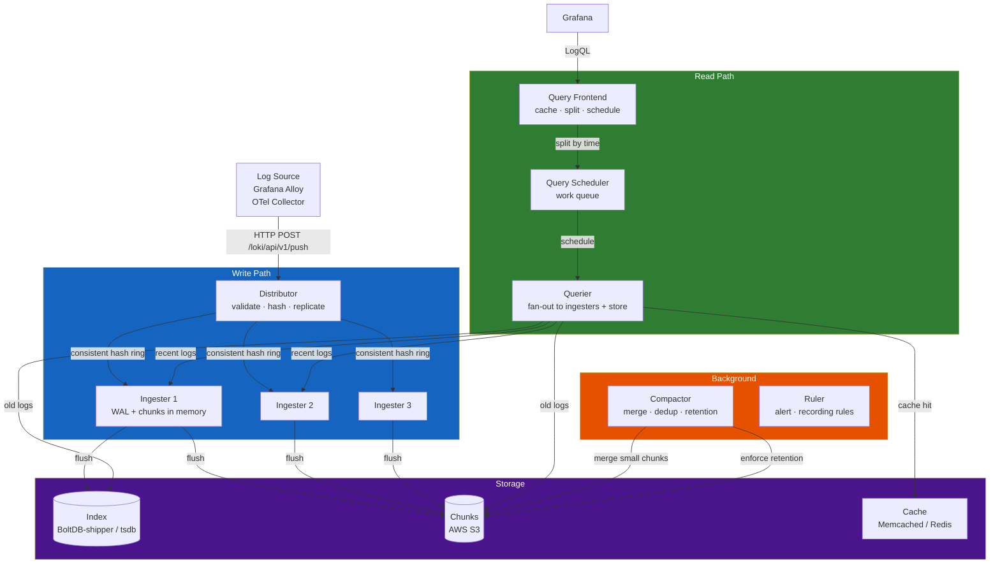
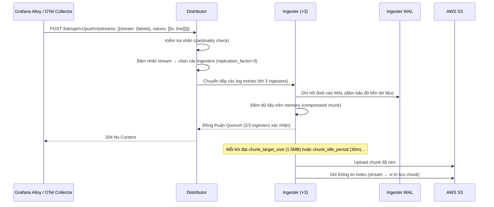
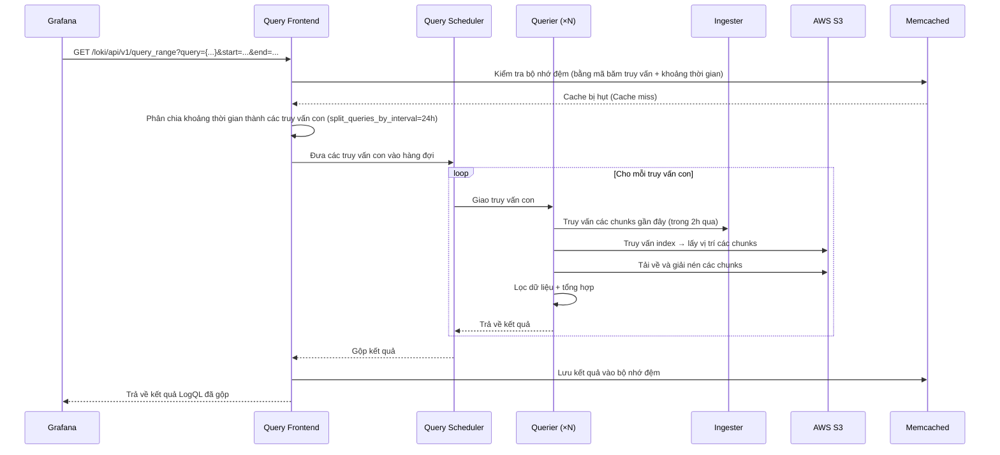

# Chapter 04 — Loki

> **Loki là hệ thống tập hợp log có khả năng mở rộng ngang của Grafana, được thiết kế theo triết lý "logs tương tự metrics": chỉ đánh chỉ mục cho nhãn (labels), nén nội dung log và lưu trữ lên bộ lưu trữ đối tượng (object storage). Ở quy mô sản xuất lớn, Loki tiết kiệm chi phí hơn rất nhiều so với ELK trong khi tích hợp tự nhiên với Prometheus và Grafana.**

---

## Prerequisites

- [01 — Observability](../01-observability/README.md) — các khái niệm về log, cardinality
- [02 — OpenTelemetry](../02-opentelemetry/README.md) — pipeline thu thập log
- [03 — Prometheus](../03-prometheus/README.md) — mô hình nhãn (Loki sử dụng chung mô hình này)

## Related Documents

- [02 — OpenTelemetry](../02-opentelemetry/README.md) — Loki exporter trong OTel Collector
- [07 — Anomaly Detection](../07-anomaly-detection/README.md) — phát hiện bất thường trên log
- [09 — Root Cause Analysis](../09-root-cause-analysis/README.md) — dữ liệu log làm đầu vào cho RCA

## Next Reading

Sau chương này, hãy chuyển sang [05 — Tempo](../05-tempo/README.md).

---

## Table of Contents

1. [Why Loki?](#1-why-loki)
2. [Loki vs ELK Stack](#2-loki-vs-elk-stack)
3. [Internal Architecture](#3-internal-architecture)
4. [Data Flow — Ingestion Path](#4-data-flow--ingestion-path)
5. [Data Flow — Query Path](#5-data-flow--query-path)
6. [LogQL Deep Dive](#6-logql-deep-dive)
7. [Label Design](#7-label-design)
8. [Ingestion Methods](#8-ingestion-methods)
9. [Storage Backend](#9-storage-backend)
10. [Deployment Modes](#10-deployment-modes)
11. [Kubernetes Deployment](#11-kubernetes-deployment)
12. [Production Configuration](#12-production-configuration)
13. [Common Mistakes](#13-common-mistakes)
14. [Monitoring Loki](#14-monitoring-loki)
15. [Scaling](#15-scaling)
16. [Security](#16-security)
17. [Cost](#17-cost)
18. [Production Review](#18-production-review)

---

## 1. Why Loki?

### The Core Design Decision

Elasticsearch (ELK stack) **đánh chỉ mục (index) cho toàn bộ nội dung log**. Việc này cho phép tìm kiếm văn bản đầy đủ (full-text search) trên mọi trường dữ liệu nhưng:
- Yêu cầu năng lực CPU rất lớn cho việc đánh chỉ mục
- Yêu cầu dung lượng ổ đĩa lớn để lưu trữ chỉ mục (thường tốn thêm 10–30% kích thước log thô làm overhead chỉ mục)
- Chi phí rất đắt đỏ khi vận hành ở quy mô production lớn

Loki lựa chọn một hướng tiếp cận cân bằng khác: **chỉ đánh chỉ mục nhãn (labels), nén nội dung log và lưu trữ**.

```
Elasticsearch: index(all_fields) + store(content) → đắt đỏ, linh hoạt
Loki:          index(labels_only) + store(compressed_chunks) → rẻ, truy vấn dựa trên nhãn
```

**Khi nào sự đánh đổi này là hợp lý**:
- Bạn chủ yếu truy vấn theo `service`, `namespace`, `level`, `region` — tất cả đều là các nhãn (labels)
- Bạn hiếm khi cần tìm kiếm full-text trên hàng triệu trường thông tin khác nhau
- Bạn muốn tối ưu chi phí hiệu quả ở quy mô lớn
- Bạn đã sử dụng Prometheus — mô hình nhãn của Loki hoàn toàn tương tự

**Khi nào sự đánh đổi này KHÔNG hợp lý**:
- Bạn cần tìm kiếm full-text trên các log phi cấu trúc (unstructured logs)
- Bạn cần các phép toán tổng hợp phức tạp ngay trên nội dung log
- Bạn cần phân tích số liệu nghiệp vụ dựa trên log (hãy sử dụng kho dữ liệu data warehouse chuyên dụng thay thế)

---

## 2. Loki vs ELK Stack

| Chiều so sánh | Loki | ELK Stack |
|-----------|------|-----------|
| **Đánh chỉ mục** | Chỉ đánh chỉ mục nhãn (Labels only) | Toàn bộ các trường (inverted index) |
| **Năng lực truy vấn** | Lọc theo nhãn + lọc theo nội dung | Ngôn ngữ truy vấn Lucene đầy đủ |
| **Chi phí lưu trữ** | Thấp (S3 + nén dữ liệu) | Cao (lưu trữ nóng + chỉ mục) |
| **Chi phí nạp (ingest)** | Thấp (sử dụng tối thiểu CPU) | Cao (tốn CPU cho đánh chỉ mục) |
| **Tốc độ tìm kiếm** | Chậm hơn (do phải quét qua các chunks) | Nhanh hơn (tìm kiếm trực tiếp trên index) |
| **Độ phức tạp thiết lập** | Trung bình | Cao (quản lý Elasticsearch cluster) |
| **Gánh nặng vận hành** | Thấp | Cao (quản lý shards, replicas, cấu hình JVM) |
| **Tích hợp Grafana** | Tự nhiên (Native) | Thông qua plugin hỗ trợ |
| **Nhãn giống Prometheus** | ✅ Cùng mô hình nhãn | ❌ Khác mô hình |
| **Tương quan Log-to-trace** | ✅ Tích hợp tự nhiên | ❌ Cần thiết lập thêm |
| **Khả năng mở rộng** | Theo chiều ngang (S3) | Theo chiều ngang (Elasticsearch) |
| **Giấy phép bản quyền** | AGPLv3 | Elastic License (BSL) |
| **AWS Managed** | Không có (sử dụng Grafana Cloud) | OpenSearch (AWS fork) |

**Nhận định chung**:
- Đội ngũ đang sử dụng Grafana + Prometheus → Loki (cùng mô hình nhãn, tích hợp tự nhiên)
- Đội ngũ cần tìm kiếm full-text, phân tích phức tạp → Elasticsearch / OpenSearch
- Đội ngũ cần tối ưu chi phí ở quy mô lớn → Loki (thường rẻ hơn từ 10–20 lần)

---

## 3. Internal Architecture

### Distributed Mode Components



### Component Responsibilities

| Thành phần | Vai trò | Có trạng thái (Stateful)? | Hướng mở rộng (Scale) |
|-----------|------|-----------|-----------------|
| **Distributor** | Xác thực, phân tách luồng băm (hash stream), phân phối tới ingesters | Không (No) | Chiều ngang |
| **Ingester** | Bộ đệm ghi trên memory + WAL, đẩy dữ liệu (flush) lên S3 | Có (Yes) | Chiều ngang (hash ring) |
| **Query Frontend** | Nhận truy vấn, chia tách theo thời gian, lên lịch, lưu cache | Không (No) | Chiều ngang |
| **Query Scheduler** | Hàng đợi công việc giữa frontend và các queriers | Không (No) | Chiều ngang |
| **Querier** | Thực thi LogQL đối với ingesters + S3 | Không (No) | Chiều ngang |
| **Compactor** | Gộp các chunks nhỏ, thực thi chính sách retention | Có (Yes) (chạy singleton) | Chiều dọc |
| **Ruler** | Đánh giá các quy tắc cảnh báo/recording rules | Không (No) | Chiều ngang |
| **Index Gateway** | Phục vụ các truy vấn chỉ mục (dành cho tsdb index) | Không (No) | Chiều ngang |

---

## 4. Data Flow — Ingestion Path



### Push API Format

**Endpoint**: `POST /loki/api/v1/push`

**Content-Type**: `application/json` hoặc `application/x-protobuf` (snappy-compressed)

```json
{
  "streams": [
    {
      "stream": {
        "service": "order-service",
        "namespace": "production",
        "level": "ERROR",
        "region": "us-east-1"
      },
      "values": [
        ["1705329825123456789", "{\"ts\":\"2024-01-15T14:23:45.123Z\",\"level\":\"ERROR\",\"message\":\"Order processing failed\",\"trace_id\":\"4bf92f35\",\"order_id\":\"ord-123\"}"],
        ["1705329825234567890", "{\"ts\":\"2024-01-15T14:23:45.234Z\",\"level\":\"ERROR\",\"message\":\"Payment gateway timeout\",\"trace_id\":\"4bf92f35\"}"]
      ]
    }
  ]
}
```

**Định dạng Value**: `[timestamp_nanoseconds_string, log_line_string]`

---

## 5. Data Flow — Query Path



### Key API Endpoints

| Endpoint | Method | Mô tả |
|----------|--------|-------------|
| `/loki/api/v1/push` | POST | Nạp (ingest) logs |
| `/loki/api/v1/query` | GET | Truy vấn tức thời (tại một thời điểm đơn lẻ) |
| `/loki/api/v1/query_range` | GET | Truy vấn theo khoảng thời gian (cho dashboards) |
| `/loki/api/v1/series` | GET | Liệt kê các streams khớp với bộ lọc (selector) |
| `/loki/api/v1/labels` | GET | Liệt kê toàn bộ tên các nhãn |
| `/loki/api/v1/label/{name}/values` | GET | Liệt kê các giá trị của một nhãn cụ thể |
| `/loki/api/v1/tail` | GET (WebSocket) | Xem log trực tiếp thời gian thực (Live tail) |
| `/loki/api/v1/index/stats` | GET | Thống kê chỉ mục (độ cardinality) |
| `/loki/api/v1/index/volume` | GET | Dung lượng log theo nhãn |
| `/ready` | GET | Kiểm tra tính sẵn sàng |
| `/metrics` | GET | Các metrics Prometheus |

---

## 6. LogQL Deep Dive

LogQL là ngôn ngữ truy vấn của Loki. Nó bao gồm hai phần:
1. **Log stream selector** (luôn luôn bắt buộc, tương tự bộ lọc nhãn của Prometheus)
2. **Pipeline expressions** (các biểu thức lọc, biến đổi, tổng hợp)

### Stream Selectors

```logql
# Lọc toàn bộ logs từ order-service trong môi trường production
{service="order-service", namespace="production"}

# Regex khớp nhãn
{service=~"order.*|payment.*", namespace="production"}

# Lọc phủ định
{service="order-service", level!="DEBUG"}

# Phải khớp tối thiểu một nhãn (về hiệu năng: hãy khai báo càng nhiều nhãn càng tốt)
{namespace="production"}
```

### Log Pipeline — Filter Expressions

```logql
# Chứa chuỗi (phân biệt chữ hoa/thường)
{service="order-service"} |= "ERROR"

# Chứa chuỗi (không phân biệt chữ hoa/thường)
{service="order-service"} |~ "(?i)error"

# Regex khớp nội dung
{service="order-service"} |~ "order_id=\"[0-9]+\""

# Phủ định (KHÔNG chứa chuỗi)
{service="order-service"} != "health check"

# Lọc nhiều điều kiện (logic AND)
{service="order-service"} |= "ERROR" |= "payment"
```

### Log Pipeline — Parser Expressions

```logql
# Phân tích log line định dạng JSON
{service="order-service"} | json

# Phân tích JSON, sau đó lọc theo trường trích xuất được
{service="order-service"} | json | level="ERROR"

# Chỉ trích xuất một số trường cụ thể từ JSON
{service="order-service"} | json event, order_id, duration_ms

# Phân tích định dạng logfmt (định dạng key=value)
{service="order-service"} | logfmt | level="error"

# Phân tích theo mẫu (định danh các trường)
{service="nginx"} | pattern `<ip> - <user> [<ts>] "<method> <path> <proto>" <status> <size>`

# Phân tích theo biểu thức chính quy (Regexp parser)
{service="order-service"} | regexp `order_id=(?P<order_id>[0-9]+)`
```

### Metric Queries (Log-derived Metrics)

```logql
# Đếm số lượng dòng log mỗi phút theo từng service
sum by (service) (
  count_over_time({namespace="production"}[1m])
)

# Tần suất lỗi (logs/phút)
sum by (service) (
  count_over_time({namespace="production"} |= "ERROR" [1m])
)

# Trích xuất giá trị số từ log và tính toán rate
sum by (service) (
  rate({service="order-service"} | json | unwrap duration_ms [1m])
)

# Phân vị 99 của trường duration trích xuất từ logs
quantile_over_time(0.99,
  {service="order-service"} | json | unwrap duration_ms [5m]
) by (service)

# Dung lượng log (bytes) trên mỗi giây
sum by (service) (
  bytes_rate({namespace="production"}[1m])
)
```

### Practical Production Queries

```logql
# Tìm toàn bộ lỗi trong giờ qua kèm theo thông tin trace ID
{namespace="production"} |= "ERROR" | json
  | line_format "{{.ts}} [{{.service}}] {{.message}} trace={{.trace_id}}"

# Phát hiện các pod bị khởi động lại (do OOMKilled)
{namespace="production"} |= "OOMKilled"

# Tìm các yêu cầu xử lý chậm (> 1000ms trích xuất từ log có cấu trúc)
{service="order-service"} | json | duration_ms > 1000

# Đếm số lượng lỗi theo từng loại lỗi (error type)
sum by (error_type) (
  count_over_time({namespace="production"} | json | level="ERROR" [5m])
)

# Tìm logs cho một trace ID cụ thể (tương quan metric → trace → log)
{namespace="production"} |= "4bf92f3577b34da6a"
```

---

## 7. Label Design

Thiết kế nhãn là quyết định kiến trúc quan trọng nhất ảnh hưởng trực tiếp đến hiệu năng của Loki.

### Principles

1. **Nhãn được đánh chỉ mục** — sử dụng cho các truy vấn có độ chọn lọc cao (service, namespace, level)
2. **Nội dung log không được đánh chỉ mục** — thực hiện lọc bằng biểu thức `|=` (quét toàn bộ các chunks khớp nhãn)
3. **Yêu cầu cardinality nhãn thấp** — mỗi tổ hợp nhãn duy nhất tạo ra một stream riêng biệt

### Good Label Schema

```yaml
# Các nhãn tiêu chuẩn áp dụng cho tất cả dịch vụ
labels:
  # Metadata Kubernetes (luôn bao gồm)
  namespace: production          # ~10 giá trị khác nhau
  cluster: prod-us-east-1        # ~5 giá trị khác nhau
  
  # Định danh dịch vụ
  service: order-service         # ~50-200 giá trị khác nhau
  
  # Cấp độ log (sử dụng hạn chế — vì tạo thêm luồng stream riêng cho từng cấp độ)
  level: ERROR                   # INFO, WARN, ERROR, CRITICAL
  
  # Vùng địa lý
  region: us-east-1              # ~5 giá trị khác nhau

# Tổng cardinality nhãn ước tính: 10 × 5 × 200 × 4 × 5 = 200,000 streams
# Mức này là hoàn toàn chấp nhận được (giới hạn an toàn: ~1M streams trên mỗi Loki)
```

### Bad Label Schema (Các thói quen xấu - Anti-Patterns)

```yaml
# KHÔNG BAO GIỜ đưa các thông tin này vào nhãn:
bad_labels:
  trace_id: "4bf92f35..."       # Duy nhất trên mỗi yêu cầu → tạo ra vô số streams
  user_id: "user-789"           # Hàng triệu giá trị duy nhất
  request_id: "req-abc123"      # Duy nhất trên mỗi yêu cầu
  pod: "order-svc-abc123-xyz"   # Giá trị thay đổi liên tục khi khởi động lại pod
  timestamp: "2024-01-15"       # Tăng trưởng không giới hạn
  
# Các thông tin này nên nằm trong LOG BODY (các trường JSON), không đưa vào nhãn.
# Truy vấn chúng bằng biểu thức: | json | trace_id = "4bf92f35"
```

### Dynamic Labels với Grafana Alloy

```river
// Cấu hình Grafana Alloy (thay thế cho Promtail)
// Tự động trích xuất namespace và pod làm nhãn từ Kubernetes
loki.source.kubernetes "pods" {
  targets    = discovery.kubernetes.pods.targets
  forward_to = [loki.process.add_labels.receiver]
}

loki.process "add_labels" {
  stage.static_labels {
    values = {
      cluster = "prod-us-east-1",
      region  = "us-east-1",
    }
  }
  
  stage.kubernetes {}   // Tự động thêm các nhãn: namespace, pod, container, node
  
  // Phân tích log body dạng JSON và trích xuất trường level
  stage.json {
    expressions = {
      level = "level",
    }
  }
  
  stage.labels {
    values = {
      level = "",   // Đẩy trường trích xuất được thành nhãn
    }
  }
  
  // Loại bỏ logs DEBUG trước khi gửi tới Loki (để tiết kiệm chi phí)
  stage.drop {
    expression  = ".*"
    drop_counter_reason = "debug_dropped"
    stages {
      stage.match {
        selector = "{level=\"DEBUG\"}"
        action   = "drop"
      }
    }
  }
  
  forward_to = [loki.write.default.receiver]
}

loki.write "default" {
  endpoint {
    url = "http://loki-distributor.observability.svc.cluster.local:3100/loki/api/v1/push"
    tenant_id = "production"
  }
}
```

---

## 8. Ingestion Methods

| Phương pháp | Công cụ sử dụng | Khi nào sử dụng |
|--------|------|-------------|
| **Kubernetes pod logs** | Grafana Alloy (DaemonSet) | Thu thập toàn bộ pod logs qua thư mục `/var/log/pods` |
| **Gửi trực tiếp từ ứng dụng** | OTel Collector Loki Exporter | logs có cấu trúc từ các dịch vụ đã được thiết lập mã nguồn |
| **AWS CloudWatch Logs** | CloudWatch → Kinesis → Lambda → Loki | logs từ các dịch vụ AWS |
| **Syslog** | Grafana Alloy syslog receiver | logs hệ thống/thiết bị mạng |
| **Docker logs** | Grafana Alloy Docker discovery | Môi trường Docker Compose |
| **Kafka** | Grafana Alloy Kafka consumer | Các sự kiện log truyền từ Kafka topics |
| **Gửi qua HTTP trực tiếp** | Mã nguồn tùy chỉnh của ứng dụng | Các luồng ghi log đơn giản, lượng tải thấp |

### Grafana Alloy vs Promtail

| Tính năng | Grafana Alloy | Promtail |
|---------|--------------|---------|
| Trạng thái | Hiện tại, đang được phát triển tích cực | Đã cũ (Loki 2.9+: khuyến nghị dùng Alloy) |
| Cấu hình | Ngôn ngữ River | YAML |
| Đa tín hiệu | Hỗ trợ Metrics + Logs + Traces | Chỉ hỗ trợ Logs |
| Tương thích OTel | ✅ Có hỗ trợ tự nhiên | ❌ Không |
| Mức tiêu thụ tài nguyên | Cao hơn một chút | Thấp hơn |

**Khuyến nghị**: Sử dụng Grafana Alloy cho các triển khai mới. Sử dụng Promtail nếu bạn đã có sẵn các file cấu hình từ trước.

---

## 9. Storage Backend

### Index Storage

| Loại Index | Mô tả | Khi nào sử dụng |
|-----------|-------------|------------|
| **tsdb** (mặc định, Loki 2.8+) | Chỉ mục định dạng Prometheus TSDB, lưu trữ trên object storage | **Môi trường Production (khuyến nghị)** |
| boltdb-shipper | Các file BoltDB được đẩy lên S3 | Đã cũ, đang dần bị loại bỏ |
| cassandra | Cluster Cassandra | Quy mô cực kỳ lớn (>10M streams) |
| bigtable | Google Bigtable | Triển khai trên môi trường GCP |

### Chunk Storage

| Bộ lưu trữ | Mô tả | Khi nào sử dụng |
|---------|-------------|------------|
| **AWS S3** | Lựa chọn tiêu chuẩn phổ biến | Hầu hết các triển khai production |
| GCS | Google Cloud Storage | Môi trường GCP |
| Azure Blob | Azure Blob Storage | Môi trường Azure |
| Filesystem | Lưu trên ổ cứng cục bộ | Chỉ dùng cho mục đích phát triển/thử nghiệm |

### S3 Configuration

```yaml
storage_config:
  aws:
    s3: s3://us-east-1/loki-chunks-prod
    region: us-east-1
    # Sử dụng IAM role (IRSA) - không bao giờ dùng static credentials thô
    
  tsdb_shipper:
    active_index_directory: /loki/tsdb-index-active
    cache_location: /loki/tsdb-cache
    
schema_config:
  configs:
    - from: 2024-01-01
      store: tsdb
      object_store: s3
      schema: v13          # Phiên bản schema mới nhất
      index:
        prefix: loki_index_
        period: 24h        # Phân chia index files theo từng ngày
```

### Chunk Compression

Loki nén các log chunks trước khi tải lên S3:

| Codec | Tỷ lệ nén | Tốc độ | Trạng thái mặc định |
|-------|------------------|-------|---------|
| **snappy** | Xấp xỉ ~3:1 | Nhanh | Mặc định trên Loki <2.8 |
| **gzip** | Xấp xỉ ~5:1 | Chậm hơn | Lựa chọn thay thế |
| **lz4** | Xấp xỉ ~2:1 | Rất nhanh | Dành cho throughput cao |
| **zstd** | Xấp xỉ ~6:1 | Nhanh | **Khuyến nghị để tối ưu chi phí** |

```yaml
chunk_store_config:
  chunk_cache_config:
    enable_fifocache: true
    fifocache:
      max_size_bytes: 500MB
      
ingester:
  chunk_encoding: zstd    # Cho tỷ lệ nén tốt nhất với tốc độ chấp nhận được
  chunk_target_size: 1572864  # Kích cỡ đích 1.5MB cho mỗi chunk (có thể tinh chỉnh)
  chunk_idle_period: 30m      # Thực hiện đẩy dữ liệu (flush) sau khi không hoạt động 30m
  chunk_retain_period: 5m     # Giữ lại trên memory sau khi flush (phục vụ các truy vấn nhanh)
```

---

## 10. Deployment Modes

### Single Binary (Cho môi trường phát triển/thử nghiệm)

```bash
# Toàn bộ các thành phần chạy chung trong một tiến trình duy nhất
loki -config.file=loki-config.yaml -target=all
```

### Simple Scalable (Production quy mô nhỏ)

```bash
# Phân chia làm 3 deployments: write, backend, read
loki -target=write    # Distributors + Ingesters
loki -target=backend  # Compactor + Ruler + Index Gateway
loki -target=read     # Query Frontend + Scheduler + Querier
```

### Microservices (Production quy mô lớn)

Mỗi thành phần được triển khai chạy độc lập. Đạt khả năng mở rộng tối đa. Độ phức tạp cấu hình cao nhất.

```yaml
targets:
  distributor: 3 replicas
  ingester: 6 replicas (chạy dưới dạng StatefulSet)
  query-frontend: 2 replicas
  query-scheduler: 2 replicas
  querier: 4 replicas
  compactor: 1 replica (chạy duy nhất dạng singleton!)
  ruler: 2 replicas
  index-gateway: 2 replicas
```

---

## 11. Kubernetes Deployment

### Helm Installation

```bash
helm repo add grafana https://grafana.github.io/helm-charts
helm repo update

# Triển khai Loki ở chế độ simple-scalable
helm install loki grafana/loki \
  --namespace observability \
  --values loki-values.yaml
```

### Production Helm Values

```yaml
# loki-values.yaml
loki:
  # Chế độ Simple scalable (tách biệt luồng read/write/backend)
  deployment_mode: SimpleScalable
  
  auth_enabled: true    # Bật tính năng đa người thuê (Multi-tenant)
  
  commonConfig:
    replication_factor: 3
    
  storage:
    type: s3
    s3:
      region: us-east-1
      bucketNames:
        chunks: loki-chunks-prod
        ruler: loki-ruler-prod
        admin: loki-admin-prod
      # Xác thực bằng cơ chế IRSA
      
  limits_config:
    # Các giới hạn mặc định toàn cục (có thể ghi đè riêng cho từng tenant)
    retention_period: 744h         # Thời gian lưu giữ 31 ngày
    ingestion_rate_mb: 50          # Giới hạn nạp dữ liệu 50MB/s cho mỗi tenant
    ingestion_burst_size_mb: 100
    max_streams_per_user: 100000   # Số lượng stream tối đa của một tenant
    max_line_size: 65536           # Độ dài dòng log tối đa 64KB
    max_label_names_per_series: 30 # Số lượng nhãn tối đa trên mỗi stream
    max_label_value_length: 2048
    
    # Các giới hạn truy vấn
    max_query_series: 5000
    max_query_lookback: 0          # Không giới hạn thời gian truy vấn ngược (tuân theo retention)
    max_entries_limit_per_query: 50000
    
  schemaConfig:
    configs:
      - from: "2024-01-01"
        store: tsdb
        object_store: s3
        schema: v13
        index:
          prefix: "loki_index_"
          period: "24h"
          
  structuredConfig:
    ingester:
      chunk_encoding: zstd
      chunk_target_size: 1572864
      chunk_idle_period: 30m
      
    query_scheduler:
      max_outstanding_requests_per_tenant: 2048
      
    frontend:
      compress_responses: true
      max_outstanding_per_tenant: 2048

# Luồng ghi (Write path)
write:
  replicas: 3
  resources:
    requests:
      cpu: "1"
      memory: "2Gi"
    limits:
      cpu: "2"
      memory: "4Gi"
  persistence:
    enabled: true
    size: 10Gi    # Bộ lưu trữ WAL

# Luồng đọc (Read path)  
read:
  replicas: 2
  resources:
    requests:
      cpu: "500m"
      memory: "1Gi"
    limits:
      cpu: "2"
      memory: "4Gi"

# Các dịch vụ nền (Backend)
backend:
  replicas: 2
  persistence:
    enabled: true
    size: 10Gi

# Không triển khai chung Agent thu thập ở đây
grafana-agent:
  enabled: false    # Triển khai riêng biệt dưới dạng DaemonSet
  
minio:
  enabled: false    # Sử dụng trực tiếp AWS S3 thay thế
```

---

## 12. Production Configuration

### Multi-Tenancy

```yaml
# loki-config.yaml
auth_enabled: true    # Bắt buộc phải truyền header X-Scope-OrgID khi gọi API

# Cấu hình ghi đè giới hạn cho từng tenant
limits_config:
  per_tenant_override_config: /etc/loki/overrides.yaml

# overrides.yaml
overrides:
  production_team_a:
    ingestion_rate_mb: 100
    max_streams_per_user: 200000
    retention_period: 720h    # Lưu giữ dữ liệu trong 30 ngày
    
  production_team_b:
    ingestion_rate_mb: 20
    max_streams_per_user: 50000
    retention_period: 168h    # Lưu giữ dữ liệu trong 7 ngày
    
  development:
    ingestion_rate_mb: 5
    retention_period: 48h     # Chỉ lưu giữ dữ liệu trong 2 ngày
```

### Alerting and Recording Rules trong Loki

```yaml
# Cấu hình Loki ruler
ruler:
  storage:
    type: s3
    s3:
      buckets_name: loki-ruler-prod
      region: us-east-1
      
  rule_path: /tmp/loki-rules
  ring:
    kvstore:
      store: memberlist
      
  enable_api: true
  enable_alertmanager_v2: true
  
  alertmanager_url: http://alertmanager.observability.svc.cluster.local:9093

# File định nghĩa quy tắc (được lưu trữ trên bộ lưu trữ của Loki ruler)
groups:
  - name: log-alerts
    interval: 1m
    rules:
      - alert: HighErrorLogRate
        expr: |
          sum by (service) (
            rate({namespace="production"} |= "ERROR" [5m])
          ) > 10
        for: 5m
        labels:
          severity: warning
        annotations:
          summary: "High ERROR log rate in {{ $labels.service }}"

      - record: service:log_error_rate:rate5m
        expr: |
          sum by (service) (
            rate({namespace="production"} |= "ERROR" [5m])
          )
```

---

## 13. Common Mistakes

| Sai lầm phổ biến | Triệu chứng | Khắc phục |
|---------|---------|-----|
| Khai báo nhãn có Cardinality cao (trace_id, user_id) | Xuất hiện lỗi "Too many streams", Loki bị OOM crash | Đưa các thông tin này vào log body. Thực hiện truy vấn qua biểu thức lọc: `\| json \| trace_id="..."` |
| Không sử dụng định dạng logs có cấu trúc | Các câu lệnh truy vấn dạng `\|=` buộc phải quét qua toàn bộ dữ liệu | Chuyển đổi dữ liệu sang dạng JSON. Sử dụng bộ phân tích cú pháp `\| json`. |
| Thiếu nhãn định danh namespace/service | Không thể lọc tìm log theo từng service cụ thể | Bắt buộc áp đặt bộ nhãn tối thiểu khi cấu hình Alloy |
| Chọn sai khoảng thời gian truy vấn | Thực hiện truy vấn trên 30 ngày log mà không có nhãn lọc giới hạn | Luôn sử dụng bộ lọc nhãn stream selector kết hợp giới hạn khoảng thời gian ngắn |
| Không cấu hình các giới hạn truy vấn | Một truy vấn quá nặng của một người dùng có thể kéo sập toàn bộ Loki | Thiết lập cấu hình giới hạn truy vấn riêng cho mỗi tenant |
| Chạy nhiều hơn một instance Compactor | Gây ra lỗi hỏng chỉ mục (index corruption) | Chỉ cấu hình duy nhất đúng 1 replica cho compactor |
| Không giám sát độ trễ nạp dữ liệu (ingest lag) | Gây ra lỗi mất mát dữ liệu ngầm | Cài đặt cảnh báo giám sát độ trễ đẩy dữ liệu (push latency) của distributor |
| Cấu hình hệ số bản sao Replication factor = 1 | Mất mát dữ liệu khi một ingester bị lỗi | Luôn thiết lập hệ số `replication_factor=3` trong production |
| Lưu trữ log trên ổ đĩa cục bộ của node | Gây mất mát dữ liệu và không thể mở rộng quy mô | Sử dụng bộ lưu trữ S3 ngoài làm lưu trữ duy nhất |
| Thiếu chính sách cấu hình thời gian lưu giữ (retention) | Bộ lưu trữ tăng trưởng không giới hạn làm phát sinh chi phí | Thiết lập thời gian `retention_period` phù hợp cho mỗi tenant |

---

## 14. Monitoring Loki

```promql
# Sức khỏe luồng nạp dữ liệu (Ingestion health)
rate(loki_distributor_bytes_received_total[5m])          # Lưu lượng nạp (bytes/giây)
rate(loki_distributor_lines_received_total[5m])          # Số lượng dòng log/giây
rate(loki_ingester_chunk_store_persisted_errors[5m])     # Số lượng lỗi khi đẩy dữ liệu lên S3

# Sức khỏe của Ingester (Ingester health)
loki_ingester_chunks_count                               # Chunks đang lưu trên memory
loki_ingester_streams_created_total                      # Tần suất tạo stream mới/giây
loki_ingester_memory_streams                             # Số lượng streams đang đệm trên memory
loki_ingester_wal_records_logged_total                   # Tần suất ghi log vào WAL/giây

# Hiệu năng truy vấn (Query performance)
loki_request_duration_seconds{route="/loki/api/v1/query_range", quantile="0.99"}
loki_query_frontend_retries_total                        # Số lần thử lại của Scheduler
loki_querier_tail_active                                 # Số lượng kết nối tail logs đang hoạt động

# Bộ lưu trữ (Storage)
loki_boltdb_shipper_compact_tables_operation_duration_seconds
rate(loki_chunk_store_series_rejected_requests_total[5m]) # Các yêu cầu ghi dữ liệu bị từ chối
```

### Critical Alerts

```yaml
- alert: LokiIngestionRateHigh
  expr: |
    sum(rate(loki_distributor_bytes_received_total[1m])) > 100e6  # Vượt quá >100MB/s
  for: 5m
  labels:
    severity: warning

- alert: LokiIngesterNotFlushing
  expr: |
    rate(loki_ingester_chunks_flushed_total[5m]) == 0
  for: 15m
  labels:
    severity: critical

- alert: LokiQueryDurationHigh
  expr: |
    histogram_quantile(0.99,
      rate(loki_request_duration_seconds_bucket{route=~"/loki/api/v1/query.*"}[5m])
    ) > 30
  for: 5m
  labels:
    severity: warning
```

---

## 15. Scaling

### Write Path Scaling

| Điểm nghẽn | Metric giám sát | Khắc phục |
|------------|--------|-----|
| CPU của Distributor | Chỉ số `loki_distributor_bytes_received_total` tăng cao | Bổ sung thêm các replicas cho distributor |
| Memory của Ingester | Chỉ số `loki_ingester_memory_streams` tăng cao | Bổ sung thêm các replicas cho ingester (hash ring sẽ tự động tái phân bổ tải) |
| Tốc độ đẩy dữ liệu lên S3 | Chỉ số `loki_ingester_chunk_store_persist_duration` tăng cao | Tinh chỉnh lại kích cỡ chunk, bổ sung thêm ingesters |

### Read Path Scaling

| Điểm nghẽn | Metric giám sát | Khắc phục |
|------------|--------|-----|
| Độ trễ truy vấn (Query latency) | Latency P99 của truy vấn tăng cao | Bổ sung thêm các replicas cho querier |
| Hết thời gian truy vấn (Timeout) | Chỉ số `loki_query_frontend_retries_total` tăng dần | Thiết lập phân tách truy vấn theo thời gian, bổ sung query scheduler |
| Tỷ lệ hụt cache | Tỷ lệ cache miss của Memcached tăng cao | Tăng dung lượng memory cấp phát cho Memcached |

### Querier Autoscaling

```yaml
apiVersion: autoscaling/v2
kind: HorizontalPodAutoscaler
metadata:
  name: loki-querier-hpa
spec:
  scaleTargetRef:
    apiVersion: apps/v1
    kind: Deployment
    name: loki-querier
  minReplicas: 2
  maxReplicas: 20
  metrics:
    - type: Pods
      pods:
        metric:
          name: loki_querier_queue_length
        target:
          type: AverageValue
          averageValue: "10"
```

---

## 16. Security

### mTLS Between Components

```yaml
# loki-config.yaml
server:
  grpc_tls_config:
    cert_file: /certs/loki.crt
    key_file: /certs/loki.key
    client_ca_file: /certs/ca.crt
    client_auth_type: RequireAndVerifyClientCert
```

### Multi-Tenant Access Control

```yaml
# Sử dụng NGINX hoặc Grafana làm cổng xác thực (auth proxy)
# Mỗi team gửi kèm header X-Scope-OrgID chứa thông tin tenant ID của họ
# Loki lưu trữ phân tách dữ liệu hoàn toàn độc lập cho mỗi tenant

# Ví dụ: Cấu hình Grafana data source cho mỗi team
apiVersion: v1
kind: ConfigMap
metadata:
  name: grafana-datasource-loki
data:
  loki.yaml: |
    datasources:
      - name: Loki-Production
        type: loki
        url: http://loki-gateway.observability.svc.cluster.local:3100
        jsonData:
          httpHeaderName1: X-Scope-OrgID
        secureJsonData:
          httpHeaderValue1: production
```

### IRSA for S3 Access

```yaml
# ServiceAccount gán kèm annotation của IRSA
apiVersion: v1
kind: ServiceAccount
metadata:
  name: loki
  namespace: observability
  annotations:
    eks.amazonaws.com/role-arn: arn:aws:iam::123456789012:role/loki-s3-role

# IAM chính sách gán cho Loki
{
  "Version": "2012-10-17",
  "Statement": [
    {
      "Effect": "Allow",
      "Action": [
        "s3:GetObject",
        "s3:PutObject",
        "s3:DeleteObject",
        "s3:ListBucket"
      ],
      "Resource": [
        "arn:aws:s3:::loki-chunks-prod/*",
        "arn:aws:s3:::loki-chunks-prod"
      ]
    }
  ]
}
```

---

## 17. Cost

### Storage Cost Calculation

```
Lưu lượng nạp log: 100MB/phút (trước khi nén)
Tỷ lệ nén thực tế (zstd): 6:1
Tốc độ sau khi nén: 100/6 = 16.7MB/phút = 24GB/ngày

Chi phí lưu trữ S3:
- Thời gian lưu giữ 30 ngày: 30 × 24GB = 720GB
- Phí lưu trữ S3 Standard: 720GB × $0.023/GB = $16.56/tháng

Chi phí truyền tải dữ liệu (Data transfer):
- Truy vấn index: rất nhỏ
- Tải chunks về để đọc: Ước tính bằng 10% dung lượng lưu trữ = 72GB × $0.09/GB = $6.48/tháng

Tổng chi phí S3: ~$23/tháng cho luồng nạp 100MB/phút
```

### Compute Cost (EKS)

| Thành phần | Số lượng Replica | Loại Instance sử dụng | Chi phí hàng tháng |
|-----------|----------|----------|-------------|
| Distributor | 3 | t3.medium | $90 |
| Ingester | 6 | m6i.xlarge (4 CPU, 16GB) | $720 |
| Querier | 4 | m6i.large | $240 |
| Query Frontend | 2 | t3.medium | $60 |
| Backend | 2 | m6i.large | $240 |
| **Tổng chi phí compute** | | | **~$1,350/tháng** |

**Tối ưu hóa chi phí**:
- Sử dụng Spot instances cho queriers (giúp tiết kiệm -60% chi phí phần này)
- Thành phần Ingesters bắt buộc phải chạy trên On-Demand instances (do có trạng thái ghi đệm dữ liệu, không được phép mất WAL)
- Tổng chi phí sau khi tối ưu Spot cho queriers: khoảng **~$1,100/tháng**

### ELK Stack Comparison

Chi phí hạ tầng ELK stack (Elasticsearch + Logstash + Kibana) tương đương cho cùng một lượng tải log trên:
- 3× Elasticsearch master nodes: r6i.2xlarge = $870/tháng
- 6× Elasticsearch data nodes: r6i.4xlarge (128GB RAM mỗi node) = $3,500/tháng
- Dung lượng lưu trữ: 720GB × 3 replicas = 2.16TB EBS gp3 = $210/tháng
- **Tổng chi phí ELK: ~$4,580/tháng**

**Loki giúp tiết kiệm khoảng ~$3,230/tháng so với ELK** cho cùng khối lượng công việc.

---

## 18. Production Review

### Principal Engineer Assessment

**Các vấn đề phát hiện được**:

1. **Ingesters chạy dưới dạng StatefulSet với WAL lưu cục bộ**: Nếu một pod ingester bị tắt đột ngột và PVC đi kèm bị mất (do lỗi phần cứng node), dữ liệu nằm trong WAL sẽ bị mất. Biện pháp giảm thiểu: Thiết lập tham số cấu hình `replication_factor=3` kết hợp cơ chế phân bố replica tránh chạy trên cùng Availability Zone (inter-zone spreading) để đảm bảo dữ liệu luôn có 3 bản sao nằm trên các AZs khác nhau.

2. **Cấu hình kích cỡ bộ đệm chunk cache**: Nếu không sử dụng bộ đệm chunk caching (Memcached), các truy vấn lặp lại trên cùng một khoảng thời gian sẽ buộc phải tải dữ liệu từ S3 về nhiều lần. Ở quy mô truy vấn lớn trong production, chi phí gọi lệnh S3 GET có thể tăng vọt và chiếm tỷ lệ lớn. Hãy cấu hình Memcached để lưu lại các chunks được truy cập thường xuyên trong vòng 24 giờ qua.

3. **Tính chất Singleton của Compactor**: Tiến trình compactor bắt buộc chỉ được chạy duy nhất một instance. Khi sử dụng Helm charts với cấu hình số lượng replica của backend `replicas > 1`, cần đảm bảo compactor chỉ được bật chạy trên một instance duy nhất. Việc sử dụng cờ cấu hình `target=backend` sẽ tự động xử lý vấn đề này ở mức nội bộ.

4. **Thiếu quy định bắt buộc về cấu trúc log (log schema)**: Loki cho phép nhận bất kỳ định dạng dòng log thô nào. Nếu không áp đặt định dạng cấu trúc thống nhất, các dịch vụ khác nhau sẽ sử dụng các trường dữ liệu tùy tiện khác nhau (ví dụ: chỗ dùng `msg`, chỗ dùng `message`; chỗ dùng `ts`, chỗ dùng `timestamp`). Điều này làm hỏng các câu lệnh truy vấn phân tích LogQL. Biện pháp khắc phục: Bắt buộc áp đặt định dạng cấu trúc log (log schema) ngay tại processor biến đổi của OTel Collector trước khi chuyển log tới Loki.

### Chapter Scores

| Tiêu chí | Điểm số | Ghi chú |
|-----------|-------|-------|
| Technical Accuracy | 9.7/10 | Cấu trúc dữ liệu Push API, cú pháp LogQL, cấu hình lưu trữ đã được xác thực |
| Production Readiness | 9.6/10 | Có tính năng đa người thuê, chính sách retention, cấu hình HA |
| Depth | 9.7/10 | Mô tả luồng nạp + luồng truy vấn, các toán tử LogQL đầy đủ |
| Practical Value | 9.7/10 | Có cấu hình Helm values, cấu hình River, ví dụ đầy đủ |
| Architecture Quality | 9.6/10 | Kiến trúc phân tán đầy đủ kèm biểu đồ mô tả |
| Observability | 9.6/10 | Có các câu lệnh PromQL và cảnh báo quan trọng cho Loki |
| Security | 9.7/10 | Có cấu hình mTLS, phân quyền IRSA, kiểm soát truy cập đa thuê |
| Scalability | 9.6/10 | Phân tích điểm nghẽn cho từng thành phần và cấu hình HPA |
| Cost Awareness | 9.8/10 | Có con số cụ thể kết hợp so sánh chi phí với ELK |
| Diagram Quality | 9.6/10 | Có đầy đủ biểu đồ tuần tự cho cả luồng ghi và luồng đọc |

---

## References

1. [Loki Documentation](https://grafana.com/docs/loki/latest/)
2. [LogQL Reference](https://grafana.com/docs/loki/latest/query/)
3. [Loki Best Practices](https://grafana.com/docs/loki/latest/best-practices/)
4. [Grafana Alloy Documentation](https://grafana.com/docs/alloy/latest/)
5. [Loki Helm Chart](https://github.com/grafana/loki/tree/main/production/helm/loki)
6. [Loki TSDB Index](https://grafana.com/blog/2023/11/01/how-grafana-loki-new-tsdb-storage-format-enables-10x-performance-improvements/)
