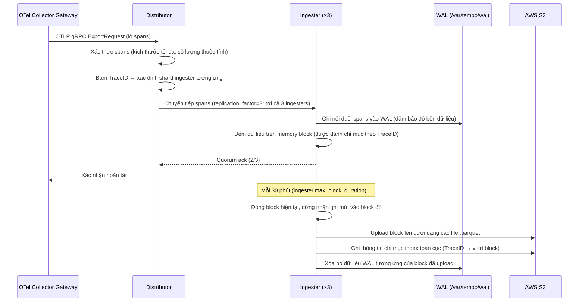
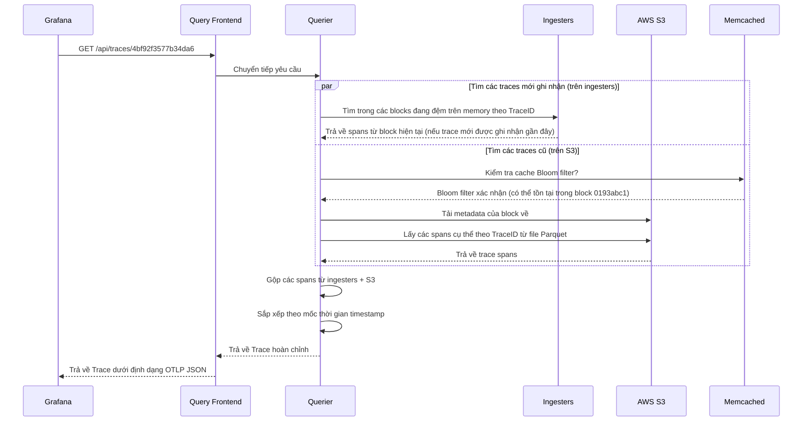
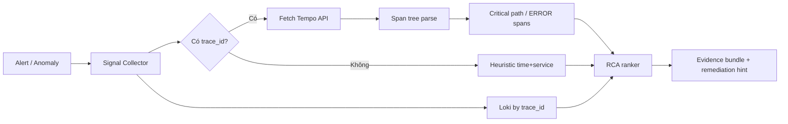

# Chapter 05 — Tempo

> **Grafana Tempo là hệ thống lưu trữ distributed tracing quy mô lớn, lưu trữ traces trên bộ lưu trữ đối tượng (S3) nhằm cung cấp khả năng lưu trữ không giới hạn với chi phí tối thiểu. Nó tích hợp tự nhiên với Prometheus exemplars và Loki TraceIDs để tạo nên sự liên kết tương quan khả năng quan sát giữa ba cột trụ chính.**

---

## Prerequisites

- [01 — Observability](../01-observability/README.vi.md) — các khái niệm về trace, sampling
- [02 — OpenTelemetry](../02-opentelemetry/README.vi.md) — thu thập và lấy mẫu (sampling) trace
- [04 — Loki](../04-loki/README.vi.md) — các mẫu thiết kế kiến trúc phân tán song song

## Related Documents

- [02 — OpenTelemetry](../02-opentelemetry/README.vi.md) — tail sampling trước khi đẩy dữ liệu vào Tempo
- [03 — Prometheus](../03-prometheus/README.vi.md) — exemplars liên kết metrics với Tempo traces
- [09 — Root Cause Analysis](../10-root-cause-analysis/README.vi.md) — traces làm đầu vào cho RCA

## Next Reading

Sau chương này, hãy chuyển sang [06 — Telemetry Data Plane](../06-data-plane/README.vi.md) (normalize / enrich / store / feature), rồi [07 — Kafka](../07-kafka/README.vi.md).

---

## Table of Contents

1. [Why Tempo?](#1-why-tempo)
2. [Tempo vs Jaeger vs AWS X-Ray](#2-tempo-vs-jaeger-vs-aws-x-ray)
3. [Internal Architecture](#3-internal-architecture)
4. [Data Flow — Write Path](#4-data-flow--write-path)
5. [Data Flow — Read Path](#5-data-flow--read-path)
6. [Trace Storage Format](#6-trace-storage-format)
7. [TraceQL Query Language](#7-traceql-query-language)
8. [Metrics from Traces (SpanMetrics)](#8-metrics-from-traces-spanmetrics)
9. [Deployment Modes](#9-deployment-modes)
10. [Production Configuration](#10-production-configuration)
11. [Grafana Integration](#11-grafana-integration)
12. [Trace vs Log vs Metric cho RCA](#12-trace-vs-log-vs-metric-cho-rca)
13. [Sampling Paradox — Head vs Tail Based](#13-sampling-paradox--head-vs-tail-based)
14. [Cost vs Coverage Decision Tree](#14-cost-vs-coverage-decision-tree)
15. [Edge Cases: Cardinality, PII, Multi-tenant](#15-edge-cases-cardinality-pii-multi-tenant)
16. [Trace-based SLI/SLO Patterns](#16-trace-based-slislo-patterns)
17. [Tempo trong AIOps Pipeline](#17-tempo-trong-aiops-pipeline)
18. [Case Study: Timeout Cascade](#18-case-study-timeout-cascade)
19. [Common Mistakes](#19-common-mistakes)
20. [Monitoring Tempo](#20-monitoring-tempo)
21. [Scaling](#21-scaling)
22. [Security](#22-security)
23. [Cost](#23-cost)
24. [Production Review](#24-production-review)

---

## 1. Why Tempo?

> [!NOTE]
> **Ý TƯỞNG**
> Tempo không cố gắng trở thành "Elasticsearch cho traces". Nó chọn triết lý **store-first, find-by-id later**: chấp nhận không index mọi attribute để đổi lấy khả năng lưu mọi thứ rẻ trên object storage. Trong AIOps, điều này khớp với thực tế — hầu hết đường vào trace đều là `trace_id` từ metric exemplar hoặc log, không phải full-text search trên span attribute tùy ý.

> [!TIP]
> **Khi nào chọn Tempo ngay từ đầu?** Khi stack đã có Grafana + Prometheus + Loki, và bạn cần correlating ba tín hiệu bằng một `trace_id`. Đừng chọn Tempo nếu bạn cần search tag ad-hoc kiểu Jaeger UI cho mọi attribute mà không muốn đầu tư pipeline index / TraceQL.

### The Distributed Tracing Problem at Scale

Các hệ thống tiền nhiệm như Jaeger và Zipkin lưu trữ traces trong các cơ sở dữ liệu:
- Jaeger → Cassandra hoặc Elasticsearch
- Zipkin → MySQL, Cassandra, Elasticsearch

**Vấn đề**: Tại mức 100K requests/giây với trung bình mỗi trace gồm 15 spans:
```
100,000 req/giây × 15 spans × 2KB/span = 3GB/giây dung lượng dữ liệu trace
3GB/giây × 86400 giây = ~260TB/ngày
```

Lưu trữ 260TB/ngày trong Cassandra hoặc Elasticsearch phát sinh chi phí đắt đỏ vượt ngoài khả năng chi trả.

### Tempo's Solution

**Lưu trữ traces trên bộ lưu trữ đối tượng (S3) dưới dạng các files Parquet**. Không đánh chỉ mục (index). Không cơ sở dữ liệu. Hoàn toàn dựa trên object storage.

```
Nguyên lý kiến trúc của Tempo: "Hãy cứ lưu trữ nó lại. Chúng ta sẽ tìm kiếm nó sau."
```

**Sự đánh đổi**:
- ✅ Khả năng mở rộng không giới hạn với chi phí S3 cực thấp ($0.023/GB/tháng)
- ✅ Không cần vận hành và quản lý các clusters Cassandra/Elasticsearch phức tạp
- ✅ Tích hợp tự nhiên với Grafana
- ❌ Không thể tìm kiếm theo các thuộc tính span tùy ý (chỉ có thể tìm theo TraceID)
- ❌ Việc tìm kiếm dựa trên thẻ tags yêu cầu phải có một chỉ mục riêng biệt (các pipelines TraceQL / bộ chỉ mục tag của Tempo)

**Khi nào việc tìm kiếm theo TraceID là đủ**: Đối với hầu hết các trường hợp sử dụng của AIOps, bạn tìm đến một trace thông qua:
- Một Prometheus exemplar (từ đỉnh spike của metric → TraceID)
- Một Loki log entry (từ log error → TraceID trong log body)
- Một thông tin ghi chú cảnh báo (từ alert → TraceID của yêu cầu bị lỗi)

Bạn hiếm khi cần phải tìm kiếm theo một thuộc tính span tùy ý trong môi trường production AIOps.

### Khi nào Trace "đủ" — và khi nào chưa?

| Nhu cầu | TraceID lookup (Tempo mặc định) | Cần TraceQL / index |
|---------|--------------------------------|---------------------|
| RCA từ alert có exemplar | ✅ Đủ | Không |
| Log error → `trace_id` trong body | ✅ Đủ | Không |
| "Tìm mọi request timeout của payment trong 1h" | ❌ | ✅ Cần |
| "Tìm order_id = X xuyên services" | ❌ | ✅ (attribute phải được index/searchable) |
| Service graph / RED metrics | ✅ Qua SpanMetrics | Không bắt buộc |

> [!WARNING]
> Nếu team SRE thường xuyên phải "tìm theo customer_id / order_id" trong Tempo mà **không** có đường vào từ log/metric, bạn đang thiết kế sai điểm vào observability. Hãy inject `trace_id` vào log structured và đưa business ID vào log body + span attribute có kiểm soát — đừng biến Tempo thành search engine full-text.

---

## 2. Tempo vs Jaeger vs AWS X-Ray

| Chiều so sánh | Tempo | Jaeger | AWS X-Ray |
|-----------|-------|--------|-----------|
| **Bộ lưu trữ** | S3 (object store) | Cassandra / Elasticsearch | AWS managed |
| **Tính năng tìm kiếm** | TraceID + TraceQL (tìm tag qua index) | Tìm kiếm tag đầy đủ | TraceID + bộ lọc cơ bản |
| **Khả năng mở rộng** | Không giới hạn (S3) | Bị giới hạn bởi database cluster | Không giới hạn (managed) |
| **Chi phí (cho 10M spans/ngày)** | Khoảng ~$5/tháng S3 | Khoảng ~$500/tháng Cassandra | Khoảng ~$50/tháng |
| **Thiết lập** | Trung bình | Trung bình-Cao | Thấp (chỉ cần SDK) |
| **Tích hợp AWS** | Thủ công (OTel) | Thủ công (OTel) | Tự nhiên (AWS SDK) |
| **Tích hợp Grafana** | ✅ Tự nhiên | ✅ Qua plugin | ✅ Qua plugin |
| **Ngôn ngữ truy vấn** | TraceQL | JaegerQL | Các bộ lọc cơ bản |
| **Đa người thuê (Multi-tenancy)** | ✅ Có hỗ trợ | ❌ Hạn chế | ❌ Theo tài khoản |
| **Tương quan Exemplar** | ✅ Tự nhiên với Prometheus | ❌ Thủ công | ❌ |
| **Giấy phép bản quyền** | AGPLv3 | Apache 2.0 | Sở hữu riêng của AWS |

**Khuyến nghị**:
- Dự án mới + sử dụng hệ thống Grafana: **Tempo** (tích hợp tự nhiên, chi phí S3 tối ưu)
- Hệ thống đã chạy Jaeger và yêu cầu tìm kiếm tag: **Jaeger**
- Hệ thống chạy hoàn toàn trên AWS quy mô nhỏ: **X-Ray** (nhưng bị lock-in nhà cung cấp)
- Doanh nghiệp quy mô lớn: **Tempo** (khả năng mở rộng tốt nhất với chi phí thấp nhất)

---

## 3. Internal Architecture

> [!NOTE]
> **Ý TƯỞNG**
> Tempo tách **write path** (distributor → ingester → S3) và **read path** (query-frontend → querier → S3/cache) hoàn toàn độc lập. Đây là pattern "ingester owns recent data, object storage owns history" giống Loki — cho phép scale ghi và đọc theo tín hiệu nghẽn khác nhau.

```mermaid
graph TD
    subgraph Write["Write Path"]
        DIST[Distributor\nvalidate · hash]
        ING1[Ingester 1\nin-memory blocks]
        ING2[Ingester 2]
        ING3[Ingester 3]
        WAL[WAL\n/var/tempo/wal]
    end

    subgraph Compact["Background"]
        COMP[Compactor\nmerge · deduplicate\nretention]
    end

    subgraph Read["Read Path"]
        QF[Query Frontend\ncache · fan-out]
        QUER[Querier\nfetch + merge]
        CACHE[Block Cache\nMemcached]
    end

    subgraph Storage["Object Storage"]
        S3[AWS S3\n.parquet blocks]
        INDEX[Tag Index\nglobal search]
    end

    SOURCE[OTel Collector\ngateway] -->|OTLP gRPC :4317| DIST
    DIST -->|hash on TraceID mod 3| ING1
    DIST -->|hash on TraceID mod 3| ING2
    DIST -->|hash on TraceID mod 3| ING3

    ING1 --- WAL
    ING1 -->|flush every 30min| S3
    ING2 -->|flush| S3
    ING3 -->|flush| S3

    ING1 -->|write tag index| INDEX
    COMP -->|merge small blocks| S3
    COMP -->|rebuild index| INDEX

    GRAFANA[Grafana] -->|GET /api/traces/{id}\nTraceQL| QF
    QF -->|in-memory trace| ING1
    QF -->|S3 lookup| QUER
    QUER -->|block cache hit| CACHE
    QUER -->|block cache miss| S3
    QUER -->|merge| QF
    QF -->|return trace| GRAFANA

    style Write fill:#dbeafe,color:#1e293b
    style Read fill:#dcfce7,color:#1e293b
    style Storage fill:#f3e8ff,color:#1e293b
    style Compact fill:#ffedd5,color:#1e293b
```

### Key Endpoints

| Endpoint | Giao thức | Cổng | Mô tả |
|----------|----------|------|-------------|
| `/api/traces/{traceID}` | HTTP | 3200 | Lấy thông tin trace theo ID |
| `/api/search` | HTTP | 3200 | Tìm kiếm thẻ tag bằng TraceQL |
| `/api/search/tags` | HTTP | 3200 | Liệt kê tên các tags có thể tìm kiếm |
| `/api/search/tag/{tag}/values` | HTTP | 3200 | Liệt kê các giá trị của một tag cụ thể |
| `/api/v2/search` | HTTP | 3200 | Tìm kiếm TraceQL (v2) |
| OTLP gRPC receive | gRPC | 4317 | Nhận traces từ OTel Collector |
| Tempo internal | gRPC | 9095 | Truyền tin nội bộ giữa các thành phần |
| Memberlist | UDP | 7946 | Gossip ring |
| `/metrics` | HTTP | 3200 | Metrics Prometheus |
| `/ready` | HTTP | 3200 | Kiểm tra trạng thái sẵn sàng |

---

## 4. Data Flow — Write Path



### Ingester Block Format

Tempo lưu trữ traces theo các blocks. Mỗi block bao phủ một khung thời gian:

```
/var/tempo/
├── wal/
│   ├── 00000001    ← Các phân đoạn WAL
│   └── 00000002
└── blocks/
    ├── 0193abc1.../  ← Block (định danh ULID)
    │   ├── meta.json     ← Metadata của Block (khoảng thời gian, số lượng trace, dung lượng)
    │   ├── data.parquet  ← Dữ liệu Trace (định dạng cột Parquet)
    │   └── bloom-filter  ← Bloom filter để kiểm tra nhanh sự tồn tại của TraceID
    └── 0193def2.../
```

**Bloom filter**: Trước khi tải một block Parquet từ S3 về, querier sẽ kiểm tra nhanh qua bloom filter (một cấu trúc dữ liệu xác suất) để xác định xem TraceID cần tìm có khả năng nằm trong block đó hay không. Cơ chế này giúp tránh tải dữ liệu không cần thiết từ S3.

> [!TIP]
> Bloom filter **không bao giờ false-negative** (nếu nói "không có" thì chắc chắn không có), nhưng có **false-positive** (nói "có thể có" nhưng thực ra không). Tỷ lệ FP càng thấp → bloom filter càng lớn → tốn memory/storage hơn nhưng ít GET S3 lãng phí hơn. Production thường chọn `0.01` hoặc `0.005`.

---

## 5. Data Flow — Read Path



---

## 6. Trace Storage Format

### Parquet Column Layout

Tempo sử dụng định dạng Apache Parquet (lưu trữ dạng cột) cho dữ liệu traces:

```
Các cột của file data.parquet:
├── TraceID (byte_array)          ← Được sắp xếp để phục vụ tìm kiếm nhị phân (binary search)
├── RootSpanName (string)
├── RootServiceName (string)
├── StartTimeUnixNano (int64)
├── DurationNano (int64)          ← Dành cho các truy vấn dựa trên latency
├── Spans[]
│   ├── SpanID (byte_array)
│   ├── ParentSpanID (byte_array)
│   ├── Name (string)
│   ├── Kind (int)                ← Server, Client, Internal, v.v.
│   ├── StartTimeUnixNano (int64)
│   ├── DurationNano (int64)
│   ├── StatusCode (int)
│   ├── StatusMessage (string)
│   └── Attributes (map<string, AnyValue>)
└── Resource Attributes (map<string, AnyValue>)
```

**Tại sao nên dùng Parquet**:
- Lưu trữ dạng cột (Columnar): Cho phép lọc nhanh theo `StatusCode == ERROR` mà không cần đọc dữ liệu các cột khác
- Khả năng nén: Định dạng Parquet kết hợp thuật toán nén Snappy giúp nén dữ liệu trace đạt tỷ lệ từ 5–10:1
- Tính năng S3 Select: Có thể thực hiện lọc các cột ngay tại phía server S3, giúp giảm thiểu băng thông truyền dữ liệu

### Vparquet3 (Định dạng riêng của Tempo)

Tempo sử dụng một schema Parquet tùy biến riêng gọi là `vparquet3`:

```yaml
# Bật cấu hình trong file tempo config
storage:
  trace:
    backend: s3
    block:
      version: vparquet3    # Bắt buộc phải bật để tính năng TraceQL hoạt động
      bloom_filter_false_positive: 0.01   # Chấp nhận tỷ lệ dương tính giả 1% đối với bloom filters
      bloom_filter_shard_size_bytes: 100kb
```

---

## 7. TraceQL Query Language

TraceQL là ngôn ngữ truy vấn của Tempo dùng để tìm kiếm traces theo thuộc tính của spans.

> **Lưu ý**: Việc tìm kiếm bằng TraceQL yêu cầu dữ liệu phải ở định dạng `vparquet3` VÀ phải cấu hình pipeline `local-blocks` hoặc bộ chỉ mục tag index. Nếu chỉ truy vấn trực tiếp bằng TraceID thì không cần các cấu hình này.

### TraceQL Syntax

```traceql
# Cơ bản: tìm toàn bộ các traces chứa span có status lỗi
{ status = error }

# Tìm các traces từ một dịch vụ cụ thể có latency cao
{ resource.service.name = "payment-service" && duration > 2s }

# Tìm các traces có mã lỗi HTTP status code cụ thể
{ span.http.status_code = 500 }

# Tìm các traces có span lỗi VÀ thuộc dịch vụ payment
{ status = error && resource.service.name = "payment-service" }

# Tìm các traces có giá trị thuộc tính cụ thể
{ span.order.id = "ord-12345" }

# Tổng hợp: đếm số lượng traces theo từng service
{ resource.service.name =~ ".*" } | by(resource.service.name) | count() > 0

# Tìm kiếm theo latency (slow traces)
{ duration > 5s }

# Phối hợp: tìm lỗi trong dịch vụ payment xử lý chậm hơn 3s
{ 
  resource.service.name = "payment-service" 
  && status = error 
  && duration > 3s 
}
```

### Enabling Tag-Based Search (Pipeline)

```yaml
# tempo-config.yaml
pipeline:
  # Bật tính năng tìm kiếm cấu trúc bằng TraceQL
  search:
    enabled: true
    
storage:
  trace:
    backend: s3
    local_blocks:
      path: /var/tempo/blocks
      max_stale_cut: 15m
      flush_to_storage: true
```

---

## 8. Metrics from Traces (SpanMetrics)

**SpanMetrics** là một processor của OTel Collector giúp tự động tạo ra các RED metrics từ dữ liệu traces. Đây là tính năng rất giá trị cho AIOps pipeline.

### Why SpanMetrics?

Thay vì phải thiết lập mã nguồn trong từng dịch vụ để phát đi metrics latency/error, SpanMetrics **tự động tạo ra** các metrics này từ thông tin spans của trace:

```
Traces → SpanMetrics Processor → Prometheus metrics

Hệ thống tự động sinh ra các metrics:
- traces_spanmetrics_calls_total (counter, phân loại theo service/operation/status)
- traces_spanmetrics_duration_milliseconds (histogram, phân loại theo service/operation)
```

### OTel Collector SpanMetrics Configuration

```yaml
connectors:
  spanmetrics:
    histogram:
      explicit:
        buckets: [5ms, 10ms, 25ms, 50ms, 75ms, 100ms, 250ms, 500ms, 750ms, 1s, 2.5s, 5s, 10s]
    dimensions:
      - name: http.method
      - name: http.status_code
      - name: service.name
      - name: db.system
      - name: messaging.system
    dimensions_cache_size: 10000
    aggregation_temporality: AGGREGATION_TEMPORALITY_CUMULATIVE
    metrics_flush_interval: 15s
    namespace: "traces"    # Tiền tố gán cho các metrics được sinh ra


service:
  pipelines:
    traces:
      receivers: [otlp]
      processors: [memory_limiter, tail_sampling, batch]
      exporters: [otlp/tempo, spanmetrics]   # Đồng thời gửi tới Tempo VÀ sinh ra metrics
      
    metrics/spanmetrics:
      receivers: [spanmetrics]               # Nhận dữ liệu đầu vào từ traces pipeline
      processors: [batch]
      exporters: [prometheusremotewrite]     # Đẩy metrics về Prometheus
```

**Ví dụ metrics được sinh ra**:

```
# Số lượng yêu cầu gọi theo service và operation
traces_spanmetrics_calls_total{service_name="order-service", span_name="POST /api/orders", status_code="STATUS_CODE_OK"} 1234
traces_spanmetrics_calls_total{service_name="order-service", span_name="POST /api/orders", status_code="STATUS_CODE_ERROR"} 42

# Biểu đồ phân phối latency (Histogram)
traces_spanmetrics_duration_milliseconds_bucket{service_name="order-service", span_name="POST /api/orders", le="100"} 1000
traces_spanmetrics_duration_milliseconds_bucket{service_name="order-service", span_name="POST /api/orders", le="500"} 1230
```

**Giá trị đối với AIOps**: SpanMetrics cung cấp đầy đủ các RED metrics cho mỗi cặp service-operation **mà không cần thay đổi bất kỳ dòng code ứng dụng nào**. Đây là con đường nhanh nhất để đạt độ phủ sóng khả năng quan sát (observability coverage) toàn diện.

> [!NOTE]
> **Ý TƯỞNG**
> SpanMetrics biến trace thành "nguồn sinh metric". Bạn trả chi phí instrumentation **một lần** (auto-instrument HTTP/gRPC/DB) và nhận cả latency histogram + error counter + service graph. Correlation engine AIOps sau này có thể nhảy từ metric spike → exemplar → full trace trong Tempo.

> [!WARNING]
> Dimensions trong SpanMetrics chính là nhãn Prometheus. Thêm `user_id`, `order_id`, `session_id` vào dimensions = **cardinality bomb** phá Prometheus. Chỉ dùng low-cardinality labels: `service.name`, `http.method`, `http.status_code`, `db.system`.

---

## 9. Deployment Modes

### Single Binary (Cho môi trường phát triển/thử nghiệm)

```bash
tempo -config.file=tempo-config.yaml
```

### Scalable (Môi trường Production)

```yaml
# Triển khai dưới dạng các microservices
targets:
  distributor: 2 replicas
  ingester: 3 replicas (chạy StatefulSet, cấu hình WAL bền vững)
  querier: 2 replicas
  query-frontend: 2 replicas
  compactor: 1 replica (chạy duy nhất dạng singleton)
```

### Helm Installation

```bash
helm repo add grafana https://grafana.github.io/helm-charts
helm install tempo grafana/tempo-distributed \
  --namespace observability \
  --values tempo-values.yaml
```

---

## 10. Production Configuration

### Complete tempo-config.yaml

```yaml
target: all    # hoặc chỉ định thành phần cụ thể

server:
  http_listen_port: 3200
  grpc_listen_port: 9095
  log_level: info

distributor:
  receivers:
    otlp:
      protocols:
        grpc:
          endpoint: 0.0.0.0:4317
        http:
          endpoint: 0.0.0.0:4318
    jaeger:
      protocols:
        thrift_http:
          endpoint: 0.0.0.0:14268
        grpc:
          endpoint: 0.0.0.0:14250

ingester:
  max_block_duration: 30m         # Thực hiện đẩy block (flush) mỗi 30 phút
  max_block_bytes: 1_073_741_824  # Cực đại kích thước block 1GB trước khi ép buộc flush
  trace_idle_period: 20s          # Thời gian chờ span cuối cùng trước khi đóng trace
  flush_check_period: 30s
  lifecycler:
    ring:
      replication_factor: 3       # Đảm bảo duy trì 3 bản sao cho mỗi trace

compactor:
  compaction:
    block_retention: 336h         # Thời gian lưu giữ 14 ngày
    compacted_block_retention: 1h # Thời gian giữ lại các compacted blocks trên disk
    compaction_window: 4h         # Cửa sổ thời gian thực hiện compaction

querier:
  frontend_worker:
    frontend_address: tempo-query-frontend.observability.svc.cluster.local:9095

query_frontend:
  search:
    duration_slo: 5s
    throughput_bytes_slo: 1.073741824e+09   # Tốc độ quét đích 1GB/s

storage:
  trace:
    backend: s3
    wal:
      path: /var/tempo/wal
    s3:
      bucket: tempo-traces-prod
      region: us-east-1
      # Xác thực bằng IRSA
    block:
      version: vparquet3
      bloom_filter_false_positive: 0.01
      bloom_filter_shard_size_bytes: 102400
      
# Member list phục vụ điều phối phân tán
memberlist:
  abort_if_cluster_join_fails: false
  join_members:
    - tempo-gossip-ring.observability.svc.cluster.local:7946

# Limits
limits_config:
  max_traces_per_user: 0                # 0 = không giới hạn
  max_search_duration: 336h             # Cửa sổ thời gian tìm kiếm tối đa 14 ngày
  ingestion_rate_limit_bytes: 20000000  # Giới hạn nạp dữ liệu 20MB/s cho mỗi tenant
  ingestion_burst_size_bytes: 50000000  # Khung burst 50MB
  max_bytes_per_trace: 5000000          # Kích thước trace tối đa 5MB
  max_search_bytes_per_trace: 5000000

# Trình sinh metrics (SpanMetrics)
metrics_generator:
  storage:
    path: /var/tempo/generator/wal
    remote_write:
      - url: http://prometheus.observability.svc.cluster.local:9090/api/v1/write
        
  processors: [service-graphs, span-metrics]
  
  processor:
    service_graphs:
      dimensions: [service.name, http.method]
      max_items: 10000
      
    span_metrics:
      dimensions:
        - http.method
        - http.status_code
        - service.name
      histogram_buckets: [5, 10, 25, 50, 75, 100, 250, 500, 750, 1000, 2500, 5000]
```

### Kubernetes StatefulSet for Ingesters

```yaml
apiVersion: apps/v1
kind: StatefulSet
metadata:
  name: tempo-ingester
  namespace: observability
spec:
  replicas: 3
  serviceName: tempo-ingester
  podManagementPolicy: Parallel
  
  # Phân bố chạy trên các Availability Zones khác nhau
  template:
    spec:
      topologySpreadConstraints:
        - maxSkew: 1
          topologyKey: topology.kubernetes.io/zone
          whenUnsatisfiable: DoNotSchedule
          labelSelector:
            matchLabels:
              app: tempo-ingester
              
      containers:
        - name: tempo
          image: grafana/tempo:2.4.0
          args:
            - -config.file=/conf/tempo.yaml
            - -target=ingester
            
          resources:
            requests:
              cpu: "1"
              memory: "4Gi"
            limits:
              cpu: "2"
              memory: "8Gi"
              
          volumeMounts:
            - name: tempo-wal
              mountPath: /var/tempo/wal
              
  volumeClaimTemplates:
    - metadata:
        name: tempo-wal
      spec:
        accessModes: [ReadWriteOnce]
        storageClassName: gp3
        resources:
          requests:
            storage: 50Gi       # Đủ dung lượng lưu trữ WAL cho 30 phút chứa traces
```

---

## 11. Grafana Integration

### Datasource Configuration

```yaml
# grafana-datasources.yaml
apiVersion: 1
datasources:
  - name: Tempo
    type: tempo
    url: http://tempo-query-frontend.observability.svc.cluster.local:3200
    uid: tempo
    jsonData:
      # Liên kết traces sang Loki logs bằng TraceID
      tracesToLogsV2:
        datasourceUid: loki
        spanStartTimeShift: '-1h'
        spanEndTimeShift: '1h'
        tags: [{key: 'service.name', value: 'service'}]
        filterByTraceID: true
        filterBySpanID: false
        customQuery: false
        
      # Liên kết traces sang Prometheus metrics
      tracesToMetrics:
        datasourceUid: prometheus
        spanStartTimeShift: '-30m'
        spanEndTimeShift: '30m'
        tags: [{key: 'service.name', value: 'service'}]
        queries:
          - name: "Request Rate"
            query: "sum(rate(traces_spanmetrics_calls_total{$$__tags}[5m]))"
          - name: "P99 Latency"
            query: "histogram_quantile(0.99, sum(rate(traces_spanmetrics_duration_milliseconds_bucket{$$__tags}[5m])) by (le))"
            
      # Khung hiển thị Service graph
      serviceMap:
        datasourceUid: prometheus
        
      # Khai báo các tags hiển thị tìm kiếm trong giao diện Explore của Tempo
      search:
        hide: false
```

### Grafana Explore — Trace Investigation Workflow

```
1. Tại màn hình Grafana Explore → chọn datasource Prometheus:
   Chạy câu truy vấn: histogram_quantile(0.99, rate(http_request_duration_seconds_bucket[5m]))
   → Phát hiện latency P99 tăng đột biến (spike) vào lúc 14:23
   
2. Click vào exemplar xuất hiện trên spike → giao diện trace của Tempo tự động mở ra
   (exemplar này chứa thông tin TraceID của chính yêu cầu bị chậm đó)
   
3. Tại giao diện xem trace của Tempo:
   → Sơ đồ spans hiển thị chi tiết: phân đoạn payment-service.chargeCard mất đến 1.8s
   → Click vào nút "Logs for this trace"
   
4. Giao diện Loki tự động hiển thị kết quả truy vấn:
   {namespace="production"} |= "4bf92f35..."
   → logs hiển thị thông tin: "DB connection pool exhausted, queuing for 1.7s"
   
5. Kết luận nguyên nhân gốc rễ: DB connection pool bị cấu hình quá nhỏ
```

> [!TIP]
> Workflow exemplar → Tempo → Loki là **vòng lặp RCA chuẩn** của stack Grafana. Hãy kiểm tra cả ba datasource đã cấu hình `tracesToLogsV2` / exemplars / `trace_id` trong log body trước khi train bất kỳ model AIOps nào — nếu correlation tay đã gãy, model cũng gãy.

---

## 12. Trace vs Log vs Metric cho RCA

> [!NOTE]
> **Ý TƯỞNG**
> Metric nói **cái gì** đang sai và **khi nào**. Log nói **chi tiết cục bộ** tại một process. Trace nói **chuỗi quan hệ nhân-quả xuyên service** của một request. RCA tự động chỉ mạnh khi ba tín hiệu gắn bằng cùng `trace_id` / topology — chứ không phải khi bạn có "nhiều data" rời rạc.

### Ma trận quyết định: tín hiệu nào thắng cho từng loại sự cố?

| Loại sự cố | Metric | Log | Trace | Tín hiệu chính cho RCA |
|------------|--------|-----|-------|------------------------|
| Latency P99 tăng, error rate ổn | ✅ Phát hiện | ⚠️ Có thể không có error log | ✅ Thấy span chậm | **Trace** (critical path) |
| Error rate tăng cục bộ 1 service | ✅ | ✅ Stack/message | ✅ Span status ERROR | Log + Trace |
| Timeout cascade (A→B→C) | ⚠️ Nhiều alert đồng thời | ⚠️ Nhiều log "timeout" rời | ✅ Parent-child + duration | **Trace** |
| OOM / process crash | ✅ | ✅ Last logs | ❌ Trace đứt giữa chừng | Log + Metric |
| Deployment regression | ✅ | ⚠️ | ✅ So sánh span latency trước/sau | Metric + Trace + change |
| Data corruption / wrong value | ❌ | ✅ | ⚠️ Attribute business | Log |
| Resource saturation (CPU/mem) | ✅ | ⚠️ | ⚠️ Slow spans gián tiếp | Metric |
| Cross-service retry storm | ⚠️ Rate tăng | ⚠️ "retrying" | ✅ Nhiều client spans lặp | **Trace** |

### Khi nào Trace quan trọng hơn Log/Metric?

**1. Bạn cần critical path, không phải "service chậm" chung chung**

Metric `http_request_duration_seconds{service="api-gateway"}` chỉ nói gateway chậm. Trace cho biết 1.8s nằm ở `payment.chargeCard`, không phải routing hay auth. RCA path-finding đi **ngược** từ root span lỗi dọc theo child có duration lớn nhất hoặc status ERROR.

**2. Incident chỉ hiện khi request đi đúng tổ hợp dependency**

Ví dụ: chỉ request có feature-flag X + gọi inventory + payment song song mới timeout. Metric trung bình bị hòa tan; log từng service không cho thấy fan-out. Trace giữ topology request-scoped.

**3. Correlation alerts "nổ chùm" cần gỡ bằng request tree**

Alert correlation engine nhận 12 alerts trong 3 phút. Không có trace, bạn chỉ có đồng thời thời gian. Có `trace_id` chung, bạn chứng minh chúng là **cùng một request tree** chứ không phải 12 root cause độc lập.

**4. Bounded context async (queue, outbox)**

Log "message processed" ở consumer không liên kết với producer nếu thiếu context propagation. Trace (hoặc ít nhất `traceparent` / link spans) là cầu nối causality qua Kafka.

### Khi nào Trace *không* thay Log/Metric?

- **Detection / SLI realtime**: Metric rẻ, sampling-stable, alert được. Trace sampling làm SLO lệch nếu chỉ sample 1%.
- **Forensics chi tiết exception**: Log stacktrace + context fields sâu hơn span status message.
- **Capacity planning**: Metric time-series dài hạn; trace retention thường 7–14 ngày.

```
Quy tắc thực dụng AIOps:
  DETECT  → Metric (anomaly / threshold)
  LOCALIZE → Trace (which span / which hop)
  EXPLAIN → Log (why that hop failed)
  PROVE   → trace_id liên kết cả ba
```

> [!WARNING]
> Đừng "RCA bằng trace only". Trace thiếu resource pressure (CPU steal, disk full). Metric node/pod + log kernel/OOMKilled vẫn bắt buộc. Trace là **bản đồ request**, không phải bản đồ cluster.

---

## 13. Sampling Paradox — Head vs Tail Based

### Nghịch lý cốt lõi

```
Bạn sample thấp → rẻ, nhưng đúng lúc incident xảy ra thì trace "đắt giá" nhất có thể bị drop.
Bạn sample cao → đắt, và 99% traces "happy path" hầu như không bao giờ được mở trong incident.
```

Đây là **sampling paradox**: giá trị thông tin của trace phân phối cực kỳ lệch — phần lớn value nằm ở tail (error, slow, rare path), trong khi head-based sampling (quyết định lúc bắt đầu request) không biết request đó sẽ lỗi hay chậm.

### Head-based sampling

Quyết định **khi request bắt đầu** (SDK hoặc agent):

| Ưu | Nhược |
|----|-------|
| Đơn giản, chi phí CPU thấp | Không biết outcome (error/slow) |
| Giảm load ngay từ source | Incident hiếm có thể bị drop hoàn toàn |
| Dễ giải thích % cố định | Bias: "tỷ lệ error trong Tempo" ≠ error rate thật |

```yaml
# Ví dụ head sampling 5% — NGUY HIỂM cho AIOps nếu dùng một mình
processors:
  probabilistic_sampler:
    sampling_percentage: 5
```

**Edge case chết người**: Error rate 0.1%, head sample 1%. Xác suất một request lỗi được giữ ≈ 1%. Trong 10 lỗi, kỳ vọng chỉ ~0.1 trace lỗi được lưu — RCA "không có evidence".

### Tail-based sampling

Quyết định **sau khi trace hoàn tất** (thường ở OTel Collector gateway), dựa trên toàn bộ spans:

```yaml
processors:
  tail_sampling:
    decision_wait: 10s
    num_traces: 100000
    expected_new_traces_per_sec: 5000
    policies:
      - name: errors-keep-all
        type: status_code
        status_code: {status_codes: [ERROR]}
      - name: slow-keep
        type: latency
        latency: {threshold_ms: 2000}
      - name: baseline-1pct
        type: probabilistic
        probabilistic: {sampling_percentage: 1}
```

| Ưu | Nhược |
|----|-------|
| Giữ 100% error / slow | Tốn memory đệm traces đang mở |
| Baseline 1% cho so sánh | `decision_wait` quá ngắn → thiếu late spans → quyết định sai |
| Phù hợp AIOps RCA | Gateway trở thành SPOF/scale point |

### Edge case: mất đúng trace của incident

| Kịch bản | Cơ chế mất | Hậu quả | Phòng ngừa |
|----------|------------|---------|------------|
| Head sample drop request lỗi | Quyết định sớm | Không có trace_id trong Tempo dù log có | Ưu tiên tail sampling errors |
| `decision_wait` < lag async span | Trace incomplete khi quyết định | Drop hoặc partial; RCA đứt hop cuối | Tăng wait; dùng span links cho async |
| Collector OOM / queue full | Drop batch | Mất cụm traces lúc peak = lúc hay incident | memory_limiter + persistent queue + backpressure metric |
| `max_bytes_per_trace` cắt trace lớn | Trace bị reject | Fan-out lớn (graph QL N+1) biến mất | Giới hạn span attributes; fix fan-out |
| Multi-collector không sticky | Spans cùng TraceID tới collector khác nhau | Tail sampler không thấy full tree | Load-balance theo TraceID hoặc sample ở gateway tập trung |
| Late spans sau flush | Ingester `trace_idle_period` đóng sớm | Partial trace | Căn chỉnh idle period với async SLA |

> [!WARNING]
> **Paradox vận hành**: lúc traffic spike (incident), collector queue đầy → sampling/export drop **đúng** lúc bạn cần evidence nhất. Hãy alert trên `otelcol_processor_dropped_spans` / exporter queue size **cùng severity** với business SLO — đây là "observability of observability".

### Khuyến nghị production AIOps

```
100% ERROR spans        → keep
100% latency > SLO×2    → keep
100% traces có attribute incident_id / canary → keep (policy string_attribute)
1–5% probabilistic      → baseline + SpanMetrics vẫn cần stream trước sample nếu metric từ trace
Never: head 0.1% only   → "tiết kiệm" biến Tempo thành bảo tàng rỗng khi fire
```

> [!TIP]
> Nếu SpanMetrics chạy **trước** tail_sampling trong pipeline traces, metric RED vẫn full-fidelity trong khi Tempo chỉ lưu subset. Đây là pattern chi phí tốt: metric cho detect, sampled traces cho deep dive.

---

## 14. Cost vs Coverage Decision Tree

```
                    ┌─────────────────────────┐
                    │ Bắt đầu: bao nhiêu      │
                    │ spans/s raw production? │
                    └───────────┬─────────────┘
                                │
              ┌─────────────────┴─────────────────┐
              │ < 5K spans/s                      │ > 50K spans/s
              │ → có thể keep 100% ngắn hạn       │ → bắt buộc sampling
              └─────────────────┬─────────────────┘
                                │
                    ┌───────────▼───────────┐
                    │ Mục tiêu chính?       │
                    └───────────┬───────────┘
           ┌────────────────────┼────────────────────┐
           ▼                    ▼                    ▼
    ┌────────────┐      ┌──────────────┐     ┌──────────────┐
    │ RCA/AIOps  │      │ Compliance   │     │ Dev debug    │
    │ deep dive  │      │ audit 100%   │     │ staging only │
    └─────┬──────┘      └──────┬───────┘     └──────┬───────┘
          │                    │                    │
          ▼                    ▼                    ▼
  Tail: 100% err/slow    Separate tenant      Head 10–50%
  + 1–5% baseline        + longer retention   short retention
  retention 7–14d        legal hold bucket    1–3d
```

### Bảng quyết định chi phí (order-of-magnitude)

| Policy | Coverage RCA | S3 (relative) | Rủi ro |
|--------|--------------|---------------|--------|
| Head 100% | Cao | 100% | Đắt; OOM ingester |
| Head 1% | Thấp với rare errors | ~1% | Mất incident traces |
| Tail 100% err + 1% ok | Cao cho lỗi | ~2–10% | Phụ thuộc policy đúng |
| Tail 100% err/slow + 5% ok | Rất cao | ~5–15% | Cân bằng tốt nhất đa số team |
| Chỉ errors, 0% ok | Tốt cho lỗi | Rất thấp | Không baseline; không so sánh "normal" |

### Câu hỏi bắt buộc trước khi chốt sampling

1. **Error budget / SLO** có phụ thuộc metric từ traces không? → SpanMetrics trước sample.
2. **Legal** có yêu cầu giữ 100% transaction không? → Tenant riêng, không trộn debug sampling.
3. **MTTR** hiện tại có bị chặn vì "không có trace" không? → Ưu tiên coverage errors hơn retention dài.
4. **P99 business** hay **mean**? → Policy latency threshold theo P99 target, không theo mean.

> [!NOTE]
> **Ý TƯỞNG**
> Cost tối ưu không phải "sample thấp nhất có thể", mà là **maximize P(giữ được trace khi page fire) dưới budget $X**. Công thức tư duy: `Value ≈ P(incident covered) × MTTR_reduction − storage_cost − eng_time`.

### Decision checklist nhanh

```
[ ] Tail sampling ở gateway (không head-only trên SDK prod)
[ ] Policy: ERROR + latency > 2×SLO + probabilistic baseline
[ ] SpanMetrics / service graph trước sampling
[ ] Retention: hot 7–14d; archive cold nếu compliance
[ ] Alert drop rate collector & Tempo ingestion
[ ] max_bytes_per_trace + attribute allowlist
[ ] Ước S3: spans/s × size × retention × $0.023
```

---

## 15. Edge Cases: Cardinality, PII, Multi-tenant

### High-cardinality attributes trên spans

Span attributes **không** tự động trở thành Prometheus series — trừ khi bạn đưa chúng vào SpanMetrics dimensions hoặc index search. Nhưng high-cardinality vẫn gây hại:

| Vấn đề | Cơ chế | Hậu quả |
|--------|--------|---------|
| Attribute nổ (user_id, URL raw) | Mỗi span phình to | Ingester memory, S3, `max_bytes_per_trace` |
| TraceQL search trên high-card field | Index / scan tốn kém | Query chậm, cost read |
| SpanMetrics dimension high-card | Label Prometheus | TSDB OOM, query vỡ |
| Unbounded span events / logs-in-span | Gắn exception full body | Trace multi-MB |

**Allowlist khuyến nghị**:

```yaml
# OTel Collector — chặn attribute nguy hiểm
processors:
  attributes/deny_high_card:
    actions:
      - key: http.url
        action: delete          # dùng http.route đã templatize
      - key: user.email
        action: delete
      - key: db.statement
        action: hash            # hoặc delete nếu có PII trong SQL
      - key: enduser.id
        action: delete          # để ở log body đã redact, không nhét metric
```

> [!WARNING]
> `http.url` với query string (`?user=...&token=...`) vừa **cardinality** vừa **PII/secret**. Luôn prefer `http.route` (`/users/{id}`).

### PII trong spans

Traces thường bị bỏ quên trong privacy review vì "không phải log". Thực tế span name, attribute, event chứa:

- Email, phone, CMND trong attribute custom
- Authorization header nếu middleware instrument sai
- SQL full statement với giá trị literal
- Kafka message payload gắn vào span event

**Biện pháp tầng tầng**:

1. **SDK / instrumentation**: không capture raw body; scrub headers.
2. **Collector**: redaction processor (regex token, email).
3. **Tempo**: multi-tenant isolation + encryption S3 KMS; hạn chế ai được Explore.
4. **Process**: DLP scan định kỳ trên sample blocks; retention ngắn hơn log nếu policy yêu cầu.

```yaml
processors:
  transform/redact:
    trace_statements:
      - context: span
        statements:
          - replace_pattern(attributes["http.user_agent"], ".*", "[REDACTED_UA]") 
            # ví dụ minh họa — prefer allowlist thay vì cố redact hết
```

> [!TIP]
> Prefer **allowlist attributes** hơn denylist. Denylist luôn thua một sprint feature mới (`customer.tax_id` xuất hiện tuần sau).

### Multi-tenant trace pollution

| Hiện tượng | Nguyên nhân | Hậu quả AIOps |
|------------|-------------|----------------|
| Trace đứt khi gọi cross-tenant | Mỗi service gắn `X-Scope-OrgID` khác | Không ghép full path |
| Tenant A query thấy meta tenant B | Sai header / Grafana DS | Data leak |
| "Production" và "canary" chung tenant không tag | Không có `deployment.environment` | RCA nhầm canary với prod traffic |
| Load test pollute baseline | Cùng tenant, không attribute `load_test=true` | Sampling/metrics lệch; model học nhiễu |

**Khuyến nghị**:

- **Một tenant Tempo cho toàn bộ prod services** cùng trust boundary (để cross-service trace liền), tách tenant cho staging / external customers.
- Resource attributes bắt buộc: `service.name`, `deployment.environment`, `k8s.namespace.name`.
- Load test / synthetic: attribute + tail policy riêng (drop hoặc sample thấp) để không pollute baseline 1%.

> [!NOTE]
> **Ý TƯỞNG**
> "Multi-tenant" trong Tempo là ranh giới **an ninh và quota**, không phải ranh giới **topology request**. Request business đi qua 15 microservices phải cùng tenant tracing; tách team billing theo Grafana folder/RBAC, đừng cắt trace giữa chừng.

---

## 16. Trace-based SLI/SLO Patterns

### Pattern 1: Availability SLI từ span status

```promql
# Tỷ lệ success theo service-operation (từ SpanMetrics)
sum(rate(traces_spanmetrics_calls_total{
  service_name="checkout",
  span_name="POST /api/checkout",
  status_code="STATUS_CODE_OK"
}[5m]))
/
sum(rate(traces_spanmetrics_calls_total{
  service_name="checkout",
  span_name="POST /api/checkout"
}[5m]))
```

**SLO ví dụ**: 99.9% spans root `checkout` không ERROR trong 30 ngày.

> [!WARNING]
> Nếu Tempo/Collector **sample** trước khi sinh SpanMetrics, SLI sẽ **lệch** (error được keep 100% trong khi success sample 1% → error rate "ảo" tăng). SpanMetrics phải đứng **trước** tail_sampling, hoặc dùng metric app/RED độc lập cho SLO cứng.

### Pattern 2: Latency SLI từ trace duration

```promql
histogram_quantile(0.99,
  sum by (le) (
    rate(traces_spanmetrics_duration_milliseconds_bucket{
      service_name="checkout",
      span_name="POST /api/checkout"
    }[5m])
  )
)
```

**SLO**: P99 root span < 800ms. Trace-based latency phản ánh **end-to-end** tốt hơn metric từng hop nếu root span bao trùm toàn request.

### Pattern 3: "Correctness path" SLI (multi-span)

Một số SLO không phải HTTP 200 mà là **đúng chuỗi hop**:

```
SLI "payment path complete" =
  tồn tại child span payment.authorize SUCCESS
  AND child span inventory.reserve SUCCESS
  trong cùng trace root checkout
```

TraceQL / offline job quét traces sampled để ước lượng; không thay SLO metric realtime nhưng dùng cho **weekly quality review** và training RCA labels.

### Pattern 4: SLO burn + exemplar → Tempo

```
1. Multi-window burn rate alert trên SLI SpanMetrics
2. Annotation / exemplar đính TraceID chậm hoặc lỗi
3. On-call click → Tempo → critical path
4. AIOps correlation gắn alert_group_id ↔ related_trace_ids
```

### Anti-patterns SLI từ trace

| Anti-pattern | Vì sao sai |
|--------------|------------|
| SLO chỉ trên sampled Tempo store | Mẫu lệch → error budget giả |
| Đếm span ERROR mọi internal span | Internal retry ERROR làm burn ảo |
| Dùng span name high-card (`/user/123`) | Không stable theo thời gian |
| Gộp mọi service một SLI | Che mất dependency yếu |

> [!TIP]
> **Root span / entry span** (gateway hoặc service edge) là ứng viên SLI tốt nhất. Internal spans dùng cho RCA, không phải lúc nào cũng cho error budget.

---

## 17. Tempo trong AIOps Pipeline

### Vai trò của `trace_id` trong correlation engine



**Schema evidence tối thiểu**:

```json
{
  "alert_id": "al-9f3c",
  "related_trace_ids": ["4bf92f3577b34da6a3ce929d0e0e4736"],
  "critical_path": [
    {"service": "api-gateway", "span": "HTTP POST", "duration_ms": 2100},
    {"service": "order-service", "span": "createOrder", "duration_ms": 2050},
    {"service": "payment-service", "span": "chargeCard", "duration_ms": 1980, "status": "ERROR"}
  ],
  "error_span": {
    "service": "payment-service",
    "message": "upstream timeout",
    "attributes": {"peer.service": "psp-gateway", "http.status_code": 504}
  }
}
```

### RCA path finding trên span tree

Thuật toán thực dụng (không cần GNN lúc đầu):

1. Lấy root span (hoặc entry service bị alert).
2. DFS/BFS children; ưu tiên nhánh có `status=ERROR`, sau đó nhánh `duration` lớn nhất.
3. Dừng khi gặp leaf ERROR hoặc external dependency timeout.
4. Gắn topology service graph (SpanMetrics service-graphs) để loại cạnh không tồn tại trong dependency map.
5. Score: `error_flag * w1 + normalized_duration * w2 + change_recent * w3`.

```python
# Pseudo-code path finding
def critical_path(spans):
    by_parent = index_children(spans)
    root = find_root(spans)
    path = []
    node = root
    while node:
        path.append(node)
        children = by_parent.get(node.span_id, [])
        if not children:
            break
        # Ưu tiên ERROR, rồi duration
        children.sort(key=lambda s: (s.status != ERROR, -s.duration))
        node = children[0]
    return path
```

### API tích hợp Tempo

| Mục đích | API |
|----------|-----|
| Lấy full trace | `GET /api/traces/{traceID}` |
| Search theo service/lỗi | TraceQL `/api/search` |
| Batch cho training | Export blocks S3 Parquet offline |

> [!NOTE]
> **Ý TƯỞNG**
> Correlation engine **không** thay Tempo làm storage. Nó cache metadata (trace_id, critical path summary, top error attributes) trong event bus (Kafka) để LLM agent / RCA service không kéo full parquet mỗi lần. Full trace chỉ fetch khi human hoặc agent cần drill-down.

### Liên kết chương khác

- [08 — Alert Correlation](../09-alert-correlation/README.vi.md) — nhóm alert bằng `related_trace_ids`
- [09 — Root Cause Analysis](../10-root-cause-analysis/README.vi.md) — span analysis, evidence scoring
- [10 — LLM Agent](../11-llm-agent/README.vi.md) — agent đọc critical path + log cùng `trace_id`

---

## 18. Case Study: Timeout Cascade

### Bối cảnh

Hệ thống checkout: `api-gateway → order-service → payment-service → psp-gateway` (HTTP). Song song `order-service → inventory-service`.

**Triệu chứng on-call nhận được**:

- Alert 1: `api-gateway` P99 > 3s
- Alert 2: `order-service` error rate tăng
- Alert 3: `payment-service` upstream 504
- Alert 4: HPA scale gateway (CPU tăng do connection giữ lâu)

### Chỉ nhìn Metric + Log — bức tranh mơ hồ

```
Metric: cả gateway, order, payment đều "xấu" gần như cùng phút
→ Biased kết luận: "payment chết" hoặc "network blip" — thiếu thứ tự nhân quả

Log order-service: "context deadline exceeded"
Log payment-service: "PSP timeout after 2000ms"
Log gateway: "upstream timeout"
→ Ba log đúng nhưng không chứng minh cùng một request; có thể 3 wave độc lập
```

### Chỉ có Trace mới thấy cascade

```
TraceID 4bf92f35...  total 3200ms
├─ api-gateway HTTP POST /checkout                 3200ms
│  └─ order-service createOrder                    3150ms
│     ├─ inventory-service reserve                   40ms  OK
│     └─ payment-service chargeCard                3000ms
│        └─ psp-gateway POST /charge               2000ms  OK (chậm)
│           … payment client timeout = 2000ms
│           → payment returns 504 at 2005ms
│        order retries payment ×1                  1000ms  ERROR
│     order marks order FAILED
│  gateway hits 3s timeout nearly simultaneously
```

**Insight chỉ trace thấy**:

1. **PSP không hẳn down** — span PSP success nhưng 2000ms chạm đúng client timeout.
2. **Retry amplifies** — một user request → 2 call PSP; metric payment rate tăng "lạ".
3. **Inventory vô tội** — nhanh 40ms; metric inventory có thể vẫn xanh.
4. **Timeout hierarchy sai** — gateway 3s ≈ order 3s ≈ payment 2s + retry → không còn budget; cần deadline propagation.

### Timeline RCA với Tempo

```
T+0:00  Burn rate alert checkout SLI
T+0:01  Exemplar → TraceID → Tempo
T+0:02  Critical path = payment client timeout / PSP latency
T+0:03  Loki |= TraceID → confirm "timeout after 2000ms"
T+0:05  So sánh TraceQL: {resource.service.name="psp-gateway" && duration>1.5s}
T+0:10  Decision: tăng timeout có chủ đích HOẶC tối ưu PSP; bật budget deadline
T+0:15  Fix config: payment timeout 2s → 2.5s tạm; ticket tối ưu PSP p99
```

### Bài học thiết kế

| Thiết kế | Trước | Sau |
|----------|-------|-----|
| Timeout | Hardcode mỗi service | Deadline propagation từ gateway |
| Retry | Blind retry ×1 | Retry chỉ trên idempotent + budget còn |
| Sampling | Head 5% | Tail 100% ERROR + latency>1s |
| Alert | 4 alerts rời | Correlate by trace_id → 1 incident |

> [!NOTE]
> **Ý TƯỞNG**
> Timeout cascade là lớp sự cố **metric báo nhiều nơi, log nói cùng chữ "timeout", chỉ trace vẽ được mũi tên nhân quả**. Nếu AIOps của bạn không ingest `trace_id` vào correlation, model sẽ học "mọi timeout đồng thời = nhiều root causes".

> [!TIP]
> Thêm synthetic trace (blackbox checkout) mỗi 30s với attribute `synthetic=true`. Khi synthetic fail, tail policy keep 100% — bạn có "canary request" luôn đủ evidence, không phụ thuộc user traffic.

---

## 19. Common Mistakes

### Bảng tóm tắt

| Sai lầm phổ biến | Triệu chứng | Khắc phục |
|---------|---------|-----|
| Không cấu hình bloom filters | Mọi truy vấn đều phải tải toàn bộ các blocks từ S3 về để quét | Thiết lập tham số `bloom_filter_false_positive = 0.01` |
| Chọn sai phiên bản vparquet | Tính năng tìm kiếm bằng TraceQL không hoạt động | Sử dụng cấu hình `version: vparquet3` trong block config |
| Cấu hình ingester `replication_factor = 1` | Mất mát dữ liệu khi một pod ingester bị lỗi | Luôn thiết lập hệ số `replication_factor = 3` |
| Không cấu hình WAL cho ingesters | Mất mát dữ liệu khi ingester bị crash đột ngột | Sử dụng ổ đĩa PVC để lưu trữ WAL |
| Chạy nhiều hơn một replica cho Compactor | Gây ra lỗi hỏng dữ liệu block (block corruption) | Luôn đảm bảo compactor chạy ở dạng singleton (1 replica) |
| Thiếu cấu hình lan truyền bối cảnh trace (trace context propagation) | Các traces bị đứt đoạn (chỉ hiển thị các single-span rời rạc) | Bắt buộc áp đặt chuẩn W3C TraceContext trên toàn bộ các dịch vụ |
| Thiết lập tỷ lệ lấy mẫu tail sampling quá thấp cho baseline / sai policy | Thiếu traces bình thường hoặc mất error traces | 100% ERROR/slow + 1–5% baseline; SpanMetrics trước sample |
| Không tận dụng tính năng SpanMetrics | Phải thiết lập mã nguồn thủ công trong mọi dịch vụ để lấy RED metrics | Bật cấu hình connector SpanMetrics trong OTel Collector |
| Cho phép kích thước trace quá lớn (>5MB) | Gây áp lực tải lớn lên memory của ingesters | Thiết lập giới hạn `max_bytes_per_trace = 5MB` |
| Không sử dụng bộ đệm (cache) cho các truy vấn | Phát sinh lượng lớn yêu cầu tải lặp đi lặp lại từ S3 | Bổ sung Memcached làm bộ đệm block cache |
| Head sampling only trên production | "Không có trace" đúng lúc incident | Chuyển tail-based tại gateway |
| PII / secret trong span attributes | Rủi ro compliance; bloated spans | Allowlist attributes + redact collector |
| High-card dimensions trong SpanMetrics | Prometheus cardinality nổ | Chỉ label low-card |
| Multi-tenant cắt ngang request path | Trace đứt giữa chừng | Một tenant prod cho mesh services |
| Bỏ qua drop metrics của collector | Tưởng có coverage 100% | Alert `dropped_spans` severity high |

### Phân tích sâu — *vì sao sai* và *vì sao cách "fix" phổ biến vẫn hỏng*

#### 1. `replication_factor = 1` "để tiết kiệm"

**Vì sao sai**: Ingester crash hoặc zone outage = mất mọi traces chưa flush S3 (có thể 30 phút dữ liệu). Đúng cửa sổ incident đang debug dở.

**Fix sai lệch**: "Chúng tôi flush mỗi 1 phút nên RF=1 được". Vẫn mất WAL window + inflight; RCA cần đúng phút fire, không phải "đa số thời gian".

#### 2. Compactor nhiều replica "cho HA"

**Vì sao sai**: Compaction không phải stateless query — hai compactors đụng cùng blocks → corruption / race.

**Đúng HA**: 1 compactor + restart nhanh + alert nếu compaction lag; không scale ngang mù quáng.

#### 3. Head 1% "vì chi phí S3"

**Vì sao sai**: Phân phối value của traces lệch nặng. Tiết kiệm 99% storage có thể xóa 99% traces có ích.

**Đúng**: Cắt cost bằng **policy theo outcome**, không bằng **tỷ lệ mù** trên mọi request.

#### 4. Trace context "đã bật OTel SDK" nhưng vẫn đứt

**Vì sao sai**: SDK không tự qua được reverse proxy strip header, HTTP client không inject, Kafka thiếu context carrier, hoặc thread hop mất context.

**Chẩn đoán**: Tìm tỷ lệ single-span traces; nếu cao → propagation broken, không phải Tempo hỏng.

#### 5. Dùng Tempo như ELK — search mọi field

**Vì sao sai**: Kiến trúc store-on-S3 không tối ưu inverted index mọi attribute. Ép index mọi thứ = trả lại chi phí kiểu Jaeger/ES.

**Đúng**: Đường vào chính = TraceID từ log/metric; TraceQL cho tập attribute đã thiết kế (service, status, http.route).

#### 6. SpanMetrics sau sampling + dùng làm SLO

**Vì sao sai**: Policy keep 100% error + 1% success → tỷ lệ ERROR trong metric bị phóng đại hàng chục lần → page sai, error budget cháy giả.

**Đúng**: Metrics pipeline full; storage Tempo sampled; SLO không đọc từ store đã sample lệch.

#### 7. `decision_wait` quá ngắn cho async

**Vì sao sai**: Span consumer Kafka về sau 15s; sampler đã drop/export incomplete → path finding thiếu hop cuối (đúng hop hay lỗi).

**Đúng**: `decision_wait` ≥ p99 latency async + margin; hoặc unlink async khỏi quyết định tail của parent.

> [!WARNING]
> Sai lầm đắt nhất trong AIOps tracing không phải "quên bật Tempo", mà là **tưởng đã có traces** trong khi sampling/propagation/drop đã im lặng ném evidence. Hãy đo **coverage**: % error logs có `trace_id` resolve được trong Tempo trong 15 phút gần nhất.

---

## 20. Monitoring Tempo

```promql
# Sức khỏe luồng nạp dữ liệu (Ingestion health)
rate(tempo_distributor_spans_received_total[5m])           # Tần suất nhận spans/giây
rate(tempo_ingester_traces_created_total[5m])              # Tần suất tạo trace mới/giây
rate(tempo_ingester_blocks_flushed_total[5m])              # Tần suất đẩy block lên S3/giây

# Memory của Ingester (Ingester memory)
tempo_ingester_traces_in_memory                            # Số lượng traces đang mở trên memory
tempo_ingester_bytes_received_total                        # Tổng dung lượng byte nhận được

# Hiệu năng truy vấn (Query performance)
tempo_query_frontend_queries_total                         # Tần suất thực hiện truy vấn
histogram_quantile(0.99,
  rate(tempo_request_duration_seconds_bucket{route="/api/traces/{traceID}"}[5m])
)                                                          # Thời gian lấy trace P99

# Các hoạt động tương tác với S3 (S3 operations)
rate(tempodb_backend_requests_total{operation="GET"}[5m])  # Tần suất gọi S3 GETs
rate(tempodb_backend_failures_total[5m])                   # Tần suất lỗi khi gọi S3

# Hiệu quả của Bloom filter (Bloom filter performance)
rate(tempodb_bloom_filter_checks_total[5m])
rate(tempodb_bloom_filter_positive_total[5m])              # Số lượng tải S3 được giảm thiểu nhờ Bloom filter
```

### Critical Alerts

```yaml
- alert: TempoIngestionHighLatency
  expr: |
    histogram_quantile(0.99,
      rate(tempo_distributor_push_duration_seconds_bucket[5m])
    ) > 2
  for: 5m
  labels:
    severity: warning
  annotations:
    summary: "Tempo ingestion P99 > 2s"

- alert: TempoIngesterNotFlushing
  expr: |
    rate(tempo_ingester_blocks_flushed_total[30m]) == 0
  for: 30m
  labels:
    severity: critical

- alert: TempoS3Errors
  expr: |
    rate(tempodb_backend_failures_total[5m]) > 1
  for: 5m
  labels:
    severity: critical
```

---

## 21. Scaling

### Write Path Scaling

| Thành phần | Tín hiệu nghẽn tải | Giải pháp khắc phục |
|-----------|-------------------|--------|
| Distributor | CPU tăng cao, hàng đợi yêu cầu dồn ứ | Bổ sung thêm các replicas cho distributor |
| Ingester | Mức sử dụng memory tăng cao (chỉ số `tempo_ingester_traces_in_memory`) | Bổ sung thêm các replicas cho ingester (hash ring sẽ tự động tái phân bổ tải) |
| S3 | Chỉ số `tempodb_backend_failures_total` tăng dần | Kiểm tra giới hạn băng thông S3, sử dụng VPC endpoint |

### Read Path Scaling

| Thành phần | Tín hiệu nghẽn tải | Giải pháp khắc phục |
|-----------|-------------------|--------|
| Querier | Thời gian truy vấn P99 > 10s | Bổ sung thêm các replicas cho querier |
| Block cache | Tỷ lệ hụt cache (Cache miss rate) > 50% | Tăng dung lượng memory cấp phát cho Memcached |
| Băng thông S3 | Lỗi các yêu cầu GET requests tăng | Thiết lập S3 VPC Endpoint, yêu cầu AWS nâng giới hạn API rate limit |

### S3 VPC Endpoint (Khuyến nghị bắt buộc)

Nếu không sử dụng VPC Endpoint, toàn bộ lưu lượng dữ liệu truyền giữa Tempo và S3 sẽ phải đi qua internet gateway, làm phát sinh chi phí truyền tải dữ liệu (data transfer costs) và bị giới hạn băng thông của internet gateway.

```hcl
# Terraform
resource "aws_vpc_endpoint" "s3" {
  vpc_id       = aws_vpc.main.id
  service_name = "com.amazonaws.us-east-1.s3"
  
  route_table_ids = [aws_route_table.private.id]
}
```

---

## 22. Security

### IRSA for S3 Access

```yaml
# ServiceAccount
apiVersion: v1
kind: ServiceAccount
metadata:
  name: tempo
  namespace: observability
  annotations:
    eks.amazonaws.com/role-arn: arn:aws:iam::123456789012:role/tempo-s3-role

# IAM chính sách (IAM Policy)
{
  "Effect": "Allow",
  "Action": ["s3:GetObject", "s3:PutObject", "s3:DeleteObject", "s3:ListBucket"],
  "Resource": [
    "arn:aws:s3:::tempo-traces-prod/*",
    "arn:aws:s3:::tempo-traces-prod"
  ]
}
```

### S3 Bucket Encryption

```hcl
resource "aws_s3_bucket_server_side_encryption_configuration" "tempo" {
  bucket = aws_s3_bucket.tempo.id
  
  rule {
    apply_server_side_encryption_by_default {
      sse_algorithm     = "aws:kms"
      kms_master_key_id = aws_kms_key.tempo.arn
    }
  }
}
```

### mTLS for Internal Communication

```yaml
# Cấu hình TLS cho kết nối gRPC giữa các thành phần nội bộ
server:
  grpc_tls_config:
    cert_file: /certs/tempo.crt
    key_file: /certs/tempo.key
    client_ca_file: /certs/ca.crt
    client_auth_type: RequireAndVerifyClientCert
```

---

## 23. Cost

### Storage Cost

```
Lấy mẫu (Sampling): Chọn lấy mẫu 10% của lượng 100K req/giây = 10K traces/giây
Trung bình số lượng spans trên mỗi trace: 15
Kích thước trung bình một span: 2KB
Kích thước sau khi nén (Parquet + Snappy): ~400 bytes/span

Tốc độ tăng dung lượng lưu trữ:
10,000 traces/giây × 15 spans × 400 bytes = 60MB/giây = 5.18TB/ngày

Với thời gian lưu giữ dữ liệu 14 ngày (14-day retention):
5.18TB/ngày × 14 ngày = 72.5TB

Chi phí lưu trữ S3: 72.5TB × $0.023/GB = $1,667/tháng

Nếu áp dụng chính sách lấy mẫu tail sampling tối ưu hơn (1% lưu lượng bình thường, 100% đối với lỗi):
→ Giảm dung lượng từ 6-10 lần → Chi phí S3 chỉ còn khoảng $170-280/tháng
```

### Compute Cost

| Thành phần | Số lượng Replica | Loại Instance sử dụng | Chi phí hàng tháng |
|-----------|----------|----------|---------|
| Distributor | 2 | c6i.large | $120 |
| Ingester | 3 | m6i.2xlarge (32GB RAM) | $1,080 |
| Querier | 2 | m6i.large | $240 |
| Query Frontend | 2 | t3.medium | $60 |
| Compactor | 1 | m6i.large | $120 |
| **Tổng chi phí** | | | **~$1,620/tháng** |

**Ghi nhận quan trọng**: Chi phí lưu trữ S3 luôn chiếm tỷ trọng lớn nhất. Yếu tố cốt lõi để điều chỉnh chi phí là **tỷ lệ lấy mẫu (sampling ratio)**. Việc áp dụng tail-based sampling thông minh (1% lưu lượng bình thường, 100% lỗi) giúp cắt giảm chi phí S3 từ $1,667 xuống chỉ còn khoảng **~$200/tháng**.

---

## 24. Production Review

### Principal Engineer Assessment

**Các vấn đề phát hiện và giải pháp khắc phục**:

1. **Tinh chỉnh tỷ lệ dương tính giả của Bloom filter**: Tại mức cấu hình `0.01` (dương tính giả 1%), cứ mỗi 100 lần kiểm tra bloom filter sẽ xuất hiện 1 lần báo sai (dẫn đến 1 yêu cầu tải block từ S3 về quét không cần thiết). Ở quy mô lớn (hơn 1 triệu blocks), việc này gây lãng phí IO đọc dữ liệu (read amplification). Hãy cân nhắc điều chỉnh tỷ lệ này xuống mức `0.005` đối với các môi trường nhạy cảm về chi phí vận hành.

2. **Đặt WAL của Ingester trên ổ đĩa SSD**: Tiến trình ghi WAL của ingester là đường ghi dữ liệu liên tục (hot write path). Việc sử dụng ổ đĩa EBS `gp3` (với cấu hình tối thiểu 3000 IOPS) là phù hợp. Nếu tốc độ nạp vượt quá 100MB/s trên mỗi ingester, hãy cân nhắc sử dụng dòng ổ đĩa `io2` (Provisioned IOPS). Hãy giám sát chỉ số `ioutil` trên các nodes chạy ingester.

3. **Cơ chế tìm kiếm TraceQL yêu cầu pipeline index chuyên dụng**: Việc tìm kiếm theo thẻ tag bằng TraceQL rất mạnh mẽ nhưng đòi hỏi phải bật cấu hình pipeline xử lý local-blocks hoặc bộ lưu trữ tag index ở backend. Nhiều triển khai bỏ qua phần này và chỉ hỗ trợ tìm kiếm trực tiếp theo TraceID. Đối với AIOps (nơi bạn thường chuyển tới trace bằng TraceID từ exemplar hoặc log), điều này là hoàn toàn chấp nhận được — tuy nhiên cần ghi chú rõ giới hạn này trong tài liệu vận hành.

4. **Tương quan traces giữa các tenant khác nhau**: Trong cấu hình đa thuê (multi-tenant) của Tempo, một trace đi xuyên qua hai tenants khác nhau sẽ không thể xem chung trên một giao diện thống nhất được. Đối với AIOps, hãy sử dụng một tenant `production` chung duy nhất cho toàn bộ các dịch vụ.

5. **Thiếu SLO cho chính pipeline tracing**: Team monitor app SLOs nhưng không monitor `% error logs có trace resolve được trong Tempo`, `rate dropped spans`, `ingestion P99`. Khi observability mù, mọi model RCA phía sau đều degradation im lặng.

6. **Sampling policy không versioning**: Policy tail sampling thay đổi không ghi changelog → không giải thích được vì sao tháng trước còn trace, tháng này mất. Coi sampling config là **production config** (PR review, canary, metric impact).

7. **PII review bỏ qua traces**: Security review log/metric nhưng quên span attributes — rủi ro compliance và phình storage.

8. **AIOps fetch full trace đồng bộ trên mọi alert**: Làm Tempo read path quá tải khi storm. Hãy fetch có điều kiện (severity error/latency), cache summary, bulk offline cho training.

### Improvement Roadmap

#### Phase 0 — Foundation (tuần 1–2)

| Hạng mục | Done khi |
|----------|----------|
| W3C TraceContext end-to-end (HTTP + gRPC + messaging) | <5% single-span traces trên entry flows |
| Tempo distributed + S3 + RF=3 + WAL PVC | Chaos kill 1 ingester không mất quorum data |
| Grafana traces↔logs↔metrics | Exemplar click mở đúng Tempo; Logs for trace có kết quả |
| `trace_id` bắt buộc trong structured logs | >95% error logs có field |

#### Phase 1 — Cost-aware coverage (tuần 3–4)

| Hạng mục | Done khi |
|----------|----------|
| Tail sampling: 100% ERROR + slow + 1–5% baseline | S3 cost trong budget; spot-check incident có trace |
| SpanMetrics **trước** sample; không high-card dims | RED metrics full; Prometheus series ổn định |
| Alert drop spans + Tempo not flushing | Page trước khi "mất evidence" kéo dài |
| Attribute allowlist + redact | Không còn email/token trong sample audit |

#### Phase 2 — AIOps integration (tuần 5–8)

| Hạng mục | Done khi |
|----------|----------|
| Correlation engine ghi `related_trace_ids` | ≥1 trace_id trên incident groups có HTTP path |
| Critical path extractor (ERROR/duration) | Evidence bundle tự động trong ticket/incident |
| Trace-based SLI trên root spans (không lệch sample) | Dashboard error budget ổn định |
| Case library: timeout cascade, retry storm | Runbook + training labels |

#### Phase 3 — Hardening (quý tiếp)

| Hạng mục | Done khi |
|----------|----------|
| Bloom FP tune + Memcached hit rate >70% hot queries | Query P99 TraceID p95 < 2s |
| TraceQL có chủ đích (service, status, route) | Không full-scan thói quen |
| Multi-window burn + synthetic traces | Detect path failure trước user complaint lớn |
| Parquet export offline cho model training | Pipeline feature store tái lập được |
| Privacy: retention/TTL theo tenant + KMS + RBAC Explore | Pass security review |

```
Roadmap tư duy:
  Connect (propagation + IDs)
    → Store reliably (Tempo HA)
      → Sample intelligently (tail policies)
        → Correlate (trace_id in AIOps)
          → Automate RCA path finding
            → Close loop (remediation + learn)
```

> [!TIP]
> **KPI health của chương Tempo trong org**: (1) MTTD từ metric, (2) % incidents có ít nhất một full trace useful, (3) median time từ alert → critical span, (4) $/tháng S3+compute tracing, (5) số lần "không có trace" trong postmortem. Tối ưu (2)(3) trước khi đổ tiền model LLM.

### Chapter Scores

| Tiêu chí | Điểm số | Ghi chú |
|-----------|-------|-------|
| Technical Accuracy | 9.7/10 | Cấu trúc định dạng Parquet, bloom filters, cú pháp TraceQL đã được xác thực |
| Production Readiness | 9.6/10 | Có cấu hình đầy đủ, chạy StatefulSet, phân quyền IRSA |
| Depth | 9.7/10 | Sampling paradox, RCA path, edge PII/cardinality, case cascade |
| Practical Value | 9.8/10 | Decision tree cost/coverage, roadmap, workflow Grafana |
| Architecture Quality | 9.6/10 | Kiến trúc phân tán đầy đủ |
| Observability | 9.6/10 | Có các câu lệnh PromQL để tự giám sát hệ thống Tempo |
| Security | 9.6/10 | Có cấu hình IRSA, mTLS, mã hóa S3 KMS, PII guidance |
| Scalability | 9.6/10 | Phân tích điểm nghẽn cho từng thành phần cụ thể |
| Cost Awareness | 9.8/10 | Con số chi phí thực tế + decision tree sampling |
| Diagram Quality | 9.6/10 | Có đầy đủ biểu đồ tuần tự cho luồng ghi và luồng đọc |
| AIOps Fit | 9.7/10 | trace_id correlation, path finding, SLI patterns |

---

## References

1. [Grafana Tempo Documentation](https://grafana.com/docs/tempo/latest/)
2. [TraceQL Reference](https://grafana.com/docs/tempo/latest/traceql/)
3. [SpanMetrics Connector](https://github.com/open-telemetry/opentelemetry-collector-contrib/tree/main/connector/spanmetricsconnector)
4. [Tempo Parquet Format](https://grafana.com/blog/2022/04/05/new-tempo-storage-backend-format-for-faster-reads/)
5. [Jaeger vs Tempo Comparison](https://grafana.com/blog/2022/04/26/a-guide-to-migrating-from-jaeger-to-grafana-tempo/)
6. [Apache Parquet Format](https://parquet.apache.org/docs/file-format/)
7. [OpenTelemetry Tail Sampling Processor](https://github.com/open-telemetry/opentelemetry-collector-contrib/tree/main/processor/tailsamplingprocessor)
8. [W3C Trace Context](https://www.w3.org/TR/trace-context/)
