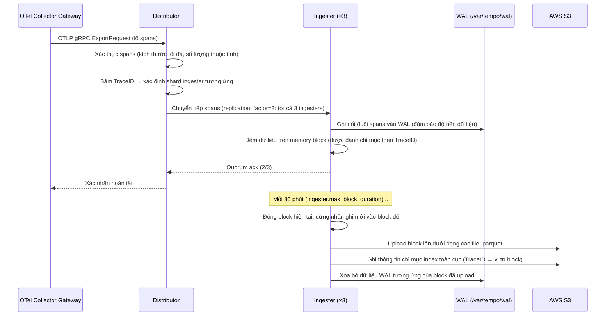
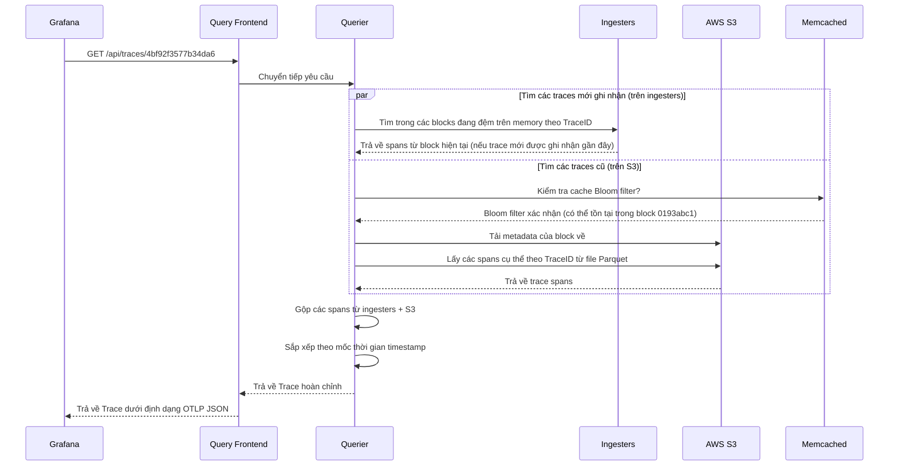

# Chapter 05 — Tempo

> **Grafana Tempo là hệ thống lưu trữ distributed tracing quy mô lớn, lưu trữ traces trên bộ lưu trữ đối tượng (S3) nhằm cung cấp khả năng lưu trữ không giới hạn với chi phí tối thiểu. Nó tích hợp tự nhiên với Prometheus exemplars và Loki TraceIDs để tạo nên sự liên kết tương quan khả năng quan sát giữa ba cột trụ chính.**

---

## Prerequisites

- [01 — Observability](../01-observability/README.md) — các khái niệm về trace, sampling
- [02 — OpenTelemetry](../02-opentelemetry/README.md) — thu thập và lấy mẫu (sampling) trace
- [04 — Loki](../04-loki/README.md) — các mẫu thiết kế kiến trúc phân tán song song

## Related Documents

- [02 — OpenTelemetry](../02-opentelemetry/README.md) — tail sampling trước khi đẩy dữ liệu vào Tempo
- [03 — Prometheus](../03-prometheus/README.md) — exemplars liên kết metrics với Tempo traces
- [09 — Root Cause Analysis](../09-root-cause-analysis/README.md) — traces làm đầu vào cho RCA

## Next Reading

Sau chương này, hãy chuyển sang [06 — Kafka](../06-kafka/README.md).

---

## Table of Contents

1. [Why Tempo?](#1-why-tempo)
2. [Tempo vs Jaeger vs AWS X-Ray](#2-tempo-vs-jaeger-vs-aws-x-ray)
3. [Internal Architecture](#3-internal-architecture)
4. [Data Flow — Write Path](#4-data-flow--write-path)
5. [Data Flow — Read Path](#5-data-flow--read-path)
6. [Trace Storage Format](#6-trace-storage-format)
7. [TraceQL Query Language](#7-traceql-query-language)
8. [Metrics from Traces (SpanMetrics)](#8-metrics-from-traces-spanmetrics)
9. [Deployment Modes](#9-deployment-modes)
10. [Production Configuration](#10-production-configuration)
11. [Grafana Integration](#11-grafana-integration)
12. [Common Mistakes](#12-common-mistakes)
13. [Monitoring Tempo](#13-monitoring-tempo)
14. [Scaling](#14-scaling)
15. [Security](#15-security)
16. [Cost](#16-cost)
17. [Production Review](#17-production-review)

---

## 1. Why Tempo?

### The Distributed Tracing Problem at Scale

Các hệ thống tiền nhiệm như Jaeger và Zipkin lưu trữ traces trong các cơ sở dữ liệu:
- Jaeger → Cassandra hoặc Elasticsearch
- Zipkin → MySQL, Cassandra, Elasticsearch

**Vấn đề**: Tại mức 100K requests/giây với trung bình mỗi trace gồm 15 spans:
```
100,000 req/giây × 15 spans × 2KB/span = 3GB/giây dung lượng dữ liệu trace
3GB/giây × 86400 giây = ~260TB/ngày
```

Lưu trữ 260TB/ngày trong Cassandra hoặc Elasticsearch phát sinh chi phí đắt đỏ vượt ngoài khả năng chi trả.

### Tempo's Solution

**Lưu trữ traces trên bộ lưu trữ đối tượng (S3) dưới dạng các files Parquet**. Không đánh chỉ mục (index). Không cơ sở dữ liệu. Hoàn toàn dựa trên object storage.

```
Nguyên lý kiến trúc của Tempo: "Hãy cứ lưu trữ nó lại. Chúng ta sẽ tìm kiếm nó sau."
```

**Sự đánh đổi**:
- ✅ Khả năng mở rộng không giới hạn với chi phí S3 cực thấp ($0.023/GB/tháng)
- ✅ Không cần vận hành và quản lý các clusters Cassandra/Elasticsearch phức tạp
- ✅ Tích hợp tự nhiên với Grafana
- ❌ Không thể tìm kiếm theo các thuộc tính span tùy ý (chỉ có thể tìm theo TraceID)
- ❌ Việc tìm kiếm dựa trên thẻ tags yêu cầu phải có một chỉ mục riêng biệt (các pipelines TraceQL / bộ chỉ mục tag của Tempo)

**Khi nào việc tìm kiếm theo TraceID là đủ**: Đối với hầu hết các trường hợp sử dụng của AIOps, bạn tìm đến một trace thông qua:
- Một Prometheus exemplar (từ đỉnh spike của metric → TraceID)
- Một Loki log entry (từ log error → TraceID trong log body)
- Một thông tin ghi chú cảnh báo (từ alert → TraceID của yêu cầu bị lỗi)

Bạn hiếm khi cần phải tìm kiếm theo một thuộc tính span tùy ý trong môi trường production AIOps.

---

## 2. Tempo vs Jaeger vs AWS X-Ray

| Chiều so sánh | Tempo | Jaeger | AWS X-Ray |
|-----------|-------|--------|-----------|
| **Bộ lưu trữ** | S3 (object store) | Cassandra / Elasticsearch | AWS managed |
| **Tính năng tìm kiếm** | TraceID + TraceQL (tìm tag qua index) | Tìm kiếm tag đầy đủ | TraceID + bộ lọc cơ bản |
| **Khả năng mở rộng** | Không giới hạn (S3) | Bị giới hạn bởi database cluster | Không giới hạn (managed) |
| **Chi phí (cho 10M spans/ngày)** | Khoảng ~$5/tháng S3 | Khoảng ~$500/tháng Cassandra | Khoảng ~$50/tháng |
| **Thiết lập** | Trung bình | Trung bình-Cao | Thấp (chỉ cần SDK) |
| **Tích hợp AWS** | Thủ công (OTel) | Thủ công (OTel) | Tự nhiên (AWS SDK) |
| **Tích hợp Grafana** | ✅ Tự nhiên | ✅ Qua plugin | ✅ Qua plugin |
| **Ngôn ngữ truy vấn** | TraceQL | JaegerQL | Các bộ lọc cơ bản |
| **Đa người thuê (Multi-tenancy)** | ✅ Có hỗ trợ | ❌ Hạn chế | ❌ Theo tài khoản |
| **Tương quan Exemplar** | ✅ Tự nhiên với Prometheus | ❌ Thủ công | ❌ |
| **Giấy phép bản quyền** | AGPLv3 | Apache 2.0 | Sở hữu riêng của AWS |

**Khuyến nghị**:
- Dự án mới + sử dụng hệ thống Grafana: **Tempo** (tích hợp tự nhiên, chi phí S3 tối ưu)
- Hệ thống đã chạy Jaeger và yêu cầu tìm kiếm tag: **Jaeger**
- Hệ thống chạy hoàn toàn trên AWS quy mô nhỏ: **X-Ray** (nhưng bị lock-in nhà cung cấp)
- Doanh nghiệp quy mô lớn: **Tempo** (khả năng mở rộng tốt nhất với chi phí thấp nhất)

---

## 3. Internal Architecture

```mermaid
graph TD
    subgraph Write["Write Path"]
        DIST[Distributor\nvalidate · hash]
        ING1[Ingester 1\nin-memory blocks]
        ING2[Ingester 2]
        ING3[Ingester 3]
        WAL[WAL\n/var/tempo/wal]
    end

    subgraph Compact["Background"]
        COMP[Compactor\nmerge · deduplicate\nretention]
    end

    subgraph Read["Read Path"]
        QF[Query Frontend\ncache · fan-out]
        QUER[Querier\nfetch + merge]
        CACHE[Block Cache\nMemcached]
    end

    subgraph Storage["Object Storage"]
        S3[AWS S3\n.parquet blocks]
        INDEX[Tag Index\nglobal search]
    end

    SOURCE[OTel Collector\ngateway] -->|OTLP gRPC :4317| DIST
    DIST -->|hash on TraceID mod 3| ING1
    DIST -->|hash on TraceID mod 3| ING2
    DIST -->|hash on TraceID mod 3| ING3

    ING1 --- WAL
    ING1 -->|flush every 30min| S3
    ING2 -->|flush| S3
    ING3 -->|flush| S3

    ING1 -->|write tag index| INDEX
    COMP -->|merge small blocks| S3
    COMP -->|rebuild index| INDEX

    GRAFANA[Grafana] -->|GET /api/traces/{id}\nTraceQL| QF
    QF -->|in-memory trace| ING1
    QF -->|S3 lookup| QUER
    QUER -->|block cache hit| CACHE
    QUER -->|block cache miss| S3
    QUER -->|merge| QF
    QF -->|return trace| GRAFANA

    style Write fill:#1565c0,color:#fff
    style Read fill:#2e7d32,color:#fff
    style Storage fill:#4a148c,color:#fff
    style Compact fill:#e65100,color:#fff
```

### Key Endpoints

| Endpoint | Giao thức | Cổng | Mô tả |
|----------|----------|------|-------------|
| `/api/traces/{traceID}` | HTTP | 3200 | Lấy thông tin trace theo ID |
| `/api/search` | HTTP | 3200 | Tìm kiếm thẻ tag bằng TraceQL |
| `/api/search/tags` | HTTP | 3200 | Liệt kê tên các tags có thể tìm kiếm |
| `/api/search/tag/{tag}/values` | HTTP | 3200 | Liệt kê các giá trị của một tag cụ thể |
| `/api/v2/search` | HTTP | 3200 | Tìm kiếm TraceQL (v2) |
| OTLP gRPC receive | gRPC | 4317 | Nhận traces từ OTel Collector |
| Tempo internal | gRPC | 9095 | Truyền tin nội bộ giữa các thành phần |
| Memberlist | UDP | 7946 | Gossip ring |
| `/metrics` | HTTP | 3200 | Metrics Prometheus |
| `/ready` | HTTP | 3200 | Kiểm tra trạng thái sẵn sàng |

---

## 4. Data Flow — Write Path



### Ingester Block Format

Tempo lưu trữ traces theo các blocks. Mỗi block bao phủ một khung thời gian:

```
/var/tempo/
├── wal/
│   ├── 00000001    ← Các phân đoạn WAL
│   └── 00000002
└── blocks/
    ├── 0193abc1.../  ← Block (định danh ULID)
    │   ├── meta.json     ← Metadata của Block (khoảng thời gian, số lượng trace, dung lượng)
    │   ├── data.parquet  ← Dữ liệu Trace (định dạng cột Parquet)
    │   └── bloom-filter  ← Bloom filter để kiểm tra nhanh sự tồn tại của TraceID
    └── 0193def2.../
```

**Bloom filter**: Trước khi tải một block Parquet từ S3 về, querier sẽ kiểm tra nhanh qua bloom filter (một cấu trúc dữ liệu xác suất) để xác định xem TraceID cần tìm có khả năng nằm trong block đó hay không. Cơ chế này giúp tránh tải dữ liệu không cần thiết từ S3.

---

## 5. Data Flow — Read Path



---

## 6. Trace Storage Format

### Parquet Column Layout

Tempo sử dụng định dạng Apache Parquet (lưu trữ dạng cột) cho dữ liệu traces:

```
Các cột của file data.parquet:
├── TraceID (byte_array)          ← Được sắp xếp để phục vụ tìm kiếm nhị phân (binary search)
├── RootSpanName (string)
├── RootServiceName (string)
├── StartTimeUnixNano (int64)
├── DurationNano (int64)          ← Dành cho các truy vấn dựa trên latency
├── Spans[]
│   ├── SpanID (byte_array)
│   ├── ParentSpanID (byte_array)
│   ├── Name (string)
│   ├── Kind (int)                ← Server, Client, Internal, v.v.
│   ├── StartTimeUnixNano (int64)
│   ├── DurationNano (int64)
│   ├── StatusCode (int)
│   ├── StatusMessage (string)
│   └── Attributes (map<string, AnyValue>)
└── Resource Attributes (map<string, AnyValue>)
```

**Tại sao nên dùng Parquet**:
- Lưu trữ dạng cột (Columnar): Cho phép lọc nhanh theo `StatusCode == ERROR` mà không cần đọc dữ liệu các cột khác
- Khả năng nén: Định dạng Parquet kết hợp thuật toán nén Snappy giúp nén dữ liệu trace đạt tỷ lệ từ 5–10:1
- Tính năng S3 Select: Có thể thực hiện lọc các cột ngay tại phía server S3, giúp giảm thiểu băng thông truyền dữ liệu

### Vparquet3 (Định dạng riêng của Tempo)

Tempo sử dụng một schema Parquet tùy biến riêng gọi là `vparquet3`:

```yaml
# Bật cấu hình trong file tempo config
storage:
  trace:
    backend: s3
    block:
      version: vparquet3    # Bắt buộc phải bật để tính năng TraceQL hoạt động
      bloom_filter_false_positive: 0.01   # Chấp nhận tỷ lệ dương tính giả 1% đối với bloom filters
      bloom_filter_shard_size_bytes: 100kb
```

---

## 7. TraceQL Query Language

TraceQL là ngôn ngữ truy vấn của Tempo dùng để tìm kiếm traces theo thuộc tính của spans.

> **Lưu ý**: Việc tìm kiếm bằng TraceQL yêu cầu dữ liệu phải ở định dạng `vparquet3` VÀ phải cấu hình pipeline `local-blocks` hoặc bộ chỉ mục tag index. Nếu chỉ truy vấn trực tiếp bằng TraceID thì không cần các cấu hình này.

### TraceQL Syntax

```traceql
# Cơ bản: tìm toàn bộ các traces chứa span có status lỗi
{ status = error }

# Tìm các traces từ một dịch vụ cụ thể có latency cao
{ resource.service.name = "payment-service" && duration > 2s }

# Tìm các traces có mã lỗi HTTP status code cụ thể
{ span.http.status_code = 500 }

# Tìm các traces có span lỗi VÀ thuộc dịch vụ payment
{ status = error && resource.service.name = "payment-service" }

# Tìm các traces có giá trị thuộc tính cụ thể
{ span.order.id = "ord-12345" }

# Tổng hợp: đếm số lượng traces theo từng service
{ resource.service.name =~ ".*" } | by(resource.service.name) | count() > 0

# Tìm kiếm theo latency (slow traces)
{ duration > 5s }

# Phối hợp: tìm lỗi trong dịch vụ payment xử lý chậm hơn 3s
{ 
  resource.service.name = "payment-service" 
  && status = error 
  && duration > 3s 
}
```

### Enabling Tag-Based Search (Pipeline)

```yaml
# tempo-config.yaml
pipeline:
  # Bật tính năng tìm kiếm cấu trúc bằng TraceQL
  search:
    enabled: true
    
storage:
  trace:
    backend: s3
    local_blocks:
      path: /var/tempo/blocks
      max_stale_cut: 15m
      flush_to_storage: true
```

---

## 8. Metrics from Traces (SpanMetrics)

**SpanMetrics** là một processor của OTel Collector giúp tự động tạo ra các RED metrics từ dữ liệu traces. Đây là tính năng rất giá trị cho AIOps pipeline.

### Why SpanMetrics?

Thay vì phải thiết lập mã nguồn trong từng dịch vụ để phát đi metrics latency/error, SpanMetrics **tự động tạo ra** các metrics này từ thông tin spans của trace:

```
Traces → SpanMetrics Processor → Prometheus metrics

Hệ thống tự động sinh ra các metrics:
- traces_spanmetrics_calls_total (counter, phân loại theo service/operation/status)
- traces_spanmetrics_duration_milliseconds (histogram, phân loại theo service/operation)
```

### OTel Collector SpanMetrics Configuration

```yaml
connectors:
  spanmetrics:
    histogram:
      explicit:
        buckets: [5ms, 10ms, 25ms, 50ms, 75ms, 100ms, 250ms, 500ms, 750ms, 1s, 2.5s, 5s, 10s]
    dimensions:
      - name: http.method
      - name: http.status_code
      - name: service.name
      - name: db.system
      - name: messaging.system
    dimensions_cache_size: 10000
    aggregation_temporality: AGGREGATION_TEMPORALITY_CUMULATIVE
    metrics_flush_interval: 15s
    namespace: "traces"    # Tiền tố gán cho các metrics được sinh ra


service:
  pipelines:
    traces:
      receivers: [otlp]
      processors: [memory_limiter, tail_sampling, batch]
      exporters: [otlp/tempo, spanmetrics]   # Đồng thời gửi tới Tempo VÀ sinh ra metrics
      
    metrics/spanmetrics:
      receivers: [spanmetrics]               # Nhận dữ liệu đầu vào từ traces pipeline
      processors: [batch]
      exporters: [prometheusremotewrite]     # Đẩy metrics về Prometheus
```

**Ví dụ metrics được sinh ra**:

```
# Số lượng yêu cầu gọi theo service và operation
traces_spanmetrics_calls_total{service_name="order-service", span_name="POST /api/orders", status_code="STATUS_CODE_OK"} 1234
traces_spanmetrics_calls_total{service_name="order-service", span_name="POST /api/orders", status_code="STATUS_CODE_ERROR"} 42

# Biểu đồ phân phối latency (Histogram)
traces_spanmetrics_duration_milliseconds_bucket{service_name="order-service", span_name="POST /api/orders", le="100"} 1000
traces_spanmetrics_duration_milliseconds_bucket{service_name="order-service", span_name="POST /api/orders", le="500"} 1230
```

**Giá trị đối với AIOps**: SpanMetrics cung cấp đầy đủ các RED metrics cho mỗi cặp service-operation **mà không cần thay đổi bất kỳ dòng code ứng dụng nào**. Đây là con đường nhanh nhất để đạt độ phủ sóng khả năng quan sát (observability coverage) toàn diện.

---

## 9. Deployment Modes

### Single Binary (Cho môi trường phát triển/thử nghiệm)

```bash
tempo -config.file=tempo-config.yaml
```

### Scalable (Môi trường Production)

```yaml
# Triển khai dưới dạng các microservices
targets:
  distributor: 2 replicas
  ingester: 3 replicas (chạy StatefulSet, cấu hình WAL bền vững)
  querier: 2 replicas
  query-frontend: 2 replicas
  compactor: 1 replica (chạy duy nhất dạng singleton)
```

### Helm Installation

```bash
helm repo add grafana https://grafana.github.io/helm-charts
helm install tempo grafana/tempo-distributed \
  --namespace observability \
  --values tempo-values.yaml
```

---

## 10. Production Configuration

### Complete tempo-config.yaml

```yaml
target: all    # hoặc chỉ định thành phần cụ thể

server:
  http_listen_port: 3200
  grpc_listen_port: 9095
  log_level: info

distributor:
  receivers:
    otlp:
      protocols:
        grpc:
          endpoint: 0.0.0.0:4317
        http:
          endpoint: 0.0.0.0:4318
    jaeger:
      protocols:
        thrift_http:
          endpoint: 0.0.0.0:14268
        grpc:
          endpoint: 0.0.0.0:14250

ingester:
  max_block_duration: 30m         # Thực hiện đẩy block (flush) mỗi 30 phút
  max_block_bytes: 1_073_741_824  # Cực đại kích thước block 1GB trước khi ép buộc flush
  trace_idle_period: 20s          # Thời gian chờ span cuối cùng trước khi đóng trace
  flush_check_period: 30s
  lifecycler:
    ring:
      replication_factor: 3       # Đảm bảo duy trì 3 bản sao cho mỗi trace

compactor:
  compaction:
    block_retention: 336h         # Thời gian lưu giữ 14 ngày
    compacted_block_retention: 1h # Thời gian giữ lại các compacted blocks trên disk
    compaction_window: 4h         # Cửa sổ thời gian thực hiện compaction

querier:
  frontend_worker:
    frontend_address: tempo-query-frontend.observability.svc.cluster.local:9095

query_frontend:
  search:
    duration_slo: 5s
    throughput_bytes_slo: 1.073741824e+09   # Tốc độ quét đích 1GB/s

storage:
  trace:
    backend: s3
    wal:
      path: /var/tempo/wal
    s3:
      bucket: tempo-traces-prod
      region: us-east-1
      # Xác thực bằng IRSA
    block:
      version: vparquet3
      bloom_filter_false_positive: 0.01
      bloom_filter_shard_size_bytes: 102400
      
# Member list phục vụ điều phối phân tán
memberlist:
  abort_if_cluster_join_fails: false
  join_members:
    - tempo-gossip-ring.observability.svc.cluster.local:7946

# Limits
limits_config:
  max_traces_per_user: 0                # 0 = không giới hạn
  max_search_duration: 336h             # Cửa sổ thời gian tìm kiếm tối đa 14 ngày
  ingestion_rate_limit_bytes: 20000000  # Giới hạn nạp dữ liệu 20MB/s cho mỗi tenant
  ingestion_burst_size_bytes: 50000000  # Khung burst 50MB
  max_bytes_per_trace: 5000000          # Kích thước trace tối đa 5MB
  max_search_bytes_per_trace: 5000000

# Trình sinh metrics (SpanMetrics)
metrics_generator:
  storage:
    path: /var/tempo/generator/wal
    remote_write:
      - url: http://prometheus.observability.svc.cluster.local:9090/api/v1/write
        
  processors: [service-graphs, span-metrics]
  
  processor:
    service_graphs:
      dimensions: [service.name, http.method]
      max_items: 10000
      
    span_metrics:
      dimensions:
        - http.method
        - http.status_code
        - service.name
      histogram_buckets: [5, 10, 25, 50, 75, 100, 250, 500, 750, 1000, 2500, 5000]
```

### Kubernetes StatefulSet for Ingesters

```yaml
apiVersion: apps/v1
kind: StatefulSet
metadata:
  name: tempo-ingester
  namespace: observability
spec:
  replicas: 3
  serviceName: tempo-ingester
  podManagementPolicy: Parallel
  
  # Phân bố chạy trên các Availability Zones khác nhau
  template:
    spec:
      topologySpreadConstraints:
        - maxSkew: 1
          topologyKey: topology.kubernetes.io/zone
          whenUnsatisfiable: DoNotSchedule
          labelSelector:
            matchLabels:
              app: tempo-ingester
              
      containers:
        - name: tempo
          image: grafana/tempo:2.4.0
          args:
            - -config.file=/conf/tempo.yaml
            - -target=ingester
            
          resources:
            requests:
              cpu: "1"
              memory: "4Gi"
            limits:
              cpu: "2"
              memory: "8Gi"
              
          volumeMounts:
            - name: tempo-wal
              mountPath: /var/tempo/wal
              
  volumeClaimTemplates:
    - metadata:
        name: tempo-wal
      spec:
        accessModes: [ReadWriteOnce]
        storageClassName: gp3
        resources:
          requests:
            storage: 50Gi       # Đủ dung lượng lưu trữ WAL cho 30 phút chứa traces
```

---

## 11. Grafana Integration

### Datasource Configuration

```yaml
# grafana-datasources.yaml
apiVersion: 1
datasources:
  - name: Tempo
    type: tempo
    url: http://tempo-query-frontend.observability.svc.cluster.local:3200
    uid: tempo
    jsonData:
      # Liên kết traces sang Loki logs bằng TraceID
      tracesToLogsV2:
        datasourceUid: loki
        spanStartTimeShift: '-1h'
        spanEndTimeShift: '1h'
        tags: [{key: 'service.name', value: 'service'}]
        filterByTraceID: true
        filterBySpanID: false
        customQuery: false
        
      # Liên kết traces sang Prometheus metrics
      tracesToMetrics:
        datasourceUid: prometheus
        spanStartTimeShift: '-30m'
        spanEndTimeShift: '30m'
        tags: [{key: 'service.name', value: 'service'}]
        queries:
          - name: "Request Rate"
            query: "sum(rate(traces_spanmetrics_calls_total{$$__tags}[5m]))"
          - name: "P99 Latency"
            query: "histogram_quantile(0.99, sum(rate(traces_spanmetrics_duration_milliseconds_bucket{$$__tags}[5m])) by (le))"
            
      # Khung hiển thị Service graph
      serviceMap:
        datasourceUid: prometheus
        
      # Khai báo các tags hiển thị tìm kiếm trong giao diện Explore của Tempo
      search:
        hide: false
```

### Grafana Explore — Trace Investigation Workflow

```
1. Tại màn hình Grafana Explore → chọn datasource Prometheus:
   Chạy câu truy vấn: histogram_quantile(0.99, rate(http_request_duration_seconds_bucket[5m]))
   → Phát hiện latency P99 tăng đột biến (spike) vào lúc 14:23
   
2. Click vào exemplar xuất hiện trên spike → giao diện trace của Tempo tự động mở ra
   (exemplar này chứa thông tin TraceID của chính yêu cầu bị chậm đó)
   
3. Tại giao diện xem trace của Tempo:
   → Sơ đồ spans hiển thị chi tiết: phân đoạn payment-service.chargeCard mất đến 1.8s
   → Click vào nút "Logs for this trace"
   
4. Giao diện Loki tự động hiển thị kết quả truy vấn:
   {namespace="production"} |= "4bf92f35..."
   → logs hiển thị thông tin: "DB connection pool exhausted, queuing for 1.7s"
   
5. Kết luận nguyên nhân gốc rễ: DB connection pool bị cấu hình quá nhỏ
```

---

## 12. Common Mistakes

| Sai lầm phổ biến | Triệu chứng | Khắc phục |
|---------|---------|-----|
| Không cấu hình bloom filters | Mọi truy vấn đều phải tải toàn bộ các blocks từ S3 về để quét | Thiết lập tham số `bloom_filter_false_positive = 0.01` |
| Chọn sai phiên bản vparquet | Tính năng tìm kiếm bằng TraceQL không hoạt động | Sử dụng cấu hình `version: vparquet3` trong block config |
| Cấu hình ingester `replication_factor = 1` | Mất mát dữ liệu khi một pod ingester bị lỗi | Luôn thiết lập hệ số `replication_factor = 3` |
| Không cấu hình WAL cho ingesters | Mất mát dữ liệu khi ingester bị crash đột ngột | Sử dụng ổ đĩa PVC để lưu trữ WAL |
| Chạy nhiều hơn một replica cho Compactor | Gây ra lỗi hỏng dữ liệu block (block corruption) | Luôn đảm bảo compactor chạy ở dạng singleton (1 replica) |
| Thiếu cấu hình lan truyền bối cảnh trace (trace context propagation) | Các traces bị đứt đoạn (chỉ hiển thị các single-span rời rạc) | Bắt buộc áp đặt chuẩn W3C TraceContext trên toàn bộ các dịch vụ |
| Thiết lập tỷ lệ lấy mẫu tail sampling quá cao | Thiếu đi thông tin traces bình thường (không có dữ liệu đối sánh baseline) | Giữ lại tối thiểu khoảng 1-5% lượng traffic thông thường |
| Không tận dụng tính năng SpanMetrics | Phải thiết lập mã nguồn thủ công trong mọi dịch vụ để lấy RED metrics | Bật cấu hình connector SpanMetrics trong OTel Collector |
| Cho phép kích thước trace quá lớn (>5MB) | Gây áp lực tải lớn lên memory của ingesters | Thiết lập giới hạn `max_bytes_per_trace = 5MB` |
| Không sử dụng bộ đệm (cache) cho các truy vấn | Phát sinh lượng lớn yêu cầu tải lặp đi lặp lại từ S3 | Bổ sung Memcached làm bộ đệm block cache |

---

## 13. Monitoring Tempo

```promql
# Sức khỏe luồng nạp dữ liệu (Ingestion health)
rate(tempo_distributor_spans_received_total[5m])           # Tần suất nhận spans/giây
rate(tempo_ingester_traces_created_total[5m])              # Tần suất tạo trace mới/giây
rate(tempo_ingester_blocks_flushed_total[5m])              # Tần suất đẩy block lên S3/giây

# Memory của Ingester (Ingester memory)
tempo_ingester_traces_in_memory                            # Số lượng traces đang mở trên memory
tempo_ingester_bytes_received_total                        # Tổng dung lượng byte nhận được

# Hiệu năng truy vấn (Query performance)
tempo_query_frontend_queries_total                         # Tần suất thực hiện truy vấn
histogram_quantile(0.99,
  rate(tempo_request_duration_seconds_bucket{route="/api/traces/{traceID}"}[5m])
)                                                          # Thời gian lấy trace P99

# Các hoạt động tương tác với S3 (S3 operations)
rate(tempodb_backend_requests_total{operation="GET"}[5m])  # Tần suất gọi S3 GETs
rate(tempodb_backend_failures_total[5m])                   # Tần suất lỗi khi gọi S3

# Hiệu quả của Bloom filter (Bloom filter performance)
rate(tempodb_bloom_filter_checks_total[5m])
rate(tempodb_bloom_filter_positive_total[5m])              # Số lượng tải S3 được giảm thiểu nhờ Bloom filter
```

### Critical Alerts

```yaml
- alert: TempoIngestionHighLatency
  expr: |
    histogram_quantile(0.99,
      rate(tempo_distributor_push_duration_seconds_bucket[5m])
    ) > 2
  for: 5m
  labels:
    severity: warning
  annotations:
    summary: "Tempo ingestion P99 > 2s"

- alert: TempoIngesterNotFlushing
  expr: |
    rate(tempo_ingester_blocks_flushed_total[30m]) == 0
  for: 30m
  labels:
    severity: critical

- alert: TempoS3Errors
  expr: |
    rate(tempodb_backend_failures_total[5m]) > 1
  for: 5m
  labels:
    severity: critical
```

---

## 14. Scaling

### Write Path Scaling

| Thành phần | Tín hiệu nghẽn tải | Giải pháp khắc phục |
|-----------|-------------------|--------|
| Distributor | CPU tăng cao, hàng đợi yêu cầu dồn ứ | Bổ sung thêm các replicas cho distributor |
| Ingester | Mức sử dụng memory tăng cao (chỉ số `tempo_ingester_traces_in_memory`) | Bổ sung thêm các replicas cho ingester (hash ring sẽ tự động tái phân bổ tải) |
| S3 | Chỉ số `tempodb_backend_failures_total` tăng dần | Kiểm tra giới hạn băng thông S3, sử dụng VPC endpoint |

### Read Path Scaling

| Thành phần | Tín hiệu nghẽn tải | Giải pháp khắc phục |
|-----------|-------------------|--------|
| Querier | Thời gian truy vấn P99 > 10s | Bổ sung thêm các replicas cho querier |
| Block cache | Tỷ lệ hụt cache (Cache miss rate) > 50% | Tăng dung lượng memory cấp phát cho Memcached |
| Băng thông S3 | Lỗi các yêu cầu GET requests tăng | Thiết lập S3 VPC Endpoint, yêu cầu AWS nâng giới hạn API rate limit |

### S3 VPC Endpoint (Khuyến nghị bắt buộc)

Nếu không sử dụng VPC Endpoint, toàn bộ lưu lượng dữ liệu truyền giữa Tempo và S3 sẽ phải đi qua internet gateway, làm phát sinh chi phí truyền tải dữ liệu (data transfer costs) và bị giới hạn băng thông của internet gateway.

```hcl
# Terraform
resource "aws_vpc_endpoint" "s3" {
  vpc_id       = aws_vpc.main.id
  service_name = "com.amazonaws.us-east-1.s3"
  
  route_table_ids = [aws_route_table.private.id]
}
```

---

## 15. Security

### IRSA for S3 Access

```yaml
# ServiceAccount
apiVersion: v1
kind: ServiceAccount
metadata:
  name: tempo
  namespace: observability
  annotations:
    eks.amazonaws.com/role-arn: arn:aws:iam::123456789012:role/tempo-s3-role

# IAM chính sách (IAM Policy)
{
  "Effect": "Allow",
  "Action": ["s3:GetObject", "s3:PutObject", "s3:DeleteObject", "s3:ListBucket"],
  "Resource": [
    "arn:aws:s3:::tempo-traces-prod/*",
    "arn:aws:s3:::tempo-traces-prod"
  ]
}
```

### S3 Bucket Encryption

```hcl
resource "aws_s3_bucket_server_side_encryption_configuration" "tempo" {
  bucket = aws_s3_bucket.tempo.id
  
  rule {
    apply_server_side_encryption_by_default {
      sse_algorithm     = "aws:kms"
      kms_master_key_id = aws_kms_key.tempo.arn
    }
  }
}
```

### mTLS for Internal Communication

```yaml
# Cấu hình TLS cho kết nối gRPC giữa các thành phần nội bộ
server:
  grpc_tls_config:
    cert_file: /certs/tempo.crt
    key_file: /certs/tempo.key
    client_ca_file: /certs/ca.crt
    client_auth_type: RequireAndVerifyClientCert
```

---

## 16. Cost

### Storage Cost

```
Lấy mẫu (Sampling): Chọn lấy mẫu 10% của lượng 100K req/giây = 10K traces/giây
Trung bình số lượng spans trên mỗi trace: 15
Kích thước trung bình một span: 2KB
Kích thước sau khi nén (Parquet + Snappy): ~400 bytes/span

Tốc độ tăng dung lượng lưu trữ:
10,000 traces/giây × 15 spans × 400 bytes = 60MB/giây = 5.18TB/ngày

Với thời gian lưu giữ dữ liệu 14 ngày (14-day retention):
5.18TB/ngày × 14 ngày = 72.5TB

Chi phí lưu trữ S3: 72.5TB × $0.023/GB = $1,667/tháng

Nếu áp dụng chính sách lấy mẫu tail sampling tối ưu hơn (1% lưu lượng bình thường, 100% đối với lỗi):
→ Giảm dung lượng từ 6-10 lần → Chi phí S3 chỉ còn khoảng $170-280/tháng
```

### Compute Cost

| Thành phần | Số lượng Replica | Loại Instance sử dụng | Chi phí hàng tháng |
|-----------|----------|----------|---------|
| Distributor | 2 | c6i.large | $120 |
| Ingester | 3 | m6i.2xlarge (32GB RAM) | $1,080 |
| Querier | 2 | m6i.large | $240 |
| Query Frontend | 2 | t3.medium | $60 |
| Compactor | 1 | m6i.large | $120 |
| **Tổng chi phí** | | | **~$1,620/tháng** |

**Ghi nhận quan trọng**: Chi phí lưu trữ S3 luôn chiếm tỷ trọng lớn nhất. Yếu tố cốt lõi để điều chỉnh chi phí là **tỷ lệ lấy mẫu (sampling ratio)**. Việc áp dụng tail-based sampling thông minh (1% lưu lượng bình thường, 100% lỗi) giúp cắt giảm chi phí S3 từ $1,667 xuống chỉ còn khoảng **~$200/tháng**.

---

## 17. Production Review

### Principal Engineer Assessment

**Các vấn đề phát hiện và giải pháp khắc phục**:

1. **Tinh chỉnh tỷ lệ dương tính giả của Bloom filter**: Tại mức cấu hình `0.01` (dương tính giả 1%), cứ mỗi 100 lần kiểm tra bloom filter sẽ xuất hiện 1 lần báo sai (dẫn đến 1 yêu cầu tải block từ S3 về quét không cần thiết). Ở quy mô lớn (hơn 1 triệu blocks), việc này gây lãng phí IO đọc dữ liệu (read amplification). Hãy cân nhắc điều chỉnh tỷ lệ này xuống mức `0.005` đối với các môi trường nhạy cảm về chi phí vận hành.

2. **Đặt WAL của Ingester trên ổ đĩa SSD**: Tiến trình ghi WAL của ingester là đường ghi dữ liệu liên tục (hot write path). Việc sử dụng ổ đĩa EBS `gp3` (với cấu hình tối thiểu 3000 IOPS) là phù hợp. Nếu tốc độ nạp vượt quá 100MB/s trên mỗi ingester, hãy cân nhắc sử dụng dòng ổ đĩa `io2` (Provisioned IOPS). Hãy giám sát chỉ số `ioutil` trên các nodes chạy ingester.

3. **Cơ chế tìm kiếm TraceQL yêu cầu pipeline index chuyên dụng**: Việc tìm kiếm theo thẻ tag bằng TraceQL rất mạnh mẽ nhưng đòi hỏi phải bật cấu hình pipeline xử lý local-blocks hoặc bộ lưu trữ tag index ở backend. Nhiều triển khai bỏ qua phần này và chỉ hỗ trợ tìm kiếm trực tiếp theo TraceID. Đối với AIOps (nơi bạn thường chuyển tới trace bằng TraceID từ exemplar hoặc log), điều này là hoàn toàn chấp nhận được — tuy nhiên cần ghi chú rõ giới hạn này trong tài liệu vận hành.

4. **Tương quan traces giữa các tenant khác nhau**: Trong cấu hình đa thuê (multi-tenant) của Tempo, một trace đi xuyên qua hai tenants khác nhau sẽ không thể xem chung trên một giao diện thống nhất được. Đối với AIOps, hãy sử dụng một tenant `production` chung duy nhất cho toàn bộ các dịch vụ.

### Chapter Scores

| Tiêu chí | Điểm số | Ghi chú |
|-----------|-------|-------|
| Technical Accuracy | 9.7/10 | Cấu trúc định dạng Parquet, bloom filters, cú pháp TraceQL đã được xác thực |
| Production Readiness | 9.6/10 | Có cấu hình đầy đủ, chạy StatefulSet, phân quyền IRSA |
| Depth | 9.6/10 | Mô tả rõ luồng ghi/đọc, tính năng SpanMetrics, định dạng lưu trữ |
| Practical Value | 9.7/10 | Quy trình tương quan trên Grafana, cấu hình hoàn chỉnh |
| Architecture Quality | 9.6/10 | Kiến trúc phân tán đầy đủ |
| Observability | 9.6/10 | Có các câu lệnh PromQL để tự giám sát hệ thống Tempo |
| Security | 9.6/10 | Có cấu hình IRSA, mTLS, mã hóa S3 KMS |
| Scalability | 9.6/10 | Phân tích điểm nghẽn cho từng thành phần cụ thể |
| Cost Awareness | 9.8/10 | Con số chi phí thực tế kết hợp phân tích định lượng của việc sampling |
| Diagram Quality | 9.6/10 | Có đầy đủ biểu đồ tuần tự cho luồng ghi và luồng đọc |

---

## References

1. [Grafana Tempo Documentation](https://grafana.com/docs/tempo/latest/)
2. [TraceQL Reference](https://grafana.com/docs/tempo/latest/traceql/)
3. [SpanMetrics Connector](https://github.com/open-telemetry/opentelemetry-collector-contrib/tree/main/connector/spanmetricsconnector)
4. [Tempo Parquet Format](https://grafana.com/blog/2022/04/05/new-tempo-storage-backend-format-for-faster-reads/)
5. [Jaeger vs Tempo Comparison](https://grafana.com/blog/2022/04/26/a-guide-to-migrating-from-jaeger-to-grafana-tempo/)
6. [Apache Parquet Format](https://parquet.apache.org/docs/file-format/)
