# Chapter 06 — Telemetry Data Plane: Normalize, Enrich, Store & Feature Store

> **Thu thập telemetry (OTel, Prometheus, Loki, Tempo) chỉ là nửa đầu của bài toán. Nửa còn lại — và thường là nơi AIOps production thất bại — là data plane: chuẩn hóa, làm giàu, kiểm định chất lượng, lưu trữ đúng tầng, và phục vụ feature cho detection. Chương này trả lời câu hỏi Principal SRE phải hỏi trước khi mua model: *dữ liệu của bạn đã sẵn sàng để máy học và RCA tin cậy chưa?* Nếu chưa, mọi detector chỉ là noise amplifier.**

### Architecture poster — pipeline AIOps end-to-end


*Poster kiến trúc (PNG): Collection → (Data Plane) → Transport/Kafka → Intelligence → Action. Chương này lấp khoảng trống giữa “đã scrape/export” và “có thể detect/train/audit”.*

---

## Prerequisites

- [00 — Giới thiệu AIOps](../00-introduction.vi.md) — pipeline, maturity, data flywheel
- [01 — Observability](../01-observability/README.vi.md) — ba trụ metrics / logs / traces, SLI/SLO
- [02 — OpenTelemetry](../02-opentelemetry/README.vi.md) — thu thập, processor, resource attributes
- [03 — Prometheus](../03-prometheus/README.vi.md) — metric model, cardinality, retention TSDB
- [04 — Loki](../04-loki/README.vi.md) — log pipeline, label design, object storage
- [05 — Tempo](../05-tempo/README.vi.md) — trace storage, exemplar correlation

## Related Documents

- [07 — Kafka / Kinesis](../07-kafka/README.vi.md) — buffer & fan-out sau data plane
- [08 — Anomaly Detection](../08-anomaly-detection/README.vi.md) — consumer feature / train-serve
- [09 — Alert Correlation](../09-alert-correlation/README.vi.md) — cần topology & canonical incident events
- [10 — Root Cause Analysis](../10-root-cause-analysis/README.vi.md) — phụ thuộc enrichment + change context
- [11 — LLM Agent](../11-llm-agent/README.vi.md) — context pack từ store / KB / embedding
- [12 — Remediation](../12-remediation/README.vi.md) — audit store, verify metrics
- [13 — Production](../13-production/README.vi.md) — SLO của chính pipeline
- [15 — E-commerce & Banking](../15-ecommerce-banking/README.vi.md) — retention & PII regulated
- [16 — Famous Incidents](../16-famous-incidents/README.vi.md) — control vs data plane, cascade

## Next Reading

Sau chương này, hãy chuyển sang [07 — Apache Kafka / AWS Kinesis](../07-kafka/README.vi.md) để đi sâu transport, topic design, DLQ và replay.

---

## Table of Contents

1. [Vì sao chương này nằm sau collection](#1-vì-sao-chương-này-nằm-sau-collection)
2. [Bản đồ Data Plane vs Intelligence Plane](#2-bản-đồ-data-plane-vs-intelligence-plane)
3. [Khung quyết định: raw telemetry đủ khi nào?](#3-khung-quyết-định-raw-telemetry-đủ-khi-nào)
4. [Normalize — chuẩn hóa tín hiệu](#4-normalize--chuẩn-hóa-tín-hiệu)
5. [Enrich — làm giàu ngữ cảnh](#5-enrich--làm-giàu-ngữ-cảnh)
6. [Validate / Data Quality / Quarantine / DLQ](#6-validate--data-quality--quarantine--dlq)
7. [Canonical Event Model cho AIOps](#7-canonical-event-model-cho-aiops)
8. [Kiến trúc lưu trữ — data sống ở đâu](#8-kiến-trúc-lưu-trữ--data-sống-ở-đâu)
9. [Ma trận Retention — giữ bao lâu theo mục đích](#9-ma-trận-retention--giữ-bao-lâu-theo-mục-đích)
10. [Lifecycle sau khi store](#10-lifecycle-sau-khi-store)
11. [Feature Store cho AIOps](#11-feature-store-cho-aiops)
12. [Late data, watermarks, reprocessing](#12-late-data-watermarks-reprocessing)
13. [PII / Redaction — đặt stage ở đâu](#13-pii--redaction--đặt-stage-ở-đâu)
14. [Mô hình chi phí giữ dữ liệu](#14-mô-hình-chi-phí-giữ-dữ-liệu)
15. [Thang trưởng thành Data Plane L0–L5](#15-thang-trưởng-thành-data-plane-l0l5)
16. [Anti-patterns](#16-anti-patterns)
17. [Edge cases (12+)](#17-edge-cases-12)
18. [Cắm vào Kafka (07) và Anomaly (08)](#18-cắm-vào-kafka-07-và-anomaly-08)
19. [Production Checklist (40+)](#19-production-checklist-40)
20. [Câu hỏi Socratic](#20-câu-hỏi-socratic)
21. [Gap đã đóng / Gap còn mở](#21-gap-đã-đóng--gap-còn-mở)
22. [Tóm tắt & mental model](#22-tóm-tắt--mental-model)

---

## 1. Vì sao chương này nằm sau collection

> [!NOTE]
> **Ý TƯỞNG**
> Collection (Ch.02–05) trả lời: *làm sao đưa telemetry ra khỏi process?* Data plane trả lời: *làm sao để telemetry đó trở thành input có contract cho máy và cho con người?* Nếu đảo thứ tự — xây detector trước khi có contract tên service, đơn vị metric, schema log — bạn sẽ train mô hình trên rác và tin vào false confidence.

### 1.1 Collection kết thúc ở đâu?

Sau [OpenTelemetry](../02-opentelemetry/README.vi.md), [Prometheus](../03-prometheus/README.vi.md), [Loki](../04-loki/README.vi.md), [Tempo](../05-tempo/README.vi.md), bạn đã có:

| Thành phần | Bạn “có” được gì | Bạn **chưa** có gì |
|------------|------------------|--------------------|
| OTel Collector | Pipeline export đa tín hiệu | Contract chuẩn org-wide cho naming |
| Prometheus | Time series scrape/remote-write | Feature window ổn định cho ML |
| Loki | Log index + object store chunks | Event semantic (severity vs auth vs deploy) |
| Tempo | Trace by ID + SpanMetrics | Topology tin cậy + change context |

Collection tối ưu cho **khả năng quan sát vận hành** (dashboard, page, drill-down). AIOps cần thêm **khả năng tái lập (reproducibility)** và **khả năng liên kết (joinability)** giữa các tín hiệu theo thời gian, identity, và topology.

### 1.2 Khoảng trống kinh điển sau collection

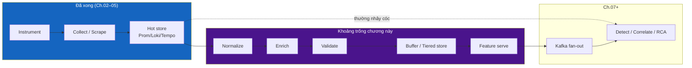

> [!WARNING]
> **Nhảy cóc nguy hiểm**: nhiều team sau khi có Grafana “đẹp” liền cắm anomaly detector trực tiếp vào PromQL thô. Ba tháng sau: service rename làm baseline gãy, unit `ms` vs `s` làm score vô nghĩa, deploy không gắn version khiến RCA luôn đoán sai. Data plane tồn tại để **chặn các failure mode im lặng** này trước intelligence layer.

### 1.3 Mental model pipeline cập nhật

Handbook dùng pipeline mở rộng sau chương này:

```text
Collect → Normalize → Enrich → Validate → Buffer/Store → Feature → Detect → Correlate → RCA → Decide → Remediate → Learn
```

| Stage | Câu hỏi THEN (khi nào) | Owner điển hình |
|-------|------------------------|-----------------|
| Collect | Khi process emit signal | App + Platform |
| **Normalize** | Khi identity/unit/schema lệch giữa team | Platform / Observability |
| **Enrich** | Khi RCA/correlation cần ngữ cảnh ngoài signal | Platform + CMDB/Service catalog |
| **Validate** | Khi schema break giết ML im lặng | Data platform + AIOps |
| **Buffer/Store** | Khi fan-out, replay, tiering cost | Platform |
| **Feature** | Khi train/serve phải cùng định nghĩa | AIOps / ML platform |
| Detect… | Khi signal đã “joinable & trusted” | AIOps |

> [!TIP]
> **Vì sao không gộp Normalize vào OTel Collector processors?**
> Có thể — và nên — làm **một phần** normalize ở Collector (resource attributes, unit conversion nhẹ). Nhưng org-wide canonical model, topology join, và feature contract thường **vượt quá** scope Collector: chúng phụ thuộc catalog, deploy API, SLO store, ticket system. Data plane là **hợp đồng tổ chức**, không chỉ config YAML một collector.

### 1.4 Quan hệ với control plane

Đừng nhầm **telemetry data plane** (chương này) với **Kubernetes control plane** hay **product data plane** trong [Famous Incidents](../16-famous-incidents/README.vi.md). Ở đây:

- **Telemetry Data Plane**: đường đi và biến đổi của metrics/logs/traces/events phục vụ AIOps.
- **Intelligence Plane**: detect → correlate → RCA → LLM → decide.
- **Action / Control Plane (AIOps)**: remediation policy, break-glass, audit.

Ba plane phải fail độc lập. Data plane down ≠ product traffic down — nhưng intelligence sẽ mù. Xem thêm [Production](../13-production/README.vi.md) về fail-open alerting.

---

## 2. Bản đồ Data Plane vs Intelligence Plane

> [!NOTE]
> **Ý TƯỞNG**
> Data plane tối ưu **đúng, đủ, rẻ, có thể replay**. Intelligence plane tối ưu **tín hiệu actionable, precision-at-page, explainability**. Trộn hai mục tiêu vào một service monolith là anti-pattern: bạn sẽ không scale được team ownership và không debug được “model sai hay data sai”.

### 2.1 Phân ranh giới trách nhiệm

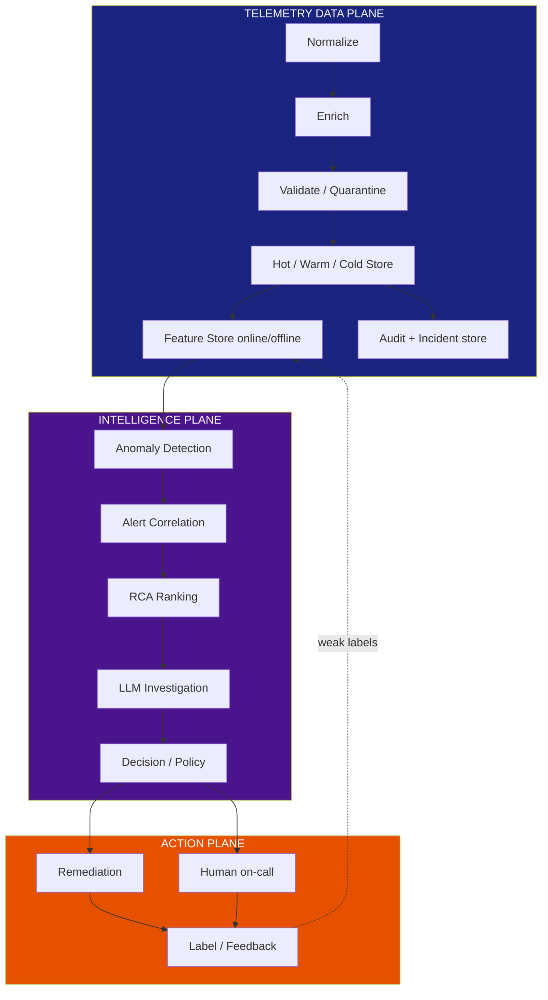

| Chiều | Data Plane | Intelligence Plane |
|-------|------------|--------------------|
| Input | Raw / semi-raw telemetry | Canonical events + features |
| Output | Trusted series, events, features | Anomalies, groups, RCA, recommendations |
| SLO chính | Freshness, completeness, schema validity | Precision-at-page, MTTD, explain rate |
| Failure mode | Silent drop, skew, stale topology | FP/FN, over-correlation, hallucination |
| Replay | Bắt buộc (train + audit) | Tùy (shadow, backtest) |
| Team skill | Distributed systems + data quality | Stats/ML + SRE domain |

### 2.2 Luồng dữ liệu đầy đủ (logical)

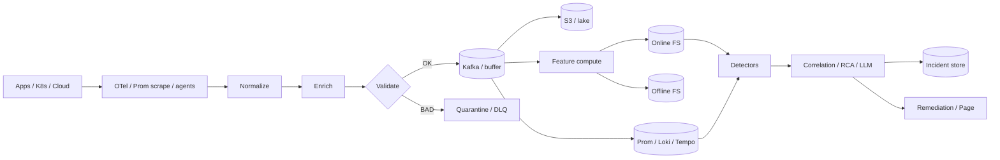

### 2.3 WHERE vs WHEN — hai trục thiết kế

- **WHERE (ở đâu)**: Collector processor? Stream job? Feature store job? Query-time join?
- **WHEN (khi nào cần)**: luôn luôn? chỉ multi-tenant? chỉ khi train ML? chỉ regulated?

Principal SRE chọn theo **hậu quả khi sai**, không theo “architecture đẹp”:

| Biến đổi | Prefer WHERE | Prefer WHEN |
|----------|--------------|-------------|
| Unit `s`→`ms` | Sớm (Collector / scrape relabel) | Luôn — unit sai phá mọi model |
| Service name canonical | Sớm + catalog | Khi >1 team emit |
| Topology edge | Enrich service / cache | Khi correlation/RCA |
| Rolling z-score feature | Feature job | Khi detector online |
| Full-text log body archive | Cold object | Khi audit / rare RCA |
| Embedding cho KB | Offline batch | Khi LLM agent production |

> [!IMPORTANT]
> **Quy tắc vàng**: mọi thứ **identity-critical** (service, env, tenant, unit, timestamp semantics) xử lý **sớm và deterministic**. Mọi thứ **model-specific** (window 5m vs 15m, embedding model version) để **Feature stage** versioned. Đừng nhét hyperparameter model vào Collector.

---

## 3. Khung quyết định: raw telemetry đủ khi nào?

> [!NOTE]
> **Ý TƯỞNG**
> Không phải org nào cũng cần full data plane ngày 1. Xây quá sớm = fixed cost chết người. Xây quá muộn = ML/RCA trên dữ liệu bẩn, mất niềm tin. Khung dưới đây giúp bạn **chọn mức đầu tư đúng lúc**.

### 3.1 Decision tree

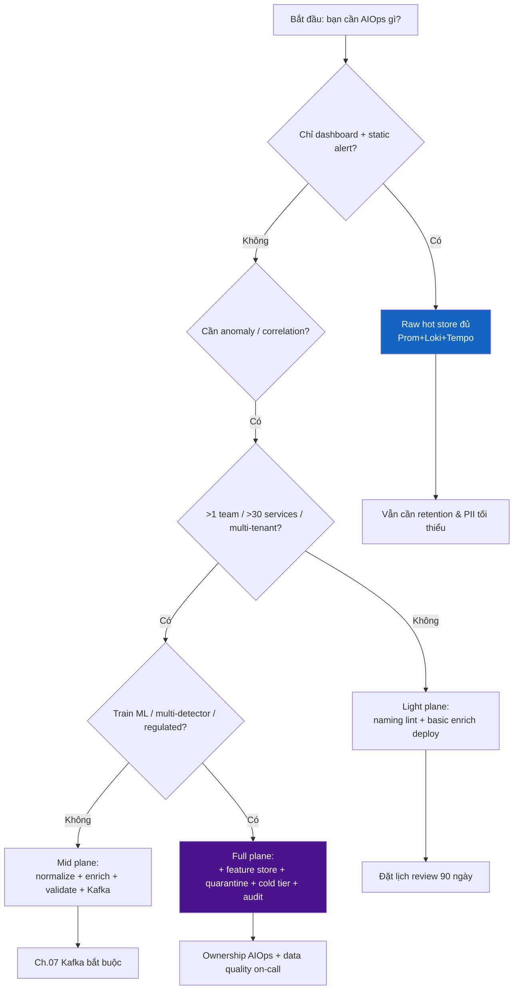

### 3.2 Ma trận “đủ chưa?”

| Nhu cầu vận hành | Raw telemetry | +Normalize | +Enrich | +Validate/DLQ | +Feature Store |
|-------------------|---------------|------------|---------|---------------|----------------|
| Dashboard on-call | ✅ | ⚪ | ⚪ | ⚪ | ❌ |
| Static threshold page | ✅ | 🟡 unit/name | ⚪ | ⚪ | ❌ |
| SLO burn alerts | ✅ | 🟡 | 🟡 deploy/SLO id | ⚪ | ❌ |
| Statistical anomaly (EWMA) | 🟡 | ✅ | 🟡 | 🟡 | ⚪ |
| Multi-signal correlation | ❌ | ✅ | ✅ topology | ✅ | ⚪ |
| RCA ranking + change | ❌ | ✅ | ✅ change/owner | ✅ | 🟡 |
| Multi-model ensemble | ❌ | ✅ | ✅ | ✅ | ✅ |
| Regulated audit 1–7y | 🟡 cold | ✅ | ✅ | ✅ | 🟡 |
| LLM context pack | 🟡 | ✅ | ✅ | ✅ | 🟡 embeddings |

Chú thích: ✅ cần · 🟡 nên có · ⚪ tùy · ❌ lãng phí / chưa ROI

### 3.3 WHEN raw is enough (và hãy dừng lại)

Raw (hoặc gần-raw) **đủ** khi **tất cả** điều sau đúng:

1. < ~30 services, 1–2 team, convention naming đã enforce bằng CI.
2. Không multi-tenant isolation cứng.
3. Chưa train offline model; detector = threshold + vài EWMA.
4. Topology đơn giản (monolith hoặc 1 tier rõ).
5. Không yêu cầu audit retention dài / legal hold.
6. On-call tin dashboard hiện tại; MTTD chấp nhận được.

> [!TIP]
> **Tín hiệu chuyển level**: khi lần đầu tiên bạn nghe câu *“model báo anomaly nhưng service đó đã rename tuần trước”* hoặc *“hai detector tính latency khác nhau”* — đó là lúc full normalize + feature contract không còn optional.

### 3.4 WHEN full data plane là bắt buộc

Xây full plane khi **một** trong các điều sau xuất hiện:

- Multi-region + multi-tenant với isolation/reporting riêng.
- >1 consumer intelligence (AD + correlation + training + audit) trên cùng stream.
- Train/serve skew đã gây incident hoặc gần-incident.
- Regulator yêu cầu lineage / retention có chứng minh.
- RCA tự động cần change ticket + owner + SLO objective_id.
- Cost object storage vs hot TSDB bắt đầu “đốt” budget observability > ~15–20% eng spend.

---

## 4. Normalize — chuẩn hóa tín hiệu

> [!NOTE]
> **Ý TƯỞNG**
> Normalize không phải “làm data đẹp cho dashboard”. Normalize là **biến đổi deterministic** để hai điểm đo cùng hiện tượng vật lý/logic trở thành **cùng identity + cùng semantics**. Không có normalize, join metrics–logs–traces là ảo tưởng.

### 4.1 Normalize là gì?

Normalize trong AIOps data plane gồm tối thiểu:

| Nhóm | Ví dụ biến đổi | Hậu quả nếu bỏ |
|------|----------------|----------------|
| **Identity** | `payment-svc`, `PaymentService`, `payments` → `payment` | Split series, baseline gãy |
| **Unit** | latency `s` vs `ms`; bytes vs MB | Z-score / threshold vô nghĩa |
| **Timestamp** | event time vs process time; timezone | Watermark sai, late data ảo |
| **Severity map** | `ERROR`/`Error`/`err`/`sev=3` → enum chuẩn | Log AD noise |
| **Resource attrs** | `k8s.pod.name` vs `pod` | Cardinality & join fail |
| **Env/tenant** | `prod`, `production`, `prd` → `prod` | Cross-env false correlation |
| **Trace context** | W3C vs B3 residual | Broken exemplars |
| **Metric type semantics** | counter vs gauge misuse | `rate()` sai |

### 4.2 WHY — bốn lý do Principal quan tâm

1. **Joinability**: correlation và RCA cần cùng `service`, `env`, `region`, `deploy_id` keys.
2. **Model stability**: feature distribution không nhảy vì rename/unit.
3. **Human trust**: on-call so sánh “latency payment” không phải đoán series nào đúng.
4. **Cost**: high-cardinality alias (`pod_name` raw + `pod`) nhân đôi chi phí.

### 4.3 WHEN phải normalize (signals)

#### A) Unit mismatch — **khi** có >1 instrumentation path

```text
# Hai team, cùng “latency”
team_a: http_request_duration_seconds_bucket  # Prometheus native
team_b: http_latency_ms                       # custom micrometer
```

**WHEN**: ngay khi PromQL/dashboard bắt đầu `* 1000` rải rác. **Làm gì**: canonical unit trong naming (`_seconds`, `_bytes`, `_ratio`) + Collector transform / recording rules rõ ràng. **Không** để detector nhân 1000 ad-hoc.

#### B) Service name drift — **khi** ownership hoặc deploy system đổi tên

```text
git repo: payments-api
k8s deployment: payments
OTel resource: service.name=Payment.API
Prometheus job: payments-api-prod
```

**WHEN**: >3 alias cho một logical service, hoặc service catalog đã tồn tại nhưng telemetry không map. **Làm gì**: single canonical `service` từ catalog; raw name giữ ở `service_raw` để debug.

> [!WARNING]
> Đổi canonical name **không** được im lặng. Cần dual-write alias window (ví dụ 14–30 ngày), migration note cho dashboards/alerts/models, và feature version bump. Rename “sạch” một đêm = xóa lịch sử train.

#### C) Clock skew — **khi** multi-host / multi-cloud / bare metal lẫn container

- Span parent kết thúc trước child start.
- Log “error” xuất hiện trước metric spike 2 phút vì NTP lệch.
- Feature window 5 phút “nhìn thấy tương lai” trên host lệch giờ.

**WHEN**: trace tree có negative duration > ngưỡng; hoặc multi-region agent không NTP/chrony enforced. **Làm gì**: prefer server-side receive time cho ordering khi skew lớn; flag `clock_skew_ms`; đừng “sửa” timestamp span tùy tiện đến mức phá causality — quarantine trace lỗi nặng.

#### D) Severity maps — **khi** log AD hoặc paging từ log

Map về enum hạn chế: `TRACE|DEBUG|INFO|WARN|ERROR|FATAL` + `severity_impact` boolean riêng (business). App A dùng `CRITICAL`, app B dùng `sev=1` — **WHEN** bạn aggregate error rate cross-service.

### 4.4 Pipeline normalize điển hình

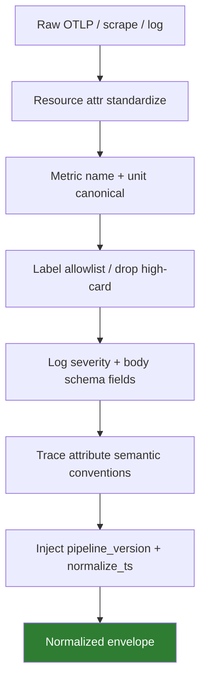

Config snippet (minh họa **WHY**, không phải blueprint copy-paste):

```yaml
# OTel Collector — WHY: ép service.name + env sớm, trước export
processors:
  transform/normalize:
    metric_statements:
      - context: resource
        statements:
          # WHY: một identity cho mọi backend
          - set(attributes["service"], attributes["service.name"])
          - replace_pattern(attributes["service"], "[^a-zA-Z0-9-]", "-")
          - set(attributes["env"], attributes["deployment.environment"])
  attributes/drop_noise:
    actions:
      # WHY: cardinality bomb giết Prometheus trước khi ML kịp train
      - key: user_id
        action: delete
```

### 4.5 WHEN **NOT** to normalize aggressively

> [!IMPORTANT]
> **Over-normalize** cũng là bug. Giữ raw khi:

1. **Forensics**: body log gốc có thể cần cho security IR — normalize field tách, không ghi đè body nếu policy yêu cầu raw sealed.
2. **Vendor-specific diagnostics**: attribute lạ của SDK giúp debug instrumentation; drop ở hot path labels, nhưng có thể giữ cold archive.
3. **Experimentation**: team đang thử semantic convention mới — dùng namespace `x_` / `exp_` thay vì map nhầm vào canonical.
4. **Lossy unit conversion**: int milliseconds → float seconds có thể mất precision ở histogram boundary; hiểu trade-off.
5. **Legal hold raw**: một số ngành yêu cầu bit-perfect original; normalize tạo *derived* copy, không thay original sealed.

**Quy tắc**: normalize **identity & unit** mạnh; normalize **payload business** thận trọng; luôn giữ `raw_ref` hoặc dual path khi regulated.

### 4.6 Kiểm chứng normalize

| Kiểm chứng | Cách | Alert khi |
|------------|------|-----------|
| Alias collision | Catalog vs telemetry join rate | < 98% services map được |
| Unit lint | CI metric name suffixes | PR vi phạm convention |
| Severity unknown rate | % log severity = UNKNOWN | > 1% sustained |
| Clock skew rate | % spans negative duration | > 0.1% |
| Pipeline version lag | hosts cũ còn normalize_vN-2 | > 5% fleet |

---

## 5. Enrich — làm giàu ngữ cảnh

> [!NOTE]
> **Ý TƯỞNG**
> Telemetry thô mô tả *triệu chứng*. Enrichment gắn *ngữ cảnh vận hành*: ai sở hữu, version nào vừa deploy, SLO nào đang burn, ticket change nào mở, region nào, tenant nào. Không enrich, [RCA](../10-root-cause-analysis/README.vi.md) chỉ xếp hạng metric spike — không xếp hạng nguyên nhân.

### 5.1 Enrich những gì?

| Field enrichment | Nguồn điển hình | Dùng cho |
|------------------|-----------------|----------|
| `service`, `team`, `owner`, `pager` | Service catalog / OWNER file | Routing, RCA blame window |
| `deploy_version`, `git_sha`, `pipeline_id` | CI/CD, K8s labels | Change-related RCA |
| `change_ticket`, `maintenance_window` | ITSM / change calendar | Suppress / explain |
| `slo_id`, `slis`, `error_budget_remaining` | SLO store | Prioritize page |
| `tier` (0/1/2), `criticality` | Catalog | Correlation weight |
| `region`, `az`, `cluster` | Cloud metadata | Blast radius |
| `tenant_id` (hashed), `tenant_tier` | Gateway / control plane | Multi-tenant isolate |
| `depends_on[]`, `dependency_hash` | Topology service | Graph correlation |
| `cost_center` | CMDB | Chargeback telemetry |
| `data_class` (PII level) | Data governance | Redaction policy |

### 5.2 WHEN cần enrich

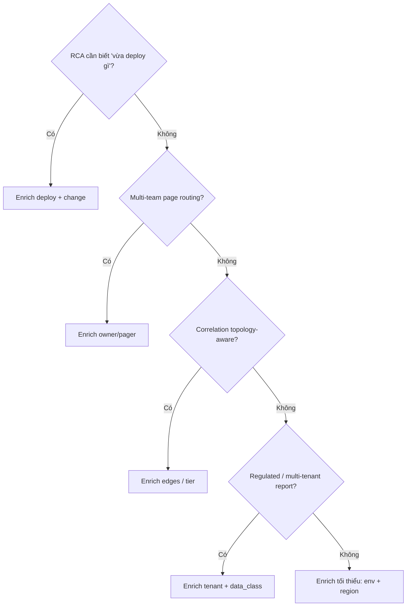

**Bắt buộc enrich sớm** khi:

1. **RCA / correlation** — không có topology & change → false root cause kinh điển (“DB CPU cao” trong khi deploy API config sai).
2. **Multi-tenant** — thiếu `tenant_tier` → page nhầm tenant trial vs enterprise.
3. **Regulated** — thiếu `data_class` → log PII lọt LLM prompt.
4. **SLO-based paging** — thiếu `slo_id` → noise không gắn error budget.

**Có thể enrich muộn (query-time)** khi:

- Field ít dùng, cardinality thấp, source of truth hay đổi từng phút và bạn chấp nhận join cost.
- Ví dụ: display name team mới cho UI — không phải input model.

> [!TIP]
> **Enrich at write vs enrich at read**
> - Write-time: latency + storage lớn hơn, query/model đơn giản, **tái lập tốt** (snapshot ngữ cảnh lúc sự kiện xảy ra).
> - Read-time: rẻ storage, nhưng topology “hiện tại” ≠ topology lúc incident — **RCA sai**.
> Cho AIOps, prefer **write-time snapshot** cho owner/deploy/topology_hash; read-time chỉ cho UI decoration.

### 5.3 Sources of enrichment data

| Source | Độ tươi kỳ vọng | Failure mode |
|--------|-----------------|--------------|
| K8s Downward API / labels | Realtime pod | Label thiếu convention |
| OTel Resource Detection | Realtime | Cloud metadata hop fail |
| Service catalog API | 1–15 phút cache | Stale owner sau reorg |
| CI/CD deploy events | Near-realtime via Kafka | Missed event → empty version |
| Prometheus `kube-state-metrics` | Scrape interval | Not for business owner |
| CMDB / ServiceNow | Hours–days | **Rất stale** — cẩn trọng |
| SLO-as-code Git | On deploy of SLO | Drift nếu không CI |
| Topology eBPF / service mesh | Minutes | Edge noise, ephemeral |

### 5.4 Stale topology danger

> [!WARNING]
> **Topology stale là silent killer của correlation.**
> Scenario: service B cắt dependency sang C lúc 14:00. Topology cache TTL 6h. Lúc 15:00 C chết; correlation vẫn tin B→C critical path → RCA đổ lỗi B, auto-remediation restart B vô ích, MTTR tăng, niềm tin sụp.

**Giảm rủi ro:**

1. `topology_version` + `topology_as_of` trên mọi enriched event.
2. TTL ngắn cho edge nóng (mesh) + longer cho ownership.
3. Invalidate cache on deploy/catalog webhook — không chỉ poll.
4. Detector/correlator **hiển thị** “topology age = 47m” trên incident card.
5. Shadow-compare topology sources (mesh vs catalog) → metric `topology_disagreement_rate`.

### 5.5 Enrichment architecture

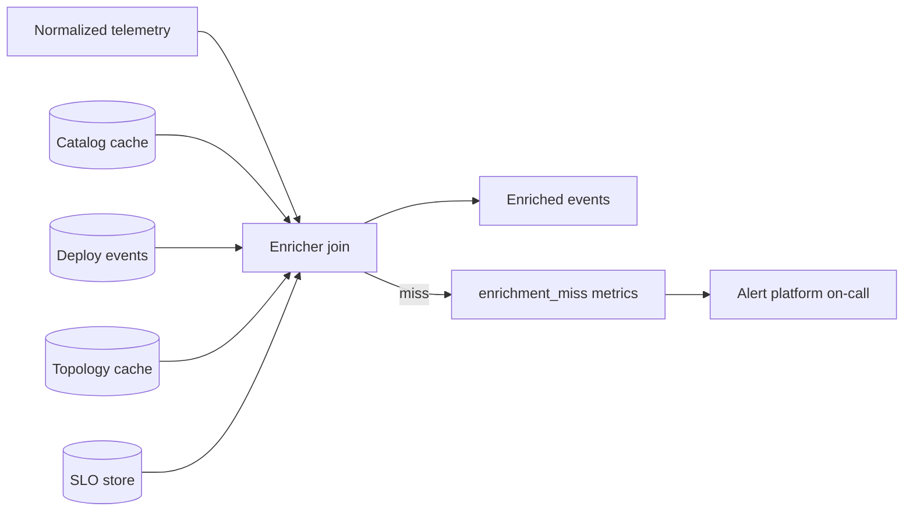

**WHEN miss rate cao**: đừng “best effort im lặng”. `enrichment_miss{field="owner"}` phải là SLO của data plane. Miss owner = page sai team; miss deploy = RCA mù change.

### 5.6 Ví dụ semantic sau enrich (logical JSON)

```json
{
  "event_type": "metric_point",
  "service": "payment",
  "env": "prod",
  "region": "ap-southeast-1",
  "metric": "http_server_request_duration_seconds",
  "value": 0.42,
  "deploy_version": "2026.07.18-a1b2c3",
  "change_ticket": "CHG-10482",
  "owner_team": "payments-sre",
  "slo_id": "slo:payment:checkout-latency",
  "tier": 0,
  "topology_as_of": "2026-07-18T10:05:00Z",
  "pipeline_version": "dp-normalize-enrich/3.2.1"
}
```

**WHY** đủ field: detector chỉ cần series; correlator cần tier/topology; RCA cần deploy/change; router cần owner; audit cần pipeline_version.

---

## 6. Validate / Data Quality / Quarantine / DLQ

> [!NOTE]
> **Ý TƯỞNG**
> Schema break **im lặng** nguy hiểm hơn pipeline crash. Crash thì page. Im lặng thì model học sai 6 tuần, precision sụp, on-call mute detector — và chẳng ai biết root cause là field `latency` đổi từ float sang string.

### 6.1 WHY validate trong AIOps

| Lỗi data | Hậu quả intelligence |
|----------|----------------------|
| Thiếu field bắt buộc | Feature NaN → detector skip hoặc score rác |
| Type change | Deserialization fail một phần consumer |
| Cardinality explosion | Prom OOM; series drop ngẫu nhiên |
| Duplicate spikes | Double count anomaly |
| Future timestamps | Watermark stuck / window vỡ |
| PII leakage | Compliance incident + LLM risk |
| Negative latency | Model outlier toàn cục |

### 6.2 WHEN bật validation nghiêm

- **Luôn** trên boundary vào Kafka topics dùng cho multi-consumer.
- **Luôn** trước offline training materialize.
- **Thắt chặt hơn** khi schema registry / contract testing chưa chín.
- **Nới** (log-only) trên path debug dev env — nhưng **không** prod.

### 6.3 Lớp validate

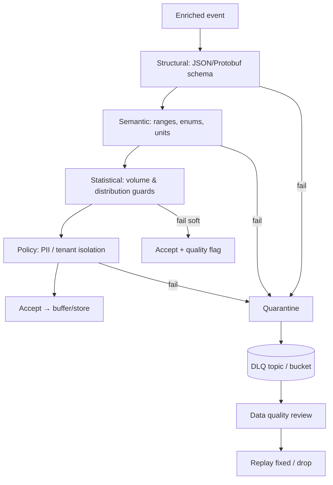

1. **Structural**: field tồn tại, type đúng, required set.
2. **Semantic**: `latency_seconds >= 0`, `severity ∈ enum`, `env ∈ {prod,staging,...}`.
3. **Statistical guards**: volume drop 90% so baseline ingest; spike 100× label values — có thể **soft-fail** (flag) thay vì drop hết (tránh tự gây outage observability).
4. **Policy**: deny list PII patterns; tenant must match auth principal of producer.

### 6.4 Quarantine vs DLQ vs drop

| Chiến lược | WHEN dùng | Rủi ro |
|------------|-----------|--------|
| **Drop** | Poison rõ, không giá trị forensics, cost cao | Mất signal; khó audit |
| **DLQ** | Schema fail có thể fix & replay | DLQ phình; cần owner |
| **Quarantine store** | Cần IR / compliance giữ raw bad events | Chi phí + access control |
| **Accept + flag** | Soft anomaly volume; không chắc bad | Model phải tôn trọng flag |

> [!IMPORTANT]
> Consumer intelligence **phải** fail-safe với quality flags. Nếu detector bỏ qua `quality.partial=true` và vẫn page — bạn tạo vòng FP. Nếu drop hết khi flag — bạn tạo FN. Policy rõ theo signal class.

### 6.5 Data quality metrics (SLO data plane)

| Metric | Mục tiêu gợi ý | Page? |
|--------|----------------|-------|
| `telemetry_schema_fail_ratio` | < 0.1% | Yes nếu > 1% 5m |
| `enrichment_miss_ratio` | < 1% critical fields | Yes |
| `ingest_completeness` (vs expected series) | > 99% | Yes tier-0 |
| `duplicate_event_ratio` | < 0.5% | Investigate |
| `dlq_depth` / age | age < 1h | Yes |
| `pii_detection_hits` | → 0 trên path LLM | Yes immediate |
| `normalize_version_skew` | < 5% old | Weekly |

### 6.6 Contract testing — WHEN

- **Producer contract** trong CI app: example payloads golden.
- **Consumer contract** detector: schema compatibility forward/backward.
- **Canary schema**: deploy schema mới ở shadow topic trước cutover.

Không có contract test = validate chỉ là “lưới cuối”, luôn muộn.

---

## 7. Canonical Event Model cho AIOps

> [!NOTE]
> **Ý TƯỞNG**
> Canonical model là **lingua franca** giữa collection backends và intelligence. Không phải thay Prometheus/Loki/Tempo — mà định nghĩa *event types* AIOps hiểu khi rời hot store hoặc khi fan-out Kafka.

### 7.1 Các entity cốt lõi

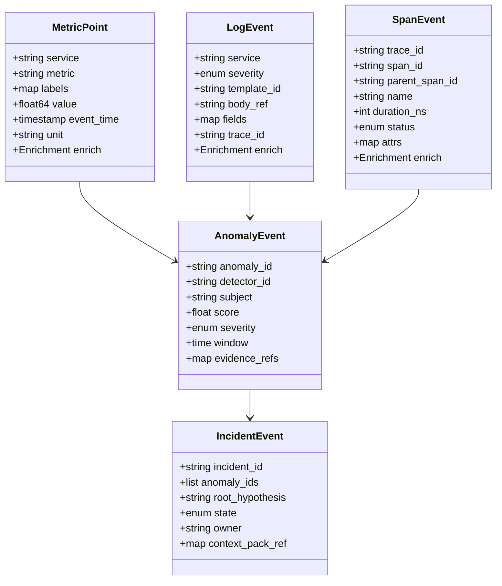

### 7.2 Metric point (canonical)

| Field | Bắt buộc | Ghi chú |
|-------|----------|---------|
| `event_type=metric_point` | ✅ | |
| `metric` | ✅ | Canonical name |
| `value` | ✅ | Đã unit-normalized |
| `event_time` | ✅ | Prefer source; document skew |
| `service`, `env` | ✅ | Identity |
| `labels` | ✅ | Allowlisted |
| `resource` | 🟡 | cluster/pod khi cần |
| `exemplar_trace_id` | ⚪ | Bridge Tempo |
| `enrich.*` | 🟡 | deploy/owner/slo |

### 7.3 Log event

| Field | Bắt buộc | Ghi chú |
|-------|----------|---------|
| `severity` | ✅ | Enum chuẩn |
| `template_id` / `pattern_id` | 🟡 | Drain/cluster id cho log AD |
| `body` hoặc `body_ref` | ✅ | ref nếu redacted/cold |
| `trace_id`, `span_id` | 🟡 | Correlation |
| `fields` structured | 🟡 | parsed JSON |

### 7.4 Span (as event for stream path)

Không thay Tempo storage. Canonical span event dùng khi **stream** span metrics / rare error spans vào Kafka cho AD:

- Giữ `trace_id` để join lại Tempo.
- Prefer aggregated span metrics cho high-volume; raw span stream chỉ error/slow sample.

### 7.5 Anomaly event

Sinh ra từ [Anomaly Detection](../08-anomaly-detection/README.vi.md):

| Field | WHY |
|-------|-----|
| `detector_id` + `model_version` | Audit & rollback model |
| `subject` (service/metric/tenant) | Correlation key |
| `score`, `threshold`, `severity` | Downstream policy |
| `evidence_refs[]` | Deep link Prom/Loki/Tempo |
| `quality_flags` | Propagate data plane doubt |
| `window_start/end` | Time join |

### 7.6 Incident event

Sinh từ correlation/RCA; lưu **incident store**:

- State machine: `open → investigating → mitigated → resolved → postmortem`.
- `context_pack_ref` cho LLM (không nhét full logs vào Kafka message).
- `feedback_labels` sau resolve (TP/FP/severity) — **fuel** cho data flywheel [Ch.00](../00-introduction.vi.md).

### 7.7 Envelope chung

Mọi event stream nên có:

```text
event_id, event_type, event_time, ingest_time,
producer, pipeline_version, schema_version,
tenant, env, region,
quality { complete, partial, quarantined_reason? }
```

**WHEN schema_version bump**: dual-read consumers; never silent incompatible change on shared topic.

---

## 8. Kiến trúc lưu trữ — data sống ở đâu

> [!NOTE]
> **Ý TƯỞNG**
> Một “database AIOps” duy nhất là ảo tưởng. Production dùng **tầng lưu trữ đa mục đích**: hot query path khác cold train path khác online feature path. Chọn sai tầng = hoặc cháy tiền, hoặc MTTD tăng, hoặc không replay được.

### 8.1 Bản đồ WHERE

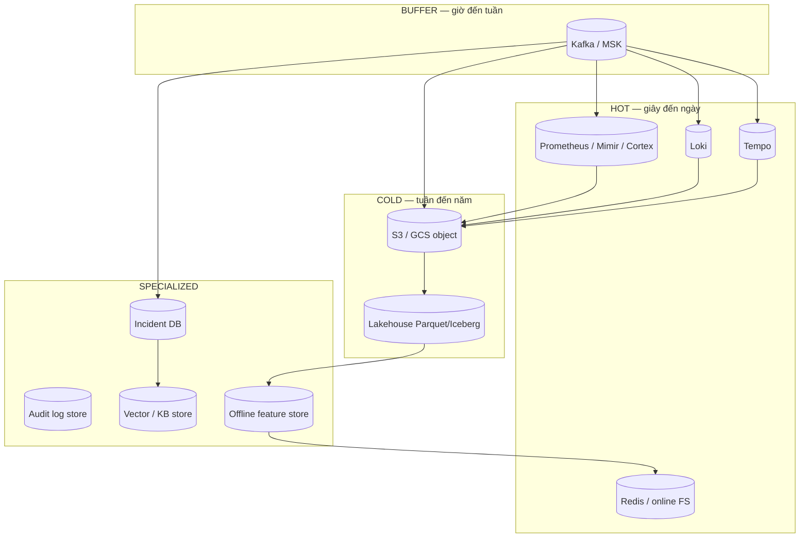

### 8.2 Hot: Prometheus, Loki, Tempo

| Store | Strength | Weak for AIOps if alone |
|-------|----------|-------------------------|
| **Prometheus/Mimir** | PromQL, alert, exemplars | Long train history đắt; cardinality |
| **Loki** | Cheap log volume, label query | Full analytics join kém |
| **Tempo** | Trace by ID, cheap object | Ad-hoc fan-out search |

**WHEN hot đủ**: on-call investigate 7 ngày; page now; exemplar jump.  
**WHEN không đủ**: feature history 90 ngày; multi-year audit; point-in-time topology replay.

Xem chi tiết vận hành hot path: [03](../03-prometheus/README.vi.md), [04](../04-loki/README.vi.md), [05](../05-tempo/README.vi.md).

### 8.3 Buffer: Kafka / MSK

Vai trò trong data plane (sâu hơn ở [07](../07-kafka/README.vi.md)):

- **Temporal decoupling** normalize/enrich vs slow consumers.
- **Fan-out**: AD + train + audit + warehouse sink.
- **Replay** cửa sổ retention (thường 3–14 ngày tùy cost).
- **DLQ** topics.

**WHEN cần buffer**: >1 consumer; bursty traffic; reprocessing.  
**WHEN có thể hoãn**: single monolith detector đọc thẳng Prom, org nhỏ — chấp nhận mất replay.

### 8.4 Object cold: S3

- Tempo/Loki native chunks.
- Exported Prometheus blocks / Parquet metrics.
- Raw OTLP archive (optional, regulated).
- Quarantine dumps.

**Lifecycle rules**: IA / Glacier theo retention matrix §9.

### 8.5 Feature store online / offline

| | Offline | Online |
|--|---------|--------|
| Lưu | Parquet / warehouse / Feast offline | Redis, DynamoDB, in-mem |
| Latency | phút–giờ | ms–thấp trăm ms |
| Dùng | Train, backtest, batch score | Detector realtime |
| WHEN | Retrain chu kỳ; shadow eval | Serve features đồng bộ model |

Chi tiết §11.

### 8.6 Warehouse / lake (optional)

**WHEN cần**:

- Join telemetry với business KPIs (GMV, auth success) cho [e-commerce/banking](../15-ecommerce-banking/README.vi.md).
- Ad-hoc data science ngoài PromQL.
- Long-horizon seasonality yearly.

**WHEN chưa cần**: team chưa có consumer SQL; cost lake > value; hot+Kafka đủ train 90d.

### 8.7 Incident store, audit store, embedding/KB store

| Store | Nội dung | WHY tách |
|-------|----------|----------|
| **Incident store** | IncidentEvent, links, timeline | OLTP updates state; không nhét Kafka log |
| **Audit store** | Who approved remediate, policy decisions | Immutable, WORM khi regulated |
| **Embedding / KB** | Runbooks, postmortems, chunk vectors | Serving LLM retrieval [11](../11-llm-agent/README.vi.md) |

### 8.8 Decision: đặt dữ liệu ở đâu?

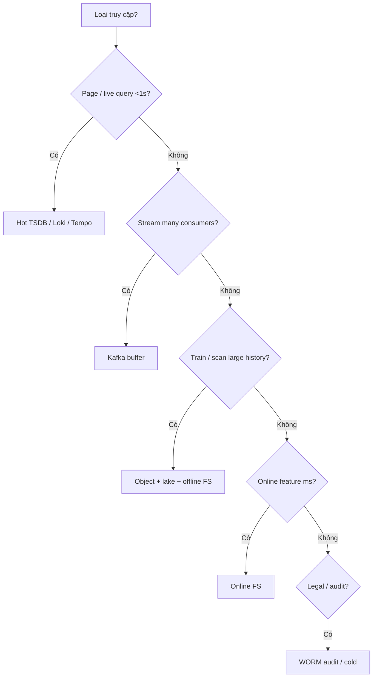

---

## 9. Ma trận Retention — giữ bao lâu theo mục đích

> [!NOTE]
> **Ý TƯỞNG**
> Retention không phải con số vendor default. Retention là **ánh xạ mục đích → tín hiệu → tầng → thời hạn → chi phí**. “Giữ hết 13 tháng hot” gần như luôn sai.

### 9.1 Mục đích giữ data

| Mục đích | Horizon điển hình | Tầng ưu tiên |
|----------|-------------------|--------------|
| **Page now** | 0–15 phút freshness | Hot + online FS |
| **Investigate** | 7–14 ngày | Hot (Prom/Loki/Tempo) |
| **Correlate post-incident** | 14–30 ngày | Hot + Kafka replay |
| **Train / retrain** | 90 ngày (seasonality+) | Cold lake + offline FS |
| **Yearly seasonality** | 13–15 tháng | Cold downsampled |
| **Audit / compliance** | 1–7 năm | Cold WORM / legal hold |
| **Cost control** | continuous | Tiering + sampling |

### 9.2 Bảng theo loại tín hiệu

| Signal | Hot | Kafka buffer | Cold raw/downsampled | Offline features | Audit special |
|--------|-----|--------------|----------------------|------------------|---------------|
| High-card metrics | 7–15d | 3–7d | 90d downsampled | 90d windows | — |
| Golden SLI metrics | 30–90d | 7–14d | 13–15m rollups | 13m | — |
| Logs (info) | 7d | 3d | 30d sampled | patterns 90d | — |
| Logs (error/security) | 30d | 7–14d | 1–3y | templates 90d | SIEM policy |
| Traces (full) | 3–7d | optional samples | 7–30d | span-metrics 90d | — |
| Traces (error/slow) | 14–30d | 7d | 90d | — | — |
| Anomaly events | 90d DB | 14–30d | 1y | labels forever | — |
| Incident records | years DB | — | export yearly | feedback labels | 1–7y |
| Remediation audit | — | 30d | 1–7y WORM | — | mandatory regulated |
| Enrichment snapshots | — | 7d | 90d | topology versions | — |
| Embeddings KB | — | — | versioned | re-embed on change | access ACL |

> [!TIP]
> **Downsample không phải xóa thông tin mù quáng.** Giữ full resolution cho SLI tier-0; downsample debug metrics. Train seasonality trên rollups 5m/1h — không cần 15s scrape 13 tháng.

### 9.3 WHEN kéo dài retention

- Trước Black Friday / peak: kéo train window & hot investigate.
- Sau major incident class mới: giữ raw liên quan legal hold.
- Khi model drift investigation cần so sánh năm trước (retail).

### 9.4 WHEN cắt retention

- Metric high-card không ai query 30 ngày (đo `query_log`).
- Duplicate logs (access log đã có mesh metrics).
- Traces success 100% sample — giảm sample trước khi tăng retention.

---

## 10. Lifecycle sau khi store

> [!NOTE]
> **Ý TƯỞNG**
> “Đã lưu” không phải kết thúc. Lifecycle trả lời: *ai đọc, để làm gì, khi nào xóa, khi nào cấm xóa.*

### 10.1 Các phase

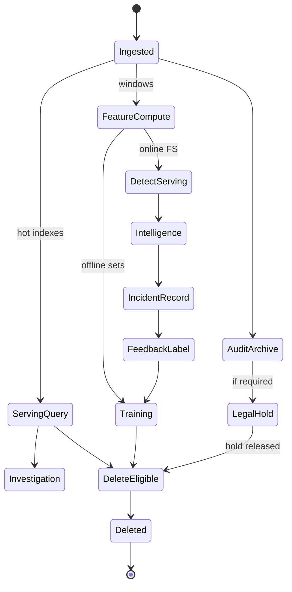

### 10.2 Serve queries

- On-call Grafana / LogQL / TraceQL.
- AIOps context pack builders lấy **bounded** windows.
- **WHEN**: luôn; SLO freshness theo tier service.

### 10.3 Detection features

- Rolling stats, seasonal residuals, log template counts, red metrics.
- **WHEN**: trước detect; đồng bộ definition train/serve (§11).

### 10.4 Training

- Materialize offline datasets versioned (`dataset_id`, time range, feature_version).
- **WHEN**: schedule + on-demand sau labeling campaign.

### 10.5 Audit

- Immutable decisions: pages fired, suppressions, remediations.
- **WHEN**: always for actions; long for regulated industries ([15](../15-ecommerce-banking/README.vi.md)).

### 10.6 Delete & legal hold

| Hành động | WHEN | Control |
|-----------|------|---------|
| TTL delete | Hết horizon mục đích | Lifecycle policy |
| Compaction / downsample | Cost pressure | Job versioned |
| Legal hold | Litigation / regulator | Block delete API |
| Right-to-erasure (PII) | Data subject request | Hard — telemetry design should minimize PII (§13) |

> [!WARNING]
> Training sets thường **nhân bản** PII nếu log raw lọt feature. Delete ở hot store không đủ — cần inventory derived copies (lake, FS, embeddings).

---

## 11. Feature Store cho AIOps

> [!NOTE]
> **Ý TƯỞNG**
> Feature store không phải “Redis cho ML cho vui”. Nó giải **train/serve skew**: cùng một định nghĩa feature phải ra **cùng giá trị** (trong dung sai) lúc train offline và lúc detect online. Skew = model production ≠ model offline metrics — dạng bug đắt nhất AIOps.

### 11.1 Train/serve skew — ví dụ thực

| Skew | Offline train | Online serve | Hậu quả |
|------|---------------|--------------|---------|
| Window mismatch | 15m mean | 5m mean | Threshold vô nghĩa |
| Timezone | UTC buckets | Local TZ | Seasonality gãy |
| Filter | chỉ `env=prod` | quên filter | Baseline lệch |
| Join deploy | as-of correct | latest deploy | Leakage / wrong |
| Missing default | drop rows | fill 0 | Score spike |
| Unit | seconds | ms | 1000× error |

### 11.2 Online features cho detectors

Ví dụ feature class AIOps:

- `request_rate_5m`, `error_ratio_5m`, `p99_latency_5m`
- `latency_zscore_1h`, `seasonal_resid_stl_7d`
- `log_error_template_burst_10m`
- `deploy_age_minutes`, `change_in_window`
- `dependency_error_fan_in`
- `tenant_traffic_share`

**WHEN online FS cần thiết**:

- Nhiều detector chia sẻ feature.
- Latency detect yêu cầu precompute (không kịp query PromQL nặng mỗi 10s × N services).
- Cần point-in-time consistency với topology/deploy snapshots.

### 11.3 Offline cho retrain

- Point-in-time correct joins (không future leak).
- Labels từ incident feedback + weak labels (remediation success).
- Dataset cards: coverage, missingness, class balance.

### 11.4 WHEN cần Feature Store vs compute-on-read

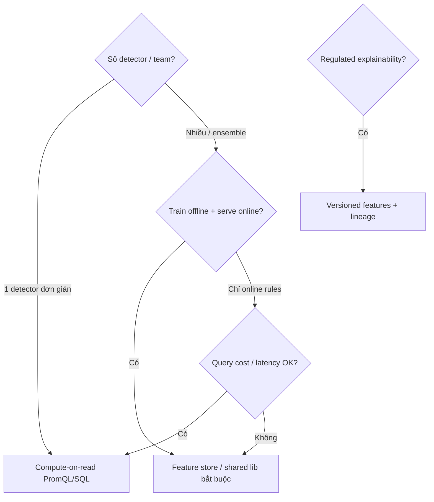

| Approach | WHEN chọn | Chi phí |
|----------|-----------|---------|
| **Compute-on-read** | Ít feature, PromQL đủ, 1 team | Thấp ops; cao risk skew nếu copy query |
| **Shared feature library** (code) | Trung bình; chưa cần infra FS | CI test parity |
| **Full FS (Feast/Tecton/custom)** | Nhiều model, entity keys, online low-latency | Cao — chỉ khi ROI |

> [!TIP]
> Org 30–100 eng thường thắng với **feature definitions trong Git + test parity online/offline**, chưa cần platform FS Uber-scale. Xem cảnh báo fixed cost trong [Big Tech AIOps](../14-bigtech-aiops/README.vi.md).

### 11.5 Entity keys AIOps

- `service` + `env` + `region`
- đôi khi `tenant_id` (hash)
- `endpoint` hoặc `slo_id` cho feature hẹp

Tránh entity = `pod` cho model dài hạn (quá ephemeral) — dùng pod chỉ cho debug features ngắn.

### 11.6 Feature versioning

```text
feature_set: golden_sli_v3
includes: error_ratio_5m, p99_zscore_1h, deploy_age_minutes
code_sha: abcdef
created_at: ...
compatible_models: [ad_ewma_v5, ad_iforest_v2]
```

**WHEN bump version**: đổi window, đổi filter, đổi fill policy — không reuse tên im lặng.

---

## 12. Late data, watermarks, reprocessing

> [!NOTE]
> **Ý TƯỞNG**
> Trong distributed systems, “đã qua 5 phút” không nghĩa mọi event 5 phút trước đã tới. AIOps không được giả định đồng hồ toàn cục hoàn hảo. Watermark + late policy + reprocessing là ba chân của **completeness có kiểm soát**.

### 12.1 Nguồn late data

- Mobile / edge agents batch upload.
- Collector backoff sau outage.
- Kafka consumer lag.
- Cross-region replication delay.
- Clock skew làm event_time “lùi”.

### 12.2 Watermarks

- **Event-time watermark**: “đã thấy gần đủ data đến thời điểm T”.
- Detector window đóng khi watermark vượt `window_end + allowed_lateness`.

| Policy | WHEN | Trade-off |
|--------|------|-----------|
| Short lateness (30s–2m) | Page nhanh tier-0 | FN nếu agent late |
| Medium (5–15m) | Hầu hết AD | Delay MTTD |
| Long (1h+) | Batch train | Không dùng page |
| Dual path | Fast approximate + slow correct | Complexity |

> [!IMPORTANT]
> **Dual path** hay dùng production: *provisional anomaly* (nhanh, có thể retract) + *confirmed* (đủ late window). Correlation chỉ page trên confirmed; UI có thể show provisional.

### 12.3 Reprocessing

**WHEN reprocess:**

1. Bug normalize/enrich (sai unit suốt 2 ngày).
2. Model new version backtest.
3. DLQ fixed schema replay.
4. Topology bug → cần tính lại correlation labels (hiếm, đắt).

**Cơ chế:**

- Kafka replay từ offset / timestamp.
- Lake job rebuild feature set `vN+1`.
- Idempotent incident linking (`event_id`).

**Không reprocess mù:** ước cost CPU + nguy cơ duplicate page (cần suppression).

### 12.4 Exactly-once?

Xem thảo luận thực dụng ở [Kafka](../07-kafka/README.vi.md): AIOps thường **at-least-once + idempotent consumers**. Feature writes dùng upsert theo `(entity, window_start, feature_version)`.

---

## 13. PII / Redaction — đặt stage ở đâu

> [!NOTE]
> **Ý TƯỞNG**
> PII trong telemetry là **nợ bảo mật kép**: (1) compliance, (2) đầu độc LLM/context packs. Redaction phải là stage **có chủ đích**, không phải “regex sau khi đã index 30 ngày”.

### 13.1 Nguyên tắc placement

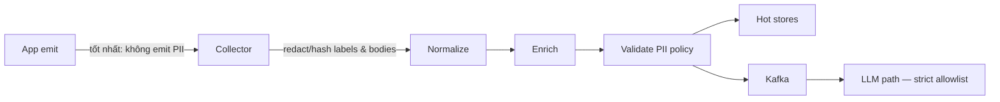

| Stage | Làm gì | WHY |
|-------|--------|-----|
| **App** | Không log raw card/PAN/session token | Rẻ nhất, an toàn nhất |
| **Collector** | Delete/hash attributes, mask body | Central enforce |
| **Normalize** | Canonical `data_class` | Policy downstream |
| **Validate** | Block known patterns | Safety net |
| **Before LLM** | Hard allowlist fields | Defense in depth |
| **Cold archive** | Separate sealed raw nếu legal | ACL cực hẹp |

### 13.2 WHEN redaction bắt buộc early

- Banking / healthcare / identity platforms ([15](../15-ecommerce-banking/README.vi.md)).
- Multi-tenant với risk cross-tenant leakage.
- Bất kỳ path nào feed LLM agent ([11](../11-llm-agent/README.vi.md)).

### 13.3 WHEN có thể trì hoãn (cẩn trọng)

- Dev env isolated, synthetic data.
- Security IR pipeline cần raw **trong** vault riêng — không phải AIOps lake chung.

### 13.4 Kỹ thuật

- Hash-with-tenant-salt cho `user_id` nếu cần correlation same-user (không reverse).
- Tokenization format-preserving hiếm khi cần cho AIOps — ưu tiên drop.
- Metric labels: **cấm** email/user_id — cardinality + PII.

> [!WARNING]
> Trace attributes và log bodies là nơi PII lọt nhiều nhất. Span attribute `db.statement` có thể chứa full SQL với PII. Policy riêng cho DB spans.

---

## 14. Mô hình chi phí giữ dữ liệu

> [!NOTE]
> **Ý TƯỞNG**
> Chi phí observability/AIOps data ≈ **volume × cardinality × retention × replication × query amplification**. Model sai thường tối ưu storage mà quên query và recompute feature.

### 14.1 Các thành phần cost

| Thành phần | Driver | Kiểm soát |
|------------|--------|-----------|
| Hot TSDB | series × scrape × retention | relabel, recording rules, short TTL |
| Loki/Tempo | GB ingest × retention | sampling, drop debug |
| Kafka | disk × RF × retention × throughput | topic tiering |
| S3 | GB-month + PUT/GET | lifecycle, compact |
| Feature compute | CPU stream/batch | incremental, fewer windows |
| Online FS | RAM/ops | key cardinality discipline |
| Query | parallel scanners | caching, preagg |
| Human | on-call data fires | quality SLOs |

### 14.2 Công thức tư duy

```text
Cost_month ≈
  Hot_GB * C_hot
+ Kafka_GB * RF * C_disk
+ S3_GB * C_s3_tier
+ Feature_CPU_hours * C_cpu
+ (Incident_investigations * time_lost_if_missing_data)  // opportunity
```

Đừng tối ưu hết về 0 storage: **cost of missing data** trong SEV-1 có thể > 12 tháng storage.

### 14.3 WHEN chi tiền thêm

- Tier-0 SLI full resolution dài hơn.
- Error traces retention dài.
- Offline 13 tháng cho retail seasonality.
- Dual-region buffer nếu RPO AIOps yêu cầu.

### 14.4 WHEN cắt tiền

- Drop metrics không có dashboard/alert/model consumer 30 ngày.
- Sample traces success 1–5%; giữ error 100% (hoặc tail sample).
- Kafka retention ngắn + cold S3 cho replay hiếm.
- Aggregate logs info; giữ error raw.

### 14.5 Chargeback

Enrich `cost_center` / `team` → báo cáo GB ingest. **WHEN** org > 5 teams: chargeback giảm tragedy of commons cardinality.

---

## 15. Thang trưởng thành Data Plane L0–L5

> [!NOTE]
> **Ý TƯỞNG**
> Maturity data plane **lệch pha** với maturity AIOps tổng thể là bình thường: nhiều org L3 detection nhưng data plane L1 — đó là nhà xây trên cát.

| Level | Tên | Đặc trưng | Lỗ hổng chính |
|-------|-----|-----------|---------------|
| **L0** | Accidental | Agents mặc định, không convention | Không tin data |
| **L1** | Collected | Prom+Loki+Tempo chạy | Naming chaos |
| **L2** | Normalized | Canonical service/unit/env | Chưa enrich |
| **L3** | Enriched + Validated | Catalog/deploy join, DLQ, quality SLO | Chưa feature contract |
| **L4** | Feature-ready | Train/serve parity, versioned features, late policy | Chưa cost/lineage tinh |
| **L5** | Governed plane | Lineage, legal hold, chargeback, multi-region DR, continuous contract tests | Complexity — cần platform team |

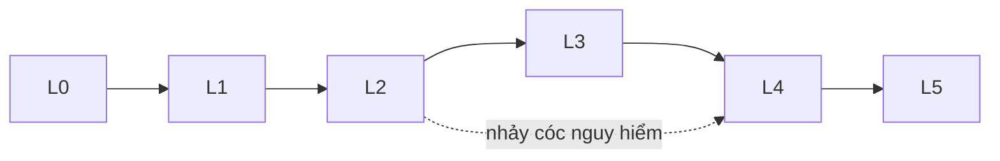

> [!WARNING]
> Nhảy L1 → L4 (mua feature store + 5 models) là anti-pattern leadership. Buộc chứng minh L2–L3 metrics (`schema_fail`, `enrichment_miss`) trước budget L4.

### 15.1 Checklist tự chấm nhanh

1. Có document canonical service naming?  
2. Unit suffix enforced CI?  
3. Owner enrich ≥ 95% tier-0?  
4. Deploy version trên events?  
5. DLQ có owner on-call?  
6. Quality flags honored by detectors?  
7. Feature definitions versioned?  
8. Offline/online parity tests?  
9. Retention matrix written & applied?  
10. PII policy before LLM path?  

| Điểm | Level |
|------|-------|
| 0–2 | L0–L1 |
| 3–4 | L2 |
| 5–6 | L3 |
| 7–8 | L4 |
| 9–10 | L5-ish |

---

## 16. Anti-patterns

> [!NOTE]
> **Ý TƯỞNG**
> Anti-pattern data plane thường đội lốt “best practice vendor slide”. Nhận diện bằng hậu quả vận hành, không bằng logo.

### 16.1 Danh sách đen

| Anti-pattern | Triệu chứng | Làm đúng |
|--------------|-------------|----------|
| **Big ball of mud collector** | Mọi logic trong 1 collector config 5k dòng | Tách normalize/enrich services + ownership |
| **Normalize by dashboard** | Mỗi panel có `*1000` khác nhau | Canonical unit một lần |
| **Latest-topology RCA** | Root cause theo graph “hiện tại” | Snapshot as-of event_time |
| **Silent schema evolve** | Field đổi type không version | Schema registry + dual read |
| **DLQ black hole** | DLQ đầy không ai xem | SLO depth/age + rotation owner |
| **FS premature** | 2 models, 1 team, full Feast | Shared lib trước |
| **Store forever hot** | Bill TSDB nổ | Tier matrix §9 |
| **PII later** | “Sẽ redact trước khi demo LLM” | Redact at collect |
| **One topic to rule them all** | Hot partition, poison all consumers | Topic by event_type + tenant class |
| **Train on prod raw unrestricted** | Leak + skew | Materialized governed sets |
| **Enrich from CMDB weekly only** | Owner sai sau reorg | Webhook + miss metrics |
| **Detector owns features privately** | 5 z-score khác nhau | Shared feature_set version |
| **Fail-closed intelligence** | Kafka down → no pages at all | Fail-open baseline alerts [13](../13-production/README.vi.md) |
| **Cardinality as feature** | user_id label “để AD” | Aggregate / hash carefully |
| **Reprocess = re-page** | Replay spam on-call | Idempotent + shadow mode |

### 16.2 Anti-pattern tổ chức

- **Không ai own data quality**: platform “chỉ giữ Prometheus lên”.
- **AIOps team không có quyền chặn schema break**: chỉ biết kêu sau incident.
- **Success metric = số model**, không phải precision-at-page + completeness.

---

## 17. Edge cases (12+)

> [!NOTE]
> **Ý TƯỞNG**
> Edge case data plane không hiếm — chúng là **mode vận hành bình thường** ở scale. Hãy thiết kế cho chúng, đừng gọi là “black swan”.

### 17.1 Service rename giữa incident window

Series split; anomaly đếm 2 service; error budget double count.  
**Mitigation**: alias map + dual publish window.

### 17.2 Blue/green hai version cùng service

Enrich deploy_version bắt buộc; feature theo version hoặc weighted.  
Thiếu version → “latency tăng” không biết canary 5% hay full.

### 17.3 Multi-tenant noisy neighbor

Tenant A flood logs → shared limits drop tenant B.  
**Mitigation**: per-tenant quotas, separate Kafka partitions/keys, quality flags `backpressured=true`.

### 17.4 Region split-brain time

Watermark global stuck vì region chậm.  
**Mitigation**: watermark per region; detect per region; correlate up.

### 17.5 Collector restart storm

Duplicate + gap.  
**Mitigation**: idempotent event_id; mark gap intervals; don’t fill zeros blindly for counters.

### 17.6 Histogram bucket change

Instrument đổi bucket boundary → `histogram_quantile` nhảy.  
**Mitigation**: feature_version; recording rule version; avoid long train across change without segment.

### 17.7 Sampling rate change

Trace-derived metrics giảm 10× sau khi hạ sample.  
**Mitigation**: emit `sampling_ratio`; adjust features; alert on ratio change.

### 17.8 Synthetic traffic / health checks

Health ping làm error_ratio “đẹp” hoặc rate ảo.  
**Mitigation**: label `traffic_class=synthetic|real`; exclude khỏi SLI features.

### 17.9 Cold start service mới

Không baseline; AD hoặc im lặng hoặc la.  
**Mitigation**: grace period; borrow prior from service class template; higher threshold.

### 17.10 Clock jump NTP correction

Timestamps lùi/bulk.  
**Mitigation**: clamp; quarantine; prefer ingest_time for ordering when jump detected.

### 17.11 Legal hold vs GDPR erase conflict

Telemetry retention policy vs data subject request.  
**Mitigation**: minimize PII; separate indices; legal playbook pre-agreed.

### 17.12 Feature store Redis eviction

Online feature miss → detector fallback.  
**Mitigation**: explicit fallback policy (safe default / skip page / compute-on-read); metric `fs_miss_ratio`.

### 17.13 Schema compatible nhưng semantic đổi

Field `status` vẫn string nhưng enum đổi nghĩa (`ok` vs `OK` vs `success`).  
**Mitigation**: semantic contract tests, not only protobuf compatibility.

### 17.14 Backfill labels làm poison train

Người gán nhãn FP hàng loạt sai → retrain tệ hơn.  
**Mitigation**: label provenance; canary model; dual control review cho tier-0.

### 17.15 Shared cluster multi-env scrape mislabel

`env=prod` nhầm staging.  
**Mitigation**: external labels at scrape; validate env against cluster allowlist.

---

## 18. Cắm vào Kafka (07) và Anomaly (08)

> [!NOTE]
> **Ý TƯỞNG**
> Chương này **chuẩn bị hợp đồng**; [Kafka](../07-kafka/README.vi.md) **vận chuyển và fan-out**; [Anomaly](../08-anomaly-detection/README.vi.md) **tiêu thụ feature/events**. Ba chương một đường thẳng — thiếu mắt xích giữa là chỗ SEV hay sinh.

### 18.1 Hợp đồng với Kafka

Data plane produce (logical topics — chi tiết partition/RF ở Ch.07):

| Topic logical | Payload | Consumers |
|---------------|---------|-----------|
| `telemetry.metrics.normalized` | MetricPoint | AD, FS compute, warehouse |
| `telemetry.logs.normalized` | LogEvent | Log AD, IR |
| `telemetry.traces.events` | sampled SpanEvent | AD, graph |
| `telemetry.dlq` | bad envelopes | DQ team |
| `aiops.features.online` (optional) | feature updates | detectors |
| `aiops.anomalies` | AnomalyEvent (từ Ch.08) | correlation |
| `aiops.enrichment.deploy` | deploy events | enricher |

**WHEN design topic**: theo **event_type + retention class**, không theo team name.

### 18.2 Hợp đồng với Anomaly Detection

Detector **được quyền expect**:

1. Identity ổn định (`service`, `env`).
2. Unit canonical.
3. `quality` flags.
4. Feature_set version hoặc raw series đủ để compute documented features.
5. Deploy/change enrichment cho contextual suppress.

Detector **không được** tự ý:

- Đổi unit ad-hoc không version.
- Bỏ qua quarantine flags.
- Ghi feature definition chỉ trong notebook.

### 18.3 Sequence end-to-end

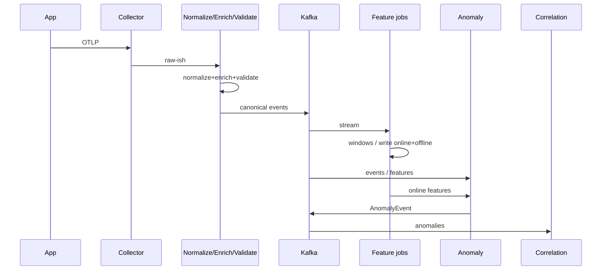

### 18.4 Backpressure & quality

Khi Kafka lag tăng: data plane **không** tắt validate; có thể degrade enrich non-critical fields trước. AD đọc `lag` và `quality.partial` để tránh page trên data thủng — chi tiết mental model lag ở [Ch.07](../07-kafka/README.vi.md).

---

## 19. Production Checklist (40+)

> [!IMPORTANT]
> Dùng checklist này như **gate** trước khi tuyên bố “AIOps data ready”. Tick không thành thật còn nguy hiểm hơn không có checklist.

### 19.1 Identity & normalize

1. [ ] Canonical `service` mapping document + owner  
2. [ ] CI lint metric suffixes (`_seconds`, `_bytes`, `_ratio`, `_total`)  
3. [ ] `env` / `region` allowlist enforced  
4. [ ] Severity enum chuẩn hóa logs  
5. [ ] Resource attribute semantic conventions (OTel) adopted  
6. [ ] Alias migration window procedure cho rename  
7. [ ] `pipeline_version` trên mọi event path  

### 19.2 Enrichment

8. [ ] Service catalog covers tier-0 100%  
9. [ ] Owner/pager enrich miss < 1%  
10. [ ] Deploy version/git_sha attach trong SLA 2 phút sau deploy  
11. [ ] Change ticket optional but schema-ready  
12. [ ] SLO id join cho paging services  
13. [ ] Topology `as_of` + version exposed  
14. [ ] `topology_disagreement_rate` monitored  
15. [ ] Cache invalidation on catalog webhook  

### 19.3 Validation & DLQ

16. [ ] Schema registry / contract tests in CI  
17. [ ] Structural validation at Kafka boundary  
18. [ ] Semantic range checks critical metrics  
19. [ ] DLQ topic + runbook + on-call  
20. [ ] `dlq_age` alert  
21. [ ] Quality flags defined & documented for consumers  
22. [ ] PII pattern blockers on LLM-bound paths  

### 19.4 Storage & retention

23. [ ] Retention matrix published (signal × purpose)  
24. [ ] Hot vs cold lifecycle automated  
25. [ ] Kafka retention aligned to replay needs  
26. [ ] Incident store backup/RPO defined  
27. [ ] Audit WORM path for remediations  
28. [ ] Legal hold procedure tested  

### 19.5 Features

29. [ ] Feature definitions in Git  
30. [ ] Feature version compatibility matrix  
31. [ ] Offline/online parity tests on canary entities  
32. [ ] `fs_miss_ratio` dashboard + policy  
33. [ ] No user_id-like high-card entity keys long-term  

### 19.6 Late data & reprocess

34. [ ] Watermark policy per detector class  
35. [ ] Provisional vs confirmed anomaly path (if low MTTD)  
36. [ ] Reprocess runbook (idempotent, no re-page)  
37. [ ] Gap detection after outages  

### 19.7 Cost, security, ops

38. [ ] Cardinality governor / relabel policies  
39. [ ] Team chargeback or monthly ingest report  
40. [ ] Access control hot/cold/FS/audit separated  
41. [ ] Redaction at Collector for prod  
42. [ ] Data plane SLOs: freshness, completeness, schema_fail  
43. [ ] Fail-open baseline alerts independent of Kafka/AD  
44. [ ] DR: multi-AZ buffer; documented degraded mode  
45. [ ] Load test enricher join under 2× traffic  
46. [ ] Game day: schema break drill  
47. [ ] Game day: stale topology drill  
48. [ ] Documentation: mental model pipeline in onboarding  
49. [ ] RACI: who owns DQ vs detectors vs catalog  
50. [ ] Review 90-day: drop unused series/logs  

---

## 20. Câu hỏi Socratic

Dùng trong design review hoặc phỏng vấn Principal. Không có đáp án một dòng — có **trade-off**.

1. Nếu chỉ được chọn **một** investment data plane trong 30 ngày — normalize identity hay feature store? Vì sao?  
2. Write-time enrich topology làm tăng storage 15%. Read-time join rẻ hơn nhưng RCA sai 1/10 incident. Bạn chọn gì ở tier-0 payments?  
3. Watermark 30s vs 10m: ai chịu FN, ai chịu MTTD? Ai ký?  
4. Service rename: dual-write 7 ngày hay 30 ngày khi model seasonality 7d?  
5. DLQ drop sau 24h — bạn mất gì ngoài “debug comfort”?  
6. Khi nào `compute-on-read` trở thành nợ kỹ thuật không trả nổi?  
7. Làm sao phân biệt detector kém và data incompleteness bằng metrics?  
8. PII hash có đủ cho multi-tenant banking LLM path không?  
9. Kafka retention 3 ngày, train cần 90 ngày — kiến trúc tối thiểu là gì?  
10. Provisional anomaly có được phép auto-remediate không?  
11. Ai on-call khi `enrichment_miss` tăng nhưng product SLI xanh?  
12. Feature fill-zero vs skip-window: false positive nào đau hơn trong checkout flow?  
13. Làm sao chứng minh với auditor rằng remediation decision dựa data không bị tamper?  
14. Nếu CMDB stale 48h, bạn vẫn enrich owner hay page platform?  
15. Downsample 1h có phá STL weekly không? Điều kiện nào thì ổn?  
16. “Exactly-once feature write” — bạn thật sự cần hay upsert idempotent đủ?  
17. Control plane K8s down, data plane telemetry còn — AIOps vẫn page được không?  
18. Khi nào chấp nhận raw telemetry only và **từ chối** ML roadmap?  
19. Làm sao đo ROI của data plane (không đo bằng số model)?  
20. Gap topology service (Ch.21) — bạn build hay buy tuần này, hay chịu correlation yếu 2 quý?

---

## 21. Gap đã đóng / Gap còn mở

> [!NOTE]
> **Ý TƯỞNG**
> Handbook trung thực về biên giới kiến thức. Chương này **đóng** một lớp gap; cố tình **để mở** những gap cần chương/service riêng — để team không ảo tưởng “đã xong AIOps” sau khi đọc.

### 21.1 Pipeline gaps **đóng** bởi chương này

| Gap trước đây | Đóng như thế nào |
|---------------|------------------|
| Nhảy từ collection → detect | Explicit stages Normalize→Enrich→Validate→Store→Feature |
| Không biết WHEN raw đủ | Decision framework §3 |
| Unit/name drift giết model | Normalize §4 + checklist |
| RCA thiếu context | Enrich §5 |
| Schema break im lặng | Validate/DLQ §6 |
| Không có lingua franca events | Canonical model §7 |
| Lưu đâu / giữ bao lâu mơ hồ | Storage §8 + retention §9 |
| Train/serve skew | Feature store §11 |
| Late data ignored | Watermarks §12 |
| PII path mơ hồ | Redaction placement §13 |
| Cost cảm tính | Cost model §14 |
| Không đo maturity data | Ladder L0–L5 §15 |

### 21.2 Gaps **còn mở** — listed honestly

#### A) Topology service (chưa có chương riêng)

- Discovery tự động chất lượng production (mesh + eBPF + catalog merge).
- Cycle detection, external dependency modeling, blast radius scoring tinh vi.
- **Tạm thời**: enrich edges thô + `topology_disagreement_rate`; correlation heuristic ở [09](../09-alert-correlation/README.vi.md).

#### B) Synthetic monitoring / probers

- Journey synthetics là tín hiệu **độc lập** user-path; chưa đi sâu data plane cho synthetic vs real merge.
- **Tạm thời**: label `traffic_class`; SLI riêng; xem [01 Observability](../01-observability/README.vi.md).

#### C) Labeling feedback ops

- Quy trình operational: ai label, SLA label, UI, incentive, chất lượng label, active learning.
- **Tạm thời**: incident store fields + weak labels từ remediation; chi tiết flywheel [00](../00-introduction.vi.md), detector feedback [08](../08-anomaly-detection/README.vi.md).

#### D) Full lineage platform

- Column-level lineage warehouse-grade hiếm khi cần sớm; chưa bắt buộc tool cụ thể.
- **Tạm thời**: `pipeline_version` + `feature_set` + `dataset_id`.

#### E) Cross-org data sharing / clean rooms

- Multi-company SaaS telemetry share — out of scope.

#### F) Real-time continuous training

- Most orgs batch retrain đủ; online learning risks chưa cover sâu.

#### G) Cost anomaly on the data plane itself

- Detect “ingest cost spike” như một class anomaly — gợi ý ở [08](../08-anomaly-detection/README.vi.md) / [13](../13-production/README.vi.md), chưa playbook riêng.

> [!TIP]
> Khi leadership hỏi “còn thiếu gì?”, đưa §21.2 thay vì hứa feature store cure-all. Sự trung thực này giữ trust — tài sản quý hơn một model mới.

---

## 22. Tóm tắt & mental model

### 22.1 Một trang ghi nhớ

```text
Collect → Normalize → Enrich → Validate → Buffer/Store → Feature → Detect → Correlate → RCA → Decide → Remediate → Learn
         \___________________ DATA PLANE ___________________/   \__________ INTELLIGENCE + ACTION __________/
```

| Nếu bạn chỉ nhớ 7 ý | |
|---------------------|---|
| 1 | Collection ≠ AIOps-ready data |
| 2 | Normalize identity & units sớm; đừng over-normalize payload legal |
| 3 | Enrich write-time snapshot cho RCA; sợ stale topology |
| 4 | Validate + DLQ — schema break im lặng giết ML |
| 5 | Đa tầng store: hot / buffer / cold / FS / audit |
| 6 | Retention theo **mục đích**, không theo default vendor |
| 7 | Feature store (hoặc shared lib) để triệt train/serve skew |

### 22.2 Liên kết chương

| Trước | Chương này | Sau |
|-------|------------|-----|
| [02 OTel](../02-opentelemetry/README.vi.md) [03 Prom](../03-prometheus/README.vi.md) [04 Loki](../04-loki/README.vi.md) [05 Tempo](../05-tempo/README.vi.md) | **06 Data Plane** | [07 Kafka](../07-kafka/README.vi.md) → [08 AD](../08-anomaly-detection/README.vi.md) → … → [13 Production](../13-production/README.vi.md) |

### 22.3 Poster


*Đặt data plane vào đúng khúc giữa collection và intelligence — đó là chỗ handbook này vừa lấp.*

### 22.4 Next step thực dụng (30 ngày)

1. Viết retention matrix 1 trang + canonical service list tier-0.  
2. Đo `enrichment_miss` và `schema_fail` (dù manual export).  
3. Chặn PII labels rõ ràng trên prod Collector.  
4. Chọn: shared feature library **hoặc** pure compute-on-read — document decision.  
5. Mở [07 — Kafka](../07-kafka/README.vi.md) để thiết kế topic + DLQ + replay cho contracts đã định ở đây.

---

## Summary

Telemetry data plane là **hạ tầng niềm tin** của AIOps. Không có normalize/enrich/validate/store/feature kỷ luật, anomaly detection chỉ phóng đại chaos instrumentation. Xây đúng mức — theo decision framework §3 — và nâng maturity L0→L5 bằng quality SLO, không bằng slide architecture.

**Đọc tiếp**: [Chapter 07 — Apache Kafka / AWS Kinesis](../07-kafka/README.vi.md).

---

## Chapter Score (self-check for authors/reviewers)

| Tiêu chí | Mục tiêu chương |
|----------|-----------------|
| WHEN-first, not only WHAT | Normalize/Enrich/FS/retention |
| Production tone Principal SRE | Trade-offs, anti-patterns, drills |
| Cross-links collection → kafka → AD | §1, §18, Summary |
| Honest open gaps | §21.2 |
| Checklist ≥ 40 | §19 (50 items) |
| Edge cases ≥ 12 | §17 (15) |

---

*AIOps Engineering Handbook — Chapter 06 (vi). Data plane first; models second.*
