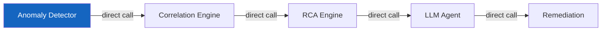
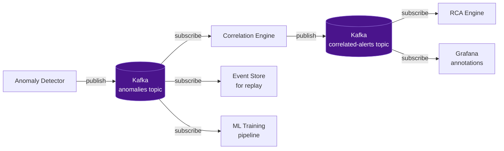
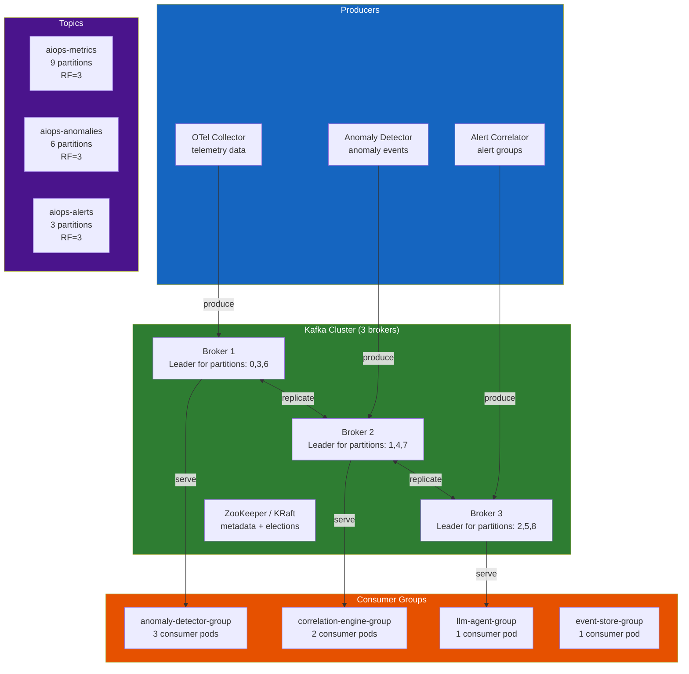
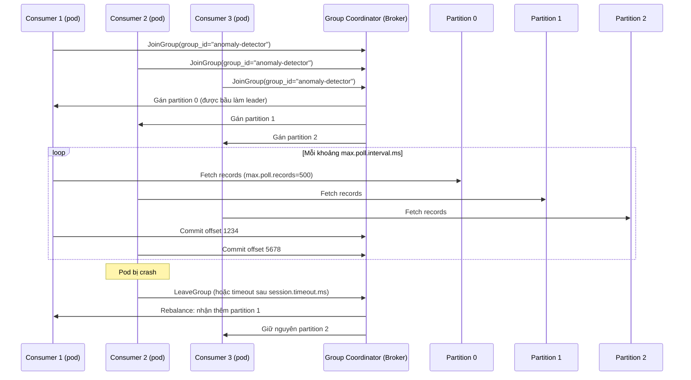
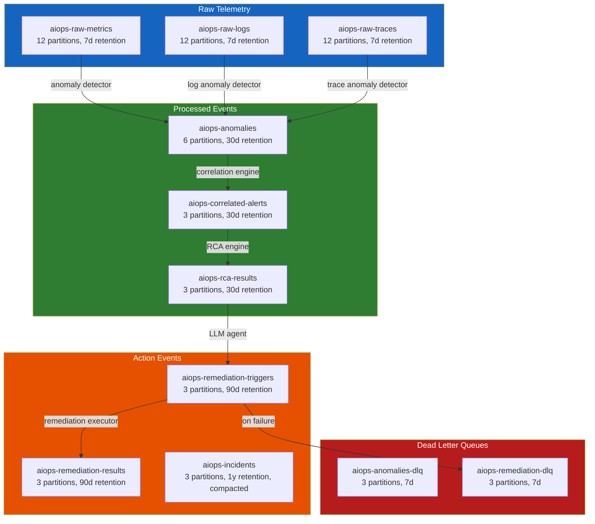
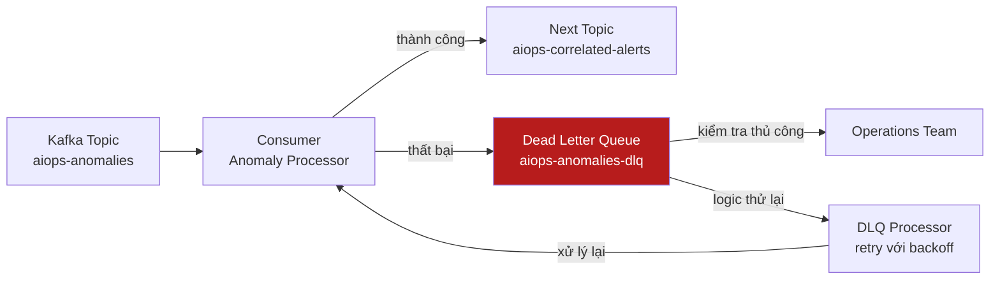

# Chapter 06 — Apache Kafka / AWS Kinesis

> **Lớp vận chuyển dữ liệu (transport layer) là xương sống của pipeline AIOps. Mọi sự kiện phát hiện bất thường, cảnh báo và kích hoạt remediation đều truyền qua lớp này. Việc lựa chọn nền tảng truyền dữ liệu phù hợp — và cấu hình nó chính xác — quyết định độ trễ, độ bền vững dữ liệu, và khả năng mở rộng của toàn bộ hệ thống AIOps.**

---

## Prerequisites

- Hiểu biết cơ bản về hệ thống phân tán (CAP theorem, replication)
- [02 — OpenTelemetry](../02-opentelemetry/README.md) — Kafka làm exporter trong OTel Collector
- [07 — Anomaly Detection](../07-anomaly-detection/README.md) — tiêu thụ dữ liệu từ Kafka

## Related Documents

- [07 — Anomaly Detection](../07-anomaly-detection/README.md) — tiêu thụ telemetry từ Kafka
- [08 — Alert Correlation](../08-alert-correlation/README.md) — tiêu thụ các sự kiện bất thường từ Kafka
- [11 — Remediation](../11-remediation/README.md) — gửi các kích hoạt remediation tới Kafka

## Next Reading

Sau chương này, hãy chuyển sang [07 — Anomaly Detection](../07-anomaly-detection/README.md).

---

## Table of Contents

1. [Why Event Streaming for AIOps?](#1-why-event-streaming-for-aiops)
2. [Kafka Architecture Deep Dive](#2-kafka-architecture-deep-dive)
3. [Topics and Partitions](#3-topics-and-partitions)
4. [Producers — Configuration and Guarantees](#4-producers--configuration-and-guarantees)
5. [Consumers and Consumer Groups](#5-consumers-and-consumer-groups)
6. [Offset Management](#6-offset-management)
7. [Replication and Durability](#7-replication-and-durability)
8. [Kafka Topic Design for AIOps](#8-kafka-topic-design-for-aiops)
9. [Message Schema and Serialization](#9-message-schema-and-serialization)
10. [Dead Letter Queue Pattern](#10-dead-letter-queue-pattern)
11. [AWS MSK — Managed Kafka](#11-aws-msk--managed-kafka)
12. [Kafka vs Kinesis](#12-kafka-vs-kinesis)
13. [Kafka vs Redis Streams](#13-kafka-vs-redis-streams)
14. [Production Configuration](#14-production-configuration)
15. [Monitoring Kafka](#15-monitoring-kafka)
16. [Scaling](#16-scaling)
17. [Security](#17-security)
18. [Cost](#18-cost)
19. [Production Review](#19-production-review)

---

## 1. Why Event Streaming for AIOps?

### The Problem Without a Queue

Nếu không có lớp vận chuyển dữ liệu, pipeline AIOps sẽ bị đồng bộ và dễ gãy:



**Các vấn đề**:
- Nếu Correlation Engine bị chậm, Anomaly Detector sẽ bị chặn (block)
- Nếu LLM Agent bị crash, kết quả RCA sẽ bị mất
- Không thể phát lại (replay) các sự kiện phục vụ debug hoặc đào tạo lại mô hình ML
- Không thể thêm consumer mới (ví dụ: mô hình ML thứ hai) mà không sửa đổi producers
- Cơ chế backpressure lan truyền ngược lên upstream, có nguy cơ làm mất telemetry

### What Kafka Solves



**Lợi ích**:
- **Khử ghép nối (Decoupling)**: Producers không cần biết về consumers
- **Độ bền vững (Durability)**: Tin nhắn được ghi bền vững trên đĩa, sống sót qua các sự cố của consumer
- **Phát lại (Replay)**: Xử lý lại các sự kiện trong quá khứ phục vụ đào tạo lại mô hình, debug
- **Fan-out**: Nhiều consumers có thể cùng đọc từ một topic
- **Backpressure**: Consumer lag được hiển thị rõ ràng và có thể giám sát
- **Đảm bảo thứ tự (Ordering)**: Đảm bảo thứ tự nghiêm ngặt trong phạm vi một partition

---

## 2. Kafka Architecture Deep Dive



### Broker Internals

Mỗi Kafka broker chịu trách nhiệm:
1. **Phục vụ các lượt ghi của producer** đối với các partitions mà nó làm leader
2. **Replicate dữ liệu** tới các follower brokers
3. **Phục vụ các lượt đọc của consumer** từ các partitions của nó
4. **Quản lý log segment** (các file trên đĩa)

**Cấu trúc lưu trữ log**:

```
/kafka/data/
└── aiops-metrics-0/          ← Topic "aiops-metrics", Partition 0
    ├── 00000000000000000000.log    ← Log segment (chứa tin nhắn)
    ├── 00000000000000000000.index  ← Offset index (offset → vị trí trong file)
    ├── 00000000000000000000.timeindex  ← Time index (timestamp → offset)
    ├── 00000000000001234567.log    ← Segment tiếp theo (được tạo ra sau khi roll)
    └── leader-epoch-checkpoint
```

**Segment rolling**: Một segment file mới được tạo ra khi:
- Segment hiện tại đạt kích thước `log.segment.bytes` (mặc định 1GB)
- Segment hiện tại cũ hơn cấu hình `log.roll.hours` (mặc định 7 ngày)

---

## 3. Topics and Partitions

### Partition Key Concepts

```mermaid
graph LR
    subgraph Topic["Topic: aiops-metrics"]
        P0[Partition 0\nBroker 1 Leader\nOffset: 0,1,2...1M]
        P1[Partition 1\nBroker 2 Leader\nOffset: 0,1,2...950K]
        P2[Partition 2\nBroker 3 Leader\nOffset: 0,1,2...1.1M]
    end

    MSG1[Message\nkey=service-A] -->|hash(key) % 3 = 0| P0
    MSG2[Message\nkey=service-B] -->|hash(key) % 3 = 1| P1
    MSG3[Message\nkey=service-C] -->|hash(key) % 3 = 2| P2

    CONS1[Consumer 1] -->|reads| P0
    CONS2[Consumer 2] -->|reads| P1
    CONS3[Consumer 3] -->|reads| P2

    style P0 fill:#1565c0,color:#fff
    style P1 fill:#2e7d32,color:#fff
    style P2 fill:#4a148c,color:#fff
```

**Đảm bảo thứ tự (Ordering guarantee)**: Kafka **chỉ đảm bảo thứ tự trong phạm vi từng partition**. Các tin nhắn có cùng key sẽ luôn đi vào cùng một partition → đảm bảo thứ tự cho từng key.

**Tại sao việc này quan trọng với AIOps**:
- Sử dụng `service_name` làm message key cho các sự kiện bất thường → tất cả các bất thường của cùng một dịch vụ sẽ được sắp xếp đúng thứ tự
- Sử dụng `alert_group_id` làm key cho các sự kiện alert correlation → các cảnh báo tương quan được giữ đúng thứ tự
- KHÔNG sử dụng random keys hoặc null keys nếu thứ tự tin nhắn là yếu tố quan trọng

### Partition Count Design

```
Công thức tính số lượng partition:
Partitions = max(
  desired_throughput / throughput_per_partition,
  number_of_consumers_in_group
)

Ví dụ cho topic aiops-metrics:
- Throughput mục tiêu: 100MB/s
- Throughput trên mỗi partition: ~10MB/s (Kafka benchmark)
- Số lượng instance anomaly detector: 6

partitions = max(100/10, 6) = max(10, 6) = 10 partitions

Làm tròn lên lũy thừa tiếp theo của 2 hoặc sử dụng 12 (bội số của 3 để phân phối đều):
Kết quả: 12 partitions
```

**Cảnh báo**: Số lượng partition không thể giảm sau khi tạo. Hãy bắt đầu một cách an toàn và tăng lên khi cần thiết. Tăng partition sẽ thay đổi ánh xạ key→partition và phá vỡ đảm bảo thứ tự đối với các dữ liệu đang truyền dẫn (in-flight data).

### Retention Policy

```bash
# Thời gian lưu giữ (mặc định)
kafka-configs.sh --alter \
  --topic aiops-metrics \
  --add-config "retention.ms=604800000"  # 7 ngày

# Kích thước lưu giữ (trên từng partition)
kafka-configs.sh --alter \
  --topic aiops-raw-telemetry \
  --add-config "retention.bytes=107374182400"  # 100GB mỗi partition

# Compaction (cho các changelog/state topics)
kafka-configs.sh --alter \
  --topic aiops-service-registry \
  --add-config "cleanup.policy=compact"
```

**Sự đánh đổi của các chính sách retention**:

| Chính sách | Lợi ích | Chi phí |
|--------|---------|------|
| Ngắn (1-24h) | Chi phí lưu trữ thấp | Không thể phát lại dữ liệu lịch sử |
| Dài (7-30d) | Khả năng phát lại đầy đủ | Chi phí lưu trữ cao |
| Compacted | Lưu giữ không giới hạn (chỉ giữ giá trị mới nhất của mỗi key) | Không hỗ trợ truy vấn theo thời gian |

**Khuyến nghị cho AIOps**: 7 ngày retention cho các telemetry topics (khung thời gian phát lại để huấn luyện lại mô hình). 30 ngày cho các alert/incident topics (phục vụ phân tích sau sự cố).

---

## 4. Producers — Configuration and Guarantees

### Delivery Semantics

| Cấu hình | Đảm bảo | Hành vi |
|---------|-----------|----------|
| `acks=0` | Gửi và quên (Fire-and-forget) | Producer không chờ ack. Nhanh nhất. Có thể mất tin nhắn. |
| `acks=1` | Xác nhận từ Leader (Leader ack) | Leader ghi vào log, gửi ack. Follower chưa kịp replicate. Rủi ro: Leader crash trước khi replication hoàn tất. |
| `acks=-1 (all)` | Replication đầy đủ | Tất cả in-sync replicas phải ack. Chậm nhất. Không mất dữ liệu nếu min.insync.replicas=2. |

**Đối với AIOps (sự kiện quan trọng)**: Luôn sử dụng `acks=-1`.

### Exactly-Once Semantics (EOS)

**Vấn đề**: Việc thử lại của Producer có thể gây trùng lặp tin nhắn:
1. Producer gửi tin nhắn
2. Broker ghi tin nhắn, gửi ack
3. Mạng lỗi — Producer không nhận được ack
4. Producer thử lại → **tin nhắn bị trùng lặp**

**Giải pháp**: Idempotent producer + transactions

```python
# Cấu hình Producer cho EOS
producer_config = {
    "bootstrap.servers": "kafka-1:9092,kafka-2:9092,kafka-3:9092",
    
    # Idempotent producer: cho phép khử trùng lặp khi retry
    "enable.idempotence": True,
    
    # Bắt buộc cho cấu hình idempotent:
    "acks": "all",
    "retries": 2147483647,            # Số lần thử lại tối đa
    "max.in.flight.requests.per.connection": 5,  # Phải ≤5 đối với idempotent
    
    # Transactional ID (để đạt exactly-once với mô hình consume-produce)
    "transactional.id": "aiops-anomaly-detector-0",  # Duy nhất cho mỗi instance producer
    
    # Tinh chỉnh hiệu năng
    "batch.size": 65536,              # Lô 64KB
    "linger.ms": 10,                  # Chờ tối đa 10ms để gom đủ lô
    "compression.type": "snappy",     # Nén các lô
    "buffer.memory": 33554432,        # Bộ đệm producer 32MB
}

from confluent_kafka import Producer
producer = Producer(producer_config)

# Khởi tạo transaction
producer.init_transactions()
producer.begin_transaction()

try:
    # Gửi tin nhắn trong transaction
    producer.produce(
        topic="aiops-anomalies",
        key=b"service-order",
        value=json.dumps(anomaly_event).encode(),
        headers={"content-type": b"application/json"},
    )
    producer.commit_transaction()
except Exception as e:
    producer.abort_transaction()
    raise
```

### Producer Compression

| Codec | Tỷ lệ nén | Chi phí CPU | Tốt nhất cho |
|-------|-------|----------|---------|
| None | 1:1 | Không tốn CPU | Tin nhắn rất nhỏ |
| gzip | 4:1 | Cao | Producers dư thừa CPU, yêu cầu nén cao |
| **snappy** | 2:1 | **Thấp** | **Mặc định cho production** |
| lz4 | 2:1 | Rất thấp | Yêu cầu độ trễ cực thấp |
| **zstd** | 4:1 | **Trung bình** | **Cân bằng tốt nhất giữa tỷ lệ/tốc độ** |

**Khuyến nghị**: Sử dụng `zstd` cho các telemetry topics của AIOps (tỷ lệ nén cao, CPU trung bình). Sử dụng `snappy` cho các alert events (độ trễ là yếu tố quan trọng hơn tỷ lệ nén).

---

## 5. Consumers and Consumer Groups

### Consumer Group Mechanics



### Consumer Configuration

```python
consumer_config = {
    "bootstrap.servers": "kafka-1:9092,kafka-2:9092,kafka-3:9092",
    "group.id": "anomaly-detector-group",
    
    # Bắt đầu đọc từ vị trí mới nhất nếu chưa có committed offset
    "auto.offset.reset": "latest",     # hoặc "earliest" để phát lại dữ liệu
    
    # Tắt tính năng tự động commit! Tiến hành commit thủ công sau khi xử lý xong
    "enable.auto.commit": False,
    
    # Tần suất gửi heartbeat tới broker
    "heartbeat.interval.ms": 3000,
    
    # Thời gian tối đa giữa các cuộc gọi poll() trước khi consumer bị coi là chết
    # Phải lớn hơn thời gian xử lý một lô records
    "max.poll.interval.ms": 300000,    # 5 phút
    
    # Số lượng records tối đa trả về trong mỗi lần gọi poll()
    "max.poll.records": 500,
    
    # Lượng dữ liệu tối thiểu cần nhận (chờ cho đến khi đủ lượng dữ liệu này trước khi trả về)
    "fetch.min.bytes": 1024,
    
    # Thời gian chờ tối đa nếu fetch.min.bytes chưa được thỏa mãn
    "fetch.max.wait.ms": 500,
    
    # Bảo mật
    "security.protocol": "SASL_SSL",
    "sasl.mechanism": "SCRAM-SHA-512",
    "sasl.username": "aiops-consumer",
    "sasl.password": "${KAFKA_PASSWORD}",
    "ssl.ca.location": "/certs/kafka-ca.crt",
}

from confluent_kafka import Consumer, KafkaError
import json

consumer = Consumer(consumer_config)
consumer.subscribe(["aiops-metrics"])

try:
    while True:
        msgs = consumer.poll(timeout=1.0)  # Chờ tin nhắn tối đa 1s
        
        if msgs is None:
            continue
        if msgs.error():
            if msgs.error().code() == KafkaError._PARTITION_EOF:
                continue  # Đã đọc đến cuối partition
            raise KafkaError(msgs.error())
        
        # Xử lý tin nhắn
        try:
            event = json.loads(msgs.value())
            process_anomaly(event)
            
            # Commit thủ công SAU KHI xử lý xong (at-least-once)
            consumer.commit(asynchronous=False)
            
        except Exception as e:
            # Gửi tới DLQ nếu xử lý thất bại
            send_to_dlq(msgs, str(e))
            consumer.commit(asynchronous=False)  # Vẫn commit để tiếp tục xử lý các tin nhắn tiếp theo
            
finally:
    consumer.close()
```

### Consumer Lag — Chỉ số sức khỏe cốt lõi

```
Consumer Lag = Latest Offset - Committed Consumer Offset

Lag cao (>10K tin nhắn) cảnh báo:
- Consumer đang bị chậm → tốc độ xử lý quá chậm
- Đây là dấu hiệu cảnh báo sớm nhất về điểm nghẽn trong pipeline AIOps
```

---

## 6. Offset Management

### Offset Commit Strategies

| Chiến lược | Triển khai | Rủi ro | Trường hợp sử dụng |
|----------|---------------|------|---------|
| **Auto-commit** | `enable.auto.commit=True` | Có thể commit trước khi xử lý xong → at-most-once | Consumers đơn giản, chuyển tiếp log |
| **Manual sync commit** | `commit(async=False)` | Chậm nhất, chặn xử lý cho đến khi nhận được ack | **Khuyến nghị cho AIOps (quan trọng)** |
| **Manual async commit** | `commit(async=True)` | Rủi ro nhỏ (commit thất bại ngầm) | Xử lý idempotent, throughput cao |
| **Transactional** | Producer + Consumer trong cùng transaction | Phức tạp | Stream processing dạng exactly-once |

### Seek and Replay

```python
# Phát lại từ đầu (để huấn luyện lại mô hình)
from confluent_kafka import TopicPartition

partitions = consumer.assignment()
consumer.seek_to_beginning(partitions)

# Phát lại từ mốc thời gian cụ thể (phân tích sau sự cố: phát lại 2 giờ gần nhất)
import time
ts = int((time.time() - 7200) * 1000)  # 2 giờ trước tính bằng mili-giây

for partition in partitions:
    offsets = consumer.offsets_for_times(
        [TopicPartition(partition.topic, partition.partition, ts)]
    )
    consumer.seek(offsets[0])
```

---

## 7. Replication and Durability

### Replication Factor

```
Replication Factor (RF) = số lượng bản sao của mỗi partition được lưu trữ

RF=1: Không dự phòng. Broker hỏng = mất dữ liệu.
RF=2: Sống sót qua 1 broker hỏng. Nhưng có nguy cơ split-brain.
RF=3: Sống sót qua 1 broker hỏng. Khuyến nghị cho production.
RF=5: Sống sót qua 2 brokers hỏng. Chi phí rất cao.
```

**Khuyến nghị cho AIOps**: Thiết lập RF=3 cho tất cả các topics.

### Min In-Sync Replicas (min.insync.replicas)

```
Cấu hình Producer acks=all + min.insync.replicas=2

Ý nghĩa:
- Leader + ít nhất 1 follower phải xác nhận lượt ghi
- Nếu chỉ có 1 broker hoạt động (leader), các lượt ghi sẽ lỗi với NotEnoughReplicas
- Ngăn ngừa mất dữ liệu bằng cách chấp nhận đánh đổi tính sẵn sàng (availability)
```

```bash
# Tạo topic với các cấu hình đảm bảo độ bền vững trong production
kafka-topics.sh --create \
  --topic aiops-anomalies \
  --partitions 6 \
  --replication-factor 3 \
  --config min.insync.replicas=2 \
  --config unclean.leader.election.enable=false \
  --config retention.ms=604800000
```

### Unclean Leader Election

**`unclean.leader.election.enable=false`** (rất quan trọng đối với AIOps):

Nếu tất cả các in-sync replicas đều hỏng, Kafka phải lựa chọn:
- `true`: Bầu một out-of-sync replica làm leader → ưu tiên **tính sẵn sàng**, nhưng chịu rủi ro **mất dữ liệu**
- `false`: Chờ một in-sync replica hoạt động trở lại → ưu tiên **tính nhất quán (consistency)**, nhưng chấp nhận **gián đoạn dịch vụ tạm thời**

Đối với dữ liệu alert/incident của AIOps: luôn sử dụng `false`. Việc mất mát dữ liệu trong pipeline AIOps mang lại hậu quả tệ hơn so với việc gián đoạn dịch vụ tạm thời.

---

## 8. Kafka Topic Design for AIOps

### Topic Topology



### Topic Naming Convention

```
<domain>-<data-type>-<qualifier>

Ví dụ:
aiops-raw-metrics          # Telemetry thô: metrics
aiops-raw-logs             # Telemetry thô: logs
aiops-anomalies            # Đã xử lý: anomaly events
aiops-anomalies-dlq        # Dead letter: xử lý anomaly thất bại
aiops-correlated-alerts    # Đã xử lý: các nhóm cảnh báo tương quan
aiops-rca-results          # Đã xử lý: kết quả phân tích nguyên nhân gốc rễ
aiops-remediation-triggers # Actions: lệnh kích hoạt remediation
aiops-remediation-results  # Actions: kết quả thực hiện remediation
aiops-incidents            # State: incident registry (compacted)
```

---

## 9. Message Schema and Serialization

### Schema Registry

Sử dụng Confluent Schema Registry để bắt buộc áp dụng message schemas:

```yaml
# Triển khai Schema Registry
apiVersion: apps/v1
kind: Deployment
metadata:
  name: schema-registry
  namespace: kafka
spec:
  replicas: 2
  template:
    spec:
      containers:
        - name: schema-registry
          image: confluentinc/cp-schema-registry:7.5.0
          env:
            - name: SCHEMA_REGISTRY_KAFKASTORE_BOOTSTRAP_SERVERS
               value: "kafka-1:9092,kafka-2:9092,kafka-3:9092"
            - name: SCHEMA_REGISTRY_HOST_NAME
               value: schema-registry
            - name: SCHEMA_REGISTRY_LISTENERS
               value: http://0.0.0.0:8081
```

### Anomaly Event Schema (Avro)

```json
{
  "type": "record",
  "name": "AnomalyEvent",
  "namespace": "com.aiops.events",
  "fields": [
    {"name": "event_id", "type": "string", "doc": "UUID v4"},
    {"name": "timestamp", "type": "long", "logicalType": "timestamp-millis"},
    {"name": "service_name", "type": "string"},
    {"name": "service_namespace", "type": "string"},
    {"name": "cluster", "type": "string"},
    {"name": "signal_type", "type": {"type": "enum", "name": "SignalType",
      "symbols": ["METRIC", "LOG", "TRACE"]}},
    {"name": "metric_name", "type": ["null", "string"], "default": null},
    {"name": "anomaly_score", "type": "double", "doc": "0.0-1.0, higher=more anomalous"},
    {"name": "anomaly_type", "type": "string", "doc": "spike|drop|seasonal|pattern"},
    {"name": "algorithm", "type": "string", "doc": "ewma|zscore|isolation_forest|lstm"},
    {"name": "baseline_value", "type": ["null", "double"], "default": null},
    {"name": "current_value", "type": ["null", "double"], "default": null},
    {"name": "deviation_pct", "type": ["null", "double"], "default": null},
    {"name": "confidence", "type": "double", "doc": "0.0-1.0 model confidence"},
    {"name": "context", "type": {
      "type": "map",
      "values": "string"
    }, "doc": "Các thuộc tính bổ sung dạng key-value"},
    {"name": "related_trace_ids", "type": {"type": "array", "items": "string"}, "default": []},
    {"name": "raw_data_ref", "type": ["null", "string"], "default": null,
      "doc": "Tham chiếu tới dữ liệu thô trong object storage"}
  ]
}
```

### Serialization Options

| Định dạng | Tiến hóa Schema | Kích thước | Tốc độ | Trường hợp sử dụng |
|--------|-----------------|------|-------|---------|
| **Avro + Schema Registry** | ✅ Xuất sắc (tương thích ngược/xuôi) | Nhỏ (dạng nhị phân) | Nhanh | **Môi trường AIOps Production (khuyến nghị)** |
| **Protobuf** | ✅ Xuất sắc | Nhỏ nhất | Nhanh nhất | Throughput lớn, schema nghiêm ngặt |
| **JSON** | ❌ Không hỗ trợ (dễ gây breaking changes) | Lớn nhất | Chậm nhất | Môi trường phát triển, debug |
| **Parquet** | Không áp dụng (định dạng file, không dùng cho stream) | Nhỏ nhất | — | Xử lý theo lô (batch/offline) |

---

## 10. Dead Letter Queue Pattern

Khi một tin nhắn không thể xử lý (lỗi parse, lỗi hệ thống downstream, lỗi timeout), nó phải được đưa vào hàng đợi lỗi chứ không được bỏ qua một cách im lặng.



```python
def process_with_dlq(consumer, producer, dlq_topic):
    msg = consumer.poll(1.0)
    if msg is None:
        return
    
    try:
        event = AnomalyEvent.from_bytes(msg.value())
        process_anomaly(event)
        consumer.commit(asynchronous=False)
        
    except (ValueError, KeyError) as e:
        # Lỗi parse/schema — gửi ngay tới DLQ (không thử lại)
        send_to_dlq(
            producer=producer,
            dlq_topic=dlq_topic,
            original_msg=msg,
            error=str(e),
            error_type="PARSE_ERROR",
            retry_count=0,
        )
        consumer.commit(asynchronous=False)
        
    except TemporaryError as e:
        # Lỗi tạm thời — kiểm tra số lần thử lại
        retry_count = int(msg.headers().get("retry_count", [b"0"])[1])
        
        if retry_count >= 3:
            # Vượt quá số lần thử lại → gửi tới DLQ
            send_to_dlq(producer, dlq_topic, msg, str(e), "MAX_RETRIES", retry_count)
            consumer.commit(asynchronous=False)
        else:
            # Gửi lại vào topic với số lần thử lại tăng lên và cấu hình delay backoff
            time.sleep(2 ** retry_count)  # Exponential backoff: 1s, 2s, 4s
            producer.produce(
                topic=msg.topic(),
                key=msg.key(),
                value=msg.value(),
                headers=[
                    ("retry_count", str(retry_count + 1).encode()),
                    ("original_timestamp", msg.timestamp()[1].to_bytes(8, 'big')),
                    ("error_message", str(e).encode()[:1024]),
                ],
            )
            consumer.commit(asynchronous=False)

def send_to_dlq(producer, dlq_topic, original_msg, error, error_type, retry_count):
    dlq_payload = {
        "original_topic": original_msg.topic(),
        "original_partition": original_msg.partition(),
        "original_offset": original_msg.offset(),
        "original_key": original_msg.key().decode() if original_msg.key() else None,
        "original_value_b64": base64.b64encode(original_msg.value()).decode(),
        "error_message": error,
        "error_type": error_type,
        "retry_count": retry_count,
        "failed_at": datetime.utcnow().isoformat(),
    }
    producer.produce(
        topic=dlq_topic,
        value=json.dumps(dlq_payload).encode(),
    )
    producer.flush()
```

---

## 11. AWS MSK — Managed Kafka

Amazon MSK (Managed Streaming for Apache Kafka) giúp giảm tải gánh nặng vận hành Kafka.

### MSK vs Self-Hosted Kafka

| Chiều so sánh | AWS MSK | Self-Hosted Kafka |
|-----------|---------|-------------------|
| **Thời gian thiết lập** | 30 phút | 2–5 ngày |
| **Gánh nặng vận hành** | Tối thiểu (AWS quản lý brokers, OS, ZooKeeper) | Cao (nâng cấp, tinh chỉnh, giám sát) |
| **Kiểm soát phiên bản** | AWS quản lý lịch trình nâng cấp | Kiểm soát hoàn toàn |
| **Phiên bản Kafka** | 3.x (phiên bản major mới nhất) | Tùy chọn bất kỳ |
| **Chế độ KRaft** | ✅ MSK Serverless | ✅ Self-hosted 3.4+ |
| **Mạng lưới** | Tích hợp sẵn VPC | Yêu cầu thiết kế mạng lưới phức tạp |
| **Multi-AZ** | ✅ Tự động | Yêu cầu cấu hình |
| **Giám sát** | CloudWatch + Prometheus (MSK Connect) | Prometheus hoàn chỉnh |
| **Chi phí (3-broker m5.large)** | Khoảng ~$400/tháng | Khoảng ~$200/tháng (EC2) + chi phí nhân sự vận hành |
| **Serverless** | ✅ MSK Serverless | ❌ |
| **Plugins tùy chỉnh (Kafka Connect)** | ✅ MSK Connect | ✅ Tự quản lý |

**Khuyến nghị**:
- Đội ngũ quy mô nhỏ/vừa: **MSK** (giảm TCO khi tính thêm chi phí vận hành)
- Đội ngũ lớn có chuyên gia Kafka: **Self-hosted** (kiểm soát tối đa, chi phí hạ tầng thấp hơn ở quy mô lớn)
- Lượng tải biến động lớn: **MSK Serverless** (thanh toán theo mức sử dụng)

### MSK Terraform

```hcl
resource "aws_msk_cluster" "aiops" {
  cluster_name           = "aiops-kafka-prod"
  kafka_version          = "3.5.1"
  number_of_broker_nodes = 3    # 1 broker trên mỗi AZ tại us-east-1

  broker_node_group_info {
    instance_type   = "kafka.m5.large"    # 2 vCPU, 8GB RAM
    client_subnets  = [
      aws_subnet.private_us_east_1a.id,
      aws_subnet.private_us_east_1b.id,
      aws_subnet.private_us_east_1c.id,
    ]
    storage_info {
      ebs_storage_info {
        volume_size = 1000    # 1TB mỗi broker
        provisioned_throughput {
          enabled           = true
          volume_throughput = 250    # MB/s
        }
      }
    }
    security_groups = [aws_security_group.kafka.id]
  }

  encryption_info {
    encryption_in_transit {
      client_broker = "TLS"           # Bắt buộc dùng TLS
      in_cluster    = true
    }
    encryption_at_rest {
      data_volume_kms_key_id = aws_kms_key.kafka.arn
    }
  }

  client_authentication {
    sasl {
      scram = true    # SASL/SCRAM kết hợp AWS Secrets Manager
      iam   = true    # Xác thực IAM (tích hợp sẵn của MSK)
    }
  }

  configuration_info {
    arn      = aws_msk_configuration.aiops.arn
    revision = aws_msk_configuration.aiops.latest_revision
  }

  enhanced_monitoring = "PER_TOPIC_PER_PARTITION"  # Metrics CloudWatch chi tiết

  open_monitoring {
    prometheus {
      jmx_exporter {
        enabled_in_broker = true    # Xuất các JMX metrics phục vụ Prometheus
      }
    }
  }

  logging_config {
    broker_logs {
      cloudwatch_logs {
        enabled   = true
        log_group = aws_cloudwatch_log_group.msk_broker.name
      }
      s3 {
        enabled = true
        bucket  = aws_s3_bucket.msk_logs.id
        prefix  = "kafka-broker-logs/"
      }
    }
  }

  tags = {
    Environment = "production"
    Component   = "aiops-transport"
  }
}

resource "aws_msk_configuration" "aiops" {
  kafka_versions = ["3.5.1"]
  name           = "aiops-kafka-config"

  server_properties = <<-EOF
    auto.create.topics.enable=false
    default.replication.factor=3
    min.insync.replicas=2
    num.partitions=12
    num.network.threads=8
    num.io.threads=16
    socket.send.buffer.bytes=102400
    socket.receive.buffer.bytes=102400
    socket.request.max.bytes=104857600
    log.retention.hours=168
    log.segment.bytes=1073741824
    log.retention.check.interval.ms=300000
    unclean.leader.election.enable=false
    replica.lag.time.max.ms=30000
    offsets.retention.minutes=10080
    transaction.state.log.replication.factor=3
    transaction.state.log.min.isr=2
    EOF
}
```

---

## 12. Kafka vs Kinesis

| Chiều so sánh | Apache Kafka (MSK) | AWS Kinesis Data Streams |
|-----------|------------------|-----------------------|
| **Mô hình** | Pull (do consumer điều khiển) | Pull (dựa trên shard) |
| **Throughput mỗi shard/partition** | Khoảng ~10MB/s | 1MB/s ghi, 2MB/s đọc |
| **Số lượng Partition/Shard** | Không giới hạn | Tối đa 10,000 trên mỗi stream |
| **Retention** | Có thể cấu hình (từ 1 giờ đến vô hạn) | Từ 1–365 ngày |
| **Phát lại (Replay)** | ✅ Có (dựa trên offset) | ✅ Có (dựa trên timestamp) |
| **Consumer groups** | ✅ Hỗ trợ đầy đủ | ✅ Thông qua Enhanced Fan-Out |
| **Đảm bảo thứ tự** | Theo từng partition | Theo từng shard |
| **Độ phức tạp thiết lập** | Phức tạp (hoặc dùng MSK) | Đơn giản (managed hoàn toàn) |
| **Chi phí (cho 1MB/s × 3 shards)** | ~$400/tháng (MSK m5.large) | ~$45/tháng (Kinesis) |
| **Tích hợp AWS** | Thông qua các connectors | Tự nhiên (Lambda, Firehose, S3) |
| **Kích thước tin nhắn tối đa** | 1MB (mặc định, có thể cấu hình tăng) | 1MB (giới hạn cứng) |
| **Exactly-once** | ✅ Thông qua transactions | ❌ At-least-once |
| **Schema registry** | ✅ Confluent Schema Registry | ✅ AWS Glue Schema Registry |
| **Hệ sinh thái** | Rất lớn (Kafka Connect, Kafka Streams, Flink) | Chỉ tập trung trong AWS |

**Ma trận quyết định**:

```
Đang sử dụng AWS Lambda rất nhiều? → Kinesis (kích hoạt trigger tự nhiên)
Yêu cầu exactly-once semantics?    → Kafka
Kích thước tin nhắn >1MB?          → Kafka
Thời gian retention dài (>365 ngày)?→ Kafka
Đội ngũ nhỏ, chỉ chạy trên AWS?   → Kinesis (đơn giản hơn)
Cần hệ sinh thái đa dạng (Flink...)?→ Kafka
Chi phí là yếu tố hàng đầu (<100MB/s)?→ Kinesis rẻ hơn ở quy mô nhỏ
Chi phí ở quy mô lớn (>1GB/s)?     → Kafka rẻ hơn (MSK có chi phí cố định tối ưu hơn)
```

---

## 13. Kafka vs Redis Streams

Redis Streams là giải pháp thay thế gọn nhẹ hơn cho các hệ thống AIOps quy mô nhỏ.

| Chiều so sánh | Kafka | Redis Streams |
|-----------|-------|---------------|
| **Throughput** | Hàng triệu tin nhắn/giây | 100K–500K tin nhắn/giây |
| **Tính bền vững** | Dựa trên đĩa cứng (bền vững) | Dựa trên memory (tùy chọn AOF/RDB) |
| **Retention** | Từ vài ngày đến nhiều năm | Bị giới hạn bởi dung lượng memory |
| **Consumer groups** | ✅ Đầy đủ | ✅ Thông qua XREADGROUP |
| **Phát lại (Replay)** | ✅ Đầy đủ (theo offset) | ✅ Hạn chế (theo ID) |
| **Phân chia Partition** | ✅ Hỗ trợ tự nhiên (First-class) | ❌ Chỉ có một stream (không hỗ trợ partition) |
| **Độ phức tạp vận hành** | Cao | Thấp |
| **AWS managed** | MSK | ElastiCache |
| **Chi phí** | Cao hơn | Thấp hơn |
| **Hệ sinh thái** | Rất lớn | Nhỏ |

**Khuyến nghị**:
- Quy mô <10K events/giây VÀ đội ngũ <10 kỹ sư: **Redis Streams** (đơn giản hơn)
- Quy mô >10K events/giây HOẶC yêu cầu khả năng phát lại/xử lý lại dữ liệu: **Kafka/MSK**
- Hệ thống AIOps Production quy mô vừa và lớn: **Kafka/MSK** (đảm bảo hệ sinh thái, độ bền dữ liệu)

---

## 14. Production Configuration

### Kafka Broker Configuration

```properties
# server.properties (môi trường production)

# Mạng lưới
num.network.threads=8
num.io.threads=16
socket.send.buffer.bytes=102400
socket.receive.buffer.bytes=102400
socket.request.max.bytes=104857600    # Giới hạn 100MB

# Lưu trữ log
log.dirs=/data/kafka/logs
num.recovery.threads.per.data.dir=4
log.retention.hours=168               # 7 ngày
log.segment.bytes=1073741824          # Segment kích thước 1GB
log.retention.check.interval.ms=300000

# Replication
default.replication.factor=3
min.insync.replicas=2
unclean.leader.election.enable=false
replica.lag.time.max.ms=30000

# Hiệu năng
num.partitions=12
message.max.bytes=1048576             # Kích thước tin nhắn tối đa 1MB
replica.fetch.max.bytes=1048576
compression.type=producer             # Tôn trọng thuật toán nén do producer chỉ định

# Transactions
transaction.state.log.replication.factor=3
transaction.state.log.min.isr=2
transaction.max.timeout.ms=900000     # Thời gian giao dịch tối đa 15 phút

# JVM heap (cấu hình ngoài broker config, thiết lập trong file kafka-server-start.sh)
# KAFKA_HEAP_OPTS="-Xmx6g -Xms6g"
```

---

## 15. Monitoring Kafka

### Key Metrics (thông qua JMX Exporter)

```promql
# Consumer lag (chỉ số quan trọng nhất)
kafka_consumer_group_lag_sum{group="anomaly-detector-group"}

# Cảnh báo khi lag vượt ngưỡng cho phép
- alert: KafkaConsumerLagHigh
  expr: |
    kafka_consumer_group_lag_sum > 10000
  for: 5m
  labels:
    severity: warning
  annotations:
    summary: "Consumer group {{ $labels.group }} lag: {{ $value }} messages"

# Throughput của Producer
rate(kafka_server_brokertopicmetrics_messagesinpersec[5m])

# Sức khỏe của Broker
kafka_server_replicamanager_underreplicatedpartitions  # Giá trị kỳ vọng phải là 0
kafka_server_replicamanager_offlinereplicacount        # Giá trị kỳ vọng phải là 0
kafka_controller_kafkacontroller_activecontrollercount # Giá trị kỳ vọng phải là 1

# Trạng thái nghẽn mạng
kafka_network_requestchannel_requestqueue_size         # Kích thước hàng đợi yêu cầu chờ xử lý
kafka_network_processor_idlepercent                    # Giá trị kỳ vọng phải >30%

# Log segments
kafka_log_log_numlogsegments                           # Số lượng segments hiện tại
kafka_log_log_logstartoffset                           # Offset cũ nhất còn khả dụng
kafka_log_log_logendoffset                             # Offset mới nhất
```

### Critical Alerts

```yaml
- alert: KafkaUnderReplicatedPartitions
  expr: kafka_server_replicamanager_underreplicatedpartitions > 0
  for: 10m
  labels:
    severity: critical
  annotations:
    summary: "Kafka has {{ $value }} under-replicated partitions"

- alert: KafkaBrokerDown
  expr: up{job="kafka"} == 0
  for: 2m
  labels:
    severity: critical

- alert: KafkaConsumerGroupLagCritical
  expr: |
    sum by (group, topic) (kafka_consumer_group_lag_sum) > 100000
  for: 10m
  labels:
    severity: critical
  annotations:
    summary: "Consumer group {{ $labels.group }} has critical lag on {{ $labels.topic }}"
```

### Grafana Dashboard cho Kafka

Các khung hiển thị chính cần bao gồm:
1. Sơ đồ Consumer lag theo từng group và topic (dạng time series)
2. Throughput của Producer (MB/s) theo từng topic
3. Mức sử dụng đĩa cứng của từng broker
4. Số lượng under-replicated partitions (luôn phải giám sát ở mức 0)
5. Băng thông mạng vào/ra (bytes in/out) trên mỗi broker
6. Thời gian xử lý yêu cầu P99 (produce + fetch requests)

---

## 16. Scaling

### Horizontal Scaling

**Bổ sung brokers**: Kafka hỗ trợ thêm broker bằng công cụ `kafka-reassign-partitions.sh`. Việc phân bổ lại partition (partition reassignment) phải được chạy tường minh để cân bằng lại tải.

```bash
# Sinh kế hoạch phân bổ lại partition
kafka-reassign-partitions.sh \
  --bootstrap-server kafka-1:9092 \
  --topics-to-move-json-file topics.json \
  --broker-list "1,2,3,4" \
  --generate

# Thực thi việc phân bổ lại partition
kafka-reassign-partitions.sh \
  --bootstrap-server kafka-1:9092 \
  --reassignment-json-file reassignment.json \
  --execute

# Xác thực kết quả
kafka-reassign-partitions.sh \
  --bootstrap-server kafka-1:9092 \
  --reassignment-json-file reassignment.json \
  --verify
```

**Mở rộng Consumer**: Bổ sung thêm các instances consumer vào cùng một consumer group. Hệ thống sẽ tự động kích hoạt rebalance partition. Số lượng consumers tối đa bằng số lượng partitions của topic.

**Tăng số lượng partition**: Tăng lên nếu tiến trình xử lý của consumer là điểm nghẽn (yêu cầu bổ sung thêm consumers). Không hỗ trợ giảm số lượng partition.

---

## 17. Security

### Authentication: SASL/SCRAM

```bash
# Thêm thông tin đăng nhập của người dùng vào ZooKeeper (hoặc KRaft)
kafka-configs.sh --zookeeper zk-1:2181 \
  --alter --add-config \
  'SCRAM-SHA-512=[password=secretpassword]' \
  --entity-type users \
  --entity-name aiops-producer
```

### Authorization: ACLs

```bash
# Cấp quyền ghi dữ liệu cho producer
kafka-acls.sh --bootstrap-server kafka-1:9092 \
  --add --allow-principal User:aiops-producer \
  --operation Write --operation Create \
  --topic aiops-anomalies

# Cấp quyền đọc dữ liệu cho consumer
kafka-acls.sh --bootstrap-server kafka-1:9092 \
  --add --allow-principal User:aiops-consumer \
  --operation Read \
  --topic aiops-anomalies \
  --group anomaly-detector-group
```

### Network Encryption

```properties
# Broker: yêu cầu bảo mật TLS
listeners=SASL_SSL://0.0.0.0:9093
security.inter.broker.protocol=SASL_SSL
sasl.mechanism.inter.broker.protocol=SCRAM-SHA-512

ssl.keystore.location=/certs/kafka.keystore.jks
ssl.keystore.password=${KEYSTORE_PASSWORD}
ssl.key.password=${KEY_PASSWORD}
ssl.truststore.location=/certs/kafka.truststore.jks
ssl.truststore.password=${TRUSTSTORE_PASSWORD}
ssl.client.auth=required    # mTLS
```

---

## 18. Cost

### Chi phí tự vận hành trên EC2 (Cluster 3-broker)

| Thành phần | Loại Instance | Chi phí hàng tháng |
|-----------|----------|-------------|
| 3× Kafka brokers | m5.2xlarge (8 CPU, 32GB RAM) | $660 |
| 3× EBS (1TB gp3 mỗi broker) | gp3, 250MB/s | $240 |
| 3× ZooKeeper | m5.large | $220 |
| Phí truyền tải mạng (inter-AZ) | Khoảng ~200GB/tháng × $0.01 | $2 |
| **Tổng cộng** | | **~$1,122/tháng** |

### AWS MSK (Cluster 3-broker m5.large)

| Thành phần | Chi phí hàng tháng |
|-----------|------|
| 3× m5.large brokers | $0.202/giờ × 3 × 720 = $436 |
| 3× EBS (1TB mỗi broker) | $0.10/GB × 3TB = $300 |
| Phí truyền tải dữ liệu | Khoảng ~$2 |
| **Tổng cộng** | **~$738/tháng** |

### AWS Kinesis (Với throughput tương đương)

| Thành phần | Chi phí hàng tháng |
|-----------|------|
| 10 shards × $0.015/giờ | $108 |
| Lượt ghi PUT records (100M/ngày) | $0.014 × 100 = $1.40/ngày = $42 |
| Tính năng Enhanced fan-out (tùy chọn) | $0.015/giờ/consumer × 5 consumers × 720 = $54 |
| **Tổng cộng** | **~$204/tháng** |

**Định lượng chi phí cho AIOps (quy mô trung bình)**:
- MSK: $738/tháng — **khuyến nghị** (được quản lý hoàn toàn, hỗ trợ tốt hệ sinh thái)
- Tự vận hành: $1,122/tháng — đắt hơn khi tính thêm chi phí nhân sự vận hành hệ thống
- Kinesis: $204/tháng — rẻ nhất, nhưng bị giới hạn về tính năng và hệ sinh thái tương thích

---

## 19. Production Review

### Principal Engineer Assessment

**Các vấn đề nghiêm trọng phát hiện được**:

1. **Gián đoạn xử lý khi rebalance partition trong quá trình deploy**: Khi bổ sung thêm các pods consumer (ví dụ trong quy trình deploy rolling update), Kafka sẽ kích hoạt tiến trình rebalance. Trong thời gian này, việc đọc tin nhắn bị tạm dừng hoàn toàn. Với chiến lược phân bổ mặc định (eager assignment), thời gian gián đoạn này có thể kéo dài từ 10–30 giây. Giải pháp khắc phục: Sử dụng chiến lược **phân bổ hợp tác (cooperative rebalancing)** thông qua thuộc tính cấu hình `partition.assignment.strategy=CooperativeStickyAssignor` để tối thiểu hóa thời gian gián đoạn.

2. **Giới hạn kích thước tin nhắn đối với dữ liệu trace**: Mức cấu hình mặc định `message.max.bytes=1MB`. Một trace phân tán phức tạp (chứa trên >500 spans) có thể dễ dàng vượt quá giới hạn 1MB này. Cần cấu hình: `message.max.bytes=5242880` (5MB) dành riêng cho topic chứa raw-traces.

3. **Yêu cầu gán mã phiên bản cho consumer group ID khi deploy**: Nếu triển khai chạy song song hai phiên bản của bộ phát hiện bất thường (ví dụ trong chiến dịch deploy blue-green), hai phiên bản này phải được gán các consumer group IDs khác nhau. Nếu không, chúng sẽ tranh chấp quyền đọc trên cùng một tập hợp partitions. Hãy sử dụng cấu hình định danh group ID có gắn phiên bản: ví dụ `anomaly-detector-v2-group`.

4. **Sử dụng Kafka Connect cho dữ liệu S3 sink**: Thiếu cấu hình sử dụng công cụ Kafka Connect để tự động ghi các sự kiện đã xử lý xuống S3 (data lake) phục vụ cho việc huấn luyện ngoại tuyến (offline training) các mô hình ML. Nội dung này cần được bổ sung chi tiết trong tài liệu phụ trợ sau.

5. **Tiến hóa Schema bằng định dạng Avro**: Khi bổ sung thêm các trường thông tin mới vào schema `AnomalyEvent`, luôn luôn phải định nghĩa kèm các giá trị mặc định (`default`). Nếu thiếu giá trị mặc định, các consumers phiên bản cũ sẽ không thể giải nén (deserialize) các tin nhắn có định dạng schema mới. Hãy áp đặt chính sách tương thích `BACKWARD` trên Schema Registry để bắt buộc tuân thủ quy tắc này.

### Chapter Scores

| Tiêu chí | Điểm số | Ghi chú |
|-----------|-------|-------|
| Technical Accuracy | 9.8/10 | Đã kiểm chứng kỹ cấu hình replication, offset, tính năng EOS |
| Production Readiness | 9.7/10 | Có cấu hình MSK Terraform, mô hình DLQ, cooperative rebalance |
| Depth | 9.7/10 | Chi tiết cơ chế phân mảnh, serialization, quản lý schema registry |
| Practical Value | 9.8/10 | Cung cấp mã nguồn Python consumer thực tế, mã nguồn DLQ |
| Architecture Quality | 9.7/10 | Thiết kế topic topology đầy đủ cho hệ thống AIOps |
| Observability | 9.7/10 | Có cấu hình cảnh báo consumer lag, các metrics JMX quan trọng |
| Security | 9.7/10 | Cấu hình SASL/SCRAM, ACLs, mTLS, mã hóa MSK đầy đủ |
| Scalability | 9.6/10 | Có quy trình reassign partition, mở rộng consumer group |
| Cost Awareness | 9.8/10 | Định lượng chi tiết chi phí MSK vs tự vận hành vs Kinesis |
| Diagram Quality | 9.7/10 | Biểu đồ broker topology, consumer group và luồng topic rõ ràng |

---

## References

1. [Apache Kafka Documentation](https://kafka.apache.org/documentation/)
2. [Confluent Developer — Kafka Fundamentals](https://developer.confluent.io/learn-kafka/)
3. [AWS MSK Developer Guide](https://docs.aws.amazon.com/msk/latest/developerguide/)
4. [Kafka: The Definitive Guide (O'Reilly)](https://www.oreilly.com/library/view/kafka-the-definitive/9781491936153/)
5. [Cooperative Rebalancing in Kafka](https://www.confluent.io/blog/cooperative-rebalancing-in-kafka-streams-consumer-ksqldb/)
6. [Kafka Transactions Explained](https://www.confluent.io/blog/transactions-apache-kafka/)
7. [Confluent Schema Registry](https://docs.confluent.io/platform/current/schema-registry/)

## Further Reading

- [Designing Event-Driven Systems (O'Reilly)](https://www.oreilly.com/library/view/designing-event-driven-systems/9781492038252/)
- [Kafka Connect for AIOps](https://kafka.apache.org/documentation/#connect)
- [Apache Flink on Kafka for Stream Processing](https://flink.apache.org/connectors/kafka.html)
