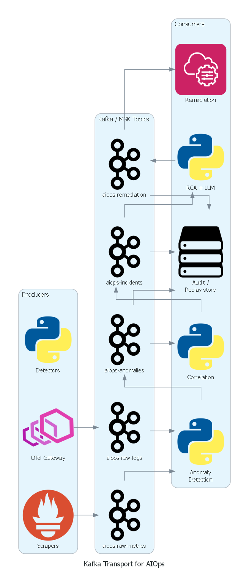
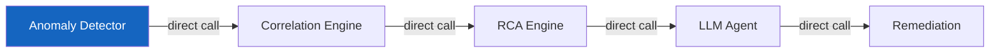
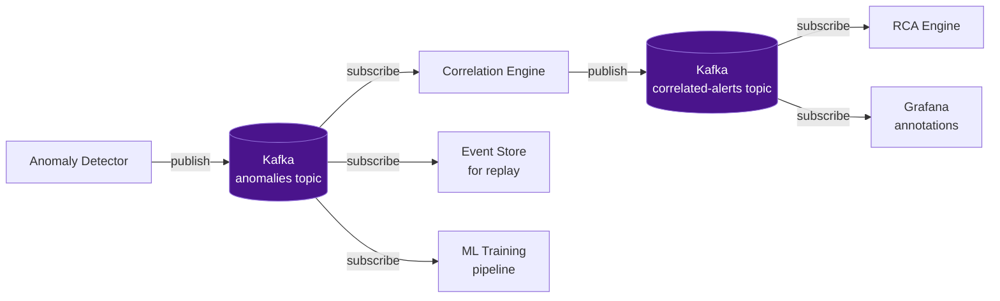
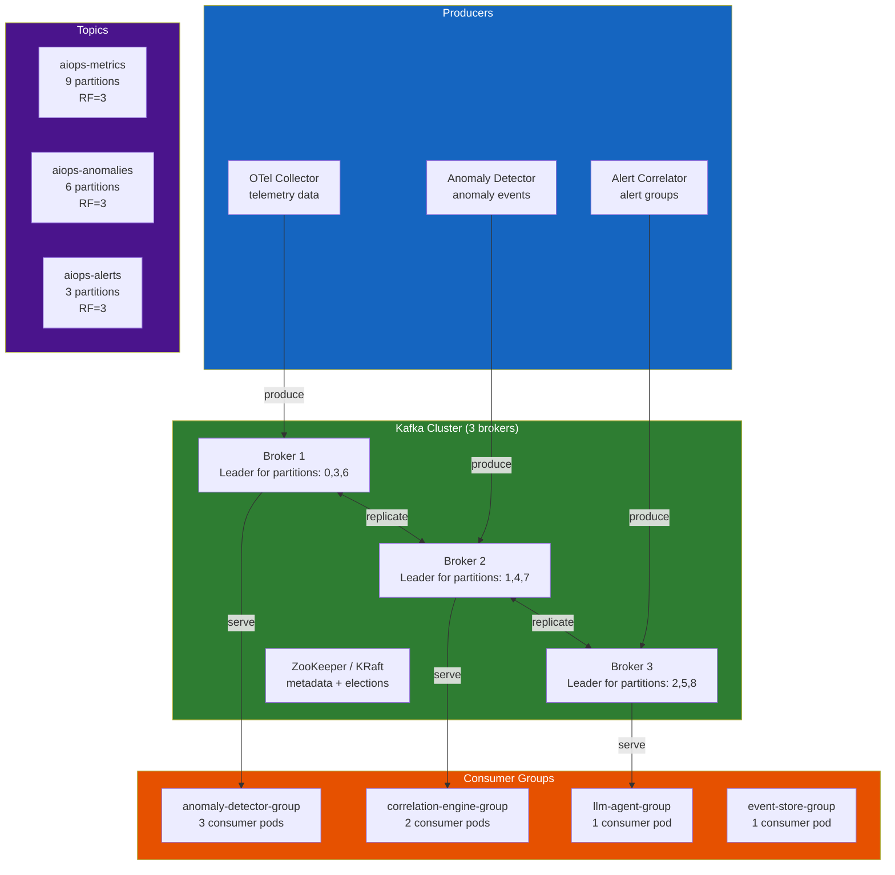
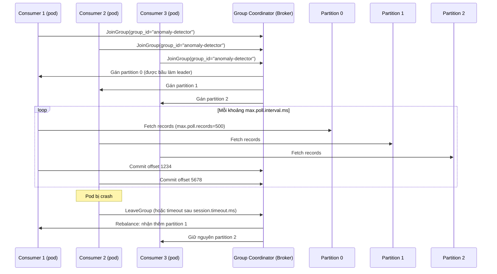
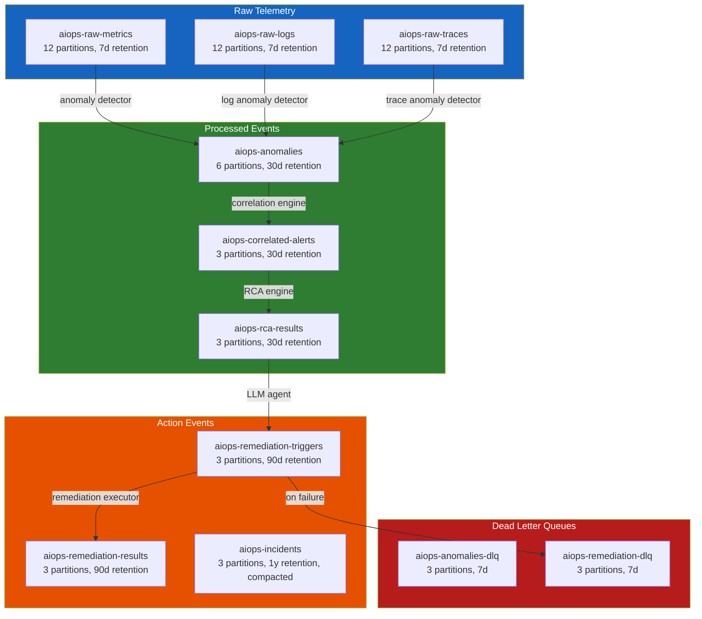
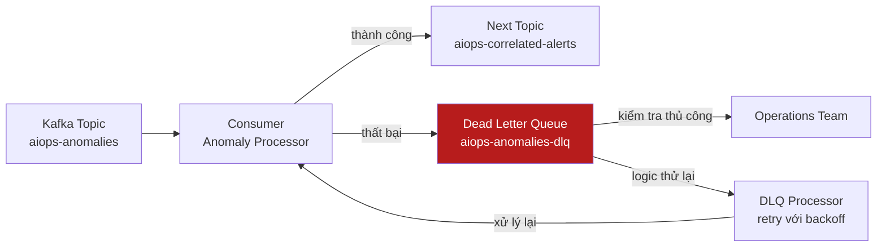
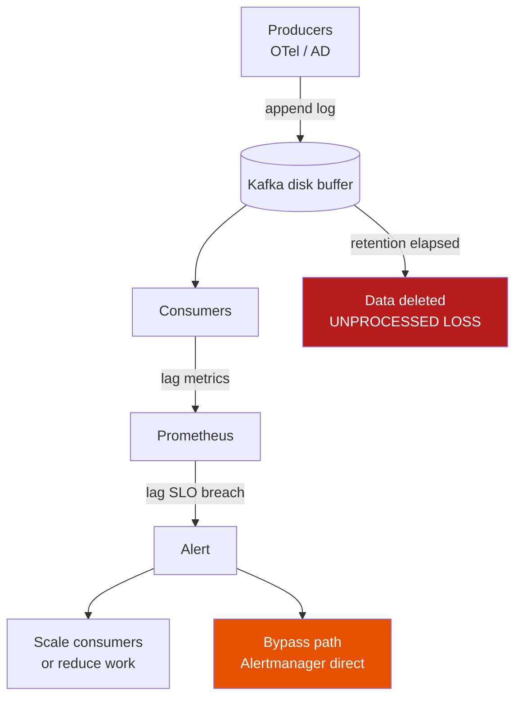
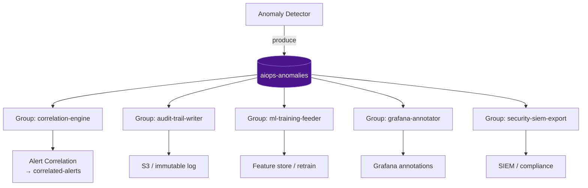
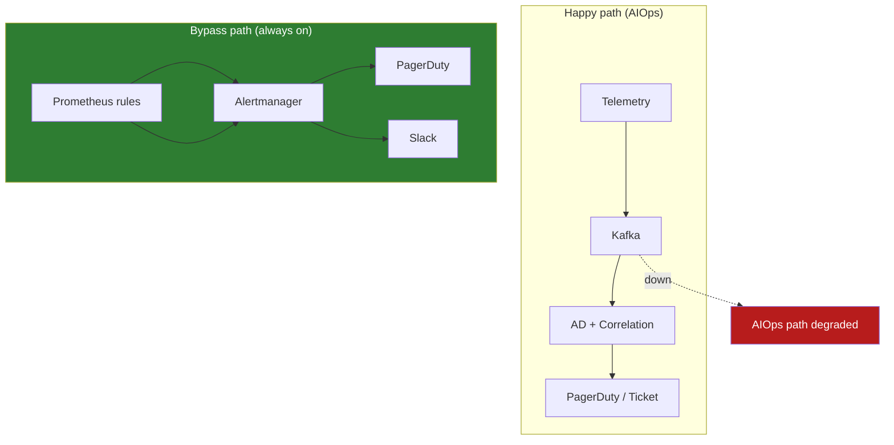

# Chapter 06 — Apache Kafka / AWS Kinesis

> **Lớp vận chuyển dữ liệu (transport layer) là xương sống của pipeline AIOps. Mọi sự kiện phát hiện bất thường, cảnh báo và kích hoạt remediation đều truyền qua lớp này. Việc lựa chọn nền tảng truyền dữ liệu phù hợp — và cấu hình nó chính xác — quyết định độ trễ, độ bền vững dữ liệu, và khả năng mở rộng của toàn bộ hệ thống AIOps.**

---

## Prerequisites

- Hiểu biết cơ bản về hệ thống phân tán (CAP theorem, replication)
- [02 — OpenTelemetry](../02-opentelemetry/README.vi.md) — Kafka làm exporter trong OTel Collector
- [07 — Anomaly Detection](../07-anomaly-detection/README.vi.md) — tiêu thụ dữ liệu từ Kafka

## Related Documents

- [07 — Anomaly Detection](../07-anomaly-detection/README.vi.md) — tiêu thụ telemetry từ Kafka, publish anomaly events
- [08 — Alert Correlation](../08-alert-correlation/README.vi.md) — tiêu thụ các sự kiện bất thường từ Kafka
- [11 — Remediation](../11-remediation/README.vi.md) — gửi các kích hoạt remediation tới Kafka
- [15 — Famous Incidents](../15-famous-incidents/README.vi.md) — các sự cố vận hành liên quan transport / cascade failure

## Next Reading

Sau chương này, hãy chuyển sang [07 — Anomaly Detection](../07-anomaly-detection/README.vi.md).

---

## Table of Contents

1. [Why Event Streaming for AIOps?](#1-why-event-streaming-for-aiops)
2. [Kafka Architecture Deep Dive](#2-kafka-architecture-deep-dive)
3. [Topics and Partitions](#3-topics-and-partitions)
4. [Producers — Configuration and Guarantees](#4-producers--configuration-and-guarantees)
5. [Consumers and Consumer Groups](#5-consumers-and-consumer-groups)
6. [Offset Management](#6-offset-management)
7. [Replication and Durability](#7-replication-and-durability)
8. [Kafka Topic Design for AIOps](#8-kafka-topic-design-for-aiops)
9. [Message Schema and Serialization](#9-message-schema-and-serialization)
10. [Dead Letter Queue Pattern](#10-dead-letter-queue-pattern)
11. [AWS MSK — Managed Kafka](#11-aws-msk--managed-kafka)
12. [Kafka vs Kinesis](#12-kafka-vs-kinesis)
13. [Kafka vs Redis Streams](#13-kafka-vs-redis-streams)
14. [Production Configuration](#14-production-configuration)
15. [Monitoring Kafka](#15-monitoring-kafka)
16. [Scaling](#16-scaling)
17. [Security](#17-security)
18. [Cost Model — Retention × Throughput × Replication](#18-cost-model--retention--throughput--replication)
19. [Mental Model: Backpressure & Lag as Signal vs Incident](#19-mental-model-backpressure--lag-as-signal-vs-incident)
20. [Exactly-Once Myths in AIOps Pipeline](#20-exactly-once-myths-in-aiops-pipeline)
21. [Poison Messages & Schema Evolution](#21-poison-messages--schema-evolution)
22. [Hot Partitions from High-Cardinality Keys](#22-hot-partitions-from-high-cardinality-keys)
23. [Multi-Consumer Fan-out: AD + Correlation + Audit](#23-multi-consumer-fan-out-ad--correlation--audit)
24. [Failure Mode: Kafka Down → AIOps Blind & Bypass](#24-failure-mode-kafka-down--aiops-blind--bypass)
25. [MSK vs Self-Managed for Regulated Industries](#25-msk-vs-self-managed-for-regulated-industries)
26. [War Stories](#26-war-stories)
27. [Socratic Questions](#27-socratic-questions)
28. [Production Review](#28-production-review)
29. [Summary](#29-summary)

---

## 1. Why Event Streaming for AIOps?



*Poster: producers → topic AIOps → consumers (detect / correlate / remediate / audit replay).*

> [!NOTE]
> **Ý TƯỞNG**
> Kafka không phải "hàng đợi tin nhắn" theo nghĩa cổ điển (RabbitMQ/SQS). Nó là **distributed commit log** — một journal có thể replay. Trong AIOps, điều này quan trọng hơn throughput: bạn cần **phát lại 7 ngày telemetry** để train lại mô hình anomaly detection, debug false positive, và audit trail. Nếu chỉ nghĩ Kafka = queue đẩy tin nhắn đi, bạn sẽ cấu hình sai retention, sai offset, và mất dữ liệu train.

> [!TIP]
> **Vì sao AIOps bắt buộc có transport layer?**
> Pipeline AIOps có 5–7 stage (collect → detect → correlate → RCA → LLM → remediate). Mỗi stage có latency và failure mode khác nhau. Gọi trực tiếp HTTP giữa các stage = một stage chậm kéo sập toàn pipeline. Event streaming **khử ghép nối thời gian** (temporal decoupling): producer xong việc ngay khi ghi log; consumer xử lý theo nhịp của riêng nó.

### The Problem Without a Queue

Nếu không có lớp vận chuyển dữ liệu, pipeline AIOps sẽ bị đồng bộ và dễ gãy:



**Các vấn đề**:
- Nếu Correlation Engine bị chậm, Anomaly Detector sẽ bị chặn (block)
- Nếu LLM Agent bị crash, kết quả RCA sẽ bị mất
- Không thể phát lại (replay) các sự kiện phục vụ debug hoặc đào tạo lại mô hình ML
- Không thể thêm consumer mới (ví dụ: mô hình ML thứ hai) mà không sửa đổi producers
- Cơ chế backpressure lan truyền ngược lên upstream, có nguy cơ làm mất telemetry

> [!WARNING]
> **Edge case**: "Gọi trực tiếp + retry queue nhỏ trong process" trông đơn giản lúc POC, nhưng khi OTel Collector drop metrics vì AD không nhận kịp, bạn đã **mất tín hiệu** — và ML model sau đó train trên dữ liệu thiếu, sinh false negative. Transport layer bảo vệ **chất lượng dữ liệu**, không chỉ độ trễ.

### What Kafka Solves



**Lợi ích**:
- **Khử ghép nối (Decoupling)**: Producers không cần biết về consumers
- **Độ bền vững (Durability)**: Tin nhắn được ghi bền vững trên đĩa, sống sót qua các sự cố của consumer
- **Phát lại (Replay)**: Xử lý lại các sự kiện trong quá khứ phục vụ đào tạo lại mô hình, debug
- **Fan-out**: Nhiều consumers có thể cùng đọc từ một topic
- **Backpressure**: Consumer lag được hiển thị rõ ràng và có thể giám sát
- **Đảm bảo thứ tự (Ordering)**: Đảm bảo thứ tự nghiêm ngặt trong phạm vi một partition

> [!IMPORTANT]
> **Trade-off cốt lõi**: Kafka thêm operational surface (brokers, disk, rebalance, schema). Đổi lại bạn có replay, fan-out, và isolation. Với AIOps production (multi-stage + ML training), trade-off này **luôn** đáng — trừ khi scale cực nhỏ (<1K events/s) và team <5 người (xem [§13 Redis Streams](#13-kafka-vs-redis-streams)).

---

## 2. Kafka Architecture Deep Dive

> [!NOTE]
> **Ý TƯỞNG**
> Hãy nghĩ Kafka như một **băng chuyền log có nhiều làn** (partition). Mỗi làn có thứ tự riêng. Producer chọn làn bằng key. Consumer group chia các làn cho các worker. Không có "hàng đợi toàn cục" — chỉ có log append-only trên từng partition. Mọi bug production AIOps liên quan Kafka hầu hết đến từ hiểu sai mô hình này (ordering, rebalance, lag, hot partition).



### Broker Internals

Mỗi Kafka broker chịu trách nhiệm:
1. **Phục vụ các lượt ghi của producer** đối với các partitions mà nó làm leader
2. **Replicate dữ liệu** tới các follower brokers
3. **Phục vụ các lượt đọc của consumer** từ các partitions của nó
4. **Quản lý log segment** (các file trên đĩa)

**Log segment**: mỗi partition = thư mục chứa `.log` + `.index` + `.timeindex`. Segment mới khi đạt `log.segment.bytes` (default 1GB) hoặc `log.roll.hours`.

> [!TIP]
> **Vì sao quan tâm log segment?** Retention/compaction theo **segment**, không theo message. Segment active không bị xóa — segment.bytes quá lớn + retention 7d có thể giữ data lâu hơn kỳ vọng → cost disk tăng âm thầm. AIOps throughput cao: ~1GB/segment là cân bằng tốt.

---

## 3. Topics and Partitions

### Partition Key Concepts

```mermaid
graph LR
    subgraph Topic["Topic: aiops-metrics"]
        P0[Partition 0\nBroker 1 Leader\nOffset: 0,1,2...1M]
        P1[Partition 1\nBroker 2 Leader\nOffset: 0,1,2...950K]
        P2[Partition 2\nBroker 3 Leader\nOffset: 0,1,2...1.1M]
    end

    MSG1[Message\nkey=service-A] -->|hash(key) % 3 = 0| P0
    MSG2[Message\nkey=service-B] -->|hash(key) % 3 = 1| P1
    MSG3[Message\nkey=service-C] -->|hash(key) % 3 = 2| P2

    CONS1[Consumer 1] -->|reads| P0
    CONS2[Consumer 2] -->|reads| P1
    CONS3[Consumer 3] -->|reads| P2

    style P0 fill:#1565c0,color:#fff
    style P1 fill:#2e7d32,color:#fff
    style P2 fill:#4a148c,color:#fff
```

**Đảm bảo thứ tự (Ordering guarantee)**: Kafka **chỉ đảm bảo thứ tự trong phạm vi từng partition**. Các tin nhắn có cùng key sẽ luôn đi vào cùng một partition → đảm bảo thứ tự cho từng key.

**Tại sao việc này quan trọng với AIOps**:
- Sử dụng `service_name` làm message key cho các sự kiện bất thường → tất cả các bất thường của cùng một dịch vụ sẽ được sắp xếp đúng thứ tự
- Sử dụng `alert_group_id` làm key cho các sự kiện alert correlation → các cảnh báo tương quan được giữ đúng thứ tự
- KHÔNG sử dụng random keys hoặc null keys nếu thứ tự tin nhắn là yếu tố quan trọng

> [!WARNING]
> **Edge case — key thay đổi ý nghĩa**: Nếu correlation engine cần thứ tự theo `service_name` nhưng producer key bằng `trace_id`, các anomaly của cùng service rơi vào nhiều partition → correlator thấy **out-of-order events** → false correlation hoặc miss cascade. Key design = correctness của [08 — Alert Correlation](../08-alert-correlation/README.vi.md), không chỉ throughput.

### Partition Count Design

```
Công thức tính số lượng partition:
Partitions = max(
  desired_throughput / throughput_per_partition,
  number_of_consumers_in_group
)

Ví dụ cho topic aiops-metrics:
- Throughput mục tiêu: 100MB/s
- Throughput trên mỗi partition: ~10MB/s (Kafka benchmark)
- Số lượng instance anomaly detector: 6

partitions = max(100/10, 6) = max(10, 6) = 10 partitions

Làm tròn lên lũy thừa tiếp theo của 2 hoặc sử dụng 12 (bội số của 3 để phân phối đều):
Kết quả: 12 partitions
```

> [!IMPORTANT]
> **Trade-off partition count**: Nhiều partition hơn = scale consumer tốt hơn, nhưng metadata lớn hơn, rebalance lâu hơn, open file handles tăng, và **tăng partition phá vỡ key→partition mapping** cho data in-flight. Bắt đầu conservative (6–12 cho AIOps topics), tăng khi lag ổn định cao và consumer đã scale max.

**Cảnh báo**: Số lượng partition không thể giảm sau khi tạo. Hãy bắt đầu một cách an toàn và tăng lên khi cần thiết. Tăng partition sẽ thay đổi ánh xạ key→partition và phá vỡ đảm bảo thứ tự đối với các dữ liệu đang truyền dẫn (in-flight data).

### Retention Policy

```bash
# Thời gian lưu giữ (mặc định)
kafka-configs.sh --alter \
  --topic aiops-metrics \
  --add-config "retention.ms=604800000"  # 7 ngày

# Kích thước lưu giữ (trên từng partition)
kafka-configs.sh --alter \
  --topic aiops-raw-telemetry \
  --add-config "retention.bytes=107374182400"  # 100GB mỗi partition

# Compaction (cho các changelog/state topics)
kafka-configs.sh --alter \
  --topic aiops-service-registry \
  --add-config "cleanup.policy=compact"
```

**Sự đánh đổi của các chính sách retention**:

| Chính sách | Lợi ích | Chi phí |
|--------|---------|------|
| Ngắn (1-24h) | Chi phí lưu trữ thấp | Không thể phát lại dữ liệu lịch sử |
| Dài (7-30d) | Khả năng phát lại đầy đủ | Chi phí lưu trữ cao |
| Compacted | Lưu giữ không giới hạn (chỉ giữ giá trị mới nhất của mỗi key) | Không hỗ trợ truy vấn theo thời gian |

**Khuyến nghị cho AIOps**: 7 ngày retention cho các telemetry topics (khung thời gian phát lại để huấn luyện lại mô hình). 30 ngày cho các alert/incident topics (phục vụ phân tích sau sự cố).

> [!TIP]
> **Vì sao 7 ngày raw, 30 ngày anomalies?** Raw telemetry volume lớn (metrics/logs/traces) — 7 ngày đủ để retrain feature window phổ biến (1–7 ngày) trong [07 — Anomaly Detection](../07-anomaly-detection/README.vi.md). Anomaly/alert volume nhỏ hơn ~100–1000× → giữ 30 ngày rẻ, phục vụ post-incident và audit. Incident topics: compact + long retention.

---

## 4. Producers — Configuration and Guarantees

> [!NOTE]
> **Ý TƯỞNG**
> Producer config không phải "tuning performance" trước — mà là **chọn failure mode bạn chấp nhận**. `acks=0` = chấp nhận mất event. `acks=all` + `min.insync.replicas=2` = chấp nhận reject write khi cluster degraded. AIOps nên **reject write** hơn là **mất anomaly im lặng** — mất anomaly = blind spot; reject = producer buffer/retry/alert rõ ràng.

### Delivery Semantics

| Cấu hình | Đảm bảo | Hành vi |
|---------|-----------|----------|
| `acks=0` | Gửi và quên (Fire-and-forget) | Producer không chờ ack. Nhanh nhất. Có thể mất tin nhắn. |
| `acks=1` | Xác nhận từ Leader (Leader ack) | Leader ghi vào log, gửi ack. Follower chưa kịp replicate. Rủi ro: Leader crash trước khi replication hoàn tất. |
| `acks=-1 (all)` | Replication đầy đủ | Tất cả in-sync replicas phải ack. Chậm nhất. Không mất dữ liệu nếu min.insync.replicas=2. |

**Đối với AIOps (sự kiện quan trọng)**: Luôn sử dụng `acks=-1`.

### Exactly-Once Semantics (EOS)

**Vấn đề**: Việc thử lại của Producer có thể gây trùng lặp tin nhắn:
1. Producer gửi tin nhắn
2. Broker ghi tin nhắn, gửi ack
3. Mạng lỗi — Producer không nhận được ack
4. Producer thử lại → **tin nhắn bị trùng lặp**

**Giải pháp**: Idempotent producer + transactions

```python
# Cấu hình Producer cho EOS
producer_config = {
    "bootstrap.servers": "kafka-1:9092,kafka-2:9092,kafka-3:9092",
    
    # Idempotent producer: cho phép khử trùng lặp khi retry
    "enable.idempotence": True,
    
    # Bắt buộc cho cấu hình idempotent:
    "acks": "all",
    "retries": 2147483647,            # Số lần thử lại tối đa
    "max.in.flight.requests.per.connection": 5,  # Phải ≤5 đối với idempotent
    
    # Transactional ID (để đạt exactly-once với mô hình consume-produce)
    "transactional.id": "aiops-anomaly-detector-0",  # Duy nhất cho mỗi instance producer
    
    # Tinh chỉnh hiệu năng
    "batch.size": 65536,              # Lô 64KB
    "linger.ms": 10,                  # Chờ tối đa 10ms để gom đủ lô
    "compression.type": "snappy",     # Nén các lô
    "buffer.memory": 33554432,        # Bộ đệm producer 32MB
}

from confluent_kafka import Producer
producer = Producer(producer_config)

# Khởi tạo transaction
producer.init_transactions()
producer.begin_transaction()

try:
    # Gửi tin nhắn trong transaction
    producer.produce(
        topic="aiops-anomalies",
        key=b"service-order",
        value=json.dumps(anomaly_event).encode(),
        headers={"content-type": b"application/json"},
    )
    producer.commit_transaction()
except Exception as e:
    producer.abort_transaction()
    raise
```

> [!WARNING]
> **Myth sắp vỡ**: Kafka EOS **không** biến toàn bộ pipeline AIOps thành exactly-once end-to-end. EOS chỉ cover **Kafka read → process → Kafka write** trong transactional boundary. Side effects (gọi Prometheus API, ghi Redis, gọi LLM, PagerDuty) **vẫn at-least-once**. Xem [§20 Exactly-Once Myths](#20-exactly-once-myths-in-aiops-pipeline).

### Producer Compression

| Codec | Tỷ lệ nén | Chi phí CPU | Tốt nhất cho |
|-------|-------|----------|---------|
| None | 1:1 | Không tốn CPU | Tin nhắn rất nhỏ |
| gzip | 4:1 | Cao | Producers dư thừa CPU, yêu cầu nén cao |
| **snappy** | 2:1 | **Thấp** | **Mặc định cho production** |
| lz4 | 2:1 | Rất thấp | Yêu cầu độ trễ cực thấp |
| **zstd** | 4:1 | **Trung bình** | **Cân bằng tốt nhất giữa tỷ lệ/tốc độ** |

**Khuyến nghị**: Sử dụng `zstd` cho các telemetry topics của AIOps (tỷ lệ nén cao, CPU trung bình). Sử dụng `snappy` cho các alert events (độ trễ là yếu tố quan trọng hơn tỷ lệ nén).

> [!TIP]
> **Vì sao compression quan trọng với cost model?** Disk retention = raw_bytes × compression_ratio × RF. Chuyển snappy→zstd trên telemetry có thể giảm 30–50% storage → retention 7 ngày rẻ hơn rõ rệt (xem [§18 Cost Model](#18-cost-model--retention--throughput--replication)).

---

## 5. Consumers and Consumer Groups

> [!NOTE]
> **Ý TƯỞNG**
> Consumer group = **một logical subscriber**. Cùng `group.id` = chia partitions (compete). Khác `group.id` = mỗi group nhận full copy (fan-out). Đây là nền tảng multi-consumer AIOps: AD, correlation, audit, training **không** share group — chúng là các group độc lập trên cùng topic.

### Consumer Group Mechanics



### Consumer Configuration

```python
consumer_config = {
    "bootstrap.servers": "kafka-1:9092,kafka-2:9092,kafka-3:9092",
    "group.id": "anomaly-detector-group",
    
    # Bắt đầu đọc từ vị trí mới nhất nếu chưa có committed offset
    "auto.offset.reset": "latest",     # hoặc "earliest" để phát lại dữ liệu
    
    # Tắt tính năng tự động commit! Tiến hành commit thủ công sau khi xử lý xong
    "enable.auto.commit": False,
    
    # Tần suất gửi heartbeat tới broker
    "heartbeat.interval.ms": 3000,
    
    # Thời gian tối đa giữa các cuộc gọi poll() trước khi consumer bị coi là chết
    # Phải lớn hơn thời gian xử lý một lô records
    "max.poll.interval.ms": 300000,    # 5 phút
    
    # Số lượng records tối đa trả về trong mỗi lần gọi poll()
    "max.poll.records": 500,
    
    # Lượng dữ liệu tối thiểu cần nhận (chờ cho đến khi đủ lượng dữ liệu này trước khi trả về)
    "fetch.min.bytes": 1024,
    
    # Thời gian chờ tối đa nếu fetch.min.bytes chưa được thỏa mãn
    "fetch.max.wait.ms": 500,
    
    # Bảo mật
    "security.protocol": "SASL_SSL",
    "sasl.mechanism": "SCRAM-SHA-512",
    "sasl.username": "aiops-consumer",
    "sasl.password": "${KAFKA_PASSWORD}",
    "ssl.ca.location": "/certs/kafka-ca.crt",
}

from confluent_kafka import Consumer, KafkaError
import json

consumer = Consumer(consumer_config)
consumer.subscribe(["aiops-metrics"])

try:
    while True:
        msgs = consumer.poll(timeout=1.0)  # Chờ tin nhắn tối đa 1s
        
        if msgs is None:
            continue
        if msgs.error():
            if msgs.error().code() == KafkaError._PARTITION_EOF:
                continue  # Đã đọc đến cuối partition
            raise KafkaError(msgs.error())
        
        # Xử lý tin nhắn
        try:
            event = json.loads(msgs.value())
            process_anomaly(event)
            
            # Commit thủ công SAU KHI xử lý xong (at-least-once)
            consumer.commit(asynchronous=False)
            
        except Exception as e:
            # Gửi tới DLQ nếu xử lý thất bại
            send_to_dlq(msgs, str(e))
            consumer.commit(asynchronous=False)  # Vẫn commit để tiếp tục xử lý các tin nhắn tiếp theo
            
finally:
    consumer.close()
```

> [!IMPORTANT]
> **Vì sao `enable.auto.commit=False`?** Auto-commit commit theo timer, **không** theo "đã xử lý xong". Consumer crash giữa process và commit → reprocess (OK, nếu idempotent). Crash sau auto-commit nhưng trước process xong → **mất event** (at-most-once). AIOps không chấp nhận mất anomaly. Manual commit sau process = at-least-once.

> [!TIP]
> **Edge case `max.poll.interval.ms`**: Nếu batch ML inference (Isolation Forest trên 500 metrics) mất > `max.poll.interval.ms`, consumer bị kick khỏi group → rebalance storm → lag tăng → worse. Giảm `max.poll.records` hoặc tăng interval; tốt hơn: tách fetch thread khỏi process thread.

### Consumer Lag — Chỉ số sức khỏe cốt lõi

```
Consumer Lag = Latest Offset - Committed Consumer Offset

Lag cao (>10K tin nhắn) cảnh báo:
- Consumer đang bị chậm → tốc độ xử lý quá chậm
- Đây là dấu hiệu cảnh báo sớm nhất về điểm nghẽn trong pipeline AIOps
```

> [!NOTE]
> Lag **không luôn là incident**. Lag theo chu kỳ deploy, lag ban đêm khi retrain job chạy, lag ngắn sau rebalance — có thể là **signal bình thường**. Lag tăng tuyến tính không bound, lag trên critical path (anomalies → correlation) — **là incident**. Chi tiết: [§19 Mental Model](#19-mental-model-backpressure--lag-as-signal-vs-incident).

---

## 6. Offset Management

> [!NOTE]
> **Ý TƯỞNG**
> Offset là **bookmark đọc**, không phải "đã xử lý thành công ở mọi side-effect". Commit offset chỉ nói: "tôi sẽ không đọc lại message này (trừ seek)". Side effects (DB, LLM, ticket) phải tự idempotent. Đây là lý do AIOps consumer luôn thiết kế **at-least-once + idempotent keys** (`event_id`).

### Offset Commit Strategies

| Chiến lược | Triển khai | Rủi ro | Trường hợp sử dụng |
|----------|---------------|------|---------|
| **Auto-commit** | `enable.auto.commit=True` | Có thể commit trước khi xử lý xong → at-most-once | Consumers đơn giản, chuyển tiếp log |
| **Manual sync commit** | `commit(async=False)` | Chậm nhất, chặn xử lý cho đến khi nhận được ack | **Khuyến nghị cho AIOps (quan trọng)** |
| **Manual async commit** | `commit(async=True)` | Rủi ro nhỏ (commit thất bại ngầm) | Xử lý idempotent, throughput cao |
| **Transactional** | Producer + Consumer trong cùng transaction | Phức tạp | Stream processing dạng exactly-once |

### Seek and Replay

```python
# Phát lại từ đầu (để huấn luyện lại mô hình)
from confluent_kafka import TopicPartition

partitions = consumer.assignment()
consumer.seek_to_beginning(partitions)

# Phát lại từ mốc thời gian cụ thể (phân tích sau sự cố: phát lại 2 giờ gần nhất)
import time
ts = int((time.time() - 7200) * 1000)  # 2 giờ trước tính bằng mili-giây

for partition in partitions:
    offsets = consumer.offsets_for_times(
        [TopicPartition(partition.topic, partition.partition, ts)]
    )
    consumer.seek(offsets[0])
```

> [!TIP]
> **Vì sao replay là superpower AIOps?** Sau incident, bạn seek lại 2 giờ trước trên `aiops-anomalies` với consumer group `postmortem-replay-YYYYMMDD` (group mới → không đụng offset production). Train lại model, verify correlator, debug false positive — **không cần** dump S3 trước nếu retention còn data. Đây là lý do retention 7–30 ngày không phải "lãng phí disk".

> [!WARNING]
> **Edge case**: `auto.offset.reset=latest` trên consumer group **mới** sẽ bỏ qua backlog. Group mới cho blue-green deploy nếu reset=latest → **mất anomalies trong cửa sổ deploy**. Production AIOps: group mới dùng `earliest` hoặc seek explicit tới timestamp deploy-minus-buffer.

---

## 7. Replication and Durability

> [!NOTE]
> **Ý TƯỞNG**
> Replication trong Kafka là **anti-data-loss**, không phải load balancing đọc (consumer đọc từ leader theo mặc định). RF=3 + min.ISR=2 + unclean.leader.election=false = bạn chọn **consistency over availability** khi cluster bị tổn thương. Đúng cho alert/incident; có thể nới lỏng cho debug topics.

### Replication Factor

```
Replication Factor (RF) = số lượng bản sao của mỗi partition được lưu trữ

RF=1: Không dự phòng. Broker hỏng = mất dữ liệu.
RF=2: Sống sót qua 1 broker hỏng. Nhưng có nguy cơ split-brain.
RF=3: Sống sót qua 1 broker hỏng. Khuyến nghị cho production.
RF=5: Sống sót qua 2 brokers hỏng. Chi phí rất cao.
```

**Khuyến nghị cho AIOps**: Thiết lập RF=3 cho tất cả các topics.

### Min In-Sync Replicas (min.insync.replicas)

```
Cấu hình Producer acks=all + min.insync.replicas=2

Ý nghĩa:
- Leader + ít nhất 1 follower phải xác nhận lượt ghi
- Nếu chỉ có 1 broker hoạt động (leader), các lượt ghi sẽ lỗi với NotEnoughReplicas
- Ngăn ngừa mất dữ liệu bằng cách chấp nhận đánh đổi tính sẵn sàng (availability)
```

```bash
# Tạo topic với các cấu hình đảm bảo độ bền vững trong production
kafka-topics.sh --create \
  --topic aiops-anomalies \
  --partitions 6 \
  --replication-factor 3 \
  --config min.insync.replicas=2 \
  --config unclean.leader.election.enable=false \
  --config retention.ms=604800000
```

### Unclean Leader Election

**`unclean.leader.election.enable=false`** (rất quan trọng đối với AIOps):

Nếu tất cả các in-sync replicas đều hỏng, Kafka phải lựa chọn:
- `true`: Bầu một out-of-sync replica làm leader → ưu tiên **tính sẵn sàng**, nhưng chịu rủi ro **mất dữ liệu**
- `false`: Chờ một in-sync replica hoạt động trở lại → ưu tiên **tính nhất quán (consistency)**, nhưng chấp nhận **gián đoạn dịch vụ tạm thời**

Đối với dữ liệu alert/incident của AIOps: luôn sử dụng `false`. Việc mất mát dữ liệu trong pipeline AIOps mang lại hậu quả tệ hơn so với việc gián đoạn dịch vụ tạm thời.

> [!IMPORTANT]
> **Trade-off availability**: Khi `unclean.leader.election=false` và ISR co về 0, topic **ngừng serve** partition đó. AIOps "mù" tạm thời trên partition đó — nhưng không **tự chữa bằng dữ liệu sai**. Kết hợp với [§24 Bypass design](#24-failure-mode-kafka-down--aiops-blind--bypass): Alertmanager → PagerDuty vẫn sống khi Kafka chết.

---

## 8. Kafka Topic Design for AIOps

> [!NOTE]
> **Ý TƯỞNG**
> Topic topology phản ánh **pipeline stages**, không phản ánh "mọi thứ có thể stream". Mỗi hop topic = boundary contract (schema + SLA latency + retention + owners). Quá nhiều topic = operational chaos. Quá ít topic = blast radius lớn khi schema/lag/poison message xảy ra.

### Topic Topology



### Topic Naming Convention

```
<domain>-<data-type>-<qualifier>

Ví dụ:
aiops-raw-metrics          # Telemetry thô: metrics
aiops-raw-logs             # Telemetry thô: logs
aiops-anomalies            # Đã xử lý: anomaly events
aiops-anomalies-dlq        # Dead letter: xử lý anomaly thất bại
aiops-correlated-alerts    # Đã xử lý: các nhóm cảnh báo tương quan
aiops-rca-results          # Đã xử lý: kết quả phân tích nguyên nhân gốc rễ
aiops-remediation-triggers # Actions: lệnh kích hoạt remediation
aiops-remediation-results  # Actions: kết quả thực hiện remediation
aiops-incidents            # State: incident registry (compacted)
```

> [!TIP]
> **Vì sao tách raw vs processed?** Retention/cost khác nhau; ACL khác nhau (raw = collector write; processed = AD write); poison message ở raw không nên block remediation topic. Blast radius isolation > "tiện một topic cho tất cả".

---

## 9. Message Schema and Serialization

> [!NOTE]
> **Ý TƯỞNG**
> Schema là **API contract giữa teams** (platform telemetry, AD, correlation, remediation). Breaking schema = silent failure hoặc poison message hàng loạt → model train hỏng, correlator crash loop. Schema Registry không phải "nice to have" — là safety rail cho multi-service AIOps.

### Schema Registry

Sử dụng Confluent Schema Registry để bắt buộc áp dụng message schemas:

```yaml
# Triển khai Schema Registry
apiVersion: apps/v1
kind: Deployment
metadata:
  name: schema-registry
  namespace: kafka
spec:
  replicas: 2
  template:
    spec:
      containers:
        - name: schema-registry
          image: confluentinc/cp-schema-registry:7.5.0
          env:
            - name: SCHEMA_REGISTRY_KAFKASTORE_BOOTSTRAP_SERVERS
              value: "kafka-1:9092,kafka-2:9092,kafka-3:9092"
            - name: SCHEMA_REGISTRY_HOST_NAME
              value: schema-registry
            - name: SCHEMA_REGISTRY_LISTENERS
              value: http://0.0.0.0:8081
```

### Anomaly Event Schema (Avro)

```json
{
  "type": "record",
  "name": "AnomalyEvent",
  "namespace": "com.aiops.events",
  "fields": [
    {"name": "event_id", "type": "string", "doc": "UUID v4"},
    {"name": "timestamp", "type": "long", "logicalType": "timestamp-millis"},
    {"name": "service_name", "type": "string"},
    {"name": "service_namespace", "type": "string"},
    {"name": "cluster", "type": "string"},
    {"name": "signal_type", "type": {"type": "enum", "name": "SignalType",
      "symbols": ["METRIC", "LOG", "TRACE"]}},
    {"name": "metric_name", "type": ["null", "string"], "default": null},
    {"name": "anomaly_score", "type": "double", "doc": "0.0-1.0, higher=more anomalous"},
    {"name": "anomaly_type", "type": "string", "doc": "spike|drop|seasonal|pattern"},
    {"name": "algorithm", "type": "string", "doc": "ewma|zscore|isolation_forest|lstm"},
    {"name": "baseline_value", "type": ["null", "double"], "default": null},
    {"name": "current_value", "type": ["null", "double"], "default": null},
    {"name": "deviation_pct", "type": ["null", "double"], "default": null},
    {"name": "confidence", "type": "double", "doc": "0.0-1.0 model confidence"},
    {"name": "context", "type": {
      "type": "map",
      "values": "string"
    }, "doc": "Các thuộc tính bổ sung dạng key-value"},
    {"name": "related_trace_ids", "type": {"type": "array", "items": "string"}, "default": []},
    {"name": "raw_data_ref", "type": ["null", "string"], "default": null,
      "doc": "Tham chiếu tới dữ liệu thô trong object storage"}
  ]
}
```

### Serialization Options

| Định dạng | Tiến hóa Schema | Kích thước | Tốc độ | Trường hợp sử dụng |
|--------|-----------------|------|-------|---------|
| **Avro + Schema Registry** | ✅ Xuất sắc (tương thích ngược/xuôi) | Nhỏ (dạng nhị phân) | Nhanh | **Môi trường AIOps Production (khuyến nghị)** |
| **Protobuf** | ✅ Xuất sắc | Nhỏ nhất | Nhanh nhất | Throughput lớn, schema nghiêm ngặt |
| **JSON** | ❌ Không hỗ trợ (dễ gây breaking changes) | Lớn nhất | Chậm nhất | Môi trường phát triển, debug |
| **Parquet** | Không áp dụng (định dạng file, không dùng cho stream) | Nhỏ nhất | — | Xử lý theo lô (batch/offline) |

> [!WARNING]
> **Schema evolution phá training**: Thêm field bắt buộc không default; đổi type `anomaly_score` float→string; rename `service_name`→`service` — consumer cũ fail, DLQ đầy, hoặc **worse**: silent coerce sai giá trị → training set nhiễm dirty labels. Luôn `BACKWARD` compatibility + default values. Chi tiết [§21](#21-poison-messages--schema-evolution).

---

## 10. Dead Letter Queue Pattern

> [!NOTE]
> **Ý TƯỞNG**
> DLQ là **van an toàn**: poison message không được phép chặn partition forever (head-of-line blocking). Commit + gửi DLQ = tiến tiếp; không commit + retry vô hạn trên bad message = lag tăng vô hạn trên một partition. AIOps cần cả hai: DLQ cho bad data, và alert khi DLQ rate tăng (signal schema bug / dependency down).

Khi một tin nhắn không thể xử lý (lỗi parse, lỗi hệ thống downstream, lỗi timeout), nó phải được đưa vào hàng đợi lỗi chứ không được bỏ qua một cách im lặng.



```python
def process_with_dlq(consumer, producer, dlq_topic):
    msg = consumer.poll(1.0)
    if msg is None:
        return
    
    try:
        event = AnomalyEvent.from_bytes(msg.value())
        process_anomaly(event)
        consumer.commit(asynchronous=False)
        
    except (ValueError, KeyError) as e:
        # Lỗi parse/schema — gửi ngay tới DLQ (không thử lại)
        send_to_dlq(
            producer=producer,
            dlq_topic=dlq_topic,
            original_msg=msg,
            error=str(e),
            error_type="PARSE_ERROR",
            retry_count=0,
        )
        consumer.commit(asynchronous=False)
        
    except TemporaryError as e:
        # Lỗi tạm thời — kiểm tra số lần thử lại
        retry_count = int(msg.headers().get("retry_count", [b"0"])[1])
        
        if retry_count >= 3:
            # Vượt quá số lần thử lại → gửi tới DLQ
            send_to_dlq(producer, dlq_topic, msg, str(e), "MAX_RETRIES", retry_count)
            consumer.commit(asynchronous=False)
        else:
            # Gửi lại vào topic với số lần thử lại tăng lên và cấu hình delay backoff
            time.sleep(2 ** retry_count)  # Exponential backoff: 1s, 2s, 4s
            producer.produce(
                topic=msg.topic(),
                key=msg.key(),
                value=msg.value(),
                headers=[
                    ("retry_count", str(retry_count + 1).encode()),
                    ("original_timestamp", msg.timestamp()[1].to_bytes(8, 'big')),
                    ("error_message", str(e).encode()[:1024]),
                ],
            )
            consumer.commit(asynchronous=False)

def send_to_dlq(producer, dlq_topic, original_msg, error, error_type, retry_count):
    dlq_payload = {
        "original_topic": original_msg.topic(),
        "original_partition": original_msg.partition(),
        "original_offset": original_msg.offset(),
        "original_key": original_msg.key().decode() if original_msg.key() else None,
        "original_value_b64": base64.b64encode(original_msg.value()).decode(),
        "error_message": error,
        "error_type": error_type,
        "retry_count": retry_count,
        "failed_at": datetime.utcnow().isoformat(),
    }
    producer.produce(
        topic=dlq_topic,
        value=json.dumps(dlq_payload).encode(),
    )
    producer.flush()
```

> [!IMPORTANT]
> **Phân loại lỗi trước khi DLQ**: `PARSE_ERROR` / schema → DLQ ngay, không retry. `TemporaryError` (timeout Redis, 503 downstream) → retry có bound. `Business validation` (score NaN) → DLQ + metric. Gom tất cả exception vào một `except Exception` = **nuốt bug** và làm bẩn DLQ, che mất root cause.

---

## 11. AWS MSK — Managed Kafka

> [!NOTE]
> **Ý TƯỞNG**
> MSK mua **operational time**, không mua "Kafka tốt hơn". Broker still Kafka. Bạn vẫn phải thiết kế topic, schema, lag alert, ACL. Những gì AWS gánh: patching OS, broker replace, multi-AZ wiring, storage attach. Với team AIOps nhỏ, đây thường là đúng trade-off.

Amazon MSK (Managed Streaming for Apache Kafka) giúp giảm tải gánh nặng vận hành Kafka.

### MSK vs Self-Hosted Kafka

| Chiều | AWS MSK | Self-Hosted |
|-------|---------|-------------|
| Setup / ops | 30 phút; AWS patch broker/OS | 2–5 ngày setup; ops cao |
| Version / KRaft | Catalog AWS; Serverless KRaft | Pin tùy ý; KRaft 3.4+ |
| Multi-AZ / VPC | Tự động + native VPC | Tự thiết kế |
| Monitoring | CloudWatch + JMX/Prometheus | Full Prometheus tự build |
| Cost (3-broker mid) | ~$400–750/tháng | EC2 rẻ hơn + eng hours |
| Connect / Serverless | MSK Connect; Serverless ✅ | Tự quản lý; Serverless ❌ |

**Khuyến nghị**: team nhỏ/vừa → **MSK**; team lớn + Kafka experts → **self-hosted**; burst load → **MSK Serverless**.

> [!TIP]
> Ngành regulated (finance/healthcare/gov): xem thêm [§25 MSK vs Self-Managed for Regulated Industries](#25-msk-vs-self-managed-for-regulated-industries) — quyết định không chỉ TCO mà còn audit, data residency, change control.

### MSK Terraform

```hcl
resource "aws_msk_cluster" "aiops" {
  cluster_name           = "aiops-kafka-prod"
  kafka_version          = "3.5.1"
  number_of_broker_nodes = 3    # 1 broker trên mỗi AZ tại us-east-1

  broker_node_group_info {
    instance_type   = "kafka.m5.large"    # 2 vCPU, 8GB RAM
    client_subnets  = [
      aws_subnet.private_us_east_1a.id,
      aws_subnet.private_us_east_1b.id,
      aws_subnet.private_us_east_1c.id,
    ]
    storage_info {
      ebs_storage_info {
        volume_size = 1000    # 1TB mỗi broker
        provisioned_throughput {
          enabled           = true
          volume_throughput = 250    # MB/s
        }
      }
    }
    security_groups = [aws_security_group.kafka.id]
  }

  encryption_info {
    encryption_in_transit {
      client_broker = "TLS"           # Bắt buộc dùng TLS
      in_cluster    = true
    }
    encryption_at_rest {
      data_volume_kms_key_id = aws_kms_key.kafka.arn
    }
  }

  client_authentication {
    sasl {
      scram = true    # SASL/SCRAM kết hợp AWS Secrets Manager
      iam   = true    # Xác thực IAM (tích hợp sẵn của MSK)
    }
  }

  configuration_info {
    arn      = aws_msk_configuration.aiops.arn
    revision = aws_msk_configuration.aiops.latest_revision
  }

  enhanced_monitoring = "PER_TOPIC_PER_PARTITION"  # Metrics CloudWatch chi tiết

  open_monitoring {
    prometheus {
      jmx_exporter {
        enabled_in_broker = true    # Xuất các JMX metrics phục vụ Prometheus
      }
    }
  }

  logging_config {
    broker_logs {
      cloudwatch_logs {
        enabled   = true
        log_group = aws_cloudwatch_log_group.msk_broker.name
      }
      s3 {
        enabled = true
        bucket  = aws_s3_bucket.msk_logs.id
        prefix  = "kafka-broker-logs/"
      }
    }
  }

  tags = {
    Environment = "production"
    Component   = "aiops-transport"
  }
}

resource "aws_msk_configuration" "aiops" {
  kafka_versions = ["3.5.1"]
  name           = "aiops-kafka-config"

  server_properties = <<-EOF
    auto.create.topics.enable=false
    default.replication.factor=3
    min.insync.replicas=2
    num.partitions=12
    num.network.threads=8
    num.io.threads=16
    socket.send.buffer.bytes=102400
    socket.receive.buffer.bytes=102400
    socket.request.max.bytes=104857600
    log.retention.hours=168
    log.segment.bytes=1073741824
    log.retention.check.interval.ms=300000
    unclean.leader.election.enable=false
    replica.lag.time.max.ms=30000
    offsets.retention.minutes=10080
    transaction.state.log.replication.factor=3
    transaction.state.log.min.isr=2
    EOF
}
```

> [!WARNING]
> **`auto.create.topics.enable=false` là bắt buộc production.** Topic tạo ngẫu nhiên với default partitions/RF/retention = bomb cost + bomb correctness. Mọi AIOps topic phải được Terraform/GitOps provision với RF, ISR, retention tường minh.

---

## 12. Kafka vs Kinesis

| Chiều | Apache Kafka (MSK) | AWS Kinesis |
|-------|------------------|-------------|
| Throughput / unit | ~10MB/s per partition | 1MB/s write, 2MB/s read per shard |
| Retention / replay | Cấu hình linh hoạt; offset replay | 1–365 ngày; timestamp replay |
| Consumer fan-out | Consumer groups đầy đủ | Enhanced Fan-Out |
| Ordering | Per partition | Per shard |
| Message size | 1MB default (tăng được) | 1MB **hard limit** |
| Exactly-once | Transactions ✅ | At-least-once |
| Ecosystem | Connect, Streams, Flink | Lambda, Firehose, S3-native |
| Cost nhỏ | Cao hơn (fixed brokers) | Rẻ hơn rõ ở scale nhỏ |

**Ma trận quyết định**:

```
Đang sử dụng AWS Lambda rất nhiều? → Kinesis (kích hoạt trigger tự nhiên)
Yêu cầu exactly-once semantics?    → Kafka
Kích thước tin nhắn >1MB?          → Kafka
Thời gian retention dài (>365 ngày)?→ Kafka
Đội ngũ nhỏ, chỉ chạy trên AWS?   → Kinesis (đơn giản hơn)
Cần hệ sinh thái đa dạng (Flink...)?→ Kafka
Chi phí là yếu tố hàng đầu (<100MB/s)?→ Kinesis rẻ hơn ở quy mô nhỏ
Chi phí ở quy mô lớn (>1GB/s)?     → Kafka rẻ hơn (MSK có chi phí cố định tối ưu hơn)
```

> [!TIP]
> **Cho AIOps hybrid**: Nhiều team dùng Kinesis cho raw ingestion edge/Lambda, sink sang S3, và Kafka/MSK cho **control plane events** (anomalies, correlated alerts, remediation) nơi multi-consumer + ordering + schema quan trọng hơn. Không bắt buộc one-size-fits-all.

---

## 13. Kafka vs Redis Streams

Redis Streams là giải pháp thay thế gọn nhẹ hơn cho các hệ thống AIOps quy mô nhỏ.

| Chiều | Kafka | Redis Streams |
|-------|-------|---------------|
| Throughput / durability | Triệu msg/s; disk-durable | 100–500K/s; memory (+AOF/RDB) |
| Retention / replay | Ngày→năm; offset đầy đủ | Giới hạn RAM; replay hạn chế |
| Partitioning | First-class | Không native multi-partition |
| Ops / cost / ecosystem | Cao / cao / rất lớn | Thấp / thấp / nhỏ |

**Khuyến nghị**:
- Quy mô <10K events/giây VÀ đội ngũ <10 kỹ sư: **Redis Streams** (đơn giản hơn)
- Quy mô >10K events/giây HOẶC yêu cầu khả năng phát lại/xử lý lại dữ liệu: **Kafka/MSK**
- Hệ thống AIOps Production quy mô vừa và lớn: **Kafka/MSK** (đảm bảo hệ sinh thái, độ bền dữ liệu)

> [!WARNING]
> Redis Streams + AOF vẫn không thay Kafka cho **7-day full replay training**. Memory cost scale linear với retention. Dùng Redis Streams cho internal command bus ngắn hạn; đừng train Isolation Forest từ Redis stream 30 ngày.

---

## 14. Production Configuration

> [!NOTE]
> **Ý TƯỞNG**
> Broker defaults an toàn cho demo, **không** an toàn cho AIOps. Ba dòng quan trọng nhất: `auto.create.topics.enable=false`, `unclean.leader.election.enable=false`, `min.insync.replicas=2`. Mọi thứ khác là tuning.

### Kafka Broker Configuration

```properties
# server.properties (môi trường production)

# Mạng lưới
num.network.threads=8
num.io.threads=16
socket.send.buffer.bytes=102400
socket.receive.buffer.bytes=102400
socket.request.max.bytes=104857600    # Giới hạn 100MB

# Lưu trữ log
log.dirs=/data/kafka/logs
num.recovery.threads.per.data.dir=4
log.retention.hours=168               # 7 ngày
log.segment.bytes=1073741824          # Segment kích thước 1GB
log.retention.check.interval.ms=300000

# Replication
default.replication.factor=3
min.insync.replicas=2
unclean.leader.election.enable=false
replica.lag.time.max.ms=30000

# Hiệu năng
num.partitions=12
message.max.bytes=1048576             # Kích thước tin nhắn tối đa 1MB
replica.fetch.max.bytes=1048576
compression.type=producer             # Tôn trọng thuật toán nén do producer chỉ định

# Transactions
transaction.state.log.replication.factor=3
transaction.state.log.min.isr=2
transaction.max.timeout.ms=900000     # Thời gian giao dịch tối đa 15 phút

# JVM heap (cấu hình ngoài broker config, thiết lập trong file kafka-server-start.sh)
# KAFKA_HEAP_OPTS="-Xmx6g -Xms6g"
```

> [!TIP]
> **Heap sizing**: Kafka dùng page cache OS nhiều hơn heap JVM. Đừng set heap = 90% RAM. Rule of thumb: heap 4–6GB cho broker mid-size, còn lại cho page cache. Monitor `UnderReplicatedPartitions` khi disk IO bão hòa — thường là storage throughput, không phải heap.

---

## 15. Monitoring Kafka

> [!NOTE]
> **Ý TƯỞNG**
> Monitor Kafka cho AIOps = monitor **pipeline health**, không chỉ "broker up". Metric #1 là consumer lag **theo group × topic trên critical path**. Broker disk 70% là quan trọng, nhưng lag correlation-engine 200K messages lúc 3AM mới là PagerDuty.

### Key Metrics (thông qua JMX Exporter)

```promql
# Consumer lag (chỉ số quan trọng nhất)
kafka_consumer_group_lag_sum{group="anomaly-detector-group"}

# Cảnh báo khi lag vượt ngưỡng cho phép
- alert: KafkaConsumerLagHigh
  expr: |
    kafka_consumer_group_lag_sum > 10000
  for: 5m
  labels:
    severity: warning
  annotations:
    summary: "Consumer group {{ $labels.group }} lag: {{ $value }} messages"

# Throughput của Producer
rate(kafka_server_brokertopicmetrics_messagesinpersec[5m])

# Sức khỏe của Broker
kafka_server_replicamanager_underreplicatedpartitions  # Giá trị kỳ vọng phải là 0
kafka_server_replicamanager_offlinereplicacount        # Giá trị kỳ vọng phải là 0
kafka_controller_kafkacontroller_activecontrollercount # Giá trị kỳ vọng phải là 1

# Trạng thái nghẽn mạng
kafka_network_requestchannel_requestqueue_size         # Kích thước hàng đợi yêu cầu chờ xử lý
kafka_network_processor_idlepercent                    # Giá trị kỳ vọng phải >30%

# Log segments
kafka_log_log_numlogsegments                           # Số lượng segments hiện tại
kafka_log_log_logstartoffset                           # Offset cũ nhất còn khả dụng
kafka_log_log_logendoffset                             # Offset mới nhất
```

### Critical Alerts

```yaml
- alert: KafkaUnderReplicatedPartitions
  expr: kafka_server_replicamanager_underreplicatedpartitions > 0
  for: 10m
  labels:
    severity: critical
  annotations:
    summary: "Kafka has {{ $value }} under-replicated partitions"

- alert: KafkaBrokerDown
  expr: up{job="kafka"} == 0
  for: 2m
  labels:
    severity: critical

- alert: KafkaConsumerGroupLagCritical
  expr: |
    sum by (group, topic) (kafka_consumer_group_lag_sum) > 100000
  for: 10m
  labels:
    severity: critical
  annotations:
    summary: "Consumer group {{ $labels.group }} has critical lag on {{ $labels.topic }}"

- alert: KafkaAIOpsDLQRateHigh
  expr: |
    rate(aiops_dlq_messages_total[5m]) > 1
  for: 10m
  labels:
    severity: warning
  annotations:
    summary: "DLQ receiving poison/failed messages — check schema or downstream"

- alert: KafkaDiskUsageHigh
  expr: |
    (1 - node_filesystem_avail_bytes{mountpoint="/data"} 
      / node_filesystem_size_bytes{mountpoint="/data"}) > 0.75
  for: 15m
  labels:
    severity: warning
```

### Grafana Dashboard cho Kafka

Các khung hiển thị chính cần bao gồm:
1. Sơ đồ Consumer lag theo từng group và topic (dạng time series)
2. Throughput của Producer (MB/s) theo từng topic
3. Mức sử dụng đĩa cứng của từng broker
4. Số lượng under-replicated partitions (luôn phải giám sát ở mức 0)
5. Băng thông mạng vào/ra (bytes in/out) trên mỗi broker
6. Thời gian xử lý yêu cầu P99 (produce + fetch requests)
7. DLQ rate theo error_type (parse vs temporary vs max_retries)
8. Partition size skew (phát hiện hot partition)

> [!IMPORTANT]
> **Lag alert phải multi-tier và multi-group**: warning 10K/5m, critical 100K/10m — và **tách severity theo path**. Lag trên `aiops-raw-metrics`/`anomaly-detector-group` = detection delay. Lag trên `aiops-remediation-triggers` = action delay (nghiêm trọng hơn nếu auto-remediation). Một threshold chung cho mọi group là anti-pattern.

---

## 16. Scaling

### Horizontal Scaling

**Bổ sung brokers**: Kafka hỗ trợ thêm broker bằng công cụ `kafka-reassign-partitions.sh`. Việc phân bổ lại partition (partition reassignment) phải được chạy tường minh để cân bằng lại tải.

```bash
# Sinh kế hoạch phân bổ lại partition
kafka-reassign-partitions.sh \
  --bootstrap-server kafka-1:9092 \
  --topics-to-move-json-file topics.json \
  --broker-list "1,2,3,4" \
  --generate

# Thực thi việc phân bổ lại partition
kafka-reassign-partitions.sh \
  --bootstrap-server kafka-1:9092 \
  --reassignment-json-file reassignment.json \
  --execute

# Xác thực kết quả
kafka-reassign-partitions.sh \
  --bootstrap-server kafka-1:9092 \
  --reassignment-json-file reassignment.json \
  --verify
```

**Mở rộng Consumer**: Bổ sung thêm các instances consumer vào cùng một consumer group. Hệ thống sẽ tự động kích hoạt rebalance partition. Số lượng consumers tối đa bằng số lượng partitions của topic.

**Tăng số lượng partition**: Tăng lên nếu tiến trình xử lý của consumer là điểm nghẽn (yêu cầu bổ sung thêm consumers). Không hỗ trợ giảm số lượng partition.

> [!TIP]
> **Vì sao reassignment cần throttle?** Move partition = disk + network copy. Chạy full-speed trong giờ peak có thể làm p99 produce tăng, consumer lag tăng → AIOps "chậm phản ứng" giữa lúc traffic cao. Dùng `kafka-reassign-partitions` throttle / Cruise Control; schedule off-peak.

> [!WARNING]
> Scale consumers **không** giúp nếu hot partition: 1 key chiếm 80% traffic → 1 partition → 1 consumer max. Scale group chỉ redistribute **cold** partitions. Xem [§22 Hot Partitions](#22-hot-partitions-from-high-cardinality-keys).

---

## 17. Security

> [!NOTE]
> **Ý TƯỞNG**
> AIOps topics chứa remediation triggers là **high-privilege channel**. Ai produce được `aiops-remediation-triggers` = ai có thể restart pod / scale down / failover. ACL + mTLS không phải compliance theater — là blast radius control.

### Authentication: SASL/SCRAM

```bash
# Thêm thông tin đăng nhập của người dùng vào ZooKeeper (hoặc KRaft)
kafka-configs.sh --zookeeper zk-1:2181 \
  --alter --add-config \
  'SCRAM-SHA-512=[password=secretpassword]' \
  --entity-type users \
  --entity-name aiops-producer
```

### Authorization: ACLs

```bash
# Cấp quyền ghi dữ liệu cho producer
kafka-acls.sh --bootstrap-server kafka-1:9092 \
  --add --allow-principal User:aiops-producer \
  --operation Write --operation Create \
  --topic aiops-anomalies

# Cấp quyền đọc dữ liệu cho consumer
kafka-acls.sh --bootstrap-server kafka-1:9092 \
  --add --allow-principal User:aiops-consumer \
  --operation Read \
  --topic aiops-anomalies \
  --group anomaly-detector-group
```

### Network Encryption

```properties
# Broker: yêu cầu bảo mật TLS
listeners=SASL_SSL://0.0.0.0:9093
security.inter.broker.protocol=SASL_SSL
sasl.mechanism.inter.broker.protocol=SCRAM-SHA-512

ssl.keystore.location=/certs/kafka.keystore.jks
ssl.keystore.password=${KEYSTORE_PASSWORD}
ssl.key.password=${KEY_PASSWORD}
ssl.truststore.location=/certs/kafka.truststore.jks
ssl.truststore.password=${TRUSTSTORE_PASSWORD}
ssl.client.auth=required    # mTLS
```

> [!IMPORTANT]
> **Least privilege theo stage**: OTel Collector chỉ Write raw topics. Anomaly Detector Read raw + Write anomalies. Correlation Read anomalies + Write correlated-alerts. Remediation executor **chỉ** Read remediation-triggers + Write results — **không** Write triggers. Tách principal per service; không share `aiops-admin` password giữa pods.

---

## 18. Cost Model — Retention × Throughput × Replication

> [!NOTE]
> **Ý TƯỞNG**
> Chi phí Kafka AIOps **không** là "giá 3 broker". Công thức thực:

```
Storage_GB ≈ (Ingress_MB/s × 86400 × Retention_days × RF) / 1024 / compression_ratio
Cost ≈ Broker_compute + Storage_GB × $/GB + Cross_AZ_replication_tax + Ops_hours
```

Mọi quyết định retention, RF, compression, partition đều **nhân** vào storage. Team hay giữ RF=3 + retention 30d cho raw metrics "vì an toàn" rồi sốc bill EBS.

### Công thức chi tiết cho AIOps topics

| Topic class | Ingress (ví dụ) | Retention | RF | Compression | Storage ≈ |
|-------------|-----------------|-----------|-----|-------------|-----------|
| raw-metrics | 20 MB/s | 7d | 3 | zstd ~3:1 | ~20×86400×7×3/3/1024 ≈ **120 GB** |
| raw-logs | 50 MB/s | 3d | 3 | zstd ~4:1 | ~50×86400×3×3/4/1024 ≈ **95 GB** |
| anomalies | 0.2 MB/s | 30d | 3 | snappy ~2:1 | ~0.2×86400×30×3/2/1024 ≈ **7.6 GB** |
| correlated-alerts | 0.05 MB/s | 30d | 3 | snappy | ~1.9 GB |
| remediation | 0.01 MB/s | 90d | 3 | snappy | ~1.1 GB |

> [!TIP]
> **Leverage**: Cắt retention raw-logs 7d→3d tiết kiệm nhiều hơn cắt anomalies 30d→7d hàng chục lần. Optimize **high-ingress × long-retention** trước. Anomalies/alerts rẻ — đừng tiết kiệm nhầm chỗ (mất replay postmortem).

### So sánh TCO (quy mô trung bình ~ tương đương 3-broker)

| Phương án | Ước tính / tháng | Ghi chú |
|-----------|------------------|---------|
| Self-hosted EC2 (3× m5.2xlarge + EBS + ZK) | **~$1,122** + eng hours | Rẻ infra, đắt ops |
| AWS MSK (3× m5.large + 3TB) | **~$738** | **Khuyến nghị** AIOps mid-size |
| Kinesis (throughput tương đương) | **~$204** | Rẻ, hạn chế ecosystem / 1MB hard limit |

### Hidden cost thường bỏ quên

| Hạng mục | Ảnh hưởng |
|----------|-----------|
| Cross-AZ produce/consume | Network tax khi client ≠ broker AZ |
| Multi consumer groups | Fan-out 5 groups ≈ ~5× fetch IO |
| Kafka Connect → S3 | Bắt buộc nếu train offline dài hạn |
| Eng hours rebalance/incident | Self-managed ẩn chi phí lớn ở đây |

> [!WARNING]
> **Replication tax**: RF=3 nghĩa là mỗi byte ingress trở thành ~3 byte disk (trước compression effects). Đừng so "1TB data/day" với "1TB disk" — so với **3TB raw replica footprint** trừ khi nén tốt. Cost model sai → provisioning disk sai → broker disk full → produce fail → AIOps blind.

---

## 19. Mental Model: Backpressure & Lag as Signal vs Incident

> [!NOTE]
> **Ý TƯỞNG**
> Backpressure trong Kafka **không** đẩy ngược TCP window về OTel Collector theo cách synchronous queue. Kafka **hấp thụ** burst vào disk; "backpressure" biểu hiện là **consumer lag tăng**. Đây vừa là ân huệ (không drop telemetry ngay) vừa là bẫy (lag che giấu consumer quá tải cho đến khi retention xóa data chưa xử lý).

### Ba chế độ vận hành

```
Mode A — Healthy:
  produce_rate ≈ consume_rate
  lag ≈ 0–vài nghìn, ổn định hoặc dao động nhỏ

Mode B — Lag as Signal (bình thường / kỳ vọng):
  - Deploy rolling → rebalance → lag spike ngắn rồi drain
  - Nightly training consumer chậm hơn realtime path
  - Burst traffic 2× trong 10 phút, consumer catch-up trong 30 phút
  → Monitor, không page lúc 3AM nếu bound và draining

Mode C — Lag as Incident (mất kiểm soát):
  - lag tăng tuyến tính, không có slope âm sau peak
  - time-to-drain > retention window / 2
  - critical path (anomalies→correlation→remediation) trễ > SLO
  - partition lag skew: 1 partition lag 1M, khác lag 0 (hot key / stuck consumer)
  → Page, scale, hoặc activate bypass
```

### Backpressure đúng cách trong AIOps



> [!IMPORTANT]
> **Lag × retention = data loss deadline**. Nếu lag_time (giờ) tiến gần retention (giờ), consumer sẽ **không bao giờ** kịp đọc message trước khi Kafka xóa. Đây là silent data loss — tệ hơn crash, vì dashboard "broker green". Alert: `lag_time_hours > retention_hours * 0.3`.

### Phân biệt signal vs incident — checklist

| Quan sát | Signal? | Incident? |
|----------|---------|-----------|
| Lag spike <15 phút sau deploy | ✅ | Chỉ khi không drain |
| Lag raw-metrics tăng, anomalies path OK | ✅ (batch delayed) | Nếu detection SLO vỡ |
| Lag remediation-triggers >5 phút | Hiếm khi signal | ✅ action delay |
| Lag 1 partition >> others | ⚠️ hot partition | ✅ nếu critical key |
| UnderReplicatedPartitions >0 | ⚠️ cluster health | ✅ nếu kéo dài |
| Produce error rate tăng | — | ✅ availability |

> [!TIP]
> **Vì sao mental model này quan trọng hơn dashboard đẹp?** On-call AIOps bị page sai sẽ tắt lag alerts → khi incident thật (consumer deadlock) không ai biết. Phân tầng signal/incident + multi-tier threshold giữ trust của alert — liên hệ alert fatigue trong [00-introduction](../00-introduction.vi.md) và [08 — Alert Correlation](../08-alert-correlation/README.vi.md).

---

## 20. Exactly-Once Myths in AIOps Pipeline

> [!WARNING]
> **Myth #1**: "Bật `enable.idempotence=true` + transactions = AIOps exactly-once."
> **Sự thật**: EOS của Kafka cover **Kafka-to-Kafka** path. Mọi side effect ngoài Kafka (HTTP, DB, LLM, PagerDuty, Kubernetes API) cần **idempotency riêng**.

### Các myth phổ biến

| Myth | Reality | Hệ quả AIOps |
|------|---------|--------------|
| Idempotent producer = no dupes end-to-end | Chỉ no dupes **trong log Kafka** khi retry produce | Consumer vẫn có thể process 2 lần nếu rebalance giữa process và commit |
| `acks=all` = exactly-once | `acks=all` = durability, **at-least-once** vẫn có thể | Duplicate anomaly events nếu producer retry + consumer reprocess |
| Kafka transactions fix LLM double-call | Transaction không bao gồm HTTP call LLM | Double ticket / double remediation risk |
| "Exactly-once" trên slide vendor | Thường là "exactly-once **effect** nếu bạn design idempotent" | Expectation mismatch → under-invest in dedupe |

### Pattern khuyến nghị cho AIOps: At-least-once + Idempotent consumers

```
Producer: idempotent + acks=all          → ít dupes trên log
Consumer: manual commit sau process      → at-least-once
Handler:  dedupe by event_id (Redis/DB)  → exactly-once *effect*
Side effects: idempotency key / upsert   → safe retries
```

```python
# Pattern: exactly-once *effect* cho correlation / remediation
def handle_anomaly(event: dict) -> None:
    event_id = event["event_id"]

    # 1) Dedupe gate (TTL >= max plausible reprocess window)
    if redis.set(f"aiops:seen:{event_id}", "1", nx=True, ex=86400) is None:
        return  # already processed

    try:
        # 2) Side effects must be idempotent
        correlation_engine.upsert_anomaly(event_id, event)   # upsert, not insert
        # remediation: use idempotency-key header toward executor
        if event.get("severity_score", 0) > 0.9:
            remediator.trigger(
                key=event_id,
                action=event["suggested_action"],
            )
    except Exception:
        redis.delete(f"aiops:seen:{event_id}")  # allow retry
        raise
```

> [!NOTE]
> **Ý TƯỞNG**
> "Exactly-once effect" rẻ và đủ cho AIOps. Full EOS transactions hữu ích khi **consume metrics → produce anomalies** trong một atomic hop (tránh double-count anomaly trên retry). Nhưng correlation window, RCA graph, LLM — tất cả stateful ngoài Kafka — vẫn cần `event_id` discipline. Xem schema `event_id` ở [§9](#9-message-schema-and-serialization) và consumer design ở [07](../07-anomaly-detection/README.vi.md) / [08](../08-alert-correlation/README.vi.md).

### Khi nào dùng Kafka transactions thật?

- Stream processing Flink/Kafka Streams với state store changelog
- Consume-transform-produce không side effect ngoài Kafka
- Exactly-once sink vào hệ thống hỗ trợ transactional (hiếm)

**Không** dùng transactions như bùa hộ mệnh cho remediation Kubernetes API.

---

## 21. Poison Messages & Schema Evolution

> [!NOTE]
> **Ý TƯỞNG**
> Poison message là record **mãi mãi** không xử lý được với code hiện tại: schema break, NaN score, payload corrupt, enum lạ. Một poison message **không** DLQ = head-of-line block cả partition = mọi service keys hash vào partition đó bị trễ — trong AIOps có thể là **toàn bộ anomaly cascade của service quan trọng**.

### Các vector phá anomaly training

| Vector | Cơ chế phá hoại | Hậu quả ML |
|--------|-----------------|------------|
| Schema field rename | Consumer fallback default / crash | Feature missing → model drift |
| `anomaly_score` = NaN/Inf | Train pipeline không filter | Gradient/tree split hỏng, metrics vô nghĩa |
| Clock skew timestamp | Out-of-order windows | Seasonal features sai |
| Duplicate event_id flood | Oversample một incident | Biased precision/recall |
| Mixed units (ms vs s) | Silent scale error | Threshold vô nghĩa |
| Breaking enum (signal_type) | Parse fail → DLQ hàng loạt | Under-representation, false negative |
| Null service_name | Group-by sụp | Topology correlation fail ([08](../08-alert-correlation/README.vi.md)) |

### Schema evolution an toàn

```
Cho phép (BACKWARD compatible):
  + Thêm field optional với default
  + Xóa field mà consumer cũ không bắt buộc (cẩn thận)
  + Thêm enum symbol (consumer mới; consumer cũ cần default handling)

Cấm / cực kỳ cẩn thận:
  - Đổi type field
  - Đổi nghĩa semantic (score 0-1 → 0-100) không version
  - Rename field không alias
  - Bắt buộc field mới không default
```

> [!WARNING]
> **War-path**: Producer deploy schema v3 trước consumer v3 → 10k messages poison → DLQ đầy → on-call disable DLQ alert → training job đọc raw topic, skip bad rows im lặng → model ship với data hole 2 giờ peak traffic → **false negative đúng giờ sale**. Schema + canary consumer + DLQ alert là một hệ; tắt một mắt xích là mất an toàn.

### Hardening checklist

1. Schema Registry compatibility `BACKWARD` (hoặc `FULL` nếu dual-read)
2. Consumer: validate domain (`0 <= score <= 1`, non-empty service_name)
3. PARSE_ERROR → DLQ ngay; metric `aiops_poison_total{reason=...}`
4. Training job: explicit reject list + quality report (không silent skip)
5. Canary: consumer version mới đọc 5% traffic trước full rollout
6. Contract test trong CI: old consumer deserializes new producer samples

---

## 22. Hot Partitions from High-Cardinality Keys

> [!NOTE]
> **Ý TƯỞNG**
> Partition key là **load balancer + ordering domain**. Chọn key = chọn trade-off giữa thứ tự và cân bằng tải. AIOps hay sai theo hai cực: key quá thô (`"all"`) → 1 hot partition; key quá mịn (`pod_id`) → mất ordering cần cho correlation theo service.

### So sánh key strategies

| Key | Ordering | Load balance | Phù hợp |
|-----|----------|--------------|---------|
| `null` / random | Không | Tốt | Pure metrics firehose không cần order |
| `service_name` | Theo service | Tốt nếu traffic services đều | **Anomalies / correlation (khuyến nghị)** |
| `service_name + signal_type` | Mịn hơn | Tốt hơn khi 1 service đa tín hiệu | AD multi-signal |
| `pod_id` / `instance_id` | Theo pod | Cân bằng tốt lúc nhiều pod | **Nguy hiểm** cho service-level order |
| `trace_id` | Theo trace | Cực phân tán | Trace pipeline; **không** cho anomaly cascade |
| `customer_id` (noisy neighbor) | Theo tenant | 1 whale customer = hot partition | Multi-tenant AIOps — cần salt |

### Vì sao `pod_id` phá correlation?

```
Incident: payment-service deploy bad config
  → 200 pods cùng lúc anomaly latency

Key = pod_id:
  anomalies rải 200 partitions / random order per pod
  correlator khó thấy "cùng service, cùng window" nếu window logic giả định order-per-service

Key = service_name:
  mọi anomaly payment-service vào 1 partition, đúng thứ tự thời gian
  correlator ([08](../08-alert-correlation/README.vi.md)) gộp 200 events → 1 incident
```

> [!WARNING]
> **Whale service problem**: 1 service = 40% traffic cluster → key=`service_name` tạo hot partition. Giải pháp: **composite key có salt có kiểm soát**:
> `key = f"{service_name}:{hash(metric_name) % N}"` với N=2..4
> Ordering per (service, metric-bucket) vẫn đủ cho hầu hết AD; correlation layer join bằng `service_name` trong payload (không phụ thuộc single-partition order toàn service).

### Phát hiện hot partition

```promql
# Skew: max partition size vs avg
max by (topic) (kafka_log_log_size)
/
avg by (topic) (kafka_log_log_size)
# > 3.0 sustained → investigate keys
```

```bash
# Throughput per partition (console tools / exporter)
kafka-log-dirs.sh --describe --bootstrap-server kafka-1:9092 \
  --topic-list aiops-anomalies
```

> [!TIP]
> **Trade-off tóm tắt**: Prefer `service_name` (hoặc `namespace/service`) cho AIOps control-plane topics. Dùng salt chỉ khi đo được skew. Đừng dùng `pod_id` chỉ vì "cardinality cao = balance" — bạn đang tối ưu throughput micro, phá correctness macro.

---

## 23. Multi-Consumer Fan-out: AD + Correlation + Audit

> [!NOTE]
> **Ý TƯỞNG**
> Sức mạnh Kafka trong AIOps là **một topic, nhiều group độc lập**. Cùng `aiops-anomalies` phục vụ realtime correlation, async audit trail, offline training, và debug tool — **không** sửa producer. Nếu bạn "thêm HTTP callback" mỗi khi cần consumer mới, bạn đang phá decoupling.

### Topology fan-out chuẩn



### Quy tắc group.id

| Group | Latency SLO | auto.offset.reset | Commit | Ghi chú |
|-------|-------------|-------------------|--------|---------|
| `correlation-engine` | seconds | latest (prod) | manual sync | Critical path — xem [08](../08-alert-correlation/README.vi.md) |
| `audit-trail-writer` | minutes | earliest on new | async OK | Không block realtime |
| `ml-training-feeder` | hours/batch | earliest / seek | batch commit | Có thể lag lớn — **signal**, không page như correlation |
| `grafana-annotator` | ~minute | latest | async | Best-effort |
| `postmortem-replay-*` | ad-hoc | seek timestamp | — | Group ephemeral, xóa sau |

> [!IMPORTANT]
> **Đừng share group.id** giữa correlation và audit "cho tiện". Share group = chia partitions = mỗi message chỉ một trong hai nhận → audit thiếu hoặc correlation thiếu. Fan-out = **khác group**.

### Cost/perf implication

Mỗi thêm 1 consumer group = thêm fetch load trên broker (gần như nhân bản đọc). 5 groups trên topic high-ingress raw-metrics đắt hơn 5 groups trên anomalies (volume nhỏ). **Fan-out mạnh ở tầng processed events; fan-out thận trọng ở raw high-volume.**

> [!TIP]
> **Audit trail cho remediation**: group `remediation-audit` trên `aiops-remediation-triggers` + `results` tạo immutable story "ai/cái gì trigger action lúc nào" — quan trọng post-incident và regulated environments ([§25](#25-msk-vs-self-managed-for-regulated-industries), [15 — Famous Incidents](../15-famous-incidents/README.vi.md)).

---

## 24. Failure Mode: Kafka Down → AIOps Blind & Bypass

> [!WARNING]
> **Khi Kafka chết, AIOps thông minh chết theo** — anomaly, correlation, RCA, auto-remediation đều đói dữ liệu. Nếu **toàn bộ** alerting phụ thuộc Kafka, bạn mù đúng lúc cần mắt nhất. Đây là failure mode kiến trúc, không phải "ops sẽ fix broker nhanh".

### Chuyện gì vỡ khi Kafka unavailable?

```
OTel Collector → (buffer đầy) → drop / backpressure
Anomaly Detector → không input → không output
Correlation → im lặng
LLM / RCA → im lặng
Remediation → không trigger
Dashboard AIOps → "all green" vì không có anomaly events
Trong khi: service production đang 5xx
```

### Bypass design (bắt buộc)



**Nguyên tắc**:

1. **Critical SLOs vẫn alert qua Prometheus → Alertmanager → PagerDuty**, không đi qua Kafka.
2. AIOps là **enhancement path** (giảm noise, enrich context, auto-remediate) — không phải **sole path**.
3. OTel Collector: exporter Kafka + exporter dự phòng (Prometheus remote write / local file) khi Kafka down.
4. "Fail open" cho alerting: mất AIOps ≠ mất page. "Fail closed" cho auto-remediation: mất Kafka = **không** đoán action.

> [!NOTE]
> **Ý TƯỞNG — Fail open vs fail closed**
> - **Alerting**: fail open (vẫn page, có thể noisy).
> - **Remediation**: fail closed (không restart prod khi thiếu context).
> - **Correlation**: degrade — single alerts thay vì grouped (tốt hơn im lặng).

### Runbook tối thiểu khi Kafka down

1. Phân loại: broker / network / ACL / disk full  
2. Verify bypass Alertmanager → PagerDuty vẫn fire critical SLO  
3. **Disable auto-remediation** (feature flag)  
4. Không xóa log segment tay; communicate "AIOps degraded"  
5. Recovery: lag drain + DLQ review; postmortem ([15](../15-famous-incidents/README.vi.md))

> [!TIP]
> **Chaos test**: block Kafka từ AD namespace (NetworkPolicy) — PagerDuty vẫn phải nhận high-priority từ Prometheus. Bypass không test = chỉ tồn tại trên wiki.

---

## 25. MSK vs Self-Managed for Regulated Industries

> [!NOTE]
> **Ý TƯỞNG**
> Trong finance / healthcare / government, quyết định MSK vs self-managed **không** chỉ là $/tháng. Audit trail, data residency, change windows, encryption key custody, và right-to-audit vendor nằm trong bảng điểm. AIOps topics chứa remediation có thể chứa "system of record" cho hành động lên production.

### Ma trận quyết định regulated

| Tiêu chí | AWS MSK | Self-managed | Ai thắng audit? |
|----------|---------|--------------|-----------------|
| Shared responsibility / patch | AWS host; you ACL/app; AWS patch window | You almost everything | MSK (ít ops risk) |
| Keys / residency / network | CMK KMS; region pin; VPC+PrivateLink | HSM/self; full control; custom | Hòa — phụ thuộc policy |
| Audit logs / compliance pack | CloudTrail + S3 broker logs; AWS Artifact | SIEM tự build; tự evidence | **MSK** thường dễ hơn |
| Version pin / staff | Catalog AWS; ít Kafka experts | Pin chính xác; cần team Kafka | Self nếu sovereignty khắt |

### Khuyến nghị thực dụng

```
Regulated + team < 15 platform eng + AWS-native:
  → MSK + CMK + Private cluster + SCRAM/IAM + S3 audit sink

Regulated + data sovereignty nghiêm (on-prem / dedicated):
  → Self-managed Kafka trên infra đã certify
  → Hoặc MSK nếu region/compliance path được pháp chế approve

Remediation audit bắt buộc:
  → Dù MSK hay self: compact topic aiops-incidents + WORM storage copy
  → Consumer group audit không share với realtime path (§23)
```

> [!IMPORTANT]
> **Trade-off**: Self-managed cho "kiểm soát tuyệt đối" thường **thua** audit readiness nếu team không có quy trình patch/backup/DR chín. Auditor hỏi evidence 12 tháng patch — CloudTrail MSK trả lời nhanh hơn wiki nội bộ. Chọn self-managed chỉ khi có platform team Kafka thật sự, không vì "cảm giác kiểm soát".

> [!TIP]
> Kết hợp [§18 Cost](#18-cost-model--retention--throughput--replication): regulated hay yêu cầu retention dài hơn (90d–1y) cho alert/remediation topics → storage cost tăng; budget trước khi sign architecture.

---

## 26. War Stories

> [!NOTE]
> Các câu chuyện dưới đây là **tổng hợp pattern** từ nhiều postmortem công khai và kinh nghiệm vận hành generic — không phải bí mật nội bộ công ty cụ thể. Mục tiêu: nhận ra failure mode trước khi gặp.

| # | Tên | Diễn biến ngắn | Root cause | Bài học |
|---|-----|----------------|------------|---------|
| 1 | Lag xanh, customer đỏ | AD chậm, lag 800K < threshold 1M → detection delay 35 phút; customer report trước monitoring | Alert theo message count, không theo lag_time / path | [§19](#19-mental-model-backpressure--lag-as-signal-vs-incident) |
| 2 | "Exactly-once" double restart | Rebalance giữa K8s restart và commit offset → service restart 2 lần | Side effect không idempotent | [§20](#20-exactly-once-myths-in-aiops-pipeline) |
| 3 | Schema "chỉ thêm 1 field" | Field bắt buộc không default → correlator crash; training train trên data gap | Breaking schema + nuốt lỗi | [§21](#21-poison-messages--schema-evolution) |
| 4 | Hot key Black Friday | checkout = 60% volume → 1 partition maxed; scale pods vô ích | Hot partition | [§22](#22-hot-partitions-from-high-cardinality-keys) |
| 5 | Kafka down, all quiet | MSK network 18 phút; Prometheus rules đã tắt → không page | AIOps sole path, không bypass | [§24](#24-failure-mode-kafka-down--aiops-blind--bypass), [15](../15-famous-incidents/README.vi.md) |
| 6 | Shared group "tiết kiệm" | Correlation + SIEM chung group → chỉ một bên nhận mỗi partition | Nhầm fan-out với compete | [§23](#23-multi-consumer-fan-out-ad--correlation--audit) |

---

## 27. Socratic Questions

Dùng các câu hỏi này để review thiết kế Kafka/AIOps của team — trước khi merge Terraform hay ship consumer mới.

1. Nếu xóa Kafka khỏi diagram, **cảnh báo P0** còn đến PagerDuty không? Qua path nào?
2. Key của `aiops-anomalies` tối ưu **ordering** hay **balance**? Bạn đo partition skew thế nào?
3. Lag 50K raw-metrics lúc 02:00 — page hay ghi nhận? Tiêu chí signal vs incident?
4. Retention 7 ngày, lag_time 5 ngày: ngày thứ 6 sẽ mất gì nếu không can thiệp?
5. Chỉ ra **một** side effect không idempotent. Reprocess gây hậu quả gì?
6. `event_id` sinh ở đâu? TTL dedupe ≥ reprocess window chưa?
7. Schema Registry mode? Ai được evolve schema production? Poison → DLQ hay skip?
8. Liệt kê mọi `group.id` trên `aiops-anomalies`. Group nào critical? Group nào được lag?
9. Lần chaos Kafka-down gần nhất? Bypass Alertmanager có fire không? ([15](../15-famous-incidents/README.vi.md))
10. Storage topic đắt nhất: đã tính ingress × retention × RF / compression chưa?
11. [07 — AD](../07-anomaly-detection/README.vi.md) / [08 — Correlation](../08-alert-correlation/README.vi.md): key design có khớp giả định ordering không?
12. Correlation lag 10 phút — auto-remediation còn fire? Ai giữ feature flag?

> [!TIP]
> Design review: chọn 5 câu. Trả lời mơ hồ 2 lần liên tiếp cùng một câu = rủi ro production thật.

---

## 28. Production Review

### Principal Engineer Assessment

**Các vấn đề nghiêm trọng cần đóng**:

1. **Rebalance pause khi deploy**: Eager assignor dừng consume 10–30s. Dùng `CooperativeStickyAssignor`.
2. **Trace message >1MB**: Nâng `message.max.bytes` (vd. 5MB) cho topic raw-traces.
3. **Blue-green cùng group.id**: Hai version AD sẽ tranh partition — version group (`anomaly-detector-v2-group`).
4. **Thiếu Kafka Connect → S3**: Offline training dài hạn không nên phụ thuộc chỉ retention Kafka.
5. **Schema evolution không default**: Bắt buộc `BACKWARD` + field mới có `default` ([§21](#21-poison-messages--schema-evolution)).
6. **Sole-path AIOps**: Bypass Prometheus→Alertmanager chưa chaos-test = P0 ([§24](#24-failure-mode-kafka-down--aiops-blind--bypass)).
7. **Lag alert thiếu lag_time / path severity**: Dễ fatigue hoặc miss incident ([§19](#19-mental-model-backpressure--lag-as-signal-vs-incident)).
8. **Remediation side effects không idempotent**: EOS producer không cứu double K8s/LLM call ([§20](#20-exactly-once-myths-in-aiops-pipeline)).

### Chapter Scores

| Tiêu chí | Điểm | Tiêu chí | Điểm |
|----------|------|----------|------|
| Technical Accuracy | 9.8/10 | Observability | 9.7/10 |
| Production Readiness | 9.7/10 | Security | 9.7/10 |
| Depth | 9.8/10 | Scalability | 9.6/10 |
| Practical Value | 9.8/10 | Cost Awareness | 9.8/10 |
| Architecture Quality | 9.7/10 | Diagram Quality | 9.7/10 |

---

## 29. Summary

| Khái niệm | Ý chính cần nhớ |
|-----------|-----------------|
| Kafka trong AIOps | Distributed commit log + replay — không chỉ message queue |
| Ordering | Chỉ trong partition; key design = correctness correlation |
| Delivery | At-least-once + idempotent consumers > thần thoại exactly-once end-to-end |
| Lag | Signal vs incident; monitor lag_time vs retention deadline |
| Poison / schema | DLQ + BACKWARD + validate domain — bảo vệ training data |
| Hot partition | `service_name` tốt cho order; salt khi whale service; tránh `pod_id` mù quáng |
| Fan-out | Khác `group.id` = full copy; đừng share group giữa AD/correlation/audit |
| Failure | Kafka down → AIOps blind; bypass Alertmanager bắt buộc |
| Cost | Storage ≈ ingress × retention × RF / compression |
| Regulated | MSK thường thắng audit evidence; self-managed cần team Kafka thật |

**Next**: [07 — Anomaly Detection](../07-anomaly-detection/README.vi.md) — consume raw từ Kafka, publish `aiops-anomalies`.

## References

1. [Apache Kafka Documentation](https://kafka.apache.org/documentation/)
2. [Confluent Developer — Kafka Fundamentals](https://developer.confluent.io/learn-kafka/)
3. [AWS MSK Developer Guide](https://docs.aws.amazon.com/msk/latest/developerguide/)
4. [Kafka: The Definitive Guide (O'Reilly)](https://www.oreilly.com/library/view/kafka-the-definitive/9781491936153/)
5. [Cooperative Rebalancing](https://www.confluent.io/blog/cooperative-rebalancing-in-kafka-streams-consumer-ksqldb/) · [Kafka Transactions](https://www.confluent.io/blog/transactions-apache-kafka/) · [Schema Registry](https://docs.confluent.io/platform/current/schema-registry/)

## Further Reading

- [Designing Event-Driven Systems (O'Reilly)](https://www.oreilly.com/library/view/designing-event-driven-systems/9781492038252/) · [Kafka Connect](https://kafka.apache.org/documentation/#connect) · [Flink + Kafka](https://flink.apache.org/connectors/kafka.html)
- Downstream: [07 — AD](../07-anomaly-detection/README.vi.md) · [08 — Correlation](../08-alert-correlation/README.vi.md) · [15 — Incidents](../15-famous-incidents/README.vi.md)
