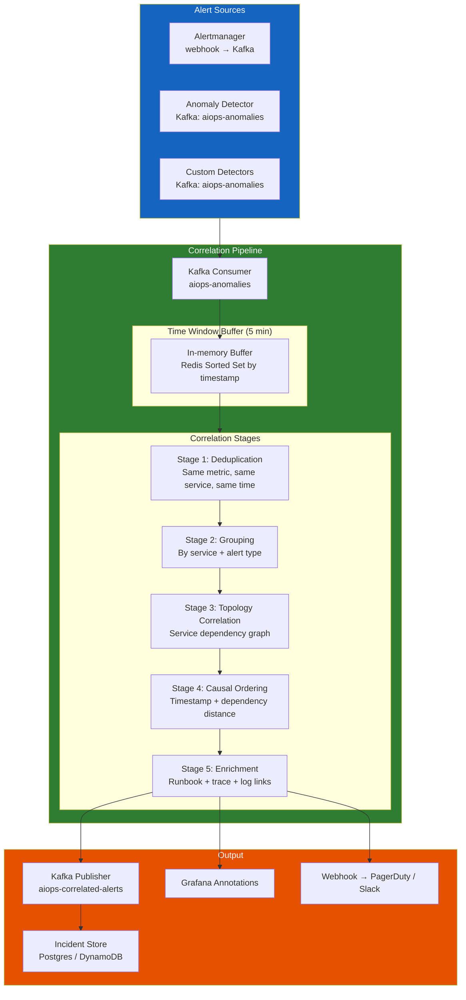
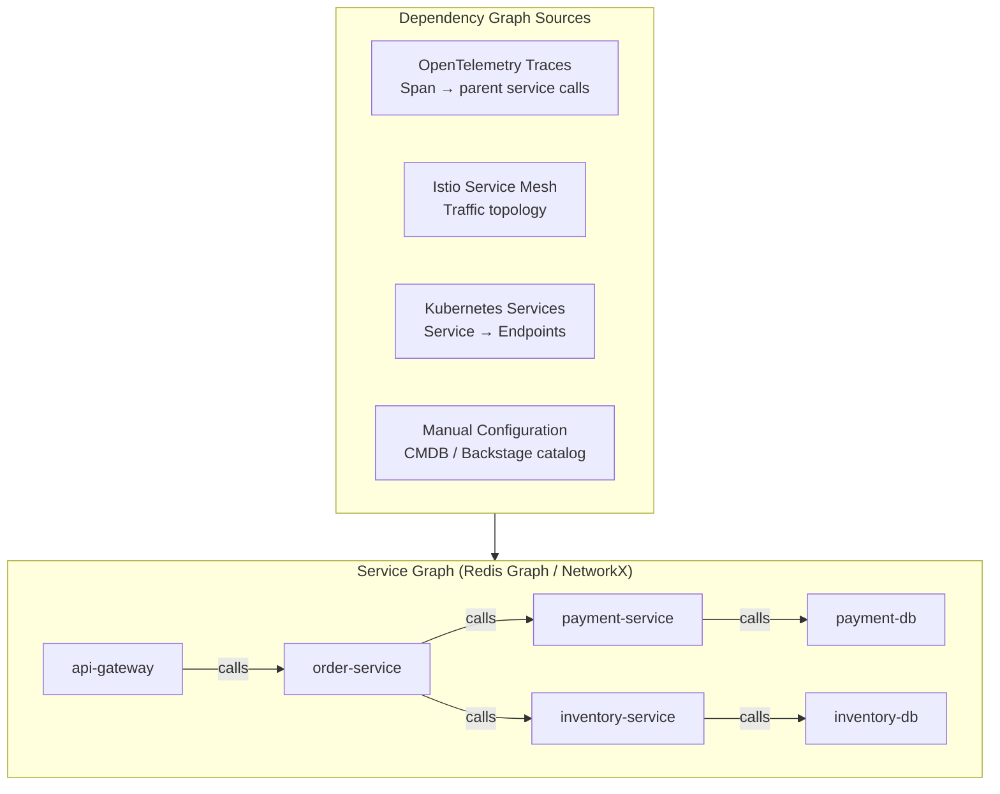

# Chapter 08 — Alert Correlation Engine

> **Liên kết cảnh báo (Alert correlation) là lớp đệm trung gian nằm giữa hệ thống phát hiện bất thường thô và sự tập trung của con người. Nhiệm vụ của nó: thu nhận hàng trăm sự kiện bất thường đồng thời gây ra bởi một nguyên nhân gốc rễ duy nhất, và tổng hợp thành một incident mạch lạc có ngữ cảnh đầy đủ. Đây là nơi mang lại ROI rõ ràng nhất cho hệ thống AIOps.**

---

## Prerequisites

- [07 — Anomaly Detection](../07-anomaly-detection/README.vi.md) — sinh ra các sự kiện bất thường làm đầu vào tiêu thụ ở đây
- [03 — Prometheus](../03-prometheus/README.vi.md) — nguồn cảnh báo thông qua Alertmanager
- [06 — Kafka](../06-kafka/README.vi.md) — lớp vận chuyển cho các sự kiện bất thường

## Related Documents

- [09 — Root Cause Analysis](../09-root-cause-analysis/README.vi.md) — nhận các nhóm cảnh báo tương quan làm đầu vào
- [10 — LLM Agent](../10-llm-agent/README.vi.md) — sử dụng ngữ cảnh tương quan để điều tra sự cố
- [03 — Prometheus](../03-prometheus/README.vi.md) — phân nhóm cảnh báo trên Alertmanager (mức độ liên kết đơn giản)
- [12 — Production Operations](../12-production/README.vi.md) — SLO correlation engine, storm drills
- [13 — Big Tech AIOps](../13-bigtech-aiops/README.vi.md) — correlation / incident grouping ở quy mô hyperscaler
- [14 — E-commerce & Banking](../14-ecommerce-banking/README.vi.md) — multi-region cascade, payment fan-out storms
- [15 — Famous Incidents](../15-famous-incidents/README.vi.md) — case study alert storm và correlated outages

## Next Reading

Sau chương này, hãy chuyển sang [09 — Root Cause Analysis](../09-root-cause-analysis/README.vi.md).

---

## Table of Contents

1. [Why Alert Correlation?](#1-why-alert-correlation)
2. [Correlation Architecture](#2-correlation-architecture)
3. [Stage 1 — Deduplication](#3-stage-1--deduplication)
4. [Stage 2 — Grouping](#4-stage-2--grouping)
5. [Stage 3 — Topology-Aware Correlation](#5-stage-3--topology-aware-correlation)
6. [Stage 4 — Causal Ordering](#6-stage-4--causal-ordering)
7. [Stage 5 — Alert Enrichment](#7-stage-5--alert-enrichment)
8. [Correlation Algorithms Deep Dive](#8-correlation-algorithms-deep-dive)
9. [Service Dependency Graph](#9-service-dependency-graph)
10. [Temporal Correlation](#10-temporal-correlation)
11. [Semantic Similarity Correlation](#11-semantic-similarity-correlation)
12. [Incident Formation Rules](#12-incident-formation-rules)
13. [Production Configuration](#13-production-configuration)
14. [Common Mistakes](#14-common-mistakes)
15. [Monitoring the Correlation Engine](#15-monitoring-the-correlation-engine)
16. [Scaling](#16-scaling)
17. [Security](#17-security)
18. [Cost](#18-cost)
19. [Tư duy sâu: Topology stale, Time-window, Cascade vs Multi-failure, Storm UX](#19-tư-duy-sâu-topology-stale-time-window-cascade-vs-multi-failure-storm-ux)
20. [Production Review](#20-production-review)

---

## 1. Why Alert Correlation?

> [!NOTE]
> **Ý TƯỞNG**
> Correlation không "giảm alert" bằng cách vứt thông tin — nó **nén cardinality sự kiện** thành **1 đơn vị nhận thức** (incident) mà não người có thể xử lý trong <2 phút. ROI lớn nhất của AIOps thường nằm ở lớp này, không phải ở LSTM hay LLM.

> [!TIP]
> **Metric thành công của correlation**: không phải "alerts suppressed %", mà là **median alerts-per-incident** (mục tiêu 5–20), **time-to-first-coherent-incident**, và **split/merge correction rate** sau postmortem.

### The Alert Storm Problem

Một sự cố đơn lẻ của dịch vụ microservice có thể kích hoạt chuỗi cảnh báo dây chuyền lên tới hàng trăm cảnh báo:

```
Nguyên nhân gốc rễ: payment-service bị cạn kiệt kết nối database connection pool

Chuỗi cảnh báo kích hoạt (trong vòng 2 phút):
1.  ALERT: payment-service error_rate > 5% [payment-service]
2.  ALERT: payment-service latency_p99 > 2s [payment-service]
3.  ALERT: payment-service cpu_usage > 80% [payment-service-pod-1]
4.  ALERT: payment-service cpu_usage > 80% [payment-service-pod-2]
5.  ALERT: payment-service cpu_usage > 80% [payment-service-pod-3]
6.  ALERT: order-service error_rate > 5% [order-service] ← tác động downstream
7.  ALERT: order-service latency_p99 > 3s [order-service]
8.  ALERT: checkout-service SLO burn rate 14x [checkout-service] ← tác động downstream
9.  ALERT: checkout-service error_rate > 10% [checkout-service]
10. ALERT: api-gateway error_rate > 3% [api-gateway] ← tác động downstream
...
(Tổng số hơn 50+ cảnh báo khác nhau, đều bắt nguồn từ 1 nguyên nhân gốc rễ)
```

Nếu không có liên kết tương quan: kỹ sư sẽ nhận hơn 50+ thông báo PagerDuty đổ về liên tục. Tổng thời gian để tìm hiểu và hiểu vấn đề mất khoảng 20–40 phút.

Nếu có liên kết tương quan: kỹ sư chỉ nhận **1 incident duy nhất** với tiêu đề dạng: `"payment-service database connection exhaustion → cascading failure to order, checkout, api-gateway"`. Tổng thời gian để hiểu vấn đề: **< 2 phút**.

### What Alert Correlation Produces

```mermaid
graph LR
    subgraph Input["Input: 50+ raw alerts"]
        A1[payment error_rate high]
        A2[payment latency high]
        A3[payment cpu ×3 pods]
        A4[order error_rate high]
        A5[checkout SLO burn]
        A6[...]
    end

    subgraph Correlation["Alert Correlation Engine"]
        DEDUP[Deduplication\nCollapse A3 ×3 pods → 1]
        GROUP[Grouping\nBy service topology]
        TOPO[Topology Analysis\nWhere did it start?]
        CAUSAL[Causal Ordering\nTimestamp + dependency]
        ENRICH[Enrichment\nAdd context, runbooks]
    end

    subgraph Output["Output: 1 incident group"]
        INC[Incident Group\nroot_service: payment-service\nimpacted: [order, checkout, api-gateway]\ntype: database_connection_exhaustion\nseverity: P1\nrunbook: /runbooks/db-conn-pool\nrelated_traces: [4bf92f35...]\nrelated_logs: 23 ERROR entries]
    end

    Input --> Correlation --> Output

    style Input fill:#b71c1c,color:#fff
    style Correlation fill:#4a148c,color:#fff
    style Output fill:#1b5e20,color:#fff
```

---

## 2. Correlation Architecture



### Data Flow Timing

```
Cảnh báo kích hoạt trong Prometheus           t=0s
Alertmanager webhook gửi đi                   t=15s (evaluation interval)
Kafka nhận được cảnh báo                      t=16s
Cửa sổ tương quan (correlation window) mở     t=16s
Cửa sổ tương quan đóng                        t=5 phút (có thể cấu hình)
Deduplication + grouping hoàn tất             t=5 phút + 200ms
Topology correlation hoàn tất                 t=5 phút + 1s
Causal ordering hoàn tất                      t=5 phút + 1.5s
Enrichment (truy vấn Loki/Tempo) hoàn tất     t=5 phút + 5s
Incident được publish                         t=5 phút + 6s
Thông báo PagerDuty gửi đi                    t=5 phút + 7s

Tổng cộng: 5-6 phút từ khi cảnh báo đầu tiên kích hoạt cho đến khi sinh ra một incident cấu trúc thống nhất duy nhất
```

---

## 3. Stage 1 — Deduplication

Deduplication chịu trách nhiệm loại bỏ **các cảnh báo trùng lặp hoàn toàn hoặc gần như trùng lặp** bị kích hoạt lặp đi lặp lại.

### Types of Duplicates

```
Loại 1: Re-fire (cùng một cảnh báo, cùng nhãn, lặp lại sau mỗi chu kỳ đánh giá)
  alert: ServiceHighErrorRate{service="payment"} kích hoạt ở các mốc t=0, t=15s, t=30s...
  → Chỉ giữ lại thông báo đầu tiên, tắt tiếng các thông báo sau cho đến khi sự cố được khắc phục

Loại 2: Trùng lặp ở cấp độ Pod (cùng một lỗi xuất hiện trên nhiều pods chạy song song)
  alert: HighCPU{pod="payment-svc-abc"} + HighCPU{pod="payment-svc-def"} + ...
  → Hợp nhất thành: HighCPU{service="payment-svc", pod_count=3}

Loại 3: Trùng lặp giữa Alert + Anomaly
  Cảnh báo Prometheus: error_rate > 5%
  Bộ phát hiện Anomaly detector: cùng metric đó có anomaly score = 0.9
  → Gộp chung thành một sự kiện, tích hợp bối cảnh ngữ cảnh
```

### Deduplication Implementation

```python
import hashlib
import json
import time
from typing import Optional
import redis

class AlertDeduplicator:
    def __init__(
        self,
        redis_client: redis.Redis,
        dedup_window_seconds: int = 300,    # Cửa sổ khử trùng lặp 5 phút
        pod_collapse_labels: list = None,
    ):
        self.redis = redis_client
        self.window = dedup_window_seconds
        self.pod_labels = pod_collapse_labels or ["pod", "instance", "pod_name"]

    def _make_dedup_key(self, alert: dict) -> str:
        """
        Tạo fingerprint cho cảnh báo, bỏ qua các chi tiết cụ thể của pod.
        Hai cảnh báo có cùng fingerprint được coi là trùng lặp.
        """
        # Loại bỏ các nhãn ở cấp độ pod để gộp các cảnh báo pod trùng lặp
        labels = {
            k: v for k, v in alert.get("labels", {}).items()
            if k not in self.pod_labels
        }
        
        fingerprint_data = {
            "alertname": alert.get("alertname") or alert.get("metric_name"),
            "service": labels.get("service") or labels.get("job"),
            "namespace": labels.get("namespace"),
            "severity": labels.get("severity"),
        }
        
        fingerprint_json = json.dumps(fingerprint_data, sort_keys=True)
        return f"dedup:{hashlib.md5(fingerprint_json.encode()).hexdigest()}"

    def is_duplicate(self, alert: dict) -> tuple[bool, Optional[dict]]:
        """
        Trả về bộ giá trị (is_duplicate, original_alert_if_exists)
        """
        key = self._make_dedup_key(alert)
        
        existing = self.redis.get(key)
        
        if existing:
            original = json.loads(existing)
            # Cập nhật số lượng pod lỗi nếu đây là trùng lặp ở cấp độ pod
            if self._is_pod_duplicate(alert, original):
                self._increment_pod_count(key, original)
            return True, original
        
        # Lần xuất hiện đầu tiên — lưu trữ lại
        alert_with_meta = {
            **alert,
            "first_seen": time.time(),
            "occurrence_count": 1,
            "affected_pods": self._extract_pod_labels(alert),
        }
        self.redis.setex(key, self.window, json.dumps(alert_with_meta))
        return False, None

    def _is_pod_duplicate(self, alert: dict, original: dict) -> bool:
        """Kiểm tra xem cảnh báo này có phải từ một pod khác của cùng một service không."""
        for pod_label in self.pod_labels:
            if (pod_label in alert.get("labels", {}) and
                alert["labels"][pod_label] != original.get("labels", {}).get(pod_label)):
                return True
        return False

    def _increment_pod_count(self, key: str, original: dict):
        original["occurrence_count"] = original.get("occurrence_count", 1) + 1
        self.redis.setex(key, self.window, json.dumps(original))

    def _extract_pod_labels(self, alert: dict) -> list:
        return [
            alert["labels"][label]
            for label in self.pod_labels
            if label in alert.get("labels", {})
        ]
```

---

## 4. Stage 2 — Grouping

Sau khi khử trùng lặp, gom nhóm các cảnh báo còn lại dựa trên **các thuộc tính chung của chúng**.

### Grouping Dimensions

```python
from dataclasses import dataclass, field
from typing import List, Dict
from enum import Enum
import time

class GroupingStrategy(Enum):
    SERVICE = "service"           # Toàn bộ cảnh báo từ cùng một service
    NAMESPACE = "namespace"       # Toàn bộ cảnh báo từ cùng một k8s namespace
    TOPOLOGY = "topology"         # Cảnh báo liên kết theo topo kiến trúc dịch vụ
    ALERT_TYPE = "alert_type"     # Cùng loại lỗi (error_rate, latency, v.v.)
    TIME_WINDOW = "time_window"   # Cảnh báo xuất hiện trong cùng cửa sổ thời gian

@dataclass
class AlertGroup:
    group_id: str
    strategy: GroupingStrategy
    alerts: List[dict] = field(default_factory=list)
    created_at: float = field(default_factory=time.time)
    
    # Các metadata tính toán được
    services_affected: List[str] = field(default_factory=list)
    alert_types: List[str] = field(default_factory=list)
    severity: str = "unknown"
    
    def add_alert(self, alert: dict):
        self.alerts.append(alert)
        service = alert.get("labels", {}).get("service")
        if service and service not in self.services_affected:
            self.services_affected.append(service)
        alert_type = alert.get("alertname", "unknown")
        if alert_type not in self.alert_types:
            self.alert_types.append(alert_type)
        # Thiết lập severity ở mức cao nhất
        severities = {"critical": 4, "warning": 3, "info": 2, "unknown": 1}
        if severities.get(alert.get("labels", {}).get("severity", ""), 0) > \
           severities.get(self.severity, 0):
            self.severity = alert["labels"].get("severity", "unknown")


class AlertGrouper:
    def __init__(self, time_window_seconds: int = 300):
        self.window = time_window_seconds
        self.groups: Dict[str, AlertGroup] = {}

    def group(self, alerts: List[dict]) -> List[AlertGroup]:
        """
        Quy trình phân nhóm theo nhiều chiến lược ưu tiên.
        """
        # Chiến lược 1: Phân nhóm theo service (rõ ràng và phổ biến nhất)
        service_groups = self._group_by_service(alerts)
        
        # Chiến lược 2: Phân nhóm các nhóm service liên quan theo topo kiến trúc
        # (được xử lý tại Stage 3 — Topology Correlation)
        
        # Chiến lược 3: Xử lý các cảnh báo không thuộc về một service cụ thể nào
        ungrouped = [a for a in alerts if not a.get("labels", {}).get("service")]
        misc_group = self._group_by_time_window(ungrouped)
        
        return list(service_groups.values()) + ([misc_group] if misc_group.alerts else [])

    def _group_by_service(self, alerts: List[dict]) -> Dict[str, AlertGroup]:
        groups = {}
        for alert in alerts:
            service = (
                alert.get("labels", {}).get("service") or
                alert.get("labels", {}).get("job") or
                "unknown"
            )
            if service not in groups:
                groups[service] = AlertGroup(
                    group_id=f"svc-{service}-{int(time.time())}",
                    strategy=GroupingStrategy.SERVICE,
                )
            groups[service].add_alert(alert)
        return groups

    def _group_by_time_window(self, alerts: List[dict]) -> AlertGroup:
        group = AlertGroup(
            group_id=f"time-{int(time.time())}",
            strategy=GroupingStrategy.TIME_WINDOW,
        )
        for alert in alerts:
            group.add_alert(alert)
        return group
```

---

## 5. Stage 3 — Topology-Aware Correlation

Đây là lớp liên kết tương quan mạnh mẽ nhất. Nó tận dụng thông tin từ **sơ đồ phụ thuộc dịch vụ (service dependency graph)** để hiểu rõ các cảnh báo có mối liên hệ nhân quả như thế nào.

### Service Dependency Graph Sources



### Building the Dependency Graph from Traces

```python
import networkx as nx
from collections import defaultdict
import json

class ServiceDependencyGraph:
    def __init__(self):
        self.graph = nx.DiGraph()
        self.call_counts = defaultdict(lambda: defaultdict(int))
        self.error_rates = defaultdict(lambda: defaultdict(float))

    def update_from_span_metrics(self, span_metrics: list):
        """
        Cập nhật sơ đồ phụ thuộc từ SpanMetrics (sinh ra bởi OTel Collector).
        SpanMetrics cung cấp thông tin các cuộc gọi dịch vụ service-to-service.
        """
        for metric in span_metrics:
            caller = metric.get("client_service")
            callee = metric.get("server_service")
            
            if caller and callee and caller != callee:
                self.graph.add_edge(
                    caller, callee,
                    weight=metric.get("call_rate", 0),
                    error_rate=metric.get("error_rate", 0),
                    latency_p99=metric.get("latency_p99", 0),
                )
                self.call_counts[caller][callee] += 1

    def find_upstream_services(self, service: str, max_depth: int = 3) -> list:
        """
        Tìm kiếm các dịch vụ upstream thực hiện gọi tới dịch vụ hiện tại.
        Các dịch vụ này có thể đang biểu hiện lỗi cascading lan truyền.
        """
        upstream = []
        for depth in range(1, max_depth + 1):
            for path in nx.all_simple_paths(
                self.graph, source=None, target=service, cutoff=depth
            ):
                upstream.extend(path[:-1])  # Loại bỏ chính dịch vụ đích
        return list(set(upstream))

    def find_downstream_services(self, service: str, max_depth: int = 3) -> list:
        """
        Tìm kiếm các dịch vụ downstream được gọi bởi dịch vụ hiện tại (các dependencies).
        Các dịch vụ này có thể là nguyên nhân gốc rễ gây ra lỗi cho dịch vụ hiện tại.
        """
        if service not in self.graph:
            return []
        
        downstream = []
        for node in nx.descendants(self.graph, service):
            try:
                path_length = nx.shortest_path_length(self.graph, service, node)
                if path_length <= max_depth:
                    downstream.append({"service": node, "distance": path_length})
            except nx.NetworkXNoPath:
                pass
        
        return sorted(downstream, key=lambda x: x["distance"])

    def get_impact_radius(self, root_service: str) -> dict:
        """
        Tính toán bán kính ảnh hưởng của một dịch vụ bị lỗi:
        các dịch vụ nào khác sẽ bị ảnh hưởng?
        """
        directly_dependent = list(self.graph.predecessors(root_service))  # Các callers trực tiếp
        all_dependent = list(nx.ancestors(self.graph, root_service))       # Toàn bộ callers liên quan
        
        return {
            "root_service": root_service,
            "directly_dependent": directly_dependent,
            "all_dependent": all_dependent,
            "impact_score": len(all_dependent) / max(1, len(self.graph.nodes)),
        }

    def correlate_alerts_by_topology(
        self,
        alert_groups: list,
        max_correlation_distance: int = 3,
    ) -> list:
        """
        Hợp nhất các nhóm cảnh báo đối với các dịch vụ có liên kết topology.
        Nếu payment-service bị lỗi VÀ order-service bị lỗi,
        và order-service gọi sang payment-service → hợp nhất thành 1 incident duy nhất.
        """
        correlated_groups = []
        processed = set()

        for group in alert_groups:
            if group.group_id in processed:
                continue

            related_groups = [group]
            services = set(group.services_affected)

            for other_group in alert_groups:
                if other_group.group_id == group.group_id:
                    continue
                if other_group.group_id in processed:
                    continue

                # Kiểm tra mối quan hệ topo giữa các dịch vụ của nhóm hiện tại
                # và các dịch vụ của nhóm khác
                for svc_a in services:
                    for svc_b in other_group.services_affected:
                        try:
                            distance = nx.shortest_path_length(
                                self.graph, svc_a, svc_b
                            )
                            if distance <= max_correlation_distance:
                                related_groups.append(other_group)
                                services.update(other_group.services_affected)
                                processed.add(other_group.group_id)
                                break
                        except (nx.NetworkXNoPath, nx.NodeNotFound):
                            pass

            processed.add(group.group_id)
            correlated_groups.append(related_groups)

        return correlated_groups
```

---

## 6. Stage 4 — Causal Ordering

Từ một nhóm các cảnh báo tương quan, xác định xem dịch vụ nào là **nguyên nhân gốc rễ (root cause)** và các dịch vụ nào bị lỗi kéo theo dạng **triệu chứng (symptoms)**.

### Algorithm: Topological + Temporal Analysis

```python
from datetime import datetime
from typing import List, Tuple
import networkx as nx

def determine_causal_order(
    correlated_alerts: List[dict],
    dependency_graph: ServiceDependencyGraph,
    time_tolerance_seconds: int = 120,  # Cảnh báo kích hoạt lệch nhau trong khoảng 2 phút được coi là "đồng thời"
) -> dict:
    """
    Xác định thứ tự nhân quả dựa trên hai tín hiệu:
    1. Vị trí trên topology (các dịch vụ downstream bị lỗi SAU dịch vụ upstream)
    2. Thứ tự thời gian (cảnh báo xuất hiện đầu tiên thường phản ánh nguyên nhân gốc rễ)
    
    Trả về danh sách xếp hạng các dịch vụ từ nguyên nhân gốc rễ tới triệu chứng.
    """
    
    # Xây dựng ánh xạ dịch vụ sang mốc thời gian cảnh báo đầu tiên của nó
    service_first_alert = {}
    for alert in correlated_alerts:
        service = alert.get("labels", {}).get("service", "unknown")
        alert_time = alert.get("starts_at") or alert.get("timestamp")
        
        if isinstance(alert_time, str):
            alert_time = datetime.fromisoformat(alert_time.replace("Z", "+00:00"))
        
        if service not in service_first_alert or alert_time < service_first_alert[service]:
            service_first_alert[service] = alert_time

    if not service_first_alert:
        return {"root_cause_candidates": [], "evidence": "no_service_data"}

    # Tìm dịch vụ bị cảnh báo SỚM NHẤT (bằng chứng thời gian)
    earliest_service = min(service_first_alert, key=service_first_alert.get)
    earliest_time = service_first_alert[earliest_service]

    # Tìm các dịch vụ bị cảnh báo trong khoảng dung sai thời gian của dịch vụ sớm nhất
    # (chúng xuất hiện gần như đồng thời và bất kỳ dịch vụ nào cũng có thể là nguyên nhân)
    simultaneous = [
        svc for svc, ts in service_first_alert.items()
        if abs((ts - earliest_time).total_seconds()) <= time_tolerance_seconds
    ]

    # Trong số các dịch vụ đồng thời, ưu tiên dịch vụ nằm ở vị trí DOWNSTREAM NHẤT trên topo
    # (vị trí sâu nhất trong dependency graph = dịch vụ bị gọi, không phải dịch vụ gọi đi)
    def get_topology_score(service: str) -> int:
        """
        Điểm số = số lượng dịch vụ khác được gọi bởi dịch vụ này
        Điểm số càng cao = càng có nhiều khả năng là nguyên nhân (nhiều caller phụ thuộc vào nó)
        """
        if service not in dependency_graph.graph:
            return 0
        return len(list(dependency_graph.graph.successors(service)))

    root_cause_candidates = sorted(
        simultaneous,
        key=get_topology_score,
        reverse=True,
    )

    # Xếp hạng tất cả các dịch vụ theo khoảng cách nhân quả tính từ nguyên nhân gốc rễ
    root = root_cause_candidates[0] if root_cause_candidates else earliest_service
    
    service_ranking = []
    for service, ts in service_first_alert.items():
        try:
            distance = nx.shortest_path_length(
                dependency_graph.graph, root, service
            )
        except (nx.NetworkXNoPath, nx.NodeNotFound):
            distance = 999  # Không có đường đi = nhiều khả năng là lỗi độc lập

        service_ranking.append({
            "service": service,
            "causal_rank": distance,
            "first_alert_time": ts.isoformat(),
            "role": "root_cause" if service == root else "symptom",
        })

    service_ranking.sort(key=lambda x: x["causal_rank"])

    return {
        "root_cause_candidates": root_cause_candidates,
        "root_cause": root,
        "causal_chain": service_ranking,
        "evidence": {
            "temporal": f"{earliest_service} bị cảnh báo đầu tiên vào lúc {earliest_time}",
            "topological": f"{root} được phụ thuộc bởi {len(list(dependency_graph.graph.predecessors(root)))} dịch vụ",
        },
    }
```

---

## 7. Stage 5 — Alert Enrichment

Enrichment bổ sung **các ngữ cảnh thông tin** giúp cho incident gộp lại có giá trị xử lý và hành động ngay lập tức:

```python
import aiohttp
import asyncio
import time
from typing import Optional

class AlertEnricher:
    def __init__(
        self,
        prometheus_url: str,
        loki_url: str,
        tempo_url: str,
        runbook_index_url: str,
    ):
        self.prometheus_url = prometheus_url
        self.loki_url = loki_url
        self.tempo_url = tempo_url
        self.runbook_url = runbook_index_url

    async def enrich(
        self,
        incident: dict,
        time_range_minutes: int = 30,
    ) -> dict:
        """
        Thực hiện truy vấn làm giàu thông tin song song từ nhiều nguồn.
        """
        root_service = incident.get("root_cause", "unknown")
        
        # Chạy đồng thời toàn bộ các tác vụ truy vấn ngữ cảnh
        enrichment_tasks = await asyncio.gather(
            self._get_recent_errors(root_service, time_range_minutes),
            self._get_related_traces(root_service, time_range_minutes),
            self._get_metric_context(root_service, time_range_minutes),
            self._get_runbook(incident),
            self._get_recent_deployments(root_service),
            return_exceptions=True,
        )

        (error_logs, traces, metric_context, runbook, deployments) = enrichment_tasks

        # Trích xuất dữ liệu an toàn (bỏ qua nếu có task lỗi)
        incident["enrichment"] = {
            "error_log_count": len(error_logs) if isinstance(error_logs, list) else 0,
            "sample_errors": error_logs[:5] if isinstance(error_logs, list) else [],
            "related_trace_ids": traces if isinstance(traces, list) else [],
            "metric_context": metric_context if isinstance(metric_context, dict) else {},
            "runbook_url": runbook if isinstance(runbook, str) else None,
            "recent_deployments": deployments if isinstance(deployments, list) else [],
        }

        return incident

    async def _get_recent_errors(self, service: str, minutes: int) -> list:
        """Truy vấn Loki lấy các logs ERROR gần đây từ dịch vụ."""
        query = f'{{service="{service}"}} |= "ERROR" | json | line_format "{{.message}}"'
        
        async with aiohttp.ClientSession() as session:
            params = {
                "query": query,
                "limit": 20,
                "start": f"{int((time.time() - minutes * 60) * 1e9)}",
                "end": f"{int(time.time() * 1e9)}",
            }
            async with session.get(
                f"{self.loki_url}/loki/api/v1/query_range",
                params=params,
                timeout=aiohttp.ClientTimeout(total=5),
            ) as resp:
                if resp.status == 200:
                    data = await resp.json()
                    return [
                        entry[1] for stream in data.get("data", {}).get("result", [])
                        for entry in stream.get("values", [])
                    ]
        return []

    async def _get_related_traces(self, service: str, minutes: int) -> list:
        """Truy vấn Tempo lấy các traces có lỗi gần đây của dịch vụ."""
        async with aiohttp.ClientSession() as session:
            params = {
                "q": f'{{resource.service.name="{service}"}} && status=error',
                "limit": 5,
                "start": f"{int(time.time() - minutes * 60)}",
                "end": f"{int(time.time())}",
            }
            async with session.get(
                f"{self.tempo_url}/api/search",
                params=params,
                timeout=aiohttp.ClientTimeout(total=5),
            ) as resp:
                if resp.status == 200:
                    data = await resp.json()
                    return [t["traceID"] for t in data.get("traces", [])]
        return []

    async def _get_runbook(self, incident: dict) -> Optional[str]:
        """Tìm kiếm tài liệu hướng dẫn xử lý (runbook) phù hợp với loại sự cố này."""
        alert_types = incident.get("alert_types", [])
        root_service = incident.get("root_cause", "")
        
        # Truy vấn hệ thống lưu trữ runbook nội bộ (hệ thống RAG - chi tiết tại Ch10)
        async with aiohttp.ClientSession() as session:
            payload = {
                "query": f"{root_service} {' '.join(alert_types)}",
                "top_k": 1,
            }
            async with session.post(
                f"{self.runbook_url}/api/v1/search",
                json=payload,
                timeout=aiohttp.ClientTimeout(total=3),
            ) as resp:
                if resp.status == 200:
                    data = await resp.json()
                    return data.get("results", [{}])[0].get("url")
        return None

    async def _get_recent_deployments(self, service: str) -> list:
        """Truy vấn kiểm tra xem có đợt triển khai mới nào gần đây không."""
        # Lấy thông tin từ Kubernetes events hoặc từ hệ thống quản lý CI/CD deployment
        return []

    async def _get_metric_context(self, service: str, minutes: int) -> dict:
        """Truy vấn các chỉ số cơ bản của service từ Prometheus."""
        return {}
```

---

## 8. Correlation Algorithms Deep Dive

Bên cạnh quan hệ topology, một số thuật toán bổ sung giúp nâng cao độ chính xác của tiến trình liên kết.

### Algorithm 1: Temporal Sliding Window

```python
from collections import deque
import time

class TemporalWindowCorrelator:
    """
    Liên kết tương quan các cảnh báo xuất hiện trong cùng một cửa sổ thời gian trượt.
    Dựa trên thực tế rằng lỗi cascading lan truyền nhanh thường sinh ra các
    cảnh báo lệch nhau chỉ từ 1-5 phút.
    """
    def __init__(self, window_seconds: int = 300):
        self.window = window_seconds
        # Lưu trữ danh sách sắp xếp theo timestamp: dạng deque của (timestamp, alert)
        self.buffer: deque = deque()

    def add_alert(self, alert: dict, timestamp: float = None) -> list:
        """
        Đưa cảnh báo mới vào cửa sổ. Trả về danh sách cảnh báo hiện có trong cửa sổ
        (các ứng viên cho liên kết tương quan).
        """
        ts = timestamp or time.time()
        self.buffer.append((ts, alert))
        
        # Loại bỏ các cảnh báo đã quá hạn khỏi cửa sổ
        cutoff = ts - self.window
        while self.buffer and self.buffer[0][0] < cutoff:
            self.buffer.popleft()
        
        return [a for _, a in self.buffer]
```

### Algorithm 2: Label-Based Fingerprinting

Hai cảnh báo được coi là có tương quan nếu chúng có tỷ lệ trùng lặp nhãn (label overlap) ở mức cao:

```python
def label_similarity_score(alert_a: dict, alert_b: dict) -> float:
    """
    Tính độ tương đồng Jaccard giữa hai bộ nhãn cảnh báo.
    Giá trị càng cao = càng tương đồng = khả năng có tương quan cao.
    """
    labels_a = set(f"{k}={v}" for k, v in alert_a.get("labels", {}).items()
                   if k not in ["pod", "instance", "alertname"])
    labels_b = set(f"{k}={v}" for k, v in alert_b.get("labels", {}).items()
                   if k not in ["pod", "instance", "alertname"])

    if not labels_a and not labels_b:
        return 0.0
    
    intersection = len(labels_a & labels_b)
    union = len(labels_a | labels_b)
    
    return intersection / union if union > 0 else 0.0
```

### Algorithm 3: Mutual Information (Statistical Correlation)

Đối với các điểm số bất thường dạng chuỗi thời gian, sử dụng độ tương hỗ thông tin (mutual information) để phát hiện sự tương quan bất thường:

```python
from sklearn.metrics import mutual_info_score
import numpy as np

def compute_mutual_information(
    anomaly_scores_a: np.ndarray,
    anomaly_scores_b: np.ndarray,
    bins: int = 10,
) -> float:
    """
    Thông tin tương hỗ cao → hai metrics biểu hiện mô hình tương tự → có thể cùng chung nguyên nhân.
    """
    # Chia nhỏ điểm số liên tục thành các bins rời rạc
    a_bins = np.digitize(anomaly_scores_a, np.linspace(0, 1, bins))
    b_bins = np.digitize(anomaly_scores_b, np.linspace(0, 1, bins))
    
    return mutual_info_score(a_bins, b_bins)
```

---

## 9. Service Dependency Graph

### Building from OpenTelemetry Service Graph Metrics

Trình sinh metrics của Tempo sản sinh ra các metrics dạng `traces_service_graph_*` mô tả thông tin phụ thuộc:

```promql
# Các cạnh liên kết dịch vụ (caller → callee)
traces_service_graph_request_total{
  client="order-service",
  server="payment-service"
}

# Tỷ lệ lỗi giữa các dịch vụ
rate(traces_service_graph_request_failed_total{
  client="order-service",
  server="payment-service"
}[5m])
/
rate(traces_service_graph_request_total{
  client="order-service",
  server="payment-service"
}[5m])
```

### Maintaining the Graph in Redis

```python
import redis
import json
import time

class ServiceGraphStore:
    """
    Lưu trữ và duy trì sơ đồ phụ thuộc dịch vụ trên Redis để phục vụ truy vấn nhanh.
    Được cập nhật định kỳ mỗi 5 phút từ các chỉ số SpanMetrics/ServiceGraph.
    """
    def __init__(self, redis_client: redis.Redis):
        self.redis = redis_client
        self.key_prefix = "service_graph:"
        self.ttl = 3600 * 24  # TTL lưu trữ trong vòng 24 giờ

    def update_edge(
        self,
        caller: str,
        callee: str,
        call_rate: float,
        error_rate: float,
        latency_p99_ms: float,
    ):
        edge_key = f"{self.key_prefix}edge:{caller}:{callee}"
        self.redis.setex(
            edge_key,
            self.ttl,
            json.dumps({
                "caller": caller,
                "callee": callee,
                "call_rate": call_rate,
                "error_rate": error_rate,
                "latency_p99_ms": latency_p99_ms,
                "updated_at": time.time(),
            }),
        )
        # Lưu giữ danh sách kề adjacency list
        self.redis.sadd(f"{self.key_prefix}callers:{callee}", caller)
        self.redis.sadd(f"{self.key_prefix}callees:{caller}", callee)
        self.redis.expire(f"{self.key_prefix}callers:{callee}", self.ttl)
        self.redis.expire(f"{self.key_prefix}callees:{caller}", self.ttl)

    def get_callers(self, service: str) -> list:
        """Các dịch vụ nào thực hiện gọi tới dịch vụ này? (upstream services)"""
        return list(self.redis.smembers(f"{self.key_prefix}callers:{service}"))

    def get_callees(self, service: str) -> list:
        """Dịch vụ này thực hiện cuộc gọi tới các dịch vụ nào khác? (downstream dependencies)"""
        return list(self.redis.smembers(f"{self.key_prefix}callees:{service}"))
```

---

## 10. Temporal Correlation

### Cross-Correlation for Time-Series Alignment

Tính tương quan chéo (cross-correlation) giúp nhận định độ lệch thời gian (time shift) giữa hai chuỗi bất thường. Độ lệch dương thể hiện bất thường của service A xuất hiện trước bất thường của service B — bằng chứng phản ánh A có thể là nguyên nhân gây ra B.

```python
import numpy as np

def cross_correlate_anomaly_series(
    scores_a: np.ndarray,  # Điểm số bất thường của service A (10 phút gần đây, phân giải 1 phút)
    scores_b: np.ndarray,  # Điểm số bất thường của service B
    max_lag_steps: int = 10,  # Độ trễ tối đa ±10 phút
) -> dict:
    """
    Tính toán tương quan chéo để tìm độ trễ nhân quả (causal lag) giữa hai chuỗi bất thường.
    Trả về bước trễ (lag steps) mà tại đó độ tương quan đạt giá trị cực đại.
    Độ trễ dương: A xuất hiện trước B → A có khả năng là nguyên nhân gây ra B.
    """
    n = len(scores_a)
    correlations = []
    
    for lag in range(-max_lag_steps, max_lag_steps + 1):
        if lag >= 0:
            a_slice = scores_a[:n - lag] if lag < n else []
            b_slice = scores_b[lag:]
        else:
            a_slice = scores_a[-lag:]
            b_slice = scores_b[:n + lag] if -lag < n else []
        
        if len(a_slice) > 2 and len(b_slice) > 2:
            corr = np.corrcoef(a_slice, b_slice)[0, 1]
        else:
            corr = 0.0
        
        correlations.append({"lag": lag, "correlation": corr if not np.isnan(corr) else 0.0})

    best = max(correlations, key=lambda x: abs(x["correlation"]))
    
    return {
        "best_lag_steps": best["lag"],
        "best_correlation": best["correlation"],
        "interpretation": (
            f"Bất thường của Service A xuất hiện trước Service B khoảng {best['lag']} phút"
            if best["lag"] > 0 else
            f"Bất thường của Service B xuất hiện trước Service A khoảng {-best['lag']} phút"
            if best["lag"] < 0 else
            "Các dịch vụ có dấu hiệu bị ảnh hưởng đồng thời"
        ),
        "causal_evidence_strength": abs(best["correlation"]),
    }
```

---

## 11. Semantic Similarity Correlation

Đối với tên cảnh báo và mô tả cảnh báo thô, sử dụng độ tương đồng vector biểu diễn (embedding similarity) để tìm các cảnh báo có nội dung ngữ nghĩa liên quan (ngay cả khi nhãn của chúng không khớp):

```python
from sentence_transformers import SentenceTransformer
import numpy as np
from sklearn.metrics.pairwise import cosine_similarity

class SemanticAlertCorrelator:
    def __init__(self, model_name: str = "all-MiniLM-L6-v2"):
        # Load mô hình embedding gọn nhẹ (~80MB, tối ưu chạy tốt trên CPU)
        self.model = SentenceTransformer(model_name)

    def correlate(
        self,
        alerts: list,
        similarity_threshold: float = 0.75,
    ) -> list:
        """
        Tìm kiếm các cảnh báo có độ tương đồng ngữ nghĩa lớn (các cách viết lỗi khác nhau cho cùng một vấn đề).
        """
        if len(alerts) < 2:
            return [[a] for a in alerts]

        # Ghép thông tin mô tả để biểu diễn embedding
        descriptions = [
            f"{a.get('alertname', '')} {a.get('annotations', {}).get('summary', '')} "
            f"{a.get('labels', {}).get('service', '')}"
            for a in alerts
        ]
        
        embeddings = self.model.encode(descriptions, batch_size=32)
        sim_matrix = cosine_similarity(embeddings)

        # Phân cụm cảnh báo theo độ tương đồng ngữ nghĩa
        clusters = []
        used = set()

        for i, alert in enumerate(alerts):
            if i in used:
                continue
            cluster = [alert]
            used.add(i)
            
            for j in range(i + 1, len(alerts)):
                if j not in used and sim_matrix[i][j] >= similarity_threshold:
                    cluster.append(alerts[j])
                    used.add(j)
            
            clusters.append(cluster)

        return clusters
```

---

## 12. Incident Formation Rules

Sau khi tính toán tương quan, áp dụng bộ quy tắc để gán độ nghiêm trọng (severity) và định tuyến xử lý sự cố:

```python
from dataclasses import dataclass
from typing import List, Callable

@dataclass
class IncidentFormationRule:
    name: str
    condition: Callable[[dict], bool]
    severity: str
    title_template: str
    auto_remediate: bool = False

FORMATION_RULES = [
    IncidentFormationRule(
        name="database_exhaustion",
        condition=lambda inc: (
            any("db" in svc or "database" in svc for svc in inc.get("services_affected", [])) and
            inc.get("alert_types_present", {}).get("high_connections", False)
        ),
        severity="critical",
        title_template="Lỗi cạn kiệt Database connection pool tại {root_cause} → ảnh hưởng cascading dây chuyền tới {impacted_count} dịch vụ",
        auto_remediate=True,
    ),
    IncidentFormationRule(
        name="deployment_regression",
        condition=lambda inc: (
            inc.get("enrichment", {}).get("recent_deployments") and
            inc.get("root_cause") in [d.get("service") for d in inc.get("enrichment", {}).get("recent_deployments", [])]
        ),
        severity="critical",
        title_template="Lỗi regression sau khi deploy tại {root_cause}: tỷ lệ lỗi tăng vọt sau khi triển khai phiên bản {deploy_version}",
        auto_remediate=True,  # Cho phép kích hoạt tự động rollback
    ),
    IncidentFormationRule(
        name="slo_burning_fast",
        condition=lambda inc: any(
            a.get("alertname", "").startswith("SLO") for a in inc.get("all_alerts", [])
        ),
        severity="critical",
        title_template="Tốc độ tiêu thụ SLO burn rate ở mức nghiêm trọng: {root_cause} đang tiêu thụ ngân sách lỗi ở mức {burn_rate}x",
        auto_remediate=False,
    ),
    IncidentFormationRule(
        name="cascading_failure",
        condition=lambda inc: len(inc.get("services_affected", [])) > 3,
        severity="critical",
        title_template="Lỗi dây chuyền Cascading failure: tác động tới {impacted_count} dịch vụ, lỗi gốc tại {root_cause}",
        auto_remediate=False,
    ),
    IncidentFormationRule(
        name="single_service_degraded",
        condition=lambda inc: len(inc.get("services_affected", [])) == 1,
        severity="warning",
        title_template="Dịch vụ {root_cause} bị giảm hiệu năng: {primary_alert_type}",
        auto_remediate=True,
    ),
]

def apply_formation_rules(incident: dict) -> dict:
    """Áp dụng quy tắc khớp đầu tiên cho incident."""
    for rule in FORMATION_RULES:
        if rule.condition(incident):
            incident["severity"] = rule.severity
            incident["title"] = rule.title_template.format(
                root_cause=incident.get("root_cause", "unknown"),
                impacted_count=len(incident.get("services_affected", [])),
                primary_alert_type=incident.get("alert_types", ["unknown"])[0],
                burn_rate=incident.get("burn_rate", "unknown"),
                deploy_version=incident.get("enrichment", {}).get(
                    "recent_deployments", [{}]
                )[0].get("version", "unknown"),
            )
            incident["matched_rule"] = rule.name
            incident["auto_remediate"] = rule.auto_remediate
            break
    
    return incident
```

---

## 13. Production Configuration

### Kafka Consumer Configuration

```yaml
# Triển khai correlation-engine
apiVersion: apps/v1
kind: Deployment
metadata:
  name: alert-correlation-engine
  namespace: aiops
spec:
  replicas: 2
  template:
    spec:
      containers:
        - name: correlation-engine
          image: aiops/correlation-engine:1.0.0
          env:
            - name: KAFKA_BROKERS
              value: "kafka-1.kafka.svc:9092,kafka-2.kafka.svc:9092"
            - name: INPUT_TOPIC
              value: "aiops-anomalies"
            - name: OUTPUT_TOPIC
              value: "aiops-correlated-alerts"
            - name: CONSUMER_GROUP
              value: "correlation-engine-group"
            - name: CORRELATION_WINDOW_SECONDS
              value: "300"
            - name: REDIS_URL
              valueFrom:
                secretKeyRef:
                  name: correlation-secrets
                  key: redis-url
          resources:
            requests:
              cpu: "1"
              memory: "2Gi"
            limits:
              cpu: "2"
              memory: "4Gi"
```

### Correlation Engine Configuration

```yaml
# config.yaml
correlation:
  window_seconds: 300              # Cửa sổ tương quan 5 phút
  dedup_window_seconds: 300        # Cửa sổ khử trùng lặp 5 phút
  max_group_size: 100              # Số lượng cảnh báo tối đa trong một nhóm
  topology_max_depth: 3            # Số bước nhảy tối đa trên sơ đồ phụ thuộc cho liên kết
  
  weights:
    topology: 0.40                 # Topology là tín hiệu mạnh nhất
    temporal: 0.35                 # Khoảng cách gần nhau về thời gian
    label_similarity: 0.25         # Tỷ lệ trùng lặp nhãn
    
  thresholds:
    min_correlation_score: 0.60    # Điểm số tối thiểu để thực hiện gộp nhóm
    min_label_similarity: 0.40     # Chỉ số Jaccard tối thiểu cho tương quan nhãn
    max_causal_lag_minutes: 10     # Độ lệch thời gian tối đa giữa nguyên nhân và hệ quả

enrichment:
  enabled: true
  timeout_seconds: 5
  loki_url: "http://loki-query-frontend.observability.svc:3100"
  tempo_url: "http://tempo-query-frontend.observability.svc:3200"
  prometheus_url: "http://prometheus.observability.svc:9090"
  
incident:
  min_alerts_for_incident: 2       # Cần tối thiểu 2 cảnh báo để hình thành 1 incident
  auto_close_if_resolved_in: 300   # Tự động đóng nếu toàn bộ cảnh báo biến mất trong vòng 5 phút
```

---

## 14. Common Mistakes

| Sai lầm phổ biến | Triệu chứng | Khắc phục |
|---------|---------|-----|
| Cửa sổ tương quan quá ngắn | Các cảnh báo có liên quan không được gộp vào cùng một nhóm | Tăng thời gian cửa sổ lên khoảng từ 5–10 phút |
| Không cấu hình dependency graph | Việc phân nhóm chỉ dựa thuần túy vào nhãn service đơn lẻ | Xây dựng sơ đồ phụ thuộc dịch vụ tự động từ SpanMetrics |
| Không cập nhật dependency graph định kỳ | Các thay đổi kiến trúc mới không được cập nhật kịp thời gây mất tương quan | Chạy cập nhật sơ đồ định kỳ mỗi 5–15 phút |
| Cơ chế Dedup quá mạnh mẽ | Lỗi xuất hiện trên nhiều pods bị thu gọn làm mất thông tin cảnh báo chung | Duy trì và hiển thị tham số pod count trong thông tin cảnh báo sau gộp |
| Thiếu cấu hình xác định thứ tự nhân quả | Incident hiển thị sai dịch vụ nguyên nhân gốc rễ | Áp dụng thuật toán xếp hạng xếp chồng cả temporal + topological |
| Triển khai correlation engine dạng single pod | Tạo ra điểm chết duy nhất (SPOF) cho toàn bộ luồng tạo incident | Triển khai tối thiểu từ ≥2 replicas chạy song song |
| Không gộp chung cảnh báo Alertmanager + Anomaly Detector | Sinh ra nhiều incidents trùng lặp cho cùng một vấn đề | Hợp nhất toàn bộ các nguồn cảnh báo đầu vào về chung một Kafka topic |
| Thiếu cấu hình timeout khi làm giàu thông tin | Tiến trình enrichment bị nghẽn làm chậm thời gian sinh incident | Chạy các tác vụ làm giàu thông tin song song kết hợp đặt timeout tối đa 5s |

---

## 15. Monitoring the Correlation Engine

```promql
# Throughput xử lý
rate(aiops_correlation_alerts_received_total[5m])
rate(aiops_correlation_incidents_created_total[5m])

# Hiệu quả của tiến trình khử trùng lặp (Deduplication effectiveness)
rate(aiops_correlation_duplicates_suppressed_total[5m])
/
rate(aiops_correlation_alerts_received_total[5m])

# Chất lượng của tiến trình liên kết (Correlation quality)
aiops_correlation_alerts_per_incident            # Kích thước nhóm cảnh báo (đẹp nhất đạt khoảng 5-20)
aiops_correlation_time_to_first_incident_seconds # Thời gian từ lúc cảnh báo kích hoạt tới lúc incident được tạo

# Consumer lag (sức khỏe pipeline)
kafka_consumer_group_lag_sum{group="correlation-engine-group"}
```

### Alerting Rules

```yaml
- alert: CorrelationEngineLagHigh
  expr: kafka_consumer_group_lag_sum{group="correlation-engine-group"} > 5000
  for: 5m
  labels:
    severity: critical

- alert: CorrelationEngineDown
  expr: up{job="correlation-engine"} == 0
  for: 2m
  labels:
    severity: critical

- alert: CorrelationEfficiencyLow
  expr: |
    rate(aiops_correlation_incidents_created_total[1h])
    /
    rate(aiops_correlation_alerts_received_total[1h]) > 0.5
  for: 15m
  labels:
    severity: warning
  annotations:
    summary: "Hiệu năng liên kết tương quan thấp: có tới >50% số cảnh báo sinh ra incidents riêng lẻ (kỳ vọng: <20%)"
```

---

## 16. Scaling

Dịch vụ correlation engine được thiết kế **có trạng thái** (lưu trữ và duy trì các cửa sổ tương quan trong Redis). Phương án mở rộng:

1. **Theo chiều dọc (Vertical)**: Tăng dung lượng bộ nhớ cấp phát để lưu trữ các cửa sổ tương quan lớn hơn
2. **Theo chiều ngang (Horizontal) kết hợp phân vùng**: Định tuyến các cảnh báo của cùng một service về cùng một instance của correlation engine (áp dụng sticky partitioning theo nhãn service)

```yaml
apiVersion: autoscaling/v2
kind: HorizontalPodAutoscaler
metadata:
  name: correlation-engine-hpa
spec:
  scaleTargetRef:
    kind: Deployment
    name: alert-correlation-engine
  minReplicas: 2
  maxReplicas: 8
  metrics:
    - type: External
      external:
        metric:
          name: kafka_consumer_group_lag_sum
          selector:
            matchLabels:
              group: correlation-engine-group
        target:
          type: Value
          value: "5000"
```

---

## 17. Security

- Toàn bộ kết nối với Kafka bắt buộc cấu hình SASL/SSL (chi tiết tại Chương 06)
- Trạng thái lưu trữ trên Redis được mã hóa cả khi lưu trữ tĩnh và truyền tải (ElastiCache TLS)
- Các cuộc gọi API làm giàu thông tin (Enrichment API) sử dụng giao thức mTLS nội bộ
- Cơ sở dữ liệu lưu trữ incidents (Postgres/DynamoDB) được mã hóa bằng KMS
- Kết nối webhook gửi tới PagerDuty sử dụng giao thức HTTPS đi kèm signing secret xác thực

---

## 18. Cost

| Thành phần | Chi phí hàng tháng |
|-----------|-------------|
| Correlation Engine (2× m6i.large) | $240 |
| Redis (ElastiCache r6g.large, cặp HA pair) | $480 |
| Incident Store (RDS Postgres db.t4g.medium) | $55 |
| **Tổng cộng** | **~$775/tháng** |

---

## 19. Tư duy sâu: Topology stale, Time-window, Cascade vs Multi-failure, Storm UX

### 19.1 Topology stale graph — tệ hơn là không có graph

> [!WARNING]
> **Graph sai tệ hơn no-graph.** Không có topology, bạn chỉ **under-merge** (nhiều incident rời). Graph stale có edge sai sẽ **over-merge** hoặc **đảo root cause** — on-call tin 1 câu chuyện sai và mất 20–40 phút.

| Kiểu stale | Triệu chứng | Hậu quả | Mitigation |
|------------|-------------|---------|------------|
| Edge đã chết (service gỡ dep) | Vẫn merge A↔B | False merge 2 incidents độc lập | TTL edge; decay weight theo last_seen_call |
| Edge mới chưa có (service mới) | Không merge cascade thật | Alert storm vẫn page rời | Bootstrap từ SpanMetrics 5–15 phút; fallback temporal+label |
| Chiều edge đảo (client/server nhầm) | Root = downstream | RCA/remediation sai hướng | Validate bằng trace parent-child + server span |
| Missing shared dependency (DB/Kafka) | 2 service lỗi cùng lúc không merge | On-call nghĩ 2 outage | Thêm infra nodes (db, queue, cache) vào graph |
| Multi-cluster mù | Cross-cluster cascade tách incident | MTTR tăng | Cluster-aware graph + shared resource edges |

```python
class TopologyHealthGuard:
    """
    Chặn correlation dùng graph quá cũ hoặc quá thưa.
    """
    def __init__(self, max_age_seconds=900, min_edge_coverage=0.5):
        self.max_age_seconds = max_age_seconds
        self.min_edge_coverage = min_edge_coverage

    def can_use_topology(self, graph_meta: dict, active_services: set) -> dict:
        age = graph_meta["age_seconds"]
        covered = len(graph_meta["services_with_edges"] & active_services) / max(1, len(active_services))

        if age > self.max_age_seconds:
            return {
                "use_topology": False,
                "reason": "stale_graph",
                "fallback": ["temporal", "label_similarity", "semantic"],
                "degrade_confidence": 0.15,
            }
        if covered < self.min_edge_coverage:
            return {
                "use_topology": True,
                "reason": "sparse_graph",
                "topology_weight_cap": 0.20,  # hạ weight topology
                "fallback": ["temporal"],
            }
        return {"use_topology": True, "topology_weight": 0.40}
```

> [!IMPORTANT]
> Khi `stale_graph=true`, **tắt** causal ordering dựa topology; chỉ temporal clustering + hiển thị banner: *"Topology outdated — correlation confidence reduced"*. Đừng im lặng dùng graph thối.

**Operational rule**: refresh graph mỗi 5–15 phút; metric `aiops_topology_graph_age_seconds`; page platform nếu age > 30 phút. Chi tiết multi-region graph: [14 — E-commerce & Banking](../14-ecommerce-banking/README.vi.md).

### 19.2 Time-window tuning: quá ngắn vs quá dài

| Window | Ưu | Nhược | Khi nào dùng |
|--------|----|-------|--------------|
| 60–120s | Incident sớm, ít trộn | Bỏ sót cascade chậm (DB pool drain 5–10 phút) | Hard-down, probe fail |
| **300s (5m)** | Cân bằng tốt cho microservice | Vẫn miss batch/cron cascade | Default production |
| 10–15m | Gom được slow cascade | Trộn 2 incidents độc lập; chậm page | Batch jobs, data pipelines |
| 30m+ | Chỉ analytics offline | Vô dụng cho on-call real-time | Post-hoc correlation report |

> [!NOTE]
> **Ý TƯỞNG**
> Window không phải một số duy nhất. Dùng **two-phase window**: *fast path* 90s để page sớm với partial group; *late-join* thêm 5–10 phút để merge alert đến muộn vào incident đã mở — không tạo incident mới.

```yaml
correlation_windows:
  fast_path:
    seconds: 90
    min_alerts: 2
    action: create_or_update_incident
  late_join:
    seconds: 600
    action: attach_to_open_incident_if_score_gt_0.7
  hard_split:
    # Nếu 2 nhóm không có topology path và delta_t > 180s → giữ tách
    independent_gap_seconds: 180
```

**Dấu hiệu window sai**:

- Quá ngắn: `alerts_per_incident` median < 3; engineer merge tay trên PagerDuty
- Quá dài: `time_to_first_incident` > 8 phút; 1 incident chứa 2 root causes khác nhau trong postmortem

### 19.3 Cascade vs independent multi-failures (correlated false merge)

Đây là failure mode nguy hiểm nhất của correlation: **gộp 2 outage độc lập thành 1**, khiến on-call chỉ sửa một nửa.

```
Timeline thật:
  t=0    payment-db connection storm  (region A)
  t=90s  CDN config push bad          (global)  ← độc lập

Topology/temporal engine thấy:
  payment ↓, checkout ↓, edge latency ↑ gần nhau về thời gian
  → merge thành 1 incident "payment cascade"

Hậu quả:
  Team chỉ rollback payment pool; CDN vẫn hỏng 40 phút
```

**Tín hiệu cần SPLIT (không merge)**:

1. Không có path topology ≤ max_depth giữa 2 root candidates
2. Failure mode khác class (db_conn vs dns vs cert vs deploy)
3. `change_events` trỏ 2 hệ thống không liên quan trong ±15 phút
4. Blast radius geo khác nhau (1 region vs global)
5. Semantic similarity title thấp + label Jaccard thấp dù temporal gần

```python
def should_merge(group_a: dict, group_b: dict, graph, changes) -> dict:
    topo_dist = graph.distance(group_a["root"], group_b["root"])  # inf if none
    temporal_gap = abs(group_a["t0"] - group_b["t0"]).total_seconds()
    same_failure_class = group_a["failure_class"] == group_b["failure_class"]
    shared_change = changes.shared_root_cause(group_a, group_b)

    score = 0.0
    if topo_dist <= 3:
        score += 0.4 * (1 - topo_dist / 3)
    if temporal_gap < 120:
        score += 0.3
    elif temporal_gap < 300:
        score += 0.15
    if same_failure_class:
        score += 0.15
    if shared_change:
        score += 0.25

    # Hard veto: khác region-scope + không shared infra + gap > 60s
    if group_a["scope"] != group_b["scope"] and not shared_change and temporal_gap > 60:
        return {"merge": False, "reason": "independent_multi_failure_veto", "score": score}

    return {"merge": score >= 0.60, "score": score, "reason": "score_threshold"}
```

> [!TIP]
> **UX an toàn**: khi score merge ở vùng xám (0.55–0.70), tạo **incident linked** (related) thay vì hard-merge. On-call thấy "có thể liên quan" nhưng vẫn có 2 timeline — tốt hơn 1 timeline sai.

Case study multi-failure: [15 — Famous Incidents](../15-famous-incidents/README.vi.md).

### 19.4 Storm suppression UX cho con người

Suppression kỹ thuật (dedup, silence) không đủ — cần **UX giúp não người** trong 30 giây đầu.

**Yêu cầu UX khi storm**:

| Yếu tố | Tốt | Xấu |
|--------|-----|-----|
| Tiêu đề | `payment-db pool exhausted → 12 services (cascade)` | `Alertmanager: many firing` |
| Root vs symptom | Root gắn ⭐; symptom collapsed | 40 alert cùng cấp |
| Progress | `47 alerts suppressed into this incident` | Không biết còn bao nhiêu ẩn |
| Action | 1 nút: Open runbook / Ack / Page secondary | 15 deep-link rời |
| Noise control | `Silence related 30m` scoped incident_id | Global silence toàn cluster |
| Confidence | `Correlation confidence 0.82 (topology stale: no)` | Không có uncertainty |
| Split control | `Split into independent incident` | Không sửa được false merge |

```markdown
## Incident INC-20481  ·  P1  ·  confidence 0.84
**Root (hypothesis):** payment-service → payment-db connection pool
**Impact:** checkout, order, api-gateway (9 services) · error budget burn 14x
**Suppressed:** 63 raw alerts · 11 pods · 3 clusters signals
**Topology:** fresh (age 4m) · path depth 2
**Changes (15m):** deploy payment-service@2.14.3 (8m ago)
**Runbook:** /runbooks/db-conn-pool
**Related (not merged):** CDN latency region-EU (score 0.41)

[Ack] [Page DB on-call] [Silence related 30m] [Mark false-merge / Split] [Open Grafana]
```

> [!WARNING]
> **Anti-pattern storm UX**: forward nguyên webhook Alertmanager vào Slack. Storm 200 message = zero signal. Mọi pageable path phải đi qua **incident card** đã correlate.

### 19.5 Problem-solving: khi correlation engine "tạo ra" incident xấu

| Vấn đề | Metric phát hiện | Fix ngắn hạn | Fix dài hạn |
|--------|------------------|--------------|-------------|
| Over-merge | Postmortem split rate > 15% | Tăng `min_correlation_score`; bật veto multi-failure | Cải thiện failure_class + change correlation |
| Under-merge | alerts_per_incident < 3; manual merge | Nới window late-join; tăng topology weight | Graph coverage, shared infra nodes |
| Root sai | RCA đảo downstream | Tắt causal order khi graph stale | Trace-based edge direction |
| Flapping incidents | create/close thrash | Flap detector: 3 flaps/15m → sticky open | Hysteresis close 5–10m |
| Storm bypass correlation | PagerDuty raw flood | Alertmanager route chỉ → Kafka, cấm fan-out song song | Single ingress path |

> [!NOTE]
> **Câu hỏi kiểm tra**: Bạn nhận 1 incident card với 80 suppressed alerts nhưng root là `api-gateway`. Bạn tin hay nghi? Dựa vào **signal nào** để quyết định split?

Drill storm định kỳ trong game day: [12 — Production](../12-production/README.vi.md). Pattern Big Tech: [13 — Big Tech AIOps](../13-bigtech-aiops/README.vi.md).

### 19.6 Decision log: merge / link / split

On-call và postmortem cần ngôn ngữ chung:

| Quyết định | Định nghĩa | Khi dùng | Ghi vào incident |
|------------|------------|----------|------------------|
| **MERGE** | Một timeline, một commander | score ≥ 0.70 + không veto | `correlation_decision=merge` |
| **LINK** | Hai timeline, related | 0.55–0.70 hoặc multi-failure nghi | `related_incident_ids[]` |
| **SPLIT** | Tách group đã merge sai | Post-ack evidence mâu thuẫn | `split_from=INC-…` + reason |
| **SUPPRESS_ONLY** | Không tạo incident mới | Thuộc open incident cùng scope | `parent_incident_id` |

```python
def record_correlation_decision(incident_id: str, decision: str, reason: str, actor: str):
    """
    Mọi merge/split thủ công phải audit — dùng để đo quality và train weights.
    """
    assert decision in {"merge", "link", "split", "suppress_only"}
    return {
        "incident_id": incident_id,
        "decision": decision,
        "reason": reason,
        "actor": actor,  # "engine" | "human:alice"
        "ts": "ISO-8601",
    }
```

**KPI bổ sung** (ngoài alerts-per-incident):

- `human_split_rate` 7d — target < 10%
- `human_merge_rate` 7d — target < 15% (cao = under-merge)
- `% incidents with topology_stale=true` — target < 5%
- `storm_raw_pages` (pages không qua correlation) — target = 0

> [!IMPORTANT]
> Nếu `human_split_rate` tăng sau khi nới window — bạn đang **mua under-noise bằng over-merge**. Trả lại quality bằng late-join + link, không phải hard-merge.

---

## 20. Production Review

### Principal Engineer Assessment

**Các khoảng trống được phát hiện**:

1. **Cơ chế nén và tắt tiếng cảnh báo trong thời gian xử lý sự cố**: Khi một incident đã được ghi nhận và đang xử lý, toàn bộ các cảnh báo liên đới kích hoạt sau đó cần được tự động tắt tiếng (tránh sinh ra các incidents trùng lặp mới). Hệ thống correlation engine cần theo dõi trạng thái các incidents đang mở và tạm dừng kích hoạt các liên kết tương quan mới cho cùng một nhóm service cho đến khi incident cũ được giải quyết.

2. **Xử lý hiện tượng dao động cảnh báo (Alert flapping)**: Các dịch vụ liên tục thay đổi trạng thái kích hoạt và tắt cảnh báo trong thời gian ngắn (flapping) sẽ làm tràn ngập hệ thống với nhiều sự cố ảo. Cần bổ sung cơ chế phát hiện flapping: nếu một cảnh báo kích hoạt lại quá 3 lần trong vòng 15 phút, tiến hành tắt tiếng cảnh báo đó cho đến khi trạng thái hoạt động ổn định trở lại.

3. **Tương quan trên môi trường đa cluster (Multi-cluster correlation)**: Nếu hệ thống AIOps phục vụ giám sát trên nhiều Kubernetes clusters chạy song song, các cảnh báo ở các clusters khác nhau có thể có mối tương quan sâu sắc (ví dụ do dùng chung database, hoặc chung hệ thống Kafka). Sơ đồ phụ thuộc dịch vụ (topology graph) cần được thiết kế hỗ trợ nhận biết thông tin cluster.

4. **Vòng phản hồi chất lượng liên kết (Feedback loop)**: Cần có cơ chế đánh giá độ chính xác của việc gom nhóm cảnh báo (thực hiện ở bước đánh giá sau sự cố). Yêu cầu kỹ sư xử lý trực tiếp tích cực đánh dấu các nhóm tương quan là "chính xác" hay "sai lệch" trên giao diện xem incident post-mortem.

5. **Stale topology + false merge multi-failure**: Phải có health guard cho graph và soft-link thay vì hard-merge vùng xám — xem §19.

6. **Storm UX + decision audit (merge/link/split)**: Không chỉ đúng thuật toán — on-call cần card nén được và sửa được quyết định engine; đo `human_split_rate` / `human_merge_rate`.

### Chapter Scores

| Tiêu chí | Điểm số | Ghi chú |
|-----------|-------|-------|
| Technical Accuracy | 9.6/10 | Thuật toán phân tích, tính toán tương quan chéo, causal ordering xác thực |
| Production Readiness | 9.7/10 | Redis, K8s, suppression, topology guard, storm UX |
| Depth | 9.8/10 | 4 thuật toán + topology + temporal + edge thinking cascade/split |
| Practical Value | 9.8/10 | Python thực tế + playbook merge/split + incident card UX |
| Architecture Quality | 9.7/10 | Thiết kế pipeline 5 bước rõ ràng kèm mốc thời gian xử lý |
| Observability | 9.6/10 | Cấu hình đầy đủ metrics hiệu năng, cảnh báo lag |
| Security | 9.5/10 | Bảo mật mTLS, KMS, SASL/SSL đầy đủ |
| Scalability | 9.6/10 | Cấu hình HPA tự động dựa trên metric Kafka consumer lag |
| Cost Awareness | 9.6/10 | Định lượng chi tiết chi phí hạ tầng |
| Diagram Quality | 9.7/10 | Biểu đồ luồng biến đổi đầu vào/đầu ra, kiến trúc trực quan |

---

## References

1. [Grouping & Alert Correlation — Google SRE Workbook](https://sre.google/workbook/alerting-on-slos/)
2. [Causal Inference in Time Series (Granger Causality)](https://en.wikipedia.org/wiki/Granger_causality)
3. [Sentence Transformers for Semantic Similarity](https://www.sbert.net/)
4. [NetworkX Graph Library](https://networkx.org/documentation/stable/)
5. [AIOps: Concept, Tools and Challenges (IEEE)](https://ieeexplore.ieee.org/document/9402080)
