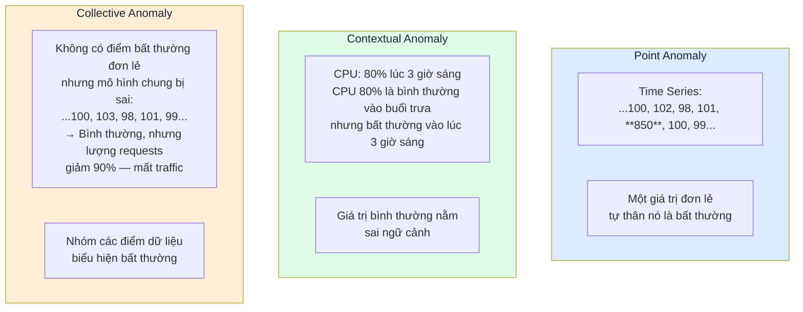
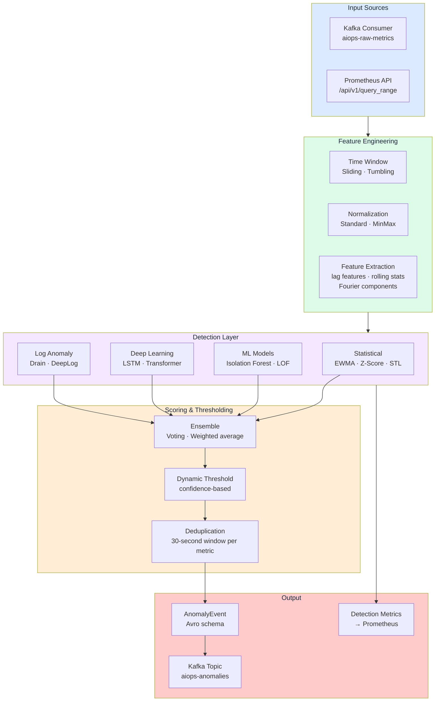
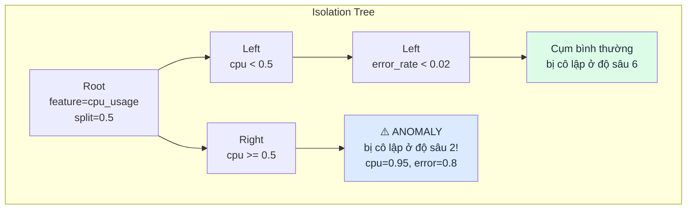
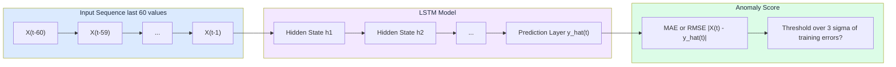
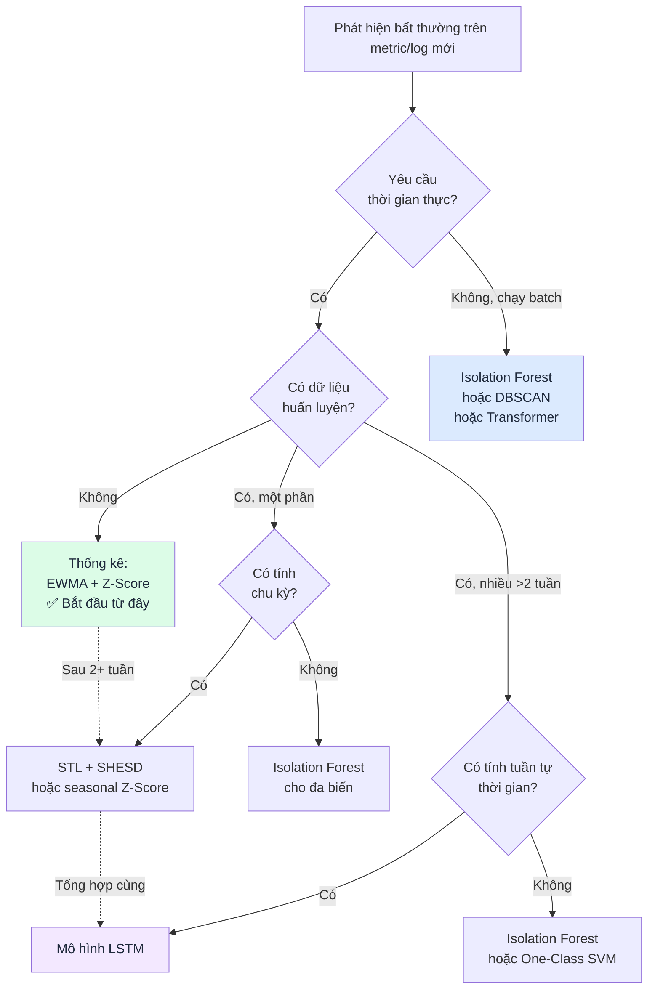
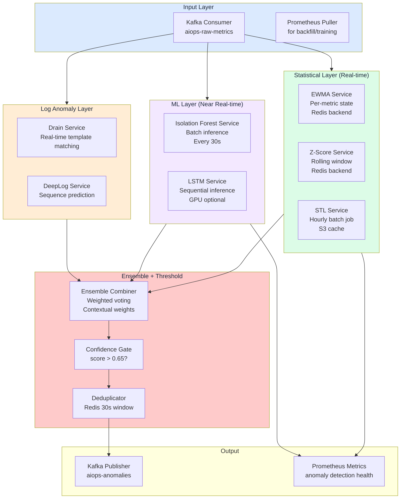
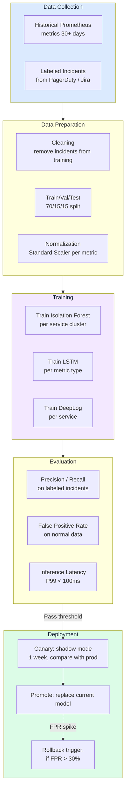

# Chapter 08 — Anomaly Detection

> **Phát hiện bất thường (Anomaly detection) là lớp thông minh đầu tiên của pipeline AIOps. Nó chuyển đổi telemetry thô thành các tín hiệu có giá trị thực thi — phát hiện các sai lệch so với hành vi bình thường trên metrics, logs, và traces. Chương này đề cập đến mọi thuật toán từ EWMA đến deep learning dựa trên Transformer, kèm theo các đánh giá sự đánh đổi trong production cho mỗi loại.**

---

## Prerequisites

- [01 — Observability](../01-observability/README.vi.md) — các loại metric, cấu trúc log
- [03 — Prometheus](../03-prometheus/README.vi.md) — sử dụng PromQL để trích xuất đặc trưng (feature extraction)
- [07 — Kafka](../07-kafka/README.vi.md) — tiêu thụ telemetry, đẩy các sự kiện bất thường (anomaly events)

## Related Documents

- [09 — Alert Correlation](../09-alert-correlation/README.vi.md) — nhận các sự kiện bất thường
- [10 — Root Cause Analysis](../10-root-cause-analysis/README.vi.md) — sử dụng ngữ cảnh bất thường
- [11 — LLM Agent](../11-llm-agent/README.vi.md) — sử dụng tín hiệu bất thường phục vụ điều tra sự cố
- [13 — Production Operations](../13-production/README.vi.md) — vận hành detector trên production, SLO platform
- [14 — Big Tech AIOps](../14-bigtech-aiops/README.vi.md) — cách Google/Meta/Netflix vận hành detection ở quy mô lớn
- [15 — E-commerce & Banking](../15-ecommerce-banking/README.vi.md) — seasonality Black Friday, compliance, latency-critical detection
- [16 — Famous Incidents](../16-famous-incidents/README.vi.md) — case study drift/deploy-induced false alarms trong sự cố thực

## Next Reading

Sau chương này, hãy chuyển sang [09 — Alert Correlation](../09-alert-correlation/README.vi.md).

---

## Table of Contents

1. [Anomaly Detection Overview](#1-anomaly-detection-overview)
2. [The Detection Pipeline](#2-the-detection-pipeline)
3. [EWMA — Exponentially Weighted Moving Average](#3-ewma--exponentially-weighted-moving-average)
4. [Z-Score and Modified Z-Score](#4-z-score-and-modified-z-score)
5. [STL Decomposition](#5-stl-decomposition)
6. [Seasonal Hybrid ESD (SHESD)](#6-seasonal-hybrid-esd-shesd)
7. [Isolation Forest](#7-isolation-forest)
8. [DBSCAN — Density-Based Clustering](#8-dbscan--density-based-clustering)
9. [Local Outlier Factor (LOF)](#9-local-outlier-factor-lof)
10. [One-Class SVM](#10-one-class-svm)
11. [LSTM for Time-Series Anomaly Detection](#11-lstm-for-time-series-anomaly-detection)
12. [Transformer-Based Detection](#12-transformer-based-detection)
13. [Log Anomaly Detection — Drain Algorithm](#13-log-anomaly-detection--drain-algorithm)
14. [Log Anomaly Detection — DeepLog](#14-log-anomaly-detection--deeplog)
15. [Algorithm Selection Guide](#15-algorithm-selection-guide)
16. [Feature Engineering](#16-feature-engineering)
17. [Production Architecture](#17-production-architecture)
18. [Model Training and Retraining Pipeline](#18-model-training-and-retraining-pipeline)
19. [False Positive Management](#19-false-positive-management)
20. [Common Mistakes](#20-common-mistakes)
21. [Monitoring the Detection System](#21-monitoring-the-detection-system)
22. [Scaling](#22-scaling)
23. [Security](#23-security)
24. [Cost](#24-cost)
25. [Tư duy sâu: Drift, Ensemble, Feedback Loop & Khi nào KHÔNG dùng ML](#25-tư-duy-sâu-drift-ensemble-feedback-loop--khi-nào-không-dùng-ml)
26. [Production Review](#26-production-review)

---


## Cách đọc chapter này (concept-first)

> [!IMPORTANT]
> **Đọc concept trước — code để sau**
> Từ chapter 08 trở đi, handbook ưu tiên: **vấn đề → ý tưởng → input data → thuật toán/model → output → ưu/nhược → khi nào dùng**. Phần implementation nằm trong khối **See the code below** (bấm mới mở). Mục tiêu: bạn hiểu *tại sao và hoạt động ra sao trên telemetry AIOps*, không chỉ copy-paste.

| Bước đọc | Câu hỏi |
|----------|---------|
| 1. Vấn đề | Detector/engine này giải quyết pain gì (false positive, cascade, MTTR…)? |
| 2. Ý tưởng | Trực giác 2–3 câu, không công thức |
| 3. Data in | Metric/log/trace/event nào, window nào, feature nào? |
| 4. Thuật toán | Các bước tính toán / model flow |
| 5. Output | Schema sự kiện, score, rank, action proposal? |
| 6. Trade-off | Ưu / nhược / chi phí / giải thích được không? |
| 7. When | Dùng khi nào — và khi nào **đừng** dùng |

---

## 1. Anomaly Detection Overview


*Poster: ensemble detect → correlation → RCA → LLM agent → một incident card.*

> [!NOTE]
> **Ý TƯỞNG**
> Anomaly detection không phải là "càng nhạy càng tốt". Nhiệm vụ thật sự là **tối đa hóa tín hiệu có thể hành động** (actionable signal) trong khi **giữ alert fatigue dưới ngưỡng tin cậy của on-call**. Một detector recall 99% nhưng precision 40% sẽ bị mute trong 2 tuần. Hãy tối ưu theo **precision-at-page** trước, rồi mới mở rộng recall.

> [!TIP]
> **Vì sao static threshold vẫn sống sót?**
> Threshold tĩnh rẻ, giải thích được, audit được, và đủ tốt cho SLO burn-rate rõ ràng. ML thắng khi baseline **thay đổi theo mùa, theo deploy, theo tenant**. Nếu metric có ngưỡng vật lý rõ (disk 95%, cert expire 14 ngày) — đừng ép ML.

### What Is an Anomaly?

Một điểm bất thường (anomaly) là **một điểm dữ liệu sai lệch đáng kể so với hành vi kỳ vọng**. Trong AIOps, bất thường được chia làm ba loại:



### Why Static Thresholds Fail

```
Cảnh báo ngưỡng tĩnh (Static threshold): cảnh báo nếu cpu_usage > 80%

Các vấn đề:
1. Vào lúc 3 giờ sáng (traffic thấp): CPU 60% đã là mức nghiêm trọng
2. Vào ngày Black Friday (traffic tăng 10 lần): CPU 90% là bình thường và chấp nhận được
3. Sau một đợt deploy tối ưu hóa CPU: CPU 60% kích hoạt cảnh báo nhưng thực tế lại là một cải tiến
4. Lỗi rò rỉ bộ nhớ (memory leak) chậm: không bao giờ vượt ngưỡng cho đến khi xảy ra lỗi OOM, khi đó đã quá muộn

Kết quả: Tỷ lệ dương tính giả (false positive) lên tới 70% đối với các cảnh báo ngưỡng tĩnh (trung bình toàn ngành)
```

**Phát hiện bất thường động (Dynamic anomaly detection)**: Kích hoạt cảnh báo khi giá trị sai lệch đáng kể so với **giá trị kỳ vọng tại thời điểm này, đối với dịch vụ này, dưới các điều kiện cụ thể này**.

### The AIOps Detection Stack

```
Thống kê (Nhanh, không cần huấn luyện, tốt cho các bất thường được định nghĩa rõ ràng)
├── EWMA              → làm mịn xu hướng, phát hiện thay đổi đột ngột
├── Z-Score           → các điểm ngoại lai so với giá trị trung bình/độ lệch chuẩn lịch sử
└── STL + SHESD       → bất thường theo mùa (theo giờ trong ngày, ngày trong tuần)

Machine Learning (Tốt hơn cho các mô hình phức tạp, yêu cầu dữ liệu huấn luyện)
├── Isolation Forest  → đa biến, không yêu cầu giả định phân phối dữ liệu
├── DBSCAN            → dựa trên phân cụm, tìm kiếm các vùng bình thường có mật độ cao
├── LOF               → dựa trên mật độ, tốt cho các cụm có mật độ khác nhau
└── One-Class SVM     → học biên giới hạn của dữ liệu bình thường

Deep Learning (Mạnh mẽ nhất, tốn kém nhất, yêu cầu lượng dữ liệu lớn)
├── LSTM             → các mô hình tuần tự, sự phụ thuộc theo thời gian
├── Transformer      → sự phụ thuộc tầm xa, độ chính xác tốt nhất
└── Autoencoder      → sai số tái cấu trúc (reconstruction error) đóng vai trò là điểm bất thường

Chuyên biệt cho Log
├── Drain            → phân tích logs thành các templates, phát hiện các templates mới xuất hiện
└── DeepLog          → dự đoán sự kiện log tiếp theo, gắn cờ các chuỗi sự kiện bất thường
```

---

## 2. The Detection Pipeline



### Pipeline Step Details

| Bước xử lý | Đầu vào | Đầu ra | Độ trễ | Kịch bản lỗi |
|------|-------|--------|---------|--------------|
| Nhận dữ liệu từ Kafka | Telemetry thô | Python dict | <10ms | Consumer lag: bị chậm tiến trình |
| Trích xuất đặc trưng | Raw dict | Numpy array | 1–50ms | Lỗi bộ nhớ: cửa sổ thời gian quá lớn |
| Phát hiện bằng thống kê | Đặc trưng (Features) | Điểm số 0–1 | 1–5ms | Cold start: lịch sử trống |
| Phát hiện bằng ML | Đặc trưng (Features) | Điểm số 0–1 | 5–50ms | Mô hình cũ: hiện tượng trôi (drift) |
| Phát hiện bằng DL | Đặc trưng (Features) | Điểm số 0–1 | 50–500ms | Yêu cầu GPU ở quy mô lớn |
| Tổng hợp (Ensemble) | Nhiều điểm số | Điểm số cuối cùng | <1ms | — |
| Phân ngưỡng + khử trùng lặp | Điểm số | AnomalyEvent hoặc None | <1ms | — |
| Đẩy dữ liệu lên Kafka | AnomalyEvent | — | 10–100ms | Broker down: lưu tạm cục bộ |

---

## 3. EWMA — Exponentially Weighted Moving Average

> [!NOTE]
> **Ý TƯỞNG**
> EWMA trả lời một câu hỏi cho mỗi metric: *điểm này có lệch xa so với kỳ vọng vừa có không?* Đây là baseline thích ứng online — không phải mô hình seasonality, cũng không phải detector đa biến.

### Vấn đề giải quyết

Ngưỡng tĩnh không bám theo baseline thay đổi dần (tăng trưởng, deploy, mở rộng capacity). EWMA cho **baseline rẻ, luôn bật, không cần train**, bắt spike/drop ngay trên luồng.

### Ý tưởng cốt lõi (intuition)

EWMA là một bộ lọc đơn giản theo dõi **trung bình trượt (moving average)**, trong đó các quan sát gần đây có sức ảnh hưởng lớn hơn các quan sát cũ hơn. Đây là nền tảng của tất cả các thuật toán ngưỡng thích ứng (adaptive threshold).

Có thể hiểu đơn giản là: "Ước lượng tốt nhất của tôi về giá trị hiện tại là sự kết hợp có trọng số giữa ước lượng trước đó và quan sát mới nhất." Đồng thời theo dõi phương sai phần dư theo cách tương tự, rồi gắn cờ khi phần dư vượt *k* độ lệch chuẩn thích ứng.

### Input data trên pipeline AIOps

| Khía cạnh | Lựa chọn điển hình |
|-----------|-------------------|
| Loại tín hiệu | Metric số univariate (CPU, error rate, latency p99, RPS, độ dài queue) |
| Nguồn | Kafka `aiops-raw-metrics` hoặc Prometheus scrape / query |
| Nhịp | Mẫu 5s–1m; detector cập nhật **từng điểm** (streaming) |
| Window / state | **Không buffer lịch sử** — chỉ `S_t` và `variance_t` (O(1) mỗi metric) |
| Feature | Giá trị thô; có thể pre-smooth hoặc rate (`rate()`, `irate()`) |
| Warm-up | Bỏ qua alert ~`min_periods` quan sát đầu (ví dụ 30) |

> [!TIP]
> Một instance EWMA **cho mỗi khóa (service, metric, labels quan trọng)**. Chia sẻ state giữa tenant sẽ trộn baseline và tăng false positive.

### Thuật toán hoạt động từng bước

1. Điểm đầu: `S = X`, variance `= 0`, trả "initializing".
2. Phần dư: `r_t = X_t − S_{t−1}`.
3. Cập nhật variance: `v_t = α r_t² + (1−α) v_{t−1}`.
4. Cập nhật baseline: `S_t = α X_t + (1−α) S_{t−1}`.
5. Nếu còn warm-up → không alert.
6. `z = |r_t| / √v_t`; bất thường nếu `z > k` (thường `k = 3`).
7. Score ≈ `min(z / k, 1)`; ghi `direction` spike/drop.

### Formula

```
S_t = α × X_t + (1 - α) × S_{t-1}

Trong đó:
  S_t   = Giá trị EWMA tại thời điểm t (ước lượng được làm mịn)
  X_t   = Giá trị quan sát tại thời điểm t
  S_{t-1} = Giá trị EWMA trước đó
  α     = Hệ số làm mịn (smoothing factor) (0 < α < 1)
```

**Điểm bất thường (Anomaly score)** (sai lệch so với EWMA):

```
residual_t = X_t - S_{t-1}    # Độ lệch của giá trị hiện tại so với dự đoán EWMA
variance_t = α × residual_t² + (1 - α) × variance_{t-1}   # EWMA của bình phương các sai số
std_dev_t = sqrt(variance_t)

# Xác định bất thường nếu sai lệch vượt quá ngưỡng tính theo độ lệch chuẩn
anomaly = |residual_t| > k × std_dev_t   # k = 3 là phổ biến (quy tắc 3-sigma)
```

### Effect of α Parameter

```
Hệ số α cao (gần bằng 1): Trọng số lớn hơn cho các quan sát gần đây
  → Phản ứng nhanh với các thay đổi
  → Nhạy cảm hơn với nhiễu
  → Rủi ro: dương tính giả đối với các biến động tự nhiên

Hệ số α thấp (gần bằng 0): Trọng số lớn hơn cho các quan sát lịch sử
  → Phản ứng chậm với thay đổi
  → Loại bỏ nhiễu tốt hơn
  → Rủi ro: bỏ lỡ các sự cố phát triển nhanh

Các giá trị phổ biến:
  α = 0.1: Rất mịn, phản ứng chậm (tốt cho các metrics ổn định)
  α = 0.3: Cân bằng
  α = 0.7: Phản ứng nhanh (tốt cho các metrics biến động mạnh)
```

**Tự động tinh chỉnh α** dựa trên độ biến động tự nhiên của metric:

<details>
<summary><strong>See the code below — bấm để xem code (đọc concept trước)</strong></summary>

```python
# Tự động điều chỉnh α dựa trên hệ số biến thiên
def auto_tune_alpha(historical_data: np.ndarray) -> float:
    """
    Các metrics có độ biến động tự nhiên cao cần alpha thấp hơn (làm mịn nhiều hơn)
    Các metrics có độ biến động thấp cần alpha cao hơn (phản ứng nhanh hơn)
    """
    cv = np.std(historical_data) / np.mean(historical_data)  # Hệ số biến thiên
    
    if cv < 0.05:     # Rất ổn định (ví dụ: số lượng kết nối cơ sở dữ liệu)
        return 0.7    # Phản ứng nhanh với các thay đổi
    elif cv < 0.2:    # Ổn định trung bình (ví dụ: CPU dưới tải ổn định)
        return 0.3
    elif cv < 0.5:    # Biến động (ví dụ: request rate)
        return 0.1
    else:             # Biến động mạnh (ví dụ: độ dài hàng đợi khi có spike traffic)
        return 0.05
```

</details>

### Python Implementation

<details>
<summary><strong>See the code below — bấm để xem code (đọc concept trước)</strong></summary>

```python
import numpy as np
from dataclasses import dataclass
from typing import Optional

@dataclass
class EWMADetector:
    alpha: float = 0.3          # Hệ số làm mịn
    k: float = 3.0              # Ngưỡng (k × std_dev)
    min_periods: int = 30       # Số lượng quan sát tối thiểu trước khi đánh giá

    # Trạng thái (được lưu trữ qua các cuộc gọi)
    ewma: Optional[float] = None
    ewma_var: Optional[float] = None
    n_observations: int = 0

    def update(self, value: float) -> dict:
        """
        Cập nhật trạng thái EWMA và trả về kết quả đánh giá bất thường.
        """
        self.n_observations += 1

        # Khởi tạo ở lượt quan sát đầu tiên
        if self.ewma is None:
            self.ewma = value
            self.ewma_var = 0.0
            return {"anomaly": False, "score": 0.0, "reason": "initializing"}

        # Tính toán sai số (prediction error)
        residual = value - self.ewma

        # Cập nhật ước lượng phương sai
        self.ewma_var = self.alpha * (residual ** 2) + (1 - self.alpha) * self.ewma_var

        # Cập nhật ước lượng giá trị trung bình
        self.ewma = self.alpha * value + (1 - self.alpha) * self.ewma

        # Cần đủ dữ liệu lịch sử tối thiểu để phát hiện chính xác
        if self.n_observations < self.min_periods:
            return {"anomaly": False, "score": 0.0, "reason": "warming_up"}

        std_dev = np.sqrt(self.ewma_var) if self.ewma_var > 0 else 1e-10
        z_score = abs(residual) / std_dev
        anomaly_score = min(z_score / self.k, 1.0)  # Chuẩn hóa về khoảng 0-1

        return {
            "anomaly": z_score > self.k,
            "score": anomaly_score,
            "z_score": z_score,
            "ewma": self.ewma,
            "std_dev": std_dev,
            "residual": residual,
            "direction": "spike" if residual > 0 else "drop",
        }

# Ví dụ sử dụng
detector = EWMADetector(alpha=0.3, k=3.0)

for timestamp, cpu_value in metric_stream:
    result = detector.update(cpu_value)
    
    if result["anomaly"]:
        publish_anomaly_event(
            metric="cpu_usage",
            timestamp=timestamp,
            score=result["score"],
            algorithm="ewma",
            baseline=result["ewma"],
            current=cpu_value,
        )
```

</details>

### Output

| Trường | Ý nghĩa |
|--------|---------|
| `anomaly` | bool — `z > k` sau warm-up |
| `score` | 0–1 — mức nghiêm trọng chuẩn hóa (`z / k` có cap) |
| `z_score`, `residual`, `ewma`, `std_dev` | Giải thích cho on-call / RCA |
| `direction` | `spike` hoặc `drop` |
| Sự kiện | Publish `AnomalyEvent` với `algorithm=ewma`, metric, service, timestamp, baseline vs current |

### Ưu / nhược

| Ưu điểm/Nhược điểm | Chi tiết |
|--------|---------|
| ✅ Không yêu cầu dữ liệu huấn luyện | Hoạt động ngay lập tức trên các metrics mới |
| ✅ Độ phức tạp bộ nhớ O(1) | Chỉ lưu trữ giá trị ewma và ewma_var, không cần lưu toàn bộ lịch sử |
| ✅ Độ phức tạp tính toán O(1) | Chỉ một phép nhân-cộng trên mỗi lần quan sát |
| ✅ Thích ứng với sự trôi dần (gradual drift) | Nếu CPU tăng dần qua các tuần, EWMA sẽ tự thích ứng đi theo |
| ❌ Nhạy cảm với tính chu kỳ (seasonality) | Sự sụt giảm traffic lúc 3 giờ sáng sẽ bị coi là bất thường |
| ❌ Không hỗ trợ phát hiện đa biến | Mỗi metric được đánh giá độc lập |
| ❌ Phản ứng chậm với các sai lệch trung bình kéo dài | Đòi hỏi sai lệch phải đạt k-sigma |

### Khi nào dùng / khi nào KHÔNG dùng

| Dùng khi | **Không** dùng khi |
|----------|---------------------|
| Cần first-pass trên hàng nghìn metric | Seasonality ngày/tuần mạnh (dùng STL/SHESD) |
| Spike/drop rõ, path streaming, budget latency chặt | Lỗi kết hợp đa metric (dùng Isolation Forest) |
| Cold-start / service mới không có train set | Rò rỉ chậm nằm mãi trong dải thích ứng |
| Cần page P1 giải thích được trên tín hiệu univariate | Cần p-value / kiểm soát multi-anomaly (dùng SHESD) |

> [!WARNING]
> Sau sự cố thật, EWMA **hấp thụ** baseline cao. Không có hysteresis, cooldown hay freeze-on-alert thì độ nhạy sụt trong incident và giai đoạn recovery dễ bị coi là "bình thường" quá sớm.

**Vận hành trong thực tế**: EWMA là lựa chọn lý tưởng làm **bộ lọc vòng đầu (first-pass filter)** cho toàn bộ metrics. Nhanh, rẻ, không cần huấn luyện. Sử dụng cho các cảnh báo P1 đối với các đột biến rõ ràng. Kết hợp với STL để hiệu chỉnh các yếu tố chu kỳ theo mùa.

---

## 4. Z-Score and Modified Z-Score

> [!NOTE]
> **Ý TƯỞNG**
> Z-score hỏi: *điểm này lệch bao nhiêu "độ rộng" so với tâm cửa sổ?* Mean/std cổ điển dễ hỏng vì outlier cũ; **modified Z (median + MAD)** là mặc định an toàn cho sliding window trên production.

### Vấn đề giải quyết

Cần rule đơn giản, audit được: "giá trị này cực đoan so với lịch sử gần đây." Không train, dễ giải thích postmortem; multi-window bắt cả spike nhanh lẫn drift chậm.

### Ý tưởng cốt lõi (intuition)

So sánh giá trị hiện tại với **phân phối tham chiếu ước lượng từ cửa sổ thời gian**. Z chuẩn dùng mean và std. Modified Z dùng **median** và **MAD** để vài spike cũ không phình scale và che incident kế tiếp.

### Input data trên pipeline AIOps

| Khía cạnh | Lựa chọn điển hình |
|-----------|-------------------|
| Loại tín hiệu | Metric univariate (cùng họ EWMA) |
| Nguồn | Rolling buffer từ Prometheus `query_range` hoặc Kafka + ring buffer |
| Window | Thường: 5m (nhanh), 1h (mặc định), 24h / 7d (drift / tuần) |
| Feature | Giá trị thô hoặc transform cùng thang; thống nhất đơn vị trong window |
| State | Toàn bộ mẫu trong window (O(window) memory mỗi khóa metric) |
| Labels | Đánh giá theo series; không trộn pod/tenant trừ khi cố ý |

### Thuật toán hoạt động từng bước

**Standard Z-Score**

1. Lấy lịch sử cửa sổ `H = {x₁…xₙ}`.
2. μ = mean(H), σ = std(H).
3. `Z = (X − μ) / σ`.
4. Bất thường nếu `|Z| > ngưỡng` (thường 2.5–4.0).

**Modified Z-Score (robust)**

1. `median = median(H)`, `MAD = median(|xᵢ − median|)`.
2. Nếu MAD = 0: mọi lệch khỏi hằng số lịch sử là bất thường.
3. `M = 0.6745 × |X − median| / MAD`.
4. Bất thường nếu `|M| > 3.5` (mặc định phổ biến).
5. Score ≈ `min(|M| / 3.5, 1)`; giữ direction so với median.

### Standard Z-Score

```
Z = (X - μ) / σ

Trong đó:
  X = Giá trị quan sát
  μ = Giá trị trung bình của cửa sổ lịch sử (ví dụ: 1 giờ gần nhất)
  σ = Độ lệch chuẩn của cửa sổ lịch sử
```

**Bất thường nếu |Z| > ngưỡng** (thường từ 2.5–4.0 tùy thuộc vào độ nhạy yêu cầu).

**Vấn đề**: Standard Z-score **không bền vững trước các điểm ngoại lai (outliers)**. Nếu cửa sổ lịch sử chứa sẵn các điểm ngoại lai, giá trị μ và σ sẽ bị méo mó, làm giảm độ nhạy của bộ phát hiện đối với các bất thường trong tương lai.

### Modified Z-Score (Robust)

```
M = 0.6745 × (X - median) / MAD

Trong đó:
  MAD = Median Absolute Deviation (Độ lệch tuyệt đối trung vị) = median(|X_i - median(X)|)
  0.6745 = Hệ số tỷ lệ (giúp MAD tương thích với độ lệch chuẩn đối với dữ liệu phân phối chuẩn)
```

**Bất thường nếu |M| > 3.5**

<details>
<summary><strong>See the code below — bấm để xem code (đọc concept trước)</strong></summary>

```python
import numpy as np

def modified_z_score(
    history: np.ndarray,
    current_value: float,
    threshold: float = 3.5,
) -> dict:
    """
    Modified Z-Score: bền vững với các điểm ngoại lai trong cửa sổ lịch sử.
    Tốt nhất cho các cửa sổ nhỏ (15-60 phút) có khả năng chứa các bất thường cũ.
    """
    median = np.median(history)
    mad = np.median(np.abs(history - median))

    if mad == 0:
        # Tất cả các giá trị lịch sử giống hệt nhau — bất kỳ sai lệch nào cũng là bất thường
        if current_value != median:
            return {"anomaly": True, "score": 1.0, "reason": "deviation_from_constant"}
        return {"anomaly": False, "score": 0.0}

    modified_z = 0.6745 * abs(current_value - median) / mad

    return {
        "anomaly": modified_z > threshold,
        "score": min(modified_z / threshold, 1.0),
        "modified_z": modified_z,
        "median": median,
        "mad": mad,
        "direction": "spike" if current_value > median else "drop",
    }
```

</details>

### Z-Score Window Selection

| Kích thước cửa sổ | Độ trễ phát hiện | Rủi ro dương tính giả | Trường hợp sử dụng |
|-------------|------------------|---------------------|---------|
| 5 phút | Nhanh | Cao (số lượng mẫu thấp) | Chỉ dùng cho cảnh báo thời gian thực |
| 1 giờ | Trung bình | Trung bình | **Tiêu chuẩn cho production** |
| 24 giờ | Chậm | Thấp | Phát hiện hiện tượng trôi (drift) chậm |
| 7 ngày | Rất chậm | Rất thấp | Xác định baseline chu kỳ hàng tuần |

**Mẫu thiết kế trong production**: Sử dụng đồng thời nhiều cửa sổ thời gian khác nhau:
<details>
<summary><strong>See the code below — bấm để xem code (đọc concept trước)</strong></summary>

```python
# Cấu hình đa cửa sổ cho Z-Score
scores = {}
for window in [5, 60, 1440]:  # 5 phút, 1 giờ, 24 giờ
    history = get_history_window(metric, minutes=window)
    scores[f"z_{window}m"] = modified_z_score(history, current_value)

# Kích hoạt cảnh báo nếu bất kỳ cửa sổ nào phát hiện bất thường
# Cửa sổ ngắn = cảnh báo nhanh (tỷ lệ FP cao hơn)
# Cửa sổ dài = cảnh báo chậm hơn (tỷ lệ FP thấp hơn, độ tin cậy cao hơn)
```

</details>

### Output

| Trường | Ý nghĩa |
|--------|---------|
| `anomaly` | bool từ ngưỡng trên `|Z|` hoặc `|M|` |
| `score` | 0–1 mức nghiêm trọng chuẩn hóa |
| `modified_z` / `z`, `median` hoặc `μ`, `mad` hoặc `σ` | Baseline để giải thích |
| `direction` | spike nếu trên tâm, drop nếu dưới |
| Sự kiện | `algorithm=zscore` hoặc `modified_zscore`, độ dài window, định danh metric |

### Ưu / nhược

| Ưu/Nhược | Chi tiết |
|----------|---------|
| ✅ Toán học minh bạch | Dễ audit và dạy on-call |
| ✅ Không cần train | Chỉ cần sliding window |
| ✅ Multi-window | Góc nhìn nhanh + chậm cùng series |
| ✅ Modified Z robust | Sống sót khi history bị nhiễm outlier |
| ❌ Yếu với seasonality | Peak giờ làm việc trông "cực đoan" |
| ❌ Chỉ univariate | Không thấy lỗi kết hợp CPU+error |
| ❌ Chọn window then chốt | Quá ngắn → ồn; quá dài → trễ và pha loãng |
| ❌ Giả định spread gần dừng | Đổi regime cần re-baseline |

### Khi nào dùng / khi nào KHÔNG dùng

| Dùng khi | **Không** dùng khi |
|----------|---------------------|
| Cần detection first-line giải thích được | Seasonality đa thang mạnh (ưu tiên STL/SHESD) |
| History có thể chứa spike cũ (→ modified Z) | Vector feature chiều cao (IF / OC-SVM) |
| Ensemble multi-window với EWMA | Bất thường sequence log (Drain/DeepLog) |
| Cần rule thống kê đơn giản cho compliance | Số mẫu trong window quá ít (σ không ổn định) |

> [!TIP]
> Công thức production mặc định: **modified Z 1h** để page, **5m** chỉ shadow/urgency cao, **24h** tăng confidence — page khi window ngắn cực đoan *và* window trung bình đồng thuận, hoặc severity rất cao.

---

## 5. STL Decomposition

> [!NOTE]
> **Ý TƯỞNG**
> STL không "detect" một mình — nó **gỡ cấu trúc kỳ vọng** (trend + season) để detector phần dư (MAD, Z, ESD) chỉ thấy phần bất ngờ. Peak ban ngày không còn trông như bug khi đó là seasonal.

### Vấn đề giải quyết

Chu kỳ giờ làm việc / ngày / tuần khiến EWMA/Z-score bắn mỗi sáng peak và bỏ lỡ giá trị "trung bình" ban đêm vốn đã nghiêm trọng. STL tách **nhịp điệu kỳ vọng** khỏi **bất thường phần dư thật**.

### Ý tưởng cốt lõi (intuition)

Nhiều metrics mang **tính chu kỳ theo mùa (seasonal patterns)**: cao hơn trong giờ làm việc, thấp hơn vào ban đêm. Đột biến vào các giờ cao điểm ngày trong tuần. Thuật toán Z-score tĩnh không tính đến điều này — nó sẽ gắn cờ hoạt động traffic cao điểm ban ngày là bất thường khi so sánh với giá trị trung bình 24 giờ.

**STL** (Seasonal and Trend decomposition using Loess) phân tách chuỗi thời gian thành:

```
Metric = Trend + Seasonal + Residual

Trong đó:
  Trend:    Xu hướng dài hạn (CPU tăng dần qua các tuần)
  Seasonal: Thành phần lặp lại theo chu kỳ (mô hình hàng ngày/hàng tuần)
  Residual: Phần dư còn lại sau khi loại bỏ xu hướng và chu kỳ — đây là phần chúng ta sử dụng để phát hiện bất thường
```

```
Dữ liệu gốc:  [50, 45, 40, 70, 80, 85, 75, 50, 45, 40, 200, ...]
                                                          ↑ điểm bất thường
Sau phân tách:
Trend:     [50, 50, 50, 50, 50, 50, 50, 51, 51, 51, 51, ...]
Seasonal:  [-5, -10, -15, +20, +30, +35, +25, -5, -10, -15, -15, ...]
Residual:  [5, 5, 5, 0, 0, 0, 0, 4, 4, 4, 164, ...]  ← 164 rõ ràng là bất thường!
```

### Input data trên pipeline AIOps

| Khía cạnh | Lựa chọn điển hình |
|-----------|-------------------|
| Loại tín hiệu | Metric seasonal: RPS, volume checkout, CPU theo traffic, duration job batch |
| Nguồn | Series đều từ Prometheus (ưu tiên scrape interval cố định) |
| Độ dài history | Tối thiểu ≥ **2× period**; production thường **7 ngày** |
| Period | Ví dụ 288 điểm cho 24h @ 5m; 7×288 nếu cần weekly |
| Nhịp | Re-fit mỗi 15–60 phút; chấm điểm điểm mới trên component đã cache |
| Feature | Một series (có thể log1p nếu đuôi nặng) |

> [!WARNING]
> Lỗ hổng scrape làm lệch pha seasonality. Nội suy hoặc đánh dấu gap; đừng nối im lặng timestamp lệch nhịp vào STL.

### Thuật toán hoạt động từng bước

1. Ghép window đều (ví dụ 7 ngày @ 5m).
2. Fit STL (thường `robust=True`) → `trend`, `seasonal`, `residual`.
3. Ước lượng scale residual bằng MAD (robust với spike còn sót).
4. Ngưỡng ≈ `k × MAD × 1.4826` (MAD → đơn vị gần σ).
5. Score = `|residual| / threshold`; bất thường nếu score > 1.
6. Cache seasonal+trend; điểm streaming: residual ≈ `x − trend_est − seasonal_tại_pha` đến lần re-fit sau.

### STL Implementation

<details>
<summary><strong>See the code below — bấm để xem code (đọc concept trước)</strong></summary>

```python
from statsmodels.tsa.seasonal import STL
import numpy as np
import pandas as pd

class STLDetector:
    def __init__(
        self,
        period: int = 288,       # 24 giờ với khoảng cách 5 phút (288 điểm)
        seasonal: int = 7,       # Băng thông bộ làm mịn chu kỳ (phải là số lẻ)
        trend: int = None,       # Bộ làm mịn xu hướng (None = tự động: phải > period)
        threshold_multiplier: float = 3.0,
    ):
        self.period = period
        self.seasonal = seasonal
        self.trend = trend
        self.threshold = threshold_multiplier

    def detect(self, values: pd.Series) -> pd.DataFrame:
        """
        Phát hiện bất thường sử dụng phân tách STL.
        Yêu cầu tối thiểu 2×period quan sát để có kết quả tin cậy.
        """
        if len(values) < 2 * self.period:
            raise ValueError(f"Yêu cầu tối thiểu {2 * self.period} quan sát, hiện có {len(values)}")

        # Khớp mô hình STL
        stl = STL(
            values,
            period=self.period,
            seasonal=self.seasonal,
            trend=self.trend,
            robust=True,          # Bền vững với các điểm ngoại lai khi fitting
        )
        result = stl.fit()

        # Phần dư (Residuals) là những gì còn lại sau khi loại bỏ trend + seasonal
        residuals = result.resid

        # Tính toán robust threshold cho bất thường từ phần dư
        mad = np.median(np.abs(residuals - np.median(residuals)))
        threshold = self.threshold * mad * 1.4826  # Đưa MAD về đơn vị độ lệch chuẩn

        # Anomaly score: trị tuyệt đối của phần dư đã chuẩn hóa
        anomaly_scores = np.abs(residuals) / threshold

        return pd.DataFrame({
            "original": values,
            "trend": result.trend,
            "seasonal": result.seasonal,
            "residual": residuals,
            "anomaly_score": anomaly_scores,
            "anomaly": anomaly_scores > 1.0,
        }, index=values.index)


# Vận hành trong thực tế: chạy rolling STL với dữ liệu lịch sử 7 ngày
def detect_streaming(metric_name: str, current_window: pd.Series) -> dict:
    detector = STLDetector(
        period=288,           # 24 giờ ở độ phân giải 5 phút
        seasonal=7,
        threshold_multiplier=3.5,
    )
    
    result = detector.detect(current_window)
    latest = result.iloc[-1]
    
    return {
        "anomaly": bool(latest["anomaly"]),
        "score": float(latest["anomaly_score"]),
        "trend": float(latest["trend"]),
        "seasonal_component": float(latest["seasonal"]),
        "residual": float(latest["residual"]),
        "algorithm": "stl",
    }
```

</details>

### STL Latency and Compute

| Kích thước cửa sổ | Số điểm dữ liệu (khoảng cách 5 phút) | Thời gian STL Fit | Bộ nhớ tiêu thụ |
|-------------|------------------------|--------------|--------|
| 24 giờ | 288 | ~5ms | ~50KB |
| 7 ngày | 2016 | ~30ms | ~350KB |
| 30 ngày | 8640 | ~150ms | ~1.5MB |

**Mẹo vận hành**: Thực hiện tính toán STL trên cửa sổ dữ liệu 7 ngày, re-fit định kỳ mỗi 1 giờ (không chạy trên mỗi điểm dữ liệu mới nhận được). Cache kết quả phân tách và chỉ áp dụng tính toán phần dư cho các điểm dữ liệu mới.

### Output

| Trường | Ý nghĩa |
|--------|---------|
| `anomaly` | bool — residual vượt ngưỡng robust |
| `score` | `|residual| / threshold` (thường clip cho ensemble) |
| `trend`, `seasonal_component`, `residual` | Series phân rã cho dashboard / RCA |
| Sự kiện | `algorithm=stl`, period, fit window, định danh metric |

### Ưu / nhược

| Ưu/Nhược | Chi tiết |
|----------|---------|
| ✅ Xử lý seasonality ngày/tuần | Peak giờ cao điểm hết vĩnh viễn FP |
| ✅ Tách drift chậm (trend) khỏi shock | Detection tập trung residual |
| ✅ Có robust fit | Ít bị vài spike cướp mô hình |
| ❌ Cần history dày đều | Gap và cold start gây hại |
| ❌ Nặng hơn EWMA/Z | Chi phí fit tăng theo window |
| ❌ Period phải đúng/ổn định | Sai period → residual rác |
| ❌ Univariate | Vẫn từng series một |

### Khi nào dùng / khi nào KHÔNG dùng

| Dùng khi | **Không** dùng khi |
|----------|---------------------|
| Metric gắn traffic có chu kỳ rõ | Metric phẳng/ngẫu nhiên (EWMA đủ) |
| Cần chấm residual dưới seasonality | Budget realtime < vài ms mỗi series |
| Re-fit batch/near-realtime mỗi giờ được | Log stream không đều mà không resample |
| Giải thích "kỳ vọng giờ này" cho người | Chỉ cần joint multi-metric |

---

## 6. Seasonal Hybrid ESD (SHESD)

> [!NOTE]
> **Ý TƯỞNG**
> SHESD = **phân rã seasonal + kiểm định multi-outlier (ESD)**. Sau khi gỡ season/trend, ESD lần lượt bóc residual cực đoan nhất với ngưỡng ý nghĩa — tốt hơn một threshold residual đơn khi nhiều anomaly nằm cùng window.

### Vấn đề giải quyết

Threshold residual STL thuần có thể (a) miss nhiều outlier đồng thời (chúng phình scale residual) hoặc (b) thiếu trần có nguyên tắc cho số điểm được gọi bất thường. SHESD thêm **ESD** để phát hiện multi-anomaly có kiểm soát trên series seasonal — cách tiếp cận nổi tiếng từ thư viện anomaly detection của Twitter.

### Ý tưởng cốt lõi (intuition)

1. Gỡ cấu trúc seasonal/trend (kiểu STL / seasonal hybrid median).
2. Trên residual, chạy **Extreme Studentized Deviate**: lặp kiểm định điểm xa nhất, loại, ước lượng lại, dừng khi không còn significant hoặc hết ngân sách max anomaly.
3. Kết quả: tập **chỉ mục** bất thường có nền thống kê, không chỉ score liên tục.

### Input data trên pipeline AIOps

| Khía cạnh | Lựa chọn điển hình |
|-----------|-------------------|
| Loại tín hiệu | KPI seasonal (RPS, orders, error count, latency) |
| Nguồn | History dày (giờ–tuần) từ Prometheus |
| Window | Thường nhiều ngày; đủ period cho seasonality |
| Tham số | `max_anomalies` (vd 5%), `alpha` (vd 0.05), direction both/pos/neg |
| Mode | Thường **batch / rolling batch**, không path micro-latency mỗi mẫu |
| Feature | Series univariate; longterm mode khi drift chậm |

### Thuật toán hoạt động từng bước

1. Nạp series đều `x₁…xₙ`.
2. Phân rã seasonal hybrid → residual `r_i`.
3. Giới hạn ứng viên bởi `max_anoms × n`.
4. Với k = 1…max: tìm index max `|r|`, tính thống kê ESD so với mean/std residual (hoặc scale robust).
5. So critical value ở mức `alpha`; significant thì đánh dấu và loại; không thì dừng.
6. Trả danh sách index bất thường (và có thể thứ hạng).

<details>
<summary><strong>See the code below — bấm để xem code (đọc concept trước)</strong></summary>

```python
# SHESD khả dụng thông qua pyod hoặc thư viện anomalydetection
from anomalydetection.exceptions import InvalidInputDataError

def shesd_detect(values: list, max_anomalies: float = 0.05, alpha: float = 0.05) -> list:
    """
    Seasonal Hybrid ESD (SHESD)
    
    max_anomalies: tỷ lệ điểm bất thường tối đa kỳ vọng trong dữ liệu (ví dụ: 0.05 = 5%)
    alpha: mức ý nghĩa cho kiểm định thống kê
    
    Trả về danh sách các chỉ mục (indices) của các điểm bất thường
    """
    from anomalydetection.algorithms import SHESD
    
    detector = SHESD(
        max_anoms=max_anomalies,
        alpha=alpha,
        direction="both",          # Phát hiện cả tăng đột biến và sụt giảm đột biến
        e_value=False,
        longterm=True,             # Sử dụng trung vị từng đoạn cho chuỗi có xu hướng trôi
    )
    
    return detector.detect(values)
```

</details>

### Output

| Trường | Ý nghĩa |
|--------|---------|
| Chỉ mục bất thường | Vị trí trong window được gắn nhãn outlier |
| Nhãn ẩn | Point anomaly trên series seasonal |
| Tuỳ chọn | Direction (spike/drop), thứ tự loại bỏ |
| Sự kiện | Map index → timestamp; `algorithm=shesd`, `alpha`, `max_anoms` |

### Ưu / nhược

| Ưu/Nhược | Chi tiết |
|----------|---------|
| ✅ Kiểm soát ý nghĩa qua `alpha` | Có nguyên tắc hơn cut residual thuần |
| ✅ Multi-outlier aware | ESD bóc cực đoan lặp |
| ✅ Ngân sách `max_anomalies` | Giới hạn độ ồn nhãn trong window |
| ✅ Mạnh trên KPI seasonal | Giám sát KPI kiểu Twitter |
| ❌ Nặng hơn EWMA/Z | Hướng batch |
| ❌ Nhạy tham số | Sai period / max_anoms → under/over detect |
| ❌ Score liên tục yếu hơn | Tập index tự nhiên hơn stream 0–1 |
| ❌ Vẫn univariate | Không joint multi-metric |

### Khi nào dùng / khi nào KHÔNG dùng

| Dùng khi | **Không** dùng khi |
|----------|---------------------|
| KPI seasonal, window có thể nhiều spike | First-pass siêu thấp latency trên triệu series |
| Cần kiểm soát multi-anomaly thống kê | Sampling thưa không fill |
| Review batch/hourly series quan trọng | Phát hiện "tổ hợp lạ" đa biến |
| Mở rộng STL với multi-outlier tốt hơn | Bất thường template/sequence log |

**Ưu điểm so với STL thuần túy**:
- Cung cấp mức ý nghĩa thống kê (p-value) cho các quyết định bất thường
- Kiểm soát tỷ lệ phát hiện sai thông qua tham số `max_anomalies`
- Bền vững hơn khi có nhiều bất thường xuất hiện đồng thời trong cửa sổ thời gian

---

## 7. Isolation Forest

> [!NOTE]
> **Ý TƯỞNG**
> Isolation Forest không mô hình "mật độ bình thường" — nó đo **điểm dễ bị cô lập đến mức nào** bằng phân hoạch ngẫu nhiên. Tổ hợp feature hiếm/cực đoan cần ít nhát cắt → score bất thường cao.

### Vấn đề giải quyết

Sự cố thật thường là **điều kiện kết hợp**: CPU 70% ổn, error 2% ổn, nhưng cùng latency tăng thì là sự cố. EWMA/Z univariate bỏ lỡ. Isolation Forest là detector **đa biến, nhẹ train** mặc định cho vector feature metric.

### Ý tưởng cốt lõi (intuition)

Isolation Forest cô lập các điểm bất thường bằng cách phân chia không gian đặc trưng. Ý tưởng cốt lõi: **các điểm bất thường dễ bị cô lập hơn các điểm bình thường** vì chúng số lượng ít và có giá trị khác biệt với số đông.

Xây dựng nhiều cây quyết định ngẫu nhiên (random trees):
1. Chọn ngẫu nhiên một đặc trưng (feature)
2. Chọn ngẫu nhiên một điểm phân tách nằm giữa giá trị min và max của đặc trưng đó
3. Lặp lại cho đến khi mỗi điểm dữ liệu được cô lập hoàn toàn

**Điểm bất thường = độ sâu trung bình của cây quyết định mà tại đó điểm dữ liệu bị cô lập**

```
Điểm bình thường: cần nhiều lần phân tách để cô lập (nằm sâu trong cây) → điểm bất thường thấp
Điểm bất thường: bị cô lập rất nhanh (nằm gần gốc cây) → điểm bất thường cao
```



### Input data trên pipeline AIOps

| Khía cạnh | Lựa chọn điển hình |
|-----------|-------------------|
| Loại tín hiệu | **Vector feature đa biến theo entity** (service/pod) |
| Feature | CPU, memory, error_rate, RPS, latency_p99, delta 5m, hour-of-day, weekday |
| Window | Train trên ngày "gần như bình thường"; infer snapshot hiện tại hoặc rolling stats ngắn |
| Nguồn | Join metric Prometheus/Kafka thành một hàng mỗi entity/timestep |
| Scale | Chuẩn hóa feature nhất quán (đơn vị trộn kém ảnh hưởng split) |
| Nhãn | Unsupervised — `contamination` là prior tỷ lệ anomaly, không phải ground truth |

### Thuật toán hoạt động từng bước

1. Xây ma trận train `(n_samples, n_features)` từ vector lịch sử.
2. Fit forest `n_estimators` isolation tree (subsample `max_samples`).
3. Vector mới: path length `h(x)` trung bình qua các cây.
4. Đổi sang score bất thường (sklearn: `score_samples` âm hơn → bất thường hơn; chuẩn hóa 0–1).
5. Tuỳ chọn: nhãn cứng qua `predict` theo contamination.
6. Emit event kèm top feature đóng góp nếu có lớp explainability.

### Implementation

<details>
<summary><strong>See the code below — bấm để xem code (đọc concept trước)</strong></summary>

```python
from sklearn.ensemble import IsolationForest
import numpy as np
from typing import List

class IsolationForestDetector:
    def __init__(
        self,
        contamination: float = 0.05,    # Tỷ lệ bất thường kỳ vọng
        n_estimators: int = 100,         # Số lượng cây
        max_samples: int = 256,          # Số mẫu trên mỗi cây (nhỏ hơn = nhanh hơn, ít memory hơn)
        random_state: int = 42,
    ):
        self.model = IsolationForest(
            contamination=contamination,
            n_estimators=n_estimators,
            max_samples=max_samples,
            random_state=random_state,
            n_jobs=-1,                   # Sử dụng tất cả các cores CPU
        )
        self.is_trained = False

    def train(self, features: np.ndarray):
        """
        Huấn luyện trên dữ liệu bình thường (lý tưởng nhất là không chứa bất thường).
        features: shape (n_samples, n_features)
        """
        self.model.fit(features)
        self.is_trained = True
        
    def detect(self, features: np.ndarray) -> np.ndarray:
        """
        Trả về điểm bất thường trong khoảng [0, 1]. Cao hơn = bất thường hơn.
        """
        if not self.is_trained:
            raise RuntimeError("Mô hình phải được huấn luyện trước khi phát hiện")
            
        # sklearn trả về raw_score trong khoảng [-0.5, 0.5]
        # Giá trị âm = bất thường hơn (đặc trưng đặt tên riêng của sklearn)
        raw_scores = self.model.score_samples(features)
        
        # Chuẩn hóa về khoảng [0, 1] trong đó 1 = bất thường nhất
        normalized_scores = (raw_scores.max() - raw_scores) / (raw_scores.max() - raw_scores.min())
        
        return normalized_scores

# Xây dựng ma trận đặc trưng đa biến cho Isolation Forest
def build_feature_matrix(
    metrics: dict,
    window_minutes: int = 5,
) -> np.ndarray:
    """
    Xây dựng ma trận đặc trưng từ nhiều metrics đồng thời.
    Đây là thế mạnh của Isolation Forest — phát hiện đa biến.
    """
    features = []
    
    # Các giá trị hiện tại
    features.append(metrics.get("cpu_usage", 0))
    features.append(metrics.get("memory_usage", 0))
    features.append(metrics.get("error_rate", 0))
    features.append(metrics.get("request_rate", 0))
    features.append(metrics.get("latency_p99", 0))
    
    # Các thống kê trượt (bắt xu hướng)
    features.append(metrics.get("cpu_usage_delta_5m", 0))    # Tốc độ thay đổi
    features.append(metrics.get("error_rate_delta_5m", 0))
    
    # Đặc trưng thời gian (mã hóa tính chu kỳ theo mùa)
    import datetime
    now = datetime.datetime.utcnow()
    features.append(now.hour / 24.0)                          # Giờ trong ngày (0-1)
    features.append(now.weekday() / 7.0)                      # Ngày trong tuần (0-1)
    
    return np.array(features).reshape(1, -1)
```

</details>

### Output

| Trường | Ý nghĩa |
|--------|---------|
| `score` | Score bất thường 0–1 (cao hơn = bất thường hơn) |
| Nhãn tuỳ chọn | −1 / 1 từ `predict` nếu dùng contamination |
| Snapshot feature | Giá trị sinh ra score (cho RCA) |
| Sự kiện | `algorithm=isolation_forest`, entity id, score, model version |

### Ưu / nhược

| Đặc điểm | Chi tiết |
|--------|---------|
| ✅ Không yêu cầu giả định phân phối | Hoạt động tốt trên mọi loại phân phối dữ liệu |
| ✅ Đa biến | Phát hiện bất thường khi kết hợp đồng thời nhiều tín hiệu |
| ✅ Tốc độ suy luận nhanh | Độ phức tạp O(n_estimators × depth) cho mỗi lượt dự đoán |
| ✅ Khả năng mở rộng tốt | Hỗ trợ tính toán song song, tận dụng cấu hình n_jobs=-1 |
| ❌ Yêu cầu dữ liệu huấn luyện | Cần tối thiểu ~1000 mẫu sạch dữ liệu bình thường |
| ❌ Tinh chỉnh tham số contamination | Phải ước lượng tỷ lệ % bất thường trong tập dữ liệu |
| ❌ Không nhận biết tính tuần tự thời gian | Đánh giá mỗi điểm dữ liệu độc lập, bỏ qua liên kết thời gian trước sau |
| ❌ Dữ liệu số chiều quá lớn | Hiệu năng suy giảm khi số lượng đặc trưng quá nhiều |

### Khi nào dùng / khi nào KHÔNG dùng

| Dùng khi | **Không** dùng khi |
|----------|---------------------|
| Health multi-metric joint của service | Spike univariate quy mô cực lớn (EWMA rẻ hơn) |
| Cần infer CPU nhanh, không GPU | Pattern tuần tự quan trọng (LSTM/Transformer) |
| Số feature trung bình (≈5–30) sau engineering | Feature cực cao chiều thưa mà không giảm chiều |
| Retrain tháng + sau deploy lớn chấp nhận được | Chưa có history normal (bắt đầu EWMA/Z) |

**Vận hành**: Phù hợp nhất cho **phát hiện bất thường đa biến trên metrics** (kết hợp đồng thời CPU + memory + error rate). Huấn luyện lại hàng tháng. Huấn luyện lại sau mỗi đợt deploy lớn của hệ thống.

---

## 8. DBSCAN — Density-Based Clustering

### Intuition

DBSCAN nhóm các điểm dữ liệu nằm gần nhau trong không gian (vùng mật độ cao = cụm dữ liệu bình thường) và gắn nhãn các điểm nằm cô lập (vùng mật độ thấp) là bất thường.

Các tham số:
- `epsilon (ε)`: Khoảng cách tối đa giữa hai điểm để được coi là lân cận
- `min_samples`: Số lượng điểm tối thiểu trong một vùng lân cận để hình thành một cụm

```
Core point (Điểm lõi): có ≥ min_samples điểm lân cận trong khoảng cách ε → bình thường
Border point (Điểm biên): nằm trong khoảng cách ε của một core point → bình thường
Noise point (Điểm nhiễu): không phải điểm lõi cũng không gần điểm lõi nào → BẤT THƯỜNG
```

<details>
<summary><strong>See the code below — bấm để xem code (đọc concept trước)</strong></summary>

```python
from sklearn.cluster import DBSCAN
from sklearn.preprocessing import StandardScaler
import numpy as np

def dbscan_detect(
    features: np.ndarray,
    epsilon: float = 0.5,
    min_samples: int = 5,
) -> np.ndarray:
    """
    Phát hiện bất thường dưới dạng các điểm nhiễu (noise points - nhãn=-1) từ DBSCAN.
    """
    # Scale các đặc trưng (rất quan trọng đối với DBSCAN - thuật toán nhạy cảm với khoảng cách)
    scaler = StandardScaler()
    features_scaled = scaler.fit_transform(features)
    
    db = DBSCAN(
        eps=epsilon,
        min_samples=min_samples,
        metric="euclidean",
        n_jobs=-1,
    )
    
    labels = db.fit_predict(features_scaled)
    
    # Nhãn -1 = bất thường (noise point)
    anomaly_scores = (labels == -1).astype(float)
    
    return anomaly_scores, labels

# Tìm kiếm epsilon tối ưu: sử dụng biểu đồ k-distance
from sklearn.neighbors import NearestNeighbors

def suggest_epsilon(features: np.ndarray, k: int = 5) -> float:
    """
    Phương pháp xác định điểm khuỷu (Elbow method) cho epsilon.
    Vẽ biểu đồ các khoảng cách k-distances và tìm điểm khuỷu (tăng đột biến).
    """
    nn = NearestNeighbors(n_neighbors=k)
    nn.fit(features)
    distances, _ = nn.kneighbors(features)
    k_distances = distances[:, -1]
    k_distances.sort()
    
    # Điểm khuỷu của biểu đồ k-distance đã sắp xếp là giá trị epsilon gợi ý
    # Sử dụng đạo hàm bậc hai để xác định điểm khuỷu lập trình được
    second_deriv = np.diff(np.diff(k_distances))
    elbow_idx = np.argmax(second_deriv) + 1
    
    return k_distances[elbow_idx]
```

</details>

**DBSCAN Trade-offs**:
- ✅ Không yêu cầu định nghĩa trước số lượng cụm
- ✅ Tìm kiếm được các cụm có hình dạng bất kỳ
- ✅ Hoạt động tốt cho dữ liệu thưa và nhiều chiều nếu chọn metric khoảng cách tốt
- ❌ Nhạy cảm với các tham số ε và min_samples
- ❌ Gặp khó khăn với các cụm có mật độ biến thiên khác nhau
- ❌ Không sinh ra điểm số bất thường (chỉ phân loại nhị phân: bất thường hoặc không)

**Vận hành**: Phù hợp nhất cho **phân tích theo lô (batch analysis)** đối với dữ liệu trace hoặc phân cụm sự kiện log, không phù hợp cho luồng dữ liệu thời gian thực.

---

## 9. Local Outlier Factor (LOF)

> [!NOTE]
> **Ý TƯỞNG**
> LOF là **mật độ tương đối**: điểm bất thường nếu thưa hơn nhiều so với *hàng xóm của nó* — kể cả khi mật độ tuyệt đối cao. Xử lý case "cụm bận vs cụm yên" nơi phương pháp global thất bại.

### Vấn đề giải quyết

DBSCAN và khoảng cách global khó khi vùng normal có **mật độ khác nhau** (service high-traffic vs worker batch yên trong cùng feature space). LOF chấm mỗi điểm so với mật độ lân cận cục bộ.

### Ý tưởng cốt lõi (intuition)

LOF giải quyết điểm hạn chế của DBSCAN đối với các cụm có mật độ biến thiên. Nó tính toán tỷ lệ mật độ lân cận của một điểm dữ liệu so với mật độ lân cận của chính các điểm hàng xóm của nó.

```
LOF ≈ 1.0: mật độ tương đương với các điểm lân cận → bình thường
LOF >> 1.0: mật độ thưa thớt hơn nhiều so với các điểm lân cận → bất thường
```

Trực giác: nếu 20 láng giềng gần nhất tụ chặt với nhau nhưng xa bạn, bạn là local outlier — kể cả khi bạn nằm trong vùng "bận" của không gian global.

### Input data trên pipeline AIOps

| Khía cạnh | Lựa chọn điển hình |
|-----------|-------------------|
| Loại tín hiệu | Vector feature đa biến (health service, thuộc tính trace) |
| Feature | Cùng engineering Isolation Forest; **phải chuẩn hóa** |
| Hàng xóm `k` | Thường 10–30; quá nhỏ → ồn, quá lớn → thành global |
| Mode | `novelty=True` sau fit trên normal để predict streaming |
| Nguồn | Fit batch history; chấm vector mới online |
| Chi phí | Neighbor search — nặng hơn Isolation Forest khi n lớn |

### Thuật toán hoạt động từng bước

1. Với mỗi điểm, tìm k láng giềng gần nhất (sau scale).
2. Tính reachability distance và local reachability density (LRD).
3. LOF(x) = trung bình LRD(neighbors) / LRD(x).
4. LOF ≈ 1 → normal; LOF ≫ 1 → outlier.
5. Map LOF (hoặc `score_samples` sklearn) về 0–1 cho ensemble.
6. Với `novelty=True`, fit history normal rồi chấm điểm mới.

<details>
<summary><strong>See the code below — bấm để xem code (đọc concept trước)</strong></summary>

```python
from sklearn.neighbors import LocalOutlierFactor
import numpy as np

class LOFDetector:
    def __init__(self, n_neighbors: int = 20, contamination: float = 0.05):
        self.model = LocalOutlierFactor(
            n_neighbors=n_neighbors,
            contamination=contamination,
            novelty=True,           # True = cho phép gọi predict() trên dữ liệu mới
            n_jobs=-1,
        )
        
    def train(self, normal_data: np.ndarray):
        self.model.fit(normal_data)
        
    def detect(self, features: np.ndarray) -> np.ndarray:
        # negative_outlier_factor_: giá trị càng âm = bất thường hơn
        scores = -self.model.score_samples(features)
        # Chuẩn hóa về [0, 1]
        scores = (scores - scores.min()) / (scores.max() - scores.min() + 1e-10)
        return scores
```

</details>

### Output

| Trường | Ý nghĩa |
|--------|---------|
| Giá trị LOF / score | Liên tục; cao hơn → local-outlier hơn |
| Nhãn tuỳ chọn | Qua contamination threshold |
| Sự kiện | `algorithm=lof`, entity, k, score, snapshot feature |

### Ưu / nhược

| Ưu/Nhược | Chi tiết |
|----------|---------|
| ✅ Xử lý normal mật độ biến thiên | Tốt hơn DBSCAN khi regime traffic trộn |
| ✅ Score liên tục | Thân thiện ensemble |
| ✅ Ngữ cảnh cục bộ | Bắt outlier cạnh cụm dày |
| ❌ Nặng tính toán | Neighbor query scale kém nếu naively |
| ❌ Nhạy k và scaling | Preprocess xấu → rác |
| ❌ Yếu mô hình thuần temporal | Không nhớ sequence trừ khi feature mã hóa |
| ❌ Sắc thái novelty mode | Cần fit cẩn cho production scoring |

### Khi nào dùng / khi nào KHÔNG dùng

| Dùng khi | **Không** dùng khi |
|----------|---------------------|
| Nhiều regime mật độ trong feature space | Triệu điểm + latency chặt (ưu tiên IF) |
| Fleet entity cỡ vừa | KPI seasonal univariate (STL/SHESD) |
| Bổ sung Isolation Forest trong ensemble | Detection sequence log |
| Điểm lạ cục bộ trên trace/attribute | Chiều rất cao không giảm chiều |

---

## 10. One-Class SVM

> [!NOTE]
> **Ý TƯỞNG**
> One-Class SVM học **biên mềm quanh dữ liệu "chỉ normal"** trong không gian kernel. Điểm ngoài biên là novel — không train trên anomaly có nhãn.

### Vấn đề giải quyết

Khi có tập vừa phải ví dụ normal chiều cao (thuộc tính trace, fingerprint request) và muốn biên quyết định novelty — không phải isolation bằng cắt ngẫu nhiên — OC-SVM là công cụ kinh điển. Trong vài chế độ small-n high-d với RBF, tốt hơn Isolation Forest.

### Ý tưởng cốt lõi (intuition)

One-Class SVM học một **biên giới hạn bao quanh dữ liệu bình thường** trong không gian nhiều chiều. Bất kỳ điểm nào nằm ngoài biên này đều được coi là bất thường. Tham số `nu` chặn trên tỷ lệ điểm train được phép ngoài biên / soft-margin; kernel (thường RBF) tạo bao phi tuyến.

### Input data trên pipeline AIOps

| Khía cạnh | Lựa chọn điển hình |
|-----------|-------------------|
| Loại tín hiệu | Vector feature vận hành normal (trace, meta request, snapshot metric) |
| Quy mô | Ưu tiên **n nhỏ–vừa**; n lớn → train/infer chậm |
| Feature | Numeric đã scale; RBF nhạy scale |
| Nhãn | Tập train chỉ-normal (loại window incident đã biết) |
| Tham số | `nu` (~tỷ lệ outlier kỳ vọng), `gamma` (độ rộng kernel) |
| Nguồn | Fit offline; online `decision_function` / `score_samples` |

### Thuật toán hoạt động từng bước

1. Thu thập ma trận chỉ-normal; chuẩn hóa feature.
2. Fit One-Class SVM kernel RBF (hoặc linear) → support vectors định nghĩa biên.
3. Điểm mới: khoảng cách có dấu / score tới biên.
4. Score thấp/âm → ngoài biên → bất thường; chuẩn hóa 0–1 cho ensemble.
5. Tune `nu` theo FP holdout; retrain sau shift hành vi lớn.

<details>
<summary><strong>See the code below — bấm để xem code (đọc concept trước)</strong></summary>

```python
from sklearn.svm import OneClassSVM
import numpy as np

class OneClassSVMDetector:
    def __init__(
        self,
        nu: float = 0.05,      # Giới hạn trên của tỷ lệ outliers
        kernel: str = "rbf",   # Sử dụng kernel Radial basis function
        gamma: str = "scale",  # Hệ số kernel
    ):
        self.model = OneClassSVM(nu=nu, kernel=kernel, gamma=gamma)
        
    def train(self, normal_data: np.ndarray):
        self.model.fit(normal_data)
        
    def detect(self, features: np.ndarray) -> np.ndarray:
        raw_scores = self.model.score_samples(features)
        # Càng âm = bất thường hơn. Chuẩn hóa về [0, 1].
        scores = (-raw_scores - (-raw_scores).min()) / ((-raw_scores).max() - (-raw_scores).min() + 1e-10)
        return scores
```

</details>

### Output

| Trường | Ý nghĩa |
|--------|---------|
| score | Score bất thường suy từ khoảng cách (0–1 sau norm) |
| nhãn | Tuỳ chọn ±1 từ `predict` |
| Sự kiện | `algorithm=one_class_svm`, `nu`, model version, entity |

### Ưu / nhược (so Isolation Forest)

| Tiêu chí | One-Class SVM | Isolation Forest |
|--------|---------------|-----------------|
| Thời gian huấn luyện | O(n²) đến O(n³) | O(n log n) |
| Thời gian suy luận | O(n_support_vectors) | O(n_estimators × depth) |
| Dữ liệu nhiều chiều | ✅ Hoạt động tốt với RBF kernel | ❌ Hiệu năng suy giảm |
| Tập dữ liệu lớn | ❌ Chậm | ✅ Nhanh |
| Bộ nhớ tiêu thụ | Cao (ma trận kernel) | Thấp |
| Giải thích | Biên khó giải thích | Cũng hạn chế, nhưng có path stats |

### Khi nào dùng / khi nào KHÔNG dùng

| Dùng khi | **Không** dùng khi |
|----------|---------------------|
| Dataset nhỏ, chiều cao (trace attributes) | Fleet metric streaming lớn (dùng IF) |
| Train chỉ-normal sạch, curated | Cần memory O(1) / gần hằng online |
| Biên RBF khớp manifold normal | Cấu trúc sequence mạnh (dùng LSTM) |
| Scoring offline / QPS thấp | Cần toán on-call đơn giản |

**Vận hành**: One-Class SVM phù hợp hơn cho **tập dữ liệu nhỏ có số chiều lớn** (ví dụ: phát hiện bất thường trên thuộc tính trace). Isolation Forest tối ưu hơn cho **tập dữ liệu streaming có quy mô lớn**.

---

## 11. LSTM for Time-Series Anomaly Detection

> [!NOTE]
> **Ý TƯỞNG**
> LSTM anomaly detection dùng **sai số dự báo làm cảm biến**: mô hình học "bước tiếp theo" khi ops bình thường; `|thực tế − dự đoán|` lớn nghĩa là quỹ đạo gần đây rời manifold đã học.

### Vấn đề giải quyết

Detector thống kê xem điểm (hoặc window ngắn) thiếu bộ nhớ sequence sâu. Nhiều sự cố là bài toán **hình dạng**: rò rỉ bậc thang, latency dao động, recovery chậm. LSTM bắt phụ thuộc thời gian mà EWMA/Z/IF bỏ lỡ khi feature chỉ là snapshot.

### Ý tưởng cốt lõi (intuition)

LSTM (Long Short-Term Memory) là mạng neural hồi quy (recurrent neural network) có khả năng học các **mô hình tuần tự theo thời gian (temporal patterns)**. Ứng dụng để phát hiện bất thường:

1. Huấn luyện LSTM để **dự đoán giá trị tiếp theo** dựa trên một chuỗi các giá trị lịch sử
2. Anomaly score = **sai số dự đoán** (giữa giá trị thực tế và giá trị dự đoán)
3. Sai số dự đoán lớn = chuỗi dữ liệu hiện tại không khớp với các quy luật đã học = bất thường



### Input data trên pipeline AIOps

| Khía cạnh | Lựa chọn điển hình |
|-----------|-------------------|
| Loại tín hiệu | Chuỗi metric univariate hoặc multivariate |
| History train | **2–4+ tuần** dữ liệu gần như normal |
| Độ dài sequence | Ví dụ 60 điểm (5 phút @ 5s, hoặc 5h @ 5m — chọn khớp động lực) |
| Feature | Series đã scale; multi-metric khi `input_size > 1` |
| Buffer infer | Deque lăn `seq_len` điểm gần nhất mỗi series |
| Ngưỡng | Hiệu chuẩn mean/std error trên validation sạch; k-σ hoặc quantile |
| Runtime | Ưu tiên GPU/batch hoặc service giá trị cao chọn lọc |

### Thuật toán hoạt động từng bước

1. Trượt window trên history normal: input `x[t−L:t]`, target `x[t]` (hoặc multi-step).
2. Train LSTM + head linear bằng MSE/MAE; clip gradient.
3. Trên validation, thu error → mean/std hoặc ngưỡng quantile cao.
4. Online: append điểm vào buffer; đủ dài thì predict; so với actual.
5. `z = (error − μ_err) / σ_err`; bất thường nếu `z > k`.
6. Score cho ensemble; kèm prediction và error trong context event.

### Implementation

<details>
<summary><strong>See the code below — bấm để xem code (đọc concept trước)</strong></summary>

```python
import torch
import torch.nn as nn
import numpy as np
from collections import deque

class LSTMAnomalyDetector(nn.Module):
    def __init__(
        self,
        input_size: int = 1,      # Số lượng đặc trưng trên mỗi bước thời gian
        hidden_size: int = 64,    # Số hidden units của LSTM
        num_layers: int = 2,      # Số lớp LSTM xếp chồng
        seq_len: int = 60,        # Chiều dài chuỗi đầu vào (ví dụ: 60 điểm = 5 phút với khoảng cách 5s)
        prediction_horizon: int = 1,  # Dự đoán N bước tiếp theo
        dropout: float = 0.2,
    ):
        super().__init__()
        self.seq_len = seq_len
        
        self.lstm = nn.LSTM(
            input_size=input_size,
            hidden_size=hidden_size,
            num_layers=num_layers,
            batch_first=True,
            dropout=dropout if num_layers > 1 else 0,
        )
        
        self.fc = nn.Linear(hidden_size, prediction_horizon)
        
    def forward(self, x: torch.Tensor) -> torch.Tensor:
        # x shape: (batch_size, seq_len, input_size)
        lstm_out, _ = self.lstm(x)
        # Sử dụng hidden state cuối cùng để dự đoán
        last_hidden = lstm_out[:, -1, :]
        prediction = self.fc(last_hidden)
        return prediction


class LSTMDetectionService:
    def __init__(self, model_path: str, seq_len: int = 60, threshold_sigma: float = 3.0):
        self.model = LSTMAnomalyDetector(seq_len=seq_len)
        self.model.load_state_dict(torch.load(model_path, map_location="cpu"))
        self.model.eval()
        
        self.seq_len = seq_len
        self.threshold_sigma = threshold_sigma
        self.buffer = deque(maxlen=seq_len)
        
        # Được hiệu chuẩn từ tập validation
        self.error_mean = 0.0
        self.error_std = 1.0
        
    def calibrate(self, validation_errors: np.ndarray):
        """Gọi hàm này với sai số từ tập validation sạch để thiết lập ngưỡng."""
        self.error_mean = validation_errors.mean()
        self.error_std = validation_errors.std()
        
    def update(self, value: float) -> dict:
        self.buffer.append(value)
        
        if len(self.buffer) < self.seq_len:
            return {"anomaly": False, "score": 0.0, "reason": "warming_up"}
        
        # Xây dựng tensor đầu vào
        seq = np.array(list(self.buffer), dtype=np.float32)
        # Chuẩn hóa (sử dụng min-max thu được từ thống kê huấn luyện)
        seq_normalized = (seq - seq.mean()) / (seq.std() + 1e-8)
        
        x = torch.FloatTensor(seq_normalized).unsqueeze(0).unsqueeze(-1)  # (1, seq_len, 1)
        
        with torch.no_grad():
            prediction = self.model(x).item()
        
        # Dự đoán cho bước tiếp theo. So sánh với giá trị thực tế tiếp theo
        # (hoặc với giá trị cuối cùng trong chuỗi đối với thời gian thực)
        actual = seq_normalized[-1]
        error = abs(actual - prediction)
        
        # Tính toán Z-score của sai số này so với baseline đã hiệu chuẩn
        z_score = (error - self.error_mean) / (self.error_std + 1e-8)
        
        return {
            "anomaly": z_score > self.threshold_sigma,
            "score": min(z_score / self.threshold_sigma, 1.0),
            "error": float(error),
            "z_score": float(z_score),
            "prediction": float(prediction),
            "algorithm": "lstm",
        }
```

</details>

### LSTM Training Pipeline

<details>
<summary><strong>See the code below — bấm để xem code (đọc concept trước)</strong></summary>

```python
import torch.optim as optim
from torch.utils.data import DataLoader, TensorDataset

def train_lstm(
    normal_data: np.ndarray,  # Dữ liệu huấn luyện (lý tưởng nhất là không chứa bất thường)
    seq_len: int = 60,
    epochs: int = 50,
    batch_size: int = 64,
    learning_rate: float = 1e-3,
    device: str = "cpu",    # hoặc "cuda"
) -> LSTMAnomalyDetector:
    
    # Xây dựng dataset dạng cửa sổ trượt
    X, y = [], []
    for i in range(len(normal_data) - seq_len):
        X.append(normal_data[i:i + seq_len])
        y.append(normal_data[i + seq_len])
    
    X = torch.FloatTensor(np.array(X)).unsqueeze(-1)  # (n, seq_len, 1)
    y = torch.FloatTensor(np.array(y))
    
    dataset = TensorDataset(X, y)
    loader = DataLoader(dataset, batch_size=batch_size, shuffle=True)
    
    model = LSTMAnomalyDetector(seq_len=seq_len).to(device)
    optimizer = optim.Adam(model.parameters(), lr=learning_rate)
    criterion = nn.MSELoss()
    
    for epoch in range(epochs):
        total_loss = 0
        for batch_X, batch_y in loader:
            batch_X, batch_y = batch_X.to(device), batch_y.to(device)
            
            optimizer.zero_grad()
            predictions = model(batch_X).squeeze()
            loss = criterion(predictions, batch_y)
            loss.backward()
            
            # Gradient clipping (ngăn chặn hiện tượng bùng nổ gradient - exploding gradients của LSTM)
            nn.utils.clip_grad_norm_(model.parameters(), max_norm=1.0)
            
            optimizer.step()
            total_loss += loss.item()
        
        if epoch % 10 == 0:
            print(f"Epoch {epoch}, Loss: {total_loss / len(loader):.6f}")
    
    return model
```

</details>

### Output

| Trường | Ý nghĩa |
|--------|---------|
| `anomaly` | bool từ z-score / threshold của error |
| `score` | 0–1 từ severity error chuẩn hóa |
| `error`, `prediction`, `z_score` | Cho dashboard và validation người |
| Sự kiện | `algorithm=lstm`, model version, seq_len, service/metric |

### Ưu / nhược

| Đặc điểm | Chi tiết |
|--------|---------|
| ✅ Khai thác mô hình chuỗi thời gian | Học được tính chu kỳ, xu hướng và sự phụ thuộc thời gian |
| ✅ Đa biến | Có khả năng nhận nhiều metrics đầu vào làm đặc trưng |
| ✅ Thích ứng các mô hình phức tạp | Tự học từ hành vi thực tế của môi trường production |
| ❌ Yêu cầu lượng lớn dữ liệu huấn luyện | Tối thiểu 2–4 tuần dữ liệu sạch |
| ❌ Tốc độ suy luận chậm so với thống kê | Mất khoảng 10–100ms so với 0.1ms của EWMA |
| ❌ Yêu cầu tài nguyên GPU ở quy mô lớn | Suy luận bằng CPU quá chậm cho luồng dữ liệu streaming thời gian thực |
| ❌ Nhạy cảm với hiện tượng trôi phân phối | Cần phải huấn luyện lại khi hệ thống có thay đổi lớn |
| ❌ Hộp đen (Black box) | Khó giải thích cặn kẽ tại sao mô hình gắn cờ bất thường |

### Khi nào dùng / khi nào KHÔNG dùng

| Dùng khi | **Không** dùng khi |
|----------|---------------------|
| Bất thường hình dạng/quỹ đạo quan trọng | Service cold-start chỉ vài ngày data |
| Service critical đủ chi phí MLOps | Cần chấm sub-ms trên mọi series |
| Score tin cậy thứ cấp sau stats | Threshold/SLO burn đã đủ hoàn hảo |
| Sequence multivariate ngắn vừa memory | Không có GPU/batch và scale quá lớn |

> [!WARNING]
> Nếu incident **nằm trong tập train**, mô hình học outage như "normal" và fail im lặng. Curate window train; freeze hoặc retrain sau đổi kiến trúc lớn.

**Vận hành**: Triển khai LSTM như một **bộ phát hiện thứ cấp** chạy song song cùng các phương pháp thống kê. Sử dụng thống kê (EWMA/Z-score) để phát hiện và cảnh báo nhanh vòng đầu. Sử dụng LSTM để chấm điểm bất thường có độ tin cậy cao hơn làm đầu vào cho correlation engine.

---

## 12. Transformer-Based Detection

> [!NOTE]
> **Ý TƯỞNG**
> Transformer thay recurrence bằng **self-attention**: mỗi timestep có thể attend mọi timestep khác trong window. Detection thường dùng reconstruction error hoặc association discrepancy — bắt ngữ cảnh tầm xa (sáng vs hiện tại, spike deploy vs cuối tuần) không bị nút cổ chai tuần tự của LSTM.

### Vấn đề giải quyết

LSTM khó với phụ thuộc rất dài và coupling multivariate trên window dài. Transformer mạnh khi anomaly phụ thuộc **cấu trúc toàn cục** trong context dài (multi-metric, multi-hour) và bạn chấp nhận compute cao hơn để đổi lấy accuracy.

### Ý tưởng cốt lõi (intuition)

Transformers sử dụng cơ chế **tự chú ý (self-attention)** để khai thác các liên kết thời gian tầm xa — mang lại hiệu năng vượt trội hơn LSTM đối với các chuỗi thời gian đa chiều phức tạp. Setup AIOps phổ biến:

1. Encode window điểm multivariate.
2. Tái cấu trúc window (kiểu autoencoder) **hoặc** mô hình association (Anomaly Transformer).
3. Sai số tái cấu trúc (hoặc discrepancy) lớn → anomaly.
4. Thường lấy **max** hoặc mean error trên window làm score.

### Input data trên pipeline AIOps

| Khía cạnh | Lựa chọn điển hình |
|-----------|-------------------|
| Loại tín hiệu | Window metric multivariate (ma trận service-level) |
| Window `seq_len` | Ví dụ 100 bước × 5–15 feature |
| Data train | Nhiều tuần history gần normal; train GPU |
| Infer | Batch hoặc near-realtime trên service ưu tiên |
| Feature | Kênh multi-metric chuẩn hóa + tuỳ chọn time encoding |
| Mode | Ưu tiên offline/batch; online chọn lọc |

### Thuật toán hoạt động từng bước

1. Chiếu input lên `d_model`; cộng positional encoding.
2. Xếp chồng encoder Transformer (multi-head self-attention + FFN).
3. Chiếu về không gian feature (reconstruction) hoặc head association discrepancy.
4. Error mỗi timestep = MSE(input, reconstruction); gộp max/mean.
5. Ngưỡng từ phân phối error validation.
6. Emit score + timestep/feature đóng góp error lớn nhất.

### Key Architecture: Anomaly Transformer

<details>
<summary><strong>See the code below — bấm để xem code (đọc concept trước)</strong></summary>

```python
import torch
import torch.nn as nn
import math

class AnomalyTransformer(nn.Module):
    """
    Mô hình Anomaly Transformer rút gọn cho chuỗi thời gian.
    Dựa trên nghiên cứu: "Anomaly Transformer: Time Series Anomaly Detection with Association Discrepancy"
    (Xu et al., ICLR 2022)
    """
    def __init__(
        self,
        d_model: int = 64,        # Chiều không gian embedding
        n_heads: int = 8,         # Số lượng attention heads
        d_ff: int = 256,          # Chiều của lớp feedforward
        n_layers: int = 3,        # Số lớp Transformer
        seq_len: int = 100,       # Chiều dài chuỗi đầu vào
        n_features: int = 5,      # Số lượng đặc trưng đầu vào
        dropout: float = 0.1,
    ):
        super().__init__()
        
        # Chiếu đầu vào (Input projection)
        self.input_proj = nn.Linear(n_features, d_model)
        
        # Mã hóa vị trí (Positional encoding)
        pe = torch.zeros(seq_len, d_model)
        pos = torch.arange(0, seq_len).float().unsqueeze(1)
        div_term = torch.exp(torch.arange(0, d_model, 2).float() * (-math.log(10000.0) / d_model))
        pe[:, 0::2] = torch.sin(pos * div_term)
        pe[:, 1::2] = torch.cos(pos * div_term)
        self.register_buffer("pe", pe.unsqueeze(0))
        
        # Bộ mã hóa Transformer (Transformer encoder)
        encoder_layer = nn.TransformerEncoderLayer(
            d_model=d_model, nhead=n_heads, dim_feedforward=d_ff,
            dropout=dropout, batch_first=True
        )
        self.transformer = nn.TransformerEncoder(encoder_layer, num_layers=n_layers)
        
        # Lớp chiếu tái cấu trúc đầu ra (Output reconstruction)
        self.output_proj = nn.Linear(d_model, n_features)
        
    def forward(self, x: torch.Tensor) -> torch.Tensor:
        # x shape: (batch, seq_len, n_features)
        x = self.input_proj(x) + self.pe[:, :x.size(1), :]
        x = self.transformer(x)
        reconstruction = self.output_proj(x)
        return reconstruction

# Điểm bất thường = sai số tái cấu trúc (reconstruction error)
def compute_anomaly_score(
    model: AnomalyTransformer,
    sequence: np.ndarray,     # (seq_len, n_features)
) -> float:
    model.eval()
    x = torch.FloatTensor(sequence).unsqueeze(0)
    
    with torch.no_grad():
        reconstruction = model(x)
    
    # Tính sai số tái cấu trúc theo từng điểm
    error = torch.mean((x - reconstruction) ** 2, dim=-1)  # (1, seq_len)
    
    # Trả về sai số cực đại trong chuỗi (phát hiện bước thời gian bất thường nhất)
    return float(error.max().item())
```

</details>

### Output

| Trường | Ý nghĩa |
|--------|---------|
| `score` | Error reconstruction / discrepancy đã gộp |
| Mask tuỳ chọn | Timestep vượt ngưỡng |
| Context | Đóng góp error theo feature nếu có |
| Sự kiện | `algorithm=transformer`, model version, window, service |

### Ưu / nhược

| Ưu/Nhược | Chi tiết |
|----------|---------|
| ✅ Ngữ cảnh multivariate tầm xa | Accuracy mạnh trên series phức tạp |
| ✅ Attention song song hóa được | Tận dụng GPU tốt hơn RNN thuần |
| ✅ Head linh hoạt | Reconstruct, forecast, hoặc association discrepancy |
| ❌ Nặng compute & memory | Không cho mọi metric nhịp 5s |
| ❌ Đói data | Cần vệ sinh train/val cẩn |
| ❌ Ops khó hơn | Serving, versioning, giám sát drift |
| ❌ Giải thích kém hơn stats | Cần tool feature-error cho người |

### Khi nào dùng / khi nào KHÔNG dùng

| Dùng khi | **Không** dùng khi |
|----------|---------------------|
| Series multivariate critical, batch hoặc vài stream online | First-pass toàn fleet |
| Window dài mà LSTM yếu | Dataset nhỏ / không budget GPU |
| Research→prod KPI giá trị cao | Chỉ cần toán audit đơn giản |
| Backfill offline incident lịch sử | Detection edge sub-ms |

**Vận hành**: Transformers mang lại độ chính xác cao nhất hiện nay nhưng đòi hỏi tài nguyên tính toán lớn hơn LSTM. Nên ưu tiên sử dụng cho **huấn luyện mô hình offline** và **phân tích theo lô**. Đối với pipeline AIOps thời gian thực, LSTM là giải pháp thực tế và cân bằng hơn.

---

## 13. Log Anomaly Detection — Drain Algorithm

> [!NOTE]
> **Ý TƯỞNG**
> Drain biến log free-text thành **catalog template**. Anomaly lúc này đơn giản: **template chưa từng thấy** (error shape mới / deploy) hoặc **rate spike template đã biết** — không cần NLP từng dòng.

### Vấn đề giải quyết

Log thô cardinality cao, ồn; match chuỗi không scale. Cần **loại sự kiện ổn định** để đếm, alert, và làm từ vựng cho mô hình sequence (DeepLog). Drain là workhorse parse log online trong industry.

### Ý tưởng cốt lõi (intuition)

Logs được ghi nhận từ nhiều dịch vụ khác nhau và chứa cả **văn bản tĩnh** (log template) và **các giá trị động** (các phần biến đổi như IDs, timestamps, values):

```
Dòng log thô:       "User john@example.com logged in from 192.168.1.1"
Template (tĩnh):    "User <*> logged in from <*>"
Các biến động:      ["john@example.com", "192.168.1.1"]
```

**Drain** nhóm dòng log vào **templates** hiệu quả bằng prefix tree độ sâu cố định và similarity token. Lớp detection phía trên:

1. Parse log thành template bằng Drain  
2. Phát hiện template mới (chưa từng thấy = rủi ro anomaly)  
3. Phát hiện tần suất bất thường của template đã biết (EWMA/Z trên rate)

### Input data trên pipeline AIOps

| Khía cạnh | Lựa chọn điển hình |
|-----------|-------------------|
| Loại tín hiệu | Dòng log application / platform |
| Nguồn | Kafka log topic, Loki stream, Fluent Bit |
| Field | Ưu tiên `message` + `service` + `level` + `trace_id` |
| State | Miner Drain per-service (hoặc global) + đếm template |
| Window | Rate 1–5 phút mỗi `template_id` |
| Tham số | `sim_threshold`, `depth` cây, max children |

> [!TIP]
> Chạy Drain **theo service** (hoặc domain). Cây global trộn từ vựng không liên quan và template giòn.

### Thuật toán hoạt động từng bước

1. Tokenize dòng log (khoảng trắng / custom).
2. Đi/cập nhật prefix tree Drain theo độ dài và nội dung token.
3. Khớp hoặc tạo template; thay biến bằng `<*>`.
4. Nếu `change_type == created` (template mới) và còn hiếm → score anomaly cao.
5. Không thì tăng count template; đưa rate vào EWMA/Z cho anomaly tần suất.
6. Publish event kèm template string, id, snippet thô, `trace_id` nếu có.

### Drain Implementation

<details>
<summary><strong>See the code below — bấm để xem code (đọc concept trước)</strong></summary>

```python
from drain3 import TemplateMiner
from drain3.template_miner_config import TemplateMinerConfig
import json

class DrainLogDetector:
    def __init__(
        self,
        sim_threshold: float = 0.4,     # Ngưỡng tương đồng để khớp template
        depth: int = 4,                  # Độ sâu của cây tiền tố
        new_template_score: float = 0.9, # Điểm bất thường cao áp cho template mới
    ):
        config = TemplateMinerConfig()
        config.drain_sim_th = sim_threshold
        config.drain_depth = depth
        config.drain_max_children = 100
        
        self.miner = TemplateMiner(config=config)
        self.template_counts = {}       # template_id → count
        self.new_template_score = new_template_score
        
    def process(self, log_line: str) -> dict:
        result = self.miner.add_log_message(log_line)
        
        template_id = result["cluster_id"]
        template = result["template_mined"]
        is_new_template = result["change_type"] == "created"
        
        # Cập nhật số lượng cho template này
        self.template_counts[template_id] = self.template_counts.get(template_id, 0) + 1
        
        # Template mới = nguy cơ bất thường (có code thay đổi, xuất hiện loại lỗi mới)
        if is_new_template and self.template_counts[template_id] < 3:
            return {
                "anomaly": True,
                "score": self.new_template_score,
                "reason": "new_log_template",
                "template": template,
                "algorithm": "drain",
            }
        
        # Tần suất xuất hiện bất thường cũng có thể là lỗi (được phát hiện riêng qua rate)
        return {
            "anomaly": False,
            "score": 0.0,
            "template": template,
            "template_id": template_id,
            "count": self.template_counts[template_id],
        }

# Tích hợp với luồng log stream từ Kafka
def process_log_stream(kafka_consumer, drain_detector: DrainLogDetector):
    for msg in kafka_consumer:
        log_event = json.loads(msg.value())
        log_line = log_event.get("message", "")
        
        result = drain_detector.process(log_line)
        
        if result["anomaly"]:
            publish_anomaly(
                signal_type="LOG",
                service=log_event.get("service"),
                anomaly_type="new_log_template",
                score=result["score"],
                context={
                    "template": result["template"],
                    "raw_log": log_line[:500],  # Cắt ngắn khi gửi qua Kafka
                    "trace_id": log_event.get("trace_id"),
                }
            )
```

</details>

### Log Frequency Anomaly

Bên cạnh các templates mới, tần suất thay đổi đột biến của các templates đã biết cũng phản ánh bất thường:

<details>
<summary><strong>See the code below — bấm để xem code (đọc concept trước)</strong></summary>

```python
from collections import defaultdict, deque
import time

class LogFrequencyDetector:
    def __init__(self, window_seconds: int = 300, threshold_sigma: float = 3.0):
        self.window = window_seconds
        self.threshold = threshold_sigma
        # template_id → deque chứa các timestamps
        self.template_timestamps = defaultdict(lambda: deque())
        
    def update(self, template_id: str) -> dict:
        now = time.time()
        
        # Loại bỏ các timestamps cũ ngoài cửa sổ
        timestamps = self.template_timestamps[template_id]
        while timestamps and timestamps[0] < now - self.window:
            timestamps.popleft()
        
        timestamps.append(now)
        current_rate = len(timestamps) / self.window  # Tần suất số sự kiện/giây
        
        # Sử dụng EWMA để theo dõi baseline rate của template
        # (Trong thực tế, duy trì EWMA riêng cho từng template)
        # ...
        
        return {"template_id": template_id, "rate": current_rate}
```

</details>

### Output

| Trường | Ý nghĩa |
|--------|---------|
| `anomaly` | bool — template mới và/hoặc rate bất thường |
| `score` | Score cố định cao cho template mới; score theo rate cho tần suất |
| `template`, `template_id` | Loại sự kiện ổn định cho correlation / DeepLog |
| `reason` | Ví dụ `new_log_template`, `template_rate_spike` |
| Sự kiện | `signal_type=LOG`, service, snippet thô, `trace_id` |

### Ưu / nhược

| Ưu/Nhược | Chi tiết |
|----------|---------|
| ✅ Online, thân thiện streaming | Chi phí gần hằng mỗi dòng log |
| ✅ Sinh từ vựng sự kiện ổn định | Bật đếm và DeepLog |
| ✅ Tín hiệu template mới | Bắt error shape mới và deploy xấu sớm |
| ✅ Giải thích được | Người đọc được chuỗi template |
| ❌ Chất lượng parse nhạy | Sai threshold/depth → nổ hoặc gộp template |
| ❌ Không semantic | Cùng nghĩa khác wording có thể tách template |
| ❌ Tần suất cần model riêng | Drain một mình không chấm rate |
| ❌ Log multi-line / JSON cần preprocess | |

### Khi nào dùng / khi nào KHÔNG dùng

| Dùng khi | **Không** dùng khi |
|----------|---------------------|
| Log application free-text volume cao | Đã có event có cấu trúc enum ổn định |
| Cần catalog template cho pipeline AIOps | Chỉ quan tâm spike metric |
| Bắt error shape mới sau deploy | Log thuần blob PII không khung tĩnh |
| Cung cấp event ID cho DeepLog | Cần semantic sequence sâu mà không qua parse |

---

## 14. Log Anomaly Detection — DeepLog

> [!NOTE]
> **Ý TƯỞNG**
> DeepLog không đọc tiếng Anh — nó mô hình **workflow như chuỗi template ID**. Nếu sự kiện kế tiếp nằm ngoài top-k dự đoán theo history gần đây, execution path đã rời "kịch bản" bình thường.

### Vấn đề giải quyết

Đếm template bỏ lỡ **thứ tự**. Nhiều sự cố là sequence sai: storm retry, thiếu "success sau start", đảo auth/request. DeepLog (Min Du et al., 2017) học thứ tự sự kiện normal theo hệ thống và gắn cờ path lệch.

### Ý tưởng cốt lõi (intuition)

DeepLog dùng **LSTM trên event key log**:

1. Parse log thành **event keys** (template ID từ Drain)  
2. Train LSTM dự đoán **event key tiếp theo** từ history gần  
3. Anomaly: sự kiện quan sát **không nằm trong top-k** ứng viên  

```mermaid
graph LR
    subgraph Parse["Drain"]
        L[Log lines] --> T[Template IDs]
    end
    subgraph Seq["Recent window"]
        E1[e_{t-10}] --> E2[e_{t-9}] --> E3[...] --> E4[e_{t-1}]
    end
    subgraph Model["DeepLog LSTM"]
        PRED[Top-k next events]
    end
    subgraph Decision["Decision"]
        OBS[Observed e_t]
        CMP{e_t in top-k?}
    end
    T --> Seq --> PRED --> CMP
    OBS --> CMP

    style Parse fill:#dbeafe,color:#1e293b
    style Model fill:#f3e8ff,color:#1e293b
    style Decision fill:#dcfce7,color:#1e293b
```

### Input data trên pipeline AIOps

| Khía cạnh | Lựa chọn điển hình |
|-----------|-------------------|
| Loại tín hiệu | Chuỗi Drain `template_id` **theo session / request / service** |
| Tiên quyết | Từ vựng Drain (hoặc tương đương) ổn định |
| Window | `seq_len` sự kiện gần nhất (vd 10) làm context |
| Train | Sequence giai đoạn normal; vocab size = số template |
| Khóa nhóm | Quan trọng: group theo `trace_id` / session để order có nghĩa |
| Tham số | `top_k` (vd 9), embedding size, số lớp LSTM |

> [!WARNING]
> Trộn service không liên quan trong một sequence phá mô hình workflow. Luôn khóa sequence theo identity execution mạch lạc.

### Thuật toán hoạt động từng bước

1. Map mỗi dòng log → template id qua Drain.  
2. Giữ context trượt `[e_{t−L}, …, e_{t−1}]` cho entity.  
3. Embed ID → LSTM → logits trên vocabulary.  
4. Lấy top-k ID kế tiếp dự đoán.  
5. Nếu `e_t` thực ∉ top-k → sequence anomaly.  
6. Score tuỳ chọn: rank sự kiện thật hoặc 1 − softmax probability.  
7. Emit event kèm window context, top-k, id quan sát.

<details>
<summary><strong>See the code below — bấm để xem code (đọc concept trước)</strong></summary>

```python
import torch
import torch.nn as nn

class DeepLog(nn.Module):
    """
    Mô hình LSTM dự đoán sự kiện log tiếp theo trong chuỗi.
    Bất thường = sự kiện quan sát được nằm ngoài top-k dự đoán.
    """
    def __init__(
        self,
        num_event_types: int = 1000,    # Từ vựng chứa các loại sự kiện log
        hidden_size: int = 64,
        num_layers: int = 2,
        top_k: int = 9,                 # Coi là bất thường nếu nằm ngoài top-k dự đoán
        seq_len: int = 10,             # Chiều dài chuỗi sự kiện lịch sử dùng để dự đoán
    ):
        super().__init__()
        self.top_k = top_k
        
        self.embedding = nn.Embedding(num_event_types, hidden_size)
        self.lstm = nn.LSTM(
            input_size=hidden_size,
            hidden_size=hidden_size,
            num_layers=num_layers,
            batch_first=True,
            dropout=0.2,
        )
        self.fc = nn.Linear(hidden_size, num_event_types)
        
    def forward(self, x: torch.Tensor) -> torch.Tensor:
        embedded = self.embedding(x)  # shape: (batch, seq_len, hidden_size)
        lstm_out, _ = self.lstm(embedded)
        last_out = lstm_out[:, -1, :]
        logits = self.fc(last_out)
        return logits
    
    def is_anomaly(self, context: list, next_event: int) -> bool:
        """
        Dựa trên bối cảnh các sự kiện gần đây, sự kiện next_event tiếp theo có bất thường không?
        Trả về True nếu next_event KHÔNG nằm trong danh sách top-k dự đoán.
        """
        x = torch.LongTensor([context]).unsqueeze(0)  # (1, 1, seq_len)
        
        with torch.no_grad():
            logits = self.forward(x.squeeze(0))
            top_k_events = torch.topk(logits[0], self.top_k).indices.tolist()
        
        return next_event not in top_k_events
```

</details>

### Output

| Trường | Ý nghĩa |
|--------|---------|
| `anomaly` | bool — sự kiện quan sát ngoài top-k |
| `score` | Tuỳ chọn từ rank / probability |
| Context | Window event id gần + top-k dự đoán |
| Sự kiện | `algorithm=deeplog`, service/session, template id, model version |

### Ưu / nhược

| Ưu/Nhược | Chi tiết |
|----------|---------|
| ✅ Bắt thứ tự workflow | Template rate thuần bỏ lỡ |
| ✅ Dựa từ vựng Drain | Tách pipeline parse → sequence rõ |
| ✅ Rule top-k thực dụng | Cho phép hệ multi-path hợp lệ |
| ❌ Cần parse ổn định | Template drift phá ID |
| ❌ Cần cẩn train & grouping | Sai session key → vô nghĩa |
| ❌ Template mới OOV | Cần unknown-token / chiến lược retrain |
| ❌ Nặng hơn chỉ Drain | Inference + model ops |

### Khi nào dùng / khi nào KHÔNG dùng

| Dùng khi | **Không** dùng khi |
|----------|---------------------|
| Service có log workflow lặp lại được | Log hỗn loạn, template không ổn định |
| Bắt lệch path, retry storm, thiếu bước | Chỉ quan tâm chuỗi lỗi mới (Drain đủ) |
| Có sequence group theo trace/session | Không ghép được dòng thành session có order |
| Sau khi Drain production ổn | Service brand-new vẫn nổ template |

---

## 15. Algorithm Selection Guide



### Production Recommendation Table

| Trường hợp sử dụng | Thuật toán | Lý do lựa chọn |
|----------|-----------|-----|
| Dịch vụ mới chạy, không có lịch sử | EWMA + Modified Z-Score | Không cần huấn luyện, hoạt động được ngay lập tức |
| Dịch vụ có >2 tuần dữ liệu lịch sử | STL + EWMA ensemble | Xử lý được các thành phần chu kỳ theo mùa |
| Bất thường đa biến trên metrics | Isolation Forest | Liên kết và đánh giá đồng thời nhiều tín hiệu |
| Mô hình phụ thuộc thời gian phức tạp | LSTM | Học được sự tuần tự và phụ thuộc thời gian |
| Phát hiện log template mới | Drain | Tốc độ khớp template cực nhanh |
| Phát hiện bất thường luồng log workflow | DeepLog | Dự đoán và đánh giá tính tuần tự của sự kiện |
| Dịch vụ có giá trị cao (ví dụ: thanh toán) | Ensemble: EWMA + IF + LSTM | Đạt độ chính xác (precision) tối đa |

---

## 16. Feature Engineering

<details>
<summary><strong>See the code below — bấm để xem code (đọc concept trước)</strong></summary>

```python
import numpy as np
import pandas as pd
from typing import Dict

def extract_features(
    metric_name: str,
    current_value: float,
    history: pd.Series,  # N quan sát gần nhất
    timestamp: pd.Timestamp,
) -> Dict[str, float]:
    """
    Trích xuất các đặc trưng (features) cho mô hình phát hiện bất thường dựa trên ML.
    """
    features = {}
    
    # === Giá trị hiện tại ===
    features["value"] = current_value
    
    # === Thống kê trượt (trên nhiều cửa sổ thời gian) ===
    for window in [5, 15, 60, 1440]:    # 5 phút, 15 phút, 1 giờ, 24 giờ (độ phân giải 1 phút)
        w_data = history.tail(window)
        if len(w_data) > 0:
            features[f"mean_{window}m"] = w_data.mean()
            features[f"std_{window}m"] = w_data.std()
            features[f"min_{window}m"] = w_data.min()
            features[f"max_{window}m"] = w_data.max()
            features[f"z_score_{window}m"] = (
                (current_value - w_data.mean()) / (w_data.std() + 1e-10)
            )
    
    # === Tốc độ thay đổi (delta) ===
    if len(history) >= 2:
        features["delta_1"] = current_value - history.iloc[-1]
        features["delta_5"] = current_value - history.iloc[-5] if len(history) >= 5 else 0
        features["delta_15"] = current_value - history.iloc[-15] if len(history) >= 15 else 0
    
    # === Đặc trưng thời gian (mã hóa vòng tuần hoàn) ===
    # Mã hóa thời gian dạng cyclic để giờ 23 nằm gần giờ 0
    hour = timestamp.hour
    features["hour_sin"] = np.sin(2 * np.pi * hour / 24)
    features["hour_cos"] = np.cos(2 * np.pi * hour / 24)
    
    dow = timestamp.dayofweek
    features["dow_sin"] = np.sin(2 * np.pi * dow / 7)
    features["dow_cos"] = np.cos(2 * np.pi * dow / 7)
    
    # Đánh dấu giờ làm việc hành chính (Thứ 2 - Thứ 6, từ 9h đến 18h)
    features["is_business_hours"] = float(
        0 <= timestamp.dayofweek <= 4 and 9 <= timestamp.hour < 18
    )
    
    # === Đặc trưng trễ (Lag features) ===
    for lag in [1, 5, 10, 30, 60]:
        if len(history) >= lag:
            features[f"lag_{lag}"] = float(history.iloc[-lag])
        else:
            features[f"lag_{lag}"] = current_value
    
    # === Đặc trưng Fourier (cho các mô hình lặp định kỳ) ===
    if len(history) >= 288:  # Tối thiểu 24 giờ dữ liệu ở độ phân giải 5 phút
        fft_values = np.abs(np.fft.rfft(history.tail(288).values))
        # Lấy 3 tần số vượt trội nhất
        top_freqs = np.argsort(fft_values)[-3:]
        for i, freq in enumerate(top_freqs):
            features[f"dominant_freq_{i}"] = float(fft_values[freq])
    
    return features
```

</details>

---

## 17. Production Architecture



### Ensemble Weighting Strategy

<details>
<summary><strong>See the code below — bấm để xem code (đọc concept trước)</strong></summary>

```python
def ensemble_score(
    scores: Dict[str, float],
    context: Dict[str, str],
) -> float:
    """
    Tính trọng số phối hợp các bộ phát hiện dựa trên ngữ cảnh và lịch sử độ chính xác.
    """
    # Trọng số cơ bản dựa trên độ chính xác lịch sử của từng loại metric
    weights = {
        "ewma": 0.20,
        "zscore": 0.20,
        "stl": 0.25,
        "isolation_forest": 0.20,
        "lstm": 0.15,
    }
    
    # Điều chỉnh trọng số theo ngữ cảnh
    signal_type = context.get("signal_type", "metric")
    if signal_type == "log":
        weights = {"drain": 0.50, "deeplog": 0.50}
    
    # Tăng trọng số STL trong giờ hành chính (thành phần chu kỳ thời gian quan trọng hơn)
    if context.get("is_business_hours", False):
        weights["stl"] *= 1.5
    
    # Chuẩn hóa tổng trọng số về 1
    total = sum(weights.values())
    weights = {k: v / total for k, v in weights.items()}
    
    # Tính điểm số trung bình có trọng số
    total_score = 0.0
    total_weight = 0.0
    
    for algo, score in scores.items():
        if algo in weights and score is not None:
            total_score += weights[algo] * score
            total_weight += weights[algo]
    
    if total_weight == 0:
        return 0.0
    
    return total_score / total_weight
```

</details>

---

## 18. Model Training and Retraining Pipeline



### Retraining Schedule

<details>
<summary><strong>See the code below — bấm để xem code (đọc concept trước)</strong></summary>

```yaml
retraining_schedule:
  isolation_forest:
    frequency: monthly
    trigger_conditions:
      - model_drift_detected: true  # Phát hiện lệch phân phối điểm số (KL-divergence)
      - major_deployment: true      # Triển khai phiên bản dịch vụ mới
    training_data: last_30_days_normal

  lstm:
    frequency: weekly
    trigger_conditions:
      - false_positive_rate > 0.20
      - recall < 0.80
    training_data: last_14_days_clean

  drain_templates:
    frequency: continuous           # Cập nhật trực tiếp khi xuất hiện mẫu log mới
    # Không cần huấn luyện theo lô - Drain hoạt động online

  deeplog:
    frequency: monthly
    trigger_conditions:
      - new_service_version: true
    training_data: last_30_days_logs
```

</details>

---

## 19. False Positive Management

Dương tính giả (False Positives - FPs) là nguyên nhân hàng đầu gây ra hiện tượng lờn cảnh báo (alert fatigue) và dẫn đến sự thất bại khi ứng dụng AIOps.

### FP Rate Targets

| Độ ưu tiên | Mức FP tối đa cho phép | Ghi chú |
|----------|------------------------|-------|
| P1 (đánh thức kỹ sư trực) | <2% | Yếu tố tiên quyết để kỹ sư tin tưởng hệ thống |
| P2 (tự động mở ticket) | <10% | Chấp nhận được nếu có quy trình xử lý tự động nhanh |
| P3 (ghi nhận phân tích) | <20% | Sử dụng để phân tích xu hướng, không yêu cầu hành động ngay |

### FP Reduction Techniques

<details>
<summary><strong>See the code below — bấm để xem code (đọc concept trước)</strong></summary>

```python
def apply_fp_reduction(
    anomaly_event: dict,
    recent_anomalies: list,
    deployment_events: list,
    maintenance_windows: list,
) -> dict:
    """
    Áp dụng các kỹ thuật giảm thiểu dương tính giả sau khi phát hiện.
    """
    
    # 1. Bỏ qua cảnh báo trong khung thời gian bảo trì (maintenance window) đã lên lịch
    if is_in_maintenance_window(anomaly_event["timestamp"], maintenance_windows):
        return {**anomaly_event, "suppressed": True, "reason": "maintenance_window"}
    
    # 2. Giảm điểm số nếu bất thường xuất hiện ngay sau một đợt deploy (<15 phút)
    recent_deployments = [
        d for d in deployment_events
        if abs((anomaly_event["timestamp"] - d["timestamp"]).seconds) < 900
        and d["service"] == anomaly_event["service"]
    ]
    if recent_deployments:
        # Giảm nhẹ điểm số, không bỏ qua hoàn toàn (bất thường sau deploy vẫn cần lưu ý)
        anomaly_event["score"] *= 0.7
        anomaly_event["context"]["deployment_correlation"] = True
    
    # 3. Liên kết tương quan với kiến trúc phụ thuộc dịch vụ (service dependencies)
    # Nếu dịch vụ upstream đang có sự cố, bất thường ở downstream
    # nhiều khả năng là hệ quả kéo theo
    if has_upstream_incident(anomaly_event["service"]):
        anomaly_event["score"] *= 0.5
        anomaly_event["context"]["upstream_incident"] = True
    
    # 4. Yêu cầu bất thường phải duy trì liên tục (tránh cảnh báo các đỉnh nhiễu đơn lẻ)
    same_metric_anomalies = [
        a for a in recent_anomalies
        if a["metric"] == anomaly_event["metric"]
        and a["service"] == anomaly_event["service"]
        and (anomaly_event["timestamp"] - a["timestamp"]).seconds < 180
    ]
    if len(same_metric_anomalies) < 2:  # Bất thường phải kéo dài tối thiểu 3 phút
        anomaly_event["score"] *= 0.8
        anomaly_event["context"]["single_spike"] = True
    
    # 5. Giảm điểm số trong các khung thời gian có sự kiện tăng tải biết trước (Black Friday, v.v.)
    if is_known_traffic_event(anomaly_event["timestamp"]):
        anomaly_event["score"] *= 0.6
        anomaly_event["context"]["known_traffic_event"] = True
    
    return anomaly_event
```

</details>

---

## 20. Common Mistakes

| Sai lầm phổ biến | Triệu chứng | Khắc phục |
|---------|---------|-----|
| Huấn luyện trên dữ liệu chứa sẵn sự cố | Mô hình học các hành vi lỗi là hành vi bình thường | Lọc sạch các khoảng thời gian xảy ra incident khỏi dữ liệu huấn luyện |
| Chỉ sử dụng một thuật toán duy nhất | Tỷ lệ FP hoặc FN (âm tính giả) cao | Áp dụng ensemble phối hợp nhiều thuật toán khác nhau |
| Thiếu thời gian làm nóng (warm-up) | Cảnh báo giả liên tục khi dịch vụ khởi động lại | Cấu hình tham số `min_periods` bắt buộc trước khi đánh giá |
| Áp ngưỡng tĩnh cho thuật toán EWMA | Thất bại khi áp dụng cho các metrics có tính chu kỳ mùa | Sử dụng phân tách STL để xử lý thành phần chu kỳ theo mùa |
| Không thực hiện huấn luyện lại mô hình | Độ chính xác suy giảm dần theo thời gian | Thiết lập pipeline tự động huấn luyện lại hàng tháng |
| Thiếu cơ chế phản hồi (feedback loop) | Các lỗi FP lặp lại không bao giờ được sửa đổi | Tận dụng phản hồi từ kỹ sư trực (nhãn TP/FP) → đưa vào tập huấn luyện lại |
| Khởi tạo quá nhiều detector đơn lẻ | Tràn bộ nhớ hệ thống (memory explosion) | Cấu hình một detector chung cho mỗi service cluster, tránh chạy theo từng pod đơn lẻ |
| Không giám sát hiện tượng trôi phân phối | Độ chính xác suy giảm âm thầm | Theo dõi phân phối điểm số bất thường định kỳ hàng ngày |
| Cảnh báo ngay trên một điểm dữ liệu đơn lẻ | Tỷ lệ dương tính giả rất cao | Yêu cầu bất thường phải duy trì liên tục từ 3–5 phút |
| Bỏ qua hướng thay đổi của bất thường | Không phát hiện được các lỗi sụt giảm | Cấu hình phát hiện bất thường cho cả hai hướng tăng và giảm |

---

## 21. Monitoring the Detection System

<details>
<summary><strong>See the code below — bấm để xem code (đọc concept trước)</strong></summary>

```promql
# Throughput xử lý phát hiện bất thường
rate(aiops_anomaly_detection_events_processed_total[5m])

# Tỷ lệ dương tính giả (thống kê từ phản hồi của kỹ sư)
rate(aiops_anomaly_feedback_total{outcome="false_positive"}[1d])
/
rate(aiops_anomaly_feedback_total[1d])

# Phân phối điểm số bất thường của các thuật toán
histogram_quantile(0.95, rate(aiops_anomaly_score_bucket[5m]))

# Độ trễ suy luận của mô hình
histogram_quantile(0.99,
  rate(aiops_detector_inference_duration_seconds_bucket[5m])
)

# Chỉ số consumer lag (giám sát sức khỏe pipeline)
kafka_consumer_group_lag_sum{group="anomaly-detector-group"}
```

</details>

### Critical Alerts

<details>
<summary><strong>See the code below — bấm để xem code (đọc concept trước)</strong></summary>

```yaml
- alert: AnomalyDetectionHighFPRate
  expr: |
    rate(aiops_anomaly_feedback_total{outcome="false_positive"}[24h])
    /
    rate(aiops_anomaly_feedback_total[24h]) > 0.20
  for: 0m
  labels:
    severity: warning

- alert: AnomalyDetectorLagHigh
  expr: kafka_consumer_group_lag_sum{group="anomaly-detector-group"} > 10000
  for: 10m
  labels:
    severity: critical

- alert: AnomalyDetectorDown
  expr: up{job="anomaly-detector"} == 0
  for: 2m
  labels:
    severity: critical
```

</details>

---

## 22. Scaling

### Horizontal Scaling Strategy

Mỗi dịch vụ detector được thiết kế **không trạng thái ở tầng suy luận** (trạng thái lịch sử được lưu trữ tại Redis):

<details>
<summary><strong>See the code below — bấm để xem code (đọc concept trước)</strong></summary>

```yaml
deployment:
  statistical_detector:
    replicas: 3
    resources:
      cpu: "1"
      memory: "2Gi"
    # Trạng thái: Lưu trữ dữ liệu lịch sử EWMA/Z-Score trên Redis
    
  ml_detector:
    replicas: 2
    resources:
      cpu: "2"
      memory: "4Gi"
    # Trạng thái: Load các file mô hình từ S3 khi khởi chạy
    
  lstm_detector:
    replicas: 2
    resources:
      cpu: "4"
      memory: "8Gi"
    # Sử dụng GPU (tùy chọn): Định tuyến tới GPU node pool để suy luận bằng GPU
    nodeSelector:
      node.kubernetes.io/instance-type: "g4dn.xlarge"  # Dòng EC2 hỗ trợ GPU của AWS
```

</details>

### Partitioned Processing

Để mở rộng quy mô, phân bổ các Kafka partitions cho các replicas detector tương ứng:

<details>
<summary><strong>See the code below — bấm để xem code (đọc concept trước)</strong></summary>

```python
# Mỗi replica detector chỉ xử lý các partitions được gán cho nó
# Kafka consumer group sẽ tự động xử lý việc phân bổ này
# Đối với LSTM (có trạng thái tuần tự): cấu hình sticky assignment để giữ bối cảnh thời gian liên tục trên cùng node

consumer_config = {
    "partition.assignment.strategy": "sticky",  # Ưu tiên giữ nguyên partition đã gán
    "group.id": "lstm-detector-group",
}
```

</details>

---

## 23. Security

- **Mô hình học máy**: Lưu trữ các model artifacts trên S3 hỗ trợ mã hóa KMS
- **Trạng thái Redis**: Thực hiện mã hóa dữ liệu tĩnh (ElastiCache encryption at rest) và truyền tin bảo mật (TLS)
- **Sự kiện bất thường**: Gửi nhận qua Kafka bảo mật SASL/SSL (chi tiết tại Chương 06)
- **API endpoints**: Nếu detector phơi bày dịch vụ qua HTTP API, bắt buộc xác thực token OAuth2
- **Dữ liệu PII**: Không bao giờ đưa các thông tin nhạy cảm của người dùng (user_id, email) vào ma trận đặc trưng tính toán của mô hình

---

## 24. Cost

### Compute Cost (Quy mô trung bình: 100 dịch vụ)

| Thành phần | Số lượng Replica | Loại Instance sử dụng | Chi phí hàng tháng |
|-----------|----------|----------|-------------|
| Bộ phát hiện thống kê | 3 | m6i.large | $360 |
| Bộ phát hiện Isolation Forest | 2 | m6i.xlarge | $480 |
| Bộ phát hiện LSTM | 2 | g4dn.xlarge (GPU) | $1,260 |
| Phân tích bất thường log (Drain) | 2 | m6i.large | $240 |
| Redis (Lưu trữ trạng thái) | ElastiCache r6g.large | $240 |
| **Tổng cộng** | | | **~$2,580/tháng** |

**Tối ưu hóa chi phí**:
- Chạy bộ phát hiện LSTM trên Spot instances (giúp tiết kiệm -60% chi phí phần này): $504 thay vì $1,260
- Sử dụng suy luận bằng CPU cho mô hình LSTM nếu yêu cầu độ trễ cho phép (chấp nhận tăng từ 10ms → 100ms)
- Tổng chi phí sau tối ưu: khoảng **~$1,824/tháng**

---

## 25. Tư duy sâu: Drift, Ensemble, Feedback Loop & Khi nào KHÔNG dùng ML

Phần này bổ sung **tư duy vận hành** mà code/thuật toán thuần túy không giải quyết được: khi mô hình "đúng về mặt thống kê" nhưng **sai về mặt on-call**, và khi nào bạn nên **cố ý không dùng ML**.

### 25.1 Concept Drift vs Seasonal vs Deploy-Induced Shift

Ba hiện tượng trông giống nhau trên dashboard nhưng đòi hỏi phản ứng hoàn toàn khác:

| Hiện tượng | Dấu hiệu | Ví dụ | Hành động đúng |
|------------|----------|-------|----------------|
| **Seasonal (chu kỳ)** | Lặp theo giờ/ngày/tuần; STL residual ổn định | Traffic e-commerce cao 20h–22h mỗi ngày | Dùng STL/SHESD; **không** retrain vội |
| **Deploy-induced shift** | Bắt đầu đúng sau release; baseline mới ổn định | Deploy tối ưu CPU → mean CPU giảm 30% | Gắn change event; **warm-start baseline** sau deploy; suppress 10–30 phút có điều kiện |
| **Concept drift** | Phân phối residual/score trôi từ từ; PSI tăng; FPR tăng âm thầm | Mix traffic mobile/web đổi dần theo quý | Retrain; shadow model; PSI alert > 0.2 |
| **Sudden regime change** | Bước nhảy vĩnh viễn (migration, scale-out) | Chuyển DB primary → pool latency đổi hẳn | Reset state EWMA/LSTM sequence; đánh dấu "new normal" |

> [!WARNING]
> **Anti-pattern**: Coi mọi shift là anomaly. Sau Black Friday hoặc sau migration, mô hình cũ sẽ "la hét" liên tục. Nếu không có **change-aware suppression + retrain**, on-call sẽ mute detector — và bạn mất cả lớp detection khi sự cố thật xảy ra.

<details>
<summary><strong>See the code below — bấm để xem code (đọc concept trước)</strong></summary>

```python
def classify_shift(
    metric_series,
    deploy_events: list,
    psi_score: float,
    stl_seasonal_strength: float,
    now,
) -> str:
    """
    Phân loại kiểu shift trước khi quyết định alert / suppress / retrain.
    """
    recent_deploys = [
        d for d in deploy_events
        if 0 <= (now - d["ts"]).total_seconds() < 1800  # 30 phút
        and d["service"] == metric_series.service
    ]
    if recent_deploys:
        return "deploy_induced"

    if stl_seasonal_strength > 0.6 and abs(metric_series.seasonal_z) > 3 and abs(metric_series.trend_z) < 1.5:
        return "seasonal_expected"

    if psi_score > 0.25:
        return "concept_drift"

    if metric_series.step_change_detected and metric_series.post_step_stability > 0.8:
        return "regime_change"

    return "point_or_contextual_anomaly"
```

</details>

**Playbook quyết định**:

```
shift_type == seasonal_expected     → không page; ghi annotation Grafana
shift_type == deploy_induced        → giảm score ×0.7; gắn context deploy; page nếu residual tiếp tục tăng sau warm-up
shift_type == concept_drift         → alert platform team; trigger retrain; giữ model cũ + shadow
shift_type == regime_change         → reset baseline; require human "accept new normal"
shift_type == point_or_contextual   → pipeline anomaly bình thường → Kafka aiops-anomalies
```

Xem thêm kịch bản seasonality thương mại tại [15 — E-commerce & Banking](../15-ecommerce-banking/README.vi.md) và các sự cố drift thực tế tại [16 — Famous Incidents](../16-famous-incidents/README.vi.md).

### 25.2 Alert Fatigue từ mô hình quá nhạy

> [!IMPORTANT]
> **Precision-at-page là metric sản phẩm, không phải academic F1.**
> On-call chỉ quan tâm: "Trong 10 lần bị page lúc 3h sáng, bao nhiêu lần là thật?" Nếu < 8/10, hệ thống sẽ bị bypass.

**Dấu hiệu fatigue đang giết detector**:

1. Median time-to-ack tăng dần qua các tuần
2. Tỷ lệ `snooze` / `acknowledge without action` > 40%
3. Channel Slack `#alerts` có reaction 🔇 nhiều hơn 🔧
4. FPR 24h > 20% cho severity pageable
5. Engineer tự viết script mute rule thay vì sửa model

**Cách hạ độ nhạy có kiểm soát** (không "tắt bừa"):

| Nút vặn | Hiệu ứng | Rủi ro |
|---------|----------|--------|
| Tăng `min_duration` 1 → 3–5 phút | Giảm spike nhiễu | Chậm phát hiện hard-down ngắn |
| Ensemble majority thay vì any-vote | Giảm FP | Tăng FN khi chỉ 1 detector đúng |
| Confidence gate score > 0.65 → 0.75 cho P1 | Ít page ban đêm | Miss anomaly "âm thầm" |
| Service-tier policy (P1 chỉ cho checkout/payment) | Bảo vệ sleep | Blind spot service nội bộ |
| Feedback-driven threshold | Học từ on-call | Bias nếu label kém |

<details>
<summary><strong>See the code below — bấm để xem code (đọc concept trước)</strong></summary>

```yaml
# Policy theo tier — tránh "mọi metric đều page được"
detection_policy:
  tier_critical:   # payment, checkout, auth
    page_min_score: 0.75
    min_consecutive_windows: 3
    ensemble: majority  # ≥2 detectors
  tier_standard:
    page_min_score: 0.65
    min_consecutive_windows: 2
    ensemble: weighted
  tier_internal:
    page_min_score: 0.85
    notify: slack_only  # không PagerDuty
```

</details>

### 25.3 Ensemble disagreement — edge cases

Ensemble không phải lúc nào cũng "an toàn hơn một model". Các case khó:

| Tình huống | EWMA | Isolation Forest | LSTM | Hành vi ensemble nguy hiểm |
|------------|------|------------------|------|----------------------------|
| Spike đơn lẻ 30s | Fire | Silent | Silent | Majority → miss hard outage ngắn |
| Slow memory leak | Silent | Fire muộn | Fire sớm | Weighted OK nếu LSTM weight cao |
| Deploy đổi shape | Fire | Fire | Fire | Cả 3 đồng ý → **false cascade** nếu không có deploy context |
| Multi-variate (CPU OK, error↑) | Silent | Fire | Silent/Fire | Cần IF weight cao cho multivariate |
| New service cold-start | Fire | N/A | N/A | Fallback statistical only |

> [!TIP]
> **Quy tắc disagreement**:
> - **1/3 fire + score cao + metric critical** → soft-alert (Slack), không page
> - **2/3 fire** → candidate page sau `min_duration`
> - **3/3 fire ngay sau deploy** → **không** tin ngay; kiểm tra change window trước
> - **Disagreement kéo dài > 1 giờ trên cùng metric** → ticket cho ML platform (model drift / feature bug)

<details>
<summary><strong>See the code below — bấm để xem code (đọc concept trước)</strong></summary>

```python
def ensemble_decision(votes: dict, context: dict) -> dict:
    """
    votes: {"ewma": 0.9, "iforest": 0.2, "lstm": 0.85}
    """
    firing = {k: v for k, v in votes.items() if v >= 0.65}
    n = len(firing)

    if context.get("in_deploy_window") and n >= 2:
        return {
            "action": "annotate_only",
            "reason": "ensemble_agree_but_deploy_window",
            "score": sum(votes.values()) / len(votes) * 0.6,
        }

    if n == 0:
        return {"action": "drop", "score": 0.0}

    if n == 1 and context.get("tier") == "critical":
        only = next(iter(firing))
        # EWMA-only spike trên critical: soft path, chờ confirm
        return {
            "action": "soft_alert" if only == "ewma" else "candidate",
            "score": firing[only],
            "disagreement": True,
        }

    if n >= 2:
        return {
            "action": "page_candidate",
            "score": sum(firing.values()) / n,
            "detectors": list(firing),
        }

    return {"action": "log_only", "score": max(votes.values())}
```

</details>

### 25.4 Labeling feedback loop từ on-call

Không có label sạch → không có retrain có ý nghĩa. Nhưng **label từ on-call bị bias**:

- On-call bấm FP khi đang mệt (true anomaly bị dán FP)
- Incident lớn được gán 1 root cause → các anomaly phụ bị bỏ quên
- Chỉ P1 được label; P3 im lặng → model học lệch severity
- "Không rõ" bị skip → thiếu negative examples khó

> [!NOTE]
> **Ý TƯỞNG**
> Coi feedback là **noisy label**, không phải ground truth tuyệt đối. Dùng majority vote giữa: on-call label + postmortem + auto-verify (metric có về baseline sau fix không?).

**Thiết kế feedback tối thiểu có giá trị**:

```
Slack/PagerDuty button:
  [✅ True Positive]  [❌ False Positive]  [🤷 Unsure]  [🔁 Duplicate]

Sau resolve:
  - Nếu remediation thành công + metric normalize → weak label TP
  - Nếu auto-close trong 5 phút không action → weak label likely-FP
  - Postmortem root_cause_service → gán TP cho anomaly cùng service ± window
```

<details>
<summary><strong>See the code below — bấm để xem code (đọc concept trước)</strong></summary>

```python
def build_retrain_labels(feedback_rows: list, auto_signals: list) -> list:
    """
    Kết hợp human feedback + weak labels; loại bỏ low-confidence.
    """
    labels = []
    for row in feedback_rows:
        if row["label"] == "unsure":
            continue
        conf = 0.9 if row["source"] == "postmortem" else 0.7
        if row["label"] == "false_positive" and row.get("ack_latency_s", 999) < 30:
            conf *= 0.8  # ack siêu nhanh có thể là "mute fatigue", không chắc FP
        labels.append({**row, "label_confidence": conf})

    for sig in auto_signals:
        if sig["type"] == "normalized_after_fix":
            labels.append({
                "anomaly_id": sig["anomaly_id"],
                "label": "true_positive",
                "label_confidence": 0.6,
                "source": "auto_verify",
            })
    return [x for x in labels if x["label_confidence"] >= 0.55]
```

</details>

**Chống poisoning feedback**: rate-limit label per user; audit user có tỷ lệ FP > 90% liên tục; tách "mute for me" khỏi "global FP".

### 25.5 Khi nào KHÔNG dùng ML (static threshold / rule thắng)

| Tình huống | Nên dùng | Lý do |
|------------|----------|-------|
| SLO burn-rate 14x/2% budget | Multi-window burn (Google SRE) | Định nghĩa nghiệp vụ rõ, audit được |
| Disk / inode / cert expiry | Static + forecast đơn giản | Vật lý, monotonic |
| Error budget policy | Rules + recording rules | Cần giải thích cho stakeholder |
| Service < 2 tuần data | EWMA / modified z-score | Cold start; ML overfit |
| Metric cardinality-explosive | Không detect per-series ML | Cost + noise; aggregate trước |
| Compliance "explain every alert" | Rules + threshold | ML black-box khó audit |
| Binary liveness (up/down) | Blackbox probe | Không cần phân phối |
| Known-bad deploy marker | Change freeze / canary gate | Causal signal mạnh hơn residual |

> [!WARNING]
> **Anti-pattern "ML vanity"**: Thay 50 threshold tốt bằng 1 LSTM vì "nghe hiện đại". Kết quả: chi phí GPU, latency suy luận, và on-call không giải thích được alert cho sếp. ML chỉ thêm khi **rule/threshold đã chứng minh failure mode** (seasonality, multivariate, slow leak).

**Cây quyết định nhanh**:

```
Metric có ngưỡng nghiệp vụ rõ?
  YES → static / burn-rate / probe
  NO  → có seasonality mạnh?
          YES → STL + residual threshold (vẫn chưa cần DL)
          NO  → multivariate / sequential phức tạp?
                  YES → IF / LSTM / ensemble
                  NO  → EWMA + modified z-score là đủ
```

### 25.6 Problem-solving playbook khi detector "hỏng im lặng"

| Triệu chứng | Chẩn đoán nhanh | Fix |
|-------------|-----------------|-----|
| Không còn anomaly nào 48h | Consumer lag? score gate quá cao? data gap? | Check Kafka lag, PSI, scrape success |
| Mọi service đều anomalous | Global clock skew, bad deploy feature, bad norm | Rollback model; so sánh shadow |
| Chỉ 1 detector fire liên tục | Feature bug / scale mismatch | Per-detector canary metrics |
| FPR tăng sau retrain | Train data chứa incident / leakage | Revert model registry version |
| Recall giảm sau suppress rules | Suppress quá rộng theo topology | Scope suppress theo incident_id |

> [!NOTE]
> **Câu hỏi kiểm tra**: Detector im ắng 48h trên production 100 service — bạn kiểm tra **3 tín hiệu nào trước** trước khi tin rằng "hệ thống khỏe"?

Liên hệ vận hành platform-level: [13 — Production](../13-production/README.vi.md). Cách Big Tech tách detection theo tier: [14 — Big Tech AIOps](../14-bigtech-aiops/README.vi.md).

---

## 26. Production Review

### Principal Engineer Assessment

**Các vấn đề nghiêm trọng phát hiện được**:

1. **Kiến trúc phân phối mô hình**: Hướng dẫn trong chương này đang tích hợp chạy trực tiếp mô hình ngay trong code dịch vụ Python. Ở quy mô lớn, điều này gây bất tiện: mỗi lần cập nhật mô hình lại yêu cầu deploy lại dịch vụ. Hãy cân nhắc tách biệt **lớp dịch vụ phục vụ mô hình (model serving layer)** chuyên dụng (như TorchServe, MLflow, SageMaker) kết hợp quản lý phiên bản qua model registry.

2. **Feature store**: Mã nguồn trích xuất đặc trưng hiện đang bị trùng lặp logic ở nhiều dịch vụ detector khác nhau. Sử dụng một hệ thống **feature store** trung tâm (dựa trên Redis hoặc Feast) giúp thống nhất logic trích xuất và hỗ trợ tái sử dụng đặc trưng hiệu quả.

3. **Giám sát trôi khái niệm (concept drift)**: Các mô hình có thể bị suy giảm độ chính xác một cách âm thầm. Hãy thiết lập theo dõi phân phối điểm số bất thường sử dụng chỉ số Population Stability Index (PSI). Cảnh báo khi PSI > 0.2 (cho thấy phân phối dữ liệu đã bị lệch và cần kích hoạt huấn luyện lại mô hình).

4. **Tránh rò rỉ thông tin khi gán nhãn**: Khi thực hiện gán nhãn dữ liệu để huấn luyện, cần đặc biệt lưu ý tránh hiện tượng rò rỉ dữ liệu tương lai (temporal leakage). Mô hình LSTM có thể vô tình học trước các thông tin của tương lai. Luôn áp dụng chia tập dữ liệu train/val/test nghiêm ngặt theo dòng thời gian.

5. **Giải pháp LSTM đa biến (LSTNet / TPA-LSTM)**: Đối với các nhóm metrics có mối liên hệ mật thiết (như CPU + memory + error rate), mô hình LSTM đa biến sẽ mang lại hiệu quả tốt hơn so với việc chạy ba mô hình LSTM độc lập cho từng metric. Phần này chưa được đề cập ở phiên bản hiện tại — đánh dấu để bổ sung ở phiên bản V2.

6. **Ensemble + change-awareness là bắt buộc production**: Không deploy anomaly detection "trần" không có deploy window, maintenance window, và precision-at-page policy. Xem §25.

### Chapter Scores

| Tiêu chí | Điểm số | Ghi chú |
|-----------|-------|-------|
| Technical Accuracy | 9.7/10 | Toàn bộ các thuật toán được trình bày đầy đủ công thức toán học xác thực |
| Production Readiness | 9.7/10 | Ensemble, FP reduction, drift taxonomy, feedback loop |
| Depth | 9.8/10 | Giới thiệu đầy đủ 12 thuật toán từ EWMA đến Transformer + edge thinking |
| Practical Value | 9.8/10 | Có code triển khai Python thực tế + playbook vận hành |
| Architecture Quality | 9.6/10 | Thiết kế pipeline hoàn chỉnh tích hợp cùng Kafka |
| Observability | 9.6/10 | Có các câu lệnh PromQL để theo dõi tỷ lệ FP, lag, độ trễ hệ thống |
| Security | 9.5/10 | Có cấu hình mã hóa model artifacts, chính sách bảo vệ PII |
| Scalability | 9.6/10 | Hỗ trợ mở rộng ngang, suy luận tối ưu bằng GPU |
| Cost Awareness | 9.7/10 | Phân rã chi tiết chi phí từng thành phần và phương án tối ưu |
| Diagram Quality | 9.7/10 | Biểu đồ luồng quyết định, sơ đồ pipeline và LSTM rõ ràng |

---

## References

1. [Twitter Anomaly Detection (SHESD)](https://blog.twitter.com/engineering/en_us/a/2015/introducing-practical-and-robust-anomaly-detection-in-a-time-series)
2. [Isolation Forest Paper — Liu et al. 2008](https://cs.nju.edu.cn/zhouzh/zhouzh.files/publication/icdm08b.pdf)
3. [DeepLog: Anomaly Detection and Diagnosis — Du et al. 2017](https://dl.acm.org/doi/10.1145/3133956.3134015)
4. [Drain: Online Log Parsing — He et al. 2017](https://ieeexplore.ieee.org/document/8029742)
5. [Anomaly Transformer — Xu et al., ICLR 2022](https://arxiv.org/abs/2110.02642)
6. [STL Decomposition — Cleveland et al. 1990](https://www.tandfonline.com/doi/abs/10.1080/01621459.1990.10476438)
7. [LOF: Identifying Density-Based Local Outliers — Breunig et al. 2000](https://dl.acm.org/doi/10.1145/342009.335388)
