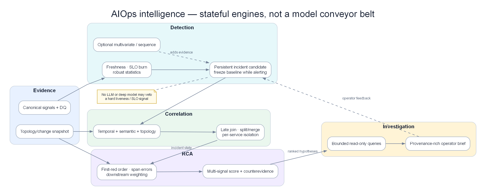

# Chapter 08 — Anomaly Detection

> **Phát hiện bất thường (Anomaly detection) là lớp thông minh đầu tiên của pipeline AIOps. Nó chuyển đổi telemetry thô thành các tín hiệu có giá trị thực thi — phát hiện các sai lệch so với hành vi bình thường trên metrics, logs, và traces. Chương này đề cập đến mọi thuật toán từ EWMA đến deep learning dựa trên Transformer, kèm theo các đánh giá sự đánh đổi trong production cho mỗi loại.**

---

## Prerequisites

- [01 — Observability](../01-observability/README.vi.md) — các loại metric, cấu trúc log
- [03 — Prometheus](../03-prometheus/README.vi.md) — sử dụng PromQL để trích xuất đặc trưng (feature extraction)
- [07 — Kafka](../07-kafka/README.vi.md) — tiêu thụ telemetry, đẩy các sự kiện bất thường (anomaly events)

## Related Documents

- [09 — Alert Correlation](../09-alert-correlation/README.vi.md) — nhận các sự kiện bất thường
- [10 — Root Cause Analysis](../10-root-cause-analysis/README.vi.md) — sử dụng ngữ cảnh bất thường
- [11 — LLM Agent](../11-investigation-engine/README.vi.md) — sử dụng tín hiệu bất thường phục vụ điều tra sự cố
- [13 — Production Operations](../13-production-engine/README.vi.md) — vận hành detector trên production, SLO platform
- [14 — Pattern Library](../14-aiops-pattern-library/README.vi.md) — pattern detection và production forces
- [15 — Domain Packs](../15-aiops-domain-packs/README.vi.md) — peak, calendar, compliance và money-path detection
- [16 — Benchmark Replay](../16-aiops-benchmark-replay/README.vi.md) — drift, confounder và long-incident scenarios

## Next Reading

Sau chương này, hãy chuyển sang [09 — Alert Correlation](../09-alert-correlation/README.vi.md).

---

## Table of Contents

1. [Anomaly Detection Overview](#1-anomaly-detection-overview)
2. [The Detection Pipeline](#2-the-detection-pipeline)
3. [EWMA — Exponentially Weighted Moving Average](#3-ewma-exponentially-weighted-moving-average)
4. [Z-Score and Modified Z-Score](#4-z-score-and-modified-z-score)
5. [STL Decomposition](#5-stl-decomposition)
6. [Seasonal Hybrid ESD (SHESD)](#6-seasonal-hybrid-esd-shesd)
7. [Isolation Forest](#7-isolation-forest)
8. [DBSCAN — Density-Based Clustering](#8-dbscan-density-based-clustering)
9. [Local Outlier Factor (LOF)](#9-local-outlier-factor-lof)
10. [One-Class SVM](#10-one-class-svm)
11. [LSTM for Time-Series Anomaly Detection](#11-lstm-for-time-series-anomaly-detection)
12. [Transformer-Based Detection](#12-transformer-based-detection)
13. [Log Anomaly Detection — Drain Algorithm](#13-log-anomaly-detection-drain-algorithm)
14. [Log Anomaly Detection — DeepLog](#14-log-anomaly-detection-deeplog)
15. [Algorithm Selection Guide](#15-algorithm-selection-guide)
16. [Feature Engineering](#16-feature-engineering)
17. [Production Architecture](#17-production-architecture)
18. [Model Training and Retraining Pipeline](#18-model-training-and-retraining-pipeline)
19. [False Positive Management](#19-false-positive-management)
20. [Common Mistakes](#20-common-mistakes)
21. [Monitoring the Detection System](#21-monitoring-the-detection-system)
22. [Scaling](#22-scaling)
23. [Security](#23-security)
24. [Cost](#24-cost)
25. [Tư duy sâu: Drift, Ensemble, Feedback Loop & Khi nào KHÔNG dùng ML](#25-tu-duy-sau-drift-ensemble-feedback-loop-khi-nao-khong-dung-ml)
26. [Production Review](#26-production-review)

---

## Cách đọc chapter này: đi từ dữ liệu đến quyết định vận hành

> [!IMPORTANT]
> **Chương này cố ý không chứa code triển khai.**
> Mỗi detector được đọc theo cùng một đường đi: **dữ liệu thô → phép biến đổi → con số trung gian → quyết định → hành động của on-call → failure mode**. Mục tiêu không phải nhớ tên thuật toán mà là nhìn một dãy số và giải thích được vì sao hệ thống cảnh báo, vì sao nó im lặng, và im lặng đó có đúng hay không.

| Bước đọc | Câu hỏi |
|----------|---------|
| 1. Vấn đề | Detector/engine này giải quyết pain gì (false positive, cascade, MTTR…)? |
| 2. Ý tưởng | Trực giác 2–3 câu, không công thức |
| 3. Data in | Metric/log/trace/event nào, window nào, feature nào? |
| 4. Thuật toán | Các bước tính toán / model flow |
| 5. Output | Schema sự kiện, score, rank, action proposal? |
| 6. Trade-off | Ưu / nhược / chi phí / giải thích được không? |
| 7. When | Dùng khi nào — và khi nào **đừng** dùng |

### Một anomaly chỉ có nghĩa khi gắn với quyết định

Giả sử latency p99 theo phút là **[118, 121, 119, 123, 120, 182] ms**. Điểm 182 khác hẳn năm điểm trước, nhưng chưa đủ để page. Nếu SLO là 300 ms, traffic vẫn đủ và error rate không đổi, đây có thể chỉ là một batch ngắn. Ngược lại, với chuỗi **[118, 121, 119, 123, 120, 148] ms**, mức tăng nhỏ hơn nhưng đồng thời checkout success giảm từ 99,8% xuống 96,5% thì tín hiệu thứ hai đáng xử lý hơn. Detector chỉ đo độ lạ; policy mới quyết định độ nguy hiểm.

Trong chapter này, mỗi ví dụ tách rõ bốn lớp thường bị trộn lẫn:

| Lớp | Câu hỏi bắt buộc | Ví dụ với điểm 182 ms |
|-----|------------------|------------------------|
| Observation | Ta thực sự đo được gì? | p99 của một phút là 182 ms; có 24.000 request |
| Expectation | Bình thường trong đúng ngữ cảnh là bao nhiêu? | Cùng phút trong bảy ngày gần nhất là 115–126 ms |
| Detection | Mức lệch có đủ lớn và đủ lâu không? | residual +61 ms, kéo dài một cửa sổ |
| Decision | Có page, tạo ticket hay chỉ ghi nhận? | Chỉ annotate nếu error rate và SLO burn vẫn bình thường |

Điều này ngăn một lỗi thiết kế phổ biến: lấy nhãn `anomaly=true` làm đồng nghĩa với `incident=P1`. Trong hệ thống trưởng thành, anomaly event là bằng chứng đầu vào cho correlation, không phải phán quyết cuối cùng.

---

## 1. Anomaly Detection Overview

*Poster: ensemble detect → correlation → RCA → LLM agent → một incident card.*

> [!NOTE]
> **Ý TƯỞNG**
> Anomaly detection không phải là "càng nhạy càng tốt". Nhiệm vụ thật sự là **tối đa hóa tín hiệu có thể hành động** (actionable signal) trong khi **giữ alert fatigue dưới ngưỡng tin cậy của on-call**. Một detector recall 99% nhưng precision 40% sẽ bị mute trong 2 tuần. Hãy tối ưu theo **precision-at-page** trước, rồi mới mở rộng recall.

> [!TIP]
> **Vì sao static threshold vẫn sống sót?**
> Threshold tĩnh rẻ, giải thích được, audit được, và đủ tốt cho SLO burn-rate rõ ràng. ML thắng khi baseline **thay đổi theo mùa, theo deploy, theo tenant**. Nếu metric có ngưỡng vật lý rõ (disk 95%, cert expire 14 ngày) — đừng ép ML.

### What Is an Anomaly?

Một điểm bất thường (anomaly) là **một điểm dữ liệu sai lệch đáng kể so với hành vi kỳ vọng**. Trong AIOps, bất thường được chia làm ba loại:

| Loại | Dãy số minh họa | Vì sao bất thường | Detector phù hợp |
|------|-----------------|-------------------|-------------------|
| Point anomaly | CPU **[41, 43, 42, 44, 91, 43]** | 91 tự nó cách xa vùng 41–44 | EWMA, modified Z-score |
| Contextual anomaly | RPS lúc 02:00 **[22, 24, 23, 81]**; 81 lại bình thường lúc 20:00 | Giá trị chỉ sai khi đặt đúng giờ/ngày | STL, SHESD |
| Collective anomaly | Queue **[4, 6, 9, 13, 18, 25, 33]** | Không điểm nào cực đoan, nhưng cả quỹ đạo tăng đều là dấu hiệu consumer hụt hơi | Forecast/LSTM, slope feature |
| Multivariate anomaly | CPU 48%, memory 61%, error 8,2%; từng metric có thể chưa vượt ngưỡng | Tổ hợp “tài nguyên bình thường nhưng lỗi cao” hiếm trong lịch sử | Isolation Forest, OC-SVM, Transformer |

Một loại thứ năm rất quan trọng trong vận hành là **absence anomaly**: điều đáng lẽ phải xuất hiện lại biến mất. Ví dụ số job hoàn tất mỗi 5 phút là **[12, 11, 13, 12, 0, 0]**. Hai số 0 có thể không tạo log lỗi nào, nhưng pipeline đã ngừng tạo output. Với case này, kiểm tra freshness hoặc expected-event rule thường đáng tin hơn mô hình phức tạp.

### Why Static Thresholds Fail

Ngưỡng tĩnh không sai; nó sai khi baseline phụ thuộc ngữ cảnh mà rule không biểu diễn. Cùng ngưỡng CPU 80% cho ta ba kết quả trái ngược:

| Bối cảnh | Dãy CPU theo phút | Rule `>80%` | Thực tế |
|----------|-------------------|-------------|---------|
| Batch đã lên lịch | **[72, 78, 84, 89, 86, 76]** | Bắn ba lần | Bình thường; batch luôn chạy 01:00–01:10 |
| Memory leak làm GC tăng | **[48, 51, 55, 60, 66, 73]** | Im lặng | Có vấn đề; slope kéo dài và latency cùng tăng |
| Checkout mất traffic | **[67, 63, 54, 39, 21, 18]** | Im lặng | Nghiêm trọng; CPU giảm vì request không tới |

Static threshold vẫn là lựa chọn đúng khi đại lượng có ranh giới vật lý hoặc nghiệp vụ: dung lượng đĩa 95%, chứng thư còn 14 ngày, SLO burn-rate, replica ready bằng 0. Dynamic detection nên bổ sung phần “hành vi kỳ vọng”, không thay mọi rule bằng ML.

**Phát hiện bất thường động (Dynamic anomaly detection)**: Kích hoạt cảnh báo khi giá trị sai lệch đáng kể so với **giá trị kỳ vọng tại thời điểm này, đối với dịch vụ này, dưới các điều kiện cụ thể này**.

### The AIOps Detection Stack

Không có thứ hạng “càng xuống dưới càng tốt”. Stack hợp lý là một **thang chi phí**. Với 50.000 series, lớp rẻ như freshness, EWMA và modified Z có thể chấm tất cả. Chỉ vài trăm service quan trọng hoặc các ứng viên đáng ngờ mới đi qua detector đa biến. LSTM/Transformer dành cho những failure mode đã chứng minh rằng thống kê đơn giản bỏ lỡ, không phải để trang trí kiến trúc.

Ví dụ một phút có 50.000 điểm: freshness loại 300 series mất dữ liệu; EWMA gắn cờ 420; policy maintenance loại 180; modified Z xác nhận 96; correlation gom còn 11 cụm; model đa biến nâng confidence cho 3 cụm; cuối cùng chỉ 1 incident đủ điều kiện page. Con số quan trọng không phải “420 anomaly” mà là **1 page có giá trị từ 50.000 quan sát**.

---

## 2. The Detection Pipeline

Một pipeline production phải giữ được **event time**, **identity** và **context thay đổi**. Nếu điểm của 10:03 đến Kafka lúc 10:08 vì network lag mà detector dùng processing time, nó có thể so điểm cũ với baseline 10:08 và tạo anomaly giả. Nếu pod restart làm mất state, năm phút warm-up tiếp theo cũng không được phép page như một detector đã trưởng thành.

### Walkthrough: từ 12 điểm metric đến một quyết định

Xét `checkout.error_rate` theo phút:

| Thời điểm | Error rate | RPS | Deploy? | Ghi chú |
|-----------|------------|-----|---------|---------|
| 10:00–10:04 | 0,7%; 0,8%; 0,6%; 0,9%; 0,8% | 790–830 | Không | Baseline ổn định |
| 10:05–10:07 | 2,1%; 3,8%; 6,4% | 812; 805; 798 | Có lúc 10:04 | Tăng ngay sau release |
| 10:08–10:11 | 7,1%; 7,4%; 7,0%; 6,8% | 801–820 | Có | Sai lệch duy trì |

Pipeline xử lý thực tế như sau:

1. Ingestion giữ timestamp nguồn và đánh dấu một điểm 10:06 đến trễ 40 giây.
2. Feature layer tạo error rate từ hai counter cùng cửa sổ, không lấy trung bình các tỷ lệ pod một cách mù quáng.
3. EWMA phát hiện từ 10:05; modified Z xác nhận ở 10:06; detector đa biến thấy error tăng trong khi RPS không tăng, loại giả thuyết “chỉ do tải”.
4. Change context nối anomaly với deploy 10:04. Hệ thống không suppress tuyệt đối; nó giảm urgency trong hai cửa sổ đầu để tránh noise khởi động.
5. Persistence gate yêu cầu ba phút liên tiếp. Đến 10:07 điều kiện được thỏa.
6. Correlation gom ba anomaly thành một incident, gắn release ID và route cho đội checkout.
7. Sau rollback 10:12, detector không học dãy 7% thành normal; state được giữ ở baseline trước incident cho tới khi recovery ổn định.

Nếu pipeline chỉ thực hiện bước 3, on-call nhận ba page từ ba thuật toán. Nếu suppress toàn bộ 30 phút sau deploy, nó lại bỏ lỡ chính lỗi cần canary phát hiện. Production nằm ở các “van” giữa detector và page.

### Pipeline Step Details

| Bước xử lý | Đầu vào | Đầu ra | Độ trễ | Kịch bản lỗi |
|------|-------|--------|---------|--------------|
| Nhận dữ liệu từ Kafka | Telemetry thô | Bản ghi đã chuẩn hóa | <10ms | Consumer lag: bị chậm tiến trình |
| Trích xuất đặc trưng | Bản ghi thô | Vector đặc trưng | 1–50ms | Lỗi bộ nhớ: cửa sổ thời gian quá lớn |
| Phát hiện bằng thống kê | Đặc trưng (Features) | Điểm số 0–1 | 1–5ms | Cold start: lịch sử trống |
| Phát hiện bằng ML | Đặc trưng (Features) | Điểm số 0–1 | 5–50ms | Mô hình cũ: hiện tượng trôi (drift) |
| Phát hiện bằng DL | Đặc trưng (Features) | Điểm số 0–1 | 50–500ms | Yêu cầu GPU ở quy mô lớn |
| Tổng hợp (Ensemble) | Nhiều điểm số | Điểm số cuối cùng | <1ms | — |
| Phân ngưỡng + khử trùng lặp | Điểm số | AnomalyEvent hoặc None | <1ms | — |
| Đẩy dữ liệu lên Kafka | AnomalyEvent | — | 10–100ms | Broker down: lưu tạm cục bộ |

---

## 3. EWMA — Exponentially Weighted Moving Average

> [!NOTE]
> **Ý TƯỞNG**
> EWMA trả lời một câu hỏi cho mỗi metric: *điểm này có lệch xa so với kỳ vọng vừa có không?* Đây là baseline thích ứng online — không phải mô hình seasonality, cũng không phải detector đa biến.

### Vấn đề giải quyết

Ngưỡng tĩnh không bám theo baseline thay đổi dần (tăng trưởng, deploy, mở rộng capacity). EWMA cho **baseline rẻ, luôn bật, không cần train**, bắt spike/drop ngay trên luồng.

### Ý tưởng cốt lõi (intuition)

EWMA là một bộ lọc đơn giản theo dõi **trung bình trượt (moving average)**, trong đó các quan sát gần đây có sức ảnh hưởng lớn hơn các quan sát cũ hơn. Đây là nền tảng của tất cả các thuật toán ngưỡng thích ứng (adaptive threshold).

Có thể hiểu đơn giản là: "Ước lượng tốt nhất của tôi về giá trị hiện tại là sự kết hợp có trọng số giữa ước lượng trước đó và quan sát mới nhất." Đồng thời theo dõi phương sai phần dư theo cách tương tự, rồi gắn cờ khi phần dư vượt *k* độ lệch chuẩn thích ứng.

### Input data trên pipeline AIOps

| Khía cạnh | Lựa chọn điển hình |
|-----------|-------------------|
| Loại tín hiệu | Metric số univariate (CPU, error rate, latency p99, RPS, độ dài queue) |
| Nguồn | Kafka `aiops-raw-metrics` hoặc Prometheus scrape / query |
| Nhịp | Mẫu 5s–1m; detector cập nhật **từng điểm** (streaming) |
| Window / state | **Không buffer lịch sử** — chỉ `S_t` và `variance_t` (O(1) mỗi metric) |
| Feature | Giá trị thô; có thể pre-smooth hoặc rate (`rate()`, `irate()`) |
| Warm-up | Bỏ qua alert ~`min_periods` quan sát đầu (ví dụ 30) |

> [!TIP]
> Một instance EWMA **cho mỗi khóa (service, metric, labels quan trọng)**. Chia sẻ state giữa tenant sẽ trộn baseline và tăng false positive.

### Thuật toán hoạt động từng bước

1. Điểm đầu: `S = X`, variance `= 0`, trả "initializing".
2. Phần dư: `r_t = X_t − S_{t−1}`.
3. Chấm residual bằng scale `v_{t−1}` được ước lượng từ **các điểm trước**, không cho Xₜ tự nới ngưỡng của nó.
4. Nếu còn warm-up → chưa page nhưng vẫn cập nhật state sau kiểm tra data quality.
5. `z = |r_t| / √v_{t−1}`; bất thường nếu `z > k` (thường `k = 3`).
6. Score ≈ `min(z / k, 1)`; ghi `direction` spike/drop.
7. Nếu điểm bình thường, cập nhật `S_t` và `v_t`; nếu anomaly mạnh, freeze hoặc capped-update theo policy rồi chỉ nhận new normal qua change/recovery gate.

### Formula

Với hệ số làm mịn α nằm giữa 0 và 1, baseline mới là **Sₜ = αXₜ + (1−α)Sₜ₋₁**. α cao làm baseline đuổi nhanh theo điểm mới; α thấp giữ trí nhớ dài hơn. Nhưng detector không nên dùng một scale vừa được phình lên bởi chính điểm đang đánh giá. Quy trình an toàn là: lấy **Sₜ₋₁ và scale của các residual trước đó** để chấm Xₜ; nếu Xₜ là anomaly mạnh thì freeze hoặc cập nhật với trọng số rất nhỏ; nếu bình thường mới cập nhật đầy đủ.

**Điểm bất thường (Anomaly score)** (sai lệch so với EWMA):

### Effect of α Parameter

| α | Trọng số còn lại của một điểm sau 5 bước | Cảm giác vận hành |
|---|------------------------------------------|-------------------|
| 0,1 | khoảng 59% | Mượt, chậm; hợp metric nhiều nhiễu |
| 0,3 | khoảng 17% | Cân bằng cho baseline ngắn |
| 0,7 | dưới 1% | Gần như quên quá khứ; dễ bám luôn vào incident |

**Tự động tinh chỉnh α** dựa trên độ biến động tự nhiên của metric:

### Case bằng số: spike thật và cách baseline bị đầu độc

Giả sử RPS theo phút là **[100, 102, 101, 99, 100, 142, 145, 144]**, α = 0,3. Chỉ xét năm điểm bình thường đầu, EWMA đi qua các baseline xấp xỉ **[100; 100,6; 100,72; 100,20; 100,14]**. Trước khi thấy 142, kỳ vọng hợp lý là khoảng 100,14; residual là **+41,86**, lớn hơn hẳn residual lịch sử chỉ quanh ±2.

Nếu detector cập nhật vô điều kiện, baseline sau ba điểm cao trở thành khoảng **123,4** rồi **129,9**. Incident đang tiếp diễn nhưng residual giảm từ 41,9 xuống 21,6 rồi 20,6. Một detector ngây thơ kết luận “đã đỡ”, dù RPS vẫn cao 44%. Đây là hiện tượng baseline contamination.

Trong production, có ba lựa chọn:

- **Freeze-on-alert:** giữ baseline 100,14 khi anomaly còn mở. Điểm 145 và 144 tiếp tục được so với normal trước incident. Cách này tốt cho spike/outage ngắn nhưng có thể cảnh báo mãi sau một thay đổi hợp lệ.
- **Capped update:** giới hạn đóng góp của residual, ví dụ chỉ cho baseline dịch tối đa 3 đơn vị mỗi phút. Cách này thích nghi có kiểm soát.
- **Human/change acceptance:** nếu đây là traffic tăng hợp lệ do campaign, operator chấp nhận “new normal”; state được re-baseline có audit thay vì tự trôi âm thầm.

Giờ đổi dãy thành **[100, 102, 101, 99, 100, 103, 101, 102]**. Các residual vẫn nằm quanh ±3; EWMA theo kịp mà không phát tín hiệu. Cùng α, detector phân biệt được dao động ngắn quanh baseline và một bước nhảy lớn.

### Case EWMA không tốt: seasonality và slow leak

RPS mỗi sáu giờ trong hai ngày là **[20, 55, 110, 70, 22, 58, 112, 72]**. EWMA thấy các bước 20→55→110 là spike rồi 110→70→22 là drop ở cả hai ngày. Nhưng chuỗi đang lặp đúng nhịp. Tăng α chỉ làm baseline đuổi nhanh hơn, giảm α chỉ làm cảnh báo kéo dài hơn; không lựa chọn α nào tạo ra khái niệm “cùng giờ hôm qua”. Đây là lúc STL phù hợp hơn.

Với memory usage **[51, 52, 53, 54, 55, 56, 57, 58]**, mỗi bước chỉ +1 và EWMA cũng tăng theo. Không điểm nào lệch xa baseline, dù xu hướng dài hạn có thể dẫn tới OOM. Cần feature slope, time-to-exhaustion hoặc forecast; EWMA không phải detector rò rỉ chỉ vì nó là “moving average”.

### Cách đọc alert EWMA trên dashboard

Một alert có ích phải nói: “current 142, expected 100, residual +42, scale lịch sử 1,4, kéo dài 3 phút, baseline đang freeze”, thay vì chỉ nói “score 0,98”. On-call cần biết detector thấy spike hay drop, state có vừa reset không, và điểm trước đó có bị missing hay không. Nếu không cung cấp các con số này, EWMA tuy giải thích được về lý thuyết nhưng vẫn là hộp đen trong ca trực.

### Output

| Trường | Ý nghĩa |
|--------|---------|
| `anomaly` | bool — `z > k` sau warm-up |
| `score` | 0–1 — mức nghiêm trọng chuẩn hóa (`z / k` có cap) |
| `z_score`, `residual`, `ewma`, `std_dev` | Giải thích cho on-call / RCA |
| `direction` | `spike` hoặc `drop` |
| Sự kiện | Publish `AnomalyEvent` với `algorithm=ewma`, metric, service, timestamp, baseline vs current |

### Ưu / nhược

| Ưu điểm/Nhược điểm | Chi tiết |
|--------|---------|
| ✅ Không yêu cầu dữ liệu huấn luyện | Hoạt động ngay lập tức trên các metrics mới |
| ✅ Độ phức tạp bộ nhớ O(1) | Chỉ lưu trữ giá trị ewma và ewma_var, không cần lưu toàn bộ lịch sử |
| ✅ Độ phức tạp tính toán O(1) | Chỉ một phép nhân-cộng trên mỗi lần quan sát |
| ✅ Thích ứng với sự trôi dần (gradual drift) | Nếu CPU tăng dần qua các tuần, EWMA sẽ tự thích ứng đi theo |
| ❌ Nhạy cảm với tính chu kỳ (seasonality) | Sự sụt giảm traffic lúc 3 giờ sáng sẽ bị coi là bất thường |
| ❌ Không hỗ trợ phát hiện đa biến | Mỗi metric được đánh giá độc lập |
| ❌ Phản ứng chậm với các sai lệch trung bình kéo dài | Đòi hỏi sai lệch phải đạt k-sigma |

### Khi nào dùng / khi nào KHÔNG dùng

| Dùng khi | **Không** dùng khi |
|----------|---------------------|
| Cần first-pass trên hàng nghìn metric | Seasonality ngày/tuần mạnh (dùng STL/SHESD) |
| Spike/drop rõ, path streaming, budget latency chặt | Lỗi kết hợp đa metric (dùng Isolation Forest) |
| Cold-start / service mới không có train set | Rò rỉ chậm nằm mãi trong dải thích ứng |
| Cần page P1 giải thích được trên tín hiệu univariate | Cần p-value / kiểm soát multi-anomaly (dùng SHESD) |

> [!WARNING]
> Sau sự cố thật, EWMA **hấp thụ** baseline cao. Không có hysteresis, cooldown hay freeze-on-alert thì độ nhạy sụt trong incident và giai đoạn recovery dễ bị coi là "bình thường" quá sớm.

**Vận hành trong thực tế**: EWMA là lựa chọn lý tưởng làm **bộ lọc vòng đầu (first-pass filter)** cho toàn bộ metrics. Nhanh, rẻ, không cần huấn luyện. Sử dụng cho các cảnh báo P1 đối với các đột biến rõ ràng. Kết hợp với STL để hiệu chỉnh các yếu tố chu kỳ theo mùa.

---

## 4. Z-Score and Modified Z-Score

> [!NOTE]
> **Ý TƯỞNG**
> Z-score hỏi: *điểm này lệch bao nhiêu "độ rộng" so với tâm cửa sổ?* Mean/std cổ điển dễ hỏng vì outlier cũ; **modified Z (median + MAD)** là mặc định an toàn cho sliding window trên production.

### Vấn đề giải quyết

Cần rule đơn giản, audit được: "giá trị này cực đoan so với lịch sử gần đây." Không train, dễ giải thích postmortem; multi-window bắt cả spike nhanh lẫn drift chậm.

### Ý tưởng cốt lõi (intuition)

So sánh giá trị hiện tại với **phân phối tham chiếu ước lượng từ cửa sổ thời gian**. Z chuẩn dùng mean và std. Modified Z dùng **median** và **MAD** để vài spike cũ không phình scale và che incident kế tiếp.

### Input data trên pipeline AIOps

| Khía cạnh | Lựa chọn điển hình |
|-----------|-------------------|
| Loại tín hiệu | Metric univariate (cùng họ EWMA) |
| Nguồn | Rolling buffer từ Prometheus `query_range` hoặc Kafka + ring buffer |
| Window | Thường: 5m (nhanh), 1h (mặc định), 24h / 7d (drift / tuần) |
| Feature | Giá trị thô hoặc transform cùng thang; thống nhất đơn vị trong window |
| State | Toàn bộ mẫu trong window (O(window) memory mỗi khóa metric) |
| Labels | Đánh giá theo series; không trộn pod/tenant trừ khi cố ý |

### Thuật toán hoạt động từng bước

**Standard Z-Score**

1. Lấy lịch sử cửa sổ `H = {x₁…xₙ}`.
2. μ = mean(H), σ = std(H).
3. `Z = (X − μ) / σ`.
4. Bất thường nếu `|Z| > ngưỡng` (thường 2.5–4.0).

**Modified Z-Score (robust)**

1. `median = median(H)`, `MAD = median(|xᵢ − median|)`.
2. Nếu MAD = 0: mọi lệch khỏi hằng số lịch sử là bất thường.
3. `M = 0.6745 × |X − median| / MAD`.
4. Bất thường nếu `|M| > 3.5` (mặc định phổ biến).
5. Score ≈ `min(|M| / 3.5, 1)`; giữ direction so với median.

### Standard Z-Score

Z-score chuẩn đo khoảng cách tới mean theo đơn vị standard deviation. Nó hữu ích khi cửa sổ khá ổn định, đủ mẫu và không bị vài incident cũ chi phối. “Ba sigma” không tự động đồng nghĩa xác suất sai cực thấp: telemetry thường lệch, đuôi nặng và có tự tương quan, nên ngưỡng phải được hiệu chuẩn trên false-positive thực tế.

**Bất thường nếu |Z| > ngưỡng** (thường từ 2.5–4.0 tùy thuộc vào độ nhạy yêu cầu).

**Vấn đề**: Standard Z-score **không bền vững trước các điểm ngoại lai (outliers)**. Nếu cửa sổ lịch sử chứa sẵn các điểm ngoại lai, giá trị μ và σ sẽ bị méo mó, làm giảm độ nhạy của bộ phát hiện đối với các bất thường trong tương lai.

### Modified Z-Score (Robust)

Modified Z thay mean bằng median và độ lệch chuẩn bằng MAD. Median trả lời “điểm giữa nằm đâu”; MAD trả lời “độ lệch điển hình khỏi điểm giữa là bao nhiêu”. Vì cả hai ít bị một vài cực trị kéo đi, detector vẫn giữ độ nhạy khi history đã chứa spike.

**Bất thường nếu |M| > 3.5**

### Z-Score Window Selection

| Kích thước cửa sổ | Độ trễ phát hiện | Rủi ro dương tính giả | Trường hợp sử dụng |
|-------------|------------------|---------------------|---------|
| 5 phút | Nhanh | Cao (số lượng mẫu thấp) | Chỉ dùng cho cảnh báo thời gian thực |
| 1 giờ | Trung bình | Trung bình | **Tiêu chuẩn cho production** |
| 24 giờ | Chậm | Thấp | Phát hiện hiện tượng trôi (drift) chậm |
| 7 ngày | Rất chậm | Rất thấp | Xác định baseline chu kỳ hàng tuần |

**Mẫu thiết kế trong production**: Sử dụng đồng thời nhiều cửa sổ thời gian khác nhau:

### Case bằng số: vì sao mean/std có thể che incident

Giả sử latency lịch sử là **[99, 100, 101, 100, 99, 160] ms** và điểm mới là **150 ms**. Cửa sổ đã nhiễm một spike 160 từ incident trước. Mean lịch sử là 109,8 ms; standard deviation xấp xỉ 22,5 ms. Z của 150 chỉ khoảng **1,79**, dưới ngưỡng 3, nên standard Z im lặng.

Median của lịch sử là 100 ms. Các độ lệch tuyệt đối là **[1, 0, 1, 0, 1, 60]**; MAD theo định nghĩa median là 1 ms nếu dùng quy ước phù hợp cho cửa sổ chẵn. Modified Z của 150 xấp xỉ **33,7**, rõ ràng bất thường. Điểm cũ 160 không kéo tâm và scale robust lên nhiều. Đây là lý do modified Z thường là mặc định tốt hơn cho telemetry có incident lẫn trong history.

Nhưng MAD có failure mode riêng. Với dãy **[100, 100, 100, 100, 100, 101]**, MAD bằng 0. Không thể chia cho 0 và cũng không nên kết luận mọi sai lệch 1 đơn vị là P1. Cách xử lý phải dựa trên độ phân giải metric: đặt scale floor, chẳng hạn 1 ms cho latency; hoặc dùng IQR/scale từ cửa sổ dài hơn. Quy tắc “MAD=0 thì mọi giá trị khác median đều bất thường” chỉ hợp với tín hiệu thực sự rời rạc như desired replicas.

### Case multi-window: spike nhanh hay thay đổi bền vững

Error count mỗi phút là **[2, 1, 2, 2, 3, 14, 15, 13]**. Cửa sổ 5 phút phát hiện 14 ngay, nhưng chỉ có ít mẫu nên dễ nhiễu. Cửa sổ 1 giờ, với baseline quanh 2, xác nhận khi 14–15 lặp lại. Policy thực tế có thể cho tín hiệu 5 phút vào Slack ở điểm đầu và chỉ page khi cửa sổ 1 giờ đồng thuận hoặc error-budget burn vượt ngưỡng.

Ngược lại, chuỗi **[2, 1, 2, 2, 3, 14, 2, 1]** là spike một phút. Nếu service có retry che được và SLO không burn, gate “hai hoặc ba cửa sổ liên tiếp” loại page. Nếu metric là số replica ready và 14 đại diện lỗi dữ liệu bất khả thi, domain rule lại có thể xử lý ngay. Thuật toán không thay policy.

### Khi Z-score cho câu trả lời sai dù phép tính đúng

RPS 24 giờ có chuỗi thấp ban đêm và cao ban ngày. Mean toàn ngày 500, standard deviation 300; điểm 100 lúc 14:00 có Z chỉ −1,33 nên tưởng bình thường, trong khi cùng giờ thường phải 800. Điểm 850 lúc 02:00 cũng chỉ khoảng +1,17 nhưng là bot storm. Vấn đề không nằm ở Z-score; reference window đã trộn hai regime. Trước khi chỉnh ngưỡng, hãy sửa cohort so sánh: cùng minute-of-day, cùng weekday hoặc residual sau STL.

### Output

| Trường | Ý nghĩa |
|--------|---------|
| `anomaly` | bool từ ngưỡng trên `|Z|` hoặc `|M|` |
| `score` | 0–1 mức nghiêm trọng chuẩn hóa |
| `modified_z` / `z`, `median` hoặc `μ`, `mad` hoặc `σ` | Baseline để giải thích |
| `direction` | spike nếu trên tâm, drop nếu dưới |
| Sự kiện | `algorithm=zscore` hoặc `modified_zscore`, độ dài window, định danh metric |

### Ưu / nhược

| Ưu/Nhược | Chi tiết |
|----------|---------|
| ✅ Toán học minh bạch | Dễ audit và dạy on-call |
| ✅ Không cần train | Chỉ cần sliding window |
| ✅ Multi-window | Góc nhìn nhanh + chậm cùng series |
| ✅ Modified Z robust | Sống sót khi history bị nhiễm outlier |
| ❌ Yếu với seasonality | Peak giờ làm việc trông "cực đoan" |
| ❌ Chỉ univariate | Không thấy lỗi kết hợp CPU+error |
| ❌ Chọn window then chốt | Quá ngắn → ồn; quá dài → trễ và pha loãng |
| ❌ Giả định spread gần dừng | Đổi regime cần re-baseline |

### Khi nào dùng / khi nào KHÔNG dùng

| Dùng khi | **Không** dùng khi |
|----------|---------------------|
| Cần detection first-line giải thích được | Seasonality đa thang mạnh (ưu tiên STL/SHESD) |
| History có thể chứa spike cũ (→ modified Z) | Vector feature chiều cao (IF / OC-SVM) |
| Ensemble multi-window với EWMA | Bất thường sequence log (Drain/DeepLog) |
| Cần rule thống kê đơn giản cho compliance | Số mẫu trong window quá ít (σ không ổn định) |

> [!TIP]
> Công thức production mặc định: **modified Z 1h** để page, **5m** chỉ shadow/urgency cao, **24h** tăng confidence — page khi window ngắn cực đoan *và* window trung bình đồng thuận, hoặc severity rất cao.

---

## 5. STL Decomposition

> [!NOTE]
> **Ý TƯỞNG**
> STL không "detect" một mình — nó **gỡ cấu trúc kỳ vọng** (trend + season) để detector phần dư (MAD, Z, ESD) chỉ thấy phần bất ngờ. Peak ban ngày không còn trông như bug khi đó là seasonal.

### Vấn đề giải quyết

Chu kỳ giờ làm việc / ngày / tuần khiến EWMA/Z-score bắn mỗi sáng peak và bỏ lỡ giá trị "trung bình" ban đêm vốn đã nghiêm trọng. STL tách **nhịp điệu kỳ vọng** khỏi **bất thường phần dư thật**.

### Ý tưởng cốt lõi (intuition)

Nhiều metrics mang **tính chu kỳ theo mùa (seasonal patterns)**: cao hơn trong giờ làm việc, thấp hơn vào ban đêm. Đột biến vào các giờ cao điểm ngày trong tuần. Thuật toán Z-score tĩnh không tính đến điều này — nó sẽ gắn cờ hoạt động traffic cao điểm ban ngày là bất thường khi so sánh với giá trị trung bình 24 giờ.

**STL** (Seasonal and Trend decomposition using Loess) phân tách chuỗi thời gian thành:

### Input data trên pipeline AIOps

| Khía cạnh | Lựa chọn điển hình |
|-----------|-------------------|
| Loại tín hiệu | Metric seasonal: RPS, volume checkout, CPU theo traffic, duration job batch |
| Nguồn | Series đều từ Prometheus (ưu tiên scrape interval cố định) |
| Độ dài history | Tối thiểu ≥ **2× period**; production thường **7 ngày** |
| Period | Ví dụ 288 điểm cho 24h @ 5m; 7×288 nếu cần weekly |
| Nhịp | Re-fit mỗi 15–60 phút; chấm điểm điểm mới trên component đã cache |
| Feature | Một series (có thể log1p nếu đuôi nặng) |

> [!WARNING]
> Lỗ hổng scrape làm lệch pha seasonality. Nội suy hoặc đánh dấu gap; đừng nối im lặng timestamp lệch nhịp vào STL.

### Thuật toán hoạt động từng bước

1. Ghép window đều (ví dụ 7 ngày @ 5m).
2. Fit STL (thường `robust=True`) → `trend`, `seasonal`, `residual`.
3. Ước lượng scale residual bằng MAD (robust với spike còn sót).
4. Ngưỡng ≈ `k × MAD × 1.4826` (MAD → đơn vị gần σ).
5. Score = `|residual| / threshold`; bất thường nếu score > 1.
6. Cache seasonal+trend; điểm streaming: residual ≈ `x − trend_est − seasonal_tại_pha` đến lần re-fit sau.

### Case bằng số: cùng giá trị 145, một lần bình thường và một lần bất thường

Giả sử ta lấy một điểm mỗi bốn giờ. Bốn ngày bình thường có hình dạng lặp:

| Pha trong ngày | Ngày 1 | Ngày 2 | Ngày 3 | Ngày 4 | Seasonal kỳ vọng gần đúng |
|----------------|--------|--------|--------|--------|---------------------------|
| 00:00 | 22 | 20 | 23 | 21 | 21,5 |
| 04:00 | 28 | 30 | 29 | 31 | 29,5 |
| 08:00 | 82 | 85 | 84 | 86 | 84,3 |
| 12:00 | 143 | 147 | 145 | 149 | 146,0 |
| 16:00 | 121 | 124 | 122 | 126 | 123,3 |
| 20:00 | 68 | 71 | 70 | 72 | 70,3 |

Ngày thứ năm, RPS lúc 12:00 là **145**. Nếu dùng threshold toàn ngày “trên 130 là cao”, điểm này bị gắn cờ; nếu dùng Z-score trên toàn bộ 24 điểm, nó cũng nằm ở phần đuôi trên. STL lại tách seasonal khoảng 124,5 cao hơn mức trung bình ngày và trend khoảng 21,5, cho expected xấp xỉ 146. Residual là **−1**, hoàn toàn bình thường.

Cũng giá trị **145** nhưng xuất hiện lúc 00:00. Expected lúc đó xấp xỉ 22; residual **+123**. Đây có thể là crawler, retry storm hoặc timestamp sai. STL phát hiện vì nó so với đúng pha mùa vụ. Điểm mạnh không phải một công thức threshold mới mà là thay câu hỏi từ “145 có lớn không?” thành “145 có hợp lý vào lúc 00:00 không?”.

### Case trend: tăng trưởng không nên bị gọi là incident

Đỉnh trưa qua bảy tuần là **[100, 104, 108, 112, 116, 120, 124]** do lượng khách tăng đều. Seasonal pattern vẫn giống nhau, trend tăng khoảng 4 mỗi tuần. Một baseline cố định từ tuần đầu sẽ gọi 120 và 124 là anomaly. STL đưa phần tăng chậm vào trend; residual vẫn nhỏ. Nhưng nếu capacity chỉ chịu được 130, “không bất thường” không có nghĩa “không rủi ro”: forecasting/capacity alert phải cảnh báo time-to-saturation. Anomaly detection và capacity planning giải hai bài toán khác nhau.

### STL không tốt khi nào, và vì sao

Nếu period khai báo sai, phép trừ seasonal tạo ra anomaly giả. Metric có chu kỳ 24 giờ nhưng cấu hình 12 giờ sẽ buộc peak sáng và peak tối vào cùng một pha. Residual hình răng cưa dù hệ thống khỏe. Với tuần có cuối tuần rất khác ngày thường, chỉ period ngày cũng chưa đủ; cần multiple seasonality hoặc tách weekday/weekend.

STL cũng yếu khi lịch hoạt động thay đổi bất quy tắc. Một chiến dịch marketing bắt đầu 19:37, một kỳ nghỉ không lặp hàng tuần, hay batch được dời lịch đều là event context chứ không phải seasonality ổn định. Dãy **[20, 22, 21, 23, 95, 98, 96]** sau khi campaign bắt đầu có thể là normal mới; STL cũ sẽ báo liên tục cho đến khi trend/season hấp thụ nó. Change calendar và re-baseline có kiểm soát phải đứng cạnh detector.

### STL Latency and Compute

| Kích thước cửa sổ | Số điểm dữ liệu (khoảng cách 5 phút) | Thời gian STL Fit | Bộ nhớ tiêu thụ |
|-------------|------------------------|--------------|--------|
| 24 giờ | 288 | ~5ms | ~50KB |
| 7 ngày | 2016 | ~30ms | ~350KB |
| 30 ngày | 8640 | ~150ms | ~1.5MB |

**Mẹo vận hành**: Thực hiện tính toán STL trên cửa sổ dữ liệu 7 ngày, re-fit định kỳ mỗi 1 giờ (không chạy trên mỗi điểm dữ liệu mới nhận được). Cache kết quả phân tách và chỉ áp dụng tính toán phần dư cho các điểm dữ liệu mới.

### Output

| Trường | Ý nghĩa |
|--------|---------|
| `anomaly` | bool — residual vượt ngưỡng robust |
| `score` | `|residual| / threshold` (thường clip cho ensemble) |
| `trend`, `seasonal_component`, `residual` | Series phân rã cho dashboard / RCA |
| Sự kiện | `algorithm=stl`, period, fit window, định danh metric |

### Ưu / nhược

| Ưu/Nhược | Chi tiết |
|----------|---------|
| ✅ Xử lý seasonality ngày/tuần | Peak giờ cao điểm hết vĩnh viễn FP |
| ✅ Tách drift chậm (trend) khỏi shock | Detection tập trung residual |
| ✅ Có robust fit | Ít bị vài spike cướp mô hình |
| ❌ Cần history dày đều | Gap và cold start gây hại |
| ❌ Nặng hơn EWMA/Z | Chi phí fit tăng theo window |
| ❌ Period phải đúng/ổn định | Sai period → residual rác |
| ❌ Univariate | Vẫn từng series một |

### Khi nào dùng / khi nào KHÔNG dùng

| Dùng khi | **Không** dùng khi |
|----------|---------------------|
| Metric gắn traffic có chu kỳ rõ | Metric phẳng/ngẫu nhiên (EWMA đủ) |
| Cần chấm residual dưới seasonality | Budget realtime < vài ms mỗi series |
| Re-fit batch/near-realtime mỗi giờ được | Log stream không đều mà không resample |
| Giải thích "kỳ vọng giờ này" cho người | Chỉ cần joint multi-metric |

---

## 6. Seasonal Hybrid ESD (SHESD)

> [!NOTE]
> **Ý TƯỞNG**
> SHESD = **phân rã seasonal + kiểm định multi-outlier (ESD)**. Sau khi gỡ season/trend, ESD lần lượt bóc residual cực đoan nhất với ngưỡng ý nghĩa — tốt hơn một threshold residual đơn khi nhiều anomaly nằm cùng window.

### Vấn đề giải quyết

Threshold residual STL thuần có thể (a) miss nhiều outlier đồng thời (chúng phình scale residual) hoặc (b) thiếu trần có nguyên tắc cho số điểm được gọi bất thường. SHESD thêm **ESD** để phát hiện multi-anomaly có kiểm soát trên series seasonal — cách tiếp cận nổi tiếng từ thư viện anomaly detection của Twitter.

### Ý tưởng cốt lõi (intuition)

1. Gỡ cấu trúc seasonal/trend (kiểu STL / seasonal hybrid median).
2. Trên residual, chạy **Extreme Studentized Deviate**: lặp kiểm định điểm xa nhất, loại, ước lượng lại, dừng khi không còn significant hoặc hết ngân sách max anomaly.
3. Kết quả: tập **chỉ mục** bất thường có nền thống kê, không chỉ score liên tục.

### Input data trên pipeline AIOps

| Khía cạnh | Lựa chọn điển hình |
|-----------|-------------------|
| Loại tín hiệu | KPI seasonal (RPS, orders, error count, latency) |
| Nguồn | History dày (giờ–tuần) từ Prometheus |
| Window | Thường nhiều ngày; đủ period cho seasonality |
| Tham số | `max_anomalies` (vd 5%), `alpha` (vd 0.05), direction both/pos/neg |
| Mode | Thường **batch / rolling batch**, không path micro-latency mỗi mẫu |
| Feature | Series univariate; longterm mode khi drift chậm |

### Thuật toán hoạt động từng bước

1. Nạp series đều `x₁…xₙ`.
2. Phân rã seasonal hybrid → residual `r_i`.
3. Giới hạn ứng viên bởi `max_anoms × n`.
4. Với k = 1…max: tìm index max `|r|`, tính thống kê ESD so với mean/std residual (hoặc scale robust).
5. So critical value ở mức `alpha`; significant thì đánh dấu và loại; không thì dừng.
6. Trả danh sách index bất thường (và có thể thứ hạng).

### Case bằng số: bóc nhiều outlier thay vì để chúng che nhau

Sau khi loại seasonal và trend, residual của 12 cửa sổ là **[1, −2, 0, 1, 2, −1, 38, 0, −2, 35, 1, −1]**. Hai điểm 38 và 35 có thể là hai phút lỗi trong cùng giờ. Nếu dùng mean/std trực tiếp trên toàn bộ residual, cả hai cực trị cùng kéo mean lên khoảng 6 và độ phân tán lên mạnh, làm mỗi điểm trông bớt cực đoan.

ESD xử lý lặp. Vòng đầu, 38 xa tâm nhất; detector kiểm tra nó có vượt critical value ở mức ý nghĩa đã chọn hay không. Nếu có, 38 được ghi nhận và tạm loại. Scale được tính lại trên 11 điểm còn lại; lúc này 35 nổi bật hơn rất nhiều và được kiểm tra ở vòng hai. Sau khi loại 35, các residual còn lại chỉ từ −2 đến 2; vòng ba dừng. Output là hai timestamp, không phải mười hai score rời rạc.

`max_anomalies` là một budget chứ không phải “tỷ lệ sự cố thật”. Với 100 điểm và mức 5%, thuật toán chỉ được kiểm tra tối đa 5 ứng viên. Nếu một outage kéo dài 20 điểm, SHESD có thể chỉ nhãn năm điểm cực đoan; correlation phải hiểu đó là một episode, không kết luận mười lăm điểm còn lại bình thường. Nếu tăng budget lên 30% để bắt cả outage, detector dễ bắt luôn residual bình thường khi dữ liệu ít. Tham số phải khớp mục tiêu: tìm vài điểm bẩn trong window hay phân đoạn một incident dài.

### Case SHESD không tốt: level shift kéo dài

Residual **[0, 1, −1, 0, 1, 20, 21, 20, 22, 21, 20, 21]** không phải vài outlier độc lập mà là một level shift từ vị trí thứ sáu. ESD có thể lần lượt bóc các điểm 22, 21, 21… cho tới khi chạm budget, tạo ấn tượng có nhiều spike. Hành động đúng là change-point/regime detector hoặc incident segmentation: đánh dấu một sự kiện bắt đầu tại điểm 6 và kéo dài. Khi failure mode là “đổi trạng thái”, thuật toán point-outlier không mô tả đúng bản chất dù vẫn tìm thấy số lạ.

Với cửa sổ chỉ 10–20 điểm, critical value và scale rất không ổn định. SHESD cần đủ dữ liệu qua nhiều period; không nên dùng nó làm first alert cho service vừa tạo sáng nay. EWMA có warm-up hoặc rule nghiệp vụ phù hợp hơn cho cold start.

### Output

| Trường | Ý nghĩa |
|--------|---------|
| Chỉ mục bất thường | Vị trí trong window được gắn nhãn outlier |
| Nhãn ẩn | Point anomaly trên series seasonal |
| Tuỳ chọn | Direction (spike/drop), thứ tự loại bỏ |
| Sự kiện | Map index → timestamp; `algorithm=shesd`, `alpha`, `max_anoms` |

### Ưu / nhược

| Ưu/Nhược | Chi tiết |
|----------|---------|
| ✅ Kiểm soát ý nghĩa qua `alpha` | Có nguyên tắc hơn cut residual thuần |
| ✅ Multi-outlier aware | ESD bóc cực đoan lặp |
| ✅ Ngân sách `max_anomalies` | Giới hạn độ ồn nhãn trong window |
| ✅ Mạnh trên KPI seasonal | Giám sát KPI kiểu Twitter |
| ❌ Nặng hơn EWMA/Z | Hướng batch |
| ❌ Nhạy tham số | Sai period / max_anoms → under/over detect |
| ❌ Score liên tục yếu hơn | Tập index tự nhiên hơn stream 0–1 |
| ❌ Vẫn univariate | Không joint multi-metric |

### Khi nào dùng / khi nào KHÔNG dùng

| Dùng khi | **Không** dùng khi |
|----------|---------------------|
| KPI seasonal, window có thể nhiều spike | First-pass siêu thấp latency trên triệu series |
| Cần kiểm soát multi-anomaly thống kê | Sampling thưa không fill |
| Review batch/hourly series quan trọng | Phát hiện "tổ hợp lạ" đa biến |
| Mở rộng STL với multi-outlier tốt hơn | Bất thường template/sequence log |

**Ưu điểm so với STL thuần túy**:
- Cung cấp mức ý nghĩa thống kê (p-value) cho các quyết định bất thường
- Kiểm soát tỷ lệ phát hiện sai thông qua tham số `max_anomalies`
- Bền vững hơn khi có nhiều bất thường xuất hiện đồng thời trong cửa sổ thời gian

---

## 7. Isolation Forest

> [!NOTE]
> **Ý TƯỞNG**
> Isolation Forest không mô hình "mật độ bình thường" — nó đo **điểm dễ bị cô lập đến mức nào** bằng phân hoạch ngẫu nhiên. Tổ hợp feature hiếm/cực đoan cần ít nhát cắt → score bất thường cao.

### Vấn đề giải quyết

Sự cố thật thường là **điều kiện kết hợp**: CPU 70% ổn, error 2% ổn, nhưng cùng latency tăng thì là sự cố. EWMA/Z univariate bỏ lỡ. Isolation Forest là detector **đa biến, nhẹ train** mặc định cho vector feature metric.

### Ý tưởng cốt lõi (intuition)

Isolation Forest cô lập các điểm bất thường bằng cách phân chia không gian đặc trưng. Ý tưởng cốt lõi: **các điểm bất thường dễ bị cô lập hơn các điểm bình thường** vì chúng số lượng ít và có giá trị khác biệt với số đông.

Xây dựng nhiều cây quyết định ngẫu nhiên (random trees):
1. Chọn ngẫu nhiên một đặc trưng (feature)
2. Chọn ngẫu nhiên một điểm phân tách nằm giữa giá trị min và max của đặc trưng đó
3. Lặp lại cho đến khi mỗi điểm dữ liệu được cô lập hoàn toàn

**Điểm bất thường = độ sâu trung bình của cây quyết định mà tại đó điểm dữ liệu bị cô lập**

### Input data trên pipeline AIOps

| Khía cạnh | Lựa chọn điển hình |
|-----------|-------------------|
| Loại tín hiệu | **Vector feature đa biến theo entity** (service/pod) |
| Feature | CPU, memory, error_rate, RPS, latency_p99, delta 5m, hour-of-day, weekday |
| Window | Train trên ngày "gần như bình thường"; infer snapshot hiện tại hoặc rolling stats ngắn |
| Nguồn | Join metric Prometheus/Kafka thành một hàng mỗi entity/timestep |
| Scale | Chuẩn hóa feature nhất quán (đơn vị trộn kém ảnh hưởng split) |
| Nhãn | Unsupervised — `contamination` là prior tỷ lệ anomaly, không phải ground truth |

### Thuật toán hoạt động từng bước

1. Xây ma trận train `(n_samples, n_features)` từ vector lịch sử.
2. Fit forest `n_estimators` isolation tree (subsample `max_samples`).
3. Vector mới: path length `h(x)` trung bình qua các cây.
4. Đổi sang score bất thường (sklearn: `score_samples` âm hơn → bất thường hơn; chuẩn hóa 0–1).
5. Tuỳ chọn: nhãn cứng qua `predict` theo contamination.
6. Emit event kèm top feature đóng góp nếu có lớp explainability.

### Case bằng số: từng metric bình thường, tổ hợp lại bất thường

Một service khỏe có các snapshot `(CPU %, error %, p99 ms)` như sau:

| Snapshot | CPU | Error | p99 | Diễn giải |
|----------|-----|-------|-----|-----------|
| A | 35 | 0,4 | 110 | tải thấp |
| B | 58 | 0,8 | 145 | tải vừa |
| C | 78 | 1,3 | 205 | tải cao nhưng ổn |
| D | 82 | 1,5 | 220 | gần saturation hợp lệ |
| X | 42 | 7,8 | 310 | ứng viên mới |

CPU 42 của X không lạ; error 7,8 có thể vẫn dưới một threshold 10%; p99 310 có thể dưới SLO 350 ms. Nhưng lịch sử không có vùng “CPU thấp, error và latency cùng cao”. Nhiều cây Isolation Forest sẽ cô lập X sớm bằng một split trên error hoặc p99, rồi thêm một split trên CPU. Path trung bình ngắn tạo score cao.

Điểm cần nhấn mạnh là model chỉ biết **hình học của feature**, không biết nguyên nhân. X có thể là dependency trả lỗi nhanh, traffic chuyển sang request nặng, hoặc lỗi join feature. Event phải giữ snapshot A–X và context để RCA kiểm tra. Nói “Isolation Forest score 0,91” mà không hiển thị CPU 42/error 7,8/p99 310 gần như vô dụng cho on-call.

### Case contamination làm hỏng quyết định

Giả sử mỗi ngày pipeline buộc `contamination=1%` trên 10.000 snapshot. Nó sẽ gắn khoảng 100 điểm bất thường ngay cả ngày hoàn toàn khỏe, vì contamination thường xác định vị trí cắt score chứ không chứng minh có đúng 1% sự cố. Nếu ngày Black Friday hợp lệ có 5% điểm ở regime tải chưa từng train, model lại có thể nhãn 100 điểm cực nhất và bỏ qua phần còn lại. Production nên hiệu chuẩn threshold bằng precision/recall trên incident review, có vùng “không chắc”, và cho phép ngày không có anomaly.

### Case model không tốt: thứ tự thời gian và feature leakage

Hai chuỗi memory cùng chứa các giá trị **[60, 65, 70, 75]**. Chuỗi một đi 60→65→70→75, dấu hiệu leak; chuỗi hai đi 75→60→70→65, chỉ dao động. Nếu Isolation Forest nhận từng snapshot `(memory, CPU, error)` độc lập, nó thấy đúng bốn điểm giống nhau và không phân biệt thứ tự. Thêm slope 15 phút, rolling max, thời gian từ lần giảm gần nhất có thể giúp; nếu quỹ đạo phức tạp, dùng sequence model.

Feature leakage cũng tạo độ chính xác ảo. Nếu vector train có trường “incident_status” hoặc ticket severity được điền sau sự cố, model học một tín hiệu tương lai mà online không có. Split train/test phải theo thời gian và chỉ dùng feature tồn tại tại thời điểm chấm điểm.

### Output

| Trường | Ý nghĩa |
|--------|---------|
| `score` | Score bất thường 0–1 (cao hơn = bất thường hơn) |
| Nhãn tuỳ chọn | −1 / 1 từ `predict` nếu dùng contamination |
| Snapshot feature | Giá trị sinh ra score (cho RCA) |
| Sự kiện | `algorithm=isolation_forest`, entity id, score, model version |

### Ưu / nhược

| Đặc điểm | Chi tiết |
|--------|---------|
| ✅ Không yêu cầu giả định phân phối | Hoạt động tốt trên mọi loại phân phối dữ liệu |
| ✅ Đa biến | Phát hiện bất thường khi kết hợp đồng thời nhiều tín hiệu |
| ✅ Tốc độ suy luận nhanh | Độ phức tạp O(n_estimators × depth) cho mỗi lượt dự đoán |
| ✅ Khả năng mở rộng tốt | Hỗ trợ tính toán song song, tận dụng cấu hình n_jobs=-1 |
| ❌ Yêu cầu dữ liệu huấn luyện | Cần tối thiểu ~1000 mẫu sạch dữ liệu bình thường |
| ❌ Tinh chỉnh tham số contamination | Phải ước lượng tỷ lệ % bất thường trong tập dữ liệu |
| ❌ Không nhận biết tính tuần tự thời gian | Đánh giá mỗi điểm dữ liệu độc lập, bỏ qua liên kết thời gian trước sau |
| ❌ Dữ liệu số chiều quá lớn | Hiệu năng suy giảm khi số lượng đặc trưng quá nhiều |

### Khi nào dùng / khi nào KHÔNG dùng

| Dùng khi | **Không** dùng khi |
|----------|---------------------|
| Health multi-metric joint của service | Spike univariate quy mô cực lớn (EWMA rẻ hơn) |
| Cần infer CPU nhanh, không GPU | Pattern tuần tự quan trọng (LSTM/Transformer) |
| Số feature trung bình (≈5–30) sau engineering | Feature cực cao chiều thưa mà không giảm chiều |
| Retrain tháng + sau deploy lớn chấp nhận được | Chưa có history normal (bắt đầu EWMA/Z) |

**Vận hành**: Phù hợp nhất cho **phát hiện bất thường đa biến trên metrics** (kết hợp đồng thời CPU + memory + error rate). Huấn luyện lại hàng tháng. Huấn luyện lại sau mỗi đợt deploy lớn của hệ thống.

---

## 8. DBSCAN — Density-Based Clustering

### Vấn đề và trực giác

DBSCAN nhóm các điểm dữ liệu nằm gần nhau trong không gian (vùng mật độ cao = cụm dữ liệu bình thường) và gắn nhãn các điểm nằm cô lập (vùng mật độ thấp) là bất thường.

Các tham số:
- `epsilon (ε)`: Khoảng cách tối đa giữa hai điểm để được coi là lân cận
- `min_samples`: Số lượng điểm tối thiểu trong một vùng lân cận để hình thành một cụm

### Case bằng số: tìm trace lạc đàn

Ta biểu diễn mỗi trace bằng `(duration ms, số span)` và đã scale hai chiều về độ lớn tương đương. Dữ liệu gồm:

| Nhóm | Các điểm đại diện | Ý nghĩa |
|------|-------------------|---------|
| Fast path | (100, 5), (105, 5), (98, 6), (110, 5) | cache hit |
| Slow path hợp lệ | (390, 18), (405, 17), (398, 19), (410, 18) | cache miss |
| Điểm X | (245, 47) | duration giữa hai nhóm nhưng fan-out rất lớn |

Với ε đủ để nối các điểm trong từng nhóm và `min_samples=3`, DBSCAN tạo hai cụm normal rồi gắn X là noise. Điều thú vị là slow path 410 ms không bị coi bất thường dù duration cao hơn X, vì nó có hàng xóm cùng hành vi. DBSCAN trả lời “điểm có thuộc một vùng hành vi lặp lại không?”, không trả lời “giá trị có lớn không?”.

Nếu quên scale, duration trải từ 98 đến 410 còn số span chỉ 5 đến 47. Khoảng cách bị duration thống trị; X có thể bị nối nhầm với vùng giữa hai cluster hoặc cấu trúc span gần như bị bỏ qua. Mọi ví dụ khoảng cách đều vô nghĩa nếu đơn vị chưa được xử lý.

### Chọn ε bằng hậu quả, không chỉ bằng elbow

ε quá nhỏ biến các điểm biên bình thường thành noise. Trong ví dụ trên, jitter 10–15 ms có thể làm cụm slow path vỡ. ε quá lớn nối fast path và slow path qua các điểm cầu, khiến X cũng được nuốt vào một cụm. Biểu đồ k-distance chỉ đưa ra ứng viên; quyết định phải được kiểm tra trên các trace đã review và trên tỷ lệ noise theo service/version.

DBSCAN đặc biệt yếu khi mật độ khác nhau. Fast path có hàng nghìn trace tụ rất chặt, slow path chỉ vài chục trace rải hơn. Một ε phù hợp fast path có thể xé slow path; ε phù hợp slow path lại nuốt outlier quanh fast path. HDBSCAN hoặc LOF thường tốt hơn, hoặc đơn giản tách cohort cache-hit/cache-miss trước khi cluster.

### Tại sao không dùng DBSCAN trực tiếp cho stream

Khi thêm điểm mới, cấu trúc core/border/noise có thể thay đổi cho cả điểm cũ; DBSCAN cổ điển không sinh score ổn định và không có `predict` tự nhiên như classifier. Trong AIOps, nó hợp với job batch: mỗi 15 phút cluster trace, tìm nhóm lạ, rồi gửi đại diện. Nếu cần scoring từng event với latency cố định, Isolation Forest hoặc một centroid/rule đã đóng băng thực dụng hơn.

**DBSCAN Trade-offs**:
- ✅ Không yêu cầu định nghĩa trước số lượng cụm
- ✅ Tìm kiếm được các cụm có hình dạng bất kỳ
- ✅ Hoạt động tốt cho dữ liệu thưa và nhiều chiều nếu chọn metric khoảng cách tốt
- ❌ Nhạy cảm với các tham số ε và min_samples
- ❌ Gặp khó khăn với các cụm có mật độ biến thiên khác nhau
- ❌ Không sinh ra điểm số bất thường (chỉ phân loại nhị phân: bất thường hoặc không)

**Vận hành**: Phù hợp nhất cho **phân tích theo lô (batch analysis)** đối với dữ liệu trace hoặc phân cụm sự kiện log, không phù hợp cho luồng dữ liệu thời gian thực.

---

## 9. Local Outlier Factor (LOF)

> [!NOTE]
> **Ý TƯỞNG**
> LOF là **mật độ tương đối**: điểm bất thường nếu thưa hơn nhiều so với *hàng xóm của nó* — kể cả khi mật độ tuyệt đối cao. Xử lý case "cụm bận vs cụm yên" nơi phương pháp global thất bại.

### Vấn đề giải quyết

DBSCAN và khoảng cách global khó khi vùng normal có **mật độ khác nhau** (service high-traffic vs worker batch yên trong cùng feature space). LOF chấm mỗi điểm so với mật độ lân cận cục bộ.

### Ý tưởng cốt lõi (intuition)

LOF giải quyết điểm hạn chế của DBSCAN đối với các cụm có mật độ biến thiên. Nó tính toán tỷ lệ mật độ lân cận của một điểm dữ liệu so với mật độ lân cận của chính các điểm hàng xóm của nó.

Trực giác: nếu 20 láng giềng gần nhất tụ chặt với nhau nhưng xa bạn, bạn là local outlier — kể cả khi bạn nằm trong vùng "bận" của không gian global.

### Input data trên pipeline AIOps

| Khía cạnh | Lựa chọn điển hình |
|-----------|-------------------|
| Loại tín hiệu | Vector feature đa biến (health service, thuộc tính trace) |
| Feature | Cùng engineering Isolation Forest; **phải chuẩn hóa** |
| Hàng xóm `k` | Thường 10–30; quá nhỏ → ồn, quá lớn → thành global |
| Mode | `novelty=True` sau fit trên normal để predict streaming |
| Nguồn | Fit batch history; chấm vector mới online |
| Chi phí | Neighbor search — nặng hơn Isolation Forest khi n lớn |

### Thuật toán hoạt động từng bước

1. Với mỗi điểm, tìm k láng giềng gần nhất (sau scale).
2. Tính reachability distance và local reachability density (LRD).
3. LOF(x) = trung bình LRD(neighbors) / LRD(x).
4. LOF ≈ 1 → normal; LOF ≫ 1 → outlier.
5. Map LOF (hoặc `score_samples` sklearn) về 0–1 cho ensemble.
6. Với `novelty=True`, fit history normal rồi chấm điểm mới.

### Case bằng số: hai vùng normal có mật độ khác nhau

Sau chuẩn hóa, một nhóm API ổn định có latency gần **[0,00; 0,05; 0,08; 0,10; 0,12]**, còn nhóm batch hợp lệ thưa hơn ở **[2,0; 2,4; 2,8; 3,2; 3,6]**. Xét hai điểm mới: A = 0,35 gần nhóm API và B = 4,0 gần nhóm batch.

Khoảng cách tới hàng xóm gần nhất của A khoảng 0,23, trong khi các hàng xóm của A cách nhau chỉ 0,02–0,05. Mật độ tại A thấp hơn nhiều mật độ hàng xóm, nên LOF cao: A là local outlier. B cách 3,6 là 0,4, nhưng các điểm batch vốn cách nhau 0,4; mật độ B tương đương hàng xóm, LOF gần 1 và B bình thường. Một distance threshold toàn cục rất dễ xử ngược hai điểm này.

### K thay đổi câu hỏi như thế nào

Với k=2, detector nhìn cực cục bộ và dễ phản ứng với jitter hay duplicate. Với k=20, nó so qua nhiều regime và dần giống một phép đo global. Giả sử một canary mới chỉ có 5 pod; k=20 buộc pod canary so với production fleet lớn, nên toàn bộ canary có thể bị gọi lạ dù chúng nhất quán với nhau. Chọn k phải phản ánh kích thước “láng giềng có ý nghĩa” của domain, không phải lấy mặc định thư viện.

LOF còn có vấn đề ở biên cluster và khi feature space nhiều chiều. Khi số chiều tăng, khoảng cách gần và xa trở nên giống nhau; khái niệm hàng xóm mất sức phân biệt. Nếu có 200 tag trace one-hot, hãy giảm chiều hoặc chọn feature theo failure hypothesis trước khi chạy LOF.

### Batch outlier và novelty là hai bài toán khác

Trong batch mode, LOF chấm chính tập đang fit và có thể tìm điểm lạ trong snapshot lịch sử. Trong novelty mode, model phải fit trên dữ liệu normal rồi chấm điểm mới; không được dùng cùng một API/threshold một cách mù quáng vì phân phối score khác. Production cần lưu rõ mode, tập reference và version trong event để postmortem tái lập được quyết định.

### Output

| Trường | Ý nghĩa |
|--------|---------|
| Giá trị LOF / score | Liên tục; cao hơn → local-outlier hơn |
| Nhãn tuỳ chọn | Qua contamination threshold |
| Sự kiện | `algorithm=lof`, entity, k, score, snapshot feature |

### Ưu / nhược

| Ưu/Nhược | Chi tiết |
|----------|---------|
| ✅ Xử lý normal mật độ biến thiên | Tốt hơn DBSCAN khi regime traffic trộn |
| ✅ Score liên tục | Thân thiện ensemble |
| ✅ Ngữ cảnh cục bộ | Bắt outlier cạnh cụm dày |
| ❌ Nặng tính toán | Neighbor query scale kém nếu naively |
| ❌ Nhạy k và scaling | Preprocess xấu → rác |
| ❌ Yếu mô hình thuần temporal | Không nhớ sequence trừ khi feature mã hóa |
| ❌ Sắc thái novelty mode | Cần fit cẩn cho production scoring |

### Khi nào dùng / khi nào KHÔNG dùng

| Dùng khi | **Không** dùng khi |
|----------|---------------------|
| Nhiều regime mật độ trong feature space | Triệu điểm + latency chặt (ưu tiên IF) |
| Fleet entity cỡ vừa | KPI seasonal univariate (STL/SHESD) |
| Bổ sung Isolation Forest trong ensemble | Detection sequence log |
| Điểm lạ cục bộ trên trace/attribute | Chiều rất cao không giảm chiều |

---

## 10. One-Class SVM

> [!NOTE]
> **Ý TƯỞNG**
> One-Class SVM học **biên mềm quanh dữ liệu "chỉ normal"** trong không gian kernel. Điểm ngoài biên là novel — không train trên anomaly có nhãn.

### Vấn đề giải quyết

Khi có tập vừa phải ví dụ normal chiều cao (thuộc tính trace, fingerprint request) và muốn biên quyết định novelty — không phải isolation bằng cắt ngẫu nhiên — OC-SVM là công cụ kinh điển. Trong vài chế độ small-n high-d với RBF, tốt hơn Isolation Forest.

### Ý tưởng cốt lõi (intuition)

One-Class SVM học một **biên giới hạn bao quanh dữ liệu bình thường** trong không gian nhiều chiều. Bất kỳ điểm nào nằm ngoài biên này đều được coi là bất thường. Tham số `nu` chặn trên tỷ lệ điểm train được phép ngoài biên / soft-margin; kernel (thường RBF) tạo bao phi tuyến.

### Input data trên pipeline AIOps

| Khía cạnh | Lựa chọn điển hình |
|-----------|-------------------|
| Loại tín hiệu | Vector feature vận hành normal (trace, meta request, snapshot metric) |
| Quy mô | Ưu tiên **n nhỏ–vừa**; n lớn → train/infer chậm |
| Feature | Numeric đã scale; RBF nhạy scale |
| Nhãn | Tập train chỉ-normal (loại window incident đã biết) |
| Tham số | `nu` (~tỷ lệ outlier kỳ vọng), `gamma` (độ rộng kernel) |
| Nguồn | Fit offline; online `decision_function` / `score_samples` |

### Thuật toán hoạt động từng bước

1. Thu thập ma trận chỉ-normal; chuẩn hóa feature.
2. Fit One-Class SVM kernel RBF (hoặc linear) → support vectors định nghĩa biên.
3. Điểm mới: khoảng cách có dấu / score tới biên.
4. Score thấp/âm → ngoài biên → bất thường; chuẩn hóa 0–1 cho ensemble.
5. Tune `nu` theo FP holdout; retrain sau shift hành vi lớn.

### Case bằng số: biên cong quanh hành vi bình thường

Giả sử hai feature đã scale là CPU và RPS. Hệ thống bình thường đi theo quan hệ gần tuyến tính cong nhẹ: **(20, 100), (30, 170), (40, 250), (50, 340), (60, 440), (70, 550)**. Điểm A = (65, 500) nằm gần dải quan hệ này. Điểm B = (65, 130) có CPU cao nhưng RPS thấp bất thường, có thể do spin loop. Threshold riêng từng chiều không gắn cờ: CPU 65 và RPS 130 đều từng xuất hiện. Kernel RBF có thể tạo biên quanh dải normal và đặt B ra ngoài.

`gamma` quyết định độ uốn của biên. Gamma quá nhỏ tạo biên rộng, mượt và có thể nuốt B; gamma quá lớn tạo nhiều “hòn đảo” ôm sát từng điểm train, khiến A cũng bị loại chỉ vì lệch nhẹ. `nu` cho phép một phần train nằm ngoài biên; đặt nu=0,1 không có nghĩa production chắc chắn có 10% anomaly, mà là một ràng buộc/giả định trong quá trình fit.

### Case không tốt: train “chỉ normal” nhưng thực ra chứa incident

Nếu tập train thêm các điểm **(60, 120), (65, 130), (70, 140)** từ một tuần spin loop không được gắn incident, model mở biên để bao luôn failure mode. B ở trên trở thành normal. Đây là rủi ro cốt lõi của novelty detection: nhãn “không có ticket” không đồng nghĩa dữ liệu khỏe. Trước khi train, nên loại maintenance, deploy lỗi, SLO-burn window và kiểm tra bằng domain review.

OC-SVM cũng khó mở rộng. Với hàng trăm nghìn snapshot, số support vector và ma trận kernel làm train/inference tốn kém; Isolation Forest thường đạt trade-off tốt hơn. Dùng OC-SVM khi có một manifold normal rõ, dữ liệu cỡ vừa và giá trị của biên phi tuyến đã được chứng minh trên holdout—not chỉ vì thuật toán nghe tinh vi hơn.

### Output

| Trường | Ý nghĩa |
|--------|---------|
| score | Score bất thường suy từ khoảng cách (0–1 sau norm) |
| nhãn | Tuỳ chọn ±1 từ `predict` |
| Sự kiện | `algorithm=one_class_svm`, `nu`, model version, entity |

### Ưu / nhược (so Isolation Forest)

| Tiêu chí | One-Class SVM | Isolation Forest |
|--------|---------------|-----------------|
| Thời gian huấn luyện | O(n²) đến O(n³) | O(n log n) |
| Thời gian suy luận | O(n_support_vectors) | O(n_estimators × depth) |
| Dữ liệu nhiều chiều | ✅ Hoạt động tốt với RBF kernel | ❌ Hiệu năng suy giảm |
| Tập dữ liệu lớn | ❌ Chậm | ✅ Nhanh |
| Bộ nhớ tiêu thụ | Cao (ma trận kernel) | Thấp |
| Giải thích | Biên khó giải thích | Cũng hạn chế, nhưng có path stats |

### Khi nào dùng / khi nào KHÔNG dùng

| Dùng khi | **Không** dùng khi |
|----------|---------------------|
| Dataset nhỏ, chiều cao (trace attributes) | Fleet metric streaming lớn (dùng IF) |
| Train chỉ-normal sạch, curated | Cần memory O(1) / gần hằng online |
| Biên RBF khớp manifold normal | Cấu trúc sequence mạnh (dùng LSTM) |
| Scoring offline / QPS thấp | Cần toán on-call đơn giản |

**Vận hành**: One-Class SVM phù hợp hơn cho **tập dữ liệu nhỏ có số chiều lớn** (ví dụ: phát hiện bất thường trên thuộc tính trace). Isolation Forest tối ưu hơn cho **tập dữ liệu streaming có quy mô lớn**.

---

## 11. LSTM for Time-Series Anomaly Detection

> [!NOTE]
> **Ý TƯỞNG**
> LSTM anomaly detection dùng **sai số dự báo làm cảm biến**: mô hình học "bước tiếp theo" khi ops bình thường; `|thực tế − dự đoán|` lớn nghĩa là quỹ đạo gần đây rời manifold đã học.

### Vấn đề giải quyết

Detector thống kê xem điểm (hoặc window ngắn) thiếu bộ nhớ sequence sâu. Nhiều sự cố là bài toán **hình dạng**: rò rỉ bậc thang, latency dao động, recovery chậm. LSTM bắt phụ thuộc thời gian mà EWMA/Z/IF bỏ lỡ khi feature chỉ là snapshot.

### Ý tưởng cốt lõi (intuition)

LSTM (Long Short-Term Memory) là mạng neural hồi quy (recurrent neural network) có khả năng học các **mô hình tuần tự theo thời gian (temporal patterns)**. Ứng dụng để phát hiện bất thường:

1. Huấn luyện LSTM để **dự đoán giá trị tiếp theo** dựa trên một chuỗi các giá trị lịch sử
2. Anomaly score = **sai số dự đoán** (giữa giá trị thực tế và giá trị dự đoán)
3. Sai số dự đoán lớn = chuỗi dữ liệu hiện tại không khớp với các quy luật đã học = bất thường

### Input data trên pipeline AIOps

| Khía cạnh | Lựa chọn điển hình |
|-----------|-------------------|
| Loại tín hiệu | Chuỗi metric univariate hoặc multivariate |
| History train | **2–4+ tuần** dữ liệu gần như normal |
| Độ dài sequence | Ví dụ 60 điểm (5 phút @ 5s, hoặc 5h @ 5m — chọn khớp động lực) |
| Feature | Series đã scale; multi-metric khi `input_size > 1` |
| Buffer infer | Deque lăn `seq_len` điểm gần nhất mỗi series |
| Ngưỡng | Hiệu chuẩn mean/std error trên validation sạch; k-σ hoặc quantile |
| Runtime | Ưu tiên GPU/batch hoặc service giá trị cao chọn lọc |

### Thuật toán hoạt động từng bước

1. Trượt window trên history normal: input `x[t−L:t]`, target `x[t]` (hoặc multi-step).
2. Train LSTM + head linear bằng MSE/MAE; clip gradient.
3. Trên validation, thu error → mean/std hoặc ngưỡng quantile cao.
4. Online: append điểm vào buffer; đủ dài thì predict; so với actual.
5. `z = (error − μ_err) / σ_err`; bất thường nếu `z > k`.
6. Score cho ensemble; kèm prediction và error trong context event.

### Case bằng số: giá trị cuối không lạ, quỹ đạo mới là điều lạ

Xét hai chuỗi memory percentage, mỗi chuỗi dài 8 điểm:

- Chuỗi bình thường sau batch: **[52, 58, 65, 71, 63, 58, 55, 54]**.
- Chuỗi nghi rò rỉ: **[52, 55, 58, 61, 64, 67, 70, 73]**.

Giá trị 73 từng xuất hiện trong các batch bình thường nên threshold 80% im lặng, Isolation Forest trên snapshot cũng có thể coi 73 là hợp lệ. Nhưng LSTM đã học rằng sau 3–4 bước tăng, memory thường giảm khi batch kết thúc. Từ context `[58, 61, 64, 67, 70]`, model có thể dự đoán điểm tiếp theo quanh 62; thực tế 73 tạo error 11. Nếu error bình thường trên validation có trung vị 1,8 và ngưỡng 6, điểm này bất thường. Tín hiệu không nằm ở “73 cao”, mà ở “đáng lẽ phải giảm nhưng vẫn tăng”.

Một alert tốt hiển thị cả `actual=73`, `predicted=62`, error 11 và 10 điểm context. Nếu chỉ hiện score 0,94, on-call không biết model đang phản ứng với level, slope hay một feature khác.

### Case false positive: model dự đoán trung bình của hai tương lai hợp lệ

Sau chuỗi queue **[3, 4, 5, 4, 5]**, hệ thống có hai workflow bình thường: worker thức dậy làm queue về 0, hoặc batch mới đến làm queue lên 10. Nếu dùng loss bình phương và mô hình không nhận feature lịch batch, dự đoán tối ưu có thể quanh 5. Actual 0 sai 5 và actual 10 cũng sai 5; cả hai path bình thường đều trông bất thường. Đây là multimodality, không phải model “chưa đủ layer”.

Cách sửa là thêm context có quan hệ nhân quả như lịch worker/batch, dự đoán một phân phối hoặc nhiều quantile thay vì một con số, hoặc tách hai regime. Tăng sequence length vô hạn không giúp nếu input không chứa tín hiệu phân biệt tương lai nào sẽ xảy ra.

### Case train contamination và temporal leakage

Tuần train có một outage kéo dài với latency **[120, 125, 310, 480, 500, 470, 220, 130]** nhưng không được loại. Model có thể học cả hình dạng tăng-vọt-rồi-hồi-phục như một sequence hợp lệ. Tháng sau cùng pattern xuất hiện, error dự báo nhỏ và detector im lặng. “Unsupervised” không miễn nghĩa vụ làm sạch training window.

Temporal leakage còn tinh vi hơn: nếu scale toàn bộ tháng trước khi chia train/test, min/max của tuần test đã rò vào train; nếu dùng window vượt qua ranh giới incident, input trước incident có thể chứa điểm tương lai. Chia dữ liệu phải theo thời gian, fit scaler chỉ trên train và đảm bảo mọi feature tồn tại tại event time.

### LSTM Training Pipeline dưới góc nhìn quyết định

Không chọn model dựa trên training loss thấp nhất. Hãy replay các incident đã biết và đo: detector cảnh báo sớm hơn SLO bao lâu, có bao nhiêu page giả mỗi service-day, recovery có tạo anomaly ngược không, và model mới có tốt hơn modified Z/slope baseline đủ nhiều để trả chi phí MLOps hay không. Nếu LSTM chỉ cải thiện một chút AUC nhưng tăng gấp ba false page, nó không phải bản nâng cấp production.

### Output

| Trường | Ý nghĩa |
|--------|---------|
| `anomaly` | bool từ z-score / threshold của error |
| `score` | 0–1 từ severity error chuẩn hóa |
| `error`, `prediction`, `z_score` | Cho dashboard và validation người |
| Sự kiện | `algorithm=lstm`, model version, seq_len, service/metric |

### Ưu / nhược

| Đặc điểm | Chi tiết |
|--------|---------|
| ✅ Khai thác mô hình chuỗi thời gian | Học được tính chu kỳ, xu hướng và sự phụ thuộc thời gian |
| ✅ Đa biến | Có khả năng nhận nhiều metrics đầu vào làm đặc trưng |
| ✅ Thích ứng các mô hình phức tạp | Tự học từ hành vi thực tế của môi trường production |
| ❌ Yêu cầu lượng lớn dữ liệu huấn luyện | Tối thiểu 2–4 tuần dữ liệu sạch |
| ❌ Tốc độ suy luận chậm so với thống kê | Mất khoảng 10–100ms so với 0.1ms của EWMA |
| ❌ Yêu cầu tài nguyên GPU ở quy mô lớn | Suy luận bằng CPU quá chậm cho luồng dữ liệu streaming thời gian thực |
| ❌ Nhạy cảm với hiện tượng trôi phân phối | Cần phải huấn luyện lại khi hệ thống có thay đổi lớn |
| ❌ Hộp đen (Black box) | Khó giải thích cặn kẽ tại sao mô hình gắn cờ bất thường |

### Khi nào dùng / khi nào KHÔNG dùng

| Dùng khi | **Không** dùng khi |
|----------|---------------------|
| Bất thường hình dạng/quỹ đạo quan trọng | Service cold-start chỉ vài ngày data |
| Service critical đủ chi phí MLOps | Cần chấm sub-ms trên mọi series |
| Score tin cậy thứ cấp sau stats | Threshold/SLO burn đã đủ hoàn hảo |
| Sequence multivariate ngắn vừa memory | Không có GPU/batch và scale quá lớn |

> [!WARNING]
> Nếu incident **nằm trong tập train**, mô hình học outage như "normal" và fail im lặng. Curate window train; freeze hoặc retrain sau đổi kiến trúc lớn.

**Vận hành**: Triển khai LSTM như một **bộ phát hiện thứ cấp** chạy song song cùng các phương pháp thống kê. Sử dụng thống kê (EWMA/Z-score) để phát hiện và cảnh báo nhanh vòng đầu. Sử dụng LSTM để chấm điểm bất thường có độ tin cậy cao hơn làm đầu vào cho correlation engine.

---

## 12. Transformer-Based Detection

> [!NOTE]
> **Ý TƯỞNG**
> Transformer thay recurrence bằng **self-attention**: mỗi timestep có thể attend mọi timestep khác trong window. Detection thường dùng reconstruction error hoặc association discrepancy — bắt ngữ cảnh tầm xa (sáng vs hiện tại, spike deploy vs cuối tuần) không bị nút cổ chai tuần tự của LSTM.

### Vấn đề giải quyết

LSTM khó với phụ thuộc rất dài và coupling multivariate trên window dài. Transformer mạnh khi anomaly phụ thuộc **cấu trúc toàn cục** trong context dài (multi-metric, multi-hour) và bạn chấp nhận compute cao hơn để đổi lấy accuracy.

### Ý tưởng cốt lõi (intuition)

Transformers sử dụng cơ chế **tự chú ý (self-attention)** để khai thác các liên kết thời gian tầm xa — mang lại hiệu năng vượt trội hơn LSTM đối với các chuỗi thời gian đa chiều phức tạp. Setup AIOps phổ biến:

1. Encode window điểm multivariate.
2. Tái cấu trúc window (kiểu autoencoder) **hoặc** mô hình association (Anomaly Transformer).
3. Sai số tái cấu trúc (hoặc discrepancy) lớn → anomaly.
4. Thường lấy **max** hoặc mean error trên window làm score.

### Input data trên pipeline AIOps

| Khía cạnh | Lựa chọn điển hình |
|-----------|-------------------|
| Loại tín hiệu | Window metric multivariate (ma trận service-level) |
| Window `seq_len` | Ví dụ 100 bước × 5–15 feature |
| Data train | Nhiều tuần history gần normal; train GPU |
| Infer | Batch hoặc near-realtime trên service ưu tiên |
| Feature | Kênh multi-metric chuẩn hóa + tuỳ chọn time encoding |
| Mode | Ưu tiên offline/batch; online chọn lọc |

### Thuật toán hoạt động từng bước

1. Chiếu input lên `d_model`; cộng positional encoding.
2. Xếp chồng encoder Transformer (multi-head self-attention + FFN).
3. Chiếu về không gian feature (reconstruction) hoặc head association discrepancy.
4. Error mỗi timestep = MSE(input, reconstruction); gộp max/mean.
5. Ngưỡng từ phân phối error validation.
6. Emit score + timestep/feature đóng góp error lớn nhất.

### Key Architecture: Anomaly Transformer

Điểm khác biệt của Anomaly Transformer là so sánh association học từ dữ liệu với một prior thiên về lân cận thời gian: khi một timestep liên hệ với các điểm khác theo cách rất khác normal, discrepancy tăng. Trong production, vẫn phải quy đổi discrepancy thành threshold đã hiệu chuẩn và cung cấp feature/timestep đóng góp; tên kiến trúc không tự giải quyết bài toán decision.

### Case bằng số: phụ thuộc xa mà window ngắn bỏ lỡ

Một job settlement chạy qua 12 bước, volume theo checkpoint là **[10, 20, 35, 55, 80, 110, 145, 180, 220, 265, 315, 370]**. Ở execution bình thường, checkpoint 12 phải tương xứng checkpoint 1 và tổng số partition đã mở. Một lần lỗi có dãy **[10, 20, 35, 55, 80, 110, 145, 180, 220, 265, 315, 210]**: điểm 210 tự nó từng là bình thường ở checkpoint 9, nhưng không hợp ở checkpoint 12 sau khi đã đạt 315.

EWMA chắc chắn thấy drop và cũng có thể đủ dùng. Transformer chỉ đáng giá nếu quan hệ xa phức tạp hơn: đồng thời có 12 checkpoint, 15 feature và nhiều path hợp lệ; attention giúp mỗi timestep đối chiếu những mốc liên quan trong toàn window. Mô hình có thể tái cấu trúc expected checkpoint cuối là 365, actual 210, error 155 và cho biết feature `completed_partition` đóng góp lớn nhất.

### Reconstruction error cũng có thể nói dối

Một autoencoder/Transformer có capacity quá lớn có thể tái cấu trúc cả anomaly tốt. Với dãy train khỏe quanh **[98, 101, 100, 102]**, một model học gần như identity có thể nhận điểm 500 rồi trả lại 498; reconstruction error chỉ 2 và bỏ lỡ spike. Bottleneck, masking, regularization và validation trên anomaly đại diện quan trọng hơn việc thêm tham số.

Chiều ngược lại, một feature rất nhiễu có scale lớn chi phối MSE. Ví dụ error rate lệch 4 điểm phần trăm nhưng network bytes lệch 5.000 đơn vị bình thường; nếu chưa normalize, loss tập trung tái tạo bytes và bỏ qua error. Score tổng phải đi kèm error theo feature, nếu không operator không biết anomaly đến từ tín hiệu kinh doanh hay noise hạ tầng.

### Khi Transformer không đáng dùng

Nếu sequence chỉ là **[100, 101, 99, 100, 180]**, modified Z hoặc EWMA giải thích được, phát hiện nhanh hơn và rẻ hơn. Nếu mỗi service chỉ có ba ngày dữ liệu, Transformer học deployment cụ thể thay vì hành vi tổng quát. Nếu topology đổi hàng tuần, chi phí retrain và drift monitoring có thể vượt giá trị accuracy. Điều kiện để chọn Transformer không phải “dữ liệu là time series” mà là: dependency tầm xa hoặc đa biến đã được chứng minh, đủ lịch sử sạch, replay cho thấy baseline đơn giản thất bại, và tổ chức có khả năng vận hành model versioned.

Một deployment hợp lý thường chạy shadow trước. Ví dụ trong 30 ngày, baseline tạo 18 page với 12 TP; Transformer đề xuất 11 page với 10 TP và phát hiện sớm hơn trung vị 7 phút. Khi đó có bằng chứng để promote. Nếu chỉ báo AUC 0,97 trên random split, chưa có bằng chứng production vì random split phá thứ tự thời gian và dễ leakage.

### Output

| Trường | Ý nghĩa |
|--------|---------|
| `score` | Error reconstruction / discrepancy đã gộp |
| Mask tuỳ chọn | Timestep vượt ngưỡng |
| Context | Đóng góp error theo feature nếu có |
| Sự kiện | `algorithm=transformer`, model version, window, service |

### Ưu / nhược

| Ưu/Nhược | Chi tiết |
|----------|---------|
| ✅ Ngữ cảnh multivariate tầm xa | Accuracy mạnh trên series phức tạp |
| ✅ Attention song song hóa được | Tận dụng GPU tốt hơn RNN thuần |
| ✅ Head linh hoạt | Reconstruct, forecast, hoặc association discrepancy |
| ❌ Nặng compute & memory | Không cho mọi metric nhịp 5s |
| ❌ Đói data | Cần vệ sinh train/val cẩn |
| ❌ Ops khó hơn | Serving, versioning, giám sát drift |
| ❌ Giải thích kém hơn stats | Cần tool feature-error cho người |

### Khi nào dùng / khi nào KHÔNG dùng

| Dùng khi | **Không** dùng khi |
|----------|---------------------|
| Series multivariate critical, batch hoặc vài stream online | First-pass toàn fleet |
| Window dài mà LSTM yếu | Dataset nhỏ / không budget GPU |
| Research→prod KPI giá trị cao | Chỉ cần toán audit đơn giản |
| Backfill offline incident lịch sử | Detection edge sub-ms |

**Vận hành**: Transformer có thể thắng trên dataset có dependency tầm xa và đa biến, nhưng không có thuật toán nào mặc định “chính xác nhất” cho mọi telemetry. Nên ưu tiên nó cho **huấn luyện offline**, **phân tích theo lô** hoặc một số stream giá trị cao sau khi replay chứng minh lợi ích. Đối với pipeline thời gian thực quy mô lớn, thống kê hoặc model nhẹ thường có trade-off tốt hơn; LSTM cũng chỉ hợp lý khi sequence thực sự thêm tín hiệu.

---

## 13. Log Anomaly Detection — Drain Algorithm

> [!NOTE]
> **Ý TƯỞNG**
> Drain biến log free-text thành **catalog template**. Anomaly lúc này đơn giản: **template chưa từng thấy** (error shape mới / deploy) hoặc **rate spike template đã biết** — không cần NLP từng dòng.

### Vấn đề giải quyết

Log thô cardinality cao, ồn; match chuỗi không scale. Cần **loại sự kiện ổn định** để đếm, alert, và làm từ vựng cho mô hình sequence (DeepLog). Drain là workhorse parse log online trong industry.

### Ý tưởng cốt lõi (intuition)

Logs được ghi nhận từ nhiều dịch vụ khác nhau và chứa cả **văn bản tĩnh** (log template) và **các giá trị động** (các phần biến đổi như IDs, timestamps, values):

**Drain** nhóm dòng log vào **templates** hiệu quả bằng prefix tree độ sâu cố định và similarity token. Lớp detection phía trên:

1. Parse log thành template bằng Drain  
2. Phát hiện template mới (chưa từng thấy = rủi ro anomaly)  
3. Phát hiện tần suất bất thường của template đã biết (EWMA/Z trên rate)

### Input data trên pipeline AIOps

| Khía cạnh | Lựa chọn điển hình |
|-----------|-------------------|
| Loại tín hiệu | Dòng log application / platform |
| Nguồn | Kafka log topic, Loki stream, Fluent Bit |
| Field | Ưu tiên `message` + `service` + `level` + `trace_id` |
| State | Miner Drain per-service (hoặc global) + đếm template |
| Window | Rate 1–5 phút mỗi `template_id` |
| Tham số | `sim_threshold`, `depth` cây, max children |

> [!TIP]
> Chạy Drain **theo service** (hoặc domain). Cây global trộn từ vựng không liên quan và template giòn.

### Thuật toán hoạt động từng bước

1. Tokenize dòng log (khoảng trắng / custom).
2. Đi/cập nhật prefix tree Drain theo độ dài và nội dung token.
3. Khớp hoặc tạo template; thay biến bằng `<*>`.
4. Nếu `change_type == created` (template mới) và còn hiếm → score anomaly cao.
5. Không thì tăng count template; đưa rate vào EWMA/Z cho anomaly tần suất.
6. Publish event kèm template string, id, snippet thô, `trace_id` nếu có.

### Case bằng dữ liệu: từ sáu dòng log thành ba template

Giả sử service phát các message sau:

1. “Payment 8241 completed in 118 ms”
2. “Payment 8242 completed in 123 ms”
3. “Payment 8243 completed in 121 ms”
4. “Payment 8244 failed: upstream timeout”
5. “Payment 8245 failed: upstream timeout”
6. “Payment 8246 failed: signature mismatch”

Drain hợp nhất ba dòng đầu thành template “Payment <*> completed in <*> ms”, hai dòng tiếp thành “Payment <*> failed: upstream timeout”, và dòng cuối tạo template “Payment <*> failed: signature mismatch”. Từ sáu chuỗi gần như unique, ta có ba event key ổn định với count **[3, 2, 1]**.

Template thứ ba mới và hiếm, nhưng “mới” không tự động là sự cố. Sau deploy, một log INFO “cache warmed” cũng mới. Severity, release window và nội dung tĩnh phải điều chỉnh quyết định. Với `signature mismatch`, nếu đồng thời payment success giảm, tín hiệu mạnh; nếu chỉ một request từ client cũ và KPI không đổi, ghi nhận/ticket có thể đủ.

### Log Frequency Anomaly

Bên cạnh các templates mới, tần suất thay đổi đột biến của các templates đã biết cũng phản ánh bất thường:

Template timeout không mới nên Drain không cảnh báo chỉ vì novelty. Nhưng count mỗi phút **[1, 0, 2, 1, 1, 38, 45, 41]** cho thấy rate storm. Ta đưa count của từng template qua EWMA/modified Z và phát hiện ở 38. Ngược lại, template “node elected leader” có count **[1, 0, 0, 0, 1]**; một lần xuất hiện hiếm nhưng hợp với restart đã biết. Frequency phải được so theo đúng lifecycle.

Case khó là cardinality explosion. Nếu parser không nhận UUID là biến, ba dòng completed ở trên thành ba template mới; sau 10.000 payment, hệ thống tạo 10.000 anomaly. Nếu parser quá rộng và thay cả token “completed”/“failed” bằng wildcard, success và failure lại bị gộp, làm mất tín hiệu. Chất lượng template được theo dõi bằng tốc độ tạo template mới, tỷ lệ singleton và số template trên nghìn log—không chỉ throughput parser.

Log JSON đã có field `event_type` ổn định thì không cần ép qua Drain. Dùng trực tiếp event enum chính xác hơn, còn message chỉ phục vụ con người. Drain là giải pháp cho phần cấu trúc bị giấu trong free text, không phải nghi thức bắt buộc cho mọi log.

### Output

| Trường | Ý nghĩa |
|--------|---------|
| `anomaly` | bool — template mới và/hoặc rate bất thường |
| `score` | Score cố định cao cho template mới; score theo rate cho tần suất |
| `template`, `template_id` | Loại sự kiện ổn định cho correlation / DeepLog |
| `reason` | Ví dụ `new_log_template`, `template_rate_spike` |
| Sự kiện | `signal_type=LOG`, service, snippet thô, `trace_id` |

### Ưu / nhược

| Ưu/Nhược | Chi tiết |
|----------|---------|
| ✅ Online, thân thiện streaming | Chi phí gần hằng mỗi dòng log |
| ✅ Sinh từ vựng sự kiện ổn định | Bật đếm và DeepLog |
| ✅ Tín hiệu template mới | Bắt error shape mới và deploy xấu sớm |
| ✅ Giải thích được | Người đọc được chuỗi template |
| ❌ Chất lượng parse nhạy | Sai threshold/depth → nổ hoặc gộp template |
| ❌ Không semantic | Cùng nghĩa khác wording có thể tách template |
| ❌ Tần suất cần model riêng | Drain một mình không chấm rate |
| ❌ Log multi-line / JSON cần preprocess | |

### Khi nào dùng / khi nào KHÔNG dùng

| Dùng khi | **Không** dùng khi |
|----------|---------------------|
| Log application free-text volume cao | Đã có event có cấu trúc enum ổn định |
| Cần catalog template cho pipeline AIOps | Chỉ quan tâm spike metric |
| Bắt error shape mới sau deploy | Log thuần blob PII không khung tĩnh |
| Cung cấp event ID cho DeepLog | Cần semantic sequence sâu mà không qua parse |

---

## 14. Log Anomaly Detection — DeepLog

> [!NOTE]
> **Ý TƯỞNG**
> DeepLog không đọc tiếng Anh — nó mô hình **workflow như chuỗi template ID**. Nếu sự kiện kế tiếp nằm ngoài top-k dự đoán theo history gần đây, execution path đã rời "kịch bản" bình thường.

### Vấn đề giải quyết

Đếm template bỏ lỡ **thứ tự**. Nhiều sự cố là sequence sai: storm retry, thiếu "success sau start", đảo auth/request. DeepLog (Min Du et al., 2017) học thứ tự sự kiện normal theo hệ thống và gắn cờ path lệch.

### Ý tưởng cốt lõi (intuition)

DeepLog dùng **LSTM trên event key log**:

1. Parse log thành **event keys** (template ID từ Drain)  
2. Train LSTM dự đoán **event key tiếp theo** từ history gần  
3. Anomaly: sự kiện quan sát **không nằm trong top-k** ứng viên  

### Input data trên pipeline AIOps

| Khía cạnh | Lựa chọn điển hình |
|-----------|-------------------|
| Loại tín hiệu | Chuỗi Drain `template_id` **theo session / request / service** |
| Tiên quyết | Từ vựng Drain (hoặc tương đương) ổn định |
| Window | `seq_len` sự kiện gần nhất (vd 10) làm context |
| Train | Sequence giai đoạn normal; vocab size = số template |
| Khóa nhóm | Quan trọng: group theo `trace_id` / session để order có nghĩa |
| Tham số | `top_k` (vd 9), embedding size, số lớp LSTM |

> [!WARNING]
> Trộn service không liên quan trong một sequence phá mô hình workflow. Luôn khóa sequence theo identity execution mạch lạc.

### Thuật toán hoạt động từng bước

1. Map mỗi dòng log → template id qua Drain.  
2. Giữ context trượt `[e_{t−L}, …, e_{t−1}]` cho entity.  
3. Embed ID → LSTM → logits trên vocabulary.  
4. Lấy top-k ID kế tiếp dự đoán.  
5. Nếu `e_t` thực ∉ top-k → sequence anomaly.  
6. Score tuỳ chọn: rank sự kiện thật hoặc 1 − softmax probability.  
7. Emit event kèm window context, top-k, id quan sát.

### Case bằng chuỗi ID: đúng thành phần nhưng sai thứ tự

Quy ước template ID: 10 = request received, 20 = auth passed, 30 = inventory reserved, 40 = payment charged, 50 = order confirmed, 90 = compensation. Các sequence khỏe lặp:

- **[10, 20, 30, 40, 50]** — happy path.
- **[10, 20, 30, 90]** — inventory được hoàn tác khi payment từ chối.

Sequence lỗi là **[10, 20, 40, 30, 50]**. Tất cả ID đều quen thuộc; count từng template trong giờ có thể hoàn toàn bình thường. Nhưng sau context `[10, 20]`, model thường dự đoán 30 nằm trong top-k, không phải 40. Event 40 tạo sequence anomaly: payment bị charge trước khi reserve inventory.

Một case khác là retry storm **[10, 20, 30, 30, 30, 30, 90]**. Template 30 không mới, nhưng việc lặp liên tục sau chính nó hiếm. DeepLog bắt sự chuyển tiếp sai; rate detector cũng có thể bắt nếu storm đủ lớn. Hai detector cung cấp bằng chứng bổ sung: một cái nói workflow lệch, một cái nói volume tăng.

### Top-k: dung sai hay cái cớ để bỏ lỡ

Nếu top-k=1, workflow có nhiều nhánh hợp lệ tạo false positive. Sau inventory 30, cả payment 40 và compensation 90 đều bình thường tùy kết quả gateway. Nếu top-k bằng gần toàn vocabulary, hầu như event nào cũng “được dự đoán” và recall sụp. Chọn k dựa trên coverage các path khỏe và replay path lỗi, đồng thời giữ xác suất/rank để phân biệt ứng viên thứ hai 40% với ứng viên thứ chín 0,01%.

### Grouping sai phá toàn bộ ý nghĩa sequence

Hai request đồng thời có sequence riêng `[10A,20A,30A,40A,50A]` và `[10B,20B,30B,90B]`. Nếu Kafka arrival order bị trộn thành **[10A,10B,20A,20B,30B,30A,90B,40A,50A]** rồi coi đó là một chuỗi service-level, mọi chuyển tiếp đều lạ. Phải group theo trace/session/request và xử lý event đến trễ. Nếu không có identity đáng tin, frequency/template anomaly thực tế hơn DeepLog.

Template drift cũng làm model hỏng dù hệ thống khỏe. Khi thay wording, ID 30 có thể thành ID 73; mọi sequence sau deploy chứa token ngoài từ vựng. Cần version vocabulary cùng model, map template tương đương hoặc chạy shadow/retrain. Suppress mù toàn bộ log mới sau deploy sẽ che chính error template mà deployment gây ra.

### Output

| Trường | Ý nghĩa |
|--------|---------|
| `anomaly` | bool — sự kiện quan sát ngoài top-k |
| `score` | Tuỳ chọn từ rank / probability |
| Context | Window event id gần + top-k dự đoán |
| Sự kiện | `algorithm=deeplog`, service/session, template id, model version |

### Ưu / nhược

| Ưu/Nhược | Chi tiết |
|----------|---------|
| ✅ Bắt thứ tự workflow | Template rate thuần bỏ lỡ |
| ✅ Dựa từ vựng Drain | Tách pipeline parse → sequence rõ |
| ✅ Rule top-k thực dụng | Cho phép hệ multi-path hợp lệ |
| ❌ Cần parse ổn định | Template drift phá ID |
| ❌ Cần cẩn train & grouping | Sai session key → vô nghĩa |
| ❌ Template mới OOV | Cần unknown-token / chiến lược retrain |
| ❌ Nặng hơn chỉ Drain | Inference + model ops |

### Khi nào dùng / khi nào KHÔNG dùng

| Dùng khi | **Không** dùng khi |
|----------|---------------------|
| Service có log workflow lặp lại được | Log hỗn loạn, template không ổn định |
| Bắt lệch path, retry storm, thiếu bước | Chỉ quan tâm chuỗi lỗi mới (Drain đủ) |
| Có sequence group theo trace/session | Không ghép được dòng thành session có order |
| Sau khi Drain production ổn | Service brand-new vẫn nổ template |

---

## 15. Algorithm Selection Guide

Chọn thuật toán từ failure mode đã quan sát, không từ danh sách model đang thịnh hành. Bắt đầu bằng câu hỏi “rule hiện tại bỏ lỡ hoặc báo sai trên dãy nào?”, lưu chính dãy đó thành replay case, rồi chọn detector giải đúng case với chi phí thấp nhất.

### Ba bài toán giống dashboard nhưng cần ba lựa chọn khác nhau

**Case A — spike đơn:** latency **[100, 102, 101, 99, 240, 103]**. EWMA hoặc modified Z bắt rõ, giải thích trong một câu, không cần LSTM.

**Case B — nhịp ngày:** RPS **[20, 80, 140, 75, 22, 82, 145, 78]**. EWMA báo hai lần mỗi ngày; STL tách seasonality và chỉ báo nếu pha tương ứng lệch.

**Case C — quỹ đạo:** memory **[50, 54, 58, 62, 66, 70, 74]**, trong khi peak 74 từng bình thường nhưng luôn phải giảm sau batch. Feature slope + rule time-to-exhaustion có thể đủ; nếu nhiều path và feature tương tác, LSTM mới có lý do tồn tại.

Quy tắc chọn tối giản:

1. Có ranh giới vật lý/nghiệp vụ rõ → threshold, freshness hoặc SLO burn-rate.
2. Chỉ một metric, không seasonality → modified Z/EWMA.
3. Có seasonality lặp → STL; cần bóc nhiều outlier trong batch → SHESD.
4. Tổ hợp snapshot đa metric → Isolation Forest; manifold nhỏ, phi tuyến và curated → OC-SVM/LOF.
5. Thứ tự/quỹ đạo là tín hiệu cốt lõi → feature temporal trước, LSTM sau.
6. Context dài, đa biến và baseline đã chứng minh thất bại → cân nhắc Transformer.
7. Log free text → Drain; thứ tự template theo session → DeepLog.

Mỗi bước đi xuống làm tăng data requirement, latency, drift surface và chi phí giải thích. Chỉ đi xuống khi replay chứng minh lợi ích.

### Production Recommendation Table

| Trường hợp sử dụng | Thuật toán | Lý do lựa chọn |
|----------|-----------|-----|
| Dịch vụ mới chạy, không có lịch sử | EWMA + Modified Z-Score | Không cần huấn luyện, hoạt động được ngay lập tức |
| Dịch vụ có >2 tuần dữ liệu lịch sử | STL + EWMA ensemble | Xử lý được các thành phần chu kỳ theo mùa |
| Bất thường đa biến trên metrics | Isolation Forest | Liên kết và đánh giá đồng thời nhiều tín hiệu |
| Mô hình phụ thuộc thời gian phức tạp | LSTM | Học được sự tuần tự và phụ thuộc thời gian |
| Phát hiện log template mới | Drain | Tốc độ khớp template cực nhanh |
| Phát hiện bất thường luồng log workflow | DeepLog | Dự đoán và đánh giá tính tuần tự của sự kiện |
| Dịch vụ có giá trị cao (ví dụ: thanh toán) | Ensemble: EWMA + IF + LSTM | Đạt độ chính xác (precision) tối đa |

---

## 16. Feature Engineering

Một model tốt với feature sai vẫn cho kết quả sai rất tự tin. Trong AIOps, feature engineering chủ yếu là làm rõ **tỷ lệ, ngữ cảnh, quỹ đạo và quan hệ nhân quả gần**.

### Case counter: số tuyệt đối tạo anomaly giả

Hai phút có request lỗi **[50, 100]**. Nhìn count, phút hai tăng gấp đôi. Nhưng total request tương ứng **[5.000, 20.000]**, nên error rate là **[1%, 0,5%]**—chất lượng thực ra tốt hơn. Detector nên nhận rate từ hai counter cùng cửa sổ và cùng tập label. Nếu numerator bị trễ 30 giây so với denominator, rate có thể nhảy giả; alignment là một phần của feature, không phải việc dọn dữ liệu phụ.

### Case aggregation: trung bình che một pod hỏng

Latency p99 của bốn pod là **[100, 105, 102, 620] ms**. Trung bình 231,75 có thể dưới threshold 300 và che pod thứ tư. Các feature fleet nên gồm max, p95 giữa pod, độ phân tán và tỷ lệ pod vượt ngưỡng; đồng thời giữ identity để route. Ngược lại, chạy detector cho mọi pod ephemeral tạo cardinality/state explosion. Một chiến lược tốt là detect ở service-level trước rồi drill down pod khi service có tín hiệu.

### Case slope và acceleration

Disk usage **[70, 71, 72, 73, 74]** chưa vượt 90 nhưng slope +1 điểm mỗi giờ dự báo còn 16 giờ. Chuỗi **[70, 71, 73, 76, 80]** có acceleration tăng và nguy hiểm hơn dù endpoint mới 80. Level, slope, acceleration và time-to-limit trả lời các câu hỏi khác nhau. Tuy nhiên derivative khuếch đại noise; với **[70, 72, 69, 73, 70]**, slope từng bước rất ồn dù trend gần phẳng. Tính trên window đủ dài và giữ raw value cho giải thích.

### Context feature có thể biến anomaly thành normal

CPU **[45, 47, 46, 88]** trông bất thường. Nếu điểm 88 đi cùng `batch_active=1` và lịch sử batch luôn 85–92%, đó là normal có điều kiện. Nếu thêm `deploy_age_minutes=2`, detector/correlation biết thay đổi vừa xảy ra. Nhưng feature context chỉ dùng được nếu sẵn có đúng event time; không đưa “rollback_successful” được ghi 20 phút sau vào model chấm điểm lúc hiện tại.

### Checklist chất lượng feature

- Đơn vị có nhất quán giữa service, version và tenant không?
- Missing là 0, unknown hay data gap? Ba nghĩa này không được nhập làm một.
- Cardinality có bị user ID, URL động hoặc trace ID làm nổ không?
- Train và online có cùng phép resample, scale, timezone và thứ tự field không?
- Feature có tồn tại tại thời điểm dự đoán hay là dữ liệu tương lai?
- Operator có nhìn lại được giá trị raw tạo ra score không?

---

## 17. Production Architecture

Kiến trúc production không kết thúc ở model endpoint. Nó cần năm đường độc lập: data path để chấm điểm, state path để giữ baseline/window, context path cho deploy/maintenance/topology, decision path cho dedup/correlation/policy, và feedback path trả TP/FP về đánh giá.

### Failure drill: detector restart giữa incident

Error rate đang đi **[0,7%; 0,8%; 5,2%; 6,1%]** thì replica detector restart. Nếu state chỉ nằm trong memory, replica mới thấy 6,1% như điểm đầu và bước vào warm-up; incident biến mất. Nếu mọi replica cùng đọc/ghi state mà không partition ownership, update có thể đúp và baseline chạy nhanh gấp đôi. State phải có key theo `(tenant, service, metric, label-set)`, version schema, event-time cuối, và ownership nhất quán.

Khi Redis/state store không truy cập được, lựa chọn không chỉ là “crash hay chạy”. Detector thống kê có thể dùng cache local và đánh dấu degraded; model cần window dài có thể ngừng page nhưng tiếp tục kiểm tra freshness; decision layer phải biết confidence giảm. Fail-open tạo page sai từ state rỗng, fail-closed bỏ lỡ incident. Policy khác nhau theo service tier.

### Event contract đủ để điều tra

Một anomaly event tối thiểu cần: entity và signal identity; event time lẫn processing time; current, expected, residual/score; algorithm và model/state version; window/period; direction và duration; data-quality flags; deploy/maintenance context; top contributing feature; dedup key. Thiếu model version khiến replay không tái lập; thiếu expected khiến on-call không hiểu; thiếu data-quality flag biến scrape gap thành outage application.

### Ensemble Weighting Strategy

Không cộng ba score thô nếu chúng không cùng ý nghĩa. Score 0,8 của Isolation Forest là thứ hạng/chuẩn hóa model; Z-score 0,8 có thể là mức dưới threshold; xác suất LSTM cũng chưa chắc calibrated. Trước ensemble, hiệu chuẩn từng output trên validation theo một đại lượng chung như xác suất TP ước lượng hoặc precision bucket.

Ví dụ EWMA, IF, LSTM cho score **[0,95; 0,42; 0,78]**. Any-vote page ngay; majority với threshold 0,7 có hai vote và cũng page; weighted average có thể khác tùy trọng số. Nhưng nếu EWMA phản ứng với RPS spike hợp lệ sau campaign, còn IF/LSTM thấy health bình thường, majority có thể đúng hơn. Nếu metric là liveness critical và spike/drop một điểm đã là outage, majority lại nguy hiểm. Ensemble policy phải theo failure mode và signal class, không phải một công thức toàn fleet.

---

## 18. Model Training and Retraining Pipeline

Training set cần có manifest: khoảng thời gian, service/version, incident window bị loại, feature schema, scaler, timezone, query source và checksum. “30 ngày gần nhất” không đủ để tái lập vì dữ liệu monitoring có thể downsample hoặc retention thay đổi.

### Replay trước khi promote

Giả sử model cũ trên 30 ngày tạo 20 page: 15 TP, 5 FP; phát hiện trước customer impact trung vị 4 phút. Model mới tạo 14 page: 13 TP, 1 FP; phát hiện sớm 7 phút. Đây là trade-off có thể promote nếu hai TP bị bỏ không phải P1. Nếu model mới có F1 cao hơn nhưng bỏ đúng outage payment quan trọng nhất, aggregate metric đã che severity.

Quy trình an toàn gồm backtest theo thời gian, replay incident, shadow trên traffic hiện tại, canary một nhóm service, rồi promote có khả năng rollback. Model artifact và threshold/policy phải version cùng nhau; đổi threshold từ 0,8 xuống 0,6 có thể ảnh hưởng lớn hơn đổi weights model.

### Retraining Schedule

Không retrain chỉ vì lịch đến ngày. Retrain hàng tháng khi phân phối ổn định là housekeeping; retrain theo sự kiện khi feature schema, topology hoặc traffic mix đổi; retrain khẩn khi FPR/recall suy giảm có bằng chứng. Ngược lại, một spike score sau incident không tự động là concept drift.

Với baseline score theo tuần có median **[0,18; 0,19; 0,20; 0,22; 0,31; 0,38]**, cùng FPR tăng 3%→14%, drift đáng điều tra. Nếu median tăng chỉ trong hai giờ deploy rồi về 0,2, đó là transient shift. Retrain lên đúng hai giờ bất thường có thể dạy model rằng deploy lỗi là normal.

---

## 19. False Positive Management

Dương tính giả (False Positives - FPs) là nguyên nhân hàng đầu gây ra hiện tượng lờn cảnh báo (alert fatigue) và dẫn đến sự thất bại khi ứng dụng AIOps.

### FP Rate Targets

| Độ ưu tiên | Mức FP tối đa cho phép | Ghi chú |
|----------|------------------------|-------|
| P1 (đánh thức kỹ sư trực) | <2% | Yếu tố tiên quyết để kỹ sư tin tưởng hệ thống |
| P2 (tự động mở ticket) | <10% | Chấp nhận được nếu có quy trình xử lý tự động nhanh |
| P3 (ghi nhận phân tích) | <20% | Sử dụng để phân tích xu hướng, không yêu cầu hành động ngay |

### FP Reduction Techniques

Xét anomaly score theo phút **[0,20; 0,91; 0,24; 0,22]**. Gate ba phút liên tiếp loại spike 0,91. Với chuỗi **[0,20; 0,76; 0,83; 0,88]**, gate xác nhận ở phút thứ tư. Ta đổi giảm FP lấy thêm hai phút latency. Với hard-down `up=0`, không nên áp cùng gate; rule liveness có thể page ngay sau hai probe từ hai vị trí.

Hysteresis ngăn alert rung: mở khi score >0,8 ba phút, chỉ đóng khi score <0,4 năm phút. Chuỗi recovery **[0,85; 0,72; 0,81; 0,55; 0,38; 0,42; 0,35; 0,30; 0,28]** sẽ tạo một incident liên tục thay vì đóng/mở nhiều lần quanh 0,8.

Suppression phải có scope và expiry. Maintenance database không được mute latency của mọi service trong region; deploy window không được mute SLO burn; data-gap alert không được suppress chỉ vì detector metric thiếu input. Mỗi suppression cần owner, lý do, service/signal scope và thời điểm hết hạn.

---

## 20. Common Mistakes

| Sai lầm phổ biến | Triệu chứng | Khắc phục |
|---------|---------|-----|
| Huấn luyện trên dữ liệu chứa sẵn sự cố | Mô hình học các hành vi lỗi là hành vi bình thường | Lọc sạch các khoảng thời gian xảy ra incident khỏi dữ liệu huấn luyện |
| Chỉ sử dụng một thuật toán duy nhất | Tỷ lệ FP hoặc FN (âm tính giả) cao | Áp dụng ensemble phối hợp nhiều thuật toán khác nhau |
| Thiếu thời gian làm nóng (warm-up) | Cảnh báo giả liên tục khi dịch vụ khởi động lại | Cấu hình tham số `min_periods` bắt buộc trước khi đánh giá |
| Áp ngưỡng tĩnh cho thuật toán EWMA | Thất bại khi áp dụng cho các metrics có tính chu kỳ mùa | Sử dụng phân tách STL để xử lý thành phần chu kỳ theo mùa |
| Không thực hiện huấn luyện lại mô hình | Độ chính xác suy giảm dần theo thời gian | Thiết lập pipeline tự động huấn luyện lại hàng tháng |
| Thiếu cơ chế phản hồi (feedback loop) | Các lỗi FP lặp lại không bao giờ được sửa đổi | Tận dụng phản hồi từ kỹ sư trực (nhãn TP/FP) → đưa vào tập huấn luyện lại |
| Khởi tạo quá nhiều detector đơn lẻ | Tràn bộ nhớ hệ thống (memory explosion) | Cấu hình một detector chung cho mỗi service cluster, tránh chạy theo từng pod đơn lẻ |
| Không giám sát hiện tượng trôi phân phối | Độ chính xác suy giảm âm thầm | Theo dõi phân phối điểm số bất thường định kỳ hàng ngày |
| Cảnh báo ngay trên một điểm dữ liệu đơn lẻ | Tỷ lệ dương tính giả rất cao | Yêu cầu bất thường phải duy trì liên tục từ 3–5 phút |
| Bỏ qua hướng thay đổi của bất thường | Không phát hiện được các lỗi sụt giảm | Cấu hình phát hiện bất thường cho cả hai hướng tăng và giảm |

---

## 21. Monitoring the Detection System

Detector cũng là production system và có thể “xanh” trong khi hoàn toàn vô dụng. Bốn nhóm chỉ số cần theo dõi:

| Nhóm | Dấu hiệu | Câu hỏi khi lệch |
|------|----------|------------------|
| Input | freshness, gap rate, late-event rate, schema reject | Detector có đang nhìn dữ liệu thật không? |
| Runtime | throughput, queue lag, inference latency, state hit rate | Kết quả có tới trước khi incident gây hại không? |
| Output | anomaly rate, score distribution, disagreement, events/page | Threshold/model có bị kẹt hoặc bắn loạn không? |
| Outcome | precision-at-page, recall incident, lead time, pages/service-day | Hệ thống có giúp on-call không? |

Canary synthetic là cách kiểm tra end-to-end. Mỗi ngày bơm một series test **[10, 10, 10, 50]** có identity riêng và mong anomaly đi qua topic, correlation tới notification test trong 60 giây. Nếu metric health đều xanh nhưng canary không tới, pipeline có blind spot. Canary không dùng cho đánh giá accuracy, chỉ chứng minh đường truyền và policy còn sống.

### Critical Alerts

Nên tự page platform team khi consumer lag vượt detection SLO kéo dài, state store unavailable làm detector critical mất context, schema reject tăng đột biến, hoặc không có bất kỳ output/canary nào trong khoảng đáng ngờ. Không page chỉ vì “24 giờ không có anomaly” trên một service yên; so với expected anomaly volume theo fleet và kiểm tra canary trước.

---

## 22. Scaling

### Horizontal Scaling Strategy

Mỗi dịch vụ detector được thiết kế **không trạng thái ở tầng suy luận** (trạng thái lịch sử được lưu trữ tại Redis):

### Partitioned Processing

Để mở rộng quy mô, phân bổ các Kafka partitions cho các replicas detector tương ứng:

---

## 23. Security

- **Mô hình học máy**: Lưu trữ các model artifacts trên S3 hỗ trợ mã hóa KMS
- **Trạng thái Redis**: Thực hiện mã hóa dữ liệu tĩnh (ElastiCache encryption at rest) và truyền tin bảo mật (TLS)
- **Sự kiện bất thường**: Gửi nhận qua Kafka bảo mật SASL/SSL (chi tiết tại Chương 06)
- **API endpoints**: Nếu detector phơi bày dịch vụ qua HTTP API, bắt buộc xác thực token OAuth2
- **Dữ liệu PII**: Không bao giờ đưa các thông tin nhạy cảm của người dùng (user_id, email) vào ma trận đặc trưng tính toán của mô hình

Security của detector không chỉ là mã hóa đường truyền. Một attacker hoặc một lỗi cấu hình có thể thao túng baseline, làm cạn state store, hoặc dùng anomaly event để làm lộ dữ liệu.

### Case baseline poisoning

Giả sử login failure bình thường **[2, 3, 2, 4, 3]** mỗi phút. Attacker tăng rất chậm thành **[5, 7, 9, 12, 16, 21, 27]** để EWMA học theo, thay vì spike ngay lên 100. Nếu detector cập nhật mọi điểm và không có rule security độc lập, baseline bị đẩy lên; brute-force trở thành new normal. Với tín hiệu security, freeze/capped update, slope detector và ngưỡng nghiệp vụ phải tồn tại song song. Không cho anomaly detector tự động “chấp nhận normal mới” chỉ vì hành vi kéo dài.

### Case cardinality denial of service

Một label `path=/search?q=<random>` tạo hàng triệu series và từng state EWMA riêng. Dù mỗi state chỉ vài chục byte, key metadata, TTL và network có thể làm Redis/Kafka quá tải. Trước detection phải chuẩn hóa route, drop query động, enforce quota theo tenant và giới hạn số identity mới mỗi phút. Một spike cardinality là data-plane/security incident, không phải lý do autoscale detector vô hạn.

### Model artifact và feature integrity

Artifact cần checksum, chữ ký/provenance, quyền đọc tối thiểu và audit promotion. Nếu model version bị thay mà registry metadata không đổi, replay không thể giải thích. Feature schema cũng là attack surface: đổi thứ tự CPU và error rate vẫn tạo vector số hợp lệ nhưng score vô nghĩa. Consumer phải kiểm tra schema version, range, đơn vị và compatibility; không “best effort” chấm một vector thiếu field critical.

### Dữ liệu trong anomaly event

Không copy nguyên log chứa token, email hay payment payload vào notification. Drain template có thể giữ phần tĩnh, còn snippet thô cần redaction và link có kiểm soát tới hệ log. Trace ID thường ít nhạy hơn payload nhưng vẫn là identifier nội bộ; áp dụng retention và access control. Feedback endpoint phải xác thực và audit vì nhãn FP hàng loạt có thể poison retraining hoặc tạo global suppression.

Khi phát hiện input có dấu hiệu thao túng, detector không nên tự remediation dựa riêng trên anomaly score. Route tới security correlation, giữ raw evidence bất biến theo retention policy, và yêu cầu tín hiệu xác nhận trước hành động gây ảnh hưởng người dùng như block tenant.

---

## 24. Cost

### Compute Cost (Quy mô trung bình: 100 dịch vụ)

Các con số dưới đây chỉ là **kịch bản minh họa**, không phải báo giá cloud cố định. Region, discount, retention và nhịp sampling có thể làm tổng chi phí khác nhiều. Cách đúng là tính theo workload: số series × điểm/giây × detector được kích hoạt × state/window mỗi series.

| Thành phần | Số lượng Replica | Loại Instance sử dụng | Chi phí hàng tháng |
|-----------|----------|----------|-------------|
| Bộ phát hiện thống kê | 3 | m6i.large | $360 |
| Bộ phát hiện Isolation Forest | 2 | m6i.xlarge | $480 |
| Bộ phát hiện LSTM | 2 | g4dn.xlarge (GPU) | $1,260 |
| Phân tích bất thường log (Drain) | 2 | m6i.large | $240 |
| Redis (Lưu trữ trạng thái) | ElastiCache r6g.large | $240 |
| **Tổng cộng** | | | **~$2,580/tháng** |

**Tối ưu hóa chi phí**:
- Chạy bộ phát hiện LSTM trên Spot instances (giúp tiết kiệm -60% chi phí phần này): $504 thay vì $1,260
- Sử dụng suy luận bằng CPU cho mô hình LSTM nếu yêu cầu độ trễ cho phép (chấp nhận tăng từ 10ms → 100ms)
- Tổng chi phí sau tối ưu: khoảng **~$1,824/tháng**

Một phép tính thực tế hơn: 100 service × 100 series × một điểm/15 giây tạo khoảng **667 điểm/giây**. Nếu mọi điểm đều đi qua LSTM 20 ms CPU, cần khoảng 13,3 CPU-second mỗi giây trước overhead—không khả thi trên vài core. Nếu EWMA chấm toàn bộ và chỉ 0,5% ứng viên đi vào model nặng, tải LSTM còn khoảng 3,3 điểm/giây. Cascade rẻ→đắt thường tiết kiệm lớn hơn tối ưu vài phần trăm inference.

Cardinality là cost multiplier nguy hiểm. Thêm `user_id` 100.000 giá trị vào key biến 10.000 series thành quy mô không kiểm soát, kéo theo state, window, model calls và anomaly events. Loại label động trước detection thường là biện pháp cost quan trọng nhất.

---

## 25. Tư duy sâu: Drift, Ensemble, Feedback Loop & Khi nào KHÔNG dùng ML

Phần này bổ sung **tư duy vận hành** mà thuật toán thuần túy không giải quyết được: khi mô hình "đúng về mặt thống kê" nhưng **sai về mặt on-call**, và khi nào bạn nên **cố ý không dùng ML**.

### 25.1 Concept Drift vs Seasonal vs Deploy-Induced Shift

Ba hiện tượng trông giống nhau trên dashboard nhưng đòi hỏi phản ứng hoàn toàn khác:

| Hiện tượng | Dấu hiệu | Ví dụ | Hành động đúng |
|------------|----------|-------|----------------|
| **Seasonal (chu kỳ)** | Lặp theo giờ/ngày/tuần; STL residual ổn định | Traffic e-commerce cao 20h–22h mỗi ngày | Dùng STL/SHESD; **không** retrain vội |
| **Deploy-induced shift** | Bắt đầu đúng sau release; baseline mới ổn định | Deploy tối ưu CPU → mean CPU giảm 30% | Gắn change event; **warm-start baseline** sau deploy; suppress 10–30 phút có điều kiện |
| **Concept drift** | Phân phối residual/score trôi từ từ; PSI tăng; FPR tăng âm thầm | Mix traffic mobile/web đổi dần theo quý | Retrain; shadow model; PSI alert > 0.2 |
| **Sudden regime change** | Bước nhảy vĩnh viễn (migration, scale-out) | Chuyển DB primary → pool latency đổi hẳn | Reset state EWMA/LSTM sequence; đánh dấu "new normal" |

> [!WARNING]
> **Anti-pattern**: Coi mọi shift là anomaly. Sau Black Friday hoặc sau migration, mô hình cũ sẽ "la hét" liên tục. Nếu không có **change-aware suppression + retrain**, on-call sẽ mute detector — và bạn mất cả lớp detection khi sự cố thật xảy ra.

**Playbook quyết định**:

Xem thêm seasonality semantics tại [15 — Domain Packs](../15-aiops-domain-packs/README.vi.md) và regression scenarios tại [16 — Benchmark Replay](../16-aiops-benchmark-replay/README.vi.md).

### 25.2 Alert Fatigue từ mô hình quá nhạy

> [!IMPORTANT]
> **Precision-at-page là metric sản phẩm, không phải academic F1.**
> On-call chỉ quan tâm: "Trong 10 lần bị page lúc 3h sáng, bao nhiêu lần là thật?" Nếu < 8/10, hệ thống sẽ bị bypass.

**Dấu hiệu fatigue đang giết detector**:

1. Median time-to-ack tăng dần qua các tuần
2. Tỷ lệ `snooze` / `acknowledge without action` > 40%
3. Channel Slack `#alerts` có reaction 🔇 nhiều hơn 🔧
4. FPR 24h > 20% cho severity pageable
5. Engineer tự viết script mute rule thay vì sửa model

**Cách hạ độ nhạy có kiểm soát** (không "tắt bừa"):

| Nút vặn | Hiệu ứng | Rủi ro |
|---------|----------|--------|
| Tăng `min_duration` 1 → 3–5 phút | Giảm spike nhiễu | Chậm phát hiện hard-down ngắn |
| Ensemble majority thay vì any-vote | Giảm FP | Tăng FN khi chỉ 1 detector đúng |
| Confidence gate score > 0.65 → 0.75 cho P1 | Ít page ban đêm | Miss anomaly "âm thầm" |
| Service-tier policy (P1 chỉ cho checkout/payment) | Bảo vệ sleep | Blind spot service nội bộ |
| Feedback-driven threshold | Học từ on-call | Bias nếu label kém |

### 25.3 Ensemble disagreement — edge cases

Ensemble không phải lúc nào cũng "an toàn hơn một model". Các case khó:

| Tình huống | EWMA | Isolation Forest | LSTM | Hành vi ensemble nguy hiểm |
|------------|------|------------------|------|----------------------------|
| Spike đơn lẻ 30s | Fire | Silent | Silent | Majority → miss hard outage ngắn |
| Slow memory leak | Silent | Fire muộn | Fire sớm | Weighted OK nếu LSTM weight cao |
| Deploy đổi shape | Fire | Fire | Fire | Cả 3 đồng ý → **false cascade** nếu không có deploy context |
| Multi-variate (CPU OK, error↑) | Silent | Fire | Silent/Fire | Cần IF weight cao cho multivariate |
| New service cold-start | Fire | N/A | N/A | Fallback statistical only |

> [!TIP]
> **Quy tắc disagreement**:
> - **1/3 fire + score cao + metric critical** → soft-alert (Slack), không page
> - **2/3 fire** → candidate page sau `min_duration`
> - **3/3 fire ngay sau deploy** → **không** tin ngay; kiểm tra change window trước
> - **Disagreement kéo dài > 1 giờ trên cùng metric** → ticket cho ML platform (model drift / feature bug)

### 25.4 Labeling feedback loop từ on-call

Không có label sạch → không có retrain có ý nghĩa. Nhưng **label từ on-call bị bias**:

- On-call bấm FP khi đang mệt (true anomaly bị dán FP)
- Incident lớn được gán 1 root cause → các anomaly phụ bị bỏ quên
- Chỉ P1 được label; P3 im lặng → model học lệch severity
- "Không rõ" bị skip → thiếu negative examples khó

> [!NOTE]
> **Ý TƯỞNG**
> Coi feedback là **noisy label**, không phải ground truth tuyệt đối. Dùng majority vote giữa: on-call label + postmortem + auto-verify (metric có về baseline sau fix không?).

**Thiết kế feedback tối thiểu có giá trị**:

**Chống poisoning feedback**: rate-limit label per user; audit user có tỷ lệ FP > 90% liên tục; tách "mute for me" khỏi "global FP".

### 25.5 Khi nào KHÔNG dùng ML (static threshold / rule thắng)

| Tình huống | Nên dùng | Lý do |
|------------|----------|-------|
| SLO burn-rate 14x/2% budget | Multi-window burn (Google SRE) | Định nghĩa nghiệp vụ rõ, audit được |
| Disk / inode / cert expiry | Static + forecast đơn giản | Vật lý, monotonic |
| Error budget policy | Rules + recording rules | Cần giải thích cho stakeholder |
| Service < 2 tuần data | EWMA / modified z-score | Cold start; ML overfit |
| Metric cardinality-explosive | Không detect per-series ML | Cost + noise; aggregate trước |
| Compliance "explain every alert" | Rules + threshold | ML black-box khó audit |
| Binary liveness (up/down) | Blackbox probe | Không cần phân phối |
| Known-bad deploy marker | Change freeze / canary gate | Causal signal mạnh hơn residual |

> [!WARNING]
> **Anti-pattern "ML vanity"**: Thay 50 threshold tốt bằng 1 LSTM vì "nghe hiện đại". Kết quả: chi phí GPU, latency suy luận, và on-call không giải thích được alert cho sếp. ML chỉ thêm khi **rule/threshold đã chứng minh failure mode** (seasonality, multivariate, slow leak).

**Cây quyết định nhanh**:

### 25.6 Problem-solving playbook khi detector "hỏng im lặng"

| Triệu chứng | Chẩn đoán nhanh | Fix |
|-------------|-----------------|-----|
| Không còn anomaly nào 48h | Consumer lag? score gate quá cao? data gap? | Check Kafka lag, PSI, scrape success |
| Mọi service đều anomalous | Global clock skew, bad deploy feature, bad norm | Rollback model; so sánh shadow |
| Chỉ 1 detector fire liên tục | Feature bug / scale mismatch | Per-detector canary metrics |
| FPR tăng sau retrain | Train data chứa incident / leakage | Revert model registry version |
| Recall giảm sau suppress rules | Suppress quá rộng theo topology | Scope suppress theo incident_id |

> [!NOTE]
> **Câu hỏi kiểm tra**: Detector im ắng 48h trên production 100 service — bạn kiểm tra **3 tín hiệu nào trước** trước khi tin rằng "hệ thống khỏe"?

Liên hệ vận hành platform-level: [13 — Production](../13-production-engine/README.vi.md). Cách chọn detection pattern theo tier: [14 — Pattern Library](../14-aiops-pattern-library/README.vi.md).

### 25.7 Case study end-to-end: checkout chậm sau deploy

Phần này ghép các mảnh trong chapter thành một tình huống duy nhất. Mục tiêu là thấy cùng một dãy số đi qua nhiều detector sẽ tạo các bằng chứng khác nhau, và vì sao page không được quyết định chỉ bằng score cao nhất.

#### Dữ liệu quan sát

Service `checkout-api` lấy mẫu mỗi phút. Lúc 19:58 có release mới lên 20% canary; 20:05 rollout đạt 100%. Ba mươi phút dữ liệu được rút gọn thành các chuỗi sau:

| Khoảng | RPS | Error rate | p99 latency | CPU | Memory |
|--------|-----|------------|-------------|-----|--------|
| 19:50–19:57 | [790, 805, 798, 812, 808, 801, 815, 807] | [0,7; 0,8; 0,7; 0,9; 0,8; 0,7; 0,8; 0,7]% | [118, 121, 119, 123, 120, 122, 121, 120] ms | [51, 52, 52, 53, 52, 51, 53, 52]% | [61, 61, 62, 62, 62, 63, 63, 63]% |
| 19:58–20:04 | [810, 806, 799, 803, 811, 808, 805] | [1,0; 1,4; 2,1; 2,9; 3,8; 4,9; 5,7]% | [126, 135, 158, 190, 244, 302, 365] ms | [53, 54, 54, 55, 54, 55, 54]% | [64, 65, 66, 67, 68, 69, 70]% |
| 20:05–20:11 | [804, 797, 809, 812, 800, 806, 811] | [6,4; 6,9; 7,2; 7,1; 7,4; 7,0; 6,8]% | [410, 438, 452, 449, 461, 447, 440] ms | [55, 54, 55, 56, 55, 55, 54]% | [71, 72, 73, 74, 75, 76, 77]% |
| 20:12–20:18 sau rollback | [806, 814, 810, 808, 803, 809, 812] | [5,1; 3,4; 2,0; 1,2; 0,9; 0,8; 0,7]% | [390, 310, 228, 170, 135, 124, 121] ms | [54, 54, 53, 53, 52, 52, 52]% | [76, 73, 69, 66, 64, 63, 62]% |

RPS gần như không đổi. Error và latency tăng dần ngay sau canary; CPU cũng không tăng. Memory tăng liên tục rồi giảm sau rollback. Đây là dấu vết của regression ứng dụng/dependency, không giống saturation do tải.

#### Lớp data quality hỏi trước khi hỏi model

Trước khi tin các chuỗi, pipeline kiểm tra bốn điều. Thứ nhất, request total và error counter có cùng label set và cửa sổ hay không. Thứ hai, p99 được tính từ histogram đủ sample, không phải quantile trung bình giữa pod. Thứ ba, điểm 20:02 đến trễ 50 giây có vẫn đặt đúng event time không. Thứ tư, canary và stable có bị aggregate chung đến mức che khác biệt không.

Nếu error counter của canary scrape mỗi 60 giây còn request counter scrape 15 giây, tỷ lệ 3,8% có thể là artifact alignment. Nếu chỉ một pod canary lỗi nhưng aggregate fleet 0,9%, service-level detector có thể báo muộn. Vì vậy giữ cả cohort `version=old/new` trong drill-down nhưng không dùng version làm state key vĩnh viễn sau mỗi deploy.

#### EWMA nhìn thấy gì?

Baseline error trước deploy quanh 0,76%. Với α = 0,3, điểm 1,0% chỉ lệch nhẹ; 1,4% bắt đầu đáng chú ý; chuỗi 2,1→2,9→3,8 tạo residual tăng liên tục. Nếu threshold đã hiệu chuẩn khoảng 0,6 điểm phần trăm, detector có thể fire từ 20:00. Latency EWMA cũng fire quanh 20:01–20:02.

EWMA cho lead time tốt nhưng không biết release 19:58. Nếu decision layer suppress cứng mọi anomaly 30 phút sau deploy, cả cảnh báo biến mất đến 20:28—quá muộn. Policy tốt hơn là đánh dấu `in_change_window`, cho canary anomaly đi qua với route tới deployment controller, và yêu cầu thêm một tín hiệu health hoặc persistence. Ở đây error và latency đồng thuận nên confidence tăng, không giảm.

Khi rollback lúc 20:12, latency vẫn 390 rồi mới giảm. Nếu baseline đã học dãy 440, detector có thể coi 390 là drop anomaly và thậm chí đóng incident quá sớm. Freeze state trước incident giúp recovery được đo so với 120 ms; chỉ resolve khi error/latency gần baseline đủ năm phút.

#### Modified Z và STL nhìn thấy gì?

Modified Z trên cửa sổ một giờ dùng median error gần 0,8% và MAD nhỏ. 2,1% đã cực đoan; nó xác nhận EWMA mà không bị các điểm 6–7% sau đó làm scale phình nhanh. Nhưng sau nhiều giờ nếu incident không đóng và sliding window bị lấp bởi 7%, median sẽ dịch. Incident state/persistence vẫn cần thiết.

STL biết 20:00 là peak traffic tối. Lịch sử có RPS expected 800–850, latency expected 118–130 ms. RPS 805 là seasonal normal, residual nhỏ; latency 365 có residual khoảng +240 ms, rõ bất thường. Nhờ đó pipeline không nhầm traffic cao thông thường với regression. Nếu tối đó là flash sale đã lên lịch và expected RPS 1.600, STL cũ có thể báo RPS spike; campaign context phải giúp chấp nhận regime traffic mới, nhưng không được hợp thức hóa error 5,7%.

#### Isolation Forest nhìn thấy gì?

Vector lúc 20:05 là `(RPS 804, error 6,4%, p99 410, CPU 55%, memory 71%)`. Trong history, p99 400 thường chỉ xuất hiện khi RPS 1.500 và CPU 85%; model chưa thấy “latency rất cao trong khi RPS/CPU bình thường”. Path cô lập ngắn nên score cao. Top contribution nên nói error và latency là khác biệt chính, còn RPS bình thường là context quan trọng.

Nếu model train chỉ trên tháng trước nhưng tháng này serialization mới làm baseline memory cao hơn 10 điểm, memory có thể đóng góp anomaly giả. Đó là lý do feature contribution không được coi là causal attribution và model version phải gắn với release regime.

#### Sequence model nhìn thấy gì?

LSTM thấy memory **[64, 65, 66, 67, 68, 69, 70, 71, 72, 73, 74, 75, 76, 77]** tăng không có lần giảm. Nếu batch bình thường chỉ tăng bốn phút rồi hạ, model dự đoán giảm từ khoảng 68 nhưng actual tiếp tục 71–77. Nó bổ sung bằng chứng slow accumulation mà snapshot IF chỉ thấy muộn.

Tuy nhiên latency/error đã đủ để phát hiện. LSTM không nên trì hoãn page chỉ vì chưa đủ sequence length. Vai trò hợp lý là tăng confidence, gợi ý failure shape và giúp phát hiện sớm ở các incident mà error chưa tăng. Đây là ví dụ ensemble không đối xứng: detector nhanh có quyền mở candidate; detector chậm thêm bằng chứng, không có quyền phủ quyết hard signal.

#### Log detector nhìn thấy gì?

Trước deploy, template count mỗi phút cho “upstream request completed” là khoảng 800 và “payload decode fallback” là 0–1. Sau deploy, fallback có dãy **[2, 8, 35, 91, 160, 240]**. Template không mới vì từng xuất hiện hiếm, nên novelty Drain không fire; frequency detector fire mạnh. Một template mới “schema v3 missing optional field” xuất hiện 120 lần và nối bằng trace ID tới các request latency cao.

DeepLog thấy workflow bình thường `[received, validate, call_inventory, call_payment, completed]`. Path lỗi là `[received, validate, decode_fallback, validate, decode_fallback, call_inventory, timeout]`. Lặp fallback và thiếu completed nằm ngoài top-k. Log evidence gợi ý serialization/schema, gần root cause hơn metric anomaly, nhưng correlation phải tránh tạo ba incident riêng từ metric, template rate và sequence.

#### Từ bảy detector xuống một page

Tại 20:02, pipeline có các evidence: EWMA error fire, EWMA latency fire, modified Z xác nhận, STL residual latency cao, Isolation Forest score cao, Drain frequency spike, DeepLog sequence lệch. Nếu page theo detector, on-call nhận bảy notification. Correlation gom theo `checkout-api`, cùng thời gian, cùng release và trace sample; output là một incident card:

| Trường quyết định | Giá trị |
|-------------------|---------|
| Tác động | error 3,8% và tăng; p99 244 ms và tăng; RPS ổn định |
| Bắt đầu | 19:59, một phút sau canary |
| Thay đổi gần nhất | release `checkout-v3`, rollout 20% lúc 19:58 |
| Bằng chứng | 4 metric detector đồng thuận; fallback log tăng 160 lần/phút; workflow lệch |
| Giả thuyết | schema decode fallback làm request chậm và timeout; đây là inference, chưa phải root cause đã xác minh |
| Hành động | dừng rollout; rollback canary; so sánh trace old/new version |
| Resolve gate | error <1%, p99 <140 ms, fallback log về baseline trong 5 phút |

Điểm quan trọng là card phân biệt **observation** với **inference**. “Error 3,8%” là đo được; “schema regression” là giả thuyết dựa trên temporal/log correlation. Gắn chữ root cause quá sớm tạo automation nguy hiểm.

#### False-positive đối chứng: chiến dịch hợp lệ

Một tuần sau có campaign lúc 20:00. RPS **[810, 920, 1.150, 1.420, 1.600]**, CPU **[54, 60, 68, 77, 84]**, latency **[121, 126, 134, 148, 165]**, error **[0,8; 0,8; 0,9; 1,0; 1,1]%**. EWMA RPS/CPU fire, STL cũ có thể fire nếu campaign không nằm lịch, Isolation Forest có thể coi vector tải cao là novel. Nhưng health relation vẫn hợp lý: tải tăng cùng CPU, latency tăng vừa phải, error gần baseline; campaign context tồn tại.

Decision layer annotate “expected business event”, mở dashboard capacity nhưng không page incident. Nếu CPU lên 96%, error 4% thì context campaign không được suppress; nó chỉ giải thích nguyên nhân tải, không xóa customer impact. Đây là sự khác biệt giữa **expected change** và **acceptable health**.

#### Data-gap đối chứng: không biến missing thành zero

Nếu scrape bị đứt, RPS có thể được render **[810, 805, null, null, 800]**. Điền null bằng 0 tạo dãy **[810, 805, 0, 0, 800]**, mọi detector báo traffic drop rồi recovery spike. Forward-fill thành 805 lại che mất outage telemetry. Đúng hơn là giữ missing mask, ngừng chấm metric phụ thuộc, và tạo data-quality anomaly “không có mẫu hai phút”. Nếu blackbox probe vẫn cho success, route cho observability pipeline thay vì checkout team.

#### Đánh giá detector trên incident này

Không đếm mỗi phút fire là một TP. Incident từ 19:59 đến 20:17 là một episode. Detector fire 15 phút liên tiếp tạo **một true-positive incident**, không phải 15 TP. Một detector khác fire ba lần trong cùng episode và hai lần ở campaign hợp lệ có confusion theo event: 1 TP, 2 FP; theo point lại có thể trông như 3 TP, 2 FP. Metric point-level thưởng spam.

Các số nên ghi cho replay này là:

- **Detection delay:** từ canary 19:58 đến candidate 20:00 là 2 phút.
- **Lead time:** từ candidate 20:00 đến SLO breach giả định 20:04 là 4 phút.
- **Incident recall:** detector/correlation có phát hiện episode hay không.
- **Page precision:** campaign một tuần sau không page; incident thật có page.
- **Notification multiplicity:** một incident card, không bảy detector alerts.
- **Recovery correctness:** chỉ resolve sau năm phút khỏe, không đóng ở điểm rollback đầu tiên.

Case study này là mẫu acceptance test có thể tái sử dụng: thay dãy bằng failure mode thật của từng service, thêm negative control hợp lệ, rồi replay mỗi lần đổi feature, model, threshold hoặc suppression policy. Nếu không có replay bằng số, lời khẳng định “model mới tốt hơn” vẫn chỉ là cảm giác.

### 25.8 Incident dài: freeze baseline nhưng không đóng băng normal traffic

Vấn đề khó không phải phát hiện phút đầu mà là **không tự mù ở phút 40**. Rolling median/MAD hoặc EWMA cập nhật vô điều kiện sẽ đưa chính dữ liệu lỗi vào reference window. Khi hơn nửa window chứa lỗi, median trở thành incident level; residual về gần 0 và detector im dù customer impact còn nguyên.

#### State machine của detector

| State | Chấm điểm theo | Có học baseline không? | Chuyển tiếp |
|-------|---------------|-------------------------|-------------|
| Normal | Baseline active | Có, chỉ điểm quality tốt | Score/burn vượt gate → Suspect |
| Suspect | Baseline trước onset | Capped update hoặc chưa freeze hoàn toàn | Persistence xác nhận → Firing; hết lệch → Normal |
| Firing | **Frozen normal residual baseline** | Không cho residual incident vào active baseline | Impact giảm → Recovering |
| Recovering | Frozen baseline + recovery gate | Chưa thaw | Ổn định đủ lâu → Resolved; relapse → Firing |
| Resolved | Warm-start từ normal history/shadow đã guard | Thaw có kiểm soát | Quay Normal |

Detector vẫn tính score/heartbeat ở Firing; “freeze baseline” không phải freeze output. Event đầu mở incident, các điểm sau cập nhật current, max severity, duration và active-until. Correlation Chapter 9 suppress notification trùng nhưng giữ incident active.

#### Freeze residual, không freeze raw expected level

Raw metric thay đổi hợp lệ theo traffic/giờ. Nếu latency expected là 120 ms ở 800 RPS và 180 ms ở 1.800 RPS, đóng băng raw baseline 120 sẽ gọi 180 là anomaly. Ta tách:

**actual = expected(time, load, cohort) + residual**.

Seasonal/load model đã học trước incident vẫn được phép trả expected theo covariate hiện tại; thứ bị freeze là phân phối residual normal (median/MAD) và model parameters có thể học fault. Với traffic 1.800 RPS, actual 185 ms có residual +5 và bình thường; actual 700 ms có residual +520 và vẫn firing. Không cập nhật model bằng actual 700 để nó học “ở high load thì 700 là normal”.

Nếu load regime hoàn toàn mới ngoài training range, không extrapolate tự tin. Gắn `baseline_out_of_domain`, dựa SLO burn/static safety và giảm anomaly-only confidence. Human/change acceptance mới promote new normal sau khi impact khỏe.

#### Median/MAD trước và trong incident

Error rate normal theo phút: **[0,7; 0,8; 0,7; 0,9; 0,8; 0,7; 0,8; 0,7]%**. Median khoảng 0,75%, MAD khoảng 0,05–0,1 điểm phần trăm tùy quy ước. Fault bắt đầu: **[2,5; 6,0; 9,0; 10,5; 10,2; 10,8; 11,0; 10,7; …]**.

Nếu window 30 phút tiếp tục trượt, sau khoảng 20–30 phút đa số mẫu là 10–11%; median tiến tới 10% và MAD quanh dao động incident. Điểm 10,7% không còn lạ. Với freeze tại onset đã xác nhận, reference median vẫn 0,75%; mọi điểm 10–11% có residual hơn 9 điểm phần trăm và detector giữ Firing.

Không cần phát lại page mỗi phút. Output heartbeat có `state=firing`, `duration=35m`, `current=10,7%`, `expected=0,8%`, `baseline_version=pre-incident`, `baseline_frozen=true`. Nếu heartbeat mất do pipeline lag, correlation đánh data-quality unknown, không resolve.

#### Dual baseline và anti-poisoning

Có thể chạy shadow baseline để quan sát regime mới, nhưng shadow không có quyền clear incident. Shadow nhận covariate/healthy cohort hoặc capped residual; lưu drift. Sau recovery, active baseline không swap ngay sang shadow chứa fault. Chỉ promote nếu:

- customer SLI/burn khỏe;
- change được xác nhận hợp lệ;
- reference và shadow khác do load/architecture thật, không do incident;
- replay negative/positive pass;
- có audit “accept new normal”.

Freeze vô hạn cũng nguy hiểm sau migration hợp lệ. Vì vậy change-aware rebaseline là human/policy decision, không timeout “sau 30 phút coi là normal”.

### 25.9 Multi-window burn-rate: giữ tín hiệu theo impact

Anomaly score trả lời “lạ”; SLO burn-rate trả lời “đang tiêu error budget nhanh thế nào”. Incident dài nên giữ active khi customer impact/burn còn cao ngay cả nếu statistical detector degraded.

Với availability SLO 99,9%, error budget là 0,1%. Error rate 5% có burn khoảng **50×**; 10% khoảng **100×**. Dùng cặp window:

- Short window 5 phút bắt onset/escalation nhanh.
- Long window 1 giờ xác nhận impact bền, chống spike một phút.
- Có thể thêm 6 giờ/3 ngày cho slow burn, nhưng không chặn P1 fast path.

Ví dụ error mỗi 5 phút **[0,1; 0,1; 5; 8; 10; 10; 9; 11; 10; 8; 6; 1; 0,2; 0,1]%**. Short burn vượt mạnh từ điểm 3; long burn tăng và giữ cao suốt episode. Khi error giảm 10→6%, anomaly severity giảm nhưng burn vẫn quá cao; incident không Recovering. Chỉ khi short và long recovery policy cùng dưới ngưỡng, customer SLI ổn định và detector residual normal mới chuyển recovery.

Burn-rate không phụ thuộc baseline học incident nên là safety rail chống self-normalization. Nhưng cần minimum request volume/confidence: 1 lỗi trên 2 request là 50% nhưng chưa đủ page giống 5.000 lỗi/10.000 request. Dùng count/beta-binomial confidence hoặc volume gate.

#### Legitimate load change

Traffic tăng **[800, 1.000, 1.300, 1.600, 1.900] RPS**, error giữ **[0,7; 0,7; 0,8; 0,8; 0,9]%**, latency theo expected load **[120, 130, 145, 165, 182] ms**. Burn gần 1× hoặc thấp; residual latency chỉ vài ms. Không page dù raw CPU/latency tăng. Static capacity warning riêng có thể annotate nếu headroom thấp, nhưng không gọi customer incident.

Trong fault, cùng traffic sequence nhưng error **[5; 7; 9; 10; 11]%**, latency **[400, 500, 620, 700, 760]**. Load-conditioned residual và burn cùng cao; freeze giữ firing. Khi traffic giảm, raw error count có thể giảm nhưng rate/burn còn cao; không resolve dựa count.

### 25.10 Replay chứng minh ba yêu cầu

Fault A ở `payment` kéo dài 60 phút. Fault B ở `auth-cache` bắt đầu phút 27 và hết phút 55. Mẫu 5 phút rút gọn:

| Phút | Traffic payment RPS | Payment error | A state | Auth 401 | B state |
|------|---------------------|---------------|---------|----------|---------|
| −5 | 800 | 0,7% | Normal | 0,3% | Normal |
| 0 | 900 | 2,5% | Suspect | 0,3% | Normal |
| 5 | 1.050 | 8,2% | Firing | 0,4% | Normal |
| 10 | 1.200 | 11,4% | Firing | 0,4% | Normal |
| 20 | 1.500 | 12,2% | Firing | 0,5% | Normal |
| 30 | 1.800 | 13,1% | Firing | 6,8% | Firing |
| 40 | 1.850 | 13,0% | Firing | 8,1% | Firing |
| 50 | 1.500 | 10,8% | Firing | 1,0% | Recovering |
| 55 | 1.300 | 4,0% | Firing | 0,4% | Recovered |
| 60 | 1.200 | 0,9% | Recovering | 0,4% | Normal |
| 70 | 1.000 | 0,7% | Recovered | 0,3% | Normal |

**Chứng minh continuous:** sau grace 5 phút, A ở Firing/Recovering từ phút 5 đến 70; active coverage 65/65 phút, silent gap 0. Rolling shadow có thể tiến tới incident level nhưng active reference không đổi. Recovery chỉ sau 10 phút stable, không khi error tạm giảm phút 55.

**Chứng minh no load noise:** negative-control chạy cùng RPS/expected latency nhưng error baseline tạo 0 pageable anomaly. Trong replay fault, traffic/CPU seasonal không sinh incident mới; chúng chỉ là covariate/impact context. Metrics: `load_only_false_pages=0`.

**Chứng minh overlapping fault:** auth-cache có detector state/baseline key riêng `(service,signal,failure_family)`, nên A không ảnh hưởng median/MAD của B. B fire trong tối đa 2 phút sau onset. Chapter 9 nhận B và mở incident riêng vì topology/failure signature khác. Metrics: `overlap_new_fault_recall=100%`, `overlap_detection_delay<page_SLO`, `false_merge=0`.

#### Fault thứ hai cùng service

Nếu payment TLS error xuất hiện phút 35, một detector error-rate tổng có thể chỉ thấy level đã cao. Cần feature/failure signature độc lập: TLS handshake failure rate normal 0, tăng lên 20%; log template/trace origin mới; per-signal state không bị error-rate baseline A che. Correlation Chapter 9 tạo sub-episode mới cùng service. “Per-service isolation” giải cross-service; **per-signal/failure-family isolation** giải same-service overlap.

#### Failure injection và assertions

Replay phải thêm duplicate, missing samples, late events, worker restart và load change. Assertions:

- Active baseline version không đổi trong Firing.
- Shadow baseline không có quyền clear.
- Heartbeat/event active liên tục hoặc data-gap state explicit.
- Burn-rate safety rail giữ active khi anomaly score giảm.
- Recovery cần customer SLI + short/long gate + hysteresis.
- Detector B latency/score không đổi khi A active.
- No page từ load-only control.
- Restart/state restore không warm-up rồi quên incident.

Kết quả được lưu thành golden dataset. Mỗi lần đổi α, window, MAD floor, seasonal/load model, freeze/thaw hoặc suppression policy đều replay. Chỉ đồ thị đẹp không chứng minh được; các assertions trên mới chứng minh hệ đứng vững suốt incident dài.

---

## 26. Production Review

### Principal Engineer Assessment

**Các vấn đề nghiêm trọng phát hiện được**:

1. **Kiến trúc phân phối mô hình**: Ở quy mô lớn, đóng model artifact vào từng detector khiến mỗi lần cập nhật phải phát hành lại toàn dịch vụ. Cân nhắc tách **lớp model serving** và quản lý phiên bản qua model registry, nhưng chỉ khi độ trễ mạng và vận hành thêm được bù bởi nhu cầu rollout độc lập.

2. **Tính nhất quán feature**: Logic trích xuất lặp ở nhiều detector dễ gây training-serving skew. Feature store có thể giúp, nhưng một thư viện/schema versioned và kiểm thử replay thường là bước đầu đơn giản hơn.

3. **Giám sát trôi khái niệm (concept drift)**: Các mô hình có thể bị suy giảm độ chính xác một cách âm thầm. Hãy thiết lập theo dõi phân phối điểm số bất thường sử dụng chỉ số Population Stability Index (PSI). Cảnh báo khi PSI > 0.2 (cho thấy phân phối dữ liệu đã bị lệch và cần kích hoạt huấn luyện lại mô hình).

4. **Tránh rò rỉ thông tin khi gán nhãn**: Khi thực hiện gán nhãn dữ liệu để huấn luyện, cần đặc biệt lưu ý tránh hiện tượng rò rỉ dữ liệu tương lai (temporal leakage). Mô hình LSTM có thể vô tình học trước các thông tin của tương lai. Luôn áp dụng chia tập dữ liệu train/val/test nghiêm ngặt theo dòng thời gian.

5. **Sequence đa biến**: Với các metric liên hệ chặt như CPU, memory, error rate, model đa biến có thể hữu ích hơn ba model độc lập, nhưng chỉ sau khi alignment, missing data và feature contribution được xử lý rõ.

6. **Ensemble + change-awareness là bắt buộc production**: Không deploy anomaly detection "trần" không có deploy window, maintenance window, và precision-at-page policy. Xem §25.

### Production acceptance checklist

Trước khi cho một detector quyền page, đội vận hành phải trả lời “có” cho các câu sau:

- Có ít nhất một replay dãy số chứng minh baseline đơn giản thất bại và detector mới bắt đúng không?
- Có replay negative cho seasonality, deploy, maintenance, data gap và recovery không?
- Alert có current, expected, duration, direction, model/state version và context thay đổi không?
- Train/test có chia theo thời gian và loại temporal leakage không?
- Có precision-at-page, incident recall và lead time theo service tier không?
- Có shadow/canary, rollback model lẫn threshold, và synthetic end-to-end signal không?
- Khi state store, Kafka hoặc feature join hỏng, hệ thống degrade theo policy nào?
- Suppression có scope, owner và expiry không?
- On-call có thể đánh TP/FP/duplicate/unsure mà không làm label trở thành ground truth mù quáng không?
- Chi phí trên mỗi 1.000 series và cardinality growth có ngân sách không?

Nếu chưa trả lời được, detector vẫn có thể chạy shadow để thu bằng chứng, nhưng chưa nên đánh thức con người lúc 03:00.

---

## References

1. [Twitter Anomaly Detection (SHESD)](https://blog.twitter.com/engineering/en_us/a/2015/introducing-practical-and-robust-anomaly-detection-in-a-time-series)
2. [Isolation Forest Paper — Liu et al. 2008](https://cs.nju.edu.cn/zhouzh/zhouzh.files/publication/icdm08b.pdf)
3. [DeepLog: Anomaly Detection and Diagnosis — Du et al. 2017](https://dl.acm.org/doi/10.1145/3133956.3134015)
4. [Drain: Online Log Parsing — He et al. 2017](https://ieeexplore.ieee.org/document/8029742)
5. [Anomaly Transformer — Xu et al., ICLR 2022](https://arxiv.org/abs/2110.02642)
6. [STL Decomposition — Cleveland et al. 1990](https://www.tandfonline.com/doi/abs/10.1080/01621459.1990.10476438)
7. [LOF: Identifying Density-Based Local Outliers — Breunig et al. 2000](https://dl.acm.org/doi/10.1145/342009.335388)

--8<-- "docs/includes/acceptance-footer.vi.md"
