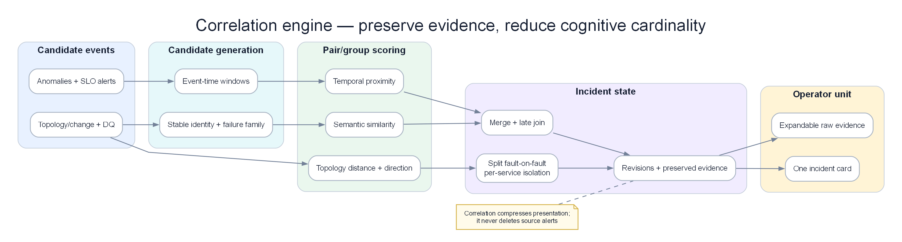

# Chapter 10 — Alert Correlation Engine

> **Liên kết cảnh báo (Alert correlation) là lớp đệm trung gian nằm giữa hệ thống phát hiện bất thường thô và sự tập trung của con người. Nhiệm vụ của nó: thu nhận hàng trăm sự kiện bất thường đồng thời gây ra bởi một nguyên nhân gốc rễ duy nhất, và tổng hợp thành một incident mạch lạc có ngữ cảnh đầy đủ. Đây là nơi mang lại ROI rõ ràng nhất cho hệ thống AIOps.**

*Poster: chuẩn hóa, dedup, ghép theo topology/thời gian rồi chủ động tách các fault nổ chồng.*

---

## Prerequisites

- [09 — Anomaly Detection](../09-anomaly-detection/README.vi.md) — sinh ra các sự kiện bất thường làm đầu vào tiêu thụ ở đây
- [03 — Prometheus](../03-prometheus/README.vi.md) — nguồn cảnh báo thông qua Alertmanager
- [07 — Kafka](../07-kafka/README.vi.md) — lớp vận chuyển cho các sự kiện bất thường

## Related Documents

- [11 — Root Cause Analysis](../11-root-cause-analysis/README.vi.md) — nhận các nhóm cảnh báo tương quan làm đầu vào
- [12 — LLM Agent](../12-investigation-engine/README.vi.md) — sử dụng ngữ cảnh tương quan để điều tra sự cố
- [03 — Prometheus](../03-prometheus/README.vi.md) — phân nhóm cảnh báo trên Alertmanager (mức độ liên kết đơn giản)
- [14 — Production Operations](../14-production-engine/README.vi.md) — SLO correlation engine, storm drills
- [15 — Pattern Library](../15-aiops-pattern-library/README.vi.md) — topology correlation và symptom compression patterns
- [16 — Domain Packs](../16-aiops-domain-packs/README.vi.md) — multi-region cascade và payment fan-out storms
- [17 — Benchmark Replay](../17-aiops-benchmark-replay/README.vi.md) — alert-storm và concurrent-fault scenarios

## Next Reading

Sau chương này, hãy chuyển sang [11 — Root Cause Analysis](../11-root-cause-analysis/README.vi.md).

---

## Table of Contents

1. [Why Alert Correlation?](#1-why-alert-correlation)
2. [Correlation Architecture](#2-correlation-architecture)
3. [Stage 1 — Deduplication](#3-stage-1-deduplication)
4. [Stage 2 — Grouping](#4-stage-2-grouping)
5. [Stage 3 — Topology-Aware Correlation](#5-stage-3-topology-aware-correlation)
6. [Stage 4 — Causal Ordering](#6-stage-4-causal-ordering)
7. [Stage 5 — Alert Enrichment](#7-stage-5-alert-enrichment)
8. [Correlation Algorithms Deep Dive](#8-correlation-algorithms-deep-dive)
9. [Service Dependency Graph](#9-service-dependency-graph)
10. [Temporal Correlation](#10-temporal-correlation)
11. [Semantic Similarity Correlation](#11-semantic-similarity-correlation)
12. [Incident Formation Rules](#12-incident-formation-rules)
13. [Production Configuration](#13-production-configuration)
14. [Common Mistakes](#14-common-mistakes)
15. [Monitoring the Correlation Engine](#15-monitoring-the-correlation-engine)
16. [Scaling](#16-scaling)
17. [Security](#17-security)
18. [Cost](#18-cost)
19. [Tư duy sâu: Topology stale, Time-window, Cascade vs Multi-failure, Storm UX](#19-tu-duy-sau-topology-stale-time-window-cascade-vs-multi-failure-storm-ux)
20. [Production Review](#20-production-review)

---

## Cách đọc chapter này: từ event stream đến incident có vòng đời

> [!IMPORTANT]
> **Chương này cố ý không chứa code triển khai.**
> Correlation engine production không phải hàm “group alerts trong 5 phút”. Nó quản lý một incident sống hàng chục phút: nhận evidence mới, giữ symptom đang firing, tách fault chồng, liên kết nhưng không merge khi còn mơ hồ, và chỉ resolve sau khi mọi recovery gate quan trọng đã qua.

| Bước đọc | Câu hỏi |
|----------|---------|
| 1. Vấn đề | Detector/engine này giải quyết pain gì (false positive, cascade, MTTR…)? |
| 2. Ý tưởng | Trực giác 2–3 câu, không công thức |
| 3. Data in | Metric/log/trace/event nào, window nào, feature nào? |
| 4. Thuật toán | Các bước tính toán / model flow |
| 5. Output | Schema sự kiện, score, rank, action proposal? |
| 6. Trade-off | Ưu / nhược / chi phí / giải thích được không? |
| 7. When | Dùng khi nào — và khi nào **đừng** dùng |

### Hợp đồng đầu ra của correlation engine

Với mỗi event, engine phải đưa ra một quyết định có thể audit:

| Decision | Nghĩa | Khi dùng |
|----------|-------|----------|
| Deduplicate | Cùng symptom identity; tăng occurrence | Cùng alert/service/scope, khác pod hoặc lần evaluate |
| Merge | Cùng một incident timeline và commander | Có path/failure-domain + thời gian + signal tương thích |
| Link | Hai incident riêng nhưng liên quan | Có shared context, chưa đủ chứng minh cùng fault |
| Split | Tách group đã merge khi evidence mới mâu thuẫn | Graph stale, root khác, recovery độc lập |
| Suppress-only | Event thuộc incident mở; không page lại | Cùng symptom episode đang active |
| Open-new | Fault độc lập hoặc regression mới | Service/failure-domain khác, onset mới, không được incident cũ giải thích |

“Suppress” không có nghĩa vứt event. Occurrence, severity, affected scope và timeline vẫn cập nhật. Một incident 60 phút chỉ page một lần nhưng phải hiện **vẫn đang tác động**, có heartbeat và escalation nếu xấu đi.

---

## 1. Why Alert Correlation?

> [!NOTE]
> **Ý TƯỞNG**
> Correlation không "giảm alert" bằng cách vứt thông tin — nó **nén cardinality sự kiện** thành **1 đơn vị nhận thức** (incident) mà não người có thể xử lý trong <2 phút. ROI lớn nhất của AIOps thường nằm ở lớp này, không phải ở LSTM hay LLM.

> [!TIP]
> **Metric thành công của correlation**: không phải "alerts suppressed %", mà là **median alerts-per-incident** (mục tiêu 5–20), **time-to-first-coherent-incident**, và **split/merge correction rate** sau postmortem.

### The Alert Storm Problem

Một sự cố đơn lẻ của dịch vụ microservice có thể kích hoạt chuỗi cảnh báo dây chuyền lên tới hàng trăm cảnh báo:

Ví dụ DB pool cạn lúc 10:00 tạo mỗi phút: 10 pod payment timeout, 6 pod checkout error, 3 gateway latency, hai SLO burn alert và một log-rate anomaly. Sau 30 phút có hơn 600 event nhưng chỉ một fault episode. Correlation tốt không biến 600 thành im lặng; nó giữ một incident với `occurrence_count=600`, 21 entity bị ảnh hưởng, severity timeline và trạng thái firing liên tục.

Nếu không có liên kết tương quan: kỹ sư sẽ nhận hơn 50+ thông báo PagerDuty đổ về liên tục. Tổng thời gian để tìm hiểu và hiểu vấn đề mất khoảng 20–40 phút.

Nếu có liên kết tương quan: kỹ sư chỉ nhận **1 incident duy nhất** với tiêu đề dạng: `"payment-service database connection exhaustion → cascading failure to order, checkout, api-gateway"`. Tổng thời gian để hiểu vấn đề: **< 2 phút**.

### What Alert Correlation Produces

Output là incident aggregate có identity ổn định, member events, first/last seen, active symptoms, recovered symptoms, topology paths, candidate roots, related incidents, decision log, lifecycle state và evidence quality. Incident ID không đổi chỉ vì alert tạm xanh một phút; nó chỉ resolve khi recovery policy thỏa.

---

## 2. Correlation Architecture

Engine có sáu stateful layer: normalize identity; dedup episode; group theo entity/failure signature; merge/link theo topology và time; quản lý lifecycle; enrich/publish. State partition theo tenant+service/failure-domain để một incident nóng không làm mất isolation của service khác.

### Event time, processing time và revision

Event 10:02 có thể tới lúc 10:05. Correlation dùng event time để đặt timeline, processing time để đo lag. Window không đóng cứng rồi quên; nó cho allowed lateness và revision. Late trace chứng minh hai group cùng cascade có thể chuyển LINK→MERGE, nhưng decision log phải ghi lý do. Late event không được hồi sinh incident đã resolve sau retention mà không tạo regression/reopen policy rõ.

### Incident state machine

| State | Ý nghĩa | Chuyển trạng thái |
|-------|---------|-------------------|
| Candidate | Chưa đủ persistence/impact | thêm event xác nhận hoặc hết TTL |
| Open | Đã notify, đang impact | symptom tiếp tục, escalation, link/split |
| Mitigating | Có action/change khắc phục | vẫn giữ open cho tới recovery gate |
| Recovering | SLI về baseline nhưng chưa đủ ổn định | relapse quay Open |
| Resolved | Recovery đủ lâu và không còn critical member | có regression mới trong reopen window |
| Closed | Hết reopen/late-event retention | chỉ attach evidence lịch sử |

Baseline detector và incident lifecycle là hai state khác nhau. Detector có thể tiếp tục gửi heartbeat hoặc active flag; correlation không resolve chỉ vì không nhận event mới nếu detector/data pipeline đang degraded.

### Data Flow Timing

Mục tiêu minh họa: t+0 nhận event đầu; t+1s dedup/group; t+3s topology candidate; t+5s mở incident skeleton; t+15s enrichment; evidence muộn tạo revision. Latency page không chờ causal analysis sâu. Khi backend Loki/Tempo down, skeleton vẫn đi với `partial=true`.

---

## 3. Stage 1 — Deduplication

Deduplication chịu trách nhiệm loại bỏ **các cảnh báo trùng lặp hoàn toàn hoặc gần như trùng lặp** bị kích hoạt lặp đi lặp lại. Đây là stage rẻ nhất và phải chạy **trước** topology/semantic — mỗi bản sao bạn giữ lại sẽ nhân chi phí và tải nhận thức ở downstream.

### Vấn đề / ý tưởng

| | |
|--|--|
| **Vấn đề** | Alertmanager đánh giá lại mỗi 15–30s; multi-pod và dual detector (Prometheus + anomaly ML) tạo **nhiều sự kiện cho một fault**. Không dedup thì correlation thấy 50 bản gần giống nhau và không tạo được incident sạch. |
| **Ý tưởng** | Fingerprint theo **định danh ổn định** (alertname + service + namespace + severity), bỏ label biến động (`pod`, `instance`), giữ sự kiện đầu trong cửa sổ TTL và **đếm** các lần sau. |

### Input từ AIOps data plane

| Input | Nguồn | Vai trò |
|-------|--------|---------|
| Alert / anomaly đã normalize | Kafka `aiops-anomalies`, Alertmanager webhook | Stream thô cần gộp |
| Label chuẩn (`service`, `namespace`) | [06 — Data Plane](../06-data-plane/README.vi.md) enrich | Trường fingerprint ổn định |
| Label pod / instance | K8s / Prometheus | **Bỏ khỏi key**; chỉ dùng cho `affected_pods[]` |
| Cửa sổ dedup (TTL) | Config (thường 60–300s) | “Cùng một alert” trong bao lâu |

### Cách hoạt động (các bước)

Enrichment chạy theo budget và priority. Metric impact/current-vs-baseline, recent change và topology path đi trước; top log template/trace exemplar sau; runbook cuối. Mỗi artifact có freshness, coverage và query link. Không copy 200 log lines vào page. Khi evidence mới đổi failure signature, engine được split/re-rank incident thay vì coi enrichment chỉ trang trí.
1. Canonicalize service, signal, failure mode, namespace/tenant và direction.
2. Tạo fingerprint chỉ từ field ổn định; giữ pod/instance/version làm scope metadata.
3. Tìm episode active cùng key. Nếu có, tăng occurrence và cập nhật last_seen/severity/scope.
4. Nếu event biểu diễn **recovery**, cập nhật member state chứ không tạo alert mới.
5. Nếu key giống nhưng episode trước đã resolve ngoài reopen window, mở episode mới.
6. Nếu một field bị strip có khả năng phân biệt fault (region, dependency, error class), không dedup mù; đưa vào split dimension hoặc giữ subkey.

### Output / on-call thấy gì

Card tối thiểu nói: incident đang open bao lâu; customer impact/burn; active/recovered symptoms; candidate origin và topology path; change gần; 1–3 evidence cụ thể; related incident; quyết định merge/link cùng confidence; data gaps; owner/runbook. Với incident dài, card có timeline delta “15 phút qua error 8→12%, thêm auth-cache incident riêng”, không spam lại toàn nội dung.
| Trường | Ví dụ | Ý nghĩa |
|--------|-------|---------|
| `dedup_key` | `dedup:a3f2…` | Định danh ổn định của symptom |
| `occurrence_count` | `12` | Mức ồn của tín hiệu |
| `affected_pods` | `[pod-a, pod-b, pod-c]` | Độ lan của fault |
| `first_seen` / `last_seen` | ISO timestamps | Thời lượng mà không flood page |

On-call **không** nhận 12 page cho một HighCPU — nhận **một** dòng với `pod_count=3` rồi gộp vào incident card.

### Ưu / nhược + khi nào dùng

| Ưu | Nhược |
|------|------|
| O(1)/event; vận hành đơn giản | Fingerprint quá mạnh có thể giấu failure **khác biệt** (strip nhầm label) |
| Giảm ồn ngay trước topology | Under-dedup nếu thiếu/rename `service` |
| Giữ multiplicity dạng metadata | Không hiểu cascade — đó là Stage 3–4 |

| Dùng khi | **Không** chỉ dựa dedup khi |
|----------|---------------------------|
| Mọi path production Alertmanager / multi-replica | Cần root nhân quả (cần topology + ordering) |
| Dual detector (rules + ML) | Storm multi-service shared-infra (cần topology merge) |

### Types of Duplicates

| Loại | Ví dụ | Xử lý |
|------|-------|-------|
| Re-evaluation | Cùng HighError mỗi 30 giây | Một episode, occurrence tăng |
| Replica fan-out | 12 pod cùng dependency timeout | Một service symptom, giữ pod_count |
| Dual detector | Static SLO + anomaly detector cùng error rate | Merge evidence family, không hai vote độc lập |
| Alias | `payment-api` và `pay-svc` cùng workload | Entity resolver trước fingerprint |
| Near duplicate | latency high và SLO burn cùng service | Không dedup; group vì semantics khác |

### Case: dedup quá mạnh che fault thứ hai

Payment có error class `DB_TIMEOUT` từ 10:00, sau đó `TLS_CERT_EXPIRED` từ 10:25. Nếu fingerprint chỉ là `(HighError,payment)`, fault thứ hai bị cộng occurrence vào episode đầu và không bao giờ tạo candidate mới. Fingerprint cần failure signature/error family hoặc change-point check. Hai symptom cùng service nhưng origin khác phải thành hai sub-episodes, có thể thuộc hai incident.

Ngược lại, đưa `pod` vào key tạo 30 episode khi DB chung lỗi. Quy tắc: field mô tả **instance bị ảnh hưởng** là aggregation metadata; field mô tả **failure mode/failure domain** có thể là identity.

### Dedup trong incident dài

TTL không phải thời lượng tối đa incident. Mỗi heartbeat làm `last_seen` tiến lên, nhưng `first_seen` giữ nguyên. Nếu event mất ba phút vì scrape gap, incident không tự resolve nếu active-state chưa nhận recovery và data freshness đỏ. Cần hai timer: dedup quiet period và lifecycle recovery gate. Trộn chúng tạo “khoảng câm” giữa incident dài.

---

## 4. Stage 2 — Grouping

Sau khi khử trùng lặp, gom nhóm các cảnh báo còn lại dựa trên **các thuộc tính chung**. Grouping là cầu nối từ “symptom duy nhất” sang “túi ứng viên incident” để topology merge hoặc split.

### Vấn đề / ý tưởng

| | |
|--|--|
| **Vấn đề** | Sau dedup vẫn còn nhiều **alertname khác nhau** trên cùng service (error_rate, latency, CPU, SLO burn). Mỗi cái một incident = storm ở mức service. |
| **Ý tưởng** | Gom theo **khóa chính** (thường `service`, rồi namespace/time cho orphan) để một fault service = một group; liên kết cross-service để Stage 3. |

### Input từ AIOps data plane

| Input | Nguồn | Vai trò |
|-------|--------|---------|
| Event đã dedup | Stage 1 | Stream gọn hơn |
| Label service / job / namespace | Data plane canonical | Group key |
| Time window buffer | Redis sorted set / in-mem (mặc định 5m) | Ai “đồng thời” |
| Severity | Alertmanager | Severity group = max members |

### Cách hoạt động (các bước)

1. Gom event dedup theo canonical service/workload và time proximity ngắn để tạo service symptom group.
2. Tách theo failure family: resource saturation, dependency error, deploy regression, data-quality; không trộn chỉ vì cùng service.
3. Giữ direction và episode: traffic drop khác latency spike; recovery khác fault mới.
4. Tính group severity từ customer impact/burn, không chỉ max member.
5. Group mới được so với incident active: explained-by, same-domain, temporal fit và contradiction.
6. Nếu score cao và không veto → merge; trung bình → link; thấp hoặc independent signature → open-new.

### Output / on-call thấy gì

Chưa phải full incident card — intermediate:

### Ưu / nhược + khi nào dùng

| Ưu | Nhược |
|------|------|
| Giải thích được, deterministic | Chỉ theo service sẽ **under-merge** cascade thật |
| Nhanh; partial incident sớm | Thiếu label `service` → bucket “unknown” rác |
| Đơn vị tự nhiên để suppress khi incident mở | Rename service làm gãy group cho đến khi data plane sửa |

| Dùng khi | **Không** dừng ở đây khi |
|----------|---------------------------|
| Luôn là Stage 2 | Cascade checkout→payment→db (cần Stage 3) |
| Storm ồn single-service | Multi-failure độc lập chỉ chung time window |

### Grouping Dimensions

| Dimension | Dùng để | Rủi ro |
|-----------|---------|--------|
| Service/workload | Nén multi-signal cùng component | Rename/alias làm split |
| Failure signature | Tách TLS, DB timeout, OOM | Parser quá chi tiết làm fragment |
| Region/AZ/tenant | Tách failure domain | Global root có thể bị chia quá sớm |
| Version/change cohort | Nhìn canary regression | Rollout lan dần cần late merge/link |
| Direction | Tách drop/spike/recovery | Cascade có cả tăng retry và giảm success |
| Time episode | Tách regression | Window quá dài over-merge |

### Per-service isolation: incident đầu không che incident sau

State không có một “global incident đang mở”. Mỗi service/failure-domain giữ sub-episode riêng, sau đó topology layer quyết định merge/link. Khi DB incident đang mở, auth-cache anomaly mới vẫn qua detector/dedup/group bình thường; suppression lookup theo `parent_incident_id + explained scope`, không theo “cluster đang P1”.

Ví dụ 10:00 payment DB timeout; 10:22 auth 401 do cache eviction. Payment incident cover topology `{ledger-db,payment,checkout,web}`. Auth-cache thuộc component `{auth-cache,auth}` không có active path/shared resource; overlap time không đủ. Engine mở INC-B, có thể link `same_region/time` với INC-A nhưng không merge. Global maintenance silence hoặc catch-all `incident_open=true` sẽ bỏ lọt B.

---

## 5. Stage 3 — Topology-Aware Correlation

Đây là lớp liên kết tương quan mạnh mẽ nhất. Nó tận dụng **sơ đồ phụ thuộc dịch vụ (service dependency graph)** để hiểu cảnh báo liên hệ nhân quả thế nào — không chỉ “cùng thời điểm”, mà “cùng failure domain”.

### Vấn đề / ý tưởng

| | |
|--|--|
| **Vấn đề** | Chỉ group theo time-window sẽ **over-merge** outage độc lập và **under-merge** cascade chậm hop-by-hop giữa services. |
| **Ý tưởng** | Nếu A gọi B và cả hai alert trong cửa sổ correlation, chúng có khả năng chung một incident; đi theo cạnh (và node infra dùng chung: DB, Kafka, cache) để merge group và ước lượng impact radius. |

> [!WARNING]
> Topology correlation chỉ tốt bằng độ tươi của graph. **Graph stale còn tệ hơn không có graph** (false merge / đảo root). Xem [§19.1](#191-topology-stale-graph-te-hon-la-khong-co-graph).

### Input từ AIOps data plane

| Input | Nguồn | Vai trò |
|-------|--------|---------|
| Service groups | Stage 2 | Node đang “đỏ” |
| Cạnh phụ thuộc | OTel SpanMetrics, mesh, catalog | Caller → callee |
| Node infra dùng chung | Data plane / CMDB | DB, queue, CDN là first-class |
| Age / coverage graph | Topology side plane ([08](../08-topology-change/README.vi.md)) | Gate: dùng / degrade / tắt topology |
| Call rate, error edge | Span metrics | Trọng số cạnh; ưu tiên hot path |

### Cách hoạt động (các bước)

1. Lấy service groups và graph snapshot theo incident time.
2. Chỉ kích hoạt edge có traffic/span trong cửa sổ; edge catalog không hoạt động không được nối group.
3. Tìm path có hướng trong hop limit và shared resource/failure domain.
4. Tính merge score từ path strength, edge traffic, onset lag phù hợp, failure signature compatibility và shared change.
5. Áp veto: component tách rời, error family mâu thuẫn, recovery độc lập, two scoped changes khác nhau, graph stale/low coverage.
6. Merge khi score vượt ngưỡng và không veto; nếu mơ hồ thì link để giữ hai timeline.
7. Re-evaluate khi graph/evidence mới đến; split phải giữ audit và notification continuity.

### Case bằng số: cascade thật

Graph `web→checkout→payment→ledger-db`. Onset: ledger pool wait 10:00:10, payment timeout 10:00:32, checkout error 10:00:51, web success drop 10:01:05. Active edge traffic lần lượt 600, 900, 1.100 RPS; failure signature dependency timeout tương thích. Path strength 0,95, temporal fit 0,88, signature 0,9, shared trace 0,92; merge score cao. Bốn groups thành một incident nhưng member state riêng, để recovery propagate DB→payment→checkout.

### Case bằng số: cùng thời gian nhưng độc lập

Payment DB timeout 10:00 và search index lag 10:01 sau batch. Catalog có cả hai sau API gateway, nhưng không có path giữa chúng; change IDs khác; signatures `pool_timeout` và `index_refresh_lag`; recovery payment 10:20, search 10:45. Temporal score 0,9 không thắng topology/signature veto. Engine mở hai incident và có thể link “same customer journey” cho commander, không merge.

### Downstream weighting không được biến thành merge oracle

Shared gateway có 200 downstream nên blast radius lớn nhưng thường là symptom. Impact weighting dùng để severity/routing, không chứng minh common root. Edge activation, direction và origin evidence quyết định merge. Một low-traffic internal DB gây 30 batch alerts có node count lớn nhưng business impact thấp; một payment path ba node có revenue weight cao. Card hiển thị cả affected count và weighted impact, tránh score bí ẩn.

### Output / on-call thấy gì

| Trường | Ý nghĩa |
|--------|---------|
| `merged_services[]` | Service gộp vào một incident |
| `topology_paths[]` | Vì sao liên kết (danh sách cạnh) |
| `impact_radius` | Ai sẽ đau nếu root vẫn hỏng |
| `topology_confidence` / `graph_age_s` | Tín hiệu tin cậy trên card |
| `decision` | `merge` \| `link` \| `split_candidate` |

### Ưu / nhược + khi nào dùng

| Ưu | Nhược |
|------|------|
| Bắt cascade thật; ROI lớn sau dedup | Cần graph + node infra được maintain |
| Hỗ trợ hướng RCA đúng sau này | Cạnh stale/đảo chiều đầu độc chọn root |
| Severity theo impact | Graph thưa under-merge service mới |

| Dùng khi | **Không** dùng khi |
|----------|---------------------|
| Microservice có tracing hoặc mesh | Graph age cao / coverage thấp (fallback temporal) |
| Storm fan-out shared DB/Kafka | Chỉ có hostname, không service map |

### Service Dependency Graph Sources

Ưu tiên trace/service-mesh runtime cho active call edge; catalog/CMDB bổ sung database, queue, DNS, region và data pipeline. Mỗi edge có source, direction, first/last seen, request rate, error rate, confidence và age. Xung đột direction không tự chọn; degrade/link cho đến khi xác minh.

### Building the Dependency Graph from Traces

Aggregate nhiều trace thành edge theo window, không thêm edge từ một trace debug hiếm. Tail sampling thiên về error nên call-rate phải lấy metric khác hoặc hiệu chỉnh. Async Kafka không có parent span trực tiếp vẫn cần producer→topic→consumer data edge; nếu thiếu, cascade chậm qua queue dễ bị under-merge.

---

## 6. Stage 4 — Causal Ordering

Từ một nhóm cảnh báo tương quan, xác định service nào là **nguyên nhân gốc (root cause)** và service nào là **triệu chứng cascade**. Correlation gộp nhóm; causal ordering **xếp vai trò** để on-call không restart gateway leaf trước.

### Vấn đề / ý tưởng

| | |
|--|--|
| **Vấn đề** | Trong một incident, 10 service đỏ. Không thứ tự, người ta fix symptom (scale gateway) trong khi DB pool vẫn cạn. |
| **Ý tưởng** | Kết hợp **thời điểm symptom sớm nhất** với **độ sâu dependency**: trong band gần đồng thời, ưu tiên service bị phụ thuộc (callee sâu / shared dep) làm root candidate; caller = symptom. |

> [!NOTE]
> Đây vẫn là **giả thuyết cho RCA**, chưa phải chứng minh causation. Chương 11 thêm confounder change, evidence quality, multi-root. Correlation ≠ causation vẫn đúng.

### Input từ AIOps data plane

| Input | Nguồn | Vai trò |
|-------|--------|---------|
| Incident group đã merge | Stage 3 | Service + first_alert times |
| Dependency graph | Topology plane | Khoảng cách và hướng |
| Time tolerance (vd. 120s) | Config | Band “đồng thời” (clock skew + detect lag) |
| Change events (tuỳ chọn) | Deploy / config stream | Prior mềm (chưa full RCA) |

### Cách hoạt động (các bước)

1. Dùng onset **interval** đã bù detector delay/clock skew, không sort `alert.created_at`.
2. Trong các onset không chồng nhau, upstream/callee đỏ trước là evidence propagation; interval chồng nhau coi near-simultaneous.
3. Dùng direction graph: callee failure có thể lan tới caller; caller overload cũng có thể lan xuống, nên giữ signature/load evidence.
4. Node giải thích được nhiều downstream active nhận root-candidate weight; node chỉ đỏ sau retry/cancellation nhận symptom penalty.
5. Recovery order cập nhật role: root hồi trước downstream củng cố; recovery độc lập gợi ý split/multi-failure.
6. Không “chốt root” tại Chapter 9; xuất ordered candidates và uncertainty cho RCA Chapter 11.

### “Đỏ trước” dùng để loại tương quan sai

Nếu checkout onset chắc chắn 10:00–10:00:10, payment onset 10:04–10:04:20 và giả thuyết là payment gây checkout qua call path, thời gian phản bác: effect không thể trước cause bốn phút, trừ telemetry/latent state có giải thích. Engine hạ merge/cause edge hoặc tìm cached/config trigger.

Nếu payment alert đến 10:04 nhưng raw onset interval 09:59–10:01 do detector persistence, interval chồng checkout; không loại. Timestamp chính xác giả từ pipeline không chính xác là nguồn false split phổ biến.

### Retry đảo độ đỏ

DB chậm làm payment retry tăng; payment CPU đỏ hơn DB và alert sớm hơn vì detector CPU nhạy. Causal ordering dùng trace origin, retry signature và raw onset để đặt DB candidate trước. Nếu chỉ max severity + alert time, engine gắn tiêu đề “payment CPU → DB” sai và enrichment dẫn on-call scale payment, khuếch đại DB.

### Output / on-call thấy gì

Tiêu đề incident actionable: `payment-service … → cascade to order, gateway` thay vì `many alerts`.

### Ưu / nhược + khi nào dùng

| Ưu | Nhược |
|------|------|
| Ordering rẻ; UX lớn | Clock skew / metric trễ đảo thời gian |
| Khớp mental model cascade | Lỗi AZ shared đánh lừa pure service-graph |
| Nuôi RCA và remediation allowlist | Thiên kiến single-root — multi-root cần Ch10 |

| Dùng khi | **Không** tin mù khi |
|----------|-------------------------------|
| Mesh caller→callee rõ | Hướng graph không rõ hoặc stale |
| Pattern cascade kinh điển | Dual failure độc lập (dùng split/link) |

### Algorithm: Topological + Temporal Analysis

Đây là heuristic ordering, không causal proof. Với shared AZ/DNS, service graph tạo nhiều leaf đỏ và không có path; engine phải sinh shared-infra candidate hoặc multi-failure, không chọn ngẫu nhiên service sâu nhất. Kết quả luôn kèm graph age, interval uncertainty và contradictions.

---

## 7. Stage 5 — Alert Enrichment

Enrichment bổ sung **ngữ cảnh** để incident gộp lại **hành động được ngay**. Không enrichment, correlation chỉ giảm số lượng; có enrichment, page đầu trả lời “cái gì / ở đâu / change gần đây / runbook nào”.

### Vấn đề / ý tưởng

| | |
|--|--|
| **Vấn đề** | Group sạch với root=`payment-service` vẫn buộc on-call mở 5 tab (Prom, Loki, Tempo, deploy, wiki). Đốt hết MTTR mà correlation vừa tiết kiệm. |
| **Ý tưởng** | Song song gắn **link + snippet evidence** (error, trace, metric, deploy, runbook) để incident card là **bàn làm việc**, không chỉ tiêu đề. |

### Input từ AIOps data plane

| Input | Nguồn | Vai trò |
|-------|--------|---------|
| Skeleton incident | Stage 1–4 | Root, services, window |
| Snapshot metric | Prometheus | Error rate, saturation, burn |
| Error log | Loki | Template / top message |
| Trace | Tempo | Exemplar trace id, span chậm |
| Change | CI/CD / [08 Topology & Change](../08-topology-change/README.vi.md) | Deploy trong impact window |
| Runbook index | Wiki / Git | Deep link theo failure_mode |

### Cách hoạt động (các bước)

### Output / on-call thấy gì

### Ưu / nhược + khi nào dùng

| Ưu | Nhược |
|------|------|
| Nhảy vọt *time-to-understanding* | Fan-out query +1–5s; phụ thuộc stack observability |
| Partial vẫn hữu ích | Over-enrich làm ngập card (cần cap) |
| Nuôi LLM agent / RCA có cite | Runbook stale gây lệch (content ownership) |

| Dùng khi | **Không** chặn page khi |
|----------|----------------------------|
| Luôn với P1/P2 pageable | Loki/Tempo down — ship skeleton + banner |
| Trước LLM investigation | Enrichment vượt page SLO — attach sâu sau |

---

## 8. Correlation Algorithms Deep Dive

Bên cạnh quan hệ topology, một số thuật toán bổ sung giúp nâng cao độ chính xác của tiến trình liên kết.

### Algorithm 1: Temporal Sliding Window

Window chỉ sinh **candidate pairs**, không quyết định merge. Event A 10:00 và B 10:04 trong window 5 phút có temporal proximity cao; nếu graph/signature mâu thuẫn, vẫn split. Cascade qua queue có thể trễ 12 phút; fixed window 5 phút under-merge. Dùng adaptive window theo edge latency/failure class và late-link tốt hơn tăng global window lên 30 phút.

Case: DB error 10:00, payment 10:01, checkout 10:02 là cascade. Search batch fail 10:03 chỉ cùng thời gian. Time-only gộp cả bốn; topology+signature giữ search riêng. Window càng dài càng tăng recall pair nhưng giảm precision, nên measure human split rate.

### Algorithm 2: Label-Based Fingerprinting

Hai cảnh báo được coi là có tương quan nếu chúng có tỷ lệ trùng lặp nhãn (label overlap) ở mức cao:

Không đếm mọi label ngang nhau. `service`, `namespace`, `region`, `failure_family` có trọng số; `pod`, `instance`, `trace_id` thường không. Alert A `{service=payment, region=sg, error=db_timeout}` và B `{service=payment, region=sg, error=tls}` giống service/region nhưng failure family khác; nên cùng service group nhưng không dedup và có split veto. A với C `{service=checkout, region=sg, error=dependency_timeout}` khác service nhưng topology nối; label similarity thấp vẫn merge được.

Missing label không được biến thành wildcard. Bucket `service=unknown` có thể hút hàng nghìn event; quarantine/enrich trước hoặc group thận trọng theo source/job.

### Algorithm 3: Mutual Information (Statistical Correlation)

Đối với các điểm số bất thường dạng chuỗi thời gian, sử dụng độ tương hỗ thông tin (mutual information) để phát hiện sự tương quan bất thường:

MI bắt quan hệ phi tuyến nhưng không có direction/causation và dễ cao vì seasonality chung. CPU checkout và RPS payment cùng tăng mỗi tối dù không fault. Tính trên residual đã loại seasonality, so với null/permutation và yêu cầu topology/change hỗ trợ. Với incident ngắn 8 điểm, MI không ổn định; không dùng nó phủ quyết evidence trực tiếp.

Chuỗi DB wait **[10,12,15,300,600,700]** và payment retry **[0,1,1,5,30,60]** liên hệ mạnh; temporal lag/trace giúp direction. Chuỗi campaign RPS **[100,200,300,400,500,600]** và CPU **[30,40,50,60,70,80]** cũng liên hệ mạnh nhưng hợp lệ. Statistical correlation là feature, không merge oracle.

---

## 9. Service Dependency Graph

Graph production gồm call edge, async/data edge và failure-domain membership. Service-only graph bỏ DB/Kafka/DNS/AZ sẽ over-split shared outage. Node/edge đều versioned và query “as of incident time”.
### Building from OpenTelemetry Service Graph Metrics

Trình sinh metrics của Tempo sản sinh ra các metrics dạng `traces_service_graph_*` mô tả thông tin phụ thuộc:

### Maintaining the Graph in Redis

Storage implementation không quan trọng bằng semantics: atomic snapshot/version, TTL khác nhau theo source, edge activation window, confidence và tombstone. Khi service deploy đổi topology, giữ old/new overlap để trace late vẫn resolve. Không xóa cạnh chỉ vì 5 phút không traffic nếu đó là low-frequency payment path; chuyển inactive và không dùng merge cho current incident.

### Graph freshness và coverage gate

Age 5 phút nhưng coverage 20% vẫn xấu; age 20 phút trên hệ ổn định có thể dùng được. Gate kết hợp age, fraction service có edge, active traffic represented và direction conflicts. Khi quality thấp, topology chỉ tạo LINK/possible path, không hard MERGE. Card phải hiện “graph covers 62% affected traffic”.

---

## 10. Temporal Correlation

### Cross-Correlation for Time-Series Alignment

Tính tương quan chéo (cross-correlation) giúp nhận định độ lệch thời gian (time shift) giữa hai chuỗi bất thường. Độ lệch dương thể hiện bất thường của service A xuất hiện trước bất thường của service B — bằng chứng phản ánh A có thể là nguyên nhân gây ra B.

Ví dụ A score **[0,0,1,4,8,7,5]**, B **[0,0,0,1,4,8,7]**; B giống A trễ một bước, phù hợp cascade. Nhưng detector A scrape 60 giây, B 15 giây có thể đảo lag. Resample/alignment, detector delay và confidence interval bắt buộc. Nếu series có autocorrelation mạnh, nhiều lag đều cao; dùng onset/trace hơn một peak correlation giả chính xác.

Temporal correlation trong incident dài phải chạy trên residual/episode transition, không toàn level. Hai service cùng giữ score=1 suốt 40 phút có correlation không cung cấp thông tin; transition onset/recovery mới giúp.

---

## 11. Semantic Similarity Correlation

Đối với tên cảnh báo và mô tả cảnh báo thô, sử dụng độ tương đồng vector biểu diễn (embedding similarity) để tìm các cảnh báo có nội dung ngữ nghĩa liên quan (ngay cả khi nhãn của chúng không khớp):

Semantic matching hữu ích cho alias như “connection pool exhausted” và “unable to acquire DB connection”, nhưng rất dễ merge các error chung “timeout”, “unavailable”. Chỉ dùng sau redaction, trong tenant/domain, cùng time/scope và như feature mềm. Template ID/error code đáng tin hơn embedding text.

Case: `payment: upstream timeout` và `checkout: payment unavailable` semantic+topology khớp. `search: Elasticsearch timeout` cùng chữ timeout nhưng graph/change khác; embedding 0,87 không được merge. Lưu exemplar và similarity contribution để human split audit.

---

## 12. Incident Formation Rules

Sau khi tính toán tương quan, áp dụng bộ quy tắc để gán độ nghiêm trọng (severity) và định tuyến xử lý sự cố:

### Merge score và veto

Minh họa score: topology/path 0,30; failure signature 0,20; temporal fit 0,15; shared trace 0,15; shared change 0,10; statistical/semantic 0,10. Score ≥0,75 merge; 0,55–0,75 link; dưới 0,55 split. Nhưng veto thắng score: confirmed independent roots, incompatible tenant/region, onset effect trước cause vượt uncertainty, recovery độc lập hoặc security boundary.

Không coi số trên là xác suất. Calibrate theo human split/merge/postmortem, version policy, log feature contributions. Nếu topology missing, redistribute weight có thể làm semantic chiếm quá lớn; tốt hơn hạ confidence và dùng LINK.

### Severity của incident

Severity không phải max alert mù. Dùng SLO burn/customer impact, criticality, blast radius, duration và trajectory. CPU P1 false trong internal service không nâng incident; payment success burn nâng. Incident đang P2 có error tăng 2→15% hoặc thêm region phải escalate, nhưng không tạo incident mới nếu cùng fault.

### Lifecycle và reopen

Open khi persistence/impact đạt gate; suppress member notifications nhưng giữ active. Recovering khi critical symptoms về baseline; resolve sau 5–15 phút ổn định tùy service. Reopen cùng incident nếu same failure signature tái phát trong 30 phút và root/action chưa đổi; mở regression child nếu recovery đã được xác nhận rồi failure mới khác signature/version.

---

## 13. Production Configuration

### Kafka Consumer Configuration

Partition key chỉ theo service làm per-service ordering tốt nhưng cascade cross-service nằm nhiều partition; correlation cần shared state/incident coordinator. Partition theo tenant+failure-domain nếu có, hoặc service stage gửi group tới topology coordinator partition theo candidate incident. Exactly-once notification dựa idempotency key `(incident_id,revision,channel)`, không dựa ảo tưởng transport exactly-once.

### Correlation Engine Configuration

Các tham số phải versioned và thay đổi qua shadow/replay: dedup quiet, grouping window, allowed lateness, merge/link threshold, max hops, graph quality gate, recovery duration, reopen window, per-tenant budget. Không dùng một window/threshold cho batch, HTTP realtime và async queue. Config theo service tier/failure class nhưng có default an toàn.

### State durability

State gồm dedup episode, incident membership, active/recovery member, decision log và notification revision. Restart worker không được quên incident 45 phút đang mở rồi page lại 100 alerts. Checkpoint/event-sourcing cùng idempotent replay; state schema migration có compatibility. Khi Redis unavailable, degraded mode có thể giữ local cache nhưng phải tránh hai worker tạo hai incident; notification gate cần leader/idempotency store.

---

## 14. Common Mistakes

| Sai lầm phổ biến | Triệu chứng | Khắc phục |
|---------|---------|-----|
| Cửa sổ tương quan quá ngắn | Các cảnh báo có liên quan không được gộp vào cùng một nhóm | Tăng thời gian cửa sổ lên khoảng từ 5–10 phút |
| Không cấu hình dependency graph | Việc phân nhóm chỉ dựa thuần túy vào nhãn service đơn lẻ | Xây dựng sơ đồ phụ thuộc dịch vụ tự động từ SpanMetrics |
| Không cập nhật dependency graph định kỳ | Các thay đổi kiến trúc mới không được cập nhật kịp thời gây mất tương quan | Chạy cập nhật sơ đồ định kỳ mỗi 5–15 phút |
| Cơ chế Dedup quá mạnh mẽ | Lỗi xuất hiện trên nhiều pods bị thu gọn làm mất thông tin cảnh báo chung | Duy trì và hiển thị tham số pod count trong thông tin cảnh báo sau gộp |
| Thiếu cấu hình xác định thứ tự nhân quả | Incident hiển thị sai dịch vụ nguyên nhân gốc rễ | Áp dụng thuật toán xếp hạng xếp chồng cả temporal + topological |
| Triển khai correlation engine dạng single pod | Tạo ra điểm chết duy nhất (SPOF) cho toàn bộ luồng tạo incident | Triển khai tối thiểu từ ≥2 replicas chạy song song |
| Không gộp chung cảnh báo Alertmanager + Anomaly Detector | Sinh ra nhiều incidents trùng lặp cho cùng một vấn đề | Hợp nhất toàn bộ các nguồn cảnh báo đầu vào về chung một Kafka topic |
| Thiếu cấu hình timeout khi làm giàu thông tin | Tiến trình enrichment bị nghẽn làm chậm thời gian sinh incident | Chạy các tác vụ làm giàu thông tin song song kết hợp đặt timeout tối đa 5s |

---

## 15. Monitoring the Correlation Engine

| Nhóm | Metric cần xem |
|------|---------------|
| Input | event freshness, late rate, schema reject, source gaps |
| Compression | raw events/incident, duplicate ratio, page reduction |
| Quality | human split rate, human merge rate, postmortem purity/completeness |
| Latency | first coherent incident, enrichment revision, notification |
| Lifecycle | reopen rate, premature resolve, open-without-heartbeat, stale incident |
| Isolation | new incident detection while another P1 open, cross-tenant merge = 0 |

Compression cao không luôn tốt. 1.000 events/incident có thể là storm nén đúng hoặc over-merge toàn region. Pair với split rate, topology coverage và weighted symptoms. Synthetic drills bơm hai faults độc lập chồng nhau để kiểm tra engine tạo hai incident.

### Alerting Rules

Page platform khi correlation lag vượt page SLO, state unavailable gây duplicate notification, cross-tenant merge, no synthetic incident, hoặc raw-page bypass. Tạo ticket khi split/merge correction/calibration drift. Một incident mở 24 giờ có thể hợp lệ nhưng cần stale-owner escalation, không tự resolve.

---

## 16. Scaling

Dịch vụ correlation engine được thiết kế **có trạng thái** (lưu trữ và duy trì các cửa sổ tương quan trong Redis). Phương án mở rộng:

1. **Theo chiều dọc (Vertical)**: Tăng dung lượng bộ nhớ cấp phát để lưu trữ các cửa sổ tương quan lớn hơn
2. **Theo chiều ngang (Horizontal) kết hợp phân vùng**: Định tuyến các cảnh báo của cùng một service về cùng một instance của correlation engine (áp dụng sticky partitioning theo nhãn service)

Hot key là shared gateway/region incident với hàng triệu events. Dedup local/pre-aggregate trước coordinator; cap member samples nhưng giữ counts/histogram. Fairness theo tenant để một alert storm không làm chậm incident thứ hai. Topology lookup cached theo snapshot; semantic/MI chỉ chạy candidate pairs, không O(n²) toàn window.

Rebalance consumer có thể đổi ownership giữa incident; state transfer/checkpoint và fencing ngăn hai owner update. Scale test phải gồm long-running incident qua deploy/rebalance, không chỉ throughput stateless.

---

## 17. Security

- Toàn bộ kết nối với Kafka bắt buộc cấu hình SASL/SSL (chi tiết tại Chương 06)
- Trạng thái lưu trữ trên Redis được mã hóa cả khi lưu trữ tĩnh và truyền tải (ElastiCache TLS)
- Các cuộc gọi API làm giàu thông tin (Enrichment API) sử dụng giao thức mTLS nội bộ
- Cơ sở dữ liệu lưu trữ incidents (Postgres/DynamoDB) được mã hóa bằng KMS
- Kết nối webhook gửi tới PagerDuty sử dụng giao thức HTTPS đi kèm signing secret xác thực

Correlation có nguy cơ leak tenant vì semantic/grouping trên text chung. Tenant là hard partition/veto, không similarity feature. Incident card redaction trước enrichment; trace/log link giữ auth. Human merge/split/silence là privileged action có audit, scope và expiry. Attacker có thể tạo cardinality labels làm state exhaustion; enforce quotas và normalize dynamic fields.

---

## 18. Cost

| Thành phần | Chi phí hàng tháng |
|-----------|-------------|
| Correlation Engine (2× m6i.large) | $240 |
| Redis (ElastiCache r6g.large, cặp HA pair) | $480 |
| Incident Store (RDS Postgres db.t4g.medium) | $55 |
| **Tổng cộng** | **~$775/tháng** |

Con số chỉ minh họa. Cost thực theo raw events/s, active episodes, graph candidate pairs, state retention và enrichment query. Dedup 100.000 events xuống 2.000 groups trước semantic/topology tiết kiệm chính. Theo dõi cost/1.000 events, state bytes/active incident, enrichment bytes và hot-tenant share. Đừng giảm cost bằng cách xóa member timeline cần audit; sample exemplar nhưng giữ aggregate.

---

## 19. Tư duy sâu: Topology stale, Time-window, Cascade vs Multi-failure, Storm UX

### 19.1 Topology stale graph — tệ hơn là không có graph

> [!WARNING]
> **Graph sai tệ hơn no-graph.** Không có topology, bạn chỉ **under-merge** (nhiều incident rời). Graph stale có edge sai sẽ **over-merge** hoặc **đảo root cause** — on-call tin 1 câu chuyện sai và mất 20–40 phút.

| Kiểu stale | Triệu chứng | Hậu quả | Mitigation |
|------------|-------------|---------|------------|
| Edge đã chết (service gỡ dep) | Vẫn merge A↔B | False merge 2 incidents độc lập | TTL edge; decay weight theo last_seen_call |
| Edge mới chưa có (service mới) | Không merge cascade thật | Alert storm vẫn page rời | Bootstrap từ SpanMetrics 5–15 phút; fallback temporal+label |
| Chiều edge đảo (client/server nhầm) | Root = downstream | RCA/remediation sai hướng | Validate bằng trace parent-child + server span |
| Missing shared dependency (DB/Kafka) | 2 service lỗi cùng lúc không merge | On-call nghĩ 2 outage | Thêm infra nodes (db, queue, cache) vào graph |
| Multi-cluster mù | Cross-cluster cascade tách incident | MTTR tăng | Cluster-aware graph + shared resource edges |

> [!IMPORTANT]
> Khi `stale_graph=true`, **tắt** causal ordering dựa topology; chỉ temporal clustering + hiển thị banner: *"Topology outdated — correlation confidence reduced"*. Đừng im lặng dùng graph thối.

**Operational rule**: refresh graph mỗi 5–15 phút; metric `aiops_topology_graph_age_seconds`; page platform nếu age > 30 phút. Domain semantics cho multi-region: [16 — Domain Packs](../16-aiops-domain-packs/README.vi.md).

### 19.2 Time-window tuning: quá ngắn vs quá dài

| Window | Ưu | Nhược | Khi nào dùng |
|--------|----|-------|--------------|
| 60–120s | Incident sớm, ít trộn | Bỏ sót cascade chậm (DB pool drain 5–10 phút) | Hard-down, probe fail |
| **300s (5m)** | Cân bằng tốt cho microservice | Vẫn miss batch/cron cascade | Default production |
| 10–15m | Gom được slow cascade | Trộn 2 incidents độc lập; chậm page | Batch jobs, data pipelines |
| 30m+ | Chỉ analytics offline | Vô dụng cho on-call real-time | Post-hoc correlation report |

> [!NOTE]
> **Ý TƯỞNG**
> Window không phải một số duy nhất. Dùng **two-phase window**: *fast path* 90s để page sớm với partial group; *late-join* thêm 5–10 phút để merge alert đến muộn vào incident đã mở — không tạo incident mới.

**Dấu hiệu window sai**:

- Quá ngắn: `alerts_per_incident` median < 3; engineer merge tay trên PagerDuty
- Quá dài: `time_to_first_incident` > 8 phút; 1 incident chứa 2 root causes khác nhau trong postmortem

### 19.3 Cascade vs independent multi-failures (correlated false merge)

Đây là failure mode nguy hiểm nhất của correlation: **gộp 2 outage độc lập thành 1**, khiến on-call chỉ sửa một nửa.

**Tín hiệu cần SPLIT (không merge)**:

1. Không có path topology ≤ max_depth giữa 2 root candidates
2. Failure mode khác class (db_conn vs dns vs cert vs deploy)
3. `change_events` trỏ 2 hệ thống không liên quan trong ±15 phút
4. Blast radius geo khác nhau (1 region vs global)
5. Semantic similarity title thấp + label Jaccard thấp dù temporal gần

> [!TIP]
> **UX an toàn**: khi score merge ở vùng xám (0.55–0.70), tạo **incident linked** (related) thay vì hard-merge. On-call thấy "có thể liên quan" nhưng vẫn có 2 timeline — tốt hơn 1 timeline sai.

Scenario multi-failure: [17 — Benchmark Replay](../17-aiops-benchmark-replay/README.vi.md).

### 19.4 Storm suppression UX cho con người

Suppression kỹ thuật (dedup, silence) không đủ — cần **UX giúp não người** trong 30 giây đầu.

**Yêu cầu UX khi storm**:

| Yếu tố | Tốt | Xấu |
|--------|-----|-----|
| Tiêu đề | `payment-db pool exhausted → 12 services (cascade)` | `Alertmanager: many firing` |
| Root vs symptom | Root gắn ⭐; symptom collapsed | 40 alert cùng cấp |
| Progress | `47 alerts suppressed into this incident` | Không biết còn bao nhiêu ẩn |
| Action | 1 nút: Open runbook / Ack / Page secondary | 15 deep-link rời |
| Noise control | `Silence related 30m` scoped incident_id | Global silence toàn cluster |
| Confidence | `Correlation confidence 0.82 (topology stale: no)` | Không có uncertainty |
| Split control | `Split into independent incident` | Không sửa được false merge |

> [!WARNING]
> **Anti-pattern storm UX**: forward nguyên webhook Alertmanager vào Slack. Storm 200 message = zero signal. Mọi pageable path phải đi qua **incident card** đã correlate.

### 19.5 Problem-solving: khi correlation engine "tạo ra" incident xấu

| Vấn đề | Metric phát hiện | Fix ngắn hạn | Fix dài hạn |
|--------|------------------|--------------|-------------|
| Over-merge | Postmortem split rate > 15% | Tăng `min_correlation_score`; bật veto multi-failure | Cải thiện failure_class + change correlation |
| Under-merge | alerts_per_incident < 3; manual merge | Nới window late-join; tăng topology weight | Graph coverage, shared infra nodes |
| Root sai | RCA đảo downstream | Tắt causal order khi graph stale | Trace-based edge direction |
| Flapping incidents | create/close thrash | Flap detector: 3 flaps/15m → sticky open | Hysteresis close 5–10m |
| Storm bypass correlation | PagerDuty raw flood | Alertmanager route chỉ → Kafka, cấm fan-out song song | Single ingress path |

> [!NOTE]
> **Câu hỏi kiểm tra**: Bạn nhận 1 incident card với 80 suppressed alerts nhưng root là `api-gateway`. Bạn tin hay nghi? Dựa vào **signal nào** để quyết định split?

Drill storm định kỳ trong game day: [14 — Production](../14-production-engine/README.vi.md). Pattern composition: [15 — Pattern Library](../15-aiops-pattern-library/README.vi.md).

### 19.6 Decision log: merge / link / split

On-call và postmortem cần ngôn ngữ chung:

| Quyết định | Định nghĩa | Khi dùng | Ghi vào incident |
|------------|------------|----------|------------------|
| **MERGE** | Một timeline, một commander | score ≥ 0.70 + không veto | `correlation_decision=merge` |
| **LINK** | Hai timeline, related | 0.55–0.70 hoặc multi-failure nghi | `related_incident_ids[]` |
| **SPLIT** | Tách group đã merge sai | Post-ack evidence mâu thuẫn | `split_from=INC-…` + reason |
| **SUPPRESS_ONLY** | Không tạo incident mới | Thuộc open incident cùng scope | `parent_incident_id` |

**KPI bổ sung** (ngoài alerts-per-incident):

- `human_split_rate` 7d — target < 10%
- `human_merge_rate` 7d — target < 15% (cao = under-merge)
- `% incidents with topology_stale=true` — target < 5%
- `storm_raw_pages` (pages không qua correlation) — target = 0

> [!IMPORTANT]
> Nếu `human_split_rate` tăng sau khi nới window — bạn đang **mua under-noise bằng over-merge**. Trả lại quality bằng late-join + link, không phải hard-merge.

### 19.7 Acceptance scenario: incident 60 phút và fault thứ hai nổ chồng

Scenario này chứng minh correlation engine không tạo khoảng câm, không nhầm traffic hợp lệ và không để incident đầu che incident sau. Detector behavior ở Chapter 8 cung cấp active signal; Chapter 9 chứng minh cách quản lý episode/incident.

#### Topology và normal traffic

Topology active ban đầu:

- `web → checkout → payment → ledger-db`.
- `checkout → inventory`.
- `auth → auth-cache`.
- Cả hai cụm cùng region `sg-1`, nhưng không có request/data edge giữa ledger và auth-cache.

Traffic checkout theo 5 phút trong giờ cao điểm bình thường: **[800, 900, 1.050, 1.200, 1.350, 1.500, 1.650, 1.800, 1.900, 1.850, 1.700, 1.500, 1.300] RPS**. CPU/payment latency tăng theo traffic nhưng error baseline vẫn 0,5–0,9%. Correlation không coi traffic change là incident member trừ khi detector phát signal health/burn hoặc traffic absence bất thường.

#### Fault A: ledger pool exhaustion kéo dài

Lúc 10:00 ledger pool wait tăng; payment/checkout error kéo dài tới 11:00. Dữ liệu mỗi 5 phút:

| Time | RPS | Ledger wait ms | Payment error | Checkout error | Detector A |
|------|-----|----------------|---------------|----------------|------------|
| 09:55 | 800 | 12 | 0,7% | 0,8% | normal |
| 10:00 | 900 | 180 | 2,5% | 1,8% | candidate |
| 10:05 | 1.050 | 620 | 8,2% | 7,1% | firing |
| 10:10 | 1.200 | 790 | 11,4% | 10,8% | firing |
| 10:15 | 1.350 | 810 | 12,0% | 11,7% | firing |
| 10:20 | 1.500 | 800 | 12,2% | 12,0% | firing |
| 10:25 | 1.650 | 830 | 12,5% | 12,3% | firing |
| 10:30 | 1.800 | 850 | 13,1% | 12,8% | firing |
| 10:35 | 1.900 | 860 | 13,4% | 13,0% | firing |
| 10:40 | 1.850 | 840 | 13,0% | 12,7% | firing |
| 10:45 | 1.700 | 810 | 12,1% | 11,9% | firing |
| 10:50 | 1.500 | 760 | 10,8% | 10,5% | firing |
| 10:55 | 1.300 | 300 | 4,0% | 3,6% | recovering |
| 11:00 | 1.200 | 25 | 0,9% | 0,8% | recovery candidate |
| 11:10 | 1.000 | 15 | 0,7% | 0,7% | recovered |

Detector không cần gửi page mỗi 5 phút; nó gửi state transition và heartbeat/active update. Dedup key ledger pool episode có first_seen 10:00, last_seen tiến liên tục, occurrence tăng. Correlation mở INC-A lúc 10:05 và giữ `Open` dù score/metric level trở nên phẳng 10:15–10:45. Incident age, active members và burn accumulation vẫn tăng.

Nếu detector ngừng event vì baseline bị nuốt, correlation nhìn heartbeat freshness/data quality. Nó không tự resolve từ silence. Resolve cần explicit recovery hoặc raw SLI recovery gate. “Không có event mới” chỉ là unknown khi source unhealthy.

#### Không page vì traffic hợp lệ đổi

RPS tăng 900→1.900 rồi giảm là seasonal/campaign normal. Payment CPU tăng 55→86% tương ứng, nhưng expected-by-load là 84–88%; residual nhỏ và error đã là member của Fault A. Correlation card cập nhật traffic context và weighted impact, không mở “HighCPU incident”. Nếu static CPU alert vẫn đến, merge decision kiểm tra failure family/load relation: nó có thể là symptom/amplifier của INC-A hoặc informational member, không một page độc lập.

Quan trọng: engine không dùng “incident đang mở” để suppress mọi signal payment. Nếu lúc 10:35 payment bắt đầu TLS handshake error khác DB timeout, failure signature veto tạo sub-episode mới dù cùng service. Suppression chỉ cho symptom được INC-A giải thích.

#### Fault B nổ chồng lúc 10:27

Auth-cache config maxmemory bị giảm sai lúc 10:26; eviction và auth 401 tăng:

| Time | Auth-cache evictions/s | Auth 401 | Signature | Detector B |
|------|-------------------------|----------|-----------|------------|
| 10:25 | 2 | 0,4% | none | normal |
| 10:27 | 80 | 1,5% | cache eviction | candidate |
| 10:29 | 260 | 6,8% | cache eviction | firing |
| 10:35 | 320 | 8,1% | cache eviction | firing |
| 10:45 | 300 | 7,7% | cache eviction | firing |
| 10:52 | 20 | 1,0% | rollback | recovering |
| 10:58 | 2 | 0,4% | none | recovered |

Per-service group B được tạo dù INC-A đang P1. So với INC-A:

| Feature merge A–B | Giá trị | Ý nghĩa |
|-------------------|---------|---------|
| Temporal overlap | 1,0 | Hai fault cùng lúc, chỉ là candidate evidence |
| Direct/active path | 0 | Không có edge ledger/payment ↔ auth-cache/auth |
| Shared infra | same region, nhưng network signals khỏe | Link context yếu, không common root |
| Failure signature | DB pool timeout vs cache eviction/401 | Mâu thuẫn |
| Change | traffic/capacity vs scoped auth config | Hai trigger khác |
| Recovery | B hồi 10:58; A còn tới 11:10 | Recovery độc lập |

Temporal-only có thể merge vì B nằm trong window mở rộng của A. Topology/signature/change veto thắng: engine mở **INC-B** lúc 10:29. UI có thể link “overlapping in sg-1” cho incident commander nhưng giữ hai pages/owners nếu auth và payment khác team. Fix B không đóng A; fix A không resolve B.

#### Notification behavior

INC-A page một lần 10:05, update/escalate khi error vượt 10%/burn threshold, không page lại mỗi heartbeat. INC-B page riêng 10:29 vì new independent fault. On-call không nhận 600 raw alerts nhưng cũng không bị global suppression che B.

Timeline incident A:

- 10:00 candidate.
- 10:05 open/page; members ledger, payment, checkout, web.
- 10:20 still firing 20 phút; heartbeat update, không close.
- 10:29 related INC-B link xuất hiện, không merge.
- 10:40 still firing 35 phút; SLO burn escalates severity nếu cần.
- 10:55 mitigating/recovering; vẫn open.
- 11:00 metrics gần baseline nhưng chưa đủ recovery duration.
- 11:10 resolve sau 10 phút stable.

Timeline incident B:

- 10:27 candidate.
- 10:29 open/page riêng.
- 10:50 rollback observed, mitigating.
- 10:52 recovery candidate.
- 10:58 resolve sau gate.

#### Chứng minh không có khoảng câm

Ta định nghĩa coverage cho mỗi phút customer impact của incident: incident phải ở Open/Mitigating/Recovering hoặc có explicit unknown banner; không được Resolved/absent. Fault A impact 10:00–11:00, detection grace đến 10:05. Từ 10:05–11:10 incident A luôn active; coverage 65/65 phút, silent gap 0. Fault B từ confirm 10:29–10:58 coverage 29/29.

Một detector chỉ emit transition `firing` lúc 10:05 và không heartbeat vẫn có thể giữ incident open, nhưng correlation phải biết source lifecycle. Nếu Alertmanager gửi resolved event, use it; nếu anomaly topic stateless, detector cần active-until/heartbeat hoặc correlation re-query SLI. TTL dedup 5 phút không được đóng incident ở 10:10.

#### Chứng minh không báo nhiễu vì load

Trong replay, RPS có 12 transition và CPU có 10 điểm cao. Expected-by-load/seasonality xác nhận health relation, nên số incident do load hợp lệ = 0. Load chỉ cập nhật impact/capacity context. Fault A error/pool vẫn firing độc lập với baseline bị freeze; load giảm sau 10:35 không làm engine resolve sớm vì error còn 12–13%.

Negative control: cùng RPS/CPU sequence ở ngày không có pool/error anomaly phải tạo 0 pageable incident. Nếu engine tạo HighCPU, lỗi nằm ở Chapter 8 detector/policy; Chapter 9 không nên che bằng global merge mà phải gửi feedback/failure-family rule.

#### Chứng minh bắt fault chồng

Acceptance không chỉ kiểm tra “B có event”. Nó yêu cầu:

- Time-to-new-incident B từ detector firing 10:29 tới open < page SLO, ví dụ 5 giây.
- B không trở thành member suppressed của A.
- B có owner, severity và lifecycle riêng.
- `related_incident_ids` có thể chứa A nhưng `merged_into` rỗng.
- Fix/recovery B không thay đổi state A.
- Postmortem root-set gồm ledger capacity và auth-cache config, correlation purity/completeness đạt.

#### Regression C cùng service với A

Biến thể khó hơn: 10:35 payment TLS cert hết hạn trong khi DB pool incident còn mở. Service giống, topology giống, time overlap; chỉ failure signature khác. Dedup `(payment,HighError)` sẽ che. Engine giữ subkey `dependency=db/family=pool_timeout` và `dependency=gateway/family=tls_handshake`. TLS event có new certificate change, trace origin handshake và không được DB root giải thích. Tạo INC-C hoặc linked child tùy owner/impact. Đây là lý do per-service isolation chưa đủ; cần per-service **failure-episode isolation**.

#### Relapse hay incident mới

Nếu A về baseline 11:10 rồi pool timeout tái phát 11:15 cùng signature/root, reopen INC-A trong window giúp giữ một postmortem. Nếu tái phát 14:00 sau stable/close và deploy khác, tạo new incident linked as recurrence. Reopen quá dài làm một lỗi hàng tuần thành incident bất tử; quá ngắn tạo page flapping. Hiệu chỉnh theo service recovery dynamics.

#### Failure injection test

Test tự động/replay inject event stream với out-of-order 90 giây, duplicate 10×, worker restart 10:30 và Redis failover 10:40. Kỳ vọng incident IDs/membership/lifecycle không đổi và notification idempotent. Sau rebalance, owner mới load state, không page INC-A lần hai. Fault B vẫn mở đúng partition/coordinator. Đây mới chứng minh engine stateful đứng vững, không chỉ thuật toán chạy trên file CSV.

### 19.8 Các edge case correlation thường gặp

#### Shared gateway over-merge toàn fleet

Mọi service có edge tới API gateway, nên graph distance tối đa 2 giữa gần như mọi pair. Nếu coi gateway là nối incident, search batch và payment outage bị merge. Gateway/transit node cần low merge-specificity trừ khi chính gateway có origin signal. Path qua node ubiquitous bị penalize theo degree; shared DB/queue có semantics khác và active-error evidence.

#### Maintenance window che fault ngoài scope

Maintenance database payment 30 phút. Global silence theo namespace che auth-cache fault B. Suppression scope phải theo entity/failure-domain/topology descendants đã duyệt; alert ngoài path vẫn qua. Nếu maintenance action gây cascade ra descendants, merge vào maintenance incident nhưng customer-impact policy vẫn có thể page—planned không đồng nghĩa acceptable.

#### Rolling deploy tạo incident fragment theo version

v1 và v2 cùng service tồn tại 20 phút. Group theo version cứng tạo hai incidents cho shared DB outage; strip version che regression v2-only. Tạo service group với version cohorts: shared signature/trace origin merge; cohort delta giữ evidence và có thể split when new-only. Identity/lifecycle không đổi khi rollout fraction thay.

#### Region fan-out và global root

DNS global lỗi: region sg alert 10:00, eu 10:04, us 10:08 do cache TTL. Window 5 phút có thể split us. Shared DNS node, same signature và expected propagation delay cho late-link/merge. Ngược lại hai region deploy khác nhau cùng lỗi gần thời gian không tự global merge. Geo scope là evidence, không hard partition tuyệt đối.

#### Flapping member trong incident ổn định

Một pod alert resolve/fire mỗi phút; service SLO vẫn xấu liên tục. Member hysteresis giữ episode active, incident không close/reopen. Card hiển thị flap count và pod churn; notification không lặp. Nếu tất cả critical members hồi đủ gate mới Recovering. Flap detector có thể mở child operational issue nếu churn là fault riêng.

#### Cardinality explosion

Alert label URL chứa order ID tạo 100.000 fingerprints. Normalize route/template và quota new keys/tenant. Quarantine overflow thành aggregate `high_cardinality_input` thay vì drop im lặng. Không để attacker/noisy deploy làm Redis eviction mất state incident P1.

#### Orphan event thiếu service

Không nhét mọi orphan vào `unknown`. Dùng source job, namespace, owner, trace resource, workload mapping; nếu vẫn unknown, giữ small temporal buckets và link nhẹ. Một orphan security alert không được merge với application incident chỉ vì namespace/time. Data-quality ticket sửa enrichment.

#### Human split trong khi events tiếp tục tới

On-call split auth ra khỏi INC-A; engine phải lưu veto rule scoped episode để event auth tiếp theo không tự merge lại sau 30 giây. Split decision có reason/expiry; future incident mới được re-evaluate. Human correction là feedback nhưng không permanent global rule từ một click.

#### Incident ownership chuyển khi root candidate đổi

Ban đầu gateway team ack; evidence muộn chỉ DB. Đừng tạo incident mới chỉ để route. Update candidate/owner, page secondary/handoff có audit và giữ commander. Ownership change không làm mất ack/timeline. Nếu hai independent roots lộ ra, split và assign riêng.

#### Recovery event đến trước firing vì reorder

Kafka partitions/source khác có thể đưa resolved 10:05 trước firing event-time 10:04. State machine sắp event-time trong allowed lateness/revision; không đóng candidate chưa mở mù. Sau watermark, net episode interval được dựng. Notification dựa revision stable đủ, nhưng P1 fast path vẫn page và corrective revision sau.

### 19.9 Đánh giá correlation mà không thưởng over-merge

Một engine nén 10.000 alerts thành một incident đạt “99,99% suppression” nhưng hoàn toàn vô dụng. Ground truth correlation là partition các symptom episode thành incident thật; evaluation phải đo cả **purity** lẫn **completeness**.

#### Ví dụ confusion ở cấp pair

Ground truth có incident A gồm `{ledger,payment,checkout,web}` và incident B `{auth-cache,auth}`. Sáu group tạo 15 cặp có thể xét. Engine dự đoán một cluster duy nhất thì bắt đủ 7 cặp true-related nhưng còn merge 8 cặp A–B sai; pair recall 100%, precision 46,7%. Engine tách mọi group riêng có precision không xác định/cao nhưng recall 0. Chỉ alerts-suppressed không phân biệt hai cực đoan.

BCubed precision/recall hoặc pairwise F1 đo partition; thêm impact weighting vì merge nhầm hai P1 nghiêm trọng hơn hai P3. Tuy nhiên metric aggregate chưa đủ: xem human split/merge và top failure class.

#### Purity, completeness và notification harm

- **Incident purity:** trong một predicted incident, bao nhiêu weighted symptom thật sự cùng fault?
- **Incident completeness:** một fault thật đã gom được bao nhiêu weighted symptom?
- **False-merge harm:** bao nhiêu lần owner sửa một root nhưng impact khác còn bị giấu trong cùng card?
- **False-split burden:** một fault tạo bao nhiêu commander/pages?
- **Duplicate page rate:** cùng episode page lại sau restart/rebalance/flap.
- **New-fault latency while P1 open:** fault B được mở chậm bao lâu khi A đang active?
- **Premature resolution:** incident đóng khi customer impact vẫn còn hoặc data source chỉ im lặng.

Mục tiêu không chỉ split rate dưới 10%. Human có thể không split vì mệt; postmortem root/member mapping đáng tin hơn. Nếu commander chỉ fix nửa incident và đóng nhầm, đó là false merge dù UI không bấm split.

#### Đánh giá theo thời điểm, không chỉ cluster cuối

Final incident sau 20 phút có thể đúng nhờ human merge, nhưng page đầu đã spam năm team. Lưu snapshot t+5s, t+30s, trước first ack/action và final. Đo time-to-first-coherent-incident, time-to-stable-membership, membership churn và decision revisions. Một late-join đúng ở t+8 phút hữu ích cho postmortem nhưng không cứu page storm phút đầu.

#### Long-incident coverage

Với mỗi phút ground-truth impact, state phải Open/Mitigating/Recovering. Coverage = số phút được incident active bao phủ / tổng phút impact sau detection grace. Silent-gap count và longest silent gap là metric riêng. Một incident 60 phút có active 5 phút đầu + 5 phút cuối đạt detection hit nhưng coverage 16,7%, không pass.

Recovery precision cũng cần: resolve trong khi error > SLO là false resolution; giữ incident open 2 giờ sau recovery là stale resolution. Đo resolve delay và relapse/reopen correctness.

#### Overlap isolation score

Tập replay có hai fault chồng. Pass khi cả hai incident được mở, membership không cross-contaminate vượt ngưỡng, owner/lifecycle độc lập và fix một cái không resolve cái kia. Báo `overlap_new_fault_recall`, `overlap_false_merge_rate`, `overlap_detection_delay`. Đây là metric bắt đúng yêu cầu “incident đầu không che incident sau”; fleet average bình thường có thể che failure này.

#### Golden replay matrix

| Scenario | Expected |
|----------|----------|
| 10× duplicate + 30 pod | Một symptom aggregate, pod_count/count đúng |
| Cascade 4 hop trong 3 phút | Một incident, path đúng, page một lần |
| Cascade async trễ 12 phút | Skeleton sớm, late-link/merge không page lại |
| Hai root cùng phút | Hai incident hoặc LINK, không hard merge |
| Fault B giữa incident A 60 phút | B open độc lập dưới SLO |
| Traffic seasonal tăng gấp đôi | Không incident nếu health residual bình thường |
| Graph stale/edge inactive | Confidence giảm, không hard merge từ edge đó |
| Clock skew 90 giây | Không đảo causal ordering giả |
| Worker restart/Redis failover | Incident ID/notification không duplicate |
| Loki/Tempo down | Partial incident vẫn page, absence không làm veto |
| Recovery flap | Một incident, hysteresis, không close/open storm |
| Tenant A/B title giống nhau | Không bao giờ merge |

Config/policy mới chỉ promote sau replay và shadow. Nếu nới window cải thiện cascade recall 8% nhưng overlap false merge tăng 12%, ưu tiên late-link/adaptive window chứ không chấp nhận aggregate F1 đẹp.

### 19.10 Thiết kế lifecycle cho incident dài

#### Heartbeat, active-until và query-back

Có ba contract detector phổ biến:

1. **Firing/resolved state:** nguồn gửi transition và định kỳ repeat; tốt nhất cho lifecycle.
2. **Anomaly event có duration/active-until:** correlation gia hạn lease, nhưng hết lease khi source lag là unknown chứ chưa chắc recovery.
3. **Stateless point event:** correlation phải query-back SLI/raw detector state để biết còn lỗi; không dùng TTL làm recovery.

Contract được ghi theo source. Alertmanager resolved có nghĩa khác anomaly point. Normalize không được xóa semantics. Nếu source freshness fail, incident chuyển `evidence_degraded`, giữ open theo impact policy và page platform data-gap khi cần.

#### Recovery quorum

Incident A có ledger, payment, checkout, web. Ledger hồi nhưng checkout còn queue/backlog. Resolve khi root + customer SLI critical hồi đủ gate, không cần mọi informational CPU alert xanh. Định nghĩa critical members và expected propagation. Ví dụ ledger wait <50 ms 5 phút, payment error <1% 5 phút, checkout success >99% 10 phút; web latency P3 có thể attach sau.

Quorum không phải majority: 3/4 xanh nhưng checkout customer SLI đỏ vẫn open. Ngược lại một pod CPU flapping không giữ P1 mãi nếu SLO khỏe. Policy theo role/impact.

#### Severity trajectory và escalation

Incident dài không spam nhưng phải escalate khi tình hình thay đổi có ý nghĩa: thêm region, burn rate vượt threshold, impacted tenant/value tăng, root confidence đổi, mitigation thất bại hoặc fault B liên quan xuất hiện. Update notification có revision/delta, không lặp card đầy đủ. Ack P2 không ngăn escalation P1 theo routing policy.

Ví dụ error 3% ổn định 20 phút P2, rồi 15% và hai region ở phút 25: cùng incident, P1 escalation. Nếu error signature đổi TLS và chỉ one service, có thể incident C mới. Severity trajectory và identity/failure signature là hai quyết định khác.

#### Sticky open có giới hạn

Hysteresis chống flap nhưng incident không được bất tử. `stale open` nếu không active heartbeat lẫn recovery/data-quality trong thời hạn; engine re-query/escalate owner. Maintenance dài có planned end; quá end và còn impact chuyển unplanned. Maximum duration không auto-close, chỉ bắt review.

#### Reopen versus recurrence

Reopen cùng incident khi signature, root candidate, scope và temporal gap nhỏ; giữ counter `relapse_count`. New incident khi verified recovery đủ lâu, change/version khác hoặc failure domain khác. Link recurrence cho trend. Quy tắc minh họa: recovery gate 10 phút, reopen window 30 phút; nhưng batch ngày có thể khác. Replay service-specific.

#### Suppression lease không phải global silence

Mỗi incident phát lease gồm covered entity+failure signature+direction+scope. New event được suppress-only khi match lease và still-explained. Lease cập nhật khi topology membership đổi; human split tạo negative membership. Không cấp lease `namespace=*` cho P1 chỉ vì storm. Security/SLO hard rules có thể bypass suppression.

#### Ownership và handoff

Incident 60 phút qua shift change cần state, ack, actions, hypotheses và outstanding validation. Correlation card giữ commander/owner timeline. Root candidate đổi từ gateway sang DB thì handoff, không reset incident. Fault B khác owner mở riêng; link giúp commanders phối hợp mà không một team vô tình resolve cả hai.

### 19.11 Production game-day chứng minh ba yêu cầu

Một game-day hợp lệ chạy tối thiểu 90 phút:

1. Inject Fault A 60 phút trên dependency chain, tăng/giảm normal traffic trong lúc fault.
2. Ở phút 25 inject Fault B khác service/failure domain; phút 35 inject near-duplicate khác signature cùng service A nếu muốn mức khó.
3. Restart correlation worker, rebalance Kafka, failover state store và delay một source 2 phút.
4. Mitigate B trước A; tạo một recovery flap A; sau đó recover A.

Pass/fail định lượng:

| Requirement | Pass |
|-------------|------|
| Continuous detection | Silent gap 0 sau grace; incident A không resolve sớm; heartbeat/revision còn chạy |
| Legitimate load | 0 page mới chỉ do RPS/CPU seasonal; load context không đổi identity |
| Overlapping fault | B có incident ID/owner riêng dưới page SLO; không bị suppress/merge A |
| Notification | A page một lần + delta escalation; B page một lần; không raw storm |
| Durability | Restart/failover không đổi membership/duplicate notification |
| Recovery | B resolve không ảnh hưởng A; A qua hysteresis; relapse reopen đúng |
| Audit | Mọi merge/link/split/suppress có contribution, veto, policy version |

Không chấp nhận demo dashboard thủ công. Lưu input event stream, expected partition/lifecycle và replay tự động trong CI/shadow. Cùng dataset chạy lại khi đổi fingerprint, window, graph source, threshold hoặc state schema.

### 19.12 Decision walkthrough cho các tình huống dễ nhầm

| Tình huống | Quyết định | Lý do |
|------------|------------|-------|
| 20 pod payment cùng DB timeout trong 30 giây | Dedup/group | Instance khác nhưng service, signature và origin chung |
| Payment timeout rồi checkout unavailable theo active path | Merge | Signature/trace/time/path tương thích |
| Payment DB timeout và search batch lag cùng phút | Open hai incident | Không path/shared root; failure family khác |
| Hai region DNS fail lệch 8 phút theo cache TTL | Late merge/link global | Shared DNS + signature + expected propagation |
| CPU payment cao trong DB retry storm | Member symptom INC-DB | Retry/order giải thích CPU; không page resource riêng |
| CPU payment cao nhưng error/SLO khỏe khi campaign | Drop/annotate | Load hợp lệ, không actionable symptom |
| TLS error mới trên payment giữa DB incident | Open/link child | Cùng service nhưng failure signature/origin/change mới |
| Auth cache fault giữa payment P1 | Open incident riêng | Per-domain isolation; time overlap không đủ merge |
| Topology stale 45 phút nói A→B | LINK tối đa | Graph quality không đủ hard merge |
| Human split B khỏi A | Persist episode veto | Ngăn auto re-merge khi event tiếp tục |
| Root hồi, downstream queue còn lag | Giữ A open/secondary state | Customer impact chưa recovery quorum |
| Cùng fault tái phát 10 phút sau recovery | Reopen A | Same signature/root trong reopen window |
| Fault tái phát hôm sau sau deploy mới | New linked recurrence | Episode mới, context/root có thể khác |
| Detector im vì source lag | Keep unknown/open + data alert | Silence không phải recovery |

#### Walkthrough: score cao nhưng vẫn không merge

Payment và auth alerts có temporal 1,0, same region 1,0, semantic “timeout/unavailable” 0,8; weighted score sơ bộ 0,72 vượt merge threshold. Nhưng topology không có active path, change khác và trace origins nằm DB/cache riêng. Independent-root veto chuyển decision thành LINK/OPEN-NEW. Veto không phải hack sau score; nó biểu diễn ràng buộc an toàn mà một weighted average dễ làm chìm.

#### Walkthrough: score thấp nhưng late evidence merge

Producer checkout báo publish timeout 10:00; consumer fulfillment lag 10:12. Fixed temporal feature thấp, service labels khác, score 0,42 nên mở/link riêng ban đầu. Late data-edge `checkout→orders-topic→fulfillment`, topic partition under-replicated và event-time backlog cho thấy một cascade async. Revision có thể merge hoặc giữ LINK với shared root Kafka tùy commander. Page đầu không chờ 12 phút, nhưng final incident không bị fragment vĩnh viễn.

#### Walkthrough: một event thuộc hai câu chuyện

Gateway latency bị cả payment DB fault và search outage đóng góp theo route. Không duplicate gateway member vào hai incident như hai independent votes mà không provenance. Scope member theo route/tenant nếu có; nếu aggregate metric không tách được, link evidence “shared symptom ambiguous”, không dùng nó để merge hai roots. Customer-facing parent incident có thể link hai component incidents, trong khi remediation/lifecycle vẫn riêng.

#### Walkthrough: merge đúng ban đầu, split đúng về sau

Hai service lỗi cùng shared DB nên merge. Sau action DB, service A hồi nhưng B không; trace B mới cho cert failure. Engine split B từ thời điểm evidence phân kỳ, giữ lịch sử rằng trước đó decision hợp lý theo data available. Evaluation không phạt mọi revision như lỗi; đo time-to-correct-split và whether on-call được thông báo. Correlation là inference online, không cần giả vờ quyết định đầu bất biến.

### 19.13 Vì sao “đang có P1 thì ngừng correlation mới” là thiết kế sai

Một cách giảm storm dễ nghĩ là: khi incident mở cho nhóm service, tắt mọi incident mới tới lúc đóng. Cách này đạt suppression đẹp nhưng vi phạm trực tiếp yêu cầu bắt fault chồng. Service không có một failure state duy nhất; trong 60 phút nó có thể đồng thời DB timeout, cert expiry và disk full.

Thay global lock bằng **explained-symptom lease**. Lease của INC-A mô tả:

| Field | Ví dụ |
|-------|-------|
| Covered entities | ledger-db, payment, checkout, web |
| Failure families | pool_wait, dependency_timeout, propagated_unavailable |
| Direction | wait/error tăng, success giảm |
| Topology paths | ledger→payment→checkout→web |
| Scope | region sg, tenant all, versions v41/v42 |
| Validity | active while root/customer SLI firing; review mỗi heartbeat |

Event mới chỉ suppress-only khi được lease giải thích. `payment TLS_HANDSHAKE` không nằm failure family/path origin nên tạo candidate mới. `auth 401` ngoài entity/path nên không bị chặn. `checkout payment_unavailable` match và chỉ cập nhật INC-A. Nếu lease quá rộng, overlap replay fail.

Lease cũng không biến maintenance thành silence. Planned DB maintenance có thể cover expected connection resets, nhưng SLO burn/customer impact vượt policy vẫn escalate; security signal luôn bypass. Mỗi lease có owner, reason, policy version và expiry/review—not wildcard vô thời hạn.

Khi root candidate thay đổi, lease revision thu hẹp/mở rộng có audit. Human split tạo explicit exclusion. Khi incident Recovering, lease vẫn giữ symptom relapse nhưng độ nhạy new failure không giảm. Khi Resolved, lease hết; reopen matching dựa signature/window chứ không còn suppress global.

Acceptance test riêng: trong INC-A, inject 100 duplicate member events, 1 new same-service signature và 1 other-service independent signature. Kỳ vọng 100 suppressed updates, hai candidates/incidents mới. Đây là kiểm tra đơn giản nhưng phát hiện phần lớn thiết kế correlation “non tay”.

Proof artifact của test phải giữ event stream đầu vào, decision cho từng event, incident snapshots theo thời gian và notifications thực gửi. Dashboard cuối có hai incident là chưa đủ: có thể B từng bị suppress 20 phút rồi human mở tay. Assertions cần kiểm tra B được nhận diện dưới SLO, A không có silent gap, không duplicate page sau restart và recovery B không mutate A. Khi test fail, decision log phải chỉ ra feature/lease nào gây merge hoặc suppress sai để sửa policy có mục tiêu.

Trong vận hành thật, sample một tỷ lệ event `suppress-only` vào audit stream. Postmortem có thể hỏi: “Có fault mới nào bị lease A nuốt không?”. Theo dõi distribution failure signature trong incident; signature mới tăng đột ngột là split candidate. Correlation không được tối ưu chỉ trên những gì đã page, vì false negative bị suppress sẽ không có ticket để làm label—một selection bias nguy hiểm.

---

## 20. Production Review

### Principal Engineer Assessment

**Các khoảng trống được phát hiện**:

1. **Nén có phạm vi, không khóa cả service**: Khi incident đã mở, chỉ các symptom được root/path/failure signature hiện tại giải thích mới `suppress-only`. Không được tạm dừng toàn bộ correlation mới cho cùng nhóm service; làm vậy sẽ che incident chồng. Dùng explained-symptom lease và per-failure episode isolation.

2. **Flapping không đồng nghĩa silence**: Member flap được hysteresis/sticky-open và đếm, không page lặp. Nếu SLO vẫn xấu, incident giữ open; nếu signature mới xuất hiện, vẫn mở candidate. Không silence mù 15 phút.

3. **Tương quan trên môi trường đa cluster (Multi-cluster correlation)**: Nếu hệ thống AIOps phục vụ giám sát trên nhiều Kubernetes clusters chạy song song, các cảnh báo ở các clusters khác nhau có thể có mối tương quan sâu sắc (ví dụ do dùng chung database, hoặc chung hệ thống Kafka). Sơ đồ phụ thuộc dịch vụ (topology graph) cần được thiết kế hỗ trợ nhận biết thông tin cluster.

4. **Vòng phản hồi chất lượng liên kết (Feedback loop)**: Cần có cơ chế đánh giá độ chính xác của việc gom nhóm cảnh báo (thực hiện ở bước đánh giá sau sự cố). Yêu cầu kỹ sư xử lý trực tiếp tích cực đánh dấu các nhóm tương quan là "chính xác" hay "sai lệch" trên giao diện xem incident post-mortem.

5. **Stale topology + false merge multi-failure**: Phải có health guard cho graph và soft-link thay vì hard-merge vùng xám — xem §19.

6. **Storm UX + decision audit (merge/link/split)**: Không chỉ đúng thuật toán — on-call cần card nén được và sửa được quyết định engine; đo `human_split_rate` / `human_merge_rate`.

### Production acceptance checklist

Trước khi mọi pageable path bắt buộc đi qua correlation engine:

- Fingerprint có giữ failure signature nhưng loại instance cardinality không?
- Dedup TTL có tách khỏi incident recovery/lifecycle không?
- State restart/rebalance/failover có giữ incident ID và notification idempotency không?
- Merge dùng active topology/shared resources và quality gate, không chỉ time window không?
- Có hard veto cho tenant, independent roots, incompatible signatures và recovery divergence không?
- Có LINK vùng xám và human SPLIT/MERGE audit không?
- Suppression lease có scope entity+signature, không global silence không?
- Incident dài có heartbeat/active state, recovery quorum, hysteresis và reopen policy không?
- Fault mới chồng có test riêng về detection delay/isolation không?
- Traffic seasonal/load hợp lệ có negative control không tạo page không?
- Event time, detector delay, clock skew, late arrival và revision có được xử lý không?
- Incident card có active/recovered members, impact, reasoning, graph quality và delta timeline không?
- Quality metric có purity, completeness, false-merge harm, silent-gap và overlap recall không?
- Game-day có worker restart, state failover, two faults và recovery ngược thứ tự không?
- Tenant isolation, redaction, quotas và privileged human action có audit không?

Nếu chưa đạt, chạy shadow và so candidate partition với incident/postmortem. “Giảm 90% alerts” chưa đủ để thay đổi routing PagerDuty.

---

## References

1. [Grouping & Alert Correlation — Google SRE Workbook](https://sre.google/workbook/alerting-on-slos/)
2. [Causal Inference in Time Series (Granger Causality)](https://en.wikipedia.org/wiki/Granger_causality)
3. [Sentence Transformers for Semantic Similarity](https://www.sbert.net/)
4. [NetworkX Graph Library](https://networkx.org/documentation/stable/)
5. [AIOps: Concept, Tools and Challenges (IEEE)](https://ieeexplore.ieee.org/document/9402080)

--8<-- "docs/includes/acceptance-footer.vi.md"
