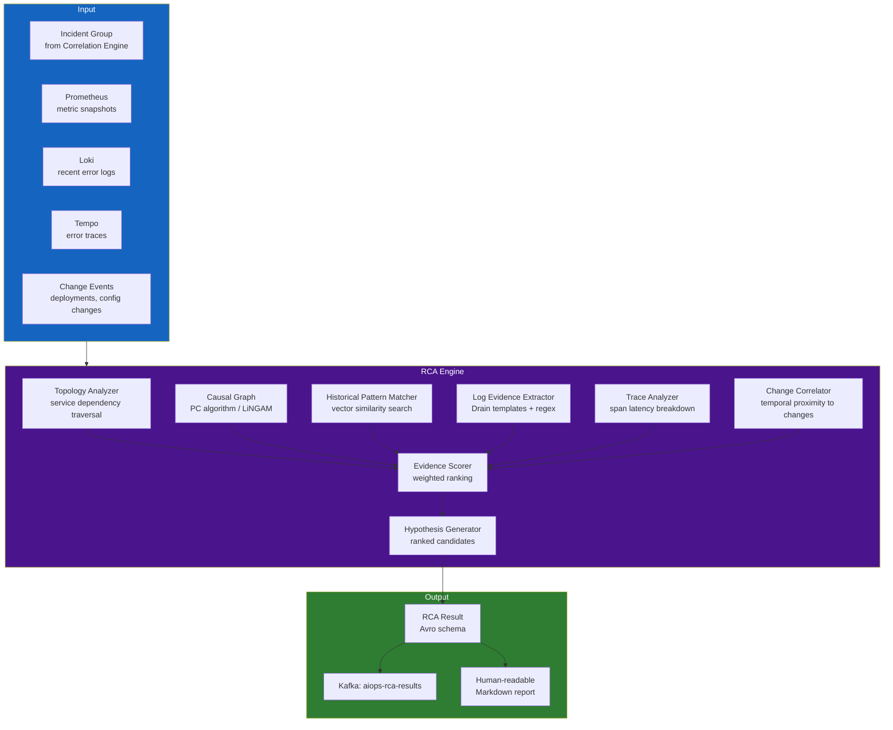

# Chapter 10 — Root Cause Analysis (RCA)

> **Phân tích nguyên nhân gốc rễ (Root Cause Analysis - RCA) là lớp thông minh chịu trách nhiệm trả lời câu hỏi "TẠI SAO sự cố này lại xảy ra?". Nó biến một nhóm các cảnh báo tương quan thành một chẩn đoán chính xác: thành phần nào bị lỗi, loại lỗi là gì và các bằng chứng đi kèm. Chương này giới thiệu mọi kỹ thuật RCA từ dựa trên topology, đồ thị nhân quả, GNN, đến các giải pháp hỗ trợ bởi LLM.**

---

## Prerequisites

- [07 — Anomaly Detection](../08-anomaly-detection/README.vi.md) — các tín hiệu bất thường làm đầu vào cho RCA
- [08 — Alert Correlation](../09-alert-correlation/README.vi.md) — các nhóm incident tương quan
- [04 — Loki](../04-loki/README.vi.md) — logs đóng vai trò làm bằng chứng RCA
- [05 — Tempo](../05-tempo/README.vi.md) — traces đóng vai trò làm bằng chứng RCA

## Related Documents

- [10 — LLM Agent](../11-llm-agent/README.vi.md) — sử dụng đầu ra của RCA để điều tra và xử lý
- [11 — Remediation](../12-remediation/README.vi.md) — kết quả RCA giúp định hướng lựa chọn phương án khắc phục
- [12 — Production Operations](../13-production/README.vi.md) — đo accuracy RCA, game day drills
- [13 — Big Tech AIOps](../14-bigtech-aiops/README.vi.md) — RCA / incident diagnosis patterns ở Big Tech
- [14 — E-commerce & Banking](../15-ecommerce-banking/README.vi.md) — RCA cho payment cascade, fraud false-positive confounds
- [15 — Famous Incidents](../16-famous-incidents/README.vi.md) — bài học correlation≠causation từ outage thực

## Next Reading

Sau chương này, hãy chuyển sang [10 — LLM Agent](../11-llm-agent/README.vi.md).

---

## Table of Contents

1. [Why Automated RCA?](#1-why-automated-rca)
2. [RCA Architecture Overview](#2-rca-architecture-overview)
3. [Signal Collection for RCA](#3-signal-collection-for-rca)
4. [Topology-Based RCA](#4-topology-based-rca)
5. [Causal Graph RCA](#5-causal-graph-rca)
6. [Bayesian Network RCA](#6-bayesian-network-rca)
7. [Graph Neural Network (GNN) RCA](#7-graph-neural-network-gnn-rca)
8. [Log-Based RCA — Evidence Extraction](#8-log-based-rca--evidence-extraction)
9. [Trace-Based RCA — Span Analysis](#9-trace-based-rca--span-analysis)
10. [Change Correlation (Deployment-Driven RCA)](#10-change-correlation-deployment-driven-rca)
11. [RCA Evidence Scoring and Ranking](#11-rca-evidence-scoring-and-ranking)
12. [RCA Output Schema](#12-rca-output-schema)
13. [Historical Pattern Matching (Case-Based RCA)](#13-historical-pattern-matching-case-based-rca)
14. [Production Architecture](#14-production-architecture)
15. [Common Mistakes](#15-common-mistakes)
16. [Monitoring RCA Quality](#16-monitoring-rca-quality)
17. [Scaling](#17-scaling)
18. [Security](#18-security)
19. [Cost](#19-cost)
20. [Tư duy sâu: Correlation≠Causation, Multi-root, Evidence Quality, Time Budget](#20-tư-duy-sâu-correlationcausation-multi-root-evidence-quality-time-budget)
21. [Production Review](#21-production-review)

---

## 1. Why Automated RCA?

> [!NOTE]
> **Ý TƯỞNG**
> RCA tự động **không tìm "sự thật tuyệt đối"** — nó sinh **giả thuyết có hạng mục bằng chứng** đủ tốt để on-call quyết định trong phút đầu. Mục tiêu sản phẩm là giảm *time-to-plausible-hypothesis*, không phải độ chính xác academic 100%.

> [!IMPORTANT]
> Mọi pipeline remediation tự động (Chương 11) chỉ được gắn vào RCA khi **confidence + evidence quality** vượt ngưỡng *và* failure mode nằm trong allowlist. RCA sai + auto-remediate = outage do AIOps.

### The Manual RCA Problem

Quy trình phản ứng sự cố truyền thống:

```
1. Cảnh báo kích hoạt (t=0)
2. Kỹ sư trực được page (t+5 phút)
3. Kỹ sư mở dashboards, bắt đầu tìm kiếm thông tin (t+10 phút)
4. Kỹ sư xác định các dịch vụ bị ảnh hưởng (t+20 phút)
5. Kỹ sư truy vết ngược lại nguyên nhân gốc rễ (t+40 phút)
6. Kỹ sư thực hiện bản vá sửa lỗi (t+50 phút)
7. Sự cố được khắc phục (t+60 phút)
8. Viết báo cáo post-mortem, ghi nhận tài liệu RCA (t+2 ngày)

Tổng MTTR: 60 phút
Chi phí gián đoạn dịch vụ (với trang thương mại điện tử): $10,000–$100,000/phút
Tổng thiệt hại sự cố: $600K–$6M
```

Quy trình phản ứng khi có RCA tự động:

```
1. Cảnh báo kích hoạt (t=0)
2. Hệ thống RCA tự động khởi chạy (t+16s, dựa trên độ trễ Kafka mô tả tại Ch06)
3. Thu thập các bằng chứng từ Loki/Tempo (t+30s)
4. Đưa ra giả thuyết RCA (t+45s)
5. Kỹ sư nhận thông tin trực: page kèm chẩn đoán lỗi + runbook hướng dẫn (t+1 phút)
6. Kỹ sư xác thực giả thuyết + thực hiện sửa lỗi (t+10 phút)
7. Sự cố được khắc phục (t+15 phút)

Tổng MTTR: 15 phút → giảm thiểu tới 75% thời gian xử lý
```

### What RCA Is and Is NOT

```
RCA thực hiện:
✅ Xác định nguyên nhân gốc rễ kỹ thuật (dịch vụ, thành phần, tài nguyên lỗi)
✅ Thu thập và xếp hạng các bằng chứng liên đới
✅ Sinh báo cáo giả thuyết lỗi dễ hiểu cho con người
✅ Gợi ý các phương án xử lý remediation
✅ Liên kết tham chiếu tới các incidents tương tự trong quá khứ

RCA KHÔNG phải là:
❌ Độ chính xác tuyệt đối 100% — nó sinh ra GIẢ THUYẾT, không phải sự thật tuyệt đối
❌ Giải pháp thay thế hoàn toàn con người — kỹ sư trực vẫn là người xác thực cuối cùng
❌ Luôn luôn thành công — một số sự cố phức tạp vẫn đòi hỏi con người điều tra thủ công sâu
❌ Miễn phí — nó làm tăng độ phức tạp cấu hình và chi phí của hệ thống
```

---

## 2. RCA Architecture Overview



---

## 3. Signal Collection for RCA

### Signal Collection Schema

```python
from dataclasses import dataclass, field
from typing import List, Dict, Optional
from datetime import datetime

@dataclass
class RCAContext:
    """
    Bối cảnh đầy đủ được thu thập phục vụ cho phân tích RCA.
    Được xây dựng từ incident group + kết quả truy vấn dữ liệu.
    """
    incident_id: str
    incident_start: datetime
    incident_end: Optional[datetime]
    
    # Từ alert correlation
    root_service_candidate: str           # Dự đoán ban đầu từ tương quan topology
    affected_services: List[str]
    correlated_alerts: List[dict]
    
    # Thông tin Metric snapshots (từ Prometheus API)
    metric_snapshots: Dict[str, dict] = field(default_factory=dict)
    # Định dạng: {service_name: {metric_name: [values]}}
    
    # Bằng chứng Log (từ Loki)
    error_logs: Dict[str, List[str]] = field(default_factory=dict)
    # Định dạng: {service_name: [log_lines]}
    
    # Bằng chứng Error traces (từ Tempo)
    error_traces: List[dict] = field(default_factory=list)
    # Cấu trúc rút gọn của trace spans
    
    # Các sự kiện thay đổi
    recent_deployments: List[dict] = field(default_factory=list)
    recent_config_changes: List[dict] = field(default_factory=list)
    
    # Dữ liệu lịch sử
    similar_past_incidents: List[dict] = field(default_factory=list)


async def collect_rca_context(
    incident: dict,
    prometheus: PrometheusClient,
    loki: LokiClient,
    tempo: TempoClient,
    change_store: ChangeEventStore,
    incident_history: IncidentHistoryStore,
    lookback_minutes: int = 30,
) -> RCAContext:
    """
    Thu thập đồng thời toàn bộ các tín hiệu cần thiết cho RCA để tối ưu tốc độ.
    """
    affected_services = incident.get("services_affected", [])
    
    # Thực thi song song việc thu thập dữ liệu từ các nguồn ngoài
    results = await asyncio.gather(
        collect_metric_snapshots(prometheus, affected_services, lookback_minutes),
        collect_error_logs(loki, affected_services, lookback_minutes),
        collect_error_traces(tempo, affected_services, lookback_minutes),
        collect_changes(change_store, affected_services, lookback_minutes),
        find_similar_incidents(incident_history, incident),
        return_exceptions=True,
    )
    
    return RCAContext(
        incident_id=incident["incident_id"],
        incident_start=incident["started_at"],
        incident_end=incident.get("ended_at"),
        root_service_candidate=incident.get("root_cause", "unknown"),
        affected_services=affected_services,
        correlated_alerts=incident.get("all_alerts", []),
        metric_snapshots=results[0] if not isinstance(results[0], Exception) else {},
        error_logs=results[1] if not isinstance(results[1], Exception) else {},
        error_traces=results[2] if not isinstance(results[2], Exception) else [],
        recent_deployments=results[3][0] if not isinstance(results[3], Exception) else [],
        recent_config_changes=results[3][1] if not isinstance(results[3], Exception) else [],
        similar_past_incidents=results[4] if not isinstance(results[4], Exception) else [],
    )
```

---

## 4. Topology-Based RCA

Giải pháp RCA đơn giản và có độ tin cậy cao nhất cho các hệ thống microservices được cấu hình giám sát tốt. Thuật toán duyệt ngược sơ đồ phụ thuộc dịch vụ tính từ các triệu chứng lỗi.

### Algorithm: Backward Traversal

```python
import networkx as nx
from typing import List

def topology_rca(
    incident: dict,
    dependency_graph: nx.DiGraph,
    metric_snapshots: dict,
    anomaly_threshold: float = 0.7,
) -> List[dict]:
    """
    Duyệt ngược sơ đồ phụ thuộc từ các dịch vụ biểu hiện triệu chứng lỗi về nguyên nhân gốc rễ.
    Một dịch vụ được coi là nguyên nhân gốc rễ nếu thỏa mãn:
    1. Bản thân dịch vụ biểu hiện bất thường (tỷ lệ lỗi cao hoặc latency lớn)
    2. Các dịch vụ gọi tới nó (upstream) cũng có bất thường (ảnh hưởng cascading kéo theo)
    3. Các dịch vụ được nó gọi tới (downstream) hoàn toàn khỏe mạnh (dịch vụ lá bị lỗi)
    
    Trả về danh sách các ứng viên nguyên nhân gốc rễ được xếp hạng.
    """
    affected_services = set(incident.get("services_affected", []))
    
    candidates = []
    
    for service in affected_services:
        if service not in dependency_graph:
            continue
        
        # Lấy danh sách dependencies trực tiếp (các dịch vụ được service này gọi tới)
        callees = list(dependency_graph.successors(service))
        
        # Lấy danh sách callers trực tiếp (các dịch vụ thực hiện gọi tới service này)
        callers = list(dependency_graph.predecessors(service))
        
        # Kiểm tra xem các dependencies có khỏe mạnh không
        callees_are_healthy = all(
            not _is_service_anomalous(callee, metric_snapshots, anomaly_threshold)
            for callee in callees
        )
        
        # Xác định dịch vụ hiện tại có bị bất thường không
        service_is_anomalous = _is_service_anomalous(service, metric_snapshots, anomaly_threshold)
        
        if service_is_anomalous:
            candidate_score = 0.0
            evidence = []
            
            # Bằng chứng mạnh: toàn bộ các dependencies đều khỏe mạnh (lỗi phát sinh từ chính node này)
            if callees_are_healthy:
                candidate_score += 0.5
                evidence.append("all_dependencies_healthy")
            
            # Bằng chứng mạnh: các callers gọi tới nó cũng bị ảnh hưởng (cascading impact)
            callers_affected = [c for c in callers if c in affected_services]
            if callers_affected:
                candidate_score += 0.3
                evidence.append(f"cascading_to_{len(callers_affected)}_callers")
            
            # Điểm cộng thêm: số lượng liên kết callers càng lớn thể hiện mức độ ảnh hưởng rộng
            candidate_score += min(0.2, len(callers) * 0.05)
            
            candidates.append({
                "service": service,
                "score": min(candidate_score, 1.0),
                "evidence": evidence,
                "algorithm": "topology_traversal",
                "callees": callees,
                "affected_callers": callers_affected,
            })
    
    return sorted(candidates, key=lambda x: x["score"], reverse=True)


def _is_service_anomalous(
    service: str,
    metric_snapshots: dict,
    threshold: float,
) -> bool:
    """Kiểm tra xem một dịch vụ có metrics biểu hiện bất thường hay không."""
    service_metrics = metric_snapshots.get(service, {})
    
    if not service_metrics:
        return False
    
    error_rate = service_metrics.get("error_rate", {}).get("current", 0)
    latency_p99 = service_metrics.get("latency_p99", {}).get("current", 0)
    baseline_latency = service_metrics.get("latency_p99", {}).get("baseline", 1)
    
    # Coi là bất thường nếu: tỷ lệ lỗi > 5% HOẶC latency P99 vượt quá 2 lần baseline
    return (
        error_rate > 0.05 or
        (baseline_latency > 0 and latency_p99 > 2 * baseline_latency)
    )
```

---

## 5. Causal Graph RCA

Đồ thị nhân quả (Causal graphs) vượt lên trên quan hệ tương quan để trực tiếp mô hình hóa **mối quan hệ nhân quả (cause-and-effect relationships)** giữa các chỉ số metrics.

### PC Algorithm (Constraint-Based Causal Discovery)

```python
from causallearn.search.ConstraintBased.PC import pc
from causallearn.utils.cit import fisherz
import numpy as np
import pandas as pd
import networkx as nx

class CausalGraphRCA:
    def __init__(self, alpha: float = 0.05):
        """
        alpha: mức ý nghĩa đối với kiểm định tính độc lập (nhỏ hơn = sinh ra nhiều cạnh hơn)
        """
        self.alpha = alpha

    def build_causal_graph(
        self,
        metric_timeseries: pd.DataFrame,  # Cột = tên metric, hàng = các mốc timestamp
    ) -> dict:
        """
        Khám phá cấu trúc nhân quả từ dữ liệu chuỗi thời gian.
        Trả về ma trận kề biểu diễn mối liên hệ nhân quả.
        
        LƯU Ý: Yêu cầu tối thiểu 100+ mốc thời gian để cho ra kết quả tin cậy.
        """
        if len(metric_timeseries) < 100:
            return {"error": "insufficient_data", "min_required": 100}
        
        # Thực thi thuật toán PC
        data = metric_timeseries.values
        cg = pc(data, alpha=self.alpha, ci_test=fisherz)
        
        # Trích xuất các cạnh nhân quả
        edges = []
        for i, col_i in enumerate(metric_timeseries.columns):
            for j, col_j in enumerate(metric_timeseries.columns):
                if cg.G.graph[i, j] == 1 and cg.G.graph[j, i] == -1:
                    # i → j: col_i gây ra tác động tới col_j
                    edges.append({
                        "cause": col_i,
                        "effect": col_j,
                        "confidence": 1.0 - self.alpha,
                    })
        
        return {
            "edges": edges,
            "nodes": list(metric_timeseries.columns),
            "algorithm": "pc",
            "alpha": self.alpha,
        }

    def find_root_cause_from_causal_graph(
        self,
        causal_graph: dict,
        anomalous_metrics: list,
    ) -> list:
        """
        Dựa vào danh sách metrics bất thường và đồ thị nhân quả,
        xác định xem metric nào là nguồn nhân quả của các metrics còn lại.
        """
        G = nx.DiGraph()
        for edge in causal_graph.get("edges", []):
            G.add_edge(edge["cause"], edge["effect"])
        
        root_causes = []
        
        for metric in anomalous_metrics:
            if metric not in G:
                continue
            
            # In-degree = số lượng các yếu tố gây tác động trực tiếp tới metric hiện tại
            # Một metric nguyên nhân gốc rễ sẽ không có (hoặc có rất ít) nút nhân quả cha trong nhóm bất thường
            causal_parents = [
                p for p in G.predecessors(metric)
                if p in anomalous_metrics
            ]
            
            if not causal_parents:
                # Metric này không bị tác động bởi metric bất thường nào khác → nó chính là nguồn lỗi
                descendants = list(nx.descendants(G, metric))
                affected_anomalous = [d for d in descendants if d in anomalous_metrics]
                
                root_causes.append({
                    "metric": metric,
                    "score": min(1.0, 0.5 + len(affected_anomalous) * 0.1),
                    "explains": affected_anomalous,
                    "algorithm": "causal_graph_pc",
                })
        
        return sorted(root_causes, key=lambda x: x["score"], reverse=True)
```

### When Causal Graph RCA Works Best

```
Trường hợp phù hợp:
- Các metrics được thu thập ở cùng tần suất và độ phân giải thời gian
- Đủ lượng dữ liệu lịch sử (>100 điểm dữ liệu cho mỗi metric)
- Chuỗi thời gian đã được loại bỏ xu hướng và chu kỳ (detrended, deseasoned)
- Quy mô số lượng metrics ở mức nhỏ và vừa (<50 metrics)

Trường hợp KHÔNG phù hợp:
- Dữ liệu streaming thời gian thực (thuật toán PC chạy dạng batch chậm)
- Dữ liệu số chiều quá lớn (>100 metrics, chi phí tính toán rất cao)
- Dữ liệu thô chưa qua tiền xử lý loại bỏ trôi phân phối
- Dữ liệu bị khuyết thiếu (đòi hỏi phải chạy nội suy điền giá trị trước)
```

---

## 6. Bayesian Network RCA

Mạng Bayesian (Bayesian Networks) mô hình hóa **các mối quan hệ phụ thuộc xác suất (probabilistic dependencies)** giữa các thành phần. Giải pháp này phát huy hiệu quả lớn khi bạn có sẵn các tri thức chuyên môn (domain knowledge) về các kịch bản lỗi của hệ thống.

### Structure Learning from Data + Domain Knowledge

```python
from pgmpy.models import BayesianNetwork
from pgmpy.estimators import BayesianEstimator, HillClimbSearch
from pgmpy.inference import BeliefPropagation
import pandas as pd

class BayesianNetworkRCA:
    def __init__(self):
        self.model = None
        self.inference = None

    def learn_structure(
        self,
        training_data: pd.DataFrame,  # Dữ liệu sự cố lịch sử chứa trạng thái các thành phần
        prior_edges: list = None,     # Tri thức chuyên môn: các cạnh nhân quả đã biết trước
    ):
        """
        Học cấu trúc mạng Bayesian từ dữ liệu sự cố trong lịch sử.
        
        Tập dữ liệu training_data cần được chuyển đổi về các trạng thái rời rạc:
        Ví dụ: {db_connections: "normal|high|critical",
               payment_error_rate: "normal|high|critical",
               payment_latency: "normal|high|critical",
               order_error_rate: "normal|high|critical"}
        """
        # Học cấu trúc mạng sử dụng Hill Climbing Search
        hc = HillClimbSearch(training_data)
        best_model_structure = hc.estimate(
            scoring_method="bicscore",
            max_indegree=4,
        )
        
        # Khởi tạo mô hình dựa trên cấu trúc tốt nhất tìm được
        self.model = BayesianNetwork(best_model_structure.edges())
        
        # Bổ sung các liên kết nhân quả đã biết trước từ tri thức chuyên môn
        if prior_edges:
            for cause, effect in prior_edges:
                if not self.model.has_edge(cause, effect):
                    self.model.add_edge(cause, effect)
        
        # Ước lượng bảng phân phối xác suất có điều kiện (conditional probability distributions)
        self.model.fit(
            training_data,
            estimator=BayesianEstimator,
            prior_type="BDeu",
            equivalent_sample_size=10,
        )
        
        self.inference = BeliefPropagation(self.model)

    def diagnose(
        self,
        observed_states: dict,  # Trạng thái quan sát hiện tại: {component: state}
        target_component: str = "root_cause",
    ) -> dict:
        """
        Dựa trên các trạng thái bất thường quan sát được, suy luận ra thành phần có khả năng lỗi cao nhất.
        
        Ví dụ:
        observed_states = {
            "order_error_rate": "high",
            "payment_error_rate": "high",
            "payment_latency": "high",
        }
        """
        if self.inference is None:
            raise RuntimeError("Mô hình cần phải được huấn luyện trước")
        
        # Lấy các bằng chứng quan sát được khớp với các nút của mô hình
        evidence = {k: v for k, v in observed_states.items() if k in self.model.nodes()}
        
        # Truy vấn xác suất trên các nút còn lại dựa trên bằng chứng
        rca_scores = {}
        
        for node in self.model.nodes():
            if node in evidence:
                continue
            
            # Tính toán xác suất hậu nghiệm (posterior probability)
            query_result = self.inference.query(
                variables=[node],
                evidence=evidence,
                show_progress=False,
            )
            
            # Lấy xác suất nút này rơi vào trạng thái "critical"
            critical_prob = float(query_result.values[
                list(query_result.state_names[node]).index("critical")
            ])
            
            rca_scores[node] = {
                "probability_critical": critical_prob,
                "distribution": dict(zip(
                    query_result.state_names[node],
                    query_result.values.tolist()
                )),
            }
        
        return {
            "rca_scores": rca_scores,
            "most_likely_root_cause": max(
                rca_scores,
                key=lambda k: rca_scores[k]["probability_critical"]
            ),
            "algorithm": "bayesian_network",
        }
```

**Ví dụ khai báo các liên kết nhân quả đã biết trước (Known Causal Edges)**:

```python
KNOWN_CAUSAL_EDGES = [
    # Lỗi database làm tăng tỷ lệ lỗi dịch vụ
    ("db_connection_count", "payment_error_rate"),
    ("db_connection_count", "order_error_rate"),
    ("db_latency", "payment_latency"),
    
    # Áp lực memory làm tăng thời gian chạy GC, gây trễ dịch vụ
    ("jvm_heap_used_pct", "service_latency"),
    ("jvm_gc_pause_duration", "service_latency"),
    
    # Lỗi trễ lan truyền downstream
    ("payment_latency", "order_latency"),
    ("order_latency", "checkout_latency"),
    
    # Các giới hạn tài nguyên của Pod
    ("pod_cpu_throttling", "service_latency"),
    ("pod_memory_pressure", "pod_oom_kills"),
]
```

---

## 7. Graph Neural Network (GNN) RCA

Đối với các hệ thống microservices quy mô lớn chứa hàng trăm dịch vụ, mạng thần kinh đồ thị GNN có khả năng tự học các mô hình RCA phức tạp vượt ngoài khả năng của các luật tĩnh hay thống kê thông thường.

### Architecture: Spatial-Temporal GNN

```python
import torch
import torch.nn as nn
import torch_geometric.nn as geo_nn
from torch_geometric.data import Data

class RCA_GNN(nn.Module):
    """
    Mạng Graph Neural Network cho phân tích nguyên nhân gốc rễ.
    
    Kiến trúc:
    - Node features: Chuỗi thời gian metric của mỗi service (được mã hóa qua LSTM)
    - Edge features: Thông tin call rate, error rate, latency truyền giữa các services
    - GNN: Học cách chỉ điểm node lỗi dựa trên cấu trúc đồ thị và trạng thái các nodes
    
    Dựa trên thiết kế: "Towards Intelligent Incident Management" (Microsoft Research)
    và nghiên cứu "MicroRCA" (CloudCom 2020)
    """
    def __init__(
        self,
        node_feature_dim: int = 64,     # Chiều vector đặc trưng node sau mã hóa LSTM
        edge_feature_dim: int = 8,      # Số đặc trưng của cạnh (call rate, error rate, latency)
        hidden_dim: int = 128,
        num_gnn_layers: int = 3,
        num_services: int = 50,          # Tổng số dịch vụ trong đồ thị
    ):
        super().__init__()
        
        # Mã hóa chuỗi thời gian metric của mỗi node
        self.node_encoder = nn.LSTM(
            input_size=5,               # 5 metrics đầu vào của mỗi dịch vụ trên mỗi timestep
            hidden_size=node_feature_dim,
            num_layers=2,
            batch_first=True,
        )
        
        # Các lớp GNN: sử dụng GraphSAGE để xử lý các vùng lân cận có kích thước biến động
        self.gnn_layers = nn.ModuleList([
            geo_nn.SAGEConv(
                in_channels=node_feature_dim if i == 0 else hidden_dim,
                out_channels=hidden_dim,
            )
            for i in range(num_gnn_layers)
        ])
        
        self.activation = nn.ReLU()
        self.dropout = nn.Dropout(0.3)
        
        # Đầu ra: xác suất mỗi node là nguyên nhân gốc rễ
        self.classifier = nn.Sequential(
            nn.Linear(hidden_dim, 64),
            nn.ReLU(),
            nn.Linear(64, 1),           # Mỗi node có 1 điểm số đầu ra
            nn.Sigmoid(),
        )

    def forward(
        self,
        node_timeseries: torch.Tensor,  # (num_nodes, seq_len, 5)
        edge_index: torch.Tensor,       # (2, num_edges) — cấu trúc đồ thị
        edge_attr: torch.Tensor,        # (num_edges, edge_feature_dim)
    ) -> torch.Tensor:
        # Mã hóa đặc trưng chuỗi thời gian cho mỗi node
        _, (h_n, _) = self.node_encoder(
            node_timeseries.view(-1, node_timeseries.size(1), node_timeseries.size(2))
        )
        node_features = h_n[-1]  # Lấy hidden state cuối cùng của LSTM: (num_nodes, node_feature_dim)
        
        # Đi qua các lớp GNN
        x = node_features
        for gnn_layer in self.gnn_layers:
            x = gnn_layer(x, edge_index)
            x = self.activation(x)
            x = self.dropout(x)
        
        # Trả về xác suất nguyên nhân gốc rễ cho từng node
        root_cause_probs = self.classifier(x).squeeze(-1)  # (num_nodes,)
        
        return root_cause_probs


def build_graph_from_incident(
    incident: dict,
    metric_snapshots: dict,
    dependency_graph: nx.DiGraph,
    service_index: dict,  # service_name → node_index
) -> Data:
    """
    Chuyển đổi bối cảnh sự cố thành cấu trúc dữ liệu đồ thị PyTorch Geometric.
    """
    num_nodes = len(service_index)
    
    # Node features: chuỗi thời gian metric của mỗi dịch vụ
    node_features = torch.zeros(num_nodes, 10, 5)  # 10 bước thời gian, 5 metrics
    
    for service, idx in service_index.items():
        metrics = metric_snapshots.get(service, {})
        # Gói các metrics đầu vào: [error_rate, latency_p99, cpu, memory, request_rate]
        for t in range(10):
            node_features[idx, t, 0] = metrics.get("error_rate", {}).get(f"t-{t}", 0)
            node_features[idx, t, 1] = metrics.get("latency_p99", {}).get(f"t-{t}", 0)
            node_features[idx, t, 2] = metrics.get("cpu_usage", {}).get(f"t-{t}", 0)
            node_features[idx, t, 3] = metrics.get("memory_usage", {}).get(f"t-{t}", 0)
            node_features[idx, t, 4] = metrics.get("request_rate", {}).get(f"t-{t}", 0)
    
    # edge index
    edges = []
    edge_attrs = []
    
    for caller, callee, data in dependency_graph.edges(data=True):
        if caller in service_index and callee in service_index:
            edges.append([service_index[caller], service_index[callee]])
            edge_attrs.append([
                data.get("weight", 0),        # Call rate
                data.get("error_rate", 0),    # Tỷ lệ lỗi
                data.get("latency_p99", 0),   # Latency P99
            ])
    
    edge_index = torch.tensor(edges, dtype=torch.long).t().contiguous()
    edge_attr = torch.tensor(edge_attrs, dtype=torch.float)
    
    return Data(x=node_features, edge_index=edge_index, edge_attr=edge_attr)
```

### GNN Training Pipeline

```python
def train_rca_gnn(
    historical_incidents: list,    # Danh sách incidents lịch sử đã có nhãn nguyên nhân
    dependency_graph: nx.DiGraph,
    service_index: dict,
    epochs: int = 100,
) -> RCA_GNN:
    """
    Huấn luyện mô hình GNN trên tập dữ liệu sự cố lịch sử đã gán nhãn.
    Đòi hỏi tối thiểu 100+ sự cố đã gán nhãn cho mỗi service cluster để chạy ổn định.
    """
    model = RCA_GNN(num_services=len(service_index))
    optimizer = torch.optim.Adam(model.parameters(), lr=1e-3)
    criterion = nn.BCELoss()
    
    for epoch in range(epochs):
        total_loss = 0
        
        for incident in historical_incidents:
            graph_data = build_graph_from_incident(
                incident, incident["metric_snapshots"], dependency_graph, service_index
            )
            
            # Ground truth: dịch vụ nào thực tế là nguyên nhân gốc rễ?
            root_cause_service = incident["confirmed_root_cause"]
            labels = torch.zeros(len(service_index))
            if root_cause_service in service_index:
                labels[service_index[root_cause_service]] = 1.0
            
            optimizer.zero_grad()
            predictions = model(
                graph_data.x, graph_data.edge_index, graph_data.edge_attr
            )
            loss = criterion(predictions, labels)
            loss.backward()
            optimizer.step()
            
            total_loss += loss.item()
        
        if epoch % 10 == 0:
            print(f"Epoch {epoch}, Loss: {total_loss / len(historical_incidents):.4f}")
    
    return model
```

### GNN GNN Trade-offs

| Đặc điểm | Chi tiết |
|--------|---------|
| ✅ Khai thác tốt cấu trúc đồ thị phức tạp | Tự học trực tiếp từ cấu trúc liên kết đồ thị + đặc trưng node |
| ✅ Hỗ trợ tổng quát hóa dịch vụ | Cho phép truyền tải tri thức (transfer learning) giữa các dịch vụ tương tự |
| ✅ Đạt độ chính xác hàng đầu hiện nay | Nghiên cứu thực tế cho thấy độ chính xác top-1 đạt khoảng 85–95% |
| ❌ Đòi hỏi lượng sự cố lịch sử đã gán nhãn | Cần tối thiểu 100+ sự cố có nhãn để chạy huấn luyện ổn định |
| ❌ Vấn đề cold start với dịch vụ mới | Dịch vụ mới triển khai hoàn toàn không có dữ liệu lịch sử đối sánh |
| ❌ Kiến trúc đồ thị thay đổi | Bắt buộc phải chạy huấn luyện lại khi cấu hình topology hệ thống thay đổi lớn |
| ❌ Độ phức tạp vận hành cao | Đòi hỏi huấn luyện với GPU, quản lý model versions |

**Khuyến nghị vận hành**: Triển khai GNN RCA làm **lớp phân tích bổ trợ vòng ngoài (tertiary layer)** hoạt động offline để cập nhật và làm giàu cơ sở dữ liệu mẫu sự cố lịch sử. Môi trường thời gian thực nên ưu tiên sử dụng kết hợp topology + mạng Bayesian.

---

## 8. Log-Based RCA — Evidence Extraction

Phân tích log cung cấp các bằng chứng RCA có tính biểu đạt cao và dễ hiểu nhất đối với con người.

### Structured Log Analysis

```python
import re
from collections import Counter
from typing import List, Dict

class LogRCAAnalyzer:
    """
    Trích xuất các bằng chứng RCA từ nội dung logs lỗi.
    """
    
    # Các mẫu log lỗi phổ biến ánh xạ sang phân loại nguyên nhân gốc rễ
    ERROR_PATTERNS = [
        (r"connection pool exhausted|too many connections|connection refused",
         "database_connection_exhaustion"),
        (r"OOMKilled|out of memory|memory pressure|GC overhead",
         "memory_exhaustion"),
        (r"dial tcp.*i/o timeout|context deadline exceeded|connection timed out",
         "network_timeout"),
        (r"certificate.*expired|TLS handshake|SSL.*error",
         "tls_certificate_error"),
        (r"rate limit|too many requests|429|quota exceeded",
         "rate_limiting"),
        (r"pod.*evicted|failed to schedule|insufficient.*memory|Unschedulable",
         "kubernetes_scheduling_failure"),
        (r"NullPointerException|nil pointer dereference|index out of range",
         "application_code_error"),
        (r"disk.*full|no space left|ENOSPC",
         "disk_full"),
        (r"kafka.*timeout|consumer lag|offset.*reset",
         "kafka_consumer_lag"),
        (r"permission denied|FORBIDDEN|403|unauthorized|401",
         "permission_error"),
    ]

    def analyze(
        self,
        logs_by_service: Dict[str, List[str]],
    ) -> List[dict]:
        """
        Phân tích logs lỗi và trả về danh sách các ứng viên RCA xếp hạng theo độ tin cậy của bằng chứng.
        """
        evidence_list = []
        
        for service, log_lines in logs_by_service.items():
            error_lines = [l for l in log_lines if "ERROR" in l or "FATAL" in l or "CRITICAL" in l]
            
            if not error_lines:
                continue
            
            # Khớp mẫu
            pattern_matches = Counter()
            pattern_examples = {}
            
            for line in error_lines:
                for pattern, category in self.ERROR_PATTERNS:
                    if re.search(pattern, line, re.IGNORECASE):
                        pattern_matches[category] += 1
                        if category not in pattern_examples:
                            pattern_examples[category] = line[:300]
            
            if not pattern_matches:
                # Không khớp mẫu định sẵn nào — trả về log lỗi phổ biến nhất cho con người tự đánh giá
                evidence_list.append({
                    "service": service,
                    "category": "unknown_error",
                    "score": 0.3,
                    "evidence": error_lines[0][:300] if error_lines else "no errors",
                    "error_count": len(error_lines),
                    "algorithm": "log_pattern_match",
                })
                continue
            
            # Mẫu lỗi xuất hiện nhiều nhất có khả năng cao nhất phản ánh nguyên nhân gốc rễ
            top_category, count = pattern_matches.most_common(1)[0]
            
            evidence_list.append({
                "service": service,
                "category": top_category,
                "score": min(1.0, 0.4 + count * 0.05),  # Xuất hiện càng nhiều = độ tin cậy càng cao
                "evidence": pattern_examples[top_category],
                "error_count": len(error_lines),
                "pattern_count": count,
                "algorithm": "log_pattern_match",
                "all_patterns": dict(pattern_matches.most_common(5)),
            })
        
        return sorted(evidence_list, key=lambda x: x["score"], reverse=True)

    def extract_stacktrace(self, log_lines: List[str]) -> List[str]:
        """Trích xuất và gom nhóm các stack traces từ dòng logs."""
        traces = []
        current_trace = []
        in_trace = False
        
        for line in log_lines:
            if "Exception" in line or "Error" in line and "at " in line:
                if current_trace:
                    traces.append("\n".join(current_trace))
                current_trace = [line]
                in_trace = True
            elif in_trace and (line.strip().startswith("at ") or line.strip().startswith("...")):
                current_trace.append(line)
            else:
                if current_trace:
                    traces.append("\n".join(current_trace))
                    current_trace = []
                in_trace = False
        
        return traces[:5]  # Chỉ lấy tối đa 5 stack traces duy nhất
```

---

## 9. Trace-Based RCA — Span Analysis

Distributed traces cung cấp bằng chứng rõ ràng nhất về vị trí (WHERE) phát sinh lỗi đầu tiên trong chuỗi gọi dịch vụ liên tiếp.

```python
from typing import List, Optional
from dataclasses import dataclass

@dataclass
class SpanAnalysis:
    service: str
    operation: str
    duration_ms: float
    status: str
    is_root_span: bool
    children: List['SpanAnalysis']
    error_message: Optional[str] = None

class TraceRCAAnalyzer:
    """
    Phân tích traces lỗi để chỉ điểm span cụ thể gây ra lỗi.
    """
    
    def analyze_trace(self, trace: dict) -> dict:
        """
        Tìm kiếm span nguyên nhân gốc rễ trong một trace bị lỗi.
        
        Thuật toán:
        1. Tìm kiếm toàn bộ các spans bị đánh nhãn lỗi (ERROR/FAILED)
        2. Tìm span bị lỗi nằm ở vị trí sâu nhất trên cây gọi dịch vụ (nút lá lỗi)
        3. Span lỗi sâu nhất chính là điểm phát sinh lỗi đầu tiên của hệ thống
        """
        spans = trace.get("spans", [])
        
        if not spans:
            return {"error": "empty_trace"}
        
        # Ánh xạ theo span ID
        span_by_id = {s["spanID"]: s for s in spans}
        
        # Lọc các spans lỗi
        error_spans = [s for s in spans if s.get("statusCode") == "STATUS_CODE_ERROR"]
        
        if not error_spans:
            # Không có spans nào bị đánh nhãn lỗi — tìm kiếm span xử lý chậm nhất
            slowest = max(spans, key=lambda s: s.get("durationMs", 0))
            return {
                "root_cause_span": slowest,
                "root_cause_service": slowest.get("processID", "unknown"),
                "evidence": "slowest_span",
                "duration_ms": slowest.get("durationMs", 0),
                "analysis_type": "latency",
            }
        
        # Trong các spans lỗi, tìm span có đường đi dài nhất tính từ root span
        # (vị trí sâu nhất trên call tree = gần nhất với điểm lỗi thực tế)
        def get_depth(span_id: str, visited: set = None) -> int:
            if visited is None:
                visited = set()
            if span_id in visited:
                return 0
            visited.add(span_id)
            
            span = span_by_id.get(span_id)
            if not span or not span.get("parentSpanID"):
                return 0
            
            parent_id = span["parentSpanID"]
            if parent_id not in span_by_id:
                return 0
            
            return 1 + get_depth(parent_id, visited)
        
        # Lấy span lỗi sâu nhất
        deepest_error = max(error_spans, key=lambda s: get_depth(s["spanID"]))
        
        # Trích xuất thông tin lỗi chi tiết
        error_message = next(
            (a["value"]["stringValue"] for a in deepest_error.get("attributes", [])
             if a.get("key") in ["exception.message", "error.message", "error"]),
            "unknown error"
        )
        
        return {
            "root_cause_span": deepest_error,
            "root_cause_service": deepest_error.get("process", {}).get("serviceName", "unknown"),
            "root_cause_operation": deepest_error.get("operationName", "unknown"),
            "error_message": error_message,
            "depth": get_depth(deepest_error["spanID"]),
            "total_error_spans": len(error_spans),
            "total_spans": len(spans),
            "trace_duration_ms": max(s.get("durationMs", 0) for s in spans),
            "analysis_type": "error",
            "algorithm": "trace_depth_traversal",
        }
    
    def compute_span_contribution(self, trace: dict) -> List[dict]:
        """
        Tính toán tỷ lệ thời gian đóng góp của mỗi service vào tổng thời gian trace.
        Hữu ích cho phân tích RCA tìm điểm nghẽn latency.
        """
        spans = trace.get("spans", [])
        total_duration = max(s.get("durationMs", 0) for s in spans)
        
        if total_duration == 0:
            return []
        
        # Hợp cộng thời gian theo service
        service_duration = {}
        for span in spans:
            service = span.get("process", {}).get("serviceName", "unknown")
            duration = span.get("durationMs", 0)
            service_duration[service] = service_duration.get(service, 0) + duration
        
        # Tính tỷ lệ phần trăm đóng góp
        return sorted(
            [
                {
                    "service": svc,
                    "duration_ms": dur,
                    "contribution_pct": round(dur / total_duration * 100, 1),
                }
                for svc, dur in service_duration.items()
            ],
            key=lambda x: x["contribution_pct"],
            reverse=True,
        )
```

---

## 10. Change Correlation (Deployment-Driven RCA)

Phần lớn các sự cố nghiêm trọng bắt nguồn từ các đợt thay đổi hệ thống. Phân tích tương quan thay đổi mang lại độ chính xác cực cao đối với các sự cố dạng này.

```python
from datetime import datetime, timedelta

class ChangeCorrelationRCA:
    """
    Tính tương quan giữa incidents và các thay đổi gần đây (deployments, config changes, flag flips).
    """
    
    CHANGE_IMPACT_WINDOW_MINUTES = 30  # Khoảng thời gian tác động: incident xảy ra trong vòng 30 phút sau khi change = có liên quan
    
    def correlate(
        self,
        incident: dict,
        change_events: List[dict],
    ) -> List[dict]:
        """
        Tìm kiếm các sự kiện thay đổi xuất hiện ngay trước khi incident bắt đầu.
        """
        incident_start = incident.get("started_at")
        if isinstance(incident_start, str):
            incident_start = datetime.fromisoformat(incident_start.replace("Z", "+00:00"))
        
        affected_services = set(incident.get("services_affected", []))
        
        correlations = []
        
        for change in change_events:
            change_time = change.get("timestamp")
            if isinstance(change_time, str):
                change_time = datetime.fromisoformat(change_time.replace("Z", "+00:00"))
            
            # Sự kiện change phải xảy ra TRƯỚC incident
            if change_time >= incident_start:
                continue
            
            # Nằm trong cửa sổ tác động cho phép
            time_delta = (incident_start - change_time).total_seconds() / 60
            if time_delta > self.CHANGE_IMPACT_WINDOW_MINUTES:
                continue
            
            changed_service = change.get("service")
            
            # Điểm số khoảng cách thời gian (càng gần thời điểm xảy ra = điểm càng cao)
            temporal_score = 1.0 - (time_delta / self.CHANGE_IMPACT_WINDOW_MINUTES)
            
            # Điểm tương đồng dịch vụ
            service_score = 1.0 if changed_service in affected_services else 0.3
            
            # Trọng số theo loại hình thay đổi (deployment > config > feature flag)
            change_type_scores = {
                "deployment": 1.0,
                "config_change": 0.8,
                "feature_flag": 0.7,
                "infrastructure_change": 0.9,
                "database_migration": 1.0,
            }
            change_type_score = change_type_scores.get(change.get("type", ""), 0.5)
            
            combined_score = temporal_score * 0.4 + service_score * 0.4 + change_type_score * 0.2
            
            correlations.append({
                "change_event": change,
                "score": combined_score,
                "time_before_incident_minutes": round(time_delta, 1),
                "changed_service": changed_service,
                "change_type": change.get("type"),
                "change_version": change.get("version"),
                "can_rollback": change.get("type") == "deployment",
                "algorithm": "change_correlation",
            })
        
        return sorted(correlations, key=lambda x: x["score"], reverse=True)
```

---

## 11. RCA Evidence Scoring and Ranking

Hợp nhất các kết quả bằng chứng từ mọi thuật toán RCA để xây dựng danh sách giả thuyết cuối cùng:

```python
from dataclasses import dataclass
from typing import List, Optional

@dataclass
class RCAHypothesis:
    rank: int
    root_cause_service: str
    root_cause_component: str      # "database", "application_code", "infrastructure"
    failure_mode: str              # "connection_exhaustion", "memory_oom", v.v.
    confidence: float              # 0.0 - 1.0
    evidence: List[dict]           # Toàn bộ bằng chứng hỗ trợ kèm theo
    suggested_remediation: str
    runbook_url: Optional[str]
    estimated_impact: str

def rank_rca_hypotheses(
    topology_results: List[dict],
    causal_results: List[dict],
    log_results: List[dict],
    trace_results: List[dict],
    change_results: List[dict],
    bayesian_results: dict,
) -> List[RCAHypothesis]:
    """
    Hợp nhất và xếp hạng các kết quả RCA thu được từ tất cả thuật toán.
    Sử dụng cơ chế biểu quyết có trọng số dựa trên độ chính xác lịch sử của mỗi thuật toán.
    """
    ALGORITHM_WEIGHTS = {
        "change_correlation": 0.35,       # Trọng số cao nhất: tương quan deploy có độ chính xác rất cao
        "trace_depth_traversal": 0.25,    # Traces cung cấp bằng chứng luồng gọi rõ ràng
        "log_pattern_match": 0.20,        # Logs cung cấp thông tin lỗi chi tiết dạng văn bản
        "topology_traversal": 0.15,       # Topology cung cấp thông tin phụ thuộc kiến trúc
        "bayesian_network": 0.05,         # Trọng số thấp hơn: phụ thuộc nhiều vào chất lượng mô hình
    }
    
    # Hợp cộng điểm số theo từng service
    service_scores = {}
    service_evidence = {}
    
    for result_list, algo_key in [
        (topology_results, "topology_traversal"),
        (log_results, "log_pattern_match"),
        (trace_results, "trace_depth_traversal"),
        (change_results, "change_correlation"),
    ]:
        weight = ALGORITHM_WEIGHTS.get(algo_key, 0.1)
        
        for result in result_list[:3]:  # Chỉ lấy top 3 kết quả từ mỗi thuật toán
            service = result.get("service") or result.get("root_cause_service") or \
                      result.get("changed_service", "unknown")
            score = result.get("score", 0.0) * weight
            
            if service not in service_scores:
                service_scores[service] = 0.0
                service_evidence[service] = []
            
            service_scores[service] += score
            service_evidence[service].append({**result, "algorithm": algo_key})
    
    # Xây dựng danh sách giả thuyết cuối cùng
    hypotheses = []
    for rank, (service, score) in enumerate(
        sorted(service_scores.items(), key=lambda x: x[1], reverse=True)[:5], 1
    ):
        # Xác định failure mode từ bằng chứng log
        log_evidence = [e for e in service_evidence[service] if "category" in e]
        failure_mode = log_evidence[0]["category"] if log_evidence else "unknown"
        
        # Gợi ý remediation tương ứng với loại failure mode
        remediation = REMEDIATION_SUGGESTIONS.get(failure_mode, "Investigate manually")
        
        hypotheses.append(RCAHypothesis(
            rank=rank,
            root_cause_service=service,
            root_cause_component=_infer_component(failure_mode),
            failure_mode=failure_mode,
            confidence=min(score, 1.0),
            evidence=service_evidence[service],
            suggested_remediation=remediation,
            runbook_url=None,  # Sẽ được điền ở giai đoạn enrichment sau đó
            estimated_impact=f"Gây ảnh hưởng tới {len(service_evidence[service])} dịch vụ",
        ))
    
    return hypotheses

REMEDIATION_SUGGESTIONS = {
    "database_connection_exhaustion": "Tăng kích thước connection pool: kubectl patch configmap payment-config --patch '{\"data\":{\"DB_POOL_SIZE\":\"50\"}}'",
    "memory_exhaustion": "Tăng giới hạn cấp phát memory hoặc kiểm tra rò rỉ bộ nhớ: kubectl top pods -n production",
    "network_timeout": "Kiểm tra network policies, phân giải DNS, và sức khỏe của downstream service",
    "tls_certificate_error": "Gia hạn chứng chỉ TLS certificate: kubectl get certificate -n production",
    "rate_limiting": "Mở rộng tài nguyên cho service bị giới hạn hoặc giảm traffic: kiểm tra cấu hình HPA",
    "disk_full": "Mở rộng dung lượng ổ đĩa PVC hoặc dọn dẹp logs cũ: kubectl get pvc -n production",
    "kubernetes_scheduling_failure": "Kiểm tra tài nguyên của node: kubectl describe nodes | grep -A5 Conditions",
    "application_code_error": "Kiểm tra các đợt deploy gần đây và thực hiện rollback nếu cần thiết",
}
```

---

## 12. RCA Output Schema

```json
{
  "rca_id": "rca-20240115-143245-payment",
  "incident_id": "inc-20240115-143215-001",
  "generated_at": "2024-01-15T14:32:45Z",
  "time_to_rca_seconds": 47,

  "summary": "Database connection pool exhaustion in payment-service (confidence: 89%)",
  "root_cause_service": "payment-service",
  "root_cause_component": "database",
  "failure_mode": "database_connection_exhaustion",
  "confidence": 0.89,

  "hypotheses": [
    {
      "rank": 1,
      "root_cause_service": "payment-service",
      "failure_mode": "database_connection_exhaustion",
      "confidence": 0.89,
      "suggested_remediation": "Scale up connection pool size",
      "runbook_url": "https://runbooks.internal/payment/db-conn-pool",
      "evidence": [
        {
          "algorithm": "log_pattern_match",
          "category": "database_connection_exhaustion",
          "pattern_count": 847,
          "example": "2024-01-15T14:23:45Z ERROR: connection pool exhausted, waiting queue: 156"
        },
        {
          "algorithm": "trace_depth_traversal",
          "root_cause_operation": "payment-service:db.query",
          "error_message": "could not obtain connection from pool within 3000ms",
          "depth": 3
        },
        {
          "algorithm": "topology_traversal",
          "score": 0.85,
          "callees": ["payment-db"],
          "affected_callers": ["order-service", "checkout-service"]
        }
      ]
    },
    {
      "rank": 2,
      "root_cause_service": "payment-db",
      "failure_mode": "database_connection_exhaustion",
      "confidence": 0.45,
      "suggested_remediation": "Increase max_connections on RDS instance"
    }
  ],

  "causal_chain": [
    {"service": "payment-db", "role": "root_cause", "evidence": "max_connections reached"},
    {"service": "payment-service", "role": "primary_victim", "evidence": "connection pool exhausted"},
    {"service": "order-service", "role": "secondary_victim", "evidence": "payment timeouts"},
    {"service": "checkout-service", "role": "tertiary_victim", "evidence": "SLO burn"}
  ],

  "timeline": [
    {"time": "14:21:30", "event": "payment-db connections reach 95% capacity"},
    {"time": "14:22:45", "event": "payment-service connection pool begins queuing"},
    {"time": "14:23:15", "event": "First ERROR logs in payment-service"},
    {"time": "14:23:30", "event": "order-service timeout errors begin"},
    {"time": "14:24:00", "event": "Alertmanager fires: payment-service error rate > 5%"}
  ],

  "related_traces": ["4bf92f3577b34da6", "8e3b4c2d91a5e6f7"],
  "related_log_query": "{service=\"payment-service\"} |= \"connection pool\" | json",
  "similar_past_incidents": [
    {
      "incident_id": "inc-20231205-091200-003",
      "similarity": 0.92,
      "resolution": "Increased DB_POOL_SIZE from 20 to 40, resolved in 8 minutes"
    }
  ]
}
```

---

## 13. Historical Pattern Matching (Case-Based RCA)

Sử dụng tìm kiếm vector tương đồng (vector similarity search) để tìm kiếm các sự cố tương tự từng xảy ra trong lịch sử:

```python
from sentence_transformers import SentenceTransformer
from typing import List
import time

class IncidentHistoryMatcher:
    """
    Tìm kiếm các incidents trong lịch sử có mô hình tương tự incident hiện tại.
    Sử dụng embeddings thông tin mô tả incident để khớp ngữ nghĩa.
    """
    
    def __init__(
        self,
        embedding_model: str = "all-MiniLM-L6-v2",
        vector_store_url: str = "http://weaviate.aiops.svc:8080",  # pgvector, Pinecone, v.v.
    ):
        self.encoder = SentenceTransformer(embedding_model)
        self.vector_store_url = vector_store_url

    def _create_incident_description(self, incident: dict) -> str:
        """Xây dựng văn bản mô tả bối cảnh phục vụ embedding."""
        services = ", ".join(incident.get("services_affected", []))
        alerts = ", ".join(incident.get("alert_types", []))
        log_categories = ", ".join(
            e.get("category", "") for e in incident.get("log_evidence", [])[:3]
        )
        
        return (
            f"Services affected: {services}. "
            f"Alerts: {alerts}. "
            f"Root cause: {incident.get('root_cause', '')}. "
            f"Log patterns: {log_categories}. "
            f"Failure mode: {incident.get('failure_mode', '')}."
        )

    async def find_similar(
        self,
        current_incident: dict,
        top_k: int = 5,
        min_similarity: float = 0.75,
    ) -> List[dict]:
        """
        Truy vấn vector database lấy các incidents lịch sử tương tự.
        """
        description = self._create_incident_description(current_incident)
        embedding = self.encoder.encode(description).tolist()
        
        # Truy vấn vector database (Ví dụ với Weaviate GraphQL)
        import aiohttp
        async with aiohttp.ClientSession() as session:
            query = {
                "query": {
                    "Get": {
                        "HistoricalIncident": {
                            "nearVector": {
                                "vector": embedding,
                                "certainty": min_similarity,
                            },
                            "limit": top_k,
                            "_additional": ["certainty"],
                            "fields": [
                                "incidentId",
                                "rootCause",
                                "failureMode",
                                "resolution",
                                "resolutionTimeMinutes",
                                "affectedServices",
                            ],
                        }
                    }
                }
            }
            
            async with session.post(
                f"{self.vector_store_url}/v1/graphql",
                json=query,
                timeout=aiohttp.ClientTimeout(total=3),
            ) as resp:
                data = await resp.json()
                results = data.get("data", {}).get("Get", {}).get("HistoricalIncident", [])
        
        return [
            {
                "incident_id": r["incidentId"],
                "similarity": r["_additional"]["certainty"],
                "root_cause": r["rootCause"],
                "failure_mode": r["failureMode"],
                "resolution": r["resolution"],
                "resolution_time_minutes": r["resolutionTimeMinutes"],
            }
            for r in results
        ]
```

---

## 14. Production Architecture

```yaml
# Triển khai rca-engine
apiVersion: apps/v1
kind: Deployment
metadata:
  name: rca-engine
  namespace: aiops
spec:
  replicas: 2
  template:
    spec:
      containers:
        - name: rca-engine
          image: aiops/rca-engine:1.0.0
          env:
            - name: KAFKA_INPUT_TOPIC
              value: "aiops-correlated-alerts"
            - name: KAFKA_OUTPUT_TOPIC
              value: "aiops-rca-results"
            - name: PROMETHEUS_URL
              value: "http://prometheus.observability.svc:9090"
            - name: LOKI_URL
              value: "http://loki-query-frontend.observability.svc:3100"
            - name: TEMPO_URL
              value: "http://tempo-query-frontend.observability.svc:3200"
            - name: VECTOR_STORE_URL
              value: "http://weaviate.aiops.svc:8080"
          resources:
            requests:
              cpu: "2"
              memory: "4Gi"
            limits:
              cpu: "4"
              memory: "8Gi"
```

---

## 15. Common Mistakes

| Sai lầm phổ biến | Triệu chứng | Khắc phục |
|---------|---------|-----|
| Đánh giá RCA thiếu sơ đồ topology | Kết quả chỉ điểm nhầm sang các dịch vụ triệu chứng kéo theo | Xây dựng và duy trì liên tục sơ đồ dependency graph tự động |
| Thiếu dữ liệu sự kiện thay đổi (change events) | Bỏ sót các lỗi gây ra bởi quy trình triển khai | Tích hợp hệ thống CI/CD webhooks vào change store |
| Chỉ sử dụng một thuật toán RCA đơn lẻ | Độ tin cậy kết quả thấp trong nhiều kịch bản lỗi | Áp dụng ensemble phối hợp topology + logs + traces + changes |
| Không cập nhật kết quả RCA sau khi khắc phục | Không tích hợp và lưu trữ được các mẫu lỗi lịch sử mới | Lưu kết quả RCA kèm phương án khắc phục vào vector database |
| Tốc độ xử lý quá chậm (>60s) | Kỹ sư trực không tin tưởng và bỏ qua kết quả tự động | Chạy song song các tác vụ truy vấn bằng chứng, đặt timeout tối đa 5s |
| Thiếu cơ chế phản hồi | Chất lượng phân tích không được cải thiện theo thời gian | Thiết lập giao diện cho kỹ sư đánh giá độ chính xác RCA (TP/FP) |
| Thiếu thông tin ngữ cảnh trace | Không thể chạy thuật toán phân tích dựa trên trace | Rà soát đảm bảo các dịch vụ microservices truyền đủ thông tin trace (OTel) |
| Xác định sai chiều liên kết nhân quả | Đổ lỗi nhầm cho các dịch vụ downstream (triệu chứng) | Bổ sung kiểm chứng chặt chẽ bằng thứ tự thời gian xuất hiện lỗi |

---

## 16. Monitoring RCA Quality

```promql
# Tải phân tích RCA
rate(aiops_rca_analyses_total[5m])

# Độ chính xác phân tích (thống kê từ phản hồi của kỹ sư)
rate(aiops_rca_feedback_total{outcome="correct"}[7d])
/
rate(aiops_rca_feedback_total[7d])

# Thời gian chạy phân tích RCA
histogram_quantile(0.99, rate(aiops_rca_duration_seconds_bucket[5m]))

# Tỷ lệ đóng góp bằng chứng của từng thuật toán
sum by (algorithm) (rate(aiops_rca_evidence_used_total[5m]))

# Chỉ số consumer lag
kafka_consumer_group_lag_sum{group="rca-engine-group"}
```

### Critical Alerts

```yaml
- alert: RCAEngineDown
  expr: up{job="rca-engine"} == 0
  for: 2m
  labels:
    severity: critical

- alert: RCAAccuracyLow
  expr: |
    rate(aiops_rca_feedback_total{outcome="correct"}[24h])
    /
    rate(aiops_rca_feedback_total[24h]) < 0.70
  for: 0m
  labels:
    severity: warning
  annotations:
    summary: "Độ chính xác RCA dưới 70% trong 24 giờ qua — cần rà soát lại thuật toán"

- alert: RCALatencyHigh
  expr: histogram_quantile(0.99, rate(aiops_rca_duration_seconds_bucket[5m])) > 60
  for: 5m
  labels:
    severity: warning
```

---

## 17. Scaling

Tiến trình RCA tiêu tốn nhiều tài nguyên CPU/RAM. Ưu tiên mở rộng theo chiều dọc (tăng tài nguyên CPU/RAM để phục vụ thu thập song song dữ liệu lớn), sau đó áp dụng mở rộng ngang:

```yaml
# Mở rộng ngang: tự động scale theo Kafka consumer lag
autoscaling:
  min_replicas: 2
  max_replicas: 6
  scale_up_trigger: "kafka_consumer_group_lag > 100"
  
# Mở rộng dọc: phân tích RCA yêu cầu RAM lớn cho tính toán đồ thị nhân quả
resources:
  requests:
    cpu: "2"
    memory: "4Gi"
  limits:
    cpu: "4"
    memory: "8Gi"
```

---

## 18. Security

- **Kiểm soát truy cập Log**: RCA thực hiện truy vấn dữ liệu từ Loki — logs có nguy cơ chứa thông tin nhạy cảm của người dùng (PII). Đảm bảo RCA engine sử dụng tài khoản truy cập read-only giới hạn phạm vi ngoài các namespaces nhạy cảm.
- **Kiểm soát truy cập Trace**: Dữ liệu từ Tempo có thể chứa các thông tin yêu cầu nhạy cảm. Giới hạn quyền gọi Tempo API chỉ dành riêng cho RCA engine.
- **Mã hóa kết quả RCA**: Kết quả phân tích RCA (chứa các thông tin hệ thống nội bộ, chuỗi kết nối db lỗi trong log) cần được mã hóa bằng KMS.
- **Bảo mật Vector store**: Cơ sở dữ liệu chứa incidents lịch sử (chứa tài liệu phân tích lỗi postmortem nhạy cảm) cần được mã hóa dữ liệu tĩnh.

---

## 19. Cost

| Thành phần | Chi phí hàng tháng |
|-----------|-------------|
| RCA Engine (2× m6i.2xlarge) | $720 |
| Weaviate (vector store, 2× r6g.large) | $600 |
| Chi phí phát sinh do truy vấn Prometheus/Loki | ~$50 (năng lực xử lý) |
| **Tổng cộng** | **~$1,370/tháng** |

---

## 20. Tư duy sâu: Correlation≠Causation, Multi-root, Evidence Quality, Time Budget

### 20.1 Correlation ≠ causation — bẫy kinh điển trong RCA

> [!WARNING]
> **Cảnh báo triết học có giá tiền**: Hai dịch vụ cùng đỏ không có nghĩa A gây ra B. Trong production, **confounder** (deploy global, shared DB, DNS, cloud AZ) thường tạo correlation mạnh mà không có cạnh nhân quả trực tiếp.

| Bẫy | Ví dụ | RCA naive kết luận | Thực tế |
|-----|-------|--------------------|---------|
| Common cause | AZ network blip | `checkout → payment` cascade | Cả hai phụ thuộc ENI/AZ |
| Reverse causation | Error rate tăng → CPU tăng (retry storm) | CPU là root | App error là root; CPU là symptom |
| Temporal coincidence | Cron + deploy cùng phút | Deploy gây batch fail | 2 incidents độc lập |
| Selection bias | Chỉ trace error paths | Span X luôn "root" | Sampling bias |
| Proxy metric | Queue depth ↑ với latency | Queue là root | Upstream slow producer |

```python
def causation_sanity_checks(hypothesis: dict, evidence: list) -> list:
    """
    Trả về danh sách warning — không auto-reject, nhưng hạ confidence.
    """
    warnings = []
    if hypothesis.get("only_correlational") and not hypothesis.get("has_trace_path"):
        warnings.append("corr_without_path: correlation only, no causal path")
    if hypothesis.get("root") in hypothesis.get("symptoms", []):
        warnings.append("root_in_symptoms: circular ranking")
    # Symptom xuất hiện TRƯỚC candidate root → nghi reverse causation
    if evidence:
        root_t = min((e["t"] for e in evidence if e.get("role") == "root"), default=None)
        sym_t = min((e["t"] for e in evidence if e.get("role") == "symptom"), default=None)
        if root_t and sym_t and sym_t < root_t - 30:
            warnings.append("temporal_reverse: symptom predates root by >30s")
    return warnings
```

> [!TIP]
> **Checklist causation tối thiểu trước khi tin rank #1**:
> 1) Có path dependency hoặc shared infra node?
> 2) Thứ tự thời gian root ≤ symptom?
> 3) Có change event hoặc log signature hỗ trợ?
> 4) Giả thuyết có **counter-evidence** đã bị bác?
> Nếu chỉ (1) temporal gần — ghi `confidence_cap=0.55`.

Bài học outage thật: [15 — Famous Incidents](../16-famous-incidents/README.vi.md).

### 20.2 Confounding: deploy + traffic spike cùng lúc

Kịch bản Friday afternoon kinh điển:

```
t-20m  Marketing bật campaign → RPS ×3
t-12m  Deploy payment-service@2.15 (connection pool default vẫn 20)
t-5m   Error budget burn 14x
```

RCA chỉ nhìn change → **đổ 100% cho deploy** (dễ rollback).  
RCA chỉ nhìn traffic → **scale blindly** (pool vẫn 20, vẫn chết).  
**Root thật**: interaction effect — pool size không theo traffic; deploy là trigger lộ defect sẵn có.

```yaml
confounder_policy:
  if:
    - change_within: 30m
    - traffic_zscore: "> 2.5"
  then:
    rank_both:
      - candidate: "deploy_regression"
        needs: ["error signature new in version", "canary worse than baseline"]
      - candidate: "capacity_exhaustion"
        needs: ["saturation metrics", "pool/thread/cpu at limit"]
      - candidate: "interaction"
        needs: ["old code ok at low RPS", "new or old code fails at high RPS"]
    ui:
      show: "Possible confound: deploy AND traffic spike — verify both before rollback"
```

> [!IMPORTANT]
> Rollback deploy khi root là pure traffic sẽ **không** cứu hệ thống và có thể làm mất fix đang rollout. Luôn so sánh: *version N vs N-1 dưới cùng load* (canary metrics / shadow).

### 20.3 Multi-root-cause incidents

Không phải mọi incident có 1 root. Các class multi-root:

| Class | Mô tả | Cách RCA phải behave |
|-------|--------|----------------------|
| **AND-root** | Cần 2 điều kiện cùng lúc (bug + load) | Output 2 hypotheses "contributing factors" |
| **Independent dual** | 2 outage chồng thời gian | 2 RCA results; không ép 1 winner |
| **Cascading secondary** | Root A gây B, B trở thành root cục bộ | Primary + secondary roots với timeline |
| **Partial mitigation residual** | Fix A xong, residual B còn | Re-run RCA after mitigate; đừng đóng incident sớm |

```python
def finalize_hypotheses(ranked: list, max_roots=2) -> dict:
    """
    Cho phép multi-root khi điểm #1 và #2 gần nhau và khác failure domain.
    """
    if len(ranked) < 2:
        return {"mode": "single", "roots": ranked[:1]}

    top, second = ranked[0], ranked[1]
    close = abs(top["confidence"] - second["confidence"]) < 0.12
    different_domain = top["failure_domain"] != second["failure_domain"]

    if close and different_domain:
        return {
            "mode": "multi_root",
            "roots": [top, second],
            "note": "Two contributing causes with similar evidence weight",
        }
    if top["confidence"] >= 0.8 and (top["confidence"] - second["confidence"]) >= 0.25:
        return {"mode": "single", "roots": [top]}
    return {
        "mode": "uncertain",
        "roots": ranked[:max_roots],
        "note": "Present alternatives; do not auto-remediate",
    }
```

### 20.4 Evidence quality scoring (không chỉ confidence algorithm)

`confidence` từ model dễ **ảo tưởng**. Tách **evidence quality** riêng:

| Dimension | Cao | Thấp |
|-----------|-----|------|
| **Source fidelity** | Trace error span + exact log template | Chỉ metric correlation |
| **Freshness** | Dữ liệu < 2 phút | Log/trace delay > 10 phút |
| **Coverage** | Đủ services trong blast radius | Thiếu trace 1 hop critical |
| **Consistency** | Topology + log + change cùng hướng | 3 algorithm mâu thuẫn |
| **Counter-evidence** | Đã tìm và loại trừ | Chưa search counter |
| **Provenance** | Query ids tái lập được | "LLM said so" không cite |

```python
def evidence_quality(ev: dict) -> float:
    w = {
        "trace_error_span": 0.30,
        "log_template_match": 0.20,
        "change_proximity": 0.20,
        "topology_path": 0.15,
        "metric_saturation": 0.10,
        "historical_case": 0.05,
    }
    score = 0.0
    for k, weight in w.items():
        if ev.get(k):
            score += weight * ev[k].get("strength", 1.0)
    # Phạt thiếu freshness / coverage
    if ev.get("data_age_s", 0) > 600:
        score *= 0.7
    if ev.get("coverage") == "partial":
        score *= 0.85
    if ev.get("algorithms_agree", 1) < 2:
        score *= 0.8
    return round(min(score, 1.0), 3)

def publishable_confidence(model_conf: float, eq: float) -> float:
    # Không cho model_conf vượt evidence quality quá xa
    return round(min(model_conf, eq + 0.1) * (0.5 + 0.5 * eq), 3)
```

> [!NOTE]
> **Ý TƯỞNG**
> UI nên hiện **2 số**: `model_confidence=0.91` và `evidence_quality=0.54` → hệ thống hiển thị **0.58 publishable**. On-call hiểu: "model chắc nhưng bằng chứng mỏng".

### 20.5 When to stop searching (time budget)

RCA không được thành black hole CPU. On-call cần **hypothesis lúc t+45s**, không phải essay lúc t+10m.

```yaml
rca_time_budget:
  total_ms: 45000
  phases:
    collect_signals: 12000     # parallel Prom/Loki/Tempo/changes
    cheap_algorithms: 8000     # topology + change + log regex
    expensive_algorithms: 15000 # causal graph / GNN optional
    rank_and_render: 5000
  preemption:
    if_p1_and_change_score_gt: 0.85
      skip: ["gnn", "full_causal_pc"]
      reason: "fast path deploy-correlated"
  always_return:
    - top_k_hypotheses: 3
    - evidence_links: true
    - partial_flag: true   # nếu budget cắt giữa chừng
```

```python
import time

def run_rca_with_budget(incident, collectors, algorithms, budget_s=45.0):
    t0 = time.monotonic()
    evidence = {}
    # Phase collect — song song, hard timeout
    evidence = collectors.gather(incident, timeout=min(12.0, budget_s * 0.3))

    results = []
    for algo in algorithms:  # sorted cheap → expensive
        remaining = budget_s - (time.monotonic() - t0)
        if remaining < 3.0:
            break
        if algo.cost == "expensive" and incident.severity == "P1" and has_strong_change(evidence):
            continue  # preemption
        results.append(algo.run(incident, evidence, timeout=min(algo.timeout, remaining - 2)))

    ranked = rank_rca_hypotheses_from(results)
    return {
        "hypotheses": ranked,
        "partial": (time.monotonic() - t0) >= budget_s - 0.5,
        "elapsed_ms": int((time.monotonic() - t0) * 1000),
        "algorithms_run": [r["name"] for r in results],
    }
```

| Tình huống | Stop khi | Hành động tiếp |
|------------|----------|----------------|
| Strong change + matching error signature | t < 20s | Đề xuất rollback path; deep RCA async |
| Multi-root uncertain | budget hết | Trả 2–3 alternatives; escalate human |
| Data plane hỏng (Loki down) | collect fail | RCA partial + banner data gap |
| Pager đã ack + human takeover | anytime | Freeze auto-rank; attach notes only |

> [!TIP]
> Chạy **async deep-RCA** sau fast path: GNN/causal đầy đủ ghi vào incident thread sau 2–5 phút mà không chặn page đầu.

### 20.6 Anti-patterns RCA

| Anti-pattern | Triệu chứng | Fix |
|--------------|-------------|-----|
| Winner-take-all ranking | Luôn 1 root 99% | Multi-root + evidence quality |
| Blame the leaf | Luôn pod OOM cuối chuỗi | Causal order + shared infra |
| Deploy monocausality | Mọi thứ = rollback | Confounder policy traffic×deploy |
| Infinite tool fan-out | RCA 3 phút+ | Time budget + preemption |
| Hide uncertainty | UI không partial flag | Bắt buộc `partial` + `warnings[]` |
| Train on symptoms | GNN học wrong label | Label từ postmortem root only |

> [!NOTE]
> **Câu hỏi kiểm tra**: Confidence 0.94 nhưng chỉ có metric correlation, không log/trace/change — bạn **có được** kích hoạt auto-remediate không? Vì sao?

Drill RCA trên famous outages: [15 — Famous Incidents](../16-famous-incidents/README.vi.md) · vận hành accuracy: [12 — Production](../13-production/README.vi.md).

---

## 21. Production Review

### Principal Engineer Assessment

**Các vấn đề nghiêm trọng**:

1. **Thiếu cơ chế thu thập phản hồi về độ chính xác của RCA trong thực tế**. Nếu không có vòng phản hồi (kỹ sư xác nhận kết quả chẩn đoán đúng hay sai), hệ thống sẽ không có dữ liệu để tự cải tiến. Hãy xây dựng nút bấm TP/FP ngay trên giao diện xem incident post-mortem của kỹ sư để ghi nhận phản hồi cho từng giả thuyết RCA.

2. **Thuật toán GNN RCA đòi hỏi lượng lớn sự cố lịch sử đã gán nhãn mà giai đoạn đầu hiếm khi có sẵn**. Phần lớn các đội ngũ khi bắt đầu triển khai AIOps sẽ không có sẵn 100+ incidents có nhãn sạch. Do đó, hãy bắt đầu bằng: kết hợp topology + log pattern + tương quan thay đổi trong 6 tháng đầu. Chỉ triển khai thêm lớp GNN sau khi đã tích lũy đủ lịch sử sự cố.

3. **Đầu ra của phân tích RCA là giả thuyết, không phải sự thật tuyệt đối**. Giao diện hiển thị kết quả RCA cần hiển thị rõ điểm số tin cậy (confidence scores) kèm theo các bằng chứng đối sánh cụ thể. Tuyệt đối không kích hoạt tự động các hành động sửa lỗi phá hủy (destructive remediation actions) dựa thuần túy trên kết quả RCA mà không có sự phê duyệt của kỹ sư trực (chi tiết tại Chương 11).

4. **Cô lập dữ liệu trong môi trường đa thuê (multi-tenant)**: Hệ thống RCA engine tuyệt đối không được phép vi phạm ranh giới dữ liệu giữa các tenants. Nếu truy vấn phân tích incident của tenant A hiển thị logs của tenant B, đây là lỗi bảo mật nghiêm trọng. Hãy cấu hình header X-Scope-OrgID của Loki đi kèm tài khoản truy cập riêng biệt cho từng tenant.

5. **Evidence quality + time budget + multi-root** là ba trụ sản phẩm còn thiếu nếu chỉ rank algorithm confidence — xem §20.

### Chapter Scores

| Tiêu chí | Điểm số | Ghi chú |
|-----------|-------|-------|
| Technical Accuracy | 9.7/10 | Thuật toán PC, GNN, Bayesian được mô tả chính xác |
| Production Readiness | 9.6/10 | Async collect, schema, time budget, evidence quality |
| Depth | 9.8/10 | 7 phương pháp RCA + causation traps + multi-root |
| Practical Value | 9.8/10 | Code Python + confounder policy + stop-search budget |
| Architecture Quality | 9.6/10 | Thu thập song song bằng chứng, sắp xếp giả thuyết đầu ra |
| Observability | 9.6/10 | Theo dõi sát sao độ chính xác, latency phân tích, consumer lag |
| Security | 9.6/10 | Có chính sách kiểm soát PII, cô lập tenant bảo mật |
| Scalability | 9.5/10 | Hỗ trợ mở rộng dọc + mở rộng ngang theo consumer lag |
| Cost Awareness | 9.5/10 | Định lượng chi tiết chi phí, bao gồm cả vector store |
| Diagram Quality | 9.6/10 | Biểu đồ pipeline, luồng thu thập bằng chứng trực quan |

---

## References

1. [CausaLens: Causal AI for RCA](https://causalnex.readthedocs.io/en/latest/)
2. [MicroRCA: Root Cause Localization — CloudCom 2020](https://ieeexplore.ieee.org/document/9355892)
3. [Microsoft Research — Causal Graph for AIOps](https://www.microsoft.com/en-us/research/publication/towards-intelligent-incident-management/)
4. [pgmpy — Python Library for Probabilistic Graphical Models](https://pgmpy.org/)
5. [PC Algorithm — Causal Discovery](https://cran.r-project.org/web/packages/pcalg/vignettes/pcalgDoc.pdf)
6. [PyTorch Geometric — GNN Library](https://pytorch-geometric.readthedocs.io/)
7. [Weaviate — Vector Database](https://weaviate.io/developers/weaviate)
