# Chapter 13 — AIOps & SRE tại các tập đoàn lớn

> **Big Tech không “bán” blueprint AIOps cho bạn copy-paste. Họ công bố nguyên tắc, postmortem công khai, và một số pattern kiến trúc đã chịu đòn ở quy mô cực lớn. Chương này trích xuất những nguyên tắc đó — Google SRE, Netflix chaos, AWS operational safeguards, Meta control-plane outages, Uber ML platform — rồi map chúng vào pipeline AIOps của handbook: detection → correlation → RCA → remediation → production ops. Mục tiêu không phải “làm giống Netflix”, mà là hiểu *tại sao* họ chọn trade-off đó, *điều kiện tiên quyết* nào phải có, và *khi nào pattern đó nguy hiểm* nếu org bạn nhỏ hơn hai bậc về quy mô và một bậc về maturity.**

---

## Prerequisites

- [00 — Giới thiệu AIOps](../00-introduction.vi.md) — triết lý pipeline, maturity model, khi nào AIOps thất bại
- [01 — Observability](../01-observability/README.vi.md) — SLI/SLO, golden signals, telemetry foundations
- [07 — Anomaly Detection](../07-anomaly-detection/README.vi.md) — tín hiệu bất thường, false positive economics
- [09 — Root Cause Analysis](../09-root-cause-analysis/README.vi.md) — topology, change correlation, evidence ranking
- [11 — Automated Remediation](../11-remediation/README.vi.md) — safety gate, blast radius, dual-control
- [12 — Production Operations](../12-production/README.vi.md) — chaos, DR, runbook, platform self-observability

## Related Documents

- [08 — Alert Correlation](../08-alert-correlation/README.vi.md) — giảm nhiễu, incident grouping
- [10 — LLM Agent](../10-llm-agent/README.vi.md) — agentic investigation, human-in-the-loop
- [06 — Kafka](../06-kafka/README.vi.md) — event backbone cho pipeline AIOps

## Next Reading

Sau chương này, chuyển sang [14 — E-commerce & Banking](../14-ecommerce-banking/README.vi.md) để áp dụng pattern theo domain tiền/giao dịch; rồi [15 — Famous Incidents](../15-famous-incidents/README.vi.md) để drill postmortem. Có thể quay lại [12 — Production](../12-production/README.vi.md) với checklist Big Tech.

---

## Table of Contents

1. [Vì sao học từ Big Tech (và vì sao KHÔNG copy mù quáng)](#1-vì-sao-học-từ-big-tech-và-vì-sao-không-copy-mù-quáng)
2. [Google — SRE, Error Budget, IMAG, AI SRE agentic](#2-google--sre-error-budget-imag-ai-sre-agentic)
3. [Netflix — Chaos Engineering, Simian Army, resilience-first](#3-netflix--chaos-engineering-simian-army-resilience-first)
4. [Amazon / AWS — Correction of Error & operational tools as hazard](#4-amazon--aws--correction-of-error--operational-tools-as-hazard)
5. [Meta / Facebook — BGP 2021 và class of control-plane failures](#5-meta--facebook--bgp-2021-và-class-of-control-plane-failures)
6. [Uber — Michelangelo: bài học ML platform cho AIOps](#6-uber--michelangelo-bài-học-ml-platform-cho-aiops)
7. [LinkedIn, Microsoft, Spotify — observability & ownership ở quy mô lớn](#7-linkedin-microsoft-spotify--observability--ownership-ở-quy-mô-lớn)
8. [So sánh chéo: patterns chung](#8-so-sánh-chéo-patterns-chung)
9. [Decision framework: org 10 / 100 / 1000 eng](#9-decision-framework-org-10--100--1000-eng)
10. [Edge cases khi import pattern Big Tech](#10-edge-cases-khi-import-pattern-big-tech)
11. [Case study: AIOps cho fintech 50 eng](#11-case-study-aiops-cho-fintech-50-eng)
12. [Checklist Production Review](#12-checklist-production-review)
13. [Improvement Roadmap 90 ngày](#13-improvement-roadmap-90-ngày)
14. [Câu hỏi Socratic / bài tập tư duy](#14-câu-hỏi-socratic--bài-tập-tư-duy)

---

## 1. Vì sao học từ Big Tech (và vì sao KHÔNG copy mù quáng)

### 1.1 Scaling laws không tuyến tính

Big Tech vận hành ở vùng mà **chi phí sự cố, chi phí toil, và chi phí coordination** đều lớn hơn org vừa/nhỏ theo hàm siêu tuyến tính:

| Yếu tố | Startup ~20 eng | Scale-up ~200 eng | Big Tech ~10k+ eng |
|--------|-----------------|-------------------|--------------------|
| Blast radius một config sai | 1–3 service | 1 domain / vài team | backbone, DNS, global edge |
| On-call load | 1–2 người “biết hết” | team rotation + specialist | multi-layer IC, follow-the-sun |
| Telemetry volume | GB/ngày | TB/ngày | PB-scale, multi-region |
| Coordination cost | Slack DM | ticket + RFC | org chart + review boards |
| Giá trị 1 phút downtime | thường đo được | material | headline risk + $ lớn |

Hệ quả quan trọng cho AIOps: **công cụ và quy trình của Big Tech được tối ưu cho điểm cân bằng của họ**, không phải của bạn. Họ chấp nhận complexity platform (feature store, multi-stage correlation, global topology graph) vì ROI của complexity đó dương ở quy mô của họ. Ở 50 eng, cùng complexity đó thường âm ROI — không vì ý tưởng sai, mà vì **fixed cost của platform** chưa được amortize.

> [!NOTE]
> **Ý TƯỞNG**
> Học Big Tech = học *hàm mục tiêu* và *ràng buộc*, không học *cài đặt cụ thể*. “Netflix có Chaos Monkey” là implementation. Principle là: *nếu bạn không chủ động inject failure trong điều kiện an toàn, production sẽ inject failure trong điều kiện không an toàn*. Map principle → constraint org bạn → adapt.

### 1.2 Org structure quyết định architecture nhiều hơn “best practice deck”

Big Tech thường có:

- **SRE / Production Engineering** như career track riêng, không phải “ops side job”.
- **Error budget negotiation** giữa product và reliability như cơ chế governance, không chỉ dashboard.
- **Platform teams** productize observability/ML/remediation cho hàng trăm service teams.
- **Incident command** formal (IC, communications, ops, scribe) — xem Google IMAG ở mục 2.

Ở org nhỏ, cùng vai trò gộp vào 2–3 người. Pattern “tách platform team riêng + self-service portal” có thể trở thành bottleneck nếu bạn clone org chart trước khi có đủ service consumers.

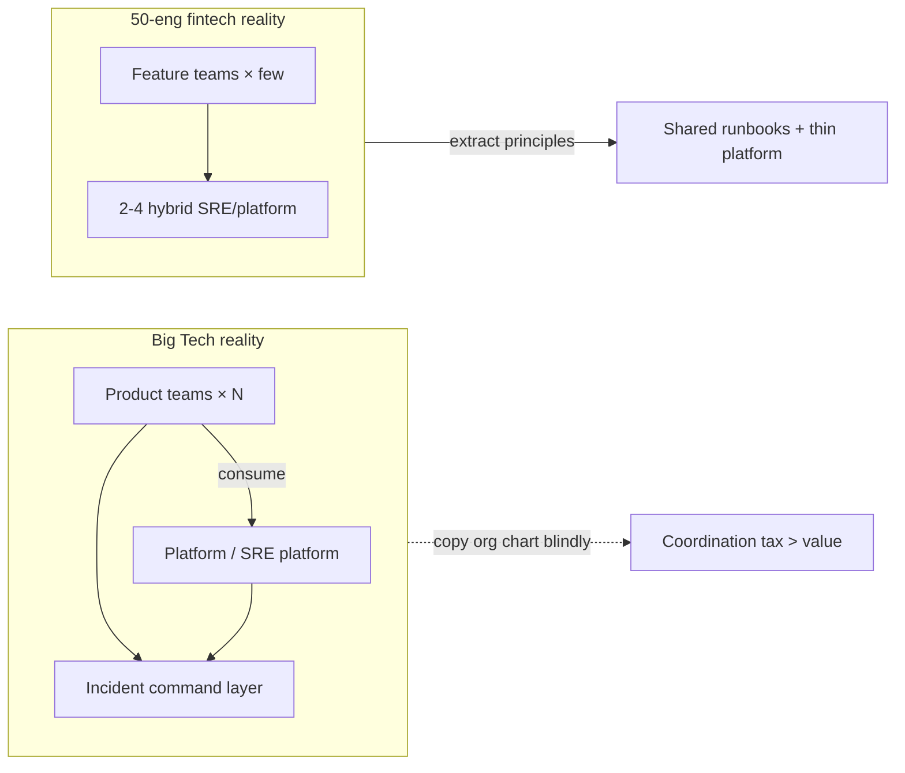

### 1.3 Anti-pattern: “Netflix làm X nên ta làm X”

Đây là failure mode phổ biến nhất khi đọc case study công khai:

1. **Cargo cult tooling**: cài Chaos Monkey trước khi có SLI ổn định và rollback an toàn.
2. **Cargo cult process**: blameless postmortem formal với template 20 trang cho team 8 người — văn hóa chưa kịp, ceremony thành theatre.
3. **Cargo cult ML**: train Isolation Forest / LSTM vì “Uber/Google dùng ML”, trong khi 70% incident là change-driven và chưa có change feed tin cậy.
4. **Cargo cult autonomy**: auto-remediation “full closed loop” khi chưa có dual-control, audit trail, và blast radius model — xem [11 — Remediation](../11-remediation/README.vi.md).

> [!WARNING]
> **Copy mù quáng đắt hơn không làm gì**
> Không làm chaos engineering = bạn chưa biết edge case. Làm chaos engineering trên peak traffic, không có kill switch, không có observability đủ sâu = bạn *tạo* SEV-1 có chủ đích. Big Tech đã trả học phí bằng org size và tooling mature; bạn chưa.

### 1.4 Framework học 3 bước: Extract → Map → Adapt

Mọi pattern trong chương này nên đi qua pipeline sau trước khi trở thành ticket Jira:

| Bước | Câu hỏi | Output |
|------|---------|--------|
| **Extract principle** | Họ tối ưu metric nào? Tránh class of failure nào? | 1–2 câu principle |
| **Map constraint** | Org ta có data/people/blast radius/regulators nào khác? | Constraint list |
| **Adapt** | Version 10%, 50%, 100% của principle là gì? | Decision + non-goals |

**Ví dụ nhanh — Google error budget:**

- *Principle*: reliability là tài nguyên hữu hạn; spend có chủ đích giữa feature velocity và stability.
- *Constraint startup*: chưa có SLI tốt; product “luôn muốn ship”; không có formal negotiation.
- *Adapt 10%*: chọn 3 SLI quan trọng nhất, báo burn rate tuần; chặn deploy tự động khi burn critical (không cần committee).
- *Adapt 100% (sau này)*: error budget policy + freeze mechanics + postmortem bắt buộc khi exhaust.

> [!TIP]
> **Kiểm tra nhanh trước khi “import”**
> Nếu bạn không trả lời được ba câu: (1) principle là gì, (2) constraint khác Big Tech ở đâu, (3) version 10% trông ra sao — thì bạn đang cargo-cult. Dừng lại.

### 1.5 Public knowledge only — cách đọc postmortem đúng

Chương này chỉ dựa trên tài liệu công khai: Google SRE books, Principles of Chaos, AWS post-event summaries, Meta engineering/outage communications, Uber engineering blogs về Michelangelo, v.v. Không có số liệu nội bộ “nghe đồn”.

Khi đọc public postmortem, hãy tách:

| Layer | Ví dụ | Giá trị học |
|-------|-------|-------------|
| **Facts** | “tool command removed more capacity than intended” | class of failure |
| **Mechanism** | automation race, dependency loop | design invariant |
| **Org response** | new safeguards, dual-control | process pattern |
| **Marketing framing** | “we take reliability seriously” | bỏ qua nếu không actionable |

---

## 2. Google — SRE, Error Budget, IMAG, AI SRE agentic

### 2.1 SLI / SLO / Error Budget như “tiền tệ tin cậy”

Google SRE formalize một ý tưởng đơn giản nhưng cực mạnh: **bạn không thể đồng thời tối đa hóa feature velocity và reliability vô hạn**. Error budget là cách định lượng trade-off đó.

Nhắc lại (chi tiết observability ở [01 — Observability](../01-observability/README.vi.md)):

- **SLI**: phép đo thực tế (ví dụ tỷ lệ request thành công, latency p99).
- **SLO**: mục tiêu (ví dụ 99.9% success trong 30 ngày).
- **Error budget**: phần “được phép fail” = `1 - SLO`. Hết budget → ưu tiên reliability.

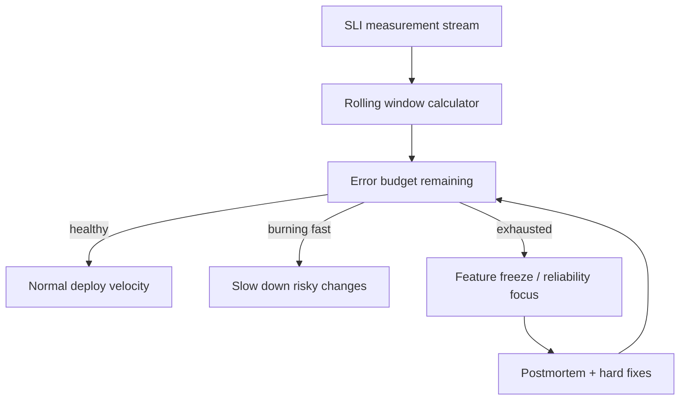

> [!NOTE]
> **Ý TƯỞNG**
> Error budget không phải KPI vanity. Nó là **cơ chế đàm phán** giữa product và SRE bằng số liệu, thay vì bằng cảm xúc (“hệ thống đang mong manh” vs “phải ship Q3”). AIOps pipeline phải *feed* error budget (burn rate alerts, change correlation), không chỉ vẽ chart đẹp.

### 2.2 Edge case: error budget exhaustion vs politics

Trên giấy: hết budget → freeze. Trong thực tế:

| Tình huống | Điều xảy ra nếu không có governance | Điều cần thiết |
|------------|-------------------------------------|----------------|
| CEO demos lớn tuần sau | Freeze bị “exception” im lặng | Exception formal, time-boxed, owner |
| SLO quá chặt (99.99 khi business chỉ cần 99.9) | Budget luôn đỏ → freeze vô nghĩa | Re-negotiate SLO với business |
| SLO quá lỏng | Budget không bao giờ cháy → ship ẩu | Tighten SLI selection, multi-window burn |
| Multi-service shared fate | Service A đốt budget vì dependency B | Shared SLO / dependency SLO policy |

> [!IMPORTANT]
> **Error budget mà không có “răng” thì chỉ là dashboard**
> Răng tối thiểu cho org vừa: (1) page khi multi-window burn rate vượt ngưỡng, (2) require extra approval cho deploy khi budget < X%, (3) postmortem bắt buộc khi exhaust. Không cần org chart Google để làm 3 việc này.

### 2.3 Incident management: IMAG và tư duy command system

Google công bố mô hình incident management (thường được gọi trong ngữ cảnh IMAG / incident management practices gắn với SRE culture) lấy cảm hứng từ **Incident Command System**: phân vai rõ khi stress cao.

Các vai trò điển hình (tên có thể khác giữa org, principle giữ nguyên):

| Role | Trách nhiệm | Không làm |
|------|-------------|-----------|
| **Incident Commander (IC)** | Ưu tiên, quyết định chiến lược, giữ tempo | Không tự debug sâu 3 giờ |
| **Operations / SME** | Điều tra và execute technical actions | Không tự ý đổi scope incident |
| **Communications** | Stakeholder, status page, exec updates | Không “đoán” technical root cause |
| **Scribe / Planner** | Timeline, decisions, action items | Không im lặng để memory fail |

Map sang AIOps:

- LLM agent / RCA engine **không thay IC** — chúng là SME force-multiplier.
- Ticket AIOps phải có schema hỗ trợ handoff: timeline, hypotheses, actions taken, blast radius — xem [09 — RCA](../09-root-cause-analysis/README.vi.md) và [10 — LLM Agent](../10-llm-agent/README.vi.md).
- Auto-remediation là “operations executor có safety gate”, không phải IC.

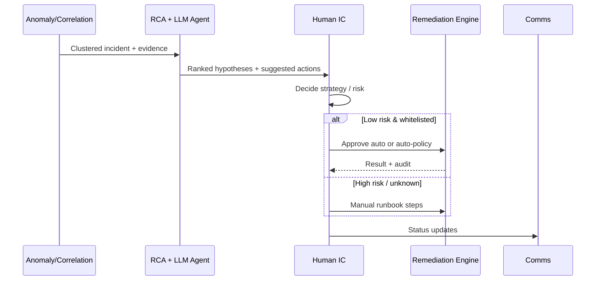

### 2.4 Agentic AI cho SRE (public direction 2025–2026)

Google Cloud và hệ sinh thái SRE công khai đã đẩy mạnh hướng **agentic assistance**: agent đọc playbook, truy vấn telemetry, đề xuất bước điều tra, soạn summary — luôn với human oversight cho hành động nguy hiểm.

Bài học thiết kế cho handbook (không phụ thuộc vendor cụ thể):

1. **Playbook-as-code + retrieval**: agent không “bịa runbook”; nó ground trên corpus đã review.
2. **Tool use có scope**: query metrics/logs/traces OK; mutate production cần policy engine.
3. **Audit trail bất biến**: mọi hypothesis, tool call, decision phải log — phục vụ postmortem và compliance.
4. **Human-in-the-loop theo risk tier**: đọc/tóm tắt tự do; restart pod có thể auto; failover region thì dual-control.

> [!TIP]
> **Liên hệ chapter 10–11**
> Agentic SRE của Big Tech xác nhận kiến trúc handbook: intelligence layer (detect → correlate → RCA → LLM) tách khỏi action layer (remediation safety). Đừng gộp “LLM tự kubectl” thành một process không gate.

### 2.5 Bài học Google cho AIOps pipeline

| Google pattern | AIOps implication | Chapter liên quan |
|----------------|-------------------|-------------------|
| SLI/SLO first | Detection phải ưu tiên user-facing SLI, không phải “CPU cao” | 01, 07 |
| Error budget | Burn rate = first-class signal cho correlation & prioritization | 07, 08 |
| Blameless + data | Postmortem feed training labels / playbook updates | 09, 10 |
| Role separation in incident | Agent = SME helper; human = IC for ambiguity | 10 |
| Progressive automation | Remediation maturity ladder, không big-bang autonomy | 11, 12 |

### 2.6 Anti-patterns “Google-flavored”

1. **SLO inflation**: 40 SLO cho mọi microservice → alert noise, không ai negotiate được.
2. **SRE as ticket farm**: product ném mọi toil sang SRE; error budget không được dùng để ép fix architecture.
3. **Agent without grounding**: LLM “điều tra” bằng general knowledge thay vì telemetry + internal docs → confident wrong.
4. **IC theatre**: đặt title Incident Commander nhưng mọi người vẫn tự deploy hotfix song song không coordination.

---

## 3. Netflix — Chaos Engineering, Simian Army, resilience-first

### 3.1 Từ Chaos Monkey đến Principles of Chaos

Netflix nổi tiếng với **Chaos Monkey** (tắt instance ngẫu nhiên) trong hệ Simian Army — nhưng di sản quan trọng hơn là **Principles of Chaos Engineering**: thí nghiệm có kiểm soát để xây niềm tin vào khả năng chịu đựng của hệ thống trong production-like conditions.

Chuỗi logic:

1. Định nghĩa “steady state” bằng business metrics (không chỉ infra green).
2. Giả thuyết: hệ thống vẫn steady khi inject X failure.
3. Chạy thí nghiệm với blast radius nhỏ.
4. Quan sát, học, harden — lặp lại.

> [!NOTE]
> **Ý TƯỞNG**
> Chaos không phải “phá cho vui”. Chaos là **scientific method** áp vào resilience. Nếu bạn không đo steady state, bạn không làm chaos engineering — bạn đang làm random sabotage.

### 3.2 Observability là điều kiện tiên quyết của chaos

Không có deep observability, chaos chỉ tạo outage không giải thích được. Netflix-style thinking và handbook này hội tụ tại [01 — Observability](../01-observability/README.vi.md):

| Trước chaos experiment | Vì sao bắt buộc |
|------------------------|-----------------|
| SLI steady-state dashboard | Biết “bình thường” trông ra sao |
| Distributed tracing | Thấy cascade path khi inject latency |
| High-cardinality labels có kiểm soát | Phân biệt canary vs control |
| Alert routing test mode | Không đánh thức cả công ty vì experiment |
| Kill switch / abort criteria | Dừng experiment khi burn rate xấu |

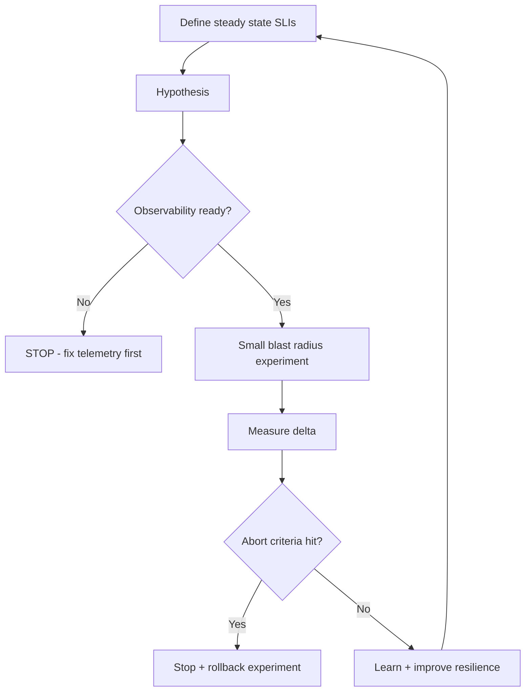

### 3.3 Hystrix-era bulkhead / circuit breaker → modern equivalents

Thời Hystrix, Netflix phổ biến hóa:

- **Circuit breaker**: fail fast khi dependency bệnh.
- **Bulkhead**: cô lập thread/connection pools theo dependency.
- **Fallback**: degrade gracefully thay vì chết cả request path.

Hystrix đã sunset trong hệ sinh thái Java/Netflix, nhưng **patterns còn sống** qua Resilience4j, service mesh retries/timeouts/circuit breaking, platform-level concurrency limits, và client-side hedging ở một số hệ thống.

Map sang AIOps:

| Resilience pattern | Detection signal | Remediation angle |
|--------------------|------------------|-------------------|
| Circuit open storm | Error rate + fallback metrics spike | Scale / fix dependency; không restart client mù |
| Bulkhead exhaustion | Queue/thread pool saturation | Capacity + limit tuning |
| Retry amplification | Traffic × retries = self-DoS | Retry budget, jitter — detection phải hiểu “secondary load” |

> [!WARNING]
> **Retry là amplifier**
> Nhiều incident “AIOps phát hiện latency” thực chất là **retry storm**. Nếu anomaly model không có feature “retry ratio / outbound concurrency”, RCA sẽ đổ oan cho CPU pod thay vì client policy.

### 3.4 Edge: chaos lúc peak vs off-peak; safety rails

| Chế độ | Ưu | Nhược | Khi nào dùng |
|--------|----|-------|--------------|
| Off-peak chaos | An toàn hơn, dễ approve | Không phản ánh load thật, cache ấm khác | Early maturity, game days |
| Peak / production chaos | Tín hiệu trung thực | Rủi ro doanh thu / SEV | Org mature, kill switch, small % traffic |
| Staging-only | Rẻ | False confidence (topology/data khác) | Unit của resilience tests, không đủ một mình |

**Safety rails tối thiểu (bất kể quy mô):**

1. Experiment ID + owner + TTL.
2. Max % instances / max one AZ / one cluster slice.
3. Auto-abort khi SLI vượt ngưỡng.
4. Change freeze windows (sale, regulatory cutover) = no chaos.
5. Post-experiment note gắn vào knowledge base (feed [10 — LLM Agent](../10-llm-agent/README.vi.md)).

### 3.5 Bài học Netflix cho AIOps

1. **Resilience là product requirement**, không phải afterthought của detection.
2. **Steady-state metrics** phải nằm trong anomaly baselines — xem seasonality ở [07](../07-anomaly-detection/README.vi.md).
3. **Game day** là cách rẻ để train cả human IC và agent playbooks.
4. **Progressive delivery + chaos** bổ sung nhau: canary trả lời “code mới có an toàn không?”; chaos trả lời “failure mode cũ có còn được che không?”

Liên hệ [12 — Production](../12-production/README.vi.md) mục chaos cho chính nền tảng AIOps: platform giám sát cũng phải chịu được mất Kafka partition, mất LLM provider, mất một collector — nếu không, AIOps trở thành single point of blindness.

---

## 4. Amazon / AWS — Correction of Error & operational tools as hazard

### 4.1 Văn hóa Correction of Error (COE)

Amazon nổi tiếng với kỷ luật **Correction of Error**: phân tích sâu nguyên nhân, cơ chế, và corrective actions có owner — gần với blameless postmortem nhưng mang DNA “mechanism over good intentions”. Ý tưởng cốt lõi cho AIOps: **mỗi incident lớn phải để lại thay đổi cấu trúc** (guardrail, test, automation limit), không chỉ “remind the team to be careful”.

> [!NOTE]
> **Ý TƯỞNG**
> “Be careful” không phải control. Control là: tool không cho phép thao tác một chiều trên capacity lớn; thay đổi DNS có automation race detector; recovery path không phụ thuộc vào chính hệ thống đang chết.

### 4.2 S3 — 28/02/2017: typo / remove capacity và safeguards

Public post-event summary của AWS về sự cố S3 tại US-EAST-1 (28 tháng 2 năm 2017) mô tả class of failure quan trọng:

- Một thao tác vận hành trên hệ thống billing/capacity management **gỡ nhiều capacity hơn dự kiến** (lỗi ở lệnh / tham số vận hành).
- Hiệu ứng lan sang S3 subsystems; các AWS service phụ thuộc S3 và console cũng bị ảnh hưởng.
- Bài học công khai nhấn mạnh **thêm safeguards cho operational tools**: giới hạn blast radius của lệnh admin, cải thiện removal tooling, hardening recovery.

**Principle trích xuất:** *công cụ vận hành là hazard surface lớn ngang (đôi khi lớn hơn) code ứng dụng*.

Map AIOps:

| Lesson S3 2017 | AIOps design |
|----------------|--------------|
| Admin tool quá mạnh | Remediation actions có allowlist + max scope |
| Human typo ở scale | Policy engine validate parameters trước execute |
| Console dependency | Status / break-glass channel out-of-band |
| Long recovery | Runbooks + automation tested *trước* disaster |

### 4.3 DynamoDB DNS automation race (public themes, US-EAST-1)

AWS đã công bố các sự cố lớn liên quan automation và DNS/control plane (trong đó có các phân tích công khai quanh disruption DynamoDB / regional impairments với chủ đề **DNS automation race** và **recovery tooling dependency**). Các theme học thuật/engineering từ public summaries:

1. **Race trong automation**: hai phần của hệ thống tự động (hoặc automation vs operator) làm state phân tán không hội tụ đúng — DNS records / plan state lệch.
2. **Recovery path phụ thuộc hệ thống bệnh**: công cụ khôi phục cần chính control plane hoặc data plane đang degraded → kéo dài MTTR.
3. **Cascading customer impact**: nhiều control planes và customer workloads “trông khỏe” trên giấy nhưng phụ thuộc ngầm vào regional primitive.

> [!IMPORTANT]
> **Invariant vàng**
> *Automation có nhiệm vụ phục hồi không được có hard dependency vào chính subsystem nó đang phục hồi — hoặc phải có mode degraded độc lập.* Đây là bài học #1 khi thiết kế remediation và DR cho AIOps.

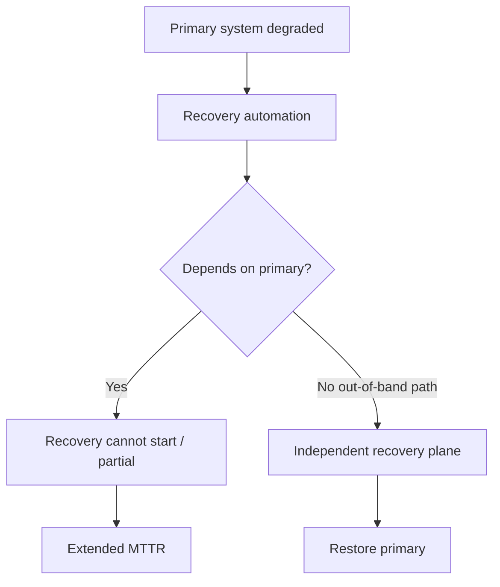

### 4.4 AIOps implication: remediation circuit breakers & dual-control

Kết nối trực tiếp [11 — Remediation](../11-remediation/README.vi.md):

| Safeguard | Mô tả | Tránh class of failure |
|-----------|-------|------------------------|
| **Action allowlist** | Chỉ action đã chứng minh an toàn | “LLM invent kubectl” |
| **Blast radius cap** | Max pods / max % / one AZ | S3-style over-removal |
| **Rate limit remediation** | N actions / window / service | Thundering herd restarts |
| **Circuit breaker on remediation** | Nếu success rate giảm → stop auto | Automation amplifying outage |
| **Dual-control** | High-risk needs second approver | Single operator/tool error |
| **Dry-run / simulate** | Plan before apply | Parameter mistakes |
| **Independent audit log** | Log ship ra ngoài cluster bệnh | Mất forensics khi outage |
| **Out-of-band break-glass** | Bastion / alternate region console | Control plane lockout (mục 5) |

### 4.5 Operational tools as hazard — checklist thiết kế

Khi review bất kỳ “AIOps bot” nào:

1. Bot có thể tác động bao nhiêu % capacity trong một lệnh?
2. Có confirmation khác channel cho high-impact không?
3. Có unit test / policy test cho parser tham số không?
4. Có “big red button” disable toàn bộ auto-remediation không?
5. Recovery docs có bản offline / vùng độc lập không?
6. Tool có phụ thuộc DNS/IAM/API của chính region đang fail không?

> [!WARNING]
> **AIOps closed-loop là operational tool hạng nặng**
> Mỗi khi bạn tăng autonomy, bạn đang tăng *privileged automation surface*. Treat remediation engine như production admin API: threat model, least privilege, change management.

---

## 5. Meta / Facebook — BGP 2021 và class of control-plane failures

### 5.1 Class of failure: backbone / BGP / DNS cascade (Oct 2021)

Sự cố toàn cầu công khai của Meta/Facebook tháng 10 năm 2021 được mô tả rộng rãi trong engineering communications và phân tích kỹ thuật công khai với các theme:

- Thay đổi trên backbone / network control làm **mất kết nối tới các data center**.
- **DNS** và khả năng resolve các service phía ngoài bị ảnh hưởng theo chuỗi.
- Đội ngũ gặp khó khăn tiếp cận hệ thống vì **công cụ và network path thông thường cũng nằm trong blast radius**.
- Bài học lặp lại ở ngành: **out-of-band access**, **gradual config rollout**, **audit commands có thể lock you out**.

Bạn không cần nhớ từng chi tiết nội bộ (và không nên bịa). Bạn cần nhớ **class**:

> Control plane thay đổi → mất data plane path → mất ability to fix control plane → kéo dài outage.

### 5.2 Control plane locking itself out

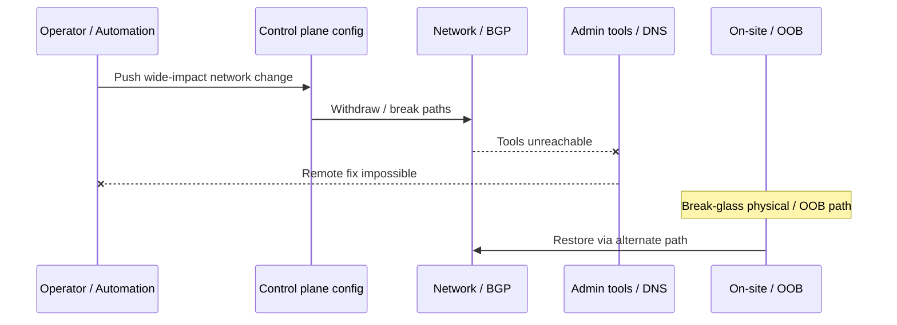

Map sang Kubernetes / cloud / AIOps hiện đại (cùng class, khác surface):

| Surface | Lockout example |
|---------|-----------------|
| Kubernetes NetworkPolicy | Deny all including controllers / DNS |
| Service mesh mTLS | Break identity → no deploy, no scrape |
| IAM / security group | Lock admin roles |
| DNS internal | Service discovery dead → “everything is down” |
| Observability agents | Mù toàn tập sau change agent config |
| Remediation bot credentials | Bot rotate secret sai → không remediate được |

### 5.3 Lesson: break-glass, OOB, gradual rollout

| Control | Mô tả | AIOps relevance |
|---------|-------|-----------------|
| **Break-glass accounts** | Credential ít dùng, monitored cực chặt | Dùng khi IdP chính down |
| **Out-of-band access** | Cellular, alternate region, serial/console | DR runbook AIOps platform |
| **Progressive config** | Canary DC / canary % routers / canary cluster | Config-as-code + progressive apply |
| **Automatic rollback triggers** | Health signal suy → revert | Giống remediation verification reverse |
| **Dry-run & impact estimation** | “How many prefixes / pods affected?” | Blast radius calculator |
| **Two-person rule** | High-risk network/IAM changes | Dual-control remediation |

> [!TIP]
> **Game day lockout**
> Ít nhất mỗi quý: giả lập “mất VPN + mất cluster API”. Nếu team không restore được trong mục tiêu thời gian bằng break-glass docs, thì AIOps auto-remediation chỉ là ảo tưởng — vì khi SEV thật, người cũng không vào được hệ thống.

### 5.4 DNS / config cascade và correlation

Từ góc [08 — Alert Correlation](../08-alert-correlation/README.vi.md) và [09 — RCA](../09-root-cause-analysis/README.vi.md):

- DNS failure tạo **fan-out alerts** cực lớn (mọi service “dependency timeout”).
- Topology-only RCA dễ chọn nhầm “leaf service”.
- Cần **change feed** (network ACL, CoreDNS config, Terraform apply) trong evidence ranking.
- Anomaly detection trên *DNS latency / NXDOMAIN rate / CoreDNS CPU* phải là first-class — không chôn dưới “app error rate”.

---

## 6. Uber — Michelangelo: bài học ML platform cho AIOps

### 6.1 Vì sao Michelangelo quan trọng với AIOps

Uber công bố **Michelangelo** như ML platform nội bộ giúp nhiều team build, deploy, monitor models. Dù use case ban đầu là product ML (marketplace, ETA, v.v.), các problem statements **trùng isomorphic** với AIOps ML:

| Product ML pain | AIOps ML twin |
|-----------------|---------------|
| Feature train/serve skew | Metric features khác nhau giữa train batch và online detector |
| Model deployment sprawl | Mỗi team tự train anomaly model không chuẩn hóa |
| Monitoring model quality | Drift detector im lặng → false negative SEV |
| Platform vs one-off scripts | AIOps “notebook trên laptop on-call” không scale |

### 6.2 Feature store consistency (train/serve)

Bài học kinh điển: model đạt accuracy cao offline vì feature pipeline training “sạch và giàu”, nhưng online serving thiếu feature, trễ, hoặc định nghĩa khác → **silent quality death**.

Trong AIOps:

```text
Train:  latency_p99 = quantile(window=5m, source=Prometheus 1.0)
Serve:  latency_p99 = avg(window=1m, source=statsd approx)
→ Model “thấy” phân phối khác → threshold vô nghĩa
```

**Invariant:** định nghĩa feature là contract versioned. Detector online phải consume **cùng semantic** với training (hoặc có adapter test bắt skew).

> [!NOTE]
> **Ý TƯỞNG**
> Nhiều “ML anomaly không work” không phải thuật toán kém — mà là **data contract kém**. Trước khi đổi LSTM sang Transformer, hãy audit train/serve skew. Xem feature engineering trong [07 — Anomaly Detection](../07-anomaly-detection/README.vi.md).

### 6.3 Model excellence / quality score & drift monitoring

Platform ML trưởng thành đo model như product:

- Data freshness
- Prediction distribution shift
- Label delay / feedback loop quality
- Latency budget của inference
- Owner on-call cho model

AIOps cần tương đương:

| Signal | Ý nghĩa |
|--------|---------|
| Precision@k trên incident confirmed | Model có spam không |
| Recall trên SEV đã postmortem | Model có mù không |
| Feature null rate | Pipeline gãy |
| Baseline age | Model cũ so với seasonality mới |
| Action success rate khi model trigger remediate | Closed-loop quality |

### 6.4 Productizing ML cho nhiều team

Michelangelo-style lesson: **đừng để mỗi squad tự dựng training cluster**. Platform cung cấp:

1. Standardized pipelines (train, validate, deploy).
2. Feature reuse.
3. Model registry + rollback.
4. Default monitoring dashboards.
5. Security & PII controls.

Map org 50–200 eng AIOps:

- Một **thin ML platform** cho anomaly/RCA models đủ: registry đơn giản, CI evaluate trên historical incidents, canary model deploy.
- Chưa cần full feature store Uber-scale; cần **feature definitions trong Git** + tests.

### 6.5 Map sang anomaly detection / RCA trong handbook

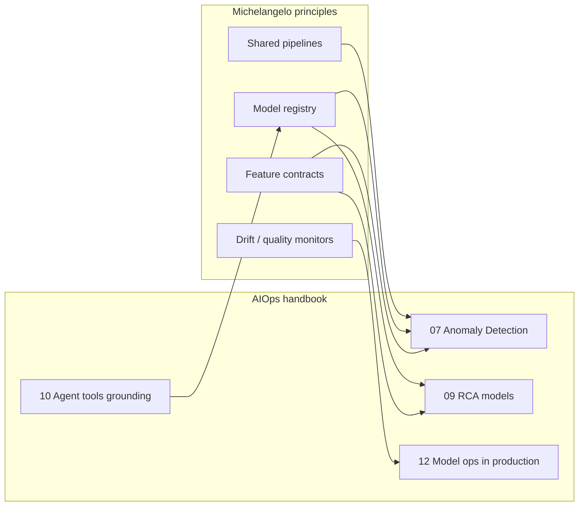

**Thực dụng:** nếu org bạn mới bắt đầu, “Michelangelo lite” = 

1. Dataset incident labels từ postmortem (dù chỉ 30 case).
2. Offline evaluation gate trước khi bật detector mới.
3. Shadow mode 2 tuần.
4. Owner rõ cho từng model detector.

---

## 7. LinkedIn, Microsoft, Spotify — observability & ownership ở quy mô lớn

Chọn ba org có public engineering narratives hữu ích (không phủ toàn bộ ngành, không cần đủ “top 10”).

### 7.1 LinkedIn — observability & Kafka-centric data paths

LinkedIn nổi tiếng công khai với quy mô **Kafka** và data infrastructure; engineering blogs thường nhấn:

- Event streaming là backbone cho analytics và operational signals.
- Ownership và multi-tenant platform concerns (topic standards, quotas, schema).
- Observability phải cover **pipeline health** (lag, produce error) chứ không chỉ app RED metrics.

Bài học AIOps (khớp [06 — Kafka](../06-kafka/README.vi.md)):

| Pattern | Adapt |
|---------|-------|
| Kafka as nervous system | AIOps bus: raw → anomalies → correlated → remediation results |
| Schema / contract discipline | Event schemas versioned; poison message strategy |
| Lag as SLI | Consumer lag detector là meta-signal — AIOps mù nếu bus trễ |
| Multi-team platform | Topic naming, quota, DLQ standards trước khi “tự do topic” |

> [!TIP]
> **Meta-observability**
> Big Tech học sớm: *hệ thống quan sát cũng là production system*. Nếu Kafka lag 15 phút, “real-time anomaly” là marketing. Đo pipeline SLI riêng — xem [12](../12-production/README.vi.md).

### 7.2 Microsoft — layered ownership, distributed SRE practices

Microsoft (và Azure engineering cultures công khai) thường thể hiện:

- **Service ownership** mạnh: team xây service chịu paging.
- Platform cung cấp building blocks (identity, telemetry agents, incident tooling) thay vì centralized ops làm hết.
- Emphasis trên **safe deployment** (progressive expose, feature flags) như reliability control.

Map AIOps:

- Central AIOps team **không own mọi alert**. Họ own engines + standards; service teams own SLIs và playbooks.
- Auto-remediation policy theo **service tier** và owner annotation (Kubernetes labels / catalog).
- Without ownership metadata, correlation/RCA thiếu “ai chịu trách nhiệm hành động”.

### 7.3 Spotify — squad model, golden paths, backstage-style thinking

Spotify engineering culture (squad/tribe — dù industry đã tranh luận mức độ “copy model”) và các nỗ lực **developer portal / golden paths** gợi ý:

- Developer experience là reliability lever: path mặc định tốt → ít snowflake.
- Standardization không đồng nghĩa central bottleneck nếu self-service.
- Observability templates (dashboards-as-code, default alerts) giảm variance.

AIOps adapt:

| Spotify-like idea | AIOps form |
|-------------------|------------|
| Golden path service | Default OTel + SLIs + alert pack + runbook stub |
| Portal catalog | Service catalog = topology input cho RCA |
| Squad autonomy | Squad tune thresholds trong guardrail platform |
| Less inventiveness tax | Ít “mỗi team một stack monitor” |

### 7.4 Airbnb (bonus ngắn): data quality & experimentation mindset

Airbnb public tech talks/blogs thường chạm data quality, experimentation, và infra productivity. Bài học ngắn cho AIOps: **mọi detector là thí nghiệm** — cần assignment, metric thành công, và khả năng tắt. Shadow mode + A/B threshold policies là mindset product, không chỉ ML research.

---

## 8. So sánh chéo: patterns chung

### 8.1 Bảng so sánh (public-pattern level)

| Company lens | Detection emphasis | Correlation / RCA | Auto-remediation maturity (public posture) | Culture mechanism |
|--------------|--------------------|-------------------|--------------------------------------------|-------------------|
| **Google** | SLI/SLO burn, deep telemetry | Topology + change + human IC process | Progressive; strong process before full autonomy | Error budget, blameless, IMAG roles |
| **Netflix** | Steady-state business metrics | Resilience path analysis, dependency isolation | Auto at app resilience layer (breakers) more than “ops bots” | Chaos, freedom & responsibility |
| **AWS** | Massive multi-tenant signals | COE-driven mechanism hunting | Heavy internal automation + strict safeguards lessons | COE, mechanisms > intentions |
| **Meta** | Global graph / network + app | Cascade from core infra | Caution from lockout class failures | Move fast *with* (hard-won) safety rails |
| **Uber** | ML platform quality | Model+data for decisions | Product automation; ops ML via platform discipline | Platform productization |
| **LinkedIn** | Pipeline + app metrics | Event-sourced truth | Platform standards first | Kafka-centric contracts |
| **Microsoft** | Layered cloud telemetry | Ownership + safe deploy | Policy-driven automation | Service ownership |
| **Spotify** | Golden path defaults | Catalog/ownership graph | Self-service progressive | Squad + platform DX |

> Bảng là **heuristic**, không phải benchmark nội bộ. Dùng để chọn principle, không để tranh “ai giỏi hơn”.

### 8.2 Common patterns hội tụ

Bất chấp brand, các org mature hội tụ về:

1. **SLO-first prioritization** — không page vì “CPU 80%” nếu user không đau.
2. **Topology + change graphs** — RCA không chỉ time-series similarity.
3. **Progressive automation** — từ suggest → approve → auto cho class đã chứng minh.
4. **Blameless postmortem với corrective mechanisms** — không dừng ở narrative.
5. **Platform + ownership dual track** — platform cung cấp ray; team own service.
6. **Operational tool safety** — admin/automation surfaces được threat-model.
7. **Out-of-band recovery** — đừng để recovery path single-homed.
8. **Meta-observability** — monitor the monitors.

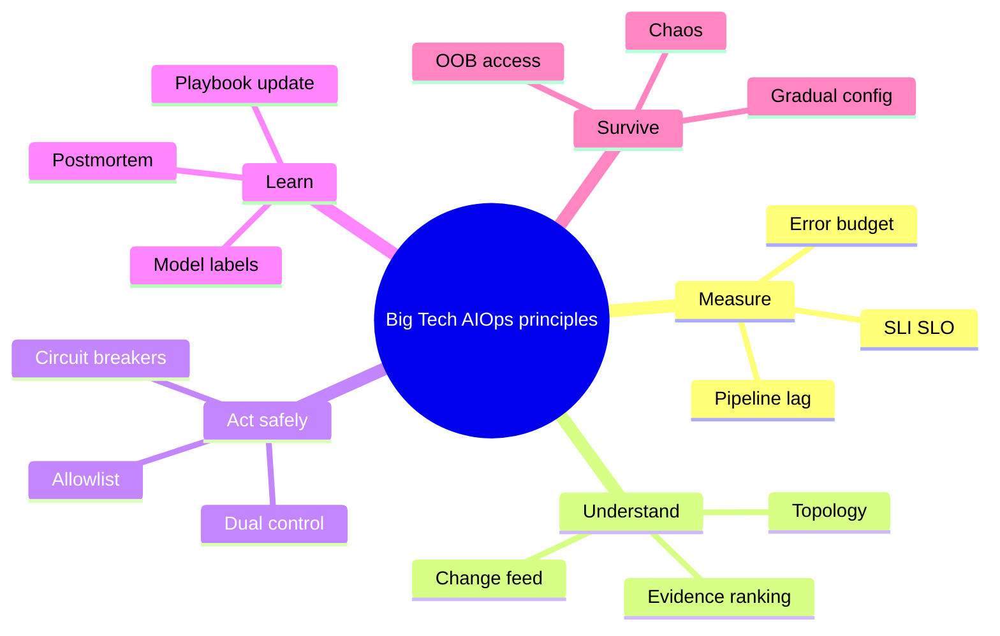

### 8.3 Decision tree: pattern nào học trước?

```text
Bạn đã có SLI user-facing ổn định?
├─ Không → Học Google SLO basics + Observability chapter 01
└─ Có
   ├─ Alert noise có giết on-call?
   │  ├─ Có → Correlation + ownership (LinkedIn/Microsoft patterns)
   │  └─ Không
   │     ├─ MTTR dài vì thiếu chẩn đoán?
   │     │  ├─ Có → RCA topology + change (Google/Meta lessons)
   │     │  └─ Không
   │     │     ├─ Failures lặp lại, chưa harden?
   │     │     │  ├─ Có → Netflix chaos + bulkhead thinking
   │     │     │  └─ Không
   │     │     │     ├─ Muốn auto-remediate?
   │     │     │     │  ├─ Có → AWS safeguards + chapter 11 ladder
   │     │     │     │  └─ Không → tối ưu detection quality (Uber ML discipline)
```

---

## 9. Decision framework: org 10 / 100 / 1000 eng

### 9.1 Không gian quyết định

Ba biến quan trọng hơn headcount thuần:

1. **Service count & coupling**
2. **Regulated or not** (fintech/healthcare siết dual-control)
3. **On-call pain** (pages/week, MTTR, SEV rate)

Headcount chỉ là proxy cho coordination capacity.

### 9.2 Org ~10 engineers

**Mục tiêu:** sống sót với tín hiệu sạch; chưa xây “AIOps platform”.

| Area | Nên làm | Không nên làm |
|------|---------|---------------|
| Detection | 5–10 SLI alerts + simple burn rate | Ensemble ML 4 models |
| Correlation | Manual + light grouping (labels) | Graph neural RCA |
| RCA | Change log + dashboards + traces | Auto root cause scores production-critical |
| Remediation | Runbook + 1–2 safe autos (restart with cap) | Closed-loop LLM kubectl |
| Chaos | Staging game day quarterly | Peak production chaos |
| Culture | 1-page postmortem | Full IMAG role set every incident |

> [!IMPORTANT]
> **Ở 10 eng, “AIOps” thắng lớn nhất thường là observability + alert hygiene**, không phải model. Xem [00 — Introduction](../00-introduction.vi.md) maturity model.

### 9.3 Org ~100 engineers

**Mục tiêu:** thin platform; shared pipeline; progressive automation.

| Area | Nên làm | Trade-off |
|------|---------|-----------|
| Detection | Statistical + vài ML cho seasonal services | Cost of false positives vs coverage |
| Correlation | Multi-stage rules + topology service catalog | Catalog stale = RCA wrong |
| RCA | Topology + change correlation + LLM summary | LLM cost & hallucination controls |
| Remediation | Tiered auto (L1/L2) + dual-control L3 | Org trust building 3–6 months |
| Chaos | Canary chaos / one AZ experiments | Needs abort automation |
| ML ops | Registry lite + shadow mode | Chưa full feature store |
| Incident | IC cho SEV-1/2 | Không over-process SEV-4 |

### 9.4 Org ~1000 engineers

**Mục tiêu:** multi-tenant AIOps platform; productized; strong governance.

| Area | Pattern Big Tech tương ứng |
|------|----------------------------|
| Detection | Multi-tenant anomaly platform, per-team overrides |
| Correlation | Global + domain correlators |
| RCA | Rich topology graph, GNN optional, case-based memory |
| Remediation | Policy engine enterprise, audit, regional isolation |
| Chaos | Continuous chaos for critical paths |
| Culture | Error budget negotiations formal |
| Staffing | Platform SRE + embedded SRE hybrid |

### 9.5 Bảng chọn capability theo quy mô

| Capability | 10 eng | 100 eng | 1000 eng |
|------------|--------|---------|----------|
| SLO program | 3–5 company SLIs | per critical service | portfolio + dependency SLOs |
| Anomaly ML | optional | selective | platform default + opt-out |
| Alert correlation | light | core investment | multi-layer |
| LLM investigation | paste into ChatOps carefully | agent with tools + audit | fleet of agents + eval harness |
| Auto-remediation | minimal | ladder | broad with strict policy |
| Chaos engineering | game days | regular | continuous selective |
| Feature store | no | git contracts | real store if many models |
| Dual-control | for prod data deletes | for high-risk remediate | systemic |

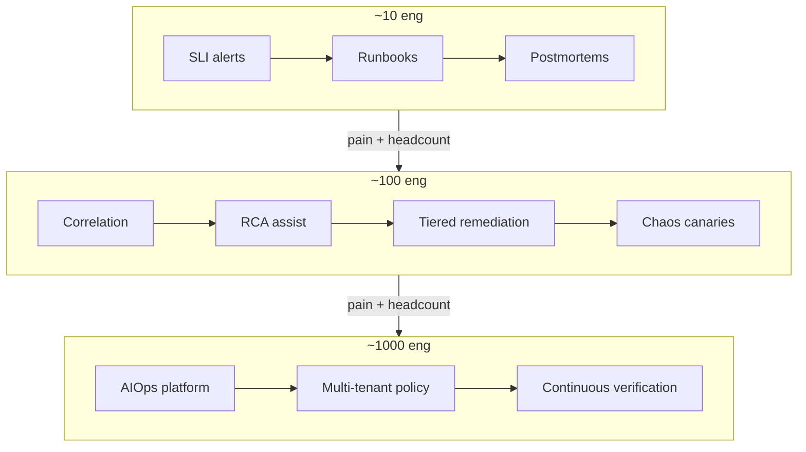

---

## 10. Edge cases khi import pattern Big Tech

### 10.1 Edge case: copy SLO số

Big Tech public 99.99% cho một lớp service. Org bạn copy 99.99% cho monolith + third-party payment → budget cháy tuần đầu → freeze vĩnh viễn hoặc ignore SLO.

**Xử lý:** SLO theo **user journey** và dependency thực; dùng multi-window burn (Google workbook style) thay vì target hào nhoáng.

### 10.2 Edge case: chaos trên shared database

Netflix chaos instance-level trên stateless fleet khác hẳn việc kill primary database của fintech 50 eng.

**Xử lý:** chaos theo **tầng có redundancy đã chứng minh**. Database: failover drill có schedule, không random kill primary lúc peak.

### 10.3 Edge case: auto-remediation trong regulated environment

AWS-style automation mạnh vs requirement audit 4-eyes, change ticket, segregation of duties.

**Xử lý:** dual-control + immutable audit + “auto only in lower environments / only for tier-3 services” trước. Compliance là constraint, không phải enemy của AIOps.

### 10.4 Edge case: LLM agent với data residency

Agentic SRE cloud public có thể gửi log snippets ra API ngoài — vi phạm policy.

**Xử lý:** private model / VPC endpoint / redaction layer; tool outputs minimize PII — xem [10](../10-llm-agent/README.vi.md) và security ở [12](../12-production/README.vi.md).

### 10.5 Edge case: topology graph thối (stale CMDB)

Meta/Google-scale đầu tư discovery. Org vừa mua CMDB, 40% service missing → RCA “tự tin sai”.

**Xử lý:** prefer **runtime discovery** (mesh, eBPF, OTel service graph) + catalog soft dependency; confidence score giảm khi topology stale.

### 10.6 Edge case: error budget vs sales-driven launch

Politics thắng số liệu nếu leadership không buy-in.

**Xử lý:** frame error budget bằng **doanh thu at risk / SLA penalty**, không frame bằng “SRE best practice”.

### 10.7 Edge case: single region “AWS lessons” nhưng multi-cloud fantasy

Đọc multi-region active-active của Big Tech rồi thiết kế cho team chưa có DR drill single-region.

**Xử lý:** sequential maturity: backup restore tested → warm standby → multi-AZ app → multi-region chỉ khi business case.

### 10.8 Edge case: blameless giả

Postmortem “blameless” nhưng promotion vẫn phạt người on-call.

**Xử lý:** leadership behavior là control thật. Không có AIOps tool nào chữa toxic incentives.

### 10.9 Edge case: Simian Army trong Kubernetes mà không có PodDisruptionBudget

Chaos Monkey hiện đại = delete pod random. Không PDB / không capacity → self-inflicted outage.

**Xử lý:** resilience prerequisites checklist trước chaos flag = on.

### 10.10 Edge case: “Uber feature store” cho 2 models

Overhead platform > value.

**Xử lý:** 2 models = versioned SQL/PromQL features trong repo + CI. Feature store khi số models/features và consumers vượt ngưỡng đau.

> [!WARNING]
> **Danh sách đỏ khi import**
> 1) Full closed-loop remediation tuần đầu  
> 2) Production chaos không abort  
> 3) SLO 99.99 copy-paste  
> 4) LLM mutate prod không allowlist  
> 5) Bỏ break-glass vì “cloud đã reliable”  

---

## 11. Case study: AIOps cho fintech 50 eng

### 11.1 Bối cảnh giả định (realistic composite)

- 50 engineers, 30 microservices trên 1 cloud region, 3 AZ.
- Payment, ledger, KYC, mobile BFF.
- Regulator: audit trail bắt buộc cho thay đổi production ảnh hưởng tiền.
- Pain: ~25 Pager incidents/tháng; 40% noise; MTTR P1 ~70 phút; 2 SEV lớn/năm liên quan deploy + dependency.
- Stack hướng handbook: OTel, Prometheus, Loki, Tempo, Kafka, Grafana.

Mục tiêu 6 tháng: **giảm noise 60%, MTTR P1 còn ~25 phút, auto-remediate 15–20% classes an toàn, không vi phạm dual-control**.

### 11.2 Principles chọn từ Google + Netflix + AWS

| Source | Principle giữ | Adapt fintech 50 |
|--------|---------------|------------------|
| Google | SLO + burn + IC cho SEV-1 | 8–12 SLI journeys; IC rota đơn giản |
| Google | Human-in-loop agentic assist | LLM đề xuất, không tự chuyển tiền path |
| Netflix | Steady state + game day | Quarterly failover + latency inject staging/prod canary |
| Netflix | Bulkhead thinking | Timeouts/retries budget cho payment clients |
| AWS | Ops tool safeguards | Remediation allowlist + dual-control ledger-touching |
| AWS | Recovery independence | Runbooks offline; status page third-party |
| Meta | Gradual config + OOB | Terraform canary plans; break-glass admin |
| Uber | Train/serve discipline | 2 detectors có evaluation harness, không ML zoo |

### 11.3 Kiến trúc mục tiêu (thin AIOps)

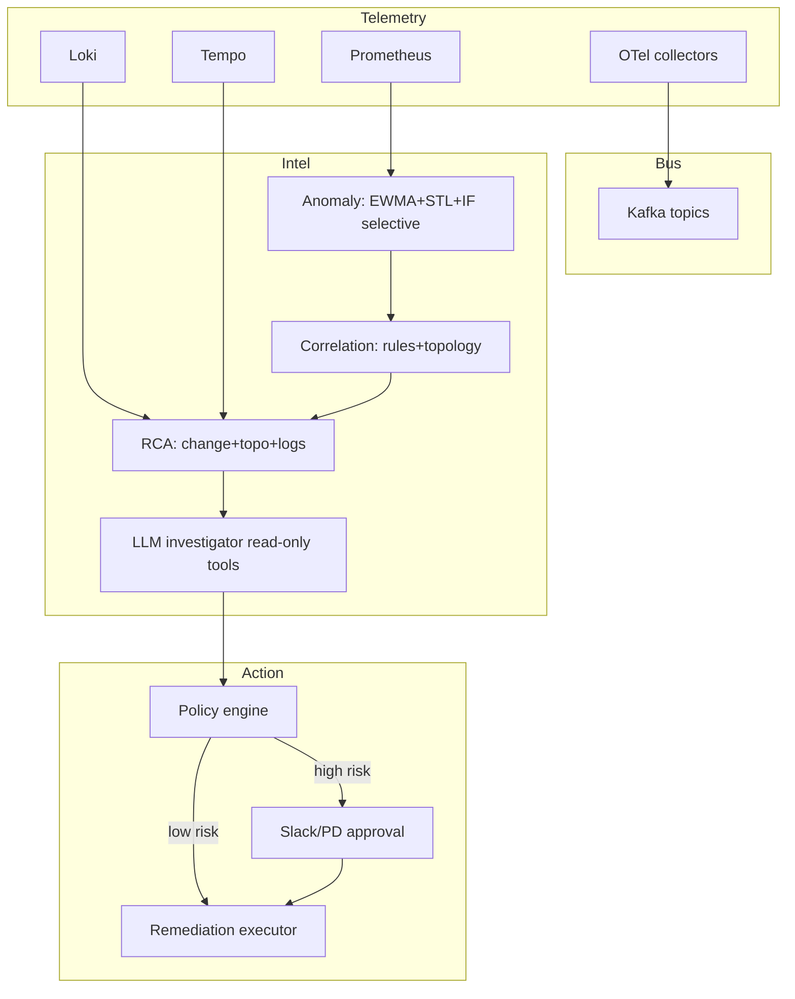

Chi tiết component bám [00](../00-introduction.vi.md) pipeline và các chapter 07–12; ở đây chỉ nhấn **policy và ownership**.

### 11.4 Phased delivery

#### Phase A — Days 0–30: “Google lite + signal hygiene”

1. Định nghĩa 6 user journeys (login, top-up, pay, transfer, KYC submit, statement).
2. SLI/SLO + multi-window burn alerts.
3. Service catalog tối thiểu (owner, tier, dependencies).
4. Cắt 30% alert không action được.
5. Postmortem 1-pager bắt buộc cho P1/P2.

**Exit criteria:** pages/week giảm rõ; mỗi critical service có owner; burn rate dashboards dùng trong standup.

#### Phase B — Days 31–60: “Correlation + RCA assist”

1. Correlation theo: same root deployment, same dependency, windowed fan-out.
2. Change feed từ CI/CD + Terraform applies vào evidence.
3. LLM summary incident (read-only tools: PromQL, LogQL, TraceQL).
4. Shadow anomaly ML trên 3 services seasonal.

**Exit criteria:** median alerts-per-incident giảm; MTTD cải thiện; IC dùng ticket AIOps làm primary view cho SEV-2+.

#### Phase C — Days 61–90: “AWS safeguards + Netflix drills”

1. Remediation allowlist: restart pod, scale +1 safe range, rollback last deploy (tier-2/3).
2. **Cấm auto** trên ledger primary failover, IAM, network ACL, payment switch.
3. Dual-control cho mọi action “tier-1 money path”.
4. Game day: kill canary pods + inject latency dependency sandbox.
5. Remediation circuit breaker + audit log immutable (S3 WORM / equivalent).

**Exit criteria:** ≥1 class auto-remediate thành công có metric; 1 game day report; dual-control path diễn tập.

### 11.5 Decision log mẫu (tránh cargo cult)

| Đề xuất | Quyết định | Lý do |
|---------|------------|-------|
| GNN RCA | Hoãn | Topology data chưa đủ sạch |
| Chaos full prod peak | Từ chối | Chưa abort automation đủ |
| Auto-remediate all restarts | Chỉ non-tier-1 | Regulator + blast radius |
| Mua full AIOps suite | Thin build + vendor metrics | Cần model trên data riêng |
| Feature store | Git contracts | Chỉ 2 models |

### 11.6 Risks riêng fintech

1. **False auto-rollback** khi traffic campaign làm SLI trông như regression.
2. **Log redaction** trước LLM.
3. **Split-brain remediation** (bot và người cùng scale).
4. **Alert trên fraud systems** — anomaly “đúng” có thể là attack; cần security runbook song song, không auto-suppress.

> [!TIP]
> **Success metric không chỉ MTTR**
> Theo dõi: % incidents có change evidence đính kèm, % actions có audit complete, time-to-IC-assignment, và **số lần auto-remediation bị circuit-break**. Circuit-break không phải thất bại — là safety system đang sống.

---

## 12. Checklist Production Review

Dùng checklist này khi review AIOps/SRE program dưới “ánh sáng” Big Tech principles. Chấm: ✅ Done / 🟡 Partial / ❌ Missing.

### 12.1 Measurement & prioritization (Google lens)

- [ ] User-facing SLIs tồn tại cho journeys quan trọng
- [ ] SLO có owner và review định kỳ (không chỉ copy 99.9)
- [ ] Error budget / burn rate ảnh hưởng deploy policy
- [ ] Alert gắn với symptom user, không chỉ cause infra
- [ ] Multi-window burn được dùng (tránh flap)

### 12.2 Detection quality (Uber + ch.07)

- [ ] Baseline/seasonality được model cho traffic có chu kỳ
- [ ] Train/serve feature semantics documented
- [ ] Shadow mode trước promote detector
- [ ] Precision/recall review trên postmortem set
- [ ] Meta-alerts: detector stale, feature null rate

### 12.3 Correlation & RCA (Google/Meta + ch.08–09)

- [ ] Service topology từ runtime + catalog
- [ ] Change feed (deploy, config, feature flag) trong evidence
- [ ] DNS / mesh / dependency signals first-class
- [ ] Confidence scores; tránh “single root cause” giả khi data mỏng
- [ ] Historical case memory cập nhật sau postmortem

### 12.4 Incident process (IMAG lens)

- [ ] Role IC rõ cho SEV-1
- [ ] Comms channel tách semi-technical
- [ ] Timeline logging (scribe hoặc bot)
- [ ] Handoff schema chuẩn giữa bot và human
- [ ] Blameless postmortem với action items có deadline

### 12.5 Remediation safety (AWS lens + ch.11)

- [ ] Allowlist actions
- [ ] Blast radius caps
- [ ] Rate limits / anti thundering herd
- [ ] Circuit breaker on remediation success rate
- [ ] Dual-control high-risk
- [ ] Dry-run support
- [ ] Immutable audit logs out-of-band
- [ ] Global kill switch auto-remediation

### 12.6 Resilience verification (Netflix lens + ch.12)

- [ ] Steady-state metrics defined pre-chaos
- [ ] Game days scheduled
- [ ] Abort criteria automated
- [ ] PDB / capacity headroom trước pod chaos
- [ ] Dependency timeout/retry budgets reviewed
- [ ] AIOps platform tự chaos/DR tested

### 12.7 Lockout & recovery (Meta lens)

- [ ] Break-glass accounts monitored
- [ ] OOB admin path documented & tested
- [ ] Progressive rollout cho network/IAM/DNS changes
- [ ] Recovery docs available khi IdP/VPN down
- [ ] Status communications không phụ thuộc prod cluster

### 12.8 Platform & ownership (Microsoft/Spotify/LinkedIn lens)

- [ ] Service owner metadata bắt buộc
- [ ] Golden path telemetry template
- [ ] Kafka/pipeline SLOs (lag, loss)
- [ ] Quota / multi-tenant fair use nếu shared platform
- [ ] Self-service docs; platform không phải ticket black hole

### 12.9 Scoring gợi ý

| Score ✅ | Ý nghĩa |
|---------|---------|
| < 40% | Đừng tăng automation; fix foundations |
| 40–70% | Thin AIOps OK; giữ human-in-loop chặt |
| > 70% | Có thể mở rộng auto classes có đo lường |

---

## 13. Improvement Roadmap 90 ngày

Roadmap generic cho org đã có observability cơ bản (nếu chưa, làm chapter 01–06 trước).

### 13.1 Ngày 0–30 — Foundations & Google core

| Tuần | Focus | Deliverable |
|------|-------|-------------|
| 1 | SLI inventory | Danh sách journeys + SLI draft |
| 2 | SLO + burn | Dashboards + paging policy |
| 3 | Alert hygiene | Giảm noise; ownership labels |
| 4 | Incident basics | IC checklist + postmortem template |

**Artifacts:** error budget policy v0.1; service catalog v0.1; “no SLO no page” rule cho alerts mới.

### 13.2 Ngày 31–60 — Understand path (correlation/RCA/agent assist)

| Tuần | Focus | Deliverable |
|------|-------|-------------|
| 5 | Correlation v1 | Fan-out grouping + deploy correlation |
| 6 | Change evidence | CI/CD → Kafka/event bus |
| 7 | RCA pack | Topology query + log/trace evidence bundle |
| 8 | LLM assist | Read-only investigation agent + audit |

**Artifacts:** incident ticket schema thống nhất; eval set 20 historical incidents.

### 13.3 Ngày 61–90 — Act safely & verify (AWS + Netflix)

| Tuần | Focus | Deliverable |
|------|-------|-------------|
| 9 | Remediation policy | Allowlist + caps + kill switch |
| 10 | First auto class | 1–2 actions in prod with metrics |
| 11 | Game day | Report + gap list |
| 12 | Review | Checklist §12 score + next quarter plan |

**Artifacts:** remediation COE cho mọi auto action fail; chaos abort runbook; board-level reliability summary.

### 13.4 Parallel tracks (không bỏ quên)

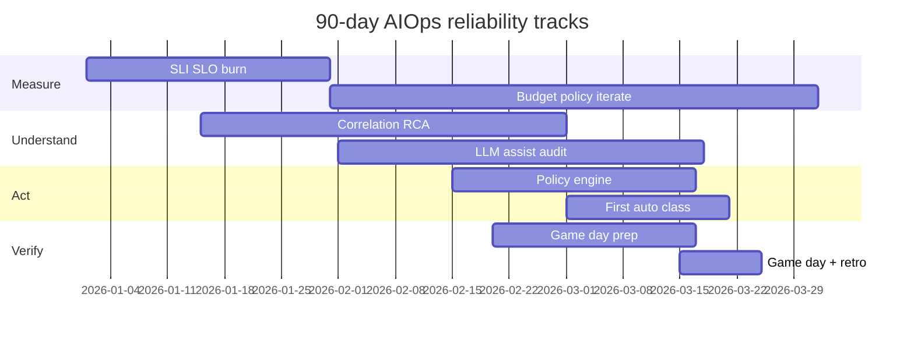

### 13.5 KPI gợi ý (chọn ít, đo thật)

| KPI | Baseline capture | Target 90d (example) |
|-----|------------------|----------------------|
| Pages / on-call / week | đo 2 tuần | −40% |
| % pages auto-resolved noise | — | documented suppressions |
| MTTA SEV-1 | median | −30% |
| MTTR SEV-1 | median | −40% |
| % incidents with change evidence | % | > 70% |
| Auto-remediation success | n/a | > 90% on allowlist |
| Postmortem actions overdue | count | → 0 critical |

---

## 14. Câu hỏi Socratic / bài tập tư duy

### 14.1 Câu hỏi Socratic

1. Nếu error budget luôn dư, bạn đang đo sai SLI hay đang under-deliver feature risk một cách lãng phí?
2. Chaos experiment “thành công vì không ai notice” — đó là resilience hay là observability mù?
3. Auto-remediation restart pod fix symptom 10 lần/tuần: bạn đang giảm MTTR hay đang **mask** capacity bug?
4. Topology graph nói service A phụ thuộc B, nhưng runtime trace không thấy gọi B trong 30 ngày — truth ở đâu?
5. Khi DNS fail, tại sao 200 alerts “đúng” vẫn là failure của hệ thống alerting?
6. LLM đưa root cause đúng 3 lần rồi sai 1 lần với giọng tự tin — metric nào bạn optimize: helpfulness hay calibrated confidence?
7. Break-glass account không ai test 18 tháng: control thật hay security theatre?
8. Org 12 người copy IMAG 6 roles cho mọi incident — ceremony đang giúp hay đang ăn MTTA?
9. Train/serve skew làm model kém; bạn fix model architecture trước hay fix data contract trước — vì sao?
10. Recovery automation phụ thuộc API của region đang down — bạn phát hiện điều đó lúc design hay lúc SEV?

### 14.2 Bài tập 1 — Extract → Map → Adapt

Chọn **một** public postmortem (S3 2017 summary, Meta 2021 analyses, hoặc một COE cloud public bất kỳ). Viết:

| Field | Your answer |
|-------|-------------|
| Principle (1–2 câu) | |
| Mechanism of failure | |
| Constraints khác org bạn | |
| Adapt 10% (1 sprint) | |
| Adapt 50% (1 quý) | |
| Non-goals | |
| Risk nếu copy 100% | |

### 14.3 Bài tập 2 — Error budget negotiation roleplay

Chia 2 nhóm: Product vs SRE. Cho trước:

- SLO 99.9%, 30-day window
- Burn 50% budget sau 1 tuần vì incident + deploy hotfixes
- Launch marketing cố định ngày D-10

Yêu cầu output: written policy exception **hoặc** freeze + scope cut. Cấm giải pháp “cố gắng thêm”.

### 14.4 Bài tập 3 — Remediation threat model

Vẽ data flow remediation bot. Đánh dấu:

- Privileges
- Single points of wrong action
- Dependencies on failing subsystems
- Abuse cases (stolen Slack token approve)
- Detection cho “bot gone wrong”

So với safeguards mục 4.4: gap list.

### 14.5 Bài tập 4 — Chaos readiness scorecard

Chấm 0–2 mỗi hàng (0 = missing, 2 = proven in last 90 days):

| Item | Score |
|------|-------|
| Steady-state SLI dashboard | |
| Abort automation | |
| PDB / redundancy | |
| Observability on failure path | |
| Owner + TTL for experiment | |
| Comms plan | |
| Post-experiment learning captured | |

Tổng < 8: cấm prod chaos. 8–11: staging + limited canary. ≥ 12: limited prod OK.

### 14.6 Bài tập 5 — AIOps for platform itself

Thiết kế 5 SLI cho **chính** AIOps pipeline (gợi ý: ingest lag, detector freshness, correlation precision proxy, remediation success, audit completeness). Viết 3 failure modes biến AIOps thành hazard (gợi ý mục 4–5).

### 14.7 Bài tập 6 — Fintech dual-control design

Với case study mục 11, liệt kê 10 remediation actions. Phân loại Auto / Approve-1 / Dual-control / Forbidden. Giải thích 1 action ở ranh giới (vì sao tranh cãi).

---

## Phụ lục A — Glossary nhanh (Big Tech → handbook)

| Thuật ngữ | Nghĩa thực dụng | Chapter |
|-----------|-----------------|---------|
| Error budget | Phần reliability “được đốt” | 01, 13 |
| IMAG / IC | Cấu trúc chỉ huy incident | 13, 10 |
| Chaos engineering | Thí nghiệm failure có kiểm soát | 12, 13 |
| COE | Post-incident mechanism design | 13, 11 |
| Break-glass | Truy cập khẩn cấp có audit | 12, 13 |
| Train/serve skew | Lệch feature offline/online | 07, 13 |
| Blast radius | Phạm vi thiệt hại tối đa của action | 11 |
| Golden path | Đường mặc định an toàn cho team | 01, 13 |
| Dual-control | Hai bên xác nhận high-risk | 11, 13 |
| Steady state | Hành vi bình thường đo được | 07, 12 |

---

## Phụ lục B — “Principle cards” in nhanh

### Card 1 — Google

> Reliability là tài nguyên thương lượng được bằng số. Automation trợ lý điều tra; con người chịu trách nhiệm chiến lược khi mơ hồ.

### Card 2 — Netflix

> Nếu chưa inject failure, bạn chỉ *hy vọng* resilient. Observability và abort là điều kiện tiên quyết của hy vọng đó.

### Card 3 — AWS

> Công cụ ops và automation recovery là hazard. Giới hạn sức mạnh, tách dependency recovery, biến bài học thành mechanism.

### Card 4 — Meta

> Control plane có thể tự khóa. Gradual change + OOB access không phải paranoid — là bài học đã trả bằng outage toàn cầu.

### Card 5 — Uber

> ML platform wins by contracts, evaluation, and shared pipelines — không by thuật toán lạ trong notebook.

---

## Phụ lục C — Liên kết chéo handbook (map học)

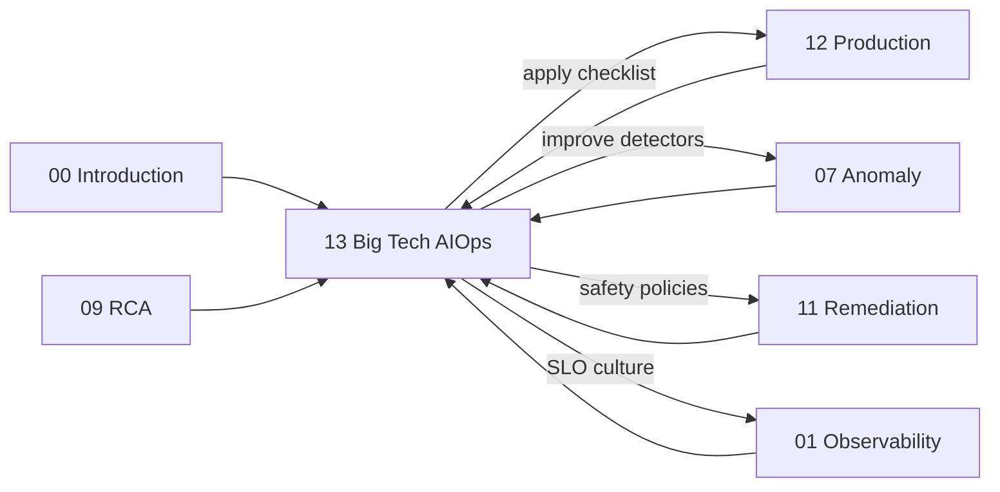

| Khi bạn cần… | Đọc |
|--------------|-----|
| Định nghĩa AIOps & maturity | [00 — Introduction](../00-introduction.vi.md) |
| SLI/SLO/telemetry | [01 — Observability](../01-observability/README.vi.md) |
| Thuật toán detection | [07 — Anomaly Detection](../07-anomaly-detection/README.vi.md) |
| Gom nhiễu | [08 — Alert Correlation](../08-alert-correlation/README.vi.md) |
| Chẩn đoán | [09 — Root Cause Analysis](../09-root-cause-analysis/README.vi.md) |
| Agent điều tra | [10 — LLM Agent](../10-llm-agent/README.vi.md) |
| Hành động an toàn | [11 — Remediation](../11-remediation/README.vi.md) |
| Vận hành nền tảng | [12 — Production](../12-production/README.vi.md) |

---

## Phụ lục D — Common mistakes khi “học Big Tech” (checklist âm)

1. **Tool-first**: mua platform trước khi có SLO và ownership.
2. **Process-first theatre**: template postmortem 15 mục không ai đọc.
3. **ML-first**: model trước change feed và alert hygiene.
4. **Autonomy-first**: closed-loop tuần 2.
5. **Chaos-first**: inject failure trước kill switch.
6. **Org-chart-first**: lập platform team 12 người khi mới 20 eng total.
7. **Number-first**: copy 99.99% / multi-region / five 9s như vanity.
8. **Vendor-story-first**: tin slide “AI root cause” không có eval set nội bộ.
9. **Ignore meta-observability**: AIOps bus lag im lặng.
10. **Ignore incentives**: blameless trên wiki, blame trên performance review.

> [!NOTE]
> **Ý TƯỞNG**
> Big Tech case studies là **oracles về class of failure**, không phải **install guides**. Handbook này cố ý đặt chapter 13 *sau* khi bạn đã thấy pipeline 00→12: để bạn import principle vào hệ đã có xương sống, thay vì treo poster SRE lên org chưa có telemetry.

---

## Phụ lục E — Mẫu error budget policy v0.1 (org vừa)

```text
Mục đích: thương lượng velocity vs reliability bằng số liệu chung.

1. SLI chính: success rate API journey thanh toán (exclude client 4xx abuse).
2. SLO: 99.9% / 28 ngày lăn.
3. Budget: 0.1% ≈ 40.3 phút equivalent (hoặc request-based accounting).
4. Multi-window burn:
   - Fast burn: page on-call
   - Slow burn: ticket reliability trong 2 ngày làm việc
5. Khi remaining budget < 25%:
   - Deploy tier-1 cần thêm approver reliability
   - Dừng feature flag experiments rủi ro cao
6. Khi budget exhausted:
   - Freeze feature deploy tier-1 trừ security/hotfix reliability
   - SEV-style postmortem trong 5 ngày làm việc
7. Exception:
   - Chỉ CTO + Head of Eng, time-boxed ≤ 72h, ghi lý do public nội bộ
8. Review SLO: mỗi quý với product.
```

Không copy số liệu; copy **cấu trúc negotiation**.

---

## Phụ lục F — Mẫu remediation policy snippet (AWS-inspired)

```text
Global kill switch: REMEDIATION_MODE=off|shadow|on

Classes:
  A (auto): restart pod non-tier-1; max 2 pods / 10m / service
  B (single approve): scale replicas within [min, max] catalog
  C (dual-control): rollback deploy tier-1; traffic shift
  D (forbidden auto): DNS, IAM, DB primary failover, ledger re contiguity jobs

Circuit breaker:
  if action_fail_rate > 20% in 30m → force shadow mode

Audit:
  every action → immutable log: who/what/why/evidence/ticket/prev_state
```

Liên hệ implement chi tiết: [11 — Remediation](../11-remediation/README.vi.md).

---

## Phụ lục G — Game day script skeleton (Netflix-inspired)

1. **Hypothesis:** Khi mất 1 canary pod của BFF, success rate journey login vẫn ≥ SLO burn chậm.
2. **Steady state:** dashboard X, window 30m baseline.
3. **Inject:** delete 1 pod labeled canary; TTL 20m.
4. **Abort if:** burn fast alert hoặc error rate > 2× baseline 5m.
5. **Observe:** traces dependency, saturation, retry metrics.
6. **Stop & notes:** gaps (missing PDB? retry storm?).
7. **Follow-ups:** ticket reliability, update playbook, optional detector tuning.

---

## Phụ lục H — Reading list công khai (điểm vào)

Tài liệu nền (đọc principle, không thuộc lòng marketing):

1. Google SRE Book & SRE Workbook (SLI/SLO/error budget, incident management).
2. Principles of Chaos Engineering (community / Netflix lineage).
3. AWS Post-Event Summaries (S3 2017; các regional impairment analyses công khai về automation & DNS themes).
4. Meta engineering communications quanh Oct 2021 outage (control plane / access lessons).
5. Uber Engineering blog: Michelangelo ML platform.
6. Kafka / stream ecosystem talks từ LinkedIn engineering (platform contracts).
7. Azure / Microsoft public guidance on service ownership & safe deployment (pattern level).

> [!WARNING]
> **Nguồn thứ cấp**
> Blog “retell” outage trên internet đôi khi sai chi tiết. Ưu tiên primary public summary từ chính company. Khi không chắc fact, giữ ở mức **class of failure**, đừng khẳng định số phút hay quote nội bộ không kiểm chứng.

---

## Tóm tắt điều hành (Executive takeaways)

1. **Học principle, map constraint, adapt 10% trước 100%.**
2. **Google** dạy đo lường & đàm phán reliability; agentic AI là trợ lý có audit, không phải IC.
3. **Netflix** dạy scientific resilience; observability + abort trước chaos.
4. **AWS** dạy operational tools/automation là hazard; recovery path độc lập; COE → mechanism.
5. **Meta** dạy lockout class: gradual config, break-glass, OOB.
6. **Uber** dạy ML platform discipline cho detectors/RCA models.
7. **LinkedIn / Microsoft / Spotify** dạy contracts, ownership, golden paths.
8. **Quy mô 10 / 100 / 1000** chọn capability khác nhau; headcount không biện minh cho complexity sớm.
9. **Fintech 50 eng** có thể thắng lớn bằng thin AIOps + dual-control, không cần clone org chart Big Tech.
10. **Checklist §12 + roadmap 90 ngày** biến chapter này từ cảm hứng thành chương trình làm việc.

---

## Kết

Chapter 13 khép lại vòng học: từ pipeline kỹ thuật (00→12) sang **trí tuệ tập thể đã trả học phí công khai** của các org lớn. AIOps giỏi không phải khi bot “trông thông minh”, mà khi:

- tín hiệu gắn user value,
- chẩn đoán gắn change & topology,
- hành động gắn safety mechanisms,
- học gắn postmortem → platform improvement,
- và con người vẫn chỉ huy được khi automation sai.

Hãy mang checklist §12 vào [12 — Production](../12-production/README.vi.md), mang train/serve discipline vào [07](../07-anomaly-detection/README.vi.md), mang dual-control vào [11](../11-remediation/README.vi.md), mang SLO culture vào [01](../01-observability/README.vi.md). Big Tech không cần bạn giống họ — họ cần (và bạn cần) hệ thống của bạn **hiểu giới hạn của chính nó**.

---

*Chapter 13 — AIOps & SRE tại các tập đoàn lớn · AIOps Engineering Handbook (VI) · Public knowledge synthesis · Không thay thế primary sources của từng công ty.*
