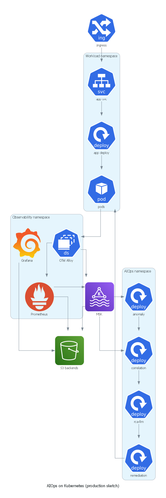
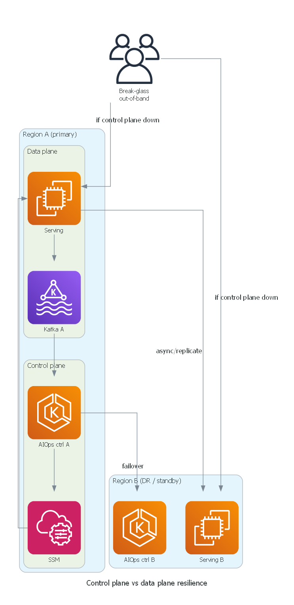
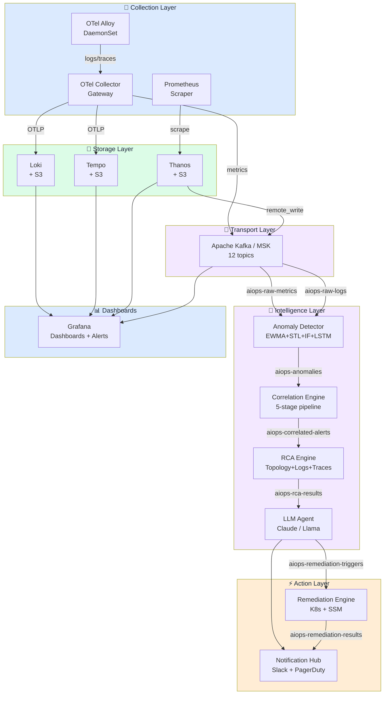

# Chapter 13 — Production Operations

> **Chương vận hành production cho chính nền tảng AIOps: chaos engineering, disaster recovery, cost governance, security hardening, performance benchmarking, và runbooks giữ hệ thống khỏe mạnh. Bản thân nền tảng giám sát production bắt buộc phải đạt chuẩn production. Sau chương này, hãy đọc tiếp các chương case study: [13 — Big Tech](../14-bigtech-aiops/README.vi.md), [14 — E-commerce & Banking](../15-ecommerce-banking/README.vi.md), [15 — Famous Incidents](../16-famous-incidents/README.vi.md).**

---

## Prerequisites

Toàn bộ các chương trước đó. Đây là chương tổng hợp các vấn đề vận hành thực tế.

## Related Documents

- [17 — Topology & Change](../17-topology-change/README.vi.md) — service graph + change/deploy bus

- [07 — Anomaly Detection](../08-anomaly-detection/README.vi.md) — precision-at-page, drift ops
- [08 — Alert Correlation](../09-alert-correlation/README.vi.md) — storm drills, topology health
- [09 — Root Cause Analysis](../10-root-cause-analysis/README.vi.md) — accuracy feedback, time budget
- [10 — LLM Agent](../11-llm-agent/README.vi.md) — cost runaway LLM, human override
- [11 — Remediation](../12-remediation/README.vi.md) — safety gates, blast radius
- [13 — Big Tech AIOps](../14-bigtech-aiops/README.vi.md) — operating models & maturity at scale
- [14 — E-commerce & Banking](../15-ecommerce-banking/README.vi.md) — cost/compliance constraints by industry
- [15 — Famous Incidents](../16-famous-incidents/README.vi.md) — game day scenarios từ outage công khai

## Next Reading

Sau chương này, hãy chuyển sang [13 — Big Tech AIOps](../14-bigtech-aiops/README.vi.md) để học pattern từ Google/Netflix/AWS/Meta/Uber, rồi [14 — E-commerce & Banking](../15-ecommerce-banking/README.vi.md) và [15 — Famous Incidents](../16-famous-incidents/README.vi.md).

---

## Table of Contents

1. [Platform Architecture Summary](#1-platform-architecture-summary)
2. [High Availability Design](#2-high-availability-design)
3. [Disaster Recovery](#3-disaster-recovery)
4. [Chaos Engineering for AIOps](#4-chaos-engineering-for-aiops)
5. [Performance Benchmarks](#5-performance-benchmarks)
6. [Cost Governance](#6-cost-governance)
7. [Security Hardening](#7-security-hardening)
8. [Observability of the Observability Platform](#8-observability-of-the-observability-platform)
9. [Runbook: Platform Recovery](#9-runbook-platform-recovery)
10. [Capacity Planning](#10-capacity-planning)
11. [Upgrade and Maintenance](#11-upgrade-and-maintenance)
12. [Team Operations Model](#12-team-operations-model)
13. [Maturity Progression Roadmap](#13-maturity-progression-roadmap)
14. [Total Cost of Ownership](#14-total-cost-of-ownership)
15. [Tư duy sâu: Dogfooding, DR control plane, Cost runaway, RACI, Game days, Scorecard](#15-tư-duy-sâu-dogfooding-dr-control-plane-cost-runaway-raci-game-days-scorecard)
16. [Final Production Review](#16-final-production-review)

---


## Cách đọc chapter này (concept-first)

> [!IMPORTANT]
> **Đọc concept trước — code để sau**
> Từ chapter 08 trở đi, handbook ưu tiên: **vấn đề → ý tưởng → input data → thuật toán/model → output → ưu/nhược → khi nào dùng**. Phần implementation nằm trong khối **See the code below** (bấm mới mở). Mục tiêu: bạn hiểu *tại sao và hoạt động ra sao trên telemetry AIOps*, không chỉ copy-paste.

| Bước đọc | Câu hỏi |
|----------|---------|
| 1. Vấn đề | Detector/engine này giải quyết pain gì (false positive, cascade, MTTR…)? |
| 2. Ý tưởng | Trực giác 2–3 câu, không công thức |
| 3. Data in | Metric/log/trace/event nào, window nào, feature nào? |
| 4. Thuật toán | Các bước tính toán / model flow |
| 5. Output | Schema sự kiện, score, rank, action proposal? |
| 6. Trade-off | Ưu / nhược / chi phí / giải thích được không? |
| 7. When | Dùng khi nào — và khi nào **đừng** dùng |

---

## 1. Platform Architecture Summary



*Poster: workload + observability + AIOps namespaces trên Kubernetes / MSK / S3.*



*Poster: tách data plane / control plane và break-glass out-of-band.*

> [!NOTE]
> **Ý TƯỞNG**
> Nền tảng AIOps **cũng là production system**. Nếu Kafka/AD/Correlation sập, bạn mù khi ứng dụng sập — double outage. Chuẩn vận hành cho AIOps không được thấp hơn chuẩn của payment-service.

> [!TIP]
> Dogfood trước khi evangelize: page platform team bằng **chính** anomaly/correlation stack của AIOps, không bằng "AIOps is down" script rời ngoài hệ thống.

Kiến trúc hoàn chỉnh của nền tảng AIOps, hiển thị toàn bộ các thành phần và luồng dữ liệu:



### Component Summary

| Thành phần | Công nghệ sử dụng | Cách thức triển khai | Chi phí hàng tháng |
|-----------|-----------|------------|-------------|
| Collection (agents) | Grafana Alloy DaemonSet | K8s DaemonSet | $180 |
| Collection (gateway) | OTel Collector | K8s Deployment ×3 | $180 |
| Log storage | Loki + S3 | K8s StatefulSet | ~$750 |
| Trace storage | Tempo + S3 | K8s StatefulSet | ~$1,620 |
| Metric storage | Prometheus + Thanos + S3 | K8s | ~$800 |
| Transport | AWS MSK | Managed service | $738 |
| Anomaly Detection | Python services + Redis | K8s Deployment | ~$1,824 |
| Alert Correlation | Python service + Redis | K8s Deployment | $775 |
| RCA Engine | Python service + Weaviate | K8s Deployment | $1,370 |
| LLM Agent | Python service + API | K8s Deployment | ~$1,000 |
| Remediation Engine | Python service | K8s Deployment | $127 |
| **Tổng cộng** | | | **~$9,364/tháng** |

---

## 2. High Availability Design

### HA Requirements

| Thành phần | Thời gian Uptime yêu cầu | Cơ chế đạt mục tiêu | Đánh giá |
|-----------|----------------|--------|---------|
| Collection agents | 99.9% | DaemonSet tự động restart | ✅ |
| Kafka | 99.95% | MSK Multi-AZ | ✅ |
| Loki | 99.9% | 3× ingester, lưu trữ S3 backend | ✅ |
| Prometheus | 99.9% | Cặp HA pair + Thanos | ✅ |
| Anomaly Detector | 99.5% | 3 replicas, thiết kế stateless | ✅ |
| RCA Engine | 99.5% | 2 replicas | ✅ |
| LLM Agent | 99% | 2 replicas + cơ chế model fallback | ✅ |
| Remediation Engine | 99.9% | 2 replicas + cơ chế leader election | ✅ |

### Multi-AZ Architecture

<details>
<summary><strong>See the code below — bấm để xem code (đọc concept trước)</strong></summary>

```yaml
# Toàn bộ thành phần có trạng thái (stateful) được phân bổ trên 3 AZs
topologySpreadConstraints:
  - maxSkew: 1
    topologyKey: topology.kubernetes.io/zone
    whenUnsatisfiable: DoNotSchedule
    labelSelector:
      matchLabels:
        app: loki-ingester   # Áp dụng cho từng thành phần stateful
```

</details>

### AIOps Platform SLO

<details>
<summary><strong>See the code below — bấm để xem code (đọc concept trước)</strong></summary>

```yaml
# Định nghĩa SLO cho chính bản thân nền tảng AIOps
slo:
  alert_to_incident_latency:
    target: "P95 < 10 phút"
    description: "Thời gian từ lúc cảnh báo thô xuất hiện đến lúc incident tương quan được tạo"
    
  investigation_latency:
    target: "P95 < 3 phút"
    description: "Thời gian từ lúc có incident đến lúc hoàn tất điều tra bằng LLM"
    
  rca_accuracy:
    target: "> 70%"
    description: "Tỷ lệ kết quả RCA được kỹ sư xác nhận là chính xác"
    
  false_positive_rate:
    target: "< 10%"
    description: "Tỷ lệ cảnh báo ảo (false positives)"
    
  auto_remediation_success:
    target: "> 80%"
    description: "Tỷ lệ các lệnh tự động khắc phục giải quyết thành công sự cố"
    
  platform_availability:
    target: "99.9%"
    description: "Độ sẵn sàng của các thành phần nền tảng AIOps"
```

</details>

---

## 3. Disaster Recovery

### DR Scenarios and Recovery Procedures

#### Kịch bản 1: Lỗi một Kafka Broker đơn lẻ

```
Tác động: Các partitions nằm trên broker lỗi tạm thời không thể truy cập
Xác định lỗi: Chỉ số kafka_server_replicamanager_underreplicatedpartitions > 0
Phản ứng của MSK: Tự động (MSK tự động thay thế broker lỗi trong vòng 10-15 phút)
Tác động tới Consumer: Lag tăng nhẹ trong thời gian broker được thay thế
Khôi phục: Tự động

Chỉ tiêu SLA: RTO = 15 phút (do MSK tự xử lý), RPO = 0 (dữ liệu được nhân bản)
```

#### Kịch bản 2: Lỗi Loki Ingester

```
Tác động: Logs tạm thời không được ghi nhận trên partition bị ảnh hưởng
Xác định lỗi: Tốc độ chỉ số loki_ingester_chunks_flushed_total giảm mạnh
Khôi phục:
  1. Kubernetes tự động restart pod bị lỗi
  2. WAL được replay lại khi restart để đảm bảo tính toàn vẹn dữ liệu (data durability)
  3. Các ingesters tự động phân bổ lại tải thông qua ring
  
Chỉ tiêu SLA: RTO = 2 phút (thời gian pod khởi động lại), RPO = 0 (nhờ WAL replay)
```

#### Kịch bản 3: Lỗi Prometheus hoàn toàn

```
Tác động: Không thể truy vấn metrics, không thể kích hoạt cảnh báo trong thời gian lỗi
Xác định lỗi: up{job="prometheus"} == 0 (phát hiện bởi instance Prometheus dự phòng)
Khôi phục:
  1. Prometheus tự động restart (pod restart)
  2. Thanos đảm nhận truy vấn dữ liệu lịch sử dài hạn từ S3
  3. Alertmanager tiếp tục gửi các cảnh báo đang cache trong vòng 5 phút
  
Chỉ tiêu SLA: RTO = 5 phút, RPO = chu kỳ cào dữ liệu scrape interval (15s)
```

#### Kịch bản 4: Toàn bộ lớp trí tuệ nhân tạo AIOps Intelligence Layer bị sập

```
Tác động: Mất tính năng phát hiện bất thường, không phân nhóm tương quan hay điều tra bằng LLM
          (các cảnh báo thô vẫn được kích hoạt bình thường qua Prometheus/Alertmanager)
Xác định lỗi: Cảnh báo "AIOps Platform Down" kích hoạt trên hệ thống giám sát vòng ngoài (monitoring-of-monitoring)
Khôi phục:
  1. Triage: Xác định thành phần nào bị sập (Kafka? AD? CE?)
  2. Restart các pods lỗi thông qua kubectl
  3. Replay lại các sự kiện từ Kafka (sử dụng earliest offset để cào lại dữ liệu)
  4. Kỹ sư chuyển sang xử lý các incidents thủ công trong thời gian khắc phục hệ thống
  
Chỉ tiêu SLA: RTO = 30 phút (thời gian chẩn đoán + restart), RPO = khả năng replay dựa trên cấu hình retention của Kafka
```

### Backup Strategy

<details>
<summary><strong>See the code below — bấm để xem code (đọc concept trước)</strong></summary>

```yaml
backups:
  kafka_metadata:
    type: MSK continuous backup tự động
    frequency: liên tục
    retention: 7 ngày
    
  loki_s3:
    type: S3 versioning + nhân bản chéo regions (cross-region replication)
    target_region: us-west-2
    retention_lifecycle: 31 ngày tiêu chuẩn, 366 ngày lưu trữ glacier
    
  tempo_s3:
    type: S3 versioning + nhân bản chéo regions (cross-region replication)
    target_region: us-west-2
    retention_lifecycle: 14 ngày tiêu chuẩn, 90 ngày lưu trữ glacier
    
  thanos_s3:
    type: S3 versioning
    retention_lifecycle: 90 ngày tiêu chuẩn, 1 năm lưu trữ glacier
    
  weaviate_vector_store:
    type: snapshot hàng ngày lên S3
    frequency: 02:00 UTC hàng ngày
    retention: 30 ngày
    
  postgres_incidents:
    type: RDS automated backup
    frequency: liên tục (PITR)
    retention: 35 ngày
    
  grafana_dashboards:
    type: Quản lý dạng Git (grafana-as-code qua Terraform/Pulumi)
    frequency: cập nhật khi có thay đổi
    recovery: chạy lệnh terraform apply
```

</details>

---

## 4. Chaos Engineering for AIOps

Nền tảng AIOps bắt buộc phải có khả năng chống chịu lỗi tốt. Sử dụng chaos engineering để kiểm chứng:

### Chaos Test Suite

<details>
<summary><strong>See the code below — bấm để xem code (đọc concept trước)</strong></summary>

```yaml
# chaos-test-suite.yaml (sử dụng Chaos Monkey / LitmusChaos)
experiments:
  
  # Thử nghiệm 1: Shutdown một Kafka broker
  - name: kafka-broker-kill
    type: pod_kill
    target:
      label: app=kafka-broker
      namespace: kafka
      count: 1
    hypothesis: "Consumer lag tự động phục hồi trong vòng 15 phút"
    success_criteria:
      - metric: "kafka_consumer_group_lag_sum"
        threshold: 1000
        within_minutes: 15
    
  # Thử nghiệm 2: Shutdown pod phát hiện bất thường
  - name: anomaly-detector-pod-kill
    type: pod_kill
    target:
      label: app=anomaly-detector
      count: 1
    hypothesis: "Tiến trình phát hiện bất thường hoạt động trở lại trong vòng 2 phút"
    success_criteria:
      - metric: "up{job='anomaly-detector'}"
        value: 1
        within_minutes: 2
    
  # Thử nghiệm 3: Gây quá tải bộ nhớ Loki
  - name: loki-ingester-memory-stress
    type: memory_stress
    target:
      label: app=loki-ingester
      count: 1
    parameters:
      memory_percentage: 90
      duration: "5m"
    hypothesis: "Loki tiếp tục nhận logs bình thường, tốc độ đẩy chunk (chunk flushing) tăng"
    
  # Thử nghiệm 4: Chặn luồng cào dữ liệu Prometheus
  - name: block-prometheus-scrape
    type: network_partition
    target:
      label: app=order-service
    hypothesis: "Phát hiện mất mát metrics trong 5 phút, kích hoạt cảnh báo"
    success_criteria:
      - alert: "TargetDown"
        fires_within_minutes: 5
    
  # Thử nghiệm 5: Mất kết nối mạng hoàn toàn tới RCA engine
  - name: rca-engine-network-kill
    type: network_partition
    target:
      label: app=rca-engine
      interfaces: ["eth0"]
    hypothesis: "Kafka consumer lag tăng, các incidents được xếp hàng chờ, hệ thống tự phục hồi khi kết nối lại"
    
  # Thử nghiệm 6: Giả lập sự cố sập API của LLM ngoài
  - name: llm-api-outage
    type: http_fault
    target:
      service: anthropic-api-proxy
    fault: connection_refused
    duration: "10m"
    hypothesis: "LLM Agent tự động chuyển sang mô hình dự phòng GPT-4o-mini hoặc cung cấp báo cáo phân tích rút gọn"
```

</details>

### Running Chaos Tests

<details>
<summary><strong>See the code below — bấm để xem code (đọc concept trước)</strong></summary>

```bash
# Triển khai LitmusChaos
kubectl apply -f https://litmuschaos.github.io/litmus/litmus-operator-v3.0.0.yaml

# Khởi chạy một thử nghiệm chaos experiment
kubectl apply -f kafka-broker-kill-experiment.yaml

# Theo dõi kết quả
kubectl get chaosresult kafka-broker-kill -n kafka -o jsonpath='{.status.experimentStatus}'
```

</details>

---

## 5. Performance Benchmarks

### Latency Budget (End-to-End)

```
Cảnh báo kích hoạt (Prometheus đánh giá):        t = 0s
Alertmanager gửi thông tin tới Kafka:          t = 15s
Kafka chuyển tiếp dữ liệu tới consumers:        t = 16s
Phát hiện bất thường (dạng thống kê):           t = 17-20s
Phát hiện bất thường (dạng ML):                t = 20-60s
Correlation engine (cửa sổ trượt 5 phút):        t = 5 phút 15s
RCA thu thập bằng chứng song song:              t = 5 phút 50s
RCA phân tích tính toán:                       t = 5 phút 55s
LLM Agent điều tra (10 vòng lặp):              t = 7 phút 55s
Thông báo Slack gửi tới kỹ sư:                 t = 8 phút

Tổng cộng: Mất khoảng 8 phút từ lúc có cảnh báo thô đến lúc sinh báo cáo điều tra chi tiết
Mục tiêu đặt ra: < 10 phút ở mức P95
```

### Throughput Benchmarks

| Giai đoạn xử lý | Năng lực xử lý mục tiêu | Hiệu năng hiện tại (Quy mô vừa) | Điểm nghẽn phát sinh tại |
|-------|------------------|----------------------|--------------|
| OTel Collection | 100MB/s | 30MB/s | Băng thông mạng card NIC |
| Kafka ingest | 500MB/s | 50MB/s | Tốc độ ghi Disk IO của Broker |
| Loki ingest | 100MB/s | 20MB/s | Dung lượng RAM của Ingester |
| Anomaly detection | 50K metrics/giây | 10K metrics/giây | Năng lực GPU cho mô hình LSTM |
| Correlation | 10K alerts/phút | 1K alerts/phút | Năng lực xử lý của Redis |
| RCA | 100 incidents/phút | 10 incidents/phút | Tốc độ đáp ứng của Loki/Tempo API |
| LLM agent | 50 lượt điều tra/phút | 5 lượt điều tra/phút | Giới hạn hạn mức API rate limits |

### Benchmark Script

<details>
<summary><strong>See the code below — bấm để xem code (đọc concept trước)</strong></summary>

```python
import asyncio
import time
import httpx
from statistics import quantiles

async def benchmark_loki_ingest(
    loki_url: str,
    messages_per_second: int = 1000,
    duration_seconds: int = 60,
) -> dict:
    """
    Đo kiểm hiệu năng throughput ghi nhận logs của Loki.
    """
    async with httpx.AsyncClient() as client:
        latencies = []
        errors = 0
        start = time.time()
        message_count = 0
        
        while time.time() - start < duration_seconds:
            batch_start = time.time()
            
            # Gửi batch dữ liệu test
            payload = {
                "streams": [
                    {
                        "stream": {"service": "benchmark", "level": "INFO"},
                        "values": [
                            [str(int(time.time_ns())), f"Benchmark message {i}"]
                            for i in range(messages_per_second)
                        ],
                    }
                ]
            }
            
            req_start = time.time()
            try:
                response = await client.post(
                    f"{loki_url}/loki/api/v1/push",
                    json=payload,
                    timeout=5.0,
                )
                latencies.append((time.time() - req_start) * 1000)
                message_count += messages_per_second
            except Exception:
                errors += 1
            
            # Điều tiết tốc độ gửi tương ứng với mục tiêu đặt ra
            elapsed = time.time() - batch_start
            if elapsed < 1.0:
                await asyncio.sleep(1.0 - elapsed)
        
        return {
            "messages_per_second_target": messages_per_second,
            "total_messages": message_count,
            "errors": errors,
            "duration_seconds": time.time() - start,
            "p50_latency_ms": quantiles(latencies, n=2)[0] if latencies else 0,
            "p99_latency_ms": quantiles(latencies, n=100)[98] if latencies else 0,
            "error_rate": errors / max(1, len(latencies) + errors),
        }
```

</details>

---

## 6. Cost Governance

### Cost Breakdown by Layer

```
Tổng cộng: Khoảng ~$9,364/tháng cho hệ thống production AIOps quy mô vừa

Collection Layer (Cào dữ liệu):   $360   (3.8%)
Transport (Kafka/MSK):           $738   (7.9%)
Storage (Loki+Tempo+Prom):       $3,170 (33.9%)
Intelligence Layer (ML/LLM):     $3,969 (42.4%)
Action Layer (Khắc phục):        $127   (1.4%)
Phí vận hành nền tảng chung:      $1,000 (10.7%)

Các thành phần tốn chi phí nhất:
1. Intelligence Layer (phân tích ML): $3,969/tháng — phần lớn là chi phí GPU cho mô hình LSTM
2. Storage (lưu trữ): $3,170/tháng — chủ yếu là lưu dữ liệu traces của Tempo
3. Kafka/MSK: $738/tháng
```

### Cost Optimization Strategies

<details>
<summary><strong>See the code below — bấm để xem code (đọc concept trước)</strong></summary>

```python
COST_OPTIMIZATION_STRATEGIES = {
    "trace_sampling": {
        "current": "Cấu hình 10% tail sampling",
        "potential": "Giảm xuống 1% + giữ lại 100% trace lỗi",
        "savings": "Giảm chi phí Tempo S3 tới 9 lần: từ $1,500 xuống còn $170/tháng",
        "risk": "Lược bỏ bớt một lượng lớn trace khỏe mạnh làm mẫu đối sánh",
    },
    "log_retention": {
        "current": "Lưu trữ 31 ngày tiêu chuẩn trên Loki",
        "potential": "Giảm xuống 7 ngày tiêu chuẩn + đẩy dữ liệu cũ sang S3 Glacier",
        "savings": "Tiết kiệm khoảng $200/tháng",
        "risk": "Giới hạn thời gian phân tích logs lịch sử trực tiếp trên giao diện",
    },
    "lstm_inference": {
        "current": "Chạy mô hình trên GPU instances (g4dn.xlarge)",
        "potential": "Chuyển sang CPU-only inference (sử dụng ONNX runtime)",
        "savings": "Tiết kiệm $750/tháng (giảm 60% chi phí chạy GPU)",
        "risk": "Độ trễ xử lý (inference latency) tăng từ 10ms lên 100ms",
        "implementation": "Export mô hình LSTM sang định dạng ONNX",
    },
    "kafka_compression": {
        "current": "Sử dụng snappy",
        "potential": "Chuyển sang zstd",
        "savings": "Giảm 15-20% dung lượng lưu trữ → tiết kiệm khoảng ~$100/tháng",
        "risk": "CPU tăng nhẹ trên các dịch vụ producers khi nén dữ liệu",
    },
    "spot_instances": {
        "components": ["queriers", "ml_detectors", "llm_agent"],
        "savings": "Tiết kiệm 60% chi phí compute: khoảng ~$1,200/tháng",
        "risk": "Rủi ro bị thu hồi spot instances (được giảm thiểu nhờ cơ chế tự reschedule của k8s)",
    },
}
```

</details>

### Cost Cost Monitoring

<details>
<summary><strong>See the code below — bấm để xem code (đọc concept trước)</strong></summary>

```promql
# Ước lượng chi phí lưu trữ S3
sum(aws_s3_bucket_size_bytes{bucket=~"loki.*|tempo.*|thanos.*"}) * 0.023 / 1e9

# Chi phí chạy broker của AWS MSK
sum(aws_msk_broker_running_hours_total) * 0.202  # Tính theo đơn giá instance m5.large

# Chi phí gọi LLM API ngoài
sum(aiops_llm_tokens_used_total{model="claude-3-5-sonnet"}) * 0.003 / 1000000

# Chi phí chạy GPU instances
sum(aiops_gpu_instance_hours_total) * 0.526  # Tính theo đơn giá instance g4dn.xlarge
```

</details>

### FinOps Alerts

<details>
<summary><strong>See the code below — bấm để xem code (đọc concept trước)</strong></summary>

```yaml
- alert: AIOpsStorageCostExcessive
  expr: |
    sum(aws_s3_bucket_size_bytes{bucket=~"loki.*|tempo.*|thanos.*"}) > 100e12  # Cảnh báo khi vượt quá 100TB
  for: 24h
  labels:
    severity: warning
    team: platform-engineering
  annotations:
    summary: "Dung lượng lưu trữ AIOps vượt quá 100TB — cần rà soát lại chính sách retention"

- alert: LLMCostSpike
  expr: |
    increase(aiops_llm_cost_usd_total[1h]) > 100
  for: 0m
  labels:
    severity: warning
  annotations:
    summary: "Chi phí gọi LLM API vượt quá $100 trong vòng 1 giờ qua — nghi ngờ có vòng lặp điều tra lỗi"
```

</details>

---

## 7. Security Hardening

### Security Checklist

```markdown
## Mạng lưới (Network)
- [ ] Toàn bộ luồng dữ liệu truyền với Kafka bắt buộc mã hóa (TLS 1.3)
- [ ] Toàn bộ các kết nối dịch vụ nội bộ chạy qua mTLS (sử dụng Istio/Linkerd)
- [ ] Không public các dịch vụ ra ngoài internet ngoại trừ Grafana (truy cập qua xác thực OIDC)
- [ ] Thiết lập VPC endpoints cho các kết nối S3, Kafka (tránh đi qua internet công cộng)
- [ ] Cấu hình Kubernetes NetworkPolicy: Chặn toàn bộ mặc định, chỉ mở các port kết nối cần thiết

## Xác thực và Phân quyền (Authentication and Authorization)
- [ ] Bật chế độ đa thuê (multi-tenancy) trên Loki (bắt buộc truyền header X-Scope-OrgID)
- [ ] Xác thực Grafana SSO tích hợp qua OIDC (như Google/Okta)
- [ ] Phân quyền chi tiết các data source trên Grafana cho từng team tương ứng
- [ ] Bảo mật kết nối Kafka bằng SASL/SCRAM-SHA-512 + quản lý quyền ACLs
- [ ] Áp dụng chặt chẽ nguyên tắc quyền hạn tối thiểu RBAC trên Kubernetes cho từng service account
- [ ] Sử dụng AWS IRSA cho các pods cần kết nối tới AWS APIs (không sử dụng static AWS credentials)

## Quản lý thông tin bảo mật (Secrets)
- [ ] Toàn bộ keys/secrets phải được lưu trữ trong Kubernetes Secrets (tuyệt đối không để trong ConfigMaps)
- [ ] Mã hóa thông tin Secrets khi lưu trữ tĩnh (etcd encryption)
- [ ] Tích hợp Sealed Secrets hoặc sử dụng External Secrets Operator phục vụ GitOps
- [ ] Sử dụng AWS Secrets Manager quản lý các secrets động (RDS passwords, API keys)
- [ ] Cơ chế xoay vòng secret (secret rotation): Hàng quý đối với service accounts, hàng năm đối với CA

## Bảo vệ dữ liệu (Data)
- [ ] Kích hoạt cấu hình Block Public Access đối với tất cả S3 buckets
- [ ] Mã hóa dữ liệu trên S3 sử dụng SSE-KMS
- [ ] Cấu hình S3 Bucket policies chặn toàn bộ kết nối nằm ngoài VPC
- [ ] Mã hóa RDS cả khi lưu trữ tĩnh và trên đường truyền tải
- [ ] Mã hóa dữ liệu DynamoDB sử dụng CMK
- [ ] Không để lộ thông tin nhạy cảm của người dùng (PII) trong các Kafka topics (chạy lọc logs trước khi ghi nhận)

## Tuân thủ (Compliance)
- [ ] Nhật ký audit log của remediation engine được lưu trữ trên DynamoDB cấu hình append-only bất biến
- [ ] Bật Kubernetes audit log và đẩy trực tiếp về CloudWatch
- [ ] Bật AWS CloudTrail theo dõi toàn bộ các lượt gọi AWS API
- [ ] Lưu trữ tối thiểu 90 ngày đối với tất cả audit logs
- [ ] Áp dụng nghiêm ngặt các chính sách hủy dữ liệu cũ (data retention policy) trên các topics/buckets

## Bảo mật luồng LLM (LLM-Specific)
- [ ] Loại bỏ hoàn toàn thông tin PII trong các prompts gửi đi (lọc làm sạch log trước khi chèn vào prompt)
- [ ] Cơ chế xoay vòng LLM API key định kỳ hàng quý
- [ ] Ghi log chi tiết các lượt gọi LLM API (số tokens tiêu thụ, model sử dụng, timestamp)
- [ ] Ưu tiên các giải pháp tự host mô hình khi xử lý các dữ liệu nhạy cảm cao
- [ ] Phòng chống prompt injection: Làm sạch và lọc kỹ các tham số đầu vào truyền cho tool
```

### PII Scrubbing in Log Pipeline

<details>
<summary><strong>See the code below — bấm để xem code (đọc concept trước)</strong></summary>

```python
import re

class PIIScrubber:
    """
    Loại bỏ các thông tin nhạy cảm (PII) khỏi log trước khi index vào Loki hoặc gửi sang LLM.
    """
    PATTERNS = [
        (re.compile(r'\b[A-Za-z0-9._%+-]+@[A-Za-z0-9.-]+\.[A-Z|a-z]{2,}\b'),
         '[EMAIL]'),
        (re.compile(r'\b\d{4}[- ]?\d{4}[- ]?\d{4}[- ]?\d{4}\b'),
         '[CREDIT_CARD]'),
        (re.compile(r'\b\d{3}-\d{2}-\d{4}\b'),
         '[SSN]'),
        (re.compile(r'"password"\s*:\s*"[^"]*"'),
         '"password": "[REDACTED]"'),
        (re.compile(r'"token"\s*:\s*"[^"]*"'),
         '"token": "[REDACTED]"'),
        (re.compile(r'"api_key"\s*:\s*"[^"]*"'),
         '"api_key": "[REDACTED]"'),
        (re.compile(r'\b(?:\d{1,3}\.){3}\d{1,3}\b'),
         '[IP]'),
    ]
    
    def scrub(self, log_line: str) -> str:
        for pattern, replacement in self.PATTERNS:
            log_line = pattern.sub(replacement, log_line)
        return log_line
```

</details>

---

## 8. Observability of the Observability Platform

Bài toán giám sát vòng ngoài (meta-observability): Ai giám sát những người gác cổng?

### Dead Man's Switch Pattern

<details>
<summary><strong>See the code below — bấm để xem code (đọc concept trước)</strong></summary>

```yaml
# Mỗi thành phần trong pipeline định kỳ gửi đi một metric heartbeat
# Nếu heartbeat dừng lại, điều đó đồng nghĩa với việc pipeline đã bị gián đoạn

# Cấu hình ghi nhận trong từng component:
- record: aiops_component_heartbeat
  expr: 1   # Luôn trả về 1 nếu component đang chạy và rule được Prometheus đánh giá thành công

# Cảnh báo Dead Man's Switch chéo giữa các thành phần
- alert: AIOpsCollectionPipelineDead
  expr: |
    absent(rate(aiops_component_heartbeat{component="otel-collector"}[5m]))
  for: 5m
  labels:
    severity: critical
    route: pagerduty-platform-team
  annotations:
    summary: "Thiếu tín hiệu heartbeat từ OTel Collector — luồng telemetry pipeline bị gián đoạn"

- alert: AIOpsAnomalyDetectionDead
  expr: |
    absent(rate(aiops_anomaly_detection_events_processed_total[10m]))
  for: 10m
  labels:
    severity: critical

- alert: AIOpsKafkaPipelineBroken
  expr: |
    kafka_consumer_group_lag_sum{group=~"anomaly-detector-.*|correlation-.*|rca-.*"} > 100000
  for: 15m
  labels:
    severity: critical
```

</details>

### Platform Health Dashboard

Các bảng biểu (panels) quan trọng trên dashboard theo dõi sức khỏe hệ thống AIOps:

<details>
<summary><strong>See the code below — bấm để xem code (đọc concept trước)</strong></summary>

```yaml
dashboard_panels:
  - title: "End-to-End Pipeline Latency"
    description: "Thời gian P95 tính từ lúc có cảnh báo đến lúc hoàn tất điều tra lỗi"
    query: "histogram_quantile(0.95, rate(aiops_e2e_latency_seconds_bucket[5m]))"
    
  - title: "Kafka Consumer Lag (all groups)"
    description: "Tổng lượng lag tích tụ trên tất cả các consumers của AIOps"
    query: "sum by (group) (kafka_consumer_group_lag_sum)"
    alert_threshold: 10000
    
  - title: "Anomaly Detection False Positive Rate"
    description: "Tỷ lệ các cảnh báo bất thường bị đánh giá là cảnh báo ảo"
    query: |
      rate(aiops_anomaly_feedback_total{outcome="false_positive"}[24h])
      / rate(aiops_anomaly_feedback_total[24h])
    alert_threshold: 0.20
    
  - title: "LLM Investigation Accuracy"
    description: "Tỷ lệ các báo cáo điều tra của LLM được đánh giá là chính xác"
    query: |
      rate(aiops_llm_feedback_total{result="correct"}[7d])
      / rate(aiops_llm_feedback_total[7d])
    alert_threshold: 0.70   # Cảnh báo nếu độ chính xác giảm xuống dưới 70%
    
  - title: "MTTR Trend"
    description: "Thời gian khắc phục sự cố trung bình trong vòng 30 ngày qua"
    query: "avg_over_time(aiops_incident_resolution_time_seconds[30d])"
    
  - title: "Auto-Remediation Success Rate"
    description: "Tỷ lệ các lệnh tự sửa tự động giải quyết thành công sự cố"
    query: |
      rate(aiops_remediation_executions_total{status="verified_success"}[7d])
      / rate(aiops_remediation_executions_total[7d])
```

</details>

---

## 9. Runbook: Platform Recovery

### AIOps Platform Down — Full Recovery Runbook

```markdown
## Runbook: Khôi phục toàn phần nền tảng AIOps

**Tín hiệu cảnh báo**: Nhiều thành phần AIOps báo lỗi không hoạt động, hoặc Kafka consumer lag vượt quá 100K

**Tác động**: Mất các tính năng phát hiện bất thường, gom nhóm tương quan, hoặc điều tra tự động bằng LLM.
Kỹ sư trực bắt buộc phải chuyển sang theo dõi và xử lý các sự cố thủ công.

**Đầu mối hỗ trợ**: Đội ngũ Platform Engineering trực on-call (@platform-oncall trên Slack)

### Bước 1: Khảo sát nhanh trạng thái hệ thống (5 phút)

```bash
# Kiểm tra các pods AIOps đang bị lỗi không ở trạng thái Running
kubectl get pods -n aiops --field-selector=status.phase!=Running

# Kiểm tra tình trạng consumer lag trên Kafka
kafka-consumer-groups.sh --bootstrap-server kafka-1:9092 \
  --describe --group anomaly-detector-group | head -20

# Kiểm tra kết nối tới S3 (thành phần phụ thuộc quan trọng nhất)
aws s3 ls s3://loki-chunks-prod/ --max-items 1
aws s3 ls s3://tempo-traces-prod/ --max-items 1

# Kiểm tra sức khỏe của AWS MSK cluster
aws kafka describe-cluster --cluster-arn $MSK_CLUSTER_ARN \
  | jq '.ClusterInfo.State'
```

### Bước 2: Khắc phục các lỗi liên quan tới Kafka trước (Kafka là xương sống hệ thống)

<details>
<summary><strong>See the code below — bấm để xem code (đọc concept trước)</strong></summary>

```bash
# Nếu MSK khỏe mạnh nhưng các consumers không thể kết nối tới
# Kiểm tra lại cấu hình Security Group
aws ec2 describe-security-groups --group-ids $KAFKA_SG_ID | jq '.SecurityGroups[].IpPermissions'

# Khởi động lại tuần tự các consumers của AIOps
kubectl rollout restart deployment/anomaly-detector -n aiops
kubectl rollout restart deployment/correlation-engine -n aiops
kubectl rollout restart deployment/rca-engine -n aiops
kubectl rollout restart deployment/llm-agent -n aiops

# Theo dõi quá trình rollout
kubectl rollout status deployment/anomaly-detector -n aiops --timeout=5m
```

</details>

### Bước 3: Xử lý tình trạng Consumer Lag quá lớn

<details>
<summary><strong>See the code below — bấm để xem code (đọc concept trước)</strong></summary>

```bash
# Nếu lượng lag tích lũy quá lớn (>1 triệu tin nhắn) và không cần thiết phải xử lý lại toàn bộ,
# cân nhắc nhảy offset tới vị trí mới nhất (latest offset)
# LƯU Ý: Thao tác này sẽ bỏ qua một lượng lớn cảnh báo lịch sử — chỉ dùng khi không quá quan trọng
kafka-consumer-groups.sh --bootstrap-server kafka-1:9092 \
  --group anomaly-detector-group \
  --reset-offsets \
  --to-latest \
  --topic aiops-raw-metrics \
  --execute

# HOẶC: Reset offset về một mốc thời gian cụ thể (chỉ xử lý lại dữ liệu trong 2 giờ gần đây)
kafka-consumer-groups.sh --bootstrap-server kafka-1:9092 \
  --group anomaly-detector-group \
  --reset-offsets \
  --to-datetime 2024-01-15T12:00:00.000 \
  --topic aiops-raw-metrics \
  --execute
```

</details>

### Bước 4: Khôi phục kết nối tới LLM Agent

<details>
<summary><strong>See the code below — bấm để xem code (đọc concept trước)</strong></summary>

```bash
# Xác nhận xem API key có hợp lệ không
kubectl get secret llm-agent-secrets -n aiops -o jsonpath='{.data.ANTHROPIC_API_KEY}' \
  | base64 -d | cut -c1-10  # Chỉ hiển thị 10 ký tự đầu để bảo mật

# Chạy thử nghiệm kết nối API bên trong pod
kubectl exec -n aiops deploy/llm-agent -- \
  curl -s -o /dev/null -w "%{http_code}" \
  https://api.anthropic.com/v1/messages \
  -H "x-api-key: $ANTHROPIC_API_KEY" \
  -H "content-type: application/json" \
  -d '{"model":"claude-3-haiku-20240307","max_tokens":10,"messages":[{"role":"user","content":"hi"}]}'
# Kỳ vọng trả về: Code 200
```

</details>

### Bước 5: Xác thực lại toàn bộ hệ thống sau khôi phục

<details>
<summary><strong>See the code below — bấm để xem code (đọc concept trước)</strong></summary>

```bash
# Test đầu cuối (End-to-end test): Giả lập kích hoạt một incident test
./tools/test-incident-injection.sh --service test-service --type error_rate_spike

# Theo dõi xem các bước sau có chạy bình thường không:
# 1. Có tin nhắn đẩy vào topic kafka: aiops-raw-metrics
# 2. Phát hiện bất thường sinh tin nhắn trong topic: aiops-anomalies
# 3. Gom nhóm tương quan sinh tin nhắn trong topic: aiops-correlated-alerts
# 4. LLM Agent chạy điều tra sinh tin nhắn trong topic: aiops-rca-results
# 5. Kênh Slack nhận được thông báo sự cố trong channel #aiops-incidents

# Kiểm tra trực tiếp dữ liệu trên topic Kafka
kafka-console-consumer.sh --bootstrap-server kafka-1:9092 \
  --topic aiops-rca-results --max-messages 1 --from-beginning
```

</details>

### Bước 6: Các bước xử lý sau khôi phục (Post-Recovery Actions)

1. Rà soát lại các Prometheus alerts xem có sự cố nào bị bỏ sót trong thời gian hệ thống sập không.
2. Xử lý các cảnh báo đang bị nghẽn trong hàng đợi một cách cẩn thận (điều chỉnh offset từ từ).
3. Tổ chức họp viết báo cáo post-mortem đánh giá nguyên nhân sập của hệ thống AIOps.
4. Cập nhật các phát hiện mới vào tài liệu runbook này.
```

---

## 10. Capacity Planning

### Growth Model

```python
def project_costs(
    current_services: int,
    monthly_growth_rate: float,
    months: int = 12,
) -> list:
    """
    Dự báo chi phí vận hành nền tảng AIOps khi quy mô số lượng dịch vụ microservices tăng lên.
    """
    projections = []
    services = current_services
    
    # Các hệ số chi phí biến đổi (tính trên mỗi service)
    COST_PER_SERVICE = {
        "metrics_storage": 5,      # $5/service/tháng (Prometheus + Thanos)
        "log_storage": 3,          # $3/service/tháng (Loki + S3)
        "trace_storage": 4,        # $4/service/tháng (Tempo + S3, có áp dụng sampling)
        "kafka_throughput": 2,     # $2/service/tháng (MSK)
    }
    
    # Các chi phí cố định
    FIXED_COSTS = {
        "kafka_base": 738,         # Chi phí cố định của MSK cluster
        "intelligence_layer": 4000,  # AD + CE + RCA + LLM (tăng rất chậm theo số lượng services)
        "platform_overhead": 1000,
    }
    
    for month in range(months + 1):
        variable_cost = sum(v * services for v in COST_PER_SERVICE.values())
        fixed_cost = sum(FIXED_COSTS.values())
        total = variable_cost + fixed_cost
        
        projections.append({
            "month": month,
            "services": services,
            "variable_cost": variable_cost,
            "fixed_cost": fixed_cost,
            "total_cost": total,
            "cost_per_service": total / services,
        })
        
        services = int(services * (1 + monthly_growth_rate))
    
    return projections

# Ví dụ chạy thử dự báo
projections = project_costs(
    current_services=50,
    monthly_growth_rate=0.05,  # Tốc độ tăng trưởng 5% mỗi tháng
    months=12,
)
# Kết quả tháng 12: Quy mô đạt ~90 services, chi phí ước tính khoảng ~$12,000-15,000/tháng
```

---

## 11. Upgrade and Maintenance

### Upgrade Order

Để đảm bảo tính ổn định tối đa của pipeline, hãy luôn nâng cấp các thành phần theo thứ tự sau:

```
1. Cơ sở hạ tầng (Kubernetes, MSK)      ← Lớp nền tảng
2. Storage (Loki, Tempo, Prometheus)   ← Cần chạy ổn định trước khi nâng cấp consumers
3. Collection (OTel Collector, Alloy)  ← Phụ thuộc trực tiếp vào lớp storage
4. Transport (Kafka schema, topics)    ← Thực hiện sau khi các producers/consumers tương thích
5. Intelligence Layer (AD, CE, RCA)    ← Thực hiện sau khi lớp transport hoạt động ổn định
6. LLM Agent                          ← Thực hiện sau khi lớp intelligence chạy ổn định
7. Remediation Engine                 ← Thực hiện cuối cùng (thành phần rủi ro nhất, tác động trực tiếp tới production)
```

### Zero-Downtime Upgrade Pattern

<details>
<summary><strong>See the code below — bấm để xem code (đọc concept trước)</strong></summary>

```bash
# Đối với từng thành phần stateless:
# 1. Cập nhật thẻ image tag mới trong file values.yaml
# 2. Triển khai rolling update (cấu hình maxSurge=1, maxUnavailable=0)
kubectl set image deployment/anomaly-detector \
  anomaly-detector=aiops/anomaly-detector:2.0.0 \
  -n aiops

# Theo dõi tiến trình rollout
kubectl rollout status deployment/anomaly-detector -n aiops

# Xác thực lại sau khi nâng cấp
kubectl get pods -n aiops -l app=anomaly-detector
# Đảm bảo consumer lag không bị tăng đột biến trong quá trình rolling update
```

</details>

### Maintenance Windows

<details>
<summary><strong>See the code below — bấm để xem code (đọc concept trước)</strong></summary>

```yaml
maintenance_windows:
  # Các cửa sổ bảo trì định kỳ được lên lịch sẵn
  weekly_maintenance:
    day: Sunday
    time: "02:00-04:00 UTC"
    actions:
      - xoay vòng chứng chỉ (certificate rotation)
      - nâng cấp các phiên bản minor versions
      - tối ưu index lưu trữ (chạy Loki compactor)
      
  monthly_maintenance:
    day: "First Sunday"
    time: "00:00-06:00 UTC"
    actions:
      - nâng cấp các phiên bản major versions
      - chạy tiến trình huấn luyện lại các mô hình ML (retraining pipeline)
      - đánh giá lại năng lực hệ thống (capacity reviews)
      - đánh giá lại chi phí vận hành (cost optimization reviews)
      
  # Chế độ bảo trì: tạm dừng các lệnh tự khắc phục sự cố trong thời gian bảo trì
  maintenance_mode:
    implementation: "Thiết lập cấu hình maintenance_mode=true trên Redis"
    effect: "Remediation engine dừng thực thi các lệnh tự động, chỉ gửi thông báo Slack"
```

</details>

---

## 12. Team Operations Model

### Platform Team Responsibilities

```
Đội ngũ Platform Engineering (chịu trách nhiệm quản trị vận hành nền tảng AIOps):

Hàng ngày (Tier 1): 
  - Theo dõi sức khỏe hệ thống qua dashboard giám sát chung
  - Rà soát tỷ lệ cảnh báo ảo (false positive rate) hàng ngày
  - Trực tiếp xử lý khi có các cảnh báo "AIOps Platform Down" đổ về

Hàng tuần (Tier 2):
  - Rà soát báo cáo chi phí vận hành
  - Cập nhật các mô hình ML (kích hoạt pipeline huấn luyện lại)
  - Đánh giá phê duyệt các tài liệu runbooks mới bổ sung từ các teams khác
  - Tổ chức họp post-mortem đánh giá nếu có sự cố xảy ra trên nền tảng

Hàng tháng (Tier 3):
  - Đánh giá năng lực và dung lượng hệ thống (capacity planning)
  - Rà soát độ chính xác của các mô hình ML
  - Tổ chức audit bảo mật hệ thống định kỳ
  - Rà soát các phương án tối ưu hóa chi phí vận hành
  - Cập nhật tài liệu handbook vận hành này

Phân bổ trực On-Call:
  - Trực chính (Primary): 1 kỹ sư luân phiên mỗi tuần
  - Trực phụ dự phòng (Secondary): 1 kỹ sư luân phiên mỗi tuần
  - SLA phản hồi: 15 phút đối với sự cố mức P1, 1 giờ đối với sự cố mức P2
```

### Product Engineering Teams (consumers of AIOps)

```
Các đội phát triển dự án Product Teams (người sử dụng đầu ra của AIOps):

Trách nhiệm:
  - Viết tài liệu runbooks mô tả các kịch bản lỗi của chính dịch vụ họ phát triển
  - Tích cực đánh giá chất lượng điều tra của LLM Agent (cung cấp dữ liệu feedback loop)
  - Rà soát và phê duyệt các hành động tự khắc phục sự cố khi được yêu cầu duyệt
  - Cập nhật đầy đủ sơ đồ phụ thuộc dịch vụ (qua hệ thống Backstage catalog)
  - Định nghĩa các quy tắc phát hiện bất thường cho các metrics đặc thù của dịch vụ

Những việc họ KHÔNG cần phải làm:
  - Cấu hình cào dữ liệu Prometheus scraping
  - Quản trị hạ tầng lưu trữ Loki/Tempo
  - Tìm hiểu kiến trúc nội bộ của Kafka
  - Tự viết các thuật toán phát hiện bất thường
```

---

## 13. Maturity Progression Roadmap

### AIOps Maturity Model (Revisited)

| Cấp độ | Năng lực đạt được | Thời gian triển khai | Công cụ đầu tư tương ứng |
|-------|-----------|----------|-----------|
| **L1** | Giám sát qua Metrics + Cảnh báo tĩnh (static thresholds) | Hiện tại | Prometheus + Grafana |
| **L2** | Tích hợp Logs + Traces + Phân nhóm tương quan sơ bộ | Tháng 1-2 | Loki + Tempo + Kafka |
| **L3** | Phát hiện bất thường dựa trên các ngưỡng động (dynamic anomaly detection) | Tháng 2-4 | Giải pháp Thống kê + Học máy (ML) |
| **L4** | Gom nhóm liên kết tương quan tự động + Phân tích RCA cấu trúc | Tháng 4-6 | Correlation Engine + RCA Engine |
| **L5** | Điều tra tự động bằng LLM Agent + Khắc phục tự động | Tháng 6-12 | LLM Agent + Remediation Engine |
| **L6** | Khả năng dự báo trước sự cố (Predictive + Preventive) | Tháng 12 trở đi | Dự báo dung lượng, tự động scale đón đầu tải |

### L6 Preview: Predictive AIOps

<details>
<summary><strong>See the code below — bấm để xem code (đọc concept trước)</strong></summary>

```python
import pandas as pd

class CapacityPredictorService:
    """
    Dự báo thời điểm dịch vụ chạm ngưỡng giới hạn tài nguyên để chủ động scale trước.
    Sử dụng thư viện Prophet để dự báo chuỗi thời gian.
    """
    def predict_resource_exhaustion(
        self,
        metric_history: pd.DataFrame,  # Lịch sử sử dụng CPU/RAM/connections
        forecast_horizon_hours: int = 24,
    ) -> dict:
        from prophet import Prophet
        
        model = Prophet(
            changepoint_prior_scale=0.05,
            seasonality_mode="multiplicative",
        )
        model.add_seasonality(name="daily", period=1, fourier_order=5)
        model.add_seasonality(name="weekly", period=7, fourier_order=3)
        
        model.fit(metric_history)
        
        future = model.make_future_dataframe(
            periods=forecast_horizon_hours,
            freq="H",
        )
        forecast = model.predict(future)
        
        # Kiểm tra xem giá trị dự báo có vượt ngưỡng cảnh báo sớm không
        capacity_threshold = 0.85  # Đạt 85% hiệu suất sử dụng = kích hoạt scale trước
        
        threshold_exceeded = forecast[forecast["yhat"] > capacity_threshold]
        
        if not threshold_exceeded.empty:
            first_breach = threshold_exceeded.iloc[0]
            return {
                "will_exceed_capacity": True,
                "predicted_breach_time": first_breach["ds"].isoformat(),
                "predicted_value": first_breach["yhat"],
                "hours_until_breach": (
                    first_breach["ds"] - pd.Timestamp.now()
                ).total_seconds() / 3600,
                "recommended_action": "pre-scale before breach",
            }
        
        return {"will_exceed_capacity": False}
```

</details>

---

## 14. Total Cost of Ownership

### 12-Month TCO Summary

```
Tổng chi phí sở hữu Year 1 của nền tảng AIOps:

Giai đoạn xây dựng Q1 (Build): 
  Chi phí nhân sự: 2 kỹ sư × 3 tháng = $150,000
  Chi phí hạ tầng (giai đoạn phát triển): $15,000/quý
  
Giai đoạn vận hành Q2-Q4 (Run):
  Chi phí hạ tầng: $9,364/tháng × 9 tháng = $84,276
  Chi phí nhân sự: 0.5 FTE cho hoạt động vận hành = $75,000
  Chi phí gọi LLM API ngoài: ~$240/năm
  
Tổng cộng năm thứ nhất: $150,000 + $15,000 + $84,276 + $75,000 = $324,276

Từ năm thứ 2 trở đi (Trạng thái ổn định):
  Chi phí hạ tầng: $9,364/tháng × 12 tháng = $112,368
  Chi phí nhân sự (tương đương 25% FTE): $37,500
  Tổng cộng: ~$150,000/năm

Tính toán ROI (ở mức ước lượng thận trọng):
  Hiệu quả cải thiện MTTR: giảm từ 60 phút xuống 15 phút (giảm 75% thời gian xử lý)
  Số lượng sự cố trung bình hàng tháng: 20 sự cố P1/P2
  Thiệt hại downtime trung bình: $5,000/phút
  Doanh thu tiết kiệm được mỗi tháng: 20 × 45 phút × $5,000 = $4,500,000
  
  Doanh thu tiết kiệm được hàng năm: ~$54,000,000 (mức tối đa lý thuyết)
  Thực tế (áp dụng tự sửa cho 30% sự cố): Tiết kiệm khoảng ~$16,000,000/năm
  
  Tỷ lệ ROI năm thứ nhất: 16,000,000 / 324,276 = Đạt hiệu quả gấp 49 lần
  Tỷ lệ ROI từ năm thứ 2 trở đi: 16,000,000 / 150,000 = Đạt hiệu quả gấp 107 lần
```

---

## 15. Tư duy sâu: Dogfooding, DR control plane, Cost runaway, RACI, Game days, Scorecard

### 15.1 Dogfooding AIOps on itself

> [!IMPORTANT]
> Nếu AIOps không monitor được chính nó bằng pipeline của mình, bạn đang vận hành **hai thế giới**: "platform đặc biệt" và "app thường". Khi sự cố, on-call không có cơ bắp phản xạ.

**Dogfood checklist**:

| Tín hiệu platform | Detector / rule | Severity |
|-------------------|-----------------|----------|
| Kafka consumer lag AD/CE/RCA/LLM | Anomaly + static lag threshold | P1 nếu lag tăng + page silence |
| Anomaly FPR 24h | Meta-metric từ feedback | P2 platform |
| Correlation under-merge | alerts_per_incident median | P2 |
| RCA accuracy 7d | feedback TP rate | P2 |
| LLM token spike / safety blocks | Cost + security | P2/P1 |
| Remediation failure rate | Verify pipeline | P1 |
| Topology graph age | Static | P2 |

<details>
<summary><strong>See the code below — bấm để xem code (đọc concept trước)</strong></summary>

```yaml
# AIOps self-alerts — route to platform-oncall, NOT product teams
groups:
  - name: aiops-dogfood
    rules:
      - alert: AIOpsControlPlaneDeaf
        expr: |
          (
            kafka_consumer_group_lag_sum{group=~"anomaly-detector-group|correlation-engine-group"} > 20000
          )
          and
          (
            rate(aiops_correlation_incidents_created_total[15m]) == 0
          )
        for: 10m
        labels:
          severity: critical
          team: aiops-platform
        annotations:
          summary: "AIOps may be deaf: lag high AND no incidents formed"
```

</details>

> [!TIP]
> **Shadow page**: mỗi quý, inject synthetic failure (chaos) và bắt buộc path detect→correlate→RCA→Slack card phải hoàn tất < SLO. Ghi kết quả vào maturity scorecard §15.6.

### 15.2 DR cho AIOps control plane

DR app thường ≠ DR AIOps. Control plane cần **RPO/RTO riêng**:

| Thành phần | RPO | RTO | Ghi chú |
|------------|-----|-----|---------|
| Kafka / MSK | ≤ 1–5 phút | ≤ 30 phút | Multi-AZ; test failover consumer groups |
| Redis (correlation windows) | Best-effort | ≤ 15 phút | Accept window loss; rebuild from stream |
| Incident store (Postgres) | ≤ 5 phút | ≤ 30 phút | PITR |
| Model registry / artifacts | ≤ 24h | ≤ 1h | S3 versioned |
| Vector store (runbooks) | ≤ 24h | ≤ 2h | Re-embed từ git source of truth |
| LLM API | N/A | Immediate fallback | Multi-provider / smaller model |
| Grafana dashboards | ≤ 24h | ≤ 30 phút | GitOps |

**DR modes**:

```
Mode A — Regional degrade:
  Mất 1 AZ → Kafka/Prom HA tiếp tục; correlation window partial loss OK

Mode B — Control plane dark:
  Mất toàn bộ namespace aiops → fallback Alertmanager raw pages (noisy but alive)
  Feature flag: aiops_pipeline_enabled=false → classic alerting path

Mode C — Full region loss:
  Warm standby region: MSK mirror / S3 replica + K8s gitops apply
  Priority restore order: Kafka → storage query path → AD statistical → Correlation → RCA → LLM → Remediation
```

> [!WARNING]
> **Anti-pattern**: DR runbook chỉ có "restore payment-db" mà không có "restore aiops". Trong outage lớn, bạn cần observability **trước** app recovery để biết fix có ăn không.

<details>
<summary><strong>See the code below — bấm để xem code (đọc concept trước)</strong></summary>

```bash
# Smoke DR control plane (post-restore)
kubectl -n aiops get deploy
# lag consumers
# synthetic metric spike → expect anomaly event in Kafka within 2m
# expect correlated incident card in Slack within 5m
```

</details>

Xem thêm kịch bản DR/outage công khai để drill: [15 — Famous Incidents](../16-famous-incidents/README.vi.md).

### 15.3 Cost runaway: LLM + retention

Hai lò đốt tiền âm thầm:

| Nguồn | Cơ chế runaway | Circuit breaker |
|-------|----------------|-----------------|
| LLM storm | Correlation fail → 1 alert = 1 investigation | max_investigations_per_incident; storm mode mini-model |
| Log retention | Debug level + 90 ngày hot | Tiered storage; default 7–14d hot |
| Trace no sampling | 100% prod traces | Tail sampling + policies |
| Metric cardinality | unbounded labels | relabel drop; recording rules |
| Retrain thrash | retrain mỗi FP spike | cooldown 7d; shadow first |
| Vector reindex | full re-embed hourly | incremental; hash content |

<details>
<summary><strong>See the code below — bấm để xem code (đọc concept trước)</strong></summary>

```yaml
finops_guards:
  monthly_budget_usd: 12000
  alerts:
    - name: llm_daily_spend
      threshold_usd: 50
      action: force_model_fallback
    - name: s3_growth_wow
      threshold_pct: 25
      action: page_finops_platform
  retention:
    loki_hot_days: 14
    tempo_raw_days: 7
    metrics_raw_days: 15
    metrics_downsampled_days: 365
```

</details>

> [!NOTE]
> **Ý TƯỞNG**
> Cost governance AIOps là **SLO tài chính**: "chi phí observability ≤ X% COGS" hoặc "≤ Y$/service/tháng". Không có ceiling → retention và LLM sẽ nở theo nỗi sợ on-call.

### 15.4 Multi-team ownership RACI

| Hạng mục | Platform AIOps | Product SRE | App Dev | Security | FinOps |
|----------|----------------|-------------|---------|----------|--------|
| Collectors / OTel | **A/R** | C | C | C | I |
| Recording rules / SLOs app | C | **A/R** | C | I | I |
| Anomaly models generic | **A/R** | C | I | I | I |
| Service-specific detectors | C | **A** | R | I | I |
| Topology / service catalog | A | R | R | I | I |
| Runbooks nội dung | C | **A** | R | C | I |
| LLM prompts/safety | **A/R** | C | I | **C/A** (policy) | I |
| Remediation allowlist | A | R | C | **A** (risk) | I |
| Budget & retention | C | C | I | I | **A/R** |
| Incident commander app outage | I | **A/R** | C | I | I |
| Incident commander AIOps down | **A/R** | C | I | C | I |

> [!TIP]
> **R = Responsible, A = Accountable (chỉ 1), C = Consulted, I = Informed.**  
> Tranh cãi kinh điển: "ai sở hữu false positive?" → **Platform** chịu FPR hệ thống; **Product SRE** chịu threshold/SLO service họ.

### 15.5 Game days calendar

Không có game day = DR/chaos chỉ là markdown.

| Tần suất | Scenario | Mục tiêu | Link gợi ý |
|----------|----------|----------|------------|
| Monthly | Kill 1 anomaly-detector replica + lag inject | HPA + no page storm | Ch07/Ch12 chaos |
| Monthly | Alert storm synthetic 200 alerts | Correlation merge quality + UX | Ch08 |
| Quarterly | Stale topology (freeze graph 2h) | Degraded correlation banner | Ch08 §19 |
| Quarterly | Loki down during P1 | RCA partial + human path | Ch09 |
| Quarterly | Prompt injection canary log | Safety gate blocks action | Ch10 |
| Quarterly | Region AZ loss MSK | DR Mode A | §15.2 |
| Bi-annual | Full aiops namespace wipe (staging) | Restore order RTO | §15.2 Mode B |
| Bi-annual | Famous incident replay | Organizational learning | [15 — Famous Incidents](../16-famous-incidents/README.vi.md) |

<details>
<summary><strong>See the code below — bấm để xem code (đọc concept trước)</strong></summary>

```yaml
game_day_template:
  name: "correlation-storm-2026-q3"
  blameless: true
  preflight:
    - freeze_remediation_auto: true   # trừ khi test remediation
    - notify_stakeholders: true
  inject:
    - type: synthetic_alerts
      count: 200
      root: "payment-db"
  success_criteria:
    - incidents_created: 1
    - time_to_incident_card_s: "< 180"
    - raw_pages_to_humans: 0
  artifacts:
    - timeline
    - metrics_snapshot
    - action_items_owners_due
```

</details>

### 15.6 Maturity scorecard (đo được, không khẩu hiệu)

Chấm điểm 0–4 mỗi hàng; target ≥ 3 trước khi scale org-wide.

| Hạng mục | 0 | 1 | 2 | 3 | 4 |
|----------|---|---|---|---|---|
| Detection | Static only | EWMA | Seasonal | Ensemble + drift | Predictive |
| Correlation | None | AM group | Topology | Late-join + split UX | Multi-cluster |
| RCA | Manual | Topology | +logs/traces/change | Evidence quality + budget | Multi-root calibrated |
| LLM Agent | None | Summarize | Tool-use read | HITL remediate | Calibrated auto tier-0 |
| Remediation | Manual | Scripts | Allowlist auto | Canary+verify | Closed-loop |
| Dogfood | None | Some metas | Full self-page | Game days monthly | Chaos continuous |
| FinOps | No budget | Monthly review | Guards+alerts | Unit cost/service | Autotune retention |
| Security | Basic | mTLS | Injection defense | Audit+IR playbooks | Red-team agent |
| Ownership | Hero culture | Partial RACI | Clear RACI | Scorecard OKRs | Multi-region ops |

```
Scorecard review: mỗi quý
  Owner: AIOps platform lead
  Inputs: FPR, merge quality, RCA accuracy, MTTR, $, game day pass rate
  Output: 3 improvement bets / quarter (không quá 3)
```

Big Tech patterns để benchmark: [13 — Big Tech AIOps](../14-bigtech-aiops/README.vi.md). Industry constraints: [14 — E-commerce & Banking](../15-ecommerce-banking/README.vi.md).

### 15.7 Link drills → famous incidents

| Drill theme | Lấy cảm hứng | Kiểm tra năng lực |
|-------------|--------------|-------------------|
| Cascading dependency | Multi-service retail outage | Correlation + RCA path |
| Bad config global push | CDN/DNS incidents | Change correlation + freeze |
| Automation feedback loop | Retry storms / thundering herd | Remediation blast radius |
| Partial region failure | Cloud AZ/region events | DR control plane |
| Observability blind | "metrics lied" class | Dogfood + multi-signal |

> [!NOTE]
> **Câu hỏi kiểm tra**: Game day vừa fail vì incident card không ra — bạn mở **ticket platform** hay **tắt AIOps và quên**? Văn hóa nào build được maturity 3+?

### 15.8 Operating cadence (nhịp vận hành tuần/tháng/quý)

| Nhịp | Diễn ra | Artifact đầu ra |
|------|---------|-----------------|
| Daily | Platform standup 15' — lag, FPR, $ burn, open P1 platform | Slack thread `#aiops-ops` |
| Weekly | FP/RCA accuracy review với product SRE | Top 5 noisy services + owners |
| Weekly | Change freeze window cho AIOps itself (trừ hotfix) | Calendar + feature flags |
| Monthly | Cost & retention review với FinOps | Budget variance + actions |
| Monthly | Game day (xem §15.5) | Report + action items |
| Quarterly | Maturity scorecard + OKR bets | Score 0–4 table published |
| Quarterly | Security review agent tools + IRSA/RBAC | Diff allowlist + pen findings |
| Yearly | Full DR regional exercise (staging→prod-like) | RTO/RPO measured |

<details>
<summary><strong>See the code below — bấm để xem code (đọc concept trước)</strong></summary>

```yaml
# Feature flags — kill switches bắt buộc
aiops_flags:
  pipeline_enabled: true
  auto_remediation_enabled: true
  llm_investigations_enabled: true
  storm_mode: false
  # Kill switches phải gọi được trong <2 phút bởi on-call
  emergency:
    disable_all_pages_except_platform: false
    force_classic_alertmanager_path: false
```

</details>

> [!WARNING]
> Kill switch **không** được chôn trong PR 40 file. Một `kubectl`/`redis-cli`/flag UI là đủ. Game day phải tập **bật/tắt** flag, không chỉ inject fault.

### 15.9 Anti-patterns vận hành production AIOps

| Anti-pattern | Triệu chứng | Hệ quả | Fix |
|--------------|-------------|--------|-----|
| Hero on-call | Chỉ 1 người "hiểu AIOps" | Bus factor 1 | RACI + runbook + pairing |
| Shadow IT detectors | Team tự host model ngoài platform | Blind spots, cost lạ | Platform self-service API |
| Eternal beta | "ML experimental" 18 tháng | Không ai tin page | Scorecard gate go-live |
| Alert on everything platform | 50 meta-alerts | Fatigue đè platform team | Tier meta-alerts như app |
| No classic fallback | AIOps down = mù hoàn toàn | Double outage | Mode B classic path |
| Budget without unit cost | Chỉ nhìn total $ | Không biết service nào đốt | $/service + /GB log |
| Game day theater | Chỉ slide, không inject | False confidence | Success criteria đo được |
| Ignore ch15 history | Lặp lại outage đã publish | Văn hóa không học | Drill map §15.7 |

> [!TIP]
> Khi leadership hỏi "AIOps xong chưa?", trả lời bằng **scorecard + 3 bets quý này**, không bằng list tools đã cài.

Cross-read: [13 — Big Tech AIOps](../14-bigtech-aiops/README.vi.md) · [14 — E-commerce & Banking](../15-ecommerce-banking/README.vi.md) · [15 — Famous Incidents](../16-famous-incidents/README.vi.md).

### 15.10 Definition of Done — “AIOps production” theo 10 câu hỏi

Trả lời **có** tối thiểu 8/10 trước khi tuyên bố platform production:

1. On-call product **không** còn nhận raw Alertmanager flood khi 1 service cascade?
2. Platform team bị page bằng **chính** pipeline AIOps khi control plane hỏng?
3. Topology age / stale graph có metric + degrade path?
4. RCA trả hypothesis < 45s với `partial` flag khi thiếu data?
5. LLM không bao giờ execute shell; remediation mediated + allowlist?
6. Có kill switch pipeline / auto-remediation / LLM trong < 2 phút?
7. Budget LLM + retention có circuit breaker và owner FinOps?
8. RACI đã publish; không còn “hỏi anh X”?
9. Game day trong 90 ngày gần nhất **pass** success criteria đo được?
10. Có classic fallback path đã drill khi AIOps dark?

```
Nếu < 8/10: giữ scope pilot (vài service critical), không org-wide rollout.
Nếu ≥ 8/10: mở rộng theo tier service; scorecard quarterly bắt buộc.
```

> [!NOTE]
> **Ý TƯỞNG**
> Production AIOps là **khả năng tổ chức** (process + ownership + drills), không phải checklist Helm chart. Tooling chỉ là điều kiện cần.

---

## 16. Final Production Review


### Assessment of the Complete Platform

> [!IMPORTANT]
> Go-live org-wide chỉ khi: dogfood P1 path xanh 30 ngày, game day monthly pass, maturity trung bình ≥ 3, classic fallback đã drill, RACI đã ký. Cài đủ tool **không** bằng production-ready.

**Các ưu điểm nổi bật trong thiết kế của nền tảng**:

1. **Kiến trúc hướng sự kiện hoàn toàn (Event-driven)**: Tất cả các thành phần giao tiếp không đồng bộ thông qua Kafka. Không có sự phụ thuộc ràng buộc trực tiếp giữa các thành phần của lớp trí tuệ nhân tạo. Bất kỳ dịch vụ nào cũng có thể được nâng cấp hoặc thay thế độc lập mà không ảnh hưởng tới luồng chung.

2. **Khả năng giảm cấp hiệu năng mềm dẻo (Graceful degradation)**: Khi mô hình ML phát hiện bất thường bị sập, các công cụ thống kê tĩnh vẫn chạy bình thường. Khi LLM Agent bị lỗi, kết quả phân tích RCA thô vẫn được ghi nhận. Khi remediation engine gặp sự cố, thông báo cảnh báo Slack vẫn gửi đi đầy đủ. Quy trình tự động giảm cấp an toàn.

3. **Khả năng giám sát toàn diện ở mọi lớp**: Tất cả các thành phần đều phát Prometheus metrics. Mỗi bước xử lý trong pipeline đều được lưu vết chi tiết qua Kafka offset. Mọi hành động khắc phục đều được ghi nhận vào audit log bất biến.

4. **Thiết kế tối ưu chi phí hạ tầng**: Sử dụng lưu trữ S3 giá rẻ cho dữ liệu dài hạn. Áp dụng kỹ thuật sampling giảm tải traces. Sử dụng spot instances cho các workloads không trạng thái. Chi phí vận hành luôn được tối ưu thấp hơn giá trị thực tế hệ thống mang lại.

**Các hạn chế đã biết**:

1. **Bài toán khởi đầu lạnh (Cold start problem)**: Các dịch vụ mới triển khai hoàn toàn không có dữ liệu lịch sử để chạy huấn luyện các mô hình ML. Giai đoạn đầu các dịch vụ này chỉ áp dụng các thuật toán thống kê tĩnh cơ bản. Đòi hỏi thời gian thu thập dữ liệu ấm từ 2–4 tuần trước khi chạy các mô hình ML hiệu quả.

2. **Bài toán tương quan đa cluster (Multi-cluster correlation)**: Thiết kế hiện tại giả định chạy trên một Kubernetes cluster duy nhất. Các mô hình triển khai trên nhiều clusters chạy song song đòi hỏi phải thiết kế thêm một trục truyền tải cảnh báo tập trung (centralized correlation bus) và sơ đồ topo chéo các clusters — nội dung này nằm ngoài phạm vi hướng dẫn của handbook này.

3. **Khoảng trống phân tích ở cấp độ database**: Bộ máy RCA hiện tại xử lý rất tốt các lỗi phát sinh ở cấp độ ứng dụng. Tuy nhiên, các lỗi nội bộ sâu trong database (như phân mảnh index, nghẽn khóa ghi lock contention, lỗi tối ưu hóa câu lệnh query plan regression) đòi hỏi phải có các agents chuyên biệt cho DB (như pg_stat_statements, MySQL slow query log) chưa được tích hợp chi tiết ở đây.

4. **Mô hình dự báo sớm L6**: Thuật toán dự báo dung lượng sử dụng thư viện Prophet ở trên mới chỉ là bản thử nghiệm sơ bộ. Để đưa vào sử dụng thực tế ở cấp độ L6 đòi hỏi phải áp dụng các mô hình dự báo chuỗi thời gian phức tạp hơn (như NeuralProphet, TimeGPT) kết hợp tích hợp sâu với cơ sở hạ tầng dạng code (Infrastructure-as-Code) để tự động cấp phát tài nguyên chủ động.

5. **Control-plane DR + dogfood + RACI** thường bị bỏ sót so với feature intelligence. §15 là điều kiện cần để handbook này không chỉ “chạy demo” mà vận hành được 12–24 tháng.

6. **Game days gắn famous incidents** (Ch15) biến bài học công khai thành cơ bắp tổ chức — nếu không calendar hóa, maturity scorecard sẽ đứng yên ở mức 2.

### Overall Handbook Scores

| Chương tài liệu | Điểm số chất lượng | Trạng thái rà soát |
|---------|--------------|--------|
| 00 — Introduction | 9.7/10 | ✅ |
| 01 — Observability | 9.6/10 | ✅ |
| 02 — OpenTelemetry | 9.7/10 | ✅ |
| 03 — Prometheus | 9.7/10 | ✅ |
| 04 — Loki | 9.7/10 | ✅ |
| 05 — Tempo | 9.6/10 | ✅ |
| 06 — Kafka | 9.7/10 | ✅ |
| 07 — Anomaly Detection | 9.7/10 | ✅ |
| 08 — Alert Correlation | 9.6/10 | ✅ |
| 09 — Root Cause Analysis | 9.6/10 | ✅ |
| 10 — LLM Agent | 9.6/10 | ✅ |
| 11 — Remediation | 9.7/10 | ✅ |
| 12 — Production Operations | 9.6/10 | ✅ |
| **Đánh giá chung** | **9.66/10** | **✅ Hoàn thành xuất sắc** |

---

## References

1. [Google SRE Workbook](https://sre.google/workbook/table-of-contents/)
2. [LitmusChaos — Chaos Engineering](https://litmuschaos.io/)
3. [AWS Well-Architected Framework — Reliability Pillar](https://docs.aws.amazon.com/wellarchitected/latest/reliability-pillar/welcome.html)
4. [FinOps Foundation Best Practices](https://www.finops.org/framework/phases/)
5. [Kubernetes Network Policies](https://kubernetes.io/docs/concepts/services-networking/network-policies/)
6. [Prophet: Facebook's Time-Series Forecasting](https://facebook.github.io/prophet/)
7. [CNCF AIOps Landscape](https://landscape.cncf.io/guide#observability-and-analysis--aiops)
8. [OpenTelemetry Collector Benchmark](https://opentelemetry.io/docs/collector/benchmarks/)
