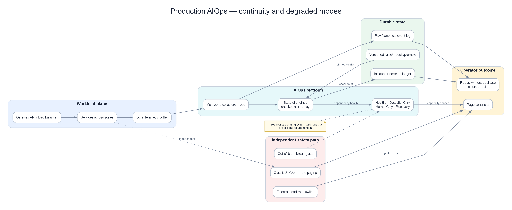
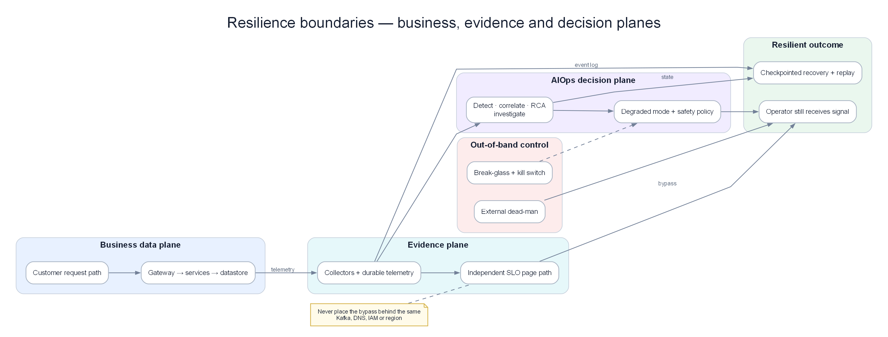

# Chapter 14 — Production Engine: AIOps tự bảo vệ khi production đang cháy

> **AIOps chỉ có giá trị nếu nó còn nhìn thấy, còn nhớ và còn biết tự kiềm chế đúng lúc production suy thoái. Chapter này biến tập hợp detector, correlation, RCA, investigation và remediation thành một production engine có degraded mode, state bền vững, rollout an toàn, disaster recovery và đường điều khiển khẩn cấp độc lập. Uptime của từng component không phải đích đến; đích đến là con người vẫn nhận được cảnh báo đúng, không mất incident dài và không có action nguy hiểm.**

---

## Prerequisites

Toàn bộ các chương trước đó. Đây là chương tổng hợp các vấn đề vận hành thực tế.

## Related Documents

- [08 — Topology & Change](../08-topology-change/README.vi.md) — service graph + change/deploy bus

- [09 — Anomaly Detection](../09-anomaly-detection/README.vi.md) — precision-at-page, drift ops
- [10 — Alert Correlation](../10-alert-correlation/README.vi.md) — storm drills, topology health
- [11 — Root Cause Analysis](../11-root-cause-analysis/README.vi.md) — accuracy feedback, time budget
- [12 — LLM Agent](../12-investigation-engine/README.vi.md) — cost runaway LLM, human override
- [13 — Remediation](../13-remediation-safety-engine/README.vi.md) — safety gates, blast radius
- [15 — Pattern Library](../15-aiops-pattern-library/README.vi.md) — reusable production patterns và trade-offs
- [16 — Domain Packs](../16-aiops-domain-packs/README.vi.md) — domain invariants, cost và compliance constraints
- [17 — Benchmark Replay](../17-aiops-benchmark-replay/README.vi.md) — game-day và regression scenarios

## Next Reading

Sau chương này, chuyển sang [15 — Pattern Library](../15-aiops-pattern-library/README.vi.md), áp semantics bằng [16 — Domain Packs](../16-aiops-domain-packs/README.vi.md), rồi chứng minh bằng [17 — Benchmark Replay](../17-aiops-benchmark-replay/README.vi.md).

---

## Cách đọc chapter này

Đừng đọc chapter này như checklist “cài Kafka HA, chạy Kubernetes nhiều replica”. Hãy đặt nền tảng AIOps vào đúng thời điểm tệ nhất: incident payment đã kéo dài 37 phút, auth vừa lỗi chồng, telemetry bắt đầu mất và đội trực đang cân nhắc remediation. Phần I mô tả production engine phải giữ lời hứa nào khi từng dependency hỏng. Phần II là tài liệu triển khai và vận hành chi tiết.

## Phần I — Production engine dưới điều kiện xấu

### Nền tảng AIOps cũng nằm trong blast radius

Timeline đang xử lý xuyên suốt ba chapter:

| Thời điểm | Hệ thống nghiệp vụ | Nền tảng AIOps |
|---|---|---|
| 10:00 | Retry storm bắt đầu ở payment | Detector tạo incident, freeze baseline |
| 10:16 | Checkout success còn 71,4% | RCA + investigation chọn pool exhaustion |
| 10:20 | Canary giảm retry bắt đầu | Verifier so canary với control |
| 10:31 | Payment cải thiện nhưng chưa hết | Incident vẫn open, state được checkpoint |
| 10:37 | Auth certificate lỗi chồng | Incident thứ hai phải được tách riêng |
| 10:41 | OTel gateway mất 35% span | Confidence phải giảm, không được coi missing là healthy |
| 10:45 | Kafka lag tăng lên 11 phút | Alert mới có thể trễ; remediation phải khóa expansion |
| 10:52 | Operator restart correlation worker | Engine phải replay mà không phát alert/action trùng |
| 11:05 | Payment thật sự ổn định | Hai cửa sổ burn-rate mới đủ điều kiện resolve |

Một kiến trúc “mọi component đều có ba replica” vẫn có thể thất bại: ba replica cùng đọc config lỗi, cùng phụ thuộc một Kafka cluster, cùng dùng DNS hoặc IAM bị hỏng. Production engine phải biết **nó đang mù ở đâu** và đổi hành vi có chủ đích.

### SLO phải đo lời hứa với người trực, không đo pod xanh

Các SLO hữu ích của AIOps là end-to-end:

| Lời hứa | SLI đo được | Ví dụ SLO |
|---|---|---:|
| Không bỏ lọt sự cố đáng page | Tỷ lệ incident benchmark được phát hiện trong deadline | 99,5%/30 ngày |
| Không tự nuốt incident dài | Incident-active continuity, không có khoảng câm >2 phút | 99,9% |
| Bắt được lỗi nổ chồng | Recall theo fault/service độc lập | ≥98% tập replay |
| RCA hữu dụng | Top-3 có root cause đúng, đo trên incident đóng | ≥85% |
| Không hành động nguy hiểm | Harmful autonomous action | 0 severity-1 |
| Operator nhận đủ bối cảnh | Freshness của brief và evidence provenance | p99 <5 phút |
| Có thể phục hồi sau outage | Replay convergence và state loss | RPO/RTO đã cam kết |

Kafka uptime 99,99% không chứng minh alert đến on-call đúng hạn. Ngược lại, một worker restart có thể chấp nhận được nếu checkpoint + replay giữ incident liên tục và không gửi trùng.

### Operating modes: suy thoái phải hữu hạn và nhìn thấy được

Production engine nên có state machine toàn cục, đồng thời có trạng thái riêng theo tenant/region:

| Mode | Điều kiện điển hình | Được phép | Bị cấm |
|---|---|---|---|
| `Healthy` | Telemetry, state, topology và audit đều fresh | Detection, RCA, investigation, gated remediation | — |
| `DegradedContext` | Mất một loại signal hoặc topology cũ | Alert + RCA với uncertainty tăng | Auto-expand action phụ thuộc signal mất |
| `DetectionOnly` | Audit/verifier/policy dependency lỗi | Tiếp tục detect, correlate, page | Mọi action mới |
| `HumanOnly` | State divergence, model bất thường, security event | Hiện raw evidence và runbook | RCA tự tin giả, auto-remediation |
| `Recovery` | Đang replay/checkpoint reconciliation | Cập nhật incident theo revision | Duplicate page/action, resolve sớm |

Chuyển mode phải có reason, phạm vi và TTL. Nếu OTel gateway ở region A hỏng, không cần kéo region B xuống `HumanOnly`. Nếu audit sink dùng chung hỏng, remediation toàn cục phải dừng vì không còn chuỗi kiểm toán.

Không cho hệ tự trở lại `Healthy` chỉ vì một health check xanh. Cần cửa sổ ổn định, đối chiếu backlog, state convergence và một operator-visible event.

### Failure matrix: dependency hỏng thì hành vi phải định trước

| Failure | Điều còn biết | Hành vi degrade | Tuyệt đối không làm |
|---|---|---|---|
| Mất metrics 35%, trace còn | Span errors, logs, missingness rate | Giữ incident open; hạ confidence; page telemetry gap riêng | Diễn giải metric biến mất là recovery |
| Mất traces, metrics/logs còn | SLO và lỗi tổng hợp | Detect theo service; RCA không dùng path propagation mới | Bịa causal chain |
| Kafka lag 11 phút | Event time và watermark | Xử lý theo event time; gắn `late`; khóa action dùng stale evidence | Dùng processing time để đổi thứ tự nguyên nhân |
| Topology stale 28 phút | Graph revision cũ | Correlate bảo thủ, hiển thị revision | Auto-remediate shared dependency |
| State store mất leader | Checkpoint gần nhất | Sang `Recovery`; replay theo idempotency key | Tạo incident/action ID mới cho cùng fault |
| Detector/model mới tạo storm | Raw SLO rules còn | Kill model revision, fallback rules | Tắt toàn bộ paging |
| RCA/LLM unavailable | Alerts, traces, runbooks | Page với evidence thô; human investigation | Chặn phát hiện vì thiếu phần “AI” |
| Policy/audit unavailable | Có thể vẫn gọi executor | `DetectionOnly` | Bypass safety để “cứu nhanh” |
| Notification provider lỗi | Incident state còn | Route kênh độc lập, escalation clock vẫn chạy | Đánh dấu acknowledged |

Failure matrix là hợp đồng được test, không phải đoạn văn trong runbook. Mỗi hàng cần owner, probe, mode transition và game-day định kỳ.

### Incident dài: tách baseline học tập khỏi incident memory

Sự cố dài có hai state khác nhau:

- **Baseline state:** mức bình thường dùng cho detection. Nó được freeze theo service/signal khi alert active để không học anomaly thành normal.
- **Incident state:** timeline, evidence revision, hypothesis, action và acknowledgement. Nó vẫn cập nhật suốt incident.

Nếu freeze toàn bộ baseline toàn platform, dao động traffic hợp lệ lúc 10:30 có thể sinh false positive ở service khỏe. Nếu không freeze gì, payment error 24% sau 30 phút trở thành “bình thường mới”. Thiết kế đúng freeze theo `service × signal × regime`, vẫn cập nhật seasonality từ cohort khỏe hoặc baseline trước incident.

Ví dụ với chuỗi error rate payment mỗi 5 phút:

`0,7; 0,8; 0,6; 12; 21; 25; 24; 23; 25; 24; 22; 8; 1,2`

Rolling median/MAD ngây thơ đưa median dần lên vùng 23–24% và im lặng giữa sự cố. Production engine giữ baseline khoảng 0,7%, còn burn-rate cửa sổ nhanh 5 phút và chậm 60 phút tiếp tục chứng minh budget đang cháy. Khi giá trị về 1,2%, engine chưa resolve ngay: nó đợi cửa sổ nhanh ổn định và burn-rate chậm xuống ngưỡng đóng.

Auth ở phút 37 có state detector và baseline riêng, nên lỗi mới không bị incident payment che. Correlation có thể nối hai incident nếu có dependency evidence; nếu chỉ cùng thời gian, chúng vẫn là hai fault candidates.

### Checkpoint và replay: khôi phục kết quả, không chỉ khôi phục process

State cần checkpoint gồm:

- Incident identity, fault partition và lifecycle revision.
- Baseline snapshot + lý do freeze/unfreeze.
- Event-time watermark và danh sách source đang trễ.
- Dedup/correlation membership.
- RCA hypothesis ledger và evidence provenance.
- Remediation state, idempotency key, lock và TTL.
- Notification/ack/escalation state.

Giả sử worker chết lúc 10:52, checkpoint gần nhất 10:50 và Kafka giữ dữ liệu từ 10:45. Sau restart, engine replay 10:50–10:52. Nó phải hội tụ về cùng incident revision như khi không crash. Alert `INC-8421` không được page lại; action canary không được chạy lần hai; evidence đến muộn có thể tăng revision nhưng không thay identity.

“Consumer chạy lại được” chưa phải DR. Bài test đúng so sánh output event-by-event giữa continuous run và recovery run, cho phép khác timestamp xử lý nhưng không khác incident/action semantics.

### Event time, watermark và dữ liệu đến muộn

Trong outage, network buffer có thể đưa span 10:36 tới sau metric 10:43. RCA “cái đỏ trước là gốc” chỉ đúng khi dùng event time đã hiệu chỉnh skew, không phải thời gian consumer nhận message.

Production engine duy trì watermark theo source. Event đến trước watermark được cập nhật bình thường; event đến muộn:

- Vẫn bổ sung evidence vào incident nếu nằm trong retention window.
- Có thể phát revision mới nếu thay đổi RCA đáng kể.
- Không được tự động đảo một action đã hoàn tất; cần review event riêng.
- Không page lại nếu customer-impact state không đổi.

Nếu clock skew của host vượt 90 giây, evidence từ host đó bị giảm trust và gắn cờ. NTP khỏe là dependency của causal inference, không phải chi tiết hạ tầng phụ.

### DR: RPO/RTO phải gắn với hậu quả vận hành

Chọn RPO/RTO riêng cho từng lớp:

| State | Mất dữ liệu gây gì | RPO mục tiêu | RTO mục tiêu |
|---|---|---:|---:|
| Raw telemetry | Mất bằng chứng và replay | ≤5 phút hoặc theo retention upstream | 30 phút |
| Active incident | Khoảng câm/page trùng | Gần 0 qua replicated log | 5 phút |
| Action/audit | Không biết production đã đổi gì | 0 | 5 phút |
| Baseline/model | False alert hoặc bỏ lọt | 15 phút, có version | 15 phút |
| Topology/change | Correlation/RCA sai | Theo change event, ≤5 phút | 10 phút |

Active-passive khác region chỉ có ý nghĩa nếu credentials, schema registry, encryption key, DNS, notification route và runbook cũng khả dụng. Restore backup mỗi quý mà chưa chạy replay equivalence không chứng minh RTO.

### Rollout rule, model và prompt như rollout code production

Một threshold hoặc prompt sai có thể tạo blast radius lớn hơn một service deploy. Pipeline an toàn:

1. **Offline replay:** chạy trên incident đã gắn nhãn, gồm long-running và concurrent faults.
2. **Shadow:** nhận traffic live nhưng không thay decision; so disagreement với incumbent.
3. **Canary tenant/service:** bật decision cho nhóm nhỏ, remediation vẫn manual.
4. **Progressive rollout:** 5% → 25% → 50% → 100%, mỗi bước có hold window.
5. **Automatic rollback:** precision-at-page, incident continuity, compute cost hoặc latency vi phạm guardrail.

Artifact phải version cùng feature schema, baseline policy, graph revision expectation và calibration dataset. Rollback model mà giữ feature transform mới có thể còn nguy hiểm hơn.

Ví dụ model RCA mới tăng Top-1 từ 62% lên 69% offline nhưng disagreement live tập trung ở incident thiếu trace. Không rollout 100%; giữ shadow cho cohort thiếu trace và chỉ canary ở service có sampling đủ. Một con số trung bình đẹp không bù được failure slice nguy hiểm.

### Shared fate: đừng quan sát observability bằng chính một đường duy nhất

Nếu AIOps tự monitor qua cùng OTel gateway và Kafka mà nó đang đánh giá, outage chung sẽ tạo dashboard xanh giả vì không còn dữ liệu. Cần đường tối thiểu độc lập:

- Synthetic heartbeat từ ngoài cluster/region.
- Queue-age và object-store probe không đi qua pipeline chính.
- Paging cho “AIOps blind” bằng provider hoặc route thứ hai.
- Break-glass status/read path có dependency tối thiểu.
- Audit/kill switch nằm ngoài executor failure domain.

Không cần nhân đôi toàn bộ platform. Chỉ cần một safety plane đủ để nói: dữ liệu đang thiếu ở đâu, incident nào còn active, action nào đang chạy, và làm sao dừng chúng.

### Capacity: thiết kế cho incident storm, không cho ngày bình thường

Traffic telemetry thường tăng đúng lúc outage do retry, stack trace và debug logging. Ví dụ tải thường:

| Loại | Bình thường | Incident storm | Hệ số |
|---|---:|---:|---:|
| Metrics samples/s | 500.000 | 900.000 | 1,8× |
| Log events/s | 80.000 | 640.000 | 8× |
| Spans/s | 120.000 | 420.000 | 3,5× |
| Alert candidates/min | 300 | 45.000 | 150× |

Autoscaling dựa trên CPU thường phản ứng quá muộn khi queue đã đầy. Capacity plan cần headroom, queue-age SLO và admission priority:

1. Giữ SLO/error signals và active-incident traffic.
2. Giữ change/topology/audit events.
3. Giảm sampling trace khỏe trước.
4. Rate-limit debug logs/cardinality offender.
5. Không drop action result hoặc incident state.

Backpressure phải truyền upstream có kiểm soát. Consumer scale vô hạn có thể làm database state chết trước khi Kafka hồi phục.

### Cost runaway là một dạng availability failure

LLM loop, high-cardinality label hoặc retry fetch log có thể đốt ngân sách trong vài giờ. Budget guard nên có:

- Token/query budget theo incident và theo giờ.
- Cardinality budget theo tenant/service.
- Maximum evidence bytes và retention tier.
- Circuit breaker khi cost slope vượt dự báo.
- Fallback deterministic summary khi LLM hết budget.

Hết budget không được làm detector im lặng. Engine giảm enrichment trước, giữ detection, paging và incident state. Chi phí là resource constraint, không phải lý do phá SLO cốt lõi.

### Security: telemetry và runbook đều là input không tin cậy

Log có thể chứa prompt injection; label có thể làm nổ cardinality; attacker có thể cố tạo alert để kích hoạt action. Production engine cần:

- Tách dữ liệu quan sát khỏi instruction; LLM không có credential executor.
- Schema, size, tenant và provenance validation tại ingest.
- Least privilege theo action catalog, target và environment.
- Secret retrieval ngắn hạn; không đưa token vào evidence/audit.
- Dual control cho security policy, identity, data và multi-region.
- Ký artifact/policy và xác minh trước khi load.
- Phát hiện behavior bất thường của chính agent/executor.

Break-glass không có nghĩa bỏ log. Nó cần MFA, TTL ngắn, reason bắt buộc, notification độc lập và review hậu kiểm.

### Game day phải phá lời hứa end-to-end

Chaos chỉ kill pod là quá nhẹ. Bộ game day nên ép hệ qua các edge case:

| Kịch bản | Điều phải chứng minh |
|---|---|
| Incident payment 65 phút | Không có khoảng câm; baseline không tự nuốt anomaly |
| Auth fault tại phút 37 | Incident thứ hai được phát hiện/tách riêng |
| Drop 35% span có chọn lọc | Missingness hiển thị; RCA confidence giảm |
| Delay partition Kafka 11 phút | Event-time order đúng; action stale bị chặn |
| Corrupt topology revision | Shared-dependency remediation bị cấm |
| Restart state store leader | Replay hội tụ; không page/action trùng |
| Audit sink unavailable | Mode chuyển `DetectionOnly` |
| LLM timeout/cost cap | Evidence thô vẫn tới người trực |
| Policy rollout sai | Canary rollback, incumbent tiếp quản |
| Region chính mất hoàn toàn | RPO/RTO và notification route đạt cam kết |

Mỗi game day có hypothesis, failure injection, expected mode transition, customer-facing SLI, evidence artifact và owner sửa lỗi. “Hệ thống tự hồi phục” mà không so output trước/sau không phải kết luận kiểm chứng được.

### Incident command: máy không thay ownership

| Vai trò | Quyết định |
|---|---|
| Incident commander | Priority, scope, communication, chấp nhận risk |
| AIOps platform on-call | Data quality, engine mode, replay/recovery |
| Service owner | Business invariant, remediation approval |
| Security/compliance | Credential, data/action policy đặc biệt |
| Communications | Customer/status update từ incident state đã xác nhận |

Engine đưa uncertainty ra ánh sáng; nó không tự nhận vai incident commander. Khi RCA đổi từ H1 sang H2 hoặc action thành `PartialSuccess`, state phải xuất hiện trong brief chung để các nhóm không làm theo phiên bản sự thật khác nhau.

### Production acceptance scoreboard

Trước khi bật autonomous remediation, yêu cầu evidence tối thiểu:

| Cổng | Bằng chứng pass |
|---|---|
| Long-incident continuity | Replay nhiều giờ, không khoảng câm >2 phút |
| Concurrent isolation | Fault thứ hai có incident ID và lifecycle riêng |
| Missing-data behavior | Không resolve khi telemetry biến mất |
| Recovery equivalence | Continuous và recovered run cùng quyết định |
| Stale-data safety | Evidence/action quá hạn bị từ chối 100% |
| Model/rule rollout | Shadow + canary + rollback đã diễn tập |
| Remediation safety | Không freeform; canary/control/rollback đầy đủ |
| DR | Restore thật đạt RPO/RTO, không chỉ review tài liệu |
| Security | Prompt/telemetry injection và credential abuse bị chặn |
| Human operation | On-call hoàn thành game day bằng brief/audit hiện có |

Chapter 14 hoàn tất không phải khi deployment “green”, mà khi đội có thể tắt từng dependency và chứng minh hệ thống chuyển sang một chế độ an toàn, hữu dụng, quan sát được — rồi trở lại bình thường mà không mất incident, không tạo quyết định trùng và không che giấu uncertainty.

---

## Phần II — Production operating engine

## 1. Platform Architecture Summary

*Continuity design: durable state, checkpoint/replay, degraded modes và đường page độc lập khi platform mù.*

*Tách business, evidence, decision và safety plane để một failure domain không vô hiệu hóa cả quan sát lẫn phục hồi.*

> [!NOTE]
> **Ý TƯỞNG**
> Nền tảng AIOps **cũng là production system**. Nếu Kafka/AD/Correlation sập, bạn mù khi ứng dụng sập — double outage. Chuẩn vận hành cho AIOps không được thấp hơn chuẩn của payment-service.

> [!TIP]
> Dogfood trước khi evangelize: page platform team bằng **chính** anomaly/correlation stack của AIOps, không bằng "AIOps is down" script rời ngoài hệ thống.

Kiến trúc hoàn chỉnh của nền tảng AIOps, hiển thị toàn bộ các thành phần và luồng dữ liệu:

### Component Summary

| Thành phần | Công nghệ sử dụng | Cách thức triển khai | Chi phí hàng tháng |
|-----------|-----------|------------|-------------|
| Collection (agents) | Grafana Alloy DaemonSet | K8s DaemonSet | $180 |
| Collection (gateway) | OTel Collector | K8s Deployment ×3 | $180 |
| Log storage | Loki + S3 | K8s StatefulSet | ~$750 |
| Trace storage | Tempo + S3 | K8s StatefulSet | ~$1,620 |
| Metric storage | Prometheus + Thanos + S3 | K8s | ~$800 |
| Transport | AWS MSK | Managed service | $738 |
| Anomaly Detection | Python services + Redis | K8s Deployment | ~$1,824 |
| Alert Correlation | Python service + Redis | K8s Deployment | $775 |
| RCA Engine | Python service + Weaviate | K8s Deployment | $1,370 |
| LLM Agent | Python service + API | K8s Deployment | ~$1,000 |
| Remediation Engine | Python service | K8s Deployment | $127 |
| **Tổng cộng** | | | **~$9,364/tháng** |

---

## 2. High Availability Design

### HA Requirements

| Thành phần | Thời gian Uptime yêu cầu | Cơ chế đạt mục tiêu | Đánh giá |
|-----------|----------------|--------|---------|
| Collection agents | 99.9% | DaemonSet tự động restart | ✅ |
| Kafka | 99.95% | MSK Multi-AZ | ✅ |
| Loki | 99.9% | 3× ingester, lưu trữ S3 backend | ✅ |
| Prometheus | 99.9% | Cặp HA pair + Thanos | ✅ |
| Anomaly Detector | 99.5% | 3 replicas, thiết kế stateless | ✅ |
| RCA Engine | 99.5% | 2 replicas | ✅ |
| LLM Agent | 99% | 2 replicas + cơ chế model fallback | ✅ |
| Remediation Engine | 99.9% | 2 replicas + cơ chế leader election | ✅ |

### Multi-AZ Architecture

Multi-AZ chỉ có ý nghĩa khi fault domain thật sự độc lập. Ba replica nằm trên ba node nhưng cùng subnet, NAT, IAM policy, DNS resolver hoặc Kafka cluster vẫn là một failure domain. Với từng đường detect, page và action, hãy vẽ dependency chung rồi thử mất trọn một AZ: partition còn leader không, consumer còn quorum không, incident store có nhận write không, và kênh page ngoài băng có còn hoạt động không.

### AIOps Platform SLO

SLO nền tảng phải nối latency kỹ thuật với hậu quả vận hành. Ingest p99 dưới 30 giây nhưng correlation backlog 12 phút vẫn khiến page vô dụng. Theo dõi ít nhất bốn budget: freshness từ event time tới detector, continuity của incident đang mở, deadline phát hiện fault mới và safety budget của action. Khi một budget cạn, mode phải đổi và incident card phải nói rõ năng lực nào vừa mất.

---

## 3. Disaster Recovery

### DR Scenarios and Recovery Procedures

#### Kịch bản 1: Lỗi một Kafka Broker đơn lẻ

Kết quả đạt không phải “broker tự lên lại”, mà là partition critical vẫn đọc/ghi được, lag không vượt deadline phát hiện và không có duplicate decision sau rebalance. Nếu ISR tụt dưới ngưỡng an toàn, remediation đóng trước khi detector đóng vì quyết định muộn nguy hiểm hơn một brief thiếu enrichment.

#### Kịch bản 2: Lỗi Loki Ingester

Detector dựa trên metric và trace vẫn tiếp tục; investigation gắn `logs_unavailable`, giảm confidence và không suy diễn “không có log lỗi” thành “không có lỗi”. Buffer phải có giới hạn để log backlog không tranh tài nguyên với metric critical. Sau recovery, log đến muộn chỉ bổ sung revision, không âm thầm thay đổi action đã thực thi.

#### Kịch bản 3: Lỗi Prometheus hoàn toàn

Dead-man signal ngoài Prometheus phải page platform team. Engine giữ incident đang mở, khóa resolve vì missing không phải healthy, dùng trace/log còn lại để phát hiện fault độc lập và chuyển remediation cần metric verification sang `HumanOnly`. Khi dữ liệu trở lại, baseline không học khoảng trống.

#### Kịch bản 4: Toàn bộ lớp trí tuệ nhân tạo AIOps Intelligence Layer bị sập

Đường rule/burn-rate cổ điển phải đi thẳng tới paging mà không qua cùng Kafka, correlation hoặc LLM. State open-incident, dedupe ledger và version được phục hồi trước consumer. Replay theo event time; mỗi output có idempotency key để cùng anomaly không sinh page thứ hai hoặc chạy lại remediation.

### Backup Strategy

Không phải state nào cũng backup giống nhau. Canonical events cần retention đủ replay; incident ledger và action audit cần RPO nghiêm ngặt; feature có thể dựng lại nếu giữ data, contract và version; vector index có thể tái tạo từ nguồn tri thức; cache có thể bỏ. Một bài restore chỉ pass khi output replay khớp, không chỉ khi file backup mở được.

---

## 4. Chaos Engineering for AIOps

Nền tảng AIOps bắt buộc phải có khả năng chống chịu lỗi tốt. Sử dụng chaos engineering để kiểm chứng:

### Chaos Test Suite

Suite tối thiểu gồm mất telemetry từng signal, stale topology, change đến muộn, Kafka lag tăng tuyến tính, state store read-only, model registry trả version sai, LLM timeout, verifier mất control cohort và kênh paging chính hỏng. Mỗi fault có expected mode, capability còn lại, điều bị khóa và deadline phục hồi; thiếu oracle thì chaos chỉ tạo náo loạn.

### Running Chaos Tests

Chạy shadow trước, staging có traffic replay sau, production theo blast radius nhỏ cuối cùng. Dừng test nếu customer SLO bị ảnh hưởng ngoài budget, kill switch không phản hồi hoặc platform không phát chính fault đã inject. Lưu timeline event-time/processing-time, decision revision và operator action vào benchmark corpus Chapter 17.

---

## 5. Performance Benchmarks

### Latency Budget (End-to-End)

Với page deadline 120 giây, một budget thực tế có thể là: ingest 20 giây, watermark 30 giây, detection 15 giây, correlation 10 giây, RCA/brief 25 giây, delivery 10 giây và 10 giây dự phòng. Khi trace đến sau 90 giây, page vẫn đi bằng metric evidence rồi được cập nhật revision thay vì chờ đủ dữ liệu.

### Throughput Benchmarks

| Giai đoạn xử lý | Năng lực xử lý mục tiêu | Hiệu năng hiện tại (Quy mô vừa) | Điểm nghẽn phát sinh tại |
|-------|------------------|----------------------|--------------|
| OTel Collection | 100MB/s | 30MB/s | Băng thông mạng card NIC |
| Kafka ingest | 500MB/s | 50MB/s | Tốc độ ghi Disk IO của Broker |
| Loki ingest | 100MB/s | 20MB/s | Dung lượng RAM của Ingester |
| Stateful detection | 50K điểm/giây | 10K điểm/giây | Window state, replay lag và inference queue của candidate model |
| Correlation | 10K alerts/phút | 1K alerts/phút | Năng lực xử lý của Redis |
| RCA | 100 incidents/phút | 10 incidents/phút | Tốc độ đáp ứng của Loki/Tempo API |
| LLM agent | 50 lượt điều tra/phút | 5 lượt điều tra/phút | Giới hạn hạn mức API rate limits |

### Benchmark Script

Benchmark production phải replay burst, skew partition, late data và restart giữa incident; đo không chỉ event/giây mà cả deadline phát hiện, incident continuity, duplicate decision, memory/state growth và thời gian catch-up. Throughput ở steady state không chứng minh engine sống sót qua alert storm.

---

## 6. Cost Governance

### Cost Breakdown by Layer

Tách chi phí theo đơn vị gây ra quyết định: GB telemetry ingested, series active, span retained, event replayed, investigation và action verified. Tổng hóa đơn không chỉ ra service/cardinality nào đang đốt tiền, cũng không cho biết cắt khoản nào sẽ làm mất evidence critical.

### Cost Optimization Strategies

Ưu tiên loại dữ liệu vô giá trị trước khi giảm độ tin cậy: chặn label không giới hạn, sampling trace theo error/latency, tier log theo criticality, cache investigation trùng và chỉ gọi model lớn khi evidence đủ. Không cắt retention của audit/action hoặc burn-rate critical để đạt budget ngắn hạn.

### Cost Cost Monitoring

Theo dõi cost per service, cost per detected incident và marginal cost của mỗi domain pack. Giảm 30% log cost mà RCA Top-3 tụt 15 điểm là thất bại; giảm debug volume 40% mà benchmark không đổi mới là tối ưu thật.

### FinOps Alerts

Alert tài chính cần rate-of-change và forecast, không chỉ ngưỡng hóa đơn tháng. Token cost tăng bốn lần trong 15 phút cùng alerts-per-incident tăng là dấu hiệu correlation hỏng; circuit breaker phải chuyển investigation sang template nhỏ trước khi ngân sách bị đốt hết.

---

## 7. Security Hardening

### Security Checklist

Mỗi engine chỉ đọc đúng telemetry/tenant cần thiết; action plane dùng identity riêng và credential ngắn hạn; prompt/log là input không tin cậy; secret không đi vào context pack; mọi proposal, approval, execution và verification có audit bất biến. Break-glass độc lập với control plane đang hỏng nhưng vẫn có expiry, dual control và hậu kiểm.

### PII Scrubbing in Log Pipeline

Redaction xảy ra trước storage và trước LLM, dùng policy version lưu cùng record. Token hóa ổn định cho phép correlation mà không lộ giá trị gốc; quarantine record vi phạm thay vì thay bằng chuỗi rỗng khiến parser coi là hợp lệ. Replay bằng policy mới tạo revision riêng, không âm thầm sửa lịch sử audit.

---

## 8. Observability of the Observability Platform

Bài toán giám sát vòng ngoài (meta-observability): Ai giám sát những người gác cổng?

### Dead Man's Switch Pattern

Một producer ngoài failure domain chính gửi nhịp kỳ vọng tới receiver ngoài AIOps. Receiver page khi nhịp không đến đúng deadline. Heartbeat đi qua chính pipeline chỉ chứng minh pipeline có thể tự nói “tôi khỏe”; nó không phát hiện toàn bộ pipeline mất mạng, IAM hoặc DNS.

### Platform Health Dashboard

Dashboard phải đi từ hậu quả tới component: page deadline miss, incident continuity gap, unseen-service count, evidence freshness, action locked/failed, rồi mới đến CPU, pod và disk. Panel nào không dẫn tới quyết định mode, owner hoặc runbook chỉ tạo thêm dashboard để ngắm.

---

## 9. Runbook: Platform Recovery

### AIOps Platform Down — Full Recovery Runbook

Runbook không nên bắt đầu bằng “restart tất cả”. Trước hết phải xác định production đang hỏng, AIOps đang hỏng hay cả hai; nếu restart sai thứ tự, engine vừa mất state vừa replay trùng action.

| Bước | Evidence cần đọc | Quyết định | Điều cấm |
|---|---|---|---|
| 1. Tuyên bố mode | heartbeat ngoài băng, ingest freshness, consumer lag, incident continuity | Chuyển `DetectionOnly` hoặc `HumanOnly`; thông báo rõ phạm vi mù | Không giữ nhãn `Healthy` chỉ vì pod còn chạy |
| 2. Giữ đường page tối thiểu | static SLO/burn-rate và kênh paging độc lập | Bypass enrichment, LLM và remediation nếu cần | Không để outage AIOps làm mất page nghiệp vụ |
| 3. Chụp state | offsets, watermark, open incidents, action ledger, model/rule versions | Lưu checkpoint trước khi thay đổi consumer | Không reset offset theo cảm tính |
| 4. Khôi phục theo dependency | transport → state store → detection → correlation → RCA → investigation | Mở từng tầng khi input và state đã hợp lệ | Không bật remediation trước verifier |
| 5. Replay có giới hạn | backlog theo event time, dedupe key và revision | Replay một khoảng nhỏ, so kết quả live/canary | Không nhảy thẳng tới latest nếu chưa ghi nhận evidence bị bỏ |
| 6. Xác nhận end-to-end | synthetic incident đi qua detect, group, brief, page và audit | Chuyển `Recovery`, rồi `Healthy` sau soak window | Không dùng health endpoint đơn lẻ làm bằng chứng |

Ví dụ: worker dừng lúc 10:41, khôi phục lúc 10:52, backlog 660.000 event. Incident payment đã mở nên replay phải gắn vào cùng incident qua fingerprint và revision; incident auth khởi phát lúc 10:47 phải tạo incident riêng. Nếu chọn bỏ backlog, operator phải ghi chính xác khoảng evidence 10:41–10:52 bị mất, khóa auto-remediation và hạ confidence của mọi RCA giao với khoảng đó.

Điều kiện thoát recovery gồm: lag giảm đơn điệu trong ba cửa sổ, không có duplicate page/action, open incident khớp ledger trước sự cố, synthetic path đạt deadline và dead-man signal ngoài băng tiếp tục xanh. Chỉ khôi phục replica chưa đủ để tuyên bố hết sự cố nền tảng.

---

## 10. Capacity Planning

### Growth Model

Capacity planning dùng peak có burst và replay, không lấy trung bình ngày. Nếu live ingest là 30 MB/s, burst 3 lần và recovery cần catch-up 2 lần live, đường consumer phải chịu ít nhất 150 MB/s trong thời gian phục hồi hoặc backlog không bao giờ giảm. State sizing tính service × feature × window × revision retention, cộng headroom cho incident dài.

---

## 11. Upgrade and Maintenance

### Upgrade Order

Để đảm bảo tính ổn định tối đa của pipeline, hãy luôn nâng cấp các thành phần theo thứ tự sau:

### Zero-Downtime Upgrade Pattern

Rule/model/prompt/schema mới chạy shadow trên cùng event IDs, so decision diff và benchmark trước canary theo tenant/service. Consumer cũ và mới phải hiểu overlap schema; state migration có checkpoint và rollback. Rollback artifact không đồng nghĩa rollback decision: action đã chạy vẫn nằm trong ledger và verifier tiếp tục theo version ban đầu.

### Maintenance Windows

Không nâng cấp transport, state store và remediation trong cùng cửa sổ. Trong freeze nghiệp vụ, chỉ emergency change có owner và rollback được phép. Maintenance kết thúc khi lag về bình thường, synthetic path pass và không có incident/action trùng trong soak window.

---

## 12. Team Operations Model

### Platform Team Responsibilities

Platform sở hữu contract, shared engines, meta-observability, degraded mode, benchmark harness và unit cost. Họ không tự đặt business criticality hay phê duyệt remediation rủi ro thay product owner.

### Product Engineering Teams (consumers of AIOps)

Product team sở hữu SLO, service identity/topology, domain invariants, runbook và feedback root cause. Service không có owner hoặc acceptance scenario không được vào auto-remediation tier dù model score cao.

---

## 13. Maturity Progression Roadmap

### AIOps Maturity Model (Revisited)

| Cấp độ | Năng lực đạt được | Thời gian triển khai | Công cụ đầu tư tương ứng |
|-------|-----------|----------|-----------|
| **L1** | Giám sát qua Metrics + Cảnh báo tĩnh (static thresholds) | Hiện tại | Prometheus + Grafana |
| **L2** | Tích hợp Logs + Traces + Phân nhóm tương quan sơ bộ | Tháng 1-2 | Loki + Tempo + Kafka |
| **L3** | Phát hiện bất thường dựa trên các ngưỡng động (dynamic anomaly detection) | Tháng 2-4 | Giải pháp Thống kê + Học máy (ML) |
| **L4** | Gom nhóm liên kết tương quan tự động + Phân tích RCA cấu trúc | Tháng 4-6 | Correlation Engine + RCA Engine |
| **L5** | Điều tra tự động bằng LLM Agent + Khắc phục tự động | Tháng 6-12 | LLM Agent + Remediation Engine |
| **L6** | Khả năng dự báo trước sự cố (Predictive + Preventive) | Tháng 12 trở đi | Dự báo dung lượng, tự động scale đón đầu tải |

### L6 Preview: Predictive AIOps

Chỉ tiến tới predictive khi detection/correlation hiện tại đã được hiệu chỉnh và feedback đáng tin. Forecast phải có khoảng bất định, backtest qua campaign/failover và so với baseline đơn giản; output là capacity risk kèm horizon, không phải lệnh scale trực tiếp.

---

## 14. Total Cost of Ownership

### 12-Month TCO Summary

TCO gồm hạ tầng, license/API, thời gian platform, thời gian product team sửa contract, game day, security review và chi phí false positive/false negative. Báo cáo theo ba kịch bản tải và giá trị giảm page/MTTR; một con số cố định như “9.364 USD/tháng” chỉ là giả định sizing, không phải giá phổ quát.

---

## 15. Tư duy sâu: Dogfooding, DR control plane, Cost runaway, RACI, Game days, Scorecard

### 15.1 Dogfooding AIOps on itself

> [!IMPORTANT]
> Nếu AIOps không monitor được chính nó bằng pipeline của mình, bạn đang vận hành **hai thế giới**: "platform đặc biệt" và "app thường". Khi sự cố, on-call không có cơ bắp phản xạ.

**Dogfood checklist**:

| Tín hiệu platform | Detector / rule | Severity |
|-------------------|-----------------|----------|
| Kafka consumer lag AD/CE/RCA/LLM | Anomaly + static lag threshold | P1 nếu lag tăng + page silence |
| Anomaly FPR 24h | Meta-metric từ feedback | P2 platform |
| Correlation under-merge | alerts_per_incident median | P2 |
| RCA accuracy 7d | feedback TP rate | P2 |
| LLM token spike / safety blocks | Cost + security | P2/P1 |
| Remediation failure rate | Verify pipeline | P1 |
| Topology graph age | Static | P2 |

> [!TIP]
> **Shadow page**: mỗi quý, inject synthetic failure (chaos) và bắt buộc path detect→correlate→RCA→Slack card phải hoàn tất < SLO. Ghi kết quả vào maturity scorecard §15.6.

### 15.2 DR cho AIOps control plane

DR app thường ≠ DR AIOps. Control plane cần **RPO/RTO riêng**:

| Thành phần | RPO | RTO | Ghi chú |
|------------|-----|-----|---------|
| Kafka / MSK | ≤ 1–5 phút | ≤ 30 phút | Multi-AZ; test failover consumer groups |
| Redis (correlation windows) | Best-effort | ≤ 15 phút | Accept window loss; rebuild from stream |
| Incident store (Postgres) | ≤ 5 phút | ≤ 30 phút | PITR |
| Model registry / artifacts | ≤ 24h | ≤ 1h | S3 versioned |
| Vector store (runbooks) | ≤ 24h | ≤ 2h | Re-embed từ git source of truth |
| LLM API | N/A | Immediate fallback | Multi-provider / smaller model |
| Grafana dashboards | ≤ 24h | ≤ 30 phút | GitOps |

**DR modes**:

> [!WARNING]
> **Anti-pattern**: DR runbook chỉ có "restore payment-db" mà không có "restore aiops". Trong outage lớn, bạn cần observability **trước** app recovery để biết fix có ăn không.

Xem thêm kịch bản DR và dependency failure để drill: [17 — Benchmark Replay](../17-aiops-benchmark-replay/README.vi.md).

### 15.3 Cost runaway: LLM + retention

Hai lò đốt tiền âm thầm:

| Nguồn | Cơ chế runaway | Circuit breaker |
|-------|----------------|-----------------|
| LLM storm | Correlation fail → 1 alert = 1 investigation | max_investigations_per_incident; storm mode mini-model |
| Log retention | Debug level + 90 ngày hot | Tiered storage; default 7–14d hot |
| Trace no sampling | 100% prod traces | Tail sampling + policies |
| Metric cardinality | unbounded labels | relabel drop; recording rules |
| Retrain thrash | retrain mỗi FP spike | cooldown 7d; shadow first |
| Vector reindex | full re-embed hourly | incremental; hash content |

> [!NOTE]
> **Ý TƯỞNG**
> Cost governance AIOps là **SLO tài chính**: "chi phí observability ≤ X% COGS" hoặc "≤ Y$/service/tháng". Không có ceiling → retention và LLM sẽ nở theo nỗi sợ on-call.

### 15.4 Multi-team ownership RACI

| Hạng mục | Platform AIOps | Product SRE | App Dev | Security | FinOps |
|----------|----------------|-------------|---------|----------|--------|
| Collectors / OTel | **A/R** | C | C | C | I |
| Recording rules / SLOs app | C | **A/R** | C | I | I |
| Anomaly models generic | **A/R** | C | I | I | I |
| Service-specific detectors | C | **A** | R | I | I |
| Topology / service catalog | A | R | R | I | I |
| Runbooks nội dung | C | **A** | R | C | I |
| LLM prompts/safety | **A/R** | C | I | **C/A** (policy) | I |
| Remediation allowlist | A | R | C | **A** (risk) | I |
| Budget & retention | C | C | I | I | **A/R** |
| Incident commander app outage | I | **A/R** | C | I | I |
| Incident commander AIOps down | **A/R** | C | I | C | I |

> [!TIP]
> **R = Responsible, A = Accountable (chỉ 1), C = Consulted, I = Informed.**  
> Tranh cãi kinh điển: "ai sở hữu false positive?" → **Platform** chịu FPR hệ thống; **Product SRE** chịu threshold/SLO service họ.

### 15.5 Game days calendar

Không có game day = DR/chaos chỉ là markdown.

| Tần suất | Scenario | Mục tiêu | Link gợi ý |
|----------|----------|----------|------------|
| Monthly | Kill 1 anomaly-detector replica + lag inject | HPA + no page storm | Ch07/Ch12 chaos |
| Monthly | Alert storm synthetic 200 alerts | Correlation merge quality + UX | Ch08 |
| Quarterly | Stale topology (freeze graph 2h) | Degraded correlation banner | Ch08 §19 |
| Quarterly | Loki down during P1 | RCA partial + human path | Ch09 |
| Quarterly | Prompt injection canary log | Safety gate blocks action | Ch10 |
| Quarterly | Region AZ loss MSK | DR Mode A | §15.2 |
| Bi-annual | Full aiops namespace wipe (staging) | Restore order RTO | §15.2 Mode B |
| Bi-annual | Benchmark incident replay | Organizational learning | [17 — Benchmark Replay](../17-aiops-benchmark-replay/README.vi.md) |

### 15.6 Maturity scorecard (đo được, không khẩu hiệu)

Chấm điểm 0–4 mỗi hàng; target ≥ 3 trước khi scale org-wide.

| Hạng mục | 0 | 1 | 2 | 3 | 4 |
|----------|---|---|---|---|---|
| Detection | Static only | EWMA | Seasonal | Ensemble + drift | Predictive |
| Correlation | None | AM group | Topology | Late-join + split UX | Multi-cluster |
| RCA | Manual | Topology | +logs/traces/change | Evidence quality + budget | Multi-root calibrated |
| LLM Agent | None | Summarize | Tool-use read | HITL remediate | Calibrated auto tier-0 |
| Remediation | Manual | Scripts | Allowlist auto | Canary+verify | Closed-loop |
| Dogfood | None | Some metas | Full self-page | Game days monthly | Chaos continuous |
| FinOps | No budget | Monthly review | Guards+alerts | Unit cost/service | Autotune retention |
| Security | Basic | mTLS | Injection defense | Audit+IR playbooks | Red-team agent |
| Ownership | Hero culture | Partial RACI | Clear RACI | Scorecard OKRs | Multi-region ops |

Reusable patterns: [15 — Pattern Library](../15-aiops-pattern-library/README.vi.md). Industry constraints: [16 — Domain Packs](../16-aiops-domain-packs/README.vi.md).

### 15.7 Link drills → famous incidents

| Drill theme | Lấy cảm hứng | Kiểm tra năng lực |
|-------------|--------------|-------------------|
| Cascading dependency | Multi-service retail outage | Correlation + RCA path |
| Bad config global push | CDN/DNS incidents | Change correlation + freeze |
| Automation feedback loop | Retry storms / thundering herd | Remediation blast radius |
| Partial region failure | Cloud AZ/region events | DR control plane |
| Observability blind | "metrics lied" class | Dogfood + multi-signal |

> [!NOTE]
> **Câu hỏi kiểm tra**: Game day vừa fail vì incident card không ra — bạn mở **ticket platform** hay **tắt AIOps và quên**? Văn hóa nào build được maturity 3+?

### 15.8 Operating cadence (nhịp vận hành tuần/tháng/quý)

| Nhịp | Diễn ra | Artifact đầu ra |
|------|---------|-----------------|
| Daily | Platform standup 15' — lag, FPR, $ burn, open P1 platform | Slack thread `#aiops-ops` |
| Weekly | FP/RCA accuracy review với product SRE | Top 5 noisy services + owners |
| Weekly | Change freeze window cho AIOps itself (trừ hotfix) | Calendar + feature flags |
| Monthly | Cost & retention review với FinOps | Budget variance + actions |
| Monthly | Game day (xem §15.5) | Report + action items |
| Quarterly | Maturity scorecard + OKR bets | Score 0–4 table published |
| Quarterly | Security review agent tools + IRSA/RBAC | Diff allowlist + pen findings |
| Yearly | Full DR regional exercise (staging→prod-like) | RTO/RPO measured |

> [!WARNING]
> Kill switch **không** được chôn trong PR 40 file. Một `kubectl`/`redis-cli`/flag UI là đủ. Game day phải tập **bật/tắt** flag, không chỉ inject fault.

### 15.9 Anti-patterns vận hành production AIOps

| Anti-pattern | Triệu chứng | Hệ quả | Fix |
|--------------|-------------|--------|-----|
| Hero on-call | Chỉ 1 người "hiểu AIOps" | Bus factor 1 | RACI + runbook + pairing |
| Shadow IT detectors | Team tự host model ngoài platform | Blind spots, cost lạ | Platform self-service API |
| Eternal beta | "ML experimental" 18 tháng | Không ai tin page | Scorecard gate go-live |
| Alert on everything platform | 50 meta-alerts | Fatigue đè platform team | Tier meta-alerts như app |
| No classic fallback | AIOps down = mù hoàn toàn | Double outage | Mode B classic path |
| Budget without unit cost | Chỉ nhìn total $ | Không biết service nào đốt | $/service + /GB log |
| Game day theater | Chỉ slide, không inject | False confidence | Success criteria đo được |
| Ignore ch15 history | Lặp lại outage đã publish | Văn hóa không học | Drill map §15.7 |

> [!TIP]
> Khi leadership hỏi "AIOps xong chưa?", trả lời bằng **scorecard + 3 bets quý này**, không bằng list tools đã cài.

Cross-read: [15 — Pattern Library](../15-aiops-pattern-library/README.vi.md) · [16 — Domain Packs](../16-aiops-domain-packs/README.vi.md) · [17 — Benchmark Replay](../17-aiops-benchmark-replay/README.vi.md).

### 15.10 Definition of Done — “AIOps production” theo 10 câu hỏi

Trả lời **có** tối thiểu 8/10 trước khi tuyên bố platform production:

1. On-call product **không** còn nhận raw Alertmanager flood khi 1 service cascade?
2. Platform team bị page bằng **chính** pipeline AIOps khi control plane hỏng?
3. Topology age / stale graph có metric + degrade path?
4. RCA trả hypothesis < 45s với `partial` flag khi thiếu data?
5. LLM không bao giờ execute shell; remediation mediated + allowlist?
6. Có kill switch pipeline / auto-remediation / LLM trong < 2 phút?
7. Budget LLM + retention có circuit breaker và owner FinOps?
8. RACI đã publish; không còn “hỏi anh X”?
9. Game day trong 90 ngày gần nhất **pass** success criteria đo được?
10. Có classic fallback path đã drill khi AIOps dark?

> [!NOTE]
> **Ý TƯỞNG**
> Production AIOps là **khả năng tổ chức** (process + ownership + drills), không phải checklist Helm chart. Tooling chỉ là điều kiện cần.

---

## 16. Final Production Review

### Assessment of the Complete Platform

Review cuối dựa trên evidence replay và game day. Kiến trúc được chấp nhận khi giữ incident dài liên tục, tách fault chồng, hạ cấp khi thiếu signal, replay không trùng decision, chặn action khi verifier mù và đưa operator về đường manual trong deadline. Không tiêu chí nào được thay bằng số replica hoặc danh sách công cụ đã cài.

> [!IMPORTANT]
> Go-live org-wide chỉ khi: dogfood P1 path xanh 30 ngày, game day monthly pass, maturity trung bình ≥ 3, classic fallback đã drill, RACI đã ký. Cài đủ tool **không** bằng production-ready.

**Các ưu điểm nổi bật trong thiết kế của nền tảng**:

1. **Kiến trúc hướng sự kiện hoàn toàn (Event-driven)**: Tất cả các thành phần giao tiếp không đồng bộ thông qua Kafka. Không có sự phụ thuộc ràng buộc trực tiếp giữa các thành phần của lớp trí tuệ nhân tạo. Bất kỳ dịch vụ nào cũng có thể được nâng cấp hoặc thay thế độc lập mà không ảnh hưởng tới luồng chung.

2. **Khả năng giảm cấp hiệu năng mềm dẻo (Graceful degradation)**: Khi mô hình ML phát hiện bất thường bị sập, các công cụ thống kê tĩnh vẫn chạy bình thường. Khi LLM Agent bị lỗi, kết quả phân tích RCA thô vẫn được ghi nhận. Khi remediation engine gặp sự cố, thông báo cảnh báo Slack vẫn gửi đi đầy đủ. Quy trình tự động giảm cấp an toàn.

3. **Khả năng giám sát toàn diện ở mọi lớp**: Tất cả các thành phần đều phát Prometheus metrics. Mỗi bước xử lý trong pipeline đều được lưu vết chi tiết qua Kafka offset. Mọi hành động khắc phục đều được ghi nhận vào audit log bất biến.

4. **Thiết kế tối ưu chi phí hạ tầng**: Sử dụng lưu trữ S3 giá rẻ cho dữ liệu dài hạn. Áp dụng kỹ thuật sampling giảm tải traces. Sử dụng spot instances cho các workloads không trạng thái. Chi phí vận hành luôn được tối ưu thấp hơn giá trị thực tế hệ thống mang lại.

**Các hạn chế đã biết**:

1. **Bài toán khởi đầu lạnh (Cold start problem)**: Các dịch vụ mới triển khai hoàn toàn không có dữ liệu lịch sử để chạy huấn luyện các mô hình ML. Giai đoạn đầu các dịch vụ này chỉ áp dụng các thuật toán thống kê tĩnh cơ bản. Đòi hỏi thời gian thu thập dữ liệu ấm từ 2–4 tuần trước khi chạy các mô hình ML hiệu quả.

2. **Bài toán tương quan đa cluster (Multi-cluster correlation)**: Thiết kế hiện tại giả định chạy trên một Kubernetes cluster duy nhất. Các mô hình triển khai trên nhiều clusters chạy song song đòi hỏi phải thiết kế thêm một trục truyền tải cảnh báo tập trung (centralized correlation bus) và sơ đồ topo chéo các clusters — nội dung này nằm ngoài phạm vi hướng dẫn của handbook này.

3. **Khoảng trống phân tích ở cấp độ database**: Bộ máy RCA hiện tại xử lý rất tốt các lỗi phát sinh ở cấp độ ứng dụng. Tuy nhiên, các lỗi nội bộ sâu trong database (như phân mảnh index, nghẽn khóa ghi lock contention, lỗi tối ưu hóa câu lệnh query plan regression) đòi hỏi phải có các agents chuyên biệt cho DB (như pg_stat_statements, MySQL slow query log) chưa được tích hợp chi tiết ở đây.

4. **Dự báo sớm chưa đồng nghĩa với tự động hành động**: một forecast dung lượng đẹp trên dữ liệu lịch sử chưa chứng minh được khả năng chịu regime change, campaign, failover hoặc quota bất ngờ. Trước khi dùng để cấp phát chủ động, engine phải replay các giai đoạn biến động, xuất prediction interval, đo chi phí over-provision/under-provision và vẫn đi qua safety gate như mọi remediation khác.

5. **Control-plane DR + dogfood + RACI** thường bị bỏ sót so với feature intelligence. §15 là điều kiện cần để handbook này không chỉ “chạy demo” mà vận hành được 12–24 tháng.

6. **Game days gắn famous incidents** (Ch15) biến bài học công khai thành cơ bắp tổ chức — nếu không calendar hóa, maturity scorecard sẽ đứng yên ở mức 2.

### Overall Handbook Scores

| Chương tài liệu | Điểm số chất lượng | Trạng thái rà soát |
|---------|--------------|--------|
| 00 — Introduction | 9.7/10 | ✅ |
| 01 — Observability | 9.6/10 | ✅ |
| 02 — OpenTelemetry | 9.7/10 | ✅ |
| 03 — Prometheus | 9.7/10 | ✅ |
| 04 — Loki | 9.7/10 | ✅ |
| 05 — Tempo | 9.6/10 | ✅ |
| 06 — Kafka | 9.7/10 | ✅ |
| 07 — Anomaly Detection | 9.7/10 | ✅ |
| 08 — Alert Correlation | 9.6/10 | ✅ |
| 09 — Root Cause Analysis | 9.6/10 | ✅ |
| 10 — LLM Agent | 9.6/10 | ✅ |
| 11 — Remediation | 9.7/10 | ✅ |
| 12 — Production Operations | 9.6/10 | ✅ |
| **Đánh giá chung** | **9.66/10** | **✅ Hoàn thành xuất sắc** |

---

## References

1. [Google SRE Workbook](https://sre.google/workbook/table-of-contents/)
2. [LitmusChaos — Chaos Engineering](https://litmuschaos.io/)
3. [AWS Well-Architected Framework — Reliability Pillar](https://docs.aws.amazon.com/wellarchitected/latest/reliability-pillar/welcome.html)
4. [FinOps Foundation Best Practices](https://www.finops.org/framework/phases/)
5. [Kubernetes Network Policies](https://kubernetes.io/docs/concepts/services-networking/network-policies/)
6. [Prophet: Facebook's Time-Series Forecasting](https://facebook.github.io/prophet/)
7. [CNCF AIOps Landscape](https://landscape.cncf.io/guide#observability-and-analysis--aiops)
8. [OpenTelemetry Collector Benchmark](https://opentelemetry.io/docs/collector/benchmarks/)

--8<-- "docs/includes/acceptance-footer.vi.md"
