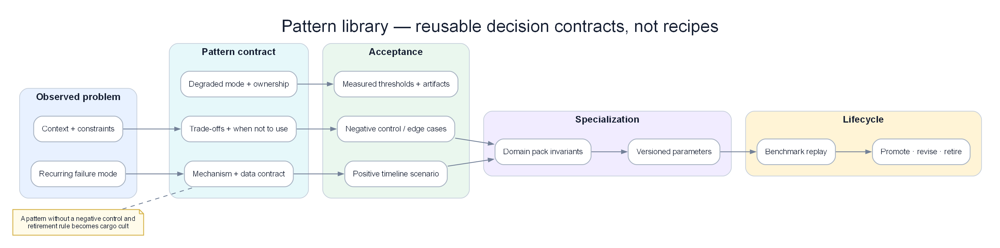

# Chapter 15 — AIOps Pattern Library: chọn pattern theo lực tác động, không theo tên công ty

> **Pattern library không phải bộ sưu tập logo Big Tech. Mỗi pattern trong chapter này là một quyết định kiến trúc tái sử dụng được: nêu vấn đề, lực tác động, điều kiện dùng, dữ liệu cần có, trade-off, failure mode và bài acceptance. Hãy chọn pattern theo quy mô, topology, độ trưởng thành và hậu quả khi sai; không copy một hệ thống được thiết kế cho tổ chức lớn hơn mình hàng trăm lần.**

*Poster: một pattern chỉ được giữ lại khi có context, negative control, degraded mode, acceptance và điều kiện retire.*

---

## 1. Pattern library giải quyết vấn đề gì?

Các chapter trước xây từng năng lực: telemetry, detection, correlation, RCA, investigation, remediation và production operations. Khi áp dụng thực tế, đội kỹ thuật không hỏi “nên dùng công cụ nào?” mà hỏi:

- Incident kéo dài bị detector tự nuốt thì ghép pattern nào?
- Alert storm gồm root cause và hàng trăm downstream symptom thì tách thế nào?
- Topology stale thì engine nên giảm cấp hay vẫn tự động?
- RCA đúng nhưng action có blast radius lớn thì chặn ở đâu?
- AIOps phụ thuộc chính Kafka/OTel đang hỏng thì còn đường nào để page?

Pattern library biến các câu trả lời thành đơn vị thiết kế có hợp đồng. Một pattern không phải chân lý phổ quát. Nó chỉ đúng khi context và forces khớp.

### 1.1 Pattern khác best practice

“Luôn dùng tracing” là khẩu hiệu. Một pattern đầy đủ phải nói tracing giúp phân biệt điểm phát sinh lỗi với nơi nhìn thấy lỗi, nhưng độ tin cậy giảm khi sampling, clock skew hoặc propagation hỏng; lúc đó engine cần degrade sang metric/log evidence.

### 1.2 Pattern khác sản phẩm

“Dùng hệ thống X” không mô tả semantics. Hai sản phẩm cùng tên anomaly detection có thể khác hoàn toàn về baseline freeze, incident state và missing-data handling. Pattern mô tả hành vi cần giữ dù implementation thay đổi.

### 1.3 Pattern khác kiến trúc tham khảo

Kiến trúc tham khảo cho thấy thành phần. Pattern giải thích quyết định dưới áp lực: tại sao state phải tách theo service, vì sao action phải có revision, điều gì xảy ra khi dependency hỏng.

---

## 2. Cách đọc một pattern card

Mọi pattern trong chapter dùng cùng cấu trúc.

| Mục | Câu hỏi bắt buộc |
|---|---|
| Problem | Failure cụ thể nào đang xảy ra? |
| Context | Quy mô, topology, domain và maturity nào? |
| Forces | Những mục tiêu nào kéo ngược nhau? |
| Decision | State, boundary hoặc rule nào được áp dụng? |
| Inputs | Dữ liệu nào phải có và độ mới ra sao? |
| Outputs | Hệ thống tạo decision/event gì? |
| Worked case | Với một dãy số/timeline thật, pattern thay đổi kết quả thế nào? |
| Failure modes | Khi nào pattern tạo hại hoặc kết luận sai? |
| Do not use | Điều kiện nào khiến nên chọn cách đơn giản hơn? |
| Acceptance | Bài replay/failure injection nào chứng minh pattern hoạt động? |

Không có acceptance thì đó mới là ý tưởng, chưa phải pattern production.

---

## 3. Bản đồ chọn pattern

| Pain đang gặp | Pattern chính | Pattern đi kèm |
|---|---|---|
| Incident dài có khoảng câm | Freeze-on-alert baseline | Multi-window burn rate, durable incident state |
| Traffic hợp lệ đổi gây báo giả | Regime-aware baseline | Change/campaign context |
| Fault thứ hai bị incident đầu che | Fault-partitioned state | Resource-scoped coordination |
| Alert storm theo cascade | Topology-aware correlation | Symptom compression |
| Deploy gần nhất luôn bị đổ lỗi | Temporal causality + negative evidence | Cohort/control comparison |
| RCA chỉ dựa một nguồn | Multi-signal evidence | Evidence provenance |
| Agent query vô hạn | Hypothesis ledger | Information-gain budget |
| Model chạm production trực tiếp | Bounded tool broker | Independent safety controller |
| Remediation “xanh giả” | Canary + control verification | Outcome/mechanism/harm triad |
| Worker restart làm page/action trùng | Event-sourced incident state | Idempotency + replay convergence |
| Model mới gây alert storm | Shadow + progressive rollout | Versioned evaluation slices |
| AIOps mù khi platform hỏng | Independent safety plane | Explicit degraded modes |

---

## 4. Pattern 1 — Freeze-on-alert baseline

### Problem

Rolling baseline tiếp tục học trong lúc anomaly kéo dài. Sau một thời gian, lỗi trở thành “normal mới”, detector im lặng dù khách hàng còn chịu lỗi.

### Context và forces

Pattern phù hợp với signal có baseline học online như latency, error rate, throughput hoặc queue depth. Hai lực kéo ngược nhau:

- Freeze để không nuốt anomaly.
- Vẫn cần thích nghi với thay đổi tải hợp lệ theo giờ.

### Decision

Freeze baseline theo `service × signal × regime` khi alert chuyển Firing. Incident state vẫn cập nhật; chỉ learning state bị giữ. Dùng baseline trước incident hoặc cohort khỏe để tiếp tục đánh giá. Unfreeze sau recovery có hold window và kiểm tra contamination.

### Worked case

Error rate payment mỗi 5 phút:

0,7%; 0,8%; 0,6%; 12%; 21%; 25%; 24%; 23%; 25%; 24%; 22%; 8%; 1,2%.

Rolling median/MAD không freeze sẽ đưa median lên vùng 23–24%, khiến anomaly score giảm giữa incident. Freeze giữ median quanh 0,7%. Alert vẫn Firing từ 12% đến 8%; 1,2% chưa resolve ngay vì burn-rate cửa sổ chậm còn cao.

### Failure modes

- Freeze toàn nền tảng làm service khỏe không học được daily regime và tạo false alert.
- Unfreeze ngay tại điểm recovery đưa tail anomaly vào baseline.
- Incident ID bị recreate khi worker restart làm baseline freeze mất liên kết.

### Do not use

Không cần cho rule deterministic không học baseline. Với metric thay đổi regime liên tục mà không có context, nên dùng static SLO safety rule song song.

### Acceptance

Replay sự cố 65 phút. Yêu cầu không có khoảng câm quá hai phút, baseline không tăng theo anomaly, recovery chỉ xảy ra sau fast/slow window, và service control vẫn thích nghi với traffic theo giờ.

---

## 5. Pattern 2 — Multi-window burn-rate guard

### Problem

Cửa sổ ngắn phản ứng nhanh nhưng nhiễu; cửa sổ dài ổn định nhưng phát hiện chậm. Một threshold đơn không phân biệt spike vài phút với budget burn kéo dài.

### Decision

Dùng ít nhất hai cửa sổ cho cùng customer SLO:

- Fast window phát hiện tăng đột ngột và harm sau action.
- Slow window xác nhận incident bền và điều kiện resolve.

Decision dựa trên cả burn magnitude và duration; missing data không được coi là burn bằng zero.

### Worked case

Checkout SLO 99,9%. Error 20% trong 3 phút tạo burn rất cao ở cửa sổ 5 phút nhưng chưa đủ slow-window evidence. Error 4% kéo dài 60 phút có fast burn thấp hơn nhưng đốt budget lớn hơn. Hệ thống page cả hai theo policy khác nhau; spike nhanh ưu tiên verify data, incident dài giữ Firing tới khi slow window hạ.

### Failure modes

- Dùng cùng threshold cho mọi service tier.
- Resolve theo fast window dù slow window còn cháy.
- Ratio đẹp do traffic denominator tụt mạnh.

### Acceptance

Replay spike hợp lệ, outage kéo dài và traffic collapse. Đo time-to-detect, false page và time-to-resolve; không cho success ratio che successful-request count.

---

## 6. Pattern 3 — Regime-aware baseline

### Problem

Traffic flash sale, lương về, batch cuối ngày hoặc campaign hợp lệ làm baseline theo giờ không còn đúng. Detector báo giả hoặc freeze nhầm một regime mới.

### Decision

Baseline có nhãn regime từ calendar, campaign, release, tenant mix và capacity state. Regime mới chưa có lịch sử dùng SLO/static safety và confidence thấp; chỉ promote thành normal sau human/change acceptance và customer outcome khỏe.

### Worked case

Traffic checkout bình thường 8.000 request/phút, 20:00 tăng lên 30.000 do flash sale. Latency từ 240 lên 330 ms nhưng success giữ 99,2%, queue ổn và campaign flag hợp lệ. Volume anomaly được suppress thành contextual event. Nếu success giảm còn 91%, campaign không được dùng để suppress customer-impact alert.

### Failure modes

- Campaign flag bị dùng như giấy phép tắt alert.
- Regime label đến trễ hoặc sai tenant.
- Quá nhiều regime làm baseline mỗi nhóm thiếu dữ liệu.

### Acceptance

Replay hai timeline cùng traffic: một campaign khỏe và một overload thật. Hệ thống không page trường hợp đầu nhưng page trường hợp sau trong deadline.

---

## 7. Pattern 4 — Fault-partitioned incident state

### Problem

Incident đầu còn active làm suppression/correlation state quá rộng; fault mới ở service khác bị merge hoặc bỏ lọt.

### Decision

State tách theo fault candidate, customer journey, service boundary và temporal signature. Một parent event có thể liên kết các incident concurrent, nhưng mỗi incident có lifecycle, baseline freeze, evidence, query budget và action lock riêng.

### Worked case

Payment lỗi từ 10:00. Auth certificate lỗi lúc 10:37. Payment ảnh hưởng checkout, auth ảnh hưởng login; mechanism, owner và write set khác nhau. Engine tạo `INC-8421` và `INC-8422`, liên kết là concurrent. Proposal restart shared gateway bị conflict, nhưng giảm retry payment và rotate auth certificate vẫn được đánh giá riêng.

### Failure modes

- Partition quá nhỏ tạo một incident cho từng pod.
- Partition quá lớn merge mọi alert cùng region.
- Incident mới kế thừa confidence/memory của incident cũ.

### Acceptance

Inject fault B ở phút 37 của fault A kéo dài 65 phút. B phải page theo SLO riêng; A không reset ID; hai evidence ledger không trộn.

---

## 8. Pattern 5 — Topology-aware correlation với stale-graph degrade

### Problem

Alert storm ở downstream tạo hàng trăm triệu chứng. Correlation theo thời gian gom sai những service không liên quan; graph stale lại tạo confidence giả.

### Decision

Dùng dependency graph để kiểm tra propagation path và downstream reach, nhưng mọi quyết định mang graph revision, age và coverage. Khi graph stale, giảm topology weight, mở rộng uncertainty và cấm remediation chạm shared dependency.

### Worked case

Payment pool wait tăng trước checkout, gateway và notification errors. Graph cho thấy payment nằm upstream của checkout symptom và downstream reach lớn. Catalog deploy cùng phút nhưng không nằm trên path nên bị loại. Nếu graph 35 phút tuổi và vừa có routing change, RCA chỉ ghi candidate, không kết luận mạnh.

### Failure modes

- CMDB có service node nhưng thiếu runtime edge.
- Async queue khiến temporal window dài hơn synchronous call.
- Fan-in dependency chung bị nhầm thành hai incident độc lập.

### Acceptance

Replay graph đúng, thiếu một edge và stale revision. Ranking phải degrade có kiểm soát; không auto-action trong case graph không đủ trust.

---

## 9. Pattern 6 — Symptom compression, không xóa evidence

### Problem

Một root cause làm 500 alert downstream. Gửi tất cả làm on-call tê liệt; suppress cứng lại có thể che fault mới.

### Decision

Nén symptom thành một incident view nhưng giữ member event, count, scope và change delta. Update lặp không page lại; signature mới hoặc fault partition mới vẫn được đánh giá.

### Worked case

100 payment timeout events cùng signature trở thành một incident update. Một auth TLS signature mới không nằm trong suppression key nên tạo incident riêng. Operator thấy “100 duplicate symptoms compressed” thay vì mất hoàn toàn dữ liệu.

### Failure modes

- Dedup key chỉ dùng service name nên xóa signature mới.
- Suppression TTL dài hơn incident lifecycle.
- Không lưu member provenance khiến RCA không tái tạo được.

### Acceptance

Inject 100 duplicate, một same-service new signature và một other-service fault. Kỳ vọng 100 update bị nén, hai candidate mới vẫn xuất hiện.

---

## 10. Pattern 7 — Temporal causality + negative evidence

### Problem

Engine đổ lỗi service đỏ nhất hoặc deploy gần nhất. Correlation bị trình bày như causation.

### Decision

Xếp event theo event-time đã hiệu chỉnh skew; kiểm tra cause phải xảy ra trước effect, nằm trên path và khớp cohort. Bắt buộc tìm negative evidence/control trước khi nâng confidence.

### Worked case

Retry tăng 09:59:40, pool wait 10:00:10, timeout 10:01:50, checkout error 10:02:30, DB CPU 10:05. DB CPU nhiều khả năng là hậu quả. Catalog deploy 09:57 xảy ra trước nhưng không có path/cohort match. Fraud dùng cùng DB cluster vẫn khỏe là negative evidence chống database-wide failure.

### Failure modes

- Processing-time bị dùng khi Kafka lag.
- Clock skew làm đảo thứ tự.
- “Đỏ trước” nhưng chỉ là leading indicator, không có mechanism.

### Acceptance

Replay một deploy vô tội, một deploy thật, event trễ 11 phút và host lệch clock. Root-cause ranking phải đúng theo event-time và hạ confidence khi skew không giải được.

---

## 11. Pattern 8 — Multi-signal evidence contract

### Problem

Metric, log, trace và change có semantic khác nhau nhưng bị cộng điểm như các lá phiếu độc lập. Source duplication tạo confidence giả.

### Decision

Mỗi fact có provenance, scope, freshness, coverage và transformation. Signal được dùng theo vai trò:

- Metrics đo impact, trend và saturation.
- Traces đo propagation và span timing.
- Logs cho signature, reason và discrete state.
- Changes sinh candidate và cohort.
- Topology giới hạn causal path.

Evidence phụ thuộc cùng source không được tính như độc lập.

### Worked case

Payment timeout metric 24,9%, log timeout chỉ 8% vì rate limit, trace coverage 94%. Engine không bỏ phiếu “2 chống 1”; nó giải thích denominator và sampling. Pool-acquire span 1.920 ms trong khi query span 103 ms giúp định vị client pool thay vì database execution.

### Failure modes

- Missing trace bị coi là trace khỏe.
- Log volume tăng do retry được hiểu là user count.
- Metric và alert rule cùng nguồn bị tính hai bằng chứng.

### Acceptance

Replay source mất 35%, duplicate logs và metric denominator đổi. Conclusion phải ghi coverage và không tăng confidence vì duplicate source.

---

## 12. Pattern 9 — Hypothesis ledger + information-gain budget

### Problem

Agent chốt sớm một lời giải hoặc gọi tool vô hạn để “tìm thêm”. Narrative trôi chảy che contradiction.

### Decision

Giữ nhiều hypothesis với evidence ủng hộ/phản bác, open question và state. Chọn query có khả năng đảo ranking hoặc decision. Mỗi incident có budget thời gian, query, byte và token; có stopping rule và abstention.

### Worked case

Giữa retry-induced pool exhaustion và database-wide failure, query thêm 10.000 log ít giá trị. So request retry/first-attempt và control service dùng cùng DB có information gain cao. Kết quả retry cohort wait 2.120 ms, first-attempt 380 ms, Fraud success 99,4% làm H1 mạnh và H2 yếu.

### Failure modes

- Xóa hypothesis yếu nên không thể phục hồi khi event đến muộn.
- Query budget toàn tenant làm incident thứ hai không còn quota.
- Confidence do LLM tự viết, không calibration.

### Acceptance

Đo top-3 accuracy, contradiction recall, query efficiency và abstention quality trên replay có evidence thiếu/trễ.

---

## 13. Pattern 10 — Bounded tool broker

### Problem

Model có credential trực tiếp có thể query quá rộng, rò dữ liệu, bị prompt injection hoặc mutation production trong bước “điều tra”.

### Decision

Tách model khỏi tools. Broker validate schema, tenant, service, time window, cost, redaction và policy. Investigation broker read-only; mutation chỉ đi qua Safety Engine với catalog action.

### Worked case

Một log chứa instruction yêu cầu bỏ policy và đọc secret. Broker coi log là data, không instruction; query cross-tenant bị từ chối; output chỉ có evidence artifact. LLM không có credential executor nên injection không thể biến thành action.

### Failure modes

- Allowlist tool nhưng argument không giới hạn.
- Broker trả raw payload chứa PII vào context.
- “Bật debug để xem” được coi read-only dù làm đổi production.

### Acceptance

Prompt/data injection suite phải có zero scope escalation, zero secret leakage và zero freeform mutation.

---

## 14. Pattern 11 — Independent remediation safety controller

### Problem

RCA hoặc agent vừa đề xuất vừa tự thực thi. Confidence bị dùng thay cho risk, policy và blast radius.

### Decision

Tách proposal, policy decision, approval, resource coordination, bounded executor, verifier, audit và kill switch. Hard gate không được bù bằng confidence.

### Worked case

RCA confidence 0,86 nói pool exhaustion. Proposal tăng pool 80→160 bị reject vì 40 instance có thể thêm 3.200 connections trong khi DB chỉ còn 900 headroom. Proposal giảm retry được canary 5% với TTL và control.

### Failure modes

- Catalog action vẫn có selector rộng.
- Approval cũ dùng cho incident revision mới.
- Audit/verifier hỏng nhưng action vẫn chạy.

### Acceptance

Stale action, invalid target, audit outage và shared-invariant violation đều phải fail closed; detection vẫn hoạt động.

---

## 15. Pattern 12 — Canary + control + verified recovery

### Problem

Metric tốt lên sau action bị coi là causal success, dù traffic tự giảm hoặc dependency tự hồi.

### Decision

Canary đủ mẫu, control cohort tương đương, và ba tầng verification:

- Customer outcome.
- Mechanism signal.
- Harm guardrail.

Mỗi expansion là decision mới; partial success không đóng incident.

### Worked case

Canary retry 1 tăng success từ 71,8% lên 91,2%; control retry 3 chỉ tăng 71,5% lên 74,0%. Retry amplification và pool wait giảm, DB CPU không tăng. Action có effect nhưng recovery target 98,5% chưa đạt, nên trạng thái là Partial Success.

### Failure modes

- Canary quá nhỏ không đủ mẫu.
- Cohort khác tenant mix.
- Ratio đẹp do volume sụt.
- Guardrail missing được coi là zero harm.

### Acceptance

Replay traffic recovery tự nhiên, metric missing, delayed harm và regional partial recovery. Không được false success hoặc expand khi verifier mất.

---

## 16. Pattern 13 — Event-sourced incident state + replay convergence

### Problem

Worker restart hoặc region fail làm incident mất memory, page lại, chạy action trùng hoặc unfreeze baseline sai.

### Decision

Incident identity, lifecycle, baseline state, watermark, correlation membership, evidence ledger, action state và notification được checkpoint từ append-only events. Recovery replay phải hội tụ về cùng decision semantics.

### Worked case

Worker chết 10:52, checkpoint 10:50, log giữ từ 10:45. Replay 10:50–10:52 không tạo incident ID mới, không page lại và không chạy canary lần hai. Evidence đến muộn có thể tăng revision nhưng không thay identity.

### Failure modes

- Chỉ checkpoint model state, không checkpoint suppression/action.
- Replay dùng processing-time nên đổi causal order.
- Idempotency key không gắn incident revision.

### Acceptance

So continuous run và recovery run event-by-event. Cho phép timestamp xử lý khác; incident/action outcome, count và identity phải giống.

---

## 17. Pattern 14 — Shadow, canary và progressive rollout cho decision logic

### Problem

Rule, model, feature hoặc prompt mới có blast radius toàn fleet dù không “deploy application”. Offline average đẹp nhưng một telemetry slice thất bại.

### Decision

Rollout theo chuỗi offline replay → shadow → canary service/tenant → progressive rollout. Artifact version gắn feature schema, calibration dataset, graph assumptions và rollback target.

### Worked case

RCA model mới tăng Top-1 trung bình 62%→69%, nhưng slice trace coverage dưới 50% giảm 48%→35%. Model chỉ canary trên service coverage cao; missing-trace slice giữ incumbent. Average không được bù hard regression.

### Failure modes

- Rollback model nhưng giữ feature transform mới.
- Shadow chỉ đo agreement, không đo outcome.
- Canary tenant quá dễ.

### Acceptance

Mọi revision phải pass hard gates theo slice, không chỉ weighted score; rollback được diễn tập trước 100% rollout.

---

## 18. Pattern 15 — Independent safety plane và explicit degraded modes

### Problem

AIOps phụ thuộc cùng telemetry, queue, DNS hoặc IAM với hệ thống đang hỏng. Mọi dashboard im lặng tạo health giả; remediation tiếp tục khi audit/verifier mất.

### Decision

Có safety plane tối thiểu độc lập: external heartbeat, queue-age probe, alternate notification, break-glass read path, kill switch. Production engine có các mode Healthy, Degraded Context, Detection Only, Human Only và Recovery.

### Worked case

OTel mất 35% span: Degraded Context, RCA confidence giảm. Kafka lag 11 phút: event-time processing, stale action bị cấm. Audit sink hỏng: Detection Only, không action mới. LLM hỏng: raw evidence vẫn page.

### Failure modes

- Safety plane đi cùng Kafka/IAM chính.
- Auto-return Healthy chỉ vì pod xanh.
- Degraded mode toàn cục dù chỉ một tenant lỗi.

### Acceptance

Kill từng dependency và xác nhận đúng mode, đúng forbidden action, incident continuity và route page độc lập.

---

## 19. Pattern 16 — Human command và calibrated handoff

### Problem

Automation tạo nhiều output nhưng không giúp incident commander quyết định; ownership mơ hồ, approval fatigue và handoff mất context.

### Decision

Brief có customer impact, leading/alternative hypothesis, contradiction, uncertainty, action scope, success/abort và owner. Handoff giữ incident revision và query history. Máy không tự nhận vai incident commander.

### Worked case

Payment chỉ hồi 91,2%, auth vừa lỗi, trace coverage giảm. Brief nói rõ hai incident, payment Partial Success, auth certificate candidate, shared gateway conflict và AIOps đang Degraded Context. Commander có thể ưu tiên login recovery mà không hiểu nhầm payment đã đóng.

### Failure modes

- Report dài nhưng không có decision delta.
- Approval UI không khóa revision stale.
- Feedback chỉ thumbs-up/down, không reason.

### Acceptance

Trong game day, on-call phải xác định impact, uncertainty, action đang chạy và owner trong dưới hai phút mà không mở raw dashboard.

---

## 20. Pattern composition: ghép đúng thứ tự

Pattern độc lập nhưng production value đến từ composition.

### 20.1 Long-incident detection stack

Regime-aware baseline → Freeze-on-alert → Multi-window burn → Fault-partitioned state → Event-sourced recovery.

Thiếu event-sourced state, restart có thể unfreeze baseline. Thiếu regime context, freeze giữ một false positive quá lâu.

### 20.2 Causal diagnosis stack

Topology correlation → Temporal causality → Multi-signal evidence → Hypothesis ledger → Bounded tool broker.

Thiếu negative evidence, deploy gần nhất thắng. Thiếu provenance, investigation report không kiểm toán được.

### 20.3 Safe remediation stack

Independent safety controller → Resource coordination → Canary/control → Verified recovery → Independent kill switch.

Chỉ có executor và rollback chưa phải closed loop.

### 20.4 Self-protecting production stack

Event-sourced state → Progressive decision rollout → Explicit degraded modes → Safety plane → Human command.

Mục tiêu là khi “AI” hỏng, hệ thống vẫn phát hiện, giữ state và biết không hành động.

---

## 21. Anti-pattern library

| Anti-pattern | Vì sao hấp dẫn | Vì sao thất bại |
|---|---|---|
| Tool-first architecture | Demo nhanh | Không có decision contract |
| One anomaly model for all | Dễ vận hành | Trộn regime và service semantics |
| Correlation by time only | Không cần topology | Merge concurrent fault |
| Latest deploy is root cause | Dễ giải thích | Tương quan không có path/cohort |
| LLM as orchestrator with admin | Linh hoạt | Injection và blast radius |
| Confidence threshold remediation | Một con số đơn giản | Bỏ qua impact/irreversibility |
| Global remediation lock | Tránh conflict | Chặn incident độc lập |
| Rollback equals safety | Có đường quay lại | Rollback có thể fail/gây storm |
| Component uptime SLO | Dễ đo | Không chứng minh operator outcome |
| Average benchmark score | Dễ báo cáo | Che failure slice nguy hiểm |

---

## 22. Chọn pattern theo quy mô tổ chức

### Đội khoảng 10 kỹ sư

Ưu tiên:

- Customer SLO + multi-window burn.
- Freeze-on-alert cho vài signal quan trọng.
- Correlation theo service graph nhỏ và change events.
- Human-owned hypothesis ledger.
- Catalog 3–5 action an toàn, chưa auto-expand.
- Golden replay nhỏ nhưng chạy được.

Không cần feature store, graph ML hay multi-agent platform.

### Tổ chức khoảng 100 kỹ sư

Thêm:

- Durable incident state và replay.
- Fault partition, topology freshness và change bus.
- Tool broker, evidence provenance và calibrated RCA.
- Human-approved canary, verifier và audit.
- Shadow/canary cho model/rule.
- Domain packs theo money/search/data.

### Tổ chức khoảng 1.000 kỹ sư trở lên

Thêm khi có nhu cầu:

- Multi-tenant isolation và federated ownership.
- Graph scale/streaming context.
- Per-slice calibration và policy federation.
- Independent regional safety plane.
- Dataset governance, benchmark registry và model risk management.
- Self-service pattern adoption với conformance tests.

Quy mô không tự động biện minh độ phức tạp. Chỉ thêm capability khi pain và acceptance chứng minh ROI.

---

## 23. Pattern adoption record

Mỗi lần chọn pattern, đội ghi một decision record ngắn:

| Trường | Nội dung |
|---|---|
| Pain | Failure hiện tại bằng số |
| Context | Service tier, traffic, topology, domain |
| Pattern | Pattern và version semantics |
| Alternatives | Cách đơn giản hơn đã cân nhắc |
| Expected effect | Metric/outcome cần đổi |
| New risks | State, cost, false decision, security |
| Acceptance | Replay/failure injection sẽ chạy |
| Owner/expiry | Ai chịu trách nhiệm và khi nào review |

Nếu không mô tả được pain bằng evidence, chưa nên thêm platform component.

---

## 24. Acceptance cho Pattern Library

Pattern Library đạt mục tiêu khi:

- Mỗi pattern có problem, context, forces và do-not-use.
- Có worked case bằng số, không chỉ lợi ích chung.
- Failure mode của chính pattern được nêu.
- Acceptance test tái tạo được.
- Pattern không gắn bắt buộc với một vendor/tool.
- Pattern composition chỉ rõ dependency giữa state, decision và safety.
- Người đọc chọn được subset theo quy mô thay vì copy toàn bộ.
- Domain Packs ở Chapter 16 có thể tham chiếu pattern bằng tên ổn định.
- Benchmark Replay ở Chapter 17 có scenario chứng minh từng pattern.

Chapter này dùng [Acceptance Template chung](../acceptance-template.vi.md) làm rubric canonical.

---

## Kết luận

Big Tech đáng học không phải vì họ dùng một tên công nghệ đặc biệt, mà vì nhiều hệ thống lớn hội tụ vào các lực giống nhau: state phải bền, causality phải có negative evidence, automation phải bị giới hạn, rollout decision phải như rollout code và AIOps phải có đường sống khi dependency chính hỏng.

Pattern Library biến những bài học đó thành lựa chọn có điều kiện. Chapter tiếp theo không hỏi “công ty nào làm gì”, mà đóng gói các pattern theo hậu quả nghiệp vụ của e-commerce, banking và payment.

## Đọc tiếp

- [16 — Domain Packs](../16-aiops-domain-packs/README.vi.md)
- [17 — Benchmark Replay](../17-aiops-benchmark-replay/README.vi.md)
- [Acceptance Template chung](../acceptance-template.vi.md)

--8<-- "docs/includes/acceptance-footer.vi.md"
