# Chapter 15 — AIOps cho E-commerce, Banking & Fintech

> **Chương này áp dụng toàn bộ stack AIOps (observability → anomaly → correlation → RCA → remediation) vào các domain có ràng buộc tiền thật: e-commerce peak traffic, core banking / payment rails, và fintech kiểu PSP. Khác với SaaS thuần, ở đây một quyết định tự động sai có thể double-charge khách hàng, oversell tồn kho, hoặc vi phạm audit trail. Tư duy cốt lõi: reliability engineering cho money paths, không chỉ cho HTTP 200.**

---

## Prerequisites

- [00 — Introduction to AIOps](../00-introduction.vi.md) — triết lý, maturity levels, error budget tư duy
- [01 — Observability](../01-observability/README.vi.md) — SLI/SLO, RED/USE, cardinality
- [07 — Anomaly Detection](../08-anomaly-detection/README.vi.md) — baseline theo mùa, false positive
- [08 — Alert Correlation](../09-alert-correlation/README.vi.md) — topology correlation, alert storm
- [11 — Remediation](../12-remediation/README.vi.md) — safety gate, blast radius, audit
- [12 — Production Operations](../13-production/README.vi.md) — DR, cost, security hardening

## Related Documents

- [02 — OpenTelemetry](../02-opentelemetry/README.vi.md) — trace critical payment path
- [03 — Prometheus](../03-prometheus/README.vi.md) — business SLI, recording rules
- [04 — Loki](../04-loki/README.vi.md) — log redaction, retention có kiểm soát
- [05 — Tempo](../05-tempo/README.vi.md) — latency budget authorization path
- [06 — Kafka](../07-kafka/README.vi.md) — event pipeline cart/payment, outbox, exactly-once effect
- [09 — Root Cause Analysis](../10-root-cause-analysis/README.vi.md) — dependency graph payment rails
- [10 — LLM Agent](../11-llm-agent/README.vi.md) — investigation có guardrail compliance
- [13 — BigTech AIOps Patterns](../14-bigtech-aiops/README.vi.md) — scale patterns tham chiếu

## Next Reading

Sau chương này, chuyển sang [15 — Famous Incidents](../16-famous-incidents/README.vi.md) để drill các sự cố công khai với góc nhìn money-path. Có thể quay lại [12 — Production](../13-production/README.vi.md) hoặc [11 — Remediation](../12-remediation/README.vi.md) để siết safety matrix.

---

## Table of Contents

1. [Domain constraints khác nhau](#1-domain-constraints-khác-nhau)
2. [E-commerce reliability patterns](#2-e-commerce-reliability-patterns)
3. [Banking & core payment systems](#3-banking--core-payment-systems)
4. [Fintech / payment processors](#4-fintech--payment-processors)
5. [Observability design cho transaction paths](#5-observability-design-cho-transaction-paths)
6. [Anomaly detection đặc thù](#6-anomaly-detection-đặc-thù)
7. [Alert correlation trong checkout storms](#7-alert-correlation-trong-checkout-storms)
8. [Automated remediation: CAN và CANNOT](#8-automated-remediation-can-và-cannot)
9. [Multi-region / active-active for money systems](#9-multi-region--active-active-for-money-systems)
10. [Case study A: flash sale collapse](#10-case-study-a-flash-sale-collapse)
11. [Case study B: bank batch job overruns morning open](#11-case-study-b-bank-batch-job-overruns-morning-open)
12. [Case study C: card network degradation partial](#12-case-study-c-card-network-degradation-partial)
13. [Cost of observability in regulated env](#13-cost-of-observability-in-regulated-env)
14. [Production checklist + 90-day roadmap](#14-production-checklist--90-day-roadmap)
15. [Socratic exercises](#15-socratic-exercises)

---

## 1. Domain constraints khác nhau

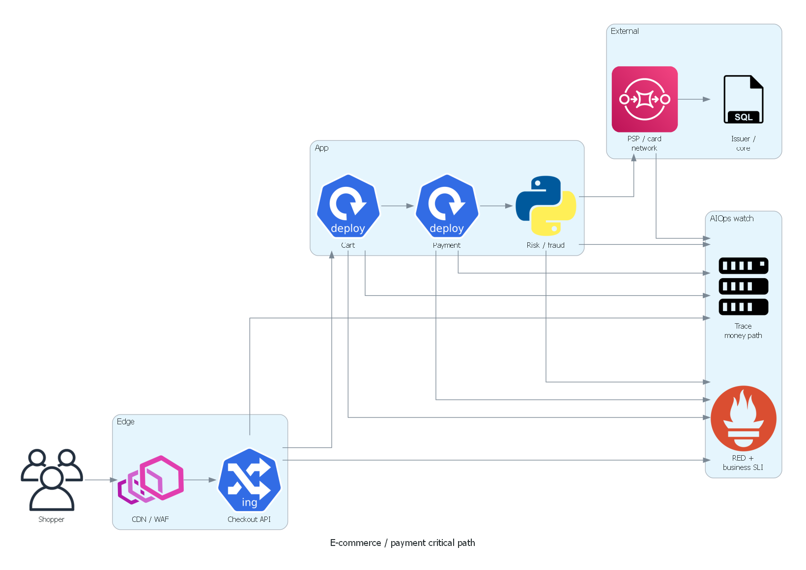

*Poster: shopper → checkout → risk → PSP → issuer, với RED + business SLI + money-path traces.*

> [!NOTE]
> **Ý TƯỞNG**
> AIOps không “một size fits all”. Cùng một pipeline correlation/RCA, nhưng **ràng buộc domain** quyết định: SLI nào là hard, remediation nào bị cấm, baseline nào phải calendar-aware, và audit trail phải giữ bao lâu. E-commerce chịu peak; banking chịu always-on + compliance; pure SaaS chịu tenant isolation. Nhầm domain constraint = thiết kế safety gate sai.

> [!TIP]
> **Vì sao bắt đầu bằng bảng constraint?**
> Trước khi copy pattern từ Netflix/Google, hãy hỏi: “Money path này fail theo kiểu gì, và ai sẽ bị phạt?”. Pattern scale pods an toàn ở SaaS có thể là unsafe ở banking nếu action đó đụng risk rule engine.

### 1.1 Bảng so sánh constraint cốt lõi

| Constraint | E-commerce | Banking / Core Payment | Pure SaaS |
|---|---|---|---|
| **Availability shape** | Peak events (BFCM, 11.11, Tết, flash sale) | Always-on 24/7, kể cả lễ | Bias giờ hành chính / business hours |
| **Consistency** | Eventual OK cho catalog, search, recommendation | **Strong** cho ledger, balance, postings | Depends (thường eventual cho analytics) |
| **Compliance** | PCI-DSS partial (nếu touch PAN), PDPA/GDPR | PCI-DSS, Basel, circulars NHNN, SOC2, audit | SOC2, đôi khi ISO 27001 |
| **Blast radius quan trọng** | Cart, checkout, inventory, payment | Payment rails, core banking, settlement | Tenant isolation, noisy neighbor |
| **Cost of false positive auto-action** | Lost GMV, bad UX | Regulatory finding, money movement sai | Churn, SLA credit |
| **Change velocity** | Cao (campaign, pricing, A/B) | Thấp, change window, four-eyes | Trung bình–cao |
| **Human in the loop** | Thường cho money reverse | **Bắt buộc** cho hầu hết money actions | Optional theo risk |
| **Data residency** | Tùy thị trường | Thường hard (onshore / approved region) | Tùy contract |
| **DR objective** | RTO ngắn cho storefront; RPO lỏng hơn catalog | RTO/RPO rất chặt cho ledger | Theo tier khách |

### 1.2 Availability: peak vs always-on vs business-hours

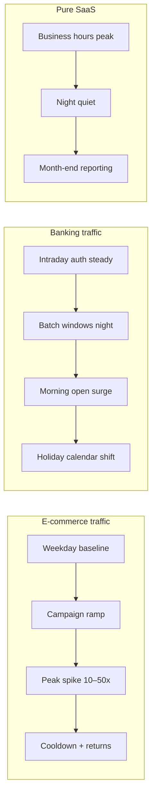

**Hệ quả AIOps:**

| Domain | Baseline model | Error budget mindset |
|---|---|---|
| E-commerce | Seasonal + campaign calendar | “Burn budget nhanh trong 4 giờ peak vẫn có thể OK nếu GMV giữ” |
| Banking | Intraday + holiday + batch schedule | “Không có ‘peak exception’ cho authorization path” |
| Pure SaaS | Weekly seasonality | “Downtime ngoài giờ ít đắt hơn, nhưng enterprise SLA vẫn siết” |

> [!IMPORTANT]
> **Không train anomaly model trên “một năm phẳng” rồi dùng cho BFCM.**
> Model sẽ coi traffic hợp lệ là anomaly → page on-call → on-call ignore → khi sự cố thật xảy ra trong peak, signal đã chết. Xem [07 — Anomaly Detection](../08-anomaly-detection/README.vi.md).

### 1.3 Consistency: catalog eventual vs ledger strong

- **Catalog / search / PDP**: stale 30–120s thường chấp nhận được; AIOps ưu tiên availability và cache resilience.
- **Inventory reservation**: cần **business-level correctness** (không oversell), dù backend có thể dùng reservation TTL + compensation.
- **Payment authorization & ledger postings**: cần **strong consistency / carefully designed saga**. “Eventual” không phải là excuse để double-post.

> [!WARNING]
> **Edge case**: Hiển thị “còn hàng” (eventual inventory) trong khi reservation đã cạn → flash sale oversell. Đây không chỉ là bug UX; nó tạo storm refund + support + payment reverse — tức là incident tiền thật.

### 1.4 Compliance surface

| Control area | E-commerce | Banking | Implication cho AIOps |
|---|---|---|---|
| Card data (PAN) | Tokenization / PSP-hosted fields | Thường strict PCI scope | Log redaction bắt buộc; không để AI ingest raw PAN |
| Dual control | Hiếm | Thường xuyên (four-eyes) | Auto-remediation bị chặn theo policy |
| Audit trail | Business analytics + security | Regulatory evidence | Mọi action tự động phải immutable log |
| Data retention | Cost-driven | Regulator-driven (thường dài hơn) | Cost observability tăng; sampling strategy khác |
| Cross-border transfer of logs | Flexible hơn | Restricted | Architecture multi-region + residency |

### 1.5 Blast radius mental model

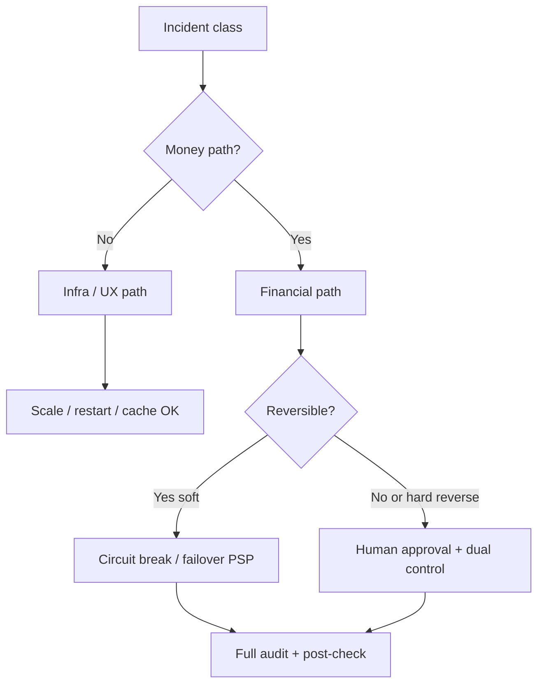

**Quy tắc Principal SRE:** map mọi alert class vào một trong bốn bucket blast radius trước khi gắn remediation:

1. **Read-only / UX** — an toàn auto
2. **Capacity / traffic shaping** — auto với guardrail
3. **Money movement adjacent** (circuit, routing) — auto có điều kiện
4. **Money movement / risk / account state** — human-only

### 1.6 Checklist: domain intake trước khi “bật AIOps”

- [ ] Money path nào là P0 tuyệt đối (auth, capture, settle, refund, transfer)?
- [ ] Peak calendar 12 tháng tới đã được encode chưa?
- [ ] Compliance owner đã ký whitelist remediation chưa?
- [ ] Log/metric có chạm PAN/PII không — redaction ở đâu?
- [ ] Reconciliation signal có vào observability không, hay chỉ nằm ở finance ops?
- [ ] Error budget policy có tách “storefront” vs “payment rails” không?

---

## 2. E-commerce reliability patterns

> [!NOTE]
> **Ý TƯỞNG**
> E-commerce reliability không phải “uptime homepage”. Khách hàng chịu được trang chủ chậm 1 giây; họ không chịu được **checkout fail** hoặc **thanh toán thành công nhưng order mất**. AIOps phải ưu tiên pipeline: **Cart → Inventory → Payment → Fulfillment**, và hiểu shape traffic theo campaign.

### 2.1 Traffic shape: BFCM / 11.11 / Tết

```text
Traffic shape điển hình (tương đối):

Normal weekday:     ████
Promo weekend:      ████████
11.11 ramp-up:      ████████████████
Flash sale open:    ████████████████████████████  (spike 1–5 phút)
Post-peak plateau:  ██████████████
Returns week:       ██████████  (khác profile: nhiều read + refund API)
```

**Đặc điểm vận hành:**

| Phase | Dominant risk | AIOps focus |
|---|---|---|
| Ramp-up | Capacity under-estimate | Predictive scale, cache warm |
| Open spike | Thundering herd, stampede | Queue shedding, admission control |
| Plateau | Dependency saturation (PSP, DB) | Dependency SLO, circuit breakers |
| Cooldown | Webhook retry storms, reconciliation lag | Backoff policy, DLQ observability |
| Returns | Refund path, inventory restock races | Business SLI riêng cho reverse flows |

> [!TIP]
> **Vì sao seasonal baseline quan trọng hơn threshold tĩnh?**
> Threshold `checkout_error_rate > 2%` có thể đúng ngày thường nhưng **sai** trong flash sale nếu denominator (attempt) tăng 20x và một phần error là client abandon. Ngược lại, error_rate 0.8% có thể là thảm họa nếu absolute failed payments = hàng tỷ VND GMV.

### 2.2 Bài học kiểu Shopify / resilient payment thinking

Các chủ đề lặp lại trong public engineering blogs của các nền tảng commerce lớn (không copy code — copy **quyết định**):

| Pattern | Vì sao tồn tại | AIOps hook |
|---|---|---|
| **Idempotency keys** | Client retry + network blip không double-charge | Metric: `duplicate_key_reuse_rate`, alert khi spike bất thường |
| **Timeout budgets** | Không để edge chờ forever làm bão connection | Trace: budget remaining per hop |
| **Retries with jitter** | Tránh sync retry storm vào PSP | Correlate retry_count với PSP latency |
| **Circuit breakers** | Fail fast khi dependency chết | State change breaker = first-class event |
| **Bulkheads** | Cart browse không chết vì payment pool cạn | Pool saturation per bulkhead |
| **Graceful degradation** | Gợi ý COD / secondary method khi primary PSP bad | Business SLI: “successful checkout by method” |

> [!IMPORTANT]
> **Idempotency là business correctness, không chỉ HTTP hygiene.**
> At-least-once delivery (Kafka, webhooks, mobile retry) là mặc định. Exactly-once **business effect** phải được thiết kế ở application layer. Xem [06 — Kafka](../07-kafka/README.vi.md).

#### Timeout budget & circuit breaker (tóm tắt quyết định)

| Quyết định | Vì sao |
|---|---|
| PSP timeout < client timeout | Tránh ghost: client bỏ cuộc, server vẫn auth |
| ≤1 server retry + jitter; không retry hard decline | Tránh storm + spam issuer |
| Breaker OPEN/HALF_OPEN là event first-class | Correlation/RCA cần state, không chỉ latency trễ |
| Export breaker transitions → bus/metrics | [06 Kafka](../07-kafka/README.vi.md), [08 Correlation](../09-alert-correlation/README.vi.md) |

Thiết kế budget **lùi từ client** (ví dụ client 8s → server ~7.5s → chừa room risk + 1 retry), không cộng timeout cảm tính từ dưới lên. Bổ trợ trace: [05 — Tempo](../05-tempo/README.vi.md).

### 2.3 Pipeline SLIs: cart → inventory → payment → fulfillment


| Stage | SLI gợi ý | SLO orientation | Ghi chú edge |
|---|---|---|---|
| Cart add | Success rate, p95 latency | Rộng hơn checkout | Cache miss stampede |
| Inventory reserve | Reserve success, conflict rate | Chặt khi flash sale | Oversell vs under-sell tradeoff |
| Checkout start | Session create success | Trung bình | Config/campaign flag bugs |
| Payment auth | Auth success, auth latency | **Rất chặt** | PSP partial outage |
| Order create | Post-payment order persist | **Zero tolerance** money-success/order-fail | Dual-write failure |
| Fulfillment accept | Ack rate, lag | Business day sensitive | Warehouse cut-off |
| Refund | Refund success, time-to-refund | Compliance + CX | Reverse path thường thiếu SLI |

### 2.4 Edge cases thực chiến e-commerce

#### Edge A — Flash sale thundering herd

**Triệu chứng:** QPS tăng 30x trong 30 giây; CPU OK nhưng checkout p99 nổ vì lock inventory / DB.

**Sai lầm phổ biến:** Scale pod theo CPU → không kịp / scale sai lớp (web scale nhưng DB không).

**Hướng đúng:**

- Admission control ở edge (queue, lottery, waiting room)
- Pre-warm cache + connection pools
- Inventory reservation thiết kế tránh hot-key single SKU
- AIOps: anomaly trên **queue depth + reserve conflict**, không chỉ CPU

#### Edge B — Cache stampede

**Triệu chứng:** TTL đồng loạt hết trên hot keys (campaign landing), origin overload.

**Vì sao AIOps dễ miss:** Latency tăng “đều” nhiều service → correlation thấy fan-out nhưng RCA đổ tội deployment không liên quan.

**Mitigation quan sát được:** single-flight / soft-TTL / request coalescing metrics.

#### Edge C — Inventory oversell

**Triệu chứng:** Orders > stock; sau đó cancel/refund storm.

**Root causes thường gặp:**

1. Read replica lag dùng cho stock check
2. Reservation TTL quá dài + double reservation
3. Compensation saga fail im lặng
4. Multi-warehouse merge logic race

**AIOps signal:** `orders_created - reservations_committed` drift; không chờ finance cuối ngày. Theo dõi thêm `reservation_leak` (reservations active ≫ open checkouts) — thường TTL/abandon hỏng, stock ảo bị giữ.

#### Edge D — Webhook retry storms

**Triệu chứng:** PSP/shipping webhook endpoint 5xx → retries exponential từ đối tác → tự DoS.

**Mitigation:**

- Endpoint luôn ack nhanh, xử lý async
- Idempotent consumer
- Quan sát `webhook_inflight`, `retry_attempt_histogram`, DLQ age

> [!WARNING]
> **Webhook storm thường xuất hiện sau khi bạn “sửa xong” primary incident.**
> On-call vui vì payment auth xanh lại — 20 phút sau API gateway chết vì backlog retries. Correlation phải gắn “recovery phase” như một phase riêng.

### 2.5 AIOps cho e-commerce: seasonal baselines

| Model input | Bắt buộc? | Lý do |
|---|---|---|
| Hour-of-day / day-of-week | Có | Mua sắm có nhịp |
| Campaign calendar (11.11, BFCM, Tết) | **Có** | Peak hợp lệ |
| Marketing push notifications | Nên có | Micro-spikes |
| Payment method mix | Nên có | COD vs card vs ví |
| Region/storefront | Có nếu multi-market | Tết VN ≠ Cyber Monday US |

**Nguyên tắc:** tách anomaly classes:

1. **Infra health anomalies** (CPU, GC, pod restarts)
2. **Traffic shape anomalies** (QPS vs forecast campaign)
3. **Business KPI anomalies** (conversion, AOV, auth rate)
4. **Money integrity anomalies** (paid-but-no-order, oversell drift)

Chỉ class (1) và một phần (2) nên page on-call lúc 3h sáng. Class (3)/(4) cần routing khác (commerce ops / risk / finance tech).

### 2.6 Checklist e-commerce readiness

- [ ] Campaign calendar feed vào anomaly service
- [ ] Checkout & payment SLI tách khỏi homepage SLI
- [ ] Waiting room / admission control metrics visible
- [ ] Inventory conflict & oversell drift dashboards
- [ ] Webhook DLQ age + retry histogram
- [ ] Post-payment order create guaranteed observability (the “money-success/order-fail” killer)
- [ ] Load test profile giống flash sale, không chỉ steady ramp
- [ ] Timeout budget document per hop; breaker events as telemetry
- [ ] Post-peak returns/refund dashboard

### 2.7 Anti-patterns e-commerce hay gặp

| Anti-pattern | Sửa hướng |
|---|---|
| Chỉ monitor homepage / scale theo CPU only | Funnel SLI + scale theo queue/lag |
| Một error rate global / suppress hết alert lúc sale | Slice method/PSP; integrity-first trong campaign |
| Retry vô hạn mobile / shared pool browse+pay | Budget+jitter; bulkhead |
| Cache stock = source of truth | Reservation service làm truth |

> [!WARNING]
> **GMV gross lúc peak ≠ reliability thành công** nếu oversell + refund + chargeback sau 48h ăn hết margin. Đo **net GMV after reverse flows**.

---

## 3. Banking & core payment systems

> [!NOTE]
> **Ý TƯỞNG**
> Banking AIOps vận hành trong thế giới **dual control, change windows, và audit**. Latency authorization đo bằng milliseconds có ý nghĩa kinh doanh (authorization timeout = declined = lost interchange / bad CX). Reconciliation không phải báo cáo kế toán cuối tháng — nó là **signal vận hành real-time**.

### 3.1 Dual control, change windows, four-eyes

| Control | Ý nghĩa vận hành | Ảnh hưởng AIOps |
|---|---|---|
| **Four-eyes** | Hai người approve change nhạy cảm | Auto-remediation không được bypass |
| **Change window** | Deploy/core change chỉ trong khung giờ | Model phải biết “freeze period” |
| **Segregation of duties** | Dev ≠ prod break-glass ≠ audit | LLM agent không được vừa propose vừa execute money action |
| **Maker-checker** | Tạo lệnh / duyệt lệnh tách | Runbook automation cần state machine human checkpoints |

> [!IMPORTANT]
> **“Tự động hóa” trong banking ≠ “bỏ người”. Nó = rút ngắn detect + enrich + propose, vẫn giữ approve đúng chỗ.**
> Xem safety framework ở [11 — Remediation](../12-remediation/README.vi.md).

### 3.2 Latency budgets trên authorization path

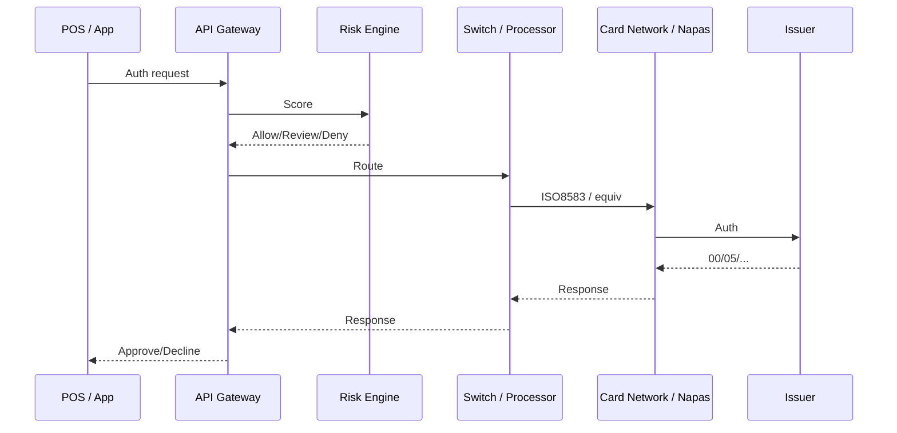

**Vì sao ms matters:**

- Timeout client (POS/mobile) thường 2–10s end-to-end
- Mỗi hop “an toàn quá mức” (retry + long timeout) làm **hết budget** và tăng duplicate auth risk
- p99 xấu hơn mean: AIOps phải watch tail latency, không chỉ average

| Hop | Budget gợi ý (minh họa) | Signal |
|---|---|---|
| Edge → API | 50–100ms | gateway latency |
| Risk | 50–150ms | model timeout rate |
| Switch → network | 100–400ms | external dependency SLO |
| Issuer | variable | decline code mix |
| Total | < client timeout − safety margin | e2e auth SLI |

> [!TIP]
> **Đặt timeout lùi từ client budget, không cộng từ dưới lên “cảm tính”.**
> Cộng từ dưới lên thường vượt timeout thật → retry storm + ghost transactions.

#### Decline code như tín hiệu vận hành

Đừng chỉ đếm HTTP error. Phân nhóm approve / soft-decline / hard-decline / issuer-unavailable / fraud / format-error; **owner khác nhau** (payments vs risk vs eng). AIOps: anomaly trên **mix shift** code theo cửa sổ 1–5 phút, không chỉ volume.

### 3.3 Reconciliation as first-class observability

**Định nghĩa vận hành:** so khớp các “sự thật” từ nhiều sổ:

- Ledger nội bộ
- PSP / card network reports
- Bank settlement files
- Wallet top-up / cash movement

| Signal | Ý nghĩa | Severity gợi ý |
|---|---|---|
| Unmatched auth | Có auth chưa post/ledger | P1 nếu tăng |
| Unmatched capture | Capture không có auth tương ứng | P1 |
| Settlement lag > SLA | File/batch trễ | P2→P1 gần cut-off |
| Amount mismatch | Sai số tiền | P1 immediate |
| Ghost transaction | Một bên có, một bên không | P1 + finance bridge |

> [!WARNING]
> **Nếu recon chỉ chạy batch 02:00 và team tech không thấy metric, bạn đang mù 22 giờ mỗi ngày.**
> Đưa recon counters/lag vào Prometheus/Grafana như mọi SLI khác ([03 — Prometheus](../03-prometheus/README.vi.md)).

### 3.4 Edge cases banking/payment

#### Partial settlement

Một phần giao dịch settle, một phần pending — dashboard “success rate” xanh nhưng cash flow lệch.

**AIOps cần:** state machine metrics theo lifecycle (`auth → clear → settle → reconcile`), không chỉ binary success.

#### Ghost transactions

Client timeout, phía issuer đã approve; merchant retry tạo auth thứ hai hoặc reverse không khớp.

**Mitigation quan sát:**

- Correlation id xuyên suốt
- Idempotency at switch
- Explicit reverse/void workflows with SLI

#### Clock skew & leap second

So sánh timestamp giữa core, switch, network file: lệch clock → recon false mismatch; leap second/batch window hiếm nhưng đã từng làm job scheduler lệch.

**Checklist:** NTP health là dependency của money systems, không phải “infra nice-to-have”.

#### Holiday calendars

T+1/T+2 thay đổi theo lịch nghỉ; NHNN/weekend/regional holidays làm “lag bình thường” trông như anomaly.

**Model:** calendar-aware baselines bắt buộc (mục 6).

### 3.5 Regulatory audit trail cho automated remediation

Mọi action tự động chạm production banking phải trả lời được:

1. **Ai/cái gì** quyết định? (rule id, model version, approver)
2. **Dựa trên signal nào?** (alert ids, metrics snapshot)
3. **Làm gì?** (API call, change ticket, breaker open)
4. **Kết quả?** (success/fail, before/after)
5. **Có rollback không?** (ai bấm, khi nào)
6. **Lưu bao lâu?** (retention policy theo circular/internal policy)

> [!IMPORTANT]
> **LLM propose không được là nguồn sự thật duy nhất trong audit.**
> Lưu prompt/response có kiểm soát + decision structured fields. Xem [10 — LLM Agent](../11-llm-agent/README.vi.md).

### 3.6 Checklist banking AIOps

- [ ] Authorization e2e latency SLO tách theo channel (ATM/POS/ecom/QR)
- [ ] Decline code mix dashboard (issuer vs acquirer vs risk)
- [ ] Recon lag & mismatch metrics real-time/near-real-time
- [ ] Change freeze calendar integrated
- [ ] Dual-control enforced in remediation engine
- [ ] NTP / time sync alerts treated as P2+ for money zones
- [ ] Immutable audit store cho auto actions
- [ ] Decline code mix + ghost transaction playbook
- [ ] NTP alerts mapped to money-zone severity

### 3.7 Zone-aware policy & runbook skeleton

Tách policy theo zone: **core/ledger** (auto rất hạn chế), **switch/middleware** (topology correlation), **digital API** (scale/canary), **network edges** (synthetics + partner SLO). Một catalog remediation “global” là anti-pattern.

Runbook auth degradation (rút gọn): xác nhận segmented SLI → dependency (risk/switch/network/issuer) → change freeze? → impact → external bridge hoặc scale/shed theo policy → **không auto reverse** → audit cả quyết định “không làm gì”.

---

## 4. Fintech / payment processors

> [!NOTE]
> **Ý TƯỞNG**
> Tư duy “Stripe-class”: API đẹp, idempotency first-class, failure modes công khai, multi-tenant isolation, và marketing uptime phải đối chiếu với **error budget thực**. Fintech đứng giữa merchant và bank — bạn vừa là dependency của người khác, vừa phụ thuộc network phía sau.

### 4.1 Idempotency keys & exactly-once business effect

```text
Delivery guarantee phổ biến:
  Network / queue / webhook = at-least-once

Business requirement:
  Charge customer once, credit merchant once

Giải pháp:
  Idempotency key + durable request log + state machine
  → “exactly-once effect” dù delivery lặp
```

| Thành phần | Quyết định | Vì sao |
|---|---|---|
| Key scope | per-merchant + key | Tránh collision cross-tenant |
| TTL key | 24h–72h+ tùy product | Retry cửa sổ thực tế của client |
| Response replay | Trả lại response gốc khi reuse key | Client cần deterministic |
| Concurrent same key | Lock / first-writer-wins | Race mobile double-submit |

**AIOps metrics:**

- `idempotency_replay_total`
- `idempotency_conflict_total`
- `in_flight_duplicate_window`

Spike `conflict` có thể là bug client — hoặc attack/misconfiguration.

### 4.2 Uptime marketing vs error budget reality

| Tuyên bố marketing | Thực tế error budget |
|---|---|
| “99.99% API uptime” | ~4.3 phút downtime/tháng |
| “Global availability” | Có thể exclude maintenance / regional degradation |
| “Successful payments” | Định nghĩa success (2xx? approved? captured?) phải rõ |

> [!TIP]
> **SRE nội bộ đừng quản trị theo slide marketing.**
> Quản trị theo **SLI khách hàng cảm nhận**: authorize success, payout success, webhook delivery success, dashboard query success — mỗi cái một error budget.

### 4.3 Multi-PSP failover & smart routing

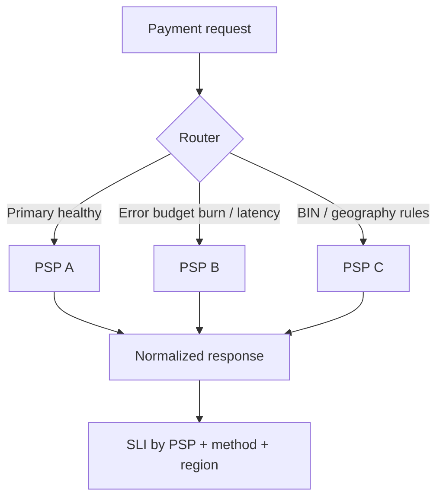

**Quyết định routing dựa trên:**

1. Real-time success rate per PSP
2. p95/p99 latency
3. Cost (MDR) — **cẩn thận**: tối ưu cost không được giết success
4. Hard constraints (BIN, currency, 3DS capability)
5. Circuit state

> [!WARNING]
> **Failover toàn bộ 100% traffic ngay khi primary “có vẻ xấu” có thể làm secondary sập theo.**
> Dùng canary failover (5%→25%→50%→100%) + theo dõi secondary saturation. Pattern giống canary remediation ở [11 — Remediation](../12-remediation/README.vi.md).

### 4.4 Edge: partial outage theo BIN/region/method

Card network / PSP hiếm khi “down sạch”. Thực tế:

- Visa OK, một acquirer path bad
- QR OK, thẻ quốc tế bad
- 3DS provider chậm → e-com auth rớt, POS vẫn tốt

**Hệ quả observability:** high-cardinality **có chủ đích** theo dimensions: `psp`, `method`, `bin_range_bucket`, `region`, `channel` — nhưng bucket cẩn thận để không nổ cost ([01 — Observability](../01-observability/README.vi.md) cardinality).

### 4.5 Checklist fintech processor

- [ ] Idempotency semantics documented + tested under concurrency
- [ ] SLI tách theo PSP/method/region
- [ ] Smart routing shadow mode trước khi auto
- [ ] Webhook delivery SLO + retry policy public/internal aligned
- [ ] Tenant isolation tested (noisy neighbor)
- [ ] Status page signals khớp internal SLI (tránh “green lie”)

---

## 5. Observability design cho transaction paths

> [!NOTE]
> **Ý TƯỞNG**
> Transaction path observability = RED cho API **cộng** business SLIs. Trace phải nối được app → risk → PSP → bank (ở mức bạn được phép thấy). Log phải đủ để audit nhưng **không** trở thành kho PAN/PII.

### 5.1 RED + business SLIs

| Layer | Metrics | Câu hỏi trả lời |
|---|---|---|
| RED | Rate, Errors, Duration | Service có khỏe không? |
| Business | Payment success, auth rate, conversion | Tiền/flow kinh doanh có khỏe không? |
| Integrity | Recon mismatch, paid-no-order | Sổ sách có khớp không? |
| Dependency | PSP latency/error, DB pool | Phụ thuộc ngoài có kéo sập không? |

**Bộ SLI tối thiểu cho money path:**

1. `payment_auth_success_ratio`
2. `payment_auth_latency_p99`
3. `checkout_conversion_ratio` (ecom)
4. `post_payment_order_persist_success`
5. `refund_success_ratio` + `refund_latency`
6. `settlement_lag_seconds`
7. `recon_unmatched_count`
8. `webhook_success_ratio`

### 5.2 Trace critical path

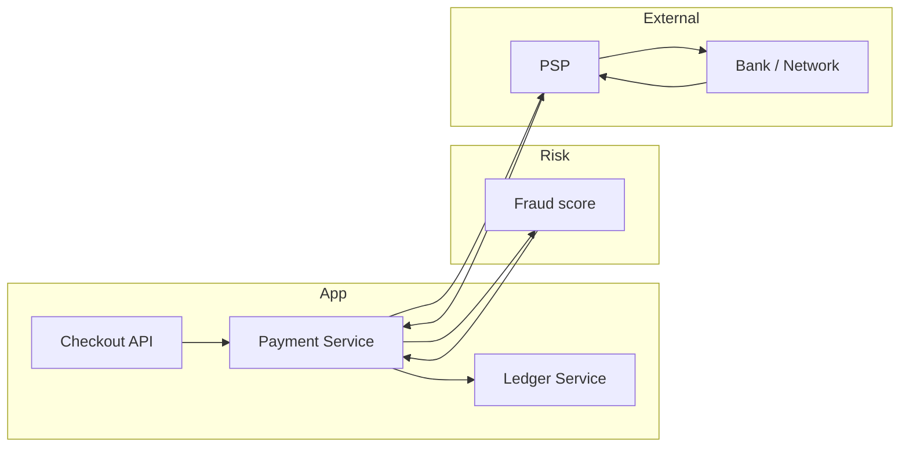

**Quyết định instrumentation (WHY):**

| Quyết định | Vì sao |
|---|---|
| Span events cho state transitions (`auth_requested`, `auth_approved`) | Logs có thể drop; span event gắn đúng trace |
| Attribute `payment_id` hashed / merchant_id | Correlate mà giảm PII |
| Propagation W3C tracecontext qua message bus | Async capture/settle vẫn nối được ([02 — OpenTelemetry](../02-opentelemetry/README.vi.md), [05 — Tempo](../05-tempo/README.vi.md)) |
| Không trace full PAN | Compliance + cardinality |

### 5.3 Log redaction: PAN, PII, secrets

> [!WARNING]
> **Một log line chứa PAN có thể mở rộng PCI scope cho cả logging stack.**
> Redaction phải ở **source + collector**, không tin vào “dev sẽ cẩn thận”.

**Checklist redaction pipeline:**

- [ ] Application scrubbers (defense in depth)
- [ ] OTel Collector / Alloy processors drop/hash sensitive fields
- [ ] Loki pipelines reject known PAN patterns
- [ ] Access control riêng cho raw vs redacted
- [ ] Audit ai query log payment namespaces
- [ ] Training data cho LLM **không** lấy raw payment logs

### 5.4 Cardinality vs privacy vs useful dimensions

| Dimension | Hữu ích? | Rủi ro |
|---|---|---|
| `psp`, `method`, `region` | Rất cao | Thấp nếu enum |
| `merchant_id` | Cao (fintech multi-tenant) | Cardinality nổ |
| `bin` đầy đủ | Debug fraud/network | Privacy + cardinality |
| `bin_bucket` (6–8 digit bucketed) | Thường đủ | Chấp nhận được |
| `user_id` | Debug CX | PII — tránh metric label |

**Quy tắc:** metrics labels = low/medium cardinality enums; high-cardinality id nằm ở logs/traces có sampling.

### 5.5 Sampling strategy cho money systems

| Tín hiệu | Sampling gợi ý | Lý do |
|---|---|---|
| Metrics aggregates | Full (via metrics) | Rẻ, cần continuity |
| Traces success path | Tail-based keep errors + slow | Cost |
| Traces auth failures | Keep cao / gần full | Debug tiền |
| Traces money integrity anomalies | Always keep | Rare but critical |
| Logs info | Aggressive filter | Cost + privacy |
| Logs error/audit | Longer retention | Compliance |

### 5.6 Dashboard topology gợi ý

1. **Executive money health** — success, GMV at risk, recon
2. **Checkout funnel** — step conversion
3. **PSP dependency** — per provider
4. **Risk engine** — latency + deny rates
5. **Integrity** — paid-no-order, oversell, unmatched
6. **Webhook/async** — lag, DLQ
7. **Compliance/access** — who queried sensitive data

Cross-link pillars: [01](../01-observability/README.vi.md), [03](../03-prometheus/README.vi.md), [04](../04-loki/README.vi.md), [05](../05-tempo/README.vi.md).

### 5.7 Synthetics, exemplars & instrumentation review

**Synthetics** (1–5 phút): cart, checkout session, payment test MID, webhook health; batch ETA probe trong cửa sổ banking. Label `traffic_type=synthetic`. Không bắn thẻ thật lên network production nếu tạo noise recon — dùng test MID được phép.

**Exemplars:** burn rate auth → `trace_id` fail samples → Tempo phân biệt PSP timeout vs risk deny → gắn vào incident ([03](../03-prometheus/README.vi.md) + [05](../05-tempo/README.vi.md)).

**Checklist trước peak/audit:** P0 RED ổn định; business counter không double-count retry; trace qua async; không label PAN/user_id; dashboard integrity có owner; synthetic/real filterable; alert → runbook link.

---

## 6. Anomaly detection đặc thù

> [!NOTE]
> **Ý TƯỞNG**
> Trong ecom/banking, “bất thường” có thể là **fraud tốt (bị chặn)**, **campaign tốt (traffic tăng)**, hoặc **infra xấu**. Nếu một model duy nhất gộp tất cả, bạn sẽ page nhầm team và tắt alert. Tách model theo lớp.

### 6.1 Confusion matrix: fraud vs infra anomaly

| Thực tế \ Dự đoán | Infra anomaly | Fraud anomaly | Business spike | Benign |
|---|---|---|---|---|
| PSP degradation | **TP mong muốn** | FP (risk team) | FP | FN nguy hiểm |
| Card testing attack | FP (SRE) | **TP** | FP | FN |
| Flash sale | FP kinh điển | FP | **Expected** | — |
| Deploy bad config | **TP** | FP | FP | FN |
| Marketing push | FP nhẹ | — | Expected micro | — |

> [!TIP]
> **Routing quan trọng bằng detection.**
> Cùng một signal “auth decline spike” có thể là: issuer down (SRE/payments), fraud rule (risk), hoặc campaign traffic mix shift (commerce). Correlation enrichment phải mang theo context campaign/risk.

### 6.2 Calendar-aware & campaign-aware baselines

**Inputs bắt buộc cho model ecom/bank:**

```text
baseline_features = {
  hour, dow, month,
  is_public_holiday,
  is_bank_holiday,
  is_campaign_day,
  campaign_id_bucket,
  days_to_salary_like_cycle,   # optional local patterns
  batch_window_flag,           # banking
  change_freeze_flag
}
```

| Kỹ thuật | Khi nào | Trade-off |
|---|---|---|
| STL / seasonal ESD | Nhịp tuần ổn | Yếu với event one-off |
| Prophet-like / regression with regressors | Có calendar regressors | Phức tạp vận hành |
| Separate models per “regime” | Peak vs normal | Cần regime detector |
| Suppression windows | Campaign known | Nguy hiểm nếu suppress quá rộng |

> [!IMPORTANT]
> **Suppression ≠ mù.**
> Trong BFCM, đừng tắt anomaly; hãy **đổi threshold / đổi target metric** (ví dụ từ QPS anomaly sang auth_success và paid-no-order).

### 6.3 Tách models: infra health vs business KPI

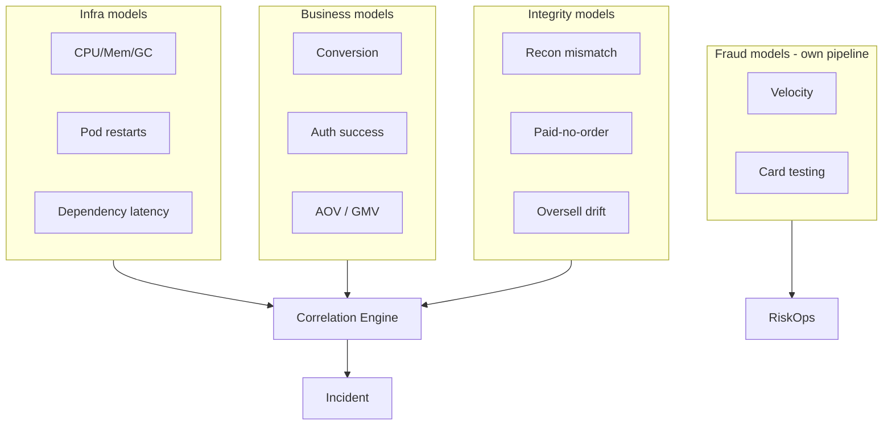

**Vì sao tách:**

- Training data khác nhau
- Owners khác nhau
- False positive cost khác nhau
- Action playbook khác nhau

Tham chiếu thuật toán: [07 — Anomaly Detection](../08-anomaly-detection/README.vi.md).

### 6.4 Edge: “good anomaly”

Ví dụ:

- Auth deny tăng vì rule fraud mới — **đúng**
- Traffic tăng vì KOLs — **đúng**
- Latency tăng nhẹ vì bật 3DS step-up — **trade-off bảo mật**

AIOps phải ingest **change events** (rule deploy, campaign start, feature flag) như covariates; nếu không, mọi change đều thành incident.

### 6.5 Checklist anomaly cho money domains

- [ ] Campaign/holiday feed automated
- [ ] Separate alert channels: SRE / Payments / Risk / Commerce
- [ ] BFCM playbook: metrics priority list
- [ ] Model performance reviewed post-peak (precision/recall)
- [ ] Integrity anomalies never “priority low”
- [ ] Fraud pipeline không share auto-remediation với infra without gate
- [ ] Change events ingested as covariates; post-peak model review

### 6.6 False positive economics & regime detector

Tối ưu **precision** cho infra pages ban đêm; giữ **recall** cao cho integrity & auth. Một “sensitivity knob” global thường vừa spam vừa miss.

Regime trước detector: `NORMAL` | `CAMPAIGN` (integrity-first) | `INCIDENT` (suppress children) | `BATCH_WINDOW` | `FREEZE`. Regime sai → pipeline sau sai — đầu tư label regime thường ROI cao hơn thêm LSTM.

---

## 7. Alert correlation trong checkout storms

> [!NOTE]
> **Ý TƯỞNG**
> Một PSP timeout có thể làm 50–500 services kêu. Nếu không correlation, on-call đuổi từng service. Mục tiêu: **một incident**, root dependency = payment gateway/PSP path, kèm blast radius business (GMV/orders).

### 7.1 Câu chuyện kinh điển

```text
T+0s     PSP A latency ↑
T+5s     payment-service error_rate ↑
T+10s    checkout-service SLO burn ↑
T+15s    order-service timeouts ↑
T+20s    api-gateway 5xx ↑
T+30s    mobile BFF circuit open alerts × N regions
T+40s    cart service “slow” (thread pool)
T+60s    120 alerts → 1 human brain melts
```

**Với correlation tốt:**

```text
Incident INC-20441
Title: PSP A degradation → checkout payment path
Root dependency: psp:A
Evidence: latency_p99 2.1s → 8.4s; auth_success 98% → 81%
Affected: checkout, order, bff-mobile
Business impact: ~$X GMV/min estimated
Suggested actions: open breaker to PSP B (canary), scale payment-service workers (optional)
```

Xây engine: [08 — Alert Correlation](../09-alert-correlation/README.vi.md).

### 7.2 Topology: payment gateway dependency graph

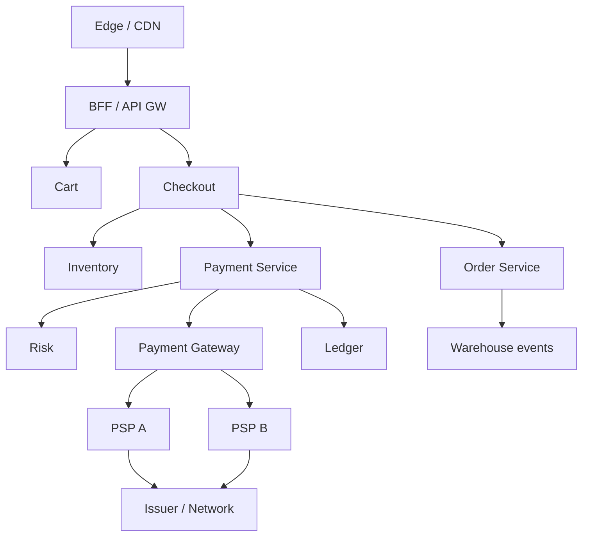

**Quy tắc correlation topology-aware:**

1. Ưu tiên root gần external dependency khi nhiều nhánh cùng fail
2. Không chọn “api-gateway” chỉ vì degree cao — degree cao thường là symptom aggregator
3. Dùng temporal order + trace parent links để xác nhận ([09 — RCA](../10-root-cause-analysis/README.vi.md))

### 7.3 Grouping keys gợi ý cho checkout storms

| Key | Dùng để |
|---|---|
| `payment_path_id` | Gom mọi alert trên cùng money path |
| `psp` | Tách partial outage theo nhà cung cấp |
| `channel` | app/web/POS |
| `region` | Multi-region failover decisions |
| `campaign_id` | Tránh nhầm peak với outage |

### 7.4 Business impact enrichment

Correlation không chỉ giảm noise — phải **gắn tiền**:

- Estimated failed checkouts/min
- GMV at risk
- Top merchants affected (fintech)
- Whether capture/settle delayed vs auth declined (khác mức độ đau)

> [!TIP]
> **On-call quyết định bằng impact, không bằng số lượng alert.**
> 3 alert với $50k/min risk quan trọng hơn 300 alert CPU trên batch non-critical.

### 7.5 Checklist correlation money path

- [ ] Dependency graph có PSP/bank edges, không chỉ K8s services
- [ ] Incident title templates include business impact fields
- [ ] Suppression of child alerts after root identified
- [ ] Recovery-phase webhook storms correlated to original incident
- [ ] Synthetic checkout probes included as early signal
- [ ] Business impact fields on P1; child silence TTL (không forever)

### 7.6 Áp dụng 5 stage + rủi ro correlation sai

Từ [08](../09-alert-correlation/README.vi.md): dedup pods → group `payment_path_id`/`psp` → topology tới PSP → causal order → enrich GMV/campaign/breaker.

**Correlation sai có thể nguy hiểm hơn không correlation:** gộp fraud + PSP latency thành một root rồi auto failover — không giảm fraud, có thể đốt secondary. Dùng multi-hypothesis RCA top-k; human chọn khi nhánh fraud vs infra ([09](../10-root-cause-analysis/README.vi.md)).

---

## 8. Automated remediation: CAN và CANNOT

> [!NOTE]
> **Ý TƯỞNG**
> Câu hỏi không phải “auto được không?” mà “**auto xong có đảo được không, và regulator/audit có chấp nhận không?**”. Money systems yêu cầu ma trận risk × reversibility × compliance.

### 8.1 Safe to auto (với guardrails)

| Action | Điều kiện an toàn | Verify sau action |
|---|---|---|
| Scale checkout/payment pods | Max replica cap, PDB ok | p95 latency, error rate |
| Failover read replica (read path) | Không dùng cho strong ledger reads | Stale read metrics |
| Open circuit to secondary PSP (canary) | Secondary healthy, gradual % | Auth success by PSP |
| Enable waiting room / admit control | Campaign mode / overload confirmed | Queue wait time, conversion |
| Restart unhealthy pods (stateless) | Not during ledger freeze without check | Ready + error rate |
| Increase rate limit for known good webhook IP? | Careful allowlist only | Traffic pattern |
| Toggle cache soft-TTL mode | Known stampede signatures | Origin QPS |

### 8.2 Unsafe without human (thường cấm auto)

| Action | Vì sao cấm auto |
|---|---|
| Reverse / void / refund hàng loạt | Money movement, customer trust |
| Freeze accounts / merchants | Legal + false positive fraud |
| Change risk thresholds mid-incident | Có thể mở cửa fraud hoặc chặn user sạch |
| Force settle / re-post ledger | Integrity risk |
| Disable 3DS globally | Compliance & chargeback risk |
| Replay settlement files | Duplicate money risk |
| Broad data deletion / log purge | Audit destruction |
| “LLM decided to fix money” without schema action | Non-deterministic + audit |

> [!WARNING]
> **Refund tự động “cho xong incident” là anti-pattern.**
> Bạn có thể tạo lỗ hổng kinh tế (attacker trigger fail → auto refund) hoặc double-refund.

### 8.3 Decision matrix: risk × reversibility × compliance

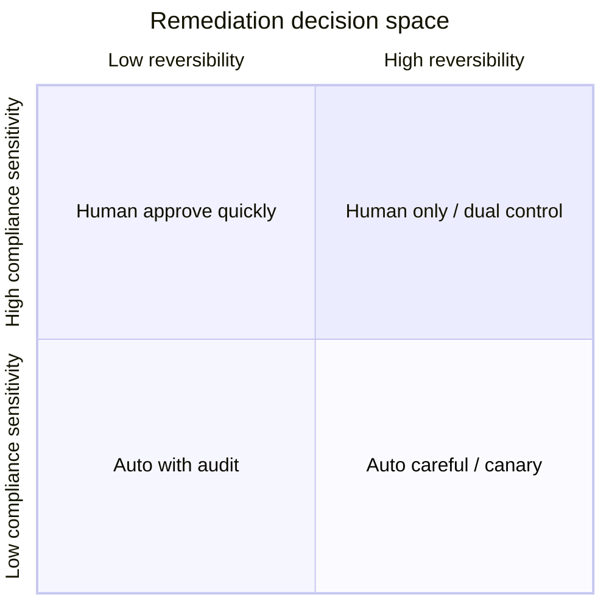

| Risk \ Reversibility | Dễ đảo | Khó đảo |
|---|---|---|
| **Thấp + non-compliance** | Auto | Auto + strong verify |
| **Trung bình** | Auto canary | Two-person approve |
| **Cao / money / legal** | Approve in-band | Change ticket + freeze |

### 8.4 State machine remediation engine (money-aware)

```text
DETECT → ENRICH → CLASSIFY_PATH(money|ux|infra)
      → POLICY_GATE(compliance, freeze, dual_control)
      → PROPOSE
      → (AUTO | CANARY | APPROVAL)
      → EXECUTE
      → VERIFY
      → (ROLLBACK | ESCALATE)
      → AUDIT_IMMUTABLE
```

**WHY classify path early:** cùng action “restart pod” có thể safe ở BFF nhưng unsafe nếu pod đang giữ in-memory settlement batch (thiết kế xấu — nhưng production có thật).

### 8.5 Guardrail examples (giải thích quyết định, không dump framework)

| Guardrail | Quyết định | Vì sao |
|---|---|---|
| Max traffic shift to secondary PSP 25%/5min | Canary step | Tránh secondary melt |
| Block all money actions during audit freeze | Policy calendar | Compliance window |
| Require `trace_id` + `incident_id` on execute | Provenance | Auditability |
| Dry-run mode default for new actions 14 days | Learning | Giảm surprise |
| Automatic rollback if auth_success không hồi 3–5 phút | Verify gate | Fail-safe |

Chi tiết safety: [11 — Remediation](../12-remediation/README.vi.md). LLM propose: [10 — LLM Agent](../11-llm-agent/README.vi.md).

### 8.6 Checklist policy trước production auto

- [ ] Whitelist actions signed by compliance + SRE + payments owner
- [ ] Dual-control integrated for restricted catalog
- [ ] Immutable audit sink tested under failure (action still records)
- [ ] Chaos test: secondary PSP cannot take 100% instantly
- [ ] Break-glass procedure documented and drilled
- [ ] Post-action recon check for any action near money path
- [ ] Game day: bad suggestion blocked; fail-closed if audit sink down

### 8.7 Policy table & verify hooks

| action_id | mode | approval | verify |
|---|---|---|---|
| `scale_checkout` | auto | none | checkout_p95 |
| `waiting_room_on` | auto if overload | none | admit_rate |
| `psp_shift_canary` | canary ≤10%/step | pre-approved | auth_success{psp} |
| `psp_shift_majority` | approval | dual | auth + errors |
| `void_auth_bulk` / `risk_threshold_edit` | forbid auto | ticket/committee | recon / fraud+conv |

Policy table = source of truth; LLM chỉ propose `action_id` có trong bảng ([10](../11-llm-agent/README.vi.md)).

Verify sau action: immediate 30–60s (errors/latency) → business 2–5m (auth/conversion) → integrity 5–15m (paid-no-order) → secondary 15–60m (webhook/recon). Fail cổng → rollback hoặc escalate.

---

## 9. Multi-region / active-active for money systems

> [!NOTE]
> **Ý TƯỞNG**
> Active-active cho storefront dễ hơn active-active cho **ledger**. CAP không phải slide lý thuyết: khi region split, bạn chọn **đúng tiền** hay **nhận order**. Hầu hết money systems chọn consistency/partition strategy có chủ đích + saga/outbox, không “multi-master balance” ngây thơ.

### 9.1 CAP tradeoffs trên ledger

| Approach | Availability khi partition | Correctness | Phù hợp |
|---|---|---|---|
| Single primary ledger region | Thấp ở region phụ | Cao | Nhiều core banking |
| Active-active với conflict-free intents | Cao hơn | Cần CRDT/careful design | Số dư không đơn giản |
| Regional ledgers + reconciliation | Cao | Cuối cùng khớp | Wallet/some fintech |
| Saga + reservation across regions | Trung bình | Business-level | Ecom inventory + pay |

> [!IMPORTANT]
> **Đừng active-active balance counters bằng last-write-wins.**
> Lost update = tiền biến mất hoặc nhân đôi trên sổ.

### 9.2 Conflict resolution, saga, outbox

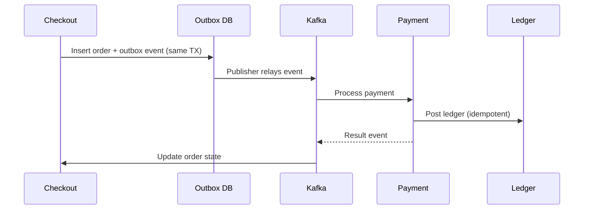

**WHY outbox:** dual-write DB + Kafka không atomic → lost events → paid-no-order hoặc order-no-pay. Outbox biến “event publish” thành problem vận hành quan sát được (`outbox_lag`).

**Saga compensation examples:**

- Auth success + order fail → auto void/reverse **với policy**, thường semi-auto
- Reserve inventory + payment fail → release reservation
- Capture fail after fulfill trigger → human + finance path

### 9.3 DR drills phải gồm bank file exchange / batch windows

DR “failover app region” chưa đủ nếu:

- Settlement file SFTP endpoint chỉ whitelist IP region cũ
- Batch job wall-clock phụ thuộc timezone cluster
- HSM / key material không có ở region DR
- Partner callbacks DNS vẫn trỏ region primary

| Drill item | Pass criteria |
|---|---|
| App failover | Auth SLI phục hồi trong RTO |
| DB/ledger promote | Zero divergence or known bounded |
| File exchange path | Test file ACK trong window |
| Callback/webhook URL | Partners reach DR |
| Recon after DR | Unmatched dưới ngưỡng |
| Audit logs continuous | No gap evidence store |

Tham chiếu DR ops: [12 — Production](../13-production/README.vi.md).

### 9.4 Observability multi-region money

- SLI theo `region` + global composite
- “Split brain detectors” (divergent counters)
- Replication lag as P1 for ledger async copies
- Cross-region trace sampling policy (residency!)

### 9.5 Checklist multi-region money

- [ ] Explicit consistency model documented per entity (cart vs ledger)
- [ ] Outbox/saga metrics on dashboards
- [ ] DR runbook includes partner connectivity
- [ ] Idempotency keys global namespace (or region-safe design)
- [ ] Data residency constraints encoded in routing
- [ ] Regular game day with settlement window simulation

---

## 10. Case study A: flash sale collapse

### 10.1 Bối cảnh

- 20:00 mở sale SKU hot
- Marketing push 5 triệu users
- Inventory 3.000 đơn vị; kỳ vọng 50k attempt/phút ở phút đầu
- Stack: K8s, Redis, checkout, inventory reservation, payment via PSP A

### 10.2 Timeline

| Time | Sự kiện | Nhận định |
|---|---|---|
| 19:55 | Cache warm partial | Một phần key chưa hot |
| 20:00:00 | Waiting room chưa bật đúng % | Edge vỡ |
| 20:00:20 | Inventory hot key lock | p99 reserve 12s |
| 20:01 | Checkout threads exhausted | Error rate 35% |
| 20:02 | Clients retry → storm | PSP A rate limit |
| 20:04 | On-call scale checkout pods | Không giúp DB lock |
| 20:08 | Oversell signals xuất hiện | Race reservation |
| 20:15 | Sale paused | GMV mất + refund sau |

### 10.3 Root cause chain

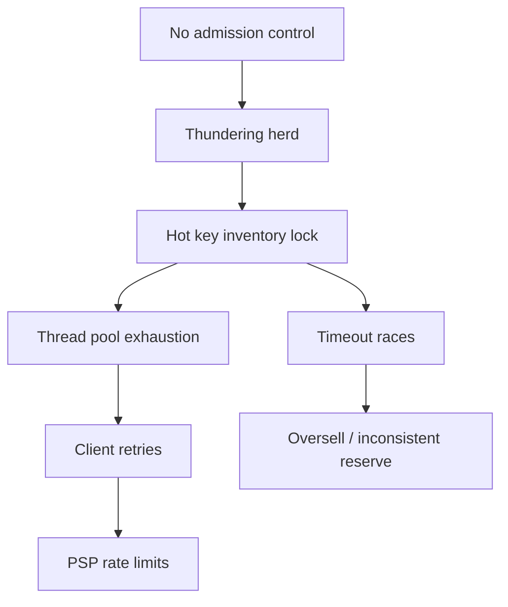

### 10.4 AIOps đã fail chỗ nào?

1. **Anomaly QPS** page từ 19:58 — bị suppress vì “campaign expected” **quá rộng**
2. **Không có integrity SLI oversell drift** real-time
3. **Correlation** thấy 80 alerts nhưng root gắn “checkout CPU” (symptom)
4. **Auto-scale** chạy — action an toàn nhưng **sai lớp**
5. Không có playbook “open waiting room” như auto/semi-auto action

### 10.5 Redesign sau sự cố

| Hạng mục | Thay đổi | Vì sao |
|---|---|---|
| Edge | Hard waiting room + lottery | Bảo vệ core |
| Inventory | Sharded reservation / bucketing | Giảm hot key |
| SLI | `reserve_conflict_rate`, `oversell_drift` | Phát hiện sớm correctness |
| Auto | Enable waiting room policy-gated | Action đúng lớp |
| Load test | Spike 0→N trong 10s | Giống đời thật |
| Model | Campaign mode: watch success & integrity, not QPS alone | Giảm false calm |

### 10.6 Checklist phòng flash sale

- [ ] Waiting room metrics + switch tested week before
- [ ] Hot SKU reservation strategy reviewed
- [ ] Client retry budget documented (mobile)
- [ ] PSP capacity confirmed for peak auth TPS
- [ ] War room roles: commerce / SRE / payments / CX
- [ ] Mobile retry policy khớp server budget; banner/status templates sẵn

### 10.7 Lesson → control testable

Suppress QPS sai → campaign metric list trong git; oversell → race harness staging; CPU-only scale cấm là sole P1 action; waiting room flag drill trước campaign. Postmortem kết thúc bằng **control verify được**, không phải “sẽ cẩn thận hơn”.

---

## 11. Case study B: bank batch job overruns morning open

### 11.1 Bối cảnh

- Batch EOD/EOI: interest accrual, settlement import, card clearing, report extracts
- Cửa sổ phải xong trước 08:00 morning open
- Đêm trước: volume clearing tăng (holiday backlog) + job mới thêm bước recon nặng
- 07:40: batch còn 35% — risk trượt giờ mở cửa

### 11.2 Triệu chứng

| Signal | Giá trị |
|---|---|
| Batch progress metric | 65% at 07:40 (baseline 95%) |
| Downstream online channels | Chưa mở, nhưng pre-open health checks fail |
| DB locks | Long transactions from batch |
| Customer impact impending | ATM/mobile login/balance at 08:00 |

### 11.3 Quyết định khó

```text
Option A: Kill heavy recon sub-job → mở cửa đúng giờ, recon trễ
Option B: Delay channel open → đúng sổ, CX xấu, SLA public
Option C: Scale up batch workers mid-flight → có thể làm lock tệ hơn
Option D: Failover read path for non-critical inquiries only
```

> [!IMPORTANT]
> **Đây là quyết định business+risk, không phải “restart pod”.**
> AIOps nên **đề xuất + mô phỏng impact**, không tự kill job tiền.

### 11.4 AIOps đúng vai

1. **Predictive alert** từ 03:30 dựa trên progress velocity (không chờ 07:40)
2. Correlation: batch lag + DB lock + pre-open synthetics → **một incident**
3. RCA: change “recon step added” + volume regressor holiday
4. Remediation catalog: semi-auto scale **chỉ** worker classes được whitelist; never auto-skip settlement without approval
5. Postmortem metric: `time_to_predict_overrun`

### 11.5 Patterns phòng ngừa

| Pattern | Mô tả |
|---|---|
| Batch SLO | Finish percentile vs open time |
| Progress burn rate | Alert when ETA > deadline − buffer |
| Holiday volume models | Calendar-aware capacity |
| Separated resource pools | Batch không chiếm pool online auth |
| Feature flags for optional recon depth | Degrade reporting, not clearing |
| Game days | Simulate 2× clearing volume |

### 11.6 Checklist morning-open readiness

- [ ] Batch ETA dashboard visible to ops + tech
- [ ] Hard isolation batch vs online connection pools
- [ ] Pre-open synthetic auth path
- [ ] Decision tree “late batch” approved by business
- [ ] Audit when optional steps skipped
- [ ] Post-holiday capacity plan; batch cannot steal auth pool; comms tree

### 11.7 ETA batch (operational math)

`velocity = Δprogress/Δt` (15–30m) → `eta = now + (1-progress)/velocity` → alert khi `deadline - eta < buffer`. Con người hay nhìn % tuyệt đối thay vì velocity. Scale workers làm velocity tăng nhưng `lock_wait`/`deadlock` tăng thì không phải win — theo dõi song song.

---

## 12. Case study C: card network degradation partial

### 12.1 Bối cảnh

- E-commerce + fintech gateway
- Không có outage status page đỏ
- Thực tế: một nhánh thẻ quốc tế chậm/decline tăng; nội địa QR bình thường
- Symptom đầu: “payment success hơi tụt” — dễ bị business bỏ qua

### 12.2 Dấu hiệu tinh vi

| Metric | Primary | Domestic QR | Intl cards |
|---|---|---|---|
| Auth success | 96% → 93% | 98% ổn | 91% → 78% |
| p99 latency | +200ms | OK | +2.5s |
| Decline code `05`/`91` | ↑ | — | ↑↑ |
| 3DS completion | ↓ | n/a | ↓ |

Nếu chỉ nhìn overall 93%, team có thể nói “chưa tới ngưỡng 90%”. **GMV international đã cháy.**

### 12.3 Correlation & topology

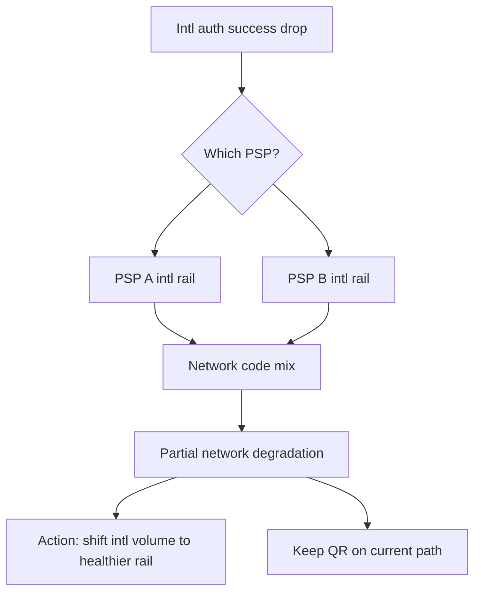

### 12.4 Hành động đúng / sai

| Action | Đánh giá |
|---|---|
| Failover 100% mọi payment sang PSP B | Sai — QR không cần; có thể làm B quá tải |
| Shift **intl** 20%→50% canary | Đúng hướng |
| Tắt 3DS để tăng success | Nguy hiểm compliance/chargeback |
| Thông báo merchant status chi tiết | Đúng (fintech) |
| Auto reverse failed orders blindly | Sai |

### 12.5 AIOps capabilities needed

1. High-value dimensions without illegal cardinality (method × region × psp)
2. Decline code clustering as first-class features
3. Smart routing recommendations with confidence
4. Customer communication templates for partial degradation
5. Chargeback risk estimate if controls loosened

### 12.6 Aftermath metrics to track

- Time to detect **segmented** degradation (not overall)
- % traffic shifted safely
- Incremental success recovered
- Residual unmatched recon; false positives lần partial sau; merchant tickets vs detect time

### 12.7 Communication matrix

War room T+5m (segment/impact); exec nếu GMV material; merchant khi SLA risk; customer nếu UX rộng; partner/PSP song song; compliance nếu control degraded. AIOps **draft** template; **send** external thường cần human.

---

## 13. Cost of observability in regulated env

> [!NOTE]
> **Ý TƯỞNG**
> Regulated env trả tiền observability theo hai trục: **infra cost** (ingest/storage) và **compliance cost** (retention dài, access control, audit, tokenization, residency). Tối ưu cost mù có thể phá evidence khi regulator hỏi.

### 13.1 Cost drivers đặc thù

| Driver | Vì sao đắt hơn SaaS thường |
|---|---|
| Longer retention | Circular/internal policy 1–7+ năm cho một số audit logs |
| Lower sampling on money errors | Không dám bỏ trace fail auth |
| Separate stores | Hot ops vs cold compliance archive |
| Redaction pipelines | CPU/process at collect |
| Access review & SIEM | People + tooling |
| Multi-region residency copies | Duplicate storage |
| Vendor BAAs / PCI scope | Process overhead |

### 13.2 Strategy: hot / warm / cold

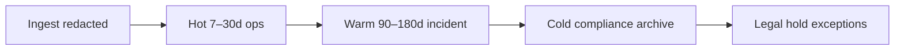

| Tier | Nội dung | Truy cập |
|---|---|---|
| Hot | Metrics HD, traces errors, recent logs | SRE on-call |
| Warm | Incident bundles, postmortems artifacts | Eng + audit support |
| Cold | Immutable audit, selected transaction evidence | Controlled, ticketed |

### 13.3 Cardinality governance = cost governance

- Enum budgets per team
- Reject metric labels `user_id`, raw `pan`, ultra-high `merchant` without aggregation
- Recording rules pre-aggregate business SLIs ([03 — Prometheus](../03-prometheus/README.vi.md))
- Log structured fields allowlist ([04 — Loki](../04-loki/README.vi.md))

### 13.4 Cost vs risk table

| Tiết kiệm | Rủi ro |
|---|---|
| Sample drop 90% payment fail traces | Không debug partial outage |
| Retention log 7 ngày cho audit actions | Fail regulatory evidence |
| Gộp overall success only | Miss segment outages |
| Shared admin access “cho nhanh” | Compliance finding, insider risk |
| Train LLM on raw logs | Data leakage |

> [!TIP]
> **Cắt cost ở success path và verbose debug; không cắt integrity + audit + fail path.**

### 13.5 FinOps checklist observability regulated

- [ ] Unit cost per million spans/logs visible
- [ ] Budget alerts on cardinality explosions
- [ ] Annual compliance retention test (restore sample)
- [ ] PCI scope diagram includes observability components
- [ ] Encryption at rest + key rotation for log archives
- [ ] Quarterly access recertification for payment log indexes

Liên hệ cost platform: [12 — Production](../13-production/README.vi.md).

### 13.6 Trả tiền để nhớ gì?

Giữ lâu: remediation audit, auth-fail traces (bounded), recon evidence. Cắt: verbose browse success logs, clickstream nhét APM. Cost governance gắn **product owner money path**, không chỉ platform tự cắt — peak spans × retention × multi-region copy dễ thành TB-tháng.

---

## 14. Production checklist + 90-day roadmap

### 14.1 Production checklist (gom theo domain)

#### A. Observability money path

- [ ] Business SLIs defined & owned (payments, checkout, recon)
- [ ] Trace path app→risk→PSP documented
- [ ] PAN/PII redaction verified with tests
- [ ] Dashboards: funnel, PSP, integrity, batch ETA
- [ ] Synthetics: checkout + auth per channel

#### B. Detection & correlation

- [ ] Campaign/holiday calendars integrated
- [ ] Separate models infra/business/integrity
- [ ] Topology includes external payment edges
- [ ] Checkout storm drills (page volume reduced ≥80%)
- [ ] Fraud vs infra routing validated

#### C. Remediation & governance

- [ ] Action whitelist signed
- [ ] Dual-control for restricted actions
- [ ] Canary PSP failover tested
- [ ] Immutable audit trail restore tested
- [ ] No auto money reverse/freeze/risk-edit

#### D. Multi-region / DR

- [ ] Consistency model per entity written
- [ ] Outbox lag SLI
- [ ] DR includes file exchange & callbacks
- [ ] Residency constraints in architecture review

#### E. People & process

- [ ] War room roster ecom peak / bank open
- [ ] Runbooks for PSP partial, batch overrun, oversell
- [ ] Postmortem template includes money integrity section
- [ ] On-call shadow with payments SME

### 14.2 Lộ trình 90 ngày

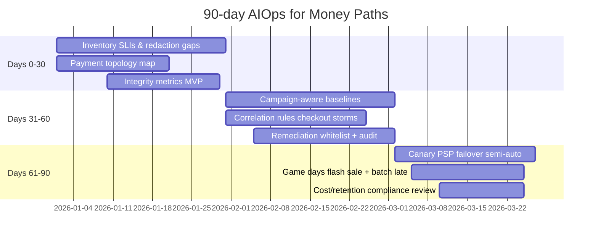

#### Ngày 0–30 — Foundation

**Mục tiêu:** nhìn thấy money truth.

1. Chốt danh mục P0 flows (auth, capture, refund, transfer, checkout persist)
2. Đặt SLI/SLO + owners
3. Redaction audit end-to-end
4. Recon/unmatched lên Grafana
5. Dependency graph v1 (services + PSP)

**Exit criteria:** on-call xem 1 màn hình biết “tiền có đang chảy đúng không”.

#### Ngày 31–60 — Intelligence

**Mục tiêu:** bớt ồn, đúng chỗ.

1. Calendar/campaign feed
2. Tách anomaly pipelines
3. Correlation templates cho PSP incidents
4. RCA playbooks + LLM guardrails (không execute money)
5. Policy engine remediation (deny-by-default money actions)

**Exit criteria:** incident PSP partial = 1 ticket giàu context; không còn 200 pages rời.

#### Ngày 61–90 — Controlled automation & drills

**Mục tiêu:** auto những gì đảo được.

1. Semi-auto: scale, waiting room, canary PSP shift
2. Verify+rollback hooks
3. Game day flash sale
4. Game day batch overrun morning open
5. Cost/retention sign-off với compliance

**Exit criteria:** MTTA/MTTR money path cải thiện đo được; zero audit gap trên auto actions.

### 14.3 Anti-roadmap (đừng làm sớm)

- [ ] Full auto refund / reverse
- [ ] Auto tune fraud thresholds từ infra signals
- [ ] Active-active ledger last-write-wins
- [ ] Train LLM on unredacted payment logs
- [ ] Suppress all anomalies during campaigns

### 14.4 KPI thành công 90 ngày

| KPI | Baseline → Target (minh họa) |
|---|---|
| Pages per PSP incident | 80 → <10 |
| Detect segmented degradation | 40m → <10m |
| Paid-no-order detect | T+1 day → <5m |
| Auto safe actions success | 0 → 30% P2 capacity class |
| Audit completeness auto actions | unknown → 100% |
| BFCM false pages | high → controlled with integrity focus |
| Segmented detect / audit completeness | hours→min / partial→100% |

### 14.5 RACI & Definition of Done

**RACI (rút gọn):** Payments owns SLI; Marketing tech owns campaign feed; SRE+Compliance+CTO approve remediation whitelist; Risk owns fraud models; Finance tech owns recon integrity; Platform owns DR money path. Không RACI → mọi người page, không ai sửa policy.

**DoD money path v1:** P0 SLI+synthetic; topology external edges; integrity routing đúng; ≥3 safe autos + verify; 0 money auto thiếu dual-control; 2 game days + evidence; cost/retention signed; war room card published.

---

## 15. Socratic exercises

> [!NOTE]
> **Cách dùng**
> Làm theo nhóm SRE + payments + compliance. Không tìm “đáp án duy nhất” — tìm **trade-off bạn chấp nhận và cách đo**.

### Bài 1 — Threshold vs baseline

Checkout error rate 1.2% lúc 21:00 ngày thường (baseline 0.4%). Cùng 1.2% lúc 21:00 ngày 11.11 (baseline 1.0%, traffic ×15).

1. Incident nào page P1?
2. Absolute failed payments thay đổi thế nào?
3. Bạn thiết kế alert rule ra sao để không miss / không spam?

### Bài 2 — Paid success, order missing

Trace cho thấy PSP `approved`, ledger chưa post, order service 500.

1. Khách đã bị charge chưa?
2. Auto void có an toàn không? Điều kiện?
3. SLI nào lẽ ra đã page trước CX complaint?
4. Outbox giúp gì — và metric nào chứng minh outbox healthy?

### Bài 3 — Four-eyes vs MTTR

Remediation đề xuất shift 50% traffic PSP trong 2 phút. Policy yêu cầu two-person approve (median 12 phút).

1. Tính GMV at risk nếu delay 10 phút thêm?
2. Khi nào được phép break-glass 1-person?
3. Thiết kế “pre-approved canary 10%” có giải quyết không?

### Bài 4 — Fraud hoặc hạ tầng?

Auth decline ↑ 3x, CPU thấp, latency OK, `bin_bucket` tập trung vài dải.

1. Ai on-call chính?
2. Correlation enrichment nào cần có sẵn?
3. Action “nới risk rule” nguy hiểm ra sao?

### Bài 5 — Batch vs open

07:50 batch 90%, open 08:00, job còn settlement import.

1. Bạn chọn trễ open hay skip bước?
2. Evidence audit cần gì cho quyết định skip?
3. Predictive signal nào đáng xây quý này?

### Bài 6 — Cardinality budget

Merchant success muốn per-`merchant_id` alert (50k merchants).

1. Cost/cardinality impact?
2. Thiết kế thay thế (top-N, approx, log-based)?
3. Khi nào per-merchant metrics justified?

### Bài 7 — Multi-region cart

Cart active-active; payment primary-region only. Partition network 8 phút.

1. User region B thêm hàng được không?
2. Checkout có nên soft-fail?
3. Thông điệp CX + SLI trong partition?

### Bài 8 — Webhook storm after fix

PSP hồi phục, webhook retries 2 triệu messages.

1. Correlation nối với incident cũ thế nào?
2. Auto scale gateway có đủ?
3. Idempotent consumer + ack-early design verify ra sao?

### Bài 9 — Observability PCI scope

Có đề xuất “log full request body payment 7 ngày cho debug”.

1. Scope PCI nở thế nào?
2. Phương án debug alternate (token, last4, trace attributes)?
3. Ai sign-off?

### Bài 10 — LLM on-call assistant

LLM đề xuất: “Chạy script reverse mọi auth treo > 2 phút”.

1. Bạn block ở layer nào (prompt, policy, execution)?
2. Audit fields bắt buộc?
3. Viết 5 câu test adversarial cho agent?

### Bài 11 — Error budget product vs rails

Storefront đốt 40% error budget tháng vì experiment UI; payment rails còn 90% budget.

1. Có được ship feature storefront không?
2. Policy tách budget thế nào?
3. Ai có veto?

### Bài 12 — DR evidence

Regulator hỏi bằng chứng DR settlement path năm trước.

1. Artifact nào cần có sẵn?
2. “Chúng tôi failover app OK” có đủ?
3. Gắn checklist mục 9 vào audit vault ra sao?

### Đáp án gợi ý định hướng (không phải duy nhất)

| Bài | Hướng chấm |
|---|---|
| 1 | Dùng z-score theo regime + absolute impact |
| 2 | Integrity SLI; void semi-auto có idempotency; outbox_lag |
| 3 | Pre-approved small canary; break-glass timed |
| 4 | Risk primary; bin features; không nới rule vội |
| 5 | Business decision tree; predictive ETA |
| 6 | Aggregate + targeted detail; avoid 50k series |
| 7 | Explicit UX degrade; no split ledger writes |
| 8 | Phase correlation; protect with queue, not only scale |
| 9 | Deny full body; tokenize; compliance sign-off |
| 10 | Deny-by-default money; schema actions only |
| 11 | Separate budgets; rails veto |
| 12 | File exchange artifacts; end-to-end evidence |

### Bài 13–15 (nhanh)

13. Marketing muốn tắt waiting room; reserve_conflict 40% — ai quyết, metric CEO 3 phút, soft-queue?
14. Secondary PSP +2pp success nhưng MDR +15bps, outage 25m — ROI failover, ai pre-approve cost×success?
15. AIOps pipeline (Prom/Kafka) hỏng đúng lúc PSP bad — fail-open path ([00](../00-introduction.vi.md), [12](../13-production/README.vi.md)), synthetic độc lập, platform SLO?

---

## Phụ lục A — Bảng thuật ngữ nhanh

| Thuật ngữ | Nghĩa ngắn |
|---|---|
| **Auth** | Authorization — hỏi issuer có cho giao dịch không |
| **Capture** | Thu tiền sau auth (thường ecom) |
| **Settle** | Quyết toán giữa các bên |
| **Recon** | Đối soát nhiều sổ |
| **PSP** | Payment Service Provider |
| **Idempotency key** | Khóa để lặp request không lặp effect |
| **Oversell** | Bán quá tồn |
| **Paid-no-order** | Tiền OK, đơn không tạo |
| **Four-eyes** | Hai người kiểm soát |
| **Waiting room** | Điều tiết vào checkout khi quá tải |
| **Bulkhead** | Cô lập pool tài nguyên |
| **Outbox** | Pattern publish event atomic với DB TX |

## Phụ lục B — Cross-link map chương liên quan

| Nhu cầu | Chương |
|---|---|
| SLI/SLO nền | [01 Observability](../01-observability/README.vi.md) |
| Instrumentation traces | [02 OpenTelemetry](../02-opentelemetry/README.vi.md) |
| Business metrics | [03 Prometheus](../03-prometheus/README.vi.md) |
| Log redaction/retention | [04 Loki](../04-loki/README.vi.md) |
| Latency path analysis | [05 Tempo](../05-tempo/README.vi.md) |
| Events, outbox, webhooks | [06 Kafka](../07-kafka/README.vi.md) |
| Seasonal models | [07 Anomaly Detection](../08-anomaly-detection/README.vi.md) |
| Checkout storms | [08 Alert Correlation](../09-alert-correlation/README.vi.md) |
| Dependency RCA | [09 Root Cause Analysis](../10-root-cause-analysis/README.vi.md) |
| Guardrailed investigation | [10 LLM Agent](../11-llm-agent/README.vi.md) |
| Safe auto actions | [11 Remediation](../12-remediation/README.vi.md) |
| DR/cost/security | [12 Production](../13-production/README.vi.md) |
| Scale patterns | [13 BigTech AIOps](../14-bigtech-aiops/README.vi.md) |
| Triết lý AIOps | [00 Introduction](../00-introduction.vi.md) |

## Phụ lục C — One-page war room card

```text
MONEY PATH WAR ROOM CARD
------------------------
1) Is money path impacted? (auth/capture/refund/transfer)
2) Segment: region / method / PSP / channel
3) Integrity: paid-no-order? oversell? recon mismatch?
4) Customer messaging owner?
5) Safe autos already firing? (scale/waiting room/canary)
6) Forbidden autos? (reverse/freeze/risk edit)
7) Approvers online for dual control?
8) Start incident clock + finance bridge if integrity
9) After stabilize: webhook backlog + recon catch-up
10) Evidence pack: timelines, actions, audits, SLI graphs
```

---

## Tóm tắt chương

AIOps cho e-commerce, banking và fintech **không** phải bản copy của AIOps SaaS thuần. Ba chân kiềng khác biệt:

1. **Domain constraints** — peak vs always-on vs compliance; eventual catalog vs strong ledger  
2. **Signals đúng** — business SLI + integrity + dependency PSP, không chỉ CPU  
3. **Action có ranh giới** — auto những gì reversible; human cho money movement & risk  

Nếu chỉ nhớ một câu:

> **Làm cho hệ thống tự chữa những vết thương hạ tầng; đừng để nó tự ý phẫu thuật lên sổ cái.**

Áp dụng checklist mục 14, chạy game days mục 10–12, và nối chặt với các chương [07](../08-anomaly-detection/README.vi.md)–[11](../12-remediation/README.vi.md) để intelligence layer thực sự phục vụ money paths.

---

*Chapter 14 — AIOps cho E-commerce, Banking & Fintech — AIOps Engineering Handbook (VI)*
