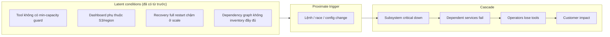
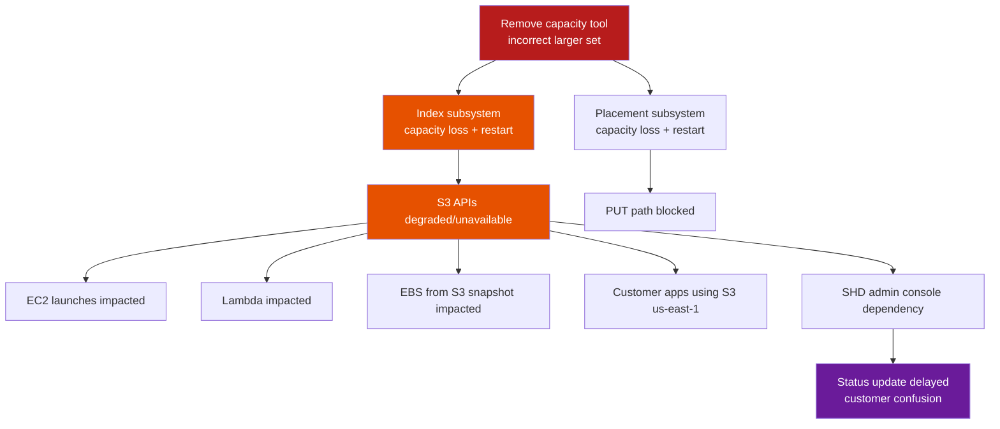
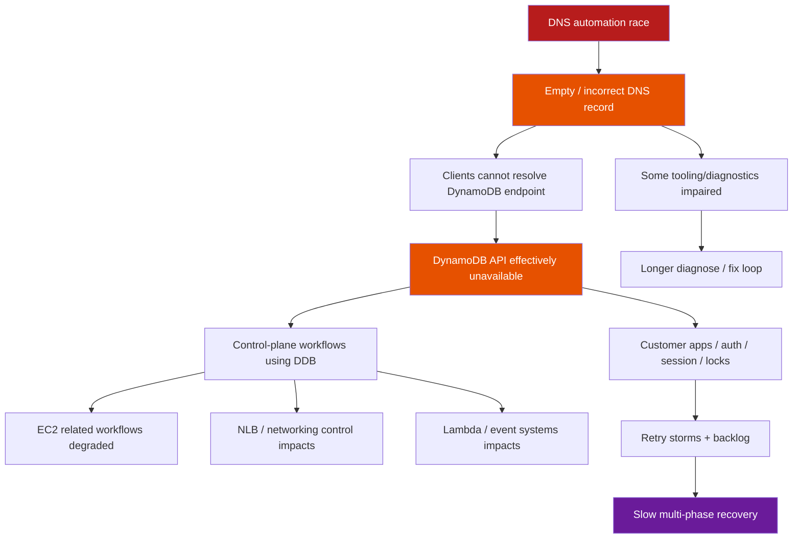
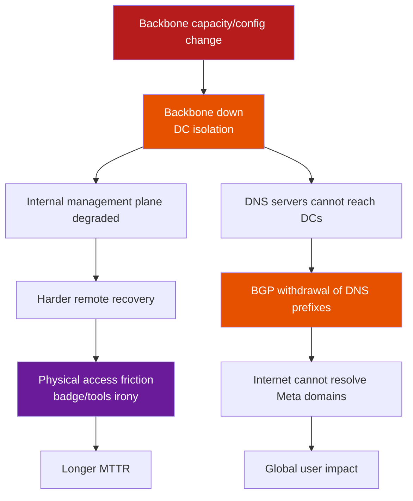
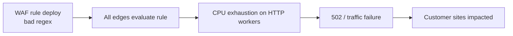
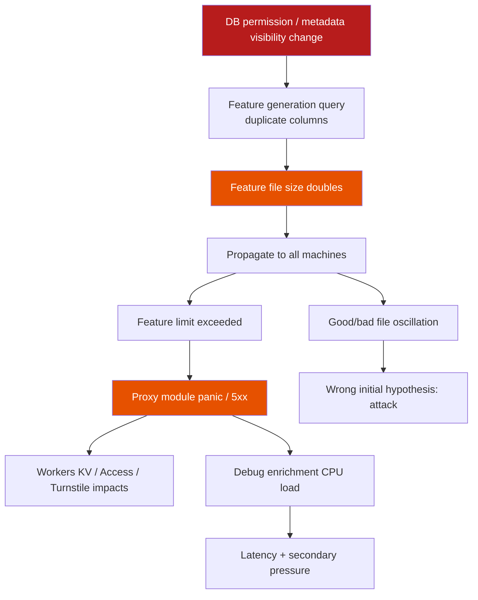
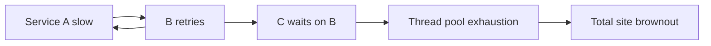
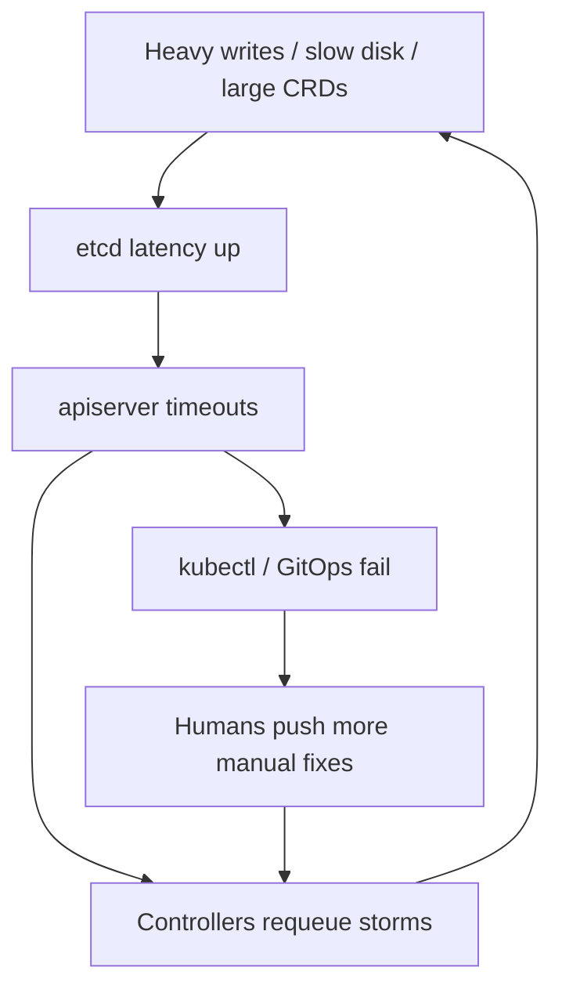
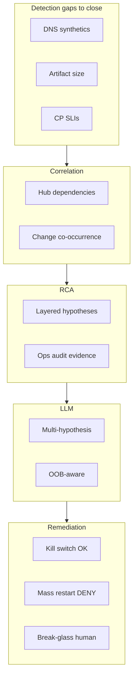

# Chapter 15 — Sự cố nổi tiếng & bài học cho AIOps pipeline

> **Chương này không phải gallery “sự cố kinh hoàng”. Đây là phòng lab hệ thống: cách đọc postmortem như engineer, cách tách nguyên nhân gần vs nguyên nhân hệ thống, và cách chuyển mỗi lớp lỗi (tool safety, coupling, feedback loop, observability blind spot) thành yêu cầu thiết kế cụ thể cho pipeline AIOps — từ Detection đến Remediation. Tinh thần tham chiếu: Richard Cook, *How Complex Systems Fail* — hệ thống phức tạp luôn ở trạng thái hỏng một phần; sự cố là khi các latent condition gặp nhau đúng lúc.**

---

### Architecture poster — control plane vs data plane


*Poster: bài học S3/DynamoDB/Meta — recovery tools không được phụ thuộc mặt phẳng đang gãy.*


## Prerequisites

- [00 — Giới thiệu AIOps](../00-introduction.vi.md) — triết lý pipeline và khi nào AIOps thất bại
- [07 — Anomaly Detection](../07-anomaly-detection/README.vi.md) — tín hiệu sớm và giới hạn phát hiện
- [08 — Alert Correlation](../08-alert-correlation/README.vi.md) — gom cảnh báo phân tầng
- [09 — Root Cause Analysis](../09-root-cause-analysis/README.vi.md) — proximate vs systemic cause
- [11 — Remediation](../11-remediation/README.vi.md) — safety gate, blast radius, rollback
- [12 — Production](../12-production/README.vi.md) — chaos, DR, runbook, maturity

## Related Documents

- [01 — Observability](../01-observability/README.vi.md) — blind spot và “dashboard cũng phụ thuộc hệ thống bị hỏng”
- [06 — Kafka](../06-kafka/README.vi.md) — control plane / data plane tách biệt trong vận chuyển tín hiệu
- [10 — LLM Agent](../10-llm-agent/README.vi.md) — khi LLM giúp điều tra và khi nó chỉ thêm nhiễu

## Next Reading

Sau chương này, quay lại [12 — Production](../12-production/README.vi.md) để áp dụng checklist design review và game day vào platform AIOps của bạn; hoặc mở rộng personal incident library theo mục 11.

---

## Table of Contents

1. [Cách đọc postmortem như engineer](#1-cách-đọc-postmortem-như-engineer)
2. [AWS S3 2017 (us-east-1)](#2-aws-s3-2017-us-east-1)
3. [AWS DynamoDB / DNS automation (US-EAST-1, Oct 2025)](#3-aws-dynamodb--dns-automation-us-east-1-oct-2025)
4. [Meta / Facebook 4 Oct 2021](#4-meta--facebook-4-oct-2021)
5. [Cloudflare major outages (2019 regex, 2025 bot management config)](#5-cloudflare-major-outages-2019-regex-2025-bot-management-config)
6. [Google SRE classic lessons](#6-google-sre-classic-lessons)
7. [Kubernetes / etcd / control plane war stories](#7-kubernetes--etcd--control-plane-war-stories)
8. [GitHub, Slack, Discord, Fastly-class CDN incidents](#8-github-slack-discord-fastly-class-cdn-incidents)
9. [Taxonomy of failure modes for AIOps design](#9-taxonomy-of-failure-modes-for-aiops-design)
10. [Mapping incidents → handbook pipeline stages](#10-mapping-incidents--handbook-pipeline-stages)
11. [Building a personal “incident library” for your org](#11-building-a-personal-incident-library-for-your-org)
12. [Game days & tabletop exercises](#12-game-days--tabletop-exercises-derived-from-famous-incidents)
13. [Checklist: design reviews “what would S3-2017 look like here?”](#13-checklist-design-reviews-that-ask-what-would-s3-2017-look-like-here)
14. [90-day learning program for on-call](#14-90-day-learning-program-for-on-call)
15. [Socratic scenarios](#15-socratic-scenarios)

---

## 1. Cách đọc postmortem như engineer

### 1.1 Mục tiêu đọc không phải “ai sai”

Postmortem công khai là tài sản học tập rẻ nhất mà ngành vận hành có. Cách đọc sai phổ biến:

| Cách đọc yếu | Cách đọc engineer |
|--------------|-------------------|
| Tìm “người gõ nhầm” | Tìm **latent conditions** cho phép một thao tác đơn giản gây blast radius lớn |
| Kết luận “tool dở” | Hỏi tool đó **thiếu guardrail nào**, ai tin guardrail đã đủ, và tại sao không test recovery |
| Copy timeline | Tách **proximate trigger** khỏi **systemic enablers** |
| “AIOps sẽ cứu” | Hỏi **tín hiệu nào có sớm**, **remediation nào an toàn**, **control plane nào cũng sập** |

> [!IMPORTANT]
> **Blameless không có nghĩa là không chịu trách nhiệm hệ thống**
> Blameless nghĩa là: không kết thúc bằng “kỹ sư X bất cẩn”. Kết thúc bằng: “hệ thống cho phép thao tác này không an toàn, feedback chậm, recovery phụ thuộc đúng thành phần hỏng”. Trách nhiệm nằm ở thiết kế, quy trình, incentive, và architecture — không ở cá nhân.

### 1.2 Proximate cause vs systemic cause

**Proximate cause (nguyên nhân gần):** sự kiện kích hoạt ngay trước impact — lệnh sai tham số, race condition chạy đúng lúc, rule regex deploy, backbone capacity command.

**Systemic cause (nguyên nhân hệ thống):** các điều kiện nền đã tồn tại lâu trước trigger:

- Thiếu interlock an toàn trên operational tool
- Coupling mạnh giữa data plane và status/dashboard/control plane
- Recovery path phụ thuộc chính dịch vụ đang hỏng
- Global push config không có progressive delivery
- Feedback loop (retry, health check, BGP withdrawal) khuếch đại lỗi
- Observability blind spot: “mù” đúng lúc cần mắt nhất



### 1.3 Khung đọc postmortem 7 câu hỏi

Khi đọc bất kỳ postmortem (nội bộ hay công khai), trả lời lần lượt:

1. **Trigger** là gì? (command, deploy, race, load)
2. **Điều kiện nền** nào khiến trigger thành catastrophe thay vì no-op an toàn?
3. **Cascade mechanism** — tín hiệu lỗi lan bằng dependency, retry, cache, DNS, hay shared fate?
4. **Detection gap** — khách hàng báo trước hay telemetry nội bộ?
5. **Tooling gap** — operator mất dashboard, SSH, badge, DNS, API?
6. **What would NOT have helped** — tránh ảo tưởng “AIOps magic”
7. **Concrete design change** — 1–3 thay đổi có thể ship trong 90 ngày

> [!NOTE]
> **Ý TƯỞNG — Cook’s mental model**
> Hệ thống phức tạp luôn có lỗi tiềm ẩn. Safety là emergent property từ tương tác, không phải từ “zero defect component”. Postmortem tốt mô tả **tương tác** (coupling, feedback, resource limits), không dừng ở “bug fixed”.

### 1.3.1 Ánh xạ tinh thần *How Complex Systems Fail* sang AIOps

Richard Cook mô tả một số thuộc tính lặp lại của hệ thống phức tạp. Dưới đây là bản “dịch” sang ngôn ngữ pipeline AIOps — không phải trích dẫn pháp lý, mà là **lens** khi đọc postmortem và khi review design:

| Thuộc tính hệ phức tạp (tinh thần Cook) | Hệ quả cho AIOps |
|------------------------------------------|------------------|
| Complex systems are intrinsically hazardous | Anomaly “zero false positive” là ảo tưởng; cần budget và prioritization |
| Complexity causes change | Model topology/baseline phải update liên tục; stale graph = RCA sai |
| Complex systems run in degraded mode | “Green dashboard” không chứng minh healthy; cần SLI multi-layer |
| Catastrophe requires multiple failures | Correlation + multi-signal RCA quan trọng hơn single metric threshold |
| Post-accident attribution hindsight bias | Postmortem template cấm “should have known”; buộc latent condition list |
| Hindsight makes accidents look linear | Timeline thực tế có song song, flapping, wrong hypotheses — AIOps UI phải show uncertainty |
| Safety is a dynamic non-event | Đo “gần sự cố” (near miss, guardrail trips) chứ không chỉ outage count |
| People continuously create safety | Human-in-the-loop và teach-back on-call là feature, không phải failure of automation |

> [!TIP]
> **Near miss cũng là dữ liệu AIOps**
> Mỗi lần safety gate **chặn** remediation nguy hiểm, mỗi lần canary halt config push — hãy log như “safety success”. Nếu bạn chỉ train/report trên outage, bạn đang mù nửa bức tranh Cook.

### 1.3.2 Mẫu ghi chép khi đọc postmortem (template 15 phút)

```text
[Nguồn official]: URL / ngày
[Proximate trigger]:
[Latent conditions] (liệt kê ≥ 3):
[Cascade 5 bước]:
[Detection: ai báo trước — customer / synthetic / human]:
[Tooling lost during incident]:
[AIOps would help]:
[AIOps would hurt / not help]:
[1 design change ship trong 90 ngày cho ORG ta]:
[Owner + ticket]:
```

In đều template này vào wiki onboarding; sau 10 postmortem, team có chung vocabulary.

### 1.4 Looking for: latent conditions, coupling, feedback loops, tool safety, observability blind spots

#### Latent conditions

Là “mìn đã chôn”: race condition chưa bao giờ gặp, tool CLI cho phép xóa quá nhiều capacity, query config không filter database name, health check rút BGP khi backbone im lặng.

Dấu hiệu trong postmortem:

- “This had worked for years”
- “We had planned to partition later”
- “The automation failed to repair”
- “Assumptions about query results changed”

#### Coupling (khớp nối)

Hai hệ thống **coupled** nếu failure của A làm B fail theo cách không có fallback độc lập.

| Loại coupling | Ví dụ từ sự cố công khai |
|---------------|--------------------------|
| Data dependency | EC2 launch / Lambda phụ thuộc S3 |
| Control-plane dependency | Recovery tool gọi API cùng region đang hỏng |
| Shared fate config | Global feature file push tới mọi PoP |
| Physical/process | Badge/door system phụ thuộc network nội bộ |
| Observability coupling | Status page admin console phụ thuộc dịch vụ bị impact |

#### Feedback loops

- **Positive feedback (khuếch đại):** retry storm → overload → nhiều timeout → nhiều retry
- **Protective feedback đi lệch:** DNS server withdraw BGP khi không “thấy” DC → internet không resolve được dù DNS process còn sống
- **Automation feedback:** remediation restart pod → thundering herd → etcd worse

#### Tool safety

Câu hỏi thiết kế:

- Tool có **hard limit** blast radius không?
- Có **dry-run / confirmation / two-person rule** cho thao tác irreversible?
- Có **rate limit** remove capacity / push config?
- Có **kill switch** feature toàn cục?

#### Observability blind spots

- Metric tồn tại nhưng **dashboard phụ thuộc** đúng store hỏng
- Alert fire nhưng **paging path** đi qua dịch vụ down
- AIOps pipeline “mù” vì Kafka/Prometheus remote_write cùng region SPOF
- Error enrichment tự động **tiêu thụ CPU** khi error rate cao (quan sát làm nặng failure)

> [!TIP]
> **Cách luyện**
> Mỗi tuần đọc 1 postmortem công khai. Viết ½ trang: proximate, systemic, cascade diagram 5 node, 1 detection gap, 1 design change cho hệ thống *của bạn*. Sau 12 tuần bạn có personal library đủ để design review.

### 1.5 Phân lớp “AIOps would / would not help”

| Lớp | AIOps thường **giúp** | AIOps thường **không giúp** (thậm chí hại) |
|-----|------------------------|---------------------------------------------|
| Detection | Anomaly latency/error sớm hơn human | Khi telemetry plane cũng down |
| Correlation | Gom 500 alert thành 1 incident | Khi topology model sai / thiếu dependency ẩn |
| RCA | Gợi ý change recent, log pattern | Khi root cause là physical/OOB / DNS empty toàn cục |
| LLM | Tóm tắt runbook, so timeline | Khi hallucinate action trên control plane hỏng |
| Remediation | Scale-out, circuit break, feature kill | Restart thundering herd; auto-fix DNS planner mù |

> [!WARNING]
> **Đừng dùng AIOps như bùa hộ mệnh**
> Nhiều sự cố lớn nhất ngành là **control-plane / global-config / shared-fate**. Pipeline AIOps chạy *trên* các dependency đó sẽ fail cùng lúc. Thiết kế “out-of-band break glass” quan trọng hơn model ML tinh xảo.

---

## 2. AWS S3 2017 (us-east-1)

### 2.1 Bối cảnh công khai (public facts)

Ngày **28/02/2017**, region **US-EAST-1**, Amazon S3 gặp gián đoạn lớn. Theo tóm tắt chính thức của AWS:

- Team S3 đang debug billing subsystem chạy chậm hơn kỳ vọng.
- Khoảng **9:37 AM PST**, thành viên team có thẩm quyền, theo playbook, chạy lệnh **gỡ capacity** (remove servers) cho một subsystem liên quan billing.
- **Một input của lệnh nhập sai** → gỡ nhiều server hơn dự định.
- Capacity bị gỡ nhầm thuộc **hai subsystem khác**:
  - **Index subsystem** — metadata và location của object; cần cho GET/LIST/PUT/DELETE.
  - **Placement subsystem** — cấp phát storage mới; phụ thuộc index; liên quan PUT.
- Cả hai cần **full restart**. Ở scale của S3 lúc đó, restart + safety checks metadata **lâu hơn kỳ vọng** (subsystem lớn đã lâu không full restart).
- Dịch vụ khác phụ thuộc S3 trong region (console S3, EC2 launch mới, EBS từ snapshot S3, Lambda, …) bị impact.
- **AWS Service Health Dashboard (SHD)** admin console cũng phụ thuộc S3 → một thời gian không cập nhật được status từng service; phải dùng Twitter/@AWSCloud và banner.

Thời điểm phục hồi (theo AWS): index đủ capacity khoảng 12:26 PM PST; index full ~1:18 PM; placement ~1:54 PM PST.

### 2.2 Timeline logic (không sensational)

```text
T0  Debug billing slow path (không phải “S3 data corrupt”)
T1  Chạy remove-capacity theo playbook
T2  Input sai → remove quá nhiều capacity index + placement
T3  Subsystem critical không phục vụ API S3
T4  Dependent AWS services + customer apps fail (shared dependency)
T5  SHD admin bị ảnh hưởng (observability/comms coupling)
T6  Restart + integrity checks kéo dài (scale + rare full restart)
T7  Index recover → GET/LIST/DELETE
T8  Placement recover → PUT bình thường
T9  Backlog dependent services drain
```

### 2.3 Root cause class

| Lớp | Phân loại |
|-----|-----------|
| Proximate | Incorrect input to capacity-removal operational tool |
| Systemic — tool safety | Tool cho phép remove dưới mức min capacity quá nhanh |
| Systemic — scale/recovery | Full restart path hiếm khi exercise ở large region |
| Systemic — coupling | Nhiều service AWS + customer stack “shared fate” trên S3 us-east-1 |
| Systemic — observability | Status communication path phụ thuộc S3 |

**Không phải** “cloud không tin cậy một cách thần bí”. Đây là **operational tool without adequate safety interlocks** + **recovery time underestimated at scale**.

### 2.4 Cascade mechanism



Cơ chế cascade:

1. **Direct capacity loss** → critical control/metadata plane của object store.
2. **Hard dependency fan-out** → mọi consumer coi S3 là always-available trong region.
3. **Comms plane coupling** → dashboard status không update → MTTD *nhận thức khách hàng* tăng, trust giảm.
4. **Recovery backlog** → dependent services tích work queue trong lúc S3 down.

### 2.5 Detection gap

- Impact external (customer 4xx/5xx, failed uploads) xuất hiện nhanh.
- Internal: team đã *trong* debugging session — detection “có sự cố” không phải thách thức chính.
- Thách thức chính: **hiểu blast radius**, **ước lượng recovery time**, **giao tiếp status** khi SHD phụ thuộc S3.
- Class problem: **monitoring of the monitor** / **status plane independence**.

### 2.6 What AIOps would / would not have helped

| Khả năng AIOps | Giúp? | Giải thích |
|----------------|-------|------------|
| Anomaly detection trên S3 API error rate | Có phần | Phát hiện customer-facing impact nhanh hơn manual |
| Correlation “S3 + EC2 launch + Lambda” | Có | Gom shared-fate alerts |
| RCA “recent capacity removal command” | Có *nếu* change/audit log operational tool được ingest | Cần telemetry **change events**, không chỉ metrics |
| Auto-remediation “restart index faster” | Không an toàn | Full restart đang là recovery path; auto-action mù có thể làm hỏng integrity checks |
| Auto-remediation “re-add capacity via same tool” | Nguy hiểm | Cùng class tool thiếu guardrail |
| LLM tóm tắt runbook recovery | Có *hạn chế* | Hữu ích khi operator còn access tool; vô dụng nếu status/console path hỏng |
| Multi-region customer failover automation | Có (phía customer) | Đây là design *consumer*, không phải fix AWS nội bộ |

> [!NOTE]
> **Bài học AIOps cốt lõi từ S3-2017**
> Operational tools cần **safety interlocks** giống production API. AI remediation engine **cũng là operational tool**. Nếu remediation action catalog không có min-capacity, rate limit, blast radius, two-person rule — bạn đang tái tạo đúng class lỗi S3-2017 *bên trong* AIOps.

### 2.7 Concrete design changes (áp vào platform của bạn)

1. **Safety interlocks trên mọi destructive CLI/API**
   - Min capacity floor theo subsystem
   - Max % capacity removable / time window
   - Dry-run bắt buộc; production require approval ticket + second approver cho high blast

2. **Audit + change stream cho ops tools**
   - Mọi capacity remove / config push emit event vào [06 — Kafka](../06-kafka/README.vi.md) topic `aiops-change-events`
   - Correlation engine ([08](../08-alert-correlation/README.vi.md)) ưu tiên change trong cửa sổ 15–30 phút

3. **Status / observability independence**
   - Status page, PagerDuty bridge, break-glass docs **không** phụ thuộc primary object store / primary region
   - Xem [01 — Observability](../01-observability/README.vi.md) và [12 — Production](../12-production/README.vi.md)

4. **Exercise rare recovery paths**
   - Game day: full restart (hoặc cell restart) subsystem quan trọng *trước khi* scale làm path “chưa ai chạy 5 năm”

5. **Consumer multi-AZ/region patterns**
   - Ứng dụng critical không single-region S3 dependency không failover

### 2.8 Mapping nhanh pipeline handbook

| Stage | Gap S3-2017 class |
|-------|-------------------|
| Detection | OK nếu API metrics; fail nếu dashboard store = S3 hỏng |
| Correlation | Cần model shared dependency object storage |
| RCA | Cần operational change events, không chỉ deploy git |
| LLM | Hữu ích tóm tắt; không thay guardrail tool |
| Remediation | **Không auto** capacity remove; auto chỉ rollback *nếu* đã có snapshot plan an toàn |

### 2.9 Góc nhìn consumer (khách hàng của object store)

S3-2017 không chỉ là bài học cho cloud provider. Phần lớn MTTR *của doanh nghiệp dùng AWS* bị kéo dài vì:

1. **Single-region hard dependency** — app critical chỉ trỏ `us-east-1` không failover.
2. **Control path trùng data path** — deploy artifact, Terraform state, container layers, log archive đều trên cùng bucket/region.
3. **Thiếu cache / degraded mode** — không đọc được config từ object store thì process crash thay vì serve last-known-good.
4. **Alert routing phụ thuộc** webhook lưu payload trên cùng storage stack.

Checklist consumer (đưa vào design review dịch vụ):

| Câu hỏi | Pass criteria |
|---------|---------------|
| App có chạy được 15 phút khi object store GET fail không? | Degraded mode / local cache |
| Deploy pipeline có mirror multi-region không? | Ít nhất 2 region cho artifact critical |
| Runbook PDF/HTML có bản offline không? | USB / laptop cache / printed bridge card |
| AIOps knowledge base có replicate không? | Không single bucket SPOF |

> [!NOTE]
> **AIOps-as-consumer**
> Bản thân platform AIOps trong handbook thường dùng S3-compatible storage cho Loki/Tempo/Thanos. Hãy đọc lại [04 — Loki](../04-loki/README.vi.md), [05 — Tempo](../05-tempo/README.vi.md), [12 — Production](../12-production/README.vi.md) với câu hỏi: “S3-2017 class xảy ra với bucket telemetry thì on-call còn mắt không?”

### 2.10 Anti-lessons (đừng rút sai)

| Kết luận sai | Kết luận đúng |
|--------------|---------------|
| “Đừng bao giờ remove capacity” | Remove capacity là ops hợp lệ; cần **guardrail** |
| “Cloud không dùng được” | Shared fate + single region là lựa chọn architecture của consumer |
| “Chỉ cần multi-cloud” | Multi-cloud không cứu tool safety nội bộ hay status coupling |
| “AI sẽ không gõ nhầm” | Automation/AI **cũng** là operator với blast radius lớn hơn |

---

## 3. AWS DynamoDB / DNS automation (US-EAST-1, Oct 2025)

### 3.1 Bối cảnh công khai (public themes)

Khoảng **19–20/10/2025**, region **US-EAST-1** trải qua sự cố lớn với **Amazon DynamoDB** là điểm khởi đầu, theo post-event summary công khai của AWS và phân tích bên thứ ba nhất quán:

- **Root technical cause:** latent **race condition** trong hệ thống **DNS management automation** của DynamoDB.
- Hậu quả: **DNS record không đúng / empty** cho regional endpoint (ví dụ `dynamodb.us-east-1.amazonaws.com`), automation **không tự repair** được trạng thái hỏng.
- Client và service nội bộ **không resolve** endpoint → connection failure lan rộng.
- **Cascade** sang nhiều dịch vụ phụ thuộc DynamoDB / control plane region (EC2, NLB, Lambda, và hệ sinh thái customer).
- Phục hồi DNS là bước cần nhưng **không đủ**: cascading effects, backlog, dependency recovery kéo dài nhiều giờ sau khi DNS đã “đúng trở lại”.
- Bài học kiến trúc nổi bật trong diễn ngôn công khai: **recovery tooling và dependent control planes** có thể **phụ thuộc chính plane đang impaired**.

> [!IMPORTANT]
> **Paraphrase, không suy diễn nội bộ**
> Mục này chỉ dựa trên thông tin public (AWS summary + postmortem analysis công khai). Không gán lỗi cá nhân, không thêm chi tiết không công bố. Dùng như **class incident**: *DNS automation race + empty record + cascade + recovery coupling*.

### 3.2 Timeline logic (mô hình hóa)

```text
T0  DNS Planner / Enactor automation chạy (bình thường, tần suất cao)
T1  Race condition → trạng thái DNS “empty / incorrect” cho regional endpoint
T2  Automation không self-heal (bug path / invalid state)
T3  Resolvers/clients fail lookup → DynamoDB API unreachable
T4  AWS services & customer apps phụ thuộc DynamoDB fail (auth, state, locks, …)
T5  Operators identify DNS as symptom; begin manual restore / mitigations
T6  DNS restored; cache TTLs expire dần → connectivity trở lại từng phần
T7  Secondary cascades (instance management, load balancers, queues) recover chậm
T8  Full regional normalization sau nhiều phase
```

### 3.3 Root cause class

| Lớp | Phân loại |
|-----|-----------|
| Proximate | Race in DNS automation → empty/incorrect record |
| Systemic — concurrency | Automation concurrent writers/planners không invariant an toàn |
| Systemic — self-healing gap | Automation không detect/repair empty endpoint state |
| Systemic — dependency concentration | DynamoDB là shared state plane cho nhiều control workflows |
| Systemic — recovery coupling | Một số recovery path phụ thuộc service/region đang ill |
| Systemic — DNS as SPOF class | DNS empty = total logical unavailability dù storage còn |

### 3.4 Cascade mechanism



Cơ chế quan trọng:

1. **Logical unavailability qua DNS** — backend có thể còn “sống” nhưng unreachable by name.
2. **Fan-out dependency** — mọi service coi regional endpoint always resolvable.
3. **Cache TTL** — recovery không instant: clients bám negative/empty cache.
4. **Secondary overload** — khi DNS về, thundering herd connection.
5. **Impaired recovery plane** — nếu automation/console/API phụ thuộc đúng dependency hỏng, human path khó hơn.

### 3.5 Detection gap

- Customer-facing errors (timeouts, SDK failures) có thể xuất hiện trước khi “DNS empty” được hiểu là root.
- Metrics “DynamoDB server CPU healthy” có thể **bình thường** trong khi **name resolution** fail → classic **wrong layer metrics**.
- Cần signals:
  - Synthetic DNS checks từ nhiều resolver vantage
  - Client-side resolve failure metrics
  - Endpoint empty-record canary
  - Correlation “nhiều service fail cùng pattern NXDOMAIN/empty”

### 3.6 What AIOps would / would not have helped

| Khả năng | Giúp? | Chi tiết |
|----------|-------|----------|
| Multi-signal anomaly (error rate + DNS resolve fail) | **Có** | Class detection gap: server metrics ≠ client reachability |
| Correlation “50 services fail us-east-1 same minute” | **Có** | Shared fate / dependency hub |
| RCA “DNS record empty” | **Có nếu** có DNS canary + change automation logs | Cần telemetry DNS plane |
| Auto-remediation “restart DynamoDB nodes” | **Không / hại** | Sai layer; có thể tăng load |
| Auto-remediation “re-run DNS planner” | **Nguy hiểm** | Cùng automation race-prone |
| Out-of-band break-glass DNS restore playbook | **Có** (human + OOB) | AIOps nên *gợi ý* runbook OOB, không execute mù |
| LLM | Tóm tắt dependency map | Không “sửa DNS” nếu control API down |

> [!WARNING]
> **Bài học AIOps #1 từ class DNS automation**
> **Không bao giờ** để remediation control-plane **chỉ** phụ thuộc data-plane / API-plane mà nó đang giám sát. Cần **out-of-band break glass**: channel riêng, credential riêng, jump host / serial console / pre-staged known-good config, documentation offline.

### 3.7 Concrete design changes

1. **DNS / endpoint health as first-class SLO**
   - Synthetic resolve + connect từ multi-AZ và multi-network
   - Alert riêng: `endpoint_dns_empty` / `resolve_fail_ratio`

2. **Automation safety**
   - Invariant: regional endpoint record **never empty** (reject apply)
   - Quorum / compare-and-swap cho DNS plan apply
   - Canary apply một cell trước global

3. **Dependency inventory**
   - Catalog “ai phụ thuộc DynamoDB/regional endpoint” cho correlation topology ([09 — RCA](../09-root-cause-analysis/README.vi.md))

4. **Break-glass architecture** ([11 — Remediation](../11-remediation/README.vi.md), [12 — Production](../12-production/README.vi.md))
   - Runbook restore DNS known-good **không** qua API đang fail
   - AIOps decision engine: nếu `dns_plane_impaired=true` → **disable auto-remediation**, page human + OOB checklist

5. **Recovery load management**
   - Adaptive concurrency khi service trở lại (mục 6 Google lessons)
   - Client SDK jittered backoff bắt buộc

### 3.8 Liên hệ pipeline stages

| Stage | Thiết kế bắt buộc |
|-------|-------------------|
| Detection | Client-side + DNS synthetic, không chỉ server metrics |
| Correlation | Hub dependency (DynamoDB/DNS) as correlation key |
| RCA | Layered hypotheses: DNS → network → process → data |
| LLM | Prefer OOB runbook retrieval from local cache |
| Remediation | Fail-closed automation when control plane suspect |

### 3.9 Recovery phases — vì sao “DNS fixed” chưa phải hết sự cố

Class sự cố DNS endpoint thường có **nhiều pha phục hồi** tách biệt. IC và AIOps phải model được, nếu không dashboard “DynamoDB green” sẽ làm team demobilize sớm:

| Phase | Việc xảy ra | Metric / signal | AIOps behavior |
|-------|-------------|-----------------|----------------|
| P1 Identify | Nhận ra layer DNS, không phải CPU node | Resolve fail, empty record canary | Raise incident severity; tag `layer=dns` |
| P2 Restore record | Manual/OOB write known-good | Authoritative answers correct | Still **fail-closed** auto app restarts |
| P3 Cache expire | Client/resolver TTL drain | Success ratio tăng theo sóng | Expect flapping regionally |
| P4 Dependency thaw | Services re-establish pools/locks | Queue depth, login success | Enable **limited** scale/shed assists |
| P5 Herd control | Connection storms | Accept queue, thread pool | Prefer concurrency caps over restart |
| P6 Backlog drain | Async workers catch up | Lag metrics | Avoid deploy freeze lift quá sớm |
| P7 Normalize | Error budgets recover | SLO burn rate | Postmortem + automation invariant fix |

> [!IMPORTANT]
> **AIOps không được “close incident” chỉ vì một SLI về green**
> Rule: multi-phase incidents cần **composite recovery score** (DNS + API + dependency fan-out + backlog). Xem [08 — Alert Correlation](../08-alert-correlation/README.vi.md) cho incident lifecycle states.

### 3.10 Invariants nên encode vào automation tests

Những invariant sau nên trở thành unit/integration test của *bất kỳ* DNS/endpoint planner nội bộ — và thành policy check trong AIOps khi quan sát automation self-change:

1. **Non-empty endpoint set:** plan apply bị reject nếu RRset rỗng.
2. **Quorum writers:** không cho hai enactor “last write wins” không version.
3. **Canary cell first:** plan mới chỉ áp 1 cell; health gate trước regional.
4. **Self-heal deadline:** nếu empty phát hiện > N giây → page human, không silent.
5. **Planner ≠ only recovery path:** known-good snapshot restore tồn tại OOB.

```text
# Pseudo-policy cho remediation engine
IF signal.dns_empty_endpoint:
  DISABLE actions: [restart_fleet, scale_out_all, re_run_dns_planner]
  ENABLE suggestions: [oob_restore_known_good_dns, page_network_oncall]
  REQUIRE human_ack: true
```

---

## 4. Meta / Facebook 4 Oct 2021

### 4.1 Bối cảnh công khai

Ngày **4/10/2021**, các dịch vụ Meta (Facebook, Instagram, WhatsApp, …) không reachable trên Internet trong nhiều giờ. Theo blog engineering của Meta và quan sát bên ngoài (BGP/DNS):

- Trigger: thao tác/maintenance liên quan hệ thống quản lý **global backbone capacity**.
- Lệnh/config làm **backbone** mất kết nối giữa các data center theo cách không mong muốn.
- DNS authoritative của Meta **tự withdraw BGP advertisements** khi không nói chuyện được với data centers (thiết kế “unhealthy → withdraw”).
- Hệ quả: Internet **không resolve** được tên miền Meta, dù một số server DNS process về mặt local vẫn “có thể còn chạy”.
- **Irony vận hành:** nhân viên gặp khó khăn tiếp cận data center / hệ thống nội bộ — bao gồm các dependency vật lý và identity (badge / door / internal tools) gắn với cùng ecosystem mạng.

### 4.2 Timeline logic

```text
T0  Maintenance / capacity assessment on backbone management system
T1  Backbone connectivity between DCs broken
T2  Internal services + management planes lose paths
T3  DNS servers mark network unhealthy → withdraw BGP for DNS prefixes
T4  Global resolvers cannot reach authoritative DNS → SERVFAIL / timeout
T5  Apps and external clients “disappear” from Internet view
T6  Operators struggle with out-of-band access / physical access friction
T7  Manual/OOB restoration of backbone + BGP + DNS advertisements
T8  Gradual recovery as caches and sessions re-establish
```

### 4.3 Root cause class

| Lớp | Phân loại |
|-----|-----------|
| Proximate | Backbone capacity/management command with unintended total isolation |
| Systemic — safety of network change | Staged / guardrail thiếu cho blast radius backbone |
| Systemic — protective logic inversion | Health-based BGP withdrawal khuếch đại thành total external unreachability |
| Systemic — management plane coupling | Tools, auth, physical access phụ thuộc production network |
| Systemic — dependency inventory incomplete | Physical + identity systems không được coi là critical dependency |

### 4.4 Cascade mechanism



### 4.5 Detection gap

- Bên ngoài: BGP withdrawal và DNS failure **rất rõ** (third-party visibility cao).
- Bên trong: khi backbone + tools down, **MTTD nội bộ** và **khả năng act** là vấn đề — không chỉ “có alert hay không”.
- Class: **detection exists but actuation path is dead**.

### 4.6 What AIOps would / would not have helped

| Khả năng | Giúp? | Ghi chú |
|----------|-------|---------|
| External synthetic monitoring (DNS/BGP) | **Có** (customer/edge view) | Phát hiện “biến mất khỏi Internet” |
| Internal metric AIOps | **Yếu** | Telemetry path đi backbone hỏng |
| Correlation | **Hữu ích sau** | Học pattern BGP+DNS co-fail |
| Auto-remediation network | **Cực kỳ nguy hiểm** | Sai config network automation = cùng class |
| LLM on laptop offline runbook | **Có** | Nếu runbook OOB đã cache local |
| AIOps cluster in-region | **Fail cùng fate** | Shared network fate |

> [!TIP]
> **Bài học AIOps / SRE**
> Inventory dependency phải gồm **physical, identity, badge, DNS, BGP, out-of-band console**. AIOps topology chỉ vẽ service mesh là **thiếu**. Khi thiết kế [09 — RCA](../09-root-cause-analysis/README.vi.md), thêm node types: `network_fabric`, `identity`, `physical_access`, `dns_authority`.

### 4.7 Concrete design changes

1. **Out-of-band management plane**
   - Console server, cellular/satellite path, separate management VRF
   - Break-glass credentials không phụ thuộc IdP production

2. **Staged network changes**
   - Canary site / canary backbone segment
   - Automatic rollback nếu lose quorum DC connectivity

3. **Revisit “protective” withdraw logic**
   - Fail-open vs fail-closed cho DNS advertisement cần threat model riêng
   - Tránh single policy khiến total Internet unreachability

4. **Physical access independence**
   - Badge systems, door controllers: power + network fallback

5. **Tabletop: “entire backbone gone”**
   - Ai có quyền, ai vào DC, document inh ở đâu (paper/USB offline)

### 4.8 Dependency inventory mở rộng (template)

Sao chép bảng này vào service charter P0:

| Dependency | Type | Fail impact | OOB path? | In AIOps topology? |
|------------|------|-------------|-----------|---------------------|
| Primary DB | data | total | backup restore | yes |
| Cache | data | degraded | bypass | yes |
| IdP / SSO | identity | login fail | break-glass local admin | ? |
| DNS authoritative | network | total external | manual RRset | ? |
| BGP / transit | network | total external | NOC phone | often no |
| VPN / ZTNA | management | remote ops fail | cellular jump | often no |
| Badge / door | physical | DC entry delay | security escort SOP | almost never |
| Status page | comms | trust/MTTD | third-party host | should yes |
| Pager vendor | comms | no page | SMS gateway alt | should yes |
| AIOps cluster | meta | no auto help | human runbooks | self-watch |

> [!WARNING]
> **Irony badge không phải meme — là design input**
> Nếu physical access phụ thuộc production identity/network, MTTR có lower bound bằng “thời gian lái xe + security manual override”. Không model được thì AIOps SLA nội bộ là hư cấu.

### 4.9 AIOps self-hosting lesson

Chạy AIOps *bên trong* cùng backbone/VPC với production:

- Pros: latency thấp, cost thấp, data locality
- Cons: **shared fate** với đúng class Meta-2021 / DNS-2025

Mitigations:

1. Secondary AIOps “lite” ở region/provider khác: chỉ synthetic + paging bridge
2. Critical runbooks replicated to devices of on-call (encrypted)
3. Weekly test: “cắt API AIOps, on-call vẫn page được bằng kênh B”

---

## 5. Cloudflare major outages (2019 regex, 2025 bot management config)

Hai sự cố Cloudflare công khai cách nhau nhiều năm nhưng **cùng family**: global edge + config/rule generation + push rộng + failure mode lan nhanh.

### 5.1 July 2, 2019 — WAF regex CPU exhaustion

#### Public facts (rút gọn)

- Deploy rule mới trong WAF Managed Rules.
- Regex viết kém → **catastrophic backtracking** trên engine regex → **CPU exhaustion** trên cores phục vụ HTTP(S) toàn mạng.
- Customer thấy 502 / failure serving.
- Impact ngắn hơn nhiều sự cố khác (khoảng nửa giờ theo các tường thuật công khai) nhưng **blast radius global**.

#### Root cause class

| Lớp | Phân loại |
|-----|-----------|
| Proximate | Pathological regex in globally deployed WAF rule |
| Systemic — global push | Rule lan mọi edge gần như đồng thời |
| Systemic — CPU as shared fate | WAF path trên critical request path |
| Systemic — testing gap | Không bắt được backtracking worst-case trước prod |

#### Cascade



#### Detection gap

- CPU spike + 5xx global — tín hiệu mạnh.
- Phân biệt “DDoS” vs “self-DoS by config” có thể tốn thời gian (pattern lặp lại ở sự cố 2025).

#### AIOps would / would not

| | |
|--|--|
| **Would help** | Anomaly CPU + 5xx co-change với **config deploy event**; auto **kill switch** feature/rule |
| **Would not help alone** | ML anomaly không thay **regex complexity static analysis** pre-deploy |
| **Danger** | Auto-rollback toàn cục mù nếu thiếu canary signal |

#### Design changes

1. Static analysis / regex complexity budgets trước push
2. Progressive delivery rules: canary PoP → % traffic → global
3. CPU circuit breaker per module; fail open module thay vì kill process path (tuỳ threat model)
4. Global kill switch cho WAF managed ruleset mới

### 5.2 November 18, 2025 — Bot Management feature file size class

#### Public facts (rút gọn từ post Cloudflare)

- ~**11:20 UTC 18/11/2025**, core traffic failures; users thấy error page Cloudflare.
- **Không phải tấn công.** Trigger: thay đổi **database permissions** (ClickHouse) làm query metadata trả về **duplicate columns** → **feature file** của Bot Management **phình gấp đôi**.
- Feature file generate định kỳ (~vài phút), push toàn network.
- Software có **limit số features** (preallocate memory; limit ~200, use ~60). File vượt limit → **panic / error** trên core proxy module → **HTTP 5xx** cho traffic phụ thuộc path đó.
- Flapping ban đầu (good/bad file xen kẽ khi cluster permissions rollout dần) khiến team **tưởng DDoS**.
- Status page ngoài Cloudflare cũng lỗi **trùng thời điểm** (coincidence) → thêm nhiễu chẩn đoán.
- Observability/debug enrichment trên uncaught errors **tiêu thụ thêm CPU** khi error rate cao.
- Mitigation: dừng generation/propagation file xấu, chèn **known-good file**, restart proxy; recover dần đến ~17:06 UTC full.

#### Root cause class

| Lớp | Phân loại |
|-----|-----------|
| Proximate | Feature file oversized due to duplicate features from query/metadata change |
| Systemic — implicit schema assumptions | Query không filter database; assume shape ổn định |
| Systemic — hard fail on limit | `unwrap`/panic thay vì degrade Bot Management |
| Systemic — global frequent push | ML feature freshness vs safety trade-off |
| Systemic — diagnostic coupling | Error enrichment amplifies resource pressure |
| Systemic — incident cognition | Flapping + coincidental status outage → wrong hypothesis (attack) |

#### Cascade mechanism



#### Detection gap

- 5xx volume rõ.
- **Semantic gap:** “Bot feature file generation regression” không phải metric default.
- Cần: config artifact size metrics, schema row count, canary PoP error before global, generation-side validation.

#### AIOps would / would not

| Khả năng | Giúp? |
|----------|-------|
| Correlate deploy/permission change + 5xx | **Có** |
| Detect artifact size anomaly pre-full impact | **Có** nếu metric generation pipeline |
| Auto kill-switch Bot Management module | **Có** (feature flag safety) |
| Auto “fix by regenerating file” | **Nguy hiểm** nếu generator còn bad |
| Distinguish DDoS vs config | **Có** nếu có security + change signals joint model |
| LLM | Hữu ích liệt kê hypotheses; nguy hiểm nếu bias “always attack” |

> [!IMPORTANT]
> **Feature flags & global config là SPOF class**
> Bất kỳ artifact “nhỏ” push toàn edge (WAF rule, bot features, routing map) đều là **high blast radius**. AIOps remediation **push config** phải qua progressive delivery giống product deploy — xem [11 — Remediation](../11-remediation/README.vi.md) canary remediation.

### 5.3 Concrete design changes (gộp family Cloudflare)

1. **Progressive delivery cho config**
   - Canary PoPs, automatic halt on error budget burn
2. **Limits + graceful degradation**
   - Vượt limit → disable module, không panic worker toàn request path
3. **Treat generated config as untrusted input**
   - Schema validation, max bytes, max rows, checksum, signed artifacts
4. **Generation-side tests**
   - Contract test: column set, cardinality, size percentile
5. **Observability that does not amplify failure**
   - Rate-limit error enrichment / core dump storms ([12 — Production](../12-production/README.vi.md))
6. **Incident cognition aids**
   - Always show **recent config generations** beside traffic anomalies in AIOps UI

---

## 6. Google SRE classic lessons

Các bài học dưới đây dựa trên **chủ đề công khai** từ Google SRE books / industry SRE practice — không gán một outage Google cụ thể chưa công bố. Đây là **pattern library** bắt buộc cho AIOps design.

### 6.1 Cascading overload

Khi một dependency chậm:

1. Caller threads/timeouts tăng
2. Queue depth tăng
3. Retry tăng load dependency
4. Dependency chậm hơn → cascade sang neighbor services



### 6.2 Retry storms

| Anti-pattern | Design |
|--------------|--------|
| Immediate retry no jitter | Exponential backoff + full jitter |
| Unlimited retries | Budget retries per request chain |
| Retry on all errors | Retry only idempotent + transient |
| Client + mesh + app đều retry | **One layer** owns retry |

### 6.3 Load shedding & adaptive concurrency

- **Load shedding:** từ chối có chủ đích request low-priority để bảo vệ capacity.
- **Adaptive concurrency (AIMD-like):** giảm in-flight khi latency/error tăng; tăng dần khi healthy.
- **Priority retention:** auth/health/payment paths khác bulk export.

### 6.4 AIOps implications

| Lesson | Pipeline impact |
|--------|-----------------|
| Retry storms look like “multi-service outage” | Correlation phải nhận **downstream latency root** |
| Shedding is healthy | Anomaly detection **không** page mỗi khi 503 intentional |
| Adaptive concurrency changes traffic shape | Baseline models cần context “protection mode on” |
| Auto scale-out during overload | Có thể **đắt** và chậm; sometimes shed > scale |
| Auto restart during overload | Thường **làm tệ** (thundering herd) |

> [!NOTE]
> **Remediation catalog phải biết “đừng restart”**
> Trong [11 — Remediation](../11-remediation/README.vi.md), action `restart_pods` cần **precondition**: not in global overload, dependency healthy, error class = memory leak/single pod — không phải cascade 503.

### 6.5 Concrete design changes

1. Client libraries: default jittered backoff, retry budget
2. Service mesh: max retries = 1–2; disable stacked retries
3. Platform: load shedding middleware + brownout playbooks
4. AIOps: feature `protection_mode` from service to suppress false anomalies
5. Game day: kill dependency latency 2s → observe retry amplification

### 6.6 Worked example: latency injection → alert storm → bad remediation

Giả sử service `checkout` phụ thuộc `payment` và `inventory`:

```text
t=0     payment p99 = 50ms
t=1     payment p99 = 2000ms (dependency degradation)
t=2     checkout retries ×3 immediate → payment QPS ×3
t=3     inventory calls pile up (thread pool)
t=4     200 alerts: checkout 5xx, inventory latency, payment 503, node CPU, Kafka lag
t=5     Naive AIOps: "restart checkout pods"
t=6     Cold pods + reconnect → worse
```

**Correlation đúng** ([08](../08-alert-correlation/README.vi.md)): một incident, root candidate = payment latency.

**RCA đúng** ([09](../09-root-cause-analysis/README.vi.md)): evidence chain latency edges, không memory OOM.

**Remediation đúng** ([11](../11-remediation/README.vi.md)):

- Bật load shed trên checkout non-critical paths
- Giảm retry budget tạm thời (feature flag)
- Page payment owner
- **Không** restart checkout

**Anomaly detection** ([07](../07-anomaly-detection/README.vi.md)): cần suppress secondary anomalies khi `protection_mode` hoặc khi correlation đã gắn child alerts.

### 6.7 Bảng “overload symptoms vs recommended AIOps stance”

| Symptom | Thường là | AIOps stance |
|---------|-----------|--------------|
| 503 + latency up + retry rate up | Overload cascade | Shed / limit concurrency |
| 500 + single pod OOMKill | Local fault | Restart **one** pod |
| 503 + deploy 3m ago | Bad release | Canary rollback |
| 503 + dependency DNS fail | Wrong layer | OOB / DNS path |
| 429 apiserver + NotReady wave | Control plane | Protect CP; no mass restart |

---

## 7. Kubernetes / etcd / control plane war stories

### 7.1 Industry patterns (không gán một vendor)

Các pattern lặp lại trong cộng đồng:

- **etcd saturation** (disk fsync slow, too many writes, large objects)
- **apiserver death spiral** (list/watch storms, operators reconcile loops)
- **CNI / kubelet pressure** → NotReady node wave
- **Control plane vs data plane confusion** — pods still serving nhưng “cluster looks dead” trong kubectl
- **AIOps “helpful” restart** → simultaneous pod starts → registry/API/etcd overload

### 7.2 etcd saturation cascade



### 7.3 Root cause class

| Pattern | Class |
|---------|-------|
| etcd disk full / slow | Resource exhaustion control plane |
| Watch/list amplification | Feedback loop |
| Operator bad reconcile | Automation positive feedback |
| Pod kill loops | Remediation-induced cascade |

### 7.4 Detection gap

- App golden signals có thể **vẫn OK** (data plane) trong khi control plane đỏ.
- Cần SLIs riêng: apiserver latency, etcd leader stats, reconcile queue depth, admission latency.
- AIOps chỉ scrape app metrics → **mù control plane**.

### 7.5 What AIOps would / would not

| Action | Đánh giá |
|--------|----------|
| Detect etcd fsync latency anomaly | **Giúp** |
| Correlate NotReady nodes + apiserver 429 | **Giúp** |
| Auto `kubectl delete pod --all` | **Hại** |
| Auto scale cluster autoscaler max during API outage | **Thường hại** |
| Auto disable noisy operator | **Có thể giúp** nếu allowlist + canary |
| Suggest “etcd backup / defrag” runbook | **Giúp** (human) |

> [!WARNING]
> **AIOps restart pods có thể tạo thundering herd**
> Khi apiserver/etcd đang weak, simultaneous restarts là **tấn công DoS vào control plane**. Safety gate remediation: rate-limit restarts cluster-wide; backoff; prefer cordon/drain single node; deny mass actions when `apiserver_error_budget` burning.

### 7.6 Concrete design changes

1. Separate alerting for **control plane SLO** vs **data plane SLO**
2. etcd: dedicated disk, size limits on CRDs, defrag policy
3. Operator: exponential backoff, jitter, paginated lists
4. Remediation engine:
   - `max_concurrent_pod_restarts`
   - block actions if etcd/API unhealthy
5. Break-glass: direct node SSH / static pods docs offline
6. Chaos: API latency injection; validate AIOps **does not** mass-restart

### 7.7 Policy snippet: remediation engine vs Kubernetes health

```yaml
# Ví dụ policy (minh họa) — gắn vào safety gate chapter 11
preconditions:
  deny_mass_pod_restart_if:
    - metric: apiserver_request_duration_p99_seconds > 1
    - metric: etcd_disk_wal_fsync_duration_seconds_p99 > 0.05
    - metric: apiserver_current_inflight_requests > 0.8 * limit
  max_actions:
    pod_restart_per_namespace_per_5m: 5
    pod_restart_cluster_per_5m: 20
  allow_when_cp_red:
    - "page_human"
    - "suggest_runbook_etcd"
    - "disable_noisy_operator"   # only if allowlisted
  deny_when_cp_red:
    - "restart_deployment_all_pods"
    - "cluster_autoscaler_force_max"
    - "delete_namespace"
```

### 7.8 Data plane vẫn xanh — cognitive trap

On-call mới hay tin `kubectl` đỏ = user impact 100%. Thực tế:

| Trạng thái | User traffic | kubectl | Ý nghĩa |
|------------|--------------|---------|---------|
| CP red, DP green | OK | Fail | Ưu tiên bảo vệ serving; sửa CP có kiểm soát |
| CP green, DP red | Fail | OK | App/deps issue; AIOps app path |
| CP red, DP red | Fail | Fail | Có thể cascade; cẩn thận action |
| Both green | OK | OK | Near miss / noise |

AIOps UI nên **tách widget** Control Plane vs Data Plane — xem [01 — Observability](../01-observability/README.vi.md) và [03 — Prometheus](../03-prometheus/README.vi.md) cho SLI tách lớp.

> [!TIP]
> **Câu hỏi Socratic nhanh**
> “Nếu etcd chết hoàn toàn trong 10 phút nhưng endpoints data plane còn, user có downtime không?” Câu trả lời phụ thuộc architecture (static pods, endpoint slices TTL, connection reuse). Hãy **đo** bằng game day, đừng giả định.

---

## 8. GitHub, Slack, Discord, Fastly-class CDN incidents

Mục này gom **pattern** từ các lớp sự cố công khai lặp lại ở SaaS devtools và CDN — không tái dựng từng postmortem chi tiết ngoài mức cần cho AIOps design.

### 8.1 Pattern map

| Pattern | Ví dụ class | Cascade | Detection early? | Auto-remediate? |
|---------|-------------|---------|------------------|-----------------|
| Database migration / schema lock | SaaS outage windows | Write path block → app 5xx | Có (migration change event) | Rarely; often rollback human |
| Config / feature flag bad global | Fastly-class, feature toggles | Edge/cache wrong → wide impact | Có nếu canary | Kill switch yes; full fix careful |
| Cache stampede / thundering herd | Social/chat scale events | Origin overload | Có (origin QPS) | Soft yes: request coalescing |
| Partition / network blip + state | Chat systems | Split brain / reconnect storms | Partial | Careful |
| Auth IdP dependency | Many SaaS | Login storm fail | Có | Fail-open policy product decision |
| CDN POPs misconfig | CDN providers | Regional or global HTTP errors | Có (edge 5xx) | Config rollback progressive |

### 8.2 Database migration class

**Cơ chế:** migration giữ lock lâu / rewrite lớn / incompatible dual-write.

**AIOps:**

- Ingest **migration start/end** events vào change correlation ([08](../08-alert-correlation/README.vi.md), [09](../09-root-cause-analysis/README.vi.md)).
- RCA prior: “schema change in last 30m” score cao.
- Remediation: **không** auto-run next migration; có thể auto **feature freeze** + page DBA.

### 8.3 Config / cache class

**Cơ chế:** push config CDN hoặc app cache key regime mới → miss storm.

**AIOps:**

- Metric: cache hit ratio + origin latency joint anomaly.
- Remediation: enable stale-while-revalidate; raise cache TTL temporary; disable new config via flag.

### 8.4 Chat / real-time reconnect storm

**Cơ chế:** short outage → millions clients reconnect → second outage.

**AIOps:**

- Detect reconnect rate anomaly.
- Remediation: edge rate-limit reconnect; randomized backoff client push (needs client capability).
- Lesson: recovery plan **includes** herd control ([06 Google lessons](#6-google-sre-classic-lessons)).

### 8.5 Concrete design changes (SaaS/CDN consumer + platform)

1. Change freeze windows + migration rehearsals
2. Feature flags with **regional** progressive delivery
3. Cache stampede protection (singleflight, locking, probabilistic early expire)
4. Client reconnect jitter mandatory
5. AIOps playbooks templates per pattern trong knowledge base ([10 — LLM](../10-llm-agent/README.vi.md))

---

## 9. Taxonomy of failure modes for AIOps design

Bảng tổng hợp phục vụ **thiết kế** — không phải checklist pháp lý.

| Failure class | Signal available early? | Auto-remediate? | Human skills needed |
|---------------|-------------------------|-----------------|---------------------|
| Ops tool over-delete capacity (S3-2017 class) | Yes if audit/change stream | **No** destructive reverse without plan | Tool safety engineering, capacity modeling |
| DNS automation empty record (DDB-2025 class) | Yes with DNS synthetics | **No** blind re-run planner; **Yes** alert+OOB guide | DNS, distributed concurrency, OOB recovery |
| Backbone / BGP / DNS withdraw (Meta-2021 class) | External yes; internal tools maybe no | **No** network auto | Network, physical OOB, dependency inventory |
| Global bad config / regex / feature file (CF class) | Yes if canary+artifact metrics | **Yes** kill switch / rollback known-good | Progressive delivery, edge architecture |
| Cascading overload / retry storm | Yes (latency+retry metrics) | **Partial** shed/load-limit; not restart | Performance, queueing theory |
| etcd/apiserver death spiral | Yes with CP metrics | **No** mass pod restart | Kubernetes internals |
| DB migration lock | Yes (change event) | **Partial** abort/rollback if prepared | DBA, expand-contract patterns |
| Cache stampede | Yes (hit ratio) | **Yes** soft mitigations | Caching design |
| Shared observability fate | Often **late** (blind) | N/A — design prevention | Architecture multi-region status |
| Security attack vs self-DoS confusion | Ambiguous early | **No** until classified | Incident command, dual hypothesis |

> [!TIP]
> **Cách dùng bảng**
> Với mỗi class: đánh dấu trong architecture review — “chúng ta có signal early không? action catalog có action cấm không? ai là human skill owner?”. Gắn vào [12 — Production maturity](../12-production/README.vi.md).

### 9.1 Decision matrix ngắn cho automation

```text
IF blast_radius == global AND confidence < high:
    human_only
ELIF action in {restart_all, reapply_dns_plan, backbone_change}:
    human_only
ELIF action in {kill_switch_feature, enable_shed, scale_out_1_service} AND canary_ok:
    auto_with_budget
ELSE:
    suggest_only
```

---

## 10. Mapping incidents → handbook pipeline stages

### 10.1 Ma trận tổng

| Incident class | Detection | Correlation | RCA | LLM | Remediation |
|----------------|-----------|-------------|-----|-----|-------------|
| S3 2017 | API errors strong; status plane weak | Shared S3 dependency | Need ops-tool change events | Summarize recovery | No auto capacity; consumer failover yes |
| DynamoDB DNS 2025 | Need DNS/client signals | Hub dependency fan-out | Layer DNS vs process | OOB runbook | Fail-closed auto; OOB restore |
| Meta 2021 | External BGP/DNS; internal blind | Network+app | Backbone change | Offline docs | No auto network |
| CF 2019 regex | CPU+5xx | Config deploy co-change | Rule deploy | Point to regex risk | Kill switch / rollback |
| CF 2025 bot file | 5xx; flapping confuses | Artifact gen events | Schema/query change | Dual hyp attack vs config | Known-good file; stop push |
| Retry storms | Latency chain | Topology causal | Downstream root | Explain graph | Shed; fix retries; not restart |
| K8s etcd spiral | CP SLIs | Node+API co-fail | etcd resource | Runbook defrag | Rate-limit restarts |
| Migration / CDN config | Change events | Service+edge | Migration/config | Dual-write advice | Progressive rollback |

### 10.2 Gaps chi tiết theo stage

#### Detection ([07 — Anomaly Detection](../07-anomaly-detection/README.vi.md))

**Gap phổ biến:** chỉ train trên server golden signals.

**Bổ sung bắt buộc:**

- DNS resolve success ratio
- Client-side synthetic journeys
- Config artifact size / generation lag
- Control plane SLIs
- Change event stream as *context*, not only anomaly

#### Correlation ([08 — Alert Correlation](../08-alert-correlation/README.vi.md))

**Gap:** correlation theo service name, thiếu **shared fate hubs** (S3, DynamoDB, DNS, IdP, CDN).

**Bổ sung:** dependency hub nodes; “same error signature across 20 services in 2 minutes” rule.

#### RCA ([09 — Root Cause Analysis](../09-root-cause-analysis/README.vi.md))

**Gap:** RCA giả định app bug / deploy git.

**Bổ sung evidence types:**

- Ops CLI audit
- DNS plan versions
- BGP/prefix visibility (nếu applicable)
- Feature file hashes
- etcd fsync

#### LLM ([10 — LLM Agent](../10-llm-agent/README.vi.md))

**Gap:** LLM bị bias narrative (attack, “restart everything”).

**Bổ sung:**

- Forced multi-hypothesis prompts (config vs attack vs dependency)
- Tool access to **change timeline**
- Refuse actions when OOB required
- Cite runbook sections, không bịa CLI

#### Remediation ([11 — Remediation](../11-remediation/README.vi.md))

**Gap:** action catalog copy từ runbook human không có safety gate.

**Bổ sung:**

- Global rate limits
- Control-plane health prechecks
- Known-good artifact rollback only
- Explicit **deny list**: mass restart, DNS planner re-run, backbone changes



---

## 11. Building a personal “incident library” for your org

### 11.1 Mục tiêu

Không phải sưu tầm drama. Mục tiêu: **pattern → control** map cho hệ thống của bạn.

### 11.2 Schema mỗi thẻ sự cố (incident card)

```yaml
id: INC-LIB-015
title: "S3-2017 class — capacity tool over-delete"
source: "AWS public summary 2017"
proximate: "Incorrect input to remove-capacity tool"
systemic:
  - "No min-capacity interlock"
  - "Rare full restart path"
  - "Status plane dependency"
cascade: "object metadata plane → dependent services → comms"
detection_gap: "Status updates blocked by same dependency"
aiops_help:
  - "Correlate shared S3 dependency alerts"
  - "Ingest ops tool audit events"
aiops_not:
  - "Auto re-run capacity tools"
design_changes_for_us:
  - "Add blast radius caps to internal CLI"
  - "Multi-region status page hosting"
owners: ["platform", "sre"]
last_game_day: "2026-03-01"
```

### 11.3 Nguồn thu thập

| Nguồn | Cách dùng |
|-------|-----------|
| AWS/GCP/Azure public summaries | Class cloud dependency |
| Cloudflare/Fastly blogs | Edge config class |
| Meta/Google engineering blogs | Large-scale network/SRE |
| Internal postmortems | Highest priority |
| CNCF / K8s incident writeups | Control plane class |

### 11.4 Quy trình 30 phút / thẻ

1. Đọc postmortem (không tweet threads làm primary source)
2. Điền schema trên
3. Vẽ cascade 5–9 node mermaid
4. Map 1 control hiện có / 1 control thiếu trong org
5. Mở ticket design nếu control thiếu P0/P1

### 11.5 Lưu trữ

- Git repo `incident-library/` (Markdown + YAML front matter)
- Tag: `dns`, `config-push`, `retry`, `etcd`, `tool-safety`
- Link từ AIOps knowledge base để LLM retrieve ([10](../10-llm-agent/README.vi.md))

> [!NOTE]
> **Privacy**
> Internal cards: redact customer data, secrets, exact IPs. Public cards: paraphrase, link official source.

### 11.6 Priority scoring: card nào harden trước?

Không phải mọi famous incident đều P0 với org bạn. Chấm mỗi card:

```text
score = (likeliness_here * 1..5)
      + (blast_radius * 1..5)
      + (detection_gap * 1..5)
      + (auto_remediation_danger * 1..5)
      - (existing_controls * 1..5)
```

| Score | Hành động |
|-------|-----------|
| ≥ 12 | Design change trong sprint hiện tại |
| 8–11 | Backlog Q+1 + tabletop |
| 5–7 | Library only + annual review |
| < 5 | Archive reference |

Ví dụ: startup single-region trên AWS, **DynamoDB DNS class** và **S3 tool class** (consumer side) thường score cao hơn “backbone BGP self-withdraw” nếu bạn không operate backbone.

### 11.7 Tích hợp LLM knowledge base

Mỗi card nên có chunk retrieve-able:

- `symptoms[]` — chuỗi log/metric user-facing
- `do_not_do[]` — action cấm
- `first_15_minutes[]` — checklist IC
- `related_runbooks[]` — path nội bộ

Khi [10 — LLM Agent](../10-llm-agent/README.vi.md) nhận incident embedding gần “NXDOMAIN + multi-service”, nó phải surface card DNS empty **trước** card “restart pods”.

### 11.8 Cadence vận hành library

| Cadence | Việc |
|---------|------|
| Weekly | 1 public postmortem → 1 card |
| After every Sev-1/2 internal | Card bắt buộc trong 5 ngày làm việc |
| Monthly | Review top 5 scores; close tickets |
| Quarterly | Game day from top card |
| Yearly | Prune stale cards; revalidate OOB |

---

## 12. Game days & tabletop exercises derived from famous incidents

### 12.1 Phân biệt

| Hình thức | Mục tiêu | Rủi ro |
|-----------|----------|--------|
| Tabletop | Ra quyết định, comms, OOB path | Thấp |
| Game day (staging) | Exercise technical recovery | Trung bình |
| Chaos prod (limited) | Validate real signals | Cao — cần budget error |

### 12.2 Tabletop pack gợi ý

#### Exercise A — “S3 tool typo class”

- **Inject:** giả lập “object store metadata API 100% error”
- **Questions:** status page còn update? customer comms? multi-region failover?
- **AIOps check:** correlation có gom đúng hub không? có ai bấm remediation nguy hiểm không?

#### Exercise B — “DNS empty endpoint”

- **Inject:** synthetic NXDOMAIN cho dependency hub
- **Questions:** ai có OOB DNS restore? AIOps có fail-closed không?
- **Success:** <15 phút xác định layer DNS; không mass restart

#### Exercise C — “Backbone / management plane gone”

- **Inject:** cắt VPN + IdP (tabletop)
- **Questions:** ai vào DC? badge? document offline?
- **Success:** danh bạ break-glass hoạt động

#### Exercise D — “Global config panic”

- **Inject:** feature flag bad trên canary trước
- **Questions:** progressive delivery có halt không?
- **Success:** auto stop ship; known-good restore

#### Exercise E — “Retry storm”

- **Inject:** +2s latency dependency trong staging
- **Questions:** retry budgets? AIOps có propose restart không?
- **Success:** shed/adaptive concurrency; không scale mù

#### Exercise F — “etcd saturation”

- **Inject:** apiserver latency / etcd slow (staging)
- **Questions:** remediation rate limits?
- **Success:** deny mass pod delete

### 12.3 Facilitation notes

- Blameless facilitator
- Time-box hypotheses 5 phút
- Ghi **detection time**, **correct layer time**, **dangerous action avoided**
- After-action: 3 tickets max (tránh wishlist vô hạn)

### 12.4 Liên hệ chaos engineering handbook

Xem [12 — Production / Chaos](../12-production/README.vi.md). Game day famous-incident-derived nên nằm trong lịch **quý**, không ad-hoc sau outage.

---

## 13. Checklist: design reviews that ask “what would S3-2017 look like here?”

Dùng trong design review platform, internal tools, và AIOps chính nó.

### 13.1 Tool safety

- [ ] Mọi CLI/API destructive có **max blast radius**?
- [ ] Có min capacity / min replica floors?
- [ ] Có dry-run và audit log immutable?
- [ ] AIOps action catalog inherit cùng floors?
- [ ] Two-person rule cho global actions?

### 13.2 Shared fate & dependencies

- [ ] Status page / paging / docs phụ thuộc primary data plane?
- [ ] Liệt kê hub dependencies (object store, KV, DNS, IdP)?
- [ ] Multi-region hoặc multi-provider cho comms plane?

### 13.3 Recovery paths

- [ ] Recovery path đã được exercise trong 6 tháng?
- [ ] Recovery có phụ thuộc đúng hệ đang hỏng?
- [ ] Có known-good artifact/config version pin?

### 13.4 Config & global push

- [ ] Config progressive delivery?
- [ ] Artifact size/schema validation?
- [ ] Kill switch per module?
- [ ] Canary population đủ để bắt regex/CPU issues?

### 13.5 Feedback loops

- [ ] Retry budgets end-to-end?
- [ ] Load shedding planned?
- [ ] Remediation rate limits cluster-wide?
- [ ] Error enrichment rate-limited?

### 13.6 Observability independence

- [ ] Synthetics từ bên ngoài cluster?
- [ ] Metrics cho DNS/control plane?
- [ ] AIOps pipeline multi-AZ; critical alerts multi-channel?

### 13.7 “S3-2017 here” one-liner test

> Nếu một on-call gõ nhầm tham số trên tool X, hoặc automation race làm empty config Y, **hệ thống có tự chặn không?** Nếu không, design chưa pass.

> [!IMPORTANT]
> **Áp dụng ngược lên AIOps**
> Hỏi: “AIOps remediation engine có phải là *capacity removal tool* không có guardrail không?” Nếu agent LLM có thể trigger action global qua một prompt, bạn đang ở proximal zone của S3-2017.

---

## 14. 90-day learning program for on-call

Chương trình cho SRE/DevOps mới vào rotation — gắn famous incidents với skills thực thi.

### Days 1–14 — Literacy

| Ngày | Việc | Output |
|------|------|--------|
| 1–2 | Đọc Cook *How Complex Systems Fail* (public essay) | 10 bullet áp vào stack mình |
| 3–4 | Đọc AWS S3 2017 summary | Incident card #1 |
| 5–6 | Đọc Meta 2021 engineering posts | Incident card #2 |
| 7–8 | Đọc Cloudflare 2019 + 2025 posts | Cards #3–4 |
| 9–10 | Đọc public AWS Oct 2025 DynamoDB DNS themes | Card #5 |
| 11–12 | Map 5 cards → pipeline stages (mục 10) | Bảng gaps |
| 13–14 | Shadow on-call; note detection gaps thực | List 5 alerts noisy/missing |

### Days 15–45 — Hands-on controls

| Tuần | Focus | Lab |
|------|-------|-----|
| 3 | Tool safety | Thêm dry-run + audit cho 1 internal CLI |
| 4 | Synthetics | DNS + HTTPS journey checks ([01](../01-observability/README.vi.md), [07](../07-anomaly-detection/README.vi.md)) |
| 5 | Correlation hubs | Khai báo dependency hub trong topology ([08](../08-alert-correlation/README.vi.md)) |
| 6 | Remediation gates | Deploy rate-limit + deny mass restart ([11](../11-remediation/README.vi.md)) |

### Days 46–75 — Exercises

| Tuần | Exercise |
|------|----------|
| 7 | Tabletop S3 class |
| 8 | Tabletop DNS empty + OOB |
| 9 | Staging game day retry storm |
| 10 | Staging game day bad config canary |

### Days 76–90 — Teach-back & harden

- [ ] Trình bày 1 incident class cho team (30 phút)
- [ ] Mở 3 PR hardening (guardrail, synthetic, runbook OOB)
- [ ] Cập nhật personal + team incident library
- [ ] Viết “what AIOps must never auto-do” cho service mình own
- [ ] Review cùng IC/Principal: pass/fail checklist mục 13

### Metrics của chương trình

| Metric | Mục tiêu ngày 90 |
|--------|------------------|
| Incident cards | ≥ 8 |
| Game day/tabletop tham gia | ≥ 3 |
| Dangerous auto-action removed/gated | ≥ 1 |
| Synthetic coverage hubs | 100% P0 dependencies |
| Teach-back | 1 |

---

## 15. Socratic scenarios

Dùng trong interview on-call, game day debrief, hoặc self-study. **Không có đáp án duy nhất** — chấm theo systems thinking.

### Scenario 1 — The helpful agent

On-call bật AIOps auto-remediation. Lúc 03:00, 40 services 5xx. Agent correlate “pods crashloop” và restart **toàn bộ deployments** trong 2 phút. etcd latency bay, apiserver 429, tình hình tệ hơn.

**Hỏi:**

1. Proximate vs systemic cause ở đây là gì?
2. Safety gate nào thiếu ([11](../11-remediation/README.vi.md))?
3. Tín hiệu control plane nào phải block action?
4. Bạn disable auto thế nào mà không “mù hoàn toàn”?

### Scenario 2 — Empty name

Synthetics app fail. Dashboard DynamoDB “green”. Clients log `no such host`.

**Hỏi:**

1. Layer nào bạn verify trước?
2. AIOps chỉ scrape cloudwatch server metrics sẽ kết luận gì (sai)?
3. Remediation nào **cấm**?
4. Break-glass trông ra sao?

### Scenario 3 — Status silence

Object storage API error 100%. Status page không update. Twitter khách hàng nổ.

**Hỏi:**

1. Coupling nào đang ăn bạn?
2. Kênh comms dự phòng?
3. Làm sao design SHD-like system không shared fate?

### Scenario 4 — Flapping truth

Edge 5xx nhảy lên/xuống mỗi 5 phút. Team tranh cãi DDoS vs config.

**Hỏi:**

1. Dữ liệu nào phân biệt hai hypothesis?
2. LLM nên được prompt thế nào để không bias?
3. Kill switch có an toàn hơn “wait for certainty” không?

### Scenario 5 — Badge irony

Backbone lab down (tabletop). VPN chết. IdP chết. Bạn đứng ngoài DC.

**Hỏi:**

1. Dependency physical nào chưa có trong topology AIOps?
2. Ai là người “named” cho physical access?
3. Document offline ở đâu **lúc này**?

### Scenario 6 — Migration afternoon

Feature deploy “nhỏ” + DB migration. Lock waits tăng. AIOps đề xuất scale API pods × 3.

**Hỏi:**

1. Scale có giúp lock DB không?
2. Evidence RCA nào cần ([09](../09-root-cause-analysis/README.vi.md))?
3. Auto-action đúng class là gì (nếu có)?

### Scenario 7 — Regex of doom

CPU 100% mọi edge sau push WAF rule. 

**Hỏi:**

1. Progressive delivery đã fail ở gate nào?
2. Static analysis nào prevent?
3. AIOps có nên auto-rollback mọi rule CPU-high không? False positive nào?

### Scenario 8 — Retry kindness

Bạn “cải thiện reliability” bằng retry × 10 không jitter.

**Hỏi:**

1. Vẽ feedback loop khi dependency 500ms → 2s.
2. Metric nào anomaly detection sẽ thấy trước?
3. Remediation “correct” là xóa retry hay shed?

### Scenario 9 — LLM confidence

LLM nói 0.92 confidence “root cause = memory leak service A”, propose restart. Change event cho thấy DNS planner deploy 4 phút trước; service A chỉ là victim.

**Hỏi:**

1. Làm sao ép multi-hypothesis?
2. Confidence score có ý nghĩa gì nếu topology thiếu DNS?
3. Human approval UX nên hiện evidence nào side-by-side?

### Scenario 10 — Your S3-2017

Chỉ vào **một tool** trong org bạn (CLI, Jenkins job, AIOps action, Terraform apply wrapper).

**Hỏi:**

1. Input sai tệ nhất có thể là gì?
2. Guardrail hiện có?
3. Audit event có vào correlation không?
4. Viết 1 PR description hardening — merge trong sprint này được không?

> [!TIP]
> **Cách chấm Socratic**
> Điểm cao: nêu latent conditions, cascade, detection gap, **và** design change cụ thể. Điểm thấp: chỉ “human error” hoặc “mua tool khác”.

---

## Phụ lục A — Tóm tắt một trang cho Incident Commander

| Class | Câu hỏi IC đầu tiên | Hành động an toàn mặc định | Cấm đoán mặc định |
|-------|---------------------|----------------------------|-------------------|
| Capacity tool | “Min floor bị phá?” | Stop tool; restore capacity by playbook | Re-run same tool mù |
| DNS empty | “Resolve hay process?” | OOB restore known-good DNS | Restart app fleet |
| Backbone/BGP | “OOB path sống?” | Physical/OOB network restore | Remote automation |
| Global config | “Last good artifact?” | Kill switch + progressive rollback | Push “fix” mới chưa validate |
| Overload | “Retry/shed?” | Shed + backoff | Mass restart |
| K8s CP | “etcd/API red?” | Protect CP; rate limit | delete pods --all |
| Migration | “Lock/schema?” | Pause deploys; DBA path | Scale blindly |

## Phụ lục B — Cross-link map nhanh

| Bạn đang thiết kế… | Đọc thêm |
|--------------------|----------|
| Signals & blind spots | [01 Observability](../01-observability/README.vi.md), [07 Anomaly](../07-anomaly-detection/README.vi.md) |
| Event transport resilience | [06 Kafka](../06-kafka/README.vi.md) |
| Hub correlation | [08 Correlation](../08-alert-correlation/README.vi.md) |
| Layered RCA | [09 RCA](../09-root-cause-analysis/README.vi.md) |
| Multi-hypothesis agents | [10 LLM](../10-llm-agent/README.vi.md) |
| Safety gates | [11 Remediation](../11-remediation/README.vi.md) |
| Chaos & DR & maturity | [12 Production](../12-production/README.vi.md) |
| Philosophy AIOps failure modes | [00 Introduction](../00-introduction.vi.md) |

## Phụ lục C — Glossary ngắn (dùng trong chapter)

| Thuật ngữ | Nghĩa làm việc |
|-----------|----------------|
| Proximate cause | Trigger gần nhất |
| Systemic / latent condition | Điều kiện nền cho phép catastrophe |
| Shared fate | Nhiều hệ fail cùng dependency |
| Blast radius | Phạm vi impact tối đa của một action/fault |
| Break glass / OOB | Đường cứu hộ ngoài control plane chính |
| Progressive delivery | Canary → partial → global |
| Kill switch | Tắt feature nhanh toàn cục/có kiểm soát |
| Thundering herd | Đồng loạt reconnect/retry/restart |
| Control plane | API/orchestration quản trị hệ thống |
| Data plane | Đường serving traffic người dùng |

## Phụ lục D — Reading list (public)

1. Richard Cook — *How Complex Systems Fail*
2. AWS — Summary of the Amazon S3 Service Disruption (US-EAST-1, 2017)
3. AWS — Post-event summary DynamoDB DNS automation themes (US-EAST-1, Oct 2025)
4. Meta Engineering — October 4 outage details (2021)
5. Cloudflare — Details of the Cloudflare outage on July 2, 2019
6. Cloudflare — Cloudflare outage on November 18, 2025
7. Google SRE Book — chapters on overload, cascade, load balancing
8. Handbook nội bộ: chapters 00, 07–12 (tiếng Việt)

---

## Production Review — Chapter 15

Trước khi coi “chương đã thấm”, team platform/SRE nên tự chấm:

| Hạng mục | Câu hỏi | Pass? |
|----------|---------|-------|
| Literacy | On-call giải thích được proximate vs systemic? | |
| Library | ≥ 5 incident cards mapped to *our* stack? | |
| Detection | DNS + hub synthetics tồn tại? | |
| Correlation | Shared fate hubs modeled? | |
| Remediation | Mass restart / DNS planner / global push gated? | |
| OOB | Break-glass tested trong 90 ngày? | |
| Game day | ≥ 1 famous-class exercise / quý? | |
| AIOps humility | Document “what AIOps will not fix”? | |

> [!WARNING]
> **Dấu hiệu chưa sẵn sàng**
> Nếu AIOps marketing nội bộ nói “tự heal mọi outage”, trong khi action catalog có mass restart không rate-limit và không có DNS synthetics — bạn chưa học xong chapter này.

---

## Closing

Các sự cố nổi tiếng không “xảy ra cho người khác”. Chúng là **các hình dạng lặp lại** của complexity: tool without interlock, automation race, protective logic gone wrong, global config without progressive delivery, feedback loops, và observability that shares fate with the patient.

AIOps pipeline trong handbook này — Detection → Correlation → RCA → LLM → Remediation — **chỉ đáng tin** khi:

1. Nó nhìn đúng **layer** (DNS, config artifact, control plane, không chỉ CPU pod).
2. Nó **từ chối** hành động nguy hiểm nhanh hơn nó “tự tin” hành động.
3. Nó sống được khi **chính nó** bị degrade (OOB, multi-channel, multi-region status).

Đọc postmortem như engineer là kỹ năng lõi ngang với viết PromQL. Hãy xây incident library, chạy game day, và mỗi design review hỏi to:

> **“What would S3-2017 look like here — and would our AIOps make it better, or faster-worse?”**

---

*Chapter 15 · Famous Incidents & AIOps Lessons · AIOps Engineering Handbook (VI)*
