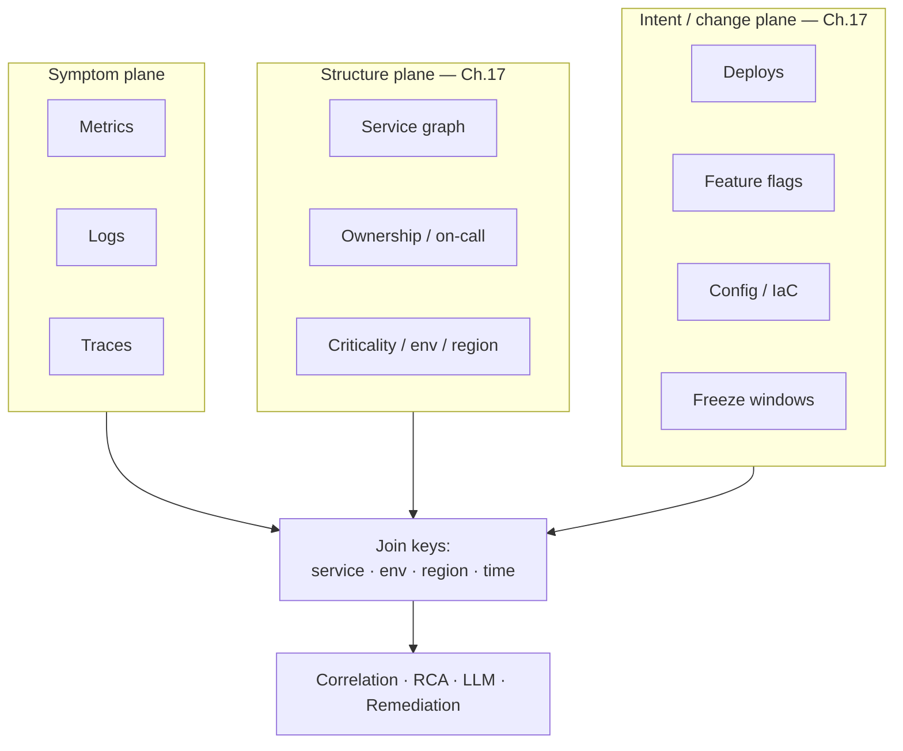
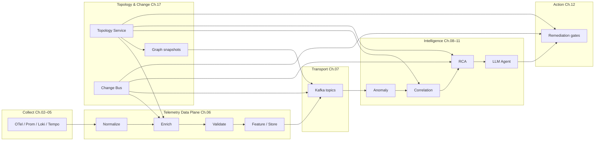
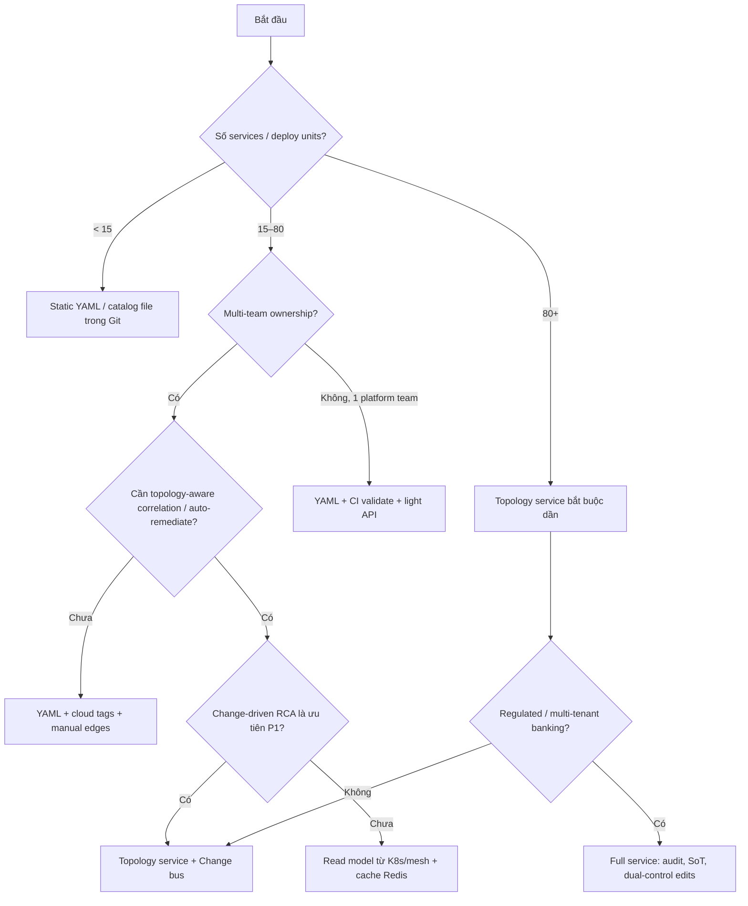
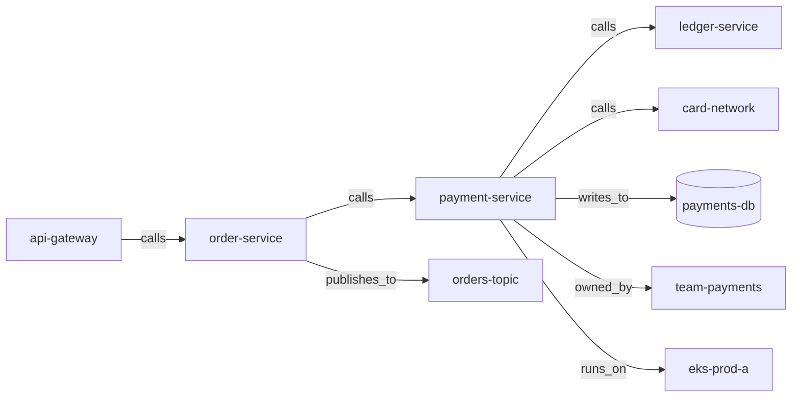
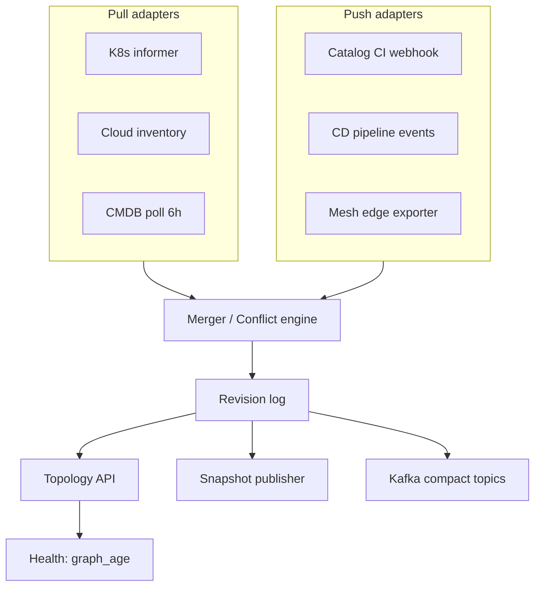
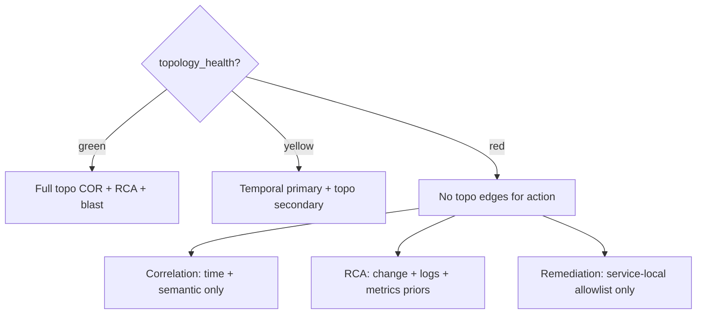
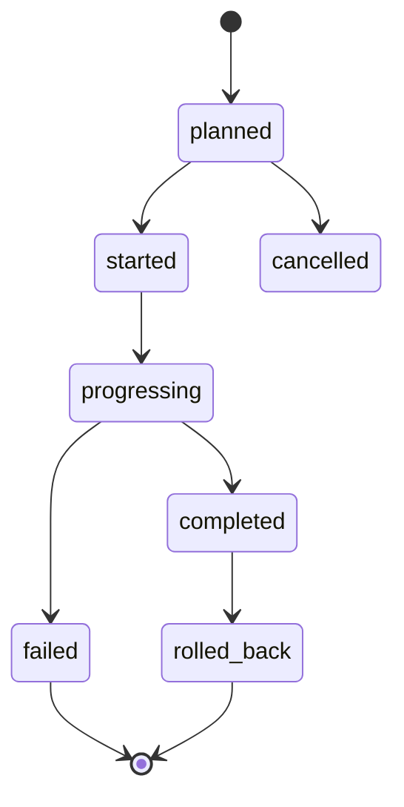
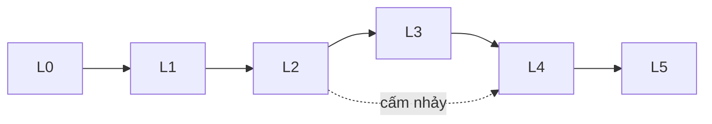

# Chapter 17 — Topology & Change Data Plane


*Poster: topology sync + change bus → enrich / correlate / RCA / remediation freeze.*

> **Topology (đồ thị phụ thuộc dịch vụ / CMDB-like graph) và change/deploy event plane là hai data product first-class mà hầu hết nền tảng AIOps “giả định có sẵn” nhưng hiếm khi vận hành đúng. Chương này lấp khoảng trống: cách mô hình hóa, đồng bộ, giữ tươi, và contract với enrichment ([06](../06-data-plane/README.vi.md)), correlation ([09](../09-alert-correlation/README.vi.md)), RCA ([10](../10-root-cause-analysis/README.vi.md)), và remediation an toàn ([12](../12-remediation/README.vi.md)). Không có topology + change tin cậy, intelligence layer chỉ là máy đoán triệu chứng.**

### Architecture poster — pipeline AIOps end-to-end


*Poster: Collection → Data Plane → Transport → Intelligence → Action. Topology graph + change bus là **control context** song song với telemetry, không phải spreadsheet on-call copy-paste.*

---

## Prerequisites

- [00 — Giới thiệu AIOps](../00-introduction.vi.md) — pipeline, maturity, data flywheel, topology như SoT
- [01 — Observability](../01-observability/README.vi.md) — identity, labels, SLO
- [02 — OpenTelemetry](../02-opentelemetry/README.vi.md) — resource attributes, service.name
- [06 — Telemetry Data Plane](../06-data-plane/README.vi.md) — enrich stage, write-time snapshot
- [07 — Kafka / Kinesis](../07-kafka/README.vi.md) — event bus, schema, replay

## Related Documents

- [08 — Anomaly Detection](../08-anomaly-detection/README.vi.md) — feature `deploy_age`, `change_in_window`
- [09 — Alert Correlation](../09-alert-correlation/README.vi.md) — topology-aware grouping
- [10 — Root Cause Analysis](../10-root-cause-analysis/README.vi.md) — change-driven RCA, graph walk
- [11 — LLM Agent](../11-llm-agent/README.vi.md) — context pack: owner, deps, recent changes
- [12 — Remediation](../12-remediation/README.vi.md) — blast radius, freeze, dual-control
- [13 — Production](../13-production/README.vi.md) — platform SLO, game days
- [14 — Big Tech AIOps](../14-bigtech-aiops/README.vi.md) — dependency graphs ở hyperscale
- [15 — E-commerce & Banking](../15-ecommerce-banking/README.vi.md) — payment path, audit, dual-control
- [16 — Famous Incidents](../16-famous-incidents/README.vi.md) — cascade, partial failure, change-induced outages

## Next Reading

Sau chương này, quay lại vận hành production ([13](../13-production/README.vi.md)) hoặc case study domain ([15](../15-ecommerce-banking/README.vi.md)). Nếu bạn đang build pipeline từ đầu: đảm bảo Ch.06 enrich đã **contract** với topology API trước khi bật correlation topology-aware ở Ch.09.

---

## Table of Contents

1. [Vì sao topology + change là data product first-class](#1-vì-sao-topology--change-là-data-product-first-class)
2. [WHERE — vị trí trong pipeline AIOps](#2-where--vị-trí-trong-pipeline-aiops)
3. [WHEN — topology service vs YAML vs cloud tags](#3-when--topology-service-vs-yaml-vs-cloud-tags)
4. [Mô hình topology: service, deps, ownership, criticality](#4-mô-hình-topology-service-deps-ownership-criticality)
5. [Nguồn topology: K8s, mesh, cloud, APM, CMDB, OTel](#5-nguồn-topology-k8s-mesh-cloud-apm-cmdb-otel)
6. [Kiến trúc đồng bộ: scrape vs push, freshness, conflict](#6-kiến-trúc-đồng-bộ-scrape-vs-push-freshness-conflict)
7. [Stale graph tệ hơn no graph — health & fallback](#7-stale-graph-tệ-hơn-no-graph--health--fallback)
8. [Change / deploy event plane — schema sự kiện](#8-change--deploy-event-plane--schema-sự-kiện)
9. [Nguồn change: CI/CD, flags, config, IaC, manual, freeze](#9-nguồn-change-cicd-flags-config-iac-manual-freeze)
10. [Change correlation: confounders & time windows](#10-change-correlation-confounders--time-windows)
11. [Change freezes & risk scoring cho remediation](#11-change-freezes--risk-scoring-cho-remediation)
12. [Storage: graph DB vs relational vs cache; retention](#12-storage-graph-db-vs-relational-vs-cache-retention)
13. [Integration contracts với Ch.06 / 09 / 10 / 12](#13-integration-contracts-với-ch06--09--10--12)
14. [Multi-tenant / banking: audit topology edits](#14-multi-tenant--banking-audit-topology-edits)
15. [Edge cases (12+)](#15-edge-cases-12)
16. [Anti-patterns](#16-anti-patterns)
17. [Maturity L0–L5](#17-maturity-l0l5)
18. [Production checklist 40+](#18-production-checklist-40)
19. [Câu hỏi Socratic](#19-câu-hỏi-socratic)
20. [Kế hoạch 30/60/90 ngày](#20-kế-hoạch-306090-ngày)
21. [Tóm tắt & mental model](#21-tóm-tắt--mental-model)
22. [Chapter Score](#22-chapter-score)
23. [References](#23-references)

---

## 1. Vì sao topology + change là data product first-class

> [!NOTE]
> **Ý TƯỞNG**
> Telemetry trả lời *cái gì đang xảy ra*. Topology trả lời *cái gì liên quan với cái gì*. Change trả lời *vừa có gì thay đổi*. Ba câu hỏi này là tối thiểu để con người (và máy) định hướng incident. Coi topology/change như “spreadsheet Excel trên-call chia sẻ” là tự phá AIOps từ gốc: không schema, không freshness SLO, không audit, không joinable với event stream.

### 1.1 Ba trục ngữ cảnh của incident

| Trục | Câu hỏi | Data product | Failure mode nếu thiếu |
|------|---------|--------------|------------------------|
| **Symptom** | Metric/log/trace xấu ở đâu? | Telemetry plane (Ch.02–07) | Mù hoàn toàn |
| **Structure** | Service A phụ thuộc B? Owner? Criticality? | **Topology graph** | Correlation sai, blast radius sai |
| **History of intent** | Ai vừa deploy / flip flag / đổi config? | **Change event plane** | RCA “DB CPU” trong khi root là deploy |



### 1.2 Tại sao “side spreadsheet” thất bại có hệ thống

| Thuộc tính data product | Spreadsheet / Confluence | Topology + Change service |
|-------------------------|--------------------------|---------------------------|
| Schema versioned | ❌ | ✅ |
| Machine-readable join | ❌ (copy-paste) | ✅ `service_id` |
| Freshness SLO | ❌ “ai rảnh thì update” | ✅ `graph_age_seconds` |
| Point-in-time query | ❌ luôn “hiện tại” | ✅ snapshot / as-of |
| Multi-writer conflict | 💥 overwrite | ✅ provenance + merge policy |
| Audit trail | ❌ | ✅ bắt buộc banking |
| Consumer contract | ❌ | ✅ API + Kafka topics |

> [!IMPORTANT]
> **Data product** nghĩa là: có *producer*, *consumer contract*, *SLO*, *owner*, *versioning*, *deprecation path*. Topology không phải “nice dashboard graph”. Topology là **API mà correlation và remediation gọi lúc 3 giờ sáng**.

### 1.3 ROI cụ thể — không trừu tượng

**Trước topology + change plane:**

```
03:12  Alert storm 80 alerts
03:15  On-call mở 6 dashboard, đoán service nào là root
03:25  Hỏi Slack “ai deploy payment lúc nào?”
03:40  Tìm được Argo history: deploy 03:05 payment-v2.14
03:50  Rollback
04:10  Stabilize
MTTD+MTTU (understand): ~38 phút chỉ để hiểu
```

**Sau topology + change plane:**

```
03:12  Correlation group: payment-service + 12 downstream
       Evidence: deploy payment-v2.14 @ 03:05 (change_id=chg_…)
       Owner: payments-oncall · criticality=tier-0 · freeze=false
03:14  On-call thấy context pack; approve rollback allow-listed
03:18  Verify green
MTTU: ~2 phút
```

Tiết kiệm không chỉ MTTR — còn **cognitive load** và **sai remediation** (restart toàn cluster vì không biết edge payment→ledger).

### 1.4 Liên hệ OODA (Ch.00)

| OODA | Topology | Change |
|------|----------|--------|
| **Observe** | Edges/nodes mới từ mesh/K8s | Event stream deploy/flag |
| **Orient** | Walk dependency, fan-in/out | “Deploy trong cửa sổ nghi ngờ?” |
| **Decide** | Blast radius, suppress downstream | Risk score, freeze gate |
| **Act** | Scope remediation theo subgraph | Block auto-action trong freeze |

> [!TIP]
> Postmortem hay: *“Chúng ta thua ở Observe (thiếu signal) hay Orient (sai topology / không biết change)?”* — câu hỏi từ [00](../00-introduction.vi.md). Topology stale = Orient hỏng dù Observe hoàn hảo.

### 1.5 Vendor không thay thế SoT nội bộ

Vendor APM vẽ “service map” đẹp. Nhưng:

1. Map thường **chỉ runtime call**, thiếu ownership, criticality, change calendar.
2. Identity vendor ≠ identity org (`service.name` vs catalog id).
3. Khi vendor outage hoặc cost cut sampling → graph biến mất cùng APM.
4. Remediation **không được** phụ thuộc graph black-box không audit được.

**Nguyên tắc Principal SRE:** mua visualization; **giữ topology SoT + change bus trong tay bạn** (cùng tinh thần “action surface & topology SoT” ở [00](../00-introduction.vi.md)).

### 1.6 Data flywheel cần change + topology labels

Feedback loop AIOps (detect → act → label → retrain) yếu nếu thiếu:

- Label “root = deploy regression” cần `change_id` join được.
- Label “cascade from X” cần edge X→Y tồn tại **lúc** incident (point-in-time).
- Feature `deploy_age_minutes` trong [08](../08-anomaly-detection/README.vi.md) và feature store [06](../06-data-plane/README.vi.md) **phụ thuộc** change plane.

Không có data product này, flywheel train trên rác ngữ nghĩa.

---

## 2. WHERE — vị trí trong pipeline AIOps

> [!NOTE]
> **Ý TƯỞNG**
> Topology/change **không thay** telemetry data plane. Chúng là **control context plane**: đọc chậm hơn metrics một chút, nhưng phải **join được** vào mọi event intelligence. Vị trí đúng: *sau* khi bạn có identity cơ bản (service.name), *trước/cùng* enrich; *feed* correlation, RCA, LLM, remediation.

### 2.1 Bản đồ pipeline



### 2.2 WHERE từng consumer đọc

| Consumer | Đọc topology | Đọc change | Latency toler. | Consistency need |
|----------|--------------|------------|----------------|------------------|
| Enrich (Ch.06) | Lookup node attrs | Latest deploy / ticket | 10–100ms | Snapshot hash ghi kèm event |
| Anomaly features | Ít (criticality weight) | `deploy_age`, `change_in_window` | Feature lag OK | Point-in-time join train |
| Correlation (Ch.09) | Edges, tiers | Optional suppress during deploy | <500ms group window | Graph age < SLO |
| RCA (Ch.10) | Walk / rank | Strong prior | Seconds OK | As-of incident start |
| LLM context (Ch.11) | Owner, deps summary | Last N changes | Seconds | Prefer snapshot id |
| Remediation (Ch.12) | Blast radius subgraph | Freeze + dual-control | Hard real-time gate | **Fresh + authoritative** |

> [!WARNING]
> Remediation **không** được cache topology “best effort 24h” rồi restart 40 services “theo graph cũ”. Gate blast radius phải fail-closed khi graph unhealthy (mục §7).

### 2.3 Control plane vs data plane (nhắc poster)

Xem [diagram control vs data plane](../../assets/diagrams/07-control-vs-data-plane.png):

| Plane | Ví dụ | Đặc điểm |
|-------|-------|----------|
| **Telemetry data plane** | metrics/logs/traces/events | High volume, append-heavy |
| **Topology/change control context** | graph, owners, deploys, freezes | Lower volume, **stateful**, strong consistency-ish |
| **Action control plane** | remediation executors, policy | Safety-critical, audit |

Topology service thường deploy **cùng failure domain** với AIOps control plane, không nhét vào hot path scrape Prometheus.

### 2.4 Topic / API surface gợi ý (WHERE events đi)

| Artifact | WHERE publish | Consumers |
|----------|---------------|-----------|
| `topology.graph.snapshot` | Object store + Kafka compact | Enrich, COR, RCA bootstrap |
| `topology.node.upsert` / `edge.upsert` | Kafka | Incremental cache |
| `topology.health` | Metrics + status API | All gates |
| `change.events` | Kafka (partition by service) | Enrich, AD features, RCA, freeze |
| `change.freeze.windows` | API + compact topic | Remediation, CI gates |

Chi tiết Kafka: [07](../07-kafka/README.vi.md).

### 2.5 WHERE *không* đặt topology

| Anti-location | Vì sao sai |
|---------------|------------|
| Chỉ trong head của tech lead | Bus factor = 1 |
| Chỉ vendor APM UI | Không join, không audit action |
| Chỉ CMDB ITSM 48h delay | Stale by design cho cloud-native |
| Chỉ trong Helm values mỗi repo | Không có global graph query |
| Chỉ LLM “nhớ” từ chat | Hallucination + không version |

---

## 3. WHEN — topology service vs YAML vs cloud tags

> [!NOTE]
> **Ý TƯỞNG**
> Không phải org nào cũng cần Neo4j ngày 1. Câu hỏi đúng là **WHEN** complexity topology service thắng chi phí vận hành — không phải “best practice luôn luôn graph DB”.

### 3.1 Cây quyết định chính



### 3.2 Ma trận lựa chọn

| Approach | WHEN chọn | WHEN bỏ | Chi phí ops | Join quality |
|----------|-----------|---------|-------------|--------------|
| **Static YAML / Git catalog** | <15–30 services; 1–2 teams; chưa auto-remediate | Dynamic deps, multi-region fan-out | Thấp | Tốt nếu discipline PR |
| **Cloud tags only** | Infra-centric; ít app graph | Service-level cascade, ownership | Thấp | Yếu cho app edges |
| **K8s labels + ServiceMonitors** | All-in K8s; deps đơn giản | Cross-cluster, non-K8s, human ownership | Trung bình | Trung bình |
| **Service mesh / eBPF map** | Cần runtime truth edges | Ownership, criticality, change | Trung–cao | Runtime tốt, metadata kém |
| **APM discovered map** | Nhanh bootstrap | SoT, offline, remediation gate | License | Tốt visualize, kém contract |
| **CMDB / ITSM** | Audit org, asset lifecycle | Fresh cloud-native edges | Process nặng | Stale edges |
| **Topology service (SoT API)** | Correlation + RCA + remediation + multi-team | Org <10 eng, chưa có consumer | Cao | **Mục tiêu production AIOps** |

### 3.3 WHEN *bắt buộc* nâng cấp khỏi YAML

Nâng cấp khi **≥2** điều sau đúng:

1. Correlation topology-aware đã bật và **sai nhóm** > X% do missing edges.
2. Remediation cần blast radius tự động.
3. >3 teams edit ownership/deps; conflict Git hàng tuần.
4. Multi-region / multi-cluster identity drift.
5. Regulator hỏi “ai đổi topology lúc T?” — cần audit.
6. Change correlation là signal RCA chính (commerce deploy velocity cao).

### 3.4 WHEN *đủ* cloud tags

Cloud tags (`team`, `service`, `env`, `cost-center`) đủ khi:

- Incident chủ yếu **infra** (node, disk, AZ).
- Ít call-graph app (batch ETL, simple 3-tier).
- Chưa có microservice cascade.

**Không đủ** khi payment path có 8 hop ([15](../15-ecommerce-banking/README.vi.md), [diagram payment path](../../assets/diagrams/08-payment-critical-path.png)).

### 3.5 Hybrid thực dụng (khuyến nghị đa số org)

| Layer | Source of truth | Refresh |
|-------|-----------------|---------|
| Node identity | Service catalog Git + CI | On merge |
| Runtime edges | Mesh / OTel / eBPF | 1–5 min |
| Ownership / tier | Catalog (human) | PR + approval |
| Deploy state | Change bus | Event-driven |
| Infra resources | Cloud API | 5–15 min |

Topology service = **hợp nhất + conflict policy + snapshot API**, không reinvent discovery.

> [!TIP]
> Ngày 1: Git catalog + change events từ CI. Ngày 60: runtime edges. Ngày 90: topology API + health SLO. Đừng xây graph DB trước khi có **consumer** (COR/RCA) sẵn sàng dùng.

---

## 4. Mô hình topology: service, deps, ownership, criticality

> [!NOTE]
> **Ý TƯỞNG**
> Graph AIOps không phải UML. Nó là **mô hình vận hành**: đủ để group alerts, rank root cause, tính blast radius, và route owner — không cần mô hình hóa mọi class trong codebase.

### 4.1 Thực thể cốt lõi (nodes)

| Node type | Ý nghĩa | Ví dụ id |
|-----------|---------|----------|
| `service` | Deployable / paging unit logic | `payment-api` |
| `deployment_unit` | Versioned release artifact | `payment-api@2.14.0` |
| `workload` | K8s Deployment/StatefulSet/Job | `ns/payment-api` |
| `endpoint` / `slo_id` | Optional fine grain | `POST /charge` |
| `datastore` | DB, cache, queue logical | `payments-pg-primary` |
| `dependency_external` | SaaS / bank gateway | `stripe-api` |
| `infra` | Cluster, nodepool, LB | `eks-prod-a` |
| `team` / `user_group` | Ownership | `team-payments` |

> [!IMPORTANT]
> Chọn **paging unit** làm primary `service_id`. Pod ephemeral không phải node topology dài hạn (trùng bài học entity keys ở [06](../06-data-plane/README.vi.md)).

### 4.2 Cạnh (edges) — semantics quan trọng

| Edge type | Ý nghĩa | Dùng cho |
|-----------|---------|----------|
| `calls` | Runtime request path | Cascade correlation, RCA walk |
| `publishes_to` / `consumes_from` | Async messaging | Queue lag storms |
| `reads_from` / `writes_to` | Data stores | DB blast radius |
| `depends_on` (declared) | Catalog intent | Fallback khi runtime sparse |
| `runs_on` | Workload → infra | AZ/node failure fan-out |
| `owned_by` | Service → team | Routing, dual-control |
| `part_of` | Service → domain / product | Business impact |
| `replicates_to` | Multi-region | Partial region outage |



### 4.3 Thuộc tính bắt buộc trên `service`

| Field | WHY |
|-------|-----|
| `service_id` (stable) | Join key toàn platform |
| `display_name` | UI / LLM |
| `env` | prod/staging isolation |
| `regions[]` | Multi-region scope |
| `tier` / `criticality` | Page policy, remediation risk |
| `owner_team` | Routing |
| `oncall_policy` | Pager integration |
| `lifecycle` | active / deprecated / shadow |
| `source_provenance` | catalog|k8s|mesh|manual |
| `updated_at` / `graph_revision` | Freshness |

### 4.4 Criticality tiers — gợi ý

| Tier | Ý nghĩa | Ví dụ | Remediation default |
|------|---------|-------|---------------------|
| **0** | Money / safety / auth core | payment, ledger, login | Human dual-control |
| **1** | Revenue path phụ | cart, search | Auto low-risk only |
| **2** | Internal platform | ci-cache, non-prod tools | Auto broader |
| **3** | Experimental | labs | Best-effort |

Tier phải **human-owned** — không suy ra chỉ từ QPS (batch fraud model QPS thấp nhưng tier-0).

### 4.5 Environments & multi-region

| Dimension | Rule |
|-----------|------|
| `env` | Graph **tách** prod vs non-prod (không edge giả cross-env trừ synthetic) |
| `region` | Node có thể multi-homed; edge có thể regional |
| `cell` / `shard` | Optional cho large multi-tenant |
| Failover edges | `failover_to` khác `calls` — RCA không nhầm DR path là traffic thường |

### 4.6 Ownership model

```yaml
# WHY: ownership là routing + approval surface, không chỉ metadata đẹp
service_id: payment-service
owner_team: team-payments
escalation:
  primary: payments-oncall
  secondary: platform-sre-oncall
approvers_for_tier0_actions:
  - role: payments-tl
  - role: sre-secondary
data_classification: confidential
pci_scope: true
```

### 4.7 Identity mapping — nơi AIOps chết thầm

| Source identity | Map tới |
|-----------------|---------|
| OTel `service.name` | `service_id` |
| K8s `app.kubernetes.io/name` | `service_id` |
| Prometheus `job` / `service` label | `service_id` |
| Argo app name | `service_id` |
| CMDB CI name | `service_id` (thường cần alias table) |
| APM service | `service_id` |

**Bảng alias** (`alias → service_id`) là first-class. Không alias = enrich miss = correlation orphan.

> [!TIP]
> Canonical `service_id`: lowercase kebab, ổn định qua rename display. Rename = alias cũ giữ ≥90 ngày.

### 4.8 Schema gọn (minh họa — WHY từng nhóm field)

```json
{
  "service_id": "payment-service",
  "env": "prod",
  "regions": ["ap-southeast-1", "ap-northeast-1"],
  "tier": 0,
  "owner_team": "team-payments",
  "aliases": ["payment", "payments-api", "pay-svc"],
  "deps": {
    "calls": ["ledger-service", "fraud-service"],
    "writes_to": ["payments-pg"],
    "external": ["card-network"]
  },
  "provenance": {
    "declared_from": "catalog@git:abc123",
    "runtime_from": "istio-tsdb@2026-07-22T03:00:00Z",
    "merged_revision": 184422
  }
}
```

WHY `provenance`: khi edge conflict, biết ai thắng và có rollback semantic.

### 4.9 Subgraph views (không một graph thrashing)

| View | Dùng khi |
|------|----------|
| `runtime_calls` | Correlation cascade |
| `declared_hard_deps` | Change impact analysis pre-deploy |
| `ownership` | Routing |
| `infra_placement` | AZ failure |
| `data_plane` | DB/queue blast radius |

Consumer xin **view + revision**, không “full dump 50k edges” mỗi request.

---

## 5. Nguồn topology: K8s, mesh, cloud, APM, CMDB, OTel

> [!NOTE]
> **Ý TƯỞNG**
> Mọi nguồn đều **thiên vị**. Runtime mạnh về edges thật, yếu về intent. Catalog mạnh về ownership, yếu về edge mới. CMDB mạnh về audit asset, yếu về freshness. Topology service là **arbitrator**, không tin một nguồn duy nhất.

### 5.1 Ma trận nguồn

| Source | Nodes | Edges | Ownership | Freshness | Trust cho remediation |
|--------|-------|-------|-----------|-----------|----------------------|
| **Git service catalog** | ✅ | Declared | ✅ | On merge | Cao (human) |
| **Kubernetes API** | Workloads | Weak (need NetworkPolicy/insight) | Labels partial | Seconds–min | Trung |
| **Service mesh / eBPF** | Runtime svc | ✅ calls | ❌ | Minutes | Cao edges, thấp metadata |
| **Cloud resource APIs** | Infra, LB, RDS | runs_on, some links | Tags | 5–15m | Cao infra |
| **APM** | Services | ✅ | Sometimes | Near-real-time | Visual; vendor lock |
| **OTel resource + span graphs** | service.name | calls (sampled!) | Resource attrs | Pipeline lag | Cẩn trọng sampling |
| **CMDB / ITSM** | Assets, apps | Often stale | ✅ process | Hours–days | Audit only / fallback |
| **Repo CODEOWNERS** | — | — | ✅ | On merge | Bổ sung |
| **DNS / consul / config** | Discovery names | Weak | ❌ | Varies | Alias help |

### 5.2 Kubernetes — lấy gì

| Object | Map |
|--------|-----|
| Deployment / StatefulSet / Rollout | `workload` node |
| Service / Ingress / HTTPRoute | Exposure |
| Labels `app.kubernetes.io/*` | Identity |
| Annotations `aiops.io/service-id` | Explicit join (khuyến nghị) |
| Namespace | env/team rough |
| HPA / PDB | Capacity context (optional) |

**Không** suy edge `calls` chỉ từ “cùng namespace”.

### 5.3 Service mesh / eBPF

| Pros | Cons |
|------|------|
| Edges thật theo traffic | Sidecar/agent cost |
| Phát hiện dep “ma” không ai khai | Ephemeral spikes → edge noise |
| Multi-language | mTLS path ≠ business dep |

**Policy:** edge runtime cần **min request count / confidence** trong window trước khi materialize; edge “seen once” không vào blast radius tier-0.

### 5.4 Cloud resource APIs

- AWS: ECS services, RDS, ELB targets, Lambda event sources.
- GCP/Azure tương đương.
- Dùng cho `runs_on`, datastore nodes, AZ placement.
- Tagging standard **bắt buộc** (`service_id`, `env`, `owner`) — không tag = orphan infra.

### 5.5 APM

**WHEN dùng:** bootstrap graph tuần 1–4; validate declared deps.

**WHEN không tin tuyệt đối:** sampling, agent down, async not instrumented, multi-cluster incomplete.

Export định kỳ → topology merger với `provenance=apm`, weight thấp hơn catalog cho ownership.

### 5.6 OpenTelemetry resource attributes

Canonical gợi ý (WHY: join với Ch.02):

| Attribute | Dùng |
|-----------|------|
| `service.name` | Map alias |
| `service.namespace` | Domain |
| `service.version` | Deploy unit |
| `deployment.environment` | env |
| `k8s.cluster.name` | placement |
| `cloud.region` | region |

Span-derived edges: chỉ khi sampling rate đủ hoặc dùng **tail-based / spanmetrics** có policy rõ ([05](../05-tempo/README.vi.md)).

### 5.7 CMDB

| CMDB tốt cho | CMDB tệ cho |
|--------------|-------------|
| Legal entity, asset id, cost center | Microservice call graph 5 phút tuổi |
| Change ticket linkage process | Auto-remediation edge walk |
| HR ownership formal | Ephemeral preview envs |

> [!WARNING]
> Join CMDB **hours-stale** vào write-time enrich mà không đánh dấu `cmdb_age` → RCA tự tin sai. Luôn mang `source_freshness`.

### 5.8 Hợp nhất nguồn — trust weights (ví dụ)

| Attribute | Winner order |
|-----------|--------------|
| `service_id` existence | Catalog > K8s annotation > OTel |
| `owner_team` | Catalog > CODEOWNERS > CMDB > tags |
| `tier` | Catalog only (human) |
| `calls` edges | Mesh/eBPF > APM > OTel sampled > declared |
| `writes_to` | Declared + cloud + runtime |
| `runs_on` | Cloud + K8s |

Conflict resolution chi tiết: §6.

---

## 6. Kiến trúc đồng bộ: scrape vs push, freshness, conflict

> [!NOTE]
> **Ý TƯỞNG**
> Topology sync là **distributed systems problem** giả dạng “import CMDB”. Bạn cần model: ingestion, merge, revision, snapshot, notify consumers — giống control plane k8s hơn là nightly cron Excel.

### 6.1 Scrape vs push

| Mode | WHEN | Ví dụ | Risk |
|------|------|-------|------|
| **Pull/scrape** | API cloud/K8s có list; bạn kiểm soát cadence | K8s informer, AWS Describe* | Rate limit; lag = interval |
| **Push** | Nguồn event-driven; freshness quan trọng | CI deploy webhook, mesh tap, catalog Git push | Burst, auth, schema drift |
| **Hybrid** | Production default | Informer + webhook invalidate | Complexity |



### 6.2 Freshness SLO (graph age)

Định nghĩa:

```
graph_age_seconds = now - min(
  last_successful_sync_per_critical_source
)
```

Hoặc chặt hơn: age theo **subgraph tier-0**.

| Consumer | SLO gợi ý graph_age | Action nếu breach |
|----------|---------------------|-------------------|
| Enrich UI | 15–30 min | Warning badge |
| Correlation | 5–10 min runtime edges | Fallback temporal-only group |
| RCA | Snapshot as-of incident; build lag < 2 min | Lower confidence |
| Remediation blast radius | **≤ 2–5 min** tier-0 | **Fail-closed** auto actions |

Metric bắt buộc:

- `topology_sync_success`
- `topology_graph_age_seconds{source,env}`
- `topology_merge_conflicts_total`
- `topology_orphan_ratio`
- `topology_api_latency`

### 6.3 Conflict resolution policies

| Conflict | Policy khuyến nghị | WHY |
|----------|-------------------|-----|
| Owner catalog ≠ CMDB | Catalog wins; alert drift | Paging correctness |
| Edge mesh có, catalog không | Keep edge `runtime` confidence | Khám phá dep ẩn |
| Edge catalog có, mesh không 7d | Mark `unverified` / decay | Tránh blast radius ảo |
| Tier disagree | Human escalation ticket | An toàn |
| service_id rename | Alias, không delete 90d | Join history |
| Same edge opposite direction noise | Require bidirectional evidence or mesh direction | |

### 6.4 Decay & tombstones

- Runtime edge: `last_seen_at`; nếu `now - last_seen > decay_ttl` → soft-delete khỏi active view.
- Declared edge: chỉ xóa qua catalog PR.
- Tombstone events trên Kafka compact để cache clients drop node.

### 6.5 Snapshot vs incremental

| Mechanism | WHEN |
|-----------|------|
| Full snapshot mỗi N min | Bootstrap, DR, audit pack |
| Incremental upsert | Online caches |
| Revision monotonic `graph_revision` | Consumer detect gap → resync full |

> [!IMPORTANT]
> Consumer correlation nên pin `graph_revision` trong incident object — postmortem / reprocess mới tái lập được ([06](../06-data-plane/README.vi.md) reprocessing).

### 6.6 Adapter isolation

Mỗi source adapter:

1. Normalize → intermediate entity (chưa merge).
2. Schema validate.
3. Quarantine poison records (tương tự data quality Ch.06).
4. Không crash toàn merger vì 1 CMDB field null.

### 6.7 Multi-cluster / multi-account sync

| Challenge | Pattern |
|-----------|---------|
| Duplicate service names | Require `env`+`region`+`cell` in key |
| Split-brain revisions | Per-region revisions + global merge clock |
| Partial account permission | Degraded mode flag per source |
| Cross-account edges | Explicit external_dep nodes |

### 6.8 Cadence khuyến nghị theo nguồn

| Source | Cadence gợi ý | Backoff khi lỗi | Note |
|--------|---------------|-----------------|------|
| K8s informer | Event-driven + resync 10–30m | Exponential, cap 15m | Prefer informer over full list storm |
| Mesh edge export | 1–5m aggregate window | Hold last good edges | Aggregate trước khi merge |
| Cloud inventory | 5–15m | Skip account, mark degraded | Watch API quota |
| Catalog Git | On push + hourly reconcile | Page platform | Reconcile bắt drift silent |
| CMDB | 6–24h | Never block runtime merge | Metadata only |
| APM export | 5–15m | Weight↓ khi lag | Bootstrap / validate |

> [!TIP]
> **Resync ≠ scrape mù**: full reconcile định kỳ phát hiện “xóa bên nguồn nhưng miss delete event”. Thiếu reconcile → ghost nodes sống mãi trong graph.

### 6.9 Idempotency & ordering merge

```text
merge_key = (entity_type, entity_id, env, region?)
write = upsert where incoming.source_version >= stored.source_version
         OR incoming.observed_at > stored.observed_at (per source stream)
```

| Vấn đề | Xử lý |
|--------|-------|
| Webhook deploy duplicate | `idempotency_key` |
| Edge update out-of-order | per-source version / last_seen max |
| Two adapters same edge | Merge confidence = max or weighted; keep multi-provenance array |
| Delete vs late update | Tombstone timestamp wins if newer; late update after tombstone → quarantine review |

### 6.10 Observability của chính sync pipeline

Đừng chỉ monitor “API topology up”. Monitor **pipeline**:

1. `adapter_lag_seconds{source}`
2. `records_quarantined_total{source,reason}`
3. `merger_duration_seconds`
4. `snapshot_publish_failures`
5. `consumer_revision_gap` (COR workers)

Page khi tier-0 source lag vượt SLO — không đợi human notice correlation “lạ”.

---

## 7. Stale graph tệ hơn no graph — health & fallbacks

> [!NOTE]
> **Ý TƯỞNG**
> Graph sai tạo **false confidence**: correlation gộp nhầm, RCA chỉ sai chỗ “chắc chắn”, remediation nổ blast radius. “Không có graph” → con người thận trọng hơn. Vì vậy stale phải **visible** và **fail closed** trên action path.

### 7.1 Vì sao stale nguy hiểm hơn missing

| Tình huống | No graph | Stale graph |
|------------|----------|-------------|
| Correlation | Temporal/semantic only | Gộp theo edge **đã gỡ** |
| RCA | “Unknown structure” | Walk tới service **không còn** dep |
| Remediation | Block auto / manual scope | Restart **sai fan-out** |
| LLM | Ít context | Context **tự tin sai** |

### 7.2 Health model

```yaml
topology_health:
  status: green|yellow|red
  graph_age_seconds: 95
  sources:
    catalog: ok
    mesh: degraded   # lag
    cmdb: ok
  orphan_service_ratio: 0.04
  conflict_rate_1h: 0.01
  tier0_coverage: 0.99
```

| Status | Ý nghĩa | Policy |
|--------|---------|--------|
| **green** | Age & coverage OK | Full topology features |
| **yellow** | Một source degraded | Correlation soft; RCA confidence↓; auto-remediate limited |
| **red** | Age breach / tier0 coverage low | Disable topo-correlation weight; **block** topo-based blast auto |

### 7.3 Fallbacks theo lớp



### 7.4 Write-time snapshot (nhắc Ch.06)

Enrich phải ghi:

- `topology_revision`
- `service_tier`
- `owner_team`
- `deps_hash` (optional)

**WHY:** read-time join “graph hiện tại” vào incident 2 giờ trước = Orient sai.

### 7.5 Canary cho topology changes

Khi catalog PR xóa 30 edges:

1. Dry-run impact: “bao nhiêu correlation rules / runbooks phụ thuộc”.
2. Shadow: publish `revision_candidate`.
3. So sánh grouping diff 24h.
4. Promote.

Topology edit = **change** — phải vào change plane (§8–9).

### 7.6 SLOs & error budget cho topology service

| SLO | Mục tiêu gợi ý |
|-----|----------------|
| Availability API read | 99.9% |
| graph_age tier-0 P99 | < 3 min |
| Correct owner on page | > 99% |
| Edge precision (sampled audit) | > 95% critical paths |
| Time to detect sync fail | < 5 min alert |

Burn error budget topology → **freeze** feature flags bật topo-auto-remediation (liên hệ [13](../13-production/README.vi.md)).

> [!WARNING]
> Đừng page on-call app vì `graph_age` vàng nếu chưa có runbook — page **platform AIOps**. Nhưng **cấm im lặng**.

---

## 8. Change / deploy event plane — schema sự kiện

> [!NOTE]
> **Ý TƯỞNG**
> “Change” không chỉ deploy container. Mọi **thay đổi intentional** có thể gây behavioral shift đều là change event: flag, config, IaC, certificate, manual kubectl, freeze window. Schema thống nhất cho phép RCA và freeze gates dùng chung một bus.

### 8.1 Định nghĩa change event

**Change event** = bản ghi bất biến: *ai / cái gì / ở đâu / khi nào / loại / risk / liên kết ticket / trạng thái lifecycle*.

### 8.2 Schema tối thiểu (JSON minh họa)

```json
{
  "change_id": "chg_01J5...",
  "event_type": "deploy.completed",
  "schema_version": 3,
  "timestamp": "2026-07-22T03:05:12Z",
  "observed_at": "2026-07-22T03:05:18Z",
  "service_id": "payment-service",
  "env": "prod",
  "regions": ["ap-southeast-1"],
  "change_kind": "deploy",
  "actor": {
    "type": "pipeline",
    "id": "github-actions",
    "user": "alice",
    "automation": true
  },
  "artifact": {
    "version": "2.14.0",
    "git_sha": "abcdef",
    "image": "ghcr.io/org/payment:2.14.0"
  },
  "pipeline": {
    "system": "github_actions",
    "run_url": "https://...",
    "strategy": "canary"
  },
  "ticket": "CHG-10422",
  "risk_score": 0.72,
  "blast_radius_hint": ["ledger-service", "checkout-service"],
  "freeze_bypass": false,
  "status": "completed",
  "provenance": "ci_webhook",
  "idempotency_key": "gh-run-998877"
}
```

| Field group | WHY |
|-------------|-----|
| `change_id` / idempotency | At-least-once bus ([07](../07-kafka/README.vi.md)) |
| `service_id`+env+region | Join topology & telemetry |
| `event_type` lifecycle | started/progress/completed/failed/rolled_back |
| `actor` | Audit + dual-control |
| `artifact` | RCA version pin |
| `ticket` | ITSM / compliance |
| `risk_score` | Remediation & auto-page weight |
| `observed_at` vs `timestamp` | Clock skew / late webhook |

### 8.3 `change_kind` taxonomy

| kind | Ví dụ |
|------|-------|
| `deploy` | K8s rollout, Lambda version |
| `config` | App config push, secret rotation ref |
| `feature_flag` | LaunchDarkly / custom flag |
| `infra` | Terraform apply, scaling policy |
| `network` | SG, mesh route, DNS TTL |
| `data` | Migration, reindex |
| `manual` | kubectl exec break-glass |
| `certificate` | TLS renew |
| `dependency` | Upstream library bump (if known) |
| `freeze` | Window start/end (meta) |

### 8.4 Lifecycle state machine



RCA quan tâm **completed/failed/rolled_back** trong cửa sổ; enrichment có thể show `in_progress` để suppress noise tạm.

### 8.5 Topic design gợi ý

| Topic | Key | Notes |
|-------|-----|-------|
| `change.events` | `service_id` | Main bus |
| `change.events.dlq` | — | Poison schema |
| `change.freeze` | `env` or global | Compact |
| `change.annotations` | `change_id` | Human notes post-facto |

### 8.6 Late & out-of-order changes

Tương tự watermark [06](../06-data-plane/README.vi.md):

- Webhook trễ 10 phút sau deploy xong → RCA vẫn phải attach.
- Policy: `change_in_window` dùng `timestamp` (effective time), không chỉ `observed_at`.
- Feature store point-in-time join theo `timestamp`.

### 8.7 PII & security

Change events thường chứa: URL pipeline OK; **không** nhúng secret values, raw customer payloads, auth tokens. Actor email hash nếu multi-tenant strict.

---

## 9. Nguồn change: CI/CD, flags, config, IaC, manual, freeze

> [!NOTE]
> **Ý TƯỞNG**
> Coverage change plane đo bằng **% incident postmortem có change liên quan mà bus đã ghi nhận trước khi người hỏi Slack**. Nếu vẫn phải hỏi Slack, coverage fail.

### 9.1 CI/CD

| System | Hook | Event map |
|--------|------|-----------|
| GitHub Actions | `workflow_run` / deploy env | deploy.* |
| GitLab CI | pipeline events | deploy.* |
| Argo CD / Rollouts | Application sync / phase | deploy.progressing/completed |
| Spinnaker | pipeline stage | deploy.* + strategy |
| Flux | GitRepository / HelmRelease | deploy + config |
| Jenkins | webhooks | deploy.* |

**Bắt buộc fields:** service mapping từ app name, env, version, actor, url.

### 9.2 Feature flags

| Nuance | Xử lý |
|--------|-------|
| Flag flip không đổi binary | Vẫn `change_kind=feature_flag` |
| Percentage ramp | `progressing` + `%` attribute |
| Multi-service flag | Fan-out events per service_id hoặc link `flag_id` |
| Kill switch | High risk_score + page optional |

Flag systems: LaunchDarkly, Unleash, Flagsmith, home-grown — adapter thống nhất schema.

### 9.3 Config pushes

- App config service (viper remote, AppConfig, Consul KV).
- Secrets **rotation event** (không value): `secret_id`, version.
- Rate-limit / dynamic config — hay gây latent incidents.

### 9.4 Infra as Code

| Source | Signal |
|--------|--------|
| Terraform Cloud / Atlantis / Spacelift | apply started/finished, plan link |
| Crossplane / Pulumi | same |
| CloudTrail / Activity logs | backup discovery (noisy) |

**Prefer** pipeline apply events over raw CloudTrail for productized AIOps (noise).

### 9.5 Manual changes — break-glass

```json
{
  "change_kind": "manual",
  "actor": {"type": "human", "user": "bob", "automation": false},
  "evidence": {"ticket": "INC-22", "session": "teleport-uuid"},
  "risk_score": 0.9
}
```

Nguồn: session recording (Teleport), `kubectl` audit, AWS Console — normalize best-effort; **missing manual change** là blind spot lớn (xem [16](../16-famous-incidents/README.vi.md)).

### 9.6 Freeze windows

```yaml
freeze_id: freeze_black_friday_2026
env: prod
scope:
  tiers: [0, 1]
  services: ["*"]   # or allowlist exceptions
  regions: ["*"]
window:
  start: 2026-11-25T00:00:00Z
  end: 2026-12-02T00:00:00Z
policy:
  block_deploys: true
  block_auto_remediation: true
  allow_break_glass: true
  dual_control_required: true
```

Publish lên `change.freeze` + evaluate API cho CI **và** remediation.

### 9.7 WHEN nguồn nào ưu tiên wire trước

| Tuần | Wire | WHY |
|------|------|-----|
| 1–2 | CD completed deploys prod | 60% change-related incidents |
| 3–4 | Flag flips prod | Behavioral shifts |
| 5–6 | Terraform apply prod | Infra ghosts |
| 7–8 | Freeze calendar | Safety |
| 9+ | Manual break-glass | Long tail |

### 9.8 Mapping CI app → service_id

Bảng cấu hình bắt buộc; fail pipeline nếu unmapped **prod** deploy (shift-left). Non-prod có thể warn.

---

## 10. Change correlation: confounders & time windows

> [!NOTE]
> **Ý TƯỞNG**
> “Deploy rồi alert” **không** chứng minh nhân quả. Traffic spike, batch job, multi-deploy, shared library bump, upstream SaaS — đều là **confounders**. Change correlation = prior mạnh cho RCA, không phải verdict tuyệt đối ([10](../10-root-cause-analysis/README.vi.md)).

### 10.1 Time windows

| Window | WHEN dùng | Ghi chú |
|--------|-----------|---------|
| **0–15 min** post change | Classic bad deploy | High prior |
| **15–60 min** | Slow roll, cache fill, connection leak | Medium |
| **1–6 h** | Memory leak, disk fill | Lower; need metric shape |
| **Canary-aligned** | Strategy canary 30m | Window = canary duration + soak |
| **Flag ramp steps** | 1%→10%→50% | Correlate step times |

```text
score_change_prior = f(
  temporal_proximity,
  service_match_or_neighbor,
  change_risk_score,
  blast_hint_overlap,
  metric_shape_consistency,
  absence_of_stronger_priors
)
```

### 10.2 Deploy + traffic spike confounders

| Pattern | Nhầm lẫn | Disambiguation |
|---------|----------|----------------|
| Marketing campaign + deploy | Blame deploy | Traffic SLI up *before* deploy |
| Midnight batch + deploy | Blame deploy | Cron calendar feature |
| Multi-service deploy train | Blame first alerted | Topo + canary order |
| Shared base image rebuild | Blame random service | Artifact parent link |
| Downstream only alerts | Blame downstream | Walk upstream changes |

### 10.3 Neighbor changes

Dùng topology:

1. Collect changes trong window trên **service + upstream 1–2 hop + shared datastore**.
2. Rank bằng `risk_score * proximity * tier`.
3. Trả về top-k cho RCA/LLM — không chỉ “last deploy on noisy service”.

### 10.4 Negative evidence

- Deploy completed + golden signals stable 30m → prior decay.
- Rollback completed coinciding recovery → strong support (vẫn cẩn thận coincidence).

### 10.5 Integration với anomaly features

Từ [08](../08-anomaly-detection/README.vi.md) / feature store:

- `deploy_age_minutes`
- `changes_count_1h`
- `flag_flip_recent`
- `freeze_active`

Detector có thể **tăng nhạy** sau deploy (hoặc giảm page nếu expected burn canary — policy rõ ràng).

### 10.6 Correlation engine use (Ch.09)

- Group alerts với tag `related_change_ids[]`.
- Suppress secondary storms **cẩn trọng** khi change in progress (không suppress tier-0 symptoms mù).
- Split incident nếu hai clusters changes unrelated + topo disconnected.

> [!TIP]
> Metric chất lượng: `% incidents where primary change hypothesis confirmed in postmortem` và `% false change blame`. Tối ưu cả hai — không chỉ “luôn blame deploy”.

### 10.7 Worked example — payment deploy vs flash sale

```text
T+0:00  flag marketing.flash_sale → 100% (change_id=flg_9)
T+0:05  traffic +180% checkout
T+0:12  deploy payment-service 2.14.0 (change_id=dep_3) canary 5%
T+0:18  error_rate payment ↑; order/checkout alerts fan-out
```

| Hypothesis | Evidence for | Evidence against |
|------------|--------------|------------------|
| A: flash_sale overload | Traffic↑ before deploy; capacity near limit | Errors concentrated on canary pods only? |
| B: bad deploy 2.14.0 | Errors track canary% ; new version logs | Global traffic also high |
| C: both (compound) | Canary errors *and* baseline saturation | — |

**Orient đúng:** topology nói checkout→payment→ledger; change bus có *cả hai* events; RCA/LLM phải surface **compound**, không pick-one-greedy. Remediation: pause ramp deploy *trước* scale storm nếu canary error attributed; scale nếu baseline saturating.

> [!IMPORTANT]
> Compound failure là norm trong commerce peak ([15](../15-ecommerce-banking/README.vi.md), [16](../16-famous-incidents/README.vi.md)). Change correlation đơn nhân là anti-pattern nhận thức.

### 10.8 Window configuration defaults (starting point)

| Service tier | Default lookback changes | Neighbor hops |
|--------------|--------------------------|---------------|
| 0 | 6h (deploy+flag+config+infra) | 2 |
| 1 | 2h | 2 |
| 2 | 1h | 1 |
| 3 | 30m | 0–1 |

Tune bằng postmortem false-blame — không copy hyperscale defaults mù.

---

## 11. Change freezes & risk scoring cho remediation

> [!NOTE]
> **Ý TƯỞNG**
> Remediation an toàn ([12](../12-remediation/README.vi.md)) cần **dual-control với change calendar**: không auto-restart payment lúc freeze Black Friday chỉ vì RCA tự tin 0.9. Freeze và risk score là **gates**, không decoration.

### 11.1 Risk score inputs

| Signal | Direction |
|--------|-----------|
| Tier 0 service | ↑ risk |
| Prod env | ↑ |
| Broad blast_radius_hint | ↑ |
| Manual / break-glass actor | ↑ |
| Canary 1% only | ↓ |
| Staging | ↓↓ |
| During freeze | ↑↑ (or hard block) |
| Recent failed change same service | ↑ |
| Dependency external bank window | ↑ |

Normalize 0–1; version formula (`risk_model_v2`) — audit.

### 11.2 Dual-control matrix (gợi ý)

| Action class | Risk | Freeze | Gate |
|--------------|------|--------|------|
| Restart single pod non-tier0 | Low | Off | Auto |
| Restart deployment tier0 | High | Off | Dual approve |
| Rollback deploy | Med–High | Off | Auto if change_id match allowlist else approve |
| Any mutating tier0 | — | **On** | Block + break-glass dual |
| Scale up | Med | On | Approve |
| Failover region | High | Always dual | Human |

### 11.3 API evaluate (contract)

```http
POST /v1/policy/evaluate-action
{
  "action": "rollback",
  "service_id": "payment-service",
  "env": "prod",
  "change_id": "chg_01J5...",
  "requested_by": "remediation-controller"
}
```

Response:

```json
{
  "allow": false,
  "reasons": ["freeze_active:freeze_black_friday_2026", "tier0_requires_dual_control"],
  "required_approvals": 2,
  "risk_score": 0.91
}
```

### 11.4 Change calendar vs CI

- CI deploy gate đọc freeze **cùng API** với remediation — một SoT.
- Exception list có expiry + audit.
- “Hotfix only” path = manual change event bắt buộc.

### 11.5 Risk scoring cho *proposed* remediation

RCA suggest restart 20 services → score blast via topology subgraph × tier weights × freeze × recent change storm.

> [!IMPORTANT]
> Nếu topology_health=red → policy trả `allow=false` cho mọi action dựa trên graph walk; chỉ service-local allowlisted actions.

### 11.6 Banking dual-control (preview §14)

Hai approver roles khác nhau; maker ≠ checker; mọi decision immutable log ([15](../15-ecommerce-banking/README.vi.md)).

---

## 12. Storage: graph DB vs relational vs cache; retention

> [!NOTE]
> **Ý TƯỞNG**
> Chọn storage theo **query shape**, không theo hype. AIOps cần: point lookup service, k-hop neighborhood, snapshot as-of, change history time-range — không cần full graph algorithm zoo ngày 1.

### 12.1 So sánh

| Store | WHEN | Strength | Weakness |
|-------|------|----------|----------|
| **PostgreSQL** (+ recursive CTE / ltree) | < few 10k nodes; most orgs | Ops familiar, ACID, audit | Deep graph queries harder |
| **Graph DB** (Neo4j, Neptune, etc.) | Complex multi-hop, large mesh | Path queries | Ops/cost; overkill early |
| **In-memory cache** (Redis) | Hot read enrichment | Latency | Not SoT; rebuild |
| **Object snapshots** (S3) | Revisions, DR, LLM packs | Cheap history | Not low-latency query |
| **Kafka compact** | Fan-out state | Replay | Not ad-hoc query |
| **TSDB labels only** | Never as SoT | — | No edges/history |

**Khuyến nghị default:** Postgres SoT + Redis read model + S3 snapshots + Kafka events.

### 12.2 Schema relational gợi ý

- `nodes(service_id, env, attrs jsonb, revision, updated_at)`
- `edges(src, dst, type, confidence, source, last_seen, revision)`
- `aliases(alias, service_id)`
- `revisions(revision, snapshot_uri, created_at, health)`
- `change_events` (partition by month) hoặc OLAP copy
- `freeze_windows`
- `audit_log` append-only

### 12.3 Retention

| Data | Hot | Warm | Cold | WHY |
|------|-----|------|------|-----|
| Active graph | Always | — | — | Serve |
| Graph snapshots | 14–30d | 6–13m | 1–7y regulated | PITR RCA / audit |
| Change events | 90d fast query | 1–2y | 7y banking | Correlation + compliance |
| Raw adapter payloads | 7–14d | optional | — | Debug sync |
| Audit topology edits | — | — | long | Regulator |

### 12.4 Cache invalidation

- On `graph_revision` bump → pub/sub invalidate.
- TTL safety net (e.g. 60s) dù miss pub.
- Sticky revision per incident processing worker.

### 12.5 Multi-region storage

- Active-active read replicas; write primary per region graph merge — hoặc regional graphs + global catalog.
- Freeze global cần replication **priority**.

### 12.6 Cost notes

Graph DB license + RAM cho full mesh edges có thể > value nếu consumer chỉ cần 2-hop. Đo query patterns 30 ngày trước khi migrate.

---

## 13. Integration contracts với Ch.06 / 09 / 10 / 12

> [!NOTE]
> **Ý TƯỞNG**
> Chương này **thất bại** nếu chỉ có UI graph đẹp mà không có contract máy. Dưới đây là interface cứng với các chương consumer.

### 13.1 Contract với Ch.06 Enrich

| Input từ 17 | Output trên event | WHEN |
|-------------|-------------------|------|
| Node attrs | `owner_team`, `tier`, `service_id` canonical | Write-time |
| Latest change | `last_change_id`, `deploy_age_minutes` | Write-time |
| Freeze | `freeze_active` | Write-time |
| Revision | `topology_revision` | Always |

Enrich miss policy: metric `enrich_topology_miss_total`; optional quarantine nếu tier-0 unmapped.

Xem enrich discussion: [06 §5](../06-data-plane/README.vi.md).

### 13.2 Contract với Ch.09 Correlation

| API | Use |
|-----|-----|
| `GET /neighbors?service&hop=2&view=runtime_calls&revision=` | Group expansion |
| `POST /same-component` | Dedup multi-signal |
| Health | Weight topo vs temporal |

Topology-aware stage: [09](../09-alert-correlation/README.vi.md).

### 13.3 Contract với Ch.10 RCA

| API | Use |
|-----|-----|
| `GET /subgraph?center&hop` | Rank candidates |
| `GET /changes?service&from&to&neighbors=1` | Change-driven RCA |
| Snapshot URI as-of `t` | Reproducible diagnosis |

Change correlation section trong RCA: [10](../10-root-cause-analysis/README.vi.md).

### 13.4 Contract với Ch.11 LLM

Context pack fields:

- Service summary, tier, owner
- Top deps up/down
- Last 5 changes (redacted)
- Freeze state
- `topology_revision` + link UI

**Cấm** dump full graph vào prompt — token + noise. Tool `get_neighbors` scoped.

### 13.5 Contract với Ch.12 Remediation

| Gate | Source |
|------|--------|
| Blast radius calc | Subgraph + tier |
| Freeze / dual-control | Policy evaluate |
| Rollback target version | change_id artifact |
| Verify scope | Same subgraph golden signals |

Safety poster: [diagram](../../assets/diagrams/05-remediation-safety.png).

### 13.6 Contract với Ch.07 Kafka

- Schema registry cho `change.events` / topology upserts.
- Compat policy BACKWARD/ FORWARD documented.
- Replay drills quarterly ([07](../07-kafka/README.vi.md)).

### 13.7 Versioning & deprecation

- `schema_version` on events.
- API `/v1` → `/v2` với dual-run.
- Consumer lag dashboard on topology topics.

### 13.8 Error contracts

| Condition | Enrich | COR | RCA | REM |
|-----------|--------|-----|-----|-----|
| Timeout lookup | empty + flag | temporal | lower conf | fail-closed graph actions |
| health=red | flag | disable topo weight | no edge walk | local only |
| unknown service | orphan bucket | singleton group | “unknown” hyp | deny broad actions |

---

## 14. Multi-tenant / banking: audit topology edits

> [!NOTE]
> **Ý TƯỞNG**
> Ở banking/e-commerce regulated ([15](../15-ecommerce-banking/README.vi.md)), topology không chỉ kỹ thuật — là **bản đồ trách nhiệm và blast radius tiền**. Mọi chỉnh sửa ownership/tier/edges declared phải audit được như change production.

### 14.1 Threats

| Threat | Impact |
|--------|--------|
| Tenant A đọc graph tenant B | Data leak design |
| Malicious tier downgrade | Skip dual-control |
| Edge delete to hide cascade | Wrong suppress |
| Fake deploy events | False RCA / bad auto-rollback |
| Stale freeze disable | Deploy during prohibited window |

### 14.2 Controls

| Control | Detail |
|---------|--------|
| Authn/z | mTLS service, RBAC human |
| Tenant isolation | `tenant_id` on nodes or separate graphs |
| Edit dual-control | Tier0 fields need 2 approvers |
| Immutable audit | Who/when/before/after/reason/ticket |
| Signed webhooks | CI/CD HMAC + rotation |
| Event auth | Producers allowlisted |
| PII minimize | No customer ids on graph |
| Encryption | At rest / in transit |

### 14.3 Audit record schema (minh họa)

```json
{
  "audit_id": "aud_...",
  "ts": "2026-07-22T01:00:00Z",
  "actor": "user:alice",
  "action": "node.update.tier",
  "service_id": "payment-service",
  "before": {"tier": 0},
  "after": {"tier": 1},
  "ticket": "CHG-...",
  "approvers": ["user:bob"],
  "reason": "service deprecated from money path"
}
```

### 14.4 Separation of duties

- Catalog maintainer ≠ sole production approver cho tier-0.
- Automation service accounts cannot edit `tier` without human ticket break-glass.

### 14.5 Regulator questions — sẵn sàng trả lời

1. Ai là owner payment lúc outage T?
2. Edge payment→ledger có hiệu lực lúc T không?
3. Deploy nào vào prod 2h trước incident?
4. Freeze có active không? Ai bypass?
5. Ai hạ tier service X tháng trước?

Snapshots + audit + change bus trả lời — spreadsheet không.

### 14.6 Multi-tenant SaaS AIOps

| Pattern | WHEN |
|---------|------|
| Graph per tenant | Strong isolation, higher cost |
| Shared graph + tenant label | Cost; careful query filters |
| Hierarchical MSP | Partner sees subset |

Default deny cross-tenant neighbor expand.

---

## 15. Edge cases (12+)

> [!NOTE]
> **Ý TƯỞNG**
> Production topology/change plane sống ở edge cases. Checklist thiết kế phải cover các tình huống sau — không chỉ happy path demo mesh.

### 15.1 Danh sách ≥12

| # | Edge case | Symptom | Mitigation |
|---|-----------|---------|------------|
| 1 | **Rename service** | Broken joins history | Alias table + 90d grace |
| 2 | **Blue/green dual active** | Double nodes / split traffic | `deployment_color` attr; edges share logical service_id |
| 3 | **Canary 1% noisy edges** | False new deps | Confidence thresholds |
| 4 | **Async-only coupling** | Missing `calls` edge | Declare `publishes_to` / consume |
| 5 | **Fan-out to 200 deps** | RCA noise | Cap hop + tier filter |
| 6 | **Shared DB many writers** | All blame DB | Edge type writes_to + change on migrations |
| 7 | **Third-party SaaS** | Opaque external | external node + status page ingest |
| 8 | **Clock skew deploy webhook** | Wrong window | event time + skew budget |
| 9 | **Partial mesh instrumentation** | Missing edges critical path | Declared hard_deps overlay |
| 10 | **Multi-region active-active** | Wrong regional blast | Region-scoped subgraph |
| 11 | **Catalog PR mass delete** | Correlation collapse | Canary topology revision |
| 12 | **Change storm 50 deploys** | Prior useless | Group train deploys; require topo+metric shape |
| 13 | **Break-glass kubectl unlabeled** | Invisible change | Audit log shipper → manual change events |
| 14 | **Freeze exception abuse** | Risk accumulate | Exception TTL + weekly report |
| 15 | **Stale CMDB owner** | Page wrong human | Catalog wins + drift alert |
| 16 | **Graph split-brain multi-cluster** | Inconsistent hop | Per-source health; refuse merge if conflict high |
| 17 | **Feature flag without service map** | Orphan changes | Require mapping or multi-service emit |
| 18 | **LLM over-trusts deps** | Hallucinated certainty | Always show provenance + health |

### 15.2 Deep dive — shared library deploy

Monorepo cắt 12 services cùng SHA:

- Emit **one** `change_group_id` + per-service events.
- RCA ranks by who first degraded + topo distance to symptom, not only SHA equality.

### 15.3 Deep dive — partial brownout edge

Edge runtime intermittent: confidence dao động → dampen with EWMA `last_seen`; đừng flap materialize/delete mỗi phút (thundering topology updates).

### 15.4 Deep dive — payment critical path

Bắt buộc declared path gateway→order→payment→ledger→external ([diagram](../../assets/diagrams/08-payment-critical-path.png)) dù mesh sparse. Tier-0 path **human certified** quarterly.

### 15.5 Deep dive — shadow / dark launch traffic

Service `payment-vNext` nhận mirrored traffic:

- Node `lifecycle=shadow` không page tier-0.
- Edges `calls` từ mirror path **không** mở rộng blast radius production primary.
- Change deploy shadow **không** trigger same risk score như prod primary trừ khi share datastore.

### 15.6 Deep dive — schema migration change

`change_kind=data` migration expand/contract:

- Gắn cả `service_id` app và `datastore` node.
- Window RCA dài hơn deploy (hours).
- Remediation rollback app **có thể không** rollback data — policy must know irreversibility flag trên change event.

### 15.7 Deep dive — certificate rotation

Hàng loạt service restart TLS:

- Một change group `certificate` trên shared cert id.
- Correlation phải gộp cross-service symptoms theo cert edge/`runs_on` same ingress — không 40 incidents rời.

### 15.8 Deep dive — topology during cluster drain

Node drain → mesh edges biến mất hàng loạt:

- Không decay-delete deps declared.
- Runtime confidence tạm thấp → health **yellow** nếu tier0 coverage runtime drops, nhưng declared view vẫn green cho blast.
- Tách `view=runtime_calls` vs `view=declared_hard_deps` tránh “graph sập” mỗi maintenance.

> [!WARNING]
> Maintenance cluster làm runtime graph “trống” là edge case kinh điển khiến stale/missing logic sai nếu chỉ tin mesh.

---

## 16. Anti-patterns

> [!WARNING]
> Các anti-pattern dưới đây lặp lại trong postmortem AIOps. Tránh có chủ đích.

| # | Anti-pattern | Vì sao hại | Làm thay |
|---|--------------|------------|----------|
| 1 | Spreadsheet SoT | Không join/SLO | Catalog Git + API |
| 2 | Vendor map as SoT | Lock-in, no action audit | Export + own merge |
| 3 | Chỉ cloud tags | Thiếu app edges | Overlay runtime + declared |
| 4 | Trust CMDB edges real-time | Stale cascade | CMDB metadata only |
| 5 | Full auto-remediate on stale graph | Amplify outage | Health fail-closed |
| 6 | No change bus, scrape git every hour | Miss flags/manual | Event-driven + adapters |
| 7 | Blame every deploy | Alert crying wolf | Confounder-aware scoring |
| 8 | Infinite hop correlation | Super-incident vô dụng | Hop cap + tier |
| 9 | Pod as topology node long-term | Cardinality explosion | Service-level nodes |
| 10 | Silent enrich miss | Wrong owner forever | Metric + SLO |
| 11 | Edit tier without audit | Compliance fail | Dual-control + audit |
| 12 | One giant graph dump to LLM | Cost + confusion | Tool scoped queries |
| 13 | Freeze only in CI not remediation | Auto action during freeze | Shared policy API |
| 14 | No alias table | Identity hell | First-class aliases |
| 15 | Sync all-or-nothing crash | Total stale | Quarantine per adapter |
| 16 | “We’ll add topology later” after auto-remediate | Cart before horse | Maturity gates §17 |
| 17 | Human wiki runbook deps only | Drift | Declared edges tested in CI |
| 18 | Store secrets in change events | Breach | Metadata only |

> [!TIP]
> Anti-pattern meta: **xây graph DB 3 tháng trước khi có consumer**. Consumer-first: COR/RCA/REM integration tests trước storage fancy.

---

## 17. Maturity L0–L5

> [!NOTE]
> **Ý TƯỞNG**
> Thang trưởng thành giúp leadership không nhảy cóc từ Excel lên graph neural ownership. Mỗi level có **exit criteria** đo được.

### 17.1 Bảng L0–L5

| Level | Tên | Topology | Change | Consumers | Exit criteria |
|-------|-----|----------|--------|-----------|---------------|
| **L0** | Chaos | Trong đầu / chat | Slack “ai deploy?” | None | — |
| **L1** | Documented | Wiki/spreadsheet | CI emails | Human only | Catalog exists for tier0 |
| **L2** | Machine catalog | Git YAML + validate CI | Deploy webhooks prod | Enrich owner/tier | >90% tier0 mapped; deploy events >80% coverage |
| **L3** | Runtime overlay | Mesh/K8s merge + API | Flags + deploy + freeze API | COR topo-aware soft | graph_age SLO; correlation uses edges |
| **L4** | Action-grade | Health fail-closed; snapshots PIT | Risk score + dual-control | RCA + REM gates | Auto-remediate gated by policy; audit complete |
| **L5** | Adaptive | Drift detection; canary graph; multi-region SoT | Full manual+IaC coverage; confounder models | Closed-loop flywheel labels | Postmortem auto-attach change/topo packs; MTTR gains sustained |

### 17.2 Chi tiết hành vi theo level

**L0–L1:** Cấm auto-remediation topology-based.

**L2:** Enrich OK; correlation temporal primary.

**L3:** Topology secondary weight; RCA shows changes.

**L4:** Blast radius auto; freeze hard; yellow/red policies.

**L5:** Self-healing sync; continuous certification critical paths; multi-tenant isolation proven.

### 17.3 Mapping org size (thô)

| Org | Level hợp lý 12 tháng |
|-----|----------------------|
| Startup 10 eng | L2 |
| Mid 50–150 eng | L3 |
| Large / bank | L4 |
| Hyperscale | L5 patterns chọn lọc ([14](../14-bigtech-aiops/README.vi.md)) |

### 17.4 Không nhảy cóc



Jump L2→L4 không có health/fallback = anti-pattern §16.5.

---

## 18. Production checklist 40+

> [!IMPORTANT]
> Dùng checklist này trước khi tuyên bố “topology & change production-ready” cho AIOps action path.

### 18.1 Identity & model

1. [ ] Canonical `service_id` documented và enforced.
2. [ ] Alias table with retention policy.
3. [ ] Tier/criticality human-owned for all tier-0/1.
4. [ ] Owner_team + oncall_policy for tier-0/1.
5. [ ] Env/region dimensions on every node.
6. [ ] Edge types differentiated (`calls` vs `writes_to` vs `runs_on`).
7. [ ] External dependencies modeled.
8. [ ] Payment/money path declared & reviewed ([15](../15-ecommerce-banking/README.vi.md)).

### 18.2 Sources & sync

9. [ ] Catalog Git SoT for ownership/tier.
10. [ ] K8s/cloud adapters with quarantine.
11. [ ] Runtime edges with confidence/decay.
12. [ ] CMDB not used as real-time edge SoT.
13. [ ] graph_revision monotonic.
14. [ ] Snapshots to object store on schedule + on demand.
15. [ ] Multi-cluster keys disambiguated.

### 18.3 Freshness & health

16. [ ] `topology_graph_age_seconds` SLO defined.
17. [ ] Health green/yellow/red API.
18. [ ] Alert on sync fail <5 min.
19. [ ] Fallbacks documented per consumer.
20. [ ] Remediation fail-closed on red.
21. [ ] Orphan service ratio dashboard.
22. [ ] Conflict rate dashboard.

### 18.4 Change plane

23. [ ] Schema versioned for change events.
24. [ ] CD prod deploys → bus (coverage KPI).
25. [ ] Feature flag flips ingested.
26. [ ] IaC apply ingested (or explicit gap accepted).
27. [ ] Freeze windows API shared CI+REM.
28. [ ] Idempotency keys on producers.
29. [ ] DLQ + replay for change topics.
30. [ ] Manual break-glass path emits events (best effort ≥ target %).

### 18.5 Security & audit

31. [ ] RBAC on topology edits.
32. [ ] Dual-control for tier-0 field changes.
33. [ ] Immutable audit log.
34. [ ] Webhook signatures verified.
35. [ ] No secrets in events.
36. [ ] Tenant isolation tested (if multi-tenant).

### 18.6 Consumer integration

37. [ ] Enrich writes topology_revision + owner + tier.
38. [ ] Correlation hop cap + health weight.
39. [ ] RCA change query neighbors.
40. [ ] LLM context pack limited + provenance.
41. [ ] Remediation policy evaluate API wired.
42. [ ] Feature store deploy_age point-in-time correct.

### 18.7 Ops & resilience

43. [ ] Topology service HA / multi-AZ.
44. [ ] Backup snapshots restore drill.
45. [ ] Load test neighbor API under alert storm.
46. [ ] Chaos: kill mesh exporter → yellow/red behavior verified.
47. [ ] Runbooks for stale graph & change bus lag.
48. [ ] Cost budgets for graph DB/cache.
49. [ ] Quarterly critical-path certification.
50. [ ] Game day: deploy bad + topo/change assisted recovery ([13](../13-production/README.vi.md)).

### 18.8 Quality KPIs

51. [ ] % tier0 with correct owner on page.
52. [ ] % prod deploys on bus.
53. [ ] Change hypothesis precision/recall from postmortems.
54. [ ] Enrich miss rate SLO.
55. [ ] Time-to-understand improvement vs baseline.

---

## 19. Câu hỏi Socratic

> [!TIP]
> Dùng trong design review. Nếu team không trả lời được — chưa ready production action path.

### 19.1 Strategy

1. Topology đang là data product hay side spreadsheet? Owner là ai?
2. Consumer nào *thật sự* đọc graph hôm nay — UI hay COR/REM?
3. Bạn đo graph_age như thế nào lúc 3am?
4. Stale vs missing: policy action path đã viết chưa?
5. Vendor service map fail — AIOps còn Orient được không?

### 19.2 Model

6. Paging unit là gì? Có nhầm pod với service không?
7. Edge async đã model chưa hay chỉ HTTP?
8. Tier có phản ánh money path hay chỉ QPS?
9. Rename service tuần trước — history join còn không?
10. Multi-region: blast radius có nhầm region không?

### 19.3 Sync

11. Source nào thắng khi owner conflict?
12. Runtime edge “seen once” có vào remediation không?
13. CMDB delay 24h — field nào vẫn tin?
14. Snapshot as-of incident có restore được không?
15. Adapter poison có kéo sập merger không?

### 19.4 Change

16. Feature flag flip có mặt trên bus không?
17. Ai deploy — còn phải hỏi Slack không?
18. Confounder traffic campaign đã xử lý ra sao?
19. Freeze có chặn auto-remediate không hay chỉ CI?
20. Manual kubectl có để lại change event không?

### 19.5 Safety & compliance

21. Hạ tier payment cần ai approve?
22. Audit trả lời regulator trong 15 phút được không?
23. topology_health=red có test chaos chưa?
24. Dual-control maker/checker enforced kỹ thuật hay chỉ process?
25. LLM có thể over-claim deps không — UI show provenance?

### 19.6 ROI

26. MTTU trước/sau change bus?
27. % incident change-related được attach tự động?
28. False blame deploy rate?
29. Chi phí topology service vs 1 outage/năm tránh được?
30. Level maturity hiện tại — evidence nào cho L3 vs L2?

---

## 20. Kế hoạch 30/60/90 ngày

> [!NOTE]
> **Ý TƯỞNG**
> Kế hoạch consumer-first: mỗi phase ship **signal dùng được** cho on-call, không chỉ nền tảng.

### 20.1 Ngày 0–30 — Foundation (nhắm L2)

| Workstream | Deliverable |
|------------|-------------|
| Identity | `service_id` standard + alias v0 |
| Catalog | Git YAML tier0/1 services: owner, tier, hard_deps |
| CI | Validate schema on PR; reject unmapped prod names |
| Change | Webhook CD → `change.events` for prod deploys |
| Enrich | Join owner/tier/last deploy on alerts |
| Metrics | Coverage dashboards: mapped %, deploy emit % |
| Docs | Runbook “how to add service” |

**Exit 30:** On-call thấy owner + last deploy trên page/context mà không hỏi Slack cho ≥80% tier0 alerts.

### 20.2 Ngày 31–60 — Overlay & correlation (nhắm L3)

| Workstream | Deliverable |
|------------|-------------|
| Runtime | Mesh or OTel edge export + confidence |
| Topology API | Read API neighbors + health |
| Sync | Merger catalog+runtime; graph_age metric |
| Flags | Feature flag adapter |
| Freeze | Calendar API + CI gate |
| COR | Enable soft topology grouping behind flag |
| RCA | Attach top changes list |
| Snapshots | Daily S3 + revision |

**Exit 60:** graph_age SLO met; correlation flag on for non-tier0; postmortem dùng change_id.

### 20.3 Ngày 61–90 — Action-grade (nhắm L4 partial)

| Workstream | Deliverable |
|------------|-------------|
| Health policies | Yellow/red fail-closed on REM |
| Policy API | evaluate-action + dual-control |
| Risk model v1 | Score deploys + actions |
| Audit | Topology edit audit + dual-control tier0 |
| Manual changes | Break-glass feed v0 |
| Game day | Bad deploy + freeze + remediation drill |
| LLM pack | Compact topo+change section |
| KPIs | Precision change hypothesis baseline |

**Exit 90:** Auto-remediation (nếu có) gated by freeze+health+risk; checklist §18 ≥80% tick; maturity review L3/L4.

### 20.4 Beyond 90

- IaC + full manual coverage.
- Canary topology revisions.
- Confounder models tốt hơn.
- Multi-region active-active topology.
- Flywheel labels auto from postmortems.

### 20.5 Resourcing gợi ý

| Role | 30 | 60 | 90 |
|------|----|----|-----|
| Platform SRE | 0.5 | 1.0 | 1.0 |
| SWE platform | 0.5 | 1.0 | 0.5 |
| App team champions | 0.1 each tier0 | same | review path cert |
| Security/compliance | consult | audit design | dual-control sign-off |

### 20.6 Risk register phase plan

| Risk | Mitigation |
|------|------------|
| App teams ignore catalog | Gate prod deploy on mapping |
| Mesh project delayed | Declared edges first |
| Scope creep graph DB | Postgres until pain |
| REM enabled too early | Maturity gate L4 checklist |

---

## 21. Tóm tắt & mental model

### 21.1 Một câu

**Telemetry nói triệu chứng; topology nói cấu trúc; change nói ý định — AIOps chỉ Orient được khi cả ba là data products có SLO.**

### 21.2 Bảng nhớ nhanh

| Câu hỏi | Product | SLO chính |
|---------|---------|-----------|
| Ai own? Deps? Tier? | Topology service | graph_age, coverage |
| Vừa đổi gì? | Change bus | emit coverage, lag |
| Có được auto-act? | Policy(freeze, risk, health) | fail-closed correctness |

### 21.3 Vị trí handbook

```
Ch.06 enrich  ←── joins ──  Ch.17 topology + change
Ch.09 correlate ←── edges ── Ch.17
Ch.10 RCA ←── walk + changes ── Ch.17
Ch.12 remediate ←── blast + freeze ── Ch.17
```

### 21.4 Gap curriculum đã đóng

CURRICULUM backlog từng ghi: *Topology / CMDB sync service* và *Change / deploy event plane* — chương này là full treatment. Synthetic monitoring, labeling ops, FinOps telemetry vẫn là gap khác.

### 21.5 Câu chốt Principal SRE

> Nếu graph của bạn không có health signal, nó không phải control plane — nó là poster. Nếu change của bạn không vào bus trước khi vào Slack, RCA chỉ là đoán có văn bản đẹp.

---

## 22. Chapter Score

Tự chấm trước khi ship platform:

| Hạng mục | 0–2 | Ghi chú |
|----------|-----|---------|
| Canonical identity + aliases | | |
| Catalog ownership/tier | | |
| Runtime edges quality | | |
| graph_age SLO + health | | |
| Change bus coverage deploys | | |
| Flags + freeze | | |
| Enrich write-time revision | | |
| COR/RCA integration | | |
| REM policy fail-closed | | |
| Audit / dual-control | | |
| Game day proven | | |
| **Tổng /22** | | **≥16 action-path partial; ≥20 action-path full** |

---

## 23. References

### Nội bộ handbook

- [00 — Introduction](../00-introduction.vi.md)
- [06 — Data Plane](../06-data-plane/README.vi.md)
- [07 — Kafka](../07-kafka/README.vi.md)
- [08 — Anomaly Detection](../08-anomaly-detection/README.vi.md)
- [09 — Alert Correlation](../09-alert-correlation/README.vi.md)
- [10 — RCA](../10-root-cause-analysis/README.vi.md)
- [11 — LLM Agent](../11-llm-agent/README.vi.md)
- [12 — Remediation](../12-remediation/README.vi.md)
- [13 — Production](../13-production/README.vi.md)
- [14 — Big Tech AIOps](../14-bigtech-aiops/README.vi.md)
- [15 — E-commerce & Banking](../15-ecommerce-banking/README.vi.md)
- [16 — Famous Incidents](../16-famous-incidents/README.vi.md)
- [Architecture diagrams](../../assets/diagrams/)

### Khái niệm công nghiệp (đọc thêm)

- Google SRE Book — complexity, dependency, postmortems
- Service catalog patterns (Backstage software catalog ideas)
- Change management ITIL vs continuous delivery tension
- Bainbridge *Ironies of Automation* (remediation gates)
- OpenTelemetry semantic conventions — `service.*` resources

---

*Chapter 17 — Topology & Change Data Plane · AIOps Engineering Handbook · VI*
