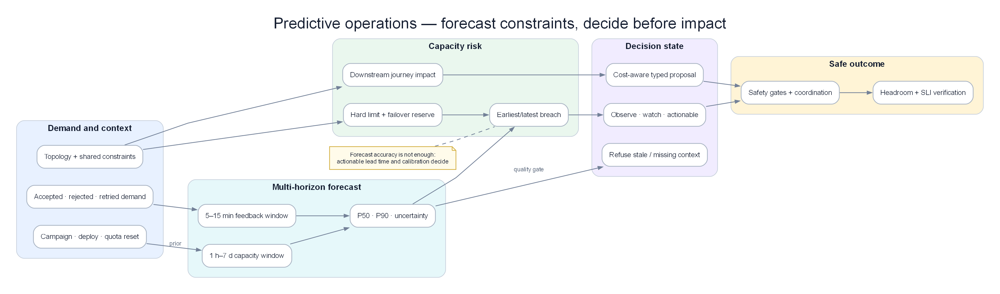

# Chapter 18 — Predictive Operations & Capacity Risk Engine

> **Anomaly Detection trả lời “điều gì đang khác thường?”. Predictive Operations phải trả lời câu hỏi khó hơn: “nếu không can thiệp, service nào sẽ vi phạm SLO trước, vào khoảng thời gian nào, vì resource hoặc dependency nào, và hành động sớm nhất có thể chứng minh là an toàn là gì?”. Một đường forecast đẹp không phải AIOps; một quyết định có uncertainty, topology, cost, owner và validation mới là production engine.**

*Demand + event context + topology → multi-horizon forecast → capacity risk → bounded proposal → verified headroom.*

## Prerequisites

- [03 — Metric Evidence](../03-prometheus/README.vi.md) — SLI, histogram, recording rule và burn rate
- [06 — Data & Feature Plane](../06-data-plane/README.vi.md) — event time, quality gate và feature version
- [08 — Topology & Change](../08-topology-change/README.vi.md) — dependency, criticality, deploy và scheduled event
- [09 — Persistent Detection](../09-anomaly-detection/README.vi.md) — baseline, drift và incident state
- [14 — Production Engine](../14-production-engine/README.vi.md) — HA, cost, degraded mode và capacity của chính AIOps

## Related Documents

- [13 — Remediation Safety](../13-remediation-safety-engine/README.vi.md) — risk gate và verification cho hành động sớm
- [16 — Domain Packs](../16-aiops-domain-packs/README.vi.md) — deadline và business constraint theo domain
- [17 — Benchmark Replay](../17-aiops-benchmark-replay/README.vi.md) — backtest cùng event-time và ground truth
- [Acceptance Template](../acceptance-template.vi.md) — contract kiểm chứng chung

## Sau chapter này, người đọc phải làm được gì?

1. Phân biệt forecast accuracy với capacity-risk usefulness.
2. Tính được time-to-exhaustion mà không giả định workload luôn tuyến tính.
3. Phát hiện bottleneck downstream dù service phía trước còn xanh.
4. Không page chỉ vì traffic hợp lệ tăng theo giờ, promotion hoặc payday.
5. Biết khi nào phải từ chối dự báo vì dữ liệu thiếu, topology stale hoặc uncertainty quá rộng.
6. Backtest engine bằng quyết định và lead time, không bằng một biểu đồ trông mượt.

## 1. Case xuyên suốt: traffic tăng hợp lệ nhưng database sắp cạn

Một hệ thống checkout chuẩn bị mở flash sale lúc 09:00. Marketing đã đăng lịch nên traffic tăng không phải anomaly. Kubernetes HPA vẫn tăng pod đúng như thiết kế. Dashboard frontend còn xanh. Nếu chỉ có threshold CPU và anomaly detector, on-call không có lý do để hành động.

Nhưng connection limit của database không scale cùng pod:

| Thời điểm | Traffic req/s | Checkout pods | DB connections | Queue oldest age | p95 checkout | Trạng thái khách hàng |
|---:|---:|---:|---:|---:|---:|---|
| 09:00 | 8.000 | 20 | 620/1.000 | 2 giây | 190 ms | Bình thường |
| 09:10 | 9.000 | 24 | 700/1.000 | 3 giây | 205 ms | Bình thường |
| 09:20 | 11.000 | 30 | 790/1.000 | 5 giây | 225 ms | Bình thường |
| 09:30 | 14.000 | 38 | 870/1.000 | 11 giây | 260 ms | Chưa vi phạm SLO |
| 09:40 | 18.000 | 50 | 960/1.000 | 38 giây | 340 ms | Một số payment chậm |
| 09:44 | 18.700 | 54 | 1.000/1.000 | 96 giây | 2,8 giây | Timeout lan rộng |

Tại 09:20, một engine đúng không phát cảnh báo “traffic anomaly”. Nó tạo một **capacity-risk proposal**:

| Trường quyết định | Giá trị tại 09:20 |
|---|---|
| Risk object | `checkout-db-connection-exhaustion` |
| Predicted breach | 09:42 |
| Khoảng dự báo | 09:37–09:50 |
| Lead time còn lại | 22 phút |
| Bottleneck | DB connection hard limit, không phải checkout CPU |
| Downstream impact | payment authorization và order confirmation |
| Evidence thuận | Connection slope, pod-to-connection ratio, queue age acceleration |
| Evidence nghịch | DB CPU 48%, query latency vẫn bình thường |
| Confidence | 0,82 sau calibration |
| Hành động đề xuất | Cap checkout concurrency; tăng DB headroom nếu failover reserve còn đủ |
| Hard gate | Không tăng pool nếu tổng connection sau action vượt 80% database max |
| Verification | Queue age giảm, connection headroom phục hồi, checkout SLI không xấu đi |

Điểm đáng chú ý: **DB CPU thấp không phủ định connection exhaustion**. Request đang chờ lấy connection chưa tạo query, nên database có thể trông nhàn ngay trước khi application sụp.

## 2. Forecast không phải capacity decision

Ba output thường bị trộn vào nhau:

| Output | Câu hỏi | Ví dụ | Có đủ để page? |
|---|---|---|---|
| Forecast | Giá trị tương lai có thể là bao nhiêu? | Connections sau 20 phút: 955–1.030 | Chưa |
| Breach probability | Xác suất vượt ranh giới là bao nhiêu? | 74% vượt 950 trước 09:45 | Chưa |
| Capacity risk | Nếu breach, user journey nào hỏng và còn thời gian làm gì? | Checkout timeout sau 18–30 phút; cap concurrency an toàn | Có thể |

Một forecast có sai số trung bình thấp vẫn vô dụng nếu sai đúng tại peak. Ngược lại, forecast lệch 8% có thể rất hữu ích nếu luôn phát hiện hard-limit breach trước 20 phút và ít page giả.

Engine production phải tối ưu **quyết định**, không tối ưu đường cong.

## 3. Output contract của Predictive Operations Engine

Mỗi prediction cần trở thành một object bất biến có thể replay:

| Nhóm | Trường bắt buộc | Vì sao cần |
|---|---|---|
| Identity | service, resource, tenant/region, model version | Tránh trộn series và tái dựng quyết định |
| Forecast | horizon, quantiles, generated-at, valid-until | Không dùng forecast cũ như sự thật hiện tại |
| Constraint | soft limit, hard limit, reserve policy | 80% CPU không giống 1.000 connection hard cap |
| Risk | breach probability, earliest/latest breach, severity | Cho người đọc uncertainty thay vì một ETA giả |
| Causality context | topology revision, change window, shared-fate | Xác định nơi user impact sẽ lan tới |
| Evidence | supporting, contradicting, missing | Buộc engine thể hiện điều chưa biết |
| Actionability | owner, safe actions, lead-time budget | Forecast không owner là dashboard decoration |
| Governance | policy version, calibration cohort, audit id | Phục vụ acceptance và điều tra sai dự báo |

`valid-until` quan trọng hơn nhiều hệ thống tưởng. Forecast sinh lúc 09:20 trước một deploy 09:23 không còn cùng điều kiện. Engine phải invalidated hoặc reforecast, không giữ ETA cũ đến 09:42.

## 4. Đơn vị dự báo đúng: demand, capacity và headroom

Chỉ forecast CPU là sai mô hình. Engine cần ba lớp:

### 4.1 Demand

Demand là tải muốn đi vào hệ thống: request rate, message arrival rate, bytes/s, concurrent sessions hoặc số job theo deadline.

Ví dụ payment nhận `2.000 → 2.300 → 2.800 → 3.400 txn/s`. Nếu gateway throttling giữ observed throughput ở 2.500, metric xử lý chỉ cho thấy đường phẳng. Demand thật nằm ở `accepted + rejected + retried`, không phải successful throughput.

### 4.2 Effective capacity

Capacity không phải số pod. Nó là throughput tối đa dưới constraint hiện tại.

40 pod có thể xử lý 20.000 req/s trong test, nhưng production chỉ đạt 12.000 vì:

- database giới hạn 1.000 connections;
- partner API cho 8.000 requests/phút;
- một shard nóng chịu 45% traffic;
- CPU limit khiến pod throttling;
- retry dùng mất 30% capacity.

### 4.3 Headroom

Headroom phải tính theo bottleneck:

`headroom = effective capacity − projected demand − failover reserve`

Nếu effective capacity là 15.000 req/s, demand dự báo p95 là 13.800 và policy giữ 20% cho failover, headroom vận hành đã âm dù dashboard còn 1.200 req/s “trống”.

## 5. Time-to-exhaustion không phải phép chia slope ngây thơ

Với dãy connection `620, 700, 790`, cách tuyến tính có thể dự báo chạm 1.000 sau khoảng 23 phút. Nhưng bốn lực làm ETA thay đổi:

1. HPA thêm pod và mỗi pod mở pool mới.
2. Retry tăng phi tuyến khi latency bắt đầu cao.
3. Cache hit giảm khi catalog mới được bật.
4. Circuit breaker có thể cắt demand đột ngột.

Vì vậy engine cần xuất một **khoảng breach** thay vì một timestamp duy nhất.

| Kịch bản | Giả định | Breach dự kiến |
|---|---|---:|
| P50 | Traffic đi đúng plan, retry ổn định | 09:47 |
| P90 | Traffic cao hơn plan 12% | 09:42 |
| Stress | Retry ratio tăng từ 1,05 lên 1,35 | 09:36 |
| Mitigated | Cap concurrency lúc 09:30 | Không breach trong 60 phút |

Nếu khoảng dự báo là “5 phút đến 4 giờ”, engine chưa có quyết định đủ tốt để page. Nó nên yêu cầu evidence bổ sung hoặc chuyển thành watch, không ép confidence giả.

## 6. Multi-horizon: một model không phục vụ mọi quyết định

| Horizon | Quyết định | Tín hiệu chính | Sai lầm phổ biến |
|---|---|---|---|
| 5–15 phút | Throttle, pause deploy, pre-warm | Slope gần, queue acceleration, retry | Quá nhạy với một spike |
| 30–120 phút | Scale pool, tăng quota, chuyển traffic | Event schedule, topology capacity | Không tính thời gian action có hiệu lực |
| 1–7 ngày | Mua capacity, đổi partition, reschedule batch | Seasonality, growth, planned campaigns | Ngoại suy trend tuyến tính vô hạn |
| 1–3 tháng | Architecture và budget | Demand cohort, product roadmap | Trộn uncertainty chiến lược với page on-call |

Một risk chỉ actionable nếu `lead time > action latency + verification latency + safety buffer`.

Ví dụ tăng cloud quota cần 2 ngày thì forecast 30 phút không phải “early warning”; nó là bằng chứng quy trình capacity đã thất bại.

## 7. Dependency-aware capacity: bottleneck nằm sau service xanh

Topology ở Chapter 08 biến forecast cục bộ thành impact path.

Giả sử:

- checkout còn 35% CPU headroom;
- payment còn 40% pod headroom;
- auth-vendor còn 18% quota;
- order-db còn 6% connection headroom;
- cả checkout và refund dùng chung order-db.

Một engine chỉ rank theo local utilization sẽ đánh dấu order-db. Engine production phải đi thêm hai bước:

1. **Downstream weighting:** checkout và refund chiếm bao nhiêu business traffic, tier nào và error-budget state ra sao?
2. **Shared-fate:** failover payment sang region B có dùng chính database/quota đang cạn không?

Risk card phải nói “order-db connection exhaustion có thể làm hỏng checkout và refund”, không chỉ “database usage high”.

### Fan-out và fan-in

Một API gọi 12 downstream tạo demand lớn hơn request đầu vào. Ngược lại, 20 service cùng ghi một queue tạo fan-in. Forecast từng service độc lập sẽ không thấy tổng demand.

Với traffic frontend tăng 10%, nếu mỗi request tạo 4 inventory calls và cache hit giảm từ 90% xuống 70%, database read demand có thể tăng hơn 3 lần. Forecast cần feature theo **work amplification**, không chỉ traffic.

## 8. Tải hợp lệ thay đổi: đừng biến promotion thành anomaly

Engine cần event context:

| Event | Cách dùng đúng | Cách dùng sai |
|---|---|---|
| Flash sale 09:00–11:00 | Thay demand prior và tăng risk sensitivity | Suppress mọi cảnh báo trong sale |
| Payday | Chọn cohort lịch sử tương đồng | So với ngày thường gần nhất |
| Feature launch | Widen uncertainty, theo dõi amplification | Tin forecast cũ sau launch |
| Deploy checkout | Invalidate model nếu feature behavior đổi | Gắn deploy là root cause mặc định |
| Batch cuối tháng | Forecast queue deadline và shared DB | Chỉ forecast average daily load |

Lịch event không phải ground truth. Marketing có thể dự kiến 20.000 req/s nhưng thực tế chỉ 9.000 hoặc lên 35.000. Engine dùng schedule làm prior, sau đó cập nhật bằng observed demand.

## 9. Burn-rate đa cửa sổ cho capacity risk

Capacity prediction và SLO burn-rate nên kiểm tra lẫn nhau.

Ví dụ engine dự báo database cạn trong 25 phút nhưng user SLI vẫn khỏe:

- cửa sổ 5 phút cho thấy burn-rate 0,7×;
- cửa sổ 30 phút là 0,9×;
- connection headroom giảm từ 21% xuống 9%;
- queue oldest age tăng đều.

Đây là proactive risk hợp lệ vì hard limit có thể chuyển từ 0% lỗi sang gần 100% rất nhanh. Tuy nhiên severity chưa nên bằng outage đang diễn ra.

Ngược lại, burn-rate 12× nhưng capacity forecast “khỏe” cho thấy incident không phải capacity class. Engine phải chuyển evidence sang Detection/RCA, không cố giải thích mọi lỗi bằng forecast.

## 10. Queue và deadline: depth không đủ

Xét queue có depth `10k → 20k → 35k → 50k`, arrival 5.000 msg/s và consume 4.500 msg/s. Depth tăng 500 msg/s. Nếu chỉ chia depth cho throughput, ta bỏ qua deadline.

Hai queue cùng depth 50.000:

- email receipt có deadline 30 phút: còn an toàn;
- payment settlement có deadline 2 phút: đã breach nghiệp vụ.

Engine cần forecast:

- oldest event age;
- arrival và service rate theo partition;
- thời gian drain nếu arrival về bình thường;
- deadline miss probability;
- downstream window như cutoff ngân hàng.

Partition skew cũng phải tách riêng. Average lag 8 giây có thể che một partition lag 11 phút vì key nóng.

## 11. Autoscaling là feedback loop, không phải external truth

Forecast thay đổi hành vi hệ thống, rồi hành vi đó thay đổi forecast.

Case:

1. Engine dự báo CPU breach và HPA tăng pod.
2. Mỗi pod mở 20 DB connections.
3. CPU giảm nên forecast CPU trông tốt hơn.
4. Database pool cạn nhanh hơn.

Nếu engine chỉ nhìn từng resource, recommendation của nó tạo ra incident khác.

Mọi proposed action cần một **counterfactual impact table**:

| Action | Resource được cứu | Resource có thể xấu đi | Gate |
|---|---|---|---|
| Tăng 20 pods | Checkout CPU | DB connections, cache churn | DB reserve sau scale ≥ 20% |
| Tăng worker | Queue lag | Partner quota, DB write | Partner quota p95 còn đủ |
| Chuyển region | Region A CPU | Region B shared database | Failover rehearsal còn hiệu lực |
| Tăng pool | Acquire wait | Database max connections | Ownership/leak evidence rõ |

## 12. Cost-aware recommendation nhưng reliability có quyền phủ quyết

Engine có thể so sánh ba lựa chọn:

| Lựa chọn | Chi phí 2 giờ | Risk breach | Thời gian hiệu lực | Kết luận |
|---|---:|---:|---:|---|
| Không làm gì | 0 USD | 74% | Ngay | Không chấp nhận |
| Pre-scale 20 pods | 38 USD | 61% vì DB vẫn cạn | 4 phút | Sai bottleneck |
| Cap concurrency + tăng DB headroom | 120 USD | 8% | 12 phút | Đề xuất |

Cost chỉ được tối ưu bên trong miền an toàn. Không được chọn phương án rẻ nhất nếu vi phạm SLO hoặc failover reserve.

## 13. Khi engine phải từ chối dự báo

Từ chối là hành vi production, không phải failure.

Engine phải trả `insufficient_evidence` khi:

- metric bị mất 18% trong cửa sổ dùng để forecast;
- topology revision quá freshness SLO;
- hard limit chưa rõ hoặc quota API trả dữ liệu cũ;
- deploy làm distribution shift ngoài cohort đã calibration;
- series bị clamp ở 100% nên không còn thấy latent demand;
- quantile interval rộng hơn action window;
- model version chưa qua shadow/backtest cho service tier này.

Output từ chối vẫn phải ghi owner và query tiếp theo: “xác minh quota”, “đọc rejected demand”, hoặc “chuyển sang conservative static reserve”.

## 14. Edge cases production thường xuyên gặp

### 14.1 Censored demand

Gateway chỉ nhận tối đa 10.000 req/s nên observed traffic nằm ngang 10.000. Rejected traffic tăng `0 → 500 → 3.000`. Forecast trên accepted traffic nói ổn; demand forecast phải cộng reject và retry đã dedup.

### 14.2 Cold start service mới

Service mới có 3 giờ dữ liệu không thể học weekly seasonality. Dùng domain prior từ service cùng class, load-test envelope và uncertainty rộng. Chỉ cho phép watch hoặc human-approved pre-scale cho tới khi đủ cohort.

### 14.3 Holiday không giống holiday năm trước

Campaign, giá và product mix thay đổi. Lịch sử chỉ là prior. Engine phải theo dõi forecast residual theo thời gian thật và reforecast, không giữ curve năm trước.

### 14.4 Metric chạm trần

CPU báo 100% liên tục không cho biết demand là 105% hay 250%. Dùng throttled time, queue age, rejected work và client retry để ước lượng pressure ngoài trần.

### 14.5 Failover reserve giả

Region B trống 40%, nhưng database và partner quota dùng chung global. Capacity failover thực tế bằng bottleneck chung, không phải tổng pod trống.

### 14.6 Retry amplification

Traffic user không đổi nhưng request nội bộ tăng 1,8 lần. Forecast cần original-request identity hoặc retry label; nếu không sẽ nhầm retry là demand tăng tự nhiên và scale vào vòng lặp.

### 14.7 Queue rebalance

Lag nhảy trong consumer rebalance nhưng oldest event age không tăng. Không tạo breach prediction nếu freshness SLI khỏe và throughput trở lại trong grace window.

### 14.8 Quota reset theo cửa sổ

API quota 1 triệu request/ngày còn 8%, nhưng reset sau 12 phút. Time-to-exhaustion 20 phút nghĩa là không breach. Engine phải hiểu reset policy, timezone và clock skew.

### 14.9 Tenant voi

Global usage 55%, một tenant chiếm 85% shard. Forecast theo global bỏ lọt. Tách tenant/shard nhưng kiểm soát cardinality bằng tier và heavy-hitter tracking.

### 14.10 Deploy làm giảm capacity mỗi pod

Pod count không đổi, traffic không đổi, CPU tăng vì version mới tốn gấp đôi. Model cũ phải invalidated theo change event và so control group old/new version.

### 14.11 Telemetry đến muộn

Batch metric arrive sau 8 phút có thể làm forecast “quay về quá khứ”. Engine dùng event time, watermark và revision id; không page lại cho cùng breach nếu chỉ processing time thay đổi.

### 14.12 Hai bottleneck cạnh tranh

Database chạm limit trong 25 phút, disk chạm trong 40 phút. Hành động cứu DB có thể tăng write và làm disk chạm trong 15 phút. Action simulation phải reforecast tất cả constraint liên quan.

## 15. Multi-signal capacity scoring

Không cộng điểm mù quáng. Hard constraint và evidence quality có quyền phủ quyết.

Một risk score có thể gồm:

| Signal | Vai trò | Ví dụ |
|---|---|---|
| Breach probability | Khả năng vượt constraint | 0,74 |
| Business criticality | Hậu quả nếu breach | Payment tier-0 |
| Lead-time adequacy | Còn đủ thời gian action không | 22 phút so với action 12 phút |
| Dependency spread | Số critical journey downstream | Checkout, refund |
| Forecast calibration | Model có đáng tin trong cohort này | 82% interval coverage |
| Data quality | Missing/stale/conflict | 98% complete |

Nhưng nếu quota không xác minh được hoặc topology stale, score cao không được bù hard gate fail. Output phải hạ về `watch` hoặc `unknown`.

## 16. Backtest đúng: replay quyết định, không chỉ forecast value

Mỗi historical window cần giả lập đúng điều engine biết tại thời điểm đó. Không được dùng quota, topology hoặc event cập nhật sau incident.

### Ground truth cho một forecast incident

- breach có thật hay không;
- thời điểm user SLI bắt đầu xấu;
- bottleneck thật;
- action nào đã làm và lúc nào;
- nếu không breach vì người đã can thiệp, đó không phải false positive tự động;
- uncertainty interval có chứa thời điểm breach hay không.

### Metrics có ý nghĩa vận hành

| Metric | Câu hỏi |
|---|---|
| Useful lead time | Engine báo trước đủ để hành động bao lâu? |
| Breach precision | Bao nhiêu risk card thật sự cần can thiệp? |
| Missed critical breach | Có hard-limit incident nào không được báo? |
| Interval coverage | Khoảng p90 có chứa kết quả thật gần 90% không? |
| Bottleneck accuracy | Resource được chỉ ra có đúng cơ chế không? |
| Action regret | Recommendation có gây chi phí/risk không cần thiết không? |
| Alert persistence | Risk kéo dài có bị tự nuốt giữa chừng không? |

Không dùng MAPE một mình: series gần zero làm MAPE vô nghĩa; average error cũng che lỗi tại peak.

## 17. State machine và lifecycle của risk

| State | Ý nghĩa | Điều kiện chuyển |
|---|---|---|
| Observing | Có trend nhưng chưa đủ evidence | Breach probability dưới watch threshold |
| Watch | Có risk, chưa cần page | Lead time dài hoặc uncertainty rộng |
| Actionable | Đủ evidence và còn thời gian can thiệp | Gate data/topology/model pass |
| Mitigating | Action đã được chấp thuận | Có action id và owner |
| Verifying | Đợi headroom/SLI chứng minh | Minimum observation window đạt |
| Cleared | Risk thật sự hết | Nhiều cửa sổ đều an toàn |
| Invalidated | Context thay đổi | Deploy, quota, topology hoặc model revision mới |

Engine không được tự clear chỉ vì action vừa chạy. Nó phải thấy constraint, leading signal và user SLI cùng phục hồi.

## 18. Rollout production

### Giai đoạn 1 — Historical replay

Chọn 30–50 incident capacity và 50 peak hợp lệ. Đảm bảo có cả case can thiệp sớm để không gắn nhãn nhầm thành false positive.

### Giai đoạn 2 — Shadow

Sinh risk card nhưng không page. So timestamp với quyết định thật của on-call. Thu thập “đúng bottleneck nhưng quá muộn” riêng khỏi “sai bottleneck”.

### Giai đoạn 3 — Watch channel

Chỉ gửi tier-0, hard constraint, lead time đủ. Mỗi card có expiry và owner; không dump hàng trăm forecast series.

### Giai đoạn 4 — Human-approved action

Cho phép pre-scale, quota request hoặc cap concurrency qua Safety Engine. Không auto-action chỉ dựa trên forecast confidence.

### Giai đoạn 5 — Bounded automation

Chỉ action class đã benchmark, rollback được và có independent verification. Một recommendation fail verification phải hạ automation tier.

## 19. Production acceptance

| Dimension | Scenario bắt buộc | Threshold khởi đầu | Evidence artifact |
|---|---|---|---|
| Long ramp | Dãy 8k→18k req/s | Không có khoảng câm; lead time ≥ action latency + 5 phút | Risk-state timeline |
| Legitimate peak | Promotion có lịch | Không page chỉ vì traffic tăng | Event-context decision log |
| Hidden bottleneck | CPU xanh, DB pool cạn | Rank đúng dependency bottleneck | Topology snapshot + evidence |
| Concurrent risk | DB và disk cùng tiến tới limit | Hai risk object, action không xung đột | Resource coordination log |
| Calibration | 100 replay windows | p90 coverage nằm trong 85–95% | Calibration report |
| Missing data | Mất 20% metric | Refuse hoặc degraded policy; không confidence giả | Quality-gate output |
| Change invalidation | Deploy giữa forecast | Forecast cũ invalidated trong freshness SLO | Revision audit |
| Safety | Scale làm tăng DB pressure | Hard gate chặn action | Policy evaluation |
| Recovery | Headroom phục hồi | Không clear trước verification window | Before/after evidence |

Acceptance phải ghi rõ service tier, horizon, model version, topology revision và constraint version. Pass trên checkout không tự động cho phép rollout sang settlement.

## 20. Anti-patterns cần loại bỏ

| Anti-pattern | Vì sao nguy hiểm | Thay bằng |
|---|---|---|
| Forecast mọi metric | Alert storm dưới tên mới | Forecast constraint và decision |
| Một ETA duy nhất | Che uncertainty | Earliest/latest + quantiles |
| Scale theo CPU | Bỏ bottleneck downstream | Dependency-aware capacity |
| Training trên observed throughput | Không thấy rejected demand | Demand reconstruction |
| Dùng schedule để suppress | Che incident thật trong peak | Schedule làm prior |
| Accuracy trung bình đẹp | Có thể vẫn miss peak | Lead time, calibration, breach recall |
| Auto-action theo confidence | Confidence không phải policy | Safety hard gates |
| Không invalidated sau change | Forecast dùng thế giới cũ | Revision-aware lifecycle |
| Page khi action không kịp | Tạo toil, không cứu được | Capacity planning escalation |
| Clear ngay sau scale | Chưa chứng minh recovery | Multi-signal verification |

## 21. Production checklist

- [ ] Demand khác observed throughput.
- [ ] Hard/soft limit và failover reserve có owner.
- [ ] Forecast có interval, expiry và model version.
- [ ] Topology và scheduled change có freshness SLO.
- [ ] Risk tách theo region/shard/tenant quan trọng.
- [ ] HPA, retry, cache và circuit breaker được coi là feedback loop.
- [ ] Queue dùng oldest age và deadline, không chỉ depth.
- [ ] Missing data dẫn tới degraded/refuse, không im lặng.
- [ ] Backtest không leakage từ tương lai.
- [ ] Metrics gồm useful lead time và calibration.
- [ ] Recommendation đi qua Remediation Safety Engine.
- [ ] Recovery có independent verification.
- [ ] Mỗi risk card có owner, expiry và dedup key.
- [ ] Concurrent resource risk có coordination.
- [ ] Game day gồm peak hợp lệ lẫn hidden bottleneck.

## Kết luận

Predictive Operations không phải “vẽ tương lai” mà là quản lý uncertainty trước một constraint có hậu quả. Engine tốt biết demand thật, effective capacity, dependency bottleneck, thời gian hành động và điều chưa biết. Nó không la làng vì promotion, không scale nhầm tầng stateless khi database sắp cạn, không biến confidence thành quyền hành động và không tự nhận thành công trước khi headroom cùng user SLI phục hồi.

## Tài liệu liên quan

- [AWS Well-Architected — Reliability Pillar](https://docs.aws.amazon.com/wellarchitected/latest/reliability-pillar/welcome.html) — quota, constraint, failover headroom và reliability planning
- [Google SRE — Incident Management Guide](https://sre.google/resources/practices-and-processes/incident-management-guide/) — symptom-based alerting và trường hợp preventive alert cho hard quota sắp cạn
- [Google SRE — Handling Overload](https://sre.google/sre-book/handling-overload/) — overload, load shedding và capacity behavior
- [09 — Persistent Detection](../09-anomaly-detection/README.vi.md)
- [13 — Remediation Safety](../13-remediation-safety-engine/README.vi.md)
- [17 — Benchmark Replay](../17-aiops-benchmark-replay/README.vi.md)
