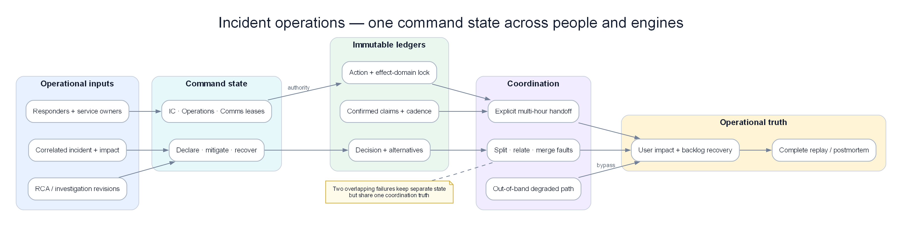

# Chapter 19 — Incident Operations Control Plane

> **Detection có thể đúng, RCA có thể đúng và remediation có thể an toàn, nhưng sự cố vẫn kéo dài nếu không ai giữ quyền chỉ huy, hai đội thay đổi cùng resource, status page nói khác incident state hoặc ca trực mới không biết giả thuyết nào đã bị loại. Incident Operations Control Plane là lớp biến output của AIOps thành một cuộc ứng cứu có owner, state, quyền hạn, timeline và handoff — không phải thêm một chatbot vào war room.**

*Incident, evidence và responders cùng đi vào command state; decision/action/communication ledger giữ coordination truth qua split fault, degraded mode và handoff.*

## Prerequisites

- [10 — Alert Correlation](../10-alert-correlation/README.vi.md) — incident grouping và split/merge
- [11 — Root Cause Analysis](../11-root-cause-analysis/README.vi.md) — candidate, temporal order và counter-evidence
- [12 — Investigation Engine](../12-investigation-engine/README.vi.md) — hypothesis ledger và human handoff
- [13 — Remediation Safety](../13-remediation-safety-engine/README.vi.md) — action state, approval, verification và rollback
- [14 — Production Engine](../14-production-engine/README.vi.md) — degraded mode và independent control path

## Related Documents

- [08 — Topology & Change](../08-topology-change/README.vi.md) — owner, criticality và change timeline
- [17 — Benchmark Replay](../17-aiops-benchmark-replay/README.vi.md) — replay incident theo event time
- [18 — Predictive Operations](../18-predictive-operations/README.vi.md) — proactive risk trước khi declare incident
- [Acceptance Template](../acceptance-template.vi.md) — contract kiểm chứng chung

## Sau chapter này, người đọc phải làm được gì?

1. Thiết kế incident object không phụ thuộc Slack thread hay trí nhớ một người.
2. Declare, split, merge và close incident bằng evidence thay vì cảm giác.
3. Giữ hai incident chồng nhau không che lẫn signal, owner và action budget.
4. Chặn hai đội thực hiện remediation xung đột trên cùng resource.
5. Bàn giao sự cố nhiều giờ mà không mất hypothesis, risk và việc đang chạy.
6. Đo hiệu quả ứng cứu mà không game MTTA/MTTR.

## 1. Case xuyên suốt: payment kéo dài 65 phút, auth nổ chồng

Sự cố đầu tiên bắt đầu ở payment do database pool exhaustion. Phút 27, một certificate của auth service hết hạn. Hai lỗi cùng làm checkout timeout nhưng có root, owner và remediation khác nhau.

| Phút | Payment | Auth | Customer impact | Điều control plane phải làm |
|---:|---|---|---|---|
| 00 | p95 tăng 220→680 ms | Bình thường | 2% checkout chậm | Tạo candidate, chưa declare major incident |
| 04 | Pool wait 15→310 ms | Bình thường | Error budget burn 6× | Declare `INC-4821`, assign IC/Operations |
| 11 | Queue age 4→46 giây | Bình thường | 9% timeout | Freeze deploy money path; mở action ledger |
| 20 | Cap concurrency bắt đầu | Bình thường | Error rate giảm chậm | State `mitigating`, chưa nói resolved |
| 27 | Payment đang hồi | TLS error auth xuất hiện | Login và checkout cùng lỗi | Tạo `INC-4822`, không merge vào payment |
| 31 | Pool wait giảm | Auth error 18% | Hai journey cùng đỏ | Hai Operations Lead, một umbrella coordination |
| 42 | Payment SLI khỏe 10 phút | Cert rollback đang verify | Login vẫn lỗi | Close impact payment, giữ auth active |
| 55 | Khỏe | TLS error về 0 | User SLI hồi | Auth chuyển `monitoring` |
| 65 | Khỏe | Khỏe 10 phút | Không còn impact | Resolve sau independent verification |

Nếu hệ thống chỉ có một “incident room checkout”, auth có thể bị coi là residual symptom của payment. Nếu hệ thống tạo room cho mọi alert, người ứng cứu bị chia nhỏ. Control plane phải dùng topology, temporal origin, error signature và control group để quyết định **split hay merge**.

## 2. Incident Operations khác correlation và investigation

| Capability | Output chính | Không nên sở hữu |
|---|---|---|
| Correlation | Alert nào thuộc cùng fault episode | Quyền chỉ huy và communication |
| RCA | Candidate root cause có evidence | Điều phối con người |
| Investigation | Hypothesis ledger và query plan | Production mutation |
| Remediation Safety | Action proposal, gate, rollback | Incident severity và external update |
| Incident Operations | Incident state, roles, decision/action/comms ledger | Tự suy đoán technical root cause |

Control plane không thay các engine trước. Nó giữ chúng cùng một operational truth và buộc mọi thay đổi state có lý do.

## 3. Incident object: source of truth không phải chat room

Một incident object production cần tối thiểu:

| Nhóm | Trường | Ví dụ `INC-4821` |
|---|---|---|
| Identity | incident id, parent, related incidents | `INC-4821`, related `INC-4822` |
| Scope | services, journeys, regions, tenants | checkout/payment, region A |
| Impact | SLI, affected users, money/time loss | 9% timeout, 18k sessions |
| Time | detected, declared, mitigated, recovered, closed | Mỗi mốc có event time và recorder |
| State | lifecycle state + reason | `mitigating`: action A-19 executing |
| Roles | IC, Operations, Communications, Scribe | User/service account + lease expiry |
| Evidence | links tới correlation/RCA/investigation revision | RCA rev 7, topology rev 812 |
| Decisions | quyết định, alternatives, approver | Cap concurrency thay vì scale pods |
| Actions | owner, target, status, rollback | A-19, checkout concurrency 60% |
| Communications | audience, claim, next update | Customer update 09:35 |
| Governance | severity policy, retention, access | SEV-1 policy v4 |

Chat vẫn hữu ích để phối hợp, nhưng message có thể sửa, trôi hoặc nằm trong workspace lỗi. Incident object phải ghi lại các mốc quan trọng qua API/event store độc lập.

## 4. State machine: “đã hết alert” không có nghĩa resolved

| State | Ý nghĩa | Evidence tối thiểu |
|---|---|---|
| Candidate | Có signal nhưng scope chưa rõ | Detection/correlation id |
| Declared | Cần coordination chính thức | Severity, IC lease, impacted journey |
| Investigating | Đang phân biệt hypothesis | Query plan và next update time |
| Mitigating | Có action đang giảm impact | Action id, owner, safety decision |
| Recovering | Leading signal hồi, backlog còn | Recovery metrics và drain ETA |
| Monitoring | User SLI khỏe trong soak window | Không còn new affected cohort |
| Resolved | Impact thật sự kết thúc | Multi-signal verification |
| Closed | Review/evidence pack hoàn tất | Timeline, follow-up owners |
| Reopened | Impact quay lại hoặc recovery giả | New evidence linked tới incident cũ |

Transition phải idempotent. Hai event `resolve` gửi lặp không tạo hai mốc. Event đến muộn phải được đặt đúng event time nhưng không âm thầm quay state hiện tại về quá khứ.

### Recovery giả

Payment error về 0 vì gateway đã reject toàn bộ request trước khi đến payment. Nếu chỉ nhìn server error, engine sẽ resolve. Control plane cần ba lớp:

- client/user journey SLI;
- service processing SLI;
- demand/reject/queue evidence.

Không state nào được chuyển sang `resolved` chỉ bằng absence of telemetry.

## 5. Declare sớm nhưng không tạo SEV-1 cho mọi anomaly

Một incident nên được declare khi ít nhất một điều đúng:

- customer-facing SLO burn vượt policy;
- hard quota có imminent failure và lead time ngắn;
- cần từ hai team trở lên phối hợp;
- action có blast radius vượt team local;
- security/compliance consequence cần command structure;
- tình trạng chưa rõ kéo dài quá investigation budget.

Severity có thể tăng hoặc giảm sau khi declare. Declare SEV-2 rồi đóng sau 12 phút tốt hơn đợi 40 phút mới tạo structure. Tuy nhiên “declare sớm” không nghĩa mọi watch của Chapter 18 thành incident.

## 6. Role và quyền hạn: lease, không phải danh xưng trong Slack

| Role | Quyền | Không nên làm đồng thời |
|---|---|---|
| Incident Commander | Scope, priority, role assignment, state transition | Debug sâu một service |
| Operations Lead | Điều phối mitigation và resource owner | External communication |
| Communications Lead | Internal/customer update nhất quán | Tự kết luận root cause |
| Scribe/Timeline | Ghi fact, decision, action, timestamp | Approve action nguy hiểm |
| Subject Matter Expert | Cung cấp evidence và proposal | Tự thay đổi shared resource |
| Safety Approver | Kiểm policy/blast radius/rollback | Là người đề xuất duy nhất |

Role assignment cần lease và heartbeat. Nếu IC mất kết nối 10 phút, control plane phải yêu cầu takeover rõ ràng; không để “mọi người đều nghĩ người khác đang chỉ huy”.

Handoff chỉ hoàn tất khi người nhận xác nhận. Timestamp “assign” một chiều không đủ.

## 7. Decision ledger: lưu điều đã biết tại thời điểm quyết định

Mỗi quyết định cần:

- vấn đề đang giải quyết;
- evidence nhìn thấy lúc đó;
- alternative đã cân nhắc;
- assumption;
- người quyết định và policy cho phép;
- expected outcome;
- checkpoint và rollback trigger.

Ví dụ 09:21:

| Trường | Nội dung |
|---|---|
| Decision | Cap checkout concurrency xuống 60% |
| Vì sao | Pool wait dẫn trước timeout; scale pod sẽ tăng connections |
| Không chọn | Tăng pod; restart database |
| Assumption | Reject có retry-after; VIP traffic vẫn được giữ |
| Expected | Pool wait <100 ms trong 8 phút; error rate <3% |
| Rollback | Queue age >120 giây hoặc VIP failure tăng |
| Re-evaluate | 09:29 |

Postmortem cần đánh giá quyết định theo evidence lúc 09:21, không theo điều mọi người biết sau 10:00.

## 8. Action ledger và resource lock

Hai remediation riêng có thể hợp lệ nhưng kết hợp lại nguy hiểm:

- Team checkout giảm timeout từ 2 giây xuống 500 ms.
- Team payment restart 30% pods.
- Cả hai cùng làm retry tăng và pool pressure xấu hơn.

Control plane cần lock theo **resource và effect**, không chỉ theo Kubernetes object.

| Action | Target trực tiếp | Effect domain | Conflict |
|---|---|---|---|
| Restart payment pods | Deployment payment | Capacity, connection churn | Scale/restart khác |
| Cap checkout concurrency | Gateway policy | Admission, queue | Traffic shift |
| Failover DB | Database primary | Region, data consistency | Schema/change/failover |
| Rotate auth cert | Secret + ingress | Identity/TLS | Ingress rollout |

Lock có TTL để không kẹt vĩnh viễn, nhưng hết TTL không đồng nghĩa action đã dừng. Nếu trạng thái executor unknown, cần reconcile trước khi cấp lock mới.

## 9. Hai incident chồng nhau: split, relate hay merge?

### Merge khi

- cùng first-origin mechanism;
- cùng topology propagation path;
- temporal onset phù hợp;
- cùng remediation làm cả hai phục hồi;
- không có control group phủ định.

### Split khi

- error signature khác cơ chế;
- onset thứ hai xảy ra sau khi signal thứ nhất đang phục hồi;
- service/region control group cho thấy phạm vi khác;
- remediation đầu không ảnh hưởng signal thứ hai;
- owner và action budget khác.

### Relate nhưng không merge khi

Payment và auth cùng làm checkout lỗi, nhưng hai root riêng. Tạo umbrella coordination để customer communication thống nhất; vẫn giữ hai incident state, hypothesis và action ledger riêng.

Một `related_to` edge tốt hơn ép mọi thứ vào một incident khổng lồ.

## 10. Timeline: event time trước processing time

Thứ tự “đỏ trước” hữu ích nhưng phải chống dữ liệu đến muộn.

| Event | Event time | Ingest time | Cách dùng |
|---|---:|---:|---|
| DB pool wait tăng | 09:03:12 | 09:03:20 | Candidate origin |
| Checkout timeout | 09:03:45 | 09:03:47 | Downstream symptom |
| Mobile synthetic fail | 09:03:40 | 09:05:10 | Đặt lại đúng event time |
| Deploy metadata | 08:58:00 | 09:08:00 | Change candidate, không coi xảy ra 09:08 |

Control plane hiển thị cả hai clock và provenance. Không sửa mất lịch sử cũ; timeline revision cho biết fact nào được thêm muộn.

## 11. Communication là output có policy

Customer update không được copy nguyên hallucinated RCA. Mỗi claim cần trạng thái:

| Claim class | Có thể nói | Không nên nói sớm |
|---|---|---|
| Confirmed impact | “Một phần checkout đang timeout” | “Toàn bộ payment đã down” nếu chưa đo |
| Mitigation | “Đang giảm tải để phục hồi” | Chi tiết action nhạy cảm |
| Root cause | “Đang điều tra database path” | “Database chắc chắn là root” khi còn candidate |
| ETA | Next update time | Recovery ETA giả chắc chắn |

Mỗi update có audience, evidence revision, approver và `next_update_at`. Nếu chưa có tiến triển, vẫn cập nhật “điều đang kiểm tra” đúng cadence; im lặng làm mất niềm tin.

## 12. Human–automation authority

| Tình huống | Máy được làm | Cần người |
|---|---|---|
| Tạo candidate, enrich scope | Tự động | Không |
| Declare theo hard SLO policy | Có thể tự động | IC nhận lease |
| Gợi ý severity | Có | IC xác nhận với business context |
| Draft update từ confirmed facts | Có | Communications duyệt external |
| Chạy action reversible tier thấp | Theo policy | Audit và veto window |
| Failover database/payment rail | Chuẩn bị proposal | Dual approval |
| Resolve incident | Đề xuất khi gate pass | IC xác nhận tier-0 |

LLM không được tự gán người chịu trách nhiệm, thay severity vì ngôn ngữ cảm xúc hoặc gửi external message mà không qua policy.

## 13. Handoff sự cố nhiều giờ

Một handoff packet tốt phải trả lời trong hai phút:

1. Khách hàng nào còn bị ảnh hưởng?
2. Incident đang ở state nào và vì sao?
3. Hypothesis nào mạnh nhất; cái nào đã bị loại?
4. Action nào đang chạy, target gì, khi nào checkpoint?
5. Resource lock nào còn giữ?
6. Risk lớn nhất 30 phút tới là gì?
7. Ai đang giữ từng role?
8. External update tiếp theo lúc nào?

Handoff không phải paste toàn bộ chat. Nó là snapshot có revision, nhưng link ngược được về evidence và timeline.

Người nhận phải xác nhận: “Tôi nhận IC từ 18:00, hiểu action A-19 đang verify và không được scale payment trước checkpoint 18:08.”

## 14. Degraded mode khi control plane hoặc chat hỏng

Không được phụ thuộc duy nhất vào hệ đang bị sự cố.

| Failure | Degraded behavior |
|---|---|
| Incident UI down | Read-only replicated state + offline template |
| Chat provider down | Bridge voice/SMS và append event qua secondary path |
| AIOps engine down | Direct paging và manual declare vẫn hoạt động |
| Identity provider down | Break-glass role với time-bound credential |
| Event bus lag | Hiển thị freshness; không giả timeline complete |
| Region chính down | Out-of-band control plane ở failure domain khác |

Break-glass event phải được reconcile vào timeline sau phục hồi; “ngoài hệ thống nên khỏi audit” là anti-pattern.

## 15. Edge cases production khó nhưng thường gặp

### 15.1 Incident commander biến mất

Lease hết, paging fallback gọi deputy. State không tự chuyển `resolved`; quyền approve action high-risk tạm khóa cho tới takeover.

### 15.2 Hai người cùng nghĩ mình là IC

Chỉ một lease revision được chấp nhận. Người còn lại có thể làm deputy nhưng không ghi đè severity/state. UI phải hiển thị fencing token, không dựa vào tên trong topic.

### 15.3 Vendor incident không có telemetry nội bộ

Tạo external dependency incident với evidence từ client errors, status vendor và synthetic. Không đóng vì vendor status xanh nếu client SLI vẫn đỏ.

### 15.4 Incident xuyên timezone

Lưu UTC trong event store, render local cho người đọc. Deadline và status update không dùng chuỗi giờ thiếu timezone.

### 15.5 Action executor timeout

Status là `unknown`, không phải failed. Reconcile target state trước retry để tránh failover/restart lặp.

### 15.6 Một alert bị correlate nhầm

Cho phép detach với reason và revision. Không xóa alert khỏi lịch sử vì postmortem cần biết engine đã nhóm sai thế nào.

### 15.7 Severity giảm quá sớm

Error rate giảm nhưng backlog còn 40 phút. State chuyển `recovering`; customer impact có thể giảm, nhưng chưa resolve và Operations vẫn giữ.

### 15.8 Security incident chen vào availability incident

Giữ access partition và need-to-know. Public timeline dùng redacted evidence; liên kết incident bảo mật không làm rò dữ liệu cho toàn war room.

### 15.9 Responder fatigue

Sau 90–120 phút, control plane nhắc rotate role, tạo handoff packet và theo dõi workload. Không đánh giá “hero ở lại lâu” là maturity.

### 15.10 Status page và internal state lệch nhau

Mỗi external update liên kết incident revision. Reconciliation cảnh báo nếu internal impact active nhưng status page nói resolved.

### 15.11 Reopen sau recovery giả

Giữ cùng incident nếu cùng mechanism trong reopen window; tạo child episode nếu cần đo recurrence. Không tạo incident hoàn toàn mới để làm MTTR đẹp.

### 15.12 Nhiều business journey chung một root

Một root database có thể ảnh hưởng checkout, refund và reconciliation theo thời điểm khác nhau. Impact ledger tách journey; incident không resolve cho đến khi scope bắt buộc đều pass.

## 16. Metrics không được game

| Metric | Dùng đúng | Cách bị game |
|---|---|---|
| Time to declare | Đo từ confirmed user impact/candidate threshold | Declare mọi alert để số nhỏ |
| Time to engage owner | Owner thật nhận và phản hồi | Bot auto-ack |
| Time to mitigate | User impact giảm bền vững | Đánh dấu action started |
| Time to recover | SLI và backlog pass | Error tạm về 0 |
| Coordination delay | Thời gian chờ role/approval/conflict | Đổ hết vào technical MTTR |
| Decision rework | Bao nhiêu action bị đảo vì evidence mới | Che action thất bại |
| Update adherence | Communication đúng cadence và fact | Gửi message rỗng |
| Handoff loss | Fact/action bị mất sau đổi ca | Không đo |

Tách machine latency, human queueing và action latency để biết nên cải tiến engine, staffing hay runbook.

## 17. Replay và game day

Một replay Incident Operations không chỉ phát telemetry. Nó phải phát:

- role join/leave;
- action proposal và approval delay;
- external update deadline;
- event đến muộn;
- control-plane partial outage;
- incident thứ hai xuất hiện;
- một executor trả unknown;
- handoff giữa hai ca.

Observer chấm cả technical outcome lẫn coordination: có split đúng incident không, có action collision không, customer update có nói vượt evidence không và người nhận handoff có hiểu active risk không.

## 18. Production acceptance

| Dimension | Scenario bắt buộc | Threshold khởi đầu | Evidence artifact |
|---|---|---|---|
| Declare | SLO burn tăng nhanh | Incident structure hoạt động trong 5 phút | State timeline |
| Concurrent incident | Payment + auth phút 27 | Split trong detection budget; không lẫn action | Related incident graph |
| Command | IC mất heartbeat | Takeover rõ, không split-brain | Lease audit |
| Action conflict | Hai team đổi shared resource | Conflict bị block trước mutation | Lock/policy log |
| Handoff | Incident kéo dài >2 giờ | Không mất open action/hypothesis | Before/after packet |
| Communication | RCA còn chưa chắc | External update chỉ dùng confirmed facts | Claim provenance |
| Recovery | Error giảm nhưng backlog còn | Không resolve sớm | Multi-SLI verification |
| Control-plane failure | UI/chat/event bus lỗi | Direct page và offline control vẫn dùng được | Game-day report |
| Audit | Event đến muộn | Event-time đúng, revision không mất | Immutable timeline |
| Security | Restricted evidence | Không rò sang general room | Access audit |

## 19. Anti-patterns cần loại bỏ

| Anti-pattern | Hậu quả | Thay bằng |
|---|---|---|
| Slack thread là incident database | Mất state và handoff | Versioned incident object |
| On-call vừa IC vừa debug sâu | Coordination bỏ trống | Tách command/operations |
| Merge theo cùng symptom | Incident thứ hai bị che | Causal split + relation |
| Mỗi alert một incident | Alert storm thành room storm | Correlation + declare policy |
| Resolve khi alert xanh | Recovery giả | User SLI + backlog + soak |
| Retry action khi timeout | Duplicate mutation | Unknown + reconcile |
| External update copy RCA draft | Nói sai với khách hàng | Confirmed claim contract |
| Handoff bằng chat history | Người mới đọc không kịp | Structured packet + acknowledgement |
| Control plane cùng failure domain | Mù đúng lúc cháy | Out-of-band degraded path |
| Tối ưu MTTR bằng đóng/reopen | Số đẹp, khách vẫn đau | Episode-aware lifecycle |

## 20. Production checklist

- [ ] Incident object có schema, revision và retention.
- [ ] Declare policy dựa trên impact, coordination và risk.
- [ ] State transition có evidence và idempotency.
- [ ] Role dùng lease, heartbeat và explicit handoff.
- [ ] Decision ledger lưu evidence-at-the-time.
- [ ] Action ledger có effect-domain lock và reconciliation.
- [ ] Split/merge/relate incident có reason.
- [ ] Timeline giữ event time và ingest time.
- [ ] External claim liên kết confirmed evidence.
- [ ] Hai incident chồng nhau đã được game-day.
- [ ] Recovery kiểm user SLI, service signal và backlog.
- [ ] Control plane có degraded/offline path.
- [ ] Restricted evidence được phân quyền.
- [ ] Metrics không dùng bot acknowledgement để làm đẹp.
- [ ] Handoff packet được kiểm bằng người nhận thật.

## Kết luận

Incident Operations Control Plane không làm RCA thông minh hơn; nó làm cả hệ thống **có thể vận hành dưới áp lực**. Nó giữ một line of command, phân tách trách nhiệm, bảo toàn timeline, ngăn action xung đột, duy trì communication và cho phép sự cố kéo dài qua nhiều giờ mà không phụ thuộc vào trí nhớ. Khi payment chưa dứt và auth nổ chồng, engine trưởng thành không merge cho gọn dashboard; nó tách fault, liên kết impact và giữ một coordination truth duy nhất.

## Tài liệu liên quan

- [Google SRE — Incident Management Guide](https://sre.google/resources/practices-and-processes/incident-management-guide/) — coordination, communication, control và role model
- [Google SRE Book — Managing Incidents](https://sre.google/sre-book/managing-incidents/) — line of command, responsibility separation và live handoff
- [Google SRE Workbook — Incident Response](https://sre.google/workbook/incident-response/) — declare sớm, working record và luyện tập
- [12 — Investigation Engine](../12-investigation-engine/README.vi.md)
- [13 — Remediation Safety](../13-remediation-safety-engine/README.vi.md)
- [17 — Benchmark Replay](../17-aiops-benchmark-replay/README.vi.md)
