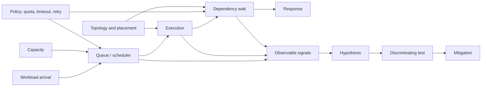
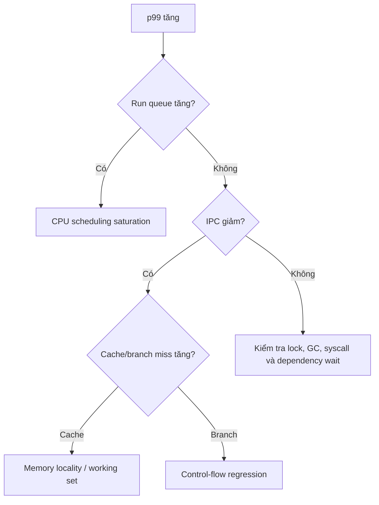
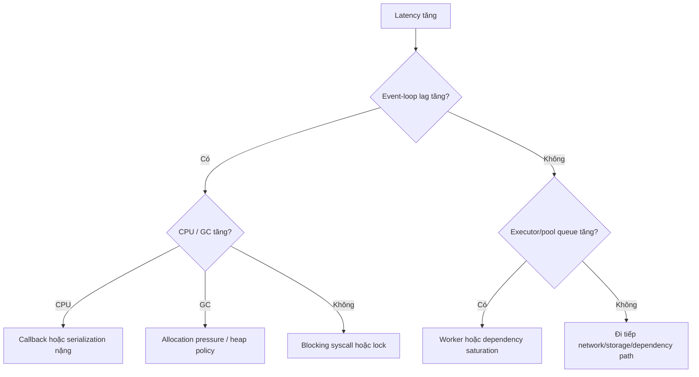
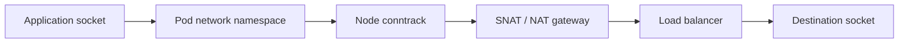

# Chapter S2 — System Fundamentals Next: từ kernel signal đến failure mechanics

> **Mục tiêu:** đi sâu hơn Chapter S, nối hành vi của CPU, memory, network, storage, distributed system, Kubernetes và AI infrastructure thành một mô hình điều tra thống nhất. Chương này không dạy thuộc lòng metric; nó dạy cách suy luận từ **cơ chế → dấu hiệu → giả thuyết → phép kiểm chứng → hành động an toàn**.

## Prerequisites

- Đã đọc [Chapter S — Nền tảng hệ thống](../system-fundamentals/README.vi.md).
- Hiểu process, container, Kubernetes Pod, TCP, database và ba loại telemetry cơ bản.
- Có thể đọc histogram, rate, counter, gauge và trace waterfall.

## Kết quả đầu ra

Sau chương này, bạn có thể:

1. giải thích tại sao utilization thấp vẫn có tail latency cao;
2. phân biệt CPU-bound, memory-bound, lock-bound, network-bound và storage-bound;
3. lần theo một request qua conntrack, NAT, TLS, load balancer, queue và database;
4. nhận ra failure do durability, consistency, fencing hoặc retry thay vì chỉ nhìn error rate;
5. xây evidence pack đủ mạnh để AIOps không kết luận từ một metric đơn lẻ;
6. chọn mitigation làm giảm tải mà không mở rộng blast radius.

> [!IMPORTANT]
> Các ngưỡng trong chương chỉ là điểm bắt đầu điều tra. Production alert phải dựa trên baseline theo workload, hardware, SLO và traffic shape; không copy một con số cố định cho mọi hệ thống.

## Mental model xuyên suốt



Mọi sự cố hiệu năng đều có thể bắt đầu bằng năm câu hỏi:

| Câu hỏi | Evidence ưu tiên |
|---|---|
| Work đến nhanh cỡ nào? | arrival rate, concurrency, burst size, fan-out |
| Work đang chờ ở đâu? | run queue, lock wait, socket queue, pool wait, device queue |
| Capacity thực dụng là bao nhiêu? | quota, throttling, memory bandwidth, IOPS, connection limit |
| Policy có khuếch đại tải không? | retry, timeout, autoscaling, health check, eviction |
| Failure có cùng phạm vi không? | node, zone, tenant, version, route, shard, dependency |

## Mục lục

1. CPU pipeline, cache và branch behavior
2. NUMA, memory locality và bandwidth
3. Lock contention, futex và scheduler interaction
4. Event loop, async runtime và coordinated omission
5. Conntrack, NAT và ephemeral port exhaustion
6. MTU, fragmentation và packet path
7. TLS, HTTP/2, HTTP/3 và head-of-line blocking
8. Load balancing, locality và connection reuse
9. Page cache, writeback và `fsync`
10. Filesystem, inode và copy-on-write amplification
11. WAL, checkpoint và database durability
12. LSM tree, B-tree, compaction và storage amplification
13. Quorum, consensus, lease và fencing
14. Idempotency, deduplication và transactional outbox
15. Tail latency, fan-out và hedged requests
16. Admission control, load shedding và retry budget
17. Kubernetes control-plane failure mechanics
18. Scheduling, placement, disruption và rollout safety
19. Identity, certificate và secret delivery path
20. GPU memory hierarchy và interconnect
21. LLM serving: batching, KV cache và queue policy
22. Cross-layer evidence graph
23. Incident playbooks
24. Production readiness checklist

---

# SECTION 1 — COMPUTE, MEMORY VÀ RUNTIME

## 1. CPU pipeline, cache và branch behavior

### 1.1 CPU utilization không phải throughput

CPU hiện đại thực thi nhiều instruction song song, dự đoán nhánh và nạp dữ liệu qua nhiều tầng cache. Hai process cùng dùng `60% CPU` có thể cho throughput rất khác:

- workload A có working set nằm trong L1/L2 cache;
- workload B liên tục miss LLC và chờ DRAM;
- workload C bị branch misprediction làm pipeline flush;
- workload D chạy vectorized instruction và hoàn thành nhiều work hơn mỗi cycle.

Vì vậy, `CPU%` chỉ trả lời CPU có bận hay không; nó không trả lời CPU có **tiến triển hữu ích** hay không.

### 1.2 Bộ evidence tối thiểu

| Signal | Câu hỏi nó trả lời | Diễn giải thận trọng |
|---|---|---|
| instructions / cycle | mỗi cycle hoàn thành bao nhiêu work | IPC giảm có thể do cache miss, branch miss hoặc dependency chain |
| cycles | CPU đã tiêu bao nhiêu cycle | cần chuẩn hóa theo request hoặc unit of work |
| cache misses | dữ liệu có gần compute không | miss rate tăng sau deploy thường gợi ý working-set/layout đổi |
| branch misses | control flow có khó dự đoán không | hay gặp ở parser, interpreter, polymorphic dispatch |
| run queue | thread runnable có phải chờ CPU không | queue cao kéo dài mới là saturation evidence mạnh |
| throttled time | quota có chặn execution không | utilization trung bình thấp vẫn có thể throttle theo từng period |

Ví dụ quan sát trên Linux:

```bash
perf stat -e cycles,instructions,cache-references,cache-misses,branches,branch-misses -p <pid>
pidstat -u -w -p <pid> 1
cat /proc/pressure/cpu
```

Không chạy profiling tần suất cao trên toàn fleet. Bắt đầu bằng counter rẻ, sau đó profile có mục tiêu trên canary hoặc trong cửa sổ ngắn.

### 1.3 Failure pattern: CPU bận nhưng request không tiến triển



Mitigation an toàn thường là giảm concurrency, rollback code path gây regression, tách noisy neighbor hoặc tăng capacity đúng loại. Tăng CPU limit không chữa được cache locality kém hay global lock.

## 2. NUMA, memory locality và bandwidth

### 2.1 Tại sao NUMA xuất hiện như một gray failure

Trên máy nhiều socket, mỗi CPU truy cập local memory nhanh hơn remote memory. Container có thể được schedule CPU ở NUMA node 0 nhưng phần lớn page lại nằm ở node 1. Không có crash; chỉ có latency tăng, throughput giảm và symptom thay đổi theo placement.

Các nguồn gây lệch locality:

- process khởi tạo memory trước khi worker thread được pin;
- Pod đổi CPU set nhưng page không migrate tương ứng;
- memory reclaim làm page placement thay đổi;
- device/GPU/PCIe nằm gần một NUMA node khác;
- huge page bị phân mảnh hoặc cấp phát từ node xa.

### 2.2 Phân biệt capacity và bandwidth

Memory còn trống không có nghĩa memory subsystem còn khả năng phục vụ. Workload analytics, compression, model inference và packet processing có thể chạm trần memory bandwidth trước khi CPU đạt 100%.

```bash
numactl --hardware
numastat -p <pid>
cat /proc/<pid>/numa_maps
```

Evidence pack nên có:

- CPU set và memory set của cgroup;
- local/remote page ratio;
- memory bandwidth theo socket nếu hardware counter hỗ trợ;
- latency theo node placement;
- version, instance type và topology của device.

> [!TIP]
> Nếu cùng image, cùng traffic nhưng chỉ một nhóm node chậm, hãy group theo NUMA topology, CPU model, kernel và device placement trước khi kết luận application regression.

## 3. Lock contention, futex và scheduler interaction

### 3.1 Utilization thấp vẫn có thể lock-bound

Thread chờ mutex thường ngủ qua `futex`; CPU utilization giảm trong khi latency tăng. Nếu lock holder bị deschedule, mọi waiter bị kéo dài dù machine còn CPU idle. Đây là **lock convoy**.

Các pattern phổ biến:

| Pattern | Dấu hiệu | Ví dụ |
|---|---|---|
| global mutex | throughput không scale theo core | cache map hoặc allocator dùng lock chung |
| lock convoy | nhiều thread wake/sleep quanh một lock | critical section có I/O hoặc page fault |
| priority inversion | work quan trọng chờ thread ưu tiên thấp | lock holder bị CPU pressure |
| false sharing | CPU cao, cache coherence traffic cao | counter của nhiều thread chung một cache line |
| deadlock | progress dừng, waiter ổn định | lock ordering không nhất quán |

### 3.2 Evidence và phép kiểm chứng

```bash
perf lock record -p <pid> -- sleep 10
perf lock report
perf sched record -p <pid> -- sleep 10
perf sched timehist
```

Trong runtime có managed thread, kết hợp native evidence với thread dump, blocked-time histogram và span quanh critical section. Một thread dump đơn lẻ là snapshot; lấy vài snapshot cách nhau mới phân biệt waiter thoáng qua với contention kéo dài.

Mitigation ưu tiên:

1. loại I/O và blocking call khỏi critical section;
2. shard lock theo key hoặc tenant;
3. giảm concurrency trước khi tăng replica nếu dependency chung đang bão hòa;
4. rollback thay đổi data structure/allocator;
5. chỉ thay lock-free algorithm khi đã chứng minh contention, vì correctness cost rất cao.

## 4. Event loop, async runtime và coordinated omission

### 4.1 Event loop lag là một queue

Async runtime không loại bỏ waiting; nó gom waiting vào event loop, executor, callback queue và connection pool. Một callback CPU-heavy hoặc synchronous syscall có thể chặn mọi request dùng chung loop.

Các signal cần tách:

- event-loop lag;
- runnable task count;
- executor queue depth;
- active và pending connection;
- GC pause;
- request concurrency và service time;
- time spent trước khi handler bắt đầu chạy.

### 4.2 Coordinated omission làm histogram “đẹp giả”

Nếu load generator chỉ gửi request mới sau khi request trước hoàn thành, lúc server đứng 5 giây nó cũng ngừng gửi. Histogram bỏ sót chính khoảng thời gian tệ nhất. Production traffic theo open-loop arrival thường không lịch sự như vậy.

Để benchmark đáng tin:

- mô hình arrival độc lập với completion;
- ghi cả queue delay và service time;
- giữ intended send time để hiệu chỉnh coordinated omission;
- kiểm tra histogram theo route, tenant và payload size;
- báo cả throughput bị từ chối, không chỉ latency request thành công.

### 4.3 Cây quyết định runtime



---

**Checkpoint Section 1:** trước khi gọi một workload là “CPU issue”, phải trả lời được nó đang chờ scheduler, memory, lock, runtime queue hay thực sự tiêu instruction hữu ích.

---

# SECTION 2 — NETWORK PATH VÀ TRAFFIC MECHANICS

## 5. Conntrack, NAT và ephemeral port exhaustion

### 5.1 Một connection tạo state ở nhiều nơi

Trong Kubernetes/cloud, một TCP connection có thể đi qua application socket, sidecar, node conntrack, SNAT, load balancer và firewall. Mỗi lớp có bảng state, timeout và capacity riêng. `connect timeout` không tự động có nghĩa network packet loss.



Failure thường gặp:

- conntrack table đầy làm connection mới bị drop;
- source IP/port tuple cạn do quá nhiều outbound connection;
- NAT gateway đạt giới hạn connection theo destination;
- TIME_WAIT tích tụ vì không reuse connection;
- state timeout giữa firewall và application không đồng nhất;
- load balancer giữ connection tới backend đã draining.

### 5.2 Evidence pack

```bash
conntrack -S
sysctl net.netfilter.nf_conntrack_count
sysctl net.netfilter.nf_conntrack_max
ss -s
ss -tan state time-wait
cat /proc/sys/net/ipv4/ip_local_port_range
```

Không chỉ alert theo `count/max`. Cần correlation với:

- new connections/second và connection reuse ratio;
- SYN retransmit, reset và connect latency;
- source node, destination và route;
- NAT/LB flow logs;
- deploy tạo thay đổi keep-alive hoặc pool policy.

### 5.3 Mitigation và trade-off

| Hành động | Khi hữu ích | Rủi ro |
|---|---|---|
| reuse/keep-alive connection | churn cao, request nhỏ | connection stale, load imbalance lâu hơn |
| tăng conntrack capacity | memory còn đủ và state hợp lệ | che leak; tăng memory kernel |
| thêm source IP/NAT capacity | cạn tuple thật | tăng cost và operational surface |
| giảm idle timeout | nhiều state chết | cắt connection hợp lệ |
| giới hạn outbound concurrency | dependency bị flood | tăng queue/rejection ở caller |

Không bật `tcp_tw_reuse` hoặc chỉnh timeout toàn fleet chỉ từ một dashboard. Trước hết xác định connection ownership và lớp state thực sự cạn.

## 6. MTU, fragmentation và packet path

### 6.1 Vì sao MTU mismatch tạo partial outage

Header của overlay, VPN, IPsec hoặc service mesh làm MTU hữu dụng nhỏ hơn interface vật lý. Packet nhỏ vẫn đi được, health check vẫn xanh, nhưng response lớn hoặc TLS record nhất định bị drop. Đây là gray failure điển hình.

Path MTU Discovery dựa vào ICMP để báo packet quá lớn. Nếu firewall chặn ICMP cần thiết, sender không giảm kích thước và connection có thể “treo” ở payload lớn.

### 6.2 Cách phân biệt

```bash
ip link show
tracepath <destination>
ping -M do -s 1400 <destination>
tcpdump -ni any 'icmp or icmp6 or tcp'
```

Hỏi bốn câu:

1. failure có phụ thuộc payload size không?
2. chỉ một node pool, tunnel hoặc zone bị ảnh hưởng không?
3. retransmit xảy ra sau handshake hay trước handshake?
4. capture ở hai đầu có thấy packet rời source nhưng không tới destination không?

> [!WARNING]
> Packet capture có thể chứa token, cookie, query hoặc dữ liệu khách hàng. Giới hạn interface, filter, thời lượng và quyền truy cập; ưu tiên header metadata khi đủ để kiểm chứng.

### 6.3 Packet path cost

Latency network không chỉ là wire time. Nó còn gồm:

- queue ở qdisc/NIC;
- softirq và CPU xử lý packet;
- veth/bridge/overlay encapsulation;
- policy engine và conntrack lookup;
- sidecar proxy;
- TLS encryption/decryption;
- receive queue và application scheduling.

Nếu packet rate tăng nhưng bandwidth không tăng nhiều, bottleneck có thể là packets-per-second hoặc per-packet CPU cost. Group evidence theo packet size giúp phân biệt.

## 7. TLS, HTTP/2, HTTP/3 và head-of-line blocking

### 7.1 Tách connect path thành phase

Một metric “connect latency” chung làm mất causal information. Ít nhất nên tách:

| Phase | Failure gợi ý |
|---|---|
| DNS lookup | resolver overload, cache miss, delegation/network |
| TCP handshake | packet loss, backlog, firewall, route |
| TLS handshake | CPU, certificate chain, OCSP, key service |
| protocol negotiation | ALPN/config mismatch |
| request queue | connection/stream limit, application admission |
| response transfer | congestion, flow control, backend service time |

### 7.2 TLS failure không chỉ là certificate hết hạn

Các cơ chế cần quan sát:

- certificate chưa hợp lệ hoặc hết hạn;
- SNI không khớp route;
- trust bundle rollout không đồng bộ;
- clock skew làm validation sai;
- handshake CPU tăng do mất session resumption;
- key/signing service chậm;
- mTLS identity chưa được cấp hoặc rotate lỗi;
- client/server không còn cipher/protocol chung.

Metric nên có handshake rate, failure theo reason, full/resumed handshake ratio, certificate expiry horizon và latency theo issuer/route.

### 7.3 Multiplexing và head-of-line

HTTP/2 multiplex nhiều stream trên một TCP connection. Nó giảm connection churn nhưng packet loss ở TCP có thể chặn delivery của nhiều stream cùng connection. HTTP/3 chuyển multiplexing lên QUIC để stream độc lập hơn, nhưng thêm UDP path, QUIC state và observability mới.

Đừng kết luận “HTTP/3 luôn nhanh hơn”. Hãy so:

- handshake/resumption theo network type;
- loss và RTT;
- stream concurrency;
- CPU per request;
- fallback rate từ QUIC;
- middlebox/UDP reachability;
- tail latency, không chỉ median.

## 8. Load balancing, locality và connection reuse

### 8.1 Request balance khác connection balance

Nếu client giữ connection lâu, load balancer chỉ cân bằng lúc mở connection có thể tạo phân phối request lệch. Một backend mới scale-out không nhận traffic ngay; backend cũ tiếp tục nóng dù replica count đã tăng.

Ba distribution cần đo riêng:

1. connection active theo backend;
2. request rate theo backend;
3. cost per request theo backend/tenant/payload.

Replica nhận cùng số request vẫn có thể không nhận cùng lượng work.

### 8.2 Locality là trade-off, không phải chân lý

Ưu tiên same-zone giảm latency và cross-zone cost, nhưng có thể overload zone cục bộ trong khi zone khác còn capacity. Spillover quá sớm lại tăng network cost và mở rộng failure domain.

Policy tốt cần:

- local capacity signal đáng tin;
- ngưỡng spillover có hysteresis;
- giới hạn cross-zone để giữ blast radius;
- fail-open/fail-closed rõ ràng;
- metric về locality hit, spillover và zone saturation.

### 8.3 Health check gap

Backend có thể trả health check `200` nhưng không phục vụ traffic thật vì:

- health endpoint không chạm dependency quan trọng;
- request thật cần connection pool đã cạn;
- health check payload nhỏ hơn payload thật;
- route/version cụ thể lỗi;
- event loop vẫn trả endpoint ưu tiên nhưng business queue đứng;
- backend đang draining nhưng connection cũ còn tới.

Health check nên phản ánh khả năng **nhận work mới**, không biến thành deep dependency check gây cascade. Readiness, liveness và external synthetic probe phục vụ ba mục đích khác nhau.

### 8.4 Network investigation matrix

| Symptom | Evidence phân biệt đầu tiên | Không nên làm ngay |
|---|---|---|
| connect timeout | SYN/SYN-ACK, backlog, conntrack, NAT state | tăng mọi timeout |
| TLS error burst | reason, SNI, issuer, clock, deploy | tắt verification |
| chỉ payload lớn lỗi | MTU, retransmit, capture hai đầu | restart ngẫu nhiên |
| backend load lệch | connection và request distribution | scale vô hạn |
| cross-zone latency | locality/spillover và zone health | khóa cứng traffic vào zone lỗi |

---

**Checkpoint Section 2:** trước khi gọi một failure là “network chập chờn”, phải định vị phase, state table, direction, route, payload class và failure domain.
