# Chapter S2 — System Fundamentals Next: từ kernel signal đến failure mechanics

> **Mục tiêu:** đi sâu hơn Chapter S, nối hành vi của CPU, memory, network, storage, distributed system, Kubernetes và AI infrastructure thành một mô hình điều tra thống nhất. Chương này không dạy thuộc lòng metric; nó dạy cách suy luận từ **cơ chế → dấu hiệu → giả thuyết → phép kiểm chứng → hành động an toàn**.

## Prerequisites

- Đã đọc [Chapter S — Nền tảng hệ thống](../system-fundamentals/README.vi.md).
- Hiểu process, container, Kubernetes Pod, TCP, database và ba loại telemetry cơ bản.
- Có thể đọc histogram, rate, counter, gauge và trace waterfall.

## Kết quả đầu ra

Sau chương này, bạn có thể:

1. giải thích tại sao utilization thấp vẫn có tail latency cao;
2. phân biệt CPU-bound, memory-bound, lock-bound, network-bound và storage-bound;
3. lần theo một request qua conntrack, NAT, TLS, load balancer, queue và database;
4. nhận ra failure do durability, consistency, fencing hoặc retry thay vì chỉ nhìn error rate;
5. xây evidence pack đủ mạnh để AIOps không kết luận từ một metric đơn lẻ;
6. chọn mitigation làm giảm tải mà không mở rộng blast radius.

> [!IMPORTANT]
> Các ngưỡng trong chương chỉ là điểm bắt đầu điều tra. Production alert phải dựa trên baseline theo workload, hardware, SLO và traffic shape; không copy một con số cố định cho mọi hệ thống.

## Mental model xuyên suốt

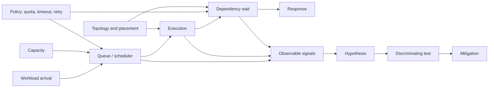

Mọi sự cố hiệu năng đều có thể bắt đầu bằng năm câu hỏi:

| Câu hỏi | Evidence ưu tiên |
|---|---|
| Work đến nhanh cỡ nào? | arrival rate, concurrency, burst size, fan-out |
| Work đang chờ ở đâu? | run queue, lock wait, socket queue, pool wait, device queue |
| Capacity thực dụng là bao nhiêu? | quota, throttling, memory bandwidth, IOPS, connection limit |
| Policy có khuếch đại tải không? | retry, timeout, autoscaling, health check, eviction |
| Failure có cùng phạm vi không? | node, zone, tenant, version, route, shard, dependency |

## Mục lục

1. CPU pipeline, cache và branch behavior
2. NUMA, memory locality và bandwidth
3. Lock contention, futex và scheduler interaction
4. Event loop, async runtime và coordinated omission
5. Conntrack, NAT và ephemeral port exhaustion
6. MTU, fragmentation và packet path
7. TLS, HTTP/2, HTTP/3 và head-of-line blocking
8. Load balancing, locality và connection reuse
9. Page cache, writeback và `fsync`
10. Filesystem, inode và copy-on-write amplification
11. WAL, checkpoint và database durability
12. LSM tree, B-tree, compaction và storage amplification
13. Quorum, consensus, lease và fencing
14. Idempotency, deduplication và transactional outbox
15. Tail latency, fan-out và hedged requests
16. Admission control, load shedding và retry budget
17. Kubernetes control-plane failure mechanics
18. Scheduling, placement, disruption và rollout safety
19. Identity, certificate và secret delivery path
20. GPU memory hierarchy và interconnect
21. LLM serving: batching, KV cache và queue policy
22. Cross-layer evidence graph
23. Incident playbooks
24. Production readiness checklist

---

# SECTION 1 — COMPUTE, MEMORY VÀ RUNTIME

## 1. CPU pipeline, cache và branch behavior

### 1.1 CPU utilization không phải throughput

CPU hiện đại thực thi nhiều instruction song song, dự đoán nhánh và nạp dữ liệu qua nhiều tầng cache. Hai process cùng dùng `60% CPU` có thể cho throughput rất khác:

- workload A có working set nằm trong L1/L2 cache;
- workload B liên tục miss LLC và chờ DRAM;
- workload C bị branch misprediction làm pipeline flush;
- workload D chạy vectorized instruction và hoàn thành nhiều work hơn mỗi cycle.

Vì vậy, `CPU%` chỉ trả lời CPU có bận hay không; nó không trả lời CPU có **tiến triển hữu ích** hay không.

### 1.2 Bộ evidence tối thiểu

| Signal | Câu hỏi nó trả lời | Diễn giải thận trọng |
|---|---|---|
| instructions / cycle | mỗi cycle hoàn thành bao nhiêu work | IPC giảm có thể do cache miss, branch miss hoặc dependency chain |
| cycles | CPU đã tiêu bao nhiêu cycle | cần chuẩn hóa theo request hoặc unit of work |
| cache misses | dữ liệu có gần compute không | miss rate tăng sau deploy thường gợi ý working-set/layout đổi |
| branch misses | control flow có khó dự đoán không | hay gặp ở parser, interpreter, polymorphic dispatch |
| run queue | thread runnable có phải chờ CPU không | queue cao kéo dài mới là saturation evidence mạnh |
| throttled time | quota có chặn execution không | utilization trung bình thấp vẫn có thể throttle theo từng period |

Ví dụ quan sát trên Linux:

```bash
perf stat -e cycles,instructions,cache-references,cache-misses,branches,branch-misses -p <pid>
pidstat -u -w -p <pid> 1
cat /proc/pressure/cpu
```

Không chạy profiling tần suất cao trên toàn fleet. Bắt đầu bằng counter rẻ, sau đó profile có mục tiêu trên canary hoặc trong cửa sổ ngắn.

### 1.3 Failure pattern: CPU bận nhưng request không tiến triển

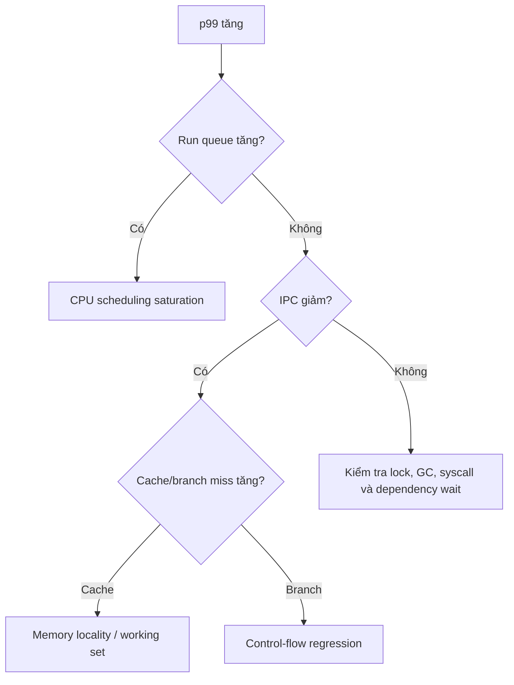

Mitigation an toàn thường là giảm concurrency, rollback code path gây regression, tách noisy neighbor hoặc tăng capacity đúng loại. Tăng CPU limit không chữa được cache locality kém hay global lock.

## 2. NUMA, memory locality và bandwidth

### 2.1 Tại sao NUMA xuất hiện như một gray failure

Trên máy nhiều socket, mỗi CPU truy cập local memory nhanh hơn remote memory. Container có thể được schedule CPU ở NUMA node 0 nhưng phần lớn page lại nằm ở node 1. Không có crash; chỉ có latency tăng, throughput giảm và symptom thay đổi theo placement.

Các nguồn gây lệch locality:

- process khởi tạo memory trước khi worker thread được pin;
- Pod đổi CPU set nhưng page không migrate tương ứng;
- memory reclaim làm page placement thay đổi;
- device/GPU/PCIe nằm gần một NUMA node khác;
- huge page bị phân mảnh hoặc cấp phát từ node xa.

### 2.2 Phân biệt capacity và bandwidth

Memory còn trống không có nghĩa memory subsystem còn khả năng phục vụ. Workload analytics, compression, model inference và packet processing có thể chạm trần memory bandwidth trước khi CPU đạt 100%.

```bash
numactl --hardware
numastat -p <pid>
cat /proc/<pid>/numa_maps
```

Evidence pack nên có:

- CPU set và memory set của cgroup;
- local/remote page ratio;
- memory bandwidth theo socket nếu hardware counter hỗ trợ;
- latency theo node placement;
- version, instance type và topology của device.

> [!TIP]
> Nếu cùng image, cùng traffic nhưng chỉ một nhóm node chậm, hãy group theo NUMA topology, CPU model, kernel và device placement trước khi kết luận application regression.

## 3. Lock contention, futex và scheduler interaction

### 3.1 Utilization thấp vẫn có thể lock-bound

Thread chờ mutex thường ngủ qua `futex`; CPU utilization giảm trong khi latency tăng. Nếu lock holder bị deschedule, mọi waiter bị kéo dài dù machine còn CPU idle. Đây là **lock convoy**.

Các pattern phổ biến:

| Pattern | Dấu hiệu | Ví dụ |
|---|---|---|
| global mutex | throughput không scale theo core | cache map hoặc allocator dùng lock chung |
| lock convoy | nhiều thread wake/sleep quanh một lock | critical section có I/O hoặc page fault |
| priority inversion | work quan trọng chờ thread ưu tiên thấp | lock holder bị CPU pressure |
| false sharing | CPU cao, cache coherence traffic cao | counter của nhiều thread chung một cache line |
| deadlock | progress dừng, waiter ổn định | lock ordering không nhất quán |

### 3.2 Evidence và phép kiểm chứng

```bash
perf lock record -p <pid> -- sleep 10
perf lock report
perf sched record -p <pid> -- sleep 10
perf sched timehist
```

Trong runtime có managed thread, kết hợp native evidence với thread dump, blocked-time histogram và span quanh critical section. Một thread dump đơn lẻ là snapshot; lấy vài snapshot cách nhau mới phân biệt waiter thoáng qua với contention kéo dài.

Mitigation ưu tiên:

1. loại I/O và blocking call khỏi critical section;
2. shard lock theo key hoặc tenant;
3. giảm concurrency trước khi tăng replica nếu dependency chung đang bão hòa;
4. rollback thay đổi data structure/allocator;
5. chỉ thay lock-free algorithm khi đã chứng minh contention, vì correctness cost rất cao.

## 4. Event loop, async runtime và coordinated omission

### 4.1 Event loop lag là một queue

Async runtime không loại bỏ waiting; nó gom waiting vào event loop, executor, callback queue và connection pool. Một callback CPU-heavy hoặc synchronous syscall có thể chặn mọi request dùng chung loop.

Các signal cần tách:

- event-loop lag;
- runnable task count;
- executor queue depth;
- active và pending connection;
- GC pause;
- request concurrency và service time;
- time spent trước khi handler bắt đầu chạy.

### 4.2 Coordinated omission làm histogram “đẹp giả”

Nếu load generator chỉ gửi request mới sau khi request trước hoàn thành, lúc server đứng 5 giây nó cũng ngừng gửi. Histogram bỏ sót chính khoảng thời gian tệ nhất. Production traffic theo open-loop arrival thường không lịch sự như vậy.

Để benchmark đáng tin:

- mô hình arrival độc lập với completion;
- ghi cả queue delay và service time;
- giữ intended send time để hiệu chỉnh coordinated omission;
- kiểm tra histogram theo route, tenant và payload size;
- báo cả throughput bị từ chối, không chỉ latency request thành công.

### 4.3 Cây quyết định runtime

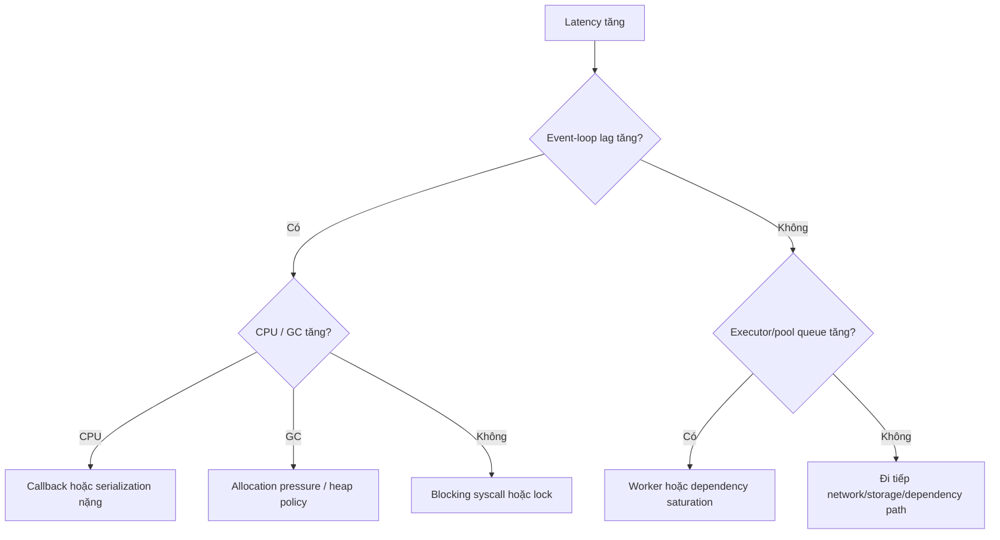

---

**Checkpoint Section 1:** trước khi gọi một workload là “CPU issue”, phải trả lời được nó đang chờ scheduler, memory, lock, runtime queue hay thực sự tiêu instruction hữu ích.

---

# SECTION 2 — NETWORK PATH VÀ TRAFFIC MECHANICS

## 5. Conntrack, NAT và ephemeral port exhaustion

### 5.1 Một connection tạo state ở nhiều nơi

Trong Kubernetes/cloud, một TCP connection có thể đi qua application socket, sidecar, node conntrack, SNAT, load balancer và firewall. Mỗi lớp có bảng state, timeout và capacity riêng. `connect timeout` không tự động có nghĩa network packet loss.

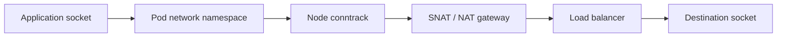

Failure thường gặp:

- conntrack table đầy làm connection mới bị drop;
- source IP/port tuple cạn do quá nhiều outbound connection;
- NAT gateway đạt giới hạn connection theo destination;
- TIME_WAIT tích tụ vì không reuse connection;
- state timeout giữa firewall và application không đồng nhất;
- load balancer giữ connection tới backend đã draining.

### 5.2 Evidence pack

```bash
conntrack -S
sysctl net.netfilter.nf_conntrack_count
sysctl net.netfilter.nf_conntrack_max
ss -s
ss -tan state time-wait
cat /proc/sys/net/ipv4/ip_local_port_range
```

Không chỉ alert theo `count/max`. Cần correlation với:

- new connections/second và connection reuse ratio;
- SYN retransmit, reset và connect latency;
- source node, destination và route;
- NAT/LB flow logs;
- deploy tạo thay đổi keep-alive hoặc pool policy.

### 5.3 Mitigation và trade-off

| Hành động | Khi hữu ích | Rủi ro |
|---|---|---|
| reuse/keep-alive connection | churn cao, request nhỏ | connection stale, load imbalance lâu hơn |
| tăng conntrack capacity | memory còn đủ và state hợp lệ | che leak; tăng memory kernel |
| thêm source IP/NAT capacity | cạn tuple thật | tăng cost và operational surface |
| giảm idle timeout | nhiều state chết | cắt connection hợp lệ |
| giới hạn outbound concurrency | dependency bị flood | tăng queue/rejection ở caller |

Không bật `tcp_tw_reuse` hoặc chỉnh timeout toàn fleet chỉ từ một dashboard. Trước hết xác định connection ownership và lớp state thực sự cạn.

## 6. MTU, fragmentation và packet path

### 6.1 Vì sao MTU mismatch tạo partial outage

Header của overlay, VPN, IPsec hoặc service mesh làm MTU hữu dụng nhỏ hơn interface vật lý. Packet nhỏ vẫn đi được, health check vẫn xanh, nhưng response lớn hoặc TLS record nhất định bị drop. Đây là gray failure điển hình.

Path MTU Discovery dựa vào ICMP để báo packet quá lớn. Nếu firewall chặn ICMP cần thiết, sender không giảm kích thước và connection có thể “treo” ở payload lớn.

### 6.2 Cách phân biệt

```bash
ip link show
tracepath <destination>
ping -M do -s 1400 <destination>
tcpdump -ni any 'icmp or icmp6 or tcp'
```

Hỏi bốn câu:

1. failure có phụ thuộc payload size không?
2. chỉ một node pool, tunnel hoặc zone bị ảnh hưởng không?
3. retransmit xảy ra sau handshake hay trước handshake?
4. capture ở hai đầu có thấy packet rời source nhưng không tới destination không?

> [!WARNING]
> Packet capture có thể chứa token, cookie, query hoặc dữ liệu khách hàng. Giới hạn interface, filter, thời lượng và quyền truy cập; ưu tiên header metadata khi đủ để kiểm chứng.

### 6.3 Packet path cost

Latency network không chỉ là wire time. Nó còn gồm:

- queue ở qdisc/NIC;
- softirq và CPU xử lý packet;
- veth/bridge/overlay encapsulation;
- policy engine và conntrack lookup;
- sidecar proxy;
- TLS encryption/decryption;
- receive queue và application scheduling.

Nếu packet rate tăng nhưng bandwidth không tăng nhiều, bottleneck có thể là packets-per-second hoặc per-packet CPU cost. Group evidence theo packet size giúp phân biệt.

## 7. TLS, HTTP/2, HTTP/3 và head-of-line blocking

### 7.1 Tách connect path thành phase

Một metric “connect latency” chung làm mất causal information. Ít nhất nên tách:

| Phase | Failure gợi ý |
|---|---|
| DNS lookup | resolver overload, cache miss, delegation/network |
| TCP handshake | packet loss, backlog, firewall, route |
| TLS handshake | CPU, certificate chain, OCSP, key service |
| protocol negotiation | ALPN/config mismatch |
| request queue | connection/stream limit, application admission |
| response transfer | congestion, flow control, backend service time |

### 7.2 TLS failure không chỉ là certificate hết hạn

Các cơ chế cần quan sát:

- certificate chưa hợp lệ hoặc hết hạn;
- SNI không khớp route;
- trust bundle rollout không đồng bộ;
- clock skew làm validation sai;
- handshake CPU tăng do mất session resumption;
- key/signing service chậm;
- mTLS identity chưa được cấp hoặc rotate lỗi;
- client/server không còn cipher/protocol chung.

Metric nên có handshake rate, failure theo reason, full/resumed handshake ratio, certificate expiry horizon và latency theo issuer/route.

### 7.3 Multiplexing và head-of-line

HTTP/2 multiplex nhiều stream trên một TCP connection. Nó giảm connection churn nhưng packet loss ở TCP có thể chặn delivery của nhiều stream cùng connection. HTTP/3 chuyển multiplexing lên QUIC để stream độc lập hơn, nhưng thêm UDP path, QUIC state và observability mới.

Đừng kết luận “HTTP/3 luôn nhanh hơn”. Hãy so:

- handshake/resumption theo network type;
- loss và RTT;
- stream concurrency;
- CPU per request;
- fallback rate từ QUIC;
- middlebox/UDP reachability;
- tail latency, không chỉ median.

## 8. Load balancing, locality và connection reuse

### 8.1 Request balance khác connection balance

Nếu client giữ connection lâu, load balancer chỉ cân bằng lúc mở connection có thể tạo phân phối request lệch. Một backend mới scale-out không nhận traffic ngay; backend cũ tiếp tục nóng dù replica count đã tăng.

Ba distribution cần đo riêng:

1. connection active theo backend;
2. request rate theo backend;
3. cost per request theo backend/tenant/payload.

Replica nhận cùng số request vẫn có thể không nhận cùng lượng work.

### 8.2 Locality là trade-off, không phải chân lý

Ưu tiên same-zone giảm latency và cross-zone cost, nhưng có thể overload zone cục bộ trong khi zone khác còn capacity. Spillover quá sớm lại tăng network cost và mở rộng failure domain.

Policy tốt cần:

- local capacity signal đáng tin;
- ngưỡng spillover có hysteresis;
- giới hạn cross-zone để giữ blast radius;
- fail-open/fail-closed rõ ràng;
- metric về locality hit, spillover và zone saturation.

### 8.3 Health check gap

Backend có thể trả health check `200` nhưng không phục vụ traffic thật vì:

- health endpoint không chạm dependency quan trọng;
- request thật cần connection pool đã cạn;
- health check payload nhỏ hơn payload thật;
- route/version cụ thể lỗi;
- event loop vẫn trả endpoint ưu tiên nhưng business queue đứng;
- backend đang draining nhưng connection cũ còn tới.

Health check nên phản ánh khả năng **nhận work mới**, không biến thành deep dependency check gây cascade. Readiness, liveness và external synthetic probe phục vụ ba mục đích khác nhau.

### 8.4 Network investigation matrix

| Symptom | Evidence phân biệt đầu tiên | Không nên làm ngay |
|---|---|---|
| connect timeout | SYN/SYN-ACK, backlog, conntrack, NAT state | tăng mọi timeout |
| TLS error burst | reason, SNI, issuer, clock, deploy | tắt verification |
| chỉ payload lớn lỗi | MTU, retransmit, capture hai đầu | restart ngẫu nhiên |
| backend load lệch | connection và request distribution | scale vô hạn |
| cross-zone latency | locality/spillover và zone health | khóa cứng traffic vào zone lỗi |

---

**Checkpoint Section 2:** trước khi gọi một failure là “network chập chờn”, phải định vị phase, state table, direction, route, payload class và failure domain.

---

# SECTION 3 — STORAGE, DATABASE VÀ DURABILITY

## 9. Page cache, writeback và `fsync`

### 9.1 `write()` thành công chưa chắc dữ liệu đã durable

Application ghi file thường chỉ copy dữ liệu vào page cache và đánh dấu page là dirty. Kernel flush sau; storage controller và device cũng có cache riêng. Nếu durability contract yêu cầu dữ liệu sống qua power loss, application/database phải dùng cơ chế flush phù hợp như `fsync`, `fdatasync` hoặc direct I/O theo thiết kế.

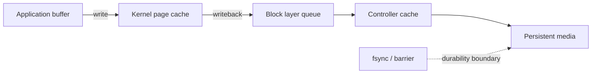

Điều cần phân biệt:

- **accepted:** syscall nhận dữ liệu;
- **visible:** process khác có thể đọc thấy;
- **replicated:** bản sao khác đã nhận;
- **durable:** dữ liệu tồn tại sau failure theo contract;
- **committed:** state machine/database cho phép client dựa vào kết quả.

Năm từ này không đồng nghĩa.

### 9.2 Dirty page và writeback burst

Kernel có thể gom nhiều dirty page rồi flush thành burst. Application latency ổn trong một thời gian, sau đó stall khi dirty limit bị chạm hoặc device queue bão hòa. Symptom thường có dạng răng cưa.

```bash
grep -E 'Dirty|Writeback|Cached' /proc/meminfo
cat /proc/pressure/io
iostat -x 1
```

Evidence nên gồm:

- dirty/writeback bytes;
- writeback rate và stall time;
- device await, queue depth, utilization;
- `fsync` latency histogram;
- cgroup I/O throttling;
- checkpoint/compaction/snapshot timeline;
- noisy neighbor cùng device hoặc volume.

### 9.3 Page cache tạo hai kiểu “memory issue”

1. **Cache hữu ích bị reclaim:** read latency và physical I/O tăng dù process RSS không đổi nhiều.
2. **Dirty cache gây pressure:** writeback không theo kịp, allocator/reclaim path chậm và process stall.

Không chữa bằng cách nhìn `free memory` rồi kết luận thiếu RAM. Hãy kiểm tra working set, refault, PSI và device service time.

## 10. Filesystem, inode và copy-on-write amplification

### 10.1 Hết dung lượng không chỉ là hết byte

Filesystem có thể từ chối ghi khi:

- hết block;
- hết inode vì quá nhiều file nhỏ;
- hết metadata space;
- quota user/project/container bị chạm;
- reserved block không dành cho workload;
- filesystem chuyển read-only sau I/O error;
- deleted file vẫn được process mở nên space chưa được giải phóng.

```bash
df -h
df -i
findmnt -o TARGET,SOURCE,FSTYPE,OPTIONS
lsof +L1
```

Metric filesystem phải mang identity của mount/device đúng. Gộp theo node mà không phân biệt mount có thể che volume nhỏ đang đầy.

### 10.2 Copy-on-write và container layer

Overlay filesystem giúp image layer dùng chung, nhưng write vào file từ lower layer có thể trigger copy-up. Workload ghi nhiều file lớn, unpack artifact hoặc database chạy trên writable container layer có thể chịu:

- extra read/write;
- metadata operation tăng;
- inode pressure;
- garbage collection image cạnh tranh I/O;
- disk pressure khiến kubelet eviction.

State lớn cần volume phù hợp; writable layer không phải persistent storage miễn phí.

### 10.3 Snapshot không phải backup mặc định

Snapshot storage thường là crash-consistent ở mức block. Nó có thể chứa WAL/data ở trạng thái mà database phải recovery, hoặc không nhất quán giữa nhiều volume. Một backup đáng tin cần:

1. consistency contract rõ ràng;
2. application/database coordination nếu cần;
3. retention và immutability;
4. restore test định kỳ;
5. đo RPO/RTO bằng bằng chứng restore, không bằng việc job backup trả `success`.

## 11. WAL, checkpoint và database durability

### 11.1 Tại sao có Write-Ahead Log

Database ghi thay đổi tuần tự vào WAL trước khi cập nhật data page ngẫu nhiên. WAL giúp recovery và group commit, nhưng đưa `fsync` latency vào commit path.

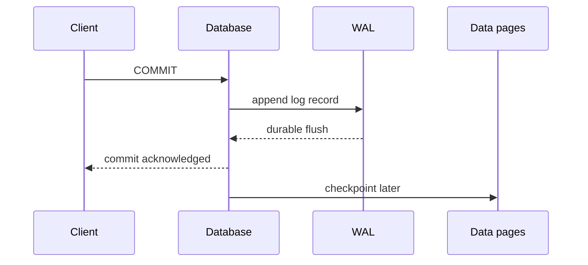

Nếu cấu hình acknowledgment trước durable flush để tăng throughput, contract mất dữ liệu khi crash phải được chấp nhận rõ ràng; không gọi đó là “tối ưu miễn phí”.

### 11.2 Group commit và latency shape

Nhiều transaction có thể dùng chung một flush. Khi load vừa đủ, batching tăng throughput; khi load thấp, từng transaction có thể chờ batch timer; khi load quá cao, WAL device bão hòa và commit queue tăng.

Do đó cần đo:

- commit latency histogram;
- WAL bytes/s và flushes/s;
- transactions per flush;
- WAL queue/wait time;
- device latency;
- replication acknowledgment latency nếu synchronous;
- transaction abort/retry rate.

### 11.3 Checkpoint storm

Checkpoint flush nhiều dirty data page để giới hạn recovery time/WAL growth. Nếu checkpoint quá gấp:

- write IOPS tăng mạnh;
- read query bị cạnh tranh queue;
- WAL recycle chậm;
- replica lag tăng;
- latency có chu kỳ trùng checkpoint.

Mitigation có thể là spread checkpoint, tăng interval/target có kiểm soát, cấp I/O riêng hoặc giảm ingest. Tăng interval làm recovery lâu hơn và WAL giữ nhiều hơn; đây là trade-off giữa steady-state cost và recovery cost.

### 11.4 Durability incident questions

Khi có nghi ngờ mất/duplicate dữ liệu, trước khi restart:

1. client đã nhận acknowledgment nào?
2. acknowledgment đại diện cho accepted, replicated hay durable?
3. leader term/epoch và replica position lúc đó là gì?
4. có failover hoặc clock anomaly không?
5. retry của client có idempotency key không?
6. backup/restore point gần nhất đã được kiểm chứng là gì?

Preserve WAL, audit log và topology timeline trước hành động làm mất evidence.

## 12. LSM tree, B-tree, compaction và storage amplification

### 12.1 Hai họ cấu trúc, hai kiểu cost

| Đặc tính | B-tree/B+tree | LSM tree |
|---|---|---|
| Write path | cập nhật page theo vị trí | append WAL + memtable, flush thành sorted files |
| Read path | tree traversal | kiểm tra memtable và nhiều level/file, thường có Bloom filter |
| Background work | page split, vacuum/checkpoint | compaction |
| Failure shape | random I/O, lock/latch, bloat | compaction debt, read/write amplification |

Không có lựa chọn luôn tốt hơn. Workload read/write ratio, key distribution, range scan, durability và storage medium quyết định.

### 12.2 Write amplification

Application ghi 1 GB nhưng device có thể ghi nhiều GB vì WAL, replication, compaction, snapshot copy-on-write và filesystem metadata. Tỷ lệ này thay đổi theo workload.

```text
write_amplification = physical_bytes_written / logical_bytes_ingested
```

Đo ở cùng cửa sổ đủ dài; background work có thể trễ hơn ingest. Với managed service, dùng proxy signal như compaction bytes, volume write bytes và ingest bytes.

### 12.3 Compaction debt là queue

Nếu flush tạo sorted files nhanh hơn compaction hợp nhất chúng:

- số file/level tăng;
- read amplification tăng;
- space amplification tăng;
- compaction tranh I/O với foreground;
- cuối cùng engine stall write để bảo vệ invariants.

Evidence pack:

- pending compaction bytes/tasks;
- flush rate và memtable count;
- level/file distribution;
- read/write amplification;
- Bloom filter hit/usefulness;
- foreground stall duration;
- disk bandwidth headroom.

### 12.4 Hot key và partition mechanics

Tổng cluster utilization có thể thấp trong khi một shard/partition bão hòa. Group theo shard, key range, tenant và leader placement. Các mitigation như split shard, salt key, cache hay repartition đều có correctness và migration cost.

Không tự động shard lại trong incident nếu:

- migration tăng I/O lên cluster đang bão hòa;
- ordering hoặc transaction boundary phụ thuộc partition;
- follower chưa đủ caught-up;
- rollback topology chưa rõ.

### 12.5 Storage decision table

| Symptom | Hypothesis cạnh tranh | Discriminating evidence |
|---|---|---|
| commit p99 tăng | WAL flush, sync replica, lock | phase latency: WAL/replication/lock |
| read p99 tăng theo chu kỳ | checkpoint, compaction, cache reclaim | background timeline + device queue + refault |
| disk đầy nhanh | logical growth, WAL retention, snapshot/CoW, deleted-open file | bytes theo category + inode + open-deleted |
| write stall | quota, dirty throttling, compaction debt | cgroup throttle + PSI + engine stall reason |
| một shard nóng | skew key/tenant/leader | per-shard work, không chỉ request count |

---

**Checkpoint Section 3:** trước khi gọi một failure là “disk chậm”, phải xác định durability boundary, foreground/background work, logical/physical amplification, queue nào tăng và failure có lệch theo shard hay không.

---

# SECTION 4 — DISTRIBUTED COORDINATION VÀ OVERLOAD CONTROL

## 13. Quorum, consensus, lease và fencing

### 13.1 Consensus giải quyết thứ tự, không xóa mọi failure

Một consensus group thường cần majority để commit. Với `N` voting member, quorum phổ biến là:

```text
quorum = floor(N / 2) + 1
```

Ba node chịu được một voting failure; bốn node vẫn chỉ chịu được một nếu quorum là ba. Thêm member chẵn có thể tăng cost mà không tăng fault tolerance.

Consensus không tự giải quyết:

- client retry và duplicate effect;
- slow disk làm leader mất ổn định;
- application side effect ngoài replicated log;
- operator restore nhầm snapshot;
- stale client giữ quyền thao tác resource ngoài group;
- correlated failure cùng zone/power/network.

### 13.2 Leader churn

Leader thay đổi liên tục thường là symptom, không phải root cause. Evidence cần giữ:

- term/epoch và election reason;
- heartbeat round-trip;
- WAL/fsync latency;
- CPU scheduling stall và GC pause;
- packet loss giữa member;
- membership/configuration change;
- node/zone placement.

Tăng election timeout có thể giảm election giả nhưng kéo dài failover thật. Chỉ đổi sau khi biết heartbeat trễ vì network, scheduling hay storage.

### 13.3 Lease và clock

Lease cho phép một actor giữ quyền trong khoảng thời gian. Nếu correctness dựa vào wall clock đồng bộ tuyệt đối, clock jump/skew có thể tạo hai actor cùng tin rằng mình còn quyền.

Thiết kế an toàn hơn dùng:

- monotonic clock cho elapsed time trong một process;
- server/authority quyết định lease;
- term/epoch tăng đơn điệu;
- margin cho uncertainty;
- fencing token khi chạm resource bên ngoài.

### 13.4 Fencing ngăn stale leader gây side effect

Giả sử leader A bị network partition, leader B được bầu. A có thể chưa biết mình mất quyền và tiếp tục ghi storage. Chỉ lock/lease logic ở A không đủ. Resource nhận write phải từ chối token cũ.

```mermaid
sequenceDiagram
    participant A as Old leader A, token 41
    participant B as New leader B, token 42
    participant S as Storage
    B->>S: write(token=42)
    S-->>B: accepted; highest=42
    A->>S: write(token=41)
    S-->>A: rejected as stale
```

Nếu resource không enforce fencing, “single leader” chỉ là hy vọng trong failure window.

## 14. Idempotency, deduplication và transactional outbox

### 14.1 Exactly-once là end-to-end contract

Transport có thể deduplicate message nhưng side effect ở database, payment gateway hoặc email service vẫn lặp. “Exactly once” chỉ có nghĩa khi toàn bộ boundary được định nghĩa rõ.

Thực tế thường xây bằng:

- at-least-once delivery;
- idempotency key ổn định theo business operation;
- dedup store/unique constraint;
- state transition có precondition;
- retry cùng key và cùng intent;
- audit log để reconcile.

### 14.2 Idempotency key đúng

Key phải đại diện cho **ý định business**, không phải một HTTP attempt. Các lỗi phổ biến:

- tạo UUID mới mỗi lần retry;
- TTL dedup ngắn hơn retry window;
- cùng key nhưng payload khác;
- check-then-write không atomic;
- dedup theo user nhưng operation cần theo order/payment;
- cache dedup mất khi restart.

Server nên lưu key cùng fingerprint của request và kết quả. Cùng key, khác intent phải bị từ chối thay vì trả nhầm kết quả cũ.

### 14.3 Dual write problem và outbox

Application ghi database thành công nhưng publish event thất bại, hoặc ngược lại. Không có transaction chung, hai side effect có thể lệch.

Transactional outbox ghi business state và outbox record trong cùng local transaction; relay publish sau và đánh dấu progress. Consumer vẫn cần idempotent vì relay có thể publish lại sau crash.

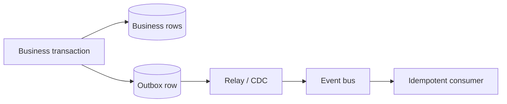

Metric quan trọng:

- outbox oldest age;
- unpublished row count;
- relay throughput/failure;
- duplicate detection rate;
- consumer lag;
- reconciliation mismatch.

## 15. Tail latency, fan-out và hedged requests

### 15.1 Fan-out khuếch đại tail

Một request gọi song song nhiều shard và chỉ hoàn thành khi tất cả trả lời sẽ kế thừa tail tệ nhất. Nếu xác suất một call con hoàn thành dưới target là `p` và giả sử độc lập, xác suất toàn bộ `n` call cùng đạt target xấp xỉ:

```text
P(all within target) = p^n
```

Với `p = 0.99` và `n = 100`, chỉ khoảng `0.99^100 ≈ 0.366` request tổng hoàn thành trong target. Độc lập là giả định đơn giản; correlated failure thường còn tệ hơn.

### 15.2 Tách queue delay khỏi service time

Tail latency có thể đến từ:

- queue trước worker;
- service time thật;
- dependency fan-out;
- retry/timeout overlap;
- GC/scheduler pause;
- hot shard;
- network retransmit;
- cold cache/cold start.

Span chỉ bắt đầu khi handler chạy sẽ bỏ queue delay. Propagate deadline và timestamp ở admission point để giữ full path.

### 15.3 Hedged request

Hedging gửi request thứ hai khi request đầu vượt một delay percentile, lấy kết quả hợp lệ đầu tiên. Nó giảm tail khi straggler hiếm và còn capacity, nhưng tăng load chính lúc hệ thống có thể đang chậm.

Chỉ dùng khi:

- operation idempotent hoặc read-only;
- hedge có budget toàn cục;
- khác replica/failure domain hợp lý;
- request thua được cancel;
- overload detector có thể tắt hedge;
- đo extra load và win rate.

Không hedge write không idempotent hoặc dependency đang bão hòa.

## 16. Admission control, load shedding và retry budget

### 16.1 Queue hữu hạn bảo vệ latency

Queue vô hạn biến overload thành memory pressure và latency không giới hạn. Một hệ thống khỏe phải có capacity contract:

- concurrency tối đa;
- queue size/wait tối đa;
- deadline;
- rejection semantics;
- priority/fairness;
- retry policy.

Little's Law cho trạng thái ổn định:

```text
L = λ × W
```

Với arrival rate `λ` không đổi, thời gian `W` tăng sẽ làm work-in-system `L` tăng. Nếu capacity không theo kịp, queue tự khuếch đại.

### 16.2 Admission ở đâu?

| Lớp | Ưu điểm | Rủi ro |
|---|---|---|
| edge/gateway | loại tải sớm, policy tenant | thiếu context sâu |
| service | biết route/cost/dependency | request đã tiêu network/CPU phía trước |
| worker queue | bảo vệ executor | có thể queue quá lâu |
| database | giữ correctness cuối cùng | quá muộn; toàn path đã chịu tải |

Thường cần nhiều lớp với budget nhất quán, không phải một rate limit duy nhất.

### 16.3 Load shedding có chủ đích

Shedding tốt ưu tiên giữ work quan trọng và trả lỗi nhanh, có thể retry có kiểm soát. Cần xác định:

- critical vs optional traffic;
- tenant fairness;
- stale/read-only/degraded response có hợp lệ không;
- `Retry-After` hoặc backoff hint;
- queue age thay vì chỉ queue length;
- audit cho request bị shed.

HTTP `503` nhanh có thể tốt hơn timeout 30 giây nếu client hiểu contract. Nhưng nếu mọi client retry đồng thời, rejection lại thành retry storm.

### 16.4 Retry budget

Retry phải là phần nhỏ có giới hạn của request volume, không phải multiplier vô hạn.

Ví dụ policy:

```text
allowed_retry_rate <= min(
  fixed_retry_cap,
  retry_ratio * successful_original_rate
)
```

Kết hợp:

- exponential backoff;
- jitter;
- deadline propagation;
- retry only on classified transient failure;
- max attempt và max elapsed time;
- token bucket/budget;
- circuit breaker/adaptive concurrency.

### 16.5 Overload decision flow

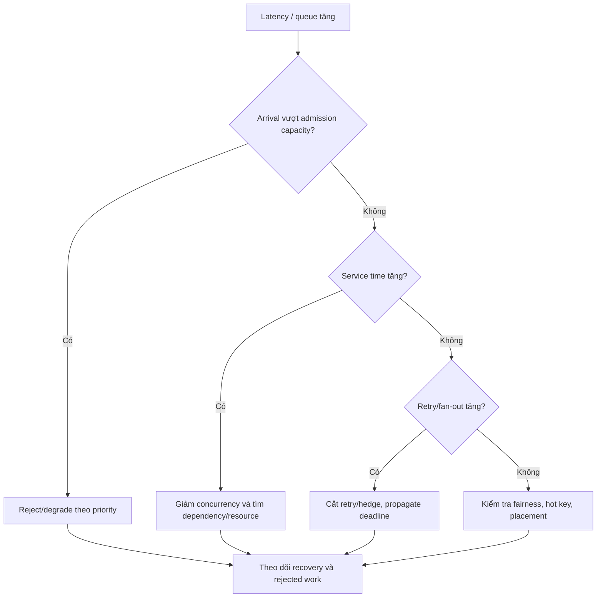

> [!IMPORTANT]
> Autoscaling phản ứng chậm hơn admission control và không tạo capacity cho dependency đã bão hòa. Trong overload, scale-out có thể tăng connection, cache miss và retry lên backend. Guardrail phải tồn tại trước scaler.

---

**Checkpoint Section 4:** distributed correctness cần term, quorum, idempotency và fencing; overload safety cần queue hữu hạn, deadline, admission và retry budget. “Thêm replica” không thay thế các contract này.

---

# SECTION 5 — KUBERNETES CONTROL PLANE, PLACEMENT VÀ IDENTITY

## 17. Kubernetes control-plane failure mechanics

### 17.1 Reconciliation là eventually convergent

Kubernetes controller quan sát desired state và actual state, rồi lặp lại reconcile. `kubectl apply` thành công chỉ cho biết API server chấp nhận object; nó không bảo đảm Pod đã schedule, image đã pull, volume đã attach hay endpoint đã nhận traffic.

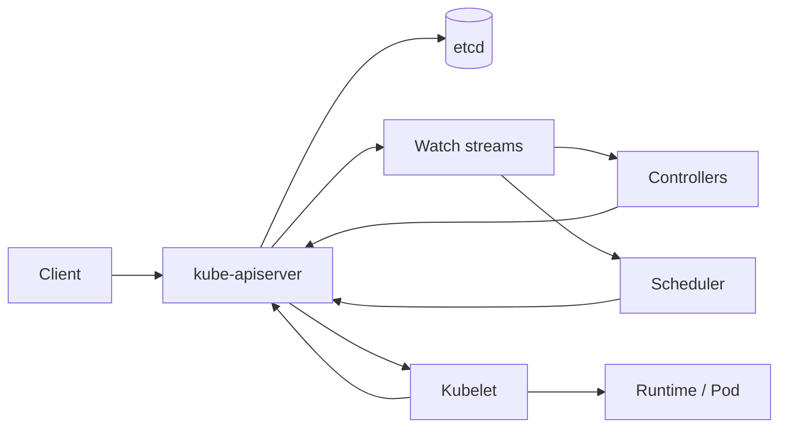

Điều tra phải xác định state đang kẹt ở boundary nào:

1. admission/API write;
2. etcd commit;
3. watch delivery/cache;
4. controller work queue;
5. scheduling;
6. kubelet/runtime;
7. network/volume readiness;
8. endpoint propagation.

### 17.2 API server và etcd overload

Các nguồn tải thường bị bỏ sót:

- client list toàn bộ resource thay vì list có selector;
- watch reconnect storm sau network issue;
- controller hot loop vì object không hội tụ;
- CRD object lớn hoặc status update quá thường xuyên;
- audit webhook chậm;
- admission webhook gọi dependency ngoài;
- lease/heartbeat volume lớn;
- mass rollout/delete tạo write burst.

Evidence pack:

- API request rate/latency theo verb, resource, client và response code;
- inflight requests và priority/fairness queue;
- watch count, termination và relist;
- etcd commit/apply latency, DB size, leader change;
- admission latency/failure theo webhook;
- controller queue depth, oldest work age và reconcile error.

Không restart toàn control plane khi chưa biết dependency graph. Restart đồng thời có thể làm mất cache, gây relist storm và tăng tải etcd.

### 17.3 Watch staleness và propagation delay

Control plane có thể healthy ở mức request nhưng data plane nhận state chậm. Ví dụ Pod ready nhưng endpoint, proxy rule hoặc DNS record chưa propagate. Đo timeline bằng resource version và timestamp tại từng hop:

```text
Pod Ready
  -> EndpointSlice updated
  -> node/proxy consumed update
  -> load balancer target healthy
  -> first successful real request
```

Một metric deploy duration chung không cho biết hop nào chậm.

### 17.4 Admission webhook là dependency trong write path

Webhook chậm hoặc không reachable có thể chặn deploy toàn cluster. Với mỗi webhook cần rõ:

- timeout;
- failure policy;
- scope/selector tối thiểu;
- replica và failure-domain placement;
- dependency có vòng lặp không;
- certificate rotation;
- bypass/break-glass được audit.

`Fail` bảo vệ policy nhưng giảm availability; `Ignore` giữ availability nhưng có thể bỏ guardrail. Quyết định theo loại policy, không dùng một default cho mọi webhook.

## 18. Scheduling, placement, disruption và rollout safety

### 18.1 Pending Pod là kết quả của constraint intersection

Scheduler phải tìm node thỏa đồng thời:

- resource request;
- node selector/affinity;
- taint/toleration;
- topology spread;
- volume topology;
- device/GPU availability;
- inter-Pod affinity/anti-affinity;
- policy/plugin constraint.

Mỗi constraint riêng có vẻ hợp lý nhưng giao của chúng có thể rỗng. Capacity dashboard tổng cluster không chứng minh có **feasible capacity**.

Đo unschedulable reason, pending age, feasible node count và fragmentation theo resource vector. CPU còn nhiều không giúp Pod cần GPU, huge page hoặc memory contiguous cụ thể.

### 18.2 Resource fragmentation

Ví dụ ba node mỗi node còn 2 CPU và 4 GiB; tổng còn 6 CPU/12 GiB nhưng Pod cần 4 CPU/2 GiB vẫn không schedule được. Cluster autoscaler phải hiểu shape của Pod, node group constraint và startup time.

Mitigation:

- right-size request dựa trên percentile và risk;
- đa dạng node shape có chủ đích;
- defragment bằng rescheduling có budget;
- tách workload đặc thù;
- ưu tiên/queue thay vì preempt bừa bãi.

### 18.3 PDB không bảo vệ mọi loại outage

PodDisruptionBudget giới hạn một số **voluntary disruptions** qua eviction API. Nó không ngăn node crash, OOM, application failure, direct Pod delete hoặc rollout bug. PDB quá chặt có thể chặn node drain/upgrade và kéo dài security exposure.

Đánh giá PDB cùng:

- replica thật sự available;
- zone distribution;
- startup/readiness time;
- capacity để reschedule;
- dependency quorum;
- maintenance timeout và escalation.

### 18.4 Rollout là một control loop

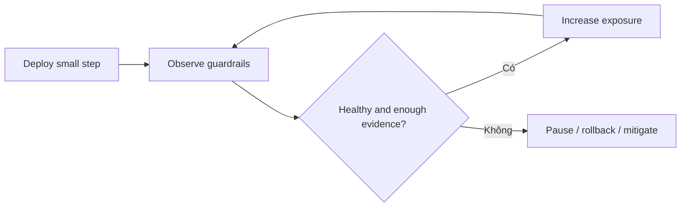

Guardrail tốt gồm cả:

- error/latency/saturation;
- restart/readiness;
- dependency pressure;
- business invariant;
- traffic sample đủ đại diện;
- version-tagged telemetry;
- rollback viability.

Nếu metric không gắn version, canary nhỏ có thể bị signal của stable fleet che mất. Nếu rollback database/schema không tương thích, “rollback tự động” có thể nguy hiểm hơn pause.

### 18.5 Termination path và connection draining

Một Pod dừng sạch cần phối hợp:

1. ngừng nhận work mới;
2. endpoint/load balancer nhận trạng thái draining;
3. request đang chạy có deadline để hoàn tất;
4. consumer dừng lấy message mới và commit offset đúng;
5. application flush state cần thiết;
6. process thoát trước grace period;
7. hard kill chỉ là phương án cuối.

Đừng dùng `preStop: sleep` như contract duy nhất. Đo propagation delay và active request thực tế.

## 19. Identity, certificate và secret delivery path

### 19.1 Identity là runtime dependency

Một request thành công có thể cần chuỗi:

```text
workload identity
  -> token projection/refresh
  -> metadata or identity provider
  -> STS/token exchange
  -> policy evaluation
  -> certificate/key/secret
  -> target authorization
```

Failure ở chuỗi này thường trông giống network hoặc application error: `401`, `403`, TLS failure, credential timeout hay sudden retry.

### 19.2 Token và certificate rotation

Rotation an toàn yêu cầu producer và consumer chấp nhận overlap hợp lý. Các failure mode:

- process đọc secret chỉ lúc start;
- file update atomic nhưng application giữ file descriptor cũ;
- trust bundle mới rollout sau leaf certificate;
- token refresh cùng lúc tạo thundering herd;
- clock skew làm token chưa có hiệu lực/hết hạn;
- cache credential giữ quá TTL;
- fallback dùng credential quyền rộng hơn.

Metric/evidence:

- expiry horizon distribution;
- refresh success/latency/reason;
- credential age trong process;
- issuer, audience, subject và policy version;
- auth failure theo workload/route;
- clock health;
- rollout timeline của trust và leaf.

### 19.3 Secret delivery và blast radius

Secret manager outage không nên khiến mọi replica restart đồng thời. Thiết kế cần quyết định:

- credential hiện tại dùng được bao lâu;
- cache encrypted/local có chấp nhận không;
- fail-open/fail-closed theo operation;
- refresh jitter;
- emergency rotation;
- audit và revocation;
- dependency nào dùng chung identity path.

Không log token/secret để debug. Log metadata không nhạy cảm như issuer, key ID, expiry, policy decision ID và reason code.

### 19.4 Authorization regression

Authn trả lời “bạn là ai”; authz trả lời “bạn được làm gì”. Một policy rollout có thể chỉ chặn tenant, route hoặc action cụ thể.

Điều tra theo differential dimensions:

- principal/workload identity;
- resource/action;
- tenant/account;
- policy version;
- region/cluster;
- cached vs fresh decision;
- deny reason.

Mitigation không phải luôn tắt authz. Có thể rollback policy, giới hạn exception theo principal/action/time, hoặc chuyển read-only degraded mode. Break-glass phải time-bound và audit.

### 19.5 Kubernetes investigation matrix

| Symptom | Boundary cần kiểm tra | Evidence quyết định |
|---|---|---|
| apply chậm/lỗi | API/admission/etcd | verb-resource-client latency, webhook phase |
| Pod Pending | scheduler constraints | unschedulable reason + feasible capacity |
| Pod Ready nhưng chưa có traffic | endpoint/data-plane propagation | resource-version timeline |
| rollout tạo 502 | draining/readiness/LB | last-new-request vs termination timeline |
| credential lỗi theo đợt | refresh/rotation/clock | expiry cohort + issuer/policy version |
| drain bị kẹt | PDB/capacity/volume | eviction reason + replacement feasibility |

---

**Checkpoint Section 5:** Kubernetes là nhiều reconciliation loop ghép lại; identity là một distributed dependency. Điều tra theo state transition và propagation boundary, không theo một nhãn chung như “cluster issue”.

---

# SECTION 6 — AI INFRASTRUCTURE VÀ SYSTEM SYNTHESIS

## 20. GPU memory hierarchy và interconnect

### 20.1 GPU utilization không mô tả bottleneck

GPU workload có thể bị giới hạn bởi compute, device memory bandwidth, host-to-device transfer, inter-GPU communication, kernel launch overhead hoặc input pipeline. Một gauge utilization cao/thấp không phân biệt các cơ chế này.

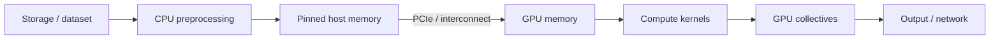

Evidence pack theo stage:

| Stage | Signal |
|---|---|
| input | fetch latency, decode/tokenize time, queue starvation |
| host | CPU, memory bandwidth, pinned-memory pressure |
| transfer | H2D/D2H throughput và wait |
| device memory | allocated/reserved, fragmentation, OOM, bandwidth |
| compute | kernel occupancy, active cycles, tensor/core utilization |
| collective | all-reduce time, retry/error, straggler rank |
| serving | queue, batch size, tokens/s, time-to-first-token |

### 20.2 OOM không chỉ do model size

Device memory thường chứa:

- model weights;
- optimizer state/gradient khi training;
- activations;
- KV cache khi inference;
- temporary workspace;
- communication buffer;
- allocator reserved blocks;
- CUDA graph hoặc runtime cache.

Peak phụ thuộc sequence length, batch composition, concurrency và algorithm. Average allocated memory không bắt được transient peak. Group OOM theo request shape và allocator state.

### 20.3 Fragmentation và allocator behavior

Tổng free memory có thể đủ nhưng không có block phù hợp. Restart “chữa” tạm thời vì reset allocator, che fragmentation. Evidence cần allocated vs reserved, block histogram nếu runtime có, allocation failure size và sequence/batch timeline.

Mitigation:

- bucket request theo size;
- giới hạn max sequence/context;
- tune allocator có kiểm chứng;
- preallocate/pool buffer;
- giảm batch/concurrency;
- dùng quantization/offload khi quality/SLO cho phép;
- restart có kiểm soát chỉ như recovery, không coi là root-cause fix.

### 20.4 Multi-GPU và straggler

Synchronous collective hoàn thành theo rank chậm nhất. Một GPU chậm vì thermal, ECC, PCIe link, NUMA placement hoặc noisy neighbor có thể kéo cả job.

Đo per-rank:

- step time;
- compute/communication overlap;
- collective latency;
- GPU clock/power/temperature;
- corrected/uncorrected error;
- PCIe/NVLink throughput và replay/error;
- host NUMA/device topology.

Cluster average làm mất straggler. AIOps phải giữ rank, node, device UUID và topology trong identity graph.

## 21. LLM serving: batching, KV cache và queue policy

### 21.1 Hai phase có resource profile khác nhau

- **Prefill:** xử lý prompt, thường parallel và compute-heavy.
- **Decode:** sinh token tuần tự, thường memory-bandwidth/KV-cache sensitive.

Gộp hai phase thành một latency làm mất tín hiệu. SLO nên ít nhất tách:

- queue time;
- time to first token (TTFT);
- inter-token latency (ITL/TPOT);
- end-to-end latency;
- output tokens/s;
- completion/abort rate.

### 21.2 Continuous batching

Batching tăng GPU efficiency nhưng có thể làm request ngắn chờ request dài, hoặc batch lớn chiếm KV cache. Scheduler phải trade-off throughput, fairness và latency.

Các dimension cần giữ:

- prompt tokens;
- requested/max output tokens;
- actual output tokens;
- model/adapter;
- priority/tenant;
- batch membership và size;
- cache hit/prefix reuse;
- admission/rejection reason.

### 21.3 KV cache là capacity động

KV cache tăng theo active sequence và context length. Capacity theo số request là sai khi request length chênh lớn. Admission nên dựa trên token/memory budget dự kiến, có headroom cho fragmentation và runtime workspace.

```text
admit khi:
estimated_KV(request) + current_KV + safety_headroom <= usable_device_memory
```

Estimate phải được hiệu chỉnh bằng actual usage theo model/runtime. Nếu user có thể khai báo output tối đa rất lớn, cần policy/cap thay vì reserve mù toàn bộ hoặc overcommit không giới hạn.

### 21.4 Failure patterns

| Pattern | Dấu hiệu | Mitigation có kiểm soát |
|---|---|---|
| prefill flood | TTFT/queue tăng, decode đang chạy vẫn ổn hơn | tách queue/budget prefill |
| long-context monopolization | KV pressure, request ngắn starvation | size-aware admission/scheduling |
| batch collapse | batch size giảm, tokens/s giảm | kiểm tra traffic shape/scheduler/input |
| cache thrash | prefix hit giảm, HBM churn | routing affinity có bounded skew |
| model cold load | startup và storage/network burst | staged warm-up, capacity reserve |
| rank/device straggler | batch/step chờ một device | isolate/replace device, topology evidence |

### 21.5 LLM overload safety

Khi inference overload, ưu tiên:

1. reject sớm request vượt policy;
2. giới hạn context/output và concurrency theo class;
3. giữ queue age hữu hạn;
4. degrade sang model nhỏ hơn chỉ khi product contract cho phép;
5. không retry generation mù vì vừa tốn chi phí vừa có thể tạo output khác;
6. lưu request ID/idempotency semantics cho operation có side effect;
7. đo quality/safety impact của mọi degraded mode.

---

# SECTION 7 — EVIDENCE GRAPH VÀ INCIDENT PLAYBOOK

## 22. Cross-layer evidence graph

### 22.1 Từ dashboard sang graph giả thuyết

Một dashboard xếp chart cạnh nhau không tự tạo quan hệ nhân quả. Evidence graph cần node identity và edge theo topology/time.

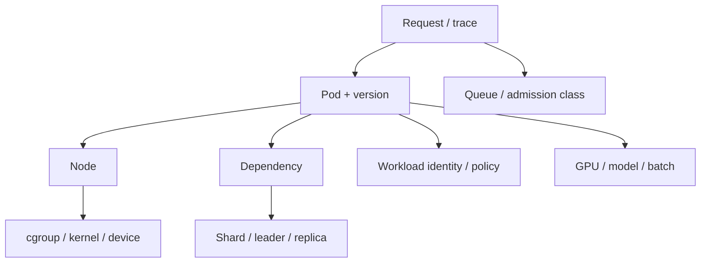

Mỗi evidence item tối thiểu cần:

- event time và ingest time;
- source/collector;
- entity identity ổn định;
- version/config/region/zone;
- measurement unit và aggregation;
- missing-data semantics;
- confidence/quality nếu signal suy ra;
- retention đủ bao phủ incident window.

### 22.2 Correlation dimensions có giá trị cao

Khi một aggregate đổi, slice theo thứ tự:

1. version/change cohort;
2. zone/node/device;
3. route/operation;
4. tenant/request shape;
5. dependency/shard;
6. identity/policy version;
7. success/retry/rejected class.

Không slice vô hạn mọi label. Bắt đầu từ mechanism và failure domain có khả năng phân biệt giả thuyết.

### 22.3 Negative evidence

Evidence “không thấy” chỉ có giá trị khi pipeline quan sát được chứng minh healthy. Không có error log có thể vì:

- process chết trước flush;
- sampling/drop;
- collector/backpressure;
- clock/window sai;
- route không instrument;
- permission/filter;
- failure xảy ra trước application.

Mỗi playbook nên có telemetry health check trước khi dùng absence làm bằng chứng.

### 22.4 Hypothesis ledger

| Trường | Nội dung |
|---|---|
| Hypothesis | cơ chế cụ thể có thể giải thích symptom |
| Supports | evidence hiện tại ủng hộ |
| Contradicts | evidence chống lại |
| Unknown | dữ liệu còn thiếu |
| Discriminating test | phép kiểm chứng tách nó khỏi giả thuyết cạnh tranh |
| Risk | blast radius/cost của test |
| Decision | keep, reject hoặc revise |

Ledger ngăn incident team lặp lại test và giúp AIOps đưa khuyến nghị có thể audit.

## 23. Incident playbooks

### 23.1 Playbook: latency tăng nhưng CPU thấp

1. Xác nhận SLO, route và failure cohort; tách queue/service/dependency time.
2. Kiểm tra event-loop/executor/pool queue và lock wait.
3. Kiểm tra PSI memory/I/O, page fault và storage background work.
4. Kiểm tra connection/TLS/DNS phase và dependency tail.
5. So version, node, NUMA, shard và tenant.
6. Giảm concurrency/admit rate nếu queue đang tăng.
7. Test một giả thuyết bằng canary/profile ngắn; không restart toàn fleet.

### 23.2 Playbook: connection timeout theo đợt

1. Tách DNS, SYN, TLS và request queue.
2. Group theo source node/NAT, destination và route.
3. Kiểm tra conntrack, ephemeral port, TIME_WAIT, LB state và backlog.
4. So connection creation với reuse; tìm deploy đổi keep-alive/pool.
5. Kiểm tra retransmit/MTU nếu phụ thuộc payload/path.
6. Giới hạn outbound concurrency/retry trước khi tăng timeout.
7. Mở rộng NAT/state capacity chỉ khi đã chứng minh exhaustion.

### 23.3 Playbook: database commit p99 tăng

1. Tách lock wait, WAL append/flush, replication ack và queue.
2. Overlay checkpoint, backup, compaction và volume event.
3. Kiểm tra device latency/queue, PSI I/O và cgroup throttle.
4. Group theo shard/leader/zone; kiểm tra leader churn.
5. Giảm ingest hoặc concurrency có ưu tiên.
6. Không hạ durability/replication nếu chưa có risk acceptance rõ.
7. Preserve WAL/term/replica position nếu nghi correctness incident.

### 23.4 Playbook: Kubernetes rollout gây lỗi

1. Freeze rollout; giữ version cohort và change metadata.
2. So canary/stable theo route và request shape.
3. Dựng timeline Pod Ready → EndpointSlice → LB healthy → first traffic.
4. Kiểm tra readiness, draining, connection reuse và dependency pressure.
5. Xác nhận schema/config backward compatibility trước rollback.
6. Rollback/pause theo blast radius nhỏ nhất.
7. Chỉ resume khi guardrail có đủ evidence window.

### 23.5 Playbook: GPU OOM hoặc inference tail tăng

1. Group theo model, device, prompt/output length và batch.
2. Tách queue, prefill, decode và communication.
3. Kiểm tra allocated/reserved/KV/workspace và fragmentation evidence.
4. Kiểm tra device/rank straggler, H2D và input starvation.
5. Hạ batch/concurrency/context theo priority; reject sớm.
6. Restart từng worker chỉ khi cần recovery và đã giữ allocator/device evidence.
7. Xác minh quality/SLO nếu chuyển model hoặc quantization degraded mode.

## 24. Production readiness checklist

### 24.1 Resource và runtime

- [ ] Có queue/concurrency limit hữu hạn tại mọi executor/pool quan trọng.
- [ ] Đo queue delay riêng service time.
- [ ] Có CPU throttling, PSI, lock/runtime lag và OOM reason.
- [ ] Benchmark dùng arrival model phù hợp và tránh coordinated omission.
- [ ] Capacity test giữ request shape và tenant skew thực tế.

### 24.2 Network

- [ ] Tách DNS/TCP/TLS/request phase.
- [ ] Theo dõi conntrack/NAT/port capacity và connection reuse.
- [ ] MTU được kiểm chứng qua overlay/VPN/service mesh path.
- [ ] Load distribution đo theo connection, request và cost.
- [ ] Draining được test bằng traffic thật có deadline.

### 24.3 Storage và data correctness

- [ ] Durability/commit contract được ghi rõ.
- [ ] Theo dõi WAL, checkpoint, compaction và physical amplification.
- [ ] Backup có restore test và RPO/RTO evidence.
- [ ] Retry write dùng idempotency key đúng business intent.
- [ ] Leader/lease path có fencing cho side effect quan trọng.

### 24.4 Distributed overload

- [ ] Deadline được propagate và giảm dần qua call chain.
- [ ] Retry có classification, jitter và budget.
- [ ] Admission/load shedding giữ priority và tenant fairness.
- [ ] Autoscaler không phải guardrail overload duy nhất.
- [ ] Fan-out/hedging có budget và cancel path.

### 24.5 Kubernetes và identity

- [ ] API/admission/controller/scheduler propagation có phase metric.
- [ ] Scheduling constraint được test với feasible capacity.
- [ ] PDB, topology spread và replacement capacity khớp failure model.
- [ ] Token/certificate rotation được test có overlap và jitter.
- [ ] Break-glass time-bound, least-privilege và audit.

### 24.6 AI infrastructure

- [ ] GPU evidence giữ device/rank/topology identity.
- [ ] Serving SLO tách queue, TTFT, inter-token và end-to-end.
- [ ] Admission tính token/KV budget, không chỉ request count.
- [ ] Degraded model/quality path có product acceptance.
- [ ] Device fault, model load và cache warm-up được game day.

## Bài tập thực hành

1. Chọn một service và vẽ request path từ DNS tới storage, ghi queue/state table tại mỗi hop.
2. Tạo hypothesis ledger cho tình huống p99 tăng nhưng CPU dưới 40%; đề xuất ba test có blast radius thấp.
3. Tính fault tolerance của consensus group 3, 4, 5 member và giải thích placement quan trọng hơn member count thế nào.
4. Thiết kế retry budget cho call chain ba tầng có deadline 800 ms.
5. Dựng timeline rollout từ API write đến first successful real request.
6. Với LLM endpoint, thiết kế admission theo token/KV budget và priority tenant.

## Kết luận

System thinking ở production không bắt đầu từ tên công cụ. Nó bắt đầu từ **work đi vào đâu, chờ ở queue nào, dùng capacity nào, chịu policy nào và tạo side effect với correctness contract gì**.

Một điều tra tốt luôn:

1. định vị failure boundary;
2. giữ identity và timeline;
3. nêu nhiều giả thuyết cạnh tranh;
4. chọn evidence có khả năng phân biệt;
5. giảm tải/blast radius trước;
6. bảo vệ durability và security contract;
7. kiểm chứng recovery bằng SLO và business invariant.

## Đọc tiếp

- [Observability](../01-observability/README.vi.md) — biến các cơ chế trong chương thành telemetry contract.
- [Telemetry Data Plane](../06-data-plane/README.vi.md) — giữ identity, time và data quality xuyên pipeline.
- [Topology & Change](../08-topology-change/README.vi.md) — xây dependency/change graph cho correlation.
- [Root Cause Analysis](../11-root-cause-analysis/README.vi.md) — xếp hạng giả thuyết bằng evidence.
- [Investigation Engine](../12-investigation-engine/README.vi.md) — vận hành hypothesis ledger có kiểm soát.
- [Remediation Safety](../13-remediation-safety-engine/README.vi.md) — biến mitigation thành hành động có gate và rollback.
